# Sonstige · Prompt-Bibliothek · Leadde.ai

[](README.md) [](README_zh.md) [](README_zh-TW.md) [](README_ja-JP.md) [](README_ko-KR.md) [](README_th-TH.md) [](README_vi-VN.md) [](README_hi-IN.md) [](README_es-ES.md) [-lightgrey)](README_es-419.md) [](README_de-DE.md) [](README_fr-FR.md) [](README_it-IT.md) [-lightgrey)](README_pt-BR.md) [](README_pt-PT.md) [](README_tr-TR.md)

**Best for:** Emerging visual AI prompts awaiting model verification, preserved with source attribution for early research.

For PDF, PPT, SOP, training, and multilingual video workflows:
[Awesome Document-to-Video](https://github.com/LeaddeOpenLab/awesome-document-to-video)

> **Hochwertige Prompts, täglich kuratiert**

Entdecke vollständige Prompts für KI-Bilder, Videos und 3D. Stöbere nach Stil, lies mehrsprachige Fassungen und finde die ursprünglichen Urheber und Quellen.

[Leadde.ai entdecken →](https://leadde.ai/?utm_source=github&utm_medium=readme&utm_campaign=prompt-library&utm_content=uncategorized)

## Leadde.ai kennenlernen

Leadde.ai hilft Teams, Dokumente, Folien und Texte in KI-Geschäftsvideos für Schulungen, Onboarding und Marketing umzuwandeln.

Gib diesem Repository einen Stern, um unsere tägliche Prompt-Auswahl und neue kreative Ideen zu verfolgen.

**81** Prompts · Zuletzt hinzugefügt: **2026-09-11**

<a name="catalog"></a>

## Nach Kategorie durchsuchen

[Fotografie](#category-photography) · [Kinematisch / Filmstill](#category-cinematic-film-still) · [Anime / Manga](#category-anime-manga) · [Illustration](#category-illustration) · [Skizze / Strichzeichnung](#category-sketch-line-art) · [Comic / Graphic Novel](#category-comic-graphic-novel) · [3D-Rendering](#category-3d-render) · [Retro / Vintage](#category-retro-vintage) · [Cyberpunk / Sci-Fi](#category-cyberpunk-sci-fi) · [Minimalismus](#category-minimalism) · [Sonstige](#category-other)

<a name="all-prompts"></a>

<a name="category-photography"></a>

## Fotografie

<a name="prompt-2098490558474027231"></a>

### Übersetzung läuft

Autor：[@FuguiChen1314](https://x.com/FuguiChen1314) · [Originalbeitrag](https://x.com/FuguiChen1314/status/2098490558474027231)

Fotografie · Porträt / Selfie · Modeartikel · Veröffentlicht

**Zusammenfassung:** Übersetzung läuft

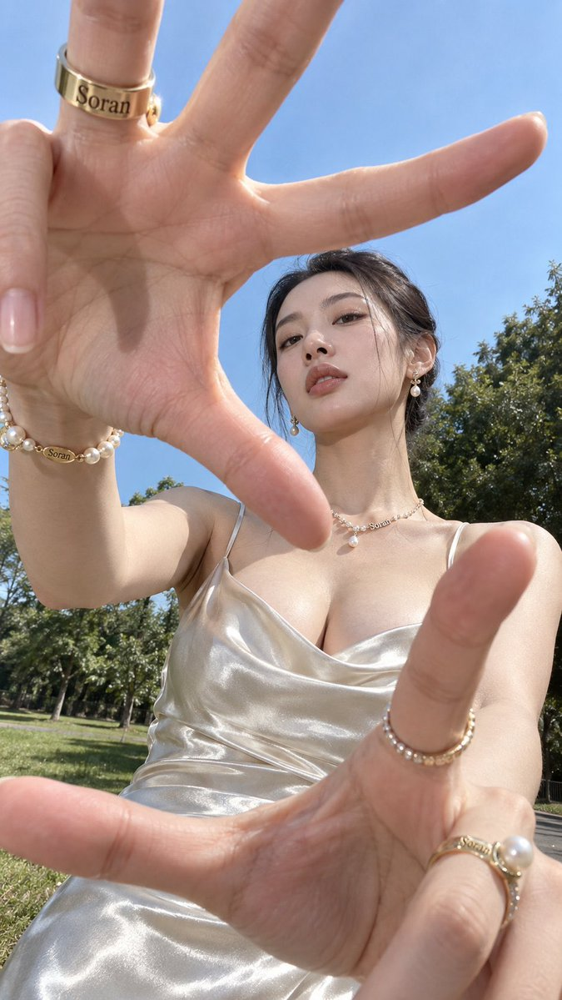

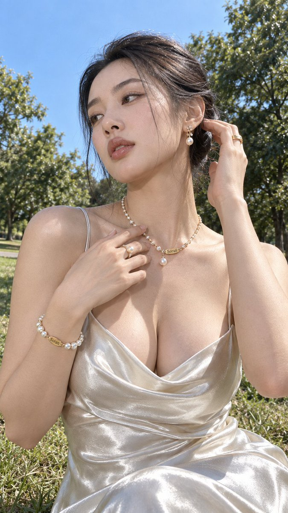

**Prompt**

```text
Übersetzung läuft
```

[↑ Zurück zu Kategorien](#catalog)

---

<a name="prompt-2098398277095821330"></a>

### Fotorealistischer Prompt für ein Ganzkörper-Street-Fashion-Porträt eines stilvollen schwarzen Mannes im kamelfarbenen Mantel, der durch die Innenstadt von Philadelphia geht.

Autor：[@PrometheanAIX](https://x.com/PrometheanAIX) · [Originalbeitrag](https://x.com/PrometheanAIX/status/2098398277095821330)

Fotografie · Porträt / Selfie · Charakter · Modeartikel · Stadtbild / Straße · Veröffentlicht

Originalbeitrag：[@PrometheanAIX](https://x.com/PrometheanAIX) · [Originalbeitrag](https://x.com/PrometheanAIX/status/2098384758145257614)

**Zusammenfassung:** Fotorealistischer Prompt für ein Ganzkörper-Street-Fashion-Porträt eines stilvollen schwarzen Mannes im kamelfarbenen Mantel, der durch die Innenstadt von Philadelphia geht.

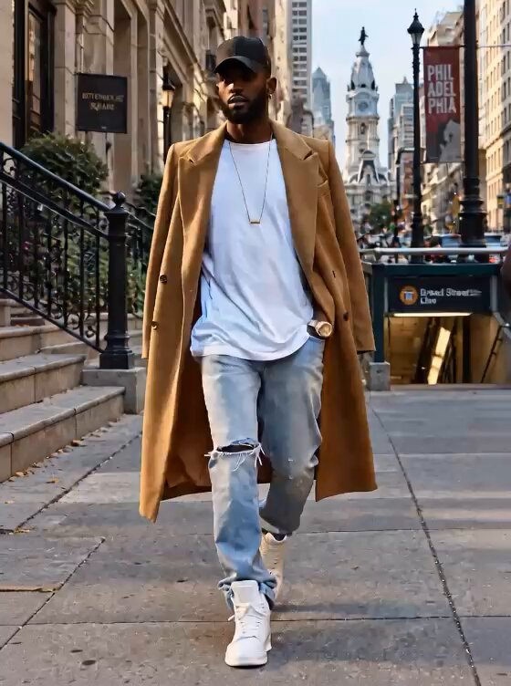

**Prompt**

```text
Erstelle ein ultrafotorealistisches Ganzkörper-Street-Fashion-Porträt eines markant gutaussehenden schwarzen Mannes, der selbstbewusst auf einem Gehweg in der Innenstadt von Philadelphia auf die Kamera zugeht. Er hat einen athletischen, maskulinen Körperbau, kurzes dunkles Haar unter einer eng anliegenden schwarzen Baseballkappe, einen gepflegten Vollbart, einen kleinen Creolen-Ohrring und einen ruhigen, ernsten Gesichtsausdruck. Outfit: Er trägt einen langen kamelfarbenen Wollmantel mit breitem Revers, offen über einem schlichten weißen Oversized-T-Shirt. Dazu eine lockere hellblaue Jeans mit Waschung, einschließlich eines großen ausgefransten Risses an einem Knie und dezenten Distressed-Details. Abgerundet wird das Outfit mit sauberen weißen High-Top-Sneakern, einer langen minimalistischen Halskette mit Goldanhänger, einem kleinen Ohrring und einer massiven goldenen Armbanduhr. Der Look ist gehobene zeitgenössische Streetwear mit einer mühelosen maskulinen Note. Pose: Halte ihn mitten im Schritt fest, wie er direkt auf die Kamera zugeht, eine Hand lässig in der Jeanstasche, während der andere Arm natürlich hängt. Sein Mantel fällt offen und bewegt sich sanft mit seinen Schritten. Er blickt leicht an der Kamera vorbei mit einer entspannten, selbstsicheren Körpersprache. Umgebung: Platziere die Szene in Center City Philadelphia, mit historischen Steingebäuden, Stadthaustreppen, schwarzen schmiedeeisernen Geländern, Grünflächen, Straßenlaternen, Verkehr, Fußgängern und einem U-Bahn-Eingang an der Broad Street. Die Philadelphia City Hall und ihr Uhrturm sind in der Ferne deutlich erkennbar, was dem Foto eine unverwechselbare Philadelphia-Identität verleiht, während es sich dennoch wie ein natürlicher Moment in der Stadt anfühlt. Fotografie & Kinematographie: Verwende erstklassige zeitgenössische Street-Fashion-Fotografie, vollständiges Framing von Kopf bis Fuß, Augenhöhenperspektive und den Look eines 50–70-mm-Objektivs. Warmes spätnachmittägliches Sonnenlicht erzeugt wunderschöne Glanzlichter entlang des Kamelhaarmantels und natürliches, dimensionales Licht im Gesicht. Halte das Motiv gestochen scharf mit kontrollierter Hintergrundtrennung, realistischer Haut- und Bartstruktur, detaillierter Wolle und Denim, natürlicher Stadttiefe, feinem fotografischem Korn und exquisitem redaktionellem Color Grading. Vermeiden: plastische oder künstliche Haut, übermäßige Retusche, übertriebene Muskeln, übermäßig formelles Styling, übermäßige Logos, steifes Posieren, leere Straßen, künstliche Wahrzeichen, übermäßiges Bokeh, CGI-Erscheinung, Übersättigung oder Modepuppen-Ästhetik.
```

[↑ Zurück zu Kategorien](#catalog)

---

<a name="prompt-2098396584879002102"></a>

### Prompt-Vorlage zur Erstellung eines realistischen Werbeplakats für Teilnehmer der brasilianischen Reality-Show A Fazenda 18 aus einem persönlichen Selfie, einschließlich Teilnehmerprofilfeldern und festgelegten Farbrichtlinien.

Autor：[@balancogeral](https://x.com/balancogeral) · [Originalbeitrag](https://x.com/balancogeral/status/2098396584879002102)

Plakat / Flyer · Fotografie · Porträt / Selfie · Veröffentlicht

**Zusammenfassung:** Prompt-Vorlage zur Erstellung eines realistischen Werbeplakats für Teilnehmer der brasilianischen Reality-Show A Fazenda 18 aus einem persönlichen Selfie, einschließlich Teilnehmerprofilfeldern und festgelegten Farbrichtlinien.


**Prompt**

```text
Verwandle mein Selfie in ein realistisches Werbeporträt eines Teilnehmers von A Fazenda 18. Füge [NOME], [CIDADE], Slogan, Stärke, Schwäche und die Chance auf das Erreichen des Finales hinzu. Bewahre mein Gesicht und mein natürliches Aussehen originalgetreu. Foto im Format 4:5, spontane Pose, direkter Blick, dezenter ländlicher Hintergrund, sanftes Licht, echte Hauttextur und asymmetrische redaktionelle Bildkomposition. Farbpalette: Pfirsichbeige #f2ceb0, Aquagrün #00ad9d und Orange #e98300. Wenig Text, natürlicher Look, ohne übermäßige Retusche, Effekte, erfundene Logos oder das Aussehen eines KI-generierten Bildes.
```

[↑ Zurück zu Kategorien](#catalog)

---

<a name="prompt-2098338457491800556"></a>

### Prompt zur Generierung eines realistischen Animationsvideos, in dem ein Goldbarren im Schlamm keimt, zu einem riesigen, mit Goldbarren behangenen Baum heranwächst und anschließend Arbeiter eintreffen, um sie zu ernten und auf einen Lastwagen zu verladen.

Autor：[@abs\_uiux](https://x.com/abs_uiux) · [Originalbeitrag](https://x.com/abs_uiux/status/2098338457491800556)

Fotografie · Charakter · Veröffentlicht

**Zusammenfassung:** Prompt zur Generierung eines realistischen Animationsvideos, in dem ein Goldbarren im Schlamm keimt, zu einem riesigen, mit Goldbarren behangenen Baum heranwächst und anschließend Arbeiter eintreffen, um sie zu ernten und auf einen Lastwagen zu verladen.

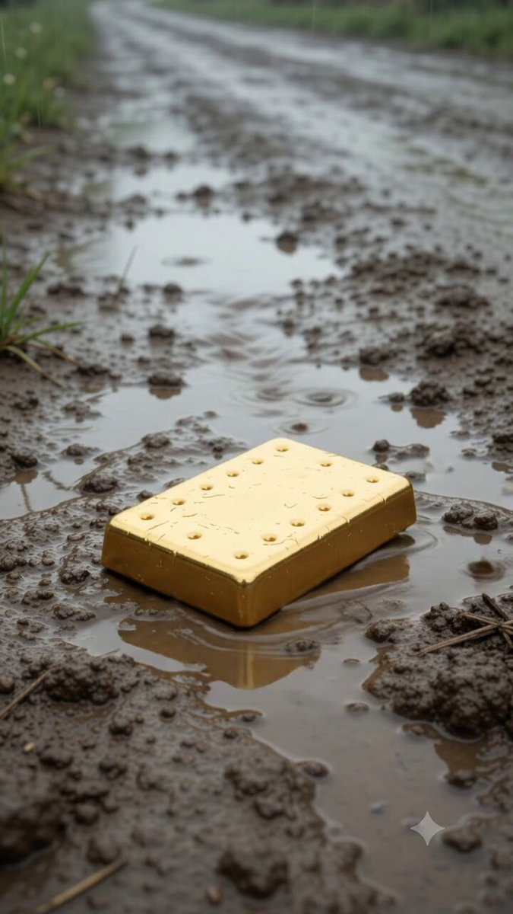

**Prompt**

```text
Erstelle ein 10-sekündiges, ultrafotorealistisches, filmisches vertikales Video (9:16).
Ein realistischer Goldbarren liegt nach heftigen Regenfällen verlassen am schlammigen Straßenrand. Regenwasser fließt um ihn herum, während das Objekt langsam tief im nassen Boden versinkt. Innerhalb von Sekunden beginnt das vergrabene Objekt aus dem Untergrund zu leuchten. Ein winziger grüner Spross bricht genau an dieser Stelle hervor und wächst rasch zu einem riesigen, ausgewachsenen Goldbarrenbaum heran. Der dicke Stamm und die Äste ähneln auf natürliche Weise der Form, Textur, den Farben und der Formensprache des ursprünglichen Goldbarrens. Hunderte vollständig detaillierte, reife Goldbarren hängen wie echte Früchte an jedem Ast und wiegen sich sanft im Wind.
Unmittelbar nachdem der Baum ausgewachsen ist, trifft ein großer Lastwagen ein und hält daneben an. Ein Arbeiter klettert schnell auf den Baum, während mehrere andere zügig jeden Goldbarren von den Ästen ernten und sie mit schnellen, realistischen Bewegungen auf die Ladefläche des Lastwagens werfen. Binnen weniger Augenblicke ist der Baum komplett abgeerntet. Der Lastwagen wird voll mit Hunderten von Goldbarren beladen und fährt davon, wobei nur der leere Baum zurückbleibt.
Einzelne durchgehende Aufnahme, realistisches Regenwetter, schlammiger Boden, filmische Beleuchtung, natürlicher Wind, glaubwürdige Physik, ultradetaillierte Texturen, flüssige Wachstumsanimation, nahtlose Transformation, keine Schnitte, keine Glitches, kein Flackern, keine zusätzlichen Objekte, 8K, HDR, hyperrealistisch, Realismus im Dokumentarfilmstil." Hinweis: Der Goldbarren muss von Anfang bis Ende gleich sein; wenn sie rechteckig sind, müssen alle rechteckig und realistisch sein
```

[↑ Zurück zu Kategorien](#catalog)

---

<a name="prompt-2098291700355432939"></a>

### Stilvolles Porträt einer jungen Frau auf dem Vordersitz eines Autos, gekleidet in einen schwarzen Blazer und helle Jeans, umgeben von brauner Lederausstattung und sanftem Naturlicht.

Autor：[@afrinxai](https://x.com/afrinxai) · [Originalbeitrag](https://x.com/afrinxai/status/2098291700355432939)

Fotografie · Porträt / Selfie · Charakter · Modeartikel · Fahrzeug · Veröffentlicht

Originalbeitrag：[@afrinxai](https://x.com/afrinxai) · [Originalbeitrag](https://x.com/afrinxai/status/2098230798759457070)

**Zusammenfassung:** Stilvolles Porträt einer jungen Frau auf dem Vordersitz eines Autos, gekleidet in einen schwarzen Blazer und helle Jeans, umgeben von brauner Lederausstattung und sanftem Naturlicht.

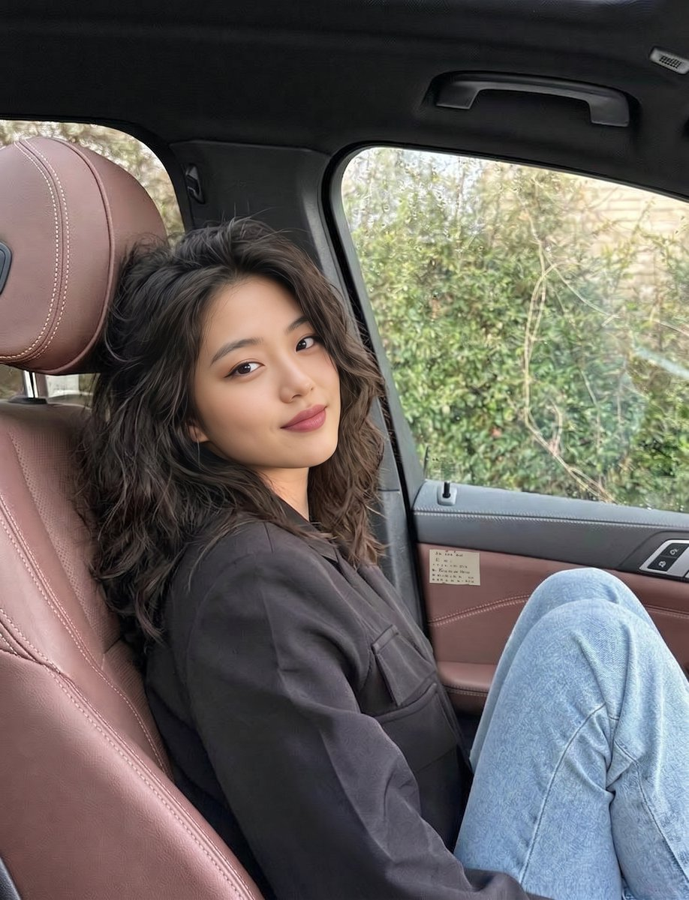

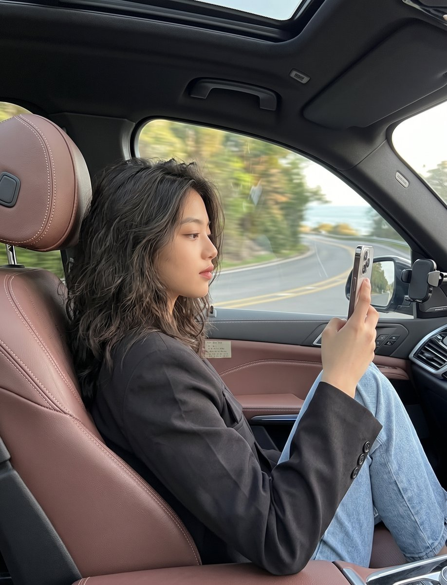

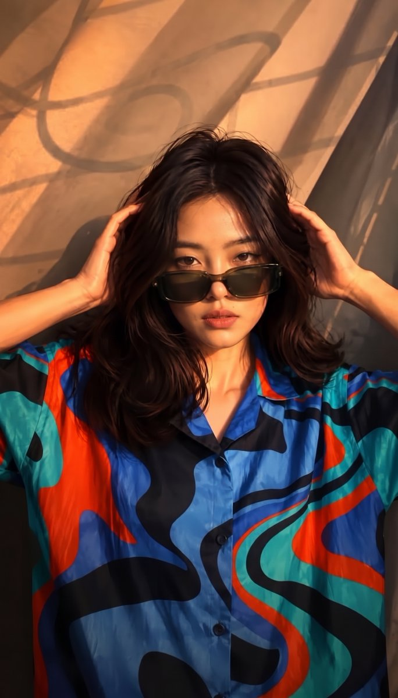

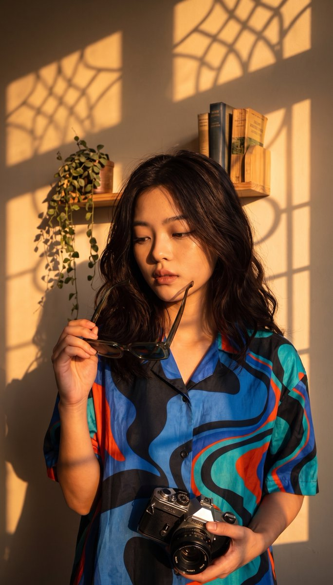

**Prompt**

```text
Verwenden Sie das hochgeladene Foto als Referenz für die Gesichtsidentität einer erwachsenen Frau. Bewahren Sie ihre erkennbaren Gesichtszüge, den natürlichen Hautton, die Gesichtsproportionen und das Gesamterscheinungsbild. Ein schickes und stilvolles Porträt einer jungen Frau mit langem, dunkelbraunem, welligem Haar, die selbstbewusst direkt in die Kamera blickt. Sie sitzt bequem auf dem Vordersitz eines Autos mit brauner Lederpolsterung und lehnt sich an die Kopfstütze an. Ihr Outfit besteht aus einem maßgeschneiderten schwarzen Blazer mit steigendem Revers, einem sichtbaren Knopf vorne und einer Brusttaschenklappe, kombiniert mit einer hoch taillierten Jeans aus hellem Denim. Der Fokus liegt scharf auf ihrem Gesichtsausdruck und den Texturen ihres schwarzen Blazers und der Jeans. Ihre Beine sind entspannt, wobei die helle Jeans deutlich sichtbar ist. Der Innenraum des Autos zeigt braune Ledersitze mit hellen Nähten und eine schwarze Türverkleidung. Durch das Autofenster ist ein unscharfer Hintergrund aus grünen Bäumen und Büschen zu sehen. Das natürliche Tageslicht ist weich und schmeichelhaft. Die Komposition ist eine Halbnaheinstellung mit geringer Schärfentiefe, die die Fahrzeugdetails und den Hintergrund in sanfter Unschärfe wiedergibt. Die Fotoqualität ist hochauflösend, mit natürlichen Farben und Texturen.
```

[↑ Zurück zu Kategorien](#catalog)

---

<a name="prompt-2098283754599174194"></a>

### Übersetzung läuft

Autor：[@muse\_ai\_prompt](https://x.com/muse_ai_prompt) · [Originalbeitrag](https://x.com/muse_ai_prompt/status/2098283754599174194)

Fotografie · Porträt / Selfie · Charakter · Veröffentlicht

**Zusammenfassung:** Übersetzung läuft


**Prompt**

```text
Übersetzung läuft
```

[↑ Zurück zu Kategorien](#catalog)

---

<a name="prompt-2097889772899639317"></a>

### Übersetzung läuft

Autor：[@Soranlan](https://x.com/Soranlan) · [Originalbeitrag](https://x.com/Soranlan/status/2097889772899639317)

Fotografie · Porträt / Selfie · Charakter · Modeartikel · Veröffentlicht

Originalbeitrag：[@Soranlan](https://x.com/Soranlan) · [Originalbeitrag](https://x.com/Soranlan/status/2081181748478562704)

**Zusammenfassung:** Übersetzung läuft


**Prompt**

```text
Übersetzung läuft
```

[↑ Zurück zu Kategorien](#catalog)

---

<a name="prompt-2097888970994495736"></a>

### Generiere mich, wie ich mich mit dem Rücken zur Kamera aufsetze, dann aufstehe und mich umdrehe, um ein paar Liegestütze zu machen

Autor：[@RSOXART](https://x.com/RSOXART) · [Originalbeitrag](https://x.com/RSOXART/status/2097888970994495736)

Fotografie · Veröffentlicht

**Zusammenfassung:** Generiere mich, wie ich mich mit dem Rücken zur Kamera aufsetze, dann aufstehe und mich umdrehe, um ein paar Liegestütze zu machen


**Prompt**

```text
Generiere mich, wie ich mich mit dem Rücken zur Kamera aufsetze, dann aufstehe und mich umdrehe, um ein paar Liegestütze zu machen
```

[↑ Zurück zu Kategorien](#catalog)

---

<a name="prompt-2097892780052013289"></a>

### Realistisches Studioporträt einer jungen Frau mit haselnussgrünen Augen, Hochsteckfrisur und weißem Rüschenkleid.

Autor：[@oju689](https://x.com/oju689) · [Originalbeitrag](https://x.com/oju689/status/2097892780052013289)

Fotografie · Porträt / Selfie · Charakter · Modeartikel · Veröffentlicht

**Zusammenfassung:** Realistisches Studioporträt einer jungen Frau mit haselnussgrünen Augen, Hochsteckfrisur und weißem Rüschenkleid.


**Prompt**

```text
Ultrarealistisches Nahaufnahme-Porträt einer wunderschönen jungen Frau mit natürlichen, zarten Gesichtszügen, weicher, heller Haut mit dezenten Sommersprossen und realistischer Hautstruktur, ausdrucksstarken haselnussgrünen Augen, die leicht zur Seite blicken, natürlich definierten Augenbrauen, sanften rosa Lippen und einem sanften, selbstbewussten Ausdruck. Ihr dunkelbraunes Haar ist zu einer lockeren, eleganten Hochsteckfrisur im Messy-Look gestylt, wobei natürliche, fliegende Strähnen ihr Gesicht umrahmen. Sie trägt ein romantisches, weißes, strukturiertes Kleid mit zarten Rüschen-Kurzärmeln und einem weich gerafften Ausschnitt, kombiniert mit mehrlagigen feinen Goldketten mit winzigen Perlendetails und kleinen Anhängern sowie eleganten Hängeohrringen.

Sanfte, warme, natürliche Studiobeleuchtung, neutraler beiger Hintergrund, dezente Schatten, realistische Gesichtsproportionen, detaillierte Haarsträhnen, authentische Hautporen und Textur, natürliches Make-up, sanftes Rouge, filmische Fotografie, geringe Schärfentiefe, 85-mm-Porträtobjektiv, f/1.8, hoher Dynamikumfang, professionelle redaktionelle Fotografie, fotorealistisch, extrem detailliert, 8K-Qualität, kein CGI oder künstliches Erscheinungsbild.
```

[↑ Zurück zu Kategorien](#catalog)

---

<a name="prompt-2097851840532783565"></a>

### Übersetzung läuft

Autor：[@Live\_life\_style](https://x.com/Live_life_style) · [Originalbeitrag](https://x.com/Live_life_style/status/2097851840532783565)

Fotografie · Charakter · Fahrzeug · Veröffentlicht

**Zusammenfassung:** Übersetzung läuft


**Prompt**

```text
Übersetzung läuft
```

[↑ Zurück zu Kategorien](#catalog)

---

<a name="prompt-2097562587437342750"></a>

### Master-Prompt, der dafür entwickelt wurde, bestehende Wolken in Referenzfotos durch Pareidolie subtil in Tiergestalten zu formen, während realistische Texturen von Smartphone-Fotografie beibehalten werden.

Autor：[@er1029iu](https://x.com/er1029iu) · [Originalbeitrag](https://x.com/er1029iu/status/2097562587437342750)

Fotografie · Tier / Kreatur · Veröffentlicht

**Zusammenfassung:** Master-Prompt, der dafür entwickelt wurde, bestehende Wolken in Referenzfotos durch Pareidolie subtil in Tiergestalten zu formen, während realistische Texturen von Smartphone-Fotografie beibehalten werden.


**Prompt**

```text
WOLKEN-DOPPELGÄNGER — REALFOTO MASTER-PROMPT

Verwende das beigefügte Originalfoto als feste Referenzabbildung.

REFERENZ-SPERRE — SEHR WICHTIG

Das Originalfoto muss erkennbar und visuell konsistent bleiben.

Erhalte:
- den originalen blauen Himmel
- die reale Wolkenverteilung
- den originalen Kamerawinkel
- die diagonalen Oberleitungen
- die Fensterspiegelungen
- die vorhandene natürliche Beleuchtung
- die unvollkommene fotografische Qualität der realen Welt
- die originale Perspektive und Bildkomposition

Ersetze nicht den gesamten Himmel.
Gestalte die Szene nicht neu.
Erstelle keinen völlig neuen Hintergrund.

--------------------------------------------------
SCHRITT 1 — ANALYSE DER ORIGINALWOLKE
--------------------------------------------------

Analysiere zuerst sorgfältig die Hauptwolke auf dem beigefügten Foto.

Untersuche ihre:

- äußere Silhouette
- abgerundeten Massen
- hervorstehenden Bereiche
- engen Abschnitte
- Leerräume
- natürlichen Lichter und Schatten
- Wolkendichte
- Richtung
- visuellen Gesamteindruck

Bestimme dann, welchem realen Tier oder bekannten Lebewesen
die vorhandene Wolke von Natur aus am ähnlichsten sieht.

Die Ähnlichkeit muss AUS DER BESTEHENDEN WOLKENFORM hervorgehen.

Zwinge kein unpassendes Tier in die Wolke hinein.

--------------------------------------------------
SCHRITT 2 — NATÜRLICHE DOPPELGÄNGER-INTERPRETATION
--------------------------------------------------

Verändere nur die Wahrnehmung des Betrachters bezüglich der Wolke.

Die Wolke selbst muss weiterhin wie eine ECHTE WOLKE aussehen.

Nutze die vorhandenen Wolkenmassen als natürliche Struktur von:

Kopf,
Körper,
Ohren,
Schnauze,
Beinen,
Schwanz
oder anderen erkennbaren Merkmalen.

Betone nur Merkmale, die aus der ursprünglichen Wolkensilhouette
bereits natürlich möglich erscheinen.

Die Reaktion des Betrachters sollte sein:

"Moment mal... diese Wolke sieht aus wie ein Tier."

NICHT:

"Jemand hat ein Tier in den Himmel eingefügt."

--------------------------------------------------
ECHTE WOLKE ZUERST
--------------------------------------------------

Visuelle Zielbalance:

90–95 % echte Wolke
5–10 % imaginative Ähnlichkeit

Die Wolke muss vollständig bestehen aus:

realistischem Wasserdampf,
weichen Wolkenpartikeln,
natürlicher atmosphärischer Diffusion,
unregelmäßigen Wolkenrändern,
echtem Sonnenlicht,
subtiler volumetrischer Tiefe.

Erstelle KEINESFALLS:

ein pelziges Tier, das am Himmel schwebt,
ein realistisches Tiergesicht, das in eine Wolke eingefügt wurde,
Cartoon-Augen,
menschenähnliche Augen,
perfekt symmetrische Gesichtszüge,
CGI-Fell,
plastische Texturen,
3D-Maskottchen-Optik.

--------------------------------------------------
GESICHTS- / CHARAKTERDETAILS
--------------------------------------------------

Falls Gesichtsdetails notwendig sind,
müssen sie extrem subtil sein.

Augen sollten hauptsächlich durch
natürliche Wolkenschatten und winzige Tonwertunterschiede angedeutet werden.

Eine Nase oder ein Maul darf sich nur als
sehr schwache Variation der Wolkendichte abzeichnen.

Keine auffälligen schwarzen Knopfaugen.
Kein übertriebenes Lächeln.
Keine Cartoon-Zunge.
Keine künstlichen Gesichtskonturen.

Die Tierähnlichkeit soll durch Pareidolie entstehen.

--------------------------------------------------
ECHTE FOTOQUALITÄT
--------------------------------------------------

Das Endergebnis muss wie
ein spontanes, echtes Foto wirken, das durch ein Fenster aufgenommen wurde.

Natürliches iPhone-Foto.

Realismus einer Smartphone-Kamera mittlerer Qualität,
keine Werbung,
kein Studiofoto.

Behalte bei:

leichte Fensterspiegelung,
kleine Reflexionen,
geringfügige Belichtungsfehler,
natürlichen atmosphärischen Dunst,
leicht ungleichmäßige Schärfe,
realistischen Dynamikumfang,
subtiles Sensorrauschen,
natürliche Farbvariationen.

Vermeide übermäßiges HDR.
Vermeide übermäßiges Nachschärfen.
Vermeide künstliche Sättigung.
```

[↑ Zurück zu Kategorien](#catalog)

---

<a name="prompt-2097519361909199023"></a>

### Fotorealistische Halbnahaufnahme einer Frau, die während des Sonnenuntergangs auf dem Rücken in kristallklarem Wasser treibt.

Autor：[@punkhuri1](https://x.com/punkhuri1) · [Originalbeitrag](https://x.com/punkhuri1/status/2097519361909199023)

Fotografie · Charakter · Landschaft / Natur · Veröffentlicht

**Zusammenfassung:** Fotorealistische Halbnahaufnahme einer Frau, die während des Sonnenuntergangs auf dem Rücken in kristallklarem Wasser treibt.


**Prompt**

```text
Halbnahaufnahme, fotorealistische Kunstfotografie einer erwachsenen Frau, die bei Sonnenuntergang friedlich auf dem Rücken in ruhigem, kristallklarem Wasser treibt.

Sie trägt ein hellblaues Bikini-Oberteil und ein weißes Bikini-Höschen. Ihre Augen sind sanft geschlossen, ihr Gesicht ist nach oben zum Abendhimmel gerichtet und strahlt vollkommene Entspannung aus. Ihr nasses braunes Haar breitet sich natürlich im Wasser um ihren Kopf herum aus. Ein Arm ist natürlich über die Oberfläche ausgestreckt, während ihre Beine unter dem klaren Wasser sanft sichtbar sind.

Das Wasser ist außergewöhnlich klar, mit wunderschönen, wirbelnden Reflexionen von tiefem Blau, Türkis, Blaugrün und warmem Gold, die durch die untergehende Sonne entstehen. Sanfte Wellen und eine subtile Lichtbrechung umgeben ihren Körper und erzeugen das authentische Erscheinungsbild natürlichen Wassers.

Der obere Teil der Bildkomposition zeigt einen leuchtenden Sonnenuntergangshimmel in warmen Orange-, Bernstein- und sanften Gelbtönen, der natürlich in das kühlere blaue und türkisfarbene Wasser darunter übergeht. Das Sonnenlicht der goldenen Stunde erzeugt ein warmes Leuchten in der gesamten Szene und realistische Glanzlichter auf der Wasseroberfläche.

Natürliche Hautstruktur, realistisches nasses Haar, physikalisch akkurate Wasserreflexionen und -brechung, subtile Kräuselungen, lebensechte Beleuchtung und Schatten, realistische fotografische Tiefe, authentische Haut- und Stoffdetails.

Komposition: Halbnahaufnahme mit dem Gesicht und dem Oberkörper der Frau als primärem Fokuspunkt, während genug von ihrem Körper sichtbar bleibt, um die schwebende Haltung erkennbar zu machen. Ausgewogenes Verhältnis zwischen dem warmen Sonnenuntergangshimmel und den farbenfrohen Wasserreflexionen bewahren. Natürliche Perspektive, filmisches Framing, geringe bis mäßige fotografische Schärfentiefe, kein künstlicher Studio-Look.

Stil: detailreiche professionelle Kunstfotografie, fotorealistisches Live-Action-Erscheinungsbild, natürliche Farbwiedergabe, filmischer Realismus, authentische Atmosphäre der goldenen Stunde, realistische Wasseroberfläche, physikalisch akkurate Beleuchtung, feine fotografische Details, subtiles Filmkorn, meisterhafte Qualität.
```

[↑ Zurück zu Kategorien](#catalog)

---

<a name="prompt-2097217893767303361"></a>

### Realistischer Foto-Prompt einer jungen japanischen Frau mit aschbraunem Haar in einem Oversize-T-Shirt mit weitem Ausschnitt, die sich in einem Innenveranstaltungsort tief nach vorne beugt, um mit einem Stift auf ein Blatt Papier auf einem Tisch zu schreiben.

Autor：[@kamakirin13993](https://x.com/kamakirin13993) · [Originalbeitrag](https://x.com/kamakirin13993/status/2097217893767303361)

Fotografie · Charakter · Veröffentlicht

**Zusammenfassung:** Realistischer Foto-Prompt einer jungen japanischen Frau mit aschbraunem Haar in einem Oversize-T-Shirt mit weitem Ausschnitt, die sich in einem Innenveranstaltungsort tief nach vorne beugt, um mit einem Stift auf ein Blatt Papier auf einem Tisch zu schreiben.


**Prompt**

```text
Eine junge japanische Frau mit kurzen, gestuften aschbraunen Haaren, die nach unten blickt. Sie trägt ein übergroßes Oversize-T-Shirt mit weitem Halsausschnitt und Jeans. Vor der Frau steht ein Tisch, auf dem ein einzelnes Blatt weißes Kopierpapier liegt. Sie hält einen Stift in der rechten Hand und beugt sich aus dem Stand tief nach vorne, um auf das Papier zu schreiben. Ihre linke Hand liegt auf dem Tisch. Der Hintergrund ist ein Veranstaltungsort im Innenbereich. Natürliche Beleuchtung, natürliche Haut. Natürliche Stofftextur der Kleidung. Realistischer Fotostil mit fein detaillierter Hauttextur, hohe Auflösung.
```

[↑ Zurück zu Kategorien](#catalog)

---

<a name="prompt-2097223313592316111"></a>

### Ultrarealistisches Studioporträt eines Mannes im schwarzen Rollkragenpullover und transparenter Brille mit dualer Beleuchtung in Magenta und Cyan.

Autor：[@abs\_uiux](https://x.com/abs_uiux) · [Originalbeitrag](https://x.com/abs_uiux/status/2097223313592316111)

Fotografie · Porträt / Selfie · Charakter · Veröffentlicht

**Zusammenfassung:** Ultrarealistisches Studioporträt eines Mannes im schwarzen Rollkragenpullover und transparenter Brille mit dualer Beleuchtung in Magenta und Cyan.


**Prompt**

```text
Erstelle ein ultrarealistisches Nahaufnahme-Studioporträt eines erwachsenen Mannes mit einem selbstbewussten, nachdenklichen Ausdruck, fotografiert von der Brust aufwärts in einem modernen, erstklassigen Editorial-Stil. Gib ihm gepflegtes, kurzes schwarzes Haar. Er trägt eine transparente rechteckige Brille mit dezenten Reflexionen der Studiolichter. Kleide ihn in einen anliegenden schwarzen Rollkragenpullover unter einem raffinierten schwarzen Maßsakko mit strukturiertem Revers. Halte das Outfit vollständig minimalistisch und monochrom ohne sichtbaren Schmuck oder unnötige Accessoires. Positioniere ihn leicht von der Kamera abgewandt, mit sanft nach oben geneigtem Kopf und den Augen zum oberen rechten Bildrand gerichtet, um eine ruhige, intelligente und inspirierende Stimmung zu erzeugen. Verwende eine dramatische zweifarbige Studiobeleuchtung: lebendiges Magenta-/Lila-Streiflicht, das die linke Seite seiner Haare und seines Gesichts beleuchtet, und dynamisches elektrisches Blau-/Cyan-Licht, das die rechte Seite beleuchtet. Behalte eine weiche neutrale Frontalbeleuchtung auf dem Gesicht bei, damit die Haut realistisch, detailliert und korrekt belichtet bleibt. Erstelle einen verschwommenen futuristischen Studiohintergrund mit einem satten Farbverlauf, der von tiefem Lila und Magenta links zu elektrischem Blau rechts übergeht. Füge unten links im Hintergrund einen leuchtenden diagonalen Neon-Magenta-Lichtbalken für zusätzliche visuelle Tiefe hinzu. Betone realistische Hautstruktur, detaillierte Barthaare, scharfe Augen, natürliche Brillenreflexionen, klare Stofftextur, filmischen Kontrast, geringe Schärfentiefe, sanftes farbenfrohes Bokeh, erstklassige Personal-Branding-Fotografie, hochwertige Corporate-Editorial-Ästhetik, ultrafotorealistisch, 85-mm-Porträtobjektiv-Look, f/1.8, 8K-Details, vertikale 4:5-Komposition.
```

[↑ Zurück zu Kategorien](#catalog)

---

<a name="category-cinematic-film-still"></a>

## Kinematisch / Filmstill

<a name="prompt-2098392252137820636"></a>

### Cinematic live-action fantasy prompt of a girl dodging a horned demon's tentacles and slapping him with an energized flip-flop saying 'Baka'.

Autor：[@recehtuitt](https://x.com/recehtuitt) · [Originalbeitrag](https://x.com/recehtuitt/status/2098392252137820636)

Kinematisch / Filmstill · Charakter · Text / Typografie · Veröffentlicht

**Zusammenfassung:** Cinematic live-action fantasy prompt of a girl dodging a horned demon's tentacles and slapping him with an energized flip-flop saying 'Baka'.

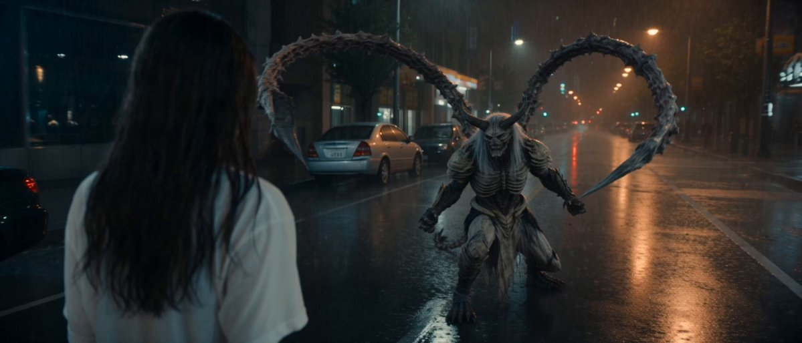

**Prompt**

```text
[10s | 16:9 | 24fps | eine kontinuierliche filmische Einstellung]  

REFERENZ: 
@image1 = REIKA MASTER. Wiedererkennbares Aussehen, Proportionen, langes dunkles Haar, übergroßes weißes T-Shirt, dunkle Cargo-Shorts, Sandalen, Halskette und Garderobe beibehalten. Reika besitzt extreme Schnelligkeit, Reflexe und mühelose körperliche Kontrolle. Sie kann einen Flip-Flop ausziehen und ihn als Requisite in der Hand behalten. 
@image2 = VORN MASTER. Wiedererkennbares Aussehen, normale humanoide Statur, Hörner, langes weißes Haar, Knochenschwanz, geschichtete Knochenrüstung und zerlumpte blasse Kleidung beibehalten. Vorn nutzt drei knochenartige Aura-Tentakel mit offensivem Druck bei extremer Geschwindigkeit.  

STIL: Erstklassige fotorealistische IMAX-Live-Action-Fantasy, ARRI ALEXA 65 / RED V-RAPTOR XL, 35mm anamorphotisch, Kodak Vision3 500T. Tiefe cyan-türkise Schatten, zurückhaltende bernstein-orangefarbene Lichter, dunkler nächtlicher Kontrast, nasse reflektierende Oberflächen, fühlbare Materialien, realistisches Gewicht, natürliche Bewegungsunschärfe und feines Filmkorn. Reikas charakteristische Energie ist dunkles metallisches Silber, durchflochten mit kontrolliertem schwarz-karminrotem Feuer.  

UMGEBUNG: Regennasse Straße in der Innenstadt bei Nacht, nasser Asphalt, geparkte Autos, Schaufenster, Straßenlaternen und panische Menschenmassen. Die Straße bricht zunehmend auf und füllt sich mit Wasser, Glas und Fahrzeugtrümmern, während Vorns Angriffe ihr Ziel verfehlen.  

AKTIONS-ZEITLEISTE:  
[00:00–00:02.5] BEAT 1 — MÜHELOSE EVASION Reika zieht gelassen einen Flip-Flop aus und hält ihn locker in einer Hand, sodass dieser Fuß barfuß bleibt. Vorn feuert sofort drei knochenartige Aura-Tentakel aus konvergierenden Winkeln auf Reikas Torso, Kopf und Beine. Reika greift zu keinem Zeitpunkt an; sie dreht sich einfach ab, beugt sich und gleitet mit winzigen, präzisen Bewegungen zwischen ihnen hindurch, wobei jeder Angriff sie nur um Zentimeter verfehlt und den nassen Asphalt hinter ihr zerschmettert. START hinter Reikas Schulter, die Tentakel auf ihre exakte Position verfolgend, dann enge Kreisbewegung mit ihrem Ausweichrhythmus, während Wasser und Asphalt hinter jedem Fehlschlag aufspritzen. 

AKZENT: 0,2s Zeitlupe, während ein Tentakel Zentimeter an Reikas Gesicht vorbeizieht, dann schlagartiger Übergang zurück zu extremer Geschwindigkeit. STOPP mit Reika, die weiterhin gefasst bleibt, während Vorn unverzüglich die nächste Salve kettet.  

[00:02.5–00:05.0] BEAT 2 — ESKALATION DES GESCHWINDIGKEITSUNTERSCHIEDS Vorn entfesselt alle drei Tentakel erneut, schneller und aus ständig wechselnden Winkeln, wobei jeder auf Reikas tatsächliche Körperposition zielt. Reika verweigert weiterhin jeglichen Gegenangriff, gleitet unter einem hindurch, tritt an einem anderen vorbei und dreht sich durch den letzten Schlag mit so gut wie keiner vergeudeten Bewegung. Die fehlgegangenen Angriffe zerreißen Autos, Glas und Asphalt und bilden direkt hinter ihr eine dichte Trümmerwolke. START mit seitlicher Verfolgung von Reika, Beschleunigung, während sich die Tentakel um sie schließen, dann ein Schwenk durch die letzte Kollision, während die Trümmer das Bild füllen. Reika nutzt die Sichtbehinderung für eine God Speed-Positionsverlagerung über eine kurze Distanz, hinterlässt eine dichte schwarze Rauchspur durch die Trümmer und trifft gelassen neben Vorn ein, bevor dieser reagieren kann. STOPP auf Vorn, der sich scharf zu ihr umdreht.  

[00:05–00:07.5] BEAT 3 — KARMINROT-SILBERNES FEUER Vorn greift sofort wieder aus nächster Nähe an. Reika bleibt standfest stehen und hebt schlicht den ausgezogenen Flip-Flop. Dunkle metallisch-silberne Energie windet sich um ihn, während schwarz-karminrotes Feuer den silbernen Kern durchzieht und sich um ihre Hand rasch intensiviert. Regen und Trümmer verharren kurz in der Luft, während das Umgebungslicht in tiefen cyan-schwarzen Schatten versinkt. Reika sagt leise: "Baka." Das japanische 「バカ」 bildet sich neben ihr aus dimensionaler silberschwarzer Energie, gesäumt von karminrotem Feuer, und nimmt physisch den Raum in der Atmosphäre ein, anstatt wie Bildtext zu wirken. START mit einer kontrollierten Vorwärtsbewegung auf den herannahenden Angriff zu, Krümmung um Reika herum, während sich die Energie manifestiert, dann direkt weiter in ihren Schwung. 

AKZENT: 0,2s Zeitlupe, während sich die silberschwarze Energie um den Flip-Flop komprimiert. Der Flip-Flop beschleunigt sofort auf Vorns Gesicht zu.  

[00:07.5–00:10.0] BEAT 4 — FINISH MIT EINEM EINZIGEN TREFFER Der Flip-Flop trifft Vorn direkt ins Gesicht. Silberschwarze Energie komprimiert sich am Kontaktpunkt, während schwarz-karminrotes Feuer nach außen bricht. Der lokalisierte Einschlag erzeugt eine heftige Schockwelle, die Regen, Glas, Staub und Fahrzeugtrümmer über die Straße schleudert. Vorn taumelt von dem einzelnen Schlag zurück und löst sich dann rasch in expandierenden schwarzen Staub auf. START aus dem Schwungmoment, Heranfahren an den exakten Kontaktpunkt, dann Zurückweichen mit der Schockwelle, während sich die Trümmer nach außen ausbreiten. Mikro-Zeitlupe nur für den allerersten Moment des Kontakts verwenden, dann die volle Geschwindigkeit wiederherstellen. ENDE mit Reika fest auf den Beinen stehend, ein Fuß barfuß und der verbleibende Flip-Flop noch getragen, während die silberschwarze Energie und das karminrote Feuer verblassen.  

KONTINUITÄT: Reika bleibt während der Beats 1–2 unberührt und geht erst mit dem finalen Schlag in die Offensive. Vorn bleibt durchgehend im Angriff. Der ausgezogene Flip-Flop verbleibt bis zum finalen Aufprall in Reikas Hand; dieser Fuß bleibt durchgehend barfuß. Jeder verfehlte Tentakel beschädigt die Umgebung schrittweise und motiviert die Kameraübergänge. Die Trümmerverlagerung in Beat 2 platziert Reika neben Vorn und bereitet Beat 3 unmittelbar vor. Die finale Schockwelle geht vom exakten Gesichtskontaktpunkt aus.  

GEZIELTE AUSSCHLÜSSE: Die drei Tentakel konvergieren stets auf Reikas tatsächliche Körperposition; ihre Fehlschläge zerstören die Umgebung hinter ihr, statt zufällig abgelenkt zu werden. Reikas nackter Fuß bleibt nackt und der ausgezogene Flip-Flop kehrt niemals an ihn zurück. Das 「バカ」 bleibt eine dreidimensionale Energie-Typografie innerhalb der Szene, keine flache Einblendung. Silberschwarze Energie bleibt mit schwarz-karminrotem Feuer durchflochten, anstatt zu gewöhnlichem Feuer zu werden. Die Kamera folgt einem kontinuierlichen Schwung ohne Rücksetzung oder harten Schnitt; jede Figur bleibt eine einzige fortlaufende Präsenz.  

AUDIO: Starker Regen, Tentakelverdrängung, Asphalteinschläge, splitterndes Glas, Fahrzeugtrümmer und Massenpanik. Umgebungsgeräusche komprimieren sich kurz, als Reika die Energie manifestiert. Ihr leises "Baka" bleibt deutlich hörbar. Der finale Kontakt erzeugt einen dichten Einschlag, eine expandierende Schockwelle und herabstürzende Trümmer. Keine Hintergrundmusik.
```

[↑ Zurück zu Kategorien](#catalog)

---

<a name="prompt-2098436364849320190"></a>

### Filmisches Plansequenz-Prompt für einen schwimmenden Nachtmarkt im Mondlicht mit Laternen und Händlern.

Autor：[@feesyiam](https://x.com/feesyiam) · [Originalbeitrag](https://x.com/feesyiam/status/2098436364849320190)

Kinematisch / Filmstill · Veröffentlicht

**Zusammenfassung:** Filmisches Plansequenz-Prompt für einen schwimmenden Nachtmarkt im Mondlicht mit Laternen und Händlern.

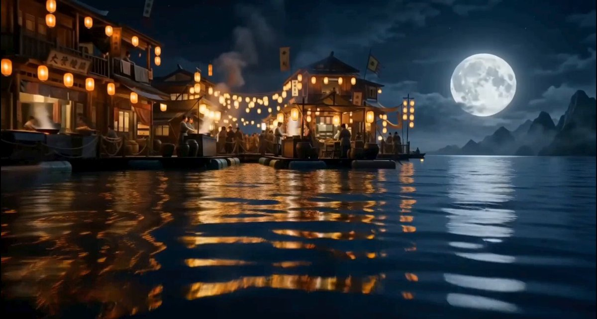

**Prompt**

```text
"Erstelle ein 15-sekündiges, filmisches, fotorealistisches Plansequenz-Video, das exakt auf dem Referenzbild von „Der schwimmende Nachtmarkt“ basiert.

Behalte die ursprüngliche Architektur, die schwimmenden Holzplattformen des Marktes, die Laternendesigns, die Händler, Kunden, Boote, das Meer, die Berge, die Farbpalette und die Gesamtkomposition bei. Keine wesentlichen Elemente umgestalten oder ersetzen.

0–3 Sekunden: Beginne mit einer langsamen, sanften Kamerabewegung aus der Froschperspektive knapp über der dunklen Meeresoberfläche und nähere dich dem schwimmenden Nachtmarkt. Hunderte warm leuchtende Papierlaternen wiegen sich sanft in der Nachtbrise. Ihre goldenen Reflexionen schimmern natürlich auf dem bewegten Wasser. Kleine Wellen umspülen sanft die schwimmenden Plattformen.

3–7 Sekunden: Die Kamera steigt langsam auf und bewegt sich vorwärts durch den Markt, wodurch ein lebendiges Treiben sichtbar wird. Händler bereiten an kleinen Holzständen ganz natürlich Speisen zu, rühren behutsam in dampfenden Töpfen und grillen Speisen. Feiner, realistischer Dampf steigt in das Laternenlicht auf. Kunden gehen gelassen über schmale Holzbrücken, unterhalten sich und schauen sich um. Laternen flackern subtil und wiegen sich im Wind.

7–11 Sekunden: Setze dieselbe ununterbrochene Kamerabewegung mit einem sanften, filmischen Bogen um den Markt fort. Kleine traditionelle Boote fahren langsam unter den schwimmenden Plattformen hindurch. Wellen breiten sich hinter ihnen im Wasser aus. Essensstände leuchten in warmem Orange- und Bernsteinton, während das kühle blaue Mondlicht das umgebende Meer erhellt. Der riesige Vollmond bleibt im Hintergrund hinter nebligen Bergen sichtbar.

11–15 Sekunden: Ziehe die Kamera langsam nach oben und hinten zurück zu einer weiteren filmischen Enthüllung, die den gesamten schwimmenden Nachtmarkt inmitten des weiten Ozeans zeigt. Hunderte Laternen bilden eine leuchtende Spur über dem Wasser. Reflexionen dehnen sich und brechen natürlich mit den Wellen. Nebel zieht sanft um die fernen Berge, während das Mondlicht eine magische Atmosphäre schafft. Ende mit einer wunderschönen, weiten Totale.

Visueller Stil: ultra-fotorealistisch, filmische Fantasy, realistische menschliche Bewegungen, realistische Ozean- und Wasserphysik, detaillierte Holztexturen, natürlicher Laternenschein, volumetrisches Mondlicht, subtiler atmosphärischer Nebel, realistischer Dampf, geringe Schärfentiefe bei Nahaufnahmen, filmische 35mm-Fotografie, hoher Dynamikumfang, extrem detailliert, immersive Dimension, sanfte professionelle Kamerabewegung.

Bewegung: natürliche menschliche Gesten, subtile Windbewegung, sanft wiegende Laternen, fließender Dampf, bewegtes Wasser, realistische Bootsbewegung, keine übertriebenen Animationen.

Kamera: sanfte, stabilisierte Kinokamera, langsame kontrollierte Bewegung, natürliche Schärfentiefe, schrittweises Heranfahren → Vorwärts-Tracking → sanfter Bogen → weites Zurückziehen. Eine einzige kontinuierliche Plansequenz ohne Schnitte.

Negativ-Prompt: keine Szenenwechsel, keine Schnitte, keine Jump Cuts, kein Kamerawackeln, keine verzerrten Gesichter, keine duplizierten Personen, keine verzerrten Gebäude.
```

[↑ Zurück zu Kategorien](#catalog)

---

<a name="prompt-2098289889964183843"></a>

### Erstelle einen erstklassigen, 15-sekündigen vertikalen 9:16 Sambal Ekstra Pedas Werbespot mit 8 filmischen Szenen, ultraphotorealistischer 8K-Qualität, Action-Thriller-Energie × Ästhetik eines Premium-Lebensmittel-TV-Spots und Highspeed-Makro-Food-Kinematographie.

Autor：[@HeyRu0by](https://x.com/HeyRu0by) · [Originalbeitrag](https://x.com/HeyRu0by/status/2098289889964183843)

Produktmarketing · Fotografie · Kinematisch / Filmstill · Essen / Trinken · Veröffentlicht

**Zusammenfassung:** Erstelle einen erstklassigen, 15-sekündigen vertikalen 9:16 Sambal Ekstra Pedas Werbespot mit 8 filmischen Szenen, ultraphotorealistischer 8K-Qualität, Action-Thriller-Energie × Ästhetik eines Premium-Lebensmittel-TV-Spots und Highspeed-Makro-Food-Kinematographie.

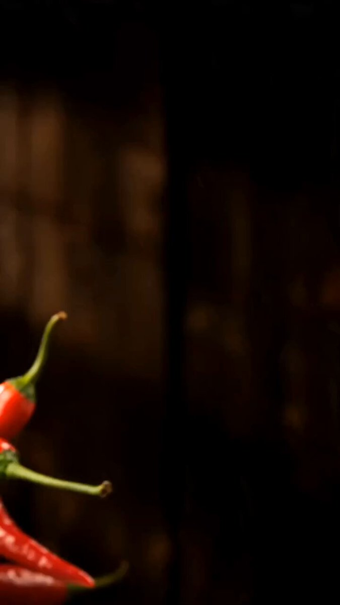

**Prompt**

```text
Erstelle einen erstklassigen, 15-sekündigen vertikalen 9:16 Sambal Ekstra Pedas Werbespot mit 8 filmischen Szenen, ultraphotorealistischer 8K-Qualität, Action-Thriller-Energie × Ästhetik eines Premium-Lebensmittel-TV-Spots und Highspeed-Makro-Food-Kinematographie.

PRODUKTFOKUS — ENTSCHEIDEND

Verwende während des gesamten Werbespots exakt das Sambal Ekstra Pedas Produkt aus dem bereitgestellten Referenzbild/-video.

Behalte exakt bei:

- Flaschen-/Glasform und Proportionen
- Kappen-/Deckeldesign
- Etikettendesign und Platzierung
- Markenlogo
- Produktname und Typografie
- Farben und Verpackungsdetails
- Sambal-Farbe und realistische Konsistenz

Die Verpackung darf NICHT umgestaltet, modifiziert, verzerrt, ersetzt, dupliziert, gespiegelt oder erfunden werden. Erzeuge KEINE fehlerhaften Texte, Logos, Etiketten oder Markenelemente. Nur eine primäre Produktverpackung im finalen Hero-Shot.

VISUELLER STIL

Ultraphotorealistisch • filmisches 8K • erstklassige globale FMCG-Lebensmittelwerbung • Action-Thriller-Kinematographie • dramatische, kontrollierte Beleuchtung • satte rote Chilitöne • realistische Lebensmittelphysik • glänzende, appetitliche Sambal-Textur • Highspeed-Fotografie • Makrodetails • dynamische Kamerabewegung • realistische Partikel- und Flüssigkeitssimulation • scharfer Produktfokus • geringe Schärfentiefe • erstklassiges kommerzielles Color Grading.

KONZEPT

CHILI-ANGRIFF → ZERQUETSCHEN → ZU SAMBAL WERDEN → VORTEX → PRODUKTENTHÜLLUNG → TEXTUR → ESSEN → HERO

---

01 | 0–1,5s — CHILI-ANGRIFF

Extremer Makro-Shot einer frischen roten Chilischote, die wie ein filmisches Projektil rasant auf die Kamera zusteuert.

Am nächsten Punkt wechselt die Chili in Bullet-Time-Zeitlupe und friert kurz ein.

Mehrere frische rote Chilis konvergieren plötzlich aus verschiedenen Richtungen zum Zentrum hin.

Kamera: 24mm-Objektiv, aggressives Zurückweichen + 120°-Orbit, dynamische Perspektive, kontrollierte Bewegungsunschärfe.

Beleuchtung: dramatische rote Glanzlichter mit tiefen Schatten.

Stimmung: explosiv, intensiv, unerwartet.

---

02 | 1,5–3s — ZERQUETSCHEN DER CHILIS

Die zusammenlaufenden Chilis kollidieren und prallen mit einem kraftvollen filmischen Einschlag aufeinander.

Frische Chilistücke, Samen, Tröpfchen und winzige rote Partikel explodieren in ultrarealistischer Highspeed-Makro-Zeitlupe nach außen.

Die zerkleinerte Chilimischung beginnt sich in eine reichhaltige, glänzende Sambal-Textur zu verwandeln.

Kamera: schnelle Vorwärtsfahrt → Einfrieren beim Aufprall → Makro-Orbit.

Physik: realistisches Zerquetschen, Spritzen, Samen und Partikel; kein künstliches CGI-Erscheinungsbild.

---

03 | 3–5s — ZU SAMBAL WERDEN

Die zerkleinerte Chilimischung morpht nahtlos in dickes, leuchtend rotes Sambal.

Die Textur wird reichhaltig, stückig, glänzend und intensiv appetitlich, mit sichtbaren Chilistücken und Samen.

Das Sambal bildet eine dramatische Welle, die sich durch das Bild krümmt.

Kamera: 85mm-Makroobjektiv, extrem geringe Schärfentiefe, Texturenthüllung in Zeitlupe.

Fokus: realistische Viskosität, Chilifasern, Samen, Ölglanzlichter und sattes Rot.

---

04 | 5–6,5s — VORTEX

Die Sambal-Welle schraubt sich zu einem kraftvollen roten Wirbel empor.

Der Wirbel rotiert rasant, während winzige Chilipartikel und Tröpfchen ihn umkreisen.

Das Zentrum des Wirbels öffnet sich und schafft einen dramatischen Enthüllungsraum.

Kamera: 360°-Makro-Orbit + kontrolliertes Zurückziehen.

Beleuchtung: Premium-Studiobeleuchtung mit glänzenden Spitzlichtern.

Übergang: Der Wirbel formt auf natürliche Weise die Silhouette des Produkts.

---

05 | 6,5–8,5s — PRODUKTENTHÜLLUNG

Das exakte Sambal Ekstra Pedas Referenzprodukt taucht aus dem Zentrum des roten Wirbels auf.

Das Produkt landet perfekt aufrecht auf einer erstklassigen dunklen Oberfläche, während sich winzige Chilipartikel und subtile Sambal-Tröpfchen darum herum absetzen.

Die Kamera führt eine sanfte filmische Vorwärtsfahrt aus.

Das Produkt muss vollkommen scharf und unverzerrt bleiben.

Behalte die exakte Verpackung, das Etikett, das Logo, die Typografie, die Farben und die Proportionen der Referenz bei.

---

06 | 8,5–10,5s — TEXTUR

Schnitt zu einer extremen Makro-Nahaufnahme des Sambals.

Ein glänzender Löffel gleitet langsam durch das dicke Sambal und enthüllt seine reichhaltige Textur.

Sichtbar:

- Echte Chilistücke
- Chilisamen
- Natürliche Fasern
- Glänzende Öl-Glanzlichter
- Dicke, stückige Konsistenz
- Frische rote Farbe
```

[↑ Zurück zu Kategorien](#catalog)

---

<a name="prompt-2098265320448553176"></a>

### Filmische Kamerabewegung, die von brechenden Meereswellen an einer sonnenbeschienenen Klippe aufsteigt, um eine einsame Gestalt am Abgrund zu enthüllen.

Autor：[@umesh\_ai](https://x.com/umesh_ai) · [Originalbeitrag](https://x.com/umesh_ai/status/2098265320448553176)

Fotografie · Kinematisch / Filmstill · Landschaft / Natur · Veröffentlicht

**Zusammenfassung:** Filmische Kamerabewegung, die von brechenden Meereswellen an einer sonnenbeschienenen Klippe aufsteigt, um eine einsame Gestalt am Abgrund zu enthüllen.


**Prompt**

```text
Die Kamera beginnt tief über den tosenden Meereswellen, nah an der Oberfläche, während das Wasser heftig gegen die zerklüfteten Felsen prallt. Dann steigt sie in einer fließenden, filmischen Bewegung an der schroffen Klippenwand empor und offenbart die dramatische Höhe der sonnenbeschienenen Klippen, bevor sie schwenkt, um eine einsame Gestalt einzufangen, die trotzig am Abgrund steht und auf das tosende Meer hinabblickt. Helles Sonnenlicht erleuchtet die Szene mit gestochen scharfer, klarer Sicht, lebendigen natürlichen Farben, glitzerndem Wasser und markant definierten Felsstrukturen unter einem strahlend blauen Himmel. Das visuelle Gesamtbild wirkt filmisch, weitläufig und kraftvoll, mit dynamischer Bewegung und einem dramatischen Gefühl von Größe.
```

[↑ Zurück zu Kategorien](#catalog)

---

<a name="prompt-2097951331667357808"></a>

### Ein Kind, das auf einem riesigen einzelnen Strahltriebwerk mit hoher Geschwindigkeit durch einen engen Sandstein-Slot-Canyon reitet, mit fotorealistischer Verfolgungskinematografie.

Autor：[@ByronRexMatthe1](https://x.com/ByronRexMatthe1) · [Originalbeitrag](https://x.com/ByronRexMatthe1/status/2097951331667357808)

Fotografie · Kinematisch / Filmstill · Veröffentlicht

**Zusammenfassung:** Ein Kind, das auf einem riesigen einzelnen Strahltriebwerk mit hoher Geschwindigkeit durch einen engen Sandstein-Slot-Canyon reitet, mit fotorealistischer Verfolgungskinematografie.


**Prompt**

```text
Ein Kind schneidet bereits ab dem ersten Frame eine enge S-Kurve durch einen tiefen Slot Canyon, reitet auf einem riesigen einzelnen Strahltriebwerk wie auf einem Sattel, beide Hände auf der Triebwerksverkleidung, der Körper geduckt, wobei die dicke Metallturbine den Großteil des Bachbetts ausfüllt. Ein riesiger runder Lufteinlass vorne, eine brüllende Düse hinten, keine zusätzlichen Schubdüsen, kein zweites Triebwerk. Schmale Wände aus Navajo-Sandstein ragen auf beiden Seiten empor, gestreift in Orange, Rost, Creme und gebranntem Sienna, unterspült und glatt poliert, wo Fluten geflossen sind, dunkle Wüstenlackstreifen, windzerfressene Vertiefungen, herabhängende Wacholderwurzeln, ein dünnes Band Himmel hoch oben. Die Sonne bricht durch eine hohe Lücke herein, hartes Mittagslicht, lange blaue Schatten im Slot, Hitzeflimmern über dem Bachbett, Alkalistaub, rissiger Schlamm, verstreute Kieselsteine, gebleichtes Treibholz, ein Hauch von Grün, wo eine Sickerstelle den Fels befeuchtet. Die einzelne Düse stößt die ganze Zeit über wahnwitzige elektrisch-blaue Nachbrennerflammen und dicken, quellenden weiß-rußigen Rauch aus, niemals nur ein kleiner verpuffender Stoß, wobei der blaue Schein die Canyonwände leckt und das staubige Visier des Kindes erleuchtet. Vollständig fotorealistische Live-Action: sandgestrahltes Turbinengehäuse, Nieten, hitzeverfärbtes Metall, verbeulte Einlasslippe, unvollkommene Kinderhaut, Sonnenbrand, Schweiß, abgenutzte Handschuhe, Handheld-Verfolgungskamera, Filmkorn, Bewegungsunschärfe, Blendenflecke durch Staub. Die Kamera verfolgt von hinten und von der Seite durch den Slot, während die Wände vorbeirasen, das Triebwerk sich stark in die Kurve legt, aufgewirbelter Sand und blaues Feuer den Canyon füllen. Nur diegetischer Ton: ein gewaltiges Triebwerkskreischen, Nachbrennerbrüllen, auf Metall treffender Sand, Canyonecho, Wind durch den Slot, keine Musik, kein Lied, kein Text auf dem Bildschirm. Zwanzig Sekunden, eine ununterbrochene Einstellung, verlässt niemals den Canyon. Niemals Cartoon, niemals CGI-Plastik.
```

[↑ Zurück zu Kategorien](#catalog)

---

<a name="prompt-2097920763529711752"></a>

### 10-sekündiger filmischer vertikaler Werbespot-Prompt für die tragbare Tischleuchte Philips Hue Go in verschiedenen Stimmungen und Umgebungen.

Autor：[@Urwa\_345](https://x.com/Urwa_345) · [Originalbeitrag](https://x.com/Urwa_345/status/2097920763529711752)

Kinematisch / Filmstill · Veröffentlicht

**Zusammenfassung:** 10-sekündiger filmischer vertikaler Werbespot-Prompt für die tragbare Tischleuchte Philips Hue Go in verschiedenen Stimmungen und Umgebungen.


**Prompt**

```text
Erstelle einen filmischen 10-sekündigen Premium-Werbespot für die authentische tragbare Tischleuchte Philips Hue Go, vertikal 9:16.

0–2 Sek.: Dunkler moderner Raum, die Kamera fährt langsam auf die Lampe zu, während sie sanft aufleuchtet.

2–4 Sek.: Makro-Nahaufnahme des leuchtenden Randes der Lampe, mit fließenden Übergängen durch verschiedene Umgebungsfarben.

4–6 Sek.: Die Kamera folgt der Lampe, wie sie bei Sonnenuntergang auf einen eleganten Tisch im Freien gestellt wird.

6–8 Sek.: Nahtloser Übergang zu einem modernen Schlafzimmer, in dem die Lampe eine gemütliche Atmosphäre schafft.

8–10 Sek.: Abschließender Hero-Shot, langsame 360-Grad-Kamerabewegung um die Philips Hue Go mit wunderschöner filmischer Beleuchtung.

Fotorealistischer Werbespot, Premium-Markenwerbung, realistische Lichteffekte, flüssige Kamerabewegung, filmische Tiefenschärfe, authentisches Produktdesign, hochglänzende professionelle Kampagne, keine Texteinblendungen, kein Wasserzeichen.
```

[↑ Zurück zu Kategorien](#catalog)

---

<a name="prompt-2097904155801325715"></a>

### Nahaufnahme und innerer Monolog einer ostasiatischen Schönheit mit kurzen Haaren und weißem Hemd, die nachdenklich die Straße entlanggeht

Autor：[@PixelAigc](https://x.com/PixelAigc) · [Originalbeitrag](https://x.com/PixelAigc/status/2097904155801325715)

Kinematisch / Filmstill · Charakter · Stadtbild / Straße · Veröffentlicht

Originalbeitrag：[@PixelAigc](https://x.com/PixelAigc) · [Originalbeitrag](https://x.com/PixelAigc/status/2097690833684410515)

**Zusammenfassung:** Nahaufnahme und innerer Monolog einer ostasiatischen Schönheit mit kurzen Haaren und weißem Hemd, die nachdenklich die Straße entlanggeht


**Prompt**

```text
Eine 20-jährige, wunderschöne junge ostasiatische Frau mit schulterlangem kurzem Haar und kühler, heller Haut. Sie trägt ein weißes Hemd und einen schwarzen Lederrock, geht die Straße entlang, frontale Nahaufnahme des Oberkörpers, unscharfer Hintergrund durch große Blendenöffnung, die Kamera fährt langsam näher heran, während sie nachdenklich dahingeht, mit einer Voice-Over-Stimme des inneren Monologs: „Wie soll ich heute meinen Chef um Urlaub bitten?“ Kein Text, keine Untertitel, kein Wasserzeichen
```

[↑ Zurück zu Kategorien](#catalog)

---

<a name="prompt-2097883008233865405"></a>

### Ultra-realistisches, filmisches Modeporträt eines jungen erwachsenen Mannes, der auf dem Vordersitz eines olivgrünen Oldtimers lümmelt, aufgenommen aus einem tiefen Weitwinkel.

Autor：[@CliQi\_AI](https://x.com/CliQi_AI) · [Originalbeitrag](https://x.com/CliQi_AI/status/2097883008233865405)

Kinematisch / Filmstill · Retro / Vintage · Porträt / Selfie · Charakter · Modeartikel · Fahrzeug · Veröffentlicht

**Zusammenfassung:** Ultra-realistisches, filmisches Modeporträt eines jungen erwachsenen Mannes, der auf dem Vordersitz eines olivgrünen Oldtimers lümmelt, aufgenommen aus einem tiefen Weitwinkel.


**Prompt**

```text
Ultra-realistisches, filmisches Modeporträt eines jungen erwachsenen Mannes, der auf dem Vordersitz eines olivgrünen Oldtimers lümmelt, fotografiert aus einer tiefen Weitwinkelperspektive aus dem Fußraum der Beifahrerseite. Das Bild sollte maskulin, entspannt, leicht rebellisch und nostalgisch wirken – wie ein Roadtrip-Editorial der 1970er-Jahre, neu interpretiert durch eine moderne Modelinse.

Er hat kurzes bis mittellanges dunkelbraunes Haar, das in lockeren, natürlichen Locken gestylt ist, leicht unordentlich und sonnenverweht. Kräftige Brauen, definierte Wangenknochen, ein glattrasiertes Gesicht und ein ruhiger, intensiver Ausdruck. Sein Blick ist direkt in die Kamera gerichtet, mit einem leicht müden, selbstsicheren Aussehen.

Körper: schlanker, athletischer Körperbau mit natürlich definierter Brust, Bauch, Schultern und Armen. Realistische Proportionen, subtile Hauttextur, feine Körperbehaarung und ein warmer, sonnengeküsster Teint. Der Körperbau sollte fit und mühelos wirken, keineswegs wie der eines Bodybuilders.

Outfit: ein dunkelmarineblaues oder fast schwarzes, leichtes Button-down-Hemd, das vorne komplett offen getragen wird und die nackte Brust und den Bauch entblößt. Das Hemd hat kurze oder lässig hochgekrempelte Ärmel und einen leicht zerknitterten Stoff, was ihm ein eingetragenes Sommer-Gefühl verleiht.

Dazu eine entspannte dunkelindigoblaue Jeans, an den Beinen leicht ausgestellt oder gerade geschnitten, mit einem tief sitzenden Vintage-Schnitt und einer dezent verwaschenen Textur. Er ist barfuß, was die ungezwungene Roadtrip-Atmosphäre unterstreicht.

Pose: lässig über die breite vordere Sitzbank des Oldtimers ausgestreckt. Seine Beine sind natürlich in Richtung Kamera gespreizt, wobei ein nackter Fuß im unteren Vordergrund sehr nah an das Objektiv heranreicht, was eine dramatische Perspektivverzerrung erzeugt. Ein Arm streckt sich zum Lenkrad, das Handgelenk hängt locker darüber, während der andere Arm auf der Oberseite der Sitzbank ruht. Der Oberkörper ist leicht nach hinten gelehnt, die Schultern geöffnet, die Haltung vollkommen entspannt.

Fahrzeuginnenraum: authentischer Vintage-Autoinnenraum in gedecktem Avocado- oder Salbeigrün, einschließlich eines großen Lenkrads mit dünnem Rand, eines alten analogen Armaturenbretts, grüner Vinyl-Sitzbänke, passender Türverkleidungen, eines gealterten Dachhimmels, Chromdetails, manueller Griffe und leicht abgenutzter Polsterung. Das Auto sollte sich unverfälscht alt und unvollkommen anfühlen, nicht wie in den Showroom-Zustand restauriert.

Umgebung: irgendwo ländlich oder subtropisch geparkt, mit belaubten Bäumen, hellen Stämmen und hellem, diffusem Tageslicht, das durch die Fenster sichtbar ist. Die Außenlandschaft sollte zweitrangig bleiben und sanft durch leicht staubiges Glas sichtbar sein.

Beleuchtung: warmes natürliches Tageslicht, das durch die Windschutzscheibe und die Seitenfenster einfällt und Gesicht, Brust und Arme beleuchtet, während Teile des Innenraums in weichen, grün getönten Schatten liegen. Fügen Sie dezente Reflexionen auf den Fenstern und dem Armaturenbrett hinzu. Kein hartes Studiolicht.

Fotografie: intime Vintage-Modefotografie, 24–28-mm-Weitwinkelobjektiv, Kamera sehr tief und nah am Beifahrersitz oder Boden platziert, starke Vordergrundperspektive, leichte Objektivverzerrung, dezente analoge Körnung, natürliche Hauttextur, warm-grüner Farbstich, milde Weichheit, filmisch, aber ungekünstelt, fotorealistisch, hohe Auflösung.

Komposition: vertikales 3:4-Format, der Mann zentriert über die Sitzbank liegend, das Lenkrad nimmt den oberen linken Vordergrund ein, ein nackter Fuß groß und unscharf nahe der unteren rechten Kante, grüne Sitzlinien leiten zum Oberkörper, Windschutzscheibe und Fenster rahmen den Hintergrund ein.

Negativer Prompt: modernes Luxusauto, Sportwagen-Innenraum, sauberes weißes Leder, formelle Kleidung, voll zugeknöpftes Hemd, Sneaker, Sonnenbrille, übertriebener Bodybuilder-Körperbau, dramatisches Muskelanspannen, heller Studiohintergrund, Neonbeleuchtung, greller Blitz, plastische Haut, verzerrte Hände, zusätzliche Finger, missgebildete Füße, duplizierte Gliedmaßen, verzogenes Lenkrad, Cartoon, Anime, Illustration, CGI.
```

[↑ Zurück zu Kategorien](#catalog)

---

<a name="prompt-2096832231071519193"></a>

### 10-sekündiges 9:16 filmisches Werbespot-Storyboard für die LEGO Botanical Collection mit Kamera-Push-in, Makrodetails, Handmontage und einer rotierenden finalen Präsentation.

Autor：[@Urwa\_345](https://x.com/Urwa_345) · [Originalbeitrag](https://x.com/Urwa_345/status/2096832231071519193)

Comic / Storyboard · Kinematisch / Filmstill · Produkt · Veröffentlicht

**Zusammenfassung:** 10-sekündiges 9:16 filmisches Werbespot-Storyboard für die LEGO Botanical Collection mit Kamera-Push-in, Makrodetails, Handmontage und einer rotierenden finalen Präsentation.


**Prompt**

```text
Erstelle eine filmische 10-sekündige Premium-Produktwerbung für die LEGO Botanical Collection im vertikalen 9:16-Format.

0–2 Sek.: Langsame Kamerafahrt (Push-in) auf das wunderschön arrangierte LEGO-Botanical-Set auf einem Holztisch, sanfte filmische Beleuchtung.

2–4 Sek.: Nahtloser Makro-Übergang zu den detaillierten LEGO-Blumenelementen, mit Fokus auf Textur und Handwerkskunst.

4–7 Sek.: Zeige Hände, die das Blumenarrangement natürlich zusammenbauen, schnelle befriedigende Bewegungen, geringe Schärfentiefe, elegante Lifestyle-Atmosphäre.

7–10 Sek.: Enthülle das fertige botanische Arrangement in einem modernen Raum. Die Kamera dreht sich langsam um das fertige Produkt, während warmes Licht eine hochwertige, gemütliche Atmosphäre schafft.

Nahtlose Übergänge, realistische Bewegungen, Qualität von Werbespots, filmische Schärfentiefe, subtile Kamerabewegungen, hochdetailliert, Stil von Premium-Produktfotografie, keine Texteinblendungen, kein Wasserzeichen.
```

[↑ Zurück zu Kategorien](#catalog)

---

<a name="prompt-2096829877987291200"></a>

### Filmische 3D-Werbesequenz, die rohe Instantnudeln zeigt, die mit Zutaten schweben, in kochendes Wasser fallen, sowie die finale servierte Präsentation.

Autor：[@1H77k](https://x.com/1H77k) · [Originalbeitrag](https://x.com/1H77k/status/2096829877987291200)

Kinematisch / Filmstill · 3D-Rendering · Essen / Trinken · Veröffentlicht

**Zusammenfassung:** Filmische 3D-Werbesequenz, die rohe Instantnudeln zeigt, die mit Zutaten schweben, in kochendes Wasser fallen, sowie die finale servierte Präsentation.


**Prompt**

```text
Dynamische, filmische 3D-Werbeaufnahme von Instantnudeln. Extreme Makro-Zeitlupenaufnahme eines ungekochten Ramen-Nudelblocks, der in der Luft schwebt, umgeben von frischen, fliegenden Zutaten wie geschnittenen Kirschtomaten, Zuckermais, Basilikumblättern, schwarzen Oliven und Chiliflocken. Helles, natürliches, volumetrisches Sonnenlicht strömt durch den Hintergrund einer rustikalen Küche. Sanfter Übergang, während die Nudeln in einen Topf mit kochend heißem Wasser und aufsteigendem Dampf fallen und sich in eine dampfende, köstliche Schüssel Nudeln verwandeln. Die Kamera zoomt heraus und enthüllt eine warme Küchenkulisse mit einer gelben Instantnudel-Packung im Hintergrund. Ultrarealistische Food-Fotografie, 8k-Auflösung, filmische Beleuchtung, appetitanregende Farben, vertikales Format 1080x1920.

​Floating Ingredients & Noodles:

​Filmische Food-Fotografie, Makroaufnahme eines rohen Instantnudelblocks, der in der Luft schwebt, mit geschnittenen Tomaten, schwarzen Oliven, Basilikumblättern, Mais und Gewürzen, die in Zeitlupe fliegen, warmes Sonnenlicht, Küchenhintergrund, Tiefenschärfe, 8k --ar 9:16

​Boiling Water Transition:

​Nahaufnahme eines Instantnudelblocks, der in kochend heißes Wasser in einem Stahltopf eintaucht, dichte aufsteigende Dampfwolken, dramatischer Flammenspritzer am Boden, hochenergetisch, gestochen scharfer Fokus, hyperrealistisch --ar 9:16

​Final Bowl Presentation:

​Eine dampfend heiße Schüssel gekochter Instantnudeln, serviert mit frischen Kräutern, Kirschtomaten und Oliven, eine Gabel hebt lange Nudelfäden an, gelbe Instantnudel-Packung im Maggi-Stil im unscharfen Hintergrund, warme, gemütliche Beleuchtung, professioneller Stil für Lebensmittelwerbung --ar 9:16
```

[↑ Zurück zu Kategorien](#catalog)

---

<a name="prompt-2097188060098101543"></a>

### Ein Prompt für einen 10-sekündigen cineastischen, vertikalen Nutella-Werbespot mit Shot-by-Shot-Aufschlüsselung vom Kamera-Push-in auf das Glas über das Verstreichen auf Toast bis hin zum Hero-Shot.

Autor：[@Urwa\_345](https://x.com/Urwa_345) · [Originalbeitrag](https://x.com/Urwa_345/status/2097188060098101543)

Produktmarketing · Kinematisch / Filmstill · Veröffentlicht

**Zusammenfassung:** Ein Prompt für einen 10-sekündigen cineastischen, vertikalen Nutella-Werbespot mit Shot-by-Shot-Aufschlüsselung vom Kamera-Push-in auf das Glas über das Verstreichen auf Toast bis hin zum Hero-Shot.


**Prompt**

```text
Erstelle einen erstklassigen, 10-sekündigen cineastischen Nutella-Werbespot im vertikalen 9:16-Format.

0–2 Sek.: Langsamer cineastischer Push-in auf das Nutella-Glas auf einem wunderschönen Frühstuckstisch.

2–4 Sek.: Makroaufnahme, wie cremige Nutella geschmeidig auf einem warmen Toast verstrichen wird.

4–6 Sek.: Nahaufnahme eines Löffels, der einen glänzenden Strudel Nutella langsam und befriedigend aus dem Glas hebt.

6–8 Sek.: Schneller, eleganter Übergang zu einem fertigen Nutella-Toast, der auf dem Frühstückstisch platziert wird.

8–10 Sek.: Finaler Hero-Shot des Nutella-Glases, umgeben von Toast und Haselnüssen, warmes morgendliches Sonnenlicht und subtile Kamerabewegung.

Fotorealistischer Lebensmittel-Werbespot, erstklassige Werbequalität, realistische Texturen, sanfte Übergänge, geringe Schärfentiefe, cineastische Beleuchtung, appetitliche natürliche Präsentation, authentische Verpackung, keine Texteinblendungen, kein Wasserzeichen.
```

[↑ Zurück zu Kategorien](#catalog)

---

<a name="prompt-2096832293138726943"></a>

### Filmreifes Mode-Editorial-Porträt eines jungen Mannes, der barfuß an einem bewölkten Strand spaziert.

Autor：[@MohdAdnanA86218](https://x.com/MohdAdnanA86218) · [Originalbeitrag](https://x.com/MohdAdnanA86218/status/2096832293138726943)

Kinematisch / Filmstill · Porträt / Selfie · Charakter · Modeartikel · Veröffentlicht

**Zusammenfassung:** Filmreifes Mode-Editorial-Porträt eines jungen Mannes, der barfuß an einem bewölkten Strand spaziert.


**Prompt**

```text
Ultrarealistische filmische Editorial-Fotografie eines auffallend gutaussehenden jungen Mannes Anfang 20, der barfuß an einem leeren, abgelegenen Strand unter einem dramatischen, bewölkten Himmel steht. Er hat dichtes, natürlich gewelltes pechschwarzes Haar, das von der Meeresbrise leicht zerzaust ist, kräftige, wohlgeformte Augenbrauen, tiefe, ausdrucksstarke dunkelbraune Augen, eine gerade, markante Nase, prominente Wangenknochen, eine kantige, maskuline Kinnlinie und einen dezenten, natürlichen Dreitagebart. Er trägt ein makelloses weißes Oversize-Baumwollhemd mit lockeren Ärmeln, das am Kragen leicht geöffnet ist und sanft im Wind weht, kombiniert mit einer weiten Hose in neutralen Farbtönen. Seine Füße berühren sanft den nassen Sand, während kleine Wellen auf ihn zurollen. Gedämpfte Farbpalette aus Beige, Grau und Off-White, weiches, diffuses Licht bei bedecktem Himmel, diesiger Horizont, ruhiger Ozean, minimalistische, leere Umgebung, ruhige, melancholische Atmosphäre, anspruchsvolle Luxusmode-Editorial-Ästhetik, natürliche Hauttextur, realistische Stoffdetails, feines Filmkorn, geringe Schärfentiefe, filmische Bildkomposition, 85-mm-Objektiv, fotorealistisch, extrem detailliert, 8K.
```

[↑ Zurück zu Kategorien](#catalog)

---

<a name="category-anime-manga"></a>

## Anime / Manga

<a name="prompt-2097918597603733849"></a>

### Anime-Storyboard-Prompt für die Interaktion zwischen Luffy und Anya, einschließlich eines goldenen Bändchen-Schutzschilds sowie Kopfstreicheln und Umarmung.

Autor：[@Gopphybjwo](https://x.com/Gopphybjwo) · [Originalbeitrag](https://x.com/Gopphybjwo/status/2097918597603733849)

Comic / Storyboard · Anime / Manga · Veröffentlicht

**Zusammenfassung:** Anime-Storyboard-Prompt für die Interaktion zwischen Luffy und Anya, einschließlich eines goldenen Bändchen-Schutzschilds sowie Kopfstreicheln und Umarmung.


**Prompt**

```text
10–15 Sekunden｜Requisiten-Burst: Rakhi fliegt von selbst hoch und wickelt sich ums Handgelenk
Das goldene Band wickelt sich automatisch um Luffys Handgelenk, ein Schutzschild breitet sich aus, Anyas Augen werden zu Sternen.
15–20 Sekunden｜Emotionaler Höhepunkt: Streicheln des Kopfes wie ein großer Bruder＋Umarmung
Luffy streichelt Anyas Kopf liebevoll, Anya wirft sich in seine Arme, umgeben von goldenem herzförmigem Licht.
```

[↑ Zurück zu Kategorien](#catalog)

---

<a name="category-illustration"></a>

## Illustration

<a name="prompt-2096970899622948972"></a>

### Handgemalter Gouache-Karikaturstil auf Baumwollpapier mit Grün-, Rosa- und Cremetönen.

Autor：[@MissDelulu9](https://x.com/MissDelulu9) · [Originalbeitrag](https://x.com/MissDelulu9/status/2096970899622948972)

Illustration · Porträt / Selfie · Veröffentlicht

**Zusammenfassung:** Handgemalter Gouache-Karikaturstil auf Baumwollpapier mit Grün-, Rosa- und Cremetönen.


**Prompt**

```text
Verwandle das Foto in eine handgemalte Gouache-Karikatur auf cremefarbenem Baumwollpapier. Bewahre die exakte Identität der Person, die natürliche Asymmetrie, die wichtigsten Gesichtszüge, das Haar, den Körperbau und das Originaloutfit. Verwende kühne, flächige Formen, selbstbewusste Konturen, sichtbare Papierkörnung und subtile Pigmenttextur. Stilisierte Proportionen mit ausdrucksstarker Haltung, vergrößerten grafischen Augen und einer dynamischen Pose von der Taille aufwärts. Farbpalette: zu gleichen Teilen Salbei-/Olivgrün, Rosapink und warmes Creme. Kein Realismus, kein Anime-Gesicht, kein Verschönern, Glätten, 3D-Schattierungen, Text, Logos oder Unordnung. Eindeutig dieselbe Person, eindeutig eine Zeichnung.
```

[↑ Zurück zu Kategorien](#catalog)

---

<a name="category-sketch-line-art"></a>

## Skizze / Strichzeichnung

<a name="prompt-2098371221184495917"></a>

### Erstelle ein zweigeteiltes redaktionelles Vergleichsposter mit einem Foto oben und einer Kreideskizze mit französischen Notizen unten.

Autor：[@Weilnes](https://x.com/Weilnes) · [Originalbeitrag](https://x.com/Weilnes/status/2098371221184495917)

Plakat / Flyer · Fotografie · Skizze / Strichzeichnung · Veröffentlicht

**Zusammenfassung:** Erstelle ein zweigeteiltes redaktionelles Vergleichsposter mit einem Foto oben und einer Kreideskizze mit französischen Notizen unten.

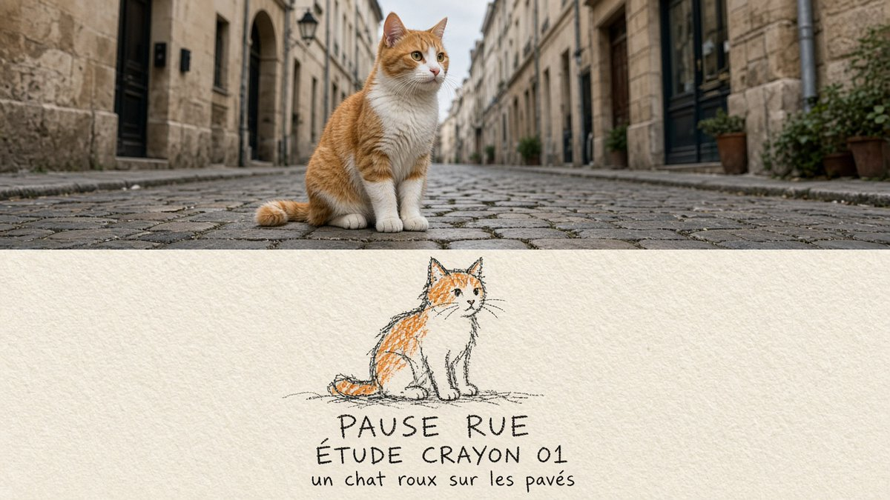

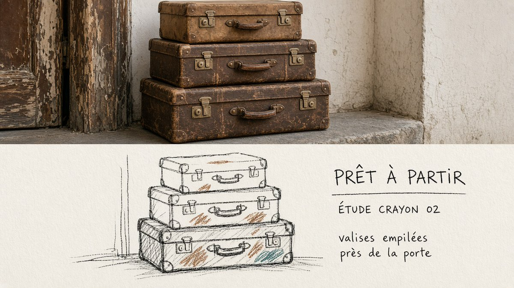

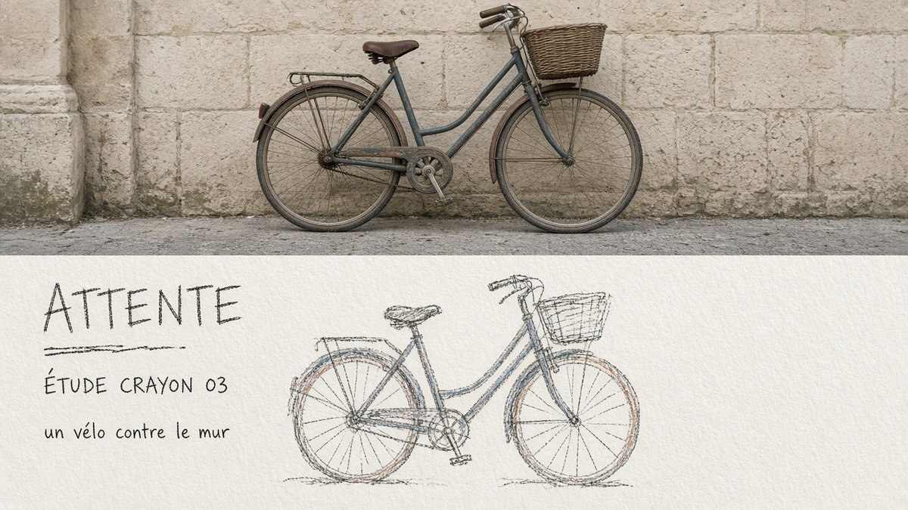

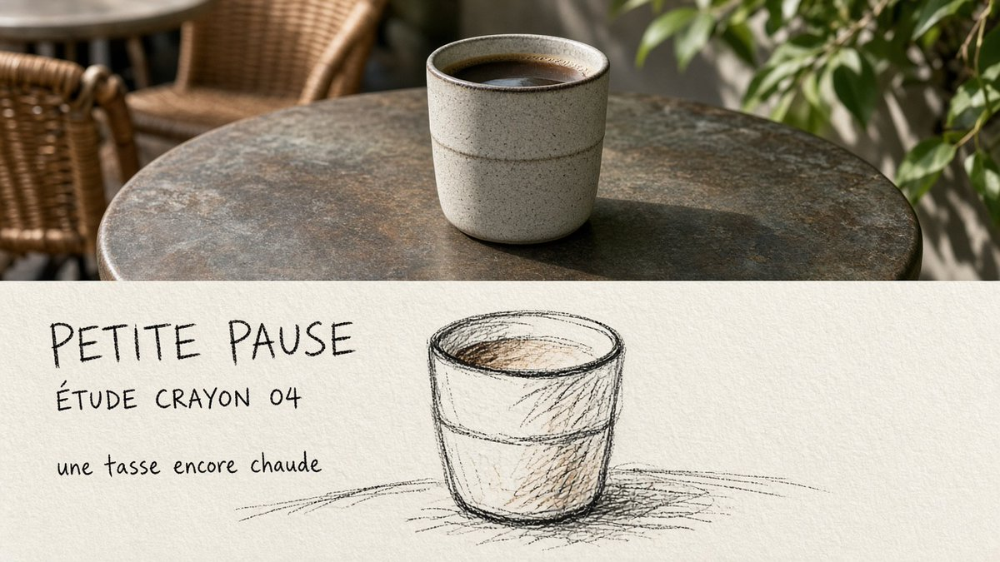

**Prompt**

```text
Erstelle ein hochwertiges vertikales redaktionelles Vergleichsposter, das mit einer sauberen, geraden Mittellinie exakt 50/50 oben und unten geteilt ist. Obere Hälfte: fotorealistische Reisefotografie von [SUBJECT] mit natürlichem Licht, authentischer Textur, nur leichter Farbkorrektur auf Magazin-Niveau — halte das Foto realistisch, illustriere die obere Hälfte nicht. Untere Hälfte: spärliche Geste-Studie mit schwarzer Wachskreide desselben Motivs auf warmweißem Papier mit Struktur — zögerliche, unterbrochene Kreideumrisse, unvollständige Füllungen, Papierstruktur, ein oder zwei leichte Farbverwischungen mit Kreide, die dem Foto entnommen sind. Entferne fast den gesamten Hintergrund; behalte nur eine schwache Bodenlinie oder einen Wandhinweis bei. Das Motiv besteht größtenteils aus papierweißem Negativraum, nicht vollständig ausgefüllt. Das Motiv nimmt etwa 38–58 % der unteren Breite ein, mittig unten platziert. Durchgehende warmweiße Leerstelle ≥55 %. Handschriftlicher, zittriger Kreidetext auf Französisch, deutlich lesbar: ein kurzer Titel, « ÉTUDE CRAYON 0N », und eine sachliche Beobachtung auf Französisch. Kein englischer Text. Vermeide feine Fell-Details, niedliche Vektormaskottchen, vollständige Füllungen, dichte Kritzeleien, vollständige Hintergründe, glatten digitalen Bleistift, Produktillustrationen, Logos, Signaturen, Wasserzeichen. Motive: un chat roux sur les pavés (PAUSE RUE / ÉTUDE CRAYON 01), valises empilées près de la porte (PRÊT À PARTIR / ÉTUDE CRAYON 02), un vélo contre le mur (ATTENTE / ÉTUDE CRAYON 03), une tasse encore chaude (PETITE PAUSE / ÉTUDE CRAYON 04).
```

[↑ Zurück zu Kategorien](#catalog)

---

<a name="prompt-2097875834103287904"></a>

### Übersetzung läuft

Autor：[@Hamburgerai](https://x.com/Hamburgerai) · [Originalbeitrag](https://x.com/Hamburgerai/status/2097875834103287904)

Skizze / Strichzeichnung · Aquarell · Veröffentlicht

**Zusammenfassung:** Übersetzung läuft


**Prompt**

```text
Übersetzung läuft
```

[↑ Zurück zu Kategorien](#catalog)

---

<a name="category-comic-graphic-novel"></a>

## Comic / Graphic Novel

<a name="prompt-2098359042234351871"></a>

### 3D-übertriebenes Comedy-Karikaturporträt einer erwachsenen Frau mit asymmetrischen großen Augen, großer Nase, großen Ohren und bizarrem Lächeln, akzentuiert durch Studio-Kantenlicht.

Autor：[@Tanvir48992](https://x.com/Tanvir48992) · [Originalbeitrag](https://x.com/Tanvir48992/status/2098359042234351871)

Comic / Graphic Novel · 3D-Rendering · Porträt / Selfie · Charakter · Veröffentlicht

Originalbeitrag：[@Tanvir48992](https://x.com/Tanvir48992) · [Originalbeitrag](https://x.com/Tanvir48992/status/2098292936064844224)

**Zusammenfassung:** 3D-übertriebenes Comedy-Karikaturporträt einer erwachsenen Frau mit asymmetrischen großen Augen, großer Nase, großen Ohren und bizarrem Lächeln, akzentuiert durch Studio-Kantenlicht.

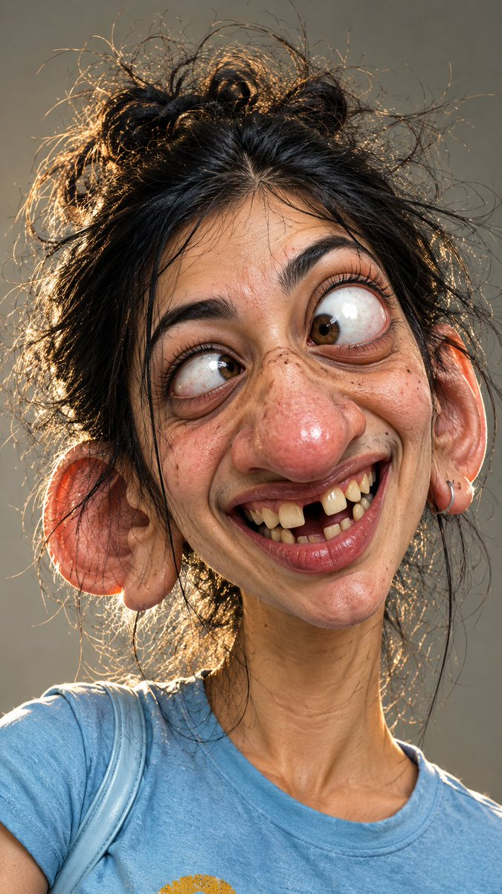

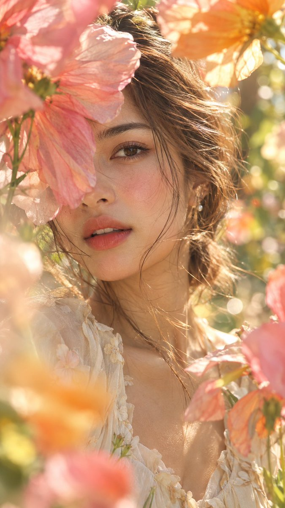

**Prompt**

```text
[Erstelle ein originelles, stark stilisiertes 3D-Karikaturporträt einer erwachsenen Frau, gestaltet mit extremer komödiantischer Gesichtsübertreibung, während erkennbare menschliche Merkmale beibehalten werden. Gib ihr einen dramatisch überdimensionierten Kopf, wild ungleiche Gesichtsproportionen, große asymmetrische Glubschaugen, eine übertrieben krumme Nase, übergroße Hängeohren und ein enormes albernes Grinsen mit unregelmäßig angeordneten Zähnen.

Ihre Gesichtsstruktur sollte unter der Übertreibung glaubwürdig bleiben, mit ausdrucksstarken Augenbrauen, natürlichen Gesichtsfalten, ungleichmäßiger Hauttextur, sichtbaren Poren, subtilen Unreinheiten und realistischen Makeln. Gib ihr chaotisches, krauses dunkles Haar mit einzelnen Strähnen, die in verschiedene Richtungen abstehen.

Rendere den Charakter in einer halbrealistischen, hochdetaillierten 3D-Ästhetik mit physikalisch glaubwürdiger Haut, Haaren, Zähnen und Materialien. Verwende dramatisches Studio-Kantenlicht von hinten und den Seiten, das helle Glanzlichter um die Haare und Ohren erzeugt und gleichzeitig Falten, Textur und Gesichtskonturen hervorhebt. Füge weiches frontales Fülllicht hinzu, damit das Gesicht deutlich sichtbar bleibt.

Halte die Komposition minimalistisch und aufgeräumt mit einem einfachen, neutralen Studiohintergrund. Rahme die Figur als vertikales 9:16-Porträt ein, zentriert und eng gefasst, wobei der enorme Kopf das Bild dominiert.

Stimmung: absurd, lustig, bizarr, verspielt, übertrieben, leicht grotesk und visuell einprägsam.

Vermeide erkennbare urheberrechtlich geschützte Charaktere, Ähnlichkeiten mit Prominenten, bestehende Kunstwerke, Logos, Wasserzeichen, Text, plastikartig wirkende Haut, übermäßigen CGI-Glanz, doppelte Gesichtszüge, zusätzliche Augen, zusätzliche Gliedmaßen, fehlgebildete Hände, verzerrte Zähne, verschwommene Details, niedrige Auflösung und unnatürliche Anatomie.]
```

[↑ Zurück zu Kategorien](#catalog)

---

<a name="category-3d-render"></a>

## 3D-Rendering

<a name="prompt-2097725977443131648"></a>

### Verwandlung eines Fotos in eine Sammler-Actionfigur in einer hochwertigen Verpackung, inklusive Personenmerkmalen und Miniaturzubehör im Stil von 3D-Rendering und Produktfotografie.

Autor：[@SylviaTiongX](https://x.com/SylviaTiongX) · [Originalbeitrag](https://x.com/SylviaTiongX/status/2097725977443131648)

Fotografie · 3D-Rendering · Charakter · Produkt · Veröffentlicht

**Zusammenfassung:** Verwandlung eines Fotos in eine Sammler-Actionfigur in einer hochwertigen Verpackung, inklusive Personenmerkmalen und Miniaturzubehör im Stil von 3D-Rendering und Produktfotografie.


**Prompt**

```text
Verwandle dieses Foto in eine Sammler-Actionfigur. Behalte die wiedererkennbaren Gesichtszüge und die Frisur der Person bei. Platziere die Figur in einer hochwertigen Einzelhandelsverpackung und füge Miniaturzubehör hinzu, das zu den Interessen der Person passt. Verwende einen professionellen Produktfotografie-Stil, realistische Texturen, verspielte Details und ein verfeinertes 3D-Rendering.
```

[↑ Zurück zu Kategorien](#catalog)

---

<a name="prompt-2097507029858300297"></a>

### Zauberhafte 3D-CGI-Fantasy-Illustration eines Fuchswelpen in einer goldenen Weste und eines Rehkitzes auf einem nebligen Steinpfad.

Autor：[@RockGrokAI](https://x.com/RockGrokAI) · [Originalbeitrag](https://x.com/RockGrokAI/status/2097507029858300297)

Illustration · 3D-Rendering · Charakter · Veröffentlicht

**Zusammenfassung:** Zauberhafte 3D-CGI-Fantasy-Illustration eines Fuchswelpen in einer goldenen Weste und eines Rehkitzes auf einem nebligen Steinpfad.


**Prompt**

```text
Zauberhafte 3D-CGI-Fantasy-Illustration eines bezaubernden Fuchswelpen und eines sanften Rehkitzes, die zusammen auf einem rissigen Steinpfad in einer nebligen Felslandschaft stehen. Der flauschige Fuchswelpe hat leuchtend orangefarbenes Fell mit weißen Akzenten, einen buschigen Schwanz, riesige funkelnde smaragdgrüne Augen, goldene stachelige Haarbüschel auf dem Kopf und eine kunstvoll bestickte goldene Weste. Er blickt zu dem Rehkitz auf, das weiches hellbraunes Fell mit weißen Punkten, große ausdrucksstarke Augen und einen süßen Ausdruck hat. Dichter Nebel, dunkle Felsklippen, knorrige Bäume und üppige lila Lavendelblüten umgeben sie. Weiche volumetrische Beleuchtung, detaillierte Felltexturen, satte Erdtöne mit lebendigen Lilatönen, filmische Tiefe, bezaubernde herzerwärmende Atmosphäre.
```

[↑ Zurück zu Kategorien](#catalog)

---

<a name="prompt-2097514564875104516"></a>

### Erstelle mir ein Server-Rack für 6 Nvidia Sparks mit einem effizienten, ästhetisch ansprechenden Design.

Autor：[@VKs\_Host](https://x.com/VKs_Host) · [Originalbeitrag](https://x.com/VKs_Host/status/2097514564875104516)

3D-Rendering · Veröffentlicht

**Zusammenfassung:** Erstelle mir ein Server-Rack für 6 Nvidia Sparks mit einem effizienten, ästhetisch ansprechenden Design.


**Prompt**

```text
Erstelle mir ein Server-Rack für 6 Nvidia Sparks mit einem effizienten, ästhetisch ansprechenden Design.
```

[↑ Zurück zu Kategorien](#catalog)

---

<a name="category-retro-vintage"></a>

## Retro / Vintage

<a name="prompt-2098382221514334261"></a>

### Erstelle anhand eines Reisefotos ein 3:4-Hochformat-Poster, das das Originalfoto diagonal überlappend einer Briefmarkenkarte im Vintage-Kupferstich-Stil gegenüberstellt.

Autor：[@Hamburgerai](https://x.com/Hamburgerai) · [Originalbeitrag](https://x.com/Hamburgerai/status/2098382221514334261)

Plakat / Flyer · Retro / Vintage · Veröffentlicht

**Zusammenfassung:** Erstelle anhand eines Reisefotos ein 3:4-Hochformat-Poster, das das Originalfoto diagonal überlappend einer Briefmarkenkarte im Vintage-Kupferstich-Stil gegenüberstellt.

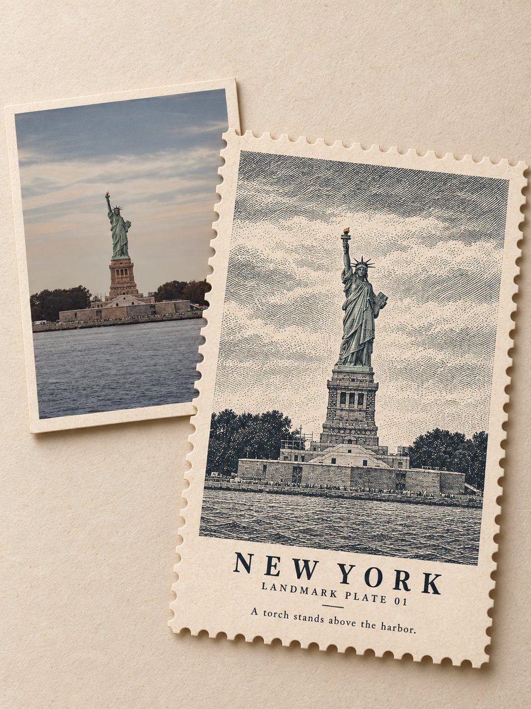

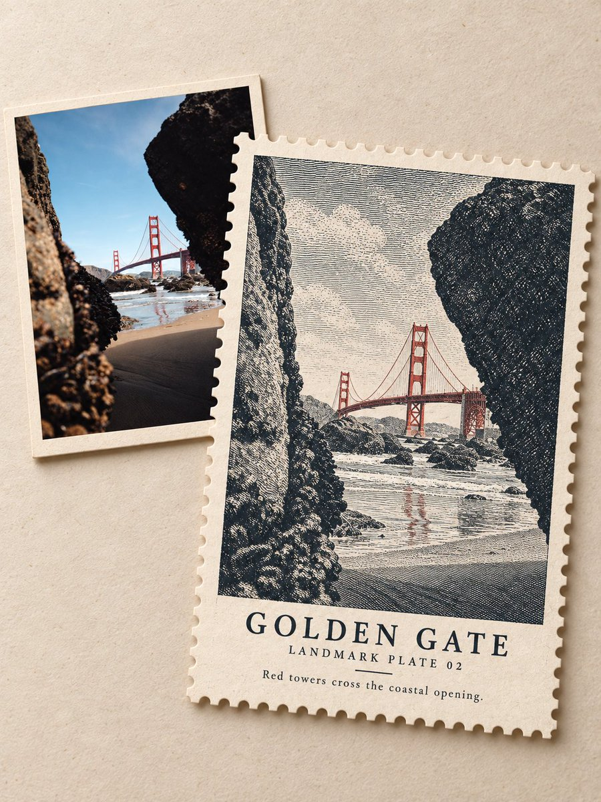

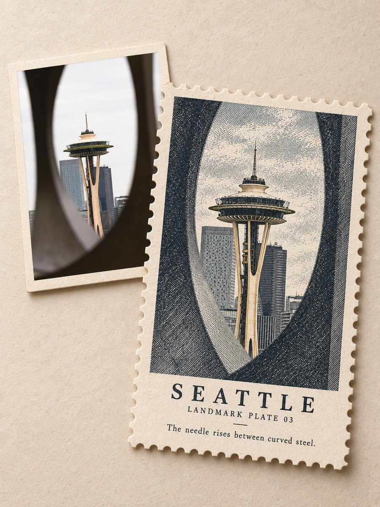

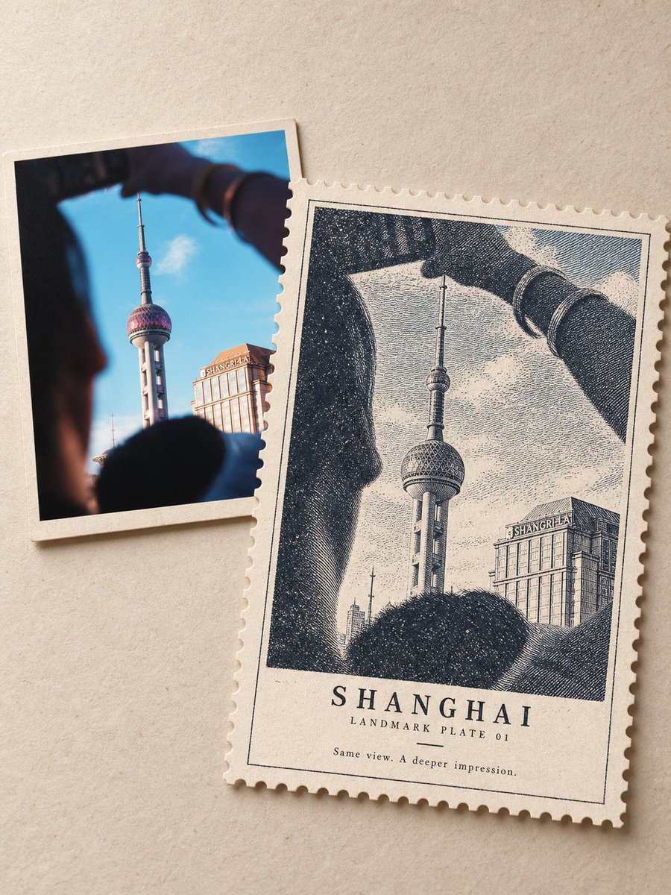

**Prompt**

```text
Bitte erstelle aus dem hochgeladenen Reisefoto einer Sehenswürdigkeit ein redaktionelles 3:4-Hochformat-Poster im Stil einer „Sehenswürdigkeits-Stichmarken-Gegenüberstellung“.

Verwende kein vertikales Diptychon (oben/unten). Die Komposition verwendet einen durchgehenden Hintergrund aus warmem, elfenbeinfarbenem, ungestrichenem Papier, auf dem nur zwei diagonal überlappende physische Papierkarten präsentiert werden:

Hinten links befindet sich eine kleinere echte Fotokarte, die etwa 36 %–44 % der Posterbreite einnimmt und um etwa 3–6 Grad gegen den Uhrzeigersinn gedreht ist. Das Wahrzeichen, der Betrachtungswinkel, die architektonische Struktur, die Jahreszeit, das Wetter, das Licht, die Umgebung und die Farben des Originalfotos bleiben vollständig und deutlich erhalten; lediglich eine dezente verlegerische Farbkorrektur ist zulässig. Die Fotokarte hat schmale, schlichte Papierränder und eine spürbare Papierstärke; sie darf nicht zu einem dekorativen Miniaturbild verkleinert werden.

Vorne rechts befindet sich eine größere, vertikale gestochene Briefmarke, die etwa 58 %–68 % der Posterbreite einnimmt, um etwa 2–4 Grad im Uhrzeigersinn gedreht ist und die Fotokarte natürlich teilweise überdeckt. Die Briefmarke besteht aus schwerem, warmweißem Antikpapier; alle vier Außenkanten müssen exakt identische halbkreisförmige Stanzperforationen mit einheitlichem Lochdurchmesser, Abstand, Tiefe und Form aufweisen, wobei das gleiche Muster auch an allen vier Ecken beibehalten wird. Zeige Papierkanten, Fasern und natürliche Kontaktschatten, ohne verzierte Rahmen.

Das Innere der Briefmarke rekonstruiert das Wahrzeichen ausschließlich auf Basis desselben Fotos; füge kein Fotoduplikat ein. Behalte den ursprünglichen Betrachtungswinkel, die Hauptstruktur, die Ausrichtung, die Proportionen, das Wetter und die Jahreszeit des Wahrzeichens bei und zeige nur das Wahrzeichen sowie 1–2 wesentliche Umgebungselemente wie Baumgrenze, Wasserfläche, Berge, Felsrahmungen, Straßen oder benachbarte Gebäude.

Verwende die Bildsprache eines monochromen oder dezent zweifarbigen Kupferstichs: dunkelblau-schwarze oder kohleschwarze Haupttinte, wobei eine extrem kleine Sonderfarbfläche aus dem Originalbild extrahiert werden darf. Gestalte Ebenen durch feine Kreuzschraffuren, parallele Linien, Punktierungen, unterschiedliche Liniendichten, Patina unvollständiger Tintenabdrücke und papierweiße Lichter. Es muss wie ein echter Tiefdruck wirken – keine Bleistiftskizze, kein Holzschnitt, kein Aquarell, kein digitaler Filter und keine glatte Vektorgrafik.

Im unteren Bereich der Briefmarke befindet sich ein ruhiges Beschriftungsfeld, das ausschließlich folgendes enthält:
"[Echter englischer Ortsname]"
"LANDMARK PLATE [Nummer]"
"[Eine Zeile mit 5–9 englischen Wörtern einer echten Beobachtung]"

Der Titel ist in einer Antiqua-Serifenschrift mit weitem Zeichenabstand gesetzt; die Beschriftungsfelder und der Beobachtungssatz sind kleiner, aber deutlich lesbar, wie mit Tinte in das Papier geprägt. Füge keine fiktiven Nennwerte, staatlichen Ausgabevermerke, Poststempel, Wappen, Autorennamen, Fotografennamen, Logos, URLs oder sonstige Texte hinzu.

Das Gesamtbild wirkt wie ein Reiseexemplar aus dem Kupferstichkabinett eines Museums: zurückhaltende Komposition, klare Größenverhältnisse, reichlich Weißraum auf dem Papier und eine deutliche Gegenüberstellung von echtem Foto und gravierter Erinnerung.

Vermeide: Vertikales Diptychon (oben/unten), gleich große Anordnung nebeneinander, Fotowiederholungen, direkt in die Briefmarke eingedruckte Fotos, mehrere Briefmarken, zusätzliche Karten, unregelmäßige Zähnung, ungleiche Zähnung an verschiedenen Kanten, dekorative Ornamentrahmen, falsche Nennwerte, gefälschte Poststempel, fiktive Wahrzeichen, veränderte Betrachtungswinkel, handgehaltene Mockups, Schreibtisch-Unordnung, Bilderrahmen, Autorensignaturen, Marken, Logos, Wasserzeichen und wirre Zeichen.
```

[↑ Zurück zu Kategorien](#catalog)

---

<a name="prompt-2098351198072111552"></a>

### Ein Prompt für ein zweigeteiltes Layout im Stil „Reisenotizen mit Briefmarkenfenster“, das Vintage-Papier, Briefmarkenzähnung und reale Fotopostergestaltung kombiniert.

Autor：[@Hamburgerai](https://x.com/Hamburgerai) · [Originalbeitrag](https://x.com/Hamburgerai/status/2098351198072111552)

Plakat / Flyer · Fotografie · Retro / Vintage · Text / Typografie · Veröffentlicht

**Zusammenfassung:** Ein Prompt für ein zweigeteiltes Layout im Stil „Reisenotizen mit Briefmarkenfenster“, das Vintage-Papier, Briefmarkenzähnung und reale Fotopostergestaltung kombiniert.

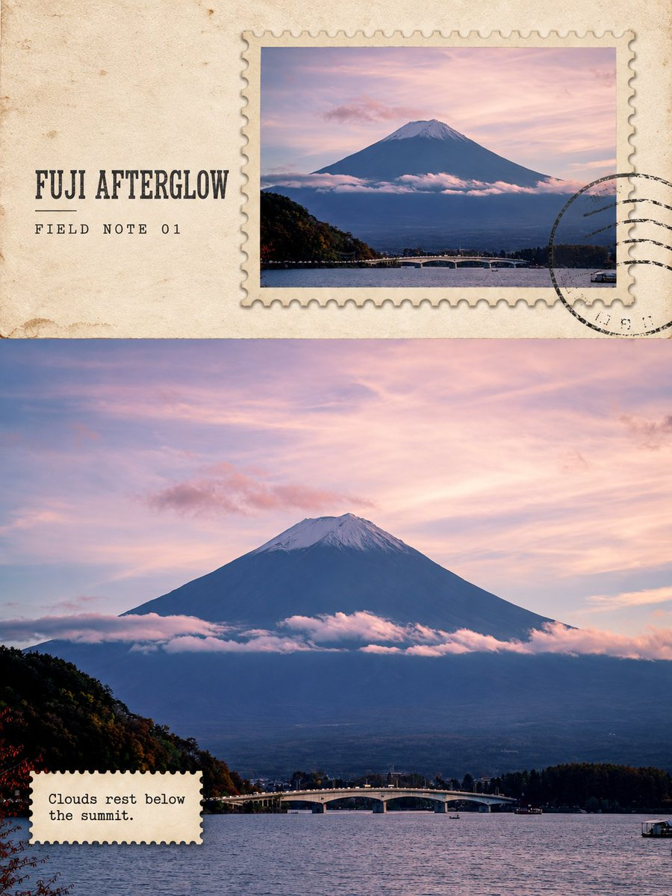

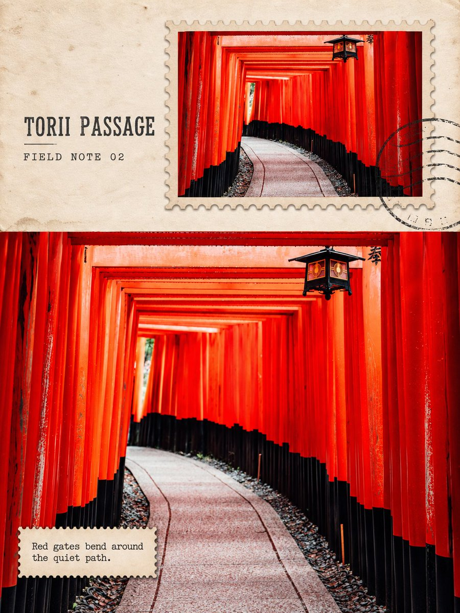

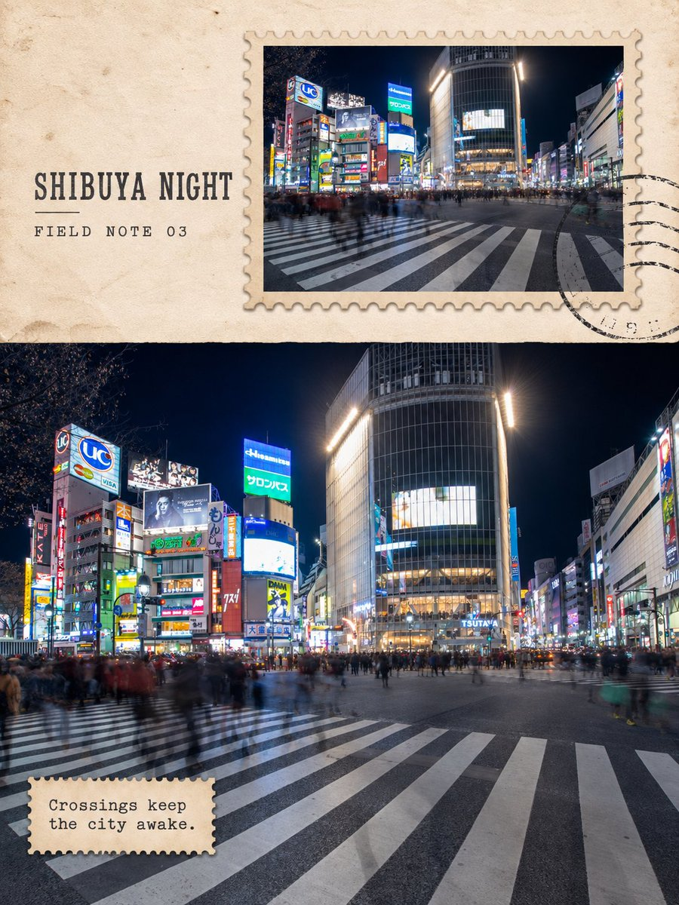

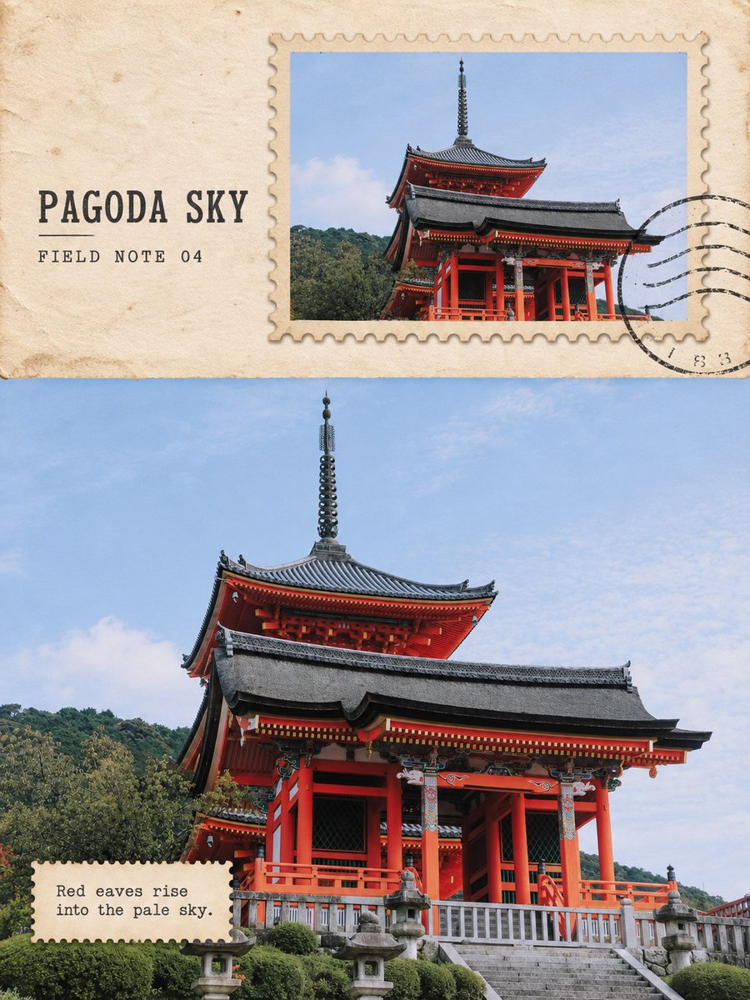

**Prompt**

```text
Eingabebild 1 ist das Reisefoto, das originalgetreu verwendet werden muss; Eingabebild 2 dient ausschließlich als Referenz für Layout, Papier, Briefmarkenzähnung, Poststempel und Texthierarchie – kopieren Sie weder den konkreten Ort noch das Hauptmotiv aus Eingabebild 2.

Verarbeiten Sie Eingabebild 1 zu einem redaktionellen 3:4-Hochformat-Poster im Stil von „Reisenotizen mit Briefmarkenfenster“. Verwenden Sie strikt ein zweigeteiltes Layout ohne Illustratorik; alle Fotobereiche müssen dieselbe reale Szene aus Eingabebild 1 verwenden.

Der obere Abschnitt nimmt ca. 37 % des Bildes ein:

Verlegen Sie warmes, hell-elfenbeinfarbenes Altpapier unter Beibehaltung echter Papierfasern, feiner Knicke, natürlicher Flecken und weicher Schatten.

Auf der linken Seite stehen zwei Zeilen dunkelgrau-schwarzer Text im alten Schreibmaschinenstil:

[Ort oder Erinnerungstitel]
FIELD NOTE [Nummer]

Der Titel ist größer, der Zeichenabstand des Feldes angemessen gesperrt und umgeben von ausreichend weißer Papierfläche.

Auf der rechten Seite befindet sich eine querformatige Fotobriefmarke mit einer Breite von etwa 58 % des oberen Bereichs. Innerhalb der Briefmarke wird das reale Foto aus Eingabebild 1 verwendet, passend für das Querformat zugeschnitten, wobei das Hauptmotiv erhalten bleibt.

Die Fotobriefmarke besitzt:

- Einen warmweißen, dicken Papierrand;
- Regelmäßige, gestanzte Halbkreis-Zähnungen an allen vier Seiten;
- Eine feine Papierstärke;
- Einen zurückhaltenden, natürlichen Kontaktschatten;
- Leicht gealterte, aber saubere Papierränder.

In der unteren rechten Ecke der Briefmarke überlagert ein alter schwarzer Poststempel, der teilweise über den Rand hinausragt. Der Stempel enthält einen unvollständigen Kreis und drei parallele Wellenlinien mit abgenutzter, verblasster und halbtransparenter Tintenstruktur, ohne das Hauptmotiv des Fotos zu verdecken.

Der untere Abschnitt nimmt ca. 63 % des Bildes ein:

Lassen Sie dasselbe reale Foto aus Eingabebild 1 randlos von Kante zu Kante verlaufen. Schneiden Sie es natürlich passend für das 3:4-Poster zu und behalten Sie Motive, Personen, Gebäude, Perspektive, Licht und Farben des Originalfotos bei, ohne nicht existierende Bildelemente hinzuzufügen.

Der untere Bereich muss die Textur echter Fotografie beibehalten und darf nicht zu Aquarell, Anime, Druckgrafik oder Skizze werden.

Unten links im unteren Foto wird ein kleines horizontales Textetikett aus warmweißem Papier platziert, dessen Breite etwa 25 %–32 % des Bildes beträgt. Das Etikett weist eine leichte Papierstärke und einen weichen Schatten auf und enthält lediglich einen nicht mehr als zweizeiligen Beobachtungssatz in alter Schreibmaschinenschrift:

[Ein kurzer Beobachtungssatz, der sich direkt auf die Szene des Fotos bezieht]

Wichtige Zähnungsregel:

Die obere Fotobriefmarke und das untere Textetikett müssen exakt dasselbe Stanzzählungssystem verwenden:

- Gleicher Lochdurchmesser;
- Gleiche Bogentiefe;
- Gleicher Mittenabstand;
- Gleiche halbkreisförmige Einkerbungsform;
- Gleiche Papierrandbreite.

Die Zähnung darf aufgrund der unterschiedlichen Papiergrößen nicht proportional skaliert werden. Die tatsächliche visuelle Größe der Löcher im fertigen Werk muss identisch sein; sie darf nicht an einer Stelle fein und an der anderen grob sein und darf sich nicht in Sägezähne, Wellenränder oder gerissene Papierkanten verwandeln.

Das Gesamtbild gleicht einer Fotoseite aus einem alten Reise-Archiv: oben Titel und briefmarkengroße Miniaturansicht, unten ein Großfoto desselben Ortes, ein Beobachtungssatz auf einem kleinen gezähnten Papierstreifen gedruckt. Die Farben stammen aus dem Originalfoto; das Papierbild ist zurückhaltend, die Informationen sind spärlich, aber präzise.

Zu vermeiden: Illustrationsumwandlung, Aquarell, Anime, Radierung, schlichte Vorher-Nachher-Vergleiche mit zwei gleich großen Hälften, mehrere Briefmarken, zu viele Poststempel, Ansammlungen von Bullet-Journal-Stickern, Klebeband, linke und rechte Spaltenaufteilung, große Papierflächen unten, Autorennamen, Marken, Logos, URLs, QR-Codes, Wasserzeichen, Zeichensalat und zusätzlicher Text.
```

[↑ Zurück zu Kategorien](#catalog)

---

<a name="prompt-2097892340165992619"></a>

### Prompt für ein Retro-Porträt im Kodak-Filmstil der 1980er Jahre mit rosa Hemd, schwarzem High-Waist-Rock, Retro-Locken und Raumkulisse.

Autor：[@MissDelulu9](https://x.com/MissDelulu9) · [Originalbeitrag](https://x.com/MissDelulu9/status/2097892340165992619)

Retro / Vintage · Porträt / Selfie · Veröffentlicht

**Zusammenfassung:** Prompt für ein Retro-Porträt im Kodak-Filmstil der 1980er Jahre mit rosa Hemd, schwarzem High-Waist-Rock, Retro-Locken und Raumkulisse.


**Prompt**

```text
Verwandle mein Foto in ein authentisches indisches Retro-Modeporträt aus den 1980er Jahren, inspiriert vom Referenzbild.

Behalte das exakte Gesicht, die Gesichtszüge, die Gesichtsstruktur, den Hautton, die Identität und die natürlichen Proportionen unverändert bei. Das Gesicht nicht verändern oder verschönern.

Kleide sie in ein langärmeliges rosa Hemd, das ordentlich in einen schwarzen Rock mit hoher Taille und einem stilvollen Gürtel gesteckt ist. Entferne den Schal vollständig. Füge schlichte, von den 1980er Jahren inspirierte Accessoires hinzu. Gib ihr schwungvolles, voluminöses Retro-Haar, das mit einer hübschen Schleife gestylt ist.

Schaffe einen authentischen Hintergrund und eine Atmosphäre der 1980er Jahre. Verwende einen Kodak-Filmkamera-Look mit warmen, verblassten Farben, subtiler Filmkörnung, weicher analoger Textur, sanfter Vintage-Beleuchtung und natürlicher Hauttextur. Lass es wie ein echtes Foto aus den 1980er Jahren wirken, nicht wie ein modernes Foto mit einem Vintage-Filter. Kein Wasserzeichen, kein Text, keine Verzerrung.
```

[↑ Zurück zu Kategorien](#catalog)

---

<a name="prompt-2097852814341128610"></a>

### Übersetzung läuft

Autor：[@DDJCXX](https://x.com/DDJCXX) · [Originalbeitrag](https://x.com/DDJCXX/status/2097852814341128610)

Fotografie · Retro / Vintage · Porträt / Selfie · Charakter · Modeartikel · Veröffentlicht

**Zusammenfassung:** Übersetzung läuft


**Prompt**

```text
Übersetzung läuft
```

[↑ Zurück zu Kategorien](#catalog)

---

<a name="prompt-2097886466710085695"></a>

### Übersetzung läuft

Autor：[@oneviske](https://x.com/oneviske) · [Originalbeitrag](https://x.com/oneviske/status/2097886466710085695)

Fotografie · Retro / Vintage · Porträt / Selfie · Charakter · Modeartikel · Stadtbild / Straße · Veröffentlicht

**Zusammenfassung:** Übersetzung läuft


**Prompt**

```text
Übersetzung läuft
```

[↑ Zurück zu Kategorien](#catalog)

---

<a name="prompt-2096936643173216486"></a>

### Prompt zur Umwandlung eines Referenzfotos in ein fotorealistisches Retro-Porträt von 1985 mit authentischer 80er-Jahre-Mode, toupiertem Haar und 35-mm-Film-Ästhetik.

Autor：[@SalaheldinNehal](https://x.com/SalaheldinNehal) · [Originalbeitrag](https://x.com/SalaheldinNehal/status/2096936643173216486)

Fotografie · Retro / Vintage · Porträt / Selfie · Modeartikel · Veröffentlicht

**Zusammenfassung:** Prompt zur Umwandlung eines Referenzfotos in ein fotorealistisches Retro-Porträt von 1985 mit authentischer 80er-Jahre-Mode, toupiertem Haar und 35-mm-Film-Ästhetik.


**Prompt**

```text
Wie hätte ich in den 1980er-Jahren ausgesehen? Verwende das beigefügte Foto als Referenz. Behalte meine genauen Gesichtszüge, mein Lächeln, meinen Hautton, meine Augenform und meine gesamte Identität bei. Style mich so um, als würde ich im Jahr 1985 leben, mit authentischen Mode- und Beauty-Trends der 1980er-Jahre: voluminöses, toupiertes Haar, markantes Augen-Make-up, rosiges Rouge, matter Lippenstift, große Creolen, eine Acid-Wash-Jeansjacke, ein leuchtendes Neon-Top, Jeans mit hoher Taille und klassische Accessoires der 1980er-Jahre. Platziere mich in einer realistischen Kulisse der 1980er-Jahre mit Retro-Postern, einem Kassettenspieler, Schallplatten und warmer Beleuchtung im Filmstil. Lass es wie ein echtes, hochwertiges 35-mm-Foto aus der Mitte der 1980er-Jahre mit feinem Filmkorn und Vintage-Farbtönen wirken. Das Bild sollte fotorealistisch sein und eine starke Ähnlichkeit mit mir aufweisen – keine generische Person der 1980er-Jahre.
```

[↑ Zurück zu Kategorien](#catalog)

---

<a name="category-cyberpunk-sci-fi"></a>

## Cyberpunk / Sci-Fi

<a name="prompt-2097951816675639459"></a>

### Eine 15-sekündige Dokumentarszene aus den frühen 2000er Jahren, in der ein Reporter ein Alien in der Nähe eines gelandeten Raumschiffs interviewt und das Alien enthüllt, dass es zur Erde gekommen ist, um einen McDonald's-Gutschein einzulösen.

Autor：[@DtheW1995](https://x.com/DtheW1995) · [Originalbeitrag](https://x.com/DtheW1995/status/2097951816675639459)

Cyberpunk / Sci-Fi · Veröffentlicht

**Zusammenfassung:** Eine 15-sekündige Dokumentarszene aus den frühen 2000er Jahren, in der ein Reporter ein Alien in der Nähe eines gelandeten Raumschiffs interviewt und das Alien enthüllt, dass es zur Erde gekommen ist, um einen McDonald's-Gutschein einzulösen.


**Prompt**

```text
15-sekündiges ultrarealistisches TV-Dokumentarmaterial aus den frühen 2000er Jahren, gefilmt mit einer handelsüblichen MiniDV-Kamera von einem einzigen physisch anwesenden Kameramann. Nachts auf einem feuchten Feld außerhalb einer amerikanischen Kleinstadt. Ein großes, authentisches metallisches Alien-Raumschiff ist gerade hinter den Personen gelandet und ruht schwer im niedergedrückten, nassen Gras; seine Rampe ist geöffnet, blasses Innenlicht dringt in den Nebel, Kondenswasser tropft von der Hülle und ein tiefes mechanisches Summen ist hörbar. Kein filmischer Feinschliff: verwackelte Schulterkamera, unvollkommener Zoom, langsamer Autofokus, Belichtungsschwankungen bei hellen Lichtern, verwaschene Farben, Zeilensprung-DV-Bewegung, leichtes Bandrauschen und Kompressionsartefakte.    0,0–2,0 s — HOOK: Beginn mitten im außergewöhnlichen Interview. Ein nervöser männlicher TV-Reporter steht direkt vor dem Raumschiff neben einem großen, dünnen, aber biologisch glaubwürdigen Alien. Der Reporter hält ein kabelgebundenes Nachrichtenmikrofon in seine Richtung, während die Kamera schnell vom leuchtenden Schiff auf das detaillierte Gesicht des Aliens zoomt. Das Alien hat feuchte, texturierte graue Haut, eine subtile Atmung, blinzelnde schwarze Augen und ein natürliches Körpergewicht; es ist kein Kostüm und nicht cartoonartig.    2,0–5,5 s: In einer einzigen kontinuierlichen Handkamera-Einstellung blickt der Reporter zum Alien auf und fragt ernst auf Englisch: „Why did you come to Earth? What are you looking for?“ Seine Art ist vorsichtig und professionell. Der Kameramann verliert beim Neukadrieren beider Gesichter kurz den Fokus und korrigiert ihn dann. Das Alien denkt eine unangenehme Sekunde lang schweigend über die Frage nach, während das Schiff hinter ihnen summt.    5,5–11,5 s — TROCKENE POINTE: Das Alien greift langsam in eine kleine metallische Tasche, die an seinem Körper befestigt ist, und holt einen leicht zerknitterten Papiergutschein hervor. Es hält den Gutschein zwischen zwei langen Fingern hoch und antwortet ruhig, in perfekt verständlichem Englisch mit einer seltsamen, trockenen Stimme: „I came to redeem this coupon. Twenty-piece Chicken McNuggets, with sweet-and-sour sauce. At McDonald’s.“ Sein Gesicht bleibt vollkommen ernst. Die Mundbewegung passt ausschließlich zum Dialog des Aliens.    11,5–15,0 s — NACHWIRKUNG: Der Reporter senkt das Mikrofon leicht und starrt das Alien völlig fassungslos an. Die Kamera führt einen ungeschickten, versehentlichen Zoom auf den Gutschein aus, dann zurück auf das verwirrte Gesicht des Reporters. Das Alien deutet sachlich auf die ferne Stadt, als würde es nach dem Weg fragen. Der Kameramann versucht, ein leises Lachen zu unterdrücken. Der Reporter murmelt schließlich: „Right … okay.“ Abrupter, authentischer Schnitt im Bandstil.    AUDIO: sauberer englischer Originalton vor Ort, jedoch mit unvollkommener Mikrofonqualität der frühen 2000er Jahre, leichter Wind, feuchtes Gras unter den Schuhen, ferne Insekten, Raumschiffbelüftung und elektrisches Summen. Keine Musik, kein Sprechertext, keine Trailer-Soundeffekte oder Lachtracks. Der Humor entsteht gänzlich aus dem ernsten Dokumentarton und der absurd banalen Antwort.    KONTINUITÄT / NEGATIVE: nur ein Reporter, ein Alien, ein Kameramann und ein Raumschiff; kontinuierliche, erreichbare Kameraposition; keine unmöglichen Kamerawinkel, duplizierten Personen oder Aliens, Morphing, Schweben, Teleportation, Cartoon-CGI, leuchtende magische Augen, Aggression, Waffen, Menschenmengen, Untertitel, Bildschirmtext, wechselnder Gutschein oder wechselndes Mikrofon.
```

[↑ Zurück zu Kategorien](#catalog)

---

<a name="category-minimalism"></a>

## Minimalismus

<a name="prompt-2097872057157783561"></a>

### Übersetzung läuft

Autor：[@DDJCXX](https://x.com/DDJCXX) · [Originalbeitrag](https://x.com/DDJCXX/status/2097872057157783561)

Fotografie · Minimalismus · Charakter · Modeartikel · Veröffentlicht

**Zusammenfassung:** Übersetzung läuft


**Prompt**

```text
Übersetzung läuft
```

[↑ Zurück zu Kategorien](#catalog)

---

<a name="category-other"></a>

## Sonstige

<a name="prompt-2098498537466249640"></a>

### Übersetzung läuft

Autor：[@RobinMurrat43a](https://x.com/RobinMurrat43a) · [Originalbeitrag](https://x.com/RobinMurrat43a/status/2098498537466249640)

Essen / Trinken · Veröffentlicht

**Zusammenfassung:** Übersetzung läuft

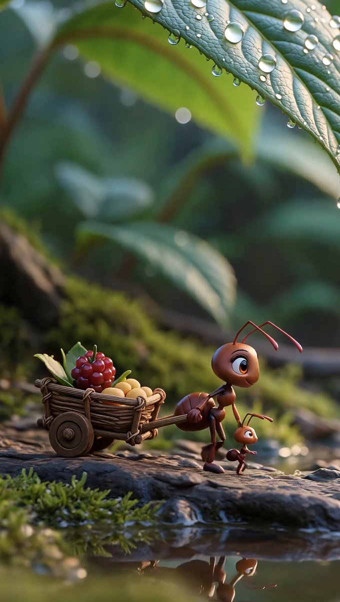

**Prompt**

```text
Übersetzung läuft
```

[↑ Zurück zu Kategorien](#catalog)

---

<a name="prompt-2098472353114079243"></a>

### Eine Steinstatue erwacht zum Leben und tanzt Ballett im Garten eines Anwesens, festgehalten in einem dynamischen One-Take.

Autor：[@iamneubert](https://x.com/iamneubert) · [Originalbeitrag](https://x.com/iamneubert/status/2098472353114079243)

Sonstige · Veröffentlicht

**Zusammenfassung:** Eine Steinstatue erwacht zum Leben und tanzt Ballett im Garten eines Anwesens, festgehalten in einem dynamischen One-Take.

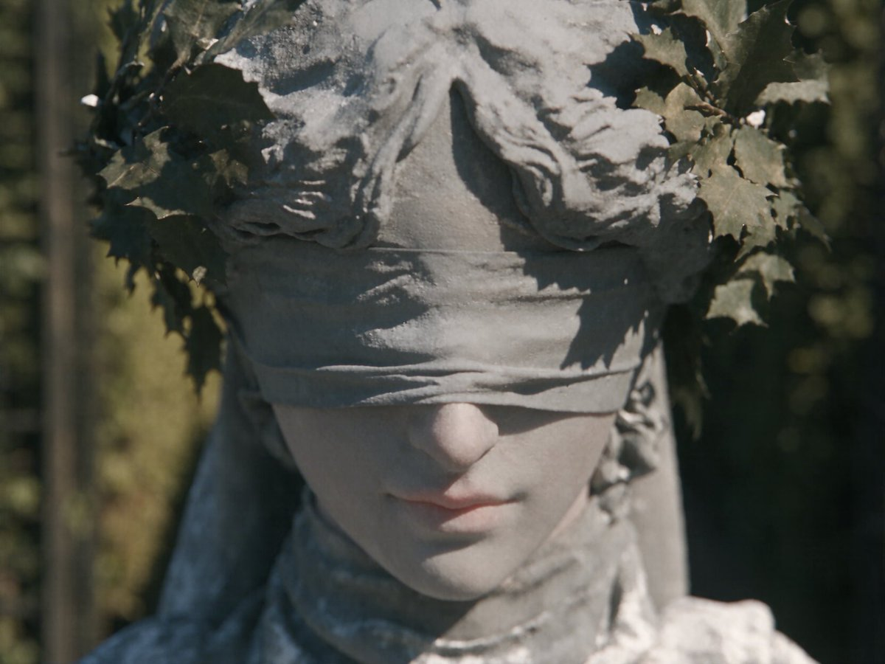

**Prompt**

```text
Filmische Unreal Engine-Szene, eine Steinstatue erwacht zum Leben und tanzt ein wunderschönes Ballett durch den Garten eines großen Anwesens, sich schnell bewegende dynamische Kamera, One-Take.
```

[↑ Zurück zu Kategorien](#catalog)

---

<a name="prompt-2098486894028107840"></a>

### Bearbeitungs-Prompt zur Erstellung einer realistischen Werbekarte für einen Teilnehmer einer ländlichen Reality-Show anhand eines Selfies.

Autor：[@hojeemdia](https://x.com/hojeemdia) · [Originalbeitrag](https://x.com/hojeemdia/status/2098486894028107840)

Porträt / Selfie · Veröffentlicht

**Zusammenfassung:** Bearbeitungs-Prompt zur Erstellung einer realistischen Werbekarte für einen Teilnehmer einer ländlichen Reality-Show anhand eines Selfies.

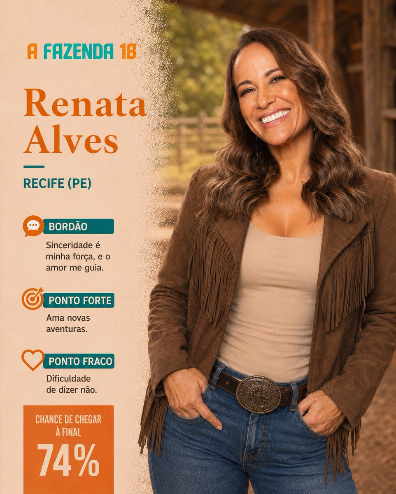

**Prompt**

```text
Verwandle mein Selfie in eine realistische Vorstellungskarte eines Teilnehmers von A Fazenda 18. Füge [NAME], [STADT], Slogan, Stärke, Schwäche und die Chance auf das Erreichen des Finales hinzu. Behalte mein Gesicht und mein natürliches Aussehen originalgetreu bei. Foto im 4:5-Format, spontane Pose, direkter Blick, dezenter ländlicher Hintergrund, sanftes Licht, echte Hauttextur und asymmetrische redaktionelle Komposition. Farbpalette: Pfirsichbeige #f2ceb0, Aquagrün #00ad9d und Orange #e98300. Wenig Text, natürlicher Look, ohne übermäßige Retusche, Effekte, erfundene Logos oder das Aussehen eines KI-generierten Bildes.
```

[↑ Zurück zu Kategorien](#catalog)

---

<a name="prompt-2098469621892587716"></a>

### Prompt für das Porträt einer trägen, verführerischen Frau, die mit herabrutschendem dünnem Hemd und aufgestütztem Kinn am Fenster lehnt.

Autor：[@Hamburgerai](https://x.com/Hamburgerai) · [Originalbeitrag](https://x.com/Hamburgerai/status/2098469621892587716)

Porträt / Selfie · Charakter · Modeartikel · Veröffentlicht

**Zusammenfassung:** Prompt für das Porträt einer trägen, verführerischen Frau, die mit herabrutschendem dünnem Hemd und aufgestütztem Kinn am Fenster lehnt.

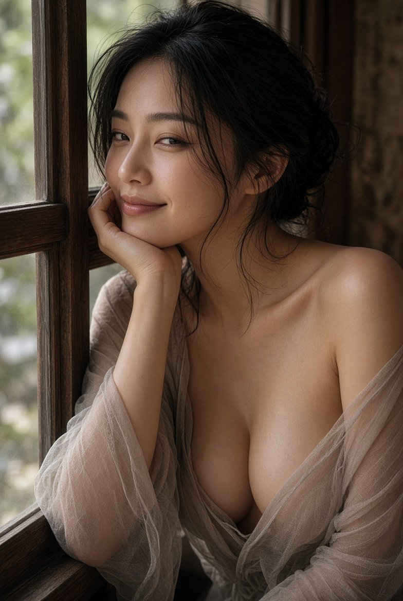

**Prompt**

```text
dünnes Oberteil mit weitem Ausschnitt; viel sichtbare Haut am Dekolleté; herabrutschendes Gazegewand; am Fenster lehnend das Kinn auf die Hand gestützt; leicht gehobene Brauen und Blicke; ein Lächeln auf den Lippenwinkeln; lasziv und verführerisch
```

[↑ Zurück zu Kategorien](#catalog)

---

<a name="prompt-2098476919939342835"></a>

### Darstellung einer kühlen Frau im antiken Stil, die sich am frühen Morgen die Haare kämmt.

Autor：[@Hamburgerai](https://x.com/Hamburgerai) · [Originalbeitrag](https://x.com/Hamburgerai/status/2098476919939342835)

Porträt / Selfie · Charakter · Veröffentlicht

**Zusammenfassung:** Darstellung einer kühlen Frau im antiken Stil, die sich am frühen Morgen die Haare kämmt.

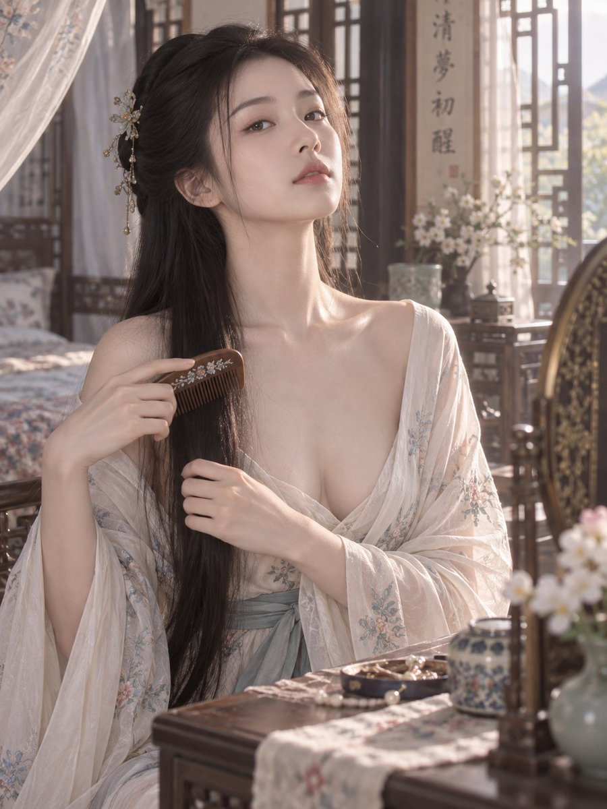

**Prompt**

```text
Schlafgewand mit weitem Kragen; viel freie Haut auf der Brust; deutlich sichtbare Schlüsselbeine; morgendliches Haarekämmen nach dem Aufstehen; leicht angehobenes Kinn; kalter, distanzierter Gesichtsausdruck; leicht und unnahbar
```

[↑ Zurück zu Kategorien](#catalog)

---

<a name="prompt-2098418180674773370"></a>

### Übersetzung läuft

Autor：[@abs\_uiux](https://x.com/abs_uiux) · [Originalbeitrag](https://x.com/abs_uiux/status/2098418180674773370)

Charakter · Modeartikel · Veröffentlicht

**Zusammenfassung:** Übersetzung läuft

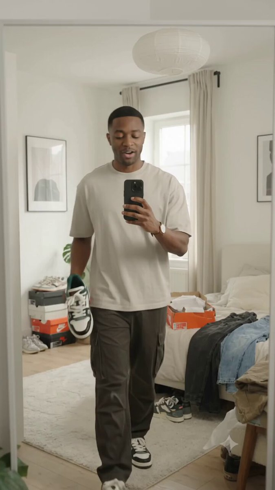

**Prompt**

```text
Übersetzung läuft
```

[↑ Zurück zu Kategorien](#catalog)

---

<a name="prompt-2098393816650879459"></a>

### Erstelle ein realistisches UGC-Video einer Frau, die ihr Outfit in einem modernen Zuhause präsentiert.

Autor：[@sophiaparkerr\_](https://x.com/sophiaparkerr_) · [Originalbeitrag](https://x.com/sophiaparkerr_/status/2098393816650879459)

Charakter · Modeartikel · Veröffentlicht

**Zusammenfassung:** Erstelle ein realistisches UGC-Video einer Frau, die ihr Outfit in einem modernen Zuhause präsentiert.

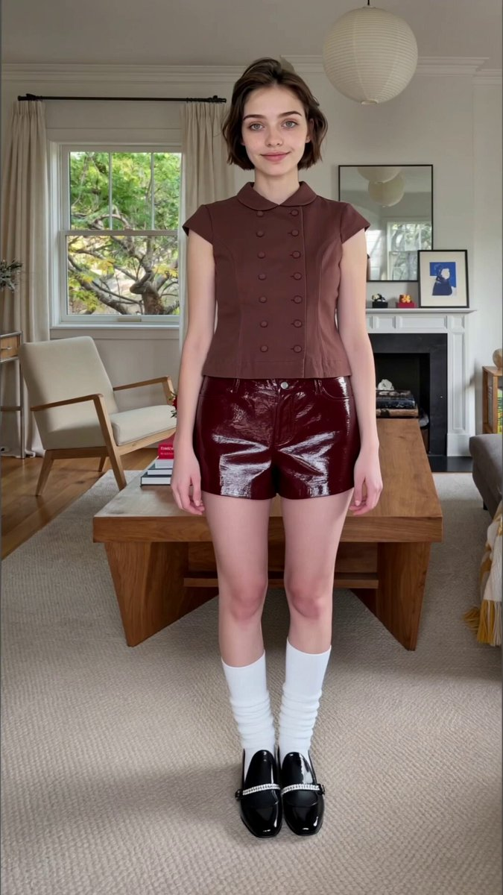

**Prompt**

```text
Erstelle ein realistisches, natürlich wirkendes UGC-Video unter Verwendung des hochgeladenen Bildes. Die Frau präsentiert ihr Outfit in einem stilvollen, modernen Zuhause. Verwende Kling MCP.
```

[↑ Zurück zu Kategorien](#catalog)

---

<a name="prompt-2098417304887509188"></a>

### Prompt zum Erstellen eines Wasserballs im Pretty Cure-Design.

Autor：[@IntexLove](https://x.com/IntexLove) · [Originalbeitrag](https://x.com/IntexLove/status/2098417304887509188)

Sonstige · Veröffentlicht

**Zusammenfassung:** Prompt zum Erstellen eines Wasserballs im Pretty Cure-Design.


**Prompt**

```text
Einen Pretty Cure Wasserball erstellen
```

[↑ Zurück zu Kategorien](#catalog)

---

<a name="prompt-2098426167195783286"></a>

### Ganzkörper-Studioporträt einer eleganten Frau in einem bronzebraunen Satinkleid vor einem warmen strukturierten Hintergrund.

Autor：[@Minahil42298354](https://x.com/Minahil42298354) · [Originalbeitrag](https://x.com/Minahil42298354/status/2098426167195783286)

Porträt / Selfie · Charakter · Veröffentlicht

**Zusammenfassung:** Ganzkörper-Studioporträt einer eleganten Frau in einem bronzebraunen Satinkleid vor einem warmen strukturierten Hintergrund.

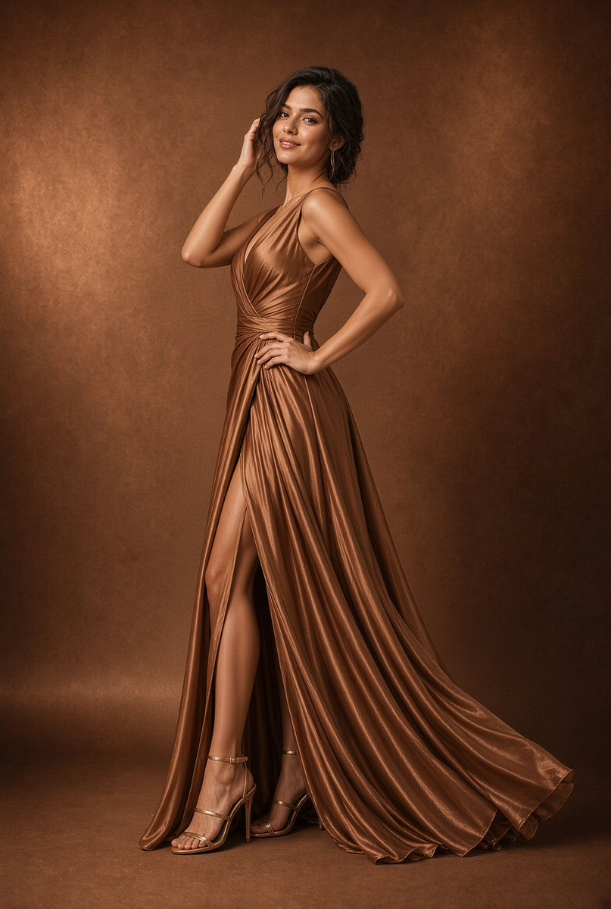

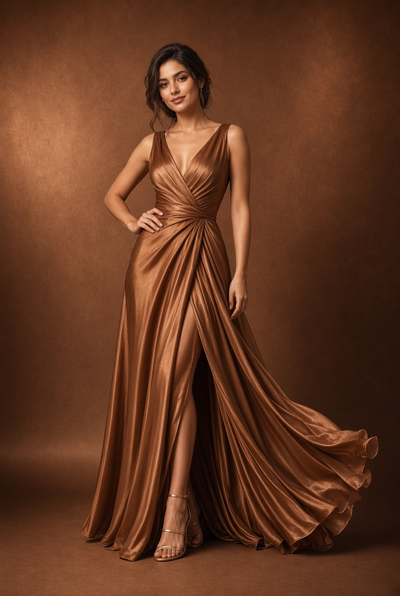

**Prompt**

```text
Ein Ganzkörper-Studioporträt einer eleganten Frau, die anmutig vor einem strukturierten, warmen braunen Hintergrund posiert. Sie trägt ein ärmelloses, glänzendes bronzebraunes Satin-Abendkleid mit tiefem V-Ausschnitt, einem taillierten Oberteil mit zarter Drapierung und einem dramatischen hohen Schlitz, der einen Blick auf ihr Bein freigibt. Ihr langer, fließender Rock bauscht sich leicht nach außen auf und verleiht dem Ganzen ein Gefühl von Bewegung, und sie ergänzt das Outfit mit passenden metallischen Riemchen-High-Heels. Ihr dunkles Haar ist zu einer Hochsteckfrisur mit sanften, ihr Gesicht umrahmenden Strähnen gestylt, und sie blickt mit einem sanften, selbstbewussten Lächeln in die Kamera, während sie ihr Haar mit einer Hand leicht berührt.
```

[↑ Zurück zu Kategorien](#catalog)

---

<a name="prompt-2098423018267754894"></a>

### Erstelle ein stilisiertes Mode-Tanzmusikvideo, das Live-Action-Choreografie mit chaotischen, handgezeichneten weißen Doodle-Figuren, grafischen Overlays und Bewegung im Stop-Motion-Stil kombiniert.

Autor：[@applete77191758](https://x.com/applete77191758) · [Originalbeitrag](https://x.com/applete77191758/status/2098423018267754894)

Charakter · Modeartikel · Veröffentlicht

**Zusammenfassung:** Erstelle ein stilisiertes Mode-Tanzmusikvideo, das Live-Action-Choreografie mit chaotischen, handgezeichneten weißen Doodle-Figuren, grafischen Overlays und Bewegung im Stop-Motion-Stil kombiniert.

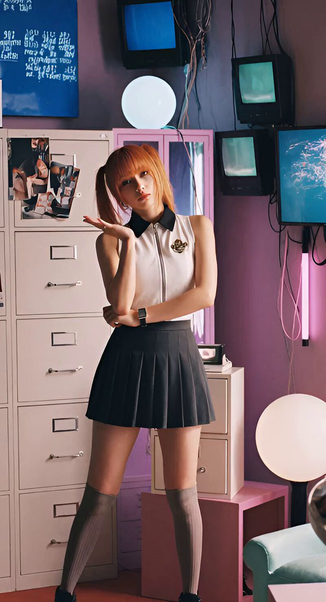

**Prompt**

```text
Erstelle ein hyperstilisiertes Mode-Tanzmusikvideo mit einer seltsamen, verspielten, chaotischen Mixed-Media-Atmosphäre.

Ein stilvoller Haupttänzer vollführt eine auf Musikalität fokussierte R&B- / Funk- / Disco-Funk-Choreografie mit urbaner Tanzenergie. Beziehe Body Groove, Shoulder Groove, Brustisolationen, rhythmisches Footwork, scharfe Freezes, Drehungen, Pose Hits, Armschwünge, stilvolle Übergänge und eine selbstbewusste Haltung ein. Die Choreografie muss stets klar und lesbar bleiben.

Wichtige Regeln:

Behalte den ursprünglichen Hintergrund und das Setting über das gesamte Video hinweg visuell konsistent bei.

Ersetze den Hintergrund nicht durch einen völlig anderen Ort.

Zerstöre nicht das Raumgefühl.

Der Hintergrund sollte dieselbe Basisumgebung bleiben, während darüber Doodles, Glitch-Effekte und Mixed-Media-Elemente hinzugefügt werden.

Zeichne KEINE Doodles direkt auf das Gesicht des echten Tänzers.

Bedecke NICHT die Augen, die Nase, den Mund oder die Gesichtszüge.

Halte das Gesicht jederzeit sauber, sichtbar und attraktiv.

Doodles dürfen um den Kopf herum, an den Haarkonturen, Schultern, Armen, dem Torso, den Händen, Beinen und der Silhouette erscheinen, aber niemals direkt auf dem Gesicht.

Spezielles kreatives Element:

Grofe weiße Doodle-Figuren tauchen auf und tanzen gemeinsam mit dem Haupttänzer.

Diese Doodle-Figuren sollten sich sehr handgezeichnet, locker, skizzenhaft, verspielt, unordentlich und lebendig anfühlen – wie spontane Notizbuch-Kritzeleien oder weiße Wachsmalstift-Doodles.

Sie sollten nicht zu sauber oder zu ausgefeilt wirken.

Sie können auftreten als:

- einfache Strichmännchen-Tänzer

- grobe Cartoon-Figuren

- gekritzelte Mini-Tänzer

- gestreckte tanzende Silhouetten

- lustige handgezeichnete Begleiter

- duplizierte Skizzen-Klone

Die Doodle-Figuren interagieren auf unterhaltsame und überraschende Weise mit dem echten Tänzer:

- tanzen synchron zusammen

- kopieren Moves

- antworten auf Moves

- umringen den Tänzer

- erscheinen und verschwinden passend zum Beat

- vervielfachen sich zu vielen Skizzen-Tänzern

- springen hinter dem Tänzer hervor

- steigen aus dem Boden, den Wänden oder dem Schatten auf

- halten kurz Requisiten oder reagieren komödiantisch

Füge außerdem viele weitere grobe Doodle-Elemente hinzu, nicht nur menschliche Doodles:

- Sterne

- Pfeile

- Kreise

- Kritzeleien

- Blitze

- Speedlines

- Comic-Aufprallblitze

- Bewegungsschweife

- weiße Kreidemarkierungen

- weiße Wachsmalstiftlinien

- handgezeichnete Schnörkel

- grobe Herzen

- durchgestrichene Markierungen

- Häkchen

- abstrakte Symbole

- skizzierte Rauchwolken

- tanzende Linien

- grobe Rahmen

- schwebende Cartoon-Hände

- einfache Augen oder lustige Reaktions-Icons

- unordentliche grafische Akzente

Diese Doodles sollten sich eher wie echte Doodles anfühlen: grob, spontan, skizzenhaft, unvollkommen, verspielt und energiegeladen.

Lass die Doodles handgemacht und ein wenig chaotisch wirken.

Kamera:

Überwiegend statische Kamera, ausschließlich mit gelegentlichem, sanftem lateralem Tracking.

Die Kamera bleibt immer parallel zum Tänzer.

Der Tänzer bleibt im Bild zentriert.

Bevorzuge eine Ganzkörper-Kadrage, damit die Choreografie deutlich sichtbar ist.

Keine kreisende Kamera, keine rotierende Kamera, keine Drohnenaufnahmen, keine extremen Zooms, keine zufälligen Kamerabewegungen.

Visueller Stil:

Premium-Fashion-Editorial-Look, luxuriöse Streetwear-Ästhetik, kühne Bildkomposition, kontrastreiche Beleuchtung, sauberer Hintergrund, trendige Musikvideo-Energie.

Der echte Tänzer und der Basishintergrund sollten poliert und stilvoll wirken, während sich die Doodle-Ebene rau, handgemacht und chaotisch anfühlt.

Dieser Kontrast ist wichtig.

Bewegungsstil:

Nutze eine abgestufte Ästhetik mit niedriger Bildrate, inspiriert von Stop-Motion, Frame-by-Frame-Animation, Cutout-Animation, Collage-Animation und Animated-on-Twos- / Animated-on-Threes-Timing.

Füge rhythmisches Strobing, Flacker-Akzente, Pose-to-Pose-Energie und ein 12fps-ähnliches Gefühl hinzu, während der Tanz lesbar bleibt.

Zusätzliche Effekte:

Füge Glitch-Effekte, Flackerschnitte, Frame-Skipping, Stotter-Edits, Collage-Ausbrüche, zittrige Unterbrechungen und chaotische, beat-synchrone visuelle Reaktionen hinzu.

Halte die Choreografie lesbar.

Die Verrücktheit sollte stilvoll, lustig und kreativ wirken, nicht schlampig.

Stimmung:

Cool, funky, stilvoll, bizarr, verspielt, chaotisch, avantgardistisch, überraschend, erfinderisch, unterhaltsam.

BGM-Stimmung:

R&B-Funk, Disco-Funk, Funk-Pop.

Kein Text, keine Untertitel, kein Wasserzeichen, kein Logo, keine zusätzlichen unerwünschten echten Personen, keine verzerrte Anatomie, keine zusätzlichen Gliedmaßen, keine Körperverformung.
```

[↑ Zurück zu Kategorien](#catalog)

---

<a name="prompt-2098444996584358073"></a>

### Ikonische Szene des Attack on Titan-Mauerplakats mit einem Mitglied des Aufklärungstrupps, das einem kolossalen Titan über der Mauer gegenübersteht.

Autor：[@R\_yeong\_](https://x.com/R_yeong_) · [Originalbeitrag](https://x.com/R_yeong_/status/2098444996584358073)

Plakat / Flyer · Veröffentlicht

**Zusammenfassung:** Ikonische Szene des Attack on Titan-Mauerplakats mit einem Mitglied des Aufklärungstrupps, das einem kolossalen Titan über der Mauer gegenübersteht.

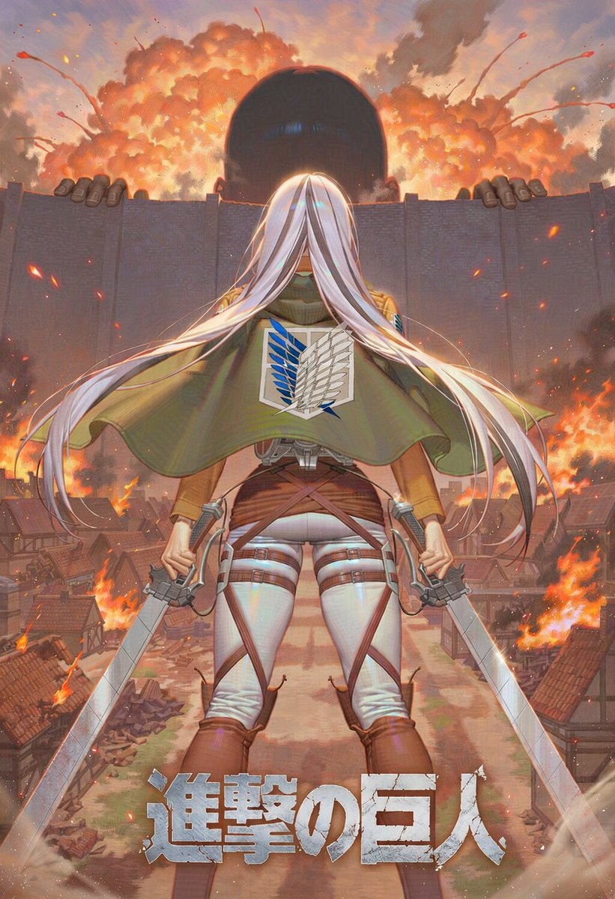

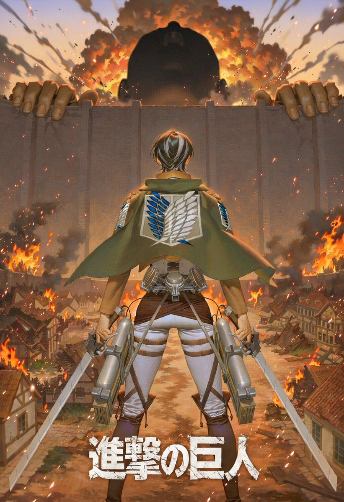

**Prompt**

```text
2::Vertikale Komposition, Ganzkörperaufnahme von hinten, Froschperspektive, Figur im Vordergrund in der Mitte des Bildausschnitts positioniert, breitbeinig stehend, Kopf nach hinten geneigt, während sie zu einer gewaltigen Mauer aufblickt, Schwerter haltend, die an beiden Seiten herabhängen::, 2::Aufklärungstrupp-Uniform::, kurze braune Militärjacke, weißes Hemd, Ledergürtel, eng anliegende weiße Hosen, kniehohe braune Lederstiefel, 1.5::dunkelbraunes Ledergeschirr, Riemen, die Brust, Taille, Oberschenkel und Beine kreuzen::, grüner Militärumhang mit Kapuze, 1.7::'Flügel der Freiheit'-Emblem auf dem Rücken, Abzeichen mit gekreuzten blauen und weißen gefiederten Flügeln, großes Emblem in der Mitte des Rückens::, 1.8::brennendes ruiniertes Dorf, zerstörte Häuser, einstürzende Dächer, zu beiden Seiten aufsteigende Flammen, verbrannte Straßen::, gewaltige Steinmauer, die den Horizont überspannt, befestigtes Tor, 3::kolossale schwarze Gestalt, die hinter der Mauer auftaucht, riesiger dunkler Kopf und Hände, die den Rand der Mauer umklammern, überwältigende Dimensionen::, 1.7::gewaltige Explosion hinter der Mauer, lodernde orangefarbene Flammen, dichter Rauch, glühender Himmel::, fliegende Glut, Funken, Asche, Hitzeflimmern, intensives Gegenlicht, tiefe Schatten, dramatischer Größenkontrast, apokalyptische, trostlose, unheilvolle und verzweifelte Atmosphäre, filmreife Präsentation, 2::großer japanischer Titeltext "進撃の巨人" (Attack on Titan) unten in der Mitte, zentrierte Typografie, Titellogo, fette japanische Schriftart, deutlich lesbarer Text::
```

[↑ Zurück zu Kategorien](#catalog)

---

<a name="prompt-2098415482911219938"></a>

### Übersetzung läuft

Autor：[@Hamburgerai](https://x.com/Hamburgerai) · [Originalbeitrag](https://x.com/Hamburgerai/status/2098415482911219938)

Plakat / Flyer · Veröffentlicht

**Zusammenfassung:** Übersetzung läuft

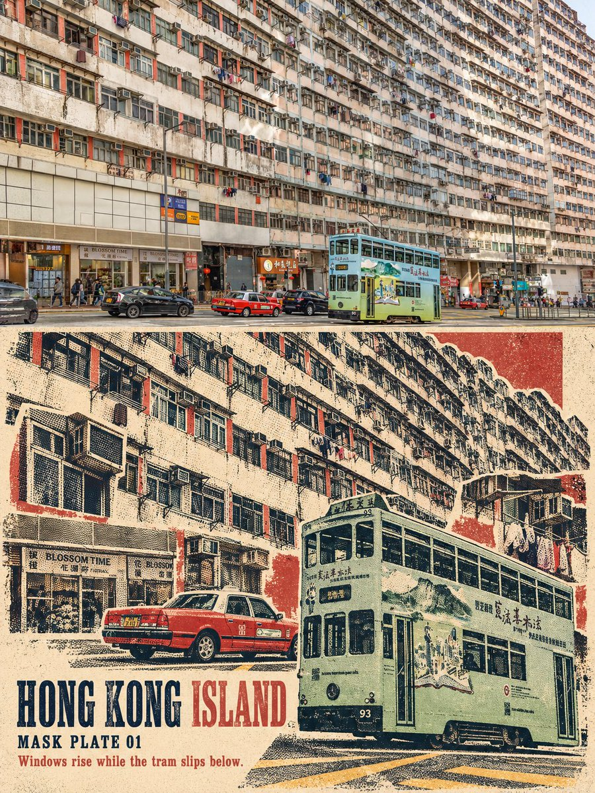

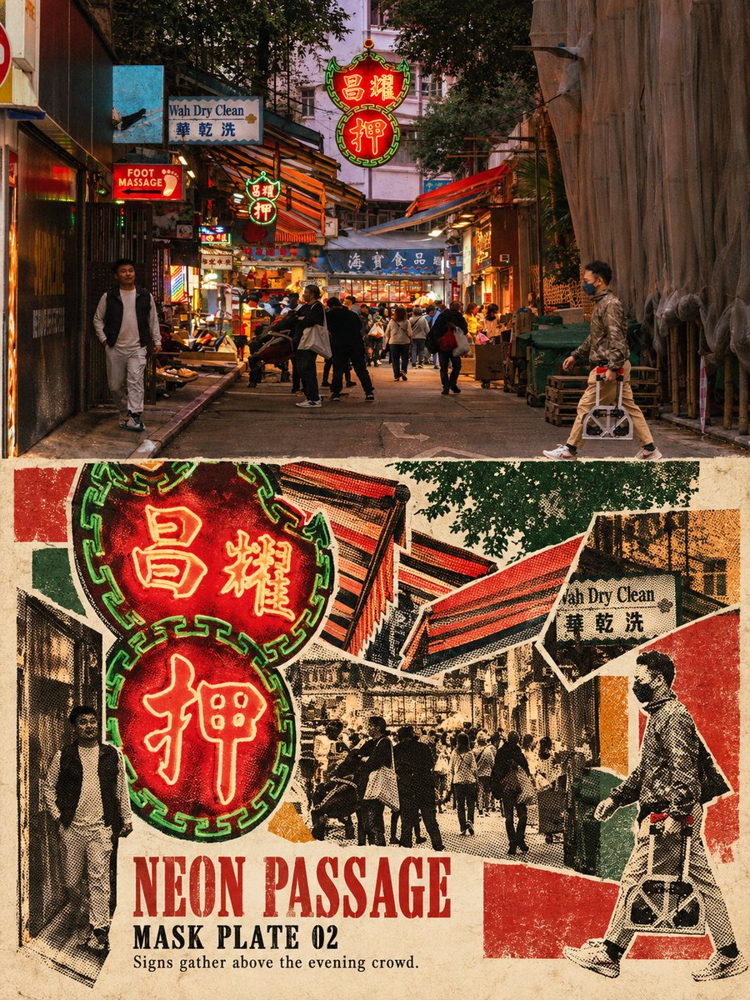

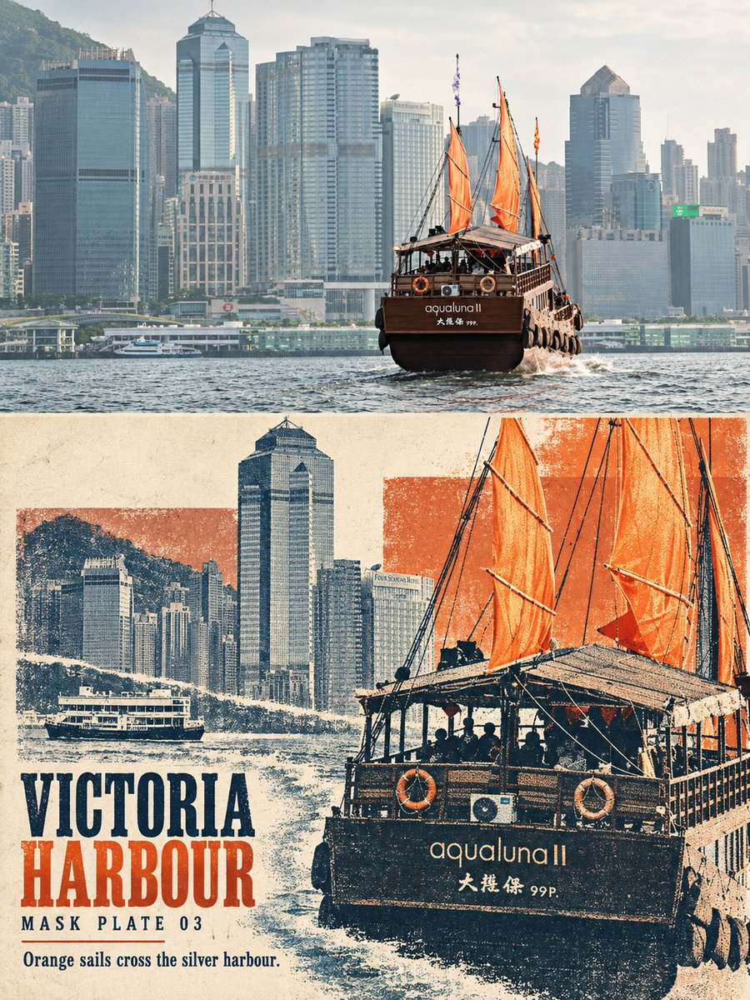

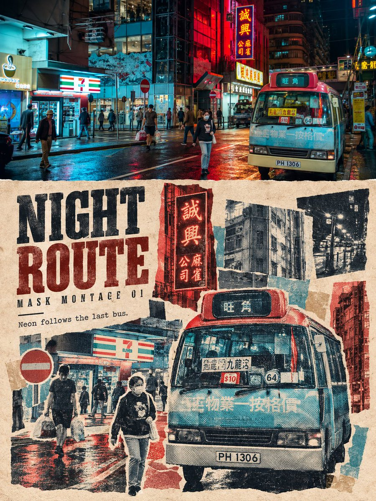

**Prompt**

```text
Übersetzung läuft
```

[↑ Zurück zu Kategorien](#catalog)

---

<a name="prompt-2098414125613506896"></a>

### Eine junge Frau, die mit der Zunge Regentropfen aus einer Regenrinne auffängt.

Autor：[@AI\_money\_club](https://x.com/AI_money_club) · [Originalbeitrag](https://x.com/AI_money_club/status/2098414125613506896)

Charakter · Veröffentlicht

**Zusammenfassung:** Eine junge Frau, die mit der Zunge Regentropfen aus einer Regenrinne auffängt.

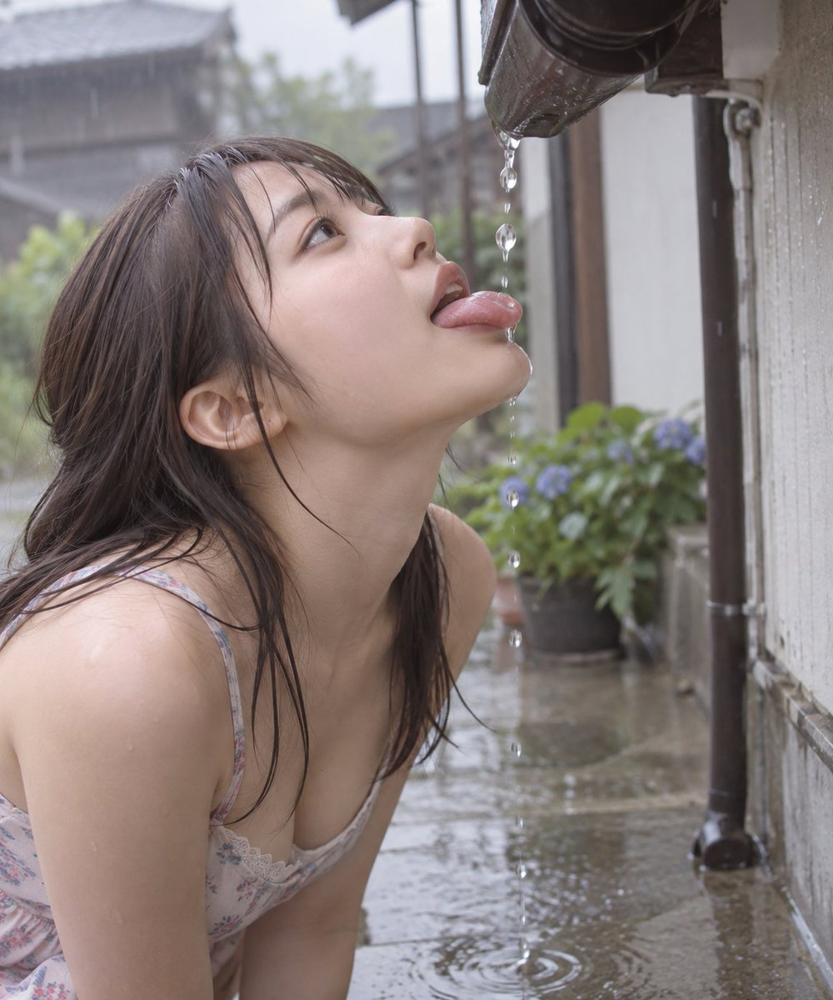

**Prompt**

```text
Eine unschuldige 20-jährige erwachsene Frau, die mit der Zunge von einer Regenrinne herabtropfende Regentropfen auffängt und sie direkt auf den Boden tropfen lässt
```

[↑ Zurück zu Kategorien](#catalog)

---

<a name="prompt-2098381131855097863"></a>

### Ein kleiner smaragdgrüner Drache, der unter einem Polarlicht leuchtende Geoden stapelt.

Autor：[@BeanieBlossom](https://x.com/BeanieBlossom) · [Originalbeitrag](https://x.com/BeanieBlossom/status/2098381131855097863)

Tier / Kreatur · Veröffentlicht

**Zusammenfassung:** Ein kleiner smaragdgrüner Drache, der unter einem Polarlicht leuchtende Geoden stapelt.

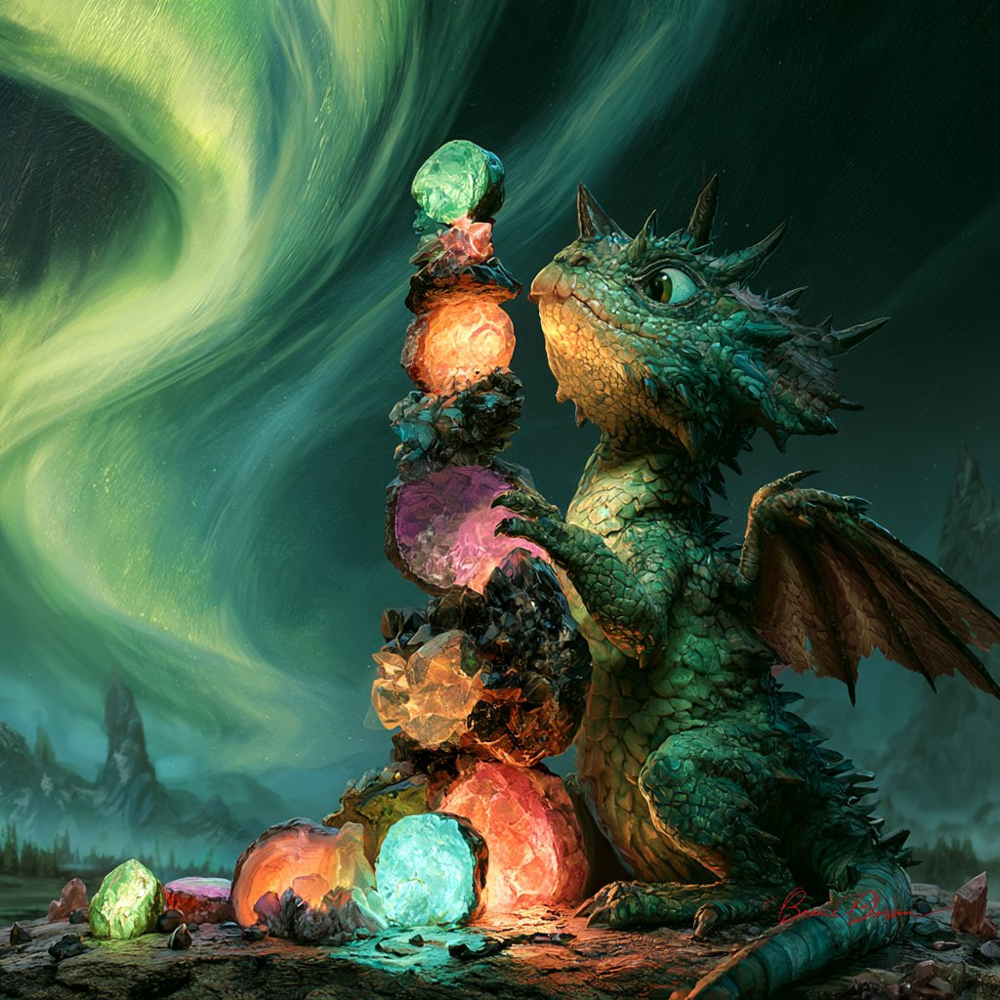

**Prompt**

```text
Unter einem wirbelnden Polarlicht stapelt ein kleiner, geflügelter Drache mit smaragdgrünen Schuppen vorsichtig bunte, leuchtende Geoden zu einem wackeligen Turm, sein Gesichtsausdruck von tiefer Konzentration geprägt
```

[↑ Zurück zu Kategorien](#catalog)

---

<a name="prompt-2098346363520274568"></a>

### Prompt zum Hinzufügen eines weißen, runden Hasenmädchen-Schwanzes am Hintern.

Autor：[@harufit333](https://x.com/harufit333) · [Originalbeitrag](https://x.com/harufit333/status/2098346363520274568)

Sonstige · Veröffentlicht

**Zusammenfassung:** Prompt zum Hinzufügen eines weißen, runden Hasenmädchen-Schwanzes am Hintern.

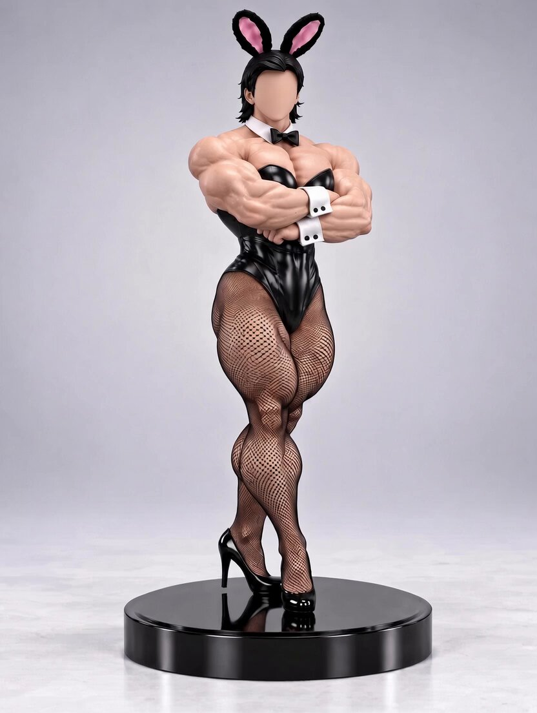

**Prompt**

```text
Bring am Hintern einen weißen, runden Hasenmädchen-Schwanz an.
```

[↑ Zurück zu Kategorien](#catalog)

---

<a name="prompt-2098381038527365331"></a>

### Erstelle die notwendigen Schablonen zum Bau eines ara-förmigen Drachens in einem einzigen Bild.

Autor：[@googleespanol](https://x.com/googleespanol) · [Originalbeitrag](https://x.com/googleespanol/status/2098381038527365331)

Sonstige · Veröffentlicht

**Zusammenfassung:** Erstelle die notwendigen Schablonen zum Bau eines ara-förmigen Drachens in einem einzigen Bild.

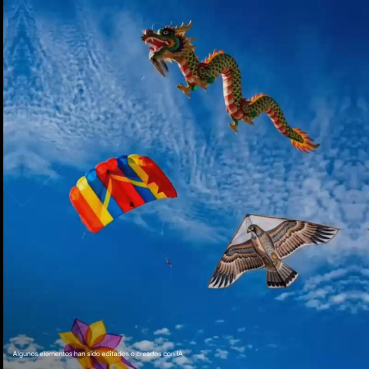

**Prompt**

```text
Erstelle alle Schablonen, die zum Bauen eines Drachens in Form eines Aras benötigt werden, in einem einzigen Bild
```

[↑ Zurück zu Kategorien](#catalog)

---

<a name="prompt-2098336543123640752"></a>

### Porträt-Prompt im Cheongsam aus der Freund-Perspektive im nächtlichen Schlafzimmer

Autor：[@underwoodxie96](https://x.com/underwoodxie96) · [Originalbeitrag](https://x.com/underwoodxie96/status/2098336543123640752)

Porträt / Selfie · Veröffentlicht

Originalbeitrag：[@underwoodxie96](https://x.com/underwoodxie96) · [Originalbeitrag](https://x.com/underwoodxie96/status/2098305584940687668)

**Zusammenfassung:** Porträt-Prompt im Cheongsam aus der Freund-Perspektive im nächtlichen Schlafzimmer

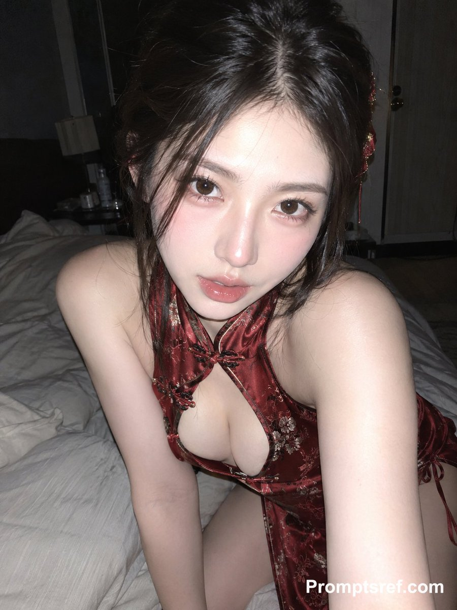

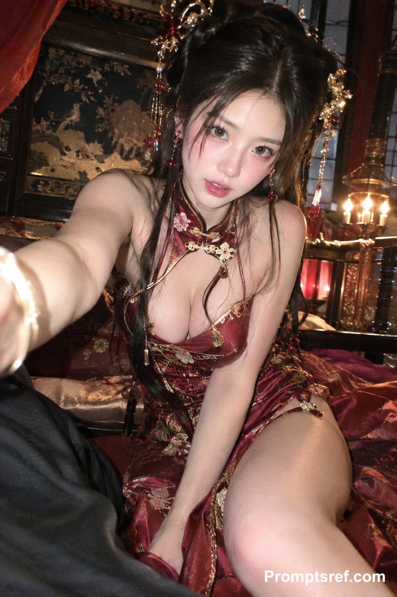

**Prompt**

```text
Nächtliches Schlafzimmer × Erste-Person-Perspektive des Freundes (POV) × Cheongsam (Qipao) × Direkter CCD-Blitz
```

[↑ Zurück zu Kategorien](#catalog)

---

<a name="prompt-2098343290626290133"></a>

### übergroßer hellrosa Pullover, lange Ärmel, \(Ärmel über die Finger reichend\), Hemd unter der Kleidung, Hemd unter dem Pullover, weißes Kragenhemd, \(Schlüsselbein\), Herzkette, lockere Fliege, rosa karierte Fliege, braun karierter Faltenrock, Minirock, weiße Loose Socks, braune Loafer,

Autor：[@AI\_Kei75](https://x.com/AI_Kei75) · [Originalbeitrag](https://x.com/AI_Kei75/status/2098343290626290133)

Sonstige · Veröffentlicht

**Zusammenfassung:** übergroßer hellrosa Pullover, lange Ärmel, \(Ärmel über die Finger reichend\), Hemd unter der Kleidung, Hemd unter dem Pullover, weißes Kragenhemd, \(Schlüsselbein\), Herzkette, lockere Fliege, rosa karierte Fliege, braun karierter Faltenrock, Minirock, weiße Loose Socks, braune Loafer,

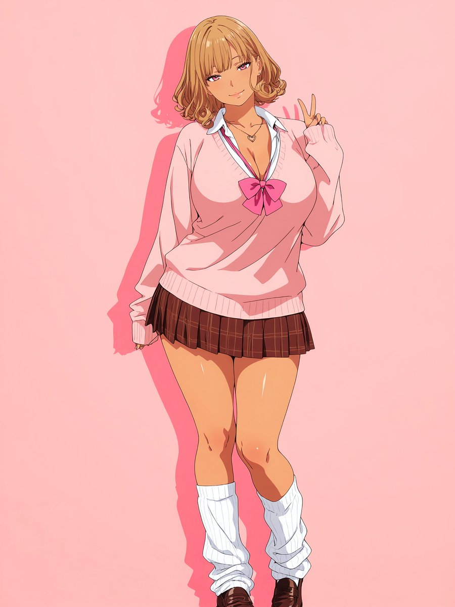

**Prompt**

```text
übergroßer hellrosa Pullover, lange Ärmel, (Ärmel über die Finger reichend), Hemd unter der Kleidung, Hemd unter dem Pullover, weißes Kragenhemd, (Schlüsselbein), Herzkette, lockere Fliege, rosa karierte Fliege, braun karierter Faltenrock, Minirock, weiße Loose Socks, braune Loafer,
```

[↑ Zurück zu Kategorien](#catalog)

---

<a name="prompt-2098306910915375260"></a>

### Makro-Technikwerbespot, in dem ein Miniatur-Moderator über den Kopfbügel eines riesigen Kopfhörers rennt, einen Regler verstellt und auf dem Ohrpolster landet.

Autor：[@Fujimoto\_hina](https://x.com/Fujimoto_hina) · [Originalbeitrag](https://x.com/Fujimoto_hina/status/2098306910915375260)

Produktmarketing · Charakter · Veröffentlicht

**Zusammenfassung:** Makro-Technikwerbespot, in dem ein Miniatur-Moderator über den Kopfbügel eines riesigen Kopfhörers rennt, einen Regler verstellt und auf dem Ohrpolster landet.

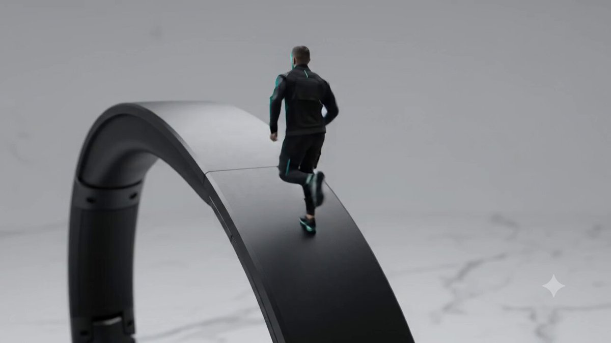

**Prompt**

```text
{
  "duration": "10s",
  "aspect_ratio": "16:9",
  "fps": 30,
  "style": "fotorealistischer Premium-Technologie-Werbespot, filmische Makrofotografie",

  "scene": "Ein 3 Zoll großer erwachsener männlicher Moderator in schwarzer Streetwear mit dezenten neon-türkisfarbenen Akzenten interagiert mit gigantischen, schwarzen Premium-Kabelloshörern auf einem Studio-Schreibtisch aus weißem Marmor.",

  "action": [
    "0-3s: Der Miniatur-Moderator rennt selbstbewusst über den geschwungenen mattschwarzen Aluminium-Kopfbügel. Eine extrem tiefe Makro-Verfolgungskamera folgt ihm direkt von hinten.",
    "3-6s: Er erreicht einen übergroßen, gerändelten Metall-Lautstärkeregler, greift ihn mit beiden Händen und dreht ihn kraftvoll. Eine subtile, durchscheinende Schallschockwelle breitet sich von den Kopfhörern aus.",
    "6-8s: Er springt vom Kopfbügel auf das riesige, weiche Ohrpolster aus schwarzem Leder und Memory-Schaumstoff, das sich beim Aufprall sichtbar zusammendrückt.",
    "8-10s: Er steht auf dem Polster, lächelt in die Kamera und zeigt kurz einen Daumen nach oben, während die Kamera rasch per Kran nach oben fährt und zurückzieht, wodurch die vollständigen Kopfhörer, ein Laptop und eine Kaffeetasse auf dem Schreibtisch sichtbar werden."
  ],

  "camera": "Extrem geringe Makro-Tiefenschärfe, sanftes Tracking, kontrollierter Reißschwenk zum Drehregler, dynamische Nachführung beim Sprung, dann schneller Kran-Rückzug nach oben in eine weite Hero-Einstellung.",

  "lighting": "Weiche Studiobeleuchtung mit dezenten Kantenlichtern in Cyan und Elektro-Magenta, realistische Reflexionen auf Metall, Leder und Marmor.",

  "audio": {
    "music": "KEINE",
    "dialogue": "KEINER",
    "voiceover": "KEINES",
    "effects": "Realistisches Quietschen von Turnschuhen, mechanische Klickgeräusche des Reglers, tiefes Drehgeräusch, subtiles sonisches Zischen und weicher Aufprall auf das Lederpolster."
  },

  "quality": "Detailtreue in 8K-Qualität, realistische menschliche Anatomie, physikalisch korrekte Materialien und Physik, stabiles Charakter- und Produktdesign.",

  "negative": "keine Musik, keine Dialoge, kein Text, keine Logos, kein Wasserzeichen, keine zusätzlichen Personen, kein Schweben, keine Teleportation, kein Clipping, keine verzerrten Hände, keine Maßstabsveränderung, keine Änderungen an Charakter oder Kleidung, kein Cartoon-CGI, keine übermäßige Bewegungsunschärfe, kein Kamerawackeln."
}
```

[↑ Zurück zu Kategorien](#catalog)

---

<a name="prompt-2098328564471091256"></a>

### Prompt zum Generieren einer Nonne in schwarzem Habit und goldener Kreuzkette.

Autor：[@AI\_Kei75](https://x.com/AI_Kei75) · [Originalbeitrag](https://x.com/AI_Kei75/status/2098328564471091256)

Charakter · Veröffentlicht

**Zusammenfassung:** Prompt zum Generieren einer Nonne in schwarzem Habit und goldener Kreuzkette.

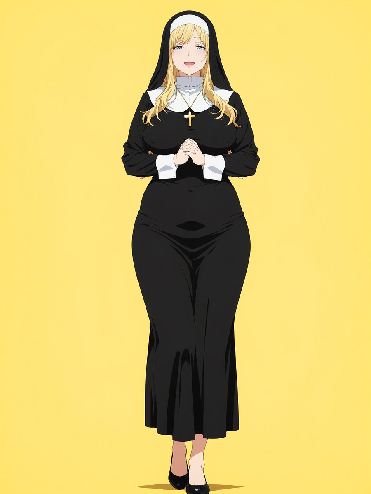

**Prompt**

```text
Nonne, Nonnenkostüm, schwarzer Nonnenschleier, weiße Wimpel, Stehkragen, goldene Kreuzhalskette, lange Ärmel, weiße Manschetten, (schwarzes einteiliges Kleid:1.2), (weiche Textur), komplett schwarzes langes Gewand, Knöchel, schwarze Pumps,
```

[↑ Zurück zu Kategorien](#catalog)

---

<a name="prompt-2098298423384645737"></a>

### 15-sekündiger realistischer Outdoor-Smartphone-Vlog-Prompt neben einem Teich mit bunten Fischen während der goldenen Stunde.

Autor：[@MrDasOnX](https://x.com/MrDasOnX) · [Originalbeitrag](https://x.com/MrDasOnX/status/2098298423384645737)

Sonstige · Veröffentlicht

**Zusammenfassung:** 15-sekündiger realistischer Outdoor-Smartphone-Vlog-Prompt neben einem Teich mit bunten Fischen während der goldenen Stunde.

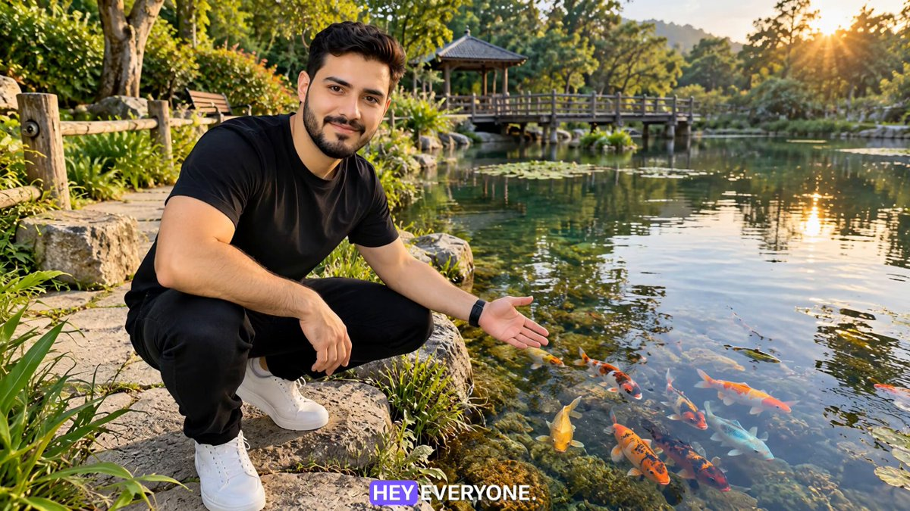

**Prompt**

```text
Verwenden Sie das bereitgestellte Referenzbild als genaue Identitätsreferenz für denselben erwachsenen männlichen Charakter. Behalten Sie seine Gesichtszüge, Frisur, Bart, Hautton, Körperproportionen und Kleidung im gesamten Video durchgehend bei.

Erstellen Sie einen 15-sekündigen, ultrarealistischen Outdoor-Smartphone-Vlog neben einem wunderschönen natürlichen Teich, umgeben von üppigem Grün während der goldenen Stunde.

0–4 Sekunden: Handgeführte Selfie-Aufnahme. Der Mann geht neben dem Teich her, lächelt und spricht natürlich in die Kamera. Plötzlich bemerkt er etwas unter dem klaren Wasser und sagt aufgeregt: „Wait… look at those fish!“

4–8 Sekunden: Er dreht das Smartphone in Richtung des Teichs. Die Kamera fängt eine Gruppe wunderschöner bunter Fische ein, die natürlich durch das klare seichte Wasser schwimmen. Die Fische weisen lebendige Kombinationen aus Orange, Gelb, Blau, Türkis, Rot und Silber auf, wobei das Sonnenlicht auf ihren Schuppen schimmert.

8–12 Sekunden: Kinoreife Nahaufnahme der Fische, die um Wasserpflanzen und kleine Steine herumschwimmen. Er spricht aus dem Off: „I’ve never seen fish this colorful in a pond. Look at those colors!“

12–15 Sekunden: Rückkehr zu einer Selfie-Aufnahme. Er hockt sich neben den Teich, zeigt auf die Fische hinter sich, lächelt mit echter Verwunderung und sagt: „This place is incredible!“ Endet mit den bunten Fischen, die im Hintergrund sichtbar sind.

Authentische handgeführte Smartphone-Vlog-Ästhetik, natürliche Geh- und Körperbewegungen, realistische Mimik, akkurate Hände und Finger, natürliches Blinzeln, realistische Wasserphysik, detaillierte bunte Fischschuppen, Sonnenlichtreflexionen auf dem Wasser, sanfte Wellen, üppige Vegetation, natürliche Außengeräusche, kinoreife, aber glaubwürdige Beleuchtung, fotorealistische 2K-Details, subtiles Wackeln der Smartphone-Kamera, weiche Fokusübergänge.

Keine Untertitel, kein Text auf dem Bildschirm, keine Logos, kein Wasserzeichen, keine zusätzlichen Personen, keine Gesichtsverzerrung, keine Identitätswechsel, kein übertriebenes Schauspiel, keine Fantasieeffekte. Halten Sie die Fische wunderschön, aber biologisch glaubwürdig und die gesamte Szene realistisch.
```

[↑ Zurück zu Kategorien](#catalog)

---

<a name="prompt-2098287896872567292"></a>

### Ontariosee

Autor：[@jrwimaging](https://x.com/jrwimaging) · [Originalbeitrag](https://x.com/jrwimaging/status/2098287896872567292)

Landschaft / Natur · Veröffentlicht

**Zusammenfassung:** Ontariosee


**Prompt**

```text
Ontariosee
```

[↑ Zurück zu Kategorien](#catalog)

---

<a name="prompt-2098266045597519916"></a>

### Dieser Prompt dient dazu, einen Schnappschuss einer traditionellen Frau in der Atmosphäre des Nachtmarkts von Chang'an der Tang-Dynastie zu erzeugen. Dabei werden Weitwinkel, gekippte Perspektive, harter Aufsteckblitz und Kalt-Warm-Lichtkontraste genutzt, um eine prächtige Hanfu-Dame einzufangen, die zurückblickt und ihre Ärmel hebt.

Autor：[@Soranlan](https://x.com/Soranlan) · [Originalbeitrag](https://x.com/Soranlan/status/2098266045597519916)

Porträt / Selfie · Charakter · Zusammenfassung / Hintergrund · Veröffentlicht

Originalbeitrag：[@Soranlan](https://x.com/Soranlan) · [Originalbeitrag](https://x.com/Soranlan/status/2098258401344229596)

**Zusammenfassung:** Dieser Prompt dient dazu, einen Schnappschuss einer traditionellen Frau in der Atmosphäre des Nachtmarkts von Chang'an der Tang-Dynastie zu erzeugen. Dabei werden Weitwinkel, gekippte Perspektive, harter Aufsteckblitz und Kalt-Warm-Lichtkontraste genutzt, um eine prächtige Hanfu-Dame einzufangen, die zurückblickt und ihre Ärmel hebt.


**Prompt**

```text
Ultraweitwinkel-Nahperspektive (14~20mm), übertriebene Perspektive, Dutch Angle 15°, leichte Tonnenverzeichnung, Ästhetik eines Schnappschusses aus der Hand, starke Tiefe: scharfes Motiv, tiefe Hintergrundebenen, Motivabstand 0,5m, harter Aufhellblitz direkt auf der Kamera, helle Glanzlichter in den Augen, Umgebungslicht um 1~2 Blendenstufen unterbelichtet, Blitzabfall, Glanzlichter auf Haut/Schmuck, Look eines schnellen Blitz-Schnappschusses, hochfrequente Details, mittleres Filmkorn, Lichthofbildung + Mikrokontrast, subtile chromatische Aberration, windgetriebene Bewegung an den Rändern, Ästhetik des antiken Chinas der Tang-Dynastie, geschäftiger Nachtmarkt, ostasiatische Frau, zarte feine Gesichtszüge, große ausdrucksstarke Augen, kleiner Kirschmund, extrem üppige Figur, übertrieben große Oberweite, extrem hoher ästhetischer Standard, makelloser Knochenbau, porzellanartige Hautqualität, hoher Status, saubere Silhouette, edle Materialien, hoher Produktionswert, mit einem verspielten, verführerischen Lächeln über die Schulter zurückblickend, zügig durch die dichte Menschenmenge gehend, eine Hand hebt einen kunstvoll gewebten Seidenärmel, der nah an das Objektiv streift, belebte Straße in Chang'an, leuchtende rote Papierlaternen, bewegungsunscharfe Fußgänger in traditionellem Hanfu, fliegende Funken von Straßenverkäufern, dichte lebendige Atmosphäre, kühler harter Blitz auf dem Vordergrundmotiv im Kontrast zu warmen praktischen Lichtern im Hintergrund, subtiles 'Soran'-Element natürlich in die Seidenstoffstickerei integriert, dezente ästhetische Signatur, organische Verschmelzung, harmonische Komposition, unaufdringlich, fast unsichtbar.
```

[↑ Zurück zu Kategorien](#catalog)

---

<a name="prompt-2098260186737901631"></a>

### Entspannender Makro-Videoprompt: Eine menschliche Hand baut Schritt für Schritt ein Ziegelhäuschen auf einer Miniaturbaustelle.

Autor：[@Mud01185127](https://x.com/Mud01185127) · [Originalbeitrag](https://x.com/Mud01185127/status/2098260186737901631)

Sonstige · Veröffentlicht

**Zusammenfassung:** Entspannender Makro-Videoprompt: Eine menschliche Hand baut Schritt für Schritt ein Ziegelhäuschen auf einer Miniaturbaustelle.


**Prompt**

```text
Erstelle eine hyperrealistische, filmische Miniatur-Baustellenszene, in der eine riesige menschliche Hand sorgfältig ein winziges Ziegelbauwerk auf einer Miniaturbaustelle errichtet. Zeige detaillierte kleine Ziegelsteine, realistischen Zement, Werkzeuge, sandigen Boden, natürliche Texturen, geringe Schärfentiefe, Makrofotografie, sanfte Kamerabewegungen, realistische Beleuchtung und einen befriedigenden, schrittweisen Bauablauf. Ultradetailliert, fotorealistisch, 4K, vertikal 9:16, nahtlose visuelle Kontinuität.
```

[↑ Zurück zu Kategorien](#catalog)

---

<a name="prompt-2098249488150532562"></a>

### Ein Prompt, der einen blau-roten, von Spinnennetzen inspirierten, ärmellosen Body mit Cut-Out-Details und passenden Armstulpen detailliert beschreibt.

Autor：[@AI\_money\_club](https://x.com/AI_money_club) · [Originalbeitrag](https://x.com/AI_money_club/status/2098249488150532562)

Modeartikel · Veröffentlicht

**Zusammenfassung:** Ein Prompt, der einen blau-roten, von Spinnennetzen inspirierten, ärmellosen Body mit Cut-Out-Details und passenden Armstulpen detailliert beschreibt.


**Prompt**

```text
Ein eng anliegender, ärmelloser Body in Blau und Rot, inspiriert von Spinnennetzen, mit einem eleganten Superhelden-Design. Der Hauptkörper ist in tiefem Königsblau gehalten, mit dünnen roten Linien im Spinnennetzmuster, die sich über Brust, Rumpf, Taille und Bauch erstrecken. Er verfügt über einen hohen Stehkragen und einen markanten tropfenförmigen Brustausschnitt, der mit einer dicken roten Paspelierung eingefasst ist.

Der Body hat eine eng anliegende, athletische Silhouette mit hoch geschnittenen Beinöffnungen und kontrastierenden tiefroten geometrischen Seiteneinsätzen an Hüfte und unterer Taille. Der blaue Stoff hat ein glattes, leicht satinartiges Stretch-Finish mit realistischer Spannung und subtilen natürlichen Falten.

Passende, abnehmbare lange blaue Armstulpen reichen von den Oberarmen bis zu den Handgelenken und lassen die Schultern frei. Jeder Ärmel weist dünne rote Linienakzente und kräftige rote eckige Details nahe den Unterarmen auf.

Behalten Sie die genauen Designmerkmale bei: tiefkönigsblaue Basis, dünnes rotes Spinnennetz-Linienmuster, hoher Stehkragen, rot eingefasster tropfenförmiger Brustausschnitt, ärmellose Konstruktion mit freien Schultern, eng anliegende einteilige Body-Silhouette, rote geometrische Hüfteinsätze und passende lange abnehmbare blaue Ärmel mit roten Akzenten.
```

[↑ Zurück zu Kategorien](#catalog)

---

<a name="prompt-2097915123516215548"></a>

### Tilt-Shift-Makro-Miniatur-Videosequenz, die winzige Bauern zeigt, denen eine riesige menschliche Hand in vier landwirtschaftlichen Szenen hilft.

Autor：[@EthanAIBuilder](https://x.com/EthanAIBuilder) · [Originalbeitrag](https://x.com/EthanAIBuilder/status/2097915123516215548)

Sonstige · Veröffentlicht

**Zusammenfassung:** Tilt-Shift-Makro-Miniatur-Videosequenz, die winzige Bauern zeigt, denen eine riesige menschliche Hand in vier landwirtschaftlichen Szenen hilft.


**Prompt**

```text
Eine hyperrealistische Tilt-Shift-Makrofotografie-Videosequenz einer winzigen Miniaturwelt. Das Video zeigt kleine Miniaturbauern in traditioneller asiatischer Arbeitskleidung, die mit riesigen Elementen der Natur interagieren. 
Szene 1: Winzige Bauern arbeiten an einem Miniaturbach mit Seerosenblättern; eine riesige menschliche Hand taucht ein und hebt ein Seerosenblatt mit tropfenden Wurzeln an, während das Wasser sanft fließt. 
Szene 2: Miniaturbauern mühen sich an einer rostigen Vintage-Wasserpumpe in einem Garten ab; eine riesige menschliche Hand drückt den Hebel, sodass Wasser in einen winzigen Eimer strömt, während sie jubeln. 
Szene 3: Miniaturbauern mit kegelförmigen Strohhüten sortieren goldene Körner auf einem Feld unter einem stürmischen, dunklen Himmel, als Regen einsetzt; eine riesige menschliche Hand platziert schnell ein winziges Segeltuchzelt über ihnen, um die Ernte zu schützen. 
Szene 4: Winzige Bauern arbeiten mit Miniatur-Gartengeräten auf einem riesigen grünen Gemüseblatt mit einer großen Gartenschnecke; eine riesige menschliche Hand hebt die Schnecke sanft weg und platziert einen winzigen Holzzaun um die Feldfrüchte. 
Kinematografische Schärfentiefe, 8k-Auflösung, Stop-Motion-Ästhetik kombiniert mit fotorealistischem Miniatur-Diorama-Stil, weiche, flüssige Bewegung --ar 9:16
```

[↑ Zurück zu Kategorien](#catalog)

---

<a name="prompt-2097935645037793537"></a>

### Herbstliches Ganzkörper-Waldporträt-Prompt mit Gesichtssperre, detaillierter Hocke-Pose, Lederjacke, Barett und warmem Gegenlicht.

Autor：[@oye\_samia](https://x.com/oye_samia) · [Originalbeitrag](https://x.com/oye_samia/status/2097935645037793537)

Porträt / Selfie · Veröffentlicht

**Zusammenfassung:** Herbstliches Ganzkörper-Waldporträt-Prompt mit Gesichtssperre, detaillierter Hocke-Pose, Lederjacke, Barett und warmem Gegenlicht.


**Prompt**

```text
**GESICHTSIDENTITÄT-Referenz. ABSOLUTE PRIORITÄT — GESICHTSIDENTITÄTS-SPERRE 1:1.** Die EXAKTE reale Person aus dem Bild als Ganzes bewahren: exakte Identität, reales Alter, Gesichtsgeometrie, Proportionen, natürliche Asymmetrie, exakte Augenform/-farbe und exakte BASIS-Haarfarbe AUS dem Bild. NULL Gesichtsrekonstruktion, Verschönerung, Verschlankung, Symmetriekorrektur oder generisches KI-Gesicht.

**SZENE — STRIKTE SPERRE.** Vertikales Ganzkörper-Herbstporträt in einem waldreichen Park mit laubbedecktem Boden und herabsegelnden Ahornblättern. Frau hockt tief mittig-rechts, breites natürliches Lächeln, Blick gehoben nach BILD-LINKS. Bernsteinfarbenes Wald-Bokeh; tiefstehende Sonne oben BILD-RECHTS.

**KAMERA —** Barett bis Stiefel; angehobenes Knie groß im unteren Vordergrund, Kopf im oberen Drittel. Kamera auf Sitz-Taillenhöhe, leicht BILD-LINKS, Nah-Mittel-Distanz, sanft nach oben gerichtet; natürliche 50–70mm-Perspektive. Nahes Knie/vordere Hand mäßig größer; Gesicht unverzerrt.

**POSE —** Oberkörper aufrecht, Becken tief/hinten, Schultern 3/4 BILD-LINKS, Kinn gehoben. RECHTE Schulter → gebeugter Ellbogen → entspanntes Handgelenk → offene Handfläche nach oben BILD-LINKS, 5 Finger. LINKE Schulter → gebeugter Ellbogen → Handgelenk → offene Handfläche nach oben zur Kamera auf Brusthöhe, 5 Finger. RECHTES Knie am nächsten zum Objektiv, rechter Fuß unten mittig aufgestellt. LINKES Bein tiefer/weiter hinten angewinkelt, Hauptstütze. Hände auf getrennten Tiefenebenen.

**HAARE/HAUT/MAKE-UP —** lange lockere Wellen unter dem Barett, fülliger, dicht, seidig, dimensional, luftige Ansätze; exakte BASIS-Farbe aus dem Bild, ~10 % kühler. Spürbar goldbraun gebräunte, sonnengeküsste ECHTE MENSCHLICHE Haut, seidenmatte Leuchtkraft, zarter Schimmer, Poren, Mikrotextur, feiner Flaum, unregelmäßige Glanzlichter. Augen lebendig, feucht, leuchtend, MENSCHLICH; realistische Iris, feuchte Wasserlinie, kleine Glanzpunkte. Gepflegte Brauen, kupfer-bordeauxfarbener Smokey-Lidschatten, sauberer Lidstrich, SEHR LANGE SEHR DICHTE flauschig getrennte Wimpern, Konturierung/Bronzer, kontrollierter Highlighter, rosig-nude strukturierte Lippen, edles Satin-Finish.

**OUTFIT —** tief rostartig-rotes Premium-Wollbarett; taillierte schwarze Bikerjacke aus echtem Leder, sichtbare Narbung/Nähte/Reißverschlüsse, kontrollierte Reflexionen; schwerer Minirad in dunklem Bordeaux; transparente schwarze Strumpfhose; schwarze Schnürstiefeletten aus Leder mit Blockabsatz. Hochwertige, fühlbare Materialien.

**LICHT/TIEFE —** warmes goldenes Gegenlicht oben BILD-RECHTS, weiche frontale Aufhellung, Negativ-Aufhellung BILD-LINKS, Kantenlicht auf Haar/Barett. Vordergrund-Blätter → Motiv → unscharfe Stämme/bernsteinfarbenes Bokeh; realistische Tiefenschärfe, atmosphärische Trennung, feine organische Körnung; fotografiert, nicht gerendert.

**KEINE** Identitätsdrift, toten Augen, flaches Haar, Plastikhaut, deformierten Hände, zusätzlichen Finger/Gliedmaßen, falsche Hocke, flaches Licht, CGI.
```

[↑ Zurück zu Kategorien](#catalog)

---

<a name="prompt-2097896913269854538"></a>

### Karmesinmond-Drachen in einer himmlischen Stadt

Autor：[@TheEerieHollows](https://x.com/TheEerieHollows) · [Originalbeitrag](https://x.com/TheEerieHollows/status/2097896913269854538)

Sonstige · Veröffentlicht

**Zusammenfassung:** Karmesinmond-Drachen in einer himmlischen Stadt


**Prompt**

```text
Karmesinmond-Drachen in einer himmlischen Stadt
```

[↑ Zurück zu Kategorien](#catalog)

---

<a name="prompt-2097852564029272236"></a>

### Fashion-Editorial-Porträt einer jungen Japanerin im champagnerfarbenen Crop-Camisole mit Kaffee auf einer beigen Chaiselongue in einem modernen Penthouse.

Autor：[@CityCatch\_Show](https://x.com/CityCatch_Show) · [Originalbeitrag](https://x.com/CityCatch_Show/status/2097852564029272236)

Porträt / Selfie · Charakter · Essen / Trinken · Modeartikel · Architektur / Interieur · Veröffentlicht

**Zusammenfassung:** Fashion-Editorial-Porträt einer jungen Japanerin im champagnerfarbenen Crop-Camisole mit Kaffee auf einer beigen Chaiselongue in einem modernen Penthouse.


**Prompt**

```text
1. Motiv & Handlung
Eine atemberaubende 20-jährige Japanerin mit porzellanheller, leuchtender Haut, zarten, feinen Gesichtszügen, natürlichen blass graublauen Augen, modischem, taufrischem High-Fashion-Make-up und langem, dunklem Haar mit frisch erwachter, unordentlicher Schönheit: vom Schlaf zerzaust, mit ein paar Strähnen, die natürlich über ihr Gesicht und ihre Schultern fallen. Sie hat extrem üppige Brüste mit Körbchengröße G und eine unmöglich schmale, zierliche Taille. Sie sitzt im Schneidersitz auf einer luxuriösen beigen Chaiselongue. Sie trägt ein leicht durchscheinendes, ungefüttertes, leichtes champagnerfarbenes Spaghettiträger-Crop-Camisole ohne BH und ohne Polsterung; der Stoff liegt flach und glatt über der Brust, nicht eng genug, um erhabene Wölbungen zu erzeugen. Durch den dezent durchscheinenden Stoff ist nur eine sehr sanfte tonale Andeutung der Brustwarzen zu sehen, eine subtile Kontur als sanfter Schatten, niemals hervorstehend. Das kurze Oberteil lässt ihre schlanke Taille vollständig frei. Sie trägt einen passenden Tanga mit dünnen Trägern. Eine Hand hält eine Kaffeetasse aus Keramik, die andere ruht auf ihrem Oberschenkel. Ausdruck: schüchterner, zurückhaltender direkter Blickkontakt zur Kamera, sanft geschlossener Mund, hochkarätige Eleganz und ruhige Haltung.
2. Umgebung & Zeit
Luxuriöses, modernes Penthouse-Interieur am frühen Morgen. Große, bodentiefe Fenster mit einer weichgezeichneten Skyline der Stadt. Beige gepolsterte Chaiselongue, dezente Vorhänge, raffinierte Hotelsuiten-Atmosphäre.
3. Komposition & Kamera
Porträtformat, Halbtotale aus einem leicht tiefen Dreiviertelwinkel. Betonung des Kontrasts zwischen der vollen Brust, der entblößten schmalen Taille und den gekreuzten Beinen. Geringe Schärfentiefe, Motiv scharf, Hintergrund sanft unscharf.
4. Beleuchtung & Stil
Natürliches Morgenlicht durchs Fenster: weiches, diffuses Seitenlicht mit realistischen Sonnenflecken und sanften, warmen Glanzlichtern auf Haut, Haar und dem leicht durchscheinenden Stoff, sodass die dezente tonale Kontur eher wie ein weicher Schatten als wie eine Wölbung wirkt. Keine künstlichen volumetrischen Lichtstrahlen, keine schweren CGI-Staubstreifen. Fotorealistisches High-End-Modeeditorial, raffinierte Ellen-von-Unwerth-Stimmung. Sanfte, realistische Filmkörnung, anspruchsvolle warm-neutrale Farbpalette.
5. Einschränkungen
Der Stoff darf nur leicht durchscheinend sein, nicht durchsichtig. Keine nackte Brustwarzenhaut. Keine deutlich sichtbare Areola. Keine erhabenen Erhebungen, kein Durchdrücken durch das Oberteil, kein Nass-Look-Stoff. Die Brustwarze sollte nur als dezente flache Kontur oder weicher Schatten erscheinen. Elegante High-Fashion-Stimmung, niemals vulgär. Fotorealistische, hochauflösende Qualität.
```

[↑ Zurück zu Kategorien](#catalog)

---

<a name="prompt-2097899194086297845"></a>

### Ein 15-sekündiger sequenzieller Storyboard-Prompt für einen Luxusparfüm-Werbespot mit einer Pariser Gasse bei Nacht, einer Makro-Produktaufnahme, Dialog und Goldeffekten.

Autor：[@yourPlugAI](https://x.com/yourPlugAI) · [Originalbeitrag](https://x.com/yourPlugAI/status/2097899194086297845)

Comic / Storyboard · Produkt · Veröffentlicht

**Zusammenfassung:** Ein 15-sekündiger sequenzieller Storyboard-Prompt für einen Luxusparfüm-Werbespot mit einer Pariser Gasse bei Nacht, einer Makro-Produktaufnahme, Dialog und Goldeffekten.


**Prompt**

```text
15-sekündiger sequenzieller Video-Prompt

0 bis 3 Sekunden (Der Hook)
Visuell: Filmische Kamerafahrt aus der Froschperspektive, die der Luxusbotschafterin folgt, während sie durch eine schwach beleuchtete mitternächtliche Gasse in Paris geht. Ihr schwarzes Seidenkleid schwingt anmutig, während sich die Lichter der Stadt auf dem nassen Pflaster spiegeln.
Aktion: Sie dreht ihren Kopf fließend zur Kamera und sucht intensiven, selbstbewussten Blickkontakt mit einem subtilen, verführerischen Lächeln.
Ton: Tiefer, resonanter Subbass, der in langsame, atmosphärische Synthesizer-Akkorde übergeht, begleitet vom deutlichen Echo von Absätzen auf dem Pflaster.

3 bis 6 Sekunden (Die Produktenthüllung)
Visuell: Extremes Makro-Nahaufnahme eines eleganten Parfümflakons aus dunklem Obsidian, der aufrecht steht. Goldfolienakzente glänzen auf dem Glas und zeigen deutlich den Markennamen "GILBERTO" und "EST. 2026".
Aktion: Ein feiner volumetrischer Duftnebel sprüht sanft aus der seitlichen Düse und verteilt sich in goldenen Staubpartikeln, die in ultraklarer Bewegung dramatisch durch die Luft wirbeln.
Ton: Scharfes, gestochen scharfes metallisches Klicken der zerstäubenden Zerstäuberdüse, gefolgt von einem leisen, seidigen Luftzischen und einem nachhallenden Glockenspiel.

6 bis 9 Sekunden (Der Charakterdialog)
Visuell: Halbnahaufnahme der Frau, die ihr Handgelenk zu ihrem Schlüsselbein führt und sanft nach unten blickt, wie sich der Duftnebel auf ihrer Haut absetzt, bevor sie direkt in die Linse schaut.
Aktion: Ihr Gesichtsausdruck verwandelt sich in mühelose Zuversicht, während sich ihre Lippen zum Sprechen bewegen, wobei ihr Gesicht ohne Verzerrung vollkommen ruhig und ausdrucksstark bleibt.
Ton: Klare, warme, samtige Voiceover-Stimme: "Beherrsche die Nacht." Eine sanfte Ambient-Basslinie läuft unter dem gesprochenen Dialog weiter.

9 bis 12 Sekunden (Der sensorische Rausch)
Visuell: Hochgeschwindigkeits-Übergangsaufnahme, bei der sich die mitternächtliche Dunkelheit in Wellen aus flüssigem Gold verwandelt, die in der Luft um den Obsidianflakon wirbeln.
Aktion: Feine goldene Lichtstrahlen durchdringen die Dunkelheit und beleuchten Seidenstoff, der sanft um den Parfümflakon flattert.
Ton: Reicher musikalischer Riser, der Orchesterstreicher mit einem tiefen Basspuls verbindet und eine opulente und surreale Atmosphäre schafft.

12 bis 15 Sekunden (Das Marken-Outro)
Visuell: Wunderschöne Hero-Aufnahme des Parfümflakons, der perfekt aufrecht auf einem dunklen Marmorsockel mit flüssigen Reflexionen steht. Der Schriftzug "GILBERTO" leuchtet deutlich unter einem fokussierten warmen Scheinwerfer.
Aktion: Die Kamera zieht sich langsam zurück, während dezenter, eleganter goldener Nebel sanft um den Fuß des Flakons schwebt.
Ton: Tiefer, warmer Musikakkord, der sanft ausklingt und eine leise, verweilende akustische Resonanz hinterlässt.
```

[↑ Zurück zu Kategorien](#catalog)

---

<a name="prompt-2097873409120096663"></a>

### Architektonisches Panorama einer surrealen futuristischen Stadt, die wie Origami gefaltet und gebogen ist, mit prachtvollem Sonnenuntergang.

Autor：[@bama\_angel4life](https://x.com/bama_angel4life) · [Originalbeitrag](https://x.com/bama_angel4life/status/2097873409120096663)

Architektur / Interieur · Landschaft / Natur · Stadtbild / Straße · Veröffentlicht

Originalbeitrag：[@Gigi214TX](https://x.com/Gigi214TX) · [Originalbeitrag](https://x.com/Gigi214TX/status/2097866046187467111)

**Zusammenfassung:** Architektonisches Panorama einer surrealen futuristischen Stadt, die wie Origami gefaltet und gebogen ist, mit prachtvollem Sonnenuntergang.


**Prompt**

```text
Eine gesamte futuristische Stadt, gefaltet wie Origami, Wolkenkratzer, die sich nach oben wölben und sich dann unter sich selbst zurückbiegen, Straßen, die sich vertikal an Wänden nach oben fortsetzen, Brücken, die sich zu Schleifen verdrehen, Gebäude, die in unmöglichen Winkeln aus anderen Gebäuden herauswachsen. Elektrisches Magenta, Cyan, Orange, Limette, Kobalt und metallisches Gold, leuchtende Fenster, reflektierende Oberflächen, strahlender Sonnenuntergang, surrealistisches architektonisches Meisterwerk, extreme Tiefe und Detailtreue.
```

[↑ Zurück zu Kategorien](#catalog)

---

<a name="prompt-2097853137080209799"></a>

### Wie Origami verdrehte und gefaltete futuristische Stadt mit geschwungenen Gebäuden, leuchtenden Farben und Sonnenuntergang.

Autor：[@CoopandKCmom](https://x.com/CoopandKCmom) · [Originalbeitrag](https://x.com/CoopandKCmom/status/2097853137080209799)

Landschaft / Natur · Stadtbild / Straße · Veröffentlicht

**Zusammenfassung:** Wie Origami verdrehte und gefaltete futuristische Stadt mit geschwungenen Gebäuden, leuchtenden Farben und Sonnenuntergang.


**Prompt**

```text
Eine ganze futuristische Stadt, gefaltet wie Origami, Wolkenkratzer, die sich nach oben biegen und dann unter sich selbst zurückkrümmen, Straßen, die sich vertikal an Wänden fortsetzen, Brücken, die sich zu Schleifen winden, Gebäude, die in unmöglichen Winkeln aus anderen Gebäuden wachsen. Elektrisches Magenta, Cyan, Orange, Limette, Kobalt und metallisches Gold, leuchtende Fenster, reflektierende Oberflächen, strahlender Sonnenuntergang, surrealistisches architektonisches Meisterwerk, extreme Tiefe und Detailtreue.
```

[↑ Zurück zu Kategorien](#catalog)

---

<a name="prompt-2097844559959245230"></a>

### Video-Prompt für nahtlose, schrittweise Outfitwechsel während eines Girlgroup-Tanzes, bei dem Oberteil, Rock, Stiefel und Accessoires entlang der Zeitachse an den Bewegungshöhepunkten nacheinander gewechselt werden.

Autor：[@Adam38363368936](https://x.com/Adam38363368936) · [Originalbeitrag](https://x.com/Adam38363368936/status/2097844559959245230)

Modeartikel · Veröffentlicht

Originalbeitrag：[@Adam38363368936](https://x.com/Adam38363368936) · [Originalbeitrag](https://x.com/Adam38363368936/status/2097483614011486260)

**Zusammenfassung:** Video-Prompt für nahtlose, schrittweise Outfitwechsel während eines Girlgroup-Tanzes, bei dem Oberteil, Rock, Stiefel und Accessoires entlang der Zeitachse an den Bewegungshöhepunkten nacheinander gewechselt werden.


**Prompt**

```text
Mit der Frau aus dem Referenzbild als fester Protagonistin: Gesichtsform, Gesichtszüge, Frisur, Hautton und Körperproportionen der Figur müssen streng einheitlich bleiben.

Vertikalformat 9:16, 10 Sekunden. Eine junge asiatische Frau steht in der Mitte einer schlichten, hochwertigen Bühne und führt einen flüssigen, rhythmischen Girlgroup-Tanz auf. Die Kamera fängt hauptsächlich eine Ganzkörperansicht ein, folgt subtil den Bewegungen der Figur, und die Figur bleibt stets in der Bildmitte.

Kerneffekt: Während sie kontinuierlich tanzt, vollzieht die Figur durch verschiedene Tanzbewegungen schrittweise einen partiellen Outfitwechsel. Der gesamte Tanzprozess ist durchgehend kontinuierlich, ohne Pausen, ohne Teleportieren und ohne Kameraschnitte.

Zu Beginn trägt die Figur ein schlichtes weißes Trägertop, einen hellen kurzen Rock und weiße Sneakers; das Gesamtbild ist einfach und sauber.

0–2 Sekunden:
Die Figur führt eine deutliche Armschwungbewegung aus.
Der Arm streicht schnell vor dem Oberkörper vorbei; genau in dem Moment, in dem die Verdeckung durch den Arm und die Bewegungsunschärfe am deutlichsten sind, verwandelt sich das Oberteil auf natürliche Weise in ein schwarzes, figurbetontes, kurzes Bühnenoberteil.

In dieser Phase wird nur das Oberteil gewechselt.
Unterteil, Schuhe, Frisur und alles andere bleiben völlig unverändert.

2–4 Sekunden:
Die Figur tanzt weiter, die Bewegungen gehen nahtlos ineinander über, und sie führt eine deutliche seitliche Hüftdrehung aus.
Genau in dem Moment, in dem sich der Körper schnell zur Seite dreht, verwandelt sich das Unterteil auf natürliche Weise in einen schwarzen Faltenminirock.

In dieser Phase wird nur das Unterteil gewechselt.
Das bereits verwandelte schwarze Oberteil bleibt unverändert, und die Schuhe bleiben weiße Sneakers.

4–6 Sekunden:
Die Figur tanzt weiter und vollendet einen klaren, federnden Tritt nach vorne.
Der Fuß hebt sich schnell und erzeugt eine natürliche Bewegungsunschärfe; genau in dem Moment, in dem der Fuß den Boden berührt, verwandeln sich die weißen Sneakers auf natürliche Weise in schwarze hohe Stiefel.

In dieser Phase werden nur die Schuhe gewechselt.
Oberteil und Unterteil behalten das Styling der vorherigen Phase bei.

6–8 Sekunden:
Die Figur tanzt weiter und führt eine deutliche Kopfbewegung und ein Heben der Hände aus.
Das Haar weht natürlich; genau im Moment der Haar- und Handbewegung werden silberne Ohrringe, eine Halskette, eine Taillenkette und dezente Bühnenaccessoires hinzugefügt.

Die Hauptkleidung bleibt unverändert; es werden lediglich Accessoires und wenige Details hinzugefügt.

8–10 Sekunden:
Die Figur vollzieht eine flüssige Drehung, bei der der Rock natürlich aufweht.
Während der Drehung erfährt das gesamte Styling ein letztes vollständiges Upgrade.

Sobald sich die Figur wieder nach vorne dreht, ist sie schließlich in einem vollständigen, hochwertigen schwarz-silbernen Bühnen-Outfit zu sehen, mit noch feineren Kleidungsdetails sowie dezenten Metallic-, Pailletten- und erstklassigen Bühnenelementen.

Die Figur tanzt die letzte Bewegung zu Ende und schließt die Performance natürlich ab.

Alle Outfitwechsel müssen genau in den Momenten stattfinden, in denen die Bewegung der Figur am weitesten ausholt, die Körperdrehung am schnellsten ist, die Verdeckung durch Arme, das wehende Haar oder die Bewegungsunschärfe am stärksten sind.

Vor und nach dem Outfitwechsel müssen Körperposition, Bewegungsrichtung, Armposition, Beinposition und Bewegungsbahn der Figur absolut natürlich und kontinuierlich sein.

Der Schwerpunkt liegt auf dem Effekt des „schrittweisen Umziehens während des kontinuierlichen Tanzens“.

Kein abruptes Umschalten zwischen verschiedenen Videos, kein Verschwinden und Wiederauftauchen der ganzen Person und kein Wechsel des gesamten Outfits auf einmal bei jeder Bewegung.

Jedes Mal ändert sich nur der angegebene Teil der Kleidung, der Rest bleibt unverändert.

Keine Blitze oder Explosionen, keine magischen Partikel, keine Rauchverdeckung, kein Schwarzbild, keine harten Kameraschnitte.

Echter Live-Action-Fotografiestil, K-Pop-Bühnenästhetik, hochwertige Bühnenbeleuchtung, realistische Stofftexturen, natürliche Bewegungsunschärfe, hochauflösende Hautdetails, flüssige Bewegungen, klarer Rhythmus.

Kein Gesichtstausch, kein Abdriften der Gesichtszüge, keine Veränderung der Identität der Figur, keine plötzlichen Veränderungen der Statur (dicker/dünner), keine zusätzlichen Arme oder Beine, keine Deformierung von Händen und Füßen, kein Schmelzen der Kleidung, kein Durchdringen/Clipping der Kleidung, kein plötzliches Springen der Figur, keine zufälligen Veränderungen des Hintergrunds.
```

[↑ Zurück zu Kategorien](#catalog)

---

<a name="prompt-2097779128275788112"></a>

### Übersetzung läuft

Autor：[@MoodLock\_JP](https://x.com/MoodLock_JP) · [Originalbeitrag](https://x.com/MoodLock_JP/status/2097779128275788112)

Charakter · Modeartikel · Veröffentlicht

**Zusammenfassung:** Übersetzung läuft


**Prompt**

```text
Übersetzung läuft
```

[↑ Zurück zu Kategorien](#catalog)

---

<a name="prompt-2097756013583900701"></a>

### Ein Prompt zur Erstellung verschiedener Kompositionseinstellungen im Stil eines Vocaloid-Musikvideos als 3x3-Rasterbild im Format 16:9 unter Verwendung eines Charakter-Referenzbildes.

Autor：[@tetumemo](https://x.com/tetumemo) · [Originalbeitrag](https://x.com/tetumemo/status/2097756013583900701)

Comic / Storyboard · Charakter · Veröffentlicht

Originalbeitrag：[@8co28](https://x.com/8co28) · [Originalbeitrag](https://x.com/8co28/status/2097412340274934097)

**Zusammenfassung:** Ein Prompt zur Erstellung verschiedener Kompositionseinstellungen im Stil eines Vocaloid-Musikvideos als 3x3-Rasterbild im Format 16:9 unter Verwendung eines Charakter-Referenzbildes.


**Prompt**

```text
Gib verschiedene Aufnahmen aus dem Vocaloid-Musikvideo dieser Figur in einem 3x3-Raster aus, 16:9
```

[↑ Zurück zu Kategorien](#catalog)

---

<a name="prompt-2097541027972456592"></a>

### Vertikales 8-Panel-Storyboard-Infografik-Layout für einen Avocado-Werbespot.

Autor：[@1H77k](https://x.com/1H77k) · [Originalbeitrag](https://x.com/1H77k/status/2097541027972456592)

Infografik / Edu Visual · Comic / Storyboard · Veröffentlicht

**Zusammenfassung:** Vertikales 8-Panel-Storyboard-Infografik-Layout für einen Avocado-Werbespot.


**Prompt**

```text
Ein professionelles 8-Panel-Storyboard-Infografik-Layout mit dem Titel 'AVOCADO TRANSFORMATION' für einen hochenergetischen 15-sekündigen vertikalen Werbespot (Seitenverhältnis 9:16). Sauberer dunkler Hintergrund, leuchtend grüne Akzente, moderne Typografie und hochwertige kommerzielle Food-Fotografie gepaart mit sauberen technischen Storyboard-Skizzen für jedes Bild.
```

[↑ Zurück zu Kategorien](#catalog)

---

<a name="prompt-2097520388326510672"></a>

### Übersetzung läuft

Autor：[@su\_nagomi](https://x.com/su_nagomi) · [Originalbeitrag](https://x.com/su_nagomi/status/2097520388326510672)

Charakter · Text / Typografie · Zusammenfassung / Hintergrund · Veröffentlicht

**Zusammenfassung:** Übersetzung läuft


**Prompt**

```text
Übersetzung läuft
```

[↑ Zurück zu Kategorien](#catalog)

---

<a name="prompt-2097475914124967955"></a>

### Stop-Motion-Referenzfoto aus Knete einer korallenrosa Blume in Erde.

Autor：[@higgsfield\_ai](https://x.com/higgsfield_ai) · [Originalbeitrag](https://x.com/higgsfield_ai/status/2097475914124967955)

Sonstige · Veröffentlicht

**Zusammenfassung:** Stop-Motion-Referenzfoto aus Knete einer korallenrosa Blume in Erde.


**Prompt**

```text
Erstelle ein einzelnes quadratisches Stop-Motion-Referenzfoto, kein Storyboard: eine handgefertigte matt-tonige korallenrosa Kosmee-Blume in dunkelbrauner Erde vor einem warmen cremefarbenen Hintergrund. Fixierte, frontale niedrige Kamera, 70mm-Makro, orthografische Anmutung. Erde füllt die unteren 22% aus, mit dem Höchststand bei (50%,79%); der zentrierte Stiel verläuft von (50%,80%) bis zur Blütenmitte bei (50%,33%). Füge genau zwei grüne Blätter und einen 35% breiten Blütenkopf mit genau 10 korallenfarbenen Blütenblättern und einer texturierten goldenen Mitte hinzu. Binde subtile Fingerabdrücke, Erdkrümel und ein paar Kieselsteine ein. Verwende sanftes Licht von oben links und feste Schatten. Halte die gesamte Blume sichtbar, wobei Kamera und Erde für die Animation stationär bleiben. Kein Topf, keine zusätzlichen Pflanzen, Charaktere, Insekten, Hände, Text, Wasserzeichen, Rahmen oder Raster.
```

[↑ Zurück zu Kategorien](#catalog)

---

<a name="prompt-2096817125864484954"></a>

### Ein Video-Prompt für einen durchgehenden 4K-Reise-Vlog, der eine junge ostasiatische Frau zeigt, die verschiedene ikonische Orte in Istanbul erkundet.

Autor：[@Zyrellix](https://x.com/Zyrellix) · [Originalbeitrag](https://x.com/Zyrellix/status/2096817125864484954)

Charakter · Veröffentlicht

**Zusammenfassung:** Ein Video-Prompt für einen durchgehenden 4K-Reise-Vlog, der eine junge ostasiatische Frau zeigt, die verschiedene ikonische Orte in Istanbul erkundet.


**Prompt**

```text
Ein durchgehendes 4K-Reise-Vlog-Video mit einer jungen ostasiatischen Frau mit langen dunklen Haaren, die ein weißes Crop-Top, ein offenes weißes Hemd und beigefarbene Shorts trägt und Istanbul erkundet. Das Video geht nahtlos durch dynamische Reisemomente: beginnend mit einem Nahaufnahme-ASMR-Intro, in dem sie in der Nähe der Hagia Sophia in ein Mikrofon flüstert, übergehend zu einer Handheld-Selfie-Kamera, die sich über einen sonnigen, von Touristen belebten Platz dreht. Schnitt zu einer Froschperspektive im Inneren einer historischen Moschee mit Blick auf prächtige Kuppeldecken und osmanische Bögen, gefolgt von einem Moment zur goldenen Stunde auf einer Dachterrasse in der Nähe des Galataturms, während ihr Haar sanft im Wind weht. Dann steht sie lächelnd an der Reling einer Bosporus-Fähre in die Kamera, geht durch eine schmale, von Straßencafés gesäumte Kopfsteinpflastergasse, hält in einem gemütlichen Café eine Tasse türkischen Kaffee nah an das Objektiv und endet mit einer weiten, filmischen Dämmerungsaufnahme der erleuchteten Skyline von Istanbul über dem Wasser. Hyperdetailliert, fotorealistisch, 8k-Auflösung, filmische Beleuchtung, lebendige natürliche Farben, flüssige Bewegung, fotorealistisches Gesicht und Physik.
```

[↑ Zurück zu Kategorien](#catalog)

---

[Leadde.ai entdecken →](https://leadde.ai/?utm_source=github&utm_medium=readme&utm_campaign=prompt-library&utm_content=uncategorized)
