# Otros · Biblioteca de prompts · Leadde.ai

[](README.md) [](README_zh.md) [](README_zh-TW.md) [](README_ja-JP.md) [](README_ko-KR.md) [](README_th-TH.md) [](README_vi-VN.md) [](README_hi-IN.md) [](README_es-ES.md) [-lightgrey)](README_es-419.md) [](README_de-DE.md) [](README_fr-FR.md) [](README_it-IT.md) [-lightgrey)](README_pt-BR.md) [](README_pt-PT.md) [](README_tr-TR.md)

**Best for:** Emerging visual AI prompts awaiting model verification, preserved with source attribution for early research.

For PDF, PPT, SOP, training, and multilingual video workflows:
[Awesome Document-to-Video](https://github.com/LeaddeOpenLab/awesome-document-to-video)

> **Prompts de calidad seleccionados cada día**

Descubre prompts completos para crear imágenes, vídeos y 3D con IA. Explora por estilo, consulta versiones multilingües y encuentra a los autores originales.

[Explora Leadde.ai →](https://leadde.ai/?utm_source=github&utm_medium=readme&utm_campaign=prompt-library&utm_content=uncategorized)

## Conoce Leadde.ai

Leadde.ai ayuda a los equipos a convertir documentos, diapositivas y texto en vídeos empresariales con IA para formación, incorporación y marketing.

Marca este repositorio con una estrella para seguir nuestra selección diaria e inspirarte con nuevas ideas.

**94** Prompts · Última incorporación: **2026-09-12**

<a name="catalog"></a>

## Explorar por categoría

[Fotografía](#category-photography) · [Cine / Fotograma de película](#category-cinematic-film-still) · [Anime / Manga](#category-anime-manga) · [Ilustración](#category-illustration) · [Boceto / Dibujo lineal](#category-sketch-line-art) · [Cómic / Novela gráfica](#category-comic-graphic-novel) · [Render 3D](#category-3d-render) · [Retro / Vintage](#category-retro-vintage) · [Ciberpunk / Ciencia ficción](#category-cyberpunk-sci-fi) · [Minimalismo](#category-minimalism) · [Otros](#category-other)

<a name="all-prompts"></a>

<a name="category-photography"></a>

## Fotografía

<a name="prompt-2098584064567705813"></a>

### Traducción en curso

Autor：[@DDJCXX](https://x.com/DDJCXX) · [Publicación original](https://x.com/DDJCXX/status/2098584064567705813)

Fotografía · Retrato / Selfie · Personaje · Arquitectura / Interiorismo · Publicado

**Resumen:** Traducción en curso

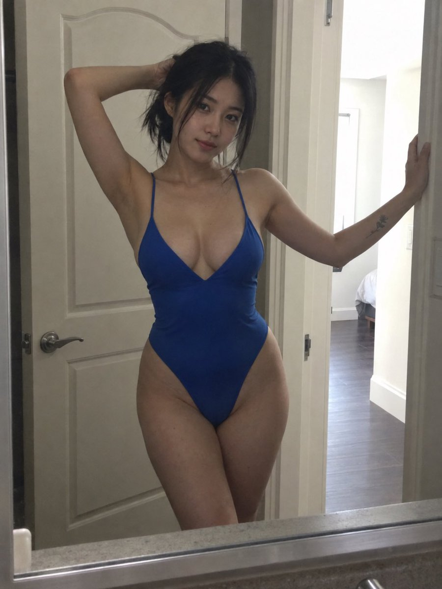

**Prompt**

```text
Traducción en curso
```

[↑ Volver a categorías](#catalog)

---

<a name="prompt-2098553866908533220"></a>

### Traducción en curso

Autor：[@Hamburgerai](https://x.com/Hamburgerai) · [Publicación original](https://x.com/Hamburgerai/status/2098553866908533220)

Póster / Folleto · Fotografía · Texto / Tipografía · Publicado

**Resumen:** Traducción en curso

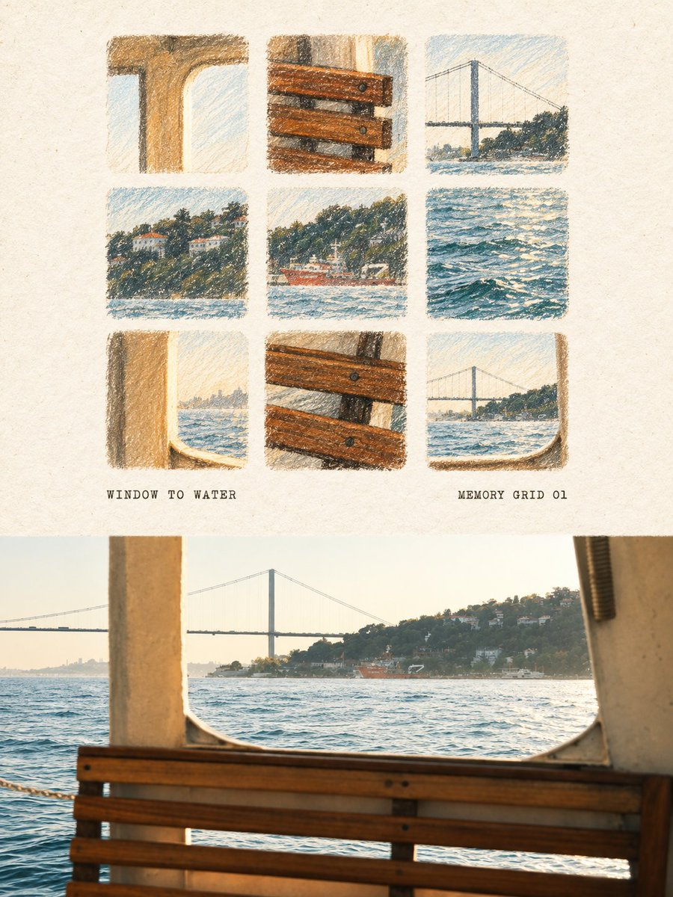

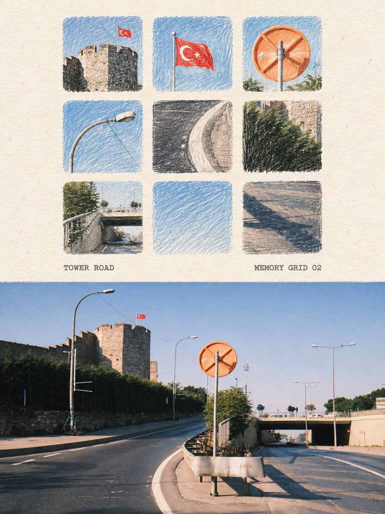

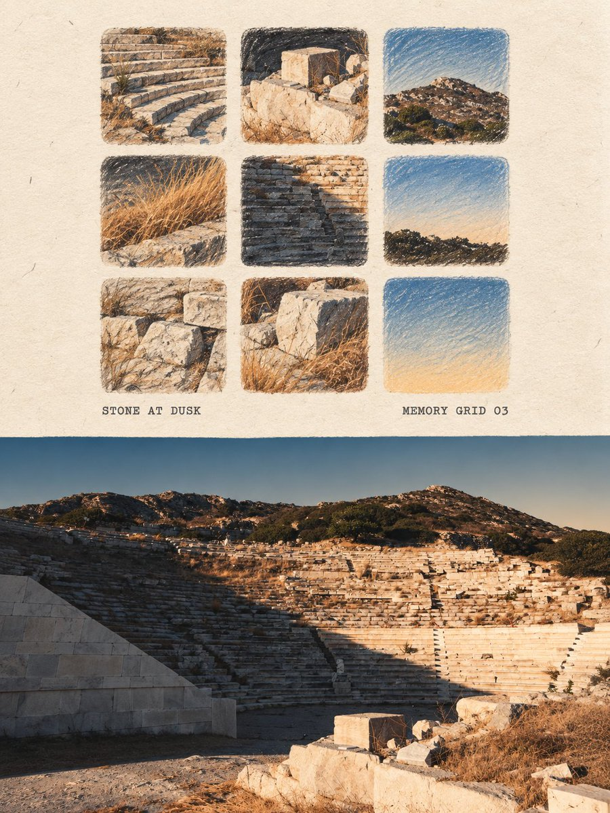

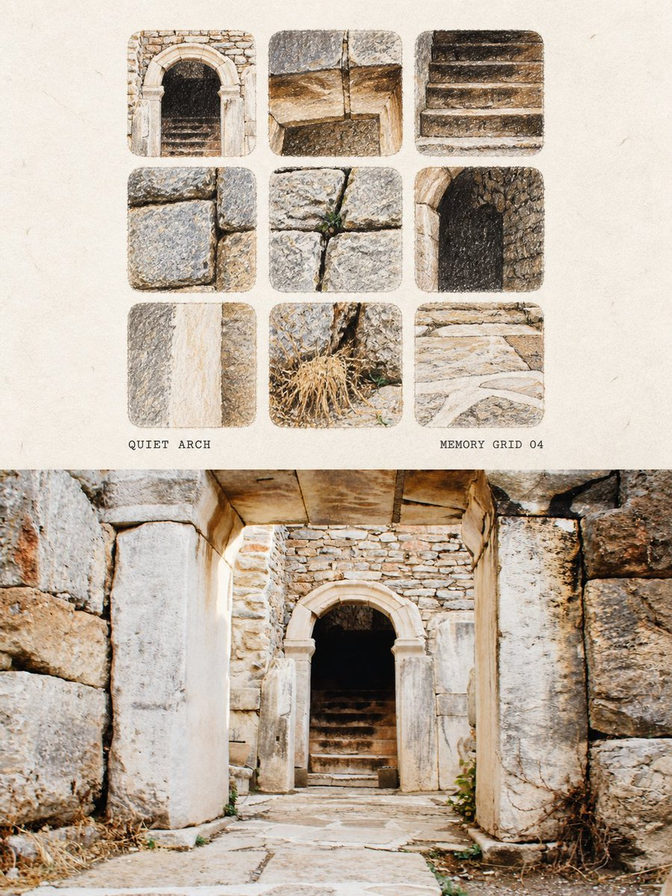

**Prompt**

```text
Traducción en curso
```

[↑ Volver a categorías](#catalog)

---

<a name="prompt-2098535116545110425"></a>

### Foto ultra fotorrealista de cuerpo entero medio de una supermodelo grunge con abrigo de cuero negro sentada entre flores.

Autor：[@ai\_vision\_2nd](https://x.com/ai_vision_2nd) · [Publicación original](https://x.com/ai_vision_2nd/status/2098535116545110425)

Fotografía · Publicado

**Resumen:** Foto ultra fotorrealista de cuerpo entero medio de una supermodelo grunge con abrigo de cuero negro sentada entre flores.

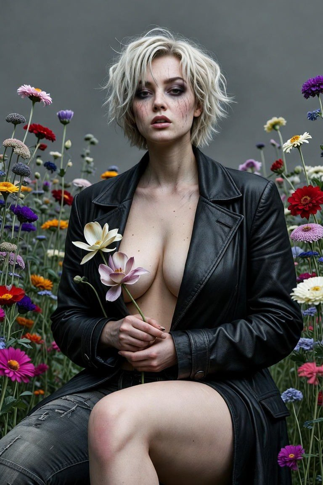

**Prompt**

```text
Fotografía ultra fotorrealista de cuerpo entero medio de una glamurosa y voluptuosa supermodelo de estilo grunge y playmate, sentada en un campo de flores en flor. Perfecta figura de reloj de arena con un volumen suave y natural. Cabello agresivamente simple y delicado: capas despuntadas de longitud corta a media con puntas suaves e irregulares. Maquillaje grunge excéntrico y minimalista: delineador difuminado, labios pálidos, pecas tenues. Viste un abrigo largo de cuero negro estilo grunge, abierto pero que permanece en gran parte cerrado sobre el pecho por la forma en que cae y por grandes pétalos de flores frescas que descansan de manera natural sobre la parte delantera; solo las clavículas y una estrecha línea vertical de piel son visibles. Unos pantalones desgastados de tiro bajo completan el look. La pose es relajada, con una rodilla levantada y ambas manos sosteniendo suavemente flores que suavizan aún más la zona del pecho. Cada flor al abrirse inunda el mundo gris con un rico color vivo que baña su abrigo y su piel. El sujeto ocupa la mayor parte del encuadre. El sujeto se mantiene extremadamente detallado y fotorrealista incluso en esta composición ambiental de cuerpo entero: la nitidez facial, los poros, el vello fino y las texturas del cuero se mantienen completamente nítidos. 85 mm a f/1.8, luz direccional suave con destellos de color surrealistas, expresión artística y contenida de la belleza femenina.
```

[↑ Volver a categorías](#catalog)

---

<a name="prompt-2098530398724915395"></a>

### Retrato fotorrealista de cuerpo entero medio de una joven japonesa en lencería de encaje rosa y negro de inspiración gótica caminando en un campo de flores resplandeciente al anochecer.

Autor：[@ai\_vision\_2nd](https://x.com/ai_vision_2nd) · [Publicación original](https://x.com/ai_vision_2nd/status/2098530398724915395)

Fotografía · Retrato / Selfie · Personaje · Artículo de moda · Publicado

**Resumen:** Retrato fotorrealista de cuerpo entero medio de una joven japonesa en lencería de encaje rosa y negro de inspiración gótica caminando en un campo de flores resplandeciente al anochecer.

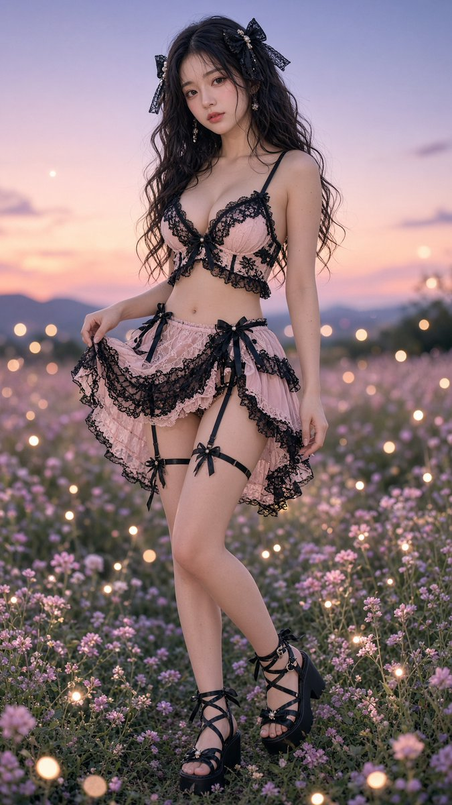

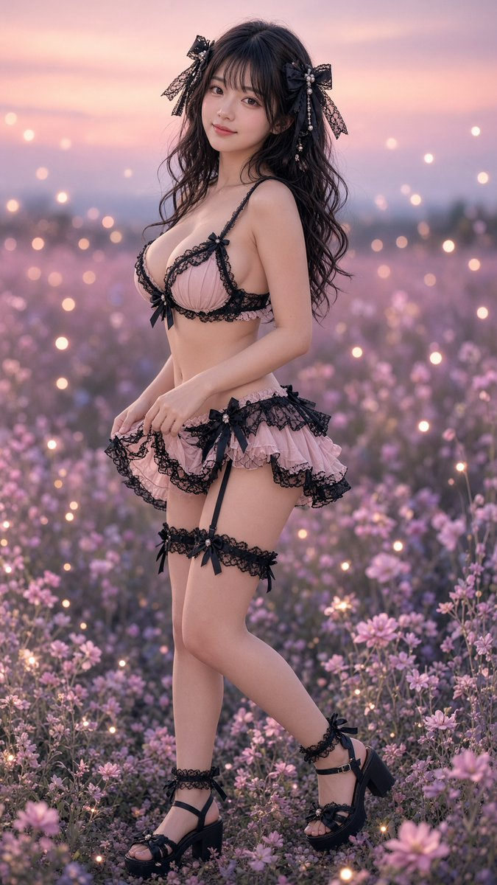

**Prompt**

```text
Fotografía fotorrealista de catálogo de moda de cuerpo entero medio de una hermosa joven japonesa con una suave expresión kawaii, cabello oscuro ondulado y voluminoso adornado con múltiples lazos de encaje negro y toques de perlas, senos abundantes y naturales con un volumen suave y textura fina de piel realistas, vistiendo únicamente una linda braguita de lencería de encaje en capas rosa pálido y negro de inspiración gótica con detalles de lazos, correas a juego para los muslos y elegantes sandalias de plataforma góticas. Camina lentamente a través de un campo de flores resplandeciente y de ensueño al anochecer con orbes de luz flotantes, el cuerpo ligeramente girado, una mano levantando un borde de encaje de su lencería y la mirada dirigida suavemente hacia la cámara. El sujeto llena una porción significativa del encuadre en una toma de cuerpo entero medio. El sujeto se mantiene extremadamente detallado y fotorrealista incluso en esta composición de cuerpo entero, con rasgos faciales nítidos, poros de la piel y vello fino visibles, realismo natural en el busto y texturas intrincadas de encaje de múltiples capas completamente definidas. Tomada con una Canon EOS R5 y lente de 70mm f/1.8 a f/2.0, iluminación suave crepuscular con un ligero efecto bloom, microtexturas de piel y tela ultrarrealistas.
```

[↑ Volver a categorías](#catalog)

---

<a name="prompt-2098490558474027231"></a>

### Traducción en curso

Autor：[@FuguiChen1314](https://x.com/FuguiChen1314) · [Publicación original](https://x.com/FuguiChen1314/status/2098490558474027231)

Fotografía · Retrato / Selfie · Artículo de moda · Publicado

**Resumen:** Traducción en curso


**Prompt**

```text
Traducción en curso
```

[↑ Volver a categorías](#catalog)

---

<a name="prompt-2098398277095821330"></a>

### Prompt fotorrealista para un retrato de moda urbana de cuerpo entero de un elegante hombre negro con un abrigo color camel caminando por el centro de Filadelfia.

Autor：[@PrometheanAIX](https://x.com/PrometheanAIX) · [Publicación original](https://x.com/PrometheanAIX/status/2098398277095821330)

Fotografía · Retrato / Selfie · Personaje · Artículo de moda · Paisaje urbano / Calle · Publicado

Publicación original：[@PrometheanAIX](https://x.com/PrometheanAIX) · [Publicación original](https://x.com/PrometheanAIX/status/2098384758145257614)

**Resumen:** Prompt fotorrealista para un retrato de moda urbana de cuerpo entero de un elegante hombre negro con un abrigo color camel caminando por el centro de Filadelfia.


**Prompt**

```text
Crea un retrato de moda urbana de cuerpo entero y ultra fotorrealista de un hombre negro de aspecto rudo y atractivo que camina con seguridad hacia la cámara por una acera del centro de Filadelfia. Tiene una constitución física atlética y masculina, cabello corto y oscuro debajo de una gorra de béisbol negra ajustada, una barba completa bien arreglada, un pequeño pendiente de aro y una expresión tranquila y seria.

Atuendo
Viste un abrigo largo de lana color camel con solapas anchas, abierto sobre una camiseta blanca lisa de corte holgado (oversize). Combínalo con unos vaqueros holgados de lavado claro, con un gran roto deshilachado en una rodilla y sutiles detalles desgastados. Completa el conjunto con unas zapatillas altas blancas e impecables, un collar largo y minimalista con colgante dorado, un pendiente pequeño y un reloj de pulsera dorado imponente. El estilo es de moda urbana contemporánea de alta gama con un aire masculino natural.

Pose
Captúralo a mitad de paso caminando directamente hacia la cámara, con una mano casualmente dentro del bolsillo de sus vaqueros mientras el otro brazo cuelga de forma natural. Su abrigo cae abierto y se mueve sutilmente al ritmo de su paso. Mira ligeramente más allá de la cámara con un lenguaje corporal relajado y seguro de sí mismo.

Entorno
Ambienta la escena en Center City, Filadelfia, con edificios históricos de piedra, escalinatas de casas adosadas, barandillas de hierro forjado negro, vegetación, farolas, tráfico, peatones y una entrada al metro de Broad Street. El Ayuntamiento de Filadelfia y su torre del reloj se reconocen con claridad a lo lejos, aportando a la fotografía una identidad inconfundible de Filadelfia al tiempo que transmite la naturalidad de un instante urbano.

Fotografía y Cinematografía
Utiliza una fotografía de moda urbana contemporánea prémium, encuadre completo de pies a cabeza, perspectiva a la altura de los ojos y un aspecto de lente de 50–70 mm. La cálida luz del sol de última hora de la tarde crea hermosos reflejos a lo largo del abrigo camel y una iluminación dimensional y natural sobre su rostro. Mantén al sujeto perfectamente enfocado con una separación de fondo controlada, textura realista de piel y barba, detalles precisos de la lana y el denim, profundidad urbana natural, grano fotográfico sutil y un exquisito etalonaje de color editorial.

Evitar: piel plástica o falsa, retoque excesivo, músculos exagerados, estilismo excesivamente formal, logotipos en exceso, posados rígidos, calles vacías, monumentos artificiales, bokeh excesivo, aspecto de CGI, sobresaturación o estética de muñeco de moda.
```

[↑ Volver a categorías](#catalog)

---

<a name="prompt-2098396584879002102"></a>

### Plantilla de prompt para generar un póster promocional realista de un concursante del reality brasileño A Fazenda 18 a partir de un selfi personal, incluyendo campos de perfil del concursante y pautas de color específicas.

Autor：[@balancogeral](https://x.com/balancogeral) · [Publicación original](https://x.com/balancogeral/status/2098396584879002102)

Póster / Folleto · Fotografía · Retrato / Selfie · Publicado

**Resumen:** Plantilla de prompt para generar un póster promocional realista de un concursante del reality brasileño A Fazenda 18 a partir de un selfi personal, incluyendo campos de perfil del concursante y pautas de color específicas.


**Prompt**

```text
Transforma mi selfi en una publicación promocional realista de participante de A Fazenda 18. Incluye [NOME], [CIDADE], frase característica, punto fuerte, punto débil y probabilidad de llegar a la Final. Conserva fielmente mi rostro y mi apariencia natural. Foto en formato 4:5, pose espontánea, mirada directa, entorno rural discreto, luz suave, textura de piel real y composición editorial asimétrica. Paleta: beige melocotón #f2ceb0, verde agua #00ad9d y naranja #e98300. Poco texto, aspecto natural, sin exceso de retoques, efectos, logotipos inventados ni apariencia de imagen generada por IA.
```

[↑ Volver a categorías](#catalog)

---

<a name="prompt-2098338457491800556"></a>

### Prompt para generar un video animado realista de un lingote de oro que brota en el barro hasta convertirse en un árbol gigante cargado de lingotes, seguido de la llegada de trabajadores para cosecharlos y cargarlos en un camión.

Autor：[@abs\_uiux](https://x.com/abs_uiux) · [Publicación original](https://x.com/abs_uiux/status/2098338457491800556)

Fotografía · Personaje · Publicado

**Resumen:** Prompt para generar un video animado realista de un lingote de oro que brota en el barro hasta convertirse en un árbol gigante cargado de lingotes, seguido de la llegada de trabajadores para cosecharlos y cargarlos en un camión.


**Prompt**

```text
Crea un video vertical cinematográfico y ultrafotorrealista de 10 segundos (9:16).
Un lingote de oro (gold biscuit) realista yace abandonado en el arcén embarrado de una carretera tras una fuerte lluvia. El agua de lluvia fluye a su alrededor mientras el objeto se hunde lentamente en la tierra húmeda. En cuestión de segundos, el objeto enterrado comienza a brillar desde el subsuelo. Un diminuto brote verde emerge exactamente del mismo lugar y crece con rapidez hasta convertirse en un gigantesco árbol maduro de lingotes de oro. El grueso tronco y las ramas imitan de forma natural la forma, textura, colores y lenguaje de diseño del lingote de oro original. Cientos de lingotes de oro maduros y con todo lujo de detalles cuelgan de cada rama como frutos reales, meciéndose suavemente con el viento.
Inmediatamente después de que el árbol termine de crecer, llega un gran camión de carga y se detiene a su lado. Un trabajador se sube rápidamente al árbol mientras varios otros cosechan con rapidez cada lingote de oro de las ramas, arrojándolos al camión con movimientos rápidos y realistas. En cuestión de instantes, el árbol queda completamente cosechado. El camión se llena por completo con cientos de lingotes de oro y se aleja, dejando atrás únicamente el árbol vacío.
Toma continua única, clima lluvioso realista, suelo embarrado, iluminación cinematográfica, viento natural, física creíble, texturas ultradetalladas, animación de crecimiento fluida, transformación sin interrupciones, sin cortes, sin fallos técnicos, sin parpadeos, sin objetos sobrantes, 8K, HDR, hiperrealista, realismo de estilo documental." nota: los lingotes de oro deben ser iguales de principio a fin; si son rectangulares, todos deben ser rectangulares y realistas
```

[↑ Volver a categorías](#catalog)

---

<a name="prompt-2098291700355432939"></a>

### Retrato de una mujer joven y elegante en el asiento delantero de un coche, vestida con blazer negro y vaqueros claros, con interior de cuero marrón y suave luz natural.

Autor：[@afrinxai](https://x.com/afrinxai) · [Publicación original](https://x.com/afrinxai/status/2098291700355432939)

Fotografía · Retrato / Selfie · Personaje · Artículo de moda · Vehículo · Publicado

Publicación original：[@afrinxai](https://x.com/afrinxai) · [Publicación original](https://x.com/afrinxai/status/2098230798759457070)

**Resumen:** Retrato de una mujer joven y elegante en el asiento delantero de un coche, vestida con blazer negro y vaqueros claros, con interior de cuero marrón y suave luz natural.


**Prompt**

```text
Utiliza la foto subida como referencia de identidad facial para una mujer adulta. Conserva sus rasgos faciales reconocibles, el tono de piel natural, las proporciones faciales y la apariencia general. Un retrato elegante y con estilo de una mujer joven con cabello largo ondulado de color castaño oscuro, mirando con confianza directamente a la cámara. Está sentada cómodamente en el asiento delantero de un coche con tapicería de cuero marrón, recostada contra el reposacabezas. Su atuendo consiste en un blazer negro entallado con solapas en punta, un botón frontal visible y una solapa en el bolsillo del pecho, combinado con unos vaqueros de denim de tiro alto y lavado claro. El enfoque es nítido en su expresión y en las texturas de su blazer negro y los vaqueros de mezclilla. Sus piernas están relajadas, con los vaqueros de lavado claro claramente visibles. El interior del coche muestra asientos de cuero marrón con costuras claras y un panel de puerta negro. A través de la ventanilla del coche se aprecia un fondo desenfocado de árboles y arbustos verdes. La luz natural del día es suave y favorecedora. La composición es un plano medio, con una profundidad de campo reducida, que deja los detalles del coche y el fondo en un suave desenfoque. La calidad fotográfica es de alta resolución, con colores y texturas naturales.
```

[↑ Volver a categorías](#catalog)

---

<a name="prompt-2098283754599174194"></a>

### Traducción en curso

Autor：[@muse\_ai\_prompt](https://x.com/muse_ai_prompt) · [Publicación original](https://x.com/muse_ai_prompt/status/2098283754599174194)

Fotografía · Retrato / Selfie · Personaje · Publicado

**Resumen:** Traducción en curso


**Prompt**

```text
Traducción en curso
```

[↑ Volver a categorías](#catalog)

---

<a name="prompt-2097889772899639317"></a>

### Traducción en curso

Autor：[@Soranlan](https://x.com/Soranlan) · [Publicación original](https://x.com/Soranlan/status/2097889772899639317)

Fotografía · Retrato / Selfie · Personaje · Artículo de moda · Publicado

Publicación original：[@Soranlan](https://x.com/Soranlan) · [Publicación original](https://x.com/Soranlan/status/2081181748478562704)

**Resumen:** Traducción en curso


**Prompt**

```text
Traducción en curso
```

[↑ Volver a categorías](#catalog)

---

<a name="prompt-2097888970994495736"></a>

### genérame incorporándome de espaldas a la cámara, luego levantándome y dándome la vuelta para hacer unas cuantas flexiones

Autor：[@RSOXART](https://x.com/RSOXART) · [Publicación original](https://x.com/RSOXART/status/2097888970994495736)

Fotografía · Publicado

**Resumen:** genérame incorporándome de espaldas a la cámara, luego levantándome y dándome la vuelta para hacer unas cuantas flexiones


**Prompt**

```text
genérame incorporándome de espaldas a la cámara, luego levantándome y dándome la vuelta para hacer unas cuantas flexiones
```

[↑ Volver a categorías](#catalog)

---

<a name="prompt-2097892780052013289"></a>

### Retrato de estudio realista de una mujer joven con ojos verde avellana, un peinado recogido y un vestido blanco con volantes.

Autor：[@oju689](https://x.com/oju689) · [Publicación original](https://x.com/oju689/status/2097892780052013289)

Fotografía · Retrato / Selfie · Personaje · Artículo de moda · Publicado

**Resumen:** Retrato de estudio realista de una mujer joven con ojos verde avellana, un peinado recogido y un vestido blanco con volantes.


**Prompt**

```text
Retrato en primer plano ultrarrealista de una hermosa mujer joven con rasgos delicados y naturales, piel clara y suave con sutiles pecas y textura de piel realista, expresivos ojos verde avellana que miran ligeramente hacia un lado, cejas definidas de forma natural, labios suaves y rosados, y una expresión dulce y segura. Su cabello castaño oscuro está recogido en un peinado alto desenfadado, elegante y suelto, con mechones sueltos naturales que enmarcan su rostro. Lleva un romántico vestido blanco con textura, delicadas mangas cortas con volantes y un escote suavemente fruncido, combinado con finos collares dorados superpuestos con diminutos detalles de perlas y pequeños colgantes, además de elegantes pendientes colgantes.

Iluminación de estudio suave, cálida y natural, fondo beige neutro, sombras sutiles, proporciones faciales realistas, mechones de cabello detallados, textura y poros de piel auténticos, maquillaje natural, rubor suave, fotografía cinematográfica, profundidad de campo reducida, lente de retrato de 85 mm, f/1.8, alto rango dinámico, fotografía editorial profesional, fotorrealista, ultradetallada, calidad 8K, sin CGI ni apariencia artificial.
```

[↑ Volver a categorías](#catalog)

---

<a name="prompt-2097851840532783565"></a>

### Traducción en curso

Autor：[@Live\_life\_style](https://x.com/Live_life_style) · [Publicación original](https://x.com/Live_life_style/status/2097851840532783565)

Fotografía · Personaje · Vehículo · Publicado

**Resumen:** Traducción en curso


**Prompt**

```text
Traducción en curso
```

[↑ Volver a categorías](#catalog)

---

<a name="prompt-2097562587437342750"></a>

### Prompt maestro diseñado para dar sutilmente forma de animales a las nubes existentes en fotos de referencia mediante pareidolia, manteniendo texturas realistas de fotografía móvil.

Autor：[@er1029iu](https://x.com/er1029iu) · [Publicación original](https://x.com/er1029iu/status/2097562587437342750)

Fotografía · Animal / Criatura · Publicado

**Resumen:** Prompt maestro diseñado para dar sutilmente forma de animales a las nubes existentes en fotos de referencia mediante pareidolia, manteniendo texturas realistas de fotografía móvil.


**Prompt**

```text
CLOUD DOPPELGÄNGER — PROMPT MAESTRO PARA FOTO REAL

Utiliza la fotografía original adjunta como imagen de referencia fija.

BLOQUEO DE REFERENCIA — MUY IMPORTANTE

La fotografía original debe seguir siendo reconocible y visualmente coherente.

Conservar:
- el cielo azul original
- la distribución real de las nubes
- el ángulo de cámara original
- los cables aéreos diagonales
- los reflejos de la ventana
- la iluminación natural existente
- la calidad fotográfica imperfecta del mundo real
- la perspectiva y composición originales

No reemplaces todo el cielo.
No rediseñes la escena.
No crees un fondo completamente nuevo.

--------------------------------------------------
PASO 1 — ANALIZAR LA NUBE ORIGINAL
--------------------------------------------------

Primero, analiza detenidamente la nube principal en la fotografía adjunta.

Estudia sus:

- silueta exterior
- masas redondeadas
- zonas salientes
- secciones estrechas
- espacios vacíos
- luces y sombras naturales
- densidad de la nube
- dirección
- impresión visual general

Luego, determina a qué animal real o criatura viviente familiar
se asemeja más de forma natural la nube existente.

El parecido debe provenir DE LA FORMA DE LA NUBE EXISTENTE.

No fuerces un animal no relacionado dentro de la nube.

--------------------------------------------------
PASO 2 — INTERPRETACIÓN NATURAL DEL DOPPELGÄNGER
--------------------------------------------------

Transforma únicamente la percepción que el espectador tiene de la nube.

La nube en sí debe seguir pareciendo una NUBE REAL.

Utiliza las masas de nubes existentes como la estructura natural de:

cabeza,
cuerpo,
orejas,
hocico,
patas,
cola,
u otros rasgos reconocibles.

Enfatiza únicamente los rasgos que ya parezcan naturalmente posibles
a partir de la silueta de la nube original.

La reacción del espectador debe ser:

"Espera... esa nube parece un animal".

NO:

"Alguien pegó un animal en el cielo".

--------------------------------------------------
LA NUBE REAL ES LO PRIMERO
--------------------------------------------------

Equilibrio visual objetivo:

90–95% nube real
5–10% parecido imaginativo

La nube debe seguir estando hecha enteramente de:

vapor de agua realista,
partículas de nube suaves,
difusión atmosférica natural,
bordes de nube irregulares,
luz solar real,
profundidad volumétrica sutil.

NO crees:

un animal peludo flotando en el cielo,
una cara de animal realista pegada en una nube,
ojos de dibujos animados,
ojos de aspecto humano,
rasgos faciales perfectamente simétricos,
pelaje CGI,
texturas plásticas,
apariencia de mascota 3D.

--------------------------------------------------
DETALLES FACIALES / DEL PERSONAJE
--------------------------------------------------

Si los detalles faciales son necesarios,
deben ser extremadamente sutiles.

Los ojos deben sugerirse principalmente mediante
sombras naturales de las nubes y diminutas diferencias tonales.

La nariz o la boca solo pueden aparecer como
variaciones muy tenues en la densidad de la nube.

Nada de ojos negros evidentes tipo botón.
Nada de sonrisas exageradas.
Nada de lenguas de dibujos animados.
Nada de contornos faciales artificiales.

El parecido con el animal debe surgir a través de la pareidolia.

--------------------------------------------------
CALIDAD DE FOTO REAL
--------------------------------------------------

El resultado final debe parecer
una fotografía real espontánea capturada a través de una ventana.

Fotografía natural de iPhone.

Realismo de cámara de smartphone de calidad media,
no un anuncio publicitario,
no una fotografía de estudio.

Mantén:

un ligero resplandor de la ventana,
pequeños reflejos,
imperfecciones menores de exposición,
neblina atmosférica natural,
nitidez ligeramente desigual,
rango dinámico realista,
ruido de sensor sutil,
variación de color natural.

Evita el HDR excesivo.
Evita el enfoque/nitidez excesivo.
Evita la saturación artificial.
```

[↑ Volver a categorías](#catalog)

---

<a name="prompt-2097519361909199023"></a>

### Primer plano medio fotorrealista de una mujer flotando de espaldas en aguas cristalinas durante el atardecer.

Autor：[@punkhuri1](https://x.com/punkhuri1) · [Publicación original](https://x.com/punkhuri1/status/2097519361909199023)

Fotografía · Personaje · Paisaje / Naturaleza · Publicado

**Resumen:** Primer plano medio fotorrealista de una mujer flotando de espaldas en aguas cristalinas durante el atardecer.


**Prompt**

```text
Fotografía artística fotorrealista en plano medio corto de una mujer adulta flotando plácidamente boca arriba en aguas tranquilas y cristalinas al atardecer.

Viste una parte superior de bikini azul claro y una parte inferior blanca. Sus ojos están suavemente cerrados, su rostro inclinado hacia arriba mirando al cielo vespertino, transmitiendo una relajación absoluta. Su cabello castaño y mojado se esparce de forma natural por el agua alrededor de su cabeza. Un brazo se extiende de manera natural hacia afuera sobre la superficie, mientras que sus piernas son suavemente visibles bajo el agua transparente.

El agua es excepcionalmente transparente, con hermosos reflejos arremolinados de azul profundo, turquesa, verde azulado y oro cálido creados por el sol poniente. Suaves ondas y una sutil refracción rodean su cuerpo, creando una auténtica apariencia de agua natural.

La parte superior de la composición contiene un cielo luminoso de atardecer en tonos cálidos de naranja, ámbar y amarillo suave, que hace una transición natural hacia el agua más fría en tonos azules y turquesas de abajo. La luz del sol de la hora dorada genera un resplandor cálido a lo largo de toda la escena y reflejos realistas sobre la superficie del agua.

Textura natural de la piel, cabello mojado realista, reflejos y refracción del agua físicamente precisos, ondas sutiles, iluminación y sombras realistas, profundidad fotográfica auténtica, detalles fieles de la piel y de la tela.

Composición: plano medio corto con el rostro y la parte superior del cuerpo de la mujer como punto focal principal, manteniendo visible suficiente parte de su cuerpo para establecer la postura de flotación. Mantener una relación equilibrada entre el cálido cielo del atardecer y los coloridos reflejos del agua. Perspectiva natural, encuadre cinematográfico, profundidad de campo fotográfica de superficial a moderada, sin aspecto artificial de estudio.

Estilo: fotografía artística profesional de alto nivel de detalle, aspecto fotorrealista de acción real, reproducción natural del color, realismo cinematográfico, auténtica atmósfera de hora dorada, superficie del agua realista, iluminación físicamente precisa, fino detalle fotográfico, sutil grano de película, calidad de obra maestra.
```

[↑ Volver a categorías](#catalog)

---

<a name="prompt-2097217893767303361"></a>

### Prompt de fotografía realista de una joven japonesa de cabello castaño ceniza con una camiseta oversize de cuello ancho que se inclina profundamente hacia adelante para escribir con un bolígrafo en un papel sobre una mesa en un recinto de eventos interior.

Autor：[@kamakirin13993](https://x.com/kamakirin13993) · [Publicación original](https://x.com/kamakirin13993/status/2097217893767303361)

Fotografía · Personaje · Publicado

**Resumen:** Prompt de fotografía realista de una joven japonesa de cabello castaño ceniza con una camiseta oversize de cuello ancho que se inclina profundamente hacia adelante para escribir con un bolígrafo en un papel sobre una mesa en un recinto de eventos interior.


**Prompt**

```text
Una joven japonesa con cabello castaño ceniza cortado en capas cortas, mirando hacia abajo. Viste una camiseta oversize con un cuello amplio y abierto y vaqueros de mezclilla. Frente a ella hay una mesa, y sobre la mesa hay una hoja de papel blanco para fotocopias. Sostiene un bolígrafo con la mano derecha y, desde una posición de pie, se inclina profundamente hacia adelante intentando escribir en el papel. Su mano izquierda está sobre la mesa. El fondo es un recinto de eventos en interiores. Iluminación natural, piel natural. Textura de tela natural en la ropa. Estilo de fotografía realista con detalles minuciosos hasta la textura de la piel, alta resolución.
```

[↑ Volver a categorías](#catalog)

---

<a name="prompt-2097223313592316111"></a>

### Retrato de estudio ultrarrealista de un hombre con cuello alto negro y gafas transparentes con iluminación dual magenta y cian.

Autor：[@abs\_uiux](https://x.com/abs_uiux) · [Publicación original](https://x.com/abs_uiux/status/2097223313592316111)

Fotografía · Retrato / Selfie · Personaje · Publicado

**Resumen:** Retrato de estudio ultrarrealista de un hombre con cuello alto negro y gafas transparentes con iluminación dual magenta y cian.


**Prompt**

```text
Crea un retrato de estudio en primer plano y ultrarrealista de un hombre adulto con una expresión confiada y reflexiva, fotografiado desde el pecho hacia arriba con un estilo editorial moderno de primera calidad.

Dale un cabello negro, corto y prolijo. Lleva unas gafas rectangulares transparentes con sutiles reflejos de las luces del estudio.

Vístelo con un jersey de cuello alto negro ajustado debajo de un sofisticado blazer entallado negro con solapas estructuradas. Mantén el atuendo completamente minimalista y monocromático, sin joyas visibles ni accesorios innecesarios.

Colócalo posando ligeramente orientado lejos de la cámara, con la cabeza suavemente inclinada hacia arriba y los ojos mirando hacia la parte superior derecha del encuadre, creando un ambiente sereno, inteligente y aspiracional.

Utiliza una iluminación de estudio dramática de dos tonos: una intensa luz de contorno magenta/púrpura que ilumina el lado izquierdo de su cabello y rostro, y una vibrante luz azul eléctrico/cian que ilumina el lado derecho. Mantén una iluminación frontal neutra y suave en el rostro para que la piel se mantenga realista, detallada y adecuadamente expuesta.

Crea un fondo de estudio futurista y desenfocado con un rico degradado que transicione de púrpura intenso y magenta a la izquierda a azul eléctrico a la derecha. Añade una barra de luz de neón magenta brillante en diagonal en el fondo inferior izquierdo para aportar mayor profundidad visual.

Enfatiza la textura realista de la piel, vellos de barba detallados, ojos nítidos, reflejos naturales en las gafas, textura definida en la tela, contraste cinematográfico, poca profundidad de campo, bokeh suave y colorido, fotografía de marca personal premium, estética editorial corporativa de alta gama, ultrafotorrealista, aspecto de lente de retrato de 85 mm, f/1.8, detalle en 8K, composición vertical 4:5.
```

[↑ Volver a categorías](#catalog)

---

<a name="category-cinematic-film-still"></a>

## Cine / Fotograma de película

<a name="prompt-2098476449212805468"></a>

### Toma continua con textura de película en la playa de San Diego durante la hora rosa, donde las ondas sonoras hacen vibrar la arena e iluminan el plancton bioluminiscente.

Autor：[@jfischoff](https://x.com/jfischoff) · [Publicación original](https://x.com/jfischoff/status/2098476449212805468)

Cine / Fotograma de película · Animal / Criatura · Publicado

**Resumen:** Toma continua con textura de película en la playa de San Diego durante la hora rosa, donde las ondas sonoras hacen vibrar la arena e iluminan el plancton bioluminiscente.

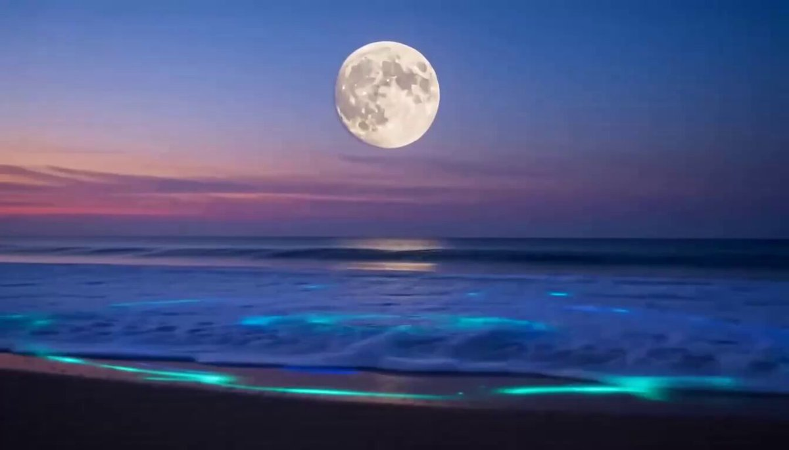

**Prompt**

```text
Cámara de película. Película en color Fuji Nikon de 35 mm. Saturada. Fotografía profesional realista. Una toma continua del sonido haciendo vibrar la arena y provocando que el plancton bioluminiscente se ilumine en grupos nubosos en el océano, desde la playa en la hora rosa de San Diego.
```

[↑ Volver a categorías](#catalog)

---

<a name="prompt-2098392252137820636"></a>

### Cinematic live-action fantasy prompt of a girl dodging a horned demon's tentacles and slapping him with an energized flip-flop saying 'Baka'.

Autor：[@recehtuitt](https://x.com/recehtuitt) · [Publicación original](https://x.com/recehtuitt/status/2098392252137820636)

Cine / Fotograma de película · Personaje · Texto / Tipografía · Publicado

**Resumen:** Cinematic live-action fantasy prompt of a girl dodging a horned demon's tentacles and slapping him with an energized flip-flop saying 'Baka'.


**Prompt**

```text
[10s | 16:9 | 24fps | una toma cinematográfica continua]  

REFERENCIA: 
@image1 = REIKA MASTER. Conservar apariencia reconocible, proporciones, cabello largo y oscuro, camiseta blanca oversize, pantalones cortos cargo oscuros, sandalias, collar y vestuario. Reika posee una velocidad extrema, reflejos y un control físico sin esfuerzo. Puede quitarse una chancla y conservarla como accesorio en la mano. 
@image2 = VORN MASTER. Conservar apariencia reconocible, escala humanoide normal, cuernos, cabello largo y blanco, cola de hueso, armadura ósea en capas y prendas pálidas y andrajosas. Vorn utiliza tres tentáculos de aura similares a huesos con una presión ofensiva de velocidad extrema.  

ESTILO: Fantasía fotorrealista de acción real prémium estilo IMAX, ARRI ALEXA 65 / RED V-RAPTOR XL, anamórfico de 35 mm, Kodak Vision3 500T. Sombras profundas en tono cian-azulado, reflejos contenidos en naranja-ámbar, contraste nocturno oscuro, superficies húmedas y reflectantes, materiales táctiles, peso realista, desenfoque de movimiento natural y grano de película sutil. La energía característica de Reika es de un plateado metálico oscuro entrelazado con fuego carmesí-negro controlado. ENTORNO: Calle céntrica empapada por la lluvia de noche, asfalto mojado, coches aparcados, escaparates de cristal, farolas y multitudes en pánico. La calle se fractura progresivamente y se llena de agua, cristales y restos de vehículos a medida que los ataques de Vorn fallan.  

CRONOLOGÍA DE LA ACCIÓN:  [00:00–00:02.5] COMPÁS 1 — EVASIÓN SIN ESFUERZO Reika se quita con calma una chancla y la sostiene holgadamente con una mano, dejando ese pie descalzo. Vorn dispara instantáneamente tres tentáculos de aura óseos hacia el torso, la cabeza y las piernas de Reika desde ángulos convergentes. Reika nunca contraataca; simplemente pivota, se inclina y se desliza entre ellos con movimientos diminutos y precisos, fallando cada golpe por centímetros e impactando contra la calle mojada detrás de ella. COMENZAR detrás del hombro de Reika, siguiendo los tentáculos hacia su posición exacta, luego orbitar de cerca con su ritmo evasivo mientras el agua y el asfalto estallan detrás de cada fallo. 

ACENTO: Cámara lenta de 0.2 s en un tentáculo que pasa a centímetros de la cara de Reika, luego volver bruscamente a la velocidad extrema. DETENER con Reika aún imperturbable mientras Vorn encadena inmediatamente la siguiente andanada.  

[00:02.5–00:05.0] COMPÁS 2 — DIFERENCIA DE VELOCIDAD EN AUMENTO Vorn desata los tres tentáculos nuevamente, más rápido y desde ángulos que cambian constantemente, cada uno apuntando a la posición real del cuerpo de Reika. Reika aún se niega a atacar, deslizándose debajo de uno, esquivando otro con un paso y girando a través del golpe final casi sin movimientos desperdiciados. Los ataques fallidos atraviesan coches, cristales y asfalto, acumulando una densa nube de escombros directamente detrás de ella. COMENZAR con un seguimiento lateral con Reika, acelerando a medida que los tentáculos se cierran a su alrededor, luego hacer un barrido a través de la colisión final mientras los escombros llenan el encuadre. Reika aprovecha la ocultación para desplazarse a velocidad divina (God Speed) una distancia corta, dejando un rastro denso de humo negro a través de los escombros, y llega con calma al lado de Vorn antes de que este pueda reaccionar. DETENER en Vorn girándose bruscamente hacia ella.

[00:05–00:07.5] COMPÁS 3 — FUEGO CARMESÍ-PLATEADO Vorn ataca inmediatamente de nuevo a corta distancia. Reika permanece plantada y simplemente levanta la chancla que se había quitado. Una energía plateada metálica oscura se enrosca a su alrededor mientras un fuego carmesí-negro se entrelaza a través del núcleo plateado, intensificándose rápidamente alrededor de su mano. La lluvia y los escombros quedan brevemente suspendidos mientras la luz circundante cae en una sombra profunda de color cian-negro. Reika dice en voz baja: "Baka". El texto en japonés 「バカ」 se forma a su lado a partir de una energía dimensional plateada-negra bordeada de fuego carmesí, ocupando físicamente la atmósfera en lugar de comportarse como texto en pantalla. COMENZAR con un empuje controlado hacia el ataque entrante, curvar alrededor de Reika a medida que la energía se manifiesta, luego continuar directamente hacia su golpe. 

ACENTO: Cámara lenta de 0.2 s mientras la energía plateada-negra se comprime alrededor de la chancla. La chancla acelera inmediatamente hacia la cara de Vorn.  

[00:07.5–00:10.0] COMPÁS 4 — REMATE DE UN SOLO GOLPE La chancla golpea a Vorn directamente en la cara. La energía plateada-negra se comprime en el punto de contacto mientras el fuego carmesí-negro estalla hacia afuera. El impacto localizado genera una violenta onda de choque que dispersa lluvia, cristales, polvo y restos de vehículos por toda la calle. Vorn retrocede por el impacto único y luego se desintegra rápidamente en un polvo negro que se expande. COMENZAR desde el impulso del balanceo, empujar hacia el punto exacto de contacto, luego retroceder con la onda de choque a medida que los escombros se expanden hacia afuera. Usar micro cámara lenta solo para el primer instante de contacto, luego restaurar el movimiento a toda velocidad. TERMINAR con Reika firmemente plantada, con un pie descalzo y la chancla restante aún puesta, mientras la energía plateada-negra y el fuego carmesí se desvanecen.  

CONTINUIDAD: Reika permanece intocada durante los compases 1–2 y nunca contraataca hasta el golpe final. Vorn se mantiene continuamente a la ofensiva. La chancla retirada permanece en la mano de Reika hasta el impacto final; ese pie permanece descalzo en todo momento. Cada tentáculo fallido daña progresivamente el entorno y motiva las transiciones de cámara. El desplazamiento entre escombros del compás 2 sitúa a Reika junto a Vorn, estableciendo directamente el compás 3. La onda de choque final se origina en el punto exacto de contacto con la cara.  

EXCLUSIONES ESPECÍFICAS: Los tres tentáculos siempre convergen en la posición real del cuerpo de Reika; sus fallos destruyen el entorno detrás de ella en lugar de redirigirse al azar. El pie descalzo de Reika permanece descalzo y la chancla retirada nunca vuelve a él. El 「バカ」 sigue siendo una tipografía de energía dimensional dentro de la escena, no una superposición plana. La energía plateada-negra se mantiene entrelazada con el fuego carmesí-negro en lugar de convertirse en una llama ordinaria. La cámara sigue un impulso continuo sin reinicios ni cortes bruscos; cada personaje sigue siendo una única presencia continua.  

AUDIO: Lluvia intensa, desplazamiento de tentáculos, impactos en el asfalto, cristales rotos, restos de vehículos y pánico de la multitud. El sonido ambiental se comprime brevemente mientras Reika manifiesta la energía. Su "Baka" silencioso permanece claro. El contacto final produce un impacto denso, una onda de choque expansiva y escombros que caen en cascada. Sin BGM.
```

[↑ Volver a categorías](#catalog)

---

<a name="prompt-2098436364849320190"></a>

### Prompt para plano secuencia cinemático de un mercado nocturno flotante bajo la luz de la luna con farolillos y vendedores.

Autor：[@feesyiam](https://x.com/feesyiam) · [Publicación original](https://x.com/feesyiam/status/2098436364849320190)

Cine / Fotograma de película · Publicado

**Resumen:** Prompt para plano secuencia cinemático de un mercado nocturno flotante bajo la luz de la luna con farolillos y vendedores.


**Prompt**

```text
"Crea un video cinemático y fotorrealista de 15 segundos en plano secuencia continuo, basado exactamente en la imagen de referencia de «The Floating Night Market».

Conserva la arquitectura original, las plataformas flotantes de madera del mercado, los diseños de los farolillos, los vendedores, los clientes, los botes, el océano, las montañas, la paleta de colores y la composición general. No rediseñes ni reemplaces ningún elemento principal.

0–3 segundos: Comienza con un movimiento de cámara lento, suave y en ángulo bajo justo por encima de la superficie del océano oscuro, acercándose al mercado nocturno flotante. Cientos de farolillos de papel que emiten un brillo cálido se mecen suavemente con la brisa nocturna. Sus reflejos dorados brillan de manera natural sobre el agua en movimiento. Pequeñas olas se mueven suavemente alrededor de las plataformas flotantes.

3–7 segundos: La cámara se eleva lentamente y avanza a través del mercado, revelando una animada actividad. Los vendedores preparan comida de forma natural en pequeños puestos de madera, revolviendo suavemente ollas humeantes y asando comida a la parrilla. Un vapor fino y realista se eleva hacia la luz de los farolillos. Los clientes caminan tranquilamente por estrechos puentes de madera, conversando y mirando los puestos. Los farolillos parpadean sutilmente y se balancean con el viento.

7–11 segundos: Continúa el mismo movimiento ininterrumpido de cámara con un suave arco cinemático alrededor del mercado. Pequeños botes tradicionales pasan lentamente por debajo de las plataformas flotantes. Las ondas en el agua se extienden tras ellos. Los puestos de comida brillan con una cálida luz naranja y ámbar mientras la fría luz azul de la luna ilumina el océano circundante. La enorme luna llena permanece visible en el fondo, tras las montañas brumosas.

11–15 segundos: Retrocede y elévate lentamente hacia una revelación cinemática más amplia, mostrando todo el mercado nocturno flotante rodeado por el vasto océano. Cientos de farolillos forman un rastro resplandeciente sobre el agua. Los reflejos se extienden y se quiebran de forma natural con las olas. La niebla flota suavemente alrededor de las montañas distantes mientras la luz de la luna crea una atmósfera mágica. Termina con un hermoso plano general de establecimiento (establishing shot).

Estilo visual: ultrafotorrealista, fantasía cinemática, movimiento humano realista, física realista del océano y del agua, texturas de madera detalladas, brillo natural de los farolillos, luz lunar volumétrica, niebla atmosférica sutil, vapor realista, profundidad de campo reducida durante las tomas cercanas, fotografía cinemática de 35 mm, alto rango dinámico, extremadamente detallado, escala inmersiva, movimiento de cámara profesional y suave.

Movimiento: gestos humanos naturales, movimiento sutil del viento, farolillos balanceándose suavemente, vapor fluyendo, agua en movimiento, movimiento realista de los botes, sin animación exagerada.

Cámara: cámara cinemática estabilizada y suave, movimiento lento y controlado, profundidad de campo natural, push-in gradual → travelling hacia adelante → arco suave → retroceso amplio (pull-back). Una sola toma continua sin cortes.

Prompt negativo: sin cambios de escena, sin cortes, sin jump cuts, sin temblor de cámara, sin rostros distorsionados, sin personas duplicadas, sin edificios deformados.
```

[↑ Volver a categorías](#catalog)

---

<a name="prompt-2098289889964183843"></a>

### Crea un anuncio prémium vertical 9:16 de 15 segundos para Sambal Ekstra Pedas, que incluya 8 escenas cinematográficas, calidad 8K ultrafotorrealista, energía de thriller de acción × estética de anuncio de televisión de comida prémium, y cinematografía macro de comida a alta velocidad.

Autor：[@HeyRu0by](https://x.com/HeyRu0by) · [Publicación original](https://x.com/HeyRu0by/status/2098289889964183843)

Marketing de producto · Fotografía · Cine / Fotograma de película · Comida / Bebida · Publicado

**Resumen:** Crea un anuncio prémium vertical 9:16 de 15 segundos para Sambal Ekstra Pedas, que incluya 8 escenas cinematográficas, calidad 8K ultrafotorrealista, energía de thriller de acción × estética de anuncio de televisión de comida prémium, y cinematografía macro de comida a alta velocidad.


**Prompt**

```text
Crea un anuncio prémium vertical 9:16 de 15 segundos para Sambal Ekstra Pedas, que incluya 8 escenas cinematográficas, calidad 8K ultrafotorrealista, energía de thriller de acción × estética de anuncio de televisión de comida prémium, y cinematografía macro de comida a alta velocidad.

PRODUCT LOCK — CRÍTICO

Utiliza el producto exacto Sambal Ekstra Pedas de la imagen/vídeo de referencia proporcionado a lo largo de todo el anuncio.

Conserva con exactitud:

- Forma y proporciones de la botella/tarro
- Diseño de la tapa/cierre
- Diseño y colocación de la etiqueta
- Logotipo de la marca
- Nombre del producto y tipografía
- Colores y detalles del empaque
- Color del sambal y consistencia realista

NO rediseñes, modifiques, distorsiones, reemplaces, dupliques, reflejes ni inventes el empaque. NO generes texto, logotipos, etiquetas o marcas incorrectos. Solo debe haber un empaque de producto principal en el plano héroe final.

VISUAL STYLE

Ultrafotorrealista • 8K cinematográfico • publicidad de alimentos FMCG prémium global • cinematografía de thriller de acción • iluminación controlada dramática • tonos ricos de chile rojo • física de alimentos realista • textura de sambal brillante y apetitosa • fotografía de alta velocidad • detalle macro • movimiento de cámara dinámico • simulación realista de partículas y líquidos • enfoque nítido del producto • profundidad de campo reducida • etalonaje comercial prémium.

CONCEPT

CHILI ATTACK → CRUSH → BECOME SAMBAL → VORTEX → PRODUCT REVEAL → TEXTURE → FOOD → HERO

---

01 | 0–1.5s — CHILI ATTACK

Plano macro extremo de un chile rojo fresco que se lanza rápidamente hacia la cámara como un proyectil cinematográfico.

En el punto más cercano, el chile entra en cámara lenta estilo bullet-time y se congela momentáneamente.

Múltiples chiles rojos frescos convergen repentinamente desde diferentes direcciones hacia el centro.

Cámara: lente de 24 mm, travelling hacia atrás agresivo + órbita de 120°, perspectiva dinámica, desenfoque de movimiento controlado.

Iluminación: reflejos rojos dramáticos con sombras profundas.

Ambiente: explosivo, intenso, inesperado.

---

02 | 1.5–3s — CHILI CRUSH

Los chiles convergentes colisionan y se estrellan en un impacto cinematográfico potente.

Trozos de chile fresco, semillas, gotitas y pequeñas partículas rojas explotan hacia afuera en cámara lenta macro de alta velocidad ultrarrealista.

La mezcla de chile triturado comienza a transformarse en una textura de sambal rica y brillante.

Cámara: push-in rápido → congelación del impacto → órbita macro.

Física: trituración, salpicaduras, semillas y partículas realistas; sin apariencia de CGI artificial.

---

03 | 3–5s — BECOME SAMBAL

La mezcla de chile triturado se transforma sin problemas en un sambal rojo intenso y espeso.

La textura se vuelve rica, grumosa, brillante e intensamente apetitosa, con trozos de chile y semillas visibles.

El sambal forma una ola dramática que se curva a través del encuadre.

Cámara: lente macro de 85 mm, profundidad de campo ultrarreducida, revelación de textura en cámara lenta.

Enfoque: viscosidad realista, fibras de chile, semillas, brillos de aceite y un color rojo intenso.

---

04 | 5–6.5s — VORTEX

La ola de sambal se arremolina en un potente vórtice rojo.

El vórtice gira rápidamente mientras diminutas partículas de chile y gotitas orbitan a su alrededor.

El centro del vórtice se abre, creando un espacio de revelación dramático.

Cámara: órbita macro de 360° + retroceso controlado.

Iluminación: iluminación de estudio prémium con reflejos especulares brillantes.

Transición: el vórtice forma de manera natural la silueta del producto.

---

05 | 6.5–8.5s — PRODUCT REVEAL

La referencia exacta del producto Sambal Ekstra Pedas emerge del centro del vórtice rojo.

El producto aterriza perfectamente erguido sobre una superficie oscura prémium mientras diminutas partículas de chile y sutiles gotas de sambal se asientan a su alrededor.

La cámara realiza un suave push-in cinematográfico.

El producto debe permanecer perfectamente nítido y sin distorsiones.

Conserva el empaque, la etiqueta, el logotipo, la tipografía, los colores y las proporciones exactas de la referencia.

---

06 | 8.5–10.5s — TEXTURE

Corte a un primer plano macro extremo del sambal.

Una cuchara brillante se desliza lentamente a través del espeso sambal, revelando su rica textura.

Visible:

- Trozos reales de chile
- Semillas de chile
- Fibras naturales
- Reflejos de aceite brillante
- Consistencia espesa y grumosa
- Color rojo fresco
```

[↑ Volver a categorías](#catalog)

---

<a name="prompt-2098265320448553176"></a>

### Movimiento cinematográfico de cámara que asciende desde las olas rompiendo por un acantilado soleado para revelar una figura solitaria al borde.

Autor：[@umesh\_ai](https://x.com/umesh_ai) · [Publicación original](https://x.com/umesh_ai/status/2098265320448553176)

Fotografía · Cine / Fotograma de película · Paisaje / Naturaleza · Publicado

**Resumen:** Movimiento cinematográfico de cámara que asciende desde las olas rompiendo por un acantilado soleado para revelar una figura solitaria al borde.


**Prompt**

```text
La cámara comienza baja, cerca de las olas rompientes del océano, pegada a la superficie mientras el agua choca violentamente contra las rocas escarpadas. Luego se eleva en un suave movimiento cinematográfico a lo largo del acantilado escarpado, revelando la dramática altura de los riscos bañados por el sol antes de inclinarse para encuadrar una figura solitaria que se alza desafiante al borde, contemplando el mar rugiente abajo. La brillante luz del sol ilumina la escena con una visibilidad nítida y clara, colores naturales vivos, agua centelleante y texturas rocosas finamente definidas bajo un cielo azul despejado. El aspecto visual general se percibe cinematográfico, expansivo y poderoso, con un movimiento dinámico y una dramática sensación de escala.
```

[↑ Volver a categorías](#catalog)

---

<a name="prompt-2097951331667357808"></a>

### Un niño montado en un gigante motor a reacción único a través de un estrecho cañón de ranura de arenisca a gran velocidad con cinematografía de persecución fotorrealista.

Autor：[@ByronRexMatthe1](https://x.com/ByronRexMatthe1) · [Publicación original](https://x.com/ByronRexMatthe1/status/2097951331667357808)

Fotografía · Cine / Fotograma de película · Publicado

**Resumen:** Un niño montado en un gigante motor a reacción único a través de un estrecho cañón de ranura de arenisca a gran velocidad con cinematografía de persecución fotorrealista.


**Prompt**

```text
Desde el fotograma uno, un niño ya traza un giro cerrado en S a través de un profundo cañón de ranura, montado a horcajadas sobre un enorme motor a reacción único como si fuera una silla de montar, ambas manos en el carenado, el cuerpo encogido, con la gruesa turbina de metal ocupando la mayor parte del cauce seco. Una entrada de aire redonda y gigante al frente, una tobera rugiente detrás, sin propulsores adicionales, sin un segundo motor. Estrechas paredes de arenisca Navajo se elevan a ambos lados, estriadas de color naranja, óxido, crema y tierra de Siena tostada, socavadas y pulidas suavemente donde han corrido las inundaciones, oscuras vetas de barniz del desierto, cavidades erosionadas por el viento, raíces colgantes de enebro, una delgada cinta de cielo muy por encima. El sol penetra con fuerza desde una brecha alta, luz dura de mediodía, largas sombras azules en la ranura, reverberación de calor sobre el cauce, polvo alcalino, barro agrietado, cantos rodados dispersos, madera flotante blanqueada, una brizna de verde donde una filtración humedece la roca. La tobera única arroja sin parar llamaradas demenciales de postcombustión de color azul eléctrico y un humo espeso y ondulante de hollín y blanco, sin apagarse jamás ni por un instante, con el resplandor azul lamiendo las paredes del cañón e iluminando la polvorienta visera del niño. Imagen real hiperrealista de principio a fin: carcasa de turbina pulida con chorro de arena, remaches, metal manchado por el calor, borde de entrada abollado, piel infantil imperfecta, quemaduras solares, sudor, guantes desgastados, cámara de persecución en mano, grano cinematográfico, desenfoque de movimiento, destellos de lente a través del polvo. La cámara sigue por detrás y de lado a través de la hendidura, las paredes pasan a toda velocidad, el motor se inclina bruscamente, el polvo de arena y el fuego azul llenan el cañón. Solo audio diegético: un estruendoso alarido de reactor, rugido de postcombustión, arena golpeando el metal, eco del cañón, viento a través de la hendidura, sin música, sin canciones, sin texto en pantalla. Veinte segundos, una sola toma continua, nunca sale del cañón. Jamás dibujo animado, jamás CGI plástico.
```

[↑ Volver a categorías](#catalog)

---

<a name="prompt-2097920763529711752"></a>

### Prompt de anuncio vertical cinematográfico de 10 segundos para la lámpara de mesa portátil Philips Hue Go en múltiples ambientes y entornos.

Autor：[@Urwa\_345](https://x.com/Urwa_345) · [Publicación original](https://x.com/Urwa_345/status/2097920763529711752)

Cine / Fotograma de película · Publicado

**Resumen:** Prompt de anuncio vertical cinematográfico de 10 segundos para la lámpara de mesa portátil Philips Hue Go en múltiples ambientes y entornos.


**Prompt**

```text
Crea un anuncio prémium cinematográfico de 10 segundos para la auténtica lámpara de mesa portátil Philips Hue Go, vertical 9:16.

0–2 s: Habitación moderna oscura, la cámara avanza lentamente hacia la lámpara mientras esta se ilumina suavemente.

2–4 s: Primer plano macro del borde brillante de la lámpara, con una transición suave a través de diferentes colores ambientales.

4–6 s: La cámara sigue la lámpara mientras se coloca sobre una elegante mesa de exterior durante el atardecer.

6–8 s: Transición suave a un dormitorio moderno donde la lámpara crea una atmósfera ambiental acogedora.

8–10 s: Plano heroico final, lento movimiento de cámara de 360 grados alrededor de la Philips Hue Go con una hermosa iluminación cinematográfica.

Comercial fotorrealista, anuncio de marca prémium, efectos de iluminación realistas, movimiento de cámara suave, profundidad de campo cinematográfica, diseño de producto auténtico, campaña profesional y pulida, sin superposiciones de texto, sin marcas de agua.
```

[↑ Volver a categorías](#catalog)

---

<a name="prompt-2097904155801325715"></a>

### Primer plano y monólogo interior de una hermosa mujer de Asia oriental con pelo corto y camisa blanca caminando y reflexionando por la calle

Autor：[@PixelAigc](https://x.com/PixelAigc) · [Publicación original](https://x.com/PixelAigc/status/2097904155801325715)

Cine / Fotograma de película · Personaje · Paisaje urbano / Calle · Publicado

Publicación original：[@PixelAigc](https://x.com/PixelAigc) · [Publicación original](https://x.com/PixelAigc/status/2097690833684410515)

**Resumen:** Primer plano y monólogo interior de una hermosa mujer de Asia oriental con pelo corto y camisa blanca caminando y reflexionando por la calle


**Prompt**

```text
Joven y hermosa mujer de Asia oriental de 20 años con cabello corto hasta los hombros y piel blanca de tono frío. Viste una camisa blanca y una falda de cuero negro, caminando por la calle, primer plano de medio cuerpo frontal, fondo desenfocado con gran apertura, la cámara avanza lentamente hacia ella mientras camina pensativa, con voz en off de un monólogo interior: «¿Cómo debería pedirle el día libre a mi jefe hoy?». Sin texto, sin subtítulos, sin marcas de agua
```

[↑ Volver a categorías](#catalog)

---

<a name="prompt-2097883008233865405"></a>

### Retrato de moda cinematográfico y ultrarrealista de un hombre adulto joven descansando en el asiento delantero de un coche clásico verde oliva, capturado desde un ángulo bajo y gran angular.

Autor：[@CliQi\_AI](https://x.com/CliQi_AI) · [Publicación original](https://x.com/CliQi_AI/status/2097883008233865405)

Cine / Fotograma de película · Retro / Vintage · Retrato / Selfie · Personaje · Artículo de moda · Vehículo · Publicado

**Resumen:** Retrato de moda cinematográfico y ultrarrealista de un hombre adulto joven descansando en el asiento delantero de un coche clásico verde oliva, capturado desde un ángulo bajo y gran angular.


**Prompt**

```text
Retrato de moda cinematográfico y ultrarrealista de un hombre adulto joven descansando en el asiento delantero de un coche clásico verde oliva, fotografiado desde una perspectiva baja y de gran angular desde el espacio para los pies del lado del pasajero. La imagen debe transmitir una sensación masculina, relajada, ligeramente rebelde y nostálgica, como un editorial de viaje por carretera de los años 70 reinterpretado a través de una lente de moda moderna.

Tiene el pelo castaño oscuro de longitud corta a media, peinado en rizos naturales y sueltos, ligeramente despeinado y revuelto por el sol. Cejas pobladas, pómulos marcados, rostro afeitado y una expresión tranquila e intensa. Su mirada se dirige directamente hacia la cámara con un gesto ligeramente cansado y seguro de sí mismo.

Cuerpo: complexión atlética y delgada con pecho, abdomen, hombros y brazos naturalmente definidos. Proporciones realistas, textura de piel sutil, vello corporal tenue y una tez cálida besada por el sol. El físico debe sentirse en forma y sin esfuerzo en lugar de como el de un culturista.

Atuendo: una camisa ligera abotonada de color azul marino oscuro o casi negro, llevada completamente abierta por delante, dejando al descubierto el pecho y el abdomen desnudos. La camisa tiene mangas cortas o informalmente remangadas y una tela ligeramente arrugada, lo que le da un aire veraniego y vivido.

Combinada con unos vaqueros holgados de color azul índigo oscuro, ligeramente acampanados o rectos en las piernas, con un corte vintage de tiro bajo y una sutil textura desgastada. Va descalzo, reforzando la atmósfera informal de viaje por carretera.

Pose: recostado despreocupadamente a lo largo del amplio asiento corrido delantero del coche clásico. Sus piernas están abiertas de forma natural hacia la cámara, con un pie descalzo extendiéndose muy cerca de la lente en el primer plano inferior, creando una dramática distorsión de perspectiva. Un brazo se extiende hacia el volante, con la muñeca colgando floja sobre él, mientras que el otro brazo descansa sobre la parte superior del asiento corrido. Torso ligeramente reclinado hacia atrás, hombros abiertos, postura completamente relajada.

Interior del vehículo: auténtico habitáculo de coche clásico en un tono apagado verde aguacate o verde salvia, que incluye un volante grande de aro fino, un viejo tablero analógico, asientos corridos de vinilo verde, paneles de puertas a juego, revestimiento del techo envejecido, detalles cromados, manijas manuales y tapicería ligeramente desgastada. El coche debe sentirse genuinamente antiguo e imperfecto en lugar de restaurado a condiciones de exposición.

Entorno: aparcado en algún lugar rural o semitropical, con árboles frondosos, troncos pálidos y una brillante luz diurna difusa visible a través de las ventanillas. El paisaje exterior debe permanecer secundario y suavemente visible a través del cristal ligeramente polvoriento.

Iluminación: luz diurna natural y cálida que entra por el parabrisas y las ventanillas laterales, iluminando el rostro, el pecho y los brazos, mientras deja partes del interior en una suave sombra teñida de verde. Añade reflejos sutiles en las ventanillas y el tablero. Sin iluminación dura de estudio.

Fotografía: fotografía de moda vintage e íntima, objetivo gran angular de 24–28 mm, cámara situada muy baja y cerca del asiento o del suelo del lado del pasajero, fuerte perspectiva en primer plano, ligera distorsión de lente, grano analógico sutil, textura de piel natural, tinte de color verde cálido, suavidad leve, cinematográfica pero sin pulir, fotorrealista, alta resolución.

Composición: encuadre vertical 3:4, hombre centrado a lo largo del asiento corrido, el volante ocupando el primer plano superior izquierdo, un pie descalzo grande y desenfocado cerca del borde inferior derecho, las líneas del asiento verde guiando hacia su torso, el parabrisas y las ventanas enmarcando el fondo.

Negative prompt: modern luxury car, sports car interior, clean white leather, formal clothing, shirt fully buttoned, sneakers, sunglasses, exaggerated bodybuilding physique, dramatic flexing, bright studio backdrop, neon lighting, harsh flash, plastic skin, distorted hands, extra fingers, malformed feet, duplicated limbs, warped steering wheel, cartoon, anime, illustration, CGI.
```

[↑ Volver a categorías](#catalog)

---

<a name="prompt-2096832231071519193"></a>

### Guion gráfico para un anuncio cinematográfico de 10 segundos en 9:16 para LEGO Botanical Collection, con acercamiento, detalles macro, ensamblaje a mano y una muestra final con giro de cámara.

Autor：[@Urwa\_345](https://x.com/Urwa_345) · [Publicación original](https://x.com/Urwa_345/status/2096832231071519193)

Cómic / Guion gráfico · Cine / Fotograma de película · Producto · Publicado

**Resumen:** Guion gráfico para un anuncio cinematográfico de 10 segundos en 9:16 para LEGO Botanical Collection, con acercamiento, detalles macro, ensamblaje a mano y una muestra final con giro de cámara.


**Prompt**

```text
Crea un anuncio cinematográfico de 10 segundos de producto prémium para LEGO Botanical Collection en formato vertical 9:16.

0–2 s: Lento acercamiento de cámara (push-in) hacia el set botánico de LEGO bellamente dispuesto sobre una mesa de madera, iluminación cinematográfica suave.

2–4 s: Transición macro fluida hacia las detalladas piezas de flores de LEGO, enfocándose en la textura y la artesanía.

4–7 s: Muestra manos ensamblando de forma natural el arreglo floral, movimientos rápidos y satisfactorios, profundidad de campo reducida, ambiente de estilo de vida elegante.

7–10 s: Revela el arreglo botánico completo en una habitación moderna. La cámara gira lentamente alrededor del producto terminado mientras una luz cálida crea una atmósfera acogedora y prémium.

Transiciones fluidas, movimiento realista, calidad de anuncio publicitario comercial, profundidad de campo cinematográfica, movimiento sutil de cámara, gran nivel de detalle, estilo de fotografía de producto prémium, sin superposiciones de texto, sin marcas de agua.
```

[↑ Volver a categorías](#catalog)

---

<a name="prompt-2096829877987291200"></a>

### Secuencia publicitaria cinematográfica en 3D que muestra fideos instantáneos crudos flotando con ingredientes, cayendo en agua hirviendo y la presentación final servida.

Autor：[@1H77k](https://x.com/1H77k) · [Publicación original](https://x.com/1H77k/status/2096829877987291200)

Cine / Fotograma de película · Render 3D · Comida / Bebida · Publicado

**Resumen:** Secuencia publicitaria cinematográfica en 3D que muestra fideos instantáneos crudos flotando con ingredientes, cayendo en agua hirviendo y la presentación final servida.


**Prompt**

```text
Toma comercial cinematográfica dinámica en 3D de fideos instantáneos. Macro extremadamente ralentizado de un bloque de fideos ramen crudos flotando en el aire, rodeado de ingredientes frescos que vuelan, como tomates cherry en rodajas, maíz dulce, hojas de albahaca, aceitunas negras y copos de chile. Luz solar volumétrica brillante y natural entrando a través del fondo de una cocina rústica. Transición suave mientras los fideos caen en una olla de agua hirviendo con vapor ascendente, transformándose en un delicioso tazón de fideos humeantes. La cámara se aleja para revelar una acogedora cocina con un paquete amarillo de fideos instantáneos en el fondo. Fotografía gastronómica ultrarrealista, resolución 8k, iluminación cinematográfica, colores apetitosos, formato vertical de 1080x1920.

​Ingredientes flotantes y fideos:

​Fotografía gastronómica cinematográfica, macro de un bloque de fideos instantáneos crudos flotando en el aire con tomates en rodajas, aceitunas negras, hojas de albahaca, maíz y especias volando en cámara lenta, luz solar cálida, fondo de cocina, profundidad de campo, 8k --ar 9:16

​Transición de agua hirviendo:

​Plano en primer plano del bloque de fideos instantáneos sumergiéndose en agua hirviendo dentro de una olla de acero, densas nubes de vapor ascendente, dramático destello de llamas en la parte inferior, alta energía, enfoque nítido, hiperrealista --ar 9:16

​Presentación final del tazón:

​Un tazón humeante de fideos instantáneos cocidos servidos con hierbas frescas, tomates cherry y aceitunas, un tenedor levantando largas hebras de fideos, un paquete amarillo de fideos instantáneos estilo Maggi en el fondo desenfocado, iluminación cálida y acogedora, estilo publicitario gastronómico profesional --ar 9:16
```

[↑ Volver a categorías](#catalog)

---

<a name="prompt-2097188060098101543"></a>

### Un prompt para comercial cinematográfico vertical de Nutella de 10 segundos con desglose plano a plano, desde el push-in al tarro hasta el untado en tostada y el hero shot.

Autor：[@Urwa\_345](https://x.com/Urwa_345) · [Publicación original](https://x.com/Urwa_345/status/2097188060098101543)

Marketing de producto · Cine / Fotograma de película · Publicado

**Resumen:** Un prompt para comercial cinematográfico vertical de Nutella de 10 segundos con desglose plano a plano, desde el push-in al tarro hasta el untado en tostada y el hero shot.


**Prompt**

```text
Crea un anuncio cinematográfico premium de Nutella de 10 segundos en formato vertical 9:16.

0–2 s: Lento push-in cinematográfico hacia el tarro de Nutella en una hermosa mesa de desayuno.

2–4 s: Toma macro de la cremosa Nutella untándose suavemente sobre una tostada caliente.

4–6 s: Primer plano de una cuchara levantando un remolino brillante de Nutella del tarro, en un movimiento lento y satisfactorio.

6–8 s: Transición rápida y elegante a una tostada con Nutella terminada colocada sobre la mesa del desayuno.

8–10 s: Toma hero shot final del tarro de Nutella con tostadas y avellanas alrededor, cálida luz matutina y sutil movimiento de cámara.

Comercial de comida fotorrealista, calidad publicitaria premium, texturas realistas, transiciones suaves, profundidad de campo reducida, iluminación cinematográfica, presentación natural y apetitosa, empaque auténtico, sin superposiciones de texto, sin marcas de agua.
```

[↑ Volver a categorías](#catalog)

---

<a name="prompt-2096832293138726943"></a>

### Retrato editorial cinematográfico de moda de un joven caminando descalzo por una playa nublada.

Autor：[@MohdAdnanA86218](https://x.com/MohdAdnanA86218) · [Publicación original](https://x.com/MohdAdnanA86218/status/2096832293138726943)

Cine / Fotograma de película · Retrato / Selfie · Personaje · Artículo de moda · Publicado

**Resumen:** Retrato editorial cinematográfico de moda de un joven caminando descalzo por una playa nublada.


**Prompt**

```text
Fotografía editorial cinematográfica y ultrarrealista de un joven increíblemente atractivo de poco más de 20 años, descalzo en una playa desierta y solitaria bajo un espectacular cielo nublado. Tiene un cabello negro azabache, grueso y naturalmente ondulado, ligeramente despeinado por la brisa del océano, cejas marcadas y bien definidas, ojos castaño oscuro profundos y expresivos, una nariz recta y esculpida, pómulos prominentes, una mandíbula masculina y afilada, y una barba incipiente muy sutil y natural. Viste una camisa blanca de algodón impecable y de corte oversized con mangas holgadas, ligeramente abierta en el cuello, que ondea con naturalidad con la brisa marina, combinada con pantalones holgados en tonos neutros. Sus pies tocan suavemente la arena húmeda mientras pequeñas olas avanzan hacia él. Paleta de colores apagados en tonos beige, gris y blanco roto, iluminación suave y difusa de día nublado, horizonte brumoso, océano en calma, entorno desierto y minimalista, atmósfera silenciosa y melancólica, estética sofisticada de editorial de moda de lujo, textura de piel natural, detalles realistas en las telas, sutil grano de película, poca profundidad de campo, composición cinematográfica, lente de 85 mm, fotorrealista, ultradetallada, 8K.
```

[↑ Volver a categorías](#catalog)

---

<a name="category-anime-manga"></a>

## Anime / Manga

<a name="prompt-2097918597603733849"></a>

### Prompt de guion gráfico de anime que muestra la interacción entre Luffy y Anya, con un escudo protector de cinta dorada y gestos de acariciar la cabeza y abrazar.

Autor：[@Gopphybjwo](https://x.com/Gopphybjwo) · [Publicación original](https://x.com/Gopphybjwo/status/2097918597603733849)

Cómic / Guion gráfico · Anime / Manga · Publicado

**Resumen:** Prompt de guion gráfico de anime que muestra la interacción entre Luffy y Anya, con un escudo protector de cinta dorada y gestos de acariciar la cabeza y abrazar.


**Prompt**

```text
10–15 segundos｜Activación de accesorio: El Rakhi vuela solo y se enrolla en la muñeca
La cinta dorada se enrolla automáticamente en la muñeca de Luffy, se despliega un escudo protector, los ojos de Anya se convierten en estrellas.
15–20 segundos｜Clímax emocional: Acariciar la cabeza como un hermano mayor＋abrazo
Luffy acaricia con ternura la cabeza de Anya, Anya se lanza a sus brazos, rodeados por una luz dorada en forma de corazón.
```

[↑ Volver a categorías](#catalog)

---

<a name="category-illustration"></a>

## Ilustración

<a name="prompt-2096970899622948972"></a>

### Estilo de caricatura al gouache pintada a mano sobre papel de algodón con tonos verdes, rosas y crema.

Autor：[@MissDelulu9](https://x.com/MissDelulu9) · [Publicación original](https://x.com/MissDelulu9/status/2096970899622948972)

Ilustración · Retrato / Selfie · Publicado

**Resumen:** Estilo de caricatura al gouache pintada a mano sobre papel de algodón con tonos verdes, rosas y crema.


**Prompt**

```text
Transforma la foto en una caricatura al gouache pintada a mano sobre papel de algodón crema. Conserva la identidad exacta de la persona, su asimetría natural, los rasgos faciales clave, el pelo, la complexión y el atuendo original. Utiliza formas planas y llamativas, contornos seguros, el grano visible del papel y una sutil textura de pigmento. Proporciones estilizadas con una actitud expresiva, ojos gráficos ampliados y una pose dinámica de cintura para arriba. Paleta de colores: verde salvia/oliva, rosa suave y crema cálido a partes iguales. Nada de realismo, caras de anime, embellecimiento, suavizado, sombreado 3D, texto, logotipos ni desorden. Claramente la misma persona, claramente un dibujo.
```

[↑ Volver a categorías](#catalog)

---

<a name="category-sketch-line-art"></a>

## Boceto / Dibujo lineal

<a name="prompt-2098371221184495917"></a>

### Crea un póster de comparación editorial dividido con una foto arriba y un boceto en crayón con notas en francés abajo.

Autor：[@Weilnes](https://x.com/Weilnes) · [Publicación original](https://x.com/Weilnes/status/2098371221184495917)

Póster / Folleto · Fotografía · Boceto / Dibujo lineal · Publicado

**Resumen:** Crea un póster de comparación editorial dividido con una foto arriba y un boceto en crayón con notas en francés abajo.


**Prompt**

```text
Crea un póster vertical de comparación editorial premium, dividido exactamente 50/50 arriba y abajo con una línea media recta y limpia. Mitad superior: fotografía de viajes fotorrealista de [SUBJECT] con luz natural, textura auténtica, solo una ligera gradación de color de calidad de revista — mantén la foto realista, no ilustres la mitad superior. Mitad inferior: estudio gestual disperso con crayón negro del mismo sujeto sobre papel texturizado blanco cálido — contornos vacilantes y entrecortados de crayón, rellenos incompletos, grano del papel, una o dos manchas suaves de color de crayón tomadas de la foto. Elimina casi todo el fondo; conserva solo una leve línea de suelo o insinuación de pared. Sujeto compuesto en su mayoría por espacio negativo blanco del papel, no completamente relleno. El sujeto ocupa entre un 38 y un 58 % del ancho inferior, en el centro inferior. Espacio en blanco continuo de color blanco cálido ≥55 %. Texto en francés manuscrito tembloroso con crayón claramente legible: un título corto, « ÉTUDE CRAYON 0N », y una observación objetiva en francés. Sin texto en inglés. Evita detalles finos de pelaje, mascotas vectoriales adorables, rellenos completos, garabatos densos, fondos completos, lápiz digital suave, ilustración de producto, logotipos, firmas, marcas de agua. Sujetos: un chat roux sur les pavés (PAUSE RUE / ÉTUDE CRAYON 01), valises empilées près de la porte (PRÊT À PARTIR / ÉTUDE CRAYON 02), un vélo contre le mur (ATTENTE / ÉTUDE CRAYON 03), une tasse encore chaude (PETITE PAUSE / ÉTUDE CRAYON 04).
```

[↑ Volver a categorías](#catalog)

---

<a name="prompt-2097875834103287904"></a>

### Traducción en curso

Autor：[@Hamburgerai](https://x.com/Hamburgerai) · [Publicación original](https://x.com/Hamburgerai/status/2097875834103287904)

Boceto / Dibujo lineal · Acuarela · Publicado

**Resumen:** Traducción en curso


**Prompt**

```text
Traducción en curso
```

[↑ Volver a categorías](#catalog)

---

<a name="category-comic-graphic-novel"></a>

## Cómic / Novela gráfica

<a name="prompt-2098359042234351871"></a>

### Retrato de caricatura de mujer adulta en estilo cómico exagerado en 3D, con grandes ojos asimétricos, gran nariz, grandes orejas y sonrisa grotesca, con iluminación de borde de estudio.

Autor：[@Tanvir48992](https://x.com/Tanvir48992) · [Publicación original](https://x.com/Tanvir48992/status/2098359042234351871)

Cómic / Novela gráfica · Render 3D · Retrato / Selfie · Personaje · Publicado

Publicación original：[@Tanvir48992](https://x.com/Tanvir48992) · [Publicación original](https://x.com/Tanvir48992/status/2098292936064844224)

**Resumen:** Retrato de caricatura de mujer adulta en estilo cómico exagerado en 3D, con grandes ojos asimétricos, gran nariz, grandes orejas y sonrisa grotesca, con iluminación de borde de estudio.


**Prompt**

```text
[Crea un retrato de caricatura en 3D original y muy estilizado de una mujer adulta, diseñado con una exageración facial cómica extrema mientras conserva características humanas reconocibles. Dale una cabeza dramáticamente sobredimensionada, proporciones faciales salvajemente desiguales, ojos grandes y saltones asimétricos, una nariz torcida exagerada, orejas caídas de gran tamaño y una enorme sonrisa tonta con dientes espaciados irregularmente.

Su estructura facial debe seguir siendo creíble debajo de la exageración, con cejas expresivas, pliegues faciales naturales, textura de piel desigual, poros visibles, imperfecciones sutiles e imperfecciones realistas. Dale un cabello oscuro, caótico y encrespado, con mechones individuales que sobresalen en diferentes direcciones.

Renderiza al personaje con una estética 3D semirrealista de gran detalle, con piel, cabello, dientes y materiales físicamente creíbles. Utiliza una iluminación de borde (rim lighting) de estudio dramática desde atrás y los lados, creando reflejos brillantes alrededor del cabello y las orejas mientras se enfatizan las arrugas, la textura y los contornos faciales. Agrega una suave luz de relleno frontal para que el rostro permanezca claramente visible.

Mantén la composición minimalista y despejada con un fondo de estudio neutro y simple. Encuadra al personaje como un retrato vertical de 9:16, centrado y con una composición ajustada, donde la enorme cabeza domine la imagen.

Estado de ánimo: absurdo, divertido, bizarro, juguetón, exagerado, ligeramente grotesco y visualmente memorable.

Evita personajes reconocibles con derechos de autor, parecidos a celebridades, obras de arte existentes, logotipos, marcas de agua, texto, piel con aspecto de plástico, brillo excesivo de CGI, rasgos faciales duplicados, ojos adicionales, extremidades adicionales, manos malformadas, dientes distorsionados, detalles borrosos, baja resolución y anatomía antinatural.]
```

[↑ Volver a categorías](#catalog)

---

<a name="category-3d-render"></a>

## Render 3D

<a name="prompt-2097725977443131648"></a>

### Convierte una foto en una figura de acción de coleccionista en una caja de producto prémium, con rasgos del personaje y accesorios en miniatura con estilo de fotografía de producto y renderizado 3D.

Autor：[@SylviaTiongX](https://x.com/SylviaTiongX) · [Publicación original](https://x.com/SylviaTiongX/status/2097725977443131648)

Fotografía · Render 3D · Personaje · Producto · Publicado

**Resumen:** Convierte una foto en una figura de acción de coleccionista en una caja de producto prémium, con rasgos del personaje y accesorios en miniatura con estilo de fotografía de producto y renderizado 3D.


**Prompt**

```text
Convierte esta foto en una figura de acción de coleccionista. Mantén los rasgos faciales reconocibles y el peinado del personaje. Coloca la figura en un embalaje minorista de gama alta e incluye accesorios en miniatura relacionados con los intereses de la persona. Aplica un estilo de fotografía de producto profesional, texturas realistas, detalles interesantes y un renderizado 3D refinado.
```

[↑ Volver a categorías](#catalog)

---

<a name="prompt-2097507029858300297"></a>

### Ilustración fantástica y caprichosa en CGI 3D de un zorrillo bebé con chaleco dorado y un cervatillo en un camino de piedra brumoso.

Autor：[@RockGrokAI](https://x.com/RockGrokAI) · [Publicación original](https://x.com/RockGrokAI/status/2097507029858300297)

Ilustración · Render 3D · Personaje · Publicado

**Resumen:** Ilustración fantástica y caprichosa en CGI 3D de un zorrillo bebé con chaleco dorado y un cervatillo en un camino de piedra brumoso.


**Prompt**

```text
Ilustración fantástica y caprichosa en CGI 3D de un adorable zorrillo bebé y un tierno cervatillo juntos en un camino de piedra agrietada dentro de un paisaje rocoso y brumoso. El esponjoso zorro tiene un pelaje naranja vibrante con detalles blancos, una cola tupida, enormes ojos esmeralda brillantes, mechones dorados puntiagudos en la cabeza y un chaleco dorado ricamente bordado. Mira hacia arriba al cervatillo, que tiene un suave pelaje marrón claro con motas blancas, grandes ojos expresivos y un gesto dulce. Rodeados de densa niebla, oscuros acantilados rocosos, árboles retorcidos y exuberantes flores de lavanda púrpura. Iluminación volumétrica suave, texturas detalladas del pelaje, ricos tonos tierra con morados vivos, profundidad cinematográfica y una atmósfera encantadora y conmovedora.
```

[↑ Volver a categorías](#catalog)

---

<a name="prompt-2097514564875104516"></a>

### Créame un rack de servidores para 6 Nvidia Sparks que tenga un diseño eficiente y estéticamente agradable.

Autor：[@VKs\_Host](https://x.com/VKs_Host) · [Publicación original](https://x.com/VKs_Host/status/2097514564875104516)

Render 3D · Publicado

**Resumen:** Créame un rack de servidores para 6 Nvidia Sparks que tenga un diseño eficiente y estéticamente agradable.


**Prompt**

```text
Créame un rack de servidores para 6 Nvidia Sparks que tenga un diseño eficiente y estéticamente agradable.
```

[↑ Volver a categorías](#catalog)

---

<a name="category-retro-vintage"></a>

## Retro / Vintage

<a name="prompt-2098589129512747309"></a>

### Traducción en curso

Autor：[@Milliekio](https://x.com/Milliekio) · [Publicación original](https://x.com/Milliekio/status/2098589129512747309)

Fotografía · Retro / Vintage · Retrato / Selfie · Personaje · Artículo de moda · Publicado

**Resumen:** Traducción en curso

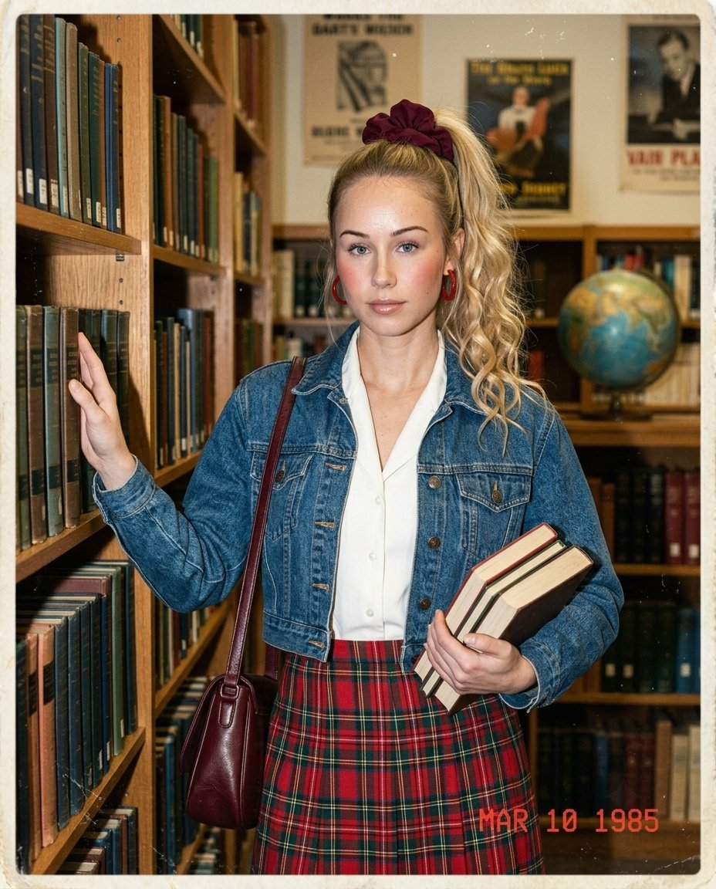

**Prompt**

```text
Traducción en curso
```

[↑ Volver a categorías](#catalog)

---

<a name="prompt-2098562484604989642"></a>

### Texto de neón &quot;STAY WEIRD&quot; suspendido en el haz tractor azul de un platillo volante retro contra un cielo estrellado.

Autor：[@heathergreen](https://x.com/heathergreen) · [Publicación original](https://x.com/heathergreen/status/2098562484604989642)

Retro / Vintage · Publicado

**Resumen:** Texto de neón &quot;STAY WEIRD&quot; suspendido en el haz tractor azul de un platillo volante retro contra un cielo estrellado.

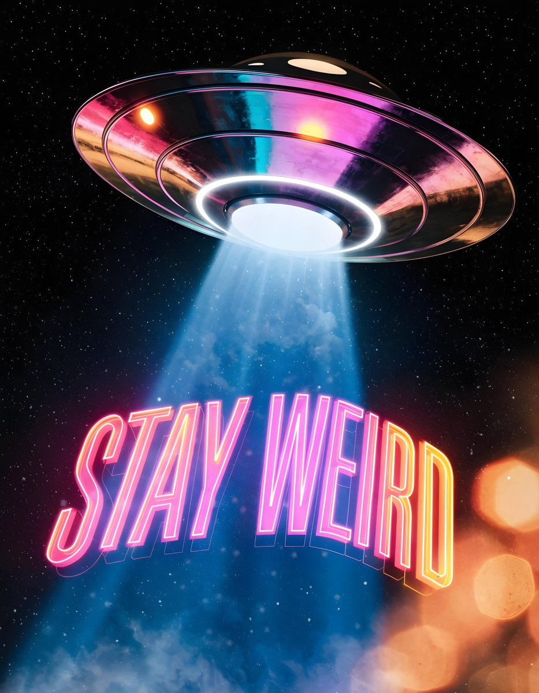

**Prompt**

```text
el texto en neón en negrita "STAY WEIRD" está suspendido en un haz de luz tractor azul brillante de un platillo volante clásico de cromo retro, flotando en un cielo nocturno oscuro y estrellado, iluminación dramática, colores vaporwave, composición cinematográfica, ilustración digital de alta resolución con grano de película y efectos de color mate.
```

[↑ Volver a categorías](#catalog)

---

<a name="prompt-2098382221514334261"></a>

### Genera un póster vertical de 3:4 a partir de una foto de viaje, superponiendo en diagonal la foto original con una tarjeta-sello estilo grabado vintage en cobre para una exhibición comparativa.

Autor：[@Hamburgerai](https://x.com/Hamburgerai) · [Publicación original](https://x.com/Hamburgerai/status/2098382221514334261)

Póster / Folleto · Retro / Vintage · Publicado

**Resumen:** Genera un póster vertical de 3:4 a partir de una foto de viaje, superponiendo en diagonal la foto original con una tarjeta-sello estilo grabado vintage en cobre para una exhibición comparativa.


**Prompt**

```text
Transforme la foto de viaje del monumento subida en un póster editorial vertical de 3:4 con una «comparación entre foto y sello grabado del monumento».

No utilice un diseño en díptico vertical (arriba y abajo). La escena debe emplear una sola hoja continua de papel no estucado de color marfil cálido como fondo, mostrando únicamente dos tarjetas de papel físicas superpuestas en diagonal:

En la parte posterior izquierda, una tarjeta con la foto real, más pequeña, que ocupe aproximadamente el 36%–44% del ancho del póster, rotada en sentido antihorario unos 3–6 grados. Conserve de manera completa y nítida el monumento original, el ángulo de visión, la estructura arquitectónica, la estación, el clima, la iluminación, el entorno y los colores; solo se permite una ligera gradación de color editorial. La tarjeta de la foto debe tener un borde estrecho de papel liso y un grosor de papel sutil, sin reducirse a una miniatura decorativa.

En la parte frontal derecha, un sello grabado vertical más grande, que ocupe aproximadamente el 58%–68% del ancho del póster, rotado en sentido horario unos 2–4 grados, cubriendo de forma natural una parte de la tarjeta de la foto. El sello utiliza un papel envejecido blanco cálido y grueso; los cuatro bordes exteriores deben presentar perforaciones semicirculares troqueladas perfectamente regulares, con idéntico diámetro, espaciado, profundidad y forma, manteniendo el mismo patrón en las cuatro esquinas. Muestre los bordes del papel, las fibras y una sombra de contacto natural, sin marcos ornamentales recargados.

El interior del sello debe reconstruir el monumento basándose únicamente en la misma foto, sin insertar una copia directa de la imagen. Mantenga el ángulo de observación original, la estructura principal, la orientación, las proporciones, el clima y la estación ambiental del monumento, conservando solo el monumento y 1–2 elementos clave del entorno, como la línea de árboles, una superficie de agua, montañas, un encuadre de rocas, caminos o edificios colindantes.

Utilice el lenguaje visual del grabado en placa de cobre monocromático o en dos tonos sobrios: tinta principal en negro azulado oscuro o negro carbón, permitiendo extraer un único color directo en un área mínima de la imagen original. Construya las capas y volúmenes mediante tramas cruzadas densas, líneas de grabado paralelas, punteado, variaciones en la densidad de líneas, omisiones de tinta vintage y luces dadas por el blanco del papel. Debe parecer una auténtica estampación en huecograbado, no un boceto a lápiz, xilografía, acuarela, filtro digital ni un gráfico vectorial liso.

Reserve una zona de rotulación sobria en la parte inferior del sello que contenga exclusivamente:
“【Nombre en inglés del lugar real】”
“LANDMARK PLATE 【Número】”
“【Una línea de observación real de 5 a 9 palabras en inglés】”

El título debe usar una tipografía serif de estilo antiguo con interletreado amplio; los campos y la frase de observación deben ser más pequeños pero claramente legibles, como si la tinta hubiese sido presionada en el papel. No incluya valores faciales ficticios, inscripciones de emisión nacional, matasellos, escudos, nombre del autor, nombre del fotógrafo, logotipos, enlaces web ni ningún otro texto.

El aspecto general debe evocar un espécimen de viaje conservado en la sala de grabados de un museo: composición sobria, jerarquía de tamaños definida y suficiente espacio negativo en el papel, logrando un contraste nítido entre la fotografía real y el recuerdo grabado.

Evite: dípticos arriba/abajo, colocación lado a lado del mismo tamaño, repetición de fotos, imprimir la foto directamente dentro del sello, múltiples sellos, tarjetas adicionales, perforaciones irregulares o inconsistentes entre lados, bordes decorativos de filigrana, valores falsos, matasellos falsos, monumentos ficticios, cambios en el ángulo de visión, maquetas sostenidas con la mano, desorden de escritorio, marcos de fotos, firmas de autor, marcas, logotipos, marcas de agua y texto incoherente.
```

[↑ Volver a categorías](#catalog)

---

<a name="prompt-2098351198072111552"></a>

### Un prompt de diseño de póster en dos partes estilo «notas de viaje en ventana de sello», que combina papel vintage, perforaciones de sellos y fotografía real.

Autor：[@Hamburgerai](https://x.com/Hamburgerai) · [Publicación original](https://x.com/Hamburgerai/status/2098351198072111552)

Póster / Folleto · Fotografía · Retro / Vintage · Texto / Tipografía · Publicado

**Resumen:** Un prompt de diseño de póster en dos partes estilo «notas de viaje en ventana de sello», que combina papel vintage, perforaciones de sellos y fotografía real.


**Prompt**

```text
La imagen de entrada 1 es la fotografía de viaje que debe utilizarse fielmente; la imagen de entrada 2 sirve únicamente como referencia de maquetación, papel, perforaciones de sello, matasellos y jerarquía de texto; no copie la ubicación específica ni el sujeto de la imagen de entrada 2.

Transforme la imagen de entrada 1 en un póster editorial vertical 3:4 estilo «notas de viaje en ventana de sello postal». Adopte estrictamente un diseño de dos secciones, sin tratamiento ilustrativo; todas las áreas fotográficas deben utilizar la misma escena real de la imagen de entrada 1.

La parte superior ocupa aproximadamente el 37% del encuadre:

Coloque un papel antiguo en tono marfil claro y cálido, conservando las fibras reales del papel, ligeros pliegues, manchas naturales y sombras suaves.

A la izquierda, coloque dos líneas de texto de máquina de escribir antigua en gris oscuro/negro:

[Lugar o título del recuerdo]
FIELD NOTE [Número]

El título es más grande, el espaciado entre caracteres del campo está adecuadamente separado y se mantiene suficiente espacio en blanco alrededor del papel.

A la derecha, coloque un sello postal fotográfico horizontal, de un ancho aproximado al 58% del área superior. Dentro del sello, utilice la fotografía real de la imagen de entrada 1, recortada adecuadamente para el encuadre horizontal mientras se conserva el sujeto principal.

El sello fotográfico presenta:

- Borde de papel grueso blanco cálido;
- Perforaciones troqueladas semicirculares regulares en todo el contorno;
- Ligero grosor de papel;
- Sombra de contacto comedida y natural;
- Bordes de papel ligeramente envejecidos pero limpios.

En la esquina inferior derecha del sello, superponga un matasellos antiguo negro que sobrepase parcialmente el marco. El matasellos incluye un círculo incompleto y tres líneas onduladas paralelas, con textura de tinta desgastada, descolorida y semitransparente, sin tapar el sujeto principal de la foto.

La parte inferior ocupa aproximadamente el 63% del encuadre:

Deje que la misma fotografía real de la imagen de entrada 1 se extienda de borde a borde sin márgenes. Recórtela de forma natural según el formato de póster 3:4, manteniendo el sujeto original, personas, arquitectura, perspectiva, iluminación y colores, sin añadir elementos inexistentes.

La parte inferior debe conservar la textura de fotografía real, sin convertirse en acuarela, anime, grabado ni boceto.

En la parte inferior izquierda de la foto inferior, coloque una pequeña etiqueta de texto horizontal de papel blanco cálido, con un ancho aproximado del 25% al 32% del encuadre. La etiqueta tiene un ligero grosor de papel y una sombra suave, conteniendo únicamente una frase de observación en máquina de escribir antigua de no más de dos líneas:

[Una breve frase de observación directamente relacionada con la escena de la foto]

Regla fundamental de perforación:

El sello fotográfico superior y la etiqueta de texto inferior deben utilizar exactamente el mismo sistema de perforación troquelada:

- Mismo diámetro de orificio;
- Misma profundidad de arco;
- Mismo espacio entre centros;
- Misma forma de muesca semicircular;
- Mismo ancho de borde de papel.

No escale proporcionalmente las perforaciones debido a los diferentes tamaños de los dos papeles. El tamaño visual real de los orificios en ambos lugares debe ser completamente idéntico en el producto final; no debe ser fino en un lado y grueso en el otro; no debe transformarse en dientes de sierra, encaje ondulado ni bordes de papel rasgado deshilachados.

En general, debe parecer la página de fotos de un archivo de viaje antiguo: arriba el título y una miniatura en forma de sello, abajo una foto grande del mismo lugar y una frase de observación impresa en una pequeña tira de papel perforada. Los colores provienen de la foto original, el papel es sobrio y la información es escasa pero precisa.

Evitar: conversión a ilustración, acuarela, anime, aguafuerte, imágenes comparativas ordinarias iguales arriba y abajo, múltiples sellos, exceso de matasellos, acumulación de pegatinas de diario, cinta adhesiva, división en columnas izquierda y derecha, gran superficie de papel en la parte inferior, nombre del autor, marcas, logotipos, URL, códigos QR, marcas de agua, caracteres corruptos y texto adicional.
```

[↑ Volver a categorías](#catalog)

---

<a name="prompt-2097892340165992619"></a>

### Instrucción de retrato estilo película Kodak retro de los años 80, con camisa rosa, falda negra de talle alto, pelo rizado retro y ambientación de habitación.

Autor：[@MissDelulu9](https://x.com/MissDelulu9) · [Publicación original](https://x.com/MissDelulu9/status/2097892340165992619)

Retro / Vintage · Retrato / Selfie · Publicado

**Resumen:** Instrucción de retrato estilo película Kodak retro de los años 80, con camisa rosa, falda negra de talle alto, pelo rizado retro y ambientación de habitación.


**Prompt**

```text
Transforma mi foto en un auténtico retrato de moda india retro de los años 80, inspirado en la imagen de referencia.

Mantén exactamente el mismo rostro, los rasgos faciales, la estructura de la cara, el tono de piel, la identidad y las proporciones naturales sin cambios. No alteres ni embellezcas el rostro.

Vístela con una camisa rosa de manga larga fajada pulcramente dentro de una falda negra de talle alto con un cinturón elegante. Retira la bufanda por completo. Añade accesorios sencillos inspirados en los años 80. Dale un peinado retro voluminoso y con movimiento, adornado con un bonito lazo.

Crea un fondo y una atmósfera auténticos de los años 80. Utiliza un aspecto de cámara de película Kodak con colores cálidos y desgastados, grano de película sutil, textura analógica suave, iluminación vintage tenue y textura natural de la piel. Haz que parezca una fotografía genuina tomada en la década de 1980, no una foto moderna con un filtro vintage. Sin marcas de agua, sin texto, sin distorsiones.
```

[↑ Volver a categorías](#catalog)

---

<a name="prompt-2097852814341128610"></a>

### Traducción en curso

Autor：[@DDJCXX](https://x.com/DDJCXX) · [Publicación original](https://x.com/DDJCXX/status/2097852814341128610)

Fotografía · Retro / Vintage · Retrato / Selfie · Personaje · Artículo de moda · Publicado

**Resumen:** Traducción en curso


**Prompt**

```text
Traducción en curso
```

[↑ Volver a categorías](#catalog)

---

<a name="prompt-2097886466710085695"></a>

### Traducción en curso

Autor：[@oneviske](https://x.com/oneviske) · [Publicación original](https://x.com/oneviske/status/2097886466710085695)

Fotografía · Retro / Vintage · Retrato / Selfie · Personaje · Artículo de moda · Paisaje urbano / Calle · Publicado

**Resumen:** Traducción en curso


**Prompt**

```text
Traducción en curso
```

[↑ Volver a categorías](#catalog)

---

<a name="prompt-2096936643173216486"></a>

### Instrucción para transformar una foto de referencia en un retrato retro fotorrealista de 1985 con moda auténtica de los 80, cabello cardado y estética de película de 35 mm.

Autor：[@SalaheldinNehal](https://x.com/SalaheldinNehal) · [Publicación original](https://x.com/SalaheldinNehal/status/2096936643173216486)

Fotografía · Retro / Vintage · Retrato / Selfie · Artículo de moda · Publicado

**Resumen:** Instrucción para transformar una foto de referencia en un retrato retro fotorrealista de 1985 con moda auténtica de los 80, cabello cardado y estética de película de 35 mm.


**Prompt**

```text
¿Cómo me habría visto en la década de 1980? Utiliza la foto adjunta como referencia. Conserva exactamente mis rasgos faciales, sonrisa, tono de piel, forma de los ojos e identidad general. Modifica mi estilo como si viviera en 1985 con la moda y las tendencias de belleza auténticas de los años 80: cabello cardado y voluminoso, maquillaje de ojos llamativo, rubor rosado, lápiz labial mate, aretes de aro grandes, una chaqueta de mezclilla con lavado ácido, una blusa de neón vibrante, jeans de tiro alto y accesorios clásicos de los años 80. Sitúame en un entorno realista de los años 80 con pósteres retro, un reproductor de casetes, discos de vinilo e iluminación cálida de estilo cinematográfico. Haz que parezca una fotografía genuina de 35 mm de alta calidad de mediados de los años 80, con grano de película sutil y tonos de color vintage. La imagen debe ser fotorrealista y mantener un gran parecido conmigo, no con una persona genérica de los años 80.
```

[↑ Volver a categorías](#catalog)

---

<a name="category-cyberpunk-sci-fi"></a>

## Ciberpunk / Ciencia ficción

<a name="prompt-2097951816675639459"></a>

### Una escena documental de 15 segundos de principios de los años 2000 en la que un reportero entrevista a un alienígena cerca de una nave espacial aterrizada, y el alienígena revela que vino a la Tierra para canjear un cupón de McDonald's.

Autor：[@DtheW1995](https://x.com/DtheW1995) · [Publicación original](https://x.com/DtheW1995/status/2097951816675639459)

Ciberpunk / Ciencia ficción · Publicado

**Resumen:** Una escena documental de 15 segundos de principios de los años 2000 en la que un reportero entrevista a un alienígena cerca de una nave espacial aterrizada, y el alienígena revela que vino a la Tierra para canjear un cupón de McDonald's.


**Prompt**

```text
Metraje de documental televisivo ultrarrealista de principios de los años 2000 de 15 segundos de duración, grabado con una cámara MiniDV de consumo por un único camarógrafo físicamente presente. De noche en un campo húmedo a las afueras de un pequeño pueblo estadounidense. Una gran y auténtica nave espacial alienígena metálica acaba de aterrizar detrás de los sujetos, posándose pesadamente sobre la hierba húmeda y aplastada; su rampa está abierta, una pálida luz interior se proyecta en la niebla, la condensación gotea desde el casco y se oye un zumbido mecánico grave. Sin retoques cinematográficos: encuadre tembloroso cámara en hombro, zoom imperfecto, autoenfoque lento, fluctuaciones de exposición alrededor de las luces brillantes, colores deslavados, movimiento de vídeo entrelazado (DV), leve ruido de cinta y artefactos de compresión.

0.0–2.0s — GANCHO: Comienza ya en mitad de la extraordinaria entrevista. Un nervioso reportero de televisión masculino está de pie junto a un alienígena alto, delgado pero biológicamente creíble, justo enfrente de la nave espacial. El reportero sostiene un micrófono de noticias con cable hacia él mientras la cámara hace un rápido zoom desde la nave resplandeciente hasta el detallado rostro del extraterrestre. El alienígena tiene una piel gris húmeda y texturizada, una respiración sutil, ojos negros que parpadean y un peso natural; no es un disfraz ni tiene aspecto de dibujo animado.

2.0–5.5s: En una sola toma continua cámara en mano, el reportero mira al alienígena y le pregunta con seriedad en inglés: “Why did you come to Earth? What are you looking for?”. Su tono es cauto y profesional. El camarógrafo pierde el foco brevemente al reencuadrar ambos rostros y luego lo corrige. El alienígena reflexiona en silencio sobre la pregunta durante un segundo incómodo mientras la nave zumba a sus espaldas.

5.5–11.5s — REMATE IMPASIBLE: El alienígena mete lentamente la mano en una pequeña bolsa metálica sujeta a su cuerpo y saca un cupón de papel ligeramente arrugado. Sostiene el cupón entre dos dedos largos y responde en un inglés tranquilo y perfectamente comprensible con una extraña voz seca: “I came to redeem this coupon. Twenty-piece Chicken McNuggets, with sweet-and-sour sauce. At McDonald’s.”. Su rostro permanece completamente serio. El movimiento de la boca coincide únicamente con el diálogo del alienígena.

11.5–15.0s — DESENLACE: El reportero baja ligeramente el micrófono y mira al alienígena con total incredulidad. La cámara hace un torpe zoom accidental hacia el cupón y luego regresa a la cara de desconcierto del reportero. El alienígena señala con naturalidad hacia el pueblo distante como pidiendo indicaciones. El camarógrafo intenta contener una risa sorda. El reportero finalmente murmura: “Right … okay.”. Corte abrupto y auténtico estilo cinta de vídeo.

AUDIO: diálogo limpio en directo en inglés, pero con la calidad imperfecta de los micrófonos de principios de los años 2000, viento ligero, hierba húmeda bajo los zapatos, insectos a lo lejos, ventilación de la nave espacial y zumbido eléctrico. Sin música, narración, efectos de sonido de tráiler ni risas enlatadas. El humor proviene enteramente del tono documental serio y de una respuesta absurdamente cotidiana.

CONTINUIDAD / NEGATIVOS: un solo reportero, un solo alienígena, un solo camarógrafo y una sola nave espacial; posición de cámara continua y verosímil; sin ángulos de cámara imposibles, sin duplicación de personas o alienígenas, sin metamorfosis, levitación, teletransportación, CGI de dibujos animados, ojos mágicos brillantes, agresividad, armas, multitudes, subtítulos, texto en pantalla, cupones que cambian o micrófonos que cambian.
```

[↑ Volver a categorías](#catalog)

---

<a name="category-minimalism"></a>

## Minimalismo

<a name="prompt-2097872057157783561"></a>

### Traducción en curso

Autor：[@DDJCXX](https://x.com/DDJCXX) · [Publicación original](https://x.com/DDJCXX/status/2097872057157783561)

Fotografía · Minimalismo · Personaje · Artículo de moda · Publicado

**Resumen:** Traducción en curso


**Prompt**

```text
Traducción en curso
```

[↑ Volver a categorías](#catalog)

---

<a name="category-other"></a>

## Otros

<a name="prompt-2098626427792798007"></a>

### Traducción en curso

Autor：[@AvaSmith771](https://x.com/AvaSmith771) · [Publicación original](https://x.com/AvaSmith771/status/2098626427792798007)

Otros · Publicado

**Resumen:** Traducción en curso

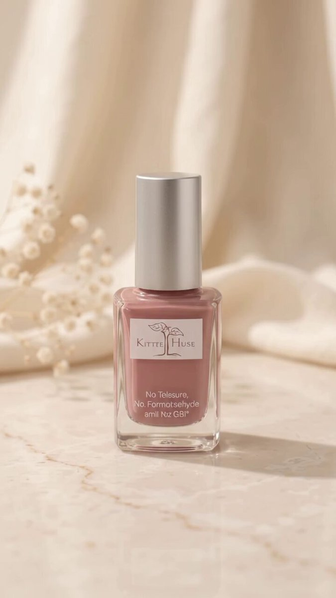

**Prompt**

```text
Traducción en curso
```

[↑ Volver a categorías](#catalog)

---

<a name="prompt-2098548428926308770"></a>

### Prompt de atuendo y prompt negativo que describen detalladamente el material, los pliegues y la forma de colocación de una toalla de baño grande envuelta en un onsen.

Autor：[@hiyayaxtukog68](https://x.com/hiyayaxtukog68) · [Publicación original](https://x.com/hiyayaxtukog68/status/2098548428926308770)

Artículo de moda · Publicado

**Resumen:** Prompt de atuendo y prompt negativo que describen detalladamente el material, los pliegues y la forma de colocación de una toalla de baño grande envuelta en un onsen.

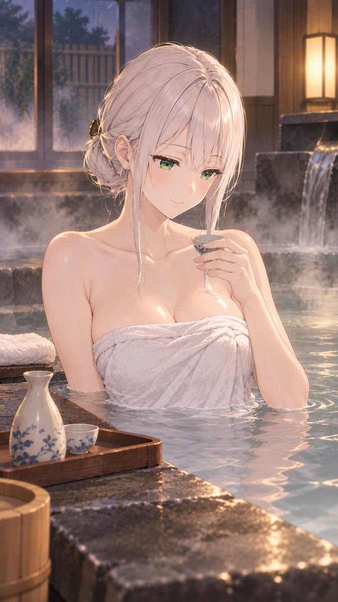

**Prompt**

```text
ATUENDO DE BAÑO PARA ONSEN:

una toalla de baño grande blanca,
toalla de baño japonesa de tamaño completo,
confección en felpa gruesa y opaca de algodón,
textura de felpa suave y esponjosa,
color blanco puro y limpio a blanco ligeramente cálido,

la toalla está envuelta de forma segura alrededor del torso,
confección de toalla envuelta sin tirantes,
borde superior colocado alto y de forma segura alrededor de la parte superior del torso,
envoltura firme pero cómoda,

lo suficientemente ancha como para solaparse completamente en la parte delantera,
solapamiento frontal sustancial,
sin aberturas visibles entre los paneles superpuestos de la toalla,

sección delantera formada por varios pliegues naturales diagonales y verticales,
pliegues suaves fruncidos causados por la envoltura,
ligeros pliegues de compresión alrededor del borde superior,
pliegues superpuestos más profundos hacia el centro de la parte delantera,

la toalla sigue el cuerpo de forma natural sin quedar ceñida a la piel,
volumen moderado de tela,
textura de algodón suave y gruesa,
claramente más gruesa que la tela de ropa ordinaria,

borde superior:
borde de felpa enrollado grueso o doblado suavemente,
borde de toalla natural ligeramente irregular,
sólidamente sujeto en su lugar,
sin deslizarse hacia abajo,

parte delantera:
confección envuelta y solapada,
caída asimétrica suave,
varios pliegues anchos de tela,
fruncido natural de toalla,
sin nudo visible,
sin lazo,
sin cinturón,
sin tirantes,
sin botones,
sin cremallera,

porción inferior visible:
continúa hacia abajo por debajo de la línea de agua visible,
borde inferior parcialmente mojado por el contacto con el agua del baño,
textura de felpa ligeramente más oscura y de aspecto más pesado cerca de la línea de agua,
pero la toalla permanece opaca,

MATERIAL:
aspecto de felpa 100% tipo algodón,
rizo de toalla denso,
superficie absorbente suave,
tejido mate,
ligera absorción de humedad,
textura sutil de tela humedecida solo cerca de las áreas en contacto con el agua,

sin transparencias,
sin textura satinada brillante,
sin seda,
sin encaje,
sin malla,

EN GENERAL:
envoltura de baño de onsen japonés simple y práctica,
aspecto de baño limpio y recatado,
minimalista,
funcional,
envuelta de forma segura,
sin estilismo de moda decorativo

再現性を上げるネガティブプロンプト
NEGATIVE OUTFIT PROMPT:

toalla pequeña,
toalla de mano,
toalla fina,
toalla corta,
toalla estrecha,

toalla transparente,
tejido semitransparente,
toalla traslúcida,
tela húmeda transparente,
tejido transparente ceñido,

toalla resbalándose,
toalla cayéndose,
toalla suelta no asegurada,
parte delantera de la toalla abierta,
gran abertura en la toalla,
solapamiento de tela insuficiente,

borde de toalla colocado muy bajo,
toalla doblada demasiado baja,
borde superior inestable,

nudo de toalla,
lazo grande,
cinturón alrededor de la toalla,
tirantes para hombros,
tirante halter,
tirantes finos de espagueti,

albornoz,
yukata,
kimono,
bata,
vestido,
camisa,
camisola,
lencería,
ropa interior,
traje de baño,
bikini,
traje de baño de una pieza,

ribete de encaje,
volantes,
bordado,
estampado,
toalla floral,
toalla de colores,
logotipo,
texto legible,

seda,
satén,
vinilo,
látex,
malla,

joyería,
collar,
gargantilla,
pulsera,
reloj de pulsera,
pendientes,
tobillera
```

[↑ Volver a categorías](#catalog)

---

<a name="prompt-2098532039238570057"></a>

### Cientos de luces sostenidas a mano formando dos siluetas ascendentes en una escena conmemorativa al estilo fresco de vigilia en bronce pálido.

Autor：[@RealLeeForest](https://x.com/RealLeeForest) · [Publicación original](https://x.com/RealLeeForest/status/2098532039238570057)

Otros · Publicado

**Resumen:** Cientos de luces sostenidas a mano formando dos siluetas ascendentes en una escena conmemorativa al estilo fresco de vigilia en bronce pálido.

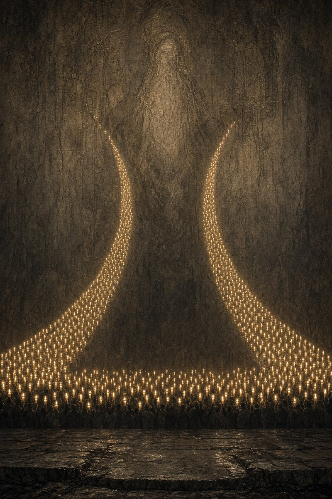

**Prompt**

```text
Cientos de pequeñas luces sostenidas a mano dispuestas en dos formas ascendentes, no una escena de multitud en primer lugar, sino una única forma compartida construida a partir de muchos puntos silenciosos elevados al cielo, reunión estilo fresco de vigilia en bronce pálido, luz realista, textura de piedra y de noche, iluminación cinematográfica, fuertes formas gemelas centrales, altamente detallado, composición impactante, atmósfera conmemorativa respetuosa, sin restos de naufragio ni escombros, sin fuego, sin aviones
```

[↑ Volver a categorías](#catalog)

---

<a name="prompt-2098562233991049325"></a>

### Joven mujer japonesa tomándose una selfie en la cama por la mañana, vistiendo una camisola beige y un tanga de hilo, con el pelo rizado sutilmente revuelto y una suave luz matutina que evocan una elegancia natural.

Autor：[@AIGirl\_Show](https://x.com/AIGirl_Show) · [Publicación original](https://x.com/AIGirl_Show/status/2098562233991049325)

Retrato / Selfie · Personaje · Publicado

**Resumen:** Joven mujer japonesa tomándose una selfie en la cama por la mañana, vistiendo una camisola beige y un tanga de hilo, con el pelo rizado sutilmente revuelto y una suave luz matutina que evocan una elegancia natural.

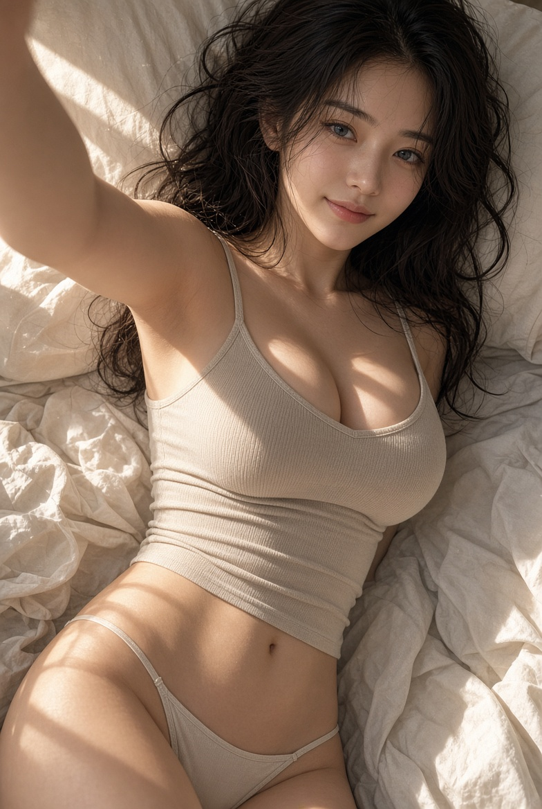

**Prompt**

```text
1. Sujeto y acción
Una mujer japonesa de 25 años con piel delicada y blanca como la porcelana, poros visibles y fino vello facial, ojos naturales gris azulado, rasgos faciales sumamente refinados, maquillaje pulido de alta costura y cabello largo, oscuro y ondulado, despeinado por el sueño. Pechos turgentes y llenos copa G con una caída suave y realista por la gravedad y volumen natural gracias a una ligera torsión del torso. Cintura extremadamente esbelta. Se está tomando una selfie en la cama con la cámara frontal: un brazo levantado hacia la lente, sosteniendo un teléfono inteligente que entra en el encuadre desde arriba; el brazo alzado tensa la fina camisola beige acanalada con una elasticidad de tela real y la hendidura de los tirantes. La curva inferior del pecho es visible. No lleva sostén y viste un delicado tanga de hilo fino en las caderas. Expresión: confiada, contenida, sonrisa optimista, ojos mirando a la lente del teléfono como si conociera perfectamente su ángulo.
2. Entorno y hora
Cama y almohadas de lino blanco roto de lujo, arrugadas, en un dormitorio tranquilo. Temprano en la mañana, recién despierta. Las sábanas tienen aspecto vivido y arrugas, no de perfección de estudio.
3. Composición y cámara
Perspectiva auténtica de selfie con cámara frontal tomada ligeramente desde arriba. Ligero escorzo de selfie debido al brazo levantado. El teléfono o la mano recortados en la parte superior/esquina del encuadre. El cuerpo yace en la cama con una ligera torsión hacia la cámara para que la cintura y la parte inferior del busto se aprecien con claridad. Cuerpo entero o de tres cuartos en el encuadre. Fotorrealista, detalle ultra nítido de la piel y la tela.
4. Iluminación y estilo
Varios haces marcados de luz dorada matutina provenientes de la ventana atraviesan la clavícula, la camisola, la cintura y las sábanas. Motas de polvo flotantes visibles en el aire volumétrico. Sensualidad editorial de alta moda con énfasis táctil en la transparencia de la tela, la textura del tejido acanalado, la presión de los tirantes y el peso real del pecho. Sin iluminación brillante de catálogo. Con gusto, de alta gama, naturalmente realista.
5. Restricciones
Pezones completamente cubiertos por la camisola; sin desajustes de vestuario; sin enfoque genital explícito; el tanga solo muestra las finas tiras laterales y la línea de la cintura. Ni vulgar ni pornográfico. Solo mujer adulta. Mantener la imagen como una foto matutina creíble tomada por ella misma, no como una pose de estudio fingiendo ser una selfie.
```

[↑ Volver a categorías](#catalog)

---

<a name="prompt-2098459622453756301"></a>

### Crea un vídeo UGC de busto parlante para comercio electrónico de una influencer presentando una bebida.

Autor：[@Ava\_Ai\_\_](https://x.com/Ava_Ai__) · [Publicación original](https://x.com/Ava_Ai__/status/2098459622453756301)

Imagen principal de e-commerce · Influencer / Modelo · Producto · Publicado

**Resumen:** Crea un vídeo UGC de busto parlante para comercio electrónico de una influencer presentando una bebida.

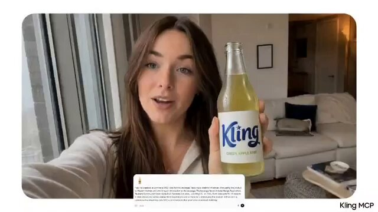

**Prompt**

```text
Crea un vídeo UGC de busto parlante para comercio electrónico de esta bebida. Una mujer joven con estilo de influencer debe aparecer en cámara para mostrar y presentar el producto a una audiencia internacional. El sabor es Mango Maracuyá.
```

[↑ Volver a categorías](#catalog)

---

<a name="prompt-2098495168483643744"></a>

### Arte callejero de Hanói

Autor：[@daniel\_wheldon](https://x.com/daniel_wheldon) · [Publicación original](https://x.com/daniel_wheldon/status/2098495168483643744)

Paisaje urbano / Calle · Publicado

**Resumen:** Arte callejero de Hanói

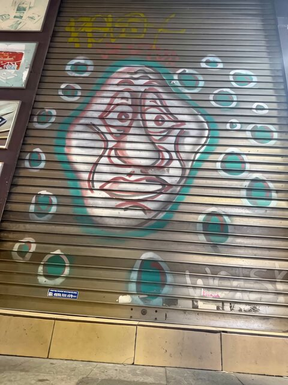

**Prompt**

```text
Arte callejero de Hanói
```

[↑ Volver a categorías](#catalog)

---

<a name="prompt-2098498537466249640"></a>

### Una madre hormiga que tira de un carrito de comida con su hijo se resguarda de la lluvia bajo una gran hoja.

Autor：[@RobinMurrat43a](https://x.com/RobinMurrat43a) · [Publicación original](https://x.com/RobinMurrat43a/status/2098498537466249640)

Comida / Bebida · Publicado

**Resumen:** Una madre hormiga que tira de un carrito de comida con su hijo se resguarda de la lluvia bajo una gran hoja.


**Prompt**

```text
Una madre hormiga remolca su carrito de comida con su hijo a su lado. Empieza a llover, así que se resguarda bajo una gran hoja que le sirve de cobijo hasta que pase la lluvia. ¡Le grita a su hijo que se mantenga cerca!
```

[↑ Volver a categorías](#catalog)

---

<a name="prompt-2098472353114079243"></a>

### Una estatua de piedra cobra vida e interpreta un ballet en el jardín de una finca, filmado en un dinámico plano secuencia.

Autor：[@iamneubert](https://x.com/iamneubert) · [Publicación original](https://x.com/iamneubert/status/2098472353114079243)

Otros · Publicado

**Resumen:** Una estatua de piedra cobra vida e interpreta un ballet en el jardín de una finca, filmado en un dinámico plano secuencia.


**Prompt**

```text
Escena cinematográfica de Unreal Engine, una estatua de piedra cobra vida y baila un hermoso ballet por el jardín de una gran finca, cámara dinámica de movimiento rápido, plano secuencia único.
```

[↑ Volver a categorías](#catalog)

---

<a name="prompt-2098486894028107840"></a>

### Prompt de edición para crear una tarjeta promocional realista de un concursante de un reality rural a partir de un selfi.

Autor：[@hojeemdia](https://x.com/hojeemdia) · [Publicación original](https://x.com/hojeemdia/status/2098486894028107840)

Retrato / Selfie · Publicado

**Resumen:** Prompt de edición para crear una tarjeta promocional realista de un concursante de un reality rural a partir de un selfi.


**Prompt**

```text
Transforma mi selfi en una promoción realista de un concursante de A Fazenda 18. Incluye [NOMBRE], [CIUDAD], frase típica, punto fuerte, punto débil y probabilidad de llegar a la Final. Conserva fielmente mi rostro y mi apariencia natural. Foto en formato 4:5, pose espontánea, mirada directa, entorno rural discreto, luz suave, textura real de la piel y composición editorial asimétrica. Paleta: beige melocotón #f2ceb0, verde agua #00ad9d y naranja #e98300. Poco texto, aspecto natural, sin retoque excesivo, efectos, logotipos inventados ni apariencia de imagen generada por IA.
```

[↑ Volver a categorías](#catalog)

---

<a name="prompt-2098469621892587716"></a>

### Prompt de retrato de una mujer lánguida y seductora, apoyada en la ventana con la barbilla en la mano y la camisa fina deslizándose.

Autor：[@Hamburgerai](https://x.com/Hamburgerai) · [Publicación original](https://x.com/Hamburgerai/status/2098469621892587716)

Retrato / Selfie · Personaje · Artículo de moda · Publicado

**Resumen:** Prompt de retrato de una mujer lánguida y seductora, apoyada en la ventana con la barbilla en la mano y la camisa fina deslizándose.


**Prompt**

```text
camisa fina de escote bajo; piel expuesta en el pecho; tela de gasa que se desliza hacia abajo; apoyada en la ventana con la barbilla en la mano; cejas y mirada ligeramente alzadas; comisuras de los labios con una sonrisa; perezosa y seductora
```

[↑ Volver a categorías](#catalog)

---

<a name="prompt-2098476919939342835"></a>

### Representación de una mujer de estilo clásico y semblante frío peinándose por la mañana temprano.

Autor：[@Hamburgerai](https://x.com/Hamburgerai) · [Publicación original](https://x.com/Hamburgerai/status/2098476919939342835)

Retrato / Selfie · Personaje · Publicado

**Resumen:** Representación de una mujer de estilo clásico y semblante frío peinándose por la mañana temprano.


**Prompt**

```text
Camisón de cuello amplio; amplia piel expuesta en el pecho; clavículas plenamente visibles; peinándose al levantarse por la mañana; barbilla ligeramente alzada; expresión fría e indiferente; etérea y distante
```

[↑ Volver a categorías](#catalog)

---

<a name="prompt-2098418180674773370"></a>

### Traducción en curso

Autor：[@abs\_uiux](https://x.com/abs_uiux) · [Publicación original](https://x.com/abs_uiux/status/2098418180674773370)

Personaje · Artículo de moda · Publicado

**Resumen:** Traducción en curso


**Prompt**

```text
Traducción en curso
```

[↑ Volver a categorías](#catalog)

---

<a name="prompt-2098393816650879459"></a>

### Crea un vídeo UGC realista de una mujer mostrando su atuendo en una casa moderna.

Autor：[@sophiaparkerr\_](https://x.com/sophiaparkerr_) · [Publicación original](https://x.com/sophiaparkerr_/status/2098393816650879459)

Personaje · Artículo de moda · Publicado

**Resumen:** Crea un vídeo UGC realista de una mujer mostrando su atuendo en una casa moderna.


**Prompt**

```text
Crea un vídeo UGC realista y de aspecto natural a partir de la imagen subida. La mujer muestra su atuendo en el interior de una casa moderna y elegante. Utiliza Kling MCP.
```

[↑ Volver a categorías](#catalog)

---

<a name="prompt-2098417304887509188"></a>

### Prompt para crear una pelota de playa temática de Pretty Cure.

Autor：[@IntexLove](https://x.com/IntexLove) · [Publicación original](https://x.com/IntexLove/status/2098417304887509188)

Otros · Publicado

**Resumen:** Prompt para crear una pelota de playa temática de Pretty Cure.


**Prompt**

```text
Crear una pelota de playa de Pretty Cure
```

[↑ Volver a categorías](#catalog)

---

<a name="prompt-2098426167195783286"></a>

### Retrato de estudio de cuerpo entero de una mujer elegante con un vestido de satén marrón bronce contra un fondo texturizado cálido.

Autor：[@Minahil42298354](https://x.com/Minahil42298354) · [Publicación original](https://x.com/Minahil42298354/status/2098426167195783286)

Retrato / Selfie · Personaje · Publicado

**Resumen:** Retrato de estudio de cuerpo entero de una mujer elegante con un vestido de satén marrón bronce contra un fondo texturizado cálido.


**Prompt**

```text
Un retrato de estudio de cuerpo entero de una mujer elegante posando con gracia contra un fondo marrón cálido y texturizado. Lleva un vestido de noche de satén marrón bronce sin mangas y lustroso, con un escote en V profundo, un corpiño ajustado con delicados drapeados y una abertura alta dramática que deja ver parte de su pierna. Su falda larga y fluida ondea ligeramente hacia afuera, añadiendo una sensación de movimiento, y complementa el atuendo con unos tacones altos de tiras metálicas a juego. Su cabello oscuro está recogido en un peinado alto con mechones suaves enmarcando su rostro, y mira hacia la cámara con una sonrisa suave y segura mientras se toca ligeramente el cabello con una mano.
```

[↑ Volver a categorías](#catalog)

---

<a name="prompt-2098423018267754894"></a>

### Crea un video musical de baile y moda estilizado que combine coreografía de acción real con caóticos personajes de garabatos blancos dibujados a mano, superposiciones gráficas y movimiento de estilo stop-motion.

Autor：[@applete77191758](https://x.com/applete77191758) · [Publicación original](https://x.com/applete77191758/status/2098423018267754894)

Personaje · Artículo de moda · Publicado

**Resumen:** Crea un video musical de baile y moda estilizado que combine coreografía de acción real con caóticos personajes de garabatos blancos dibujados a mano, superposiciones gráficas y movimiento de estilo stop-motion.


**Prompt**

```text
Crea un video musical de baile y moda hiperestilizado con una vibra de técnica mixta (mixed-media) extraña, juguetona y caótica.

Un bailarín principal con mucho estilo realiza una coreografía de R&B / funk / disco-funk centrada en la musicalidad con la energía del baile urbano. Incluye groove corporal, groove de hombros, disociaciones de pecho, juego rítmico de pies, congelaciones (freezes) nítidas, giros, remates de posturas (pose hits), balanceos de brazos, transiciones elegantes y una actitud segura. La coreografía debe permanecer clara y legible.

Reglas importantes:

Mantén el fondo y el entorno originales visualmente coherentes a lo largo de todo el video.

No reemplaces el fondo por una ubicación completamente diferente.

No destruyas el sentido del lugar.

El fondo debe seguir siendo el mismo entorno base, mientras que los garabatos (doodles), los efectos de glitch y los elementos de técnica mixta se añaden encima.

NO dibujes garabatos directamente sobre la cara del bailarín real.

NO tapes los ojos, la nariz, la boca ni los rasgos faciales.

Mantén el rostro limpio, visible y atractivo en todo momento.

Los garabatos pueden aparecer alrededor de la cabeza, el contorno del cabello, los hombros, los brazos, el torso, las manos, las piernas y la silueta, pero nunca directamente sobre la cara.

Elemento creativo especial:

Personajes de garabatos blancos y toscos aparecen y bailan junto al bailarín principal.

Estas figuras de garabato deben sentirse muy dibujadas a mano, libres, abocetadas, juguetonas, desordenadas y vivas, como apuntes espontáneos de cuaderno o garabatos con crayón blanco.

No deben verse demasiado limpios ni demasiado pulidos.

Pueden aparecer como:

- bailarines sencillos de figuras de palitos

- personajes de caricatura toscos

- mini bailarines garabateados

- siluetas bailarinas estiradas

- divertidos compañeros dibujados a mano

- clones de boceto duplicados

Los personajes de garabato interactúan con el bailarín real de formas divertidas y sorprendentes:

- bailando juntos en sincronía

- copiando movimientos

- respondiendo a los movimientos

- rodeando al bailarín

- apareciendo y desapareciendo al compás del ritmo

- multiplicándose en muchos bailarines de boceto

- saltando desde detrás del bailarín

- emergiendo del suelo, las paredes o la sombra

- sosteniendo brevemente accesorios o reaccionando cómicamente

Añade también muchos otros elementos de garabatos toscos, no solo figuras humanas:

- estrellas

- flechas

- círculos

- garabatos

- rayos

- líneas de velocidad

- explosiones de impacto tipo cómic

- estelas de movimiento

- marcas de tiza blanca

- líneas de crayón blanco

- espirales dibujadas a mano

- corazones rústicos

- marcas tachadas

- marcas de verificación (check marks)

- símbolos abstractos

- bocetos de nubes de humo

- líneas danzantes

- marcos toscos

- manos de caricatura flotantes

- ojos simples o iconos de reacción divertidos

- detalles gráficos desordenados

Estos garabatos deben sentirse más como dibujos espontáneos reales: toscos, improvisados, abocetados, imperfectos, juguetones y enérgicos.

Haz que los garabatos se sientan hechos a mano y un poco caóticos.

Cámara:

Cámara mayormente estática con solo un paneo lateral suave ocasional.

La cámara siempre permanece paralela al bailarín.

El bailarín permanece centrado en el encuadre.

Prioriza el encuadre de cuerpo entero para que la coreografía sea claramente visible.

Nada de cámara orbital, nada de cámara giratoria, nada de tomas con dron, nada de zooms extremos, nada de movimiento de cámara aleatorio.

Estilo visual:

Aspecto editorial de moda prémium, estética de streetwear de lujo, composición audaz, iluminación de alto contraste, fondo limpio, energía de video musical en tendencia.

El bailarín real y el fondo base deben sentirse pulidos y elegantes, mientras que la capa de garabatos se siente cruda, artesanal y caótica.

Este contraste es fundamental.

Estilo de movimiento:

Usa una estética escalonada de baja tasa de cuadros por segundo inspirada en stop-motion, animación fotograma a fotograma, animación de recortes (cutout), animación de collage y sincronización animada en doses (animated-on-twos) / en treses (animated-on-threes).

Añade estroboscopios rítmicos, toques de parpadeo, energía de pose a pose y una sensación cercana a los 12 fps, manteniendo la danza legible en todo momento.

Efectos adicionales:

Añade efectos de glitch, cortes parpadeantes, saltos de fotogramas, ediciones entrecortadas, ráfagas de collage, interrupciones temblorosas y reacciones visuales caóticas sincronizadas con el ritmo.

Mantén la coreografía legible.

La rareza debe sentirse elegante, divertida y creativa, no descuidada.

Ambiente (Mood):

Genial, funky, elegante, bizarro, juguetón, caótico, a la vanguardia de la moda, sorprendente, ingenioso, entretenido.

Ambiente de la música de fondo (BGM):

R&B Funk, Disco Funk, Funk-pop.

Sin texto, sin subtítulos, sin marcas de agua, sin logotipos, sin personas reales adicionales no deseadas, sin anatomía distorsionada, sin extremidades adicionales, sin deformaciones corporales.
```

[↑ Volver a categorías](#catalog)

---

<a name="prompt-2098444996584358073"></a>

### Escena icónica del póster del muro de Attack on Titan con un miembro del Cuerpo de Exploración frente a un titán colosal sobre el muro.

Autor：[@R\_yeong\_](https://x.com/R_yeong_) · [Publicación original](https://x.com/R_yeong_/status/2098444996584358073)

Póster / Folleto · Publicado

**Resumen:** Escena icónica del póster del muro de Attack on Titan con un miembro del Cuerpo de Exploración frente a un titán colosal sobre el muro.


**Prompt**

```text
2::Composición vertical, plano de cuerpo entero desde atrás, ángulo bajo, figura situada en primer plano en el centro del encuadre, de pie con las piernas separadas, la cabeza inclinada hacia atrás mientras mira hacia arriba a una enorme muralla, sosteniendo espadas que cuelgan a ambos lados::, 2::uniforme del Cuerpo de Exploración::, chaqueta militar corta de color marrón, camisa blanca, cinturón de cuero, pantalones blancos ceñidos, botas de cuero marrón hasta la rodilla, 1.5::arnés de cuero marrón oscuro, correas que cruzan el pecho, la cintura, los muslos y las piernas::, capa militar verde con capucha, 1.7::emblema de las 'Alas de la Libertad' en la espalda, insignia con alas emplumadas azules y blancas cruzadas, gran emblema en el centro de la espalda::, 1.8::pueblo en ruinas ardiendo, casas destruidas, techos derrumbados, llamas que se elevan a ambos lados, calles calcinadas::, enorme muralla de piedra que abarca el horizonte, puerta fortificada, 3::figura colosal negra que aparece desde el otro lado de la muralla, cabeza oscura gigante y manos aferradas al borde de la muralla, escala sobrecogedora::, 1.7::enorme explosión que se produce detrás de la muralla, llamas anaranjadas ardientes, humo espeso, cielo brillante::, ascuas volando, chispas, ceniza, neblina de calor, intensa retroiluminación, sombras profundas, contraste dramático de escalas, atmósfera apocalíptica, desolada, ominosa y desesperada, presentación cinematográfica, 2::texto grande del título en japonés "進撃の巨人" (Attack on Titan) en la parte inferior central, tipografía alineada al centro, logotipo del título, tipografía japonesa en negrita, texto claramente legible::
```

[↑ Volver a categorías](#catalog)

---

<a name="prompt-2098415482911219938"></a>

### Traducción en curso

Autor：[@Hamburgerai](https://x.com/Hamburgerai) · [Publicación original](https://x.com/Hamburgerai/status/2098415482911219938)

Póster / Folleto · Publicado

**Resumen:** Traducción en curso


**Prompt**

```text
Traducción en curso
```

[↑ Volver a categorías](#catalog)

---

<a name="prompt-2098414125613506896"></a>

### Una joven atrapando con la lengua gotas de lluvia de un canalón.

Autor：[@AI\_money\_club](https://x.com/AI_money_club) · [Publicación original](https://x.com/AI_money_club/status/2098414125613506896)

Personaje · Publicado

**Resumen:** Una joven atrapando con la lengua gotas de lluvia de un canalón.


**Prompt**

```text
Una inocente mujer adulta de 20 años que atrapa con la lengua las gotas de lluvia que caen de un canalón y las deja caer directamente al suelo
```

[↑ Volver a categorías](#catalog)

---

<a name="prompt-2098381131855097863"></a>

### Un pequeño dragón esmeralda apilando geodas brillantes bajo una aurora.

Autor：[@BeanieBlossom](https://x.com/BeanieBlossom) · [Publicación original](https://x.com/BeanieBlossom/status/2098381131855097863)

Animal / Criatura · Publicado

**Resumen:** Un pequeño dragón esmeralda apilando geodas brillantes bajo una aurora.


**Prompt**

```text
Bajo una arremolinada aurora boreal, un pequeño dragón alado con escamas de esmeralda apila con cuidado geodas brillantes y coloridas en una torre precaria, con una expresión de intensa concentración
```

[↑ Volver a categorías](#catalog)

---

<a name="prompt-2098346363520274568"></a>

### Prompt para añadir una cola blanca y redonda estilo conejita en el trasero.

Autor：[@harufit333](https://x.com/harufit333) · [Publicación original](https://x.com/harufit333/status/2098346363520274568)

Otros · Publicado

**Resumen:** Prompt para añadir una cola blanca y redonda estilo conejita en el trasero.


**Prompt**

```text
Ponle en el trasero una cola blanca y redonda de conejita.
```

[↑ Volver a categorías](#catalog)

---

<a name="prompt-2098381038527365331"></a>

### Crea los moldes necesarios para armar una cometa con forma de guacamaya en una sola imagen.

Autor：[@googleespanol](https://x.com/googleespanol) · [Publicación original](https://x.com/googleespanol/status/2098381038527365331)

Otros · Publicado

**Resumen:** Crea los moldes necesarios para armar una cometa con forma de guacamaya en una sola imagen.


**Prompt**

```text
Crea los moldes necesarios para armar la cometa con forma de guacamaya en una misma imagen
```

[↑ Volver a categorías](#catalog)

---

<a name="prompt-2098336543123640752"></a>

### Prompt de retrato en cheongsam desde la perspectiva del novio en dormitorio a altas horas de la noche

Autor：[@underwoodxie96](https://x.com/underwoodxie96) · [Publicación original](https://x.com/underwoodxie96/status/2098336543123640752)

Retrato / Selfie · Publicado

Publicación original：[@underwoodxie96](https://x.com/underwoodxie96) · [Publicación original](https://x.com/underwoodxie96/status/2098305584940687668)

**Resumen:** Prompt de retrato en cheongsam desde la perspectiva del novio en dormitorio a altas horas de la noche


**Prompt**

```text
Dormitorio a altas horas de la noche × Punto de vista en primera persona del novio × Cheongsam (qipao) × Flash directo de CCD
```

[↑ Volver a categorías](#catalog)

---

<a name="prompt-2098343290626290133"></a>

### suéter oversize rosa claro, mangas largas, \(mangas que pasan de los dedos\), camisa debajo de la ropa, camisa debajo del suéter, camisa blanca con cuello, \(clavícula\), collar de corazón, pajarita suelta, pajarita a cuadros rosas, falda plisada a cuadros marrones, minifalda, calcetines holgados blancos, mocasines marrones,

Autor：[@AI\_Kei75](https://x.com/AI_Kei75) · [Publicación original](https://x.com/AI_Kei75/status/2098343290626290133)

Otros · Publicado

**Resumen:** suéter oversize rosa claro, mangas largas, \(mangas que pasan de los dedos\), camisa debajo de la ropa, camisa debajo del suéter, camisa blanca con cuello, \(clavícula\), collar de corazón, pajarita suelta, pajarita a cuadros rosas, falda plisada a cuadros marrones, minifalda, calcetines holgados blancos, mocasines marrones,


**Prompt**

```text
suéter oversize rosa claro, mangas largas, (mangas que pasan de los dedos), camisa debajo de la ropa, camisa debajo del suéter, camisa blanca con cuello, (clavícula), collar de corazón, pajarita suelta, pajarita a cuadros rosas, falda plisada a cuadros marrones, minifalda, calcetines holgados blancos, mocasines marrones,
```

[↑ Volver a categorías](#catalog)

---

<a name="prompt-2098306910915375260"></a>

### Anuncio de tecnología macro con un presentador en miniatura corriendo por la diadema de unos auriculares gigantes, ajustando un dial y cayendo sobre la almohadilla.

Autor：[@Fujimoto\_hina](https://x.com/Fujimoto_hina) · [Publicación original](https://x.com/Fujimoto_hina/status/2098306910915375260)

Marketing de producto · Personaje · Publicado

**Resumen:** Anuncio de tecnología macro con un presentador en miniatura corriendo por la diadema de unos auriculares gigantes, ajustando un dial y cayendo sobre la almohadilla.


**Prompt**

```text
{
  "duration": "10s",
  "aspect_ratio": "16:9",
  "fps": 30,
  "style": "anuncio publicitario de tecnología premium fotorrealista, fotografía macro cinematográfica",

  "scene": "Un presentador masculino adulto de 3 pulgadas de altura vestido con ropa urbana negra y sutiles toques de color cian neón interactúa con unos gigantescos auriculares inalámbricos negros de primera calidad sobre un escritorio de estudio de mármol blanco.",

  "action": [
    "0-3s: El presentador en miniatura corre con confianza a lo largo de la diadema curva de aluminio negro mate. Una cámara de seguimiento macro ultra baja lo sigue directamente por detrás.",
    "3-6s: Llega a un dial de volumen de metal moleteado de gran tamaño, lo agarra con ambas manos y lo gira con fuerza. Una sutil onda de choque sónica translúcida se expande desde los auriculares.",
    "6-8s: Salta desde la diadema sobre la gigante y mullida almohadilla de espuma viscoelástica de cuero negro, que se comprime visiblemente con el impacto.",
    "8-10s: Se pone de pie sobre la almohadilla, sonríe a la cámara y hace un rápido gesto de aprobación con el pulgar mientras la cámara asciende rápidamente en grúa y retrocede, revelando los auriculares completos, la computadora portátil y la taza de café en el escritorio."
  ],

  "camera": "Profundidad de campo reducida macro extrema, seguimiento suave, barrido rápido controlado hacia el dial, seguimiento dinámico en el salto, luego rápido ascenso en grúa con retroceso hacia una toma heroica amplia.",

  "lighting": "Iluminación suave de estudio con sutiles luces de borde cian y magenta eléctrico, reflejos realistas en metal, cuero y mármol.",

  "audio": {
    "music": "NONE",
    "dialogue": "NONE",
    "voiceover": "NONE",
    "effects": "Chirrido realista de zapatillas, clics mecánicos del dial, sonido profundo de rotación, sutil zumbido sónico e impacto suave contra la almohadilla de cuero."
  },

  "quality": "Detalle de calidad 8K, anatomía humana realista, materiales y física físicamente precisos, diseño estable de personajes y productos.",

  "negative": "no music, no dialogue, no text, no logos, no watermark, no extra people, no floating, no teleportation, no clipping, no distorted hands, no changing scale, no character or clothing changes, no cartoon CGI, no excessive motion blur, no camera shake."
}
```

[↑ Volver a categorías](#catalog)

---

<a name="prompt-2098328564471091256"></a>

### Prompt para generar una monja vestida con hábito negro y collar con cruz de oro.

Autor：[@AI\_Kei75](https://x.com/AI_Kei75) · [Publicación original](https://x.com/AI_Kei75/status/2098328564471091256)

Personaje · Publicado

**Resumen:** Prompt para generar una monja vestida con hábito negro y collar con cruz de oro.


**Prompt**

```text
monja, hábito de monja, velo de monja negro, toca blanca, cuello alto, collar con cruz de oro, mangas largas, puños blancos, (vestido negro de una pieza:1.2), (textura suave), túnica larga completamente negra, tobillo, zapatos de salón negros,
```

[↑ Volver a categorías](#catalog)

---

<a name="prompt-2098298423384645737"></a>

### Prompt de vlog realista con smartphone al aire libre de 15 segundos junto a un estanque que muestra peces de colores durante la hora dorada.

Autor：[@MrDasOnX](https://x.com/MrDasOnX) · [Publicación original](https://x.com/MrDasOnX/status/2098298423384645737)

Otros · Publicado

**Resumen:** Prompt de vlog realista con smartphone al aire libre de 15 segundos junto a un estanque que muestra peces de colores durante la hora dorada.


**Prompt**

```text
Utiliza la imagen de referencia proporcionada como la referencia de identidad exacta para el mismo personaje masculino adulto. Conserva los rasgos faciales, el peinado, la barba, el tono de piel, las proporciones corporales y la vestimenta de forma coherente durante todo el vídeo. Crea un vlog con smartphone al aire libre ultrarrealista de 15 segundos junto a un hermoso estanque natural rodeado de exuberante vegetación durante la hora dorada (golden hour). 0–4 segundos: Plano selfie cámara en mano. El hombre camina junto al estanque, sonriendo y hablando con naturalidad a la cámara. De repente nota algo bajo el agua clara y dice emocionado: “Espera… ¡mira esos peces!” 4–8 segundos: Gira el smartphone hacia el estanque. La cámara capta a un grupo de hermosos peces de colores nadando con naturalidad a través del agua clara y poco profunda. Los peces presentan combinaciones vivas de naranja, amarillo, azul, turquesa, rojo y plateado, con la luz del sol brillando en sus escamas. 8–12 segundos: Plano cinematográfico de cerca de los peces nadando alrededor de plantas acuáticas y pequeñas rocas. Él habla fuera de cámara: “Nunca había visto peces tan coloridos en un estanque. ¡Mira esos colores!” 12–15 segundos: Regreso al plano selfie. Se agacha junto al estanque, señala hacia los peces detrás de él, sonríe con asombro genuino y dice: “¡Este lugar es increíble!” Termina con los peces de colores visibles en el fondo. Estética auténtica de vlog con smartphone en mano, movimiento corporal y al caminar natural, expresiones faciales realistas, manos y dedos precisos, parpadeo natural, física del agua realista, escamas detalladas de peces coloridos, reflejos de la luz solar en el agua, suaves ondas, vegetación exuberante, sonidos ambientales naturales al aire libre, iluminación cinematográfica pero creíble, detalle fotorrealista en 2K, sutil temblor de cámara de smartphone, transiciones de enfoque suaves. Sin subtítulos, sin texto en pantalla, sin logotipos, sin marcas de agua, sin personas adicionales, sin distorsión facial, sin cambios de identidad, sin actuación exagerada, sin efectos de fantasía. Mantén los peces hermosos pero biológicamente creíbles y toda la escena realista.
```

[↑ Volver a categorías](#catalog)

---

<a name="prompt-2098287896872567292"></a>

### Lago Ontario

Autor：[@jrwimaging](https://x.com/jrwimaging) · [Publicación original](https://x.com/jrwimaging/status/2098287896872567292)

Paisaje / Naturaleza · Publicado

**Resumen:** Lago Ontario


**Prompt**

```text
Lago Ontario
```

[↑ Volver a categorías](#catalog)

---

<a name="prompt-2098266045597519916"></a>

### Este prompt se utiliza para generar una instantánea de una mujer de estilo clásico en la atmósfera del bullicioso mercado nocturno de Chang'an de la dinastía Tang, empleando gran angular, ángulo inclinado, flash duro sobre la cámara y contraste de luces frías y cálidas para retratar a una distinguida dama en hanfu que mira hacia atrás rozando su manga.

Autor：[@Soranlan](https://x.com/Soranlan) · [Publicación original](https://x.com/Soranlan/status/2098266045597519916)

Retrato / Selfie · Personaje · Resumen / Antecedentes · Publicado

Publicación original：[@Soranlan](https://x.com/Soranlan) · [Publicación original](https://x.com/Soranlan/status/2098258401344229596)

**Resumen:** Este prompt se utiliza para generar una instantánea de una mujer de estilo clásico en la atmósfera del bullicioso mercado nocturno de Chang'an de la dinastía Tang, empleando gran angular, ángulo inclinado, flash duro sobre la cámara y contraste de luces frías y cálidas para retratar a una distinguida dama en hanfu que mira hacia atrás rozando su manga.


**Prompt**

```text
perspectiva cercana ultra gran angular (14~20mm), perspectiva exagerada, plano holandés a 15°, ligera distorsión de barril, estética de instantánea cámara en mano, profundidad marcada: sujeto nítido, capas de fondo profundas, distancia al sujeto 0.5m, flash directo y duro sobre la cámara, destellos brillantes en los ojos, luz ambiental subexpuesta entre 1 y 2 pasos, caída del flash, brillos especulares en la piel y joyas, aspecto de instantánea con flash de obturación rápida, detalle de alta frecuencia, grano de película medio, halación + microcontraste, sutil aberración cromática, movimiento impulsado por el viento en los bordes, estética de la dinastía Tang de la antigua China, bullicioso mercado nocturno, mujer de Asia oriental, rasgos faciales delicados y refinados, grandes ojos expresivos, boca pequeña de cereza, figura sumamente voluptuosa, busto grande y exagerado, estándar estético sumamente elevado, estructura ósea impecable, calidad de piel de porcelana, alto estatus, silueta limpia, materiales de primera calidad, alto valor de producción, mirando hacia atrás por encima del hombro con una sonrisa juguetona y seductora, caminando rápidamente a través de la densa multitud, con una mano levantando una manga de seda intrincadamente tejida que roza de cerca la lente, bulliciosa calle de Chang'an, brillantes farolillos de papel rojo, peatones en hanfu tradicional con desenfoque de movimiento, chispas volando de los puestos callejeros, atmósfera densa y vibrante, flash duro y frío en el sujeto en primer plano frente a luces prácticas ambientales cálidas en el fondo, elemento sutil 'Soran' naturalmente integrado en el bordado de la tela de seda, firma estética tenue, fusión orgánica, composición armoniosa, no intrusiva, casi invisible.
```

[↑ Volver a categorías](#catalog)

---

<a name="prompt-2098260186737901631"></a>

### Prompt de vídeo macro relajante de una mano humana construyendo paso a paso una casita de ladrillo en una obra en miniatura.

Autor：[@Mud01185127](https://x.com/Mud01185127) · [Publicación original](https://x.com/Mud01185127/status/2098260186737901631)

Otros · Publicado

**Resumen:** Prompt de vídeo macro relajante de una mano humana construyendo paso a paso una casita de ladrillo en una obra en miniatura.


**Prompt**

```text
Crea una escena de construcción en miniatura cinematográfica e hiperrealista en la que una mano humana gigante construye cuidadosamente una pequeña estructura de ladrillos en una obra en miniatura. Muestra pequeños ladrillos detallados, cemento realista, herramientas, suelo arenoso, texturas naturales, profundidad de campo reducida, fotografía macro, movimiento de cámara suave, iluminación realista y una satisfactoria construcción paso a paso. Ultradetallado, fotorrealista, 4K, vertical 9:16, continuidad visual perfecta.
```

[↑ Volver a categorías](#catalog)

---

<a name="prompt-2098249488150532562"></a>

### Un prompt que detalla un bodi sin mangas inspirado en telarañas de color azul y rojo con detalles de aberturas y mangas a juego.

Autor：[@AI\_money\_club](https://x.com/AI_money_club) · [Publicación original](https://x.com/AI_money_club/status/2098249488150532562)

Artículo de moda · Publicado

**Resumen:** Un prompt que detalla un bodi sin mangas inspirado en telarañas de color azul y rojo con detalles de aberturas y mangas a juego.


**Prompt**

```text
Un bodi sin mangas ajustado de color azul y rojo inspirado en telarañas con un elegante diseño de estilo superhéroe. El cuerpo principal es de color azul real intenso con finas líneas rojas con patrón de telaraña que se extienden por el pecho, el torso, la cintura y el abdomen. Cuenta con un cuello alto tipo cisne y una llamativa abertura en el pecho en forma de lágrima perfilada con un grueso ribete rojo. El bodi tiene una silueta atlética y ceñida con aberturas de pierna de corte alto y paneles laterales geométricos de color rojo intenso que contrastan alrededor de las caderas y la parte inferior de la cintura. El tejido azul tiene un acabado elástico suave y ligeramente satinado con una tensión realista y sutiles pliegues naturales. Las mangas largas azules desmontables a juego se extienden desde la parte superior de los brazos hasta las muñecas, dejando los hombros al descubierto. Cada manga presenta finos detalles lineales rojos y llamativos detalles angulares rojos cerca de los antebrazos. Conserve las características exactas del diseño: base azul real intenso, fino patrón de líneas estilo telaraña roja, cuello alto tipo cisne, abertura en el pecho en forma de lágrima con ribete rojo, confección sin mangas con hombros descubiertos, silueta ceñida de bodi de una pieza, paneles geométricos rojos en la cadera y mangas largas desmontables azules a juego con detalles en rojo.
```

[↑ Volver a categorías](#catalog)

---

<a name="prompt-2097915123516215548"></a>

### Secuencia de video macro tilt-shift en miniatura que muestra a pequeños granjeros asistidos por una mano humana gigante en cuatro escenas agrícolas.

Autor：[@EthanAIBuilder](https://x.com/EthanAIBuilder) · [Publicación original](https://x.com/EthanAIBuilder/status/2097915123516215548)

Otros · Publicado

**Resumen:** Secuencia de video macro tilt-shift en miniatura que muestra a pequeños granjeros asistidos por una mano humana gigante en cuatro escenas agrícolas.


**Prompt**

```text
Una secuencia de video de fotografía macro tilt-shift hiperrealista de un diminuto mundo en miniatura. El video presenta a pequeños granjeros en miniatura con ropas de trabajo tradicionales asiáticas interactuando con elementos gigantescos de la naturaleza. Escena 1: Pequeños granjeros trabajando junto a un arroyo en miniatura con hojas de nenúfar; una mano humana gigante se sumerge, levantando una hoja de nenúfar con raíces goteantes mientras el agua fluye suavemente. Escena 2: Granjeros en miniatura esforzándose en una bomba de agua antigua y oxidada en un jardín; una mano humana gigante empuja la palanca, haciendo que el agua brote hacia un diminuto cubo mientras ellos vitorean. Escena 3: Granjeros en miniatura con sombreros cónicos de paja seleccionando granos dorados en un campo bajo un cielo oscuro de tormenta mientras comienza a llover; una mano humana gigante coloca rápidamente una diminuta tienda de lona sobre ellos para proteger la cosecha. Escena 4: Pequeños granjeros trabajando con herramientas de jardinería en miniatura sobre una hoja gigante de verdura con un caracol de jardín grande; una mano humana gigante levanta suavemente el caracol para apartarlo y coloca una diminuta valla de madera alrededor de los cultivos. Profundidad de campo cinematográfica, resolución 8k, estética de stop-motion combinada con un estilo de diorama en miniatura fotorrealista, movimiento fluido y suave --ar 9:16
```

[↑ Volver a categorías](#catalog)

---

<a name="prompt-2097935645037793537"></a>

### Prompt de retrato de otoño de cuerpo entero en el bosque con bloqueo facial, postura detallada en cuclillas, chaqueta de cuero, boina y cálida luz a contraluz.

Autor：[@oye\_samia](https://x.com/oye_samia) · [Publicación original](https://x.com/oye_samia/status/2097935645037793537)

Retrato / Selfie · Publicado

**Resumen:** Prompt de retrato de otoño de cuerpo entero en el bosque con bloqueo facial, postura detallada en cuclillas, chaqueta de cuero, boina y cálida luz a contraluz.


**Prompt**

```text
**Referencia de IDENTIDAD FACIAL. PRIORIDAD ABSOLUTA — BLOQUEO DE IDENTIDAD FACIAL 1:1.** Conservar a la persona real EXACTA de la imagen en su totalidad: identidad exacta, edad real, geometría facial, proporciones, asimetría natural, forma/color exacto de los ojos y color de pelo BASE exacto DE la imagen. CERO reconstrucción facial, embellecimiento, adelgazamiento, corrección de simetría o rostro genérico de IA. **ESCENA — BLOQUEO ESTRICTO.** Retrato vertical de cuerpo entero en otoño en un parque arbolado con el suelo cubierto de hojas y hojas de arce flotando. La mujer se agacha en posición baja en el centro-derecha, amplia sonrisa natural, mirada levantada hacia la IZQUIERDA DE LA IMAGEN. Bokeh de bosque ámbar; sol bajo en la parte SUPERIOR DERECHA DE LA IMAGEN. **CÁMARA —** de la boina a las botas; rodilla levantada grande en primer plano inferior, cabeza en el tercio superior. Cámara a la altura de la cintura sentada, ligeramente a la IZQUIERDA DE LA IMAGEN, distancia media-cercana, suavemente hacia arriba; perspectiva natural de 50–70 mm. Rodilla cercana/mano adelantada moderadamente más grandes; rostro sin distorsión. **POSE —** torso erguido, pelvis baja/hacia atrás, hombros en 3/4 hacia la IZQUIERDA DE LA IMAGEN, barbilla levantada. Hombro DERECHO → codo doblado → muñeca relajada → palma abierta hacia arriba hacia la IZQUIERDA DE LA IMAGEN, 5 dedos. Hombro IZQUIERDO → codo doblado → muñeca → palma abierta hacia arriba hacia la cámara a la altura del pecho, 5 dedos. Rodilla DERECHA más cercana a la lente, pie derecho plantado en el centro inferior. Pierna IZQUIERDA doblada más abajo/más atrás, apoyo principal. Manos en planos de profundidad separados. **CABELLO/PIEL/MAQUILLAJE —** ondas largas y sueltas bajo la boina, más abundantes, densas, sedosas, dimensionales, raíces con volumen; color BASE exacto de la imagen, ~10% más frío. Piel HUMANA REAL notablemente bronceada y dorada por el sol, luminosidad satinada, brillo delicado, poros, microtextura, vello fino, reflejos irregulares. Ojos vivos, húmedos, luminosos, HUMANOS; iris realista, línea de agua, pequeños reflejos de luz. Cejas arregladas, sombra ahumada cobre-borgoña, delineador limpio, pestañas MUY LARGAS MUY DENSAS y esponjosas separadas, contorno/bronceador, iluminador controlado, labios texturizados tono rosa-nude, acabado satinado refinado. **ATUENDO —** boina de lana premium en rojo óxido profundo; chaqueta motera ajustada de cuero auténtico negro, textura/costuras/cremalleras visibles, reflejos controlados; minifalda con peso en borgoña oscuro; medias negras translúcidas; botines de tacón ancho con cordones de cuero negro. Materiales táctiles de primera calidad. **LUZ/PROFUNDIDAD —** contraluz dorado cálido en la parte SUPERIOR DERECHA DE LA IMAGEN, relleno frontal suave, relleno negativo a la IZQUIERDA DE LA IMAGEN, luz de contorno en cabello/boina. Hojas en primer plano → sujeto → troncos borrosos/bokeh ámbar; profundidad de campo (DOF) realista, separación atmosférica, grano orgánico fino; capturado, no renderizado. **SIN** desviación de identidad, ojos muertos, cabello plano, piel de plástico, manos rotas, dedos/extremidades adicionales, posición en cuclillas incorrecta, luz plana, CGI.
```

[↑ Volver a categorías](#catalog)

---

<a name="prompt-2097896913269854538"></a>

### Dragones de la luna carmesí en una ciudad celestial

Autor：[@TheEerieHollows](https://x.com/TheEerieHollows) · [Publicación original](https://x.com/TheEerieHollows/status/2097896913269854538)

Otros · Publicado

**Resumen:** Dragones de la luna carmesí en una ciudad celestial


**Prompt**

```text
Dragones de la luna carmesí en una ciudad celestial
```

[↑ Volver a categorías](#catalog)

---

<a name="prompt-2097852564029272236"></a>

### Retrato editorial de moda de una joven japonesa con una camiseta corta de tirantes color champán sosteniendo un café en una chaise longue beige en un ático moderno.

Autor：[@CityCatch\_Show](https://x.com/CityCatch_Show) · [Publicación original](https://x.com/CityCatch_Show/status/2097852564029272236)

Retrato / Selfie · Personaje · Comida / Bebida · Artículo de moda · Arquitectura / Interiorismo · Publicado

**Resumen:** Retrato editorial de moda de una joven japonesa con una camiseta corta de tirantes color champán sosteniendo un café en una chaise longue beige en un ático moderno.


**Prompt**

```text
1. Sujeto y acción
Una impresionante mujer japonesa de 20 años con piel luminosa y clara como la porcelana, rasgos faciales delicados y refinados, ojos naturales de color gris azulado pálido, maquillaje de alta costura fresco y moderno con efecto rocío, y cabello largo y oscuro con una belleza despeinada de recién levantada: alborotado por el sueño, con algunos mechones cayendo de forma natural sobre su rostro y hombros. Tiene pechos sumamente voluptuosos de copa G y una cintura imposiblemente pequeña y delgada. Está sentada con las piernas cruzadas en una lujosa chaise longue beige. Viste una camiseta corta de tirantes finos (crop camisole) de color champán, ligera, sin forro y ligeramente traslúcida, sin sostén y sin relleno; la tela queda plana y suave sobre el pecho, no lo suficientemente ajustada como para crear relieves pronunciados. A través de la tela tenuemente traslúcida sólo se aprecia una insinuación tonal muy suave de los pezones, un contorno sutil visto como una sombra suave, nunca sobresaliendo. La parte superior corta deja al descubierto por completo su delgada cintura. Lleva un tanga a juego de tiras finas. Una mano sostiene una taza de café de cerámica, la otra descansa sobre su muslo. Expresión: tímida, contacto visual directo y reservado con la cámara, boca suavemente cerrada, elegancia de alta gama y aplomo sereno.
2. Entorno y hora
Interior de un ático moderno de lujo a primera hora de la mañana. Grandes ventanales de suelo a techo con vistas a la silueta de la ciudad en desenfoque suave. Chaise longue tapizada en beige, cortinas apagadas, atmósfera refinada de suite de hotel.
3. Composición y cámara
Orientación vertical, plano medio-entero desde un ángulo de tres cuartos ligeramente bajo. Énfasis en el contraste entre el pecho voluminoso, la diminuta cintura descubierta y las piernas cruzadas. Profundidad de campo reducida, sujeto nítido, fondo suavemente desenfocado.
4. Iluminación y estilo
Luz matutina natural de ventana: luz lateral suave y difusa con zonas de sol realistas y reflejos cálidos y suaves en la piel, el cabello y la tela ligeramente traslúcida, de modo que el tenue contorno tonal se interprete como una sombra suave en lugar de un relieve. Sin rayos de luz volumétricos artificiales, sin densos haces de polvo CGI. Editorial de moda de alta gama fotorrealista, ambiente refinado al estilo de Ellen von Unwerth. Grano de película suave y realista, paleta sofisticada de tonos neutros cálidos.
5. Restricciones
La tela debe ser sólo ligeramente traslúcida, no transparente. Sin piel desnuda del pezón. Sin areola claramente visible. Sin protuberancias pronunciadas, sin asomar a través de la prenda, sin tela con efecto mojado. El pezón debe aparecer únicamente como un contorno plano tenue o una sombra suave. Ambiente elegante de alta costura, nunca vulgar. Calidad fotorrealista de alta resolución.
```

[↑ Volver a categorías](#catalog)

---

<a name="prompt-2097899194086297845"></a>

### Un prompt de guion gráfico secuencial de 15 segundos para un comercial de perfume de lujo que presenta un callejón nocturno de París, una toma macro del producto, diálogo y efectos dorados.

Autor：[@yourPlugAI](https://x.com/yourPlugAI) · [Publicación original](https://x.com/yourPlugAI/status/2097899194086297845)

Cómic / Guion gráfico · Producto · Publicado

**Resumen:** Un prompt de guion gráfico secuencial de 15 segundos para un comercial de perfume de lujo que presenta un callejón nocturno de París, una toma macro del producto, diálogo y efectos dorados.


**Prompt**

```text
Prompt de video secuencial de 15 segundos

De 0 a 3 segundos (El gancho)
Visual: Toma de seguimiento cinematográfica en ángulo bajo siguiendo a la embajadora de lujo mientras camina por un callejón parisino de medianoche tenuemente iluminado. Su vestido de seda negra se balancea con gracia mientras las luces de las calles de la ciudad se reflejan en el pavimento mojado.
Acción: Gira la cabeza con fluidez hacia la cámara, haciendo un contacto visual intenso y seguro con una sonrisa sutil y seductora.
Sonido: Subgraves profundos y resonantes que crecen hacia acordes de sintetizador atmosféricos de ritmo lento, acompañados por el eco nítido de los tacones pisando el pavimento.

De 3 a 6 segundos (La revelación del producto)
Visual: Primer plano macro extremo de una botella de perfume elegante y oscura de obsidiana en posición vertical. Los detalles en lámina dorada brillan en el vidrio, mostrando claramente la marca "GILBERTO" y "EST. 2026".
Acción: Un fino rocío volumétrico de fragancia brota suavemente de la boquilla lateral, dispersándose en partículas de polvo dorado que se arremolinan dramáticamente por el aire en un movimiento ultraclaro.
Sonido: Clic metálico agudo e hipernítido de la boquilla atomizadora rociando, seguido de un siseo de aire suave y sedoso y un repique resonante.

De 6 a 9 segundos (El diálogo del personaje)
Visual: Primer plano medio de la mujer llevando su muñeca hacia la clavícula, mirando suavemente hacia abajo cómo la niebla de fragancia se asienta en su piel antes de mirar directamente a la lente.
Acción: Su expresión facial cambia hacia una confianza natural mientras sus labios se mueven para hablar, manteniendo su rostro perfectamente firme y expresivo sin distorsión.
Sonido: Voz en off clara, cálida y de tono aterciopelado: "Own the night." Una línea de bajo ambiental suave continúa por debajo del diálogo hablado.

De 9 a 12 segundos (La oleada sensorial)
Visual: Toma de transición a alta velocidad donde la oscuridad de la medianoche se transforma en ondas de oro líquido que se arremolinan alrededor de la botella de obsidiana en el aire.
Acción: Finos rayos de luz dorada atraviesan la oscuridad, iluminando la tela de seda que ondea suavemente alrededor del frasco de perfume.
Sonido: Un crescendo musical rico que combina cuerdas orquestales con un pulso de bajo profundo, creando una atmósfera opulenta y surrealista.

De 12 a 15 segundos (El outro de la marca)
Visual: Hermosa toma principal de la botella de perfume de pie perfectamente erguida sobre un pedestal de mármol oscuro con reflejos líquidos. La tipografía "GILBERTO" brilla claramente bajo un foco cálido enfocado.
Acción: La cámara retrocede lentamente mientras una niebla dorada sutil y elegante flota suavemente alrededor de la base de la botella.
Sonido: Acorde musical profundo y cálido que se desvanece suavemente, dejando una suave resonancia acústica persistente.
```

[↑ Volver a categorías](#catalog)

---

<a name="prompt-2097873409120096663"></a>

### Panorámica arquitectónica de una ciudad futurista surrealista plegada y curvada como origami con una puesta de sol resplandeciente.

Autor：[@bama\_angel4life](https://x.com/bama_angel4life) · [Publicación original](https://x.com/bama_angel4life/status/2097873409120096663)

Arquitectura / Interiorismo · Paisaje / Naturaleza · Paisaje urbano / Calle · Publicado

Publicación original：[@Gigi214TX](https://x.com/Gigi214TX) · [Publicación original](https://x.com/Gigi214TX/status/2097866046187467111)

**Resumen:** Panorámica arquitectónica de una ciudad futurista surrealista plegada y curvada como origami con una puesta de sol resplandeciente.


**Prompt**

```text
Una ciudad futurista entera plegada como un origami, rascacielos que se curvan hacia arriba y luego se doblan hacia atrás por debajo de sí mismos, calles que continúan verticalmente por las paredes, puentes que se retuercen en bucles, edificios que crecen a partir de otros edificios en ángulos imposibles. Magenta eléctrico, cian, naranja, lima, cobalto y oro metálico, ventanas brillantes, superficies reflectantes, brillante puesta de sol, obra maestra arquitectónica surrealista, extrema profundidad y detalle.
```

[↑ Volver a categorías](#catalog)

---

<a name="prompt-2097853137080209799"></a>

### Ciudad futurista doblada y retorcida como origami, con edificios curvados, colores vivos y puesta de sol.

Autor：[@CoopandKCmom](https://x.com/CoopandKCmom) · [Publicación original](https://x.com/CoopandKCmom/status/2097853137080209799)

Paisaje / Naturaleza · Paisaje urbano / Calle · Publicado

**Resumen:** Ciudad futurista doblada y retorcida como origami, con edificios curvados, colores vivos y puesta de sol.


**Prompt**

```text
Una ciudad futurista entera plegada como origami, rascacielos que se curvan hacia arriba y luego se doblan hacia atrás por debajo de sí mismos, calles que continúan verticalmente por las paredes, puentes que se retuercen en bucles, edificios que crecen a partir de otros edificios en ángulos imposibles. Magenta eléctrico, cian, naranja, lima, cobalto y oro metálico, ventanas brillantes, superficies reflectantes, puesta de sol brillante, obra maestra arquitectónica surrealista, extrema profundidad y detalle.
```

[↑ Volver a categorías](#catalog)

---

<a name="prompt-2097844559959245230"></a>

### Prompt de video para cambio progresivo de vestuario durante un baile de grupo femenino, transformando sin cortes top, falda, botas y accesorios según la línea de tiempo en los momentos culminantes del movimiento.

Autor：[@Adam38363368936](https://x.com/Adam38363368936) · [Publicación original](https://x.com/Adam38363368936/status/2097844559959245230)

Artículo de moda · Publicado

Publicación original：[@Adam38363368936](https://x.com/Adam38363368936) · [Publicación original](https://x.com/Adam38363368936/status/2097483614011486260)

**Resumen:** Prompt de video para cambio progresivo de vestuario durante un baile de grupo femenino, transformando sin cortes top, falda, botas y accesorios según la línea de tiempo en los momentos culminantes del movimiento.


**Prompt**

```text
Utilice a la mujer de la imagen de referencia como protagonista fija, manteniendo estrictamente consistentes la forma del rostro, los rasgos faciales, el peinado, el tono de piel y las proporciones corporales.

Formato vertical 9:16, 10 segundos. Una joven mujer asiática está en el centro de un escenario minimalista y elegante, realizando una coreografía fluida y rítmica de grupo femenino de K-pop. El encuadre es principalmente de cuerpo entero, siguiendo suavemente los movimientos del personaje, manteniéndolo siempre en el centro de la pantalla.

Efecto principal: El personaje baila de forma continua mientras cambia gradualmente partes de su vestuario a través de diferentes movimientos de baile. Todo el proceso de baile es continuo, sin pausas, sin teletransportaciones y sin cortes de cámara.

Al inicio, el personaje viste una camiseta sin mangas blanca sencilla, una minifalda de color claro y zapatillas deportivas blancas; un estilo general simple y limpio.

De 0 a 2 segundos:
El personaje realiza un movimiento claro de balanceo de brazos.
El brazo pasa rápidamente por delante del torso, y en el instante exacto en que la oclusión del brazo y el desenfoque de movimiento son más evidentes, la parte superior cambia de forma natural a un top de escenario negro, entallado y corto.

En esta etapa solo se cambia la prenda superior.
La prenda inferior, el calzado, el peinado y el resto de las partes se mantienen completamente sin cambios.

De 2 a 4 segundos:
El personaje continúa bailando, encadenando los movimientos con naturalidad, y realiza un movimiento pronunciado de caderas y giro lateral.
En el instante en que el cuerpo gira rápidamente de lado, la parte inferior cambia de forma natural a una minifalda plisada negra.

En esta etapa solo se cambia la prenda inferior.
El top negro ya transformado permanece igual, y el calzado sigue siendo las zapatillas blancas.

De 4 a 6 segundos:
El personaje continúa bailando y realiza una patada clara y ágil.
El pie se eleva rápidamente generando un desenfoque de movimiento natural, y en el instante en que el pie toca el suelo, las zapatillas blancas se transforman de forma natural en botas altas negras.

En esta etapa solo se cambia el calzado.
El top y la falda mantienen el diseño de la etapa anterior.

De 6 a 8 segundos:
El personaje sigue bailando, realizando un movimiento pronunciado de movimiento de cabeza y elevación de brazos.
El cabello vuela de forma natural, y en el instante en que el movimiento del cabello y los gestos de las manos cubren la vista, se añaden pendientes plateados, collar, cadena a la cintura y algunos accesorios de escenario.

La ropa principal se mantiene sin cambios, solo se agregan accesorios y detalles sutiles.

De 8 a 10 segundos:
El personaje completa un giro fluido sobre sí mismo, haciendo que la falda vuele de manera natural.
Durante el giro, todo el atuendo realiza una última mejora completa.

Cuando el personaje vuelve a colocarse de frente, se transforma finalmente en un look completo de escenario prémium en tonos negro y plateado, con detalles más refinados en la ropa, añadiendo toques metálicos, lentejuelas y elementos sofisticados de escenario.

El personaje realiza el último paso de baile y finaliza con una pose natural.

Todos los cambios de vestuario deben ocurrir en los momentos en que la amplitud del movimiento sea mayor, el giro del cuerpo sea más rápido, haya oclusión por los brazos, el cabello vuele o el desenfoque de movimiento sea más pronunciado.

Antes y después de cada cambio de ropa, la posición corporal, la dirección del movimiento, la posición de brazos y piernas y la trayectoria del movimiento del personaje deben ser naturales y continuas.

Enfocarse en resaltar el efecto de 'cambiarse de ropa gradualmente mientras se baila'.

No se trata de cortes abruptos entre diferentes tomas, ni de que el personaje desaparezca y vuelva a aparecer, ni de cambiar todo el conjunto a la vez en cada movimiento.

Cada vez solo se cambia la parte designada del vestuario, manteniendo el resto intacto.

Sin destellos explosivos, sin partículas mágicas, sin humo que oculte la escena, sin pantalla negra, sin cortes duros de cámara.

Estilo de fotografía real de acción en vivo, textura de escenario de K-pop, iluminación escénica prémium, textura realista de telas, desenfoque de movimiento natural, detalles de piel en alta definición, movimientos fluidos y ritmo marcado.

Prohibido cambiar de rostro, prohibido el desplazamiento de rasgos faciales, prohibido alterar la identidad del personaje, prohibidos cambios repentinos de complexión corporal, prohibidas extremidades adicionales, prohibidas deformaciones en manos y pies, prohibido que la ropa se derrita o atraviese el cuerpo (clipping), prohibidos saltos repentinos de posición del personaje, prohibidos cambios aleatorios en el fondo.
```

[↑ Volver a categorías](#catalog)

---

<a name="prompt-2097779128275788112"></a>

### Traducción en curso

Autor：[@MoodLock\_JP](https://x.com/MoodLock_JP) · [Publicación original](https://x.com/MoodLock_JP/status/2097779128275788112)

Personaje · Artículo de moda · Publicado

**Resumen:** Traducción en curso


**Prompt**

```text
Traducción en curso
```

[↑ Volver a categorías](#catalog)

---

<a name="prompt-2097756013583900701"></a>

### Un prompt para generar una imagen en cuadrícula de 3x3 con relación de aspecto 16:9 que muestra varios cortes de composición al estilo de MV de Vocaloid, utilizando una imagen de referencia del personaje.

Autor：[@tetumemo](https://x.com/tetumemo) · [Publicación original](https://x.com/tetumemo/status/2097756013583900701)

Cómic / Guion gráfico · Personaje · Publicado

Publicación original：[@8co28](https://x.com/8co28) · [Publicación original](https://x.com/8co28/status/2097412340274934097)

**Resumen:** Un prompt para generar una imagen en cuadrícula de 3x3 con relación de aspecto 16:9 que muestra varios cortes de composición al estilo de MV de Vocaloid, utilizando una imagen de referencia del personaje.


**Prompt**

```text
Genera varias tomas del MV de Vocaloid de este personaje en una cuadrícula de 3x3 16:9
```

[↑ Volver a categorías](#catalog)

---

<a name="prompt-2097541027972456592"></a>

### Diseño infográfico de guion gráfico vertical de 8 paneles para un anuncio de aguacate.

Autor：[@1H77k](https://x.com/1H77k) · [Publicación original](https://x.com/1H77k/status/2097541027972456592)

Infografía / Visual Educativo · Cómic / Guion gráfico · Publicado

**Resumen:** Diseño infográfico de guion gráfico vertical de 8 paneles para un anuncio de aguacate.


**Prompt**

```text
Un diseño infográfico profesional de guion gráfico de 8 paneles titulado 'AVOCADO TRANSFORMATION' para un anuncio publicitario vertical de 15 segundos de alta energía (relación de aspecto 9:16). Fondo oscuro y limpio, vibrantes detalles en verde, tipografía moderna y fotografía gastronómica comercial de alta gama combinada con bocetos técnicos de guion gráfico limpios para cada fotograma.
```

[↑ Volver a categorías](#catalog)

---

<a name="prompt-2097520388326510672"></a>

### Traducción en curso

Autor：[@su\_nagomi](https://x.com/su_nagomi) · [Publicación original](https://x.com/su_nagomi/status/2097520388326510672)

Personaje · Texto / Tipografía · Resumen / Antecedentes · Publicado

**Resumen:** Traducción en curso


**Prompt**

```text
Traducción en curso
```

[↑ Volver a categorías](#catalog)

---

<a name="prompt-2097475914124967955"></a>

### Foto de referencia para stop-motion en plastilina de una flor rosa coral en la tierra.

Autor：[@higgsfield\_ai](https://x.com/higgsfield_ai) · [Publicación original](https://x.com/higgsfield_ai/status/2097475914124967955)

Otros · Publicado

**Resumen:** Foto de referencia para stop-motion en plastilina de una flor rosa coral en la tierra.


**Prompt**

```text
Crea una foto de referencia cuadrada para stop-motion, no un guion gráfico: una flor de cosmos de arcilla mate artesanal de color rosa coral en tierra marrón oscura sobre un fondo crema cálido. Cámara baja bloqueada de frente, macro de 70 mm, sensación ortográfica. La tierra llena el 22% inferior, alcanzando su punto máximo en (50%,79%); el tallo centrado va desde (50%,80%) hasta el centro de la flor en (50%,33%). Añade exactamente dos hojas verdes y una cabeza de flor del 35% de ancho con exactamente 10 pétalos de color coral y un centro dorado texturizado. Incluye huellas dactilares sutiles, migas de tierra y algunos guijarros. Utiliza iluminación suave desde la parte superior izquierda y sombras fijas. Mantén la flor completa visible, con la cámara y la tierra inmóviles para la animación. Sin maceta, plantas adicionales, personajes, insectos, manos, texto, marca de agua, borde ni cuadrícula.
```

[↑ Volver a categorías](#catalog)

---

<a name="prompt-2096817125864484954"></a>

### Un prompt de vídeo continuo de vlog de viajes en 4K que muestra a una joven mujer de Asia oriental explorando varios lugares emblemáticos de Estambul.

Autor：[@Zyrellix](https://x.com/Zyrellix) · [Publicación original](https://x.com/Zyrellix/status/2096817125864484954)

Personaje · Publicado

**Resumen:** Un prompt de vídeo continuo de vlog de viajes en 4K que muestra a una joven mujer de Asia oriental explorando varios lugares emblemáticos de Estambul.


**Prompt**

```text
Un vídeo continuo de vlog de viajes en 4K protagonizado por una joven mujer de Asia oriental con pelo largo y oscuro, que viste un crop top blanco, camisa blanca abierta y pantalones cortos beige, explorando Estambul. El vídeo se encadena fluidamente a través de momentos dinámicos de viaje: comienza con una introducción ASMR en primer plano susurrando a un micrófono cerca de Santa Sofía, pasando a una cámara selfie en mano que gira en una plaza soleada llena de turistas. Se corta a un plano contrapicado dentro de una mezquita histórica contemplando grandiosos techos abovedados y arcos otomanos, seguido de un momento en una azotea a la hora dorada cerca de la Torre de Gálata con su cabello ondeando suavemente con la brisa. Luego se encuentra apoyada en la barandilla de un ferry del Bósforo sonriendo a la cámara, camina por un estrecho callejón empedrado flanqueado por cafeterías al aire libre, ofrece una taza de café turco cerca de la lente en una acogedora cafetería y finaliza con un plano cinematográfico amplio y crepuscular del iluminado horizonte de Estambul sobre el agua. Hiperdetallado, fotorrealista, resolución 8k, iluminación cinematográfica, colores naturales vibrantes, movimiento fluido, rostro y físicas fotorrealistas.
```

[↑ Volver a categorías](#catalog)

---

[Explora Leadde.ai →](https://leadde.ai/?utm_source=github&utm_medium=readme&utm_campaign=prompt-library&utm_content=uncategorized)
