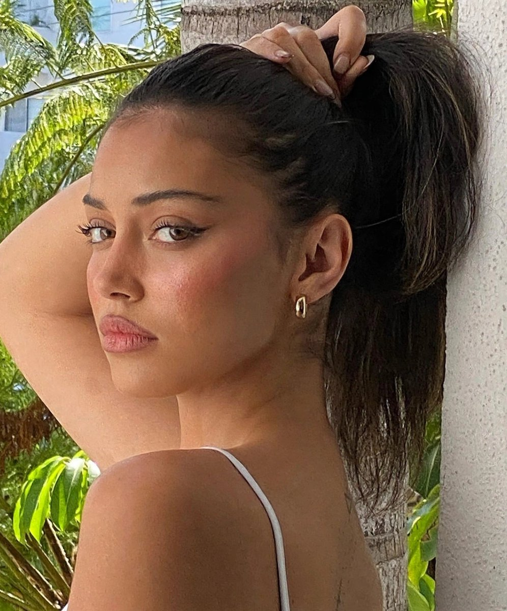
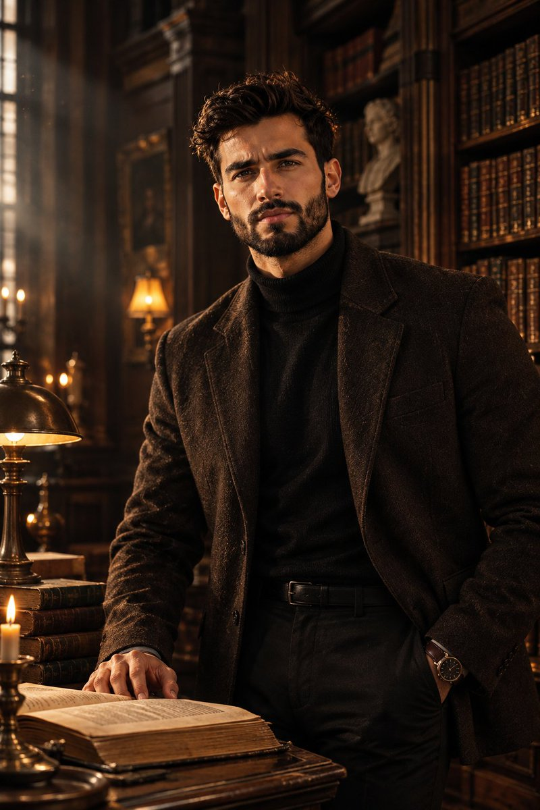
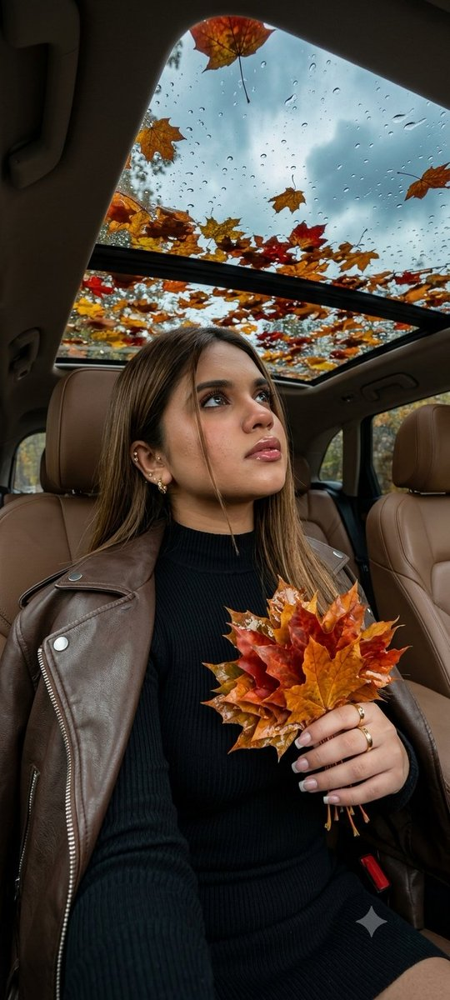
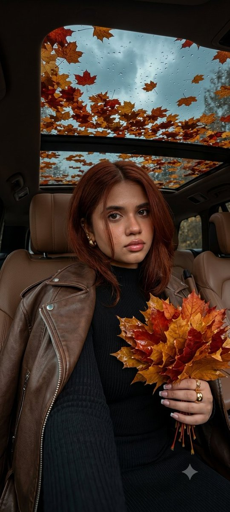
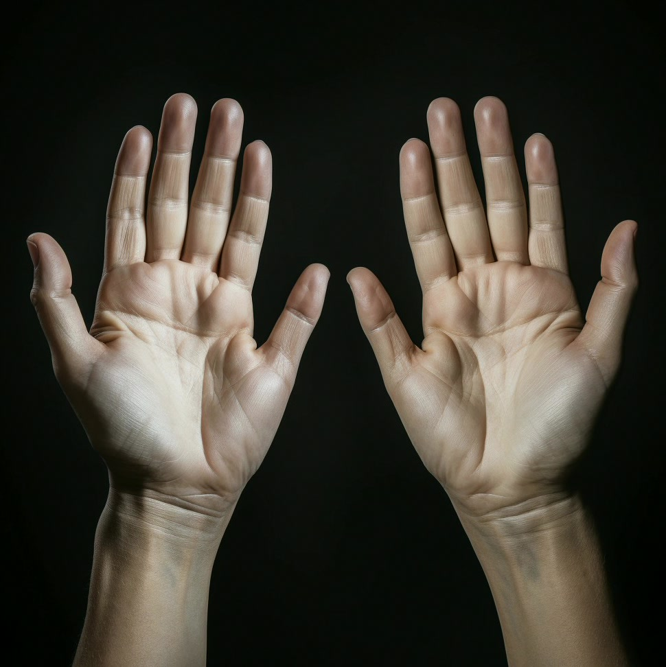
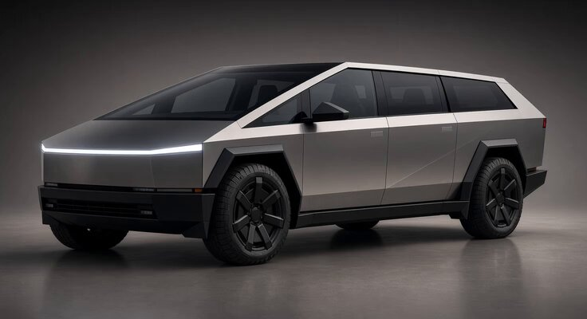

# Altro · Raccolta di prompt · Leadde.ai

[](README.md) [](README_zh.md) [](README_zh-TW.md) [](README_ja-JP.md) [](README_ko-KR.md) [](README_th-TH.md) [](README_vi-VN.md) [](README_hi-IN.md) [](README_es-ES.md) [-lightgrey)](README_es-419.md) [](README_de-DE.md) [](README_fr-FR.md) [](README_it-IT.md) [-lightgrey)](README_pt-BR.md) [](README_pt-PT.md) [](README_tr-TR.md)

**Best for:** Emerging visual AI prompts awaiting model verification, preserved with source attribution for early research.

For PDF, PPT, SOP, training, and multilingual video workflows:
[Awesome Document-to-Video](https://github.com/LeaddeOpenLab/awesome-document-to-video)

> **Prompt di qualità selezionati ogni giorno**

Scopri prompt completi per immagini, video e creazioni 3D con l’IA. Esplora gli stili, le versioni multilingue e le fonti degli autori originali.

[Esplora Leadde.ai →](https://leadde.ai/?utm_source=github&utm_medium=readme&utm_campaign=prompt-library&utm_content=uncategorized)

## Scopri Leadde.ai

Leadde.ai aiuta i team a trasformare documenti, diapositive e testi in video aziendali con l’IA per formazione, inserimento del personale e marketing.

Aggiungi una stella a questo repository per seguire i prompt selezionati ogni giorno e trovare nuove idee creative.

**99** Prompt · Ultima aggiunta: **2026-09-12**

<a name="catalog"></a>

## Sfoglia per categoria

[Fotografia](#category-photography) · [Fermo immagine cinematografico / Still fotografico](#category-cinematic-film-still) · [Anime / Manga](#category-anime-manga) · [Illustrazione](#category-illustration) · [Schizzo / Line Art](#category-sketch-line-art) · [Fumetto / Graphic Novel](#category-comic-graphic-novel) · [Rendering 3D](#category-3d-render) · [Retro / Vintage](#category-retro-vintage) · [Cyberpunk / Sci-Fi](#category-cyberpunk-sci-fi) · [Minimalismo](#category-minimalism) · [Altro](#category-other)

<a name="all-prompts"></a>

<a name="category-photography"></a>

## Fotografia

<a name="prompt-2098618384804176129"></a>

### Traduzione in corso

Autore：[@oju689](https://x.com/oju689) · [Post originale](https://x.com/oju689/status/2098618384804176129)

Fotografia · Ritratto / Selfie · Personaggio · Pubblicato

**Riepilogo:** Traduzione in corso



**Prompt**

```text
Traduzione in corso
```

[↑ Torna alle categorie](#catalog)

---

<a name="prompt-2098584064567705813"></a>

### Traduzione in corso

Autore：[@DDJCXX](https://x.com/DDJCXX) · [Post originale](https://x.com/DDJCXX/status/2098584064567705813)

Fotografia · Ritratto / Selfie · Personaggio · Architettura / Interni · Pubblicato

**Riepilogo:** Traduzione in corso


**Prompt**

```text
Traduzione in corso
```

[↑ Torna alle categorie](#catalog)

---

<a name="prompt-2098553866908533220"></a>

### Traduzione in corso

Autore：[@Hamburgerai](https://x.com/Hamburgerai) · [Post originale](https://x.com/Hamburgerai/status/2098553866908533220)

Poster / Volantino · Fotografia · Testo / Tipografia · Pubblicato

**Riepilogo:** Traduzione in corso


**Prompt**

```text
Traduzione in corso
```

[↑ Torna alle categorie](#catalog)

---

<a name="prompt-2098535116545110425"></a>

### Foto ultra-fotorealistica a figura intera media di una supermodella grunge con un cappotto di pelle nera seduta tra i fiori.

Autore：[@ai\_vision\_2nd](https://x.com/ai_vision_2nd) · [Post originale](https://x.com/ai_vision_2nd/status/2098535116545110425)

Fotografia · Pubblicato

**Riepilogo:** Foto ultra-fotorealistica a figura intera media di una supermodella grunge con un cappotto di pelle nera seduta tra i fiori.


**Prompt**

```text
Fotografia ultra-fotorealistica a figura intera media di un'affascinante e voluttuosa supermodella grunge in stile playmate seduta in un campo di fiori che sbocciano. Perfetta figura a clessidra con volume morbido e naturale. Capelli aggressivamente semplici e delicati: scalati e sfilati da corti a medi con punte morbide e irregolari. Trucco grunge minimale ed eccentrico: eyeliner sfumato, labbra pallide, lentiggini accennate. Indossa un cappotto grunge lungo in pelle nera, aperto ma che rimane ampiamente chiuso sul petto grazie al suo drappeggio e a grandi petali di fiori freschi che riposano naturalmente sul davanti; sono visibili solo le clavicole e una sottile linea verticale di pelle. Pantaloni a vita bassa logorati completano il look. La posa è rilassata, un ginocchio sollevato, entrambe le mani reggono dolcemente dei fiori che ammorbidiscono ulteriormente la zona del petto. Ogni fiore che sboccia inonda il mondo grigio di un colore ricco e vivo che avvolge il suo cappotto e la sua pelle. Il soggetto riempie la maggior parte dell'inquadratura. Il soggetto rimane estremamente dettagliato e fotorealistico anche in questa composizione ambientale a figura intera: la nitidezza del viso, i pori, la peluria e le trame della pelle rimangono completamente nitidi. 85mm a f/1.8, luce direzionale morbida con sfumature di colore surreali, espressione artistica e contenuta della bellezza femminile.
```

[↑ Torna alle categorie](#catalog)

---

<a name="prompt-2098530398724915395"></a>

### Ritratto fotorealistico a figura intera media di una giovane donna giapponese in lingerie di pizzo rosa e nero di ispirazione gotica che cammina in un luminoso campo di fiori al crepuscolo.

Autore：[@ai\_vision\_2nd](https://x.com/ai_vision_2nd) · [Post originale](https://x.com/ai_vision_2nd/status/2098530398724915395)

Fotografia · Ritratto / Selfie · Personaggio · Articolo di moda · Pubblicato

**Riepilogo:** Ritratto fotorealistico a figura intera media di una giovane donna giapponese in lingerie di pizzo rosa e nero di ispirazione gotica che cammina in un luminoso campo di fiori al crepuscolo.


**Prompt**

```text
Fotografia fotorealistica da catalogo di moda a figura intera media di una bellissima giovane donna giapponese dall'espressione dolce e kawaii, voluminosi capelli scuri e ondulati con molteplici fiocchi di pizzo nero e accenti di perle, seni naturali abbondanti dal volume morbido e realistico e grana della pelle fine, che indossa solo slip di lingerie in pizzo a strati rosa pallido e nero, graziosi ma di ispirazione gotica con dettagli a nastro, cinghie per le cosce abbinate ed eleganti sandali gotici con plateau. Cammina lentamente attraverso un campo di fiori luminoso e onirico al crepuscolo con sfere di luce fluttuanti, il corpo leggermente girato, una mano che solleva un bordo di pizzo della sua lingerie, lo sguardo rivolto dolcemente verso la fotocamera. Il soggetto riempie una porzione significativa dell'inquadratura in uno scatto medio a figura intera. Il soggetto rimane estremamente dettagliato e fotorealistico anche in questa composizione a figura intera, con lineamenti del viso nitidissimi, pori della pelle e peluria visibili, realismo naturale del seno e trame di pizzo multistrato intricate perfettamente definite. Scattata con una Canon EOS R5 con obiettivo 70mm f/1.8 a f/2.0, illuminazione morbida del crepuscolo con un delicato effetto bloom, micro-trame ultra-realistiche di pelle e tessuto.
```

[↑ Torna alle categorie](#catalog)

---

<a name="prompt-2098490558474027231"></a>

### Traduzione in corso

Autore：[@FuguiChen1314](https://x.com/FuguiChen1314) · [Post originale](https://x.com/FuguiChen1314/status/2098490558474027231)

Fotografia · Ritratto / Selfie · Articolo di moda · Pubblicato

**Riepilogo:** Traduzione in corso


**Prompt**

```text
Traduzione in corso
```

[↑ Torna alle categorie](#catalog)

---

<a name="prompt-2098398277095821330"></a>

### Prompt fotorealistico per un ritratto street-fashion a figura intera di un elegante uomo nero con cappotto cammello che cammina nel centro di Filadelfia.

Autore：[@PrometheanAIX](https://x.com/PrometheanAIX) · [Post originale](https://x.com/PrometheanAIX/status/2098398277095821330)

Fotografia · Ritratto / Selfie · Personaggio · Articolo di moda · Paesaggio urbano / Strada · Pubblicato

Post originale：[@PrometheanAIX](https://x.com/PrometheanAIX) · [Post originale](https://x.com/PrometheanAIX/status/2098384758145257614)

**Riepilogo:** Prompt fotorealistico per un ritratto street-fashion a figura intera di un elegante uomo nero con cappotto cammello che cammina nel centro di Filadelfia.


**Prompt**

```text
Crea un ritratto di street fashion a figura intera ultra-fotorealistico di un uomo nero affascinante e dallo stile deciso che cammina con sicurezza verso la fotocamera su un marciapiede del centro di Filadelfia. Ha una corporatura atletica e mascolina, capelli corti scuri sotto un cappellino da baseball nero su misura, una barba piena ben curata, un piccolo orecchino a cerchio e un'espressione calma e seria. Outfit: Indossa un lungo soprabito di lana color cammello con ampi revers, aperto sopra una t-shirt bianca semplice oversize. Abbinalo a jeans blu a lavaggio chiaro dal taglio comodo, con un ampio strappo sfilacciato su un ginocchio e sottili dettagli consumati. Completa con sneakers alte bianche impeccabili, una lunga collana minimalista con ciondolo d'oro, un piccolo orecchino e un imponente orologio da polso d'oro. Il look è uno streetwear contemporaneo di alto livello con una naturale disinvoltura mascolina. Posa: Immortalalo a metà falcata mentre cammina direttamente verso la fotocamera, con una mano casualmente nella tasca dei jeans mentre l'altro braccio scende naturalmente. Il cappotto si apre e si muove sottilmente al passo. Guarda leggermente oltre l'obiettivo con un linguaggio del corpo rilassato e sicuro di sé. Ambiente: Ambienta la scena a Center City Philadelphia, con storici edifici in pietra, scalinate di case a schiera, ringhiere in ferro battuto nero, piante, lampioni, traffico, pedoni e un ingresso della metropolitana di Broad Street. Il municipio di Filadelfia e la sua torre dell'orologio sono chiaramente riconoscibili in lontananza, conferendo alla fotografia un'identità inconfondibile di Filadelfia pur mantenendo la sensazione di un momento urbano naturale. Fotografia e cinematografia: Usa una fotografia di street fashion contemporanea di alta qualità, inquadratura completa dalla testa ai piedi, prospettiva ad altezza occhi e resa da obiettivo 50–70mm. La calda luce del sole del tardo pomeriggio crea splendidi riflessi lungo il cappotto cammello e una luce dimensionale naturale sul suo viso. Mantieni il soggetto nitidissimo con una separazione controllata dello sfondo, texture realistica della pelle e della barba, lana e denim dettagliati, naturale profondità cittadina, sottile grana fotografica e una raffinata gradazione del colore editoriale. Evitare: pelle di plastica o finta, fotoritocco eccessivo, muscoli esagerati, stile eccessivamente formale, loghi eccessivi, pose rigide, strade vuote, monumenti artificiali, bokeh eccessivo, aspetto CGI, ipersaturazione o estetica da bambola di moda.
```

[↑ Torna alle categorie](#catalog)

---

<a name="prompt-2098396584879002102"></a>

### Modello di prompt per generare una locandina promozionale realistica di un concorrente del reality brasiliano A Fazenda 18 a partire da un selfie personale, inclusi i campi del profilo del concorrente e le specifiche cromatiche stabilite.

Autore：[@balancogeral](https://x.com/balancogeral) · [Post originale](https://x.com/balancogeral/status/2098396584879002102)

Poster / Volantino · Fotografia · Ritratto / Selfie · Pubblicato

**Riepilogo:** Modello di prompt per generare una locandina promozionale realistica di un concorrente del reality brasiliano A Fazenda 18 a partire da un selfie personale, inclusi i campi del profilo del concorrente e le specifiche cromatiche stabilite.


**Prompt**

```text
Trasforma il mio selfie in un post promozionale realistico di un partecipante di A Fazenda 18. Includi [NOME], [CIDADE], slogan, punto di forza, punto debole e probabilità di arrivare alla Finale. Mantieni fedelmente il mio viso e il mio aspetto naturale. Foto in formato 4:5, posa spontanea, sguardo diretto, ambientazione rurale discreta, luce soffusa, texture reale della pelle e composizione editoriale asimmetrica. Palette: beige pesca #f2ceb0, verde acqua #00ad9d e arancione #e98300. Poco testo, aspetto naturale, senza ritocchi eccessivi, effetti, loghi inventati o l'aspetto di un'immagine generata dall'IA.
```

[↑ Torna alle categorie](#catalog)

---

<a name="prompt-2098338457491800556"></a>

### Prompt per la generazione di un video animato realistico in cui un lingotto d'oro germoglia nel fango crescendo fino a diventare un albero torreggiante pieno di lingotti d'oro, seguito da operai che accorrono per raccoglierli e caricarli su un camion.

Autore：[@abs\_uiux](https://x.com/abs_uiux) · [Post originale](https://x.com/abs_uiux/status/2098338457491800556)

Fotografia · Personaggio · Pubblicato

**Riepilogo:** Prompt per la generazione di un video animato realistico in cui un lingotto d'oro germoglia nel fango crescendo fino a diventare un albero torreggiante pieno di lingotti d'oro, seguito da operai che accorrono per raccoglierli e caricarli su un camion.


**Prompt**

```text
Crea un video verticale cinematografico e ultra-fotorealistico di 10 secondi (9:16).
Un realistico lingotto d'oro giace abbandonato sul ciglio fangoso della strada dopo una forte pioggia. L'acqua piovana gli scorre attorno mentre l'oggetto affonda lentamente nel terreno bagnato. Nel giro di pochi secondi, l'oggetto sepolto inizia a brillare dal sottosuolo. Un minuscolo germoglio verde emerge esattamente dallo stesso punto e cresce rapidamente fino a diventare un gigantesco albero maturo di lingotti d'oro. Il tronco robusto e i rami richiamano naturalmente la forma, la consistenza, i colori e il design del lingotto d'oro originale. Centinaia di lingotti d'oro maturi e completamente dettagliati pendono da ogni ramo come frutti veri, oscillando dolcemente al vento.
Subito dopo che l'albero ha terminato la crescita, arriva un grande camion da trasporto che si ferma accanto ad esso. Un lavoratore si arrampica rapidamente sull'albero mentre molti altri raccolgono velocemente ogni lingotto d'oro dai rami, gettandoli sul camion con movimenti rapidi e realistici. In pochi istanti l'albero viene completamente spogliato del raccolto. Il camion si riempie completamente di centinaia di lingotti d'oro e riparte, lasciando dietro di sé solo l'albero vuoto.
Ripresa continua singola, tempo piovoso realistico, terreno fangoso, illuminazione cinematografica, vento naturale, fisica credibile, texture ultra-dettagliate, animazione fluida della crescita, trasformazione senza soluzione di continuità, nessun taglio, nessun glitch, nessuno sfarfallio, nessun oggetto superfluo, 8K, HDR, iperrealistico, realismo in stile documentario." nota: il lingotto d'oro deve essere lo stesso dall'inizio alla fine; se sono rettangolari, devono essere tutti rettangolari e realistici
```

[↑ Torna alle categorie](#catalog)

---

<a name="prompt-2098291700355432939"></a>

### Ritratto alla moda di una giovane donna sul sedile anteriore di un'auto, con indosso un blazer nero e jeans chiari, interni in pelle marrone e luce naturale soffusa.

Autore：[@afrinxai](https://x.com/afrinxai) · [Post originale](https://x.com/afrinxai/status/2098291700355432939)

Fotografia · Ritratto / Selfie · Personaggio · Articolo di moda · Veicolo · Pubblicato

Post originale：[@afrinxai](https://x.com/afrinxai) · [Post originale](https://x.com/afrinxai/status/2098230798759457070)

**Riepilogo:** Ritratto alla moda di una giovane donna sul sedile anteriore di un'auto, con indosso un blazer nero e jeans chiari, interni in pelle marrone e luce naturale soffusa.


**Prompt**

```text
Usa la foto caricata come riferimento per l'identità facciale di una donna adulta. Mantieni i suoi tratti somatici riconoscibili, la tonalità naturale della pelle, le proporzioni del viso e l'aspetto generale. Un ritratto chic ed elegante di una giovane donna con lunghi capelli castano scuro ondulati, che guarda con sicurezza direttamente nella fotocamera. È seduta comodamente sul sedile anteriore di un'auto con rivestimenti in pelle marrone, appoggiata al poggiatesta. Il suo outfit consiste in un blazer nero sartoriale con rever a lancia, un bottone frontale visibile e una patta della tasca sul petto, abbinato a jeans in denim a vita alta dal lavaggio chiaro. La messa a fuoco è nitida sulla sua espressione e sulle texture del blazer nero e dei jeans. Le sue gambe sono rilassate, con i jeans chiari chiaramente visibili. L'interno dell'auto mostra sedili in pelle marrone con cuciture chiare e un pannello della portiera nero. Attraverso il finestrino dell'auto è visibile uno sfondo sfocato di alberi e cespugli verdi. La luce naturale del giorno è morbida e lusinghiera. La composizione è un mezzo busto, con una ridotta profondità di campo che rende i dettagli dell'auto e lo sfondo morbidamente sfocati. La qualità fotografica è ad alta risoluzione, con colori e texture naturali.
```

[↑ Torna alle categorie](#catalog)

---

<a name="prompt-2098283754599174194"></a>

### Traduzione in corso

Autore：[@muse\_ai\_prompt](https://x.com/muse_ai_prompt) · [Post originale](https://x.com/muse_ai_prompt/status/2098283754599174194)

Fotografia · Ritratto / Selfie · Personaggio · Pubblicato

**Riepilogo:** Traduzione in corso


**Prompt**

```text
Traduzione in corso
```

[↑ Torna alle categorie](#catalog)

---

<a name="prompt-2097889772899639317"></a>

### Traduzione in corso

Autore：[@Soranlan](https://x.com/Soranlan) · [Post originale](https://x.com/Soranlan/status/2097889772899639317)

Fotografia · Ritratto / Selfie · Personaggio · Articolo di moda · Pubblicato

Post originale：[@Soranlan](https://x.com/Soranlan) · [Post originale](https://x.com/Soranlan/status/2081181748478562704)

**Riepilogo:** Traduzione in corso


**Prompt**

```text
Traduzione in corso
```

[↑ Torna alle categorie](#catalog)

---

<a name="prompt-2097888970994495736"></a>

### generami mentre mi metto a sedere dando le spalle alla telecamera, poi mi alzo in piedi e mi giro per fare qualche flessione

Autore：[@RSOXART](https://x.com/RSOXART) · [Post originale](https://x.com/RSOXART/status/2097888970994495736)

Fotografia · Pubblicato

**Riepilogo:** generami mentre mi metto a sedere dando le spalle alla telecamera, poi mi alzo in piedi e mi giro per fare qualche flessione


**Prompt**

```text
generami mentre mi metto a sedere dando le spalle alla telecamera, poi mi alzo in piedi e mi giro per fare qualche flessione
```

[↑ Torna alle categorie](#catalog)

---

<a name="prompt-2097892780052013289"></a>

### Ritratto fotografico realistico in studio di una giovane donna con occhi verde nocciola, acconciatura raccolta e abito bianco a balze.

Autore：[@oju689](https://x.com/oju689) · [Post originale](https://x.com/oju689/status/2097892780052013289)

Fotografia · Ritratto / Selfie · Personaggio · Articolo di moda · Pubblicato

**Riepilogo:** Ritratto fotografico realistico in studio di una giovane donna con occhi verde nocciola, acconciatura raccolta e abito bianco a balze.


**Prompt**

```text
Ritratto ravvicinato ultra-realistico di una splendida giovane donna dai lineamenti naturali e delicati, pelle chiara e morbida con sottili lentiggini e grana della pelle realistica, espressivi occhi verde nocciola che guardano leggermente di lato, sopracciglia naturalmente definite, labbra rosa tenue e un'espressione dolce e sicura. I suoi capelli castano scuro sono raccolti in un'acconciatura morbida ed elegante in stile spettinato, con ciocche ribelli naturali che le incorniciano il viso. Indossa un romantico abito bianco testurizzato con delicate maniche corte a balze e una scollatura leggermente arricciata, abbinato a sottili collane d'oro a strati con minuscoli dettagli di perle e piccoli ciondoli, oltre a eleganti orecchini pendenti.

Illuminazione da studio naturale calda e morbida, sfondo beige neutro, ombre tenui, proporzioni del viso realistiche, ciocche di capelli dettagliate, pori e texture della pelle autentici, trucco naturale, blush delicato, fotografia cinematografica, profondità di campo ridotta, obiettivo per ritratti da 85 mm, f/1.8, alta gamma dinamica, fotografia editoriale professionale, fotorealistica, ultra-dettagliata, qualità 8K, nessun CGI o aspetto artificiale.
```

[↑ Torna alle categorie](#catalog)

---

<a name="prompt-2097851840532783565"></a>

### Traduzione in corso

Autore：[@Live\_life\_style](https://x.com/Live_life_style) · [Post originale](https://x.com/Live_life_style/status/2097851840532783565)

Fotografia · Personaggio · Veicolo · Pubblicato

**Riepilogo:** Traduzione in corso


**Prompt**

```text
Traduzione in corso
```

[↑ Torna alle categorie](#catalog)

---

<a name="prompt-2097562587437342750"></a>

### Master prompt progettato per modellare sottilmente le nuvole esistenti nelle foto di riferimento in sosia di animali tramite pareidolia, mantenendo realistiche le texture della fotografia da smartphone.

Autore：[@er1029iu](https://x.com/er1029iu) · [Post originale](https://x.com/er1029iu/status/2097562587437342750)

Fotografia · Animale / Creatura · Pubblicato

**Riepilogo:** Master prompt progettato per modellare sottilmente le nuvole esistenti nelle foto di riferimento in sosia di animali tramite pareidolia, mantenendo realistiche le texture della fotografia da smartphone.


**Prompt**

```text
SOSIA DI NUVOLA — MASTER PROMPT PER FOTO REALE

Usa la fotografia originale allegata come immagine di riferimento fissa.

BLOCCO DEL RIFERIMENTO — MOLTO IMPORTANTE

La fotografia originale deve rimanere riconoscibile e visivamente coerente.

Conserva:
- il cielo blu originale
- la reale distribuzione delle nuvole
- l'angolazione originale della fotocamera
- i cavi aerei diagonali
- i riflessi sulla finestra
- l'illuminazione naturale esistente
- l'imperfetta qualità fotografica del mondo reale
- la prospettiva e la composizione originali

Non sostituire l'intero cielo.
Non riprogettare la scena.
Non creare uno sfondo completamente nuovo.

--------------------------------------------------
PASSO 1 — ANALIZZARE LA NUVOLA ORIGINALE
--------------------------------------------------

Per prima cosa analizza attentamente la nuvola principale nella fotografia allegata.

Studia i suoi:

- sagoma esterna
- masse arrotondate
- aree sporgenti
- sezioni strette
- spazi vuoti
- luci e ombre naturali
- densità della nuvola
- direzione
- impressione visiva complessiva

Poi determina a quale animale reale o creatura vivente familiare
la nuvola esistente somigli di più naturalmente.

La somiglianza deve derivare DALLA FORMA ESISTENTE DELLA NUVOLA.

Non forzare un animale non correlato all'interno della nuvola.

--------------------------------------------------
PASSO 2 — INTERPRETAZIONE NATURALE DEL SOSIA
--------------------------------------------------

Trasforma soltanto la percezione che l'osservatore ha della nuvola.

La nuvola stessa deve comunque apparire come una VERA NUVOLA.

Usa le masse nuvolose esistenti come struttura naturale per:

testa,
corpo,
orecchie,
muso,
zampe,
coda,
o altre caratteristiche riconoscibili.

Enfatizza solo le caratteristiche che appaiono già naturalmente possibili
dalla sagoma originale della nuvola.

La reazione dell'osservatore dovrebbe essere:

"Aspetta... quella nuvola sembra un animale."

NON:

"Qualcuno ha incollato un animale nel cielo."

--------------------------------------------------
PRIMA LA VERA NUVOLA
--------------------------------------------------

Equilibrio visivo prefissato:

90–95% nuvola reale
5–10% somiglianza immaginativa

La nuvola deve rimanere fatta interamente di:

vapore acqueo realistico,
morbide particelle nuvolose,
diffusione atmosferica naturale,
bordi frastagliati della nuvola,
luce solare reale,
sottile profondità volumetrica.

NON creare:

un animale peloso che fluttua nel cielo,
un muso realistico di animale incollato in una nuvola,
occhi da cartone animato,
occhi dall'aspetto umano,
tratti facciali perfettamente simmetrici,
pelliccia in CGI,
texture plastiche,
aspetto da mascotte 3D.

--------------------------------------------------
DETTAGLI DEL VISO / DEL PERSONAGGIO
--------------------------------------------------

Se i dettagli del volto sono necessari,
devono essere estremamente sottili.

Gli occhi dovrebbero essere suggeriti principalmente attraverso
ombre naturali della nuvola e minime differenze di tonalità.

Un naso o una bocca possono comparire solo come
lievissime variazioni di densità della nuvola.

Niente evidenti occhi a bottone neri.
Nessun sorriso esagerato.
Nessuna lingua da cartone animato.
Nessun contorno facciale artificiale.

La somiglianza animale deve emergere attraverso la pareidolia.

--------------------------------------------------
QUALITÀ DA FOTO REALE
--------------------------------------------------

Il risultato finale deve sembrare
una vera fotografia spontanea catturata attraverso una finestra.

Fotografia naturale da iPhone.

Realismo da fotocamera di smartphone di media qualità,
non una pubblicità,
non una foto da studio.

Mantieni:

leggero bagliore del vetro,
piccoli riflessi,
lievi imperfezioni di esposizione,
foschia atmosferica naturale,
nitidezza leggermente irregolare,
gamma dinamica realistica,
sottile rumore del sensore,
variazione naturale del colore.

Evita un HDR eccessivo.
Evita una nitidezza eccessiva.
Evita una saturazione artificiale.
```

[↑ Torna alle categorie](#catalog)

---

<a name="prompt-2097519361909199023"></a>

### Mezzo primo piano fotorealistico di una donna che galleggia sulla schiena in un'acqua cristallina durante il tramonto.

Autore：[@punkhuri1](https://x.com/punkhuri1) · [Post originale](https://x.com/punkhuri1/status/2097519361909199023)

Fotografia · Personaggio · Paesaggio / Natura · Pubblicato

**Riepilogo:** Mezzo primo piano fotorealistico di una donna che galleggia sulla schiena in un'acqua cristallina durante il tramonto.


**Prompt**

```text
Mezzo primo piano, fotografia artistica fotorealistica di una donna adulta che galleggia pacificamente sulla schiena in un'acqua calma e cristallina al tramonto.

Indossa la parte superiore di un bikini azzurro e lo slip bianco. I suoi occhi sono delicatamente chiusi, il viso è rivolto verso l'alto verso il cielo serale, comunicando un rilassamento totale. I suoi capelli castani bagnati si distendono naturalmente nell'acqua attorno alla testa. Un braccio si estende con naturalezza lungo la superficie, mentre le gambe sono visibili con morbidezza sotto l'acqua limpida.

L'acqua è eccezionalmente trasparente, con splendidi riflessi vorticosi di blu profondo, turchese, ottanio e oro caldo generati dal sole al tramonto. Onde delicate e una sottile rifrazione circondano il suo corpo, creando un autentico aspetto d'acqua naturale.

La parte superiore della composizione racchiude un luminoso cielo al tramonto dai toni caldi di arancione, ambra e giallo tenue, che sfuma con naturalezza nell'acqua più fredda blu e turchese sottostante. La luce del sole dell'ora d'oro crea un caldo bagliore attraverso l'intera scena e riflessi realistici sulla superficie dell'acqua.

Texture naturale della pelle, capelli bagnati realistici, riflessi e rifrazione dell'acqua fisicamente accurati, sottili increspature, luci e ombre realistiche, autentica profondità fotografica, dettagli realistici della pelle e del tessuto.

Composizione: mezzo primo piano con il viso e la parte superiore del corpo della donna come punto focale primario, mentre una parte sufficiente del corpo rimane visibile per delineare la posa galleggiante. Mantenere una relazione equilibrata tra il caldo cielo del tramonto e i riflessi colorati dell'acqua. Prospettiva naturale, inquadratura cinematografica, profondità di campo fotografica da ridotta a moderata, nessun aspetto artificiale da studio.

Stile: fotografia artistica professionale altamente dettagliata, aspetto fotorealistico dal vivo, resa cromatica naturale, realismo cinematografico, atmosfera autentica dell'ora d'oro, superficie dell'acqua realistica, illuminazione fisicamente accurata, dettagli fotografici fini, sottile grana della pellicola, qualità da capolavoro.
```

[↑ Torna alle categorie](#catalog)

---

<a name="prompt-2097217893767303361"></a>

### Prompt fotografico realistico di una giovane donna giapponese con capelli castano cenere in una maglietta oversize con ampia scollatura, che si china profondamente in avanti per scrivere con una penna su un foglio sopra un tavolo in una sede per eventi al chiuso.

Autore：[@kamakirin13993](https://x.com/kamakirin13993) · [Post originale](https://x.com/kamakirin13993/status/2097217893767303361)

Fotografia · Personaggio · Pubblicato

**Riepilogo:** Prompt fotografico realistico di una giovane donna giapponese con capelli castano cenere in una maglietta oversize con ampia scollatura, che si china profondamente in avanti per scrivere con una penna su un foglio sopra un tavolo in una sede per eventi al chiuso.


**Prompt**

```text
Una giovane donna giapponese con capelli castano cenere corti e scalati, che guarda verso il basso. Indossa una maglietta oversize con una scollatura ampia e jeans in denim. Davanti alla donna c'è un tavolo, e sopra il tavolo c'è un singolo foglio di carta bianca per fotocopie. Tiene una penna nella mano destra e, stando in piedi, si china profondamente in avanti cercando di scrivere sulla carta. La sua mano sinistra è sul tavolo. Lo sfondo è una sede per eventi al coperto. Illuminazione naturale, pelle naturale. Trama naturale del tessuto dei vestiti. Stile fotografico realistico con texture della pelle finemente dettagliata, alta risoluzione.
```

[↑ Torna alle categorie](#catalog)

---

<a name="prompt-2097223313592316111"></a>

### Ritratto in studio ultra-realistico di un uomo con dolcevita nero e occhiali trasparenti con doppia illuminazione magenta e ciano.

Autore：[@abs\_uiux](https://x.com/abs_uiux) · [Post originale](https://x.com/abs_uiux/status/2097223313592316111)

Fotografia · Ritratto / Selfie · Personaggio · Pubblicato

**Riepilogo:** Ritratto in studio ultra-realistico di un uomo con dolcevita nero e occhiali trasparenti con doppia illuminazione magenta e ciano.


**Prompt**

```text
Crea un ritratto in studio ravvicinato ultra-realistico di un uomo adulto con un'espressione sicura e riflessiva, fotografato dal petto in su in uno stile editoriale moderno di alto livello. Dagli capelli neri corti e curati. Indossa occhiali rettangolari trasparenti con sottili riflessi delle luci dello studio. Vestilo con un maglione dolcevita nero aderente sotto un sofisticato blazer nero sartoriale con rever strutturati. Mantieni l'outfit completamente minimale e monocromatico, senza gioielli visibili o accessori non necessari. Mettilo in posa rivolto leggermente lontano dalla fotocamera, con la testa delicatamente inclinata verso l'alto e gli occhi rivolti verso la parte superiore destra dell'inquadratura, creando un'atmosfera calma, intelligente e ambiziosa. Usa una drammatica illuminazione da studio bicolore: una vivida luce d'accento magenta/viola che illumina il lato sinistro dei capelli e del viso, e una vibrante luce blu elettrico/ciano che illumina il lato destro. Mantieni una morbida illuminazione frontale neutra sul viso in modo che la pelle rimanga realistica, dettagliata e correttamente esposta. Crea uno sfondo da studio futuristico sfocato con una ricca sfumatura che passa dal viola intenso e magenta a sinistra al blu elettrico a destra. Aggiungi una barra luminosa al neon magenta diagonale brillante in basso a sinistra sullo sfondo per una maggiore profondità visiva. Enfatizza la texture realistica della pelle, i peli dettagliati della barba, occhi nitidi, riflessi naturali degli occhiali, trama del tessuto definita, contrasto cinematografico, profondità di campo ridotta, bokeh morbido e colorato, fotografia di personal branding di livello superiore, estetica editoriale aziendale di fascia alta, ultra-fotorealistico, look da obiettivo per ritratti da 85 mm, f/1.8, dettaglio 8K, composizione verticale 4:5.
```

[↑ Torna alle categorie](#catalog)

---

<a name="category-cinematic-film-still"></a>

## Fermo immagine cinematografico / Still fotografico

<a name="prompt-2098605916199456804"></a>

### Traduzione in corso

Autore：[@MohdAdnanA86218](https://x.com/MohdAdnanA86218) · [Post originale](https://x.com/MohdAdnanA86218/status/2098605916199456804)

Fermo immagine cinematografico / Still fotografico · Ritratto / Selfie · Personaggio · Pubblicato

**Riepilogo:** Traduzione in corso



**Prompt**

```text
Traduzione in corso
```

[↑ Torna alle categorie](#catalog)

---

<a name="prompt-2098476449212805468"></a>

### Scatto continuo con effetto pellicola sulla spiaggia di San Diego nell'ora rosa, con onde sonore che fanno vibrare la sabbia accendendo il plancton bioluminescente.

Autore：[@jfischoff](https://x.com/jfischoff) · [Post originale](https://x.com/jfischoff/status/2098476449212805468)

Fermo immagine cinematografico / Still fotografico · Animale / Creatura · Pubblicato

**Riepilogo:** Scatto continuo con effetto pellicola sulla spiaggia di San Diego nell'ora rosa, con onde sonore che fanno vibrare la sabbia accendendo il plancton bioluminescente.


**Prompt**

```text
Fotocamera a pellicola. Pellicola a colori Fuji Nikon 35mm. Saturo. Fotografia professionale realistica. Una ripresa continua del suono che fa vibrare la sabbia e fa illuminare il plancton bioluminescente in gruppi nuvolosi nell'oceano, dalla spiaggia di San Diego durante l'ora rosa.
```

[↑ Torna alle categorie](#catalog)

---

<a name="prompt-2098392252137820636"></a>

### Cinematic live-action fantasy prompt of a girl dodging a horned demon's tentacles and slapping him with an energized flip-flop saying 'Baka'.

Autore：[@recehtuitt](https://x.com/recehtuitt) · [Post originale](https://x.com/recehtuitt/status/2098392252137820636)

Fermo immagine cinematografico / Still fotografico · Personaggio · Testo / Tipografia · Pubblicato

**Riepilogo:** Cinematic live-action fantasy prompt of a girl dodging a horned demon's tentacles and slapping him with an energized flip-flop saying 'Baka'.


**Prompt**

```text
[10s | 16:9 | 24fps | una ripresa cinematografica continua]  

RIFERIMENTO: 
@image1 = MASTER DI REIKA. Preservare l'aspetto riconoscibile, le proporzioni, i lunghi capelli scuri, la maglietta bianca oversize, i pantaloncini cargo scuri, i sandali, la collana e il guardaroba. Reika possiede velocità estrema, riflessi pronti e un controllo fisico disinvolto. Può sfilarsi un'infradito e tenerla come oggetto di scena in mano. 
@image2 = MASTER DI VORN. Preservare l'aspetto riconoscibile, la normale scala umanoide, le corna, i lunghi capelli bianchi, la coda ossea, l'armatura d'ossa stratificata e gli abiti pallidi e logori. Vorn impiega tre tentacoli d'aura simili a ossa con una pressione offensiva a velocità estrema.  

STILE: Fantasy live-action IMAX fotorealistico di alta qualità, ARRI ALEXA 65 / RED V-RAPTOR XL, 35mm anamorfico, Kodak Vision3 500T. Ombre profonde ciano-ottanio, riflessi ambra-arancio contenuti, contrasto notturno scuro, superfici bagnate e riflettenti, materiali tattili, peso realistico, sfocatura di movimento naturale e sottile grana della pellicola. L'energia distintiva di Reika è un argento metallico scuro intrecciato con fuoco controllato nero-cremisi.  

AMBIENTAZIONE: Strada del centro bagnata dalla pioggia di notte, asfalto umido, auto parcheggiate, vetrine di negozi, lampioni e folla in preda al panico. La strada si frattura progressivamente e si riempie d'acqua, vetri e detriti di veicoli a mano a mano che gli attacchi di Vorn vanno a vuoto.  

TIMELINE DELL'AZIONE:  
[00:00–00:02.5] BEAT 1 — EVASIONE DISINVOLTA Reika si toglie con calma un'infradito e la tiene senza stringere in una mano, lasciando quel piede scalzo. Vorn scaglia all'istante tre tentacoli d'aura simili a ossa contro il torso, la testa e le gambe di Reika da angolazioni convergenti. Reika non contrattacca mai; semplicemente fa perno, si china e scivola tra di essi con piccolissimi movimenti precisi, con ogni colpo che la manca di pochi centimetri e distrugge la strada bagnata alle sue spalle. INIZIARE dietro la spalla di Reika, seguendo i tentacoli verso la sua posizione esatta, quindi orbitare strettamente con il suo ritmo evasivo mentre acqua e asfalto eruttano dietro ogni colpo a vuoto. 

ACCENTO: 0,2s di slow motion su un tentacolo che passa a pochi centimetri dal volto di Reika, per poi tornare di scatto alla velocità estrema. STOP con Reika ancora composta mentre Vorn concatena immediatamente la raffica successiva.  

[00:02.5–00:05.0] BEAT 2 — DIVARIO DI VELOCITÀ CRESCENTE Vorn sferra di nuovo tutti e tre i tentacoli, più velocemente e da angolazioni in continuo mutamento, ciascuno mirato alla posizione fisica reale di Reika. Reika rifiuta ancora di attaccare, scivolando sotto l'uno, scartando l'altro e ruotando attraverso il colpo finale quasi senza sprecare alcun movimento. Gli attacchi mancati sventrano automobili, vetri e asfalto, accumulando una densa nube di macerie direttamente dietro di lei. INIZIARE con un tracking laterale su Reika, accelerando mentre i tentacoli si stringono intorno a lei, poi una panoramica a schiaffo attraverso l'impatto finale mentre i detriti riempiono l'inquadratura. Reika usa l'oscuramento per spostarsi a God Speed per una breve distanza, lasciando una densa scia di fumo nero tra le macerie, e giunge placida accanto a Vorn prima che lui possa reagire. STOP su Vorn che si volta bruscamente verso di lei.  

[00:05–00:07.5] BEAT 3 — FUOCO CREMISI-ARGENTO Vorn attacca subito di nuovo a distanza ravvicinata. Reika rimane ferma sulle gambe e solleva semplicemente l'infradito rimossa. Energia d'argento metallico scuro si avvolge a spirale attorno ad essa mentre un fuoco nero-cremisi si insinua nel nucleo argenteo, intensificandosi rapidamente attorno alla sua mano. Pioggia e detriti restano brevemente sospesi mentre la luce circostante precipita in un'ombra profonda ciano-nera. Reika dice a bassa voce: "Baka." La scritta giapponese 「バカ」 si materializza accanto a lei da un'energia dimensionale argento-nera orlata di fuoco cremisi, occupando fisicamente l'atmosfera invece di comportarsi come un testo sovraimpresso sullo schermo. INIZIARE con una spinta controllata verso l'attacco in arrivo, curvare attorno a Reika mentre l'energia si manifesta, quindi proseguire direttamente nel suo fendente. 

ACCENTO: 0,2s di slow motion mentre l'energia argento-nera si comprime attorno all'infradito. L'infradito accelera immediatamente verso il volto di Vorn.  

[00:07.5–00:10.0] BEAT 4 — CONCLUSIONE A COLPO SINGOLO L'infradito colpisce Vorn in pieno volto. L'energia argento-nera si comprime nel punto di contatto mentre il fuoco nero-cremisi esplode verso l'esterno. L'impatto localizzato genera una violenta onda d'urto che disperde pioggia, vetri, polvere e frammenti di veicoli lungo la strada. Vorn indietreggia per il singolo colpo, per poi disintegrarsi rapidamente in polvere nera che si espande. INIZIARE dallo slancio del colpo, spingere verso l'esatto punto di contatto, quindi indietreggiare con l'onda d'urto mentre le macerie si espandono verso l'esterno. Usare un micro slow motion solo per il primo istante del contatto, poi ripristinare il movimento a piena velocità. TERMINARE con Reika saldamente piantata a terra, un piede nudo e l'altra infradito ancora indosso, mentre l'energia argento-nera e il fuoco cremisi svaniscono.  

CONTINUITÀ: Reika rimane incolume attraverso i Beat 1–2 e non contrattacca mai fino al colpo finale. Vorn rimane costantemente all'offensiva. L'infradito sfilata rimane nella mano di Reika fino all'impatto finale; quel piede rimane scalzo per tutta la durata. Ogni tentacolo a vuoto danneggia progressivamente l'ambiente e motiva le transizioni della macchina da presa. Lo spostamento tra le macerie del Beat 2 posiziona Reika accanto a Vorn, impostando direttamente il Beat 3. L'onda d'urto finale ha origine dal punto esatto di contatto con il volto.  

ESCLUSIONI MIRATE: I tre tentacoli convergono sempre sulla posizione fisica reale di Reika; i colpi a vuoto distruggono l'ambiente dietro di lei anziché deviare a caso. Il piede nudo di Reika rimane scalzo e l'infradito tolta non torna mai ad esso. Il 「バカ」 rimane una tipografia d'energia dimensionale integrata nella scena, non una sovrapposizione piatta. L'energia argento-nera rimane intrecciata con il fuoco nero-cremisi invece di diventare una fiamma ordinaria. La telecamera segue un impeto continuo senza ripristini né stacchi netti; ciascun personaggio rimane una presenza continua e coerente.  

AUDIO: Pioggia battente, spostamento d'aria dei tentacoli, impatti sull'asfalto, vetri che si infrangono, lamiere e panico tra la folla. Il suono ambientale si comprime brevemente mentre Reika manifesta l'energia. Il suo sommesso "Baka" rimane nitido. Il contatto finale produce un impatto denso, un'onda d'urto in espansione e una cascata di macerie. Nessuna musica di sottofondo.
```

[↑ Torna alle categorie](#catalog)

---

<a name="prompt-2098436364849320190"></a>

### Prompt cinematografico in piano sequenza per un mercato notturno galleggiante al chiaro di luna con lanterne e venditori.

Autore：[@feesyiam](https://x.com/feesyiam) · [Post originale](https://x.com/feesyiam/status/2098436364849320190)

Fermo immagine cinematografico / Still fotografico · Pubblicato

**Riepilogo:** Prompt cinematografico in piano sequenza per un mercato notturno galleggiante al chiaro di luna con lanterne e venditori.


**Prompt**

```text
"Crea un video cinematografico e fotorealistico di 15 secondi in piano sequenza continuo, basato esattamente sull'immagine di riferimento de “Il mercato notturno galleggiante”.

Preserva l'architettura originale, le piattaforme di legno galleggianti del mercato, il design delle lanterne, i venditori, i clienti, le barche, l'oceano, le montagne, la tavolozza dei colori e la composizione complessiva. Non riprogettare né sostituire alcun elemento principale.

0–3 secondi: Inizia con un movimento di camera lento e fluido dal basso appena sopra la superficie scura dell'oceano, avvicinandoti al mercato notturno galleggiante. Centinaia di calde lanterne di carta luminose oscillano delicatamente nella brezza notturna. I loro riflessi dorati scintillano naturalmente sull'acqua in movimento. Piccole onde si muovono dolcemente intorno alle piattaforme galleggianti.

3–7 secondi: La telecamera si solleva lentamente e avanza attraverso il mercato, rivelando una vivace attività. I venditori preparano il cibo con naturalezza presso piccoli banchi di legno, mescolando delicatamente pentole fumanti e grigliando pietanze. Un sottile vapore realistico sale verso la luce delle lanterne. I clienti camminano con disinvoltura su stretti ponti di legno, parlando e curiosando. Le lanterne tremolano leggermente e oscillano con il vento.

7–11 secondi: Continua lo stesso movimento di camera ininterrotto con un delicato arco cinematografico attorno al mercato. Piccole imbarcazioni tradizionali passano lentamente sotto le piattaforme galleggianti. Le increspature dell'acqua si diffondono dietro di loro. Le bancarelle di cibo risplendono di una calda luce arancione e ambrata, mentre la fredda luce blu della luna illumina l'oceano circostante. L'enorme luna piena rimane visibile sullo sfondo dietro montagne nebbiose.

11–15 secondi: Allontanati lentamente verso l'alto e all'indietro per una rivelazione cinematografica più ampia, mostrando l'intero mercato notturno galleggiante circondato dal vasto oceano. Centinaia di lanterne formano una scia luminosa sull'acqua. I riflessi si allungano e si infrangono naturalmente con le onde. La nebbia si sposta dolcemente attorno alle montagne lontane mentre il chiaro di luna crea un'atmosfera magica. Concludi con una splendida inquadratura di contesto in campo lungo.

Stile visivo: ultra-fotorealistico, fantasy cinematografico, movimento umano realistico, fisica realistica dell'oceano e dell'acqua, trame del legno dettagliate, bagliore naturale delle lanterne, luce lunare volumetrica, sottile nebbia atmosferica, vapore realistico, profondità di campo ridotta durante i primi piani, fotografia cinematografica a 35 mm, elevata gamma dinamica, estremamente dettagliato, scala immersiva, movimento di camera fluido e professionale.

Movimento: gesti umani naturali, sottile movimento del vento, lanterne che oscillano delicatamente, vapore fluente, acqua in movimento, movimento realistico delle barche, nessuna animazione esagerata.

Telecamera: telecamera cinematografica stabilizzata e fluida, movimento lento e controllato, profondità di campo naturale, avanzamento graduale → carrellata in avanti → arco delicato → allontanamento ampio. Un'unica ripresa continua senza stacchi.

Prompt negativo: nessun cambio di scena, nessun taglio, nessun jump cut, nessun tremolio della telecamera, nessun volto distorto, nessuna persona duplicata, nessun edificio deformato.
```

[↑ Torna alle categorie](#catalog)

---

<a name="prompt-2098289889964183843"></a>

### Crea uno spot commerciale premium di 15 secondi in formato verticale 9:16 per Sambal Ekstra Pedas, con 8 scene cinematografiche, qualità ultra-fotorealistica 8K, energia da action-thriller unita all'estetica dei TVC food di fascia alta e cinematografia macro ad alta velocità per alimenti.

Autore：[@HeyRu0by](https://x.com/HeyRu0by) · [Post originale](https://x.com/HeyRu0by/status/2098289889964183843)

Marketing di Prodotto · Fotografia · Fermo immagine cinematografico / Still fotografico · Cibo / Bevande · Pubblicato

**Riepilogo:** Crea uno spot commerciale premium di 15 secondi in formato verticale 9:16 per Sambal Ekstra Pedas, con 8 scene cinematografiche, qualità ultra-fotorealistica 8K, energia da action-thriller unita all'estetica dei TVC food di fascia alta e cinematografia macro ad alta velocità per alimenti.


**Prompt**

```text
Crea uno spot commerciale premium di 15 secondi in formato verticale 9:16 per Sambal Ekstra Pedas, con 8 scene cinematografiche, qualità ultra-fotorealistica 8K, energia da action-thriller unita all'estetica dei TVC food di fascia alta e cinematografia macro ad alta velocità per alimenti.

BLOCCO DEL PRODOTTO — FONDAMENTALE

Utilizza l'esatto prodotto Sambal Ekstra Pedas mostrato nell'immagine/video di riferimento per l'intero spot.

Preserva con precisione:

- Forma e proporzioni della bottiglia/barattolo
- Design del tappo/coperchio
- Design e posizionamento dell'etichetta
- Logo del brand
- Nome del prodotto e tipografia
- Colori e dettagli della confezione
- Colore e consistenza realistica del sambal

NON riprogettare, modificare, distorcere, sostituire, duplicare, specchiare o inventare la confezione. NON generare testi, loghi, etichette o elementi di branding errati. Solo una confezione principale del prodotto nell'inquadratura hero finale.

STILE VISIVO

Ultra-fotorealistico • 8K cinematografico • pubblicità alimentare premium FMCG globale • cinematografia da action-thriller • illuminazione controllata e drammatica • tonalità ricche di peperoncino rosso • fisica realistica del cibo • consistenza del sambal lucida e appetitosa • fotografia ad alta velocità • dettagli macro • movimenti di camera dinamici • simulazione realistica di particelle e liquidi • messa a fuoco nitida sul prodotto • profondità di campo ridotta • color grading commerciale di fascia alta.

CONCEPT

ATTACCO DEL PEPERONCINO → SCHIACCIAMENTO → TRASFORMAZIONE IN SAMBAL → VORTICE → RIVELAZIONE DEL PRODOTTO → CONSISTENZA → CIBO → HERO

---

01 | 0–1.5s — ATTACCO DEL PEPERONCINO

Ripresa macro estrema di un peperoncino rosso fresco lanciato rapidamente verso la fotocamera come un proiettile cinematografico.

Nel punto più vicino, il peperoncino entra in slow motion bullet-time e si congela momentaneamente.

Diversi peperoncini rossi freschi convergono improvvisamente da varie direzioni verso il centro.

Fotocamera: obiettivo da 24 mm, carrellata indietro aggressiva + rotazione orbitale a 120°, prospettiva dinamica, motion blur controllato.

Illuminazione: drammatici riflessi rossi con ombre profonde.

Atmosfera: esplosiva, intensa, inaspettata.

---

02 | 1.5–3s — SCHIACCIAMENTO DEL PEPERONCINO

I peperoncini convergenti collidono e si frantumano in un potente impatto cinematografico.

Pezzi di peperoncino fresco, semi, goccioline e minuscole particelle rosse esplodono verso l'esterno in uno slow motion macro ultra-realistico ad alta velocità.

La miscela di peperoncino tritato inizia a trasformarsi in una consistenza di sambal ricca e lucida.

Fotocamera: rapida carrellata avanti → congelamento all'impatto → orbita macro.

Fisica: schiacciamento realistico, schizzi, semi e particelle; nessun aspetto CGI artificiale.

---

03 | 3–5s — TRASFORMAZIONE IN SAMBAL

La miscela di peperoncino tritato si trasforma fluidamente in un sambal denso e rosso acceso.

La consistenza diventa ricca, corposa con pezzetti, lucida e intensamente invitante, con pezzi di peperoncino e semi visibili.

Il sambal forma un'onda drammatica che si arriccia attraverso l'inquadratura.

Fotocamera: obiettivo macro da 85 mm, profondità di campo ultra-ridotta, svelamento della consistenza al rallentatore.

Messa a fuoco: viscosità realistica, fibre di peperoncino, semi, riflessi oleosi e un ricco colore rosso.

---

04 | 5–6.5s — VORTICE

L'onda di sambal crea una spirale formando un potente vortice rosso.

Il vortice ruota rapidamente mentre minuscole particelle di peperoncino e goccioline orbitano attorno ad esso.

Il centro del vortice si apre, creando uno spazio scenico per la rivelazione.

Fotocamera: orbita macro a 360° + allontanamento controllato.

Illuminazione: illuminazione da studio premium con riflessi speculari lucidi.

Transizione: il vortice forma in modo naturale la sagoma del prodotto.

---

05 | 6.5–8.5s — RIVELAZIONE DEL PRODOTTO

L'esatto prodotto Sambal Ekstra Pedas di riferimento emerge dal centro del vortice rosso.

Il prodotto si posiziona perfettamente in verticale su una superficie scura di alta qualità mentre minuscole particelle di peperoncino e delicate goccioline di sambal si depositano attorno ad esso.

La fotocamera esegue una fluida carrellata avanti cinematografica.

Il prodotto deve rimanere perfettamente nitido e privo di distorsioni.

Preserva l'esatta confezione, l'etichetta, il logo, la tipografia, i colori e le proporzioni dal riferimento.

---

06 | 8.5–10.5s — CONSISTENZA

Stacco su un primo piano macro estremo del sambal.

Un cucchiaio lucido si muove lentamente attraverso il sambal denso, rivelandone la ricca consistenza.

Visibili:

- Pezzi veri di peperoncino
- Semi di peperoncino
- Fibre naturali
- Riflessi d'olio lucidi
- Consistenza densa e ricca di pezzi
- Fresco colore rosso
```

[↑ Torna alle categorie](#catalog)

---

<a name="prompt-2098265320448553176"></a>

### Movimento di macchina cinematografico che sale dalle onde che si infrangono lungo una scogliera soleggiata per rivelare una figura solitaria sul ciglio.

Autore：[@umesh\_ai](https://x.com/umesh_ai) · [Post originale](https://x.com/umesh_ai/status/2098265320448553176)

Fotografia · Fermo immagine cinematografico / Still fotografico · Paesaggio / Natura · Pubblicato

**Riepilogo:** Movimento di macchina cinematografico che sale dalle onde che si infrangono lungo una scogliera soleggiata per rivelare una figura solitaria sul ciglio.


**Prompt**

```text
La cinepresa inizia in basso, vicino alle onde impetuose dell'oceano, a pelo d'acqua mentre le onde si infrangono violentemente contro le rocce frastagliate. Si alza quindi con un fluido movimento cinematografico lungo la scogliera dirupata, svelando la drammatica altezza dei dirupi baciati dal sole prima di inclinarsi per inquadrare una figura solitaria che si erge con fierezza sul ciglio, scrutando il mare ruggente sottostante. Una luce solare brillante illumina la scena con una visibilità limpida e nitida, colori naturali vividi, acqua scintillante e trame rocciose ben definite sotto un cielo azzurro e terso. L'impatto visivo complessivo è cinematografico, maestoso e potente, caratterizzato da un movimento dinamico e da un senso drammatico delle proporzioni.
```

[↑ Torna alle categorie](#catalog)

---

<a name="prompt-2097951331667357808"></a>

### Un ragazzino che cavalca un gigantesco motore a reazione singolo attraverso uno stretto slot canyon di arenaria ad alta velocità con cinematografia di inseguimento fotorealistica.

Autore：[@ByronRexMatthe1](https://x.com/ByronRexMatthe1) · [Post originale](https://x.com/ByronRexMatthe1/status/2097951331667357808)

Fotografia · Fermo immagine cinematografico / Still fotografico · Pubblicato

**Riepilogo:** Un ragazzino che cavalca un gigantesco motore a reazione singolo attraverso uno stretto slot canyon di arenaria ad alta velocità con cinematografia di inseguimento fotorealistica.


**Prompt**

```text
Un ragazzino sta già disegnando una stretta curva a S attraverso uno stretto slot canyon fin dal primo fotogramma, cavalcando un enorme motore a reazione singolo come fosse una sella, entrambe le mani sulla cappottatura, corpo rannicchiato, con la spessa turbina di metallo che riempie gran parte dell'alveo asciutto. Una gigantesca presa d'aria rotonda davanti, un ugello ruggente dietro, nessun propulsore aggiuntivo, nessun secondo motore. Strette pareti di arenaria Navajo si ergono su entrambi i lati, striate di arancione, ruggine, crema e terra di Siena bruciata, scavate alla base e levigate dove sono passate le inondazioni, striature scure di vernice del deserto, cavità scavate dal vento, radici di ginepro pendenti, un sottile nastro di cielo in alto. Il sole penetra da una fessura in alto, luce dura di mezzogiorno, lunghe ombre blu nella fessura, miraggio di calore sull'alveo, polvere alcalina, fango crepato, ciottoli sparsi, legni sbiancati, un filo di verde dove uno sgorgo bagna la roccia. L'ugello singolo scarica fiamme di postbruciatore di un pazzesco blu elettrico e un denso fumo vorticoso bianco e fuligginoso per tutto il tempo, mai un singolo sbuffo che svanisce, con il bagliore blu che lambisce le pareti del canyon e illumina la visiera impolverata del ragazzino. Azione dal vivo fotorealistica a tutto tondo: involucro della turbina sabbiato, rivetti, metallo macchiato dal calore, bordo della presa d'aria ammaccato, pelle imperfetta del ragazzino, scottatura solare, sudore, guanti consumati, camera a spalla di inseguimento, grana della pellicola, sfocatura da movimento, riflesso lente attraverso la polvere. La telecamera segue da dietro e di lato attraverso la fessura, le pareti che sfrecciano via, il motore che piega bruscamente, una scia di sabbia e fuoco blu che riempiono il canyon. Solo audio diegetico: un imponente urlo di reattore, ruggito del postbruciatore, sabbia che colpisce il metallo, eco del canyon, vento attraverso la fessura, niente musica, nessuna canzone, nessun testo sullo schermo. Venti secondi, un'unica ripresa continua, non lascia mai il canyon. Mai cartone animato, mai plastica da CGI.
```

[↑ Torna alle categorie](#catalog)

---

<a name="prompt-2097920763529711752"></a>

### Prompt per spot pubblicitario verticale cinematografico di 10 secondi per la lampada da tavolo portatile Philips Hue Go attraverso molteplici atmosfere e ambientazioni.

Autore：[@Urwa\_345](https://x.com/Urwa_345) · [Post originale](https://x.com/Urwa_345/status/2097920763529711752)

Fermo immagine cinematografico / Still fotografico · Pubblicato

**Riepilogo:** Prompt per spot pubblicitario verticale cinematografico di 10 secondi per la lampada da tavolo portatile Philips Hue Go attraverso molteplici atmosfere e ambientazioni.


**Prompt**

```text
Crea uno spot cinematografico premium di 10 secondi per l'autentica lampada da tavolo portatile Philips Hue Go, verticale 9:16.

0–2 sec: Stanza moderna buia, la telecamera avanza lentamente verso la lampada mentre si illumina dolcemente.

2–4 sec: Primo piano macro del bordo luminoso della lampada, con una transizione fluida attraverso diversi colori ambientali.

4–6 sec: La telecamera segue la lampada che viene posizionata su un elegante tavolo all'aperto durante il tramonto.

6–8 sec: Fluida transizione verso una moderna camera da letto dove la lampada crea un'atmosfera d'ambiente accogliente.

8–10 sec: Hero shot finale, lento movimento di telecamera a 360 gradi attorno alla Philips Hue Go con una splendida illuminazione cinematografica.

Spot pubblicitario fotorealistico, pubblicità per brand premium, effetti di luce realistici, movimento fluido della telecamera, profondità di campo cinematografica, design del prodotto autentico, campagna professionale curata, nessuna sovrapposizione di testo, nessun watermark.
```

[↑ Torna alle categorie](#catalog)

---

<a name="prompt-2097904155801325715"></a>

### Primo piano e monologo interiore di una bellezza dell'Asia orientale con capelli corti e camicia bianca che cammina pensierosa per strada

Autore：[@PixelAigc](https://x.com/PixelAigc) · [Post originale](https://x.com/PixelAigc/status/2097904155801325715)

Fermo immagine cinematografico / Still fotografico · Personaggio · Paesaggio urbano / Strada · Pubblicato

Post originale：[@PixelAigc](https://x.com/PixelAigc) · [Post originale](https://x.com/PixelAigc/status/2097690833684410515)

**Riepilogo:** Primo piano e monologo interiore di una bellezza dell'Asia orientale con capelli corti e camicia bianca che cammina pensierosa per strada


**Prompt**

```text
Una splendida giovane donna dell'Asia orientale di 20 anni con capelli corti fino alle spalle e carnagione chiara e fredda. Indossa una camicia bianca e una gonna di pelle nera, cammina per strada, primo piano frontale a mezzo busto, sfondo sfocato con ampia apertura, la telecamera si avvicina lentamente, cammina assorta nei suoi pensieri, con voce fuori campo di un monologo interiore: "Come dovrei chiedere le ferie al capo oggi?" Senza testo, senza sottotitoli, senza filigrane
```

[↑ Torna alle categorie](#catalog)

---

<a name="prompt-2097883008233865405"></a>

### Ritratto di moda cinematografico e ultra-realistico di un giovane uomo adulto rilassato sul sedile anteriore di un'auto d'epoca verde oliva, ripreso da un angolo basso e grandangolare.

Autore：[@CliQi\_AI](https://x.com/CliQi_AI) · [Post originale](https://x.com/CliQi_AI/status/2097883008233865405)

Fermo immagine cinematografico / Still fotografico · Retro / Vintage · Ritratto / Selfie · Personaggio · Articolo di moda · Veicolo · Pubblicato

**Riepilogo:** Ritratto di moda cinematografico e ultra-realistico di un giovane uomo adulto rilassato sul sedile anteriore di un'auto d'epoca verde oliva, ripreso da un angolo basso e grandangolare.


**Prompt**

```text
Ritratto di moda cinematografico e ultra-realistico di un giovane uomo adulto rilassato sul sedile anteriore di un'auto d'epoca verde oliva, fotografato da una prospettiva dal basso e grandangolare dal vano piedi del lato passeggero. L'immagine deve trasmettere mascolinità, relax, una punta di ribellione e nostalgia, come un editoriale di viaggio su strada degli anni '70 reinterpretato attraverso una lente di moda contemporanea.

Ha capelli castano scuro di lunghezza medio-corta acconciati in riccioli naturali e morbidi, leggermente scompigliati e spettinati dal sole. Sopracciglia marcate, zigomi definiti, viso rasato di fresco e un'espressione calma e intensa. Il suo sguardo è rivolto dritto verso la fotocamera con un'aria leggermente stanca e sicura di sé.

Corpo: corporatura atletica e snella con petto, addome, spalle e braccia naturalmente definiti. Proporzioni realistiche, texture sottile della pelle, leggera peluria corporea e una carnagione calda baciata dal sole. Il fisico deve sembrare tonico e naturale piuttosto che da culturista.

Outfit: una camicia leggera button-up blu scuro o quasi nera, portata completamente aperta sul davanti, esponendo il petto e l'addome nudi. La camicia ha maniche corte o arrotolate con disinvoltura e tessuto leggermente sgualcito, che le conferisce un aspetto estivo vissuto.

Abbinata a jeans comodi blu indaco scuro, leggermente a zampa o dritti sulla gamba, con taglio vintage a vita bassa e una leggera texture sbiadita. È a piedi nudi, rafforzando l'atmosfera informale del viaggio on the road.

Posa: sdraiato con noncuranza sull'ampio sedile a panca anteriore dell'auto d'epoca. Le sue gambe sono divaricate in modo naturale verso la fotocamera, con un piede nudo che si protende molto vicino all'obiettivo nel primo piano inferiore, creando una drammatica distorsione prospettica. Un braccio si allunga verso il volante, con il polso morbidamente appoggiato su di esso, mentre l'altro braccio riposa lungo la parte superiore del sedile a panca. Busto leggermente reclinato all'indietro, spalle aperte, postura completamente rilassata.

Interni del veicolo: autentico abitacolo di auto vintage in una tonalità attenuata di verde avocado o salvia, con un grande volante dalla corona sottile, vecchio cruscotto analogico, sedili a panca in vinile verde, pannelli delle portiere coordinati, rivestimento del tetto invecchiato, dettagli cromati, maniglie manuali e tappezzeria leggermente usurata. L'auto deve apparire genuinamente vissuta e imperfetta piuttosto che restaurata a nuovo da salone.

Ambiente: parcheggiata in una zona rurale o semitropicale, con alberi frondosi, tronchi chiari e una luce diurna diffusa e brillante visibile dai finestrini. Il paesaggio esterno deve rimanere secondario e morbidamente visibile attraverso i vetri leggermente impolverati.

Illuminazione: luce diurna naturale e calda che entra dal parabrezza e dai finestrini laterali, illuminando il viso, il petto e le braccia mentre lascia parti dell'interno in una morbida ombra dalle sfumature verdi. Aggiungere riflessi sottili sui finestrini e sul cruscotto. Nessuna illuminazione rigida da studio.

Fotografia: fotografia di moda intima e vintage, obiettivo grandangolare da 24–28 mm, fotocamera posizionata molto in basso e vicina al sedile o al pavimento del lato passeggero, forte prospettiva in primo piano, leggera distorsione dell'obiettivo, sottile grana analogica, naturale texture della pelle, dominante di colore verde caldo, lieve morbidezza, cinematografica ma non patinata, fotorealistica, ad alta risoluzione.

Composizione: inquadratura verticale in 3:4, uomo centrato sulla panca, volante che occupa il primo piano in alto a sinistra, un grande piede nudo fuori fuoco vicino al bordo inferiore destro, linee verdi del sedile che guidano lo sguardo verso il busto, parabrezza e finestrini che incorniciano lo sfondo.

Prompt negativo: auto di lusso moderna, interni di auto sportiva, pelle bianca immacolata, abbigliamento formale, camicia completamente abbottonata, scarpe da ginnastica, occhiali da sole, fisico da bodybuilder esagerato, muscoli in tensione drammatica, sfondo da studio luminoso, luci al neon, flash duro, pelle di plastica, mani distorte, dita extra, piedi deformi, arti duplicati, volante deformato, cartone animato, anime, illustrazione, CGI.
```

[↑ Torna alle categorie](#catalog)

---

<a name="prompt-2096832231071519193"></a>

### Storyboard per spot cinematografico di 10 secondi in 9:16 per la LEGO Botanical Collection con avvicinamento, dettagli macro, assemblaggio a mano e presentazione finale rotante.

Autore：[@Urwa\_345](https://x.com/Urwa_345) · [Post originale](https://x.com/Urwa_345/status/2096832231071519193)

Fumetto / Storyboard · Fermo immagine cinematografico / Still fotografico · Prodotto · Pubblicato

**Riepilogo:** Storyboard per spot cinematografico di 10 secondi in 9:16 per la LEGO Botanical Collection con avvicinamento, dettagli macro, assemblaggio a mano e presentazione finale rotante.


**Prompt**

```text
Crea uno spot cinematografico di 10 secondi per un prodotto premium dedicato alla LEGO Botanical Collection in formato verticale 9:16.

0–2 sec: Lento avvicinamento della telecamera (push-in) verso il set botanico LEGO magnificamente disposto su un tavolo di legno, illuminazione cinematografica morbida.

2–4 sec: Transizione macro fluida verso i dettagliati pezzi floreali LEGO, concentrandosi sulla consistenza e sulla maestria artigianale.

4–7 sec: Mostra mani che assemblano con naturalezza la composizione floreale, movimenti rapidi e appaganti, profondità di campo ridotta, elegante atmosfera lifestyle.

7–10 sec: Mostra la composizione botanica completata in una stanza moderna. La telecamera ruota lentamente attorno al prodotto finito mentre una luce calda crea un'atmosfera accogliente e premium.

Transizioni fluide, movimento realistico, qualità da spot pubblicitario, profondità di campo cinematografica, movimento di macchina sottile, altamente dettagliato, stile fotografico di prodotto premium, nessuna sovrapposizione di testo, nessun watermark.
```

[↑ Torna alle categorie](#catalog)

---

<a name="prompt-2096829877987291200"></a>

### Sequenza commerciale cinematografica in 3D che mostra noodles istantanei crudi fluttuanti con ingredienti, che cadono nell'acqua bollente, e la presentazione finale impiattata.

Autore：[@1H77k](https://x.com/1H77k) · [Post originale](https://x.com/1H77k/status/2096829877987291200)

Fermo immagine cinematografico / Still fotografico · Rendering 3D · Cibo / Bevande · Pubblicato

**Riepilogo:** Sequenza commerciale cinematografica in 3D che mostra noodles istantanei crudi fluttuanti con ingredienti, che cadono nell'acqua bollente, e la presentazione finale impiattata.


**Prompt**

```text
Inquadratura commerciale cinematografica dinamica in 3D di noodles istantanei. Macro inquadratura in slow-motion estremo di un blocco di noodle ramen crudo che fluttua a mezz'aria, circondato da ingredienti freschi volanti come pomodorini a fette, mais dolce, foglie di basilico, olive nere e fiocchi di peperoncino. Luce solare volumetrica naturale e brillante che filtra attraverso lo sfondo di una cucina rustica. Transizione fluida mentre i noodles cadono in una pentola di acqua bollente con vapore che sale, trasformandosi in una deliziosa ciotola di noodles fumanti. La telecamera si allontana per rivelare una calda ambientazione da cucina con una confezione gialla di noodles istantanei sullo sfondo. Fotografia gastronomica ultra-realistica, risoluzione 8k, illuminazione cinematografica, colori appetitosi, formato verticale 1080x1920.

​Floating Ingredients & Noodles:

​Fotografia gastronomica cinematografica, macro inquadratura di un panetto di noodles istantanei crudo che fluttua a mezz'aria con pomodori a fette, olive nere, foglie di basilico, mais e spezie che volano al rallentatore, calda luce solare, sfondo di cucina, profondità di campo, 8k --ar 9:16

​Boiling Water Transition:

​Primo piano di un blocco di noodles istantanei che si immerge nell'acqua bollente in una pentola d'acciaio, dense nuvole di vapore che si alzano, drammatico bagliore di fiamme sul fondo, alta energia, messa a fuoco nitida, iper-realistico --ar 9:16

​Final Bowl Presentation:

​Una ciotola fumante di noodles istantanei cotti serviti con erbe fresche, pomodorini e olive, una forchetta che solleva lunghi fili di noodles, confezione gialla di noodles istantanei in stile Maggi sullo sfondo sfocato, illuminazione calda e accogliente, stile pubblicitario alimentare professionale --ar 9:16
```

[↑ Torna alle categorie](#catalog)

---

<a name="prompt-2097188060098101543"></a>

### Un prompt per uno spot cinematografico verticale di 10 secondi per Nutella con scomposizione scena per scena, dal push-in sul barattolo alla spalmatura sul toast fino all'hero shot finale.

Autore：[@Urwa\_345](https://x.com/Urwa_345) · [Post originale](https://x.com/Urwa_345/status/2097188060098101543)

Marketing di Prodotto · Fermo immagine cinematografico / Still fotografico · Pubblicato

**Riepilogo:** Un prompt per uno spot cinematografico verticale di 10 secondi per Nutella con scomposizione scena per scena, dal push-in sul barattolo alla spalmatura sul toast fino all'hero shot finale.


**Prompt**

```text
Crea una pubblicità cinematografica premium di 10 secondi per Nutella in formato verticale 9:16.

0–2 sec: Lento push-in cinematografico verso il barattolo di Nutella su una splendida tavola per la colazione.

2–4 sec: Ripresa macro di cremosa Nutella spalmata delicatamente su un toast caldo.

4–6 sec: Primo piano di un cucchiaio che solleva un vortice lucido di Nutella dal barattolo, movimento lento e appagante.

6–8 sec: Transizione rapida ed elegante verso un toast con Nutella pronto, posato sulla tavola della colazione.

8–10 sec: Hero shot finale del barattolo di Nutella circondato da toast e nocciole, calda luce del sole mattutino e sottile movimento di camera.

Spot pubblicitario food fotorealistico, qualità pubblicitaria premium, texture realistiche, transizioni fluide, profondità di campo ridotta, illuminazione cinematografica, presentazione naturale e appetitosa, confezione autentica, nessuna sovrapposizione di testo, nessun watermark.
```

[↑ Torna alle categorie](#catalog)

---

<a name="prompt-2096832293138726943"></a>

### Ritratto editoriale di moda cinematografico di un giovane uomo che cammina a piedi nudi su una spiaggia dal cielo coperto.

Autore：[@MohdAdnanA86218](https://x.com/MohdAdnanA86218) · [Post originale](https://x.com/MohdAdnanA86218/status/2096832293138726943)

Fermo immagine cinematografico / Still fotografico · Ritratto / Selfie · Personaggio · Articolo di moda · Pubblicato

**Riepilogo:** Ritratto editoriale di moda cinematografico di un giovane uomo che cammina a piedi nudi su una spiaggia dal cielo coperto.


**Prompt**

```text
Fotografia editoriale cinematografica ultra-realistica di un giovane uomo straordinariamente attraente sui vent'anni, a piedi nudi su una spiaggia deserta e appartata sotto un drammatico cielo nuvoloso. Ha capelli nero corvino folti e naturalmente mossi, leggermente scompigliati dalla brezza oceanica, sopracciglia marcate e ben delineate, occhi castano scuro profondi ed espressivi, naso dritto e scolpito, zigomi pronunciati, una mascella maschile e affilata, e una barba incolta, sottile e naturale. Indossa una camicia oversize in fresco cotone bianco con maniche morbide, leggermente sbottonata sul colletto, che ondeggia naturalmente con la brezza marina, abbinata a pantaloni morbidi dai toni neutri. I suoi piedi toccano delicatamente la sabbia bagnata mentre piccole onde avanzano verso di lui. Palette di colori tenui composta da beige, grigio e bianco sporco, luce soffusa e diffusa da cielo coperto, orizzonte nebbioso, oceano calmo, ambiente minimale e vuoto, atmosfera tranquilla e malinconica, estetica editoriale di moda di lusso sofisticata, texture della pelle naturale, dettagli realistici del tessuto, grana della pellicola sottile, profondità di campo ridotta, composizione cinematografica, obiettivo da 85 mm, fotorealistico, ultra-dettagliato, 8K.
```

[↑ Torna alle categorie](#catalog)

---

<a name="category-anime-manga"></a>

## Anime / Manga

<a name="prompt-2097918597603733849"></a>

### Prompt per storyboard anime con l'interazione tra Luffy e Anya, inclusi uno scudo protettivo di nastro dorato e gesti di carezza sulla testa e abbraccio.

Autore：[@Gopphybjwo](https://x.com/Gopphybjwo) · [Post originale](https://x.com/Gopphybjwo/status/2097918597603733849)

Fumetto / Storyboard · Anime / Manga · Pubblicato

**Riepilogo:** Prompt per storyboard anime con l'interazione tra Luffy e Anya, inclusi uno scudo protettivo di nastro dorato e gesti di carezza sulla testa e abbraccio.


**Prompt**

```text
10–15 secondi｜Esplosione dell'oggetto di scena: Il Rakhi vola da solo e si avvolge intorno al polso
Il nastro dorato si avvolge automaticamente attorno al polso di Luffy, si apre uno scudo protettivo, gli occhi di Anya diventano a stella.
15–20 secondi｜Climax emotivo: Carezza sulla testa come un fratello maggiore＋abbraccio
Luffy accarezza con dolcezza la testa di Anya, Anya si getta tra le sue braccia, circondati da una luce dorata a forma di cuore.
```

[↑ Torna alle categorie](#catalog)

---

<a name="category-illustration"></a>

## Illustrazione

<a name="prompt-2096970899622948972"></a>

### Stile caricatura a guazzo dipinta a mano su carta di cotone nei toni del verde, rosa e crema.

Autore：[@MissDelulu9](https://x.com/MissDelulu9) · [Post originale](https://x.com/MissDelulu9/status/2096970899622948972)

Illustrazione · Ritratto / Selfie · Pubblicato

**Riepilogo:** Stile caricatura a guazzo dipinta a mano su carta di cotone nei toni del verde, rosa e crema.


**Prompt**

```text
Trasforma la foto in una caricatura a guazzo dipinta a mano su carta di cotone color crema. Preserva l'esatta identità della persona, la naturale asimmetria, i tratti salienti del viso, i capelli, la corporatura e l'abbigliamento originale. Usa forme piatte e audaci, contorni decisi, grana della carta visibile e una sottile texture di pigmento. Proporzioni stilizzate con un atteggiamento espressivo, occhi grafici ingranditi e una posa dinamica dalla vita in su. Tavolozza: verde salvia/oliva, rosa tenue e crema caldo in parti uguali. Niente realismo, volti anime, abbellimenti, levigature, ombreggiature 3D, testi, loghi o disordine. Chiaramente la stessa persona, chiaramente un disegno.
```

[↑ Torna alle categorie](#catalog)

---

<a name="category-sketch-line-art"></a>

## Schizzo / Line Art

<a name="prompt-2098371221184495917"></a>

### Crea un poster editoriale di comparazione diviso con una foto in alto e uno schizzo a pastello con note in francese in basso.

Autore：[@Weilnes](https://x.com/Weilnes) · [Post originale](https://x.com/Weilnes/status/2098371221184495917)

Poster / Volantino · Fotografia · Schizzo / Line Art · Pubblicato

**Riepilogo:** Crea un poster editoriale di comparazione diviso con una foto in alto e uno schizzo a pastello con note in francese in basso.


**Prompt**

```text
Crea un poster editoriale comparativo verticale di alta qualità, diviso esattamente al 50/50 sopra e sotto da una linea mediana netta e dritta. Metà superiore: fotografia di viaggio fotorealistica di [SUBJECT] con luce naturale, texture autentica, solo una leggera gradazione cromatica da rivista — mantieni la foto realistica, non illustrare la metà superiore. Metà inferiore: studio gestuale rarefatto a pastello nero dello stesso soggetto su carta ruvida bianco caldo — contorni a pastello incerti e spezzati, campiture incomplete, grana della carta, una o due leggere sfumature di colore a pastello campionate dalla foto. Elimina quasi del tutto lo sfondo; mantieni solo una debole linea del pavimento o un accenno di parete. Il soggetto è perlopiù spazio negativo bianco della carta, non completamente riempito. Il soggetto occupa circa il 38–58% della larghezza inferiore, in basso al centro. Spazio vuoto continuo bianco caldo ≥55%. Testo manoscritto tremolante a pastello in francese chiaramente leggibile: un titolo breve, « ÉTUDE CRAYON 0N », e un'osservazione oggettiva in francese. Nessun testo in inglese. Evita dettagli fini della pelliccia, graziose mascotte vettoriali, campiture piene, scarabocchi densi, sfondi completi, matita digitale liscia, illustrazione di prodotto, loghi, firme, filigrane. Soggetti: un chat roux sur les pavés (PAUSE RUE / ÉTUDE CRAYON 01), valises empilées près de la porte (PRÊT À PARTIR / ÉTUDE CRAYON 02), un vélo contre le mur (ATTENTE / ÉTUDE CRAYON 03), une tasse encore chaude (PETITE PAUSE / ÉTUDE CRAYON 04).
```

[↑ Torna alle categorie](#catalog)

---

<a name="prompt-2097875834103287904"></a>

### Traduzione in corso

Autore：[@Hamburgerai](https://x.com/Hamburgerai) · [Post originale](https://x.com/Hamburgerai/status/2097875834103287904)

Schizzo / Line Art · Acquerello · Pubblicato

**Riepilogo:** Traduzione in corso


**Prompt**

```text
Traduzione in corso
```

[↑ Torna alle categorie](#catalog)

---

<a name="category-comic-graphic-novel"></a>

## Fumetto / Graphic Novel

<a name="prompt-2098359042234351871"></a>

### Ritratto caricaturale in 3D di donna adulta in stile comico esagerato con grandi occhi asimmetrici, naso grande, orecchie grandi e sorriso grottesco, con luce di contorno da studio.

Autore：[@Tanvir48992](https://x.com/Tanvir48992) · [Post originale](https://x.com/Tanvir48992/status/2098359042234351871)

Fumetto / Graphic Novel · Rendering 3D · Ritratto / Selfie · Personaggio · Pubblicato

Post originale：[@Tanvir48992](https://x.com/Tanvir48992) · [Post originale](https://x.com/Tanvir48992/status/2098292936064844224)

**Riepilogo:** Ritratto caricaturale in 3D di donna adulta in stile comico esagerato con grandi occhi asimmetrici, naso grande, orecchie grandi e sorriso grottesco, con luce di contorno da studio.


**Prompt**

```text
[Crea un ritratto caricaturale in 3D originale e altamente stilizzato di una donna adulta, progettato con un'estrema esagerazione facciale comica pur mantenendo caratteristiche umane riconoscibili. Dalle una testa incredibilmente sovradimensionata, proporzioni facciali selvaggiamente irregolari, grandi occhi sporgenti asimmetrici, un naso adunco esagerato, orecchie pendenti sovradimensionate e un enorme sorriso goffo con denti spaziati irregolarmente.

La sua struttura facciale deve rimanere credibile sotto l'esagerazione, con sopracciglia espressive, pieghe facciali naturali, texture della pelle irregolare, pori visibili, imperfezioni sottili e difetti realistici. Dalle capelli scuri caotici e crespi con singole ciocche che sporgono verso l'esterno in diverse direzioni.

Esegui il rendering del personaggio con un'estetica 3D semirealistica ad alto dettaglio, con pelle, capelli, denti e materiali fisicamente credibili. Utilizza una drammatica illuminazione a bordo da studio da dietro e dai lati, creando riflessi luminosi attorno ai capelli e alle orecchie ed enfatizzando rughe, texture e contorni del viso. Aggiungi una morbida luce di riempimento frontale in modo che il viso rimanga chiaramente visibile.

Mantieni la composizione minimale e ordinata con un semplice sfondo da studio neutro. Inquadra il personaggio come un ritratto verticale 9:16, centrato e stretto, con l'enorme testa che domina l'immagine.

Atmosfera: assurda, divertente, bizzarra, giocosa, esagerata, leggermente grottesca e visivamente memorabile.

Evita personaggi riconoscibili protetti da copyright, somiglianze con celebrità, opere d'arte esistenti, loghi, filigrane, testo, pelle dall'aspetto plastico, eccessiva lucentezza CGI, tratti del viso duplicati, occhi extra, arti extra, mani malformate, denti distorti, dettagli sfocati, bassa risoluzione e anatomia innaturale.]
```

[↑ Torna alle categorie](#catalog)

---

<a name="category-3d-render"></a>

## Rendering 3D

<a name="prompt-2097725977443131648"></a>

### Trasformazione di una foto in un'action figure da collezione in una confezione premium, con tratti distintivi e accessori in miniatura correlati in stile rendering 3D e fotografia di prodotto.

Autore：[@SylviaTiongX](https://x.com/SylviaTiongX) · [Post originale](https://x.com/SylviaTiongX/status/2097725977443131648)

Fotografia · Rendering 3D · Personaggio · Prodotto · Pubblicato

**Riepilogo:** Trasformazione di una foto in un'action figure da collezione in una confezione premium, con tratti distintivi e accessori in miniatura correlati in stile rendering 3D e fotografia di prodotto.


**Prompt**

```text
Trasforma questa foto in un'action figure da collezione. Mantieni i tratti distintivi del viso e l'acconciatura del personaggio. Inserisci la figure in una confezione di vendita al dettaglio di alta qualità e aggiungi accessori in miniatura legati agli interessi della persona. Utilizza uno stile da fotografia di prodotto professionale, texture realistiche, dettagli accattivanti e un raffinato rendering 3D.
```

[↑ Torna alle categorie](#catalog)

---

<a name="prompt-2097507029858300297"></a>

### Stravagante illustrazione fantasy in CGI 3D di un cucciolo di volpe con un gilet dorato e un cerbiatto su un sentiero di pietra nebbioso.

Autore：[@RockGrokAI](https://x.com/RockGrokAI) · [Post originale](https://x.com/RockGrokAI/status/2097507029858300297)

Illustrazione · Rendering 3D · Personaggio · Pubblicato

**Riepilogo:** Stravagante illustrazione fantasy in CGI 3D di un cucciolo di volpe con un gilet dorato e un cerbiatto su un sentiero di pietra nebbioso.


**Prompt**

```text
Stravagante illustrazione fantasy in CGI 3D di un adorabile cucciolo di volpe e un dolce cerbiatto in piedi insieme su un sentiero di pietra fessurata in un paesaggio roccioso e nebbioso. Il soffice cucciolo di volpe ha una pelliccia arancione brillante con accenti bianchi, una coda folta, enormi occhi smeraldo scintillanti, ciuffi dorati e appuntiti sulla testa e un gilet dorato finemente ricamato. Guarda verso l'alto il cerbiatto, che ha una morbida pelliccia marrone chiaro con macchie bianche, grandi occhi espressivi e un'espressione dolce. Nebbia densa, scogliere rocciose scure, alberi nodosi e rigogliosi fiori di lavanda viola li circondano. Luce volumetrica soffusa, dettagliate texture della pelliccia, ricche tonalità della terra con vivaci sfumature di viola, profondità cinematografica, atmosfera incantevole e commovente.
```

[↑ Torna alle categorie](#catalog)

---

<a name="prompt-2097514564875104516"></a>

### Creami un rack per server per 6 Nvidia Spark dal design efficiente ed esteticamente gradevole.

Autore：[@VKs\_Host](https://x.com/VKs_Host) · [Post originale](https://x.com/VKs_Host/status/2097514564875104516)

Rendering 3D · Pubblicato

**Riepilogo:** Creami un rack per server per 6 Nvidia Spark dal design efficiente ed esteticamente gradevole.


**Prompt**

```text
Creami un rack per server per 6 Nvidia Spark dal design efficiente ed esteticamente gradevole.
```

[↑ Torna alle categorie](#catalog)

---

<a name="category-retro-vintage"></a>

## Retro / Vintage

<a name="prompt-2098589129512747309"></a>

### Ritratto spontaneo in biblioteca del 1985 di una giovane donna bionda con abbigliamento vintage anni '80 con timbro della data.

Autore：[@Milliekio](https://x.com/Milliekio) · [Post originale](https://x.com/Milliekio/status/2098589129512747309)

Fotografia · Retro / Vintage · Ritratto / Selfie · Personaggio · Articolo di moda · Pubblicato

**Riepilogo:** Ritratto spontaneo in biblioteca del 1985 di una giovane donna bionda con abbigliamento vintage anni '80 con timbro della data.


**Prompt**

```text
Usando l'immagine sopra come riferimento facciale.

Mantieni l'esatta struttura facciale, le proporzioni, i lineamenti e l'espressione con un'identità coerente. Ritratto spontaneo ultrarrealistico del 1985 in biblioteca della stessa giovane donna, preservando lineamenti del viso identici e riconoscibili, tonalità della pelle e consistenza naturale. È in piedi tra alti scaffali in legno, tocca il dorso di un libro mentre tiene diversi libri stretti alla vita, guardando con calma la fotocamera. Lunghi capelli biondi raccolti in una coda di cavallo alta con un grande scrunchie bordeaux, riccioli morbidi, orecchini a cerchio rossi, trucco soft glam anni '80, guance rosee e labbra nude lucide. Indossa una camicetta bianca con colletto, gonna scozzese a vita alta rossa e verde, giacca di jeans corta blu e borsa a tracolla bordeaux. L'illuminazione calda della biblioteca, i libri vintage, il mappamondo e i poster creano l'ambientazione degli anni '80. Istantanea a 35 mm, flash discreto, grana analogica, colori caldi sbiaditi, polvere, graffi, messa a fuoco morbida, bordo usurato e timbro della data rosso "MAR 10 1985".
```

[↑ Torna alle categorie](#catalog)

---

<a name="prompt-2098562484604989642"></a>

### Scritta al neon &quot;STAY WEIRD&quot; sospesa nel raggio traente blu di un disco volante rétro contro un cielo stellato.

Autore：[@heathergreen](https://x.com/heathergreen) · [Post originale](https://x.com/heathergreen/status/2098562484604989642)

Retro / Vintage · Pubblicato

**Riepilogo:** Scritta al neon &quot;STAY WEIRD&quot; sospesa nel raggio traente blu di un disco volante rétro contro un cielo stellato.


**Prompt**

```text
il testo al neon in grassetto "STAY WEIRD" è sospeso in un raggio traente blu brillante proveniente da un classico disco volante cromato rétro, che aleggia in un cielo notturno buio e stellato, illuminazione drammatica, colori vaporwave, composizione cinematografica, illustrazione digitale ad alta risoluzione con grana della pellicola ed effetti di colore opaco.
```

[↑ Torna alle categorie](#catalog)

---

<a name="prompt-2098382221514334261"></a>

### Genera un poster verticale 3:4 a partire da una foto di viaggio, sovrapponendo diagonalmente la foto originale a una scheda-francobollo in stile incisione su rame vintage in netto contrasto.

Autore：[@Hamburgerai](https://x.com/Hamburgerai) · [Post originale](https://x.com/Hamburgerai/status/2098382221514334261)

Poster / Volantino · Retro / Vintage · Pubblicato

**Riepilogo:** Genera un poster verticale 3:4 a partire da una foto di viaggio, sovrapponendo diagonalmente la foto originale a una scheda-francobollo in stile incisione su rame vintage in netto contrasto.


**Prompt**

```text
Crea un poster editoriale verticale in formato 3:4 con un "confronto tra francobollo inciso e punto di riferimento", basato sulla foto di viaggio caricata.

Non utilizzare un dittico alto-basso. La scena impiega uno sfondo continuo di carta avorio calda non patinata, esponendo esclusivamente due carte fisiche sovrapposte in diagonale:

In secondo piano a sinistra si trova una scheda fotografica reale più piccola, che occupa circa il 36%–44% della larghezza del poster, ruotata in senso antiorario di circa 3–6 gradi. Mantieni in modo completo e nitido il punto di riferimento, l'angolo di visuale, la struttura architettonica, la stagione, il meteo, la luce, l'ambiente e i colori della foto originale; è consentita solo una lieve correzione colore di tipo editoriale. La scheda fotografica presenta bordi stretti in carta a tinta unita e un leggero spessore della carta; non deve essere ridotta a una miniatura decorativa.

In primo piano a destra si trova un francobollo inciso verticale più grande, che occupa circa il 58%–68% della larghezza del poster, ruotato in senso orario di circa 2–4 gradi, che copre in modo naturale una parte della scheda fotografica. Il francobollo utilizza una carta spessa e anticata di tonalità bianco caldo; tutti e quattro i bordi esterni devono presentare perforazioni fustellate semicircolari regolari, identiche per diametro del foro, spaziatura, profondità e forma, mantenendo la stessa regolarità ai quattro angoli. Mostra i bordi laterali della carta, le fibre e le ombre di contatto naturali, senza bordi ornati.

L'interno del francobollo ricostruisce esclusivamente il punto di riferimento sulla base della stessa foto; non inserire una copia della foto. Mantieni l'angolo di osservazione originale, la struttura principale, l'orientamento, le proporzioni, il clima e la stagione del punto di riferimento, conservando solo il soggetto principale e 1–2 elementi ambientali chiave, come la linea degli alberi, specchi d'acqua, montagne, quinte rocciose, strade o edifici adiacenti.

Utilizza il linguaggio visivo di un'incisione su rame monocromatica o sobriamente bicolore: inchiostro principale blu scuro o nero carbone, con la possibilità di estrarre un piccolissimo dettaglio di colore speciale dall'immagine originale. Modella i volumi tramite fitti tratteggi incrociati, linee parallele incise, puntinismo, densità di linee chiare e scure, vuoti d'inchiostro dovuti all'invecchiamento e alte luci date dal bianco della carta. Deve sembrare una vera stampa calcografica intaglio, non uno schizzo a matita, una xilografia, un acquerello, un filtro digitale o un tracciato vettoriale piatto.

La parte inferiore del francobollo riserva un'area di didascalia sobria, includendo unicamente:
"[Nome reale del luogo in inglese]"
"LANDMARK PLATE [numero]"
"[Una riga di 5–9 parole in inglese con un'osservazione reale]"

Il titolo utilizza caratteri graziati vecchio stile con ampia spaziatura tra le lettere; i campi descrittivi e la frase di osservazione sono più piccoli ma chiaramente leggibili, come impressi a inchiostro nella carta. Non inserire valori nominali fittizi, diciture di emissione statale, timbri postali, stemmi, firme dell'autore, crediti del fotografo, loghi, URL o altro testo.

L'aspetto complessivo deve ricordare un reperto di viaggio custodito nel gabinetto delle stampe di un museo: composizione misurata, chiare relazioni di scala, ampio spazio vuoto sulla carta e un netto contrasto tra la fotografia reale e il ricordo inciso.

Evitare: dittico sopra-sotto, affiancamento di uguali dimensioni, duplicazione della foto, foto stampata direttamente nel francobollo, francobolli multipli, schede aggiuntive, dentellature irregolari, dentellature incoerenti sui quattro lati, cornici decorative elaborate, valori nominali fittizi, finti timbri postali, punti di riferimento inventati, modifica dell'angolo di visuale, mockup tenuto in mano, disordine da scrivania, cornici da quadro, firme d'autore, marchi, loghi, filigrane e caratteri casuali.
```

[↑ Torna alle categorie](#catalog)

---

<a name="prompt-2098351198072111552"></a>

### Un prompt per l'impaginazione a due sezioni in stile &quot;taccuino di viaggio a finestra di francobollo&quot;, che unisce carta vintage, perforazioni da francobollo e composizione di poster fotografici reali.

Autore：[@Hamburgerai](https://x.com/Hamburgerai) · [Post originale](https://x.com/Hamburgerai/status/2098351198072111552)

Poster / Volantino · Fotografia · Retro / Vintage · Testo / Tipografia · Pubblicato

**Riepilogo:** Un prompt per l'impaginazione a due sezioni in stile &quot;taccuino di viaggio a finestra di francobollo&quot;, che unisce carta vintage, perforazioni da francobollo e composizione di poster fotografici reali.


**Prompt**

```text
L'Immagine di input 1 è la foto di viaggio che deve essere fedelmente utilizzata; l'Immagine di input 2 funge esclusivamente da riferimento per impaginazione, carta, dentellatura del francobollo, timbro postale e gerarchia del testo; non copiare il luogo o il soggetto specifico dell'Immagine di input 2.

Trasforma l'Immagine di input 1 in un poster editoriale verticale 3:4 in stile "taccuino di viaggio a finestra di francobollo". Adotta rigorosamente un'impaginazione a due sezioni, senza resa illustrativa; tutte le aree fotografiche devono utilizzare la stessa scena reale dell'Immagine di input 1.

La sezione superiore occupa circa il 37% dell'immagine:

Stendi una vecchia carta color avorio chiaro e caldo, preservando le vere fibre della carta, leggere pieghe, macchie naturali e ombre morbide.

Sulla sinistra, posiziona due righe di testo da vecchia macchina da scrivere in grigio scuro-nero:

[Luogo o titolo del ricordo]
FIELD NOTE [Numero]

Il titolo è più grande, la spaziatura tra i caratteri del campo è adeguatamente allargata e intorno è conservato sufficiente spazio bianco della carta.

Sulla destra, colloca un francobollo fotografico orizzontale, largo circa il 58% dell'area superiore. All'interno del francobollo è utilizzata la foto reale dell'Immagine di input 1, ritagliata per adattarsi al formato orizzontale pur preservando il soggetto principale.

Il francobollo fotografico presenta:

- Un bordo in carta spessa bianco caldo;
- Perforazioni semicircolari fustellate regolari su tutti e quattro i lati;
- Un leggero spessore della carta;
- Un'ombra di contatto misurata e naturale;
- Bordi di carta leggermente invecchiati ma netti.

Nell'angolo in basso a destra del francobollo, sovrapponi un vecchio timbro postale nero parzialmente sbordante. Il timbro comprende un cerchio incompleto e tre linee ondulate parallele, con una texture di inchiostro consumato, sbiadito e semitrasparente, senza coprire il soggetto principale della foto.

La sezione inferiore occupa circa il 63% dell'immagine:

Fai scorrere al vivo, da bordo a bordo, la stessa fotografia reale dell'Immagine di input 1. Ritaglia naturalmente secondo il formato del poster 3:4, mantenendo il soggetto, le persone, l'architettura, la prospettiva, la luce e i colori della foto originale, senza aggiungere elementi inesistenti.

La parte inferiore deve mantenere una texture fotografica reale, senza trasformarsi in acquerello, anime, incisione o schizzo.

In basso a sinistra nella foto inferiore, colloca una piccola etichetta orizzontale in carta bianco caldo contenente una breve frase, con una larghezza pari a circa il 25%–32% dell'immagine. L'etichetta presenta un leggero spessore della carta e un'ombra morbida, e contiene solo una frase di osservazione di non più di due righe battuta con vecchia macchina da scrivere:

[Una breve osservazione direttamente correlata alla scena della foto]

Regola fondamentale per le perforazioni:

Il francobollo fotografico superiore e l'etichetta di testo inferiore devono utilizzare esattamente lo stesso sistema di dentellatura fustellata:

- Stesso diametro dei fori;
- Stessa profondità dell'arco circolare;
- Stessa distanza da centro a centro;
- Stessa forma di intaglio semicircolare;
- Stessa larghezza del bordo di carta.

Non scalare proporzionalmente le perforazioni a causa delle diverse dimensioni della carta. La dimensione visiva effettiva dei fori nell'opera finita deve essere identica; non può essere fitta da una parte e grossolana dall'altra; non deve trasformarsi in una dentellatura a sega, smerli ondulati o bordi sfrangiati di carta strappata.

L'insieme appare come la pagina fotografica di un vecchio archivio di viaggio: in alto titolo e miniatura a francobollo, in basso una grande foto della stessa scena, con una frase di osservazione stampata su una strisciolina di carta perforata. I colori provengono dalla foto originale; la superficie cartacea è sobria, le informazioni sono minime ma precise.

Da evitare: trasposizioni a illustrazione, acquerello, anime, acquaforte, semplici confronti sopra-sotto di uguale dimensione, francobolli multipli, troppi timbri postali, sovrabbondanza di adesivi per bullet journal, nastro adesivo, divisione in colonne destra-sinistra, ampie zone di carta in basso, nomi di autori, marchi, loghi, URL, codici QR, filigrane, caratteri indecifrabili e testo superfluo.
```

[↑ Torna alle categorie](#catalog)

---

<a name="prompt-2097892340165992619"></a>

### Istruzione per ritratto vintage in stile pellicola Kodak anni '80, con camicia rosa, gonna nera a vita alta, ricci rétro e ambientazione interna.

Autore：[@MissDelulu9](https://x.com/MissDelulu9) · [Post originale](https://x.com/MissDelulu9/status/2097892340165992619)

Retro / Vintage · Ritratto / Selfie · Pubblicato

**Riepilogo:** Istruzione per ritratto vintage in stile pellicola Kodak anni '80, con camicia rosa, gonna nera a vita alta, ricci rétro e ambientazione interna.


**Prompt**

```text
Trasforma la mia foto in un autentico ritratto di moda indiana rétro degli anni '80, ispirato all'immagine di riferimento.

Mantieni inalterati il viso esatto, i lineamenti del viso, la struttura facciale, la tonalità della pelle, l'identità e le proporzioni naturali. Non alterare né abbellire il viso.

Vestila con una camicia rosa a maniche lunghe infilata con cura in una gonna nera a vita alta con un'elegante cintura. Rimuovi completamente la sciarpa. Aggiungi semplici accessori ispirati agli anni '80. Falle un'acconciatura rétro vaporosa e voluminosa, impreziosita da un grazioso fiocco.

Crea uno sfondo e un'atmosfera autentici degli anni '80. Usa un look da fotocamera a pellicola Kodak con colori caldi e sbiaditi, una grana sottile della pellicola, una morbida texture analogica, un'illuminazione vintage delicata e una texture naturale della pelle. Fai in modo che sembri un'autentica fotografia scattata negli anni '80, non una foto moderna con un filtro vintage. Nessuna filigrana, nessun testo, nessuna distorsione.
```

[↑ Torna alle categorie](#catalog)

---

<a name="prompt-2097852814341128610"></a>

### Traduzione in corso

Autore：[@DDJCXX](https://x.com/DDJCXX) · [Post originale](https://x.com/DDJCXX/status/2097852814341128610)

Fotografia · Retro / Vintage · Ritratto / Selfie · Personaggio · Articolo di moda · Pubblicato

**Riepilogo:** Traduzione in corso


**Prompt**

```text
Traduzione in corso
```

[↑ Torna alle categorie](#catalog)

---

<a name="prompt-2097886466710085695"></a>

### Traduzione in corso

Autore：[@oneviske](https://x.com/oneviske) · [Post originale](https://x.com/oneviske/status/2097886466710085695)

Fotografia · Retro / Vintage · Ritratto / Selfie · Personaggio · Articolo di moda · Paesaggio urbano / Strada · Pubblicato

**Riepilogo:** Traduzione in corso


**Prompt**

```text
Traduzione in corso
```

[↑ Torna alle categorie](#catalog)

---

<a name="prompt-2096936643173216486"></a>

### Prompt per trasformare una foto di riferimento in un ritratto rétro fotorealistico del 1985 con autentica moda anni '80, capelli cotonati ed estetica da pellicola a 35 mm.

Autore：[@SalaheldinNehal](https://x.com/SalaheldinNehal) · [Post originale](https://x.com/SalaheldinNehal/status/2096936643173216486)

Fotografia · Retro / Vintage · Ritratto / Selfie · Articolo di moda · Pubblicato

**Riepilogo:** Prompt per trasformare una foto di riferimento in un ritratto rétro fotorealistico del 1985 con autentica moda anni '80, capelli cotonati ed estetica da pellicola a 35 mm.


**Prompt**

```text
Come sarei apparso negli anni '80? Usa la foto allegata come riferimento. Mantieni i miei esatti tratti del viso, il sorriso, la tonalità della pelle, la forma degli occhi e l'identità generale. Rimodellami come se vivessi nel 1985 con le autentiche tendenze di moda e bellezza degli anni '80: capelli cotonati voluminosi, trucco occhi audace, blush rosato, rossetto opaco, grandi orecchini a cerchio, giacca di jeans slavata all'acido, top neon vivace, jeans a vita alta e accessori classici degli anni '80. Ambientami in uno scenario realistico degli anni '80 con poster rétro, un lettore di cassette, dischi in vinile e un'illuminazione calda in stile pellicola. Fai in modo che sembri un'autentica fotografia a 35 mm di alta qualità della metà degli anni '80, con una grana della pellicola sottile e tonalità di colore vintage. L'immagine deve essere fotorealistica e mantenere una forte somiglianza con me, non con una persona generica degli anni '80.
```

[↑ Torna alle categorie](#catalog)

---

<a name="category-cyberpunk-sci-fi"></a>

## Cyberpunk / Sci-Fi

<a name="prompt-2097951816675639459"></a>

### Una scena documentaristica di 15 secondi dei primi anni 2000 in cui un reporter intervista un alieno vicino a un'astronave atterrata, e l'alieno rivela di essere venuto sulla Terra per riscattare un coupon di McDonald's.

Autore：[@DtheW1995](https://x.com/DtheW1995) · [Post originale](https://x.com/DtheW1995/status/2097951816675639459)

Cyberpunk / Sci-Fi · Pubblicato

**Riepilogo:** Una scena documentaristica di 15 secondi dei primi anni 2000 in cui un reporter intervista un alieno vicino a un'astronave atterrata, e l'alieno rivela di essere venuto sulla Terra per riscattare un coupon di McDonald's.


**Prompt**

```text
Filmato documentaristico televisivo ultra-realistico di 15 secondi dei primi anni 2000, girato con una videocamera MiniDV consumer da un solo operatore fisicamente presente. Di notte in un campo umido fuori da una cittadina americana. Una grande e autentica astronave aliena metallica è appena atterrata dietro ai soggetti, posandosi pesantemente nell'erba bagnata e schiacciata; la sua rampa è aperta, una debole luce interna filtra nella nebbia, la condensa gocciola dallo scafo ed è udibile un basso ronzio meccanico. Nessuna ricercatezza cinematografica: inquadratura traballante a spalla, zoom imperfetto, messa a fuoco automatica lenta, sbalzi di esposizione attorno alle luci intense, colori sbiaditi, movimento DV interlacciato, lieve rumore di nastro e artefatti di compressione.    0.0–2.0s — GANCIO: Inizia già nel bel mezzo della straordinaria intervista. Un nervoso reporter televisivo uomo si trova accanto a un alieno alto, magro ma biologicamente credibile, proprio di fronte all'astronave. Il reporter tiene un microfono per notiziari con filo verso di lui mentre la telecamera zooma rapidamente dall'astronave luminosa al volto dettagliato dell'alieno. L'alieno ha una pelle grigia umida e testurizzata, respirazione sottile, occhi neri che sbattono le palpebre e peso naturale; non è un costume e non è cartoonesco.    2.0–5.5s: In un unico piano sequenza a mano libera, il reporter guarda l'alieno e chiede seriamente in inglese: “Why did you come to Earth? What are you looking for?” Il suo modo di fare è cauto e professionale. L'operatore perde brevemente la messa a fuoco mentre reinquadra entrambi i volti, poi la corregge. L'alieno riflette silenziosamente sulla domanda per un secondo imbarazzante mentre la nave ronza dietro di loro.    5.5–11.5s — RISVOLTO IMPASSIBILE: L'alieno allunga lentamente la mano in una piccola custodia metallica fissata al suo corpo ed estrae un coupon di carta leggermente sgualcito. Solleva il coupon tra due dita lunghe e risponde con calma, in un inglese perfettamente comprensibile con una strana voce asciutta: “I came to redeem this coupon. Twenty-piece Chicken McNuggets, with sweet-and-sour sauce. At McDonald’s.” Il suo volto rimane del tutto serio. Il movimento della bocca corrisponde esclusivamente al dialogo dell'alieno.    11.5–15.0s — DOPO IL FATTO: Il reporter abbassa leggermente il microfono e fissa l'alieno con totale incredulità. La telecamera esegue un goffo zoom involontario sul coupon, per poi tornare sul volto confuso del reporter. L'alieno indica con fare pragmatico verso la cittadina lontana, come a chiedere indicazioni stradali. L'operatore cerca di reprimere una risata sommessa. Il reporter infine borbotta: “Right … okay.” Stacco netto e autentico in stile nastro.    AUDIO: dialogo in loco chiaro in inglese ma con l'imperfetta qualità dei microfoni dei primi anni 2000, vento leggero, erba bagnata sotto le scarpe, insetti in lontananza, ventilazione dell'astronave e ronzio elettrico. Niente musica, narrazione, effetti sonori da trailer o risate registrate. L'umorismo scaturisce interamente dal tono serio del documentario e dalla risposta assurdamente banale.    CONTINUITÀ / NEGATIVI: un solo reporter, un solo alieno, un solo operatore e una sola astronave; posizione della telecamera continua e fisicamente raggiungibile; nessun angolo di ripresa impossibile, persone o alieni duplicati, morphing, fluttuazione, teletrasporto, CGI cartoonesca, occhi magici luminosi, aggressività, armi, folla, sottotitoli, testo sullo schermo, coupon che cambia o microfono che cambia.
```

[↑ Torna alle categorie](#catalog)

---

<a name="category-minimalism"></a>

## Minimalismo

<a name="prompt-2097872057157783561"></a>

### Traduzione in corso

Autore：[@DDJCXX](https://x.com/DDJCXX) · [Post originale](https://x.com/DDJCXX/status/2097872057157783561)

Fotografia · Minimalismo · Personaggio · Articolo di moda · Pubblicato

**Riepilogo:** Traduzione in corso


**Prompt**

```text
Traduzione in corso
```

[↑ Torna alle categorie](#catalog)

---

<a name="category-other"></a>

## Altro

<a name="prompt-2098587991359074550"></a>

### Traduzione in corso

Autore：[@oye\_samia](https://x.com/oye_samia) · [Post originale](https://x.com/oye_samia/status/2098587991359074550)

Ritratto / Selfie · Veicolo · Pubblicato

**Riepilogo:** Traduzione in corso





**Prompt**

```text
Traduzione in corso
```

[↑ Torna alle categorie](#catalog)

---

<a name="prompt-2098579720153805188"></a>

### Un normale paio di mani umane.

Autore：[@ferranteirkl3](https://x.com/ferranteirkl3) · [Post originale](https://x.com/ferranteirkl3/status/2098579720153805188)

Altro · Pubblicato

**Riepilogo:** Un normale paio di mani umane.



**Prompt**

```text
Un normale paio di mani umane.
```

[↑ Torna alle categorie](#catalog)

---

<a name="prompt-2098573808521113742"></a>

### Convertire la foto di un Cybertruck in un SUV a 3 file

Autore：[@TroyDMeyers](https://x.com/TroyDMeyers) · [Post originale](https://x.com/TroyDMeyers/status/2098573808521113742)

Altro · Pubblicato

**Riepilogo:** Convertire la foto di un Cybertruck in un SUV a 3 file



**Prompt**

```text
Utilizza una foto di un Cybertruck e trasformala in un SUV a 3 file
```

[↑ Torna alle categorie](#catalog)

---

<a name="prompt-2098626427792798007"></a>

### Traduzione in corso

Autore：[@AvaSmith771](https://x.com/AvaSmith771) · [Post originale](https://x.com/AvaSmith771/status/2098626427792798007)

Altro · Pubblicato

**Riepilogo:** Traduzione in corso


**Prompt**

```text
Traduzione in corso
```

[↑ Torna alle categorie](#catalog)

---

<a name="prompt-2098548428926308770"></a>

### Prompt di abbigliamento e prompt negativo che descrivono in dettaglio il materiale, le pieghe e il modo di indossare un grande telo da bagno avvolto in un onsen.

Autore：[@hiyayaxtukog68](https://x.com/hiyayaxtukog68) · [Post originale](https://x.com/hiyayaxtukog68/status/2098548428926308770)

Articolo di moda · Pubblicato

**Riepilogo:** Prompt di abbigliamento e prompt negativo che descrivono in dettaglio il materiale, le pieghe e il modo di indossare un grande telo da bagno avvolto in un onsen.


**Prompt**

```text
ABBIGLIAMENTO DA BAGNO PER ONSEN:

un grande asciugamano da bagno bianco,
asciugamano da bagno giapponese a figura intera,
struttura in spugna di cotone spessa e opaca,
morbida consistenza in spugna felpata,
colore da bianco puro pulito a bianco caldissimo leggero,

l'asciugamano è avvolto saldamente attorno al busto,
struttura di asciugamano avvolto senza spalline,
bordo superiore posizionato in alto e saldamente attorno alla parte superiore del torso,
avvolgimento fermo ma confortevole,

abbastanza largo da sovrapporsi completamente sul davanti,
sostanziale sovrapposizione frontale,
nessuna apertura visibile tra i lembi sovrapposti dell'asciugamano,

sezione anteriore formata da diverse pieghe naturali diagonali e verticali,
morbide pieghe arricciate causate dall'avvolgimento,
leggere pieghe di compressione attorno al bordo superiore,
pieghe sovrapposte più profonde verso il centro davanti,

l'asciugamano segue il corpo in modo naturale senza diventare aderente,
volume di tessuto moderato,
morbida consistenza di cotone voluminosa,
nettamente più spesso del normale tessuto per abiti,

bordo superiore:
spesso bordo in spugna arrotolato o morbidamente piegato,
bordo dell'asciugamano naturale leggermente irregolare,
saldamente tenuto in posizione,
non scivola verso il basso,

davanti:
struttura avvolta sovrapposta,
morbido drappeggio asimmetrico,
diverse ampie pieghe di tessuto,
naturale increspatura dell'asciugamano,
nessun nodo visibile,
nessun fiocco,
nessuna cintura,
nessuna spallina,
nessun bottone,
nessuna cerniera,

parte inferiore visibile:
continua verso il basso al di sotto della linea d'acqua visibile,
bordo inferiore parzialmente bagnato dal contatto con l'acqua del bagno,
consistenza in spugna leggermente più scura e dall'aspetto più pesante vicino alla linea d'acqua,
ma l'asciugamano rimane opaco,

MATERIALE:
aspetto in spugna simile al 100% cotone,
fitta trama a riccio dell'asciugamano,
superficie morbida e assorbente,
tessuto opaco,
leggero assorbimento dell'umidità,
sottile consistenza di tessuto inumidito solo vicino alle aree a contatto con l'acqua,

nessuna trasparenza,
nessuna consistenza satinata lucida,
nessuna seta,
nessun pizzo,
nessuna rete,

NEL COMPLESSO:
semplice e pratico telo avvolgibile da bagno per onsen giapponese,
aspetto da bagno pulito e modesto,
minimalista,
funzionale,
saldamente avvolto,
nessuno stile di moda decorativo

再現性を上げるネガティブプロンプト
NEGATIVE OUTFIT PROMPT:

asciugamano piccolo,
asciugamano per le mani,
asciugamano sottile,
asciugamano corto,
asciugamano stretto,

asciugamano trasparente,
tessuto semitrasparente,
asciugamano vedo-non-vedo,
tessuto trasparente bagnato,
tessuto trasparente aderente,

asciugamano che scivola,
asciugamano che cade,
asciugamano allentato non fissato,
davanti dell'asciugamano aperto,
ampio spazio nell'asciugamano,
insufficiente sovrapposizione del tessuto,

bordo dell'asciugamano posizionato in basso,
asciugamano piegato troppo in basso,
bordo superiore instabile,

nodo dell'asciugamano,
grande fiocco,
cintura attorno all'asciugamano,
spalline,
spallina all'americana,
spalline sottili,

accappatoio,
yukata,
kimono,
vestaglia,
abito,
camicia,
camiciola,
lingerie,
biancheria intima,
costume da bagno,
bikini,
costume da bagno intero,

bordo in pizzo,
volant,
ricamo,
motivo stampato,
asciugamano floreale,
asciugamano colorato,
logo,
testo leggibile,

seta,
raso,
vinile,
lattice,
rete,

gioielli,
collana,
girocollo,
braccialetto,
orologio da polso,
orecchini,
cavigliera
```

[↑ Torna alle categorie](#catalog)

---

<a name="prompt-2098532039238570057"></a>

### Centinaia di luci tenute in mano che formano due figure ascendenti in una scena commemorativa ad affresco di veglia in bronzo pallido.

Autore：[@RealLeeForest](https://x.com/RealLeeForest) · [Post originale](https://x.com/RealLeeForest/status/2098532039238570057)

Altro · Pubblicato

**Riepilogo:** Centinaia di luci tenute in mano che formano due figure ascendenti in una scena commemorativa ad affresco di veglia in bronzo pallido.


**Prompt**

```text
Centinaia di piccole luci tenute in mano disposte in due forme che si innalzano, non primariamente una scena di folla ma un'unica forma condivisa costruita da molti punti silenziosi sollevati verso il cielo, adunata di veglia in stile affresco in bronzo pallido, luce realistica, texture di pietra e di notte, illuminazione cinematografica, forti forme gemelle centrali, altamente dettagliato, composizione d'impatto, atmosfera commemorativa e rispettosa, nessun relitto, nessun fuoco, nessun velivolo
```

[↑ Torna alle categorie](#catalog)

---

<a name="prompt-2098562233991049325"></a>

### Giovane donna giapponese che si scatta un selfie a letto di prima mattina, indossando una canotta beige e un perizoma sottile, con capelli mossi leggermente spettinati e una morbida luce mattutina che crea un'atmosfera naturale e raffinata.

Autore：[@AIGirl\_Show](https://x.com/AIGirl_Show) · [Post originale](https://x.com/AIGirl_Show/status/2098562233991049325)

Ritratto / Selfie · Personaggio · Pubblicato

**Riepilogo:** Giovane donna giapponese che si scatta un selfie a letto di prima mattina, indossando una canotta beige e un perizoma sottile, con capelli mossi leggermente spettinati e una morbida luce mattutina che crea un'atmosfera naturale e raffinata.


**Prompt**

```text
1. Soggetto e azione
Una donna giapponese di 25 anni con pelle delicata e chiara come porcellana, pori visibili e fine peluria, occhi grigio-azzurri naturali, lineamenti del viso estremamente raffinati, trucco elegante da alta moda e lunghi capelli scuri e mossi, spettinati dal sonno. Seno prosperoso e pieno con coppa G, con una naturale morbidezza dovuta alla gravità e volume realistico accentuato da una leggera torsione del busto. Vita estremamente sottile. Si sta scattando un selfie a letto con la fotocamera frontale: un braccio alzato verso l'obiettivo tiene uno smartphone che entra nell'inquadratura dall'alto; il braccio sollevato tira il sottile top a canotta a coste beige creando una vera tensione nel tessuto e l'impronta della spallina. La curva inferiore del seno (underboob) è visibile. Non indossa il reggiseno e porta un perizoma sottile e delicato sui fianchi. Espressione: sorriso sicuro, misurato e ottimista, con gli occhi che guardano dentro l'obiettivo del telefono come se conoscesse perfettamente la sua angolazione migliore.
2. Ambientazione e orario
Letto e cuscini lussuosi in lino bianco sporco spiegazzati in una camera da letto tranquilla. Primo mattino, appena sveglia. Le lenzuola hanno un aspetto vissuto e sgualcito, non perfetto da studio.
3. Composizione e fotocamera
Autentica prospettiva da selfie con fotocamera frontale leggermente dall'alto. Leggero scorcio prospettico da selfie dovuto al braccio sollevato. Telefono o mano tagliati nella parte superiore o nell'angolo dell'inquadratura. Il corpo giace sul letto con una leggera torsione verso la fotocamera, così che il punto vita e il sottoseno si leggano chiaramente. Corpo intero o a tre quarti nell'inquadratura. Fotorealistico, dettagli della pelle e dei tessuti ultra nitidi.
4. Illuminazione e stile
Diversi fasci distinti di luce dorata del mattino dalla finestra che tagliano clavicola, canotta, vita e lenzuola. Granelli di polvere visibili che fluttuano nell'aria volumetrica. Sensualità da editoriale di alta moda con enfasi tattile sulla trasparenza del tessuto, la trama a coste, la pressione delle spalline e il peso naturale del seno. Nessuna illuminazione patinata da catalogo. Di buon gusto, di classe, naturalmente realistico.
5. Vincoli
Capezzoli completamente coperti dalla canotta; nessun incidente di vestiario; nessun focus esplicito sui genitali; il perizoma mostra solo i sottili laccetti laterali e la linea della vita. Non volgare, non pornografico. Solo donna adulta. Mantenere l'immagine come una credibile foto mattutina scattata da sé, non una posa da studio che finge di essere un selfie.
```

[↑ Torna alle categorie](#catalog)

---

<a name="prompt-2098459622453756301"></a>

### Crea un video UGC in formato talking-head per l'e-commerce di un'influencer che presenta una bevanda.

Autore：[@Ava\_Ai\_\_](https://x.com/Ava_Ai__) · [Post originale](https://x.com/Ava_Ai__/status/2098459622453756301)

Immagine principale e-commerce · Influencer / Modello/a · Prodotto · Pubblicato

**Riepilogo:** Crea un video UGC in formato talking-head per l'e-commerce di un'influencer che presenta una bevanda.


**Prompt**

```text
Crea un video UGC in formato talking-head per l'e-commerce di questa bevanda. Una giovane donna in stile influencer dovrebbe apparire davanti alla telecamera per mostrare e presentare il prodotto a un pubblico internazionale. Il gusto è Mango e Frutto della Passione.
```

[↑ Torna alle categorie](#catalog)

---

<a name="prompt-2098495168483643744"></a>

### Street art ad Hanoi

Autore：[@daniel\_wheldon](https://x.com/daniel_wheldon) · [Post originale](https://x.com/daniel_wheldon/status/2098495168483643744)

Paesaggio urbano / Strada · Pubblicato

**Riepilogo:** Street art ad Hanoi


**Prompt**

```text
Street art ad Hanoi
```

[↑ Torna alle categorie](#catalog)

---

<a name="prompt-2098498537466249640"></a>

### Una mamma formica che tira un carretto di cibo insieme al figlio si ripara dalla pioggia sotto una grande foglia.

Autore：[@RobinMurrat43a](https://x.com/RobinMurrat43a) · [Post originale](https://x.com/RobinMurrat43a/status/2098498537466249640)

Cibo / Bevande · Pubblicato

**Riepilogo:** Una mamma formica che tira un carretto di cibo insieme al figlio si ripara dalla pioggia sotto una grande foglia.


**Prompt**

```text
Una mamma formica sta trainando il suo carretto di cibo con il figlio al seguito. Inizia a piovere, quindi si rifugia sotto una grande foglia che offre riparo fino al termine della pioggia. Grida a suo figlio di starle vicino!
```

[↑ Torna alle categorie](#catalog)

---

<a name="prompt-2098472353114079243"></a>

### Una statua di pietra prende vita ed esegue un balletto nel giardino di una tenuta, catturata in un dinamico piano sequenza.

Autore：[@iamneubert](https://x.com/iamneubert) · [Post originale](https://x.com/iamneubert/status/2098472353114079243)

Altro · Pubblicato

**Riepilogo:** Una statua di pietra prende vita ed esegue un balletto nel giardino di una tenuta, catturata in un dinamico piano sequenza.


**Prompt**

```text
Scena cinematografica in Unreal Engine, una statua di pietra prende vita e danza un bellissimo balletto attraverso il giardino di una grande tenuta, telecamera dinamica e in rapido movimento, piano sequenza unico.
```

[↑ Torna alle categorie](#catalog)

---

<a name="prompt-2098486894028107840"></a>

### Prompt di modifica per creare una card promozionale realistica di un partecipante a un reality rurale a partire da un selfie.

Autore：[@hojeemdia](https://x.com/hojeemdia) · [Post originale](https://x.com/hojeemdia/status/2098486894028107840)

Ritratto / Selfie · Pubblicato

**Riepilogo:** Prompt di modifica per creare una card promozionale realistica di un partecipante a un reality rurale a partire da un selfie.


**Prompt**

```text
Trasforma il mio selfie in una promozione realistica di un concorrente di A Fazenda 18. Includi [NOME], [CITTÀ], frase a effetto, punto di forza, punto debole e probabilità di arrivare alla Finale. Mantieni fedelmente il mio viso e il mio aspetto naturale. Foto in formato 4:5, posa spontanea, sguardo diretto, ambientazione rurale discreta, luce soffusa, texture reale della pelle e composizione editoriale asimmetrica. Tavolozza: beige pesca #f2ceb0, verde acqua #00ad9d e arancione #e98300. Poco testo, aspetto naturale, senza ritocchi eccessivi, effetti, loghi inventati o aspetto da immagine generata dall'IA.
```

[↑ Torna alle categorie](#catalog)

---

<a name="prompt-2098469621892587716"></a>

### Prompt per il ritratto di una donna languida e seducente, appoggiata alla finestra con la mano sotto il mento e la camicia sottile che scivola.

Autore：[@Hamburgerai](https://x.com/Hamburgerai) · [Post originale](https://x.com/Hamburgerai/status/2098469621892587716)

Ritratto / Selfie · Personaggio · Articolo di moda · Pubblicato

**Riepilogo:** Prompt per il ritratto di una donna languida e seducente, appoggiata alla finestra con la mano sotto il mento e la camicia sottile che scivola.


**Prompt**

```text
camicetta sottile e scollata; pelle scoperta sul petto; abito di velo che scivola giù; appoggiata alla finestra con il mento sulla mano; sopracciglia e sguardo leggermente sollevati; sorriso appena accennato agli angoli della bocca; indolente e seducente
```

[↑ Torna alle categorie](#catalog)

---

<a name="prompt-2098476919939342835"></a>

### Raffigurazione dell'immagine di una donna in stile antico e dall'aria fredda che si pettina all'alba.

Autore：[@Hamburgerai](https://x.com/Hamburgerai) · [Post originale](https://x.com/Hamburgerai/status/2098476919939342835)

Ritratto / Selfie · Personaggio · Pubblicato

**Riepilogo:** Raffigurazione dell'immagine di una donna in stile antico e dall'aria fredda che si pettina all'alba.


**Prompt**

```text
Abito da notte dal colletto ampio; ampia parte del petto scoperta; clavicole ben evidenti; si pettina al risveglio mattutino; mento leggermente sollevato; espressione fredda; eterea e distante
```

[↑ Torna alle categorie](#catalog)

---

<a name="prompt-2098418180674773370"></a>

### Traduzione in corso

Autore：[@abs\_uiux](https://x.com/abs_uiux) · [Post originale](https://x.com/abs_uiux/status/2098418180674773370)

Personaggio · Articolo di moda · Pubblicato

**Riepilogo:** Traduzione in corso


**Prompt**

```text
Traduzione in corso
```

[↑ Torna alle categorie](#catalog)

---

<a name="prompt-2098393816650879459"></a>

### Crea un video UGC realistico di una donna che mostra il suo outfit in una casa moderna.

Autore：[@sophiaparkerr\_](https://x.com/sophiaparkerr_) · [Post originale](https://x.com/sophiaparkerr_/status/2098393816650879459)

Personaggio · Articolo di moda · Pubblicato

**Riepilogo:** Crea un video UGC realistico di una donna che mostra il suo outfit in una casa moderna.


**Prompt**

```text
Crea un video UGC realistico e dall'aspetto naturale utilizzando l'immagine caricata. La donna mostra il suo outfit all'interno di una casa moderna ed elegante. Usa Kling MCP.
```

[↑ Torna alle categorie](#catalog)

---

<a name="prompt-2098417304887509188"></a>

### Prompt per creare un pallone da spiaggia a tema Pretty Cure.

Autore：[@IntexLove](https://x.com/IntexLove) · [Post originale](https://x.com/IntexLove/status/2098417304887509188)

Altro · Pubblicato

**Riepilogo:** Prompt per creare un pallone da spiaggia a tema Pretty Cure.


**Prompt**

```text
Crea un pallone da spiaggia di Pretty Cure
```

[↑ Torna alle categorie](#catalog)

---

<a name="prompt-2098426167195783286"></a>

### Ritratto da studio a figura intera di una donna elegante in un abito di raso marrone bronzo contro uno sfondo caldo e strutturato.

Autore：[@Minahil42298354](https://x.com/Minahil42298354) · [Post originale](https://x.com/Minahil42298354/status/2098426167195783286)

Ritratto / Selfie · Personaggio · Pubblicato

**Riepilogo:** Ritratto da studio a figura intera di una donna elegante in un abito di raso marrone bronzo contro uno sfondo caldo e strutturato.


**Prompt**

```text
Un ritratto da studio a figura intera di una donna elegante che posa con grazia contro uno sfondo marrone caldo e strutturato. Indossa un abito da sera in raso marrone bronzo lucido, senza maniche, caratterizzato da una profonda scollatura a V, un corpino aderente con drappeggi delicati e un drammatico spacco alto che rivela uno scorcio della gamba. La sua gonna lunga e fluida si allarga leggermente verso l'esterno, aggiungendo un senso di movimento, e completa l'outfit con tacchi alti metallizzati con cinturini abbinati. I suoi capelli scuri sono raccolti in un'acconciatura con morbide ciocche che le incorniciano il viso, e guarda verso la fotocamera con un sorriso dolce e sicuro mentre si tocca leggermente i capelli con una mano.
```

[↑ Torna alle categorie](#catalog)

---

<a name="prompt-2098423018267754894"></a>

### Crea un video musicale di danza e moda stilizzato che combina coreografia live-action con caotici personaggi a scarabocchio bianchi disegnati a mano, overlay grafici e movimento in stile stop-motion.

Autore：[@applete77191758](https://x.com/applete77191758) · [Post originale](https://x.com/applete77191758/status/2098423018267754894)

Personaggio · Articolo di moda · Pubblicato

**Riepilogo:** Crea un video musicale di danza e moda stilizzato che combina coreografia live-action con caotici personaggi a scarabocchio bianchi disegnati a mano, overlay grafici e movimento in stile stop-motion.


**Prompt**

```text
Crea un video musicale di danza e moda iper-stilizzato con una vibrazione mista, bizzarra, giocosa e caotica.

Un ballerino principale elegante esegue una coreografia R&B / funk / disco-funk incentrata sulla musicalità con energia di danza urbana. Includi body groove, shoulder groove, isolamenti del torace, passi ritmici, freeze netti, piroette, pose a tempo, oscillazioni delle braccia, transizioni di stile e un atteggiamento sicuro di sé. La coreografia deve rimanere chiara e leggibile.

Regole importanti:

Mantieni lo sfondo e l'ambientazione originali visivamente coerenti per tutto il video.

Non sostituire lo sfondo con una location completamente diversa.

Non distruggere il senso del luogo.

Lo sfondo deve rimanere lo stesso ambiente di base, mentre scarabocchi, effetti glitch ed elementi multimediali misti vengono aggiunti sopra di esso.

NON disegnare scarabocchi direttamente sul viso del vero ballerino.

NON coprire occhi, naso, bocca o tratti somatici.

Mantieni il viso pulito, visibile e attraente in ogni momento.

Gli scarabocchi possono apparire intorno alla testa, al contorno dei capelli, alle spalle, alle braccia, al busto, alle mani, alle gambe e alla silhouette, ma mai direttamente sul viso.

Elemento creativo speciale:

Rozzi personaggi a scarabocchio bianchi compaiono e ballano insieme al ballerino principale.

Queste figure a scarabocchio devono sembrare molto disegnate a mano, sciolte, abbozzate, giocose, disordinate e vive, come scarabocchi spontanei su un taccuino o ghirigori a pastello bianco.

Non devono sembrare troppo pulite o troppo rifinite.

Possono apparire come:

- semplici ballerini stilizzati (omini stecco)

- personaggi cartoon abbozzati

- mini ballerini scarabocchiati

- silhouette danzanti allungate

- compagni divertenti disegnati a mano

- cloni a schizzo duplicati

I personaggi scarabocchiati interagiscono con il vero ballerino in modi divertenti e sorprendenti:

- ballando insieme in sincronia

- copiando i movimenti

- rispondendo ai movimenti

- circondando il ballerino

- comparendo e scomparendo a tempo di beat

- moltiplicandosi in molti ballerini a schizzo

- saltando fuori da dietro il ballerino

- emergendo dal pavimento, dai muri o dall'ombra

- reggendo brevemente oggetti di scena o reagendo in modo comico

Aggiungi anche molti altri elementi rozzi a scarabocchio, non solo scarabocchi umani:

- stelle

- frecce

- cerchi

- ghirigori

- fulmini

- linee cinetiche di velocità

- esplosioni d'impatto in stile fumetto

- scie di movimento

- segni di gesso bianco

- linee di pastello a cera bianco

- spirali disegnate a mano

- cuori abbozzati

- segni di cancellatura

- segni di spunta

- simboli astratti

- nuvolette di fumo a schizzo

- linee danzanti

- cornici rozze

- mani cartoon fluttuanti

- occhi semplici o icone di reazione buffe

- accenti grafici disordinati

Questi scarabocchi dovrebbero sembrare più simili a veri scarabocchi: rozzi, spontanei, abbozzati, imperfetti, giocosi ed energici.

Fai in modo che gli scarabocchi sembrino fatti a mano e un po' caotici.

Telecamera:

Telecamera per lo più statica, con solo occasionali e fluidi movimenti di tracking laterale.

La telecamera rimane sempre parallela al ballerino.

Il ballerino rimane centrato nell'inquadratura.

Dai priorità all'inquadratura a figura intera affinché la coreografia sia chiaramente visibile.

Nessuna telecamera orbitante, nessuna rotazione della telecamera, nessuna ripresa da drone, nessuno zoom estremo, nessun movimento casuale della telecamera.

Stile visivo:

Look da editoriale di moda di alto livello, estetica streetwear di lusso, composizione audace, illuminazione ad alto contrasto, sfondo pulito, energia da video musicale di tendenza.

Il vero ballerino e lo sfondo di base devono sembrare rifiniti ed eleganti, mentre il livello di scarabocchi deve sembrare grezzo, fatto a mano e caotico.

Questo contrasto è fondamentale.

Stile di movimento:

Usa un'estetica a basso frame rate a scatti ispirata alla stop-motion, all'animazione fotogramma per fotogramma, alla cutout animation, all'animazione a collage e al timing animato a due o a tre fotogrammi.

Aggiungi stroboscopia ritmica, accenti di sfarfallio, energia da posa a posa e una sensazione simile a 12 fps mantenendo la danza leggibile.

Effetti extra:

Aggiungi effetti glitch, tagli con sfarfallio, salti di fotogramma, montaggi a scatti, esplosioni di collage, interruzioni traballanti e reazioni visive caotiche sincronizzate con il beat.

Mantieni la coreografia leggibile.

La stravaganza deve risultare elegante, divertente e creativa, non trasandata.

Atmosfera:

Cool, funky, elegante, bizzarra, giocosa, caotica, all'avanguardia, sorprendente, inventiva, d'intrattenimento.

Atmosfera musicale di sottofondo (BGM):

R&B Funk, Disco Funk, Funk-pop.

Nessun testo, nessun sottotitolo, nessun watermark, nessun logo, nessuna persona reale aggiuntiva indesiderata, nessuna anatomia distorta, nessun arto extra, nessuna deformazione corporea.
```

[↑ Torna alle categorie](#catalog)

---

<a name="prompt-2098444996584358073"></a>

### Scena iconica del poster del muro di Attack on Titan con un membro del Corpo di Ricerca di fronte a un titano colossale oltre il muro.

Autore：[@R\_yeong\_](https://x.com/R_yeong_) · [Post originale](https://x.com/R_yeong_/status/2098444996584358073)

Poster / Volantino · Pubblicato

**Riepilogo:** Scena iconica del poster del muro di Attack on Titan con un membro del Corpo di Ricerca di fronte a un titano colossale oltre il muro.


**Prompt**

```text
2::Composizione verticale, inquadratura a figura intera da dietro, angolo dal basso, figura posizionata in primo piano al centro dell'inquadratura, in piedi a gambe divaricate, testa inclinata all'indietro mentre guarda verso un muro imponente, impugnando spade che pendono su entrambi i lati::, 2::uniforme del Corpo di Ricerca::, giacca militare marrone corta, camicia bianca, cintura di cuoio, pantaloni bianchi aderenti, stivali di cuoio marrone al ginocchio, 1.5::imbracatura in cuoio marrone scuro, cinghie che incrociano il petto, la vita, le cosce e le gambe::, mantello militare verde con cappuccio, 1.7::emblema delle 'Ali della Libertà' sulla schiena, insegna con ali piumate blu e bianche incrociate, grande emblema al centro della schiena::, 1.8::villaggio in rovina in fiamme, case distrutte, tetti che crollano, fiamme che si alzano da entrambi i lati, strade bruciate::, massiccio muro di pietra che attraversa l'orizzonte, porta fortificata, 3::figura colossale nera che appare da oltre il muro, gigantesca testa scura e mani che afferrano il bordo del muro, scala schiacciante::, 1.7::massiccia esplosione che si verifica dietro il muro, fiamme arancioni ardenti, fumo denso, cielo luminoso::, braci volanti, scintille, cenere, foschia da calore, intensa retroilluminazione, ombre profonde, drammatico contrasto di scala, atmosfera apocalittica, desolata, minacciosa e disperata, presentazione cinematografica, 2::grande testo del titolo in giapponese "進撃の巨人" (Attack on Titan) in basso al centro, tipografia allineata al centro, logo del titolo, carattere giapponese in grassetto, testo chiaramente leggibile::
```

[↑ Torna alle categorie](#catalog)

---

<a name="prompt-2098415482911219938"></a>

### Traduzione in corso

Autore：[@Hamburgerai](https://x.com/Hamburgerai) · [Post originale](https://x.com/Hamburgerai/status/2098415482911219938)

Poster / Volantino · Pubblicato

**Riepilogo:** Traduzione in corso


**Prompt**

```text
Traduzione in corso
```

[↑ Torna alle categorie](#catalog)

---

<a name="prompt-2098414125613506896"></a>

### Una giovane donna che raccoglie con la lingua le gocce di pioggia da una grondaia.

Autore：[@AI\_money\_club](https://x.com/AI_money_club) · [Post originale](https://x.com/AI_money_club/status/2098414125613506896)

Personaggio · Pubblicato

**Riepilogo:** Una giovane donna che raccoglie con la lingua le gocce di pioggia da una grondaia.


**Prompt**

```text
Un'innocente donna adulta di 20 anni che cattura con la lingua le gocce di pioggia che cadono da una grondaia e le lascia gocciolare direttamente sul pavimento
```

[↑ Torna alle categorie](#catalog)

---

<a name="prompt-2098381131855097863"></a>

### Un piccolo drago smeraldo che impila geodi luminosi sotto un'aurora.

Autore：[@BeanieBlossom](https://x.com/BeanieBlossom) · [Post originale](https://x.com/BeanieBlossom/status/2098381131855097863)

Animale / Creatura · Pubblicato

**Riepilogo:** Un piccolo drago smeraldo che impila geodi luminosi sotto un'aurora.


**Prompt**

```text
Sotto una vorticosa aurora boreale, un piccolo drago alato dalle squame di smeraldo impila con cura geodi colorati e luminosi creando una torre precaria, con un'espressione di intensa concentrazione
```

[↑ Torna alle categorie](#catalog)

---

<a name="prompt-2098346363520274568"></a>

### Prompt per aggiungere una coda bianca e rotonda stile bunny girl sul sedere.

Autore：[@harufit333](https://x.com/harufit333) · [Post originale](https://x.com/harufit333/status/2098346363520274568)

Altro · Pubblicato

**Riepilogo:** Prompt per aggiungere una coda bianca e rotonda stile bunny girl sul sedere.


**Prompt**

```text
Aggiungi sul sedere una coda bianca e rotonda da coniglietta (bunny girl).
```

[↑ Torna alle categorie](#catalog)

---

<a name="prompt-2098381038527365331"></a>

### Crea i modelli necessari per assemblare un aquilone a forma di ara in una sola immagine.

Autore：[@googleespanol](https://x.com/googleespanol) · [Post originale](https://x.com/googleespanol/status/2098381038527365331)

Altro · Pubblicato

**Riepilogo:** Crea i modelli necessari per assemblare un aquilone a forma di ara in una sola immagine.


**Prompt**

```text
Crea i modelli necessari per assemblare l'aquilone a forma di ara in una singola immagine
```

[↑ Torna alle categorie](#catalog)

---

<a name="prompt-2098336543123640752"></a>

### Prompt per ritratto in cheongsam dal punto di vista del fidanzato in camera da letto a notte fonda

Autore：[@underwoodxie96](https://x.com/underwoodxie96) · [Post originale](https://x.com/underwoodxie96/status/2098336543123640752)

Ritratto / Selfie · Pubblicato

Post originale：[@underwoodxie96](https://x.com/underwoodxie96) · [Post originale](https://x.com/underwoodxie96/status/2098305584940687668)

**Riepilogo:** Prompt per ritratto in cheongsam dal punto di vista del fidanzato in camera da letto a notte fonda


**Prompt**

```text
Camera da letto a notte fonda × Punto di vista in prima persona del fidanzato (POV) × Cheongsam (qipao) × Flash diretto CCD
```

[↑ Torna alle categorie](#catalog)

---

<a name="prompt-2098343290626290133"></a>

### maglione oversize rosa chiaro, maniche lunghe, \(maniche oltre le dita\), camicia sotto i vestiti, camicia sotto il maglione, camicia bianca con colletto, \(clavicola\), collana a forma di cuore, papillon allentato, papillon a quadri rosa, gonna a pieghe a quadri marroni, minigonna, calzettoni larghi bianchi, mocassini marroni,

Autore：[@AI\_Kei75](https://x.com/AI_Kei75) · [Post originale](https://x.com/AI_Kei75/status/2098343290626290133)

Altro · Pubblicato

**Riepilogo:** maglione oversize rosa chiaro, maniche lunghe, \(maniche oltre le dita\), camicia sotto i vestiti, camicia sotto il maglione, camicia bianca con colletto, \(clavicola\), collana a forma di cuore, papillon allentato, papillon a quadri rosa, gonna a pieghe a quadri marroni, minigonna, calzettoni larghi bianchi, mocassini marroni,


**Prompt**

```text
maglione oversize rosa chiaro, maniche lunghe, (maniche oltre le dita), camicia sotto i vestiti, camicia sotto il maglione, camicia bianca con colletto, (clavicola), collana a forma di cuore, papillon allentato, papillon a quadri rosa, gonna a pieghe a quadri marroni, minigonna, calzettoni larghi bianchi, mocassini marroni,
```

[↑ Torna alle categorie](#catalog)

---

<a name="prompt-2098306910915375260"></a>

### Spot tecnologico macro con un presentatore in miniatura che corre sull'archetto di cuffie gigantesche, regola una manopola e atterra su un cuscinetto auricolare.

Autore：[@Fujimoto\_hina](https://x.com/Fujimoto_hina) · [Post originale](https://x.com/Fujimoto_hina/status/2098306910915375260)

Marketing di Prodotto · Personaggio · Pubblicato

**Riepilogo:** Spot tecnologico macro con un presentatore in miniatura che corre sull'archetto di cuffie gigantesche, regola una manopola e atterra su un cuscinetto auricolare.


**Prompt**

```text
{
  "duration": "10s",
  "aspect_ratio": "16:9",
  "fps": 30,
  "style": "spot tecnologico premium fotorealistico, macrofotografia cinematografica",

  "scene": "Un presentatore adulto alto 3 pollici in streetwear nero con sottili dettagli ciano neon interagisce con gigantesche cuffie wireless nere premium su una scrivania da studio in marmo bianco.",

  "action": [
    "0-3s: Il presentatore in miniatura corre con sicurezza lungo l'archetto curvo in alluminio nero opaco. Una telecamera di tracciamento macro ultra-bassa lo segue direttamente da dietro.",
    "3-6s: Raggiunge una manopola del volume zigrinata in metallo sovradimensionata, la afferra con entrambe le mani e la ruota energicamente. Una sottile onda d'urto sonica traslucida si espande dalle cuffie.",
    "6-8s: Salta dall'archetto sul gigantesco e morbido cuscinetto auricolare in memory foam di pelle nera, che si comprime visibilmente all'impatto.",
    "8-10s: Rimane in piedi sul cuscinetto, sorride alla telecamera e fa un rapido pollice in su mentre la telecamera si solleva rapidamente con un movimento a gru e arretra, rivelando le cuffie complete, un computer portatile e una tazza di caffè sulla scrivania."
  ],

  "camera": "Profondità di campo macro estremamente ridotta, tracciamento fluido, panoramica a schiaffo controllata verso la manopola, continuazione dinamica del movimento sul salto, poi rapido arretramento a salire con gru verso un'ampia inquadratura hero.",

  "lighting": "Illuminazione morbida da studio con sottili luci di contorno ciano e magenta elettrico, riflessi realistici su metallo, pelle e marmo.",

  "audio": {
    "music": "NESSUNA",
    "dialogue": "NESSUNO",
    "voiceover": "NESSUNA",
    "effects": "Stridio realistico delle sneakers, scatti meccanici della manopola, profondo suono di rotazione, sottile fruscio sonico e morbido impatto sul cuscinetto in pelle."
  },

  "quality": "Dettagli con qualità 8K, anatomia umana realistica, materiali e fisica fisicamente accurati, design stabile del personaggio e del prodotto.",

  "negative": "nessuna musica, nessun dialogo, nessun testo, nessun logo, nessun watermark, nessuna persona in più, nessun galleggiamento, nessun teletrasporto, nessun clipping, nessuna mano distorta, nessun cambio di scala, nessun cambio di personaggio o abbigliamento, nessuna CGI da cartone animato, nessun motion blur eccessivo, nessun tremolio della telecamera."
}
```

[↑ Torna alle categorie](#catalog)

---

<a name="prompt-2098328564471091256"></a>

### Prompt per generare una suora che indossa un abito talare nero e una collana con croce d'oro.

Autore：[@AI\_Kei75](https://x.com/AI_Kei75) · [Post originale](https://x.com/AI_Kei75/status/2098328564471091256)

Personaggio · Pubblicato

**Riepilogo:** Prompt per generare una suora che indossa un abito talare nero e una collana con croce d'oro.


**Prompt**

```text
suora, costume da suora, velo da suora nero, soggolo bianco, colletto alto, collana con croce d'oro, maniche lunghe, polsini bianchi, (abito nero intero:1.2), (tessuto morbido), tonaca lunga completamente nera, caviglia, décolleté nere,
```

[↑ Torna alle categorie](#catalog)

---

<a name="prompt-2098298423384645737"></a>

### Prompt per vlog realistico all'aperto di 15 secondi registrato con smartphone accanto a un laghetto che mostra pesci colorati durante l'ora d'oro.

Autore：[@MrDasOnX](https://x.com/MrDasOnX) · [Post originale](https://x.com/MrDasOnX/status/2098298423384645737)

Altro · Pubblicato

**Riepilogo:** Prompt per vlog realistico all'aperto di 15 secondi registrato con smartphone accanto a un laghetto che mostra pesci colorati durante l'ora d'oro.


**Prompt**

```text
Usa l'immagine di riferimento fornita come riferimento d'identità esatto per lo stesso personaggio maschile adulto. Mantieni i suoi tratti del viso, l'acconciatura, la barba, la tonalità della pelle, le proporzioni del corpo e l'abbigliamento in modo coerente per l'intero video.

Crea un vlog ultra-realistico di 15 secondi all'aperto girato con smartphone accanto a un bellissimo laghetto naturale circondato da una vegetazione lussureggiante durante l'ora d'oro.

0–4 secondi: Ripresa selfie a mano libera. L'uomo cammina accanto al laghetto, sorridendo e parlando con naturalezza alla telecamera. All'improvviso nota qualcosa sotto l'acqua limpida ed esclama emozionato: “Wait… look at those fish!”

4–8 secondi: Gira lo smartphone verso il laghetto. La telecamera riprende un gruppo di bellissimi pesci colorati che nuotano con naturalezza nell'acqua limpida e bassa. I pesci presentano vivaci combinazioni di arancione, giallo, blu, turchese, rosso e argento, con la luce del sole che luccica sulle loro squame.

8–12 secondi: Primo piano cinematografico dei pesci che nuotano intorno a piante acquatiche e piccole rocce. Parla fuori campo: “I’ve never seen fish this colorful in a pond. Look at those colors!”

12–15 secondi: Ritorno a una ripresa selfie. Si accovaccia accanto al laghetto, indica i pesci dietro di lui, sorride con sincero stupore e dice: “This place is incredible!” Termina con i pesci colorati visibili sullo sfondo.

Autentica estetica vlog da smartphone a mano libera, camminata e movimenti del corpo naturali, espressioni facciali realistiche, mani e dita accurate, battito delle palpebre naturale, fisica dell'acqua realistica, squame dettagliate dei pesci colorati, riflessi della luce solare sull'acqua, lievi increspature, vegetazione lussureggiante, suoni ambientali naturali all'aperto, illuminazione cinematografica ma credibile, dettagli fotorealistici in 2K, sottile tremolio della fotocamera dello smartphone, transizioni di messa a fuoco fluide.

Niente sottotitoli, niente testo sullo schermo, niente loghi, niente filigrane, niente persone in più, nessuna distorsione del viso, nessun cambio di identità, nessuna recitazione esagerata, nessun effetto fantasy. Mantieni i pesci bellissimi ma biologicamente credibili e l'intera scena realistica.
```

[↑ Torna alle categorie](#catalog)

---

<a name="prompt-2098287896872567292"></a>

### Lago Ontario

Autore：[@jrwimaging](https://x.com/jrwimaging) · [Post originale](https://x.com/jrwimaging/status/2098287896872567292)

Paesaggio / Natura · Pubblicato

**Riepilogo:** Lago Ontario


**Prompt**

```text
Lago Ontario
```

[↑ Torna alle categorie](#catalog)

---

<a name="prompt-2098266045597519916"></a>

### Questo prompt è utilizzato per generare un'istantanea di una donna in stile tradizionale nell'atmosfera del vivace mercato notturno di Chang'an durante la dinastia Tang, utilizzando un grandangolo, una prospettiva inclinata, un flash duro sulla fotocamera e un contrasto di luci calde e fredde, per ritrarre una donna raffinata in hanfu che si volta sfiorando l'obiettivo con la manica.

Autore：[@Soranlan](https://x.com/Soranlan) · [Post originale](https://x.com/Soranlan/status/2098266045597519916)

Ritratto / Selfie · Personaggio · Abstract / Contesto · Pubblicato

Post originale：[@Soranlan](https://x.com/Soranlan) · [Post originale](https://x.com/Soranlan/status/2098258401344229596)

**Riepilogo:** Questo prompt è utilizzato per generare un'istantanea di una donna in stile tradizionale nell'atmosfera del vivace mercato notturno di Chang'an durante la dinastia Tang, utilizzando un grandangolo, una prospettiva inclinata, un flash duro sulla fotocamera e un contrasto di luci calde e fredde, per ritrarre una donna raffinata in hanfu che si volta sfiorando l'obiettivo con la manica.


**Prompt**

```text
prospettiva ravvicinata ultra-grandangolare (14~20mm), prospettiva esagerata, inclinazione olandese a 15°, lieve distorsione a barilotto, estetica da scatto istantaneo a mano libera, forte profondità: soggetto nitido, profondi livelli di sfondo, distanza del soggetto 0,5 m, flash duro diretto su fotocamera, punti di luce brillanti negli occhi, ambiente sottoesposto di 1~2 stop, caduta di luce del flash, riflessi speculari su pelle/gioielli, aspetto da istantanea con flash a otturatore rapido, dettagli ad alta frequenza, grana da pellicola media, aloni + micro-contrasto, sottile aberrazione cromatica, movimento mosso dal vento sui bordi, estetica della Cina antica della dinastia Tang, vivace mercato notturno, donna dell'Asia orientale, lineamenti del viso delicati e raffinati, grandi occhi espressivi, piccola bocca a ciliegia, figura estremamente voluttuosa, busto procace esagerato, standard estetico estremamente elevato, struttura ossea impeccabile, qualità della pelle simile a porcellana, alto rango, silhouette pulita, materiali di alta qualità, elevato valore di produzione, mentre guarda indietro oltre la spalla con un sorriso giocoso e seducente, camminando velocemente attraverso la folla densa, una mano che solleva una manica di seta finemente tessuta che sfiora l'obiettivo, strada affollata di Chang'an, lanterne di carta rossa incandescenti, pedoni sfocati dal movimento in tradizionale hanfu, scintille volanti dai venditori ambulanti, atmosfera densa e vibrante, flash duro e freddo sul soggetto in primo piano contro luci pratiche calde sullo sfondo, sottile elemento 'Soran' integrato naturalmente nel ricamo del tessuto di seta, debole firma estetica, fusione organica, composizione armoniosa, non invadente, quasi invisibile.
```

[↑ Torna alle categorie](#catalog)

---

<a name="prompt-2098260186737901631"></a>

### Prompt per video macro rilassante di una mano umana che costruisce passo dopo passo una casetta di mattoni in un cantiere in miniatura.

Autore：[@Mud01185127](https://x.com/Mud01185127) · [Post originale](https://x.com/Mud01185127/status/2098260186737901631)

Altro · Pubblicato

**Riepilogo:** Prompt per video macro rilassante di una mano umana che costruisce passo dopo passo una casetta di mattoni in un cantiere in miniatura.


**Prompt**

```text
Crea una scena di costruzione in miniatura cinematografica e iperrealistica in cui una mano umana gigante costruisce con cura una minuscola struttura di mattoni su un cantiere in miniatura. Mostra piccoli mattoni dettagliati, cemento realistico, attrezzi, terreno sabbioso, texture naturali, profondità di campo ridotta, fotografia macro, movimenti di camera fluidi, illuminazione realistica e un appagante processo di costruzione passo dopo passo. Ultradettagliato, fotorealistico, 4K, verticale 9:16, continuità visiva perfetta.
```

[↑ Torna alle categorie](#catalog)

---

<a name="prompt-2098249488150532562"></a>

### Un prompt che descrive in dettaglio un body senza maniche blu e rosso ispirato a una ragnatela con dettagli cut-out e manicotti abbinati.

Autore：[@AI\_money\_club](https://x.com/AI_money_club) · [Post originale](https://x.com/AI_money_club/status/2098249488150532562)

Articolo di moda · Pubblicato

**Riepilogo:** Un prompt che descrive in dettaglio un body senza maniche blu e rosso ispirato a una ragnatela con dettagli cut-out e manicotti abbinati.


**Prompt**

```text
Un body aderente senza maniche blu e rosso ispirato a una ragnatela con un elegante design in stile supereroe. Il corpo principale è blu reale profondo con sottili linee rosse a motivo di ragnatela che si estendono su petto, busto, vita e addome. Presenta un colletto alto finto e una prominente apertura a goccia sul petto bordata da un spesso profilo rosso.

Il body ha una silhouette atletica e aderente con sgambature alte e pannelli laterali geometrici a contrasto di colore rosso scuro attorno ai fianchi e alla vita bassa. Il tessuto blu ha una finitura elasticizzata liscia, leggermente satinata, con tensione realistica e sottili pieghe naturali.

Manicotti lunghi blu staccabili abbinati si estendono dalla parte superiore delle braccia ai polsi, lasciando le spalle scoperte. Ogni manica presenta sottili dettagli lineari rossi e marcati accenti angolari rossi vicino agli avambracci.

Preserva le esatte caratteristiche di design: base blu reale profondo, motivo a linee sottili in stile ragnatela rossa, finto colletto alto, apertura a goccia sul petto bordata di rosso, struttura senza maniche con spalle scoperte, silhouette aderente da body intero, pannelli geometrici rossi sui fianchi e lunghe maniche staccate blu abbinate con accenti rossi.
```

[↑ Torna alle categorie](#catalog)

---

<a name="prompt-2097915123516215548"></a>

### Sequenza video macro tilt-shift in miniatura che mostra minuscoli contadini aiutati da una mano umana gigante in quattro scene agricole.

Autore：[@EthanAIBuilder](https://x.com/EthanAIBuilder) · [Post originale](https://x.com/EthanAIBuilder/status/2097915123516215548)

Altro · Pubblicato

**Riepilogo:** Sequenza video macro tilt-shift in miniatura che mostra minuscoli contadini aiutati da una mano umana gigante in quattro scene agricole.


**Prompt**

```text
Una sequenza video macro tilt-shift iperrealistica di un minuscolo mondo in miniatura. Il video mostra piccoli contadini in miniatura con abiti da lavoro tradizionali asiatici che interagiscono con elementi giganti della natura. 
Scena 1: Minuscoli contadini lavorano vicino a un ruscello in miniatura con ninfee; una mano umana gigante si immerge, sollevando una ninfea con radici gocciolanti mentre l'acqua scorre dolcemente. 
Scena 2: Contadini in miniatura faticano attorno a una pompa dell'acqua vintage arrugginita in un giardino; una mano umana gigante spinge la leva, facendo sgorgare l'acqua in un minuscolo secchio mentre loro esultano. 
Scena 3: Contadini in miniatura con cappelli conici di paglia selezionano chicchi dorati in un campo sotto un cielo scuro e tempestoso mentre inizia a piovere; una mano umana gigante posiziona rapidamente una minuscola tenda di tela sopra di loro per proteggere il raccolto. 
Scena 4: Minuscoli contadini lavorano con attrezzi da giardinaggio in miniatura su una foglia gigante di verdura con una grande chiocciola da giardino; una mano umana gigante solleva delicatamente la chiocciola e posiziona una minuscola staccionata di legno attorno alle coltivazioni. 
Profondità di campo cinematografica, risoluzione 8k, estetica stop-motion combinata con uno stile di diorama in miniatura fotorealistico, movimento fluido e scorrevole --ar 9:16
```

[↑ Torna alle categorie](#catalog)

---

<a name="prompt-2097935645037793537"></a>

### Prompt per ritratto autunnale a figura intera nel bosco con blocco del volto, dettagliata posa accovacciata, giacca di pelle, berretto e calda controluce.

Autore：[@oye\_samia](https://x.com/oye_samia) · [Post originale](https://x.com/oye_samia/status/2097935645037793537)

Ritratto / Selfie · Pubblicato

**Riepilogo:** Prompt per ritratto autunnale a figura intera nel bosco con blocco del volto, dettagliata posa accovacciata, giacca di pelle, berretto e calda controluce.


**Prompt**

```text
**Riferimento IDENTITÀ DEL VOLTO. PRIORITÀ ASSOLUTA — BLOCCO DELL'IDENTITÀ FACCIALE 1:1.** Preservare l'ESATTA persona reale dall'immagine nel suo insieme: identità esatta, età reale, geometria facciale, proporzioni, asimmetria naturale, forma/colore esatti degli occhi ed esatto colore BASE dei capelli DALL'immagine. ZERO ricostruzione facciale, abbellimento, snellimento, correzione della simmetria o volto generico da IA.

**SCENA — BLOCCO RIGIDO.** Ritratto autunnale verticale a figura intera in un parco boschivo con terreno coperto di foglie e foglie d'acero fluttuanti. La donna è accovacciata in basso a centro-destra, ampio sorriso naturale, sguardo sollevato verso SINISTRA DELL'IMMAGINE. Bokeh forestale ambrato; sole basso in alto a DESTRA DELL'IMMAGINE.

**FOTOCAMERA —** dal berretto agli stivali; ginocchio sollevato grande in primo piano in basso, testa nel terzo superiore. Fotocamera ad altezza vita da seduta, leggermente a SINISTRA DELL'IMMAGINE, distanza medio-ravvicinata, dolcemente verso l'alto; prospettiva naturale a 50–70 mm. Ginocchio vicino/mano in avanti moderatamente più grandi; volto non distorto.

**POSA —** busto eretto, bacino basso/indietro, spalle a 3/4 verso SINISTRA DELL'IMMAGINE, mento sollevato. Spalla DESTRA → gomito piegato → polso rilassato → palmo aperto verso l'alto verso SINISTRA DELL'IMMAGINE, 5 dita. Spalla SINISTRA → gomito piegato → polso → palmo aperto verso l'alto verso la fotocamera ad altezza petto, 5 dita. Ginocchio DESTRO più vicino all'obiettivo, piede destro piantato in basso al centro. Gamba SINISTRA piegata più in basso/più indietro, sostegno principale. Mani su piani di profondità separati.

**CAPELLI/PELLE/TRUCCO —** lunghe onde sciolte sotto il berretto, più piene, dense, setose, dimensionali, radici ariose; colore BASE esatto dall'immagine, ~10% più freddo. Pelle UMANA REALE visibilmente dorata-abbronzata baciata dal sole, luminosità satinata, delicata lucentezza, pori, microtrama, peluria fine, riflessi irregolari. Occhi vivi, umidi, luminosi, UMANI; iride realistica, rima palpebrale umida, piccoli punti luce. Sopracciglia curate, ombretto smokey rame-bordeaux, eyeliner netto, ciglia separate vaporose MOLTO LUNGHE MOLTO DENSE, contouring/terra, illuminante controllato, labbra texturizzate nude-rosate, finitura satinata raffinata.

**OUTFIT —** berretto in lana pregiata rosso ruggine intenso; giacca biker aderente in vera pelle nera, grana/cuciture/cerniere visibili, riflessi controllati; minigonna pesante bordeaux scuro; collant neri velati; stivaletti stringati in pelle nera con tacco a blocco. Materiali tattili di prima qualità.

**LUCE/PROFONDITÀ —** calda controluce dorata in alto a DESTRA DELL'IMMAGINE, morbido riempimento frontale, riempimento negativo a SINISTRA DELL'IMMAGINE, luce radente su capelli/berretto. Foglie in primo piano → soggetto → tronchi sfocati/bokeh ambrato; profondità di campo realistica, separazione atmosferica, grana organica fine; scattato, non renderizzato.

**NESSUNA** perdita di identità, occhi spenti, capelli piatti, pelle di plastica, mani deformate, dita/arti extra, accovacciamento errato, luce piatta, CGI.
```

[↑ Torna alle categorie](#catalog)

---

<a name="prompt-2097896913269854538"></a>

### Draghi della luna cremisi in una città celeste

Autore：[@TheEerieHollows](https://x.com/TheEerieHollows) · [Post originale](https://x.com/TheEerieHollows/status/2097896913269854538)

Altro · Pubblicato

**Riepilogo:** Draghi della luna cremisi in una città celeste


**Prompt**

```text
Draghi della luna cremisi in una città celeste
```

[↑ Torna alle categorie](#catalog)

---

<a name="prompt-2097852564029272236"></a>

### Ritratto editoriale di moda di una giovane donna giapponese in top crop champagne con un caffè su una chaise longue beige in un attico moderno.

Autore：[@CityCatch\_Show](https://x.com/CityCatch_Show) · [Post originale](https://x.com/CityCatch_Show/status/2097852564029272236)

Ritratto / Selfie · Personaggio · Cibo / Bevande · Articolo di moda · Architettura / Interni · Pubblicato

**Riepilogo:** Ritratto editoriale di moda di una giovane donna giapponese in top crop champagne con un caffè su una chaise longue beige in un attico moderno.


**Prompt**

```text
1. Soggetto e Azione
Una splendida donna giapponese di 20 anni con pelle luminosa e chiara come la porcellana, lineamenti del viso delicati e raffinati, occhi naturali grigio-azzurri pallidi, trucco alla moda fresco e luminoso in stile alta moda, e lunghi capelli scuri con una bellezza spettinata appena sveglia: arruffati dal sonno, con alcune ciocche che ricadono naturalmente sul viso e sulle spalle. Ha un seno estremamente voluttuoso con coppa G e una vita incredibilmente sottile e minuta. È seduta a gambe incrociate su una lussuosa chaise longue beige. Indossa un top a canotta crop color champagne con spalline sottili, leggermente velato, sfoderato e leggero, senza reggiseno e senza imbottitura; il tessuto si adagia piatto e liscio sul petto, non abbastanza stretto da creare rilievi evidenti. Attraverso il tessuto appena traslucido c'è solo un leggerissimo accenno tonale dei capezzoli, un contorno sottile visibile come una morbida ombra, mai sporgente. Il top corto lascia interamente scoperta la vita sottile. Indossa un perizoma coordinato con laccetti sottili. Una mano tiene una tazza di caffè in ceramica, l'altra è appoggiata sulla coscia. Espressione: contatto visivo diretto timido e riservato con la fotocamera, bocca delicatamente chiusa, eleganza esclusiva e calma compostezza.
2. Ambientazione e Momento
Interno di un lussuoso attico moderno al mattino presto. Grandi finestre a tutta altezza con lo skyline cittadino sfocato. Chaise longue rivestita in beige, tende dai toni tenui, raffinata atmosfera da suite d'hotel.
3. Composizione e Fotocamera
Orientamento verticale, inquadratura a figura intera/media da un'angolazione a tre quarti leggermente dal basso. Enfasi sul contrasto tra il seno prosperoso, la vita minuscola scoperta e le gambe incrociate. Profondità di campo ridotta, soggetto a fuoco nitido, sfondo delicatamente sfocato.
4. Illuminazione e Stile
Luce naturale mattutina della finestra: luce laterale morbida e diffusa con macchie di sole realistiche e riflessi caldi e delicati su pelle, capelli e sul tessuto leggermente trasparente, in modo che il debole contorno tonale sia percepito come una morbida ombra anziché come un rilievo. Niente raggi di luce volumetrici finti, niente pesanti fasci di polvere CGI. Editoriale di moda fotorealistico di alta classe, atmosfera raffinata in stile Ellen von Unwerth. Grana della pellicola morbida e realistica, palette sofisticata e caldo-neutra.
5. Vincoli
Il tessuto deve rimanere solo leggermente velato, non trasparente. Niente pelle del capezzolo scoperta. Nessuna areola chiaramente visibile. Niente sporgenze in rilievo, nessun capo che punge attraverso il tessuto, nessun effetto bagnato. Il capezzolo deve apparire solo come un debole contorno piatto o una morbida ombra. Atmosfera elegante da alta moda, mai volgare. Qualità fotorealistica e ad alta risoluzione.
```

[↑ Torna alle categorie](#catalog)

---

<a name="prompt-2097899194086297845"></a>

### Un prompt di storyboard sequenziale di 15 secondi per lo spot di un profumo di lusso con un vicolo notturno di Parigi, un'inquadratura macro del prodotto, dialoghi ed effetti dorati.

Autore：[@yourPlugAI](https://x.com/yourPlugAI) · [Post originale](https://x.com/yourPlugAI/status/2097899194086297845)

Fumetto / Storyboard · Prodotto · Pubblicato

**Riepilogo:** Un prompt di storyboard sequenziale di 15 secondi per lo spot di un profumo di lusso con un vicolo notturno di Parigi, un'inquadratura macro del prodotto, dialoghi ed effetti dorati.


**Prompt**

```text
Prompt video sequenziale di 15 secondi

Da 0 a 3 secondi (Il gancio)
Visivo: Inquadratura cinematografica dal basso in movimento che segue l'ambasciatrice del lusso mentre cammina attraverso un vicolo di mezzanotte scarsamente illuminato a Parigi. Il suo abito di seta nera ondeggia con grazia mentre le luci dei lampioni della città si riflettono sul selciato bagnato.
Azione: Gira la testa fluidamente verso la telecamera, stabilendo un contatto visivo intenso e sicuro con un sorriso sottile e seducente.
Suono: Sub-bass profondo e risonante che cresce in lenti accordi atmosferici di sintetizzatore, accompagnato dal nitido eco dei tacchi che calpestano il selciato.

Da 3 a 6 secondi (La rivelazione del prodotto)
Visivo: Primissimo piano macro estremo di un'elegante boccetta di profumo in ossidiana scura in posizione verticale. Dettagli in lamina d'oro brillano sul vetro, mostrando chiaramente il marchio "GILBERTO" ed "EST. 2026".
Azione: Un sottile getto volumetrico di profumo nebulizzato fuoriesce fluidamente dall'erogatore laterale, disperdendosi in particelle di polvere dorata che vorticano drammaticamente nell'aria con un movimento ultra-nitido.
Suono: Clic metallico nitido e iper-definito dell'erogatore dello spray, seguito da un morbido e setoso soffio d'aria e da un rintocco echeggiante.

Da 6 a 9 secondi (Il dialogo del personaggio)
Visivo: Mezzo primo piano della donna che porta il polso verso la clavicola, posando delicatamente lo sguardo sulla scia di profumo che si posa sulla pelle prima di guardare dritto nell'obiettivo.
Azione: La sua espressione facciale si trasforma in una naturale sicurezza mentre le sue labbra si muovono per parlare, mantenendo il viso perfettamente fermo ed espressivo senza distorsioni.
Suono: Voce fuori campo chiara, calda e vellutata: "Domina la notte." Una linea di basso d'ambiente fluida continua sotto il dialogo parlato.

Da 9 a 12 secondi (L'ondata sensoriale)
Visivo: Inquadratura di transizione ad alta velocità in cui l'oscurità della mezzanotte si trasforma in increspature d'oro liquido che vorticano attorno alla boccetta d'ossidiana a mezz'aria.
Azione: Sottili raggi di luce dorata squarciano l'oscurità, illuminando il tessuto di seta che volteggia delicatamente attorno alla boccetta di profumo.
Suono: Ricco crescendo musicale che fonde archi orchestrali con una profonda pulsazione di basso, creando un'atmosfera opulenta e surreale.

Da 12 a 15 secondi (L'outro del brand)
Visivo: Splendida inquadratura hero della boccetta di profumo perfettamente eretta su un piedistallo di marmo scuro con riflessi liquidi. La tipografia "GILBERTO" risplende nitidamente sotto un faretto caldo e mirato.
Azione: La telecamera indietreggia lentamente mentre una sottile ed elegante nebbia dorata fluttua dolcemente attorno alla base della boccetta.
Suono: Accordo musicale profondo e caldo che sfuma dolcemente, lasciando una morbida e persistente risonanza acustica.
```

[↑ Torna alle categorie](#catalog)

---

<a name="prompt-2097873409120096663"></a>

### Panorama architettonico di una città futuristica surrealista piegata e curvata come un origami con un tramonto splendido.

Autore：[@bama\_angel4life](https://x.com/bama_angel4life) · [Post originale](https://x.com/bama_angel4life/status/2097873409120096663)

Architettura / Interni · Paesaggio / Natura · Paesaggio urbano / Strada · Pubblicato

Post originale：[@Gigi214TX](https://x.com/Gigi214TX) · [Post originale](https://x.com/Gigi214TX/status/2097866046187467111)

**Riepilogo:** Panorama architettonico di una città futuristica surrealista piegata e curvata come un origami con un tramonto splendido.


**Prompt**

```text
Un'intera città futuristica piegata come un origami, grattacieli che si curvano verso l'alto e poi si ripiegano sotto se stessi, strade che continuano verticalmente sulle pareti, ponti che si attorcigliano in anelli, edifici che crescono da altri edifici ad angoli impossibili. Magenta elettrico, ciano, arancione, lime, cobalto e oro metallico, finestre luminose, superfici riflettenti, tramonto brillante, capolavoro architettonico surrealista, profondità e dettagli estremi.
```

[↑ Torna alle categorie](#catalog)

---

<a name="prompt-2097853137080209799"></a>

### Città futuristica contorta e piegata come un origami, contenente edifici curvi, colori vivaci e un tramonto.

Autore：[@CoopandKCmom](https://x.com/CoopandKCmom) · [Post originale](https://x.com/CoopandKCmom/status/2097853137080209799)

Paesaggio / Natura · Paesaggio urbano / Strada · Pubblicato

**Riepilogo:** Città futuristica contorta e piegata come un origami, contenente edifici curvi, colori vivaci e un tramonto.


**Prompt**

```text
Un'intera città futuristica piegata come un origami, grattacieli che si curvano verso l'alto per poi ripiegarsi sotto se stessi, strade che continuano verticalmente lungo i muri, ponti che si attorcigliano in anelli, edifici che crescono da altri edifici con angolazioni impossibili. Magenta elettrico, ciano, arancione, lime, cobalto e oro metallico, finestre luminose, superfici riflettenti, brillante tramonto, capolavoro architettonico surreale, estrema profondità e dettaglio.
```

[↑ Torna alle categorie](#catalog)

---

<a name="prompt-2097844559959245230"></a>

### Prompt video per cambio d'abito parziale e continuo durante un ballo da girl group, con sostituzione fluida e progressiva di top, gonna, stivali e accessori nei picchi di movimento secondo la timeline.

Autore：[@Adam38363368936](https://x.com/Adam38363368936) · [Post originale](https://x.com/Adam38363368936/status/2097844559959245230)

Articolo di moda · Pubblicato

Post originale：[@Adam38363368936](https://x.com/Adam38363368936) · [Post originale](https://x.com/Adam38363368936/status/2097483614011486260)

**Riepilogo:** Prompt video per cambio d'abito parziale e continuo durante un ballo da girl group, con sostituzione fluida e progressiva di top, gonna, stivali e accessori nei picchi di movimento secondo la timeline.


**Prompt**

```text
Utilizzando la donna nell'immagine di riferimento come protagonista fissa, mantieni rigorosamente coerenti forma del viso, lineamenti, acconciatura, tonalità della pelle e proporzioni corporee del personaggio.

Formato verticale 9:16, 10 secondi. Una giovane donna asiatica è al centro di un palco minimalista e sofisticato ed esegue una coreografia da girl group fluida e ritmata. L'inquadratura è principalmente a figura intera, segue delicatamente i movimenti del personaggio, che rimane costantemente al centro dell'inquadratura.

Effetto principale: mentre danza ininterrottamente, il personaggio completa gradualmente un cambio d'abito parziale attraverso diversi movimenti di danza. L'intero svolgimento del ballo è continuo, senza pause, senza teletrasporto e senza stacchi di montaggio.

All'inizio il personaggio indossa una semplice canotta bianca, una gonna corta chiara e scarpe da ginnastica bianche, per un look complessivo semplice e pulito.

0–2 secondi:
Il personaggio esegue un vistoso movimento oscillante delle braccia.
Il braccio scorre rapidamente davanti al corpo coprendo la parte superiore; nell'istante esatto in cui l'occlusione del braccio e il motion blur sono più evidenti, il top si trasforma naturalmente in un top da palco nero, aderente e corto.

In questa fase cambia solo il top.
Parte inferiore, scarpe, acconciatura e il resto rimangono completamente invariati.

2–4 secondi:
Il personaggio continua a ballare, con movimenti legati in modo naturale, ed esegue un evidente movimento d'anca laterale.
Nell'istante esatto in cui il corpo si gira rapidamente di lato, la parte inferiore si trasforma naturalmente in una minigonna a pieghe nera.

In questa fase cambia solo la parte inferiore.
Il top nero già trasformato rimane invariato e le calzature rimangono scarpe da ginnastica bianche.

4–6 secondi:
Il personaggio continua a ballare, completando un calcio nitido e scattante.
Il piede si solleva rapidamente generando un naturale motion blur; nell'istante in cui il piede tocca terra, le scarpe da ginnastica bianche si trasformano naturalmente in stivali alti neri.

In questa fase cambiano solo le scarpe.
Top e parte inferiore mantengono il look della fase precedente.

6–8 secondi:
Il personaggio continua a ballare, eseguendo un deciso movimento della testa e sollevando le mani.
I capelli svolazzano naturalmente; nell'istante del movimento dei capelli e dell'occlusione delle mani, compaiono orecchini argentati, una collana, una catena in vita e discreti accessori da palcoscenico.

L'abito principale rimane invariato, si aggiungono solo accessori e pochi dettagli.

8–10 secondi:
Il personaggio compie una piroetta fluida, con la gonna che si solleva naturalmente.
Durante la rotazione, l'intero outfit compie un ultimo upgrade completo.

Quando il personaggio torna a guardare in avanti, l'outfit finale è un completo da palcoscenico nero e argento di alta classe, con dettagli sartoriali più raffinati, arricchito da tocchi metallici, paillettes ed elementi scenici di pregio.

Il personaggio completa l'ultimo passo di danza, concludendo in modo naturale.

Tutti i cambi d'abito devono avvenire negli istanti in cui l'ampiezza del movimento è massima, la rotazione del corpo è più rapida, e l'occlusione delle braccia, i capelli al vento o il motion blur sono più evidenti.

Prima e dopo ogni cambio, la posizione del corpo, la direzione del movimento, la posizione delle braccia, delle gambe e la traiettoria del movimento devono risultare perfettamente naturali e continue.

L'attenzione principale deve essere focalizzata sull'effetto di «cambiarsi d'abito gradualmente mentre si continua a ballare».

Non deve trattarsi di uno stacco tra video diversi, non della scomparsa e ricomparsa del personaggio, né del cambio dell'intero outfit in un solo movimento.

Ogni volta cambia solo la porzione di indumento specificata, mentre il resto rimane intatto.

Niente lampi o esplosioni, niente particelle magiche, niente fumo che oscura, niente schermi neri, niente tagli netti dell'inquadratura.

Stile fotografico live-action reale, estetica da palcoscenico K-pop, illuminazione scenica di alta qualità, texture dei tessuti realistiche, motion blur naturale, dettagli della pelle in alta definizione, movimenti fluidi, ritmo scandito.

Vietato cambiare viso, vietata la deriva dei lineamenti facciali, vietata la modifica dell'identità del personaggio, vietate variazioni repentine di corporatura, vietate braccia o gambe in eccesso, vietate deformazioni di mani e piedi, vietato l'effetto tessuto sciolto, vietate compenetrazioni di vestiti (clipping), vietati scatti improvvisi di posizione del personaggio, vietati cambi casuali dello sfondo.
```

[↑ Torna alle categorie](#catalog)

---

<a name="prompt-2097779128275788112"></a>

### Traduzione in corso

Autore：[@MoodLock\_JP](https://x.com/MoodLock_JP) · [Post originale](https://x.com/MoodLock_JP/status/2097779128275788112)

Personaggio · Articolo di moda · Pubblicato

**Riepilogo:** Traduzione in corso


**Prompt**

```text
Traduzione in corso
```

[↑ Torna alle categorie](#catalog)

---

<a name="prompt-2097756013583900701"></a>

### Un prompt per generare varie inquadrature di composizione in stile video musicale Vocaloid come un'immagine a griglia 3x3 in formato 16:9, utilizzando un'immagine di riferimento del personaggio.

Autore：[@tetumemo](https://x.com/tetumemo) · [Post originale](https://x.com/tetumemo/status/2097756013583900701)

Fumetto / Storyboard · Personaggio · Pubblicato

Post originale：[@8co28](https://x.com/8co28) · [Post originale](https://x.com/8co28/status/2097412340274934097)

**Riepilogo:** Un prompt per generare varie inquadrature di composizione in stile video musicale Vocaloid come un'immagine a griglia 3x3 in formato 16:9, utilizzando un'immagine di riferimento del personaggio.


**Prompt**

```text
Genera varie inquadrature del video musicale Vocaloid di questo personaggio in una griglia 3x3, 16:9
```

[↑ Torna alle categorie](#catalog)

---

<a name="prompt-2097541027972456592"></a>

### Layout infografico per storyboard verticale a 8 pannelli per uno spot pubblicitario sull'avocado.

Autore：[@1H77k](https://x.com/1H77k) · [Post originale](https://x.com/1H77k/status/2097541027972456592)

Infografica / Contenuto Visual Educativo · Fumetto / Storyboard · Pubblicato

**Riepilogo:** Layout infografico per storyboard verticale a 8 pannelli per uno spot pubblicitario sull'avocado.


**Prompt**

```text
Un layout infografico professionale di storyboard a 8 pannelli intitolato 'AVOCADO TRANSFORMATION' per uno spot verticale ad alta energia di 15 secondi (proporzioni 9:16). Sfondo scuro e pulito, vivaci accenti verdi, tipografia moderna e fotografia commerciale di cibo di alto livello abbinata a puliti schizzi tecnici di storyboard per ogni fotogramma.
```

[↑ Torna alle categorie](#catalog)

---

<a name="prompt-2097520388326510672"></a>

### Traduzione in corso

Autore：[@su\_nagomi](https://x.com/su_nagomi) · [Post originale](https://x.com/su_nagomi/status/2097520388326510672)

Personaggio · Testo / Tipografia · Abstract / Contesto · Pubblicato

**Riepilogo:** Traduzione in corso


**Prompt**

```text
Traduzione in corso
```

[↑ Torna alle categorie](#catalog)

---

<a name="prompt-2097475914124967955"></a>

### Foto di riferimento stop-motion in plastilina di un fiore rosa corallo nella terra.

Autore：[@higgsfield\_ai](https://x.com/higgsfield_ai) · [Post originale](https://x.com/higgsfield_ai/status/2097475914124967955)

Altro · Pubblicato

**Riepilogo:** Foto di riferimento stop-motion in plastilina di un fiore rosa corallo nella terra.


**Prompt**

```text
Crea una singola foto di riferimento quadrata per stop-motion, non uno storyboard: un fiore di cosmea rosa corallo fatto a mano in argilla opaca su terra marrone scuro contro uno sfondo crema caldo. Telecamera bassa fissa frontale, macro da 70 mm, resa ortografica. La terra riempie il 22% inferiore, con il punto più alto a (50%,79%); lo stelo centrato va da (50%,80%) al centro del fiore a (50%,33%). Aggiungi esattamente due foglie verdi e una testa del fiore larga il 35% con esattamente 10 petali corallo e un centro dorato materico. Includi impronte digitali sottili, briciole di terra e qualche sassolino. Usa un'illuminazione morbida dall'alto a sinistra e ombre fisse. Mantieni il fiore interamente visibile, con fotocamera e terra immobili per l'animazione. Nessun vaso, piante extra, personaggi, insetti, mani, testo, filigrana, bordo o griglia.
```

[↑ Torna alle categorie](#catalog)

---

<a name="prompt-2096817125864484954"></a>

### Un prompt video per un travel vlog continuo in 4K che ritrae una giovane donna dell'Asia orientale mentre esplora vari luoghi iconici di Istanbul.

Autore：[@Zyrellix](https://x.com/Zyrellix) · [Post originale](https://x.com/Zyrellix/status/2096817125864484954)

Personaggio · Pubblicato

**Riepilogo:** Un prompt video per un travel vlog continuo in 4K che ritrae una giovane donna dell'Asia orientale mentre esplora vari luoghi iconici di Istanbul.


**Prompt**

```text
Un video continuo di travel vlog in 4K con protagonista una giovane donna dell'Asia orientale con lunghi capelli scuri, che indossa un crop top bianco, una camicia bianca aperta e pantaloncini beige, mentre esplora Istanbul. Il video si sussegue senza interruzioni attraverso dinamici momenti di viaggio: iniziando con un'intro ASMR in primo piano sussurrando a un microfono vicino a Santa Sofia, passando a una fotocamera selfie a mano che gira su una piazza soleggiata piena di turisti. Stacco su un'inquadratura dal basso all'interno di una moschea storica contemplando maestosi soffitti a cupola e archi ottomani, seguita da un momento dell'ora d'oro su una terrazza vicino alla Torre di Galata con i capelli che svolazzano dolcemente nella brezza. Poi si trova vicino alla ringhiera di un traghetto sul Bosforo sorridendo alla telecamera, cammina lungo uno stretto vicolo acciottolato costeggiato da caffè all'aperto, porge una tazza di caffè turco vicino all'obiettivo in un caffè accogliente e termina con un'ampia inquadratura cinematografica al crepuscolo dello skyline illuminato di Istanbul attraverso l'acqua. Iper-dettagliato, fotorealistico, risoluzione 8k, illuminazione cinematografica, colori naturali vivaci, movimento fluido, volto e fisica fotorealistici.
```

[↑ Torna alle categorie](#catalog)

---

[Esplora Leadde.ai →](https://leadde.ai/?utm_source=github&utm_medium=readme&utm_campaign=prompt-library&utm_content=uncategorized)
