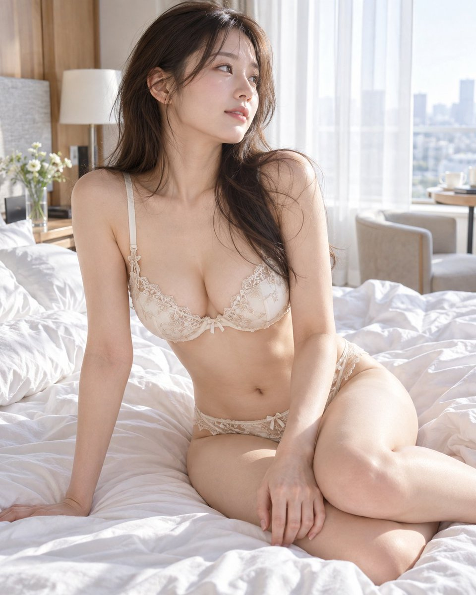
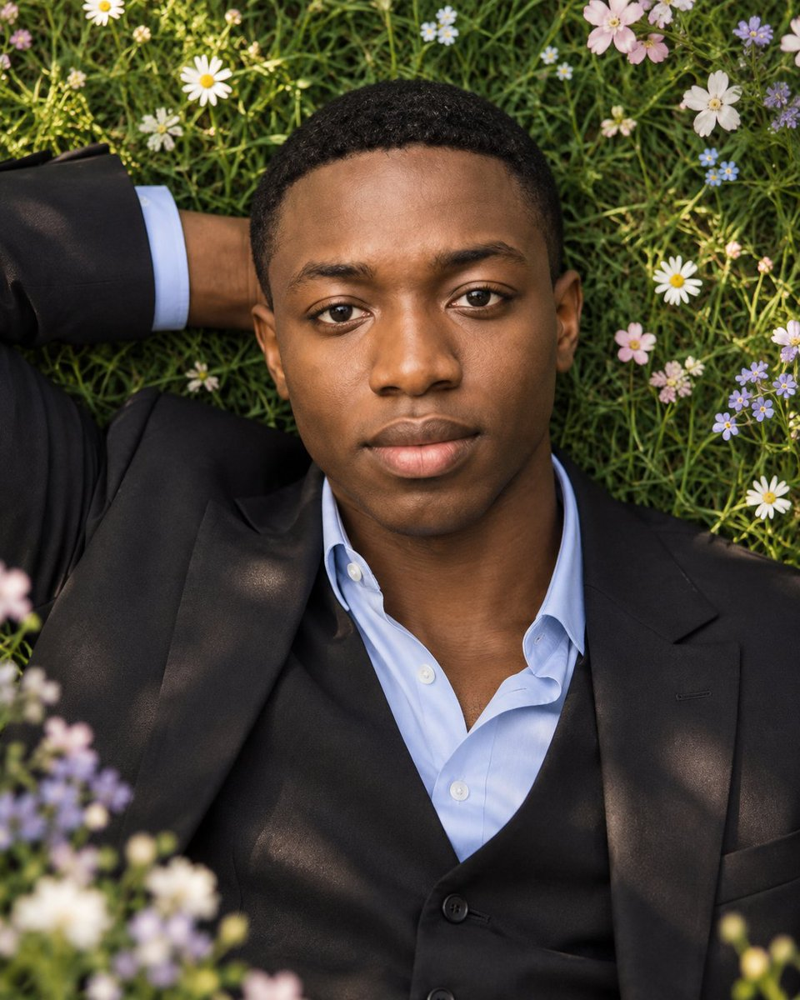
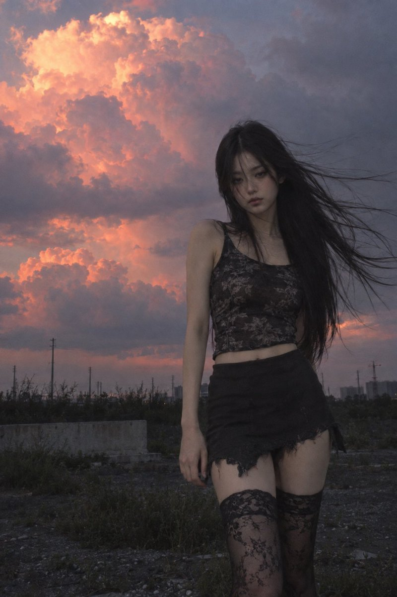
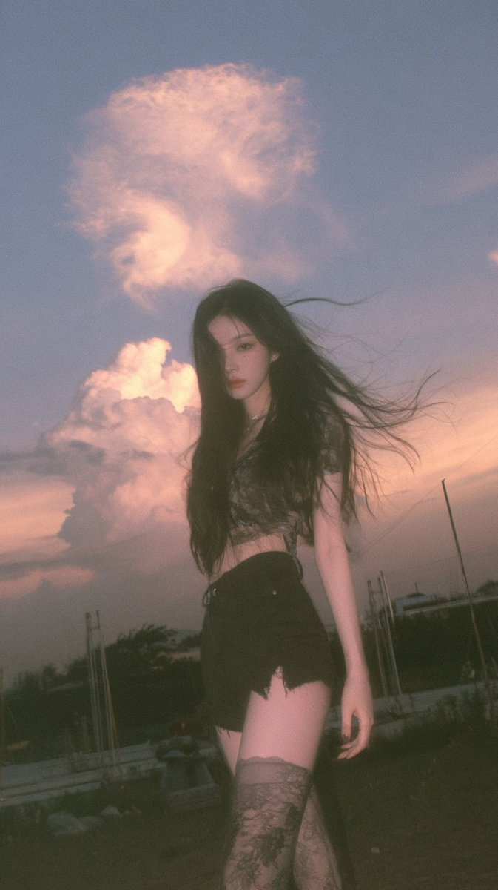

# その他 · プロンプト集 · Leadde.ai

[](README.md) [](README_zh.md) [](README_zh-TW.md) [](README_ja-JP.md) [](README_ko-KR.md) [](README_th-TH.md) [](README_vi-VN.md) [](README_hi-IN.md) [](README_es-ES.md) [-lightgrey)](README_es-419.md) [](README_de-DE.md) [](README_fr-FR.md) [](README_it-IT.md) [-lightgrey)](README_pt-BR.md) [](README_pt-PT.md) [](README_tr-TR.md)

**Best for:** Emerging visual AI prompts awaiting model verification, preserved with source attribution for early research.

For PDF, PPT, SOP, training, and multilingual video workflows:
[Awesome Document-to-Video](https://github.com/LeaddeOpenLab/awesome-document-to-video)

> **高品質なプロンプトを毎日厳選**

AI画像・動画・3D制作の完全なプロンプトを紹介します。スタイル別に探し、多言語版と原作者の出典を確認できます。

[Leadde.ai を見る →](https://leadde.ai/?utm_source=github&utm_medium=readme&utm_campaign=prompt-library&utm_content=uncategorized)

## Leadde.ai について

Leadde.ai は文書、スライド、テキストから、研修、新入社員教育、マーケティング向けのAIビジネス動画を作成するチームを支援します。

リポジトリにスターを付けて、毎日の厳選プロンプトから新しい創作のアイデアを見つけましょう。

**103** 件 · 最新の追加: **2026-09-12**

<a name="catalog"></a>

## カテゴリから探す

[写真撮影](#category-photography) · [シネマティック / フィルムスチル](#category-cinematic-film-still) · [アニメ / 漫画](#category-anime-manga) · [イラスト](#category-illustration) · [スケッチ / 線画](#category-sketch-line-art) · [コミック / グラフィックノベル](#category-comic-graphic-novel) · [3D レンダリング](#category-3d-render) · [レトロ / ヴィンテージ](#category-retro-vintage) · [サイバーパンク / SF](#category-cyberpunk-sci-fi) · [ミニマリズム](#category-minimalism) · [その他](#category-other)

<a name="all-prompts"></a>

<a name="category-photography"></a>

## 写真撮影

<a name="prompt-2098638290094305690"></a>

### 翻訳中

作者：[@muse\_ai\_prompt](https://x.com/muse_ai_prompt) · [元の投稿](https://x.com/muse_ai_prompt/status/2098638290094305690)

写真撮影 · キャラクター · 配信済み

**概要:** 翻訳中



**プロンプト**

```text
翻訳中
```

[↑ カテゴリに戻る](#catalog)

---

<a name="prompt-2098620113964679527"></a>

### フォーマルな装いで花が咲く芝生に横たわる男性のフォトリアリスティックなエディトリアルポートレート。

作者：[@abs\_uiux](https://x.com/abs_uiux) · [元の投稿](https://x.com/abs_uiux/status/2098620113964679527)

写真撮影 · ポートレート / セルフィー · キャラクター · 配信済み

**概要:** フォーマルな装いで花が咲く芝生に横たわる男性のフォトリアリスティックなエディトリアルポートレート。



**プロンプト**

```text
アップロードされた写真をメインの構図およびビジュアルリファレンスとして使用します。小さく可憐な花が散りばめられた青々とした芝生の上に心地よさそうに横たわる大人の男性を、フォトリアリスティックなエディトリアルポートレートとして描写してください。

顔、肩、上半身を中心に捉えるクローズアップの俯瞰／トップダウンアングルでフレームを構成します。頭部を構図の上部中央寄りに配置し、片腕を頭の後ろに曲げたリラックスしたポーズをとらせます。穏やかで自信に満ちた表情と、自然でかすかな笑みを浮かべ、カメラをまっすぐ見つめさせてください。

すっきりとした短いローカットのヘアスタイルで、整ったテーパーとシャープで自然な生え際、きれいに剃られた髭、滑らかで自然な肌の質感、バランスの取れた顔立ち、そして澄んだ表情豊かな瞳を持たせてください。

洗練されたダークカラーのフォーマルな衣装を着せます：ブラックの仕立ての良いテーラードブレザーにダークカラーのベストを重ね着し、襟元を開けたパリッとしたライトブルーのボタンダウンシャツを合わせます。ネクタイ、チェーン、ネックレス、イヤリングは着用しません。

豊かな緑の芝生と、散りばめられた小さな白、ペールピンク、ラベンダー、ブルーの花で彼を囲み、柔らかくロマンチックな庭園の雰囲気を演出します。奥行き感を高めるため、端の方の花はわずかにぼかしてください。

顔全体に繊細なハイライトを生み出す柔らかい自然光、穏やかな陰影、リアルな肌のトーン、浅い被写界深度を使用します。被写体の顔は極めてシャープに保ち、周囲の草や花は徐々に柔らかくボケさせます。

スタイル：ラグジュアリーファッションエディトリアル、映画のようなアウトドアポートレート、高級マガジンフォトグラフィー、リアルな肌のディテール、清潔感のある身だしなみ、鮮やかでありながら自然な色彩、柔らかな背景の分離、ハイダイナミックレンジ、85mmポートレートの質感、超高写実的、ハイディテール、8Kクオリティ。

構図：垂直4:5ポートレート、オーバーヘッドカメラアングル、クローズアップフレーミング、顔をメインの焦点にした、リラックスしたエレガントな雰囲気。
```

[↑ カテゴリに戻る](#catalog)

---

<a name="prompt-2098618384804176129"></a>

### トロピカルな屋外を背景に、なめらかなポニーテールを手にした女性の一眼レフ・クローズアップポートレート。

作者：[@oju689](https://x.com/oju689) · [元の投稿](https://x.com/oju689/status/2098618384804176129)

写真撮影 · ポートレート / セルフィー · キャラクター · 配信済み

**概要:** トロピカルな屋外を背景に、なめらかなポニーテールを手にした女性の一眼レフ・クローズアップポートレート。


**プロンプト**

```text
なめらかな高いポニーテールを結んだ美しい若い女性のクローズアップポートレート。片手を後頭部に回してポニーテールを持ち、自然な眉と長いまつげ、ナチュラルピンクの唇、ほんのり赤い頬、リアルな肌の質感を備えた輝く透明感のある肌、小さなゴールドのフープピアス。白い細ストラップのキャミソールを着用。

ポーズ：肩越しに振り返る横顔、腕を上げ、自信に満ちた自然な表情。

背景：ボケた緑のヤシの葉が広がるトロピカルな屋外、右側に白い質感のある壁、背後にヤシの木の幹、明るい昼光、自然光、浅い被写界深度、ボケ味。

ライティング：柔らかい自然な昼光、均一な肌のトーン、強い影なし、髪のリアルなハイライト。

スタイル：Canon EOS R5 と 85mm f/1.4 レンズを使用し f/2.2、ISO 100 で撮影された一眼レフ写真、瞳にシャープなピント、超詳細、8K、HDR、フォトリアリスティック、自然な色彩、フィルターなし、CGI感なし、本物の実在人物ポートレート、垂直 4:5 アスペクト比。

ネガティブ：ぼやけなし、テキストなし、文字なし、透かしなし、枠線なし、過度な加工なし。
```

[↑ カテゴリに戻る](#catalog)

---

<a name="prompt-2098584064567705813"></a>

### 翻訳中

作者：[@DDJCXX](https://x.com/DDJCXX) · [元の投稿](https://x.com/DDJCXX/status/2098584064567705813)

写真撮影 · ポートレート / セルフィー · キャラクター · 建築 / インテリア · 配信済み

**概要:** 翻訳中


**プロンプト**

```text
翻訳中
```

[↑ カテゴリに戻る](#catalog)

---

<a name="prompt-2098553866908533220"></a>

### 翻訳中

作者：[@Hamburgerai](https://x.com/Hamburgerai) · [元の投稿](https://x.com/Hamburgerai/status/2098553866908533220)

ポスター / チラシ · 写真撮影 · テキスト / タイポグラフィ · 配信済み

**概要:** 翻訳中


**プロンプト**

```text
翻訳中
```

[↑ カテゴリに戻る](#catalog)

---

<a name="prompt-2098535116545110425"></a>

### 黒いレザーコートを着て花の中に座るグランジ・スーパーモデルの超写実的なミディアムフルショット写真。

作者：[@ai\_vision\_2nd](https://x.com/ai_vision_2nd) · [元の投稿](https://x.com/ai_vision_2nd/status/2098535116545110425)

写真撮影 · 配信済み

**概要:** 黒いレザーコートを着て花の中に座るグランジ・スーパーモデルの超写実的なミディアムフルショット写真。


**プロンプト**

```text
満開の花畑に座る、魅惑的で豊満なプレイメイトスタイルのグランジ・スーパーモデルの女性を捉えた、超写実的なミディアムフルショット写真。柔らかく自然なボリューム感のある完璧な砂時計型の体型。髪型はアグレッシブなまでにシンプルかつ繊細で、柔らかく不揃いな毛先を持つショートからミディアムのチョッピーレイヤー。にじんだアイライナー、淡い唇、薄いそばかすといったミニマルでエキセントリックなグランジメイク。彼女は前が開いたロング丈のブラックレザーグランジコートを羽織っているが、ドレープの落ち感とフロントに自然に重なる大きな生花の花びらによって胸元は大部分が覆われており、鎖骨と細い垂直の肌のラインだけが見えている。ローライズのダメージ加工パンツがスタイルを完成させる。片膝を立て、両手で優しく花を抱えて胸元をさらに柔らかく隠すリラックスしたポーズ。花が開くたびに、灰色の世界に鮮やかで生き生きとした色彩が溢れ出し、彼女のコートや肌を染め上げる。被写体がフレームの大部分を占めている。この環境を取り入れた全身構図においても被写体は極めて精細で写実的であり、顔のシャープさ、毛穴、産毛、レザーの質感が完全に鮮明に保たれている。85mm、f/1.8、超現実的なカラーブルームを伴う柔らかな指向性ライト、女性美の芸術的で抑制された表現。
```

[↑ カテゴリに戻る](#catalog)

---

<a name="prompt-2098530398724915395"></a>

### ゴシック調のピンクと黒のレースランジェリーを身にまとい、輝く黄昏の花畑を歩く若い日本人女性のフォトリアリスティックなミディアムフルボディポートレート。

作者：[@ai\_vision\_2nd](https://x.com/ai_vision_2nd) · [元の投稿](https://x.com/ai_vision_2nd/status/2098530398724915395)

写真撮影 · ポートレート / セルフィー · キャラクター · ファッションアイテム · 配信済み

**概要:** ゴシック調のピンクと黒のレースランジェリーを身にまとい、輝く黄昏の花畑を歩く若い日本人女性のフォトリアリスティックなミディアムフルボディポートレート。


**プロンプト**

```text
ソフトでカワイイ表情を浮かべた美しい若い日本人女性の、フォトリアリスティックなミディアムフルボディのファッションカタログ写真。複数の黒いレースのリボンとパールのアクセントが飾られたボリューミーなウェーブがかったダークヘア、リアルで柔らかなボリュームと微細なキメを持つ自然で豊かな胸、リボンのディテールが施されたキュートでありながらゴシック調のペールピンクと黒のレイヤードレースランジェリーボトム、お揃いのサイストラップ、エレガントなゴシック厚底サンダルのみを着用。夕暮れ時、光球が浮かぶ幻想的で淡く輝く花畑の中をゆっくりと歩き、体をわずかに斜めに向け、片手でランジェリーのレースの端をつまみ上げ、視線はカメラを優しく見つめている。被写体はミディアムフルボディショットでフレームの大部分を占めている。このフルボディ構図でも極めて細部までリアルに表現されており、カミソリのようにシャープな顔立ち、目に見える毛穴や産毛、自然な胸の質感、精巧な多層レースのテクスチャが完全に描写されている。Canon EOS R5、70mm f/1.8レンズ、f/2.0で撮影、穏やかな光の滲み（ブルーム）を伴う柔らかな薄明かりのライティング、極めて写実的な肌と布地の微細テクスチャ。
```

[↑ カテゴリに戻る](#catalog)

---

<a name="prompt-2098490558474027231"></a>

### 翻訳中

作者：[@FuguiChen1314](https://x.com/FuguiChen1314) · [元の投稿](https://x.com/FuguiChen1314/status/2098490558474027231)

写真撮影 · ポートレート / セルフィー · ファッションアイテム · 配信済み

**概要:** 翻訳中


**プロンプト**

```text
翻訳中
```

[↑ カテゴリに戻る](#catalog)

---

<a name="prompt-2098398277095821330"></a>

### キャメルコートを着てフィラデルフィアのダウンタウンを歩くスタイリッシュな黒人男性の、超リアルな全身ストリートファッションポートレート用プロンプト。

作者：[@PrometheanAIX](https://x.com/PrometheanAIX) · [元の投稿](https://x.com/PrometheanAIX/status/2098398277095821330)

写真撮影 · ポートレート / セルフィー · キャラクター · ファッションアイテム · 街並み / ストリート · 配信済み

元の投稿：[@PrometheanAIX](https://x.com/PrometheanAIX) · [元の投稿](https://x.com/PrometheanAIX/status/2098384758145257614)

**概要:** キャメルコートを着てフィラデルフィアのダウンタウンを歩くスタイリッシュな黒人男性の、超リアルな全身ストリートファッションポートレート用プロンプト。


**プロンプト**

```text
フィラデルフィアのダウンタウンの歩道を、カメラに向かって堂々と歩く、ワイルドでハンサムな黒人男性の超リアルな全身ストリートファッションポートレートを作成してください。アスリート体型のマスキュリンな体つきで、ぴったりとした黒のベースボールキャップの下には短いダークヘア、綺麗に整えられたフルビアード、小さなフープピアス、そして落ち着いた真剣な表情を浮かべています。

衣装
幅広のラペルが特徴的なキャメルカラーのロングウールオーバーコートを前を開けて羽織り、インナーにはオーバーサイズの無地ホワイトTシャツを着用。ボトムスは片膝に大きなほつれたダメージ加工とさりげないユーズド加工が施された、リラックスフィットのライトウォッシュブルージーンズ。足元はクリーンな白のハイカットスニーカーでまとめ、ミニマルなロングゴールドペンダントネックレス、小さなピアス、存在感のあるゴールドの腕時計をアクセサリーとして合わせています。エフォートレスな男性らしさを漂わせる、ハイエンドで現代的なストリートウェアスタイルです。

ポーズ
カメラにまっすぐ向かって歩いてくる一歩の瞬間を捉え、片手はさりげなくジーンズのポケットに入れ、もう一方の腕は自然に下げています。コートは前が開き、歩調に合わせてわずかに揺れています。リラックスした自信に満ちたボディランゲージで、視線はカメラのわずかに先を見つめています。

環境
舞台はフィラデルフィアのセンターシティ。歴史ある石造りの建造物、タウンハウスの階段、黒い錬鉄製のフェンス、街路樹、街灯、交通量、歩行者、そしてブロード・ストリート（Broad Street）の地下鉄入口が広がっています。遠くにはフィラデルフィア市庁舎とその時計塔がはっきりと認識でき、自然な街の日常の瞬間でありながら、紛れもないフィラデルフィアらしさを醸し出しています。

撮影＆シネマトグラフィ
プレミアムな現代ストリートファッション写真、頭から爪先までの全身フレーミング、アイレベルの視点、50〜70mmレンズの描写を採用。暖かい午後の遅い日差しがキャメルコートに美しいハイライトを生み出し、顔に立体的で自然な光を描き出します。被写体は極めてシャープに保ちつつ、適度な背景のボケ味、リアルな肌や髭の質感、ウールやデニムの精細なディテール、自然な都市の奥行き、繊細なフィルム粒子、そして洗練されたエディトリアルなカラーグレーディングを実現してください。

除外要素：プラスチックのような偽物の肌、過度なレタッチ、大げさな筋肉、フォーマルすぎるスタイリング、過度なロゴ、不自然で硬いポーズ、無人の通り、不自然なランドマーク、過剰なボケ、CGI感、過飽和、ファッションドールのような質感。
```

[↑ カテゴリに戻る](#catalog)

---

<a name="prompt-2098396584879002102"></a>

### 個人のセルフィーをブラジルのリアリティ番組『A Fazenda 18』の参加者によるリアルな告知ポスターに変換するためのテンプレートプロンプト。出場者プロフィール欄と指定のカラーパレット規約が含まれます。

作者：[@balancogeral](https://x.com/balancogeral) · [元の投稿](https://x.com/balancogeral/status/2098396584879002102)

ポスター / チラシ · 写真撮影 · ポートレート / セルフィー · 配信済み

**概要:** 個人のセルフィーをブラジルのリアリティ番組『A Fazenda 18』の参加者によるリアルな告知ポスターに変換するためのテンプレートプロンプト。出場者プロフィール欄と指定のカラーパレット規約が含まれます。


**プロンプト**

```text
私のセルフィーを、リアリティ番組『A Fazenda 18』の出演者を紹介するリアルなプロモーション画像に変換してください。[NOME]、[CIDADE]、キャッチフレーズ、強み、弱み、そして決勝に進出する確率を含めてください。私の顔と自然な外見を忠実に維持してください。フォーマット4:5の写真、自然なポーズ、真っ直ぐな視線、控えめな田園風景の背景、柔らかな光、リアルな肌の質感、アシンメトリーなエディトリアル構図。カラーパレット：ピーチベージュ #f2ceb0、アクアグリーン #00ad9d、オレンジ #e98300。テキストは少なめに、ナチュラルな外観で、過度なレタッチやエフェクト、架空のロゴ、AI生成画像特有の不自然さがないようにしてください。
```

[↑ カテゴリに戻る](#catalog)

---

<a name="prompt-2098338457491800556"></a>

### 金餅が土の中で芽吹き金餅がたわわに実る大木へと成長し、その後に作業員が駆けつけて収穫しトラックに積み込む写実的なアニメーション動画生成プロンプト。

作者：[@abs\_uiux](https://x.com/abs_uiux) · [元の投稿](https://x.com/abs_uiux/status/2098338457491800556)

写真撮影 · キャラクター · 配信済み

**概要:** 金餅が土の中で芽吹き金餅がたわわに実る大木へと成長し、その後に作業員が駆けつけて収穫しトラックに積み込む写実的なアニメーション動画生成プロンプト。


**プロンプト**

```text
10秒の超リアルでシネマティックな縦型動画（9:16）を作成してください。
大雨の後、泥だらけの道端にリアルな金の延べ棒（ゴールドビスケット）が置き去りにされています。その周囲を雨水が流れ、物体は濡れた土の中へとゆっくり深く沈んでいきます。数秒のうちに、埋もれた物体が地下から光り始めます。まさにその場所から小さな緑の芽が現れ、急速に成長して成熟した巨大な金の延べ棒の木になります。太い幹と枝は、元の金の延べ棒の形状、質感、色、デザイン言語を自然に模しています。細部まで精巧に作られた何百もの熟した金の延べ棒が本物の果実のようにあらゆる枝にぶら下がり、風に優しく揺れています。
木の成長が終わるとすぐに、大型の貨物トラックが到着し、その横に停車します。1人の作業員が素早く木に登り、他の数人が枝からすべての金の延べ棒を手早く収穫し、素早くリアルな動作でトラックに投げ込みます。あっという間に木は完全に収穫されます。トラックは何百もの金の延べ棒で満載になり走り去り、後には空っぽになった木だけが残されます。
シングル連続ショット、リアルな雨模様、泥だらけの地面、シネマティックな照明、自然な風、信憑性のある物理演算、超詳細なテクスチャ、滑らかな成長アニメーション、シームレスな変化、カットなし、グリッチなし、ちらつきなし、余計なオブジェクトなし、8K、HDR、ハイパーリアリスティック、ドキュメンタリースタイルのリアリズム。" 注意：金の延べ棒は最初から最後まで同一であること。長方形であればすべてリアルな長方形にすること
```

[↑ カテゴリに戻る](#catalog)

---

<a name="prompt-2098291700355432939"></a>

### 車内の前席に座るスタイリッシュな若い女性のポートレート。黒のブレザーとライトウォッシュジーンズ、ブラウンのレザー内装と柔らかな自然光。

作者：[@afrinxai](https://x.com/afrinxai) · [元の投稿](https://x.com/afrinxai/status/2098291700355432939)

写真撮影 · ポートレート / セルフィー · キャラクター · ファッションアイテム · 車両 · 配信済み

元の投稿：[@afrinxai](https://x.com/afrinxai) · [元の投稿](https://x.com/afrinxai/status/2098230798759457070)

**概要:** 車内の前席に座るスタイリッシュな若い女性のポートレート。黒のブレザーとライトウォッシュジーンズ、ブラウンのレザー内装と柔らかな自然光。


**プロンプト**

```text
アップロードされた写真を成人女性の顔の同一性リファレンスとして使用してください。認識可能な顔の特徴、自然な肌のトーン、顔のプロポーション、そして全体的な外見を維持します。長いダークブラウンのウェーブヘアを持つ、シックでスタイリッシュな若い女性のポートレートで、自信に満ちた表情でまっすぐカメラを見つめています。彼女はブラウンのレザーシートが施された車のフロントシートに心地よく座り、ヘッドレストに背を預けています。服装は、ピークドラペル、目に見えるフロントボタン、胸ポケットのフラップが付いた仕立ての良い黒のブレザーに、ハイウエストのライトウォッシュデニムジーンズを合わせています。彼女の表情と、黒のブレザーおよびデニムジーンズの質感にピントがくっきりと合っています。脚はリラックスしており、ライトウォッシュのジーンズがはっきりと見えます。車内には明るいステッチが施されたブラウンのレザーシートと黒のドアパネルが写っています。車の窓越しには、緑の木々や茂みのぼやけた背景が見えます。自然な昼光は柔らかく、被写体を引き立てています。構図はミディアムショットで、浅い被写界深度により車のディテールや背景が柔らかくボケています。写真のクオリティは高解像度で、自然な色合いと質感を備えています。
```

[↑ カテゴリに戻る](#catalog)

---

<a name="prompt-2098283754599174194"></a>

### 翻訳中

作者：[@muse\_ai\_prompt](https://x.com/muse_ai_prompt) · [元の投稿](https://x.com/muse_ai_prompt/status/2098283754599174194)

写真撮影 · ポートレート / セルフィー · キャラクター · 配信済み

**概要:** 翻訳中


**プロンプト**

```text
翻訳中
```

[↑ カテゴリに戻る](#catalog)

---

<a name="prompt-2097889772899639317"></a>

### 翻訳中

作者：[@Soranlan](https://x.com/Soranlan) · [元の投稿](https://x.com/Soranlan/status/2097889772899639317)

写真撮影 · ポートレート / セルフィー · キャラクター · ファッションアイテム · 配信済み

元の投稿：[@Soranlan](https://x.com/Soranlan) · [元の投稿](https://x.com/Soranlan/status/2081181748478562704)

**概要:** 翻訳中


**プロンプト**

```text
翻訳中
```

[↑ カテゴリに戻る](#catalog)

---

<a name="prompt-2097888970994495736"></a>

### カメラに背を向けて起き上がり、それから立ち上がって振り向き、腕立て伏せを数回行う私を生成してください

作者：[@RSOXART](https://x.com/RSOXART) · [元の投稿](https://x.com/RSOXART/status/2097888970994495736)

写真撮影 · 配信済み

**概要:** カメラに背を向けて起き上がり、それから立ち上がって振り向き、腕立て伏せを数回行う私を生成してください


**プロンプト**

```text
カメラに背を向けて起き上がり、それから立ち上がって振り向き、腕立て伏せを数回行う私を生成してください
```

[↑ カテゴリに戻る](#catalog)

---

<a name="prompt-2097892780052013289"></a>

### ヘーゼルグリーンの瞳、アップスタイルの髪、フリル付きの白いドレスをまとった若い女性のリアルなスタジオポートレート。

作者：[@oju689](https://x.com/oju689) · [元の投稿](https://x.com/oju689/status/2097892780052013289)

写真撮影 · ポートレート / セルフィー · キャラクター · ファッションアイテム · 配信済み

**概要:** ヘーゼルグリーンの瞳、アップスタイルの髪、フリル付きの白いドレスをまとった若い女性のリアルなスタジオポートレート。


**プロンプト**

```text
自然で繊細な顔立ちの美しい若い女性の超リアルなクローズアップポートレート。かすかなそばかすとリアルな肌の質感を備えた柔らかく色白の肌、わずかに横を見つめる表情豊かなヘーゼルグリーンの瞳、自然に整えられた眉、柔らかなピンクの唇、そして穏やかで自信に満ちた表情。ダークブラウンの髪は、顔周りを縁取る自然な後れ毛を残した、ゆったりとしてエレガントな無造作アップヘアにスタイリングされている。繊細なフリル付きの半袖と優しくギャザーを寄せたネックラインが特徴のロマンチックな白い質感のドレスを身にまとい、小さなパールのディテールと小さなペンダントがあしらわれた繊細なゴールドのレイヤードネックレス、さらに上品なドロップイヤリングを身につけている。

柔らかく温かみのある自然なスタジオ照明、ニュートラルなベージュの背景、繊細な影、リアルな顔のプロポーション、細部まで描き込まれた髪の毛束、本物の毛穴と肌の質感、ナチュラルメイク、ソフトなチーク、映画のような写真、浅い被写界深度、85mmポートレートレンズ、f/1.8、ハイダイナミックレンジ、プロのファッションエディトリアル写真、フォトリアリスティック、超詳細、8K品質、CGIや人工的な見た目なし。
```

[↑ カテゴリに戻る](#catalog)

---

<a name="prompt-2097851840532783565"></a>

### 翻訳中

作者：[@Live\_life\_style](https://x.com/Live_life_style) · [元の投稿](https://x.com/Live_life_style/status/2097851840532783565)

写真撮影 · キャラクター · 車両 · 配信済み

**概要:** 翻訳中


**プロンプト**

```text
翻訳中
```

[↑ カテゴリに戻る](#catalog)

---

<a name="prompt-2097562587437342750"></a>

### パレイドリア（空想性錯視）を利用して、リアルなスマートフォンの写真テクスチャを維持しながら、参照写真内の既存の雲を動物そっくりな姿へとさりげなく変化させるためのマスタープロンプト。

作者：[@er1029iu](https://x.com/er1029iu) · [元の投稿](https://x.com/er1029iu/status/2097562587437342750)

写真撮影 · 動物 / 生き物 · 配信済み

**概要:** パレイドリア（空想性錯視）を利用して、リアルなスマートフォンの写真テクスチャを維持しながら、参照写真内の既存の雲を動物そっくりな姿へとさりげなく変化させるためのマスタープロンプト。


**プロンプト**

```text
雲のドッペルゲンガー（CLOUD DOPPELGÄNGER）— リアル写真マスタープロンプト

添付の元写真を固定参照画像として使用してください。

参照ロック — 極めて重要

元写真の特徴が認識可能であり、視覚的に一貫している必要があります。

以下を保持してください：
- 元の青空
- 実際の雲の配置
- 元のカメラアングル
- 斜めに横切る架空配線
- 窓の反射
- 既存の自然光
- 現実世界における不完全な写真のクオリティ
- 元の遠近感と構図

空全体を置き換えないでください。
シーンを再設計しないでください。
完全に新しい背景を作成しないでください。

--------------------------------------------------
ステップ 1 — 元の雲の分析
--------------------------------------------------

まず、添付写真の主となる雲を注意深く分析してください。

以下を調査します：

- 外側のシルエット
- 丸みを帯びた塊
- 突き出た部分
- 狭い部分
- 余白部分
- 自然なハイライトと影
- 雲の密度
- 方向
- 全体的な視覚的印象

次に、既存の雲が自然な状態で最も似ている実在の動物または馴染みのある生き物を特定します。

その類似性は「既存の雲の形状」から生まれたものでなければなりません。

無関係な動物を無理やり雲に押し込まないでください。

--------------------------------------------------
ステップ 2 — 自然なドッペルゲンガーの解釈
--------------------------------------------------

見る人の雲に対する知覚のみを変化させてください。

雲自体は、依然として「本物の雲」に見えなければなりません。

既存の雲の塊を、以下の自然な構造として活用してください：

頭部、
胴体、
耳、
鼻口部、
脚、
尾、
またはその他の認識可能な特徴。

元の雲のシルエットから自然に可能であると思われる特徴のみを強調してください。

見る人の反応は、次のようになるべきです：

「待って……あの雲、動物に見える。」

次のような反応であってはなりません：

「誰かが空に動物の画像を貼り付けた。」

--------------------------------------------------
リアルな雲を最優先
--------------------------------------------------

目指すべき視覚的バランス：

90〜95% の本物の雲
5〜10% の想像力をかき立てる類似性

雲は完全に以下のもので構成されている必要があります：

リアルな水蒸気、
柔らかな雲の粒子、
自然な大気による拡散、
不規則な雲の輪郭、
本物の太陽光、
かすかな立体的奥行き。

以下は絶対に生成しないでください：

空に浮かぶ毛皮で覆われた動物、
雲に貼り付けられたリアルな動物の顔、
アニメ風の目、
人間のような目、
完全に対称的な顔の特徴、
CGI毛皮、
プラスチックのような質感、
3Dマスコット風の外観。

--------------------------------------------------
顔 / キャラクターのディテール
--------------------------------------------------

顔のディテールが必要な場合、
それらは極めて控えめでなければなりません。

目は主に、自然な雲の影や微細なトーンの違いによって暗示されるべきです。

鼻や口は、雲の密度の極めてかすかな変化としてのみ現れることができます。

明らかな黒いボタンのような目は不可。
誇張された笑顔は不可。
アニメ風の舌は不可。
人工的な輪郭線は不可。

動物の類似性は、パレイドリア（錯覚現象）を通じて浮かび上がる必要があります。

--------------------------------------------------
本物の写真クオリティ
--------------------------------------------------

最終結果は、窓越しに撮影された自然なスナップ写真に見えなければなりません。

自然なiPhone写真。

広告写真やスタジオ写真ではなく、
中程度の画質のスマートフォンカメラのリアリズム。

以下を維持してください：

わずかな窓のグレア（まぶしさ）、
小さな反射、
軽微な露出の不完全さ、
自然な大気の霞み、
わずかに不均一なシャープネス、
リアルなダイナミックレンジ、
かすかなセンサーノイズ、
自然な色合いの変化。

過度なHDRは避けてください。
過度なシャープ化は避けてください。
人工的な彩度は避けてください。
```

[↑ カテゴリに戻る](#catalog)

---

<a name="prompt-2097519361909199023"></a>

### 夕暮れの澄み切った水面に仰向けで浮かぶ女性のフォトリアリスティックなミディアムクローズアップ。

作者：[@punkhuri1](https://x.com/punkhuri1) · [元の投稿](https://x.com/punkhuri1/status/2097519361909199023)

写真撮影 · キャラクター · 風景 / 自然 · 配信済み

**概要:** 夕暮れの澄み切った水面に仰向けで浮かぶ女性のフォトリアリスティックなミディアムクローズアップ。


**プロンプト**

```text
ミディアムクローズアップ、日没時の穏やかで透き通った水面に仰向けになって安らかに浮かぶ大人の女性を捉えたフォトリアリスティックなファインアート写真。

彼女はライトブルーのビキニトップとホワイトのボトムを着用している。目は優しく閉じられ、顔は夕空へと軽く上を向き、完全なリラックスを感じさせる。濡れた茶色の髪は頭の周りの水中に自然に広がっている。片方の腕は水面を伝って自然に外側へ伸び、脚は澄んだ水を通して柔らかく見えている。

水は非常に澄んでおり、沈みゆく太陽によって創り出された深い青、ターコイズ、ティール、温かみのある黄金色の美しい渦巻く反射が見られる。穏やかな波紋と繊細な光の屈折が彼女の体を包み込み、本物の自然な水の質感を生み出している。

構図の上部には、温かいオレンジ、琥珀色、柔らかな黄色を帯びた輝く夕暮れの空が広がり、下方の冷涼な青やターコイズブルーの水へと自然に移り変わっている。ゴールデンアワーの日光がシーン全体に温かな輝きをもたらし、水面にリアルなハイライトを描き出している。

自然な肌の質感、リアルな濡れ髪、物理的に正確な水面の反射と屈折、かすかな波紋、生き生きとした光と影、リアルな写真被写界深度、本物の肌と布地のディテール。

構図：女性の顔と上半身を主要な焦点とするミディアムクローズアップでありつつ、浮かんでいるポーズが分かるよう全身の十分な部分が見えている。温かい夕焼け空と色彩豊かな水面の反射との調和のとれた関係を維持。自然な視点、映画のようなフレーミング、浅めから適度な被写界深度、人工的なスタジオ感は皆無。

スタイル：高精細なプロフェッショナル・ファインアート写真、写実的な実写の質感、自然な色表現、映画的リアリズム、本物のゴールデンアワーの雰囲気、リアルな水面、物理的に正確なライティング、緻密な写真の細部、繊細なフィルム粒子、傑作クオリティ。
```

[↑ カテゴリに戻る](#catalog)

---

<a name="prompt-2097217893767303361"></a>

### 屋内のイベント会場で、襟ぐりの広いオーバーサイズTシャツを着たアッシュブラウンヘアの若い日本人女性が深く前かがみになりテーブルの上の紙にペンで書くリアルな写真プロンプト。

作者：[@kamakirin13993](https://x.com/kamakirin13993) · [元の投稿](https://x.com/kamakirin13993/status/2097217893767303361)

写真撮影 · キャラクター · 配信済み

**概要:** 屋内のイベント会場で、襟ぐりの広いオーバーサイズTシャツを着たアッシュブラウンヘアの若い日本人女性が深く前かがみになりテーブルの上の紙にペンで書くリアルな写真プロンプト。


**プロンプト**

```text
短いレイヤーカットのアッシュブラウンヘアの若い日本人女性が、下を見つめている。首元が大き開いたタイプのオーバーサイズなTシャツを着て、デニムジーンズを履いている。女性の前にはテーブルがあり、テーブルの上には白いコピー用紙が1枚ある。彼女は右手でペンを持っていて、立っている状態から深い前かがみになって紙に書こうとしている。左手はテーブルの上。背景は屋内のイベント会場。自然なライティング、自然な肌。服の自然な布感。肌の質感まで細かく描写されたリアルな写真スタイル、高解像度。
```

[↑ カテゴリに戻る](#catalog)

---

<a name="prompt-2097223313592316111"></a>

### マゼンタとシアンのデュアルライティングに照らされた、黒タートルネックと透明メガネ姿の男性の超リアルなスタジオポートレート。

作者：[@abs\_uiux](https://x.com/abs_uiux) · [元の投稿](https://x.com/abs_uiux/status/2097223313592316111)

写真撮影 · ポートレート / セルフィー · キャラクター · 配信済み

**概要:** マゼンタとシアンのデュアルライティングに照らされた、黒タートルネックと透明メガネ姿の男性の超リアルなスタジオポートレート。


**プロンプト**

```text
自信と深思に満ちた表情を浮かべた大人の男性の、超リアルなクローズアップスタジオポートレートを作成してください。胸から上のアングルで、高級感あふれるモダンなエディトリアルスタイルで撮影されています。

すっきりと整えられた黒のショートヘア。スタジオライトの繊細な反射が映る透明な長方形のメガネをかけています。

体にフィットした黒のタートルネックセーターに、構築的なラペルを持つ洗練された黒のテーラードブレザーを羽織らせてください。目立つジュエリーや不要なアクセサリーは一切身につけず、完全にミニマルかつモノトーンな服装に保ちます。

カメラからわずかに顔を背け、頭を軽く上に向けて視線をフレームの右上へと向けさせ、穏やかで知性にあふれ、前向きな野心を感じさせるムードを演出します。

ドラマチックなデュアルトーンのスタジオライティングを採用：左側からは鮮やかなマゼンタ/パープルのリムライトが彼の髪と顔を照らし、右側からは鮮烈なエレクトリックブルー/シアンの光が照らします。肌がリアルでディテールに富み、適切な露出を保てるよう、正面からは柔らかくニュートラルなライティングを当てます。

左側の深いパープルやマゼンタから右側のエレクトリックブルーへと美しく変化する豊かなグラデーションを持つ、ぼかした近未来的なスタジオ背景を作成します。視覚的な奥行きをさらに強調するため、背景の左下に斜めに光るネオンマゼンタのライトバーを追加してください。

リアルな肌の質感、細かな髭、シャープな瞳、自然な眼鏡の反射、くっきりとした布地のテクスチャ、映画のようなコントラスト、浅い被写界深度、滑らかで鮮やかなボケ味、プレミアムなパーソナルブランディング写真、ハイエンドな企業エディトリアル美学、超フォトリアリスティック、85mmポートレートレンズの描写、f/1.8、8Kディテール、垂直4:5の構図を強調してください。
```

[↑ カテゴリに戻る](#catalog)

---

<a name="category-cinematic-film-still"></a>

## シネマティック / フィルムスチル

<a name="prompt-2098605916199456804"></a>

### ダークアカデミアの図書館でアンティークデスクの傍らに佇むハンサムな若い男性のシネマティックなラグジュアリーポートレート。

作者：[@MohdAdnanA86218](https://x.com/MohdAdnanA86218) · [元の投稿](https://x.com/MohdAdnanA86218/status/2098605916199456804)

シネマティック / フィルムスチル · ポートレート / セルフィー · キャラクター · 配信済み

**概要:** ダークアカデミアの図書館でアンティークデスクの傍らに佇むハンサムな若い男性のシネマティックなラグジュアリーポートレート。


**プロンプト**

```text
ダークアカデミア様式の荘厳な図書館の中に自信に満ちて立つ、20代前半の際立ってハンサムな若い男性の超リアルでシネマティックな高級ファッション写真。彼は自然なウェーブがかかった無造作なボリューム感のある濃い漆黒の髪、力強く整った眉、深みのある表情豊かなダークブラウンの瞳、彫りの深いまっすぐな鼻、際立つ頬骨、シャープで男らしい顎のライン、そしてかすかな自然な無精ひげを蓄えている。黒のタートルネックの上に洗練されたダークブラウンのウールブレザーを羽織り、仕立てのよい黒のトラウザーとヴィンテージのレザーウォッチを身に着けている。
図書館には、古びた革装丁の本がぎっしり詰まったそびえ立つアンティークの木製本棚、古文書の山、ヴィンテージの木製机、華麗な真鍮ランプ、キャンドルのような温かみのある照明、そしてエレガントな古典建築が広がっている。温かみのある金色のランプが彼の顔を照らし出し、周囲の部屋は映画のような深い影へと落ち込んでいる。細い光の筋の中に埃の粒子がかすかに漂い、大気感のある知的なムードを作り出している。
彼はアンティークの木製デスクの横に立ち、開いたヴィンテージの本を手に持ち、片手を自然にページの上に置き、穏やかで知的、そしてミステリアスな表情で物思いにふけるようにカメラを見つめている。豊かなブラウンウッド、ダークマホガニートーン、温かみのある琥珀色の光、かすかなフィルムグレイン、劇的なキアロスクーロ、浅い被写界深度、リアルな肌の質感と毛穴、自然な顔のディテール、洗練されたエディトリアル構図、シネマティックなカラーグレーディング、85mmレンズ、f/1.8、HDR、超詳細、フォトリアリスティック、8K、プレミアムファッションエディトリアル写真、人工的またはAI感のある顔ではない。
```

[↑ カテゴリに戻る](#catalog)

---

<a name="prompt-2098476449212805468"></a>

### サンディエゴのピンクアワーのビーチで、音の振動が砂を揺らし生物発光プランクトンを輝かせるフィルム質感の連続ショット。

作者：[@jfischoff](https://x.com/jfischoff) · [元の投稿](https://x.com/jfischoff/status/2098476449212805468)

シネマティック / フィルムスチル · 動物 / 生き物 · 配信済み

**概要:** サンディエゴのピンクアワーのビーチで、音の振動が砂を揺らし生物発光プランクトンを輝かせるフィルム質感の連続ショット。


**プロンプト**

```text
フィルムカメラ。ニコン 35mm 富士カラーフィルム。高彩度。リアルでプロフェッショナルな写真。サンディエゴのピンクアワーのビーチから、音が砂を振動させ、海中の生物発光プランクトンが雲のような群れをなして光を放つ様子を捉えたワンカットの連続ショット。
```

[↑ カテゴリに戻る](#catalog)

---

<a name="prompt-2098392252137820636"></a>

### 角の生えた悪魔の触手を避け、「Baka」と言いながらエネルギーを纏わせたビーチサンダルで悪魔の顔面を叩く少女を描いたシネマティック実写ファンタジーのプロンプト。

作者：[@recehtuitt](https://x.com/recehtuitt) · [元の投稿](https://x.com/recehtuitt/status/2098392252137820636)

シネマティック / フィルムスチル · キャラクター · テキスト / タイポグラフィ · 配信済み

**概要:** 角の生えた悪魔の触手を避け、「Baka」と言いながらエネルギーを纏わせたビーチサンダルで悪魔の顔面を叩く少女を描いたシネマティック実写ファンタジーのプロンプト。


**プロンプト**

```text
[10秒 | 16:9 | 24fps | 1カットの連続シネマティックショット]  

リファレンス：
@image1 = レイカ（REIKA）マスター。認識可能な外見、プロポーション、長い黒髪、オーバーサイズの白Tシャツ、ダークカラーのカーゴショーツ、サンダル、ネックレス、衣装を維持。レイカは圧倒的な速度、反射神経、そして力みのない身体制御能力を持つ。彼女は片方のビーチサンダルを脱ぎ、手持ちの小道具として保持することができる。
@image2 = ヴォーン（VORN）マスター。認識可能な外見、通常の人型スケール、角、長い白髪、骨の尻尾、重層的な骨の鎧、ぼろぼろの淡色衣服を維持。ヴォーンは骨のような3本のオーラ触手を使い、極限のスピードで攻撃的な圧力をかける。

スタイル：最高峰のフォトリアリスティックIMAX実写ファンタジー、ARRI ALEXA 65 / RED V-RAPTOR XL、35mmアナモルフィック、Kodak Vision3 500T。深みのあるシアン・ティールのシャドウ、控えめなアンバー・オレンジのハイライト、暗い夜間のコントラスト、濡れて光を反射する路面、触感のあるマテリアル、リアルな重量感、自然なモーションブラー、繊細なフィルムグレイン。レイカの特徴的なエネルギーは、制御された漆黒と深紅の炎が絡み合うダークメタリックシルバー。環境：雨に濡れた夜のダウンタウンの街路、濡れたアスファルト、駐車中の車、ガラス張りの店舗、街灯、パニックに陥る群衆。ヴォーンの攻撃が外れるたびに道路は次第に砕け散り、水、ガラス、車両の残骸で埋め尽くされていく。

アクションタイムライン：  
[00:00–00:02.5] ビート1 — 軽やかな回避 レイカは冷静に片方のビーチサンダルを脱ぎ、片手で軽く保持し、その足は素足のままにする。ヴォーンは瞬時に3本の骨状オーラ触手を、収束する角度からレイカの胴体、頭部、脚に向けて放つ。レイカは決して反撃せず、極めてわずかで正確な動きで身体を軸にして曲げ、触手の間をすり抜ける。一撃ごとに数インチの差でかわされ、彼女の背後の濡れた道路を打ち砕く。カメラはレイカの肩の後ろから開始し、触手が彼女の正確な位置に向かうのをトラッキングし、攻撃が外れるたびに水とアスファルトが背後で爆発する中、彼女の回避リズムに合わせてタイトに旋回する。

アクセント：1本の触手がレイカの顔から数インチのところを通過する瞬間を0.2秒間スローモーションにし、その後瞬時に極限の速度へ戻る。レイカが落ち着きを保ったまま、ヴォーンが即座に次の猛攻へと連撃を繋ぐところで停止。

[00:02.5–00:05.0] ビート2 — 拡大する速度差 ヴォーンは再び3本すべての触手を、さらに速く、絶えず変化する角度から解き放ち、それぞれがレイカの実際の身体位置を正確に狙う。レイカは依然として攻撃せず、1本の下を滑り込み、もう1本を踏み越え、最後の一撃を無駄のない動きで回り込んで躱す。外れた攻撃が車、ガラス、アスファルトを引き裂き、彼女のすぐ背後に濃密な瓦礫の雲を作り出す。カメラはレイカとともに横方向のトラッキングを開始し、触手が彼女の周囲に迫るにつれて加速、瓦礫がフレームを満たす中で最後の衝突をウィップパンで捉える。レイカはその目くらましを利用して神速（God Speed）で短距離を空間移動し、瓦礫の中に濃い黒煙の軌跡を残しながら、ヴォーンが反応する前に悠然と彼の真横へ現れる。ヴォーンが鋭く彼女の方を振り向くカットで停止。

[00:05–00:07.5] ビート3 — 深紅と銀の炎 ヴォーンは至近距離から即座に再び攻撃を仕掛ける。レイカはその場にしっかりと足をつけ、脱いだビーチサンダルをただ掲げる。ダークメタリックシルバーのエネルギーがそれに巻き付き、銀のコアに漆黒と深紅の炎が縫い込まれるように交錯し、彼女の手の周りで急速に激しさを増す。周囲の光が深いシアン・ブラックの影に沈む中、雨と瓦礫が一瞬静止する。レイカは静かに「Baka」と呟く。深紅の炎で縁取られた次元的な銀と黒のエネルギーから、日本語の「バカ」という文字が彼女の横に具現化し、単なる画面上のテキストではなく大気中に物理的に存在する。迫り来る攻撃に向かって制御されたプッシュインで開始し、エネルギーが顕現するにつれてレイカの周囲をカーブしながら回り込み、そのまま彼女のスイング動作へと直結する。

アクセント：銀と黒のエネルギーがサンダルの周囲に圧縮される瞬間を0.2秒スローモーション。サンダルは即座にヴォーンの顔面に向かって超加速する。

[00:07.5–00:10.0] ビート4 — 一撃必殺 サンダルがヴォーンの顔面を直撃する。接触点で銀と黒のエネルギーが圧縮され、漆黒と深紅の炎が外側へ激しく爆発する。局所的な衝撃が猛烈な衝撃波を生み出し、雨、ガラス、塵、車両の残骸を街路一帯に撒き散らす。ヴォーンはその一撃で激しく仰け反り、急速に広がる黒い塵となって崩壊していく。スイングの勢いから開始し、正確な接触点へとプッシュイン、瓦礫が外側に広がるにつれて衝撃波とともに反動で引く。接触の瞬間のみ極めて短いマイクロ・スローモーションを適用し、その後はフルスピードのアクションに戻す。銀と黒のエネルギーと深紅の炎がフェードアウトする中、片足を素足のまま、もう片方のサンダルを履いた状態で不動の構えを保つレイカで終了。

連続性：レイカはビート1から2を通じて一切無傷であり、最後の一撃まで決して反撃しない。ヴォーンは常に攻撃姿勢を保つ。脱いだサンダルは最後の着弾までレイカの手の中に保持され、その足は終始素足のままである。外れた触手は段階的に周囲の環境を破壊し、カメラワークの遷移を動機づける。ビート2の瓦礫の中での移動によってレイカはヴォーンの真横に位置し、直接ビート3へと繋がる。最後の衝撃波は顔面への正確な接触点から発生する。

対象を絞った除外事項：3本の触手は常にレイカの実際の身体位置に向かって収束し、外れた場合はランダムに軌道を変えるのではなく彼女の背後の環境を破壊する。レイカの素足は素足のままであり、脱いだサンダルが再び履かれることはない。「バカ」の文字は平面的なオーバーレイではなく、シーン内の3次元的なエネルギータイポグラフィとして存在する。銀黒のエネルギーは普通の炎になることなく、常に漆黒と深紅の炎と絡み合っている。カメラはリセットやハードカットなしで連続した運動量に従い、各キャラクターは一貫して単一の存在として描かれる。

音声：激しい雨、触手が空を裂く音、アスファルトの衝撃音、割れるガラス、車両の破片、パニックに陥る群衆の声。レイカがエネルギーを具現化する際、環境音が一時的に圧縮される。彼女の静かな「Baka」という声は明瞭に聞こえる。最後の一撃は重厚な打撃音、拡大する衝撃波、雪崩のように崩れる瓦礫の音を生み出す。BGMなし。
```

[↑ カテゴリに戻る](#catalog)

---

<a name="prompt-2098436364849320190"></a>

### 月光とランタン、露天商が彩る水上ナイトマーケットのシネマティックなワンカットプロンプト。

作者：[@feesyiam](https://x.com/feesyiam) · [元の投稿](https://x.com/feesyiam/status/2098436364849320190)

シネマティック / フィルムスチル · 配信済み

**概要:** 月光とランタン、露天商が彩る水上ナイトマーケットのシネマティックなワンカットプロンプト。


**プロンプト**

```text
"「The Floating Night Market（水上ナイトマーケット）」のリファレンス画像に完全に準拠した、15秒間のシネマティックでフォトリアリスティックなワンカット映像を作成してください。

元の建築、水上に浮かぶ木製マーケットプラットフォーム、ランタンのデザイン、露天商、客、船、海、山々、カラーパレット、全体的な構図をそのまま維持してください。主要な要素の再設計や置き換えは行わないでください。

0〜3秒：暗い海面のすぐ上を、ゆっくりと滑らかなローアングルカメラの動きでスタートし、水上ナイトマーケットへと近づいていきます。何百もの温かく輝く提灯（ペーパーランタン）が夜風に優しく揺れています。その黄金色の反射が、波打つ水面に自然に煌めきます。小さな波が浮かぶプラットフォームの周りを静かに揺らします。

3〜7秒：カメラはゆっくりと上昇し、市場の中を前方へと進み、活気ある賑わいを映し出します。店主たちは小さな木製屋台で自然に料理を作り、湯気が立ち上る鍋を優しくかき混ぜたり、食材を焼いたりしています。リアルで微細な湯気がランタンの明かりの中へと立ち上ります。客たちは狭い木製の橋を何気なく歩き、会話を交わしながら見て回っています。ランタンはかすかに揺らめき、風に揺れています。

7〜11秒：途切れのない同一のカメラワークを維持し、市場の周囲をなだらかでシネマティックな弧を描くように動きます。伝統的な小舟が浮かぶプラットフォームの下をゆっくりと通り抜けます。舟の後ろには水面の波紋が広がります。屋台は温かいオレンジ色や琥珀色の光で輝き、冷たい青い月光が周囲の海を照らし出します。霧がかった山々の背後には、巨大な満月が見え続けています。

11〜15秒：ゆっくりと上方および後方へと引いていき、広大な海に囲まれた水上ナイトマーケット全体を捉える、よりワイドなシネマティックリビールを展開します。何百ものランタンが水上に輝く光の軌跡を描き出します。反射は波とともに自然に伸び、揺らぎます。月光が幻想的な雰囲気を醸し出す中、遠くの山々の周りを霧が静かに漂います。美しいワイドのエスタブリッシング・ショットで終了します。

ビジュアルスタイル：極めてフォトリアリスティック、シネマティックファンタジー、リアルな人間の動き、リアルな海と流体力学、精細な木材の質感、自然なランタンの光の輝き、ボリュメトリックな月光、微細な大気の霧、リアルな湯気、近接撮影時の浅い被写界深度、シネマティックな35mm写真、ハイダイナミックレンジ、極めて詳細、没入感のあるスケール、滑らかでプロフェッショナルなカメラワーク。

モーション：自然な人間の仕草、わずかな風の動き、優しく揺れるランタン、たなびく湯気、波打つ水、リアルな船の動き、誇張されたアニメーションなし。

カメラ：滑らかでスタビライズされたシネマティックカメラ、ゆっくりとした制御された動き、自然な被写界深度、緩やかなプッシュイン → 前方トラッキング → 緩やかなアーク移動 → ワイド引き。カットのない1つの連続ショット。

ネガティブプロンプト：シーンの切り替えなし、カットなし、ジャンプカットなし、カメラのブレなし、歪んだ顔なし、人物の重複なし、歪んだ建物なし。"
```

[↑ カテゴリに戻る](#catalog)

---

<a name="prompt-2098289889964183843"></a>

### 8つの映画的シーン、超リアルな8Kクオリティ、アクションスリラーの熱量 × プレミアムなフードTVCM美学、そしてハイスピードマクロフード撮影をフィーチャーした、上質でプレミアムな15秒縦型9:16のSambal Ekstra Pedasコマーシャルを制作してください。

作者：[@HeyRu0by](https://x.com/HeyRu0by) · [元の投稿](https://x.com/HeyRu0by/status/2098289889964183843)

プロダクトマーケティング · 写真撮影 · シネマティック / フィルムスチル · 食品・飲料 · 配信済み

**概要:** 8つの映画的シーン、超リアルな8Kクオリティ、アクションスリラーの熱量 × プレミアムなフードTVCM美学、そしてハイスピードマクロフード撮影をフィーチャーした、上質でプレミアムな15秒縦型9:16のSambal Ekstra Pedasコマーシャルを制作してください。


**プロンプト**

```text
8つの映画的シーン、超リアルな8Kクオリティ、アクションスリラーの熱量 × プレミアムなフードTVCM美学、そしてハイスピードマクロフード撮影をフィーチャーした、上質でプレミアムな15秒縦型9:16のSambal Ekstra Pedasコマーシャルを制作してください。

製品固定 — 極めて重要

CM全体を通して、提供された参照画像/動画と完全に一致するSambal Ekstra Pedasの製品を使用してください。

以下を完全に維持すること：

- ボトル/瓶の形状およびプロポーション
- キャップ/フタのデザイン
- ラベルのデザインと配置
- ブランドロゴ
- 製品名およびタイポグラフィ
- 色およびパッケージの詳細
- サンバルの色味とリアルなとろみ・粘度

パッケージを再設計、変更、歪曲、置換、複製、反転、あるいは勝手に創作しないでください。不正確なテキスト、ロゴ、ラベル、ブランディングを生成しないでください。最後のヒーローショットにはメインの製品パッケージを1つだけ配置してください。

ビジュアルスタイル

超リアル • シネマティック8K • プレミアムなグローバルFMCGフード広告 • アクションスリラー映画的カメラワーク • ドラマチックに制御されたライティング • リッチな赤唐辛子トーン • リアルな食品物理挙動 • 食欲をそそるツヤのあるサンバルの質感 • ハイスピード撮影 • マクロディテール • ダイナミックなカメラワーク • リアルなパーティクルおよび液体シミュレーション • シャープな製品フォーカス • 浅い被写界深度 • プレミアムなコマーシャルカラーグレーディング。

コンセプト

唐辛子の襲来 → 粉砕 → サンバルへと変化 → 渦巻（ボルテックス） → 製品のお披露目 → テクスチャー → 料理とのマリアージュ → ヒーローショット

---

01 | 0–1.5s — 唐辛子の襲来

映画の投擲物のようにカメラに向かって急激に発射される新鮮な赤唐辛子のエクストリームマクロショット。

最も近づいた瞬間、唐辛子はバレットタイムのスローモーションに入り、一瞬静止する。

複数の新鮮な赤唐辛子が異なる方向から突然中心に向かって集束する。

カメラ：24mmレンズ、アグレッシブなバックトラッキング ＋ 120°オービット、ダイナミックなパースペクティブ、制御されたモーションブラー。

ライティング：深い影を伴うドラマチックな赤いハイライト。

ムード：爆発的、強烈、予測不能。

---

02 | 1.5–3s — 唐辛子の粉砕

集束した唐辛子が衝突し、力強く映画的なインパクトとともに粉砕される。

新鮮な唐辛子の破片、種、液滴、微細な赤い粒子が、超リアルなハイスピードマクロスローモーションで外側へと弾け飛ぶ。

砕かれた唐辛子の混合物が、濃厚でツヤのあるサンバルのテクスチャーへと変化し始める。

カメラ：急激なプッシュイン → インパクト時の静止 → マクロオービット。

物理挙動：リアルな破砕、飛沫、種や粒子。人工的なCGI感は排除。

---

03 | 3–5s — サンバルへと変化

砕かれた唐辛子の混合物が、濃厚で鮮烈な赤いサンバルへとシームレスに変形する。

唐辛子の破片や種が目に見える、濃厚で具材感があり、光沢があって極めて食欲をそそるテクスチャーへと変化する。

サンバルがドラマチックな波を形成し、フレーム内をうねりながらカールする。

カメラ：マクロ85mmレンズ、極めて浅い被写界深度、スローモーションによるテクスチャーのお披露目。

フォーカス：リアルな粘度、唐辛子の繊維、種、オイルのハイライト、深みのある赤の色彩。

---

04 | 5–6.5s — 渦巻（ボルテックス）

サンバルの波が力強い赤い渦（ボルテックス）へと螺旋状に巻き上がる。

微細な唐辛子の粒子や液滴が周囲を公転しながら、渦が高速回転する。

渦の中心が開き、ドラマチックな登場空間を作り出す。

カメラ：360°マクロオービット ＋ 制御されたプルバック。

ライティング：ツヤのある鏡面ハイライトを備えたプレミアムなスタジオライティング。

トランジション：渦が自然に製品のシルエットを形作る。

---

05 | 6.5–8.5s — 製品のお披露目

赤い渦の中心から、リファレンスと完全に一致するSambal Ekstra Pedas製品が出現する。

微細な唐辛子粒子や繊細なサンバルの滴が周囲に舞い落ちて落ち着く中、製品がプレミアムなダークトーンの表面に完璧にまっすぐ着地する。

カメラは滑らかでシネマティックなプッシュインを行う。

製品は完全にシャープで歪みのない状態を維持しなければならない。

リファレンスのパッケージ、ラベル、ロゴ、タイポグラフィ、色彩、プロポーションを完全に維持すること。

---

06 | 8.5–10.5s — テクスチャー

サンバルのエクストリームマクロクローズアップへカット。

光沢のあるスプーンが濃厚なサンバルの中をゆっくりと通り抜け、その豊かなテクスチャーを露わにする。

視認できる要素：

- 本物の唐辛子の破片
- 唐辛子の種
- 自然な繊維
- ツヤのあるオイルハイライト
- 濃厚でチャンキーなとろみ
- 新鮮な赤色
```

[↑ カテゴリに戻る](#catalog)

---

<a name="prompt-2098265320448553176"></a>

### 打ち寄せる波から陽光が降り注ぐ崖に沿って上昇し、崖の端に立つ孤独な姿を捉える映画のようなカメラワーク。

作者：[@umesh\_ai](https://x.com/umesh_ai) · [元の投稿](https://x.com/umesh_ai/status/2098265320448553176)

写真撮影 · シネマティック / フィルムスチル · 風景 / 自然 · 配信済み

**概要:** 打ち寄せる波から陽光が降り注ぐ崖に沿って上昇し、崖の端に立つ孤独な姿を捉える映画のようなカメラワーク。


**プロンプト**

```text
カメラは荒れ狂う波の近く、水面すれすれの低い位置から始まり、ギザギザの岩に水しぶきが激しく打ち付けます。その後、滑らかで映画のような動きで険しい崖に沿って上昇し、日差しを浴びた崖の圧倒的な高さを現したのち、カメラが傾いて、下で唸りを上げる海を見下ろしながら断崖の端に堂々と立つ孤独な人物を捉えます。晴れ渡った青空の下、明るい日差しがシーンを照らし、くっきりと澄んだ視界、鮮やかな自然の色彩、きらめく水面、そして鋭く際立つ岩の質感を際立たせます。全体的な映像は映画のように壮大で力強く、ダイナミックな動きとドラマチックなスケール感を感じさせます。
```

[↑ カテゴリに戻る](#catalog)

---

<a name="prompt-2097951331667357808"></a>

### フォトリアルなチェイス撮影による、巨大な単発ジェットエンジンに跨がり狭い砂岩のスロットキャニオンを高速疾走する少年。

作者：[@ByronRexMatthe1](https://x.com/ByronRexMatthe1) · [元の投稿](https://x.com/ByronRexMatthe1/status/2097951331667357808)

写真撮影 · シネマティック / フィルムスチル · 配信済み

**概要:** フォトリアルなチェイス撮影による、巨大な単発ジェットエンジンに跨がり狭い砂岩のスロットキャニオンを高速疾走する少年。


**プロンプト**

```text
フレームの冒頭から、少年が巨大な単発ジェットエンジンに鞍のようにまたがり、両手をカウルに置き、身をかがめながら深いスロットキャニオンを急激なS字ターンで切り裂くように駆け抜ける。太い金属製タービンがウォッシュの大部分を占めている。前方に1基の巨大な丸いインテーク、後方に1基の轟音をあげるノズル、追加のスラスターも第2のエンジンもない。両側にはナバホ砂岩の狭い崖がそびえ立ち、オレンジ、錆色、クリーム色、焦げ茶色の縞模様を描き、鉄砲水が削り磨き上げたアンダーカットの滑らかな岩肌、黒い砂漠ワニスの筋、風食による窪み、垂れ下がるジュニパーの根、遥か上空には細いリボンのような空が見える。高い隙間から太陽光が差し込み、真昼の鋭い光、スロット内の長い青い影、ウォッシュ上の陽炎、アルカリ性の埃、ひび割れた泥、転がる丸石、漂白された流木、染み出た水が岩を濡らすわずかな緑。単一ノズルからは狂気的なエレクトリックブルーのアフターバーナー炎と濃密にうねる白と煤の煙が絶え間なく吐き出され続け、一度も途切れることなく、青い光が峡谷の壁を舐め、少年の埃まみれのバイザーを照らし出す。完全な実写フォトリアル：サンドブラスト加工されたタービンケーシング、リベット、熱変色した金属、へこんだインテークリップ、完璧ではない子供の肌、日焼け、汗、擦り切れた手袋、手持ち追従カメラ、フィルムグレイン、モーションブラー、塵を通すレンズフレア。カメラはスロット内を後方や横から追従し、壁が猛スピードで後方へと飛び去り、エンジンは激しくバンクし、巻き上がる砂煙と青い炎が峡谷を満たす。ダイエジェティックオーディオ（劇中音）のみ：轟音を立てるジェットの叫び、アフターバーナーの咆哮、金属に当たる砂の音、峡谷の反響、スロットを吹き抜ける風、音楽なし、歌なし、画面上のテキストなし。20秒間、ワンカットの長回し、峡谷の外に出ることはない。決してアニメ調ではなく、決してプラスチックのようなCGIではない。
```

[↑ カテゴリに戻る](#catalog)

---

<a name="prompt-2097920763529711752"></a>

### さまざまなムードやシチュエーションを横断するPhilips Hue Goポータブルテーブルランプの10秒間シネマティック縦型CMプロンプト。

作者：[@Urwa\_345](https://x.com/Urwa_345) · [元の投稿](https://x.com/Urwa_345/status/2097920763529711752)

シネマティック / フィルムスチル · 配信済み

**概要:** さまざまなムードやシチュエーションを横断するPhilips Hue Goポータブルテーブルランプの10秒間シネマティック縦型CMプロンプト。


**プロンプト**

```text
本物のPhilips Hue Goポータブルテーブルランプの映画のような10秒間のプレミアム広告を作成、縦型9:16。

0〜2秒：暗いモダンな部屋、ランプが柔らかく灯るにつれてカメラがゆっくりとランプに向かって前進。

2〜4秒：ランプの光るエッジのマクロクローズアップ、さまざまなアンビエントカラーへと滑らかに移り変わる。

4〜6秒：夕暮れ時のエレガントな屋外テーブルにランプが置かれる様子をカメラが追う。

6〜8秒：ランプが居心地の良いアンビエントな雰囲気を作り出すモダンな寝室へのスムーズなトランジション。

8〜10秒：最後のヒーローショット、美しい映画のようなライティングの中、Philips Hue Goの周りをゆっくりと360度カメラが回転。

フォトリアリスティックなCM、プレミアムブランド広告、リアルな照明効果、滑らかなカメラワーク、映画のような被写界深度、本物の製品デザイン、洗練されたプロフェッショナルなキャンペーン、テキストのオーバーレイなし、ウォーターマークなし。
```

[↑ カテゴリに戻る](#catalog)

---

<a name="prompt-2097904155801325715"></a>

### 東アジアのショートヘアに白シャツの美女が街を歩き思索するクローズアップショットと心の声の独白

作者：[@PixelAigc](https://x.com/PixelAigc) · [元の投稿](https://x.com/PixelAigc/status/2097904155801325715)

シネマティック / フィルムスチル · キャラクター · 街並み / ストリート · 配信済み

元の投稿：[@PixelAigc](https://x.com/PixelAigc) · [元の投稿](https://x.com/PixelAigc/status/2097690833684410515)

**概要:** 東アジアのショートヘアに白シャツの美女が街を歩き思索するクローズアップショットと心の声の独白


**プロンプト**

```text
肩までの長さのショートヘアで色白の冷たい肌を持つ20歳の東アジアの若い美女。彼女は白いシャツと黒いレザースカートを着て街を歩いている。正面からの上半身クローズアップ、大きな絞り値による背景ボケ、ゆっくりとズームインするカメラ。彼女は思索にふけりながら歩いており、ナレーションによる心の声独白：「今日、上司にどうやって休暇の申請をすればいいだろう？」文字なし、字幕なし、透かしなし
```

[↑ カテゴリに戻る](#catalog)

---

<a name="prompt-2097883008233865405"></a>

### ヴィンテージのオリーブグリーンの車の前部座席でくつろぐ成人男性を、低い広角アングルから捉えた超リアルなシネマティック・ファッションポートレート。

作者：[@CliQi\_AI](https://x.com/CliQi_AI) · [元の投稿](https://x.com/CliQi_AI/status/2097883008233865405)

シネマティック / フィルムスチル · レトロ / ヴィンテージ · ポートレート / セルフィー · キャラクター · ファッションアイテム · 車両 · 配信済み

**概要:** ヴィンテージのオリーブグリーンの車の前部座席でくつろぐ成人男性を、低い広角アングルから捉えた超リアルなシネマティック・ファッションポートレート。


**プロンプト**

```text
ヴィンテージのオリーブグリーンの車の前部座席でくつろぐ成人男性の超リアルなシネマティック・ファッションポートレート。助手席側の足元から低い広角パースペクティブで撮影されている。男性らしく、リラックスし、わずかに反抗的で、どこかノスタルジックな雰囲気を漂わせ、1970年代のロードトリップのエディトリアルを現代のファッションレンズを通して再解釈したような一枚。

彼は短め〜ミディアム丈のダークブラウンの髪で、緩やかな自然なカールがかかり、少し乱れて陽の光を浴びたような無造作なスタイル。凛々しい眉、くっきりとした頬骨、綺麗に剃られた顎髭、そして落ち着きつつも強い眼差し。わずかに気だるげで自信に満ちた視線が、まっすぐにカメラへと向けられている。

体型：自然に引き締まった胸筋、腹筋、肩、腕を持つ、無駄のないアスリート体型。リアルなプロポーション、繊細な肌の質感、かすかな体毛、そして温かみのある日焼けした肌。ボディービルダーのような筋肉ではなく、健康でナチュラルな肉体美を感じさせる。

服装：ダークネイビーまたはほぼ黒に近い軽量なボタンアップシャツを、前を完全に開けて着用し、素肌の胸と腹部を露出させている。シャツは半袖または無造作にロールアップされた袖で、ややシワの寄った生地が使い慣れた夏のラフな雰囲気を演出している。

これに、ゆったりとしたダークインディゴブルーのジーンズを合わせる。わずかにフレアまたはストレートのシルエット、ローライズのヴィンテージカット、控えめなフェード加工のテクスチャ。素足であることで、カジュアルなロードトリップのムードをさらに強調している。

ポーズ：ヴィンテージカーの広いフロントベンチシートに無造作に寝そべるように座っている。両脚はカメラに向かって自然に開かれ、片方の素足が下部前景でレンズのすぐ近くまで伸びており、ドラマチックなパースペクティブの歪みを生み出している。片腕はステアリングホイールに向かって伸び、手首がだらしなくその上にかかり、もう一方の腕はベンチシートの背もたれの上に置かれている。上体はやや後ろに倒れ、肩は開き、完全に脱力した姿勢。

車内：落ち着いたアボカドグリーンまたはセージグリーンの本格的なヴィンテージカーのキャビン。細身の大きなステアリングホイール、昔ながらのアナログダッシュボード、グリーンのビニールベンチシート、調和したドアパネル、経年変化したルーフライニング、クロームのディテール、手動のハンドル、そして少し使い込まれた内装生地を含む。ショールーム仕様にレストアされたものではなく、本物の古さと不完全さが感じられる車。

環境：葉の生い茂る木々、白っぽい木の幹、そして窓から見える明るい拡散光が差し込む、田舎または亜熱帯のどこかに駐車されている。外の風景はあくまで副次的な要素として、わずかに埃をかぶったガラス越しに柔らかく写る程度。

ライティング：フロントガラスやサイドウィンドウから差し込む暖かな自然光が、顔、胸、腕を照らし、車内の一部には柔らかな緑がかった影を残す。窓やダッシュボードには控えめな反射が見られる。強いスタジオ照明は排除。

撮影手法：親密感のあるヴィンテージファッション写真、24–28mm広角レンズ、助手席側の座席や床のすぐ近くの非常に低い位置に配置されたカメラ、強い前景のパースペクティブ、わずかなレンズの歪み、繊細なアナロググレイン、自然な肌の質感、暖かみのあるグリーンの色被り、ほのかな柔らかさ、映画のようでいて粗削り、写実的、高解像度。

構図：垂直3:4フレーム、ベンチシートの中央に位置する男性、左上前景を占めるステアリングホイール、右下端近くで大きくアウトフォーカスになった片方の素足、彼の胴体へと視線を導くグリーンのシートのライン、背景を縁取るフロントガラスと窓。

ネガティブプロンプト：現代の高級車、スポーツカーの内装、清潔な白い革、フォーマルな服、完全にボタンを留めたシャツ、スニーカー、サングラス、誇張されたボディビルの体型、ドラマチックな筋肉の力み、明るいスタジオの背景、ネオンライティング、強いフラッシュ、プラスチックのような肌、歪んだ手、余分な指、奇形の足、重複した手足、歪んだハンドル、カートゥーン、アニメ、イラスト、CGI。
```

[↑ カテゴリに戻る](#catalog)

---

<a name="prompt-2096832231071519193"></a>

### プッシュイン、マクロディテール、手作業での組み立て、回転する最終ショーケースを特徴とする、レゴ ボタニカル コレクションの10秒間・9:16シネマティックコマーシャル絵コンテ。

作者：[@Urwa\_345](https://x.com/Urwa_345) · [元の投稿](https://x.com/Urwa_345/status/2096832231071519193)

コミック / ストーリーボード · シネマティック / フィルムスチル · 製品 · 配信済み

**概要:** プッシュイン、マクロディテール、手作業での組み立て、回転する最終ショーケースを特徴とする、レゴ ボタニカル コレクションの10秒間・9:16シネマティックコマーシャル絵コンテ。


**プロンプト**

```text
レゴ ボタニカル コレクション（LEGO Botanical Collection）のシネマティックな10秒間のプレミアム製品広告を9:16縦型フォーマットで作成してください。

0〜2秒：木製のテーブルの上に美しく配置されたレゴ ボタニカルセットに向かってゆっくりとカメラがプッシュイン、柔らかな映画風のライティング。

2〜4秒：質感と精巧な職人技に焦点を当て、細部まで作り込まれたレゴの花のパーツへスムーズなマクロトランジション。

4〜7秒：フラワーアレンジメントを自然に組み立てる手元、テンポ良く心地よい動き、浅い被写界深度、エレガントなライフスタイルの雰囲気。

7〜10秒：モダンな部屋の中に完成したボタニカルアレンジメントを公開。温かみのある光が上質で心地よい雰囲気を演出する中、完成した製品の周りをカメラがゆっくりと回転。

スムーズなトランジション、リアルな動き、商業広告クオリティ、シネマティックな被写界深度、繊細なカメラワーク、高精細、プレミアムな製品写真スタイル、テキストのオーバーレイなし、透かしなし。
```

[↑ カテゴリに戻る](#catalog)

---

<a name="prompt-2096829877987291200"></a>

### 食材とともに宙に浮かぶ生のインスタントラーメン、沸騰した湯への投入、そして完成した盛り付けを見せるシネマティックな3Dコマーシャルシークエンス。

作者：[@1H77k](https://x.com/1H77k) · [元の投稿](https://x.com/1H77k/status/2096829877987291200)

シネマティック / フィルムスチル · 3D レンダリング · 食品・飲料 · 配信済み

**概要:** 食材とともに宙に浮かぶ生のインスタントラーメン、沸騰した湯への投入、そして完成した盛り付けを見せるシネマティックな3Dコマーシャルシークエンス。


**プロンプト**

```text
インスタントラーメンのダイナミックな3Dシネマティックコマーシャルショット。空中に浮かぶ生のラーメンの麺の塊を捉えた極限のスローモーションマクロショット。その周囲にはスライスしたミニトマト、スイートコーン、バジルの葉、ブラックオリーブ、チリフレークなどの新鮮な食材が舞っている。素朴なキッチンの背景に差し込む明るく自然なボリュメトリックサンライト。湯気が立ち上る熱湯の鍋に麺が落ちていき、湯気立つ美味しそうな一杯のラーメンへと変化するスムーズなトランジション。カメラがズームアウトすると、黄色いインスタントラーメンのパッケージが背景に置かれた温かみのあるキッチンのセットが現れる。超リアルなフードフォトグラフィー、8k解像度、映画のようなライティング、食欲をそそる色彩、1080x1920縦型フォーマット。

​宙に浮く食材と麺：

​シネマティックなフードフォトグラフィー、スライスされたトマト、ブラックオリーブ、バジルの葉、コーン、スパイスがスローモーションで舞い散りながら宙に浮かぶ生のインスタントラーメンの塊のマクロショット、温かい日差し、キッチンの背景、被写界深度、8k --ar 9:16

​沸騰したお湯へのトランジション：

​ステンレス鍋の沸騰した熱湯の中に沈んでいくインスタントラーメンの塊のクローズアップショット、立ち込める濃密な湯気の雲、底部に見える劇的な炎のしぶき、高エネルギー、鮮明なピント、超リアル --ar 9:16

​完成した器のプレゼンテーション：

​フレッシュハーブ、ミニトマト、オリーブが添えられた湯気立つ熱々の調理済みインスタントラーメンのボウル、フォークで持ち上げられた長い麺の束、ぼかした背景に見える黄色いMaggi風のインスタントラーメンの袋、温かく居心地の良い照明、プロフェッショナルなフード広告スタイル --ar 9:16
```

[↑ カテゴリに戻る](#catalog)

---

<a name="prompt-2097188060098101543"></a>

### 瓶へのプッシュインからトーストへのスプレッド、ヒーローショットまでのカット割りを含む、10秒間のシネマティックな縦型Nutellaコマーシャルプロンプト。

作者：[@Urwa\_345](https://x.com/Urwa_345) · [元の投稿](https://x.com/Urwa_345/status/2097188060098101543)

プロダクトマーケティング · シネマティック / フィルムスチル · 配信済み

**概要:** 瓶へのプッシュインからトーストへのスプレッド、ヒーローショットまでのカット割りを含む、10秒間のシネマティックな縦型Nutellaコマーシャルプロンプト。


**プロンプト**

```text
縦型9:16フォーマットで、高品質な10秒間のシネマティックなNutellaコマーシャルを作成してください。

0〜2秒：美しい朝食テーブルの上に置かれたNutellaの瓶へと、ゆっくりとシネマティックにカメラが寄っていく（プッシュイン）。

2〜4秒：温かいトーストの上に、クリーミーなNutellaがなめらかに塗られていくマクロショット。

4〜6秒：瓶からツヤのある渦を巻いたNutellaをスプーンですくい上げるクローズアップ。ゆっくりと心地よい動き。

6〜8秒：朝食テーブルに置かれる、Nutellaが塗られた完成トーストへの素早くエレガントなトランジション。

8〜10秒：トーストとヘーゼルナッツに囲まれたNutellaの瓶の決定的なヒーローショット。温かな朝の光と繊細なカメラワーク。

フォトリアリスティックなフードコマーシャル、高級広告品質、リアルな質感、スムーズなトランジション、浅い被写界深度、シネマティックなライティング、食欲をそそる自然な盛り付け、本物のパッケージ、テキストオーバーレイなし、透かしなし。
```

[↑ カテゴリに戻る](#catalog)

---

<a name="prompt-2096832293138726943"></a>

### 曇り空のビーチを裸足で歩く青年の映画のようなファッションエディトリアルポートレート。

作者：[@MohdAdnanA86218](https://x.com/MohdAdnanA86218) · [元の投稿](https://x.com/MohdAdnanA86218/status/2096832293138726943)

シネマティック / フィルムスチル · ポートレート / セルフィー · キャラクター · ファッションアイテム · 配信済み

**概要:** 曇り空のビーチを裸足で歩く青年の映画のようなファッションエディトリアルポートレート。


**プロンプト**

```text
劇的な曇り空の下、人里離れた誰もいないビーチに裸足で佇む、20代前半の驚くほど端正な顔立ちの青年の超リアルなシネマティック・エディトリアル写真。海風に少し乱された濃く自然なウェーブがかかった漆黒の髪、整った力強い眉、深みのある表情豊かなダークブラウンの瞳、彫刻のようにまっすぐな鼻、高い頬骨、シャープで男性的な顎のライン、うっすらとした自然な無精ひげ。リラックスした袖で襟元が少し開いた、海風になびくオーバーサイズのパリッとした白いコットンシャツに、ゆったりとしたニュートラルトーンのトラウザーを着用している。寄せては返す小さな波に、彼の足は濡れた砂を優しく踏みしめている。落ち着いたベージュ、グレー、オフホワイトのカラーパレット、柔らかく拡散した曇天の光、霞んだ地平線、穏やかな海、ミニマルで何もない周囲、静かでメランコリックな雰囲気、洗練されたラグジュアリーファッションのエディトリアル美学、自然な肌の質感、リアルな生地の質感、繊細なフィルムグレイン、浅い被写界深度、映画的な構図、85mmレンズ、写実的、超詳細、8K。
```

[↑ カテゴリに戻る](#catalog)

---

<a name="category-anime-manga"></a>

## アニメ / 漫画

<a name="prompt-2097918597603733849"></a>

### 金色のリボンの保護シールドや頭を撫でて抱きしめる動作を含む、ルフィとアーニャの交流を描くアニメ絵コンテ用プロンプト。

作者：[@Gopphybjwo](https://x.com/Gopphybjwo) · [元の投稿](https://x.com/Gopphybjwo/status/2097918597603733849)

コミック / ストーリーボード · アニメ / 漫画 · 配信済み

**概要:** 金色のリボンの保護シールドや頭を撫でて抱きしめる動作を含む、ルフィとアーニャの交流を描くアニメ絵コンテ用プロンプト。


**プロンプト**

```text
10–15 秒｜アイテム発動：ラーキーが自ら舞い上がり手首に巻き付く
金色のリボンが自動的にルフィの手首に巻き付き、保護シールドが広がり、Anya の目が星になる。
15–20 秒｜感情のクライマックス：優しいお兄ちゃんの頭ぽんぽん＋ハグ
ルフィが真剣に Anya の頭を撫で、Anya が胸に飛び込み、金色のハートの光に包まれる。
```

[↑ カテゴリに戻る](#catalog)

---

<a name="category-illustration"></a>

## イラスト

<a name="prompt-2098677881375236337"></a>

### 教師テーマの衣装イラスト用プロンプト（フリルブラウス、ペンシルスカート、教鞭など）。

作者：[@AI\_Kei75](https://x.com/AI_Kei75) · [元の投稿](https://x.com/AI_Kei75/status/2098677881375236337)

イラスト · キャラクター · ファッションアイテム · 配信済み

**概要:** 教師テーマの衣装イラスト用プロンプト（フリルブラウス、ペンシルスカート、教鞭など）。


**プロンプト**

```text
teacher, white collared shirt, frilled blouse, long sleeves, collarbone, no neckwear, heart necklace, black belt, (black pencil skirt), miniskirt, dark brown pantyhose, high heels, holding, pointer, stick,
```

[↑ カテゴリに戻る](#catalog)

---

<a name="prompt-2096970899622948972"></a>

### コットン紙に描かれた手描きのガッシュ・カリカチュアスタイル、グリーン、ピンク、クリームのトーン。

作者：[@MissDelulu9](https://x.com/MissDelulu9) · [元の投稿](https://x.com/MissDelulu9/status/2096970899622948972)

イラスト · ポートレート / セルフィー · 配信済み

**概要:** コットン紙に描かれた手描きのガッシュ・カリカチュアスタイル、グリーン、ピンク、クリームのトーン。


**プロンプト**

```text
写真をクリーム色のコットン紙に描かれた手描きのガッシュ風カリカチュア（似顔絵）に変換してください。人物の正確な同一性、自然な左右非対称性、主要な顔の特徴、髪型、体格、元の衣装を維持します。大胆でフラットな形状、自信に満ちた輪郭線、目に見える紙の質感、微妙な顔料のテクスチャを使用してください。表情豊かな態度、大きく誇張されたグラフィックな目、ダイナミックな上半身のポーズによる様式化されたプロポーション。カラーパレット：セージ/オリーブグリーン、ローズピンク、温かみのあるクリーム色を均等に配合。リアル調、アニメ顔、美化、肌補正、3Dシェーディング、テキスト、ロゴ、雑然とした要素は禁止。明らかに本人であり、明らかに絵画であること。
```

[↑ カテゴリに戻る](#catalog)

---

<a name="category-sketch-line-art"></a>

## スケッチ / 線画

<a name="prompt-2098371221184495917"></a>

### 上部に写真、下部にフランス語のメモ付きクレヨンスケッチを配置した分割エディトリアル比較ポスターを作成。

作者：[@Weilnes](https://x.com/Weilnes) · [元の投稿](https://x.com/Weilnes/status/2098371221184495917)

ポスター / チラシ · 写真撮影 · スケッチ / 線画 · 配信済み

**概要:** 上部に写真、下部にフランス語のメモ付きクレヨンスケッチを配置した分割エディトリアル比較ポスターを作成。


**プロンプト**

```text
上部と下部がすっきりとした直線の中央線で正確に50/50に分割された、プレミアムな縦型エディトリアル比較ポスターを作成してください。上半分：自然光、本物の質感、わずかな雑誌品質のカラーグレーディングのみを施した[SUBJECT]のフォトリアリスティックな旅行写真 — 写真はリアルに保ち、上半分をイラスト化しないでください。下半分：温かみのある白の質感紙に描かれた同じ被写体のまばらな黒のクレヨンによるジェスチャースケッチ研究 — ためらいがちで途切れ途切れのクレヨンの輪郭線、不完全な塗り、紙の目、写真から抽出した1〜2箇所の薄いクレヨンカラーのぼかし。背景はほぼすべて削除し、かすかな地面のラインまたは壁の気配のみを残します。被写体はほとんどが紙の白さを活かしたネガティブスペースで、完全に塗りつぶされていません。被写体は下部の幅の約38〜58%を占め、下部中央に配置。連続する温かみのある白の余白は55%以上。読みやすく手書きされた震えるクレヨン調のフランス語テキスト：短いタイトル、« ÉTUDE CRAYON 0N »、およびフランス語での1つの客観的観察。英語テキストはなし。細かい毛並みのディテール、可愛いベクターマスコット、全面塗り、密集した落書き、完全な背景、滑らかなデジタル鉛筆、製品イラスト、ロゴ、署名、透かしは避けてください。被写体候補：un chat roux sur les pavés (PAUSE RUE / ÉTUDE CRAYON 01)、valises empilées près de la porte (PRÊT À PARTIR / ÉTUDE CRAYON 02)、un vélo contre le mur (ATTENTE / ÉTUDE CRAYON 03)、une tasse encore chaude (PETITE PAUSE / ÉTUDE CRAYON 04)。
```

[↑ カテゴリに戻る](#catalog)

---

<a name="prompt-2097875834103287904"></a>

### 翻訳中

作者：[@Hamburgerai](https://x.com/Hamburgerai) · [元の投稿](https://x.com/Hamburgerai/status/2097875834103287904)

スケッチ / 線画 · 水彩 · 配信済み

**概要:** 翻訳中


**プロンプト**

```text
翻訳中
```

[↑ カテゴリに戻る](#catalog)

---

<a name="category-comic-graphic-novel"></a>

## コミック / グラフィックノベル

<a name="prompt-2098359042234351871"></a>

### 非対称な大きな目、大きな鼻、大きな耳、おどけた笑みを持ち、スタジオリムライティングで照らされた、3D誇張コメディスタイルの成人女性風刺画ポートレート。

作者：[@Tanvir48992](https://x.com/Tanvir48992) · [元の投稿](https://x.com/Tanvir48992/status/2098359042234351871)

コミック / グラフィックノベル · 3D レンダリング · ポートレート / セルフィー · キャラクター · 配信済み

元の投稿：[@Tanvir48992](https://x.com/Tanvir48992) · [元の投稿](https://x.com/Tanvir48992/status/2098292936064844224)

**概要:** 非対称な大きな目、大きな鼻、大きな耳、おどけた笑みを持ち、スタジオリムライティングで照らされた、3D誇張コメディスタイルの成人女性風刺画ポートレート。


**プロンプト**

```text
[認識可能な人間の特徴を保ちながら、極端にコミカルな顔の誇張を取り入れた、成人女性の独創的で高度に様式化された3D風刺画ポートレートを作成してください。劇的に大きすぎる頭部、極端に不均等な顔のプロポーション、大きく非対称に出っ張った目、誇張された曲がった鼻、大きすぎて垂れ下がった耳、そして不揃いな歯が並ぶ巨大なおどけた笑みを与えてください。

誇張の下にある顔の構造は信憑性を保ち、表情豊かな眉毛、自然な顔のシワ、不均一な肌の質感、目に見える毛穴、微妙なシミ、そしてリアルな不完全さを備えている必要があります。毛先がさまざまな方向に突き出た、無秩序で縮れたダークヘアを与えてください。

物理的に信憑性のある肌、髪、歯、素材を備えた、セミリアリスティックで高精細な3Dの美学でキャラクターをレンダリングしてください。背後および側面からの劇的なスタジオリムライティングを使用し、シワ、質感、顔の輪郭を強調しながら、髪や耳の周りに明るいハイライトを作り出します。顔がはっきりと見えるように、柔らかい正面のフィルライトを追加してください。

シンプルな中間色のスタジオ背景で、構図はミニマルかつすっきりと保ってください。キャラクターを縦型の9:16ポートレートとして枠に収め、中央にタイトに配置し、巨大な頭部が画像を支配するようにします。

雰囲気：不条理、面白い、奇妙、遊び心がある、誇張された、わずかにグロテスク、そして視覚的に記憶に残る。

認識可能な著作権のあるキャラクター、有名人の似顔絵、既存の芸術作品、ロゴ、透かし、テキスト、プラスチックのような肌、過度なCGIの光沢、重複した顔の特徴、余分な目、余分な四肢、変形した手、歪んだ歯、不鮮明な詳細、低解像度、不自然な解剖学的構造は避けてください。]
```

[↑ カテゴリに戻る](#catalog)

---

<a name="category-3d-render"></a>

## 3D レンダリング

<a name="prompt-2097725977443131648"></a>

### 写真を高級商品パッケージに入ったコレクターズ・アクションフィギュアへと変換し、人物の特徴や関連するミニチュアアクセサリーを含む3Dレンダリングおよび製品写真スタイルのプロンプト。

作者：[@SylviaTiongX](https://x.com/SylviaTiongX) · [元の投稿](https://x.com/SylviaTiongX/status/2097725977443131648)

写真撮影 · 3D レンダリング · キャラクター · 製品 · 配信済み

**概要:** 写真を高級商品パッケージに入ったコレクターズ・アクションフィギュアへと変換し、人物の特徴や関連するミニチュアアクセサリーを含む3Dレンダリングおよび製品写真スタイルのプロンプト。


**プロンプト**

```text
この写真をコレクターズ・アクションフィギュアに変換してください。人物の認識可能な顔立ちや髪型をそのまま維持します。高級感のある小売用商品パッケージにフィギュアを収め、その人の趣味に関連するミニチュアアクセサリーを同梱してください。プロの製品写真スタイル、リアルな質感、遊び心のあるディテール、洗練された3Dレンダリング効果を採用してください。
```

[↑ カテゴリに戻る](#catalog)

---

<a name="prompt-2097507029858300297"></a>

### 金色のベストを着たキツネの赤ちゃんと子鹿が霧の石畳に佇む、幻想的な3D CGIファンタジーイラスト。

作者：[@RockGrokAI](https://x.com/RockGrokAI) · [元の投稿](https://x.com/RockGrokAI/status/2097507029858300297)

イラスト · 3D レンダリング · キャラクター · 配信済み

**概要:** 金色のベストを着たキツネの赤ちゃんと子鹿が霧の石畳に佇む、幻想的な3D CGIファンタジーイラスト。


**プロンプト**

```text
霧が立ち込める岩山の風景の中、ひび割れた石畳の上に寄り添って立つ愛らしいキツネの赤ちゃんと優しい子鹿を描いた、幻想的な3D CGIファンタジーイラスト。ふわふわしたキツネの赤ちゃんは、白のアクセントが入った鮮やかなオレンジ色の毛並み、ふさふさした尾、輝く大きなエメラルド色の瞳、黄金色に尖った頭の毛束を持ち、華麗な刺繍が施された金色のベストを着ています。キツネが見上げている子鹿は、白い斑点のある柔らかな薄茶色の毛並み、表情豊かな大きな瞳、そして愛らしい表情をしています。霧深いもや、暗い岩肌の崖、節くれだった木々、瑞々しい紫のラベンダーの花が二人を取り囲んでいます。柔らかなボリュームライティング、緻密な毛並みのテクスチャ、鮮やかな紫色が映える豊かなアースカラー、映画のような奥行き、そして魅惑的で心温まる雰囲気。
```

[↑ カテゴリに戻る](#catalog)

---

<a name="prompt-2097514564875104516"></a>

### 効率的で美しいデザインを備えた、6台のNvidia Spark用サーバーラックを作成してください。

作者：[@VKs\_Host](https://x.com/VKs_Host) · [元の投稿](https://x.com/VKs_Host/status/2097514564875104516)

3D レンダリング · 配信済み

**概要:** 効率的で美しいデザインを備えた、6台のNvidia Spark用サーバーラックを作成してください。


**プロンプト**

```text
効率的で美しいデザインを備えた、6台のNvidia Spark用サーバーラックを作成してください。
```

[↑ カテゴリに戻る](#catalog)

---

<a name="category-retro-vintage"></a>

## レトロ / ヴィンテージ

<a name="prompt-2098642413879513410"></a>

### 翻訳中

作者：[@DDJCXX](https://x.com/DDJCXX) · [元の投稿](https://x.com/DDJCXX/status/2098642413879513410)

写真撮影 · レトロ / ヴィンテージ · ポートレート / セルフィー · キャラクター · 配信済み

元の投稿：[@zhengjunting920](https://x.com/zhengjunting920) · [元の投稿](https://x.com/zhengjunting920/status/2098596945183014933)

**概要:** 翻訳中





**プロンプト**

```text
翻訳中
```

[↑ カテゴリに戻る](#catalog)

---

<a name="prompt-2098589129512747309"></a>

### 日付スタンプ付きの80年代ヴィンテージ衣装を着た金髪の若い女性の、1985年図書館でのキャンディッドポートレート。

作者：[@Milliekio](https://x.com/Milliekio) · [元の投稿](https://x.com/Milliekio/status/2098589129512747309)

写真撮影 · レトロ / ヴィンテージ · ポートレート / セルフィー · キャラクター · ファッションアイテム · 配信済み

**概要:** 日付スタンプ付きの80年代ヴィンテージ衣装を着た金髪の若い女性の、1985年図書館でのキャンディッドポートレート。


**プロンプト**

```text
上の画像を顔の参照として使用してください。顔の構造、プロポーション、特徴、表情を完全に維持し、一貫したアイデンティティを保ちます。同じ若い女性を捉えた1985年の図書館での超リアルなキャンディッドポートレートで、同一で認識可能な顔の特徴、肌のトーン、自然な質感を維持します。彼女は背の高い木製の本棚の間に立ち、何冊かの本を腰元に抱えながら本の背表紙に触れ、穏やかにカメラを見つめています。大きめのバーガンディのシュシュで留めたハイポニーテールのブロンドのロングヘア、ゆるいカール、赤いフープイヤリング、控えめな80年代のグラムメイク、バラ色の頬、そして艶やかなヌードリップ。白い襟付きブラウス、ハイウエストの赤と緑のチェック柄スカート、クロップド丈のブルーデニムジャケット、バーガンディのショルダーバッグを身に着けています。温かみのある図書館の照明、ヴィンテージの本、地球儀、ポスターが1980年代の雰囲気を演出します。35mmスナップショット、ほのかなフラッシュ、アナロググレイン、色あせた暖色系、埃、傷、ソフトフォーカス、擦れた枠、そして赤い日付スタンプ「MAR 10 1985」。
```

[↑ カテゴリに戻る](#catalog)

---

<a name="prompt-2098562484604989642"></a>

### 星空を背景に、レトロな空飛ぶ円盤の青いトラクタービームの中に浮かぶネオンテキスト「STAY WEIRD」。

作者：[@heathergreen](https://x.com/heathergreen) · [元の投稿](https://x.com/heathergreen/status/2098562484604989642)

レトロ / ヴィンテージ · 配信済み

**概要:** 星空を背景に、レトロな空飛ぶ円盤の青いトラクタービームの中に浮かぶネオンテキスト「STAY WEIRD」。


**プロンプト**

```text
ダークな星空に浮かぶクラシックでレトロなクローム製空飛ぶ円盤から放たれる鮮やかな青いトラクタービームの中に、太字のネオンテキスト「STAY WEIRD」が浮かんでいる、ドラマチックな照明、ヴェイパーウェイヴカラー、映画のような構図、フィルムグレインとマットカラー効果を備えた高解像度デジタルイラストレーション。
```

[↑ カテゴリに戻る](#catalog)

---

<a name="prompt-2098382221514334261"></a>

### 旅行写真を基に3:4縦型ポスターを生成し、元の写真とヴィンテージな銅版エッチング調の切手カードを斜めに重ねて対比陳列する。

作者：[@Hamburgerai](https://x.com/Hamburgerai) · [元の投稿](https://x.com/Hamburgerai/status/2098382221514334261)

ポスター / チラシ · レトロ / ヴィンテージ · 配信済み

**概要:** 旅行写真を基に3:4縦型ポスターを生成し、元の写真とヴィンテージな銅版エッチング調の切手カードを斜めに重ねて対比陳列する。


**プロンプト**

```text
アップロードされたランドマークの旅行写真をもとに、3:4縦型の「ランドマーク・エッチング切手対照」エディトリアルポスターを作成してください。

上下の二連配置にはしないでください。背景には一面の温かみのあるアイボリー色の非塗工紙を使用し、斜めに重ね合わされた2枚の実体紙カードのみを配置します：

背面左側には小さめの実物写真カードを配置し、ポスター幅の約36%〜44%を占め、反時計回りに約3〜6度回転させます。元の写真のランドマーク、観察アングル、建築構造、季節、天候、光、環境、色彩を完全かつ明確に残し、軽微な出版物向けのカラー調整のみを許可します。写真カードには細い無地の余白とわずかな紙の厚みを持たせ、装飾的な縮小サムネイルにしてはいけません。

前面右側には大きめの縦型エッチング切手を配置し、ポスター幅の約58%〜68%を占め、時計回りに約2〜4度回転させ、写真カードの一部を自然に覆い隠すようにします。切手には厚手の温かみのある白い古紙を使用し、外側の4辺すべてに完全に同一の孔径、間隔、深さ、形状を持つ規則的な半円形の型抜き目打（ミシン目）を施し、四隅も同じ規則性を保ちます。紙の断面、繊維、自然な接地シャドウを表現し、華美な飾り枠は使用しないでください。

切手の内部は同じ写真に基づいてランドマークのみを再構築し、写真の複製品をそのまま入れてはいけません。ランドマーク本来の観察アングル、主構造、向き、比率、天候、環境の季節を維持し、ランドマークおよび樹木線、水面、山体、岩のフレーム、道路、隣接する建物などの主要な環境要素を1〜2点のみ残します。

単色または控えめな2色の銅版エッチング表現を用います：ダークブルーブラックまたはチャコールブラックを主インクとし、元の画像からごく微小な面積の特色1色を抽出することを許可します。緻密なクロスハッチング、平行線、点描、線の粗密、ヴィンテージインクのかすれ、紙の白を活かしたハイライトによって階調を表現します。鉛筆デッサン、木版画、水彩、デジタルフィルター、滑らかなベクター画像ではなく、本物の凹版印刷のように見えなければなりません。

切手の下部には静かなラベルエリアを残し、以下のみを配置します：
“【実際の場所の英語名】”
“LANDMARK PLATE 【番号】”
“【5〜9語の英語による実際の観察文】”

タイトルには文字間隔を広くとったオールドスタイル・セリフ体を使用し、項目名や観察文は小さくとも明瞭で読みやすく、インクが紙にしっかりとプレスされているように見せます。架空の額面、国家発行表記、消印、エンブレム、作者名、写真家名、ロゴ、URL、その他の文字は一切入れてはいけません。

全体として博物館の版画室に保管された旅行標本のように仕上げます：抑制された構図、明確な主従サイズ関係、十分な紙の余白を持ち、実際の写真とエッチングされた記憶の間で明瞭なコントラストを生み出します。

避けるべきこと：上下二連配置、同サイズでの並列配置、写真の重複、写真を切手に直接印刷すること、複数の切手、余分なカード、不規則な目打、上下左右で不一致な目打、装飾枠、架空の額面、架空の消印、架空のランドマーク、視点アングルの変更、手持ちのモックアップ、デスク上の雑物、額縁、作者の署名、ブランド、ロゴ、透かし、文字化け。
```

[↑ カテゴリに戻る](#catalog)

---

<a name="prompt-2098351198072111552"></a>

### ヴィンテージペーパー、切手の目打、実景写真を組み合わせた2段組み「切手窓トラベルノート」レイアウトのプロンプト。

作者：[@Hamburgerai](https://x.com/Hamburgerai) · [元の投稿](https://x.com/Hamburgerai/status/2098351198072111552)

ポスター / チラシ · 写真撮影 · レトロ / ヴィンテージ · テキスト / タイポグラフィ · 配信済み

**概要:** ヴィンテージペーパー、切手の目打、実景写真を組み合わせた2段組み「切手窓トラベルノート」レイアウトのプロンプト。


**プロンプト**

```text
入力画像1は忠実に使用すべき旅行写真です。入力画像2はレイアウト、紙、切手の目打、消印、および文字の階層構造の参照としてのみ使用し、入力画像2の具体的な場所や被写体は複製しないでください。

入力画像1を使用して、3:4縦向きの「切手窓トラベルノート」エディトリアルポスターを作成してください。厳格に2段組みレイアウトを採用し、イラスト風の加工は行わないでください。すべての写真エリアには入力画像1の同一の実景を使用します。

上部（画面の約37%）：

温かみのある淡いアイボリー色の古紙を敷き、本物の紙の繊維、わずかな折り目、自然なしみ、柔らかな影を残します。

左側にダークグレー／黒の古いタイプライター文字を2行配置します：

[場所または思い出のタイトル]
FIELD NOTE [番号]

タイトルは大きめで、フィールドの字間は適度に広げ、周囲には十分な余白を残します。

右側に横型の写真切手を1枚配置します（幅は上部エリアの約58%）。切手内部には入力画像1の実際の写真を使用し、横長フォーマットに合わせてトリミングしつつ、主たる被写体を残します。

写真切手の特徴：

- ウォームホワイトの厚紙フレーム；
- 周囲に整然と並ぶ半円の型抜き目打ち（ミシン目）；
- わずかな紙の厚み；
- 控えめで自然な接地シャドウ；
- 少し経年変化しつつも整った紙の縁。

切手の右下に、一部が枠からはみ出る黒い古い消印を重ねます。消印には欠けた二重線／円環と3本の平行な波線が含まれ、擦れ、色あせ、半透明のインクの質感を持ち、写真の主要被写体を隠さないようにします。

下部（画面の約63%）：

入力画像1の同じ実際の写真を端から端まで全面に敷き詰めます。3:4のポスターに合わせて自然にトリミングし、元の写真の被写体、人物、建築、遠近感、光、色を維持し、存在しない風景を追加しないでください。

下部は本物の写真としての質感を保つ必要があり、水彩、アニメ、版画、スケッチ風に変換しないでください。

下部写真の左下に、横型の小さなウォームホワイトの紙製短文ラベル（幅は画面の約25%〜32%）を配置します。ラベルにはわずかな紙の厚みと柔らかな影があり、中には2行以内の古いタイプライターによる観察フレーズを1つだけ配置します：

[写真の現場に直接関連する短い観察フレーズ]

重要な目打（パーフォレーション）のルール：

上部の写真切手と下部の短文ラベルは、完全に同一の型抜き目打システムを使用する必要があります：

- 同一の穴径；
- 同一の円弧の深さ；
- 同一の中心間距離；
- 同一の半円形の切り込み形状；
- 同一の紙の枠幅。

2つの紙のサイズの違いによって目打を縮尺変更してはなりません。完成品における両方の穴の実際の視覚的サイズは完全に一致していなければならず、一方が細かくてもう一方が粗い状態にしてはなりません。また、ノコギリ刃、波状のレース、手でちぎったような毛羽立ちになってはいけません。

全体として古い旅行アーカイブの写真ページのような仕上がり：上部にはタイトルと切手スタイルの縮小版、下部には同一現場の大きな写真、そして小さな目打付き紙片に1つの観察記録が印刷されています。色彩は元の写真に準拠し、紙面は控えめで、情報は最小限かつ正確です。

禁止事項：イラスト化、水彩、アニメ、エッチング、上下均等の一般的な対比画像、複数の切手、過度な消印、手帳ステッカーの乱雑な配置、テープ、左右分割、下部の大面積な紙面、作者名、ブランド、ロゴ、URL、QRコード、透かし、文字化け、余計なテキスト。
```

[↑ カテゴリに戻る](#catalog)

---

<a name="prompt-2097892340165992619"></a>

### 1980年代レトロなコダックフィルムスタイルのポートレート指示。ピンクのシャツ、黒のハイウエストスカート、レトロなカールヘアと部屋の背景を含む。

作者：[@MissDelulu9](https://x.com/MissDelulu9) · [元の投稿](https://x.com/MissDelulu9/status/2097892340165992619)

レトロ / ヴィンテージ · ポートレート / セルフィー · 配信済み

**概要:** 1980年代レトロなコダックフィルムスタイルのポートレート指示。ピンクのシャツ、黒のハイウエストスカート、レトロなカールヘアと部屋の背景を含む。


**プロンプト**

```text
参考画像からインスピレーションを得て、私の写真を本格的な1980年代レトロなインドのファッションポートレートに変換してください。

顔、顔の特徴、顔の構造、肌のトーン、同一性、自然なプロポーションはそのまま変更しないでください。顔を変形したり美化したりしないでください。

スタイリッシュなベルトを締めた黒のハイウエストスカートにきちんとタックインした、長袖のピンクのシャツを着せてください。スカーフは完全に取り除いてください。1980年代風のシンプルなアクセサリーを追加してください。可愛らしいリボンでスタイリングされた、弾むようなボリューム感のあるレトロなヘアスタイルにしてください。

本格的な1980年代の背景と雰囲気を作り出してください。温かみのある褪せた色合い、繊細なフィルムグレイン、柔らかなアナログの質感、穏やかなビンテージ照明、自然な肌の質感を備えたコダックのフィルムカメラスタイルを使用してください。ビンテージフィルターをかけた現代の写真ではなく、1980年代に実際に撮影された本物の写真のように見せてください。ウォーターマークなし、テキストなし、歪みなし。
```

[↑ カテゴリに戻る](#catalog)

---

<a name="prompt-2097852814341128610"></a>

### 翻訳中

作者：[@DDJCXX](https://x.com/DDJCXX) · [元の投稿](https://x.com/DDJCXX/status/2097852814341128610)

写真撮影 · レトロ / ヴィンテージ · ポートレート / セルフィー · キャラクター · ファッションアイテム · 配信済み

**概要:** 翻訳中


**プロンプト**

```text
翻訳中
```

[↑ カテゴリに戻る](#catalog)

---

<a name="prompt-2097886466710085695"></a>

### 翻訳中

作者：[@oneviske](https://x.com/oneviske) · [元の投稿](https://x.com/oneviske/status/2097886466710085695)

写真撮影 · レトロ / ヴィンテージ · ポートレート / セルフィー · キャラクター · ファッションアイテム · 街並み / ストリート · 配信済み

**概要:** 翻訳中


**プロンプト**

```text
翻訳中
```

[↑ カテゴリに戻る](#catalog)

---

<a name="prompt-2096936643173216486"></a>

### 参照写真を本格的な80年代ファッション、逆毛ヘア、35mmフィルムの美学を取り入れた1985年のフォトリアリスティックなレトロポートレートに変換するプロンプト。

作者：[@SalaheldinNehal](https://x.com/SalaheldinNehal) · [元の投稿](https://x.com/SalaheldinNehal/status/2096936643173216486)

写真撮影 · レトロ / ヴィンテージ · ポートレート / セルフィー · ファッションアイテム · 配信済み

**概要:** 参照写真を本格的な80年代ファッション、逆毛ヘア、35mmフィルムの美学を取り入れた1985年のフォトリアリスティックなレトロポートレートに変換するプロンプト。


**プロンプト**

```text
1980年代の私ならどんな姿をしていたでしょうか？添付の写真を参考にしてください。私の顔の特徴、笑顔、肌のトーン、目の形、そして全体的なアイデンティティを正確に維持してください。本格的な1980年代のファッションとビューティートレンドを取り入れ、まるで1985年に生きているかのようにスタイリングしてください：ボリュームのある逆毛ヘア、大胆なアイメイク、バラ色のチーク、マットリップ、大きなフープピアス、ケミカルウォッシュのデニムジャケット、鮮やかなネオンカラーのトップス、ハイウエストジーンズ、そしてクラシックな1980年代のアクセサリー。レトロなポスター、カセットプレーヤー、アナログレコード、そして温かみのあるフィルム調の照明があるリアルな1980年代の空間に私を配置してください。繊細なフィルム粒子とヴィンテージな色調を備えた、1980年代半ばの本物の高品質35mm写真のように仕上げてください。画像はフォトリアリスティックであり、一般的な1980年代の人物ではなく、私自身と極めて高い類似性を維持している必要があります。
```

[↑ カテゴリに戻る](#catalog)

---

<a name="category-cyberpunk-sci-fi"></a>

## サイバーパンク / SF

<a name="prompt-2097951816675639459"></a>

### 着陸した宇宙船の側で記者がエイリアンにインタビューを行い、エイリアンがマクドナルドのクーポンを使うために地球へ来たと明かす、2000年代初頭風の15秒のドキュメンタリーシーン。

作者：[@DtheW1995](https://x.com/DtheW1995) · [元の投稿](https://x.com/DtheW1995/status/2097951816675639459)

サイバーパンク / SF · 配信済み

**概要:** 着陸した宇宙船の側で記者がエイリアンにインタビューを行い、エイリアンがマクドナルドのクーポンを使うために地球へ来たと明かす、2000年代初頭風の15秒のドキュメンタリーシーン。


**プロンプト**

```text
2000年代初頭のテレビドキュメンタリー映像を再現した15秒の超リアルなフッテージ。現場に実際にいる1人のカメラマンが民生用MiniDVカメラで撮影。夜間、アメリカの小さな町の郊外にある湿った野原。被写体たちの背後には、本物の巨大な金属製エイリアン宇宙船が着陸したばかりで、踏み倒された濡れた草の上に重々しく鎮座している。タラップは開かれ、青白い船内光が霧の中に漏れ出し、船体からは結露が滴り落ち、低い機械音が聞こえる。映画のような洗練さは皆無：手持ち肩載せのブレた構図、不完全なズーム、遅いオートフォーカス、強い光の周りで生じる露出のポンピング、褪せた色調、インターレースDVの動き、わずかなテープノイズと圧縮アーティファクト。0.0～2.0秒 — フック：すでに異常なインタビューの最中から始まる。緊張した男性テレビ記者が、宇宙船の真ん前で背が高く細身だが生物学的に説得力のあるエイリアンの隣に立っている。記者は有線マイクをエイリアンに向け、カメラは光る船からエイリアンの精密な顔へと素早くズームする。エイリアンはしっとりとした質感の灰色の肌、わずかな呼吸の動き、まばたきする黒い目を持ち、自然な重量感がある。着ぐるみでもカートゥーン風でもない。2.0～5.5秒：1台の手持ちワンカットで、記者はエイリアンを見上げ、真剣な英語で尋ねる：「Why did you come to Earth? What are you looking for?」その口調は慎重でプロフェッショナルである。カメラマンは両者の顔をフレームに収め直す際に一瞬ピントを外し、すぐに修正する。背後で船が低く鳴り響く中、エイリアンは気まずい1秒間、静かにその質問について考える。5.5～11.5秒 — 真顔のオチ：エイリアンは体に装着された小さな金属製ポーチにゆっくりと手を伸ばし、少しシワの寄った紙のクーポン券を取り出す。それを長い2本の指で掲げ、落ち着いた、完璧に聞き取れる英語で、奇妙に乾いた声で答える：「I came to redeem this coupon. Twenty-piece Chicken McNuggets, with sweet-and-sour sauce. At McDonald’s.」その顔は終始完全に真剣なままである。口の動きはエイリアンのセリフのみと一致している。11.5～15.0秒 — その後：記者はマイクを少し下げ、信じられないという表情でエイリアンを凝視する。カメラは気まずそうに誤ってクーポンへズームインし、再び記者の困惑した顔へと戻る。エイリアンは道順でも尋ねるかのように、淡々と遠くの町を指差す。カメラマンは小さな笑い声を抑えようとする。記者はついに呟く：「Right … okay.」突如として起こる本物のテープ風のぶつ切り。音声：クリアな英語の現場対話だが2000年代初頭のマイクの不完全な音質、微風、靴の下の濡れた草の音、遠くの虫の鳴き声、宇宙船の換気音と電気的ハムノイズ。音楽、ナレーション、トレイラー風の効果音、笑い声のトラックは一切なし。ユーモアは完全に真剣なドキュメンタリーのトーンと不条理なほど日常的な答えから生まれる。継続性／ネガティブ要素：記者1人、エイリアン1体、カメラマン1人、宇宙船1隻のみ。連続的で物理的に可能なカメラ位置。あり得ないカメラアングル、人物やエイリアンの複製、モーフィング、浮遊、テレポート、カートゥーンCGI、光る魔法の目、攻撃性、武器、群衆、字幕、画面上のテキスト、変化するクーポンやマイクは不可。
```

[↑ カテゴリに戻る](#catalog)

---

<a name="category-minimalism"></a>

## ミニマリズム

<a name="prompt-2097872057157783561"></a>

### 翻訳中

作者：[@DDJCXX](https://x.com/DDJCXX) · [元の投稿](https://x.com/DDJCXX/status/2097872057157783561)

写真撮影 · ミニマリズム · キャラクター · ファッションアイテム · 配信済み

**概要:** 翻訳中


**プロンプト**

```text
翻訳中
```

[↑ カテゴリに戻る](#catalog)

---

<a name="category-other"></a>

## その他

<a name="prompt-2098587991359074550"></a>

### パノラマガラスルーフの下、色とりどりの紅葉を抱えた秋の車内自撮り。

作者：[@oye\_samia](https://x.com/oye_samia) · [元の投稿](https://x.com/oye_samia/status/2098587991359074550)

ポートレート / セルフィー · 車両 · 配信済み

**概要:** パノラマガラスルーフの下、色とりどりの紅葉を抱えた秋の車内自撮り。


**プロンプト**

```text
女性の外見を変えないでください。
豪華で高級なライフスタイルを反映した超リアルなインカメラ自撮り。画面いっぱいに女性が映っています。彼女の髪は長くストレートでボリュームがあり、綺麗なセンターパートに分けられ、柔らかい髪の毛が数本顔にかかっています。ブロンズトーンの肌は輝きを放ち、毛穴まで見えるほど非常に緻密で自然な質感を備えています。レタッチや人工的なスムージングは一切なく、生き生きとした自然な仕上がりです。元の人物に対する100%の類似性を維持する必要があります。唇は少しふっくらとしてツヤがあり、車の天井に向かってうっとりと見上げています。

彼女は体にぴったりとフィットしたリブ編みの黒いハイネックドレスを着用しています。厚手の上質素材で作られたブラウン系オーバーサイズライダースジャケットを肩にかけています。小さな丸いゴールドのイヤリング、整ったショートスクエアのフレンチネイル、そして指には存在感のあるゴールドリングをつけています。

彼女は、赤、オレンジ、ゴールドの色合いをした光沢のある見事な秋のモミジの大きな花束を大事そうに抱えています。シーンはコーヒートーンのレザーシートを備えた高級車の中です。頭上にはパノラマガラスルーフが見えます。車のルーフ外側には色とりどりの落ち葉がびっしりと敷き詰められ、魔法のような秋の絨毯を作り出しています。ガラスルーフ越しには、青灰色の秋の雲、小雨の滴、ガラスに張り付いた落ち葉が見えます。照明は薄暗く、柔らかく、情緒的です。

腕を伸ばしたわずかな斜めアングルの自撮りとして、下から上を見上げるカメラアングルで撮影。温かく穏やかな秋のムード、Pinterest/Instagramの美学、映画のようなルック、超リアル、8K。
```

[↑ カテゴリに戻る](#catalog)

---

<a name="prompt-2098579720153805188"></a>

### ごく普通の人の両手。

作者：[@ferranteirkl3](https://x.com/ferranteirkl3) · [元の投稿](https://x.com/ferranteirkl3/status/2098579720153805188)

その他 · 配信済み

**概要:** ごく普通の人の両手。


**プロンプト**

```text
ごく普通の人の両手。
```

[↑ カテゴリに戻る](#catalog)

---

<a name="prompt-2098573808521113742"></a>

### サイバートラックの写真を3列シートSUVに変換

作者：[@TroyDMeyers](https://x.com/TroyDMeyers) · [元の投稿](https://x.com/TroyDMeyers/status/2098573808521113742)

その他 · 配信済み

**概要:** サイバートラックの写真を3列シートSUVに変換


**プロンプト**

```text
サイバートラックの写真を使用して、3列シートのSUVに変換する
```

[↑ カテゴリに戻る](#catalog)

---

<a name="prompt-2098626427792798007"></a>

### ダスティローズのネイルポリッシュボトル、爪への塗布、エレガントな空間でのスウォッチをフィーチャーした、高級感あふれるハイエンドなビューティーCM動画を作成。

作者：[@AvaSmith771](https://x.com/AvaSmith771) · [元の投稿](https://x.com/AvaSmith771/status/2098626427792798007)

その他 · 配信済み

**概要:** ダスティローズのネイルポリッシュボトル、爪への塗布、エレガントな空間でのスウォッチをフィーチャーした、高級感あふれるハイエンドなビューティーCM動画を作成。


**プロンプト**

```text
アップロードされたネイルポリッシュの画像を正確な製品リファレンスとして使用し、高級感あふれるハイエンドなビューティーCM動画を作成してください。ボトルデザイン、ラベル、ロゴ、キャップ、そしてくすみローズピンク（ダスティローズ）のネイルポリッシュの色を完全に同一に保ちます。ネイルポリッシュのボトルを柔らかなベージュの大理石の天板に置き、背景には上品な白いドライフラワーと温かみのあるクリーム色のファブリックを配置します。ボトルに向かってゆっくりと進むシネマティックなカメラのプッシュインから始まり、柔らかな日差しが繊細な影を落とす中、製品の周囲を滑らかに回転します。清潔な爪に艶やかなピンクのポリッシュを塗布するブラシのクローズアップを映し、続いて美しいポリッシュのスウォッチを見せます。ガラスボトルの繊細な反射、リアルな光沢の質感、浅い被写界深度、柔らかくラグジュアリーなライティング、滑らかなスローモーション、プレミアムなスキンケア/コスメ広告の美学、クリーンでミニマルな構図、フォトリアル、4K、縦向き9:16。製品のパッケージを変更したり、余計なテキストやロゴを追加したりしないでください。
```

[↑ カテゴリに戻る](#catalog)

---

<a name="prompt-2098548428926308770"></a>

### 温泉で体に巻く大判バスタオルの質感、シワ、巻き方を詳細に描写した衣装プロンプトおよびネガティブプロンプト。

作者：[@hiyayaxtukog68](https://x.com/hiyayaxtukog68) · [元の投稿](https://x.com/hiyayaxtukog68/status/2098548428926308770)

ファッションアイテム · 配信済み

**概要:** 温泉で体に巻く大判バスタオルの質感、シワ、巻き方を詳細に描写した衣装プロンプトおよびネガティブプロンプト。


**プロンプト**

```text
温泉入浴スタイル：

大判の白いバスタオル1枚、
フルサイズの日本のバスタオル、
厚手で透けないコットンパイル地（テリークロス）の構造、
柔らかくふっくらとしたパイルの質感、
清潔な純白からごくわずかに温かみのあるオフホワイト、

タオルは胴回りにしっかりと巻かれている、
ストラップレスの巻きタオル構造、
上端は胴体の上部に高くしっかりと固定されている、
安定しながらも心地よい巻き具合、

前面で十分に重なり合う十分な幅、
前身頃の大幅なオーバーラップ、
重なり合うタオル生地の間に隙間が見えない、

前面はいくつかの自然な斜めおよび縦方向の折り目で形成されている、
巻き付けによって生じる柔らかなギャザーの折り目、
上端の周囲にあるわずかな圧迫によるシワ、
中央前面に向かって深くなる重なりの折り目、

タオルは肌に過剰に張り付くことなく自然に身体のラインに沿っている、
適度な生地のボリューム感、
柔らかく嵩高なコットンの質感、
通常の衣類生地よりも明らかに厚手、

上端：
厚手のロール状または柔らかく折り返されたパイル地の縁、
わずかに不揃いな自然なタオルの縁、
しっかりと所定の位置に保持されている、
下方にずり落ちていない、

前面：
重なり合う巻き付け構造、
柔らかなアシンメトリーのドレープ、
いくつかの幅広な生地の折り目、
タオルの自然なたわみ、
結び目は見えない、
リボンなし、
ベルトなし、
ストラップなし、
ボタンなし、
ジッパーなし、

下部の見える部分：
水面より下に向かって下方に伸びている、
お湯と接触することで下端が部分的に濡れている、
水線付近はわずかに色が濃く、より重みを感じさせるパイルの質感、
ただしタオルは透けないまま、

素材：
綿100%のようなテリークロスの外観、
高密度なループパイルの毛足、
柔らかく吸水性のある表面、
マットな生地、
わずかな水分吸収、
水に触れる部分のみに見られるかすかに湿った布地の質感、

透け感なし、
光沢のあるサテンの質感なし、
シルクなし、
レースなし、
メッシュなし、

全体：
シンプルで実用的な日本の温泉巻きタオル、
清潔で控えめな入浴時の外観、
ミニマリスト、
機能的、
しっかりと巻かれている、
装飾的なファッション要素なし

再現性を上げるネガティブプロンプト
NEGATIVE OUTFIT PROMPT:

小さなタオル、
ハンドタオル、
薄いタオル、
短いタオル、
幅の狭いタオル、

透明なタオル、
半透明の生地、
透けて見えるタオル、
濡れて透けた布、
肌に張り付く透明な生地、

ずり落ちるタオル、
落下するタオル、
固定されていない緩いタオル、
タオルの前がはだけている、
タオルに大きな隙間がある、
生地の重なりが不十分、

位置が低いタオルの縁、
低すぎる位置で折り返されたタオル、
不安定な上端、

タオルの結び目、
大きなリボン、
タオル周りのベルト、
ショルダーストラップ、
ホルターストラップ、
スパゲッティストラップ、

バスローブ、
浴衣、
着物、
ローブ、
ドレス、
シャツ、
キャミソール、
ランジェリー、
下着、
水着、
ビキニ、
ワンピース水着、

レーストリム、
フリル、
刺繍、
プリント柄、
花柄のタオル、
色のついたタオル、
ロゴ、
読めるテキスト、

シルク、
サテン、
ビニール、
ラテックス、
メッシュ、

ジュエリー、
ネックレス、
チョーカー、
ブレスレット、
腕時計、
イヤリング、
アンクレット
```

[↑ カテゴリに戻る](#catalog)

---

<a name="prompt-2098532039238570057"></a>

### 淡い青銅色の徹夜の祈りのフレスコ画風の追悼シーンで、何百もの手持ちの灯りが二つの立ち昇る形を形成している。

作者：[@RealLeeForest](https://x.com/RealLeeForest) · [元の投稿](https://x.com/RealLeeForest/status/2098532039238570057)

その他 · 配信済み

**概要:** 淡い青銅色の徹夜の祈りのフレスコ画風の追悼シーンで、何百もの手持ちの灯りが二つの立ち昇る形を形成している。


**プロンプト**

```text
群衆の情景というよりも、夜空に掲げられた無数の静かな光の点から形作られたひとつの共通の形相として、二つの立ち昇る姿に配置された何百もの小さな手持ちの灯り、淡い青銅色の徹夜の祈りのフレスコ画のような集い、リアルな光、石と夜の質感、映画のようなライティング、強い中央のツインタワーのフォルム、極めて詳細、印象的な構図、敬意に満ちた追悼の雰囲気、残骸なし、火災なし、航空機なし
```

[↑ カテゴリに戻る](#catalog)

---

<a name="prompt-2098562233991049325"></a>

### 早朝のベッドで自撮りをする若い日本人女性。ベージュのキャミソールと細紐のTバックを身につけ、少し乱れたウェーブヘアと柔らかな朝の光が自然な高級感を演出する。

作者：[@AIGirl\_Show](https://x.com/AIGirl_Show) · [元の投稿](https://x.com/AIGirl_Show/status/2098562233991049325)

ポートレート / セルフィー · キャラクター · 配信済み

**概要:** 早朝のベッドで自撮りをする若い日本人女性。ベージュのキャミソールと細紐のTバックを身につけ、少し乱れたウェーブヘアと柔らかな朝の光が自然な高級感を演出する。


**プロンプト**

```text
1. 被写体とアクション
磁器のように色白で繊細な肌、目に見える毛穴や細かな産毛、ナチュラルなグレーブルーの瞳、極めて洗練された顔立ち、完璧なハイファッションメイク、そして寝起きの自然な乱れがあるダークカラーのウェーブがかったロングヘアを持つ25歳の日本人女性。わずかに体をひねることでリアルで柔らかい重力による下垂感と自然なボリューム感を帯びた、豊かなGカップのバスト。極めて細いウエスト。彼女はベッドの上でインカメラを使ったセルフィーを撮影している：片腕をレンズに向かって上に伸ばし、フレームの上部からスマートフォンを構えている。持ち上げられた腕によって、ベージュの細リブキャミソールがリアルに引き伸ばされ、ストラップの食い込みが生じている。アンダーバストの曲線が見えている。ノーブラで、腰には華奢な細ストリングのTバックを着用。表情：自信に満ち、控えめで前向きな微笑み、自分のベストなアングルを熟知しているかのようにスマートフォンのレンズを見つめる瞳。
2. 設定と時間帯
静かな寝室にある、乱れた高級感のあるオフホワイトのリネンベッドと枕。早朝、目が覚めた直後。シーツは生活感がありシワが寄っており、スタジオのように整いすぎていない。
3. 構図とカメラ
わずかに斜め上から捉えた、リアルなインカメラのセルフィー視点。持ち上げた腕によるセルフィー特有のわずかな遠近感の短縮。画面上部または隅でスマートフォンや手がトリミングされている。体はベッドに横たわり、ウエストとアンダーバストのラインがはっきりとわかるようカメラに向かってわずかにひねられている。フルボディまたは4分の3がフレーム内に収まっている。フォトリアリスティックで、肌と生地のディテールが極めてシャープ。
4. ライティングとスタイル
鎖骨、キャミソール、ウエスト、シーツを横切るように差し込む、窓からの朝の金色の光の明確な筋。空間のボリュメトリックな空気の中に漂う目に見える塵。生地の透け感、リブニットの質感、ストラップの食い込み、リアルな胸の重みなど、触覚的な強調を施したハイファッション・エディトリアルな官能性。安っぽいカタログ写真のようなライティングではない。上品でハイエンド、自然なリアルさ。
5. 制約事項
乳首はキャミソールで完全に覆われていること。衣装の乱れやポロリはなし。性器への露骨なフォーカスはなし。Tバックは細いサイドストラップとウエストラインのみが見えていること。下品やポルノグラフィックではない。大人の女性のみ。自撮りのふりをしたスタジオポーズではなく、本物の信憑性のある朝のセルフィー写真として仕上げること。
```

[↑ カテゴリに戻る](#catalog)

---

<a name="prompt-2098459622453756301"></a>

### インフルエンサーが飲料を紹介するEコマース向けUGCトーキングヘッド動画を作成する。

作者：[@Ava\_Ai\_\_](https://x.com/Ava_Ai__) · [元の投稿](https://x.com/Ava_Ai__/status/2098459622453756301)

E コマースのメイン画像 · インフルエンサー / モデル · 製品 · 配信済み

**概要:** インフルエンサーが飲料を紹介するEコマース向けUGCトーキングヘッド動画を作成する。


**プロンプト**

```text
この飲料のEコマース向けUGCトーキングヘッド動画を作成してください。インフルエンサー風の若い女性がカメラの前に登場し、海外の視聴者に向けて商品を紹介・アピールします。フレーバーはマンゴーパッションフルーツです。
```

[↑ カテゴリに戻る](#catalog)

---

<a name="prompt-2098495168483643744"></a>

### ハノイのストリートアート

作者：[@daniel\_wheldon](https://x.com/daniel_wheldon) · [元の投稿](https://x.com/daniel_wheldon/status/2098495168483643744)

街並み / ストリート · 配信済み

**概要:** ハノイのストリートアート


**プロンプト**

```text
ハノイのストリートアート
```

[↑ カテゴリに戻る](#catalog)

---

<a name="prompt-2098498537466249640"></a>

### 息子の乗った食料カートを引く母アリが、大きな葉の下で雨宿りをします。

作者：[@RobinMurrat43a](https://x.com/RobinMurrat43a) · [元の投稿](https://x.com/RobinMurrat43a/status/2098498537466249640)

食品・飲料 · 配信済み

**概要:** 息子の乗った食料カートを引く母アリが、大きな葉の下で雨宿りをします。


**プロンプト**

```text
母アリが息子の手を引いて、食べ物を積んだ荷車を引いています。雨が降り始めたので、雨がやむまで雨宿りできる大きな葉っぱの下に入ります。彼女は息子に近くにいるよう声をかけます！
```

[↑ カテゴリに戻る](#catalog)

---

<a name="prompt-2098472353114079243"></a>

### 命を宿した石像が屋敷の庭園でバレエを披露する様子を、ダイナミックなワンテイクで捉えた映像。

作者：[@iamneubert](https://x.com/iamneubert) · [元の投稿](https://x.com/iamneubert/status/2098472353114079243)

その他 · 配信済み

**概要:** 命を宿した石像が屋敷の庭園でバレエを披露する様子を、ダイナミックなワンテイクで捉えた映像。


**プロンプト**

```text
映画のようなUnreal Engineのシーン、命を宿した石像が広大な屋敷の庭園を巡りながら美しいバレエを踊る、高速で動くダイナミックなカメラワーク、ワンテイク。
```

[↑ カテゴリに戻る](#catalog)

---

<a name="prompt-2098486894028107840"></a>

### セルフィーから田園リアリティ番組参加者のリアルなプロモーションカードを作成するための編集プロンプト。

作者：[@hojeemdia](https://x.com/hojeemdia) · [元の投稿](https://x.com/hojeemdia/status/2098486894028107840)

ポートレート / セルフィー · 配信済み

**概要:** セルフィーから田園リアリティ番組参加者のリアルなプロモーションカードを作成するための編集プロンプト。


**プロンプト**

```text
私のセルフィーをリアリティ番組『A Fazenda 18』の参加者のリアルな告知ポスターに変換してください。[名前]、[都市]、決め台詞、長所、短所、決勝進出の可能性を含めてください。私の顔と自然な外見を忠実に保ってください。4:5形式の写真、自然なポーズ、まっすぐな視線、控えめな田園風景の背景、柔らかな光、リアルな肌の質感、アシンメトリーなエディトリアル構図。カラーパレット：ピーチベージュ #f2ceb0、シーグリーン #00ad9d、オレンジ #e98300。テキストは控えめに、自然な見た目で、過度なレタッチやエフェクト、架空のロゴ、AI生成画像の質感を避けてください。
```

[↑ カテゴリに戻る](#catalog)

---

<a name="prompt-2098469621892587716"></a>

### 窓辺で頬杖をつき、薄い衣が滑り落ちる怠惰で妖艶な女性の肖像プロンプト。

作者：[@Hamburgerai](https://x.com/Hamburgerai) · [元の投稿](https://x.com/Hamburgerai/status/2098469621892587716)

ポートレート / セルフィー · キャラクター · ファッションアイテム · 配信済み

**概要:** 窓辺で頬杖をつき、薄い衣が滑り落ちる怠惰で妖艶な女性の肖像プロンプト。


**プロンプト**

```text
胸元の開いた薄着；露出した胸元の素肌；滑り落ちる薄絹の衣；窓辺に寄りかかり頬杖をつく；軽く上がった眉と目元；微笑む唇の端；怠惰で妖艶
```

[↑ カテゴリに戻る](#catalog)

---

<a name="prompt-2098476919939342835"></a>

### 朝起きて髪を梳かす、古風で冷淡な女性の姿を描く。

作者：[@Hamburgerai](https://x.com/Hamburgerai) · [元の投稿](https://x.com/Hamburgerai/status/2098476919939342835)

ポートレート / セルフィー · キャラクター · 配信済み

**概要:** 朝起きて髪を梳かす、古風で冷淡な女性の姿を描く。


**プロンプト**

```text
襟の広い寝衣、胸元の素肌が大きく露出し、鎖骨がくっきりと際立つ、朝起きて髪を梳かす、わずかに顎を上げる、冷淡な表情、軽やかで浮世離れした距離感
```

[↑ カテゴリに戻る](#catalog)

---

<a name="prompt-2098418180674773370"></a>

### 翻訳中

作者：[@abs\_uiux](https://x.com/abs_uiux) · [元の投稿](https://x.com/abs_uiux/status/2098418180674773370)

キャラクター · ファッションアイテム · 配信済み

**概要:** 翻訳中


**プロンプト**

```text
翻訳中
```

[↑ カテゴリに戻る](#catalog)

---

<a name="prompt-2098393816650879459"></a>

### モダンな家で女性が自分の服装を披露するリアルなUGC動画を作成。

作者：[@sophiaparkerr\_](https://x.com/sophiaparkerr_) · [元の投稿](https://x.com/sophiaparkerr_/status/2098393816650879459)

キャラクター · ファッションアイテム · 配信済み

**概要:** モダンな家で女性が自分の服装を披露するリアルなUGC動画を作成。


**プロンプト**

```text
アップロードされた画像を使用して、リアルで自然なUGC動画を作成してください。女性がおしゃれでモダンな室内で自分の服装を披露します。Kling MCPを使用してください。
```

[↑ カテゴリに戻る](#catalog)

---

<a name="prompt-2098417304887509188"></a>

### プリキュア仕様のビーチボールを作成するプロンプト。

作者：[@IntexLove](https://x.com/IntexLove) · [元の投稿](https://x.com/IntexLove/status/2098417304887509188)

その他 · 配信済み

**概要:** プリキュア仕様のビーチボールを作成するプロンプト。


**プロンプト**

```text
プリキュアビーチボールを作成
```

[↑ カテゴリに戻る](#catalog)

---

<a name="prompt-2098426167195783286"></a>

### 温かみのある質感の背景の前に立つ、ブロンズブラウンのサテンドレスを着たエレガントな女性の全身スタジオポートレート。

作者：[@Minahil42298354](https://x.com/Minahil42298354) · [元の投稿](https://x.com/Minahil42298354/status/2098426167195783286)

ポートレート / セルフィー · キャラクター · 配信済み

**概要:** 温かみのある質感の背景の前に立つ、ブロンズブラウンのサテンドレスを着たエレガントな女性の全身スタジオポートレート。


**プロンプト**

```text
質感のある温かみのあるブラウンの背景の前で、優雅にポーズをとるエレガントな女性の全身スタジオポートレート。彼女は、深いVネックライン、繊細なドレープが施されたフィットしたボディス、そして脚をちらりと見せるドラマチックな深いスリットが特徴の、ノースリーブで光沢のあるブロンズブラウンのサテンのイブニングドレスを着用している。流れるようなロングスカートがわずかに外側に広がり、動きを感じさせ、お揃いのメタリックなストラップ付きハイヒールで装いを完成させている。ダークカラーの髪は顔周りに柔らかな後れ毛を残したアップスタイルにまとめられ、片手で軽く髪に触れながら、穏やかで自信に満ちた笑みを浮かべてカメラを見つめている。
```

[↑ カテゴリに戻る](#catalog)

---

<a name="prompt-2098423018267754894"></a>

### 実写のコレオグラフィーに、カオティックな手描きの白い落書きキャラクター、グラフィックオーバーレイ、ストップモーション風モーションを融合させたスタイリッシュなファッションダンスミュージックビデオを制作する。

作者：[@applete77191758](https://x.com/applete77191758) · [元の投稿](https://x.com/applete77191758/status/2098423018267754894)

キャラクター · ファッションアイテム · 配信済み

**概要:** 実写のコレオグラフィーに、カオティックな手描きの白い落書きキャラクター、グラフィックオーバーレイ、ストップモーション風モーションを融合させたスタイリッシュなファッションダンスミュージックビデオを制作する。


**プロンプト**

```text
風変わりで遊び心にあふれ、カオティックなミクストメディア感を持つ、極度にスタイライズされたファッションダンスミュージックビデオを制作してください。

スタイリッシュなメインダンサー1人が、アーバンダンスのエネルギーを込めて、音楽性を重視したR&B／ファンク／ディスコファンクのコレオグラフィーを踊ります。ボディグルーヴ、ショルダールーヴ、チェストアイソレーション、リズミカルなステップワーク、キレのあるフリーズ、スピン、ポーズヒット、アームスイング、スタイリッシュなトランジション、そして自信に満ちたアティテュードを含めてください。振付は常に明確で見やすく認識できる必要があります。

重要なルール：

ビデオ全体を通して、元の背景とシチュエーションの視覚的一貫性を維持してください。

背景をまったく異なる場所に置き換えないでください。

空間の統一感や場所性を損なわないでください。

背景は同じベース環境を維持し、その上に落書き、グリッチエフェクト、ミクストメディア要素を追加してください。

実写ダンサーの顔に直接落書きを描かないでください。

目、鼻、口、顔のパーツを覆い隠さないでください。

顔は常に清潔感があり、はっきりと見え、魅力的な状態を保ってください。

頭部周辺、髪のアウトライン、肩、腕、胴体、手、脚、シルエットの周囲に落書きが現れるのは構いませんが、絶対に顔の上に直接描かないでください。

特別なクリエイティブ要素：

ラフな白い落書き（doodle）キャラクターが現れ、メインダンサーと一緒に踊ります。

これらの落書きフィギュアは、非常に手描き感があり、ルーズでスケッチ風、遊び心があり、雑然としていて生き生きとしている必要があります。まるでノートの即興の走り書きや白いクレヨンの落書きのような質感です。

綺麗すぎたり、洗練されすぎたりしてはいけません。

以下のような形で登場させることができます：

- シンプルな棒人間のダンサー

- 荒々しいカートゥーン調の人物

- なぐり描きのミニダンサー

- 引き伸ばされたダンシングシルエット

- おかしな手描きの相棒たち

- 複製されたスケッチクローン

落書きキャラクターたちは、楽しく驚きのある方法で本物のダンサーとインタラクションします：

- シンクロして一緒に踊る

- 動きを真似する

- 動きに対してコール＆レスポンスする

- ダンサーを取り囲む

- ビートに合わせて現れたり消えたりする

- 無数のスケッチダンサーへと増殖する

- ダンサーの後ろからポンと飛び出す

- 床、壁、または影から湧き出る

- 短時間小道具を持ったりコミカルなリアクションをする

また、キャラクターだけでなく、他にもたくさんのラフな落書き要素を追加してください：

- 星

- 矢印

- 円

- 走り書き

- 稲妻マーク

- スピード線

- コミック調のインパクトバースト（衝撃エフェクト）

- モーショントレイル

- 白チョークの筆跡

- 白いクレヨン線

- 手描きの渦巻き

- ラフなハート

- バツ印

- チェックマーク

- 抽象的なシンボル

- スケッチ風の煙のパフ

- 踊るようなライン

- ラフなフレーム枠

- 浮遊するカートゥーンの手

- シンプルな目やファニーなリアクションアイコン

- 雑然としたグラフィックアクセント

これらの落書きは、本物の落書きのように感じられるべきです：荒々しく、自発的で、スケッチ調で、不完全で、遊び心があり、エネルギッシュです。

落書きに手作り感と適度な混沌（カオス）を持たせてください。

カメラワーク：

基本的に固定カメラで、時折スムーズな横方向のトラッキングのみを行います。

カメラは常にダンサーに対して平行を保ちます。

ダンサーは常にフレーム中央に位置します。

振付が明確に見えるよう、フルボディ（全身）フレーミングを優先してください。

周囲を回るカメラ、回転するカメラ、ドローンショット、極端なズーム、ランダムなカメラワークは禁止です。

ビジュアルスタイル：

プレミアムなファッションエディトリアルのルック、ラグジュアリーストリートウェアの美学、大胆な構図、ハイコントラストなライティング、クリーンな背景、トレンド感のあるミュージックビデオのエネルギー。

本物のダンサーとベース背景は洗練されスタイリッシュに仕上げ、落書きレイヤーは荒削りでハンドメイド感のあるカオティックなものにします。

このコントラストが重要です。

モーションスタイル：

コマ撮り（ストップモーション）、フレーム・バイ・フレームアニメーション、切り絵アニメーション、コラージュアニメーション、およびコマ落とし（2コマ打ち／3コマ打ち）のタイミングに着想を得た、ステップ状の低フレームレート美学を採用してください。

リズミカルなストロボ、フリッカーのアクセント、ポーズ・トゥ・ポーズのエネルギー、そして振付の可読性を保ちつつ12fpsのような質感を加えてください。

追加エフェクト：

グリッチエフェクト、フリッカーカット、フレームスキップ、スタッターエディット、コラージュバースト、小刻みなノイズの割り込み、そしてビートに同期したカオティックな視覚的リアクションを追加してください。

振付の視認性は維持してください。

奇抜さは雑に見えるのではなく、スタイリッシュで楽しく、クリエイティブに感じられる必要があります。

ムード：

クール、ファンキー、スタイリッシュ、ビザール（奇怪）、遊び心、カオティック、先鋭的なファッション、サプライズ、独創的、エンターテインメント性。

BGMムード：

R&Bファンク、ディスコファンク、ファンクポップ。

テキストなし、字幕なし、ウォーターマークなし、ロゴなし、不要な余計な実在人物なし、解剖学的歪みなし、余分な手足なし、身体の変形なし。
```

[↑ カテゴリに戻る](#catalog)

---

<a name="prompt-2098444996584358073"></a>

### 壁の向こうの超大型巨人に立ち向かう調査兵団員を描いた、「進撃の巨人」の象徴的な壁ポスターシーン。

作者：[@R\_yeong\_](https://x.com/R_yeong_) · [元の投稿](https://x.com/R_yeong_/status/2098444996584358073)

ポスター / チラシ · 配信済み

**概要:** 壁の向こうの超大型巨人に立ち向かう調査兵団員を描いた、「進撃の巨人」の象徴的な壁ポスターシーン。


**プロンプト**

```text
2::縦構図、背後からのフルショット、ローアングル、画面中央の前景に配置された人物、両脚を開いて立ち、巨大な壁を見上げながら頭を後ろに傾けている、両手に持った剣をだらりと下げている::、2::調査兵団の制服::、短い茶色の軍服ジャケット、白いシャツ、革ベルト、体にフィットした白いズボン、膝丈の茶色の革ブーツ、1.5::濃い茶色の革製ハーネス、胸、腰、太もも、脚に交差するストラップ::、緑色のフード付きミリタリーケープ、1.7::背中に「自由の翼」の紋章、交差する青と白の羽の翼を特徴とする記章、背中中央の大きなエンブレム::、1.8::燃える荒廃した村、破壊された家々、崩れ落ちる屋根、両側に立ち上る炎、焦げた通り::、地平線に広がる巨大な石壁、強化された門、3::壁の向こうから現れる超大型の黒い人影、巨大な暗い頭部と壁の縁を掴む両手、圧倒的なスケール感::、1.7::壁の背後で発生する大爆発、燃え盛るオレンジ色の炎、濃い煙、輝く空::、飛び散る残火、火花、灰、陽炎、強烈な逆光、深い影、ドラマチックなスケールコントラスト、終末的で荒涼とした不穏で絶望的な雰囲気、映画のような演出、2::中央下部に大きく配置された日本語タイトルテキスト「進撃の巨人」、中央揃えのタイポグラフィ、タイトルロゴ、太字の日本語書体、はっきりと読み取れるテキスト::
```

[↑ カテゴリに戻る](#catalog)

---

<a name="prompt-2098415482911219938"></a>

### 翻訳中

作者：[@Hamburgerai](https://x.com/Hamburgerai) · [元の投稿](https://x.com/Hamburgerai/status/2098415482911219938)

ポスター / チラシ · 配信済み

**概要:** 翻訳中


**プロンプト**

```text
翻訳中
```

[↑ カテゴリに戻る](#catalog)

---

<a name="prompt-2098414125613506896"></a>

### 雨樋からの雨滴を舌で受ける若い女性。

作者：[@AI\_money\_club](https://x.com/AI_money_club) · [元の投稿](https://x.com/AI_money_club/status/2098414125613506896)

キャラクター · 配信済み

**概要:** 雨樋からの雨滴を舌で受ける若い女性。


**プロンプト**

```text
雨樋からした垂れ落ちる雨の水滴を舌でキャッチしそのまま床に垂らすあどけない20歳成人女性
```

[↑ カテゴリに戻る](#catalog)

---

<a name="prompt-2098381131855097863"></a>

### オーロラの下で光る晶洞を積み上げる小さなエメラルド色のドラゴン。

作者：[@BeanieBlossom](https://x.com/BeanieBlossom) · [元の投稿](https://x.com/BeanieBlossom/status/2098381131855097863)

動物 / 生き物 · 配信済み

**概要:** オーロラの下で光る晶洞を積み上げる小さなエメラルド色のドラゴン。


**プロンプト**

```text
渦巻くオーロラの下、エメラルド色の鱗を持つ小さな有翼のドラゴンが、色鮮やかに光る晶洞を慎重に積み上げて今にも崩れそうな塔を作っており、その表情には強い集中がうかがえる
```

[↑ カテゴリに戻る](#catalog)

---

<a name="prompt-2098346363520274568"></a>

### お尻にバニーガール風の白い丸い尻尾を付け加えるプロンプト。

作者：[@harufit333](https://x.com/harufit333) · [元の投稿](https://x.com/harufit333/status/2098346363520274568)

その他 · 配信済み

**概要:** お尻にバニーガール風の白い丸い尻尾を付け加えるプロンプト。


**プロンプト**

```text
お尻にはバニーガールっぽい白い丸い尻尾をつけて。
```

[↑ カテゴリに戻る](#catalog)

---

<a name="prompt-2098381038527365331"></a>

### コンゴウインコ型の凧を組み立てるために必要な型紙を1枚の画像に作成してください。

作者：[@googleespanol](https://x.com/googleespanol) · [元の投稿](https://x.com/googleespanol/status/2098381038527365331)

その他 · 配信済み

**概要:** コンゴウインコ型の凧を組み立てるために必要な型紙を1枚の画像に作成してください。


**プロンプト**

```text
コンゴウインコ型の凧を組み立てるために必要なすべての型紙を1枚の画像に作成してください
```

[↑ カテゴリに戻る](#catalog)

---

<a name="prompt-2098336543123640752"></a>

### 深夜の寝室・彼氏視点チャイナドレスポートレートのプロンプト

作者：[@underwoodxie96](https://x.com/underwoodxie96) · [元の投稿](https://x.com/underwoodxie96/status/2098336543123640752)

ポートレート / セルフィー · 配信済み

元の投稿：[@underwoodxie96](https://x.com/underwoodxie96) · [元の投稿](https://x.com/underwoodxie96/status/2098305584940687668)

**概要:** 深夜の寝室・彼氏視点チャイナドレスポートレートのプロンプト


**プロンプト**

```text
深夜の寝室 × 彼氏の一人称視点（POV） × チャイナドレス（旗袍） × CCD直射フラッシュ
```

[↑ カテゴリに戻る](#catalog)

---

<a name="prompt-2098343290626290133"></a>

### オーバーサイズの薄ピンクのセーター、長袖、\(萌え袖、指先が隠れる袖\)、服の下にシャツ、セーターの下にシャツ、白の襟付きシャツ、\(鎖骨\)、ハートのネックレス、ゆるい蝶ネクタイ、ピンクのチェック柄蝶ネクタイ、茶色のチェック柄プリーツスカート、ミニスカート、白のルーズソックス、茶色のローファー、

作者：[@AI\_Kei75](https://x.com/AI_Kei75) · [元の投稿](https://x.com/AI_Kei75/status/2098343290626290133)

その他 · 配信済み

**概要:** オーバーサイズの薄ピンクのセーター、長袖、\(萌え袖、指先が隠れる袖\)、服の下にシャツ、セーターの下にシャツ、白の襟付きシャツ、\(鎖骨\)、ハートのネックレス、ゆるい蝶ネクタイ、ピンクのチェック柄蝶ネクタイ、茶色のチェック柄プリーツスカート、ミニスカート、白のルーズソックス、茶色のローファー、


**プロンプト**

```text
オーバーサイズの薄ピンクのセーター、長袖、(萌え袖、指先が隠れる袖)、服の下にシャツ、セーターの下にシャツ、白の襟付きシャツ、(鎖骨)、ハートのネックレス、ゆるい蝶ネクタイ、ピンクのチェック柄蝶ネクタイ、茶色のチェック柄プリーツスカート、ミニスカート、白のルーズソックス、茶色のローファー、
```

[↑ カテゴリに戻る](#catalog)

---

<a name="prompt-2098306910915375260"></a>

### ミニチュアの人物プレゼンターが巨大なヘッドホンのヘッドバンド上を走り、ダイヤルを回してイヤークッションに着地するマクロテック広告。

作者：[@Fujimoto\_hina](https://x.com/Fujimoto_hina) · [元の投稿](https://x.com/Fujimoto_hina/status/2098306910915375260)

プロダクトマーケティング · キャラクター · 配信済み

**概要:** ミニチュアの人物プレゼンターが巨大なヘッドホンのヘッドバンド上を走り、ダイヤルを回してイヤークッションに着地するマクロテック広告。


**プロンプト**

```text
{
  "duration": "10s",
  "aspect_ratio": "16:9",
  "fps": 30,
  "style": "フォトリアリスティックなプレミアムテック広告、シネマティックなマクロ撮影",

  "scene": "かすかなネオンシアンのアクセントが入った黒のストリートウェアを着た、身長3インチの成人男性プレゼンターが、白い大理石のスタジオデスクの上で巨大なプレミアムブラックのワイヤレスヘッドホンとインタラクションする。",

  "action": [
    "0-3s: ミニチュアのプレゼンターが、湾曲したマットブラックのアルミニウム製ヘッドバンドの上を自信に満ちて走る。超ローアングルのマクロトラッキングカメラが彼のすぐ後ろを追尾する。",
    "3-6s: 彼は特大のローレット加工金属製ボリュームダイヤルに到達し、両手で掴んで力強く回転させる。ヘッドホンからかすかな半透明の音響衝撃波が広がる。",
    "6-8s: 彼はヘッドバンドから巨大で豪華な黒革の低反発イヤークッションに飛び降り、衝撃でクッションが目に見えて沈み込む。",
    "8-10s: 彼はクッションの上に立ち、カメラに向かって微笑み素早くサムズアップする。カメラは急速にクレーンアップして後退し、デスク上のヘッドホン全体、ノートパソコン、コーヒーカップを映し出す。"
  ],

  "camera": "極端なマクロによる浅い被写界深度、スムーズなトラッキング、ダイヤルへの制御されたウィップパン、ジャンプ時のダイナミックなフォロースルー、そして急速なクレーンアップとプルバックによるワイドなヒーローショットへの展開。",

  "lighting": "かすかなシアンとエレクトリックマゼンタのリムライトを備えたソフトなスタジオ照明、リアルな金属、レザー、大理石の反射。",

  "audio": {
    "music": "NONE",
    "dialogue": "NONE",
    "voiceover": "NONE",
    "effects": "リアルなスニーカーの摩擦音、機械式ダイヤルのクリック音、重低音の回転音、かすかな音響の風切り音、柔らかいレザークッションへの着地衝撃音。"
  },

  "quality": "8K品質のディテール、リアルな人体解剖構造、物理的に正確なマテリアルと物理挙動、安定したキャラクターと製品デザイン。",

  "negative": "音楽なし、セリフなし、テキストなし、ロゴなし、ウォーターマークなし、余分な人物なし、浮遊なし、テレポートなし、クリッピングなし、歪んだ手なし、スケール変化なし、キャラクターや衣服の変化なし、カートゥーン調CGIなし、過度なモーションブラーなし、カメラのブレなし。"
}
```

[↑ カテゴリに戻る](#catalog)

---

<a name="prompt-2098328564471091256"></a>

### 黒い修道服を着て金の十字架ネックレスを身につけた修道女を生成するためのプロンプト。

作者：[@AI\_Kei75](https://x.com/AI_Kei75) · [元の投稿](https://x.com/AI_Kei75/status/2098328564471091256)

キャラクター · 配信済み

**概要:** 黒い修道服を着て金の十字架ネックレスを身につけた修道女を生成するためのプロンプト。


**プロンプト**

```text
修道女, 修道女の服, 黒いベール, 白いウィンプル, ハイカラー, 金の十字架ネックレス, 長袖, 白いカフス, (黒のワンピースドレス:1.2), (柔らかな質感), 全身黒のロングローブ, 足首, 黒のパンプス,
```

[↑ カテゴリに戻る](#catalog)

---

<a name="prompt-2098298423384645737"></a>

### ゴールデンアワーの池のそばで色鮮やかな魚を映す15秒間のリアルな屋外スマートフォンVlogプロンプト。

作者：[@MrDasOnX](https://x.com/MrDasOnX) · [元の投稿](https://x.com/MrDasOnX/status/2098298423384645737)

その他 · 配信済み

**概要:** ゴールデンアワーの池のそばで色鮮やかな魚を映す15秒間のリアルな屋外スマートフォンVlogプロンプト。


**プロンプト**

```text
提供された参照画像を、同一の成人男性キャラクターの正確なアイデンティティ参照として使用してください。動画全体を通して、彼の顔の特徴、ヘアスタイル、髭、肌のトーン、体型比率、および衣服を一貫して維持してください。

ゴールデンアワーの青々とした緑に囲まれた美しい自然の池のほとりで、15秒間の超リアルな屋外スマートフォンVlogを作成してください。

0〜4秒：手持ちの自撮りショット。男性が池のそばを歩きながら、笑顔で自然にカメラに話しかけています。彼が澄んだ水面下に何かを見つけ、興奮してこう言います：「待って…あの魚を見て！」

4〜8秒：彼がスマートフォンを池に向けます。透明な浅瀬を自然に泳ぐ美しく色鮮やかな魚の群れをカメラが捉えます。魚はオレンジ、黄色、青、ターコイズ、赤、銀色の鮮やかな組み合わせを持ち、その鱗に日光がキラキラと反射しています。

8〜12秒：水生植物や小さな岩の周りを泳ぐ魚の映画的なクローズアップショット。彼がカメラの外から話します：「池でこんなにカラフルな魚を見たことがないよ。この色を見て！」

12〜15秒：自撮りショットに戻ります。彼が池のそばにかがみ込み、後ろの魚を指さしながら心からの驚きを浮かべて微笑み、こう言います：「ここは本当に信じられない場所だ！」背景にカラフルな魚が見える状態で終了します。

本物の手持ちスマートフォンVlogの美学、自然な歩行と身体の動き、リアルな表情、正確な手と指、自然なまばたき、リアルな水の物理演算、細部まで描かれた色鮮やかな魚の鱗、水面の日光の反射、穏やかな波紋、青々とした植物、自然な屋外環境音、映画的だが信憑性のある照明、フォトリアルな2Kディテール、わずかなスマホの手ブレ、スムーズなフォーカス移動。

字幕なし、画面上のテキストなし、ロゴなし、透かしなし、追加の人物なし、顔の歪みなし、アイデンティティの変更なし、誇張された演技なし、ファンタジー効果なし。魚は美しく保ちつつも生物学的に信憑性のある姿にし、シーン全体をリアルに維持してください。
```

[↑ カテゴリに戻る](#catalog)

---

<a name="prompt-2098287896872567292"></a>

### オンタリオ湖

作者：[@jrwimaging](https://x.com/jrwimaging) · [元の投稿](https://x.com/jrwimaging/status/2098287896872567292)

風景 / 自然 · 配信済み

**概要:** オンタリオ湖


**プロンプト**

```text
オンタリオ湖
```

[↑ カテゴリに戻る](#catalog)

---

<a name="prompt-2098266045597519916"></a>

### 唐代の長安の夜市の雰囲気の中で、広角・傾き構図・オンカメラのハードフラッシュと温冷光のコントラストを用い、袖を翻し振り返る気品ある漢服女性のスナップショットを生成するプロンプトです。

作者：[@Soranlan](https://x.com/Soranlan) · [元の投稿](https://x.com/Soranlan/status/2098266045597519916)

ポートレート / セルフィー · キャラクター · 要旨 / 背景 · 配信済み

元の投稿：[@Soranlan](https://x.com/Soranlan) · [元の投稿](https://x.com/Soranlan/status/2098258401344229596)

**概要:** 唐代の長安の夜市の雰囲気の中で、広角・傾き構図・オンカメラのハードフラッシュと温冷光のコントラストを用い、袖を翻し振り返る気品ある漢服女性のスナップショットを生成するプロンプトです。


**プロンプト**

```text
超広角近接パースペクティブ（14〜20mm）、誇張されたパースペクティブ、ダッチアングル15°、わずかな樽型歪曲収差、スナップショット写真の美学、強い被写界深度：鮮明な被写体、奥行きのある背景レイヤー、被写体距離0.5m、カメラ直付けのハードフラッシュ、明るいキャッチライト、環境光は1〜2段アンダー露出、フラッシュの減衰、肌やジュエリーのスペキュラハイライト、高速シャッターフラッシュスナップショット感、高周波ディテール、中程度のフィルム粒子、ハレーションとマイクロコントラスト、かすかな色収差、端部の風によるモーション、古代中国唐代の美学、賑やかな夜市、東アジア人女性、繊細で洗練された顔立ち、表情豊かな大きな瞳、小さな桜色の唇、非常にグラマラスな体型、誇張された豊かな胸、極めて高い審美基準、非の打ち所のない骨格、陶器のような肌質、高い身分、すっきりとしたシルエット、上質な素材、高いプロダクションバリュー、遊び心と魅力に満ちた笑みを浮かべて肩越しに振り返る姿、混雑した雑踏を足早に歩く、精緻に織られたシルクの袖を持ち上げレンズのすぐそばをかすめる片手、賑わう長安の通り、赤く輝く提灯、モーションブラーがかかった伝統的な漢服姿の歩行者、屋台から飛び散る火花、濃密で活気ある雰囲気、前景の被写体を照らす冷たいハードフラッシュと背景の温かみのある実用的な環境光の対比、シルク生地の刺繍に自然に溶け込んだ繊細な「Soran」の要素、かすかな美的シグネチャー、有機的な融合、調和の取れた構図、邪魔にならず、ほぼ不可視。
```

[↑ カテゴリに戻る](#catalog)

---

<a name="prompt-2098260186737901631"></a>

### ミニチュア現場で人の手がレンガ造りの小屋を一歩ずつ築き上げる癒しのマクロ動画プロンプト。

作者：[@Mud01185127](https://x.com/Mud01185127) · [元の投稿](https://x.com/Mud01185127/status/2098260186737901631)

その他 · 配信済み

**概要:** ミニチュア現場で人の手がレンガ造りの小屋を一歩ずつ築き上げる癒しのマクロ動画プロンプト。


**プロンプト**

```text
巨大な人間の手がミニチュアの建設現場で小さなレンガの建造物を丁寧に組み立てていく、超リアルで映画のようなミニチュア建設シーンを作成してください。詳細な小さなレンガ、リアルなセメント、工具、砂地、自然な質感、浅い被写界深度、マクロ撮影、滑らかなカメラワーク、リアルな照明、そして見ていて心地よい段階的な建設プロセスを表現。超詳細、フォトリアル、4K、縦型 9:16、シームレスな視覚的連続性。
```

[↑ カテゴリに戻る](#catalog)

---

<a name="prompt-2098249488150532562"></a>

### カットアウトのディテールとマッチするアームスリーブを備えた、青と赤の蜘蛛の巣に着想を得たノースリーブボディスーツを詳細に説明するプロンプト。

作者：[@AI\_money\_club](https://x.com/AI_money_club) · [元の投稿](https://x.com/AI_money_club/status/2098249488150532562)

ファッションアイテム · 配信済み

**概要:** カットアウトのディテールとマッチするアームスリーブを備えた、青と赤の蜘蛛の巣に着想を得たノースリーブボディスーツを詳細に説明するプロンプト。


**プロンプト**

```text
洗練されたスーパーヒーロースタイルのデザインを持つ、青と赤の蜘蛛の巣に着想を得たフィット感のあるノースリーブボディスーツ。本体は深みのあるロイヤルブルーで、胸、胴体、ウエスト、腹部に沿って細い赤色のクモの巣パターンのラインが広がっています。ハイモックネックと、太い赤の縁取りが施された目立つ涙型の胸元カットアウトが特徴です。 ボディスーツはタイトなアスレチックシルエットで、ハイレグの脚口と、ヒップから腰下部にかけて配された対照的な深紅の幾何学的なサイドパネルを備えています。青い生地は滑らかでわずかにサテンのような伸縮性のある仕上がりで、リアルな張り感と繊細で自然なドレープを持っています。 お揃いの取り外し可能な青いロングアームスリーブが上腕から手首まで伸びており、肩は露出したままです。各スリーブには細い赤の直線的なディテールと、前腕付近の大胆な赤い幾何学的なアクセントが施されています。 正確なデザイン特性を維持してください：深みのあるロイヤルブルーのベース、細い赤のクモの巣風ラインパターン、ハイモックネックライン、赤く縁取られた涙型チェストカットアウト、ノースリーブのオフショルダー構造、フィット感のあるワンピースボディスーツのシルエット、赤い幾何学的ヒップパネル、そして赤いアクセントが付いたお揃いの青い独立型ロングスリーブ。
```

[↑ カテゴリに戻る](#catalog)

---

<a name="prompt-2097915123516215548"></a>

### 4つの農作業シーンにわたり、巨大な人間の手に助けられる小さな農民を描いたティルトシフト・マクロ・ミニチュア動画シーケンス。

作者：[@EthanAIBuilder](https://x.com/EthanAIBuilder) · [元の投稿](https://x.com/EthanAIBuilder/status/2097915123516215548)

その他 · 配信済み

**概要:** 4つの農作業シーンにわたり、巨大な人間の手に助けられる小さな農民を描いたティルトシフト・マクロ・ミニチュア動画シーケンス。


**プロンプト**

```text
小さなミニチュア世界の超リアルなティルトシフト・マクロ撮影動画シーケンス。伝統的なアジアの作業着を着た小人の農民たちが、巨大な自然の要素と触れ合っています。シーン1：睡蓮の葉が浮かぶミニチュアの小川のそばで働く小人の農民たち。巨大な人間の手が水に入り、水滴が滴る根のついた睡蓮の葉を持ち上げ、水は滑らかに流れます。シーン2：庭にある錆びたヴィンテージの手押しポンプで苦戦するミニチュアの農民たち。巨大な人間の手がレバーを押し下げると、水が勢いよく小さなバケツに流れ込み、彼らは歓声を上げます。シーン3：雨が降り始める嵐の暗い空の下、スゲ笠をかぶったミニチュアの農民たちが畑で黄金色の穀物を仕分けています。巨大な人間の手がすばやく小さなキャンバステントを彼らの上に置き、収穫物を守ります。シーン4：大きなカタツムリがいる巨大な緑の野菜の葉の上で、小さな園芸用具を使って作業する小人の農民たち。巨大な人間の手が優しくカタツムリを持ち上げて遠ざけ、作物の周りに小さな木製フェンスを設置します。シネマティックな被写界深度、8k解像度、ストップモーションの美学とフォトリアルなミニチュアジオラマスタイルの融合、滑らかで流れるような動き --ar 9:16
```

[↑ カテゴリに戻る](#catalog)

---

<a name="prompt-2097935645037793537"></a>

### 顔固定、詳細なしゃがみポーズ、レザージャケット、ベレー帽、温かみのある逆光を備えた秋の森林全身ポートレートプロンプト。

作者：[@oye\_samia](https://x.com/oye_samia) · [元の投稿](https://x.com/oye_samia/status/2097935645037793537)

ポートレート / セルフィー · 配信済み

**概要:** 顔固定、詳細なしゃがみポーズ、レザージャケット、ベレー帽、温かみのある逆光を備えた秋の森林全身ポートレートプロンプト。


**プロンプト**

```text
**顔の同一性リファレンス。最優先事項 — 顔の同一性1:1完全ロック。** 画像の正確な実在人物を全体として維持すること：正確な同一性、実年齢、顔の形状、プロポーション、自然な非対称性、正確な目の形/色、および画像から取得した正確なベースヘアカラー。顔の再構築、美肌補正、小顔化、対称性修正、または一般的なAI顔は一切禁止（ゼロ）。

**シーン — 厳格にロック。** 落ち葉が一面に敷き詰められ、カエデの葉が舞い散る木々の多い公園での縦構図の全身秋ポートレート。女性は中央右寄りに低くしゃがみ込み、自然で満面の笑みを浮かべ、視線は画面左上に向けられている。琥珀色の森のボケ味；画面右上から差し込む低い位置の太陽。

**カメラ —** ベレー帽からブーツまで；前景下部に大きく写る立てた膝、頭部は上部3分の1に配置。カメラは座った際の腰の高さ、わずかに画面左寄り、近〜中距離、緩やかなローアングル；自然な50–70mmの遠近感。手前の膝/前に出された手は適度に大きく、顔に歪みはない。

**ポーズ —** 上半身は直立、骨盤は低く後ろに引き、肩は画面左向きに3/4の角度、顎を上げている。右肩 → 曲げた肘 → リラックスした手首 → 開いた手のひらを画面左上方へ向ける、5本の指。左肩 → 曲げた肘 → 手首 → 胸の高さで手のひらを開いてカメラへ向ける、5本の指。右膝がレンズに最も近く、右足は中央下部に接地。左脚はより低く/さらに後方に折り曲げられ、主たる支えとなっている。両手は異なる被写界深度の平面上にある。

**髪/肌/メイク —** ベレー帽の下から覗くゆるやかなロングウェーブ、より豊かで密度が高く、シルキーで立体的、根元の空気感；画像からの正確なベースカラーより約10%寒色寄り。明らかにゴールデンタンの健康的な日焼け肌を持つ本物の人間の皮膚、サテンのようなツヤ、繊細な煌めき、毛穴、微細なキメ、産毛、不規則なハイライト。生気があり、潤い、輝きのある本物の人間の瞳；リアルな虹彩、ウェットライン、小さなキャッチライト。整えられた眉、カッパーバーガンディのスモーキーアイシャドウ、クリーンなアイライン、非常に長く濃密でふわっとセパレートしたまつげ、シェーディング/ブロンザー、控えめなハイライター、質感のあるローズヌードの唇、洗練されたサテン仕上げ。

**衣装 —** ディープロストレッドの上質なウールベレー帽；体にフィットしたブラックの本革バイカージャケット（目に見える革のシボ/縫い目/ジッパー、抑えられた反射）；ダークバーガンディの上質な重みのあるミニスカート；シアーな黒タイツ；ブラックレザーのレースアップ太ヒールアンクルブーツ。上質で触感の伝わる素材。

**光/深度 —** 画面右上からの温かみのある黄金色の逆光、柔らかい正面のフィルライト、画面左側のネガティブフィル、髪やベレー帽の輪郭を照らすリムライト。前景の落ち葉 → 被写体 → ぼかされた木の幹/琥珀色のボケ；リアルな被写界深度、空気感のある分離、微細で有機的な粒子感；レンダリングではなく撮影された質感。

**禁止事項** 同一性の揺らぎ、死んだような瞳、ペタッとした髪、プラスチックのような肌、崩れた手、余分な指/手足、不自然なしゃがみ方、平坦なライティング、CGI感。
```

[↑ カテゴリに戻る](#catalog)

---

<a name="prompt-2097896913269854538"></a>

### 天空の都市における深紅の月のドラゴン

作者：[@TheEerieHollows](https://x.com/TheEerieHollows) · [元の投稿](https://x.com/TheEerieHollows/status/2097896913269854538)

その他 · 配信済み

**概要:** 天空の都市における深紅の月のドラゴン


**プロンプト**

```text
天空の都市における深紅の月のドラゴン
```

[↑ カテゴリに戻る](#catalog)

---

<a name="prompt-2097852564029272236"></a>

### モダンなペントハウスのベージュのシェーズロングでコーヒーを手に持つ、シャンパンカラーのクロップキャミソールを着た若い日本人女性のファッションエディトリアルポートレート。

作者：[@CityCatch\_Show](https://x.com/CityCatch_Show) · [元の投稿](https://x.com/CityCatch_Show/status/2097852564029272236)

ポートレート / セルフィー · キャラクター · 食品・飲料 · ファッションアイテム · 建築 / インテリア · 配信済み

**概要:** モダンなペントハウスのベージュのシェーズロングでコーヒーを手に持つ、シャンパンカラーのクロップキャミソールを着た若い日本人女性のファッションエディトリアルポートレート。


**プロンプト**

```text
1. 被写体とアクション
陶器のように白く輝く肌、繊細で洗練された目鼻立ち、自然なペールグレーブルーの瞳、ファッショナブルでみずみずしいハイファッションメイク、そして起きたての無造作な美しさをたたえた黒髪のロングヘア（寝起きのくせ毛で、数本の毛束が顔や肩に自然にかかっている）を持つ、息をのむほど美しい20歳の日本人女性。非常に豊満なGカップの胸と、信じられないほど引き締まった細いウエスト。彼女は高級なベージュのシェーズロングの上に足を組んで座っている。ブラジャーやパッドのない、ほんのり透け感のある裏地なしの軽量なシャンパンカラーのキャミソールクロップトップを着用。生地は胸の上に平らで滑らかに重なり、突起が生じるほどきつくはない。かすかに半透明の布越しに、乳首の非常に柔らかい色合いの気配だけが、決して突き出ることのない優しい影としての微細な輪郭として見えている。短いトップスがスリムなウエストを完全に露出している。細いストラップのマッチングTバックを着用。片手には陶器のコーヒーカップを持ち、もう一方の手は太ももに置かれている。表情：カメラへの恥じらいと控えめな直接の視線、優しく閉じた口元、ハイエンドなエレガンスと静かな落ち着き。
2. 設定と時間
早朝のラグジュアリーなモダンペントハウスのインテリア。ソフトフォーカスの街のスカイラインが見える大きな床から天井までの窓。ベージュの張地が施されたシェーズロング、落ち着いたカーテン、洗練されたホテルのスイートルームの雰囲気。
3. 構図とカメラ
縦構図、ややローアングルの斜め45度（スリークォーター）からのミディアムフルショット。豊かな胸、露出した細いウエスト、組まれた脚のコントラストを強調。浅い被写界深度、被写体はシャープで、背景は優しくボケている。
4. ライティングとスタイル
朝の自然な窓からの光：リアルな木漏れ日と、肌、髪、ほんのり透ける生地に落ちる穏やかな暖色系のハイライトを伴う柔らかな拡散サイドライト。かすかなトーンの輪郭が突起ではなく柔らかい影として認識されるように演出。不自然なボリュームのあるゴッドレイや、大げさなCGIダスト光線はなし。フォトリアリスティックなハイエンドファッションエディトリアル、洗練されたエレン・フォン・アンワース（Ellen von Unwerth）のムード。柔らかくリアルなフィルムグレイン、洗練されたウォームニュートラルパレット。
5. 制約事項
生地はほんのり透ける程度にとどめ、シースルー（丸見え）にはしないこと。露出した乳首の皮膚はなし。明確に見える乳輪はなし。突起の盛り上がりやトップから突き出るような表現、濡れたような質感の生地は不可。乳首はかすかで平坦な輪郭または柔らかい影としてのみ現れること。エレガントなハイファッションのムードで、決して下品にならないこと。写実的で高解像度のクオリティ。
```

[↑ カテゴリに戻る](#catalog)

---

<a name="prompt-2097899194086297845"></a>

### パリの夜の路地、商品のマクロショット、ダイアログ、ゴールドのエフェクトをフィーチャーした、高級香水CM用の15秒シーケンシャル絵コンテプロンプト。

作者：[@yourPlugAI](https://x.com/yourPlugAI) · [元の投稿](https://x.com/yourPlugAI/status/2097899194086297845)

コミック / ストーリーボード · 製品 · 配信済み

**概要:** パリの夜の路地、商品のマクロショット、ダイアログ、ゴールドのエフェクトをフィーチャーした、高級香水CM用の15秒シーケンシャル絵コンテプロンプト。


**プロンプト**

```text
15秒のシーケンシャルビデオプロンプト

0〜3秒（フック）
ビジュアル：パリの薄暗い真夜中の路地を歩く高級ブランドのアンバサダーを追う、ローアングルのシネマティックなトラッキングショット。濡れた舗装路に周囲の街灯が反射する中、彼女の黒いシルクガウンが優雅に揺れる。
アクション：彼女は滑らかにカメラのほうへ頭を向け、かすかに魅惑的な微笑みを浮かべながら、強烈で自信に満ちた視線を合わせる。
サウンド：低く響き渡るサブベースがスローテンポなアンビエントシンセコードへと膨らみ、舗装路を踏むヒールのクリスプな足音の反響を伴う。

3〜6秒（プロダクトリビール）
ビジュアル：直立した滑らかなダークオブシディアンの香水ボトルの超マクロクローズアップ。ガラスの上でゴールドフォイルのアクセントが輝き、ブランドロゴ「GILBERTO」と「EST. 2026」を鮮明に表示している。
アクション：サイドノズルからきめ細かなボリュメトリックな香水の霧が滑らかに噴射され、超鮮明なモーションで宙をドラマチックに渦巻く金色のダスト粒子へと拡散する。
サウンド：アトマイザーノズルが噴射する鋭く極めてクリスプな金属クリック音に続き、柔らかくシルキーな空気のヒス音と反響するチャイムが響く。

6〜9秒（キャラクターダイアログ）
ビジュアル：手首を鎖骨へと引き寄せ、肌に落ち着く香水の霧にそっと目を落とした後、レンズをまっすぐに見つめる女性のミディアムクローズアップ。
アクション：歪みなく完璧に安定し表情豊かな顔を保ちながら、唇を動かして言葉を発するにつれて、彼女の表情は自然な自信へと変化する。
サウンド：クリアで温かみのあるベルベットトーンのボイスオーバー：「Own the night.」 話されるダイアログの下でスムーズなアンビエントベースラインが続く。

9〜12秒（感覚の高まり）
ビジュアル：真夜中の暗闇が宙に浮かぶオブシディアンボトルの周りで渦巻くリキッドゴールドの波紋へと変容するハイスピードトランジションショット。
アクション：きめ細かな金色の光線が暗闇を突き抜け、香水ボトルの周囲で優しく揺れるシルク生地を照らし出す。
サウンド：オーケストラのストリングスと深いベースパルスがブレンドされ、豪華で超現実的な雰囲気を醸し出す重厚な音楽のライザー。

12〜15秒（ブランドアウトロ）
ビジュアル：液体の反射があるダークマーブルのペデスタルの上に完璧に直立した香水ボトルの美しいヒーローショット。フォーカスされた暖色スポットライトの下で、「GILBERTO」の文字がはっきりと輝く。
アクション：ボトルのベース周辺に繊細でエレガントな金色の霧が優しく漂う中、カメラがゆっくりと引いていく。
サウンド：深く温かい音楽のコードが滑らかにフェードアウトし、柔らかく長く残るアコースティックな余韻を残す。
```

[↑ カテゴリに戻る](#catalog)

---

<a name="prompt-2097873409120096663"></a>

### 折り紙のように折りたたまれ湾曲した超現実的な未来都市と絢爛たる夕日の建築パノラマ。

作者：[@bama\_angel4life](https://x.com/bama_angel4life) · [元の投稿](https://x.com/bama_angel4life/status/2097873409120096663)

建築 / インテリア · 風景 / 自然 · 街並み / ストリート · 配信済み

元の投稿：[@Gigi214TX](https://x.com/Gigi214TX) · [元の投稿](https://x.com/Gigi214TX/status/2097866046187467111)

**概要:** 折り紙のように折りたたまれ湾曲した超現実的な未来都市と絢爛たる夕日の建築パノラマ。


**プロンプト**

```text
折り紙のように折りたたまれた未来都市全体、上方へと湾曲し自らの下側へと折り返される超高層ビル群、壁面を垂直に伸びる通り、ループ状にねじれる橋、あり得ない角度で他の建物から生え出る建造物。エレクトリックマゼンタ、シアン、オレンジ、ライム、コバルト、そしてメタリックゴールド、輝く窓、反射する表面、鮮やかな夕焼け、超現実的な建築の傑作、極限の奥行きとディテール。
```

[↑ カテゴリに戻る](#catalog)

---

<a name="prompt-2097853137080209799"></a>

### 折り紙のようにねじれ折られた未来都市、湾曲した高層ビルと鮮やかな色彩および夕日。

作者：[@CoopandKCmom](https://x.com/CoopandKCmom) · [元の投稿](https://x.com/CoopandKCmom/status/2097853137080209799)

風景 / 自然 · 街並み / ストリート · 配信済み

**概要:** 折り紙のようにねじれ折られた未来都市、湾曲した高層ビルと鮮やかな色彩および夕日。


**プロンプト**

```text
折り紙のように折りたたまれた未来都市全体、摩天楼は上方へと湾曲し自らの下側へと折り返され、通りは壁を垂直に上り続け、橋はループ状にねじれ、建物はあり得ない角度で他の建物から生えている。エレクトリックマゼンタ、シアン、オレンジ、ライム、コバルト、そしてメタリックゴールド、輝く窓、反射する表面、鮮やかな夕焼け、シュルレアリスムの建築傑作、究極の奥行きとディテール。
```

[↑ カテゴリに戻る](#catalog)

---

<a name="prompt-2097844559959245230"></a>

### ガールズグループのダンス中に、動作のピークに合わせてトップス、スカート、ブーツ、アクセサリーをタイムラインに沿ってシームレスに部分着替えしていく動画プロンプト。

作者：[@Adam38363368936](https://x.com/Adam38363368936) · [元の投稿](https://x.com/Adam38363368936/status/2097844559959245230)

ファッションアイテム · 配信済み

元の投稿：[@Adam38363368936](https://x.com/Adam38363368936) · [元の投稿](https://x.com/Adam38363368936/status/2097483614011486260)

**概要:** ガールズグループのダンス中に、動作のピークに合わせてトップス、スカート、ブーツ、アクセサリーをタイムラインに沿ってシームレスに部分着替えしていく動画プロンプト。


**プロンプト**

```text
参考画像の女性を固定の主人公とし、人物の輪郭、目鼻立ち、髪型、肌の色、体型プロポーションを一貫して厳格に維持すること。

縦向き9:16、10秒。若く洗練されたアジア人女性がシンプルで高級感のあるステージ中央に立ち、流れるようでリズミカルなK-POPガールズグループダンスを踊る。カメラは全身ショットを基本とし、人物の動きにわずかに追従しながら常に人物を画面中央に収める。

中核となる演出効果：人物が途切れず踊り続けながら、異なるダンスの振り付けに合わせて徐々にパーツごとの衣装チェンジを完了させる。ダンス全体は常にシームレスで、静止せず、瞬間移動せず、カメラのカット切り替えも行わない。

開始時：人物はシンプルな白いタンクトップ、淡い色のミニスカート、白いスニーカーを着用し、全体的にシンプルで清潔感のあるスタイル。

0–2秒：
人物が明確な腕の振り動作を行う。
腕が身体の前を素早く横切って上半身を遮り、腕の遮蔽とモーションブラーが最も強くなる瞬間に、トップスが自然に黒のタイトなショート丈ステージトップスへと変化する。

この段階ではトップスのみを変更。
ボトムス、靴、髪型、その他の部分は完全に維持する。

2–4秒：
人物はダンスを続け、動作を自然に繋ぎながら、目立つサイドステップと腰のツイストを行う。
体が素早く横を向く瞬間に、ボトムスが自然に黒のプリーツミニスカートへと変化する。

この段階ではボトムスのみを変更。
変化済みの黒のトップスはそのまま維持し、靴も白いスニーカーのまま維持する。

4–6秒：
人物はダンスを継続し、明確で軽快なキック動作を行う。
脚が素早く上がり自然なモーションブラーが発生、足が着地する瞬間に、白いスニーカーが自然に黒のロングブーツへと変化する。

この段階では靴のみを変更。
トップスとボトムスは前段階のスタイルを維持する。

6–8秒：
人物はダンスを続け、明確なヘッドロールと腕を上げる動作を行う。
髪が自然になびき、髪の動きと手の動作で遮られる瞬間に、シルバーのピアス、ネックレス、ウエストチェーン、少量のステージアクセサリーが追加される。

衣装の本体は変えず、アクセサリーと細部のディテールのみを追加する。

8–10秒：
人物が流れるようなスピン（ターン）を行い、スカートの裾が自然に舞い上がる。
ターンの最中に、全体のコーディネートが最後となる完全なアップグレードを行う。

人物が正面に向き直ったとき、最終的な洗練されたブラック＆シルバーの高級ステージルックへと完成し、服のディテールはより精緻になり、少量のメタル、スパンコール、高級感あるステージ要素が加わる。

人物は最後のダンスの決めポーズを継続して行い、自然にフィニッシュする。

すべての衣装チェンジは、人物の動作の振れ幅が最大、体の回転が最速、腕の遮蔽、髪のなびき、またはモーションブラーが最も顕著な瞬間に発生しなければならない。

衣装チェンジの前後で、人物の身体の位置、動きの方向、腕の位置、脚の位置、運動軌道は自然で連続していなければならない。

「踊りながら徐々に服を着替えていく」効果を重点的に表現すること。

別々の映像を瞬時に切り替えるのではなく、人物全体が消えて再出現するのでもなく、動作ごとに服全体が一気に変わるのでもない。

1回につき指定された衣装パーツのみを変更し、残りの部分はそのまま維持する。

発光フラッシュや爆発は禁止、魔法のパーティクルは禁止、煙による遮蔽は禁止、暗転は禁止、ハードカット（画面の急な切り替え）は禁止。

リアルな実写フォトグラフィックスタイル、K-popステージの質感、高級感あるステージ照明、リアルな服の生地テクスチャ、自然なモーションブラー、高精細な肌の質感、滑らかな動き、明確なリズム感。

顔の差し替え禁止、目鼻立ちのブレ禁止、人物アイデンティティの変更禁止、体型の急激な増減禁止、余分な腕や脚の生成禁止、手足の変形禁止、服の溶解禁止、服の貫通バグ禁止、人物の突然のワープ禁止、背景のランダムな変化禁止。
```

[↑ カテゴリに戻る](#catalog)

---

<a name="prompt-2097779128275788112"></a>

### 翻訳中

作者：[@MoodLock\_JP](https://x.com/MoodLock_JP) · [元の投稿](https://x.com/MoodLock_JP/status/2097779128275788112)

キャラクター · ファッションアイテム · 配信済み

**概要:** 翻訳中


**プロンプト**

```text
翻訳中
```

[↑ カテゴリに戻る](#catalog)

---

<a name="prompt-2097756013583900701"></a>

### キャラクター参照画像を用い、ボカロMV風の多様な構図カットを3x3の16:9グリッド画像として生成するプロンプト。

作者：[@tetumemo](https://x.com/tetumemo) · [元の投稿](https://x.com/tetumemo/status/2097756013583900701)

コミック / ストーリーボード · キャラクター · 配信済み

元の投稿：[@8co28](https://x.com/8co28) · [元の投稿](https://x.com/8co28/status/2097412340274934097)

**概要:** キャラクター参照画像を用い、ボカロMV風の多様な構図カットを3x3の16:9グリッド画像として生成するプロンプト。


**プロンプト**

```text
このキャラクターのボカロmvの様々なカットを3x3で出力して　16:9
```

[↑ カテゴリに戻る](#catalog)

---

<a name="prompt-2097541027972456592"></a>

### アボカドのコマーシャル向け8コマ縦型絵コンテ・インフォグラフィックレイアウト。

作者：[@1H77k](https://x.com/1H77k) · [元の投稿](https://x.com/1H77k/status/2097541027972456592)

インフォグラフィック / 教育ビジュアル · コミック / ストーリーボード · 配信済み

**概要:** アボカドのコマーシャル向け8コマ縦型絵コンテ・インフォグラフィックレイアウト。


**プロンプト**

```text
エネルギッシュな15秒の縦型コマーシャル（アスペクト比9:16）向けに作成された、「AVOCADO TRANSFORMATION」というタイトルのプロフェッショナルな8コマ絵コンテ・インフォグラフィックレイアウト。すっきりとしたダークトーンの背景、鮮やかなグリーンのアクセント、現代的なタイポグラフィ、そして各フレームのクリーンなテクニカル絵コンテスケッチと組み合わされたハイエンドな商業フードフォトグラフィ。
```

[↑ カテゴリに戻る](#catalog)

---

<a name="prompt-2097520388326510672"></a>

### スケッチブック風の背景で手書きキャラクターが文字や落書きと共に楽しく踊る、タイムコード付きの映像プロンプト。

作者：[@su\_nagomi](https://x.com/su_nagomi) · [元の投稿](https://x.com/su_nagomi/status/2097520388326510672)

キャラクター · テキスト / タイポグラフィ · 要旨 / 背景 · 配信済み

**概要:** スケッチブック風の背景で手書きキャラクターが文字や落書きと共に楽しく踊る、タイムコード付きの映像プロンプト。


**プロンプト**

```text
CUT01｜00:00–00:02.5｜Visuals：白いスケッチブックのような背景。画面中央に、手書き風の丸っこいミニマル主人公が立っている。頭は丸、手足はシンプル、顔は小さな目と口だけの親しみやすいデザイン。最初は少しぼんやりした表情。周囲に小さく手書き文字で「ふー」「ぼんやり」「まだかな」が漂う。背景には薄いドットと落書きの丸、短い線。｜Camera：50mm相当、正面のミディアムショット、ゆっくり軽く寄る。｜Motion：主人公は静かに立って、ほんの少しだけ体を揺らす程度。まだ踊っていない。目線が左右に小さく動く。｜Lighting：明るいハイキー。紙の質感がうっすら見える柔らかな光。｜VFX：手書き線のラフな揺れ、インクの少しのにじみ、薄いハーフトーン。｜BGM：明るいポップエレクトロ開始。150〜160BPM。冒頭は軽いクリック、マレット、柔らかいキックのみで静かにスタート。｜SFX：ペンの「しゅっ」、小さな「ふわっ」。｜Emotion：まだ静か、始まりの余白。｜Transition：主人公の足元に小さくピンクの「とん」が現れ、次CUTへ。 CUT02｜00:02.5–00:05.0｜Visuals：主人公の足元に「とん」「るん」「ぱっ」がカラフルな手書き文字で次々に出現。色はピンク、シアン、イエロー、オレンジ、ライム、パープル。周囲には手描きの星、音符、矢印が増え始める。背景のドットも少し濃くなる。｜Camera：35mm相当、やや引いて全身が見える構図。軽く左右にスライド。｜Motion：主人公がまず片足で「とん」、次に肩を「るん」と弾ませ、最後に「ぱっ」で小さく腕を広げる。まだ控えめだが、踊り始めたことがわかる。｜Lighting：明るく軽やか。｜VFX：文字が書かれながら出るアニメーション、軽い残像、カラフルなスパーク。｜BGM：ハイハットとクラップが追加される。ビートが前に出て、踊りのきっかけを作る。｜SFX：「とん」「るん」「ぱっ」。｜Emotion：ちょっと楽しい、気分が上がり始める。｜Transition：足元の「るん」が跳ねて上に飛び、主人公の周囲を回りながら次CUTへ。 CUT03｜00:05.0–00:08.0｜Visuals：主人公の周囲に「わく」「にこっ」「くるっ」「きらっ」「いいね」が手書き文字でリズミカルに出現。背景には手描きの音符、稲妻、丸囲み、吹き出し、放射線。全体がカラフルなポップアート風に一気に華やぐ。｜Camera：28mm相当、全身を追いながら軽い回り込み。｜Motion：主人公が本格的に踊り始める。ステップを踏み、肩を揺らし、腕を左右に振り、最後に「くるっ」で一回転。回転に合わせて周囲の文字も一緒に回る。｜Lighting：中盤の盛り上がりとしてもっとも色が映える明るさ。｜VFX：回転の文字軌道、ドットの拡大縮小、コミック風スパーク、マーカー線の勢い。｜BGM：ベースとシンセ刻みが入り、テンションを1段アップ。リズムが弾み、ダンスが見て気持ちよいポイント。｜SFX：「たんっ」「くるっ」「きらっ」「にこっ」。｜Emotion：完全に楽しくなってくる。｜Transition：一回転した主人公の周囲にカラフルな文字の円ができ、その円が画面全体に広がって次CUTへ。 CUT04｜00:08.0–00:11.0｜Visuals：主人公のダンスに合わせて、背景そのものが踊り出す。手書きの「るん♪」「わくわく」「ぱっ」「たんっ」「GO!」が画面全体に散り、落書きの矢印や音符や星もリズムに合わせて弾む。世界全体が“今日が踊っている”ように見える。｜Camera：24mm相当、少し引きで全体を見せつつ、ビートに合わせて小さく前後する。｜Motion：主人公が左右へ2ステップ、ジャンプ、着地、両腕を上げる。背景の文字と落書きも同時に上下左右へ弾み、主人公と一緒に踊る。｜Lighting：高キーでポップ、クライマックス感のある抜けた明るさ。｜VFX：手書き線の弾性変形、紙吹雪のような文字片、ハーフトーンドットの切り替え、放射線の点滅。｜BGM：ここが最大の盛り上がり。シンセが開き、クラップが増え、ビートが最も跳ねる。｜SFX：「ぽん！」「たんっ！」「しゃらん！」「るん♪」。｜Emotion：心が弾けるピーク。｜Transition：踊っていた文字たちが一斉に主人公の周囲へ集まり、中央へ吸い込まれていく。 CUT05｜00:11.0–00:13.2｜Visuals：これまで踊っていたカラフルな手書き文字が渦になり、中央で「もしも、」「今日が」「踊ったら？」の断片を一瞬ずつ作る。背景の落書きは少し整理され、メッセージが見え始める。主人公は中央手前で最後のダンスの締めに入る。｜Camera：40mm相当、主人公と文字渦が見える中央構図、ゆっくり寄る。｜Motion：主人公が小さくターンして、片手を上げ、片足を出した決めポーズに入る寸前まで動く。文字は渦を巻きながら気持ちよく整列していく。｜Lighting：安定感ある明るさ、ラストに向けて整理された空気。｜VFX：手書きの文字渦、描き直される線、軽い発光感、ポップな飛沫。｜BGM：ここで一瞬だけ音数を減らし、ブレイクを作る。ラストメッセージ前の“ため”。｜SFX：「しゅるるる」「すっ」「きゅん」。｜Emotion：期待感、決めの直前。｜Transition：最後の文字線が引かれて完成へ。 CUT06｜00:13.2–00:15.0｜Visuals：画面中央に大きく、カラフルな手書き文字で「もしも、今日が踊ったら？」を完成表示。文字はマーカー風の多色使いだが、太めの黒フチでしっかり読める。下に小さく「るん♪」。主人公は横または手前で、片足を上げた楽しいダンスの決めポーズ。周囲には音符、星、丸、矢印がふわっと漂う。｜Camera：50mm相当、固定でしっかり見せる。｜Motion：主人公が最後に小さく1回だけ弾み、ウインクまたはにっこり笑う。「るん♪」も一緒に少し跳ねる。｜Lighting：爽やかなハイキー、余韻重視。｜VFX：ごく軽い余韻粒子、手書き線の残像、薄いドット背景。｜BGM：メッセージ完成と同時に明るいコードを一発入れ、最後はポップで気持ちよく着地。｜セリフなし｜　SFX：「ぽん♪」。｜Emotion：見終わった瞬間に気分が上がる、前向きでハッピーな余韻。｜Transition：白残しフェードアウト。 全体演出ルール｜Visuals：主人公は“手書き風の丸っこいミニマルキャラ”で、踊りが見やすいようにシンプルな形を保つ。文字は主人公の感情とリズムを表す演出として使い、世界そのものも少しずつ踊り出す構成にする。｜Color：ビビッドピンク、シアン、イエロー、オレンジ、ライム、パープルを基調にしたカラフルなポップアート配色。ポジティブな文字ほど鮮やかにする。｜Motion：主人公のダンスは、最初は小さく、途中で軽快に、最後は決めポーズまでしっかり見せる。文字は跳ねる、回る、書かれる、散る、集まる、を0.2〜0.6秒単位で細かく変化させる。｜Typography：手書き感を重視しつつ、日本語は文字化けなく正確に表示。ラストコピー「もしも、今日が踊ったら？」は特に可読性を最優先。｜BGM：明るい高速ポップエレクトロ。150〜160BPM前後。静かな導入→中盤加速→クライマックスで最大化→終盤で一瞬ためて→ラストで気持ちよく着地。｜SFX：書く音、ポップ音、ジャンプ音、ベル風のキラキラ音を要所で入れ、ダンスの動きと気持ちよく同期させる。
```

[↑ カテゴリに戻る](#catalog)

---

<a name="prompt-2097475914124967955"></a>

### 土の中にあるコーラルピンクの花のクレイ・ストップモーション・リファレンス写真。

作者：[@higgsfield\_ai](https://x.com/higgsfield_ai) · [元の投稿](https://x.com/higgsfield_ai/status/2097475914124967955)

その他 · 配信済み

**概要:** 土の中にあるコーラルピンクの花のクレイ・ストップモーション・リファレンス写真。


**プロンプト**

```text
正方形のストップモーション用リファレンス写真を1枚作成してください。絵コンテではありません。暖かいクリーム色の背景の中、濃い茶色の土に植えられた、手作りのマットな粘土製のコーラルピンクのコスモスの花。真正面からの低い位置で固定されたカメラ、70mmマクロ、正射投影のような感覚。土は下部22%を占め、ピークは(50%,79%)。中央に配置された茎は(50%,80%)から花の中心(50%,33%)まで伸びています。正確に2枚の緑の葉と、正確に10枚のコーラル色の花びらおよび質感のある金色の花芯を持つ幅35%の花頭を追加してください。かすかな指紋、土のくず、少数の小石を含めます。左上からの柔らかな照明と固定された影を使用。花全体が見えるようにし、アニメーション用にカメラと土を固定します。植木鉢、追加の植物、キャラクター、昆虫、手、テキスト、透かし、枠線、グリッドは不可。
```

[↑ カテゴリに戻る](#catalog)

---

<a name="prompt-2096817125864484954"></a>

### 若い東アジア人女性がイスタンブールの様々な象徴的スポットを探索する、連続した4KトラベルVlog動画プロンプト。

作者：[@Zyrellix](https://x.com/Zyrellix) · [元の投稿](https://x.com/Zyrellix/status/2096817125864484954)

キャラクター · 配信済み

**概要:** 若い東アジア人女性がイスタンブールの様々な象徴的スポットを探索する、連続した4KトラベルVlog動画プロンプト。


**プロンプト**

```text
黒髪の長い若い東アジア人女性が、白いクロップトップ、前を開けた白シャツ、ベージュのショートパンツを身につけ、イスタンブールを探索するシームレスな4KトラベルVlog動画。動画はダイナミックな旅の瞬間を滑らかにつなぎます。アヤソフィアの近くでマイクに囁くクローズアップのASMRイントロから始まり、観光客で賑わう晴れた広場を手持ちの自撮りカメラでスピンしながら映し出します。歴史あるモスク内のローアングルショットに切り替わり、壮大なドーム天井やオスマン建築のアーチを見上げ、続いてガラタ塔近くの屋上で夕暮れのゴールデンアワーに風に髪をなびかせる瞬間へと移ります。その後、ボスポラス海峡フェリーの手すりに寄り添いカメラに微笑みかけ、オープンカフェが並ぶ狭い石畳の路地を歩き、居心地の良いカフェでレンズの近くにトルココーヒーを差し出し、最後は水辺越しに見えるライトアップされたイスタンブールのスカイラインの映画のような薄明かりのワイドショットで締めくくられます。極めて詳細、フォトリアリスティック、8k解像度、シネマティックライティング、鮮やかで自然な色彩、滑らかな動き、リアルな顔と物理表現。
```

[↑ カテゴリに戻る](#catalog)

---

[Leadde.ai を見る →](https://leadde.ai/?utm_source=github&utm_medium=readme&utm_campaign=prompt-library&utm_content=uncategorized)
