# Outros · Biblioteca de prompts · Leadde.ai

[](README.md) [](README_zh.md) [](README_zh-TW.md) [](README_ja-JP.md) [](README_ko-KR.md) [](README_th-TH.md) [](README_vi-VN.md) [](README_hi-IN.md) [](README_es-ES.md) [-lightgrey)](README_es-419.md) [](README_de-DE.md) [](README_fr-FR.md) [](README_it-IT.md) [-lightgrey)](README_pt-BR.md) [](README_pt-PT.md) [](README_tr-TR.md)

**Best for:** Emerging visual AI prompts awaiting model verification, preserved with source attribution for early research.

For PDF, PPT, SOP, training, and multilingual video workflows:
[Awesome Document-to-Video](https://github.com/LeaddeOpenLab/awesome-document-to-video)

> **Prompts de qualidade selecionados diariamente**

Descubra prompts completos para imagens, vídeos e criações 3D com IA. Explore por estilo, consulte versões multilingues e conheça os autores e as fontes.

[Explore a Leadde.ai →](https://leadde.ai/?utm_source=github&utm_medium=readme&utm_campaign=prompt-library&utm_content=uncategorized)

## Conheça a Leadde.ai

A Leadde.ai ajuda equipas a transformar documentos, diapositivos e textos em vídeos empresariais com IA para formação, integração e marketing.

Adicione uma estrela a este repositório para acompanhar a nossa seleção diária de prompts e descobrir novas ideias.

**524** Prompts · Adição mais recente: **2026-09-23**

<a name="catalog"></a>

## Explorar por categoria

[Fotografia](#category-photography) · [Cena de Cinema / Fotograma](#category-cinematic-film-still) · [Anime / Mangá](#category-anime-manga) · [Ilustração](#category-illustration) · [Esboço / Arte Linear](#category-sketch-line-art) · [Banda Desenhada / Romance Gráfico](#category-comic-graphic-novel) · [Renderização 3D](#category-3d-render) · [Chibi / Estilo Q](#category-chibi-q-style) · [Pintura a Óleo](#category-oil-painting) · [Aquarela](#category-watercolor) · [Retrô / Vintage](#category-retro-vintage) · [Cyberpunk / Ficção Científica](#category-cyberpunk-sci-fi) · [Minimalismo](#category-minimalism) · [Outros](#category-other)

<a name="all-prompts"></a>

<a name="category-photography"></a>

## Fotografia

<a name="prompt-2102653166915629437"></a>

### Tradução em curso

Autor：[@55hawks](https://x.com/55hawks) · [Publicação original](https://x.com/55hawks/status/2102653166915629437)

Marketing de Produto · Fotografia · Personagem · Publicado

**Resumo:** Tradução em curso

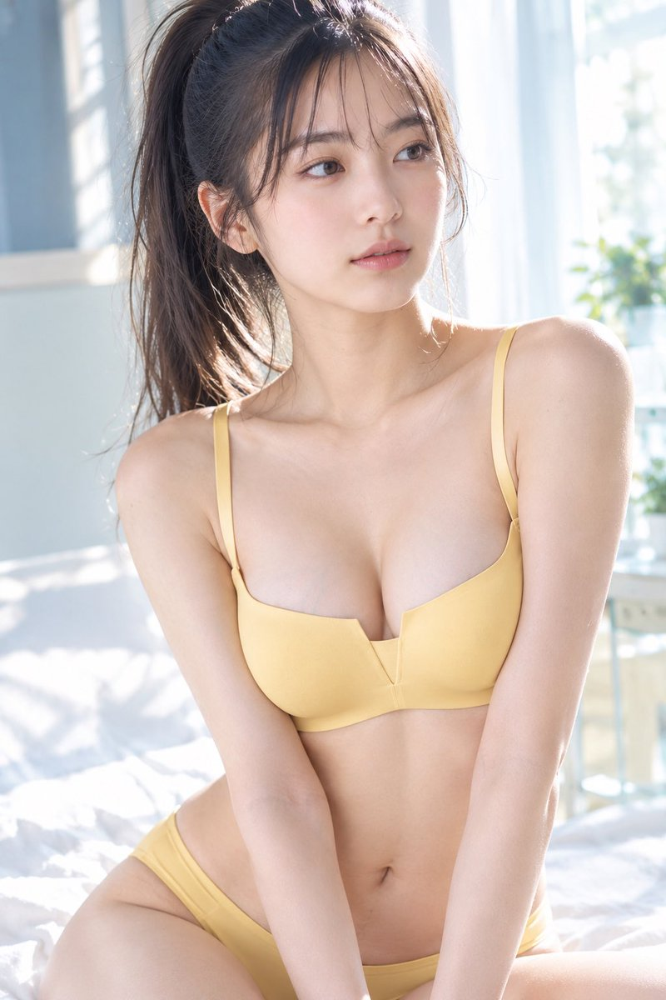

**Prompt**

```text
Tradução em curso
```

[↑ Voltar às categorias](#catalog)

---

<a name="prompt-2102639208640954617"></a>

### Tradução em curso

Autor：[@oye\_samia](https://x.com/oye_samia) · [Publicação original](https://x.com/oye_samia/status/2102639208640954617)

Fotografia · Retrato / Selfie · Personagem · Publicado

**Resumo:** Tradução em curso

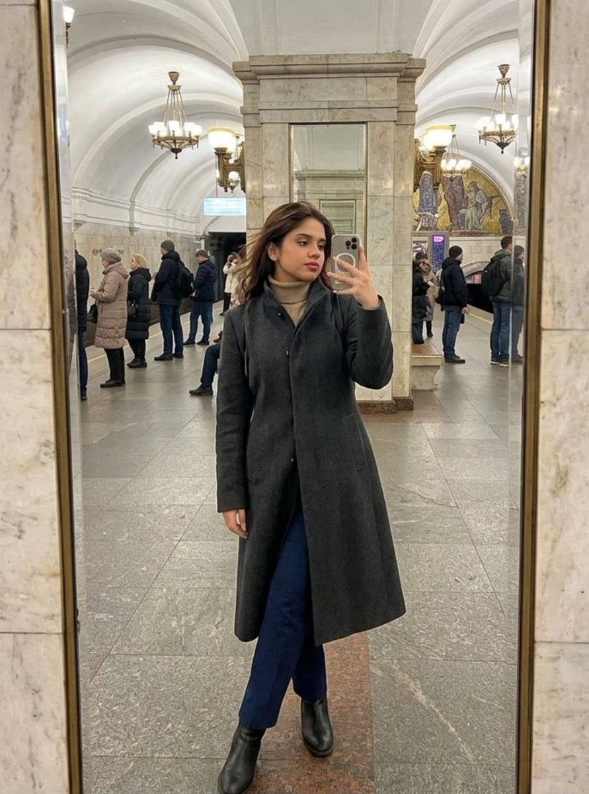

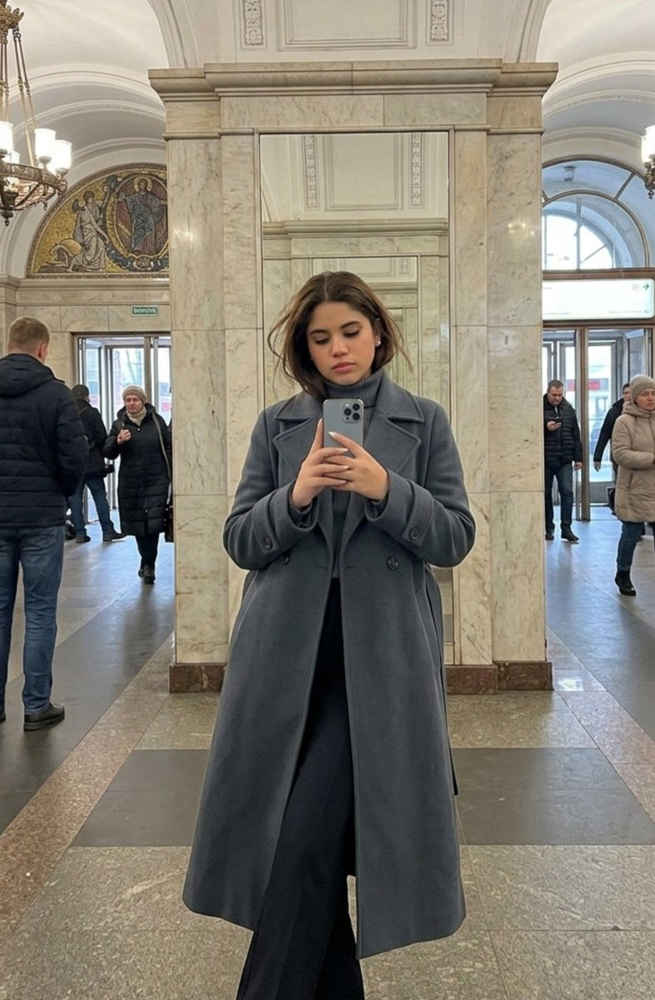

**Prompt**

```text
Tradução em curso
```

[↑ Voltar às categorias](#catalog)

---

<a name="prompt-2102613618877776329"></a>

### Tradução em curso

Autor：[@DDJCXX](https://x.com/DDJCXX) · [Publicação original](https://x.com/DDJCXX/status/2102613618877776329)

Fotografia · Retrato / Selfie · Personagem · Publicado

**Resumo:** Tradução em curso

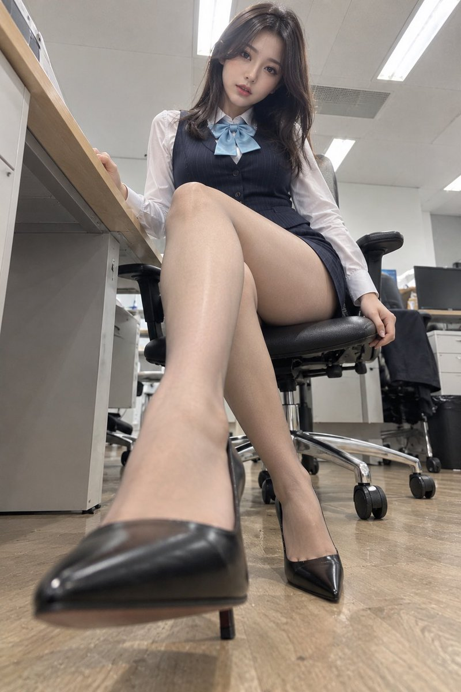

**Prompt**

```text
Tradução em curso
```

[↑ Voltar às categorias](#catalog)

---

<a name="prompt-2102632888344998125"></a>

### Tradução em curso

Autor：[@maplejohn01](https://x.com/maplejohn01) · [Publicação original](https://x.com/maplejohn01/status/2102632888344998125)

Fotografia · Retrato / Selfie · Personagem · Comida / Bebida · Item de Moda · Publicado

**Resumo:** Tradução em curso

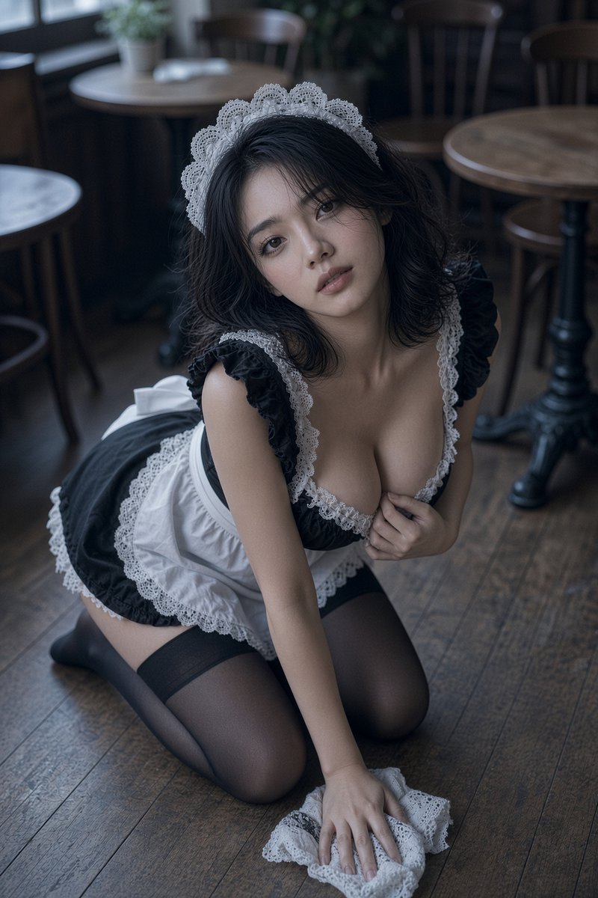

**Prompt**

```text
Tradução em curso
```

[↑ Voltar às categorias](#catalog)

---

<a name="prompt-2102663127431070137"></a>

### Tradução em curso

Autor：[@DDJCXX](https://x.com/DDJCXX) · [Publicação original](https://x.com/DDJCXX/status/2102663127431070137)

Fotografia · Publicado

**Resumo:** Tradução em curso


**Prompt**

```text
Tradução em curso
```

[↑ Voltar às categorias](#catalog)

---

<a name="prompt-2102551267562201128"></a>

### Tradução em curso

Autor：[@Yamilio\_it](https://x.com/Yamilio_it) · [Publicação original](https://x.com/Yamilio_it/status/2102551267562201128)

Perfil / Avatar · Fotografia · Retrato / Selfie · Veículo · Arquitetura / Interiores · Publicado

**Resumo:** Tradução em curso

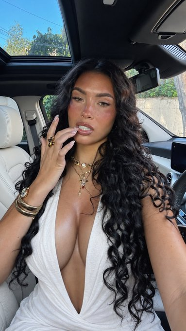

**Prompt**

```text
Tradução em curso
```

[↑ Voltar às categorias](#catalog)

---

<a name="prompt-2102527632726462637"></a>

### Prompt em estilo fotográfico de uma mulher adulta em lingerie na beira da cama de um quarto de hotel iluminado pela manhã, segurando um morango junto à boca com um sorriso tímido.

Autor：[@muse\_ai\_prompt](https://x.com/muse_ai_prompt) · [Publicação original](https://x.com/muse_ai_prompt/status/2102527632726462637)

Fotografia · Retrato / Selfie · Personagem · Publicado

**Resumo:** Prompt em estilo fotográfico de uma mulher adulta em lingerie na beira da cama de um quarto de hotel iluminado pela manhã, segurando um morango junto à boca com um sorriso tímido.

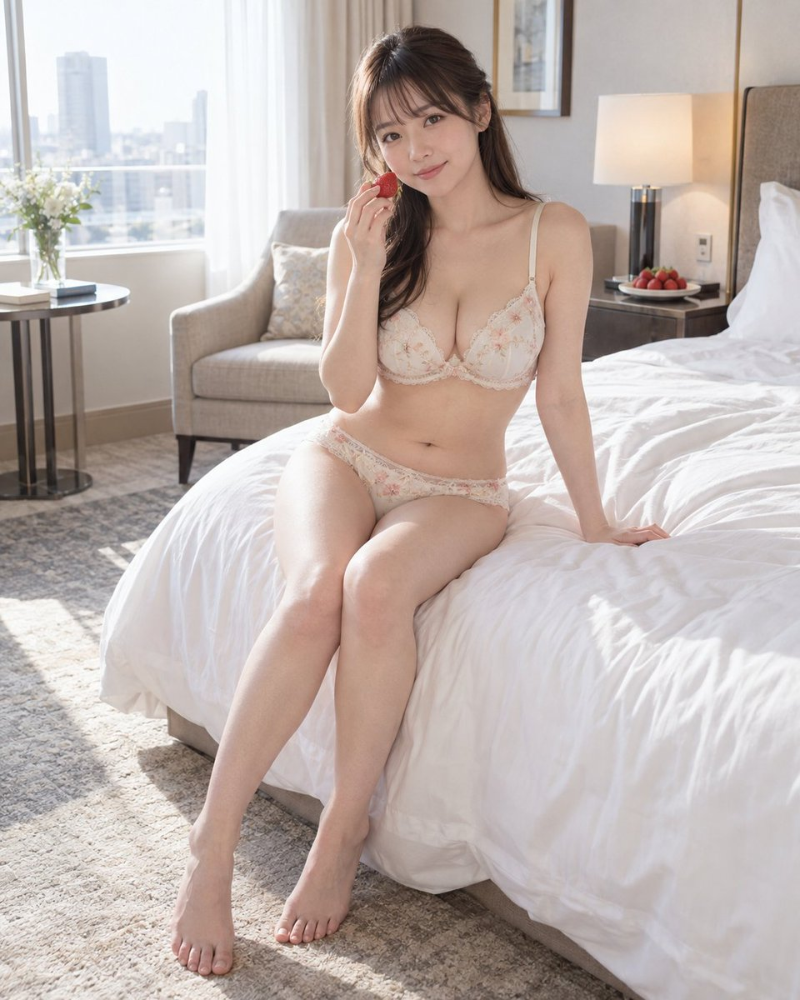

**Prompt**

```text
🌟Quarto de hotel pela manhã ｜ Morango e um suave sorriso tímido🌟

【Tema e estilo artístico】
Retratar o momento em que uma jovem mulher japonesa adulta, num quarto de hotel pela manhã, após trincar um morango, cruza o olhar com o namorado e sorri com uma ponta de timidez. Tendo por base uma representação fotográfica fotorrealista com ambiente do quotidiano, valorizar a naturalidade, como se uma manhã banal durante uma estadia no hotel tivesse sido captada por acaso. Em vez de uma estética produzida de pose sensual, criar uma fotografia onde se sinta uma feminilidade elegante e uma cumplicidade serena a dois.

【Localização, fundo e universo visual】
Um quarto de hotel sereno e asseado, em tons de branco e bege-claro. A mulher está sentada na beira de uma cama feita com lençóis brancos impecáveis. A janela tem cortinas brancas e finas, através das quais se avista discretamente a cidade matinal ao fundo. Ao lado da cama encontra-se uma pequena mesinha de cabeceira, dispondo de forma natural um pequeno prato branco com alguns morangos e um candeeiro simples. O fundo mantém marcas de vivência, mas arrumado, conferindo profundidade suficiente para não prejudicar a protagonista.

【Estação, hora e clima】
A manhã de um dia sereno e soalheiro. Não uma luminosidade forte de pleno verão, mas um ar fresco e suave de manhã condizente com a transição de estações. Entra luz natural difusa através do cortinado fino, restando ainda algum silêncio na divisão. Praticamente sem vento, as cortinas apenas oscilam ligeiramente. Um ambiente relaxado, pouco tempo após acordar, por alturas do pequeno-almoço.

【Caracterização da personagem】
Inequivocamente uma mulher japonesa adulta de cerca de 24 anos. Traços fisionómicos suaves e equilibrados, olhos escuros ligeiramente grandes, sobrancelhas naturais, lábios viçosos e maçãs do rosto discretamente arredondadas. Cabelo castanho-escuro com ondulação natural pelos ombros. Pele em tom ocre claro com textura realista, mantendo poros e sombras ténues.
Silhueta elegante e curvilínea natural, combinando ombros e membros delicados com uma cintura esguia e curvas femininas. Busto nitidamente farto e generoso, sem dimensões desmedidas artificiais, denotando um contorno suave e densidade natural moldados pela gravidade e pela postura sentada. Linhas saudáveis nas ancas e pernas, em harmonia com todo o corpo.

【Indumentária e acessórios】
Um conjunto de soutien e cuecas cor de marfim a lembrar uma marca requintada de lingerie. Bordados discretos de pequenas flores em tom pêssego pálido no decote e junto à cintura, rematados por uma renda recortada minuciosa. Material de textura intermédia, revelando com naturalidade o relevo das costuras e do bordado.
O soutien tem uma estrutura e tamanho verosímeis que contêm confortavelmente o busto volumoso, sem que as alças ou copas apertem em excesso nem façam esticar o tecido artificialmente. As cuecas acompanham naturalmente as curvas da anca. Sem recurso a acessórios, preservando a genuinidade da manhã.

【Pose, movimento e olhar】
A mulher senta-se de forma ligeira e enviesada na beira do colchão, descendo ambas as pernas e pousando os pés descalços num tapete fofo. O peso distribui-se naturalmente pelos ísquios, inclinando o tronco suavemente para a câmara. Com uma mão segura nas pontas dos dedos o morango retirado da mesa de cabeceira, posicionando-o junto aos lábios logo após trincar a ponta. A outra mão pousa levemente sobre o lençol ao lado da anca, amparando a postura com descontração.
Olha na direção da câmara onde se encontra o namorado, acompanhando a rotação do tronco e dos ombros sem forçar o pescoço. Pernas sem cruzamento forçado; joelhos, pernas e pés numa posição descontraída e solta. O cabelo é descaído por trás de um dos ombros para não tapar em excesso a lingerie nem a expressão facial.

【Expressão e estado de espírito】
O instante em que percebe que foi apanhada a comer o morango e ri com um ligeiro embaraço. A boca não se abre demasiado, cerrando-se com subtileza após a dentada, enquanto os cantos sobem organicamente. As faces coram ligeiramente de timidez e o olhar desanuvia-se com meiguice. O olhar dirigido à câmara traduz confiança íntima no parceiro aliada a uma ponta de pudor.
Evitar sorrisos espalhafatosos ou trejeitos de sedução; retratar como uma reação terna e espontânea numa manhã trivial.

【Composição e câmara】
Formato vertical 4:5 próprio para partilha no X. Enquadramento de corpo inteiro folgado, abrangendo do topo da cabeça à ponta dos pés descalços, com margens equilibradas acima e abaixo. Câmara colocada a uma altura natural, ligeiramente abaixo do peito da mulher sentada, num ângulo ligeiramente oblíquo em relação à posição frontal.
Profundidade e perspetiva equiparáveis a uma lente padrão de cerca de 50mm, fugindo a distorções de grande angular que ampliem desproporcionalmente as pernas ou o busto. Figura ligeiramente desviada do centro, deixando percetíveis a janela, a cama e a mesinha de cabeceira no plano de fundo. Profundidade de campo equilibrada, com um desfoque subtil no fundo que permita identificar a divisão como um quarto de hotel.

【Luz, cor, texturas e ambiente】
A iluminação principal provém da ampla janela lateral, consistindo em luz natural da manhã filtrada pelas cortinas brancas e finas. Esta luz envolve delicadamente o rosto, ombros, braços e pernas, sendo o lado oposto compensado pelos reflexos da parede e dos lençóis claros. Transições de sombra graduais e suaves, com uma luminosidade serena típica das primeiras horas do dia.
A tez conserva tonalidade saudável, sombreados finos e textura subtil; o cabelo revela fios definidos e um brilho acetinado. A renda exibe o detalhe do bordado e do remate, a roupa de cama branca ostenta vincos ligeiros e textura macia, e o morango mostra um tom vermelho sumarento com pormenor nos aquénios. Toda a paleta gira à volta do marfim, branco e bege-claro, sobressaindo o vermelho do fruto como um discreto toque de contraste.

【Qualidade e parâmetros de exclusão】
Resolução elevada, priorizando verosimilhança do corpo humano, iluminação, matérias e perspetiva como se registado por uma máquina fotográfica real. Excluir aspeto de menor de idade ou feições excessivamente infantis, desproporções corporais, membros ou dedos a mais, em falta ou fundidos, articulações incorretas e trocas entre mãos.
Evitar falhas na confeção do vestuário, sobreposição anómala de têxtil com a pele, vincos de aperto excessivos, nudez indevida, deformação acentuada de grande angular e retoques de pele plásticos. O busto deve conservar volume expressivo e natural, sem aparências esféricas rígidas, elevação desmesurada ou oposição à gravidade. Sem letras, marcas, marcas de água ou elementos de interface na imagem.
```

[↑ Voltar às categorias](#catalog)

---

<a name="prompt-2102528767126352335"></a>

### Prompt fotorrealista de uma mulher adulta em lingerie bege champanhe, sentada na borda da banheira numa sofisticada casa de banho de hotel à noite, a sorrir enquanto leva um macaron aos lábios.

Autor：[@muse\_ai\_prompt](https://x.com/muse_ai_prompt) · [Publicação original](https://x.com/muse_ai_prompt/status/2102528767126352335)

Fotografia · Personagem · Publicado

**Resumo:** Prompt fotorrealista de uma mulher adulta em lingerie bege champanhe, sentada na borda da banheira numa sofisticada casa de banho de hotel à noite, a sorrir enquanto leva um macaron aos lábios.

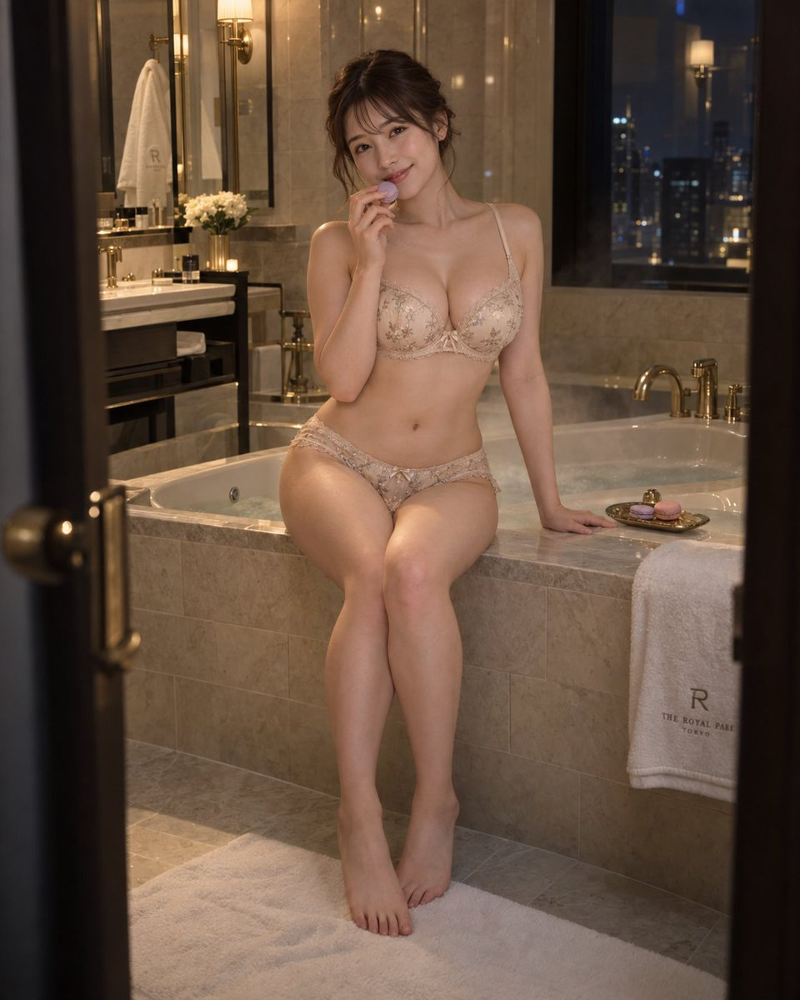

**Prompt**

```text
🌟 Casa de Banho de Hotel Noturna | Macaron e Doce Sedução 🌟

【Tema e Estilo Visual】
Retratar um momento íntimo numa requintada casa de banho de hotel à noite, onde uma mulher japonesa claramente adulta se senta na borda da banheira, levando um macaron à boca enquanto sorri com doçura para o seu parceiro íntimo. O estilo visual é fundamentalmente fotorrealista, equilibrando a serenidade de um hotel de luxo com uma intimidade autêntica e quotidiana, assemelhando-se a um fotograma cinematográfico.
Evitar a rigidez excessivamente polida de fotografias de moda, priorizando um instante natural e espontâneo captado por acaso. O vestuário, as expressões, o macaron nas mãos, a iluminação acolhedora e a profundidade da casa de banho devem harmonizar-se para transmitir a graciosidade madura e tranquila de uma mulher adulta.

【Local, Cenário e Universo】
O cenário é uma espaçosa casa de banho de hotel à noite, decorada com pedra natural ou mármore em tons suaves de bege. Ao fundo, uma banheira ampla com torneiras e guarnições em tom de latão, e apliques de parede com design discreto. A bancada do lavatório e os espelhos integram-se naturalmente no segundo plano, transmitindo a limpeza e a sofisticação características de um hotel.
Ao lado da mulher, sobre um pequeno tabuleiro de metal ou pedra, repousam dois macarons de tons suaves. Em plano de fundo, toalhas brancas e pequenas flores complementam o espaço com apontamentos mínimos que reforçam o ambiente hoteleiro sem ofuscar a protagonista.

【Estação, Horário e Clima】
Cena de interior noturna, sem estação do ano explicitamente definida. No exterior, a noite já caiu por completo; se uma janela for visível, pequenas luzes urbanas e a paisagem noturna distante surgem ao longe. A temperatura ambiente é agradavelmente tépida, com a atmosfera relaxante de quem acabou de tomar banho.
Uma névoa muito subtil paira junto à banheira, sem prejudicar a visibilidade. O ar ligeiramente húmido e a iluminação quente evidenciam a diferença térmica face à noite exterior, expressando a tranquilidade de uma noite num hotel silencioso.

【Caracterização da Personagem】
Mulher japonesa claramente adulta, de 27 anos. Feições maduras, suaves e harmoniosas, com olhos expressivos e escuros, sobrancelhas naturais, nariz fino e lábios macios e corados. Cabelo castanho-escuro com ondulações naturais até aos ombros, parcialmente apanhado de forma ligeira como após o banho, com madeixas finas soltas a emoldurar o rosto.
Pele em tom ocre claro com textura realista, sem filtros artificiais de embelezamento excessivo, revelando poros subtis e sombras finas. Silhueta elegante e naturalmente curvilínea, que concilia ombros e membros delicados com cintura delgada e formas femininas generosas. O peito é visivelmente farto e volumoso, contudo sem desproporções artificiais ou rigidez, mantendo um volume macio e condizente com a postura sentada e o vestuário.

【Vestuário e Acessórios】
Conjunto sofisticado de lingerie com soutien e cuecas em tom bege champanhe, com corte requintado a lembrar a linha da Wacoal. Pormenores minuciosos de bordados florais discretos no decote e nas cuecas, rematados com rendas delicadas e um brilho acetinado subtil. O tecido tem ligeira transparência, mas permanece elegante sem revelações indevidas.
O vestuário apresenta dimensões realistas adaptadas às suas formas e ancas, sem repuxar anormalmente o tecido nem marcar em demasia o corpo. Sem acessórios de destaque, usando no máximo brincos pequenos e discretos, para que o vestuário e a expressão facial permaneçam no centro das atenções.

【Pose, Movimento e Olhar】
A mulher encontra-se sentada na borda larga e seca da banheira, com o corpo ligeiramente orientado na diagonal em relação à câmara. As pernas descem naturalmente para o exterior da banheira, apoiando os pés num tapete macio. A postura lombar não é forçada, com o peso do corpo a repousar suavemente na superfície de apoio.
Com uma das mãos segura com delicadeza um macaron lavanda suave, detendo o movimento a escassos centímetros dos lábios. A outra mão repousa descontraidamente junto ao corpo ou sobre a borda da banheira. O rosto vira-se ligeiramente para a zona da porta, dirigindo o olhar para a câmara, como se estivesse a olhar para o companheiro que aí se encontra.

【Expressão e Emoção】
Um sorriso doce e subtilmente cúmplice, como se estivesse prestes a perguntar: "Queres um pedaço?". Os cantos da boca erguem-se com naturalidade sem fechar por completo os lábios, acompanhando o gesto de levar o macaron à boca.
Os olhos revelam carinho e à-vontade, com as sobrancelhas e as maçãs do rosto ligeiramente descontraídas. Não se procura uma sedução agressiva, mas sim uma expressão calorosa e natural que evoque a cumplicidade de uma relação duradoura.

【Composição e Câmara】
Composição vertical em formato 4:5 destinada a publicações no X. Enquadramento de corpo inteiro (full body), com margens generosas da cabeça aos pés, assegurando o devido respiro no topo, nas mãos e na base. A captação é feita a partir da zona de entrada da casa de banho, mostrando de forma equilibrada a figura completa, o contorno da banheira, o tabuleiro e as luzes de fundo.
A altura da câmara situa-se ligeiramente abaixo da linha de visão de alguém de pé. Recorre-se a uma distância focal padrão a média teleobjetiva (equivalente a 50–70 mm), evitando distorções de grande angular nos membros ou no peito. O fundo exibe uma suave desfocagem, suficiente para manter a perceção nítida do ambiente requintado da casa de banho.

【Luz, Cor, Textura e Ambiente】
A fonte luminosa principal provém de um aplique de parede de luz quente, situado na diagonal frontal da figura. Do lado oposto incidem reflexos suaves do lavatório e das superfícies em pedra, atenuando as sombras do rosto e do corpo. A iluminação é contida, sem realces excessivos no decote ou na pele.
A pele revela um tom rosado natural e sombras subtis; o cabelo demonstra definição em cada madeixa e brilho equilibrado. Texturas diferenciadas e ricas para renda, bordados, cetim, pedra, latão, turcos macios e água. A paleta cromática assenta em tons quentes como bege champanhe, marfim e dourado suave, compondo uma atmosfera noturna serena, nobre e adocicada.

【Qualidade e Elementos a Excluir】
Acabamento fotorrealista de alta definição, replicando uma fotografia captada por câmara real, com anatomia verosímil, iluminação correta, perspetiva e textura de materiais autênticas. Evitar aspeto menor de idade, traços faciais infantis, anomalias corporais, membros ou dedos a mais, dedos em falta, dedos fundidos, articulações deformadas ou mãos trocadas.
Sem falhas de vestuário, sem fusão entre corpo e tecido, sem exposição indesejada, sem tecidos que marquem a pele de forma grotesca, sem distorção por grande angular e sem pele artificialmente retocada. O peito deve manter volume farto e natural, sem esferas rígidas, sem efeitos "push-up" irreais e sem contrariar a gravidade. A imagem não deve conter texto, logótipos, marcas de água nem elementos de interface (UI).
```

[↑ Voltar às categorias](#catalog)

---

<a name="prompt-2102526077872840964"></a>

### Prompt de retrato fotorrealista e quotidiano de uma mulher japonesa junto à janela de um café de padaria, a saborear pão fresco e a sorrir com a mão nos lábios.

Autor：[@muse\_ai\_prompt](https://x.com/muse_ai_prompt) · [Publicação original](https://x.com/muse_ai_prompt/status/2102526077872840964)

Fotografia · Retrato / Selfie · Personagem · Publicado

**Resumo:** Prompt de retrato fotorrealista e quotidiano de uma mulher japonesa junto à janela de um café de padaria, a saborear pão fresco e a sorrir com a mão nos lábios.

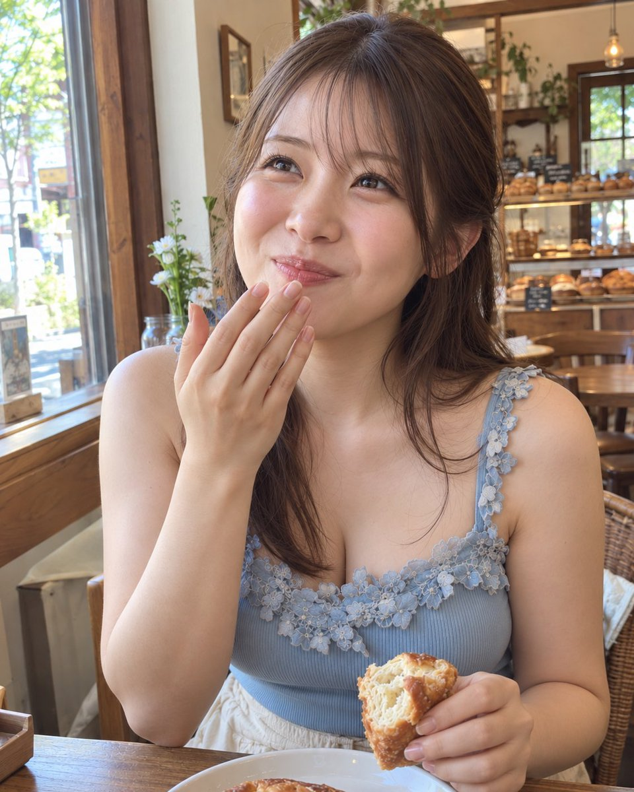

**Prompt**

```text
🌟Café de padaria junto à janela | Pão fresco e um sorriso cúmplice🌟

【Tema e Estilo】
Fotografia fotorrealista que capta o instante em que uma mulher sorri espontaneamente após trincar um pão, ao meio-dia, num pequeno café de padaria. Longe de uma fotografia publicitária encenada, trata-se de um registo íntimo e do quotidiano, como se tivesse sido captado com naturalidade por um smartphone durante uma conversa descontraída com alguém próximo.
Combinando uma indumentária fresca em azul-saxónico, pão acabado de cozer e a suave luz da janela, expressa uma graciosidade madura e impecável. Mantendo a elegância visual própria de um livro de fotografias (photobook), valoriza-se a expressão genuína nascida casualmente no dia a dia.

【Local, Cenário e Ambiente】
Mesa junto à janela de um acolhedor e pequeno café de padaria com caixilhos e mesas de madeira. Em frente à mulher, na mesa, descansam um prato branco e um pão começado; em segundo plano, prateleiras de madeira, vitrinas com pão exposto, cadeiras e pequenas plantas decorativas surgem dispostas naturalmente.
Através da janela, vislumbram-se ao de leve uma rua iluminada e o arvoredo exterior, contrastando com o aconchego da madeira no interior. O fundo não deve ser totalmente desfocado, preservando profundidade e pormenores suficientes para identificar o espaço como uma padaria.

【Estação, Hora e Clima】
Meio-dia de um dia de sol, ameno e agradável, entre o final da primavera e o início do outono. Em vez do sol abrasador do pico do verão, uma luminosidade natural clara e suave que se espalha através do vidro da janela.
Lá fora, a vegetação ostenta um verde natural, enquanto no interior do espaço se respira uma atmosfera fresca e tranquila. Sem rajadas de vento percetíveis, num momento calmo e sereno para saborear o almoço ou uma pausa para café.

【Caracterização da Personagem】
Mulher japonesa inequivocamente adulta, com cerca de 24 anos. Feições suaves e simétricas, olhos escuros expressivos, sobrancelhas naturais, faces e lábios corados, aliando um ar acessível à serenidade própria de uma mulher adulta. Cabelo castanho-escuro a cair ligeiramente abaixo dos ombros, com ondulação fluida e fios soltos subtis.
Ombros e braços delicados, cintura fina em equilíbrio com curvas femininas harmoniosas, formando uma silhueta elegante e naturalmente voluptuosa. Busto evidente, farto e com volume natural generoso, sem contornos esféricos rígidos nem elevações exageradas, evidenciando uma curvatura suave e tridimensional que acompanha a postura sentada e o tecido da roupa.

【Vestuário e Acessórios】
Top de alças (estilo camisole) em azul-saxónico para saída, guarnecido de folhos de renda. A peça central é confecionada em malha canelada macia e opaca, adornada no decote e nas alças com folhos de renda tridimensional com padrão floral miúdo. Uma criação fresca e distinta, concebida como uma camisola casual própria para frequentar um café, e não como lingerie.
A confeção tem largura suficiente para cobrir confortavelmente o peito farto, com um ajuste realista que não estica nem repuxa o tecido. Parte inferior composta por uma saia de algodão cor de marfim. Acessórios discretos, limitados a brincos pequenos se necessário.

【Pose, Movimento e Olhar】
A mulher encontra-se sentada de modo relaxado na cadeira junto à janela, inclinando ligeiramente o tronco na direção de quem está à sua frente. Postura assente com estabilidade nas pernas e na anca, sem torções forçadas. Com a mão esquerda, segura o pão já mordido, pousando-a com naturalidade logo acima do prato branco.
A mão direita aproxima-se com leveza da zona logo abaixo dos lábios, como se risse timidamente logo após mastigar. Os dedos não tapam os lábios na totalidade, permitindo ver os cantos da boca e a expressão facial. O olhar não fita diretamente a objetiva, dirigindo-se ligeiramente acima, para o rosto do interlocutor.

【Expressão e Emoção】
Um sorriso luminoso e ligeiramente tímido, como se a pessoa à sua frente tivesse acabado de reparar no prazer genuíno com que comia o pão acabado de fazer. Maçãs do rosto erguidas com naturalidade, olhar brilhante de alegria e cantos da boca subtilmente curvados para cima.
Não uma gargalhada aberta, mas sim um sorriso discreto nascido no meio de uma conversa banal à mesa. Evita-se qualquer pose deliberada para a câmara, transmitindo na totalidade da expressão a tranquilidade e cumplicidade de estar com alguém chegado.

【Composição e Câmara】
Formato vertical 4:5 adequado para partilha no X. Plano médio aproximado (bust-up) do busto até ao topo da cabeça, deixando um pequeno respiro no topo, e integrando com naturalidade no enquadramento a mão direita junto à boca e a mão esquerda a segurar o pão. A mulher fica posicionada ligeiramente à direita do centro, permitindo avistar a janela e a luz do dia do lado esquerdo.
A câmara situa-se sensivelmente ao nível dos olhos da pessoa sentada em frente. Ângulo de visão neutro entre a distância focal padrão e a média teleobjetiva, sem distorções de grande-angular no rosto, no busto ou nas mãos. Profundidade de campo equilibrada em segundo plano, com uma desfocagem suave que permita distinguir os expositores de pão e os elementos de madeira.

【Luz, Cor, Textura e Ambiente】
A iluminação principal provém da luz natural e suave do dia que entra pela janela ampla do lado esquerdo. Brilho límpido incide sobre as faces, o olhar e os ombros, contraposto por reflexos amenos provenientes das paredes e móveis de madeira do café. Sombras suaves, preservando a volumetria natural do rosto.
Pele com textura realista, poros visíveis, sombras ténues e tonalidade saudável, sem tratamento artificial de alisamento. Cabelos com definição e brilho suave, renda com bordados pormenorizados e pão com crosta tostada e miolo fofo visível na zona partida. O calor dos tons castanhos da madeira em harmonia com o azul-saxónico cria uma atmosfera diurna fresca, acolhedora e intimista.

【Qualidade e Elementos a Excluir】
Fotorrealismo de alta resolução. Prioridade à representação anatómica natural, pormenor das mãos e dedos, iluminação fiel, perspetiva correta e texturas orgânicas de materiais, como se a imagem fosse captada por uma máquina fotográfica real ou smartphone.
Excluir: aparência de menor de idade, traços excessivamente infantis, anomalias anatómicas, membros ou dedos a mais, dedos em falta, dedos fundidos, articulações inverosímeis, troca de mãos, sobreposição de vestuário com o corpo, defeitos na roupa, nudez involuntária, distorção extrema de grande-angular e suavização de pele excessiva. O peito deve permanecer naturalmente farto, sem dimensões desmedidas, sem esfericidade rígida, elevações bizarras ou desafio à gravidade. Sem texto, logótipos, marcas de água, balões de diálogo ou interfaces visíveis na imagem.
```

[↑ Voltar às categorias](#catalog)

---

<a name="prompt-2102529688711348244"></a>

### Tradução em curso

Autor：[@muse\_ai\_prompt](https://x.com/muse_ai_prompt) · [Publicação original](https://x.com/muse_ai_prompt/status/2102529688711348244)

Fotografia · Retrato / Selfie · Personagem · Paisagem / Natureza · Publicado

**Resumo:** Tradução em curso

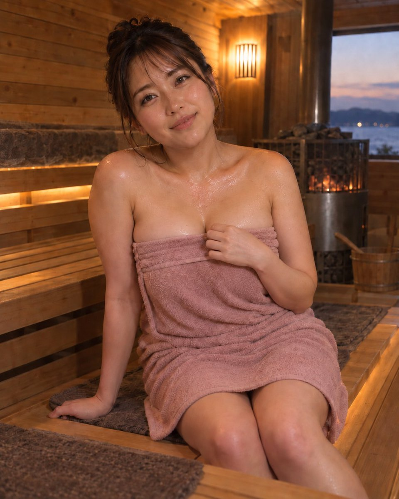

**Prompt**

```text
Tradução em curso
```

[↑ Voltar às categorias](#catalog)

---

<a name="prompt-2102530498224648334"></a>

### Prompt fotorrealista detalhado e de alta definição para geração de imagem por texto, retratando uma mulher adulta a fazer biquinho de beijo ao parceiro enquanto seca o cabelo molhado numa casa de banho branca pela manhã.

Autor：[@muse\_ai\_prompt](https://x.com/muse_ai_prompt) · [Publicação original](https://x.com/muse_ai_prompt/status/2102530498224648334)

Fotografia · Retrato / Selfie · Personagem · Publicado

**Resumo:** Prompt fotorrealista detalhado e de alta definição para geração de imagem por texto, retratando uma mulher adulta a fazer biquinho de beijo ao parceiro enquanto seca o cabelo molhado numa casa de banho branca pela manhã.

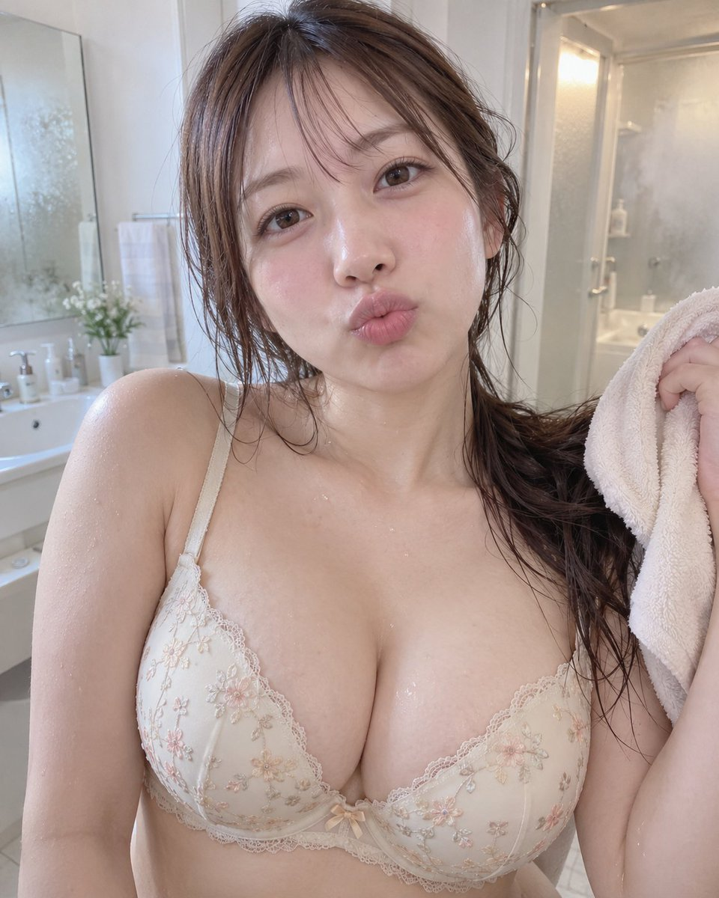

**Prompt**

```text
🌟 Casa de Banho Branca Pela Manhã | Rosto de Beijo Pós-Banho e Luz Matinal Suave 🌟

【Tema e Estilo Artístico】
Retrata um momento íntimo após um banho matinal, no qual uma mulher adulta a secar o cabelo na casa de banho branca da sua residência nota o parceiro à sua frente, interrompe o gesto e aproxima ligeiramente o rosto. Combina a fotografia documental e fotorrealista do quotidiano com a expressão refinada de um photobook elegante, privilegiando uma sensação natural de proximidade sem parecer excessivamente encenado.

Uma casa de banho limpa, cabelos húmidos, expressões suaves e lingerie delicada unem-se numa atmosfera harmoniosa. O foco não reside na nudez ou exposição em si, mas sim em captar, como um registo casual, a tranquilidade da manhã e a rotina diária de um casal.

【Local, Cenário e Ambiente】
Uma casa de banho doméstica luminosa e limpa, dominada por tons de branco e bege-claro. Ao fundo da cena, a porta da divisão de banho contígua encontra-se entreaberta, restando ainda vestígios ténues do vapor pós-banho ao seu redor. O espelho na parede não se encontra totalmente embaciado; apenas uma parte da borda está ligeiramente nublada pela humidade.

Na bancada do lavatório, frascos brancos de sabonete, pequenos produtos de dermocosmética e uma toalha dobrada estão dispostos de forma discreta, conferindo uma sensação autêntica de quotidiano. O fundo está arrumado, mas sem a frieza de um hotel, transmitindo a atmosfera suave e calorosa de um lar habitado.

【Estação, Hora e Clima】
A estação evoca uma manhã amena entre a primavera e o início do verão. A hora ronda as 7h da manhã, com céu limpo no exterior. A luz natural suave atravessa o vidro fosco e propaga-se por todo o espaço, sem incidência de luz solar direta e forte.

Por ter acabado de tomar banho, a divisão apresenta uma humidade ligeira e o ar está morno. A luz fresca matinal vinda da janela combina-se com a humidade cálida da zona de banho, gerando uma atmosfera onde a frescura e a intimidade coexistem.

【Caracterização da Personagem】
Uma mulher japonesa de 24 anos, manifestamente adulta. Feições suaves e aprumadas de mulher adulta, olhos negros expressivos e relativamente grandes, sobrancelhas naturais, septo nasal elegante e lábios macios e corados. A sua pele apresenta um tom ocre-claro e luminoso, com um rubor ténue pós-banho visível nas maçãs do rosto e orelhas.

Cabelo castanho-escuro pelos ombros, molhado e a cair naturalmente para um dos lados. Uma silhueta naturalmente curvilínea e voluptuosa, com ombros e membros delicados e cintura esguia em perfeito equilíbrio com as curvas femininas. O peito é claramente volumoso e farto, contudo desenhado com uma redondeza suave que respeita a postura e a gravidade, conservando a proporção harmoniosa com o corpo.

【Vestuário e Acessórios】
O vestuário consiste num elegante conjunto de lingerie em marfim (sutiã e cuecas), evocativo do estilo refinado da Wacoal. O peito exibe bordados discretos de pequenas flores em tons de alperce e pêssego pálido, rematados por uma renda recortada (scalloped) minuciosa nas orlas. O tecido não é excessivamente fino, tratando-se de um material macio dotado de um brilho acetinado subtil.

O sutiã possui dimensões e estrutura realistas que acomodam confortavelmente o busto farto, sem que as copas ou alças sofram deformações ou compressões artificiais. Sem adornos nem joias, favorecendo a simplicidade e a frescura próprias de quem acabou de sair do banho.

【Pose, Ação e Olhar】
O corpo posiciona-se ligeiramente na diagonal em relação à câmara, numa pose de pé serena e com os ombros descontraídos. A mulher interrompeu o gesto de secar as pontas do cabelo húmido que pende para um dos lados com uma pequena toalha; as mãos e a toalha são recolhidas junto ao bordo exterior do ombro, desimpedindo o rosto e o decote.

Inclina a parte superior do tronco ligeiramente em direção ao parceiro, com a cabeça suavemente inclinada. Sem inclinações pronunciadas nem arqueamentos forçados da coluna. O olhar fita diretamente os olhos do parceiro, logo atrás da câmara, espelhando com naturalidade o instante fugaz de aproximação.

【Expressão e Emoção】
Os lábios formam um biquinho de beijo tímido, delicado e espontâneo. Longe de evidenciar unicamente a boca, os olhos revelam uma descontração calorosa, como se contivesse um sorriso cúmplice. As sobrancelhas estão soltas e as maçãs do rosto discretamente subidas.

Não procura ser uma expressão de sedução calculada, antes um gesto íntimo e terno que desponta na proximidade rotineira a dois. Uma expressão na qual um misto de timidez e alegria transparece de modo genuíno no olhar e no rubor das faces.

【Composição e Câmara】
Formato vertical 4:5 direcionado para o X. Enquadramento de plano médio-curto (bust-up) focado com amplitude desde o decote até ao topo da cabeça, conservando uma margem subtil de respiro no topo. Fotografia de aproximação suficiente para evidenciar o rosto, a boca, o cabelo húmido e os bordados superiores da lingerie.

A câmara encontra-se praticamente à altura do olhar da mulher. Utilização de uma distância focal natural, entre o padrão e a meia-teleobjetiva, prevenindo distorções de grande-angular no rosto ou no peito. O plano de fundo mantém apenas uma suave desfocagem, permitindo perceber a profundidade onde se inserem o lavatório, o espelho e a porta da casa de banho.

【Luz, Cor, Textura e Atmosfera】
A fonte de luz primordial é a claridade difusa da manhã a entrar pela janela de vidro fosco, posicionada diagonalmente à frente. Reflexos suaves rebatem na parede branca e no lavatório opostos, atenuando organicamente as sombras do rosto e do pescoço. Uma luz artificial fraca e tépida perdura no interior da zona de banho, insinuando um contraste suave de temperatura de cor face à luz natural matutina.

A pele preserva a textura de poros, gradações subtis de sombra e viço natural, cintilando ligeiramente com microgotas de água pós-banho no pescoço e decote. O cabelo molhado revela definição de mechas e fios finos rebeldes, enquanto os bordados e as rendas da lingerie exibem a tridimensionalidade palpável dos fios. Predomínio de brancos, marfim e suaves apontamentos de alperce, estabelecendo uma tonalidade matinal limpa e serena.

【Qualidade e Parâmetros de Exclusão】
Fotografia fotorrealista de alta definição. Foco na representação fidedigna do corpo humano, iluminação, matérias, profundidade de campo e perspetiva, condizente com uma câmara fotográfica real.

Evitar sujeitos com aparência infantil, fisionomias pueris, anatomia distorcida, membros ou dedos a mais, dedos em falta, dedos fundidos, articulações anómalas, posições de mãos erróneas, deformações no vestuário, fusão anómala entre tecido e pele, nudez ou exposição despropositada, deformação por grande-angular extrema e alisamento artificial excessivo da pele. O peito deve manter um volume farto e verosímil, sem aumentos bizarros, aspeto esférico rígido, elevações forçadas ou geometria anti-gravítica. Proibida a inclusão de texto, marcas de água, logótipos ou elementos de interface gráfica (UI) na imagem.
```

[↑ Voltar às categorias](#catalog)

---

<a name="prompt-2102444358012486105"></a>

### Instantâneo em ângulo baixo e grande-angular de uma jovem mulher japonesa num fato de banho branco a relaxar numa boia insuflável no oceano.

Autor：[@pocky2914](https://x.com/pocky2914) · [Publicação original](https://x.com/pocky2914/status/2102444358012486105)

Fotografia · Personagem · Paisagem / Natureza · Publicado

**Resumo:** Instantâneo em ângulo baixo e grande-angular de uma jovem mulher japonesa num fato de banho branco a relaxar numa boia insuflável no oceano.


**Prompt**

```text
**Fotografia de estilo de vida ultrarrealista, fotorrealista, tarde luminosa de verão, oceano azul cristalino, boia inflável branca a flutuar em águas calmas, luz solar natural, HDR, textura de pele realista, profundidade de campo reduzida, estética de instantâneo de smartphone, estilo documental, composição 1:1.**

Uma **mulher japonesa adulta fictícia de 20 a 25 anos** com pele clara, físico esguio e natural, e cabelo castanho-escuro pelos ombros com franja suave natural, ligeiramente húmido de nadar.

Ela está sentada de forma descontraída numa **boia insuflável branca** no mar.

A câmara está posicionada **extremamente baixa, junto aos seus pés**, criando uma perspetiva de grande-angular exagerada onde **ambas as solas dos pés descalços dominam o primeiro plano**, enquanto a parte superior do corpo surge mais afastada.

Ela recosta-se ligeiramente para trás com um sorriso calmo e sereno, a olhar para cima em direção ao céu brilhante de verão como se estivesse a desfrutar do calor do sol.

Ela veste um **fato de banho branco simples**, apropriado para uma praia pública.

### Composição

-  perspetiva dramática em ângulo baixo 
-  os pés em primeiro plano ocupam uma grande porção do enquadramento 
-  o corpo inteiro recua naturalmente para o fundo 
-  composição centrada 
-  horizonte posicionado em baixo 
-  céu azul amplo a preencher a maior parte do fundo 
-  ligeira distorção de grande-angular (equivalente a 24–26mm) 

### Fundo

-  oceano turquesa calmo 
-  costa distante 
-  montanhas ténues no horizonte 
-  nuvens brancas dispersas 
-  céu azul brilhante de verão 
-  ondas suaves 
-  atmosfera pacífica de férias 

### Iluminação

-  luz solar brilhante do meio-dia 
-  realces naturais 
-  sombras suaves 
-  reflexos de pele realistas 
-  reflexos subtis na água 
-  cores vibrantes de verão 

### Câmara

-  fotografia de smartphone 
-  à mão levantada 
-  objetiva grande-angular equivalente a 24mm 
-  ao nível dos olhos relativamente à boia 
-  profundidade de campo reduzida 
-  perspetiva realista 
-  foco nítido 
-  compressão JPEG natural 

### Estilo

Fotografia de estilo de vida ultrafotorrealista, anatomia realista, instantâneo autêntico de férias, textura de pele natural, realismo cinematográfico, ambiente descontraído de verão.

---

### Prompt Negativo

anime, manga, ilustração, CGI, pele de plástico, cara de boneca, filtro de beleza excessivo, baixa resolução, desfocado, má anatomia, dedos a mais, membros extra, pés deformados, proporções distorcidas, marca de água, logótipo, texto, cores sobressaturadas, iluminação irrealista, partes do corpo duplicadas, pele de cera, pose artificial.
```

[↑ Voltar às categorias](#catalog)

---

<a name="prompt-2102377568519528652"></a>

### Prompt para selfie de câmara frontal ao ar livre durante a hora dourada com uma mulher de top curto branco a tapar os olhos.

Autor：[@oye\_samia](https://x.com/oye_samia) · [Publicação original](https://x.com/oye_samia/status/2102377568519528652)

Fotografia · Retrato / Selfie · Personagem · Publicado

**Resumo:** Prompt para selfie de câmara frontal ao ar livre durante a hora dourada com uma mulher de top curto branco a tapar os olhos.


**Prompt**

```text
Não altere a aparência da rapariga da fotografia. Selfie com a câmara frontal de braço estendido, ângulo lateral. A rapariga está de perfil para a câmara.

O seu cabelo comprido e liso com brilho natural é agitado pelo vento, cobrindo densamente parte do rosto e do peito, criando um véu leve sobre os lábios.

Maquilhagem: tom de pele uniforme, sobrancelhas escuras laminadas, eyeliner longo e com asa preto, pestanas postiças volumosas com efeito de "olhos de raposa", lábios carnudos num tom natural.

Ela veste um top curto branco canelado de manga comprida feito de algodão fino, com cordão franzido na parte frontal (os atacadores ficam ligeiramente visíveis), e umas calças de ganga pretas de cintura descaída ligeiramente visíveis na cintura. Silhueta em ampulheta — cintura muito fina. Manicure: unhas compridas pontiagudas de tom leitoso.

Um braço está dobrado no cotovelo e levantado até à testa, cobrindo completamente o olho, como se estivesse prestes a ajeitar o cabelo. Expressão facial calma e confiante, olhando por cima do ombro para a câmara.

Iluminação: sol diurno muito brilhante, "hora dourada", sombras nítidas e bonitas.

Fundo: arbustos verdes, árvores, passeio, a esquina de um edifício residencial de vários andares em tijolo de cor laranja-avermelhada.

promptsmv. Fotografia tirada com iPhone 17 Pro, aspeto de fotograma em tempo real. Ruído digital ligeiro, grão, nitidez suave. Elevado nível de detalhe da textura da pele e do tecido. Altíssima qualidade. 2:3.
```

[↑ Voltar às categorias](#catalog)

---

<a name="prompt-2102387645066404079"></a>

### Prompt de retrato na hora dourada de uma jovem mulher junto a um corrimão de pedra com vista para a água e o horizonte de uma mesquita histórica.

Autor：[@\_\_Libra1](https://x.com/__Libra1) · [Publicação original](https://x.com/__Libra1/status/2102387645066404079)

Fotografia · Retrato / Selfie · Personagem · Publicado

Publicação original：[@\_\_Libra1](https://x.com/__Libra1) · [Publicação original](https://x.com/__Libra1/status/2102354231877681538)

**Resumo:** Prompt de retrato na hora dourada de uma jovem mulher junto a um corrimão de pedra com vista para a água e o horizonte de uma mesquita histórica.


**Prompt**

```text
Um retrato fotorrealista de uma jovem mulher com cabelo comprido, volumoso e caracolado de cor castanho-arruivado e uma franja suave a emoldurar o rosto, apoiada casualmente numa balaustrada de pedra gasta pelo tempo. Ela tem um olhar suave de esguelha e um sorriso subtil de lábios fechados, uma pequena argola de ouro no nariz e unhas bordô-escuras. Ela veste uma blusa de renda marfim ornamentada com bordados florais, gola alta com folhos e mangas compridas tufadas, combinada com parte de baixo preta. Óculos de sol pretos repousam frouxamente na sua mão sobre o corrimão.

Pôr do sol da hora dourada sobre um amplo plano de água, com luz âmbar e pêssego quente a refletir-se em ondulações suaves. Ao fundo, o horizonte de uma cidade histórica com uma grande mesquita abobadada e minaretes, além de um clássico cacilheiro branco a atravessar a água. Iluminação cinematográfica suave, profundidade de campo reduzida, textura de pele natural, gradação de cores quentes e ricas, elevado nível de detalhe, aspeto de retrato de 85 mm.
```

[↑ Voltar às categorias](#catalog)

---

<a name="prompt-2102404482483343798"></a>

### Tradução em curso

Autor：[@DDJCXX](https://x.com/DDJCXX) · [Publicação original](https://x.com/DDJCXX/status/2102404482483343798)

Fotografia · Retrato / Selfie · Personagem · Item de Moda · Veículo · Arquitetura / Interiores · Publicado

**Resumo:** Tradução em curso


**Prompt**

```text
Tradução em curso
```

[↑ Voltar às categorias](#catalog)

---

<a name="prompt-2102415353636954412"></a>

### Tradução em curso

Autor：[@DDJCXX](https://x.com/DDJCXX) · [Publicação original](https://x.com/DDJCXX/status/2102415353636954412)

Fotografia · Retrato / Selfie · Personagem · Paisagem / Natureza · Publicado

**Resumo:** Tradução em curso


**Prompt**

```text
Tradução em curso
```

[↑ Voltar às categorias](#catalog)

---

<a name="prompt-2102252435381096480"></a>

### Selfie no espelho de casa de banho de hotel de luxo ultrarrealista de uma mulher loira de casaco preto e calças de ganga de perna larga.

Autor：[@oju689](https://x.com/oju689) · [Publicação original](https://x.com/oju689/status/2102252435381096480)

Fotografia · Retrato / Selfie · Personagem · Publicado

**Resumo:** Selfie no espelho de casa de banho de hotel de luxo ultrarrealista de uma mulher loira de casaco preto e calças de ganga de perna larga.


**Prompt**

```text
Selfie no espelho de casa de banho de hotel de luxo ultrarrealista de uma bonita jovem com cabelos loiros compridos e naturalmente ondulados, vestindo um casaco preto justo com fecho de correr e calças de ganga escuras de cintura subida e perna larga com sandálias abertas à frente. Encontra-se casualmente em frente a um grande espelho de corpo inteiro, segurando um smartphone moderno numa mão enquanto olha para o ecrã do telemóvel, com a outra mão apoiada naturalmente no bolso das calças de ganga. Casa de banho de hotel moderna e elegante, paredes de mármore escuro, iluminação ambiente quente, toalhas brancas, móvel de lavatório elegante e vegetação subtil ao fundo. Textura de pele natural e realista, traços faciais autênticos, madeixas de cabelo detalhadas, mãos e roupas realistas, iluminação cinematográfica suave, fotografia de topo, lente de 50 mm, profundidade de campo reduzida, HDR, fotorrealista, ultradetalhado, qualidade 8K, proporções naturais, composição de corpo inteiro, sem texto, sem marca de água, sem distorção, sem aspeto de CGI ou desenho animado.
```

[↑ Voltar às categorias](#catalog)

---

<a name="prompt-2102322123838759108"></a>

### Tradução em curso

Autor：[@DDJCXX](https://x.com/DDJCXX) · [Publicação original](https://x.com/DDJCXX/status/2102322123838759108)

Fotografia · Retrato / Selfie · Personagem · Item de Moda · Paisagem urbana / Rua · Publicado

**Resumo:** Tradução em curso


**Prompt**

```text
Tradução em curso
```

[↑ Voltar às categorias](#catalog)

---

<a name="prompt-2102349891368591803"></a>

### Tradução em curso

Autor：[@DDJCXX](https://x.com/DDJCXX) · [Publicação original](https://x.com/DDJCXX/status/2102349891368591803)

Fotografia · Personagem · Publicado

**Resumo:** Tradução em curso


**Prompt**

```text
Tradução em curso
```

[↑ Voltar às categorias](#catalog)

---

<a name="prompt-2102276825850487014"></a>

### Tradução em curso

Autor：[@oye\_samia](https://x.com/oye_samia) · [Publicação original](https://x.com/oye_samia/status/2102276825850487014)

Fotografia · Retrato / Selfie · Personagem · Publicado

**Resumo:** Tradução em curso


**Prompt**

```text
Tradução em curso
```

[↑ Voltar às categorias](#catalog)

---

<a name="prompt-2102306047633568240"></a>

### Fotografia de retrato a preto e branco de uma mulher do leste asiático em fato de criada francesa no balcão de um café

Autor：[@maplejohn01](https://x.com/maplejohn01) · [Publicação original](https://x.com/maplejohn01/status/2102306047633568240)

Fotografia · Retrato / Selfie · Personagem · Comida / Bebida · Item de Moda · Publicado

**Resumo:** Fotografia de retrato a preto e branco de uma mulher do leste asiático em fato de criada francesa no balcão de um café


**Prompt**

```text
Imagine uma fotografia fotorrealista com efeito de instantâneo de uma bela mulher do leste asiático, com cintura de vespa e busto generoso, vestindo um fato de criada francesa em preto e branco e meias, sentada de pernas cruzadas no balcão de um café. Brilho de focagem suave e luz suave e romântica com lente de retrato de 85 mm, elemento principal nítido, planos de fundo naturais, iluminação de beleza em concha (clamshell), low-key e luz suave de dia nublado a moldar volume e atmosfera, texturas com silhuetas dramáticas em low-key, geometria a preto e branco, espaço negativo, gradação de impressão virada de alto contraste, cores terrosas originais, detalhes de superfície naturais, iluminação credível e profundidade de campo realista.
```

[↑ Voltar às categorias](#catalog)

---

<a name="prompt-2102261117443625131"></a>

### Tradução em curso

Autor：[@DDJCXX](https://x.com/DDJCXX) · [Publicação original](https://x.com/DDJCXX/status/2102261117443625131)

Fotografia · Personagem · Item de Moda · Publicado

**Resumo:** Tradução em curso


**Prompt**

```text
Tradução em curso
```

[↑ Voltar às categorias](#catalog)

---

<a name="prompt-2102272883284496395"></a>

### Tradução em curso

Autor：[@linmurannut](https://x.com/linmurannut) · [Publicação original](https://x.com/linmurannut/status/2102272883284496395)

Fotografia · Retrato / Selfie · Personagem · Arquitetura / Interiores · Publicado

**Resumo:** Tradução em curso


**Prompt**

```text
Tradução em curso
```

[↑ Voltar às categorias](#catalog)

---

<a name="prompt-2102236776748470351"></a>

### Retrato fotorrealista em plano picado de uma mulher com um casaco oversized de riscas de giz a segurar um café num passadiço de madeira molhado.

Autor：[@oye\_samia](https://x.com/oye_samia) · [Publicação original](https://x.com/oye_samia/status/2102236776748470351)

Fotografia · Retrato / Selfie · Personagem · Comida / Bebida · Publicado

**Resumo:** Retrato fotorrealista em plano picado de uma mulher com um casaco oversized de riscas de giz a segurar um café num passadiço de madeira molhado.


**Prompt**

```text
**Preserve rigorosamente a aparência 1:1 de acordo com a referência: o rosto deve ser totalmente reconhecível, sem qualquer alteração aos traços ou proporções.**

Fotografia outonal fotorrealista junto a um lago escuro, plano picado.  
A rapariga está de pé num passadiço de madeira molhado, de corpo virado para a frente, cabeça ligeiramente virada para a esquerda e o olhar para o lado.  
Café numa mão; a outra segura uma lapela.  
Um guarda-chuva transparente pende do antebraço dobrado, com a cúpula para baixo e as varetas visíveis.

Ela veste um casaco comprido preto oversized com riscas de giz cinzentas finas, uma camisola de gola alta cinzenta com textura, um cachecol fino castanho-escuro, auscultadores grandes prateados e anéis volumosos.

O cabelo com risco ao meio está apanhado de forma lisa num pequeno e justo coque baixo, sem volume nem madeixas soltas. Maquilhagem soft glam natural, pele acetinada, contorno suave e lábios nude.

Luz difusa e sombria, tábuas molhadas, folhas caídas e água escura com reflexos. Paleta fria e atenuada, grão ligeiro, sem CGI, retoques plásticos, brilho excessivo ou filtros.
```

[↑ Voltar às categorias](#catalog)

---

<a name="prompt-2102229410757910990"></a>

### Fotografia em contra-picado ultra grande-angular de uma freira de hábito preto e óculos de sol montada numa avestruz gigante, a erguer bem alto com a mão direita um revólver dourado de cano comprido, contra um fundo de céu azul límpido, cheia de impacto de moda western absurda.

Autor：[@DDJCXX](https://x.com/DDJCXX) · [Publicação original](https://x.com/DDJCXX/status/2102229410757910990)

Fotografia · Item de Moda · Resumo / Contexto · Publicado

**Resumo:** Fotografia em contra-picado ultra grande-angular de uma freira de hábito preto e óculos de sol montada numa avestruz gigante, a erguer bem alto com a mão direita um revólver dourado de cano comprido, contra um fundo de céu azul límpido, cheia de impacto de moda western absurda.


**Prompt**

```text
Fotografia de moda western absurda e ultrarrealista, vertical de cerca de 3:4. Uma mulher do leste asiático visivelmente adulta, na faixa dos 20+, com um visual de freira totalmente preto, montada no dorso de uma avestruz gigante. A câmara está posicionada diretamente por baixo da figura e da avestruz, utilizando um ângulo contra-picado ultra grande-angular de 20–24 mm a partir de um ponto muito baixo, criando uma perspetiva heroica extremamente marcante; a cabeça e o pescoço da avestruz ocupam o primeiro plano no canto esquerdo da imagem, a figura fica situada do centro para a direita, coberta por um céu azul-escuro limpo no topo.

A figura tem cabelos pretos de comprimento médio, quase todos ocultos sob uma touca/capuz de freira preta, com poucas mechas soltas levadas pelo vento para o lado do rosto. Usa óculos de sol pequenos e redondos pretos; expressão fria e serena, inclinando ligeiramente a cabeça para baixo a olhar para a lente.

O traje é um hábito de freira moderno em preto puro e uma capa preta ampla, com um colarinho subido branco visível por baixo, cingido à cintura por um cinto de couro preto. O hábito e a capa são levantados fortemente pelo vento em direção à direita do enquadramento, criando um forte dinamismo. Ambas as mãos usam luvas de couro preto, com acessórios metálicos nos pulsos e um terço/fio de contas prateadas pendente.

A mão direita da personagem ergue-se bem alto acima da cabeça, empunhando um revólver vintage estilizado e exagerado de western com cano comprido; o corpo da arma é em metal dourado/latão brilhante, com o cano extralongo apontado na diagonal para o canto superior esquerdo da imagem, com a luz solar a criar reflexos deslumbrantes ao longo das arestas do cano; a boca da arma aponta para o céu, não apontando para a lente nem para outras pessoas.

A avestruz deve manter uma anatomia animal autêntica: plumagem fofa cinzenta e branca, pescoço nu extremamente comprido, olhos pretos grandes e redondos, bico comprido castanho-claro. A cabeça da avestruz é o elemento mais próximo da lente e, por isso, é visivelmente ampliada pela grande-angular; o bico está ligeiramente entreaberto, criando um efeito visual cómico e impactante; na parte inferior, também se vê parte das penas volumosas do corpo.

O fundo é composto apenas por um céu azul-escuro límpido, sem nuvens ou com quase nenhumas nuvens; sem edifícios, árvores ou cenários complexos. A luz solar é intensa, vinda de uma lateral superior; a roupa preta da figura preserva camadas profundas de preto, o revólver dourado gera reflexos reluzentes e as penas da avestruz exibem detalhes nítidos sob a iluminação.

O estilo geral é editorial de alta-costura + fotografia western surreal e absurda + textura de película vintage: alto contraste, ângulo baixo, grão de película ligeiramente quente; roupas pretas, metal dourado e céu azul criam um forte contraste cromático.

Foco obrigatório: mulher adulta do leste asiático + visual de freira preta + óculos de sol redondos + capa preta ampla + montada no dorso de uma avestruz gigante real + contra-picado extremamente baixo + cabeça e pescoço gigantescos da avestruz em primeiro plano + mão direita a erguer alto um revólver vintage dourado de cano extralongo + terço prateado a esvoaçar + céu azul-escuro límpido + luz solar forte + estética de moda western absurda.

Evitar: espingardas modernas, cano a apontar para a lente, cenas de combate, manchas de sangue, múltiplas pessoas, cavalos, poses comuns de pé, cenários urbanos, céu nublado, estilo anime, efeito plástico de CG, avestruz deformada, membros adicionais, marcas de água e textos ilegíveis.
```

[↑ Voltar às categorias](#catalog)

---

<a name="prompt-2102149669896012031"></a>

### Prompt de retrato realista de uma mulher deitada de costas na cama num quarto matinal, vestindo lingerie de renda cor-de-rosa claro.

Autor：[@muse\_ai\_prompt](https://x.com/muse_ai_prompt) · [Publicação original](https://x.com/muse_ai_prompt/status/2102149669896012031)

Fotografia · Retrato / Selfie · Personagem · Publicado

**Resumo:** Prompt de retrato realista de uma mulher deitada de costas na cama num quarto matinal, vestindo lingerie de renda cor-de-rosa claro.


**Prompt**

```text
🌟Quarto pela manhã | Luz suave matinal e um sorriso tímido em cor-de-rosa pálido🌟

【Tema e Estilo Visual】
Fotografia fotorrealista que capta o momento em que uma mulher japonesa claramente adulta, deitada de costas na cama num quarto matinal, cruza inesperadamente os olhos com o seu amante. Combinando uma renda floral delicada em cor-de-rosa pálido com roupa de cama branca e a luz natural da manhã, a imagem expressa a elegância de uma página de álbum fotográfico e a doçura íntima revelada espontaneamente no quotidiano.
Não é uma sessão gravure excessivamente produzida, privilegiando antes uma distância natural, como se fosse fotografada da perspetiva do parceiro. Retrata expressões suaves, pormenores da renda e a textura da roupa de cama com realismo fotográfico autêntico.

【Local, Cenário e Ambiente】
Um quarto silencioso decorado em tons de branco e cor-de-rosa suave/acinzentado. Numa cama grande, lençóis brancos lavados, um edredão e almofadas brancas e fofas estão dispostos, com a mulher deitada sobre o edredão. O edredão estende-se sob o corpo dela, sem cobrir as pernas ou o vestuário.
Na janela, há cortinas brancas translúcidas, e ao lado da cama encontra-se uma pequena mesa redonda, iluminação discreta e flores de tons suaves. Sem excesso de objetos, é um espaço limpo e acolhedor, onde a roupa de cama branca e a peça cor-de-rosa pálido se tornam naturalmente as protagonistas.

【Estação, Horário e Condições Meteorológicas】
Manhã de um dia soalheiro e sereno, evocando a transição da primavera para o início do verão. Não logo após o nascer do sol, mas no momento em que a luz natural suficiente começa a entrar no quarto através das cortinas.
O vento no exterior é fraco, apenas o suficiente para mover ligeiramente as cortinas finas. Em vez de luz solar direta e forte, a luz difusa através das cortinas brancas cria uma atmosfera calma e suave, própria de um quarto que acabou de acordar.

【Definição da Personagem】
Mulher japonesa claramente adulta, de 23 anos. Traços faciais suaves e harmoniosos, olhos pretos ligeiramente grandes e expressivos, sobrancelhas naturais, maçãs do rosto suavemente arredondadas e lábios macios e corados. Cabelo castanho-escuro com ondas naturais até à altura dos ombros, espalhando-se suavemente sobre a almofada. Pele clara em tom ocre com rubor natural e sombras suaves e minuciosas.
Ombros e membros finos, cintura delgada, mas com um corpo elegante e voluptuoso onde as curvas femininas se ligam de forma harmoniosa. Seios claramente volumosos e fartos, mas sem exageros artificiais, mantendo um relevo tridimensional e arredondamento suave que respeitam a gravidade e a postura deitada de costas.

【Vestuário e Acessórios】
Babydoll com decote halter baseado em tecido transparente cor-de-rosa pálido. Na zona do peito, renda minuciosa com pequenos padrões florais e forro no mesmo tom, garantindo largura de copa e quantidade de tecido realistas para envolver confortavelmente o busto farto. Um pormenor discreto, como um pequeno laço, é acrescentado no centro do decote.
A bainha é feita de renda leve e translúcida, espalhando-se suavemente sobre a roupa de cama branca. Combinado com cuecas feitas com a mesma renda floral, com forro na mesma cor. Não são usados acessórios, priorizando a atmosfera natural da manhã.

【Pose, Ação e Olhar】
Apoiando a cabeça numa almofada branca, deitada de costas na cama com o corpo estendido na direção diagonal do enquadramento. Ombros e costas assentes naturalmente na cama, com uma postura descontraída sem arquear a região lombar. Ambas as pernas estendidas quase direitas, apenas com os tornozelos levemente sobrepostos.
Uma das mãos segura delicadamente a borda da almofada com a ponta dos dedos perto da cabeça, enquanto a outra mão repousa solta ao lado do corpo. Ao aperceber-se do olhar do parceiro, vira ligeiramente o rosto na direção oposta à da câmara, mas volta apenas os olhos para fixar o olhar da pessoa amada.

【Expressão e Emoção】
Um sorriso tímido no momento em que cruza os olhos inesperadamente com o parceiro, ficando ligeiramente embaraçada. Sem rir de boca aberta, mantém os lábios suavemente fechados enquanto os cantos da boca sobem de forma discreta. As faces contraem-se muito levemente, e o olhar mostra-se carinhoso e descontraído.
O olhar transmite uma intimidade que parece perguntar: "Estavas a olhar para mim?". Não é uma fofura artificial, mas uma emoção espontânea e ligeiramente desprotegida, tentando desviar a cara, mas sem conseguir deixar de olhar para a outra pessoa.

【Composição e Câmara】
Formato vertical 4:5 adequado para publicação no X. Enquadramento de corpo inteiro (full body) com folga, desde o topo da cabeça até à ponta dos pés descalços, sem cortar a parte superior da cabeça, mãos ou pés. O corpo da mulher acompanha a diagonal do plano, criando um movimento dinâmico e natural dentro do enquadramento vertical.
A câmara está colocada obliquamente de cima, junto à cama, fotografando de uma altura que permite observar simultaneamente a roupa de cama e todo o corpo da mulher. Utiliza um ângulo de visão natural, de normal a ligeiramente teleobjetiva média, sem distorcer membros ou decote com lentes grande-angulares. O fundo é mantido ligeiramente suave, preservando informação suficiente para identificar o quarto.

【Luz, Cor, Textura e Atmosfera】
A luz natural matinal que entra pela janela à esquerda da imagem serve como fonte de luz principal, suavemente difundida pela cortina branca. Do lado oposto, reflexos suaves das paredes brancas e da roupa de cama atenuam com naturalidade as sombras no rosto e no corpo. As sombras são ténues, com uma temperatura de cor neutra a ligeiramente quente, própria da manhã.
A pele conserva poros, sombras subtis e um rubor saudável e natural; o cabelo exibe fios individuais e a suavidade ao espalhar-se na almofada. A renda floral reflete bordados delicados e a transparência do tecido fino, enquanto a roupa de cama revela as pequenas dobras e a textura macia do algodão. Cores uniformizadas em branco, cor-de-rosa pálido e cor-de-rosa velho, transmitindo a intimidade e a frescura limpa de uma manhã serena.

【Qualidade e Elementos a Excluir】
Fotografia fotorrealista de alta resolução, priorizando proporções humanas naturais, iluminação, texturas e perspetiva como se tivesse sido captada por uma câmara real. Retratada claramente como uma mulher adulta, evitando traços infantis ou aparência de menor de idade.
Evitar membros ou dedos adicionais, dedos em falta ou fundidos, articulações anormais, confusão entre mãos esquerda e direita, fusão de corpo e tecido, defeitos no vestuário ou exposição involuntária. O peito deve manter volume farto e natural, sem formas esféricas rígidas, aumentos desproporcionados, elevação excessiva ou configurações que desafiem a postura deitada e a gravidade. Sem distorção extrema de grande-angular, suavização excessiva da pele, fundos artificiais, texto, logótipos, marcas de água ou elementos de interface.
```

[↑ Voltar às categorias](#catalog)

---

<a name="prompt-2102150582949830849"></a>

### Tradução em curso

Autor：[@muse\_ai\_prompt](https://x.com/muse_ai_prompt) · [Publicação original](https://x.com/muse_ai_prompt/status/2102150582949830849)

Fotografia · Retrato / Selfie · Personagem · Publicado

**Resumo:** Tradução em curso


**Prompt**

```text
Tradução em curso
```

[↑ Voltar às categorias](#catalog)

---

<a name="prompt-2102151729752211626"></a>

### Prompt para retrato fotográfico realista de mulher em biquíni coral a estender a mão numa praia ao entardecer.

Autor：[@muse\_ai\_prompt](https://x.com/muse_ai_prompt) · [Publicação original](https://x.com/muse_ai_prompt/status/2102151729752211626)

Fotografia · Retrato / Selfie · Personagem · Paisagem / Natureza · Publicado

**Resumo:** Prompt para retrato fotográfico realista de mulher em biquíni coral a estender a mão numa praia ao entardecer.


**Prompt**

```text
🌟Beira da água ao pôr do sol | Sorriso estendendo a mão em biquíni coral🌟

【Tema e Estilo Artístico】
Uma fotografia fotorrealista captando o momento íntimo de caminhar lado a lado com o parceiro, ambientada numa praia tranquila ao entardecer. Deve ser uma foto natural em estilo de livro de fotografia que transmita não só a fofura da pessoa, mas também o ar costeiro, as ondas sob os pés e as cores do pôr do sol.
Sem encenações excessivas, privilegie o realismo como se captado por uma câmara real, expressando emoções suaves e uma sensação de liberdade em simultâneo.

【Local, Cenário e Visão de Mundo】
O local é uma praia tranquila e a beira da água ao entardecer. No primeiro plano, a areia húmida e as ondas suaves que se aproximam; no plano médio, a mulher a caminhar; no plano de fundo, um mar calmo, sombras baixas de rochedos e um céu de tonalidade suave.
O fundo é uma praia calma e com pouca gente, deixando um rasto curto de pegadas que parte dos pés dela para trás. Dentro da paisagem aberta, crie uma visão de mundo que não pareça solitária em demasia, mas que se sustente naturalmente como uma cena de férias tranquilas passadas com o parceiro.

【Estação, Horário e Clima】
A estação vai do início ao pleno verão à beira-mar. O horário é o entardecer antes do pôr do sol, o ar ainda está ligeiramente tépido, e a brisa marítima agita suavemente o cabelo e os folhos do biquíni.
O tempo está limpo e ensolarado. A luz oblíqua do sol poente cria reflexos compridos na superfície do mar, e o céu mistura suavemente tons de laranja, cor-de-rosa e azul-claro. O ar é límpido e tranquilo, criando um momento de discreta e serena euforia.

【Configuração da Personagem】
Uma mulher japonesa claramente adulta, de cerca de 20 a 28 anos. Com feições faciais suaves e bem proporcionadas, olhos escuros expressivos, sobrancelhas naturais e lábios corados, possui uma fofura adulta e próxima. O cabelo é castanho-escuro, pelo ombro, com ondulação natural, com as pontas e cabelos soltos a moverem-se ligeiramente com a brisa do mar.
A pele é de tom ocre-claro, com uma textura natural e não excessivamente polida. A constituição corporal equilibra ombros e membros esguios, cintura fina e curvas femininas harmoniosas, resultando numa silhueta naturalmente curvilínea e elegante. O peito tem um volume claramente farto, mas expresso como uma tridimensionalidade suave que se ajusta com naturalidade ao fato de banho e à postura.

【Fato e Acessórios】
O traje é um biquíni cai-cai atado ao pescoço com folhos e detalhes de renda em cor de laranja-coral. A parte de cima apresenta pequenas camadas delicadas de folhos a contornar o decote, com as fitas de atar ao pescoço e um pequeno nó central a servir de destaque. A parte de baixo é no mesmo tom, com design de atar aos lados por tiras finas, conferindo uniformidade ao conjunto.
O material transmite a ideia de um tecido de fato de banho macio e elástico com um toque de renda leve sobreposto. Dê prioridade a um ajuste realista que acompanhe o corpo de forma natural, sem folgas artificiais nem vincos indesejados no peito e na cintura. Os acessórios são discretos, limitando-se no máximo a pequenos brincos, se necessário.

【Pose, Ação e Olhar】
A mulher caminha pela beira da água abrandando ligeiramente o passo; com o corpo voltado naturalmente para a direção em que avança, vira apenas a parte superior do tronco e o rosto um pouco para a esquerda, na direção do parceiro. A meio da passada com uma perna à frente, o peso do corpo ainda assenta ligeiramente na perna de trás, enquanto a ponta do pé da frente toca de leve na areia molhada.
Estende a mão esquerda, a partir de uma posição abaixo da cintura, na direção do parceiro, num gesto natural prestes a dar as mãos. Os dedos estão soltos e sem tensão, e o braço direito cai naturalmente ao lado do corpo. O olhar foca-se no parceiro; a câmara é configurada no ponto de vista do parceiro que caminha ao lado, sem mostrar o corpo ou a mão deste.

【Expressão e Emoção】
A expressão é um sorriso íntimo e natural, reservado a quem se ama. O olhar é doce e relaxado, com um sorriso subtil e refinado nos lábios, denotando timidez e contentamento ao mesmo tempo.
Mais do que uma pose fingida, valorize a tranquilidade de caminhar lado a lado e a doçura de partilhar sentimentos subtilmente. Uma expressão emocional que transmita uma fofura madura e contida, sem excesso de doçura.

【Composição e Câmara】
Formato vertical 4:5 orientado a publicações no X. Enquadramento de corpo inteiro com margem folgada desde o topo da cabeça até à ponta dos pés, garantindo que a mão estendida, a ponta dos pés a caminhar e os reflexos na água surjam naturalmente. Posicione a personagem mais para o centro, doseando o espaço livre lateral para evidenciar o rumo do caminhar e a imensidão do mar.
A altura da câmara situa-se entre o peito e os olhos, semelhante ao ponto de vista de quem caminha ao lado. A distância de captação é média, integrando o corpo inteiro e a expressão facial; a distância focal situa-se entre o padrão e uma meia teleobjetiva curta, prevenindo distorções anatómicas causadas por grandes-angulares extremas. O fundo surge com visibilidade moderada, conferindo uma profundidade natural que define o local.

【Luz, Cor, Textura e Ambiente】
A fonte luminosa principal é o sol poente baixo, ao fundo à direita. Em ângulo diagonal a partir de trás, projeta realces quentes nos contornos do cabelo e dos ombros, enquanto a luz refletida do céu e da areia atinge a frente, tornando a expressão do rosto suave e luminosa. As sombras são ténues, evitando contrastes demasiado marcados.
A paleta cromática estrutura-se em redor do laranja-coral do fato, do laranja do entardecer, do azul-acinzentado do mar e do castanho suave da areia molhada. A pele tem uma tonalidade saudável natural, o cabelo apresenta movimento sedoso, a água reflete o cintilar das pequenas ondas e a areia tem textura húmida, gerando no conjunto uma atmosfera suave e romântica.

【Qualidade e Elementos Negativos】
Alta resolução, com foco nas texturas naturais do corpo humano, iluminação, tecido, água e areia, como se captado por uma câmara fotográfica real. Evite aspetos que sugiram menoridade, feições excessivamente infantis, proporções anatómicas artificiais ou deformações extremas.
Não inclua membros ou dedos suplementares, dedos em falta, articulações anómalas, falhas no fato de banho, fusão entre a roupa e o corpo, nudez indesejada, distorção extrema de grande-angular, desfoque de fundo artificial, texto, logótipos, marcas de água ou elementos de interface. O peito deve conservar uma plenitude natural, sem aparentar proporções colossais artificiais, formas esféricas rígidas ou um efeito de suporte artificialmente forçado.
```

[↑ Voltar às categorias](#catalog)

---

<a name="prompt-2102153577913573851"></a>

### Tradução em curso

Autor：[@muse\_ai\_prompt](https://x.com/muse_ai_prompt) · [Publicação original](https://x.com/muse_ai_prompt/status/2102153577913573851)

Fotografia · Retrato / Selfie · Personagem · Item de Moda · Publicado

**Resumo:** Tradução em curso


**Prompt**

```text
Tradução em curso
```

[↑ Voltar às categorias](#catalog)

---

<a name="prompt-2102148560078954751"></a>

### Retrato fotorrealista de uma mulher a sorrir num quarto numa noite de chuva forte, vestindo lingerie branca com bordado de pequenas flores.

Autor：[@muse\_ai\_prompt](https://x.com/muse_ai_prompt) · [Publicação original](https://x.com/muse_ai_prompt/status/2102148560078954751)

Fotografia · Retrato / Selfie · Personagem · Publicado

**Resumo:** Retrato fotorrealista de uma mulher a sorrir num quarto numa noite de chuva forte, vestindo lingerie branca com bordado de pequenas flores.


**Prompt**

```text
🌟 Noite de Chuva Forte | Bordado de Pequenas Flores Brancas e um Sorriso de "Boa Noite" 🌟

【Tema e Estilo】
No quarto numa noite de chuva torrencial, uma mulher japonesa inequivocamente adulta, sentada na beira da cama, no instante que antecede a sua despedida de boa noite ao parceiro à sua frente. Estilo fotorrealista de álbum fotográfico como base, evitando poses artificiais de gravure e preservando uma sensação de autenticidade quotidiana e intimidade, como se tivesse sido fotografada com naturalidade de perto pelo parceiro. O interior acolhedor e a noite azul envolta em chuva contrastam numa única composição.

【Local, Cenário e Atmosfera】
Um quarto silencioso decorado em tons de branco e bege-claro. Atrás da mulher, uma cama com almofadas brancas e fofas e um edredão branco e macio. Do lado esquerdo do enquadramento, há uma janela fechada com os cortinados abertos, retratando claramente gotas de chuva de vários tamanhos e rastos de água a escorrer na superfície do vidro.
No exterior da janela, a paisagem urbana noturna é visível com discrição, exibindo estradas molhadas, luzes distantes de edifícios e o reflexo dos candeeiros de rua. A mobília e os objetos decorativos do interior limitam-se ao essencial: apenas a cama, a janela e um candeeiro acolhedor para criar um espaço privado e sereno.

【Estação, Horário e Meteorologia】
Uma noite com uma sensação ligeira de frescura, sem determinar a estação com demasiada precisão. No exterior, uma chuva forte e contínua, intensa o suficiente para que se vejam traços diagonais de chuva a cruzar a luz dos candeeiros. O vento e a chuva existem apenas fora da janela; o cabelo, a pele, a roupa de cama e o interior do quarto estão completamente secos.
O período horário é o fim da noite, momentos antes de dormir. O exterior tem uma tonalidade escura e azulada, mas sem ser um preto total, mantendo claridade noturna suficiente para distinguir as gotas de chuva e a cidade molhada.

【Personagem】
Mulher japonesa de 27 anos, inequivocamente adulta. Traços faciais suaves e equilibrados, olhos castanho-escuros ligeiramente grandes e expressivos, sobrancelhas naturais e lábios macios com tonalidade saudável. Cabelo castanho-escuro natural ondulado pelos ombros, com fios soltos delicados, mas sem cobrir os olhos ou a boca.
Pele em tom ocre-claro com poros e sombras subtis visíveis. Corpo naturalmente voluptuoso, conciliando ombros e braços delicados, cintura fina e curvas femininas harmoniosas. O busto é visivelmente grande e generoso, mas com uma tridimensionalidade suave que assenta naturalmente com o vestuário, a postura e a gravidade, mantendo um equilíbrio natural com todo o corpo.

【Vestuário e Acessórios】
Soutien branco com bordados de pequenas flores e cuecas a combinar. No enquadramento atual, do peito até à cabeça, as cuecas ficam fora do campo de visão, permitindo que as alças do soutien, a renda na parte superior das copas e o bordado de pequenas flores surjam de forma natural.
As copas dispõem de forro branco opaco, sobreposto por bordados florais delicados e remate em renda fina. Tamanho apropriado que envolve o busto generoso sem esforço, com um ajuste realista sem tecido excessivamente esticado ou apertado. Sem acessórios, priorizando a simplicidade própria do momento antes de deitar.

【Pose, Ação e Olhar】
A mulher está sentada de forma natural na beira da cama, orientando ligeiramente o tronco para o parceiro. A mão esquerda apoia o tronco um pouco atrás do corpo no colchão, enquanto a mão direita pousa suavemente no lençol ao lado da coxa. Ambas as mãos ficam fora do enquadramento focado do peito para cima.
Ombros descontraídos, coluna suavemente direita, mas sem qualquer rigidez na postura. A cabeça ligeiramente inclinada, com o olhar dirigido com ternura diretamente ao parceiro na posição da câmara. Sem posturas forçadas de costas arqueadas ou projeção exagerada do peito.

【Expressão e Emoção】
Um sorriso suave, íntimo e natural dirigido ao parceiro. Olhar tranquilo e relaxado, transmitindo a serenidade de quem conclui o dia em segurança e conforto. Lábios suavemente cerrados, sem sorrir em demasia, capturando o instante exato em que parece prestes a sussurrar um "boa noite".
Maçãs do rosto com uma tonalidade natural proporcionada pela iluminação quente, com o sorriso a refletir-se também nas sobrancelhas e nos olhos. Mais do que um sorriso ensaiado de modelo consciente da câmara, prioriza-se uma suavidade ligeiramente tímida partilhada apenas com alguém próximo.

【Composição e Câmara】
Formato vertical 4:5 concebido para publicação no X. Plano médio curto (busto para cima), enquadrando desde o peito até ao topo da cabeça, deixando um ligeiro espaço livre acima. A mulher posicionada ligeiramente à direita do centro, mantendo a janela com as gotas de chuva a escorrer bem visível à esquerda.
A câmara situa-se sensivelmente à altura dos olhos da mulher, captando a cena a curta distância. Enquadramento natural equivalente a uma objetiva padrão a meia-teleobjetiva (50 a 70 mm), sem distorções de grande-angular no rosto ou no peito. O fundo apresenta uma focagem ligeiramente suave, preservando informação visual suficiente para perceber as gotas na janela e a chuva intensa no exterior.

【Luz, Cor, Textura e Atmosfera】
A luz acolhedora do candeeiro de cabeceira, ao fundo à direita, funciona como fonte principal, projetando uma luminosidade quente e suave sobre o rosto, maçãs do rosto, peito e renda branca. Pela janela, entra uma iluminação noturna ténue e azulada, desenhando contornos frios subtis no cabelo e nos ombros. Iluminação noturna envolvente em que tons quentes e frios se fundem harmoniosamente.
Pele com sombras minuciosas e tom natural; cabelo com mechas, brilho e movimento visíveis fio a fio; lingerie com espessura real do tecido, relevo das linhas de bordado e detalhe da renda. Vidro da janela translúcido e molhado, e roupa de cama representada como um tecido macio, salientando o contraste entre a calma do quarto e a intempérie lá fora.

【Qualidade e Elementos de Exclusão】
Fotografia fotorrealista de alta resolução, proporções humanas naturais, iluminação realista e perspetiva credível. Indivíduo inequivocamente adulto, sem traços infantis ou expressões com aparência de menor.
Evitar membros ou dedos adicionais, articulações deformadas, fusão do corpo com o vestuário, vestuário danificado ou exposição acidental, distorções de grande-angular acentuadas e suavização excessiva da pele. O peito deve conservar um volume natural e generoso, sem formas esféricas rígidas, elevação artificial anómala ou posições contra a gravidade. Sem chuva a entrar no interior ou sobre o sujeito, sem texto, logótipos, marcas de água, balões de diálogo ou interfaces visuais (UI).
```

[↑ Voltar às categorias](#catalog)

---

<a name="prompt-2101855527278178459"></a>

### Tradução em curso

Autor：[@DDJCXX](https://x.com/DDJCXX) · [Publicação original](https://x.com/DDJCXX/status/2101855527278178459)

Fotografia · Retrato / Selfie · Influenciador(a) / Modelo · Personagem · Publicado

**Resumo:** Tradução em curso


**Prompt**

```text
Tradução em curso
```

[↑ Voltar às categorias](#catalog)

---

<a name="prompt-2102017673634656545"></a>

### Modelo para gerar maquetes arquitetónicas à escala 1:50 baseadas em sons quotidianos, fotografadas sobre pedestal em estúdio.

Autor：[@hmontilla\_](https://x.com/hmontilla_) · [Publicação original](https://x.com/hmontilla_/status/2102017673634656545)

Fotografia · Arquitetura / Interiores · Publicado

**Resumo:** Modelo para gerar maquetes arquitetónicas à escala 1:50 baseadas em sons quotidianos, fotografadas sobre pedestal em estúdio.


**Prompt**

```text
Desenha uma maquete arquitetónica inspirada em [SOM QUOTIDIANO]. Traduz o seu ritmo, intensidade e textura na silhueta de um pavilhão construível, com materiais que evoquem esse som de forma subtil. Fotografia arquitetónica realista de maquete à escala 1:50 sobre pedestal cinzento-quente, fundo de estúdio azul-marinho escuro, vista de três quartos, iluminação lateral suave, pormenores materiais precisos, composição quadrada 1:1, sem pessoas, texto, logótipos ou gráficos de ondas sonoras.
```

[↑ Voltar às categorias](#catalog)

---

<a name="prompt-2102110615368270316"></a>

### Modelo de retrato artístico em grande plano dramático a P&amp;B em low-key a preservar a identidade atrás de uma margem em primeiro plano.

Autor：[@EhabSalahArt](https://x.com/EhabSalahArt) · [Publicação original](https://x.com/EhabSalahArt/status/2102110615368270316)

Fotografia · Retrato / Selfie · Publicado

**Resumo:** Modelo de retrato artístico em grande plano dramático a P&amp;B em low-key a preservar a identidade atrás de uma margem em primeiro plano.


**Prompt**

```text
INDIVÍDUO: [NOME / HOMEM ou MULHER]
Utilize a foto carregada como a ÚNICA referência de identidade. Preserve a identidade reconhecível exata da pessoa, estrutura facial, olhos, nariz, lábios, linha da mandíbula, penteado OU calvície natural, tom de pele, idade e traços distintivos. Sem perda de identidade, sem cabelo indesejado, sem feminilização ou masculinização.
Crie um poderoso retrato artístico a preto e branco inspirado na referência: grande plano extremo de perfil lateral, o indivíduo parcialmente oculto atrás de uma margem suave em primeiro plano, a olhar pensativamente para o lado com um olho claramente visível. Uma mão repousa naturalmente perto da boca/queixo numa pose contemplativa. Iluminação dramática low-key, sombras profundas, realces suaves, ricos tons monocromáticos, textura de pele autêntica, grão de película subtil, profundidade de campo reduzida, fundo escuro minimalista, atmosfera emocional íntima, fotografia documental de belas-artes, ultradetalhado, vertical 4:5.
Mantenha a pose natural e apropriada ao género. Sem texto ou logótipos, exceto a minha assinatura.
Adicione apenas no canto inferior esquerdo:
“Prompt & Idea 𝕏 @EhabSalahArt - Lady @MFH_1984 "
“https://t.co/yKUOLllJYo”
```

[↑ Voltar às categorias](#catalog)

---

<a name="prompt-2102093685483618730"></a>

### Retrato de estúdio de uma mulher num vestido vermelho justo bordado a renda sobre um fundo texturado condizente em vermelho escuro.

Autor：[@Minahil42298354](https://x.com/Minahil42298354) · [Publicação original](https://x.com/Minahil42298354/status/2102093685483618730)

Fotografia · Retrato / Selfie · Personagem · Publicado

**Resumo:** Retrato de estúdio de uma mulher num vestido vermelho justo bordado a renda sobre um fundo texturado condizente em vermelho escuro.


**Prompt**

```text
Uma fotografia em plano médio capta uma mulher de cabelos compridos, escuros e ondulados, com risco ao meio, envergando um vestido vermelho justo de mangas compridas que vai até aos tornozelos. O vestido apresenta uma gola alta e um corpete transparente bordado a renda com mangas compridas, em contraste com o tecido liso e sedoso do resto da peça. Posa com a mão direita a tocar suavemente no pescoço e a mão esquerda junto ao corpo, a olhar diretamente para a câmara com uma expressão neutra. O fundo é uma parede texturada em vermelho escuro liso, proporcionando uma paleta de cores dramática e unificada. A iluminação é suave e difusa, criando sombras subtis que definem os seus traços e a textura da renda. A fotografia é um retrato de estúdio profissional, com uma composição limpa e desobstruída.
```

[↑ Voltar às categorias](#catalog)

---

<a name="prompt-2102072278460559870"></a>

### Retrato urbano de verão e realista de um homem num mercado ao ar livre com t-shirt azul oversized e calções de ganga.

Autor：[@rotavirus1980](https://x.com/rotavirus1980) · [Publicação original](https://x.com/rotavirus1980/status/2102072278460559870)

Fotografia · Retrato / Selfie · Personagem · Paisagem urbana / Rua · Publicado

**Resumo:** Retrato urbano de verão e realista de um homem num mercado ao ar livre com t-shirt azul oversized e calções de ganga.


**Prompt**

```text
Retrato ultra-realista e espontâneo de estilo urbano de verão de um homem adulto em pé num mercado ao ar livre de fim de semana, fotografado sob luz natural brilhante do dia. A imagem deve transmitir uma sensação descontraída, masculina, acessível e com um estilo sem esforço, como um registo espontâneo de viagem em vez de uma campanha de moda produzida.\n\nTem cabelo com a cor e a forma da referência, sobrancelhas definidas, pele quente beijada pelo sol e um sorriso amigável e subtil enquanto olha diretamente para a câmara.\n\nCorpo: compleição atlética magra com ombros naturalmente largos e proporções realistas. Mantenha o físico em forma e discreto, em vez de exagerado.\n\nVestuário: uma t-shirt oversized em tom azul-pálido. O colarinho é relaxado e as mangas são curtas.\nCombina com calções de ganga até ao meio da coxa.\n\nCalçado: sandálias simples de borracha em azul-marinho, casuais e ligeiramente desgastadas.\n\nAcessórios: colar fino de corrente prateada, um par de óculos de sol retangulares escuros pendurados casualmente no cós da frente ou na abertura da camisa, anéis minimalistas e um saco tote de lona crua pendurado num ombro.\n\nPose: de pé de forma casual com ambas as mãos metidas nos bolsos dos calções, ombros relaxados, pés ligeiramente afastados. Tronco muito ligeiramente inclinado para o lado enquanto o rosto permanece virado para a câmara. Mantenha a postura natural, como alguém que faz uma pausa para uma foto rápida enquanto passeia pelo mercado.\n\nAmbiente: animado mercado de bairro ao ar livre sob árvores frondosas e maduras, com tendas de vendedores, toldos às riscas, pequenas bancas e pessoas vestidas casualmente a circular em segundo plano. Adicione pavimento de pedra cinzenta intertravada, folhas secas dispersas, coberturas de lona de mercado e manchas quentes de luz solar a filtrar-se pelas árvores.\n\nO fundo deve parecer genuinamente movimentado, mas ligeiramente suavizado, com pessoas em roupas de verão, sacos tote e calçado casual. Evite que qualquer rosto de fundo seja excessivamente proeminente.\n\nIluminação: luz do dia brilhante e filtrada do meio-dia com sombra de árvores a suavizar o rosto e o corpo. Tons de pele quentes, reflexos naturais na camisa de linho azul e sombras suaves ponteadas no pavimento. Sem flash duro.\n\nFotografia: foto de rua vertical tirada com smartphone ou câmara compacta, nitidez realista de câmara de telemóvel, profundidade de campo moderada, grão subtil, reprodução de cor ligeiramente quente, textura natural de tecido e pele, retoque mínimo, estética contemporânea de viagem de verão, fotorrealista, alta resolução.\n\nComposição: retrato vertical de três quartos de corpo em formato 3:4, sujeito centrado no enquadramento, atividade do mercado a preencher o fundo, t-shirt azul-clara a criar o ponto focal de cor principal.\n\nPrompt negativo: fato formal, calças compridas, sapatilhas desportivas, resort de luxo, fundo vazio, físico de culturista, barba cerrada, roupa néon brilhante, campanha de moda posada, flash direto duro, bokeh extremo, pele plástica, mãos distorcidas, dedos adicionais, sandálias malformadas, membros duplicados, bancas de mercado deformadas, sobreposição de texto, marca de água, caricatura, anime, ilustração, CGI.
```

[↑ Voltar às categorias](#catalog)

---

<a name="prompt-2101838003236962807"></a>

### Prompt para fotografia instantânea com flash CCD de quatro mulheres do leste asiático envolvidas em edredão na cama de um hotel com vista noturna.

Autor：[@DDJCXX](https://x.com/DDJCXX) · [Publicação original](https://x.com/DDJCXX/status/2101838003236962807)

Fotografia · Retrato / Selfie · Publicado

**Resumo:** Prompt para fotografia instantânea com flash CCD de quatro mulheres do leste asiático envolvidas em edredão na cama de um hotel com vista noturna.


**Prompt**

```text
Fotografia instantânea hiper-realista noturna num quarto de hotel, retrato de grupo, formato vertical aprox. 3:4. Quatro mulheres do leste asiático claramente adultas, com mais de 20 anos, semi-deitadas ou deitadas de barriga para baixo numa cama grande coberta com edredão de penas branco, muito próximas umas das outras, como uma fotografia casual tirada no quarto de um hotel num piso elevado após uma festa pela noite dentro. O fotógrafo posiciona-se em frente aos pés da cama a cerca de 1–1,5 metros, com uma objetiva equivalente a 28–35 mm e flash frontal direto; as figuras surgem principalmente dos ombros até à parte superior do tronco, com a roupa de cama branca a ocupar a metade inferior da imagem. Todas as quatro estão envolvidas no edredão de penas branco ou lençóis, deixando a descoberto apenas ombros, pescoço, clavículas, braços e parte superior das costas, assegurando uma cobertura natural e completa, sem qualquer nudez explícita. As poses são variadas, mas todas mantêm grande proximidade: A mulher no centro do primeiro plano é a mais próxima da câmara, deitada de barriga para baixo e suavemente voltada para a esquerda, com os braços sob o edredão, ombros e parte superior das costas expostos, e a cabeça virada para trás em direção à câmara. Tem cabelos castanho-escuros/pretos extralongos e levemente ondulados com uma franja fina e desfiada; o cabelo espalha-se amplamente pelas suas costas e sobre o edredão branco; olhar sereno, ligeiro sorriso nos lábios. A mulher à frente à direita está deitada de lado na cama, a apoiar a bochecha com uma mão, a cabeça ligeiramente inclinada para a câmara, com um apanhado descontraído ou mechas soltas preto-azeviche de comprimento médio e uma expressão meiga. A mulher atrás à esquerda está recostada junto às almofadas, com os ombros envolvidos pelo lençol branco, segurando um flûte de champanhe com a mão direita junto ao rosto, cabelos médios castanho-escuros ligeiramente desgrenhados, a sorrir para a câmara. A mulher atrás à direita está semissentada junto à cabeceira, com o corpo virado para a câmara, cabelos preto-azeviche presos de forma solta, ombros cobertos pela roupa de cama branca, com expressão descontraída e natural. O cenário é o quarto noturno de um hotel de luxo num piso alto. Janelas do chão ao teto ao fundo mostram uma densa vista noturna da cidade, luzes de edifícios de escritórios e luzes vermelhas de navegação aérea dispersas; o interior exibe acabamentos em madeira castanha escura, candeeiros de mesa com luz amarela acolhedora e mobiliário estofado em bege. Numa mesinha atrás à direita repousam uma garrafa de champanhe, flûtes e alguns artigos de festa, reforçando o realismo de uma festa a altas horas que acabou de terminar. A iluminação utiliza o flash frontal direto de uma câmara digital compacta conjugado com a iluminação quente do hotel. Os rostos, ombros, pescoço e o edredão branco estão nitidamente iluminados, com a pele a exibir subtis brilhos luminosos; o fundo escurece rapidamente, com as luzes da cidade a formarem pontos brilhantes dispersos. O edredão branco fica ligeiramente sobre-exposto, mas mantendo a textura das suas dobras. Aspeto geral de fotografia casual de câmara digital / sensor CCD de festa num hotel dos anos 2000–2010: grão fino, gama dinâmica limitada, flash direto vincado, tons de pele branco-quentes, ligeira textura JPEG; sem HDR moderno ou iluminação de estúdio comercial. Pontos essenciais: quatro mulheres adultas do leste asiático + envolvidas em edredão de penas branco + fotografia de grupo próxima na cama de um hotel em piso alto + mulher em primeiro plano de cabelo comprido ondulado a olhar para a câmara + mulher à direita com a mão no rosto + mulher atrás à esquerda com copo de champanhe + janela panorâmica com vista noturna da cidade + candeeiro de mesa amarelo acolhedor + garrafa e copos de champanhe + flash frontal direto + fotografia casual de festa noturna. A evitar: nudez explícita, roupa interior à mostra, número incorreto de pessoas, luz do dia, habitação comum, estúdio fotográfico, alinhamento rígido em fila, maquilhagem pesada, rostos de anime, aspeto CG, pele plástica, membros a mais, marcas de água e texto sem sentido.
```

[↑ Voltar às categorias](#catalog)

---

<a name="prompt-2101972762806071784"></a>

### Prompt de fotografia realista de uma jovem mulher do leste asiático a abrir a porta para receber uma visita.

Autor：[@FuguiChen1314](https://x.com/FuguiChen1314) · [Publicação original](https://x.com/FuguiChen1314/status/2101972762806071784)

Fotografia · Retrato / Selfie · Personagem · Publicado

**Resumo:** Prompt de fotografia realista de uma jovem mulher do leste asiático a abrir a porta para receber uma visita.


**Prompt**

```text
9:16 plano médio, ponto de vista de um rapaz, mulher do leste asiático madura de cerca de 24 anos, rosto pequeno com bochechas cheias, olhos grandes e húmidos com pálpebra dupla, sobrancelhas bem delineadas, septo nasal curto, boca pequena cor de cereja com um sorriso de lábios cerrados, pele clara e uniforme com maçãs do rosto ligeiramente coradas, cabelo preto e liso num rabo de cavalo alto com franja rala. Expressão: acabou de abrir a porta e vê-o, ao mesmo tempo tímida e feliz, olhando para a câmara como quem olha para a pessoa que veio buscá-la.
Hall de apartamento à noite. Vestido de alças em seda bege, coberto por um casaco de malha bege-claro. Ela está de pé no batente da porta, com uma mala numa mão, o corpo virado para a câmara. Sem poses artificiais.
Ângulo de câmara a partir da perspetiva de quem está à porta, à altura do peito, 35mm, distância de cerca de 1,2 metros, a pessoa ocupa cerca de 65% do enquadramento, corte desde o cimo do cabelo até ao meio das coxas, rosto ligeiramente descaído para a direita. Luzes douradas e desfocadas do corredor.
Iluminação discreta e uniforme no hall. Proporção de cores: cerca de 36% tom de pele, 22% bege, 18% bege-claro, 24% corredor. Instantâneo fotográfico realista.
```

[↑ Voltar às categorias](#catalog)

---

<a name="prompt-2101988560278573259"></a>

### Tradução em curso

Autor：[@Hamburgerai](https://x.com/Hamburgerai) · [Publicação original](https://x.com/Hamburgerai/status/2101988560278573259)

Pôster / Folheto · Fotografia · Publicado

**Resumo:** Tradução em curso


**Prompt**

```text
Tradução em curso
```

[↑ Voltar às categorias](#catalog)

---

<a name="prompt-2101800719636734040"></a>

### Retrato de uma jovem modelo loira num vestido branco com pendente em V azul sobre um fundo azul-marinho.

Autor：[@Milliekio](https://x.com/Milliekio) · [Publicação original](https://x.com/Milliekio/status/2101800719636734040)

Fotografia · Retrato / Selfie · Influenciador(a) / Modelo · Item de Moda · Resumo / Contexto · Publicado

**Resumo:** Retrato de uma jovem modelo loira num vestido branco com pendente em V azul sobre um fundo azul-marinho.


**Prompt**

```text
Jovem modelo de moda caucasiana e loira, pele clara, maxilar bem definido, olhos claros penetrantes, olhar sério e introspetivo, levantando o cabelo liso e fino com ambas as mãos, cotovelos elevados, madeixas soltas a emoldurar o rosto. Vestido branco sedoso de alças com nós nos ombros, pendente em V de esmalte azul-cobalto, fundo azul-marinho mate, luz lateral difusa natural, estética editorial de luxo, profundidade de campo reduzida, 85 mm ao nível dos olhos, corte do topo da cabeça ao esterno, fotografia ultrarrealista de alta resolução.
```

[↑ Voltar às categorias](#catalog)

---

<a name="prompt-2101823724576002228"></a>

### Foto em grande plano com flash direto e ângulo alto em plongée, exibindo uma mulher sentada no chão com a mão em primeiro plano a apoiar o queixo, com composição íntima e pormenores de iluminação e vestuário.

Autor：[@AIna\_dailylooks](https://x.com/AIna_dailylooks) · [Publicação original](https://x.com/AIna_dailylooks/status/2101823724576002228)

Fotografia · Personagem · Publicado

Publicação original：[@AIna\_dailylooks](https://x.com/AIna_dailylooks) · [Publicação original](https://x.com/AIna_dailylooks/status/2101728093106815214)

**Resumo:** Foto em grande plano com flash direto e ângulo alto em plongée, exibindo uma mulher sentada no chão com a mão em primeiro plano a apoiar o queixo, com composição íntima e pormenores de iluminação e vestuário.


**Prompt**

```text
ASSUNTO E COMPOSIÇÃO:
Uma fotografia vertical fotorrealista em grande plano de (CHARACTER), uma mulher adulta com 21 anos ou mais, sentada num chão de mosaicos em ambiente interior. O seu rosto é grande e centrado no enquadramento. A câmara olha para ela a partir de um ângulo extremamente alto, quase zenital. Uma mão grande pertencente a outro adulto entra pelo primeiro plano inferior esquerdo e apoia suavemente o seu queixo e bochechas. O antebraço estende-se diagonalmente a partir do canto inferior esquerdo em direção ao centro, criando uma composição invulgar, íntima e de curto alcance.

PERSONAGEM E EXPRESSÃO:
Preserve os traços faciais estabelecidos, penteado, cor do cabelo, tom de pele e identidade geral de (CHARACTER). Ela levanta o rosto e olha diretamente para a câmara, com os lábios brilhantes ligeiramente entreabertos. A sua expressão é cativante, confiante e subtilmente sensual. Um blush rosado suave e pronunciado confere calor às suas bochechas. O cabelo cai naturalmente sobre os ombros e espalha-se ligeiramente em direção ao chão.

ROUPA E POSE:
Ela veste uma camisola de malha canelada justa em tom vermelho-vinho profundo, com decote em V pronunciado, pequenos botões frontais e um laço delicado logo abaixo do busto. Combine com uma saia preta curta. Ela senta-se no chão com os joelhos juntos. Os seus próprios braços permanecem fora do enquadramento. A mão do outro adulto entra a partir do bordo inferior esquerdo e apoia suavemente o seu queixo e ambas as bochechas, sem apertar ou distorcer o seu rosto.

FUNDO E ILUMINAÇÃO:
Cortinas castanho-chocolate escuro, chão de mosaicos brancos e uma pequena porção de mobiliário preto ao longo do bordo direito do enquadramento. Iluminação frontal suave com uma qualidade subtil de flash direto ilumina o seu rosto e decote, enquanto o fundo permanece mais escuro e suave. Enfatize o contraste entre o tecido rico vermelho-vinho, a saia preta, os tons de pele quentes e a maquilhagem suavemente rosada.

CÂMARA E ENQUADRAMENTO:
Uma fotografia vertical 3:4 capturada a partir de um ângulo extremamente alto a uma distância muito próxima com uma lente grande-angular. Posicione o rosto dela em destaque no centro superior da imagem, com o seu decote e joelhos a estenderem-se para baixo através da composição. Faça com que a mão em primeiro plano e o antebraço diagonal grosso pareçam dramaticamente ampliados pela perspetiva, ocupando uma porção substancial da área inferior esquerda e central do enquadramento. Mantenha a anatomia da mão natural e o seu contacto com o rosto suave. Corte o corpo visível de forma natural nos bordos do enquadramento. Inclua uma pequena secção suavemente desfocada de roupa preta ao longo do bordo inferior.

Foquet com nitidez o seu rosto e a mão em primeiro plano, com um fundo naturalmente desfocado. Preserve uma visão clara de ambos os olhos, nariz e lábios, apesar da perspetiva invulgar.

TEXTURA E ESTILO:
Fotografia com flash direto de ultra-fotorrealismo e alta resolução. Textura de pele realista e brilho subtil, pestanas finamente detalhadas, lábios brilhantes, canelado visível no tecido de malha e textura realista na mão e no antebraço em primeiro plano. Tons ricos de vermelho-vinho e rosados, sombras credíveis, perspetiva grande-angular autêntica e pormenores anatómicos precisos.

Uma mulher adulta e uma mão e antebraço visíveis pertencentes a outro adulto. Sem mãos extras, sem dedos extras, sem traços faciais distorcidos, sem pessoa duplicada, sem texto, sem marca de água, sem colagem.
```

[↑ Voltar às categorias](#catalog)

---

<a name="prompt-2101806462888734913"></a>

### Tradução em curso

Autor：[@muse\_ai\_prompt](https://x.com/muse_ai_prompt) · [Publicação original](https://x.com/muse_ai_prompt/status/2101806462888734913)

Fotografia · Personagem · Publicado

**Resumo:** Tradução em curso


**Prompt**

```text
Tradução em curso
```

[↑ Voltar às categorias](#catalog)

---

<a name="prompt-2101692303933116730"></a>

### Prompt de foto de uma mulher de fato de treino cinzento a caminhar em direção a um jato privado ao anoitecer num aeródromo.

Autor：[@oye\_samia](https://x.com/oye_samia) · [Publicação original](https://x.com/oye_samia/status/2101692303933116730)

Fotografia · Retrato / Selfie · Personagem · Publicado

**Resumo:** Prompt de foto de uma mulher de fato de treino cinzento a caminhar em direção a um jato privado ao anoitecer num aeródromo.


**Prompt**

```text
Foto 9:16 no iPhone.  
Rosto rigorosamente de acordo com a referência.

Entardecer, aeródromo privado.  
Uma mulher caminha em direção a um jato privado.

O avião é claramente visível na totalidade atrás dela.

Fato de treino cinzento, sapatilhas brancas, saco de viagem escuro.

Telemóvel na mão, ela olha para o ecrã.

Luzes da pista, céu azul-escuro.

Fotografia em movimento, sem poses.

Fundo nítido, sem CGI.
```

[↑ Voltar às categorias](#catalog)

---

<a name="prompt-2101647060357222565"></a>

### Prompt para geração de imagem com o aspeto de uma foto espontânea tirada com a câmara padrão de um telemóvel, mostrando três mulheres japonesas a brincar nas águas rasas de Enoshima.

Autor：[@HObE4TLMga99335](https://x.com/HObE4TLMga99335) · [Publicação original](https://x.com/HObE4TLMga99335/status/2101647060357222565)

Fotografia · Publicado

Publicação original：[@HObE4TLMga99335](https://x.com/HObE4TLMga99335) · [Publicação original](https://x.com/HObE4TLMga99335/status/2101189292827779362)

**Resumo:** Prompt para geração de imagem com o aspeto de uma foto espontânea tirada com a câmara padrão de um telemóvel, mostrando três mulheres japonesas a brincar nas águas rasas de Enoshima.


**Prompt**

```text
Identidade das personagens:
A Mulher 1 é uma mulher japonesa adulta de 22 anos, 168 cm, estudante do 4.º ano de engenharia informática. Rosto em formato de coração alongado, olhos amendoados horizontais, sobrancelhas arqueadas, um pequeno sinal na bochecha direita, cabelos pretos totalmente lisos até abaixo do peito. A Mulher 2 é uma mulher japonesa adulta de 30 anos, 166 cm, gerente de pastelaria/café. Rosto oval arredondado e suave, sardas ténues no nariz, um sinal abaixo do canto externo do olho esquerdo, covinhas ao sorrir. Cabelo preto estilo bob pelo ombro, com cinzento apenas ao redor das orelhas e na parte interior da camada inferior. Retira os óculos na praia. A Mulher 3 é uma mulher japonesa adulta de 23 anos, 152 cm, estilista de unhas. Rosto pequeno e redondo, olhos caídos (droopy eyes), um sinal sob o olho direito, maria-chiquinha baixa de cabelos pretos, com rosa empoeirado apenas no interior das pontas. Mantenha os rostos adultos e as proporções corporais naturais das três, sem misturar os traços característicos de cada uma.

Penteados:
O cabelo comprido, liso e preto da Mulher 1, que vai até abaixo do peito, é apanhado num único rabo de cavalo na parte de trás da cabeça. Mantenha o comprimento e a textura perfeitamente lisa, sem que o cabelo comprido molhado cubra a cara ou a parte frontal do corpo. O bob liso pelo ombro da Mulher 2 é apanhado num pequeno rabo de cavalo baixo na nuca, colocando-se os fios mais curtos atrás da orelha. O topo da cabeça, a superfície e as raízes são pretos, mantendo o cinzento esfumado apenas no interior das orelhas e nas pontas abaixo do atilho. Não estenda o cabelo da Mulher 2 nem faça um coque grande. A Mulher 3 mantém a maria-chiquinha baixa de cabelos pretos com rosa empoeirado no interior das pontas.

Vestuário:
Mulher 1 com rashguard azul-claro, Mulher 2 com cinzento-carvão e Mulher 3 com rosa empoeirado; rashguards de manga curta opacos e totalmente fechados à frente. Cada uma veste por cima de um fato de banho desportivo opaco, cobrindo o peito, abdómen e ombros. A Mulher 1 e a Mulher 3 usam calções de banho azul-escuro acima do joelho, e a Mulher 2 usa calções pretos. Descalças. Não torne as roupas transparentes nem as retire.

Cena e Composição:
Uma única fotografia horizontal contínua de formato 3:2. Águas rasas na praia de Enoshima à tarde. Não alinhe as três lado a lado com espaçamento uniforme como numa fotografia de grupo posada. Nas águas calmas e pouco profundas, as três posicionam-se num pequeno triângulo, viradas umas para as outras. A Mulher 1, mais à frente e à esquerda, está virada quase de perfil (três quartos), a salpicar uma pequena porção de água com uma mão em direção à Mulher 3, que está mais ao fundo à direita. A outra mão repousa naturalmente junto à superfície da água. O rosto da Mulher 1 está quase de perfil, sorrindo enquanto olha para a colega. A Mulher 3, ligeiramente mais ao fundo e à direita, usa uma boia insuflável cor-de-rosa claro, segurando o bordo da boia com a mão esquerda e levantando ligeiramente o antebraço direito, surpreendida pelo pequeno salpico de água da Mulher 1. Ela semicerra ligeiramente os olhos ao rir, mas a cara permanece visível. A Mulher 2, ao lado e ainda mais ao fundo que a Mulher 3, mais perto do centro da composição, apoia suavemente a extremidade posterior da boia da Mulher 3 com uma mão, brincando juntamente. O outro braço da Mulher 2 descansa naturalmente junto ao corpo em direção à água. A Mulher 2 sorri enquanto olha para a Mulher 3. Há profundidade e sobreposição natural entre as cabeças e os ombros das três; o ombro da Mulher 1 e uma pequena secção da boia da Mulher 3 sobrepõem-se com naturalidade, mas evite sobreposições que tornem ambígua a pertença de rostos ou mãos. Existe apenas uma única boia cor-de-rosa, a da Mulher 3. A Mulher 1 e a Mulher 2 não usam boias; não apresente boias azuis e brancas ou amarelas.

Fotografia:
Fotografia de telemóvel captada de ângulo oblíquo, sem interromper a brincadeira entre amigas. Ninguém olha para a câmara. Deixe margens acima da cabeça e nas laterais, incluindo a parte superior do tronco das três, a única boia da Mulher 3, todas dentro de água e a superfície da água em primeiro plano. Não crie linhas de ombros paralelas nem distribuições uniformes. As três estão posicionadas a uma distância que permite conversar, mas desfasadas em profundidade em cerca de 1 metro entre si. AF único focado próximo do rosto da Mulher 1 em primeiro plano; as duas mais ao fundo podem estar ligeiramente mais suaves de acordo com a distância física natural, mas os seus traços fisionómicos e gestos mantêm-se discerníveis. Ligeiro desfoque de movimento localizado em gotas de água e mãos ativas, sem nitidez forçada exclusiva na pele ou no rosto.

Cenário e Iluminação:
Mar verde-azulado sereno, costa e Enoshima suavemente visíveis ao longe, luz natural de fim de tarde. Reflexos ténues da superfície da água incidem no vestuário e nos rostos, mantendo-se as sombras naturais no cabelo.

Obrigatório e a Evitar:
A água do mar chega entre as coxas e a cintura, com os pés das três assentes no fundo. Apenas salpicos subtis de água; sem ondas grandes, mergulhos, quedas ou ações perigosas. Contacto anatómico correto entre a boia e os braços; exatamente dois braços e duas mãos por pessoa. Sem duplicação de rostos ou braços, e o corpo não se funde com a boia. A linha costeira e Enoshima são visíveis em segundo plano. Não adicionar legendas, logótipos ou divisões de ecrã.

Qualidade Fotográfica Real Fixa:
Fotografia HEIC individual e quase sem tratamento, tirada com a aplicação de câmara padrão de um telemóvel comum. Sem modo retrato, filtros de beleza facial, reiluminação localizada no rosto, correção forçada de exposição, aumento artificial de nitidez, redução agressiva de ruído ou alisamento de pele. O AF incide unicamente no plano especificado na secção de fotografia, assegurando a máxima nitidez orgânica nesse ponto, enquanto as pessoas, membros, adereços e plano de fundo mais à frente ou atrás perdem definição de forma gradual consoante a distância e o movimento. Sem poros artificiais nem hiper-resolução 8K uniforme em rostos afastados; preserve variações de tom autênticas e amplas, tais como leve rubor numa bochecha, brilhos não uniformes na zona T, assimetria sob os olhos e vermelhidão suave em torno do nariz. Na pele exposta mais próxima da focagem, mantenha variações cromáticas subtis e não repetitivas, rubor natural nas articulações ou pontos de pressão e sombras minuciosas. Pele, cabelo, tecido, metal, madeira, paredes e água devem apresentar reflexos, arestas e texturas distintas segundo o respetivo material, evitando o mesmo brilho sintético ou a mesma nitidez genérica. HDR comedido, ligeiras flutuações de balanço de brancos automático (AWB), ruído subtil confinado às sombras, ligeira compressão HEIC, pequenas oscilações de movimento na mão e desvios de enquadramento admissíveis, mas sem granulação simulada em toda a imagem, desfoque homogéneo ou sobrenitidez. Uma imagem com o aspeto de um momento espontâneo guardado na galeria de fotos de alguém, sem parecer publicidade, ensaio de gravure, campanha de moda, fotografia de beleza em estúdio, gradação de cor cinematográfica ou composição rigorosamente simétrica.
```

[↑ Voltar às categorias](#catalog)

---

<a name="prompt-2101664927593443374"></a>

### Tradução em curso

Autor：[@HObE4TLMga99335](https://x.com/HObE4TLMga99335) · [Publicação original](https://x.com/HObE4TLMga99335/status/2101664927593443374)

Fotografia · Personagem · Publicado

Publicação original：[@HObE4TLMga99335](https://x.com/HObE4TLMga99335) · [Publicação original](https://x.com/HObE4TLMga99335/status/2101267810190065998)

**Resumo:** Tradução em curso


**Prompt**

```text
Tradução em curso
```

[↑ Voltar às categorias](#catalog)

---

<a name="prompt-2101665636380475723"></a>

### Tradução em curso

Autor：[@muse\_ai\_prompt](https://x.com/muse_ai_prompt) · [Publicação original](https://x.com/muse_ai_prompt/status/2101665636380475723)

Fotografia · Personagem · Publicado

**Resumo:** Tradução em curso


**Prompt**

```text
Tradução em curso
```

[↑ Voltar às categorias](#catalog)

---

<a name="prompt-2101590457742442606"></a>

### Fotografia de retrato hiper-realista em interiores, retratando uma vista completa de uma jovem mulher da Ásia Oriental deitada na diagonal num sofá de veludo preto.

Autor：[@naxingxiaochen](https://x.com/naxingxiaochen) · [Publicação original](https://x.com/naxingxiaochen/status/2101590457742442606)

Fotografia · Retrato / Selfie · Arquitetura / Interiores · Publicado

**Resumo:** Fotografia de retrato hiper-realista em interiores, retratando uma vista completa de uma jovem mulher da Ásia Oriental deitada na diagonal num sofá de veludo preto.


**Prompt**

```text
Fotografia de retrato doméstico em interiores hiper-realista, formato vertical aprox. 4:5. Uma mulher da Ásia Oriental claramente adulta, com mais de 20 anos, semi-deitada num sofá de veludo preto, com o corpo estendido na diagonal ao longo do sofá, o fotógrafo situado mesmo em frente à pessoa ligeiramente à esquerda, a fotografar a curta distância com uma objetiva equivalente a 28–35 mm, preservando integralmente a cabeça, tronco, pernas e pés.

A figura tem uma silhueta em ampulheta naturalmente esguia, ombros estreitos, cintura bem definida e ancas arredondadas
```

[↑ Voltar às categorias](#catalog)

---

<a name="prompt-2101596690809758103"></a>

### Fotografia realista em contra-picado com grande-angular de sete gatos domésticos trajados com túnicas pretas e vermelhas da Akatsuki de Naruto numa escadaria estreita.

Autor：[@DDJCXX](https://x.com/DDJCXX) · [Publicação original](https://x.com/DDJCXX/status/2101596690809758103)

Fotografia · Animal / Criatura · Publicado

Publicação original：[@yrn\_not\_slime](https://x.com/yrn_not_slime) · [Publicação original](https://x.com/yrn_not_slime/status/2101265659204133276)

**Resumo:** Fotografia realista em contra-picado com grande-angular de sete gatos domésticos trajados com túnicas pretas e vermelhas da Akatsuki de Naruto numa escadaria estreita.


**Prompt**

```text
Fotografia hiper-realista e cómica de um grupo de animais de estimação, orientação vertical de aprox. 9:16. Sete gatos domésticos reais amontoados numa escadaria estreita e sombria, todos vestidos com um fato uniforme de túnica preta com capa de nuvens vermelhas e placa ninja de metal na testa, claramente inspirados em cosplay da organização Akatsuki de Naruto. O fotógrafo está posicionado na base das escadas, captando de perto para cima com uma objetiva grande-angular de cerca de 20–24 mm, gerando uma forte perspetiva em camadas sobrepostas e distorção de proximidade.

Os sete gatos estão organizados ao longo da escadaria estreita em vários níveis, da frente para trás, preenchendo quase totalmente o enquadramento. Bem à frente encontra-se um gato branco e laranja, o mais próximo da objetiva, cuja cabeça é ampliada visivelmente pela grande-angular, ocupando cerca do terço inferior da imagem; usa um capuz preto e uma placa de metal prateada na testa, com olhos amarelos a olhar fixamente para a câmara, boca entreaberta mostrando um pouco os dentes, com uma expressão feroz e engraçada.

À direita, no plano médio-frontal, há um gato cinzento e branco maior, de cara larga e redonda, olhos verdes semicerrados, com o capuz preto a cobrir a cabeça deixando apenas a cara à mostra e um símbolo ninja preto no centro da placa. À esquerda, há um gato malhado e branco com expressão séria, com olhos verde-amarelados a olhar para a câmara.

Ao centro está um gato de cara redonda e pelagem branca pura, vestido com a túnica completa preta e vermelha, capuz justo, placa metálica na testa e uma fileira de pontos pretos decorativos perto da cana do nariz e da testa, com um ar impassível. Mais atrás, à esquerda, há outro gato branco e, atrás à direita, um gato totalmente preto cujos olhos verdes brilham na penumbra, carregando uma espada curta / ninja na transversal às costas.

No topo está um gato malhado castanho, coroado com uma peruca pontiaguda amarelo-dourada exagerada a imitar o penteado ninja de anime, com placa metálica na testa, olhos azul-esverdeados a olhar diretamente para a câmara, mostrando apenas a parte superior do corpo.

Todos os gatos preservam feições, pelo, bigodes, orelhas e olhos de gatos reais; sem rostos humanos, sem braços antropomórficos. O vestuário é composto por túnicas pretas de gola alta com vivos vermelho-escuros e padrões bem visíveis de nuvens vermelhas no peito e nas laterais do corpo; alguns gatos usam capuz preto, outros deixam as orelhas a espreitar para fora. As faixas da testa são placas metálicas cinzento-prateadas fixadas em tecido preto, com símbolos gravados e marcas de uso.

O cenário é uma escadaria interior / passagem de betão muito estreita e envelhecida, com paredes ásperas cinzento-esbranquiçadas de ambos os lados, iluminação zenital mínima e um ambiente claustrofóbico. Na parede superior direita, vê-se a pata de um gato a sair de um buraco na parede danificada como um pormenor cómico.

A iluminação recorre a flash frontal da câmara combinado com luz ambiente fraca; o focinho do gato laranja frontal e os gatos intermédios são fortemente iluminados, enquanto as filas de trás desaparecem gradualmente em sombras esverdeadas e acinzentadas. Os tons pendem para verde-frio e cinzento-escuro, com as nuvens vermelhas a formarem pontos de cor vibrantes. Inclui grão de película subtil, textura de câmara digital vintage, contornos suaves e vinheta.

Foco principal: sete gatos domésticos reais + túnicas pretas com nuvens vermelhas da Akatsuki + placas ninja de metal na testa + escadaria estreita com gatos empilhados em camadas + grande plano cómico com cabeça enorme do gato laranja à frente + gato branco ao centro + gato preto à direita + gato malhado no topo com cabelo espetado amarelo + ângulo contra-picado com grande-angular + flash direto + escadaria velha em tons de verde-escuro + cómico mas realista.

Evitar: corpos humanos, catgirls, traço de anime, gatos de desenhos animados, membros deformados, número incorreto de gatos, cores de roupa incorretas, fundo muito luminoso, cenários ao ar livre, filas ordenadas, efeito de CG excessivo, marcas de água, texto corrompido.
```

[↑ Voltar às categorias](#catalog)

---

<a name="prompt-2101630333850456318"></a>

### Escultura de estúdio fotorrealista de \[ANIMAL\] feita inteiramente de eletrónicos reciclados e lixo eletrónico com uma pequena etiqueta em francês sobre um fundo cinzento neutro.

Autor：[@Weilnes](https://x.com/Weilnes) · [Publicação original](https://x.com/Weilnes/status/2101630333850456318)

Fotografia · Animal / Criatura · Resumo / Contexto · Publicado

**Resumo:** Escultura de estúdio fotorrealista de \[ANIMAL\] feita inteiramente de eletrónicos reciclados e lixo eletrónico com uma pequena etiqueta em francês sobre um fundo cinzento neutro.


**Prompt**

```text
Escultura de estúdio fotorrealista de [ANIMAL] feita inteiramente de equipamentos eletrónicos reciclados e lixo eletrónico (placas de circuitos, teclados, fios de cobre, comandos, telemóveis, ratos de computador, ecrãs CRT, cabos). Fundo neutro cinzento-claro, iluminação suave de produto, montagem intrincada claramente reconhecível como o animal. Pequena etiqueta em francês com o nome do motivo (le lion des circuits, le requin clavier, l'aigle télécommandes, l'ours polaire souris). Sem inglês, sem logótipos, sem marcas de água. Proporção 3:4
```

[↑ Voltar às categorias](#catalog)

---

<a name="prompt-2101629192269894120"></a>

### Tradução em curso

Autor：[@HObE4TLMga99335](https://x.com/HObE4TLMga99335) · [Publicação original](https://x.com/HObE4TLMga99335/status/2101629192269894120)

Fotografia · Retrato / Selfie · Personagem · Publicado

Publicação original：[@HObE4TLMga99335](https://x.com/HObE4TLMga99335) · [Publicação original](https://x.com/HObE4TLMga99335/status/2101114802370498616)

**Resumo:** Tradução em curso


**Prompt**

```text
Tradução em curso
```

[↑ Voltar às categorias](#catalog)

---

<a name="prompt-2101586419496132828"></a>

### Prompt de fotografia de retrato de corpo inteiro de mulher oriental em semissilhueta em contraluz.

Autor：[@MrGafish](https://x.com/MrGafish) · [Publicação original](https://x.com/MrGafish/status/2101586419496132828)

Fotografia · Retrato / Selfie · Personagem · Publicado

**Resumo:** Prompt de fotografia de retrato de corpo inteiro de mulher oriental em semissilhueta em contraluz.


**Prompt**

```text
Gera 4 fotos verticais independentes, cada uma produzida como um resultado de imagem individual. Mulher oriental adulta, enquadramento de corpo inteiro em 9:16, composição de olhos puxados, luz forte que surge por trás recortando a figura numa semissilhueta, os rebordos dos cabelos iluminados e brilhantes, casaco branco leve vestido descontraidamente sem abotoar a frente, partes íntimas totalmente cobertas Negativo: parte de cima, parte de baixo
```

[↑ Voltar às categorias](#catalog)

---

<a name="prompt-2101584399359975634"></a>

### Prompt de sessão fotográfica corporativa de três pessoas em escritório de estilo japonês, incluindo vestuário específico e composição de poses sentadas.

Autor：[@wyi1988](https://x.com/wyi1988) · [Publicação original](https://x.com/wyi1988/status/2101584399359975634)

Fotografia · Retrato / Selfie · Item de Moda · Publicado

**Resumo:** Prompt de sessão fotográfica corporativa de três pessoas em escritório de estilo japonês, incluindo vestuário específico e composição de poses sentadas.


**Prompt**

```text
Sessão fotográfica corporativa de três pessoas em escritório de estilo japonês × textura de revista com teleobjetiva nítida e foco suave ligeiro × camisa branca e saia curta preta · à esquerda e à direita meias de vidro finas preto-fumo · ao centro pernas desnudas · sapatos pretos de salto agulha e bico pontiagudo × à esquerda sentada no rebordo da secretária de pernas cruzadas · ao centro sentada direita de pernas juntas · à direita sentada na cadeira de escritório de pernas cruzadas numa fotografia de grupo próxima
```

[↑ Voltar às categorias](#catalog)

---

<a name="prompt-2101571702694285681"></a>

### Prompt de composição em ângulo picado de uma noiva oriental a maquilhar-se no local do casamento.

Autor：[@MrGafish](https://x.com/MrGafish) · [Publicação original](https://x.com/MrGafish/status/2101571702694285681)

Fotografia · Retrato / Selfie · Publicado

**Resumo:** Prompt de composição em ângulo picado de uma noiva oriental a maquilhar-se no local do casamento.


**Prompt**

```text
Noiva adulta oriental, composição em ângulo picado, a maquilhar-se no local do casamento, 9:16
```

[↑ Voltar às categorias](#catalog)

---

<a name="prompt-2101560114746622072"></a>

### Retrato fotográfico de uma jovem mulher oriental em biquíni triangular, com textura fotográfica realista.

Autor：[@MrGafish](https://x.com/MrGafish) · [Publicação original](https://x.com/MrGafish/status/2101560114746622072)

Fotografia · Retrato / Selfie · Publicado

**Resumo:** Retrato fotográfico de uma jovem mulher oriental em biquíni triangular, com textura fotográfica realista.


**Prompt**

```text
Mulher adulta oriental de 20 a 25 anos, corpo esbelto e bem proporcionado, peito farto, clavículas bem definidas, parte de cima de biquíni triangular, modelo de alças finas, textura de fotografia real, gerar 10 versões completamente diferentes
```

[↑ Voltar às categorias](#catalog)

---

<a name="prompt-2101577581099360262"></a>

### Tradução em curso

Autor：[@DDJCXX](https://x.com/DDJCXX) · [Publicação original](https://x.com/DDJCXX/status/2101577581099360262)

Fotografia · Retrato / Selfie · Publicado

**Resumo:** Tradução em curso


**Prompt**

```text
Tradução em curso
```

[↑ Voltar às categorias](#catalog)

---

<a name="prompt-2101428013095145597"></a>

### Retrato de corpo inteiro de uma rainha de fantasia nos degraus do terraço de um castelo no outono ao crepúsculo.

Autor：[@TaliaAariz](https://x.com/TaliaAariz) · [Publicação original](https://x.com/TaliaAariz/status/2101428013095145597)

Fotografia · Retrato / Selfie · Personagem · Publicado

**Resumo:** Retrato de corpo inteiro de uma rainha de fantasia nos degraus do terraço de um castelo no outono ao crepúsculo.


**Prompt**

```text
Retrato de corpo inteiro de uma majestosa rainha de fantasia de pé com graciosidade nos degraus de pedra de um terraço rodeado de folhas de outono dispersas ao crepúsculo. Ela veste um opulento vestido corpete verde-esmeralda escuro embelezado com bordados elaborados em folha de ouro e apontamentos de joias carmesim, apresentando uma racha ousada e subida na coxa e uma ampla capa de veludo bordeaux adornada com padrões florais dourados. Os seus cabelos compridos, escuros e ondulados são coroados por uma tiara dourada intrincada, complementada por brincos compridos a condizer e sapatos de salto dourados de tiras com pedraria. Em segundo plano, um grandioso castelo medieval de fantasia iluminado ergue-se contra um céu escuro de anoitecer, emoldurado por lanternas de brilho acolhedor, balaustradas de pedra e um estandarte heráldico vermelho-escuro com o brasão de um leão dourado. Iluminação atmosférica cinematográfica e ultradetalhada, rica paleta de cores outonais.
```

[↑ Voltar às categorias](#catalog)

---

<a name="prompt-2101438994257166591"></a>

### Tradução em curso

Autor：[@muse\_ai\_prompt](https://x.com/muse_ai_prompt) · [Publicação original](https://x.com/muse_ai_prompt/status/2101438994257166591)

Fotografia · Retrato / Selfie · Personagem · Item de Moda · Publicado

**Resumo:** Tradução em curso


**Prompt**

```text
Tradução em curso
```

[↑ Voltar às categorias](#catalog)

---

<a name="prompt-2101438280239861785"></a>

### Prompt para retrato realista de alta qualidade de uma mulher japonesa num quarto de ryokan à tarde, usando lingerie lavanda clara e sorrindo junto a uma mesa baixa enquanto saboreia um pudim.

Autor：[@muse\_ai\_prompt](https://x.com/muse_ai_prompt) · [Publicação original](https://x.com/muse_ai_prompt/status/2101438280239861785)

Fotografia · Retrato / Selfie · Personagem · Publicado

**Resumo:** Prompt para retrato realista de alta qualidade de uma mulher japonesa num quarto de ryokan à tarde, usando lingerie lavanda clara e sorrindo junto a uma mesa baixa enquanto saboreia um pudim.


**Prompt**

```text
🌟 Tarde no Ryokan | Doces Momentos com Renda Lavanda e Pudim 🌟\n\n【Tema / Estilo Visual】\nRetratar uma mulher japonesa claramente adulta num quarto em estilo japonês de um ryokan durante a tarde, saboreando um pudim e esboçando um sorriso radiante e cúmplice para o seu companheiro. Expressão fotográfica fotorrealista de alta qualidade, a meio caminho entre um livro de fotografia de autor e um registo intimista de lifestyle. Apesar de estar em lingerie, o registo não deve ser abertamente erótico, privilegiando a intimidade serena, a graciosidade e a elegância de partilhar uma tarde tranquila durante uma viagem.\n\n【Local / Cenário / Universo Visual】\nUm quarto sereno em estilo tradicional japonês num ryokan, virado para um jardim. No interior com pavimento de tatami, dispor com naturalidade uma mesa baixa de madeira (zataku), almofadas de chão (zabuton), divisórias shoji e uma reentrância tokonoma. A mesa baixa encontra-se encostada ao limite do enquadramento para não tapar o corpo nem a lingerie da figura. Para além das portas shoji, vislumbram-se suavemente a vegetação luminosa do jardim, arbustos e parte de uma lanterna de pedra, compondo uma cena com profundidade que se estende do quarto para o exterior. A taça de vidro do pudim, uma chávena yunomi e pequenas flores introduzem um toque discreto de vida quotidiana.\n\n【Estação / Hora / Clima】\nUma tarde amena e luminosa que remete para o final da primavera ou início do verão. Em vez de luz solar direta intensa, difunde-se pelo aposento uma luminosidade natural, suave e clara, filtrada através do papel das shoji. O sol faz-se notar na vegetação do jardim, mantendo o interior com uma claridade repousante. Praticamente sem vento, transmitindo a perceção do vagaroso correr do tempo enquanto se descansa calmamente no quarto do ryokan.\n\n【Definição da Personagem】\nMulher japonesa perfeitamente adulta, por volta dos 25 anos. Feições suaves e proporcionadas, olhos escuros ligeiramente grandes e expressivos, sobrancelhas bem desenhadas e lábios viçosos com boa cor. Cabelo castanho-escuro pelos ombros, com ondulação natural e madeixas finas e soltas em torno do rosto. Tez ocre clara, exibindo sombras subtis, rubor natural e textura de pele autêntica.\nSilhueta feminina e naturalmente curvilínea, articulando ombros delicados, membros delgados e cintura estreita. Peito assumidamente volumoso e generoso, sem contornos esféricos rígidos ou efeito push-up exagerado, revelando uma tridimensionalidade macia que respeita a gravidade e a postura sentada. Ancas com curvas harmoniosas que se desenham suavemente a partir da cintura.\n\n【Vestuário / Acessórios】\nConjunto de soutien e cuecas em tom lavanda suave. Desenho sóbrio e requintado que recorda a lingerie de alta qualidade japonesa, enriquecido com bordados de pequenas flores brancas e lilases, renda subtil e remates finos. As copas do soutien apresentam forro e costuras realistas, aconchegando o peito farto com um caimento justo, sem tecidos repuxados nem folgas despropositadas.\nAs cuecas mantêm o mesmo padrão de renda e bordados florais da mesma gama de cores, adaptando-se com naturalidade à linha das ancas. Ausência quase total de adornos ou joias, sublinhando a simplicidade descontraída do retiro no ryokan. Pés descalços, sem adereços ostensivos.\n\n【Pose / Ação / Olhar】\nA mulher encontra-se sentada numa almofada zabuton junto à mesa baixa, com a bacia apoiada e ambas as pernas recolhidas de lado num ângulo suave. Joelhos dobrados de forma natural e pés relaxados a repousar no tatami. A parte superior do corpo inclina-se ligeiramente para a câmara em relação ao plano frontal, com as costas direitas mas descontraídas.\nCom uma mão, segura a pequena taça de vidro com o pudim um pouco abaixo da linha do peito, segurando uma colher pequena com a outra mão. Capta-se o preciso instante em que termina de provar uma colherada e começa a recolocar a colher sobre a taça. O olhar dirige-se ao companheiro que está à sua frente, evidenciando o momento em que partilha o seu deleite em vez de se focar unicamente na sobremesa.\n\n【Expressão / Emoção】\nUm sorriso límpido e involuntário com os olhos ligeiramente semicerrados de pura satisfação pelo sabor do pudim. Sobrancelhas e maçãs do rosto relaxam de modo subtil, com os cantos dos lábios a erguerem-se suavemente. Uma expressão de carinho e cumplicidade, sugerindo a frase: 'Isto é tão bom!'. Sem gargalhadas artificiais nem trejeitos forçados, privilegiando a autenticidade de um instante quotidiano.\n\n【Composição / Enquadramento de Câmara】\nComposição vertical na proporção 4:5 pensada para publicações na rede X. Plano de corpo inteiro (full-body), integrando comodamente desde o cimo da cabeça até à ponta dos pés descalços. Distância suficiente para identificar com precisão a postura sentada, as pernas dispostas lateralmente, os pés e as mãos a segurar o pudim. Câmara colocada à altura do peito aos ombros da figura sentada, filmando em ligeira diagonal a partir da frente.\nDistância focal de padrão a teleobjetiva intermédia, afastando distorções de grande-angular acentuadas. Figura colocada ligeiramente ao lado do eixo central, facultando a visualização da mesa baixa e do jardim no lado oposto para valorizar o espaço interior tradicional. Fundo com desfoque moderado, permitindo reconhecer a textura do tatami, as divisórias shoji e a envolvência do jardim.\n\n【Iluminação / Cor / Textura / Atmosfera】\nA luz principal advém da claridade natural da tarde que entra pelas shoji e aberturas viradas ao jardim. Bate com suavidade numa das faces do corpo e do rosto, sendo o outro lado preenchido pelos reflexos cálidos do tatami e dos elementos em madeira. Linhas de sombra ténues e orgânicas, revelando a volumetria natural da pele e do têxtil.\nTextura microscópica com poros visíveis e circulação aparente na pele, fios de cabelo e madeixas rebeldes recortados a rigor, renda com bordados minuciosos e espessura palpável de tecido. Aspeto seco das fibras do tatami, grão da madeira da mesa, brilho e reflexos na taça de vidro e consistência lisa do pudim minuciosamente reproduzidos. Conjugação de tons lavanda, ocre do tatami, verdejante da vegetação exterior e caramelo reluzente do doce, moldando uma atmosfera de fim de tarde calma e doce.\n\n【Qualidade / Elementos a Excluir】\nResolução máxima, realçando proporcionalidade anatómica, materialidade, iluminação e perspetiva credíveis como numa fotografia real. Excluir: aparência infantil ou de menoridade, feições juvenis em demasia, anatomia truncada, membros ou dedos a mais, dedos amputados ou unidos, articulações invertidas, mãos trocadas, incongruências no vestuário, tecido fundido com a derme ou exposições anatómicas involuntárias.\nO peito deve exibir volume generoso e orgânico, sem esferas duras, sem efeitos push-up artificiais e sem desacatar as leis da gravidade. Rejeitar distorções óticas extremas, fundos inverosímeis, peles artificialmente aveludadas por edição digital, desfoque excessivo, inscrições tipográficas, logótipos, marcas de água ou barras de navegação.
```

[↑ Voltar às categorias](#catalog)

---

<a name="prompt-2101439698120155531"></a>

### Um prompt fotorrealista que retrata uma mulher japonesa em lingerie, segurando um gelado cor-de-rosa e a sorrir ao esquivar-se de uma onda na praia ao entardecer.

Autor：[@muse\_ai\_prompt](https://x.com/muse_ai_prompt) · [Publicação original](https://x.com/muse_ai_prompt/status/2101439698120155531)

Fotografia · Personagem · Paisagem / Natureza · Publicado

**Resumo:** Um prompt fotorrealista que retrata uma mulher japonesa em lingerie, segurando um gelado cor-de-rosa e a sorrir ao esquivar-se de uma onda na praia ao entardecer.


**Prompt**

```text
🌟À beira-mar ao entardecer | Gelado de pauzinho cor-de-rosa e um sorriso vibrante de verão🌟

【Tema e Estilo Visual】
Retratar uma mulher japonesa claramente adulta que, numa praia serena onde o sol se põe, desvia-se de uma pequena onda que se aproxima enquanto come um gelado de pauzinho. Uma fotografia de moda fotorrealista ao estilo de fotolivro, captando um instante espontâneo como se tivesse sido tirada de repente pelo namorado durante uma viagem de verão.
Mais do que uma sessão fotográfica de gravure artificialmente produzida, é uma expressão próxima de um instantâneo natural que preserva a sensação de liberdade à beira-mar, uma leve surpresa e uma distância íntima. Mantendo a elegância e a graciosidade, crie uma foto onde não apenas a pessoa, mas também o mar ao entardecer, as ondas e a atmosfera do areal possam ser sentidos como uma única narrativa.

【Local, Cenário e Contexto】
A linha de rebentação de uma costa calma com poucas pessoas. Em primeiro plano, areia fina e seca; no plano médio, pequenas ondas brancas que chegam aos pés e o reflexo da areia molhada; ao longe, a linha do horizonte e um pequeno promontório ou rochedos ténues podem ser avistados. Sem elementos artificiais em destaque, priorizando a tranquilidade própria de uma costa natural.
A areia molhada reflete suavemente os tons quentes do céu crepuscular, deixando marcas subtis de ondas que recuaram e pegadas naturais. O fundo é ligeiramente desfocado para não interferir com a figura, mantendo a profundidade necessária para que se compreenda de imediato que foi fotografada à beira-mar.

【Estação, Hora e Clima】
Fim de tarde, entre o pico e o final do verão. A hora dourada (golden hour), quando o sol começa a aproximar-se do horizonte e o calor intenso do dia arrefece ligeiramente. O céu é predominantemente limpo, com apenas algumas nuvens ténues a pairar junto ao horizonte.
Uma brisa suave sopra do mar, fazendo com que as pontas do cabelo e os fios soltos oscilem subtilmente. As ondas são calmas, sem qualquer sensação de tempestade, criando uma atmosfera calorosa e leve, como a de um passeio à beira-mar no final de um dia de verão.

【Definição da Personagem】
Mulher japonesa claramente adulta, de 23 anos. Traços faciais suaves e harmoniosos, olhos escuros ligeiramente grandes, sobrancelhas naturais e lábios macios e corados. Cabelo castanho-escuro pelo ombro ou ligeiramente mais comprido, com ondas naturais, e alguns fios soltos a moverem-se ao redor do rosto com a brisa marítima.
Pele clara de tom ocre, preservando poros, sombras subtis e uma tez natural. Ombros e membros delicados, cintura fina em harmonia com curvas femininas, resultando numa silhueta curvilínea natural. O peito é claramente farto e volumoso, mas com uma tridimensionalidade suave que se adapta à postura e à gravidade, mantendo o equilíbrio com o resto do corpo. As ancas apresentam também uma curva arredondada que se liga naturalmente à cintura.

【Vestuário e Acessórios】
Conjunto de soutien e cuecas rosa-pálido, evocando os designs requintados da linha Wacoal. Confecionado com bordados delicados de pequenas flores e renda fina, com forro opaco que não permite transparências nas áreas principais das copas e das cuecas.
Tamanho realista no qual as copas e alças sustentam confortavelmente o peito farto, sem que o tecido fique demasiado esticado nem aperte a pele. As cuecas ajustam-se também de forma natural à volta da bacia. Sem acessórios vistosos; um visual estival simples, descalça no areal.

【Pose, Ação e Olhar】
A mulher encontra-se de pé à beira da água, no preciso momento em que uma pequena onda chega aos seus pés pelo lado do mar. O peso do corpo é transferido para a perna que fica na areia seca, enquanto levanta ligeiramente a outra perna para trás ou para o lado para se esquivar da onda. As ancas e os ombros mantêm uma torção natural própria de um movimento a meio.
Numa das mãos, segura um gelado de pauzinho cor-de-rosa a começar a derreter, afastado ligeiramente da boca após ter dado uma dentada. A outra mão está ligeiramente aberta ao lado do corpo para manter o equilíbrio. A parte superior do tronco vira-se naturalmente na direção da câmara (onde se encontra o namorado), e o olhar regressa igualmente para a câmara. Evite hiperlordoses acentuadas ou torções corporais artificiais.

【Expressão e Emoção】
Uma expressão de ligeira surpresa por ter conseguido desviar-se da onda à justa, seguida imediatamente por um riso espontâneo. Com as sobrancelhas subtilmente erguidas e o olhar iluminado e descontraído, como se perguntasse ao namorado: "Viste isto agora?".
Um sorriso natural nos lábios, sem ser excessivo; não é um sorriso forçado, mas algo que transmite emoção até às faces e aos olhos. Para que a ação de comer o gelado e o sorriso não entrem em conflito, represente o gelado já afastado da boca. Uma expressão que alia simultaneamente acessibilidade, inocência e a maturidade serena de uma mulher adulta.

【Composição e Câmara】
Formato vertical 4:5 próprio para publicações no X. Enquadramento de corpo inteiro (full body), incluindo na perfeição desde o topo da cabeça até às pontas dos pés descalços, deixando margens adequadas acima da cabeça e abaixo dos pés. Uma distância de captação que permita ver nitidamente a rebentação e o mar ao entardecer, sem fechar o plano exclusivamente na pessoa.
Câmara a um nível de visão natural, próximo da altura da cintura ou do peito da modelo, fotografando ligeiramente na diagonal em relação à linha da rebentação. Ângulo de visão natural a condizer com uma objetiva padrão a meia-teleobjetiva (cerca de 50 a 70 mm), evitando distorções de grande-angular que façam apenas as pernas ou o peito parecerem desproporcionados. Profundidade de campo que foca a pessoa mas permite discernir a linha costeira em segundo plano.

【Luz, Cor, Textura e Atmosfera】
A fonte de luz principal é o sol poente baixo, por trás ou na diagonal traseira da composição. Cria uma suave luz de contorno dourada (rim light) nos ombros e no contorno do cabelo, enquanto a luz refletida natural da superfície do mar e da areia clara ilumina a parte frontal do rosto para permitir ler a expressão com clareza. As sombras não são duras, proporcionando um contraste sereno típico do entardecer.
A pele preserva sombras finas e um tom saudável natural, e os cabelos e mechas rebeldes são delineados individualmente. Retrate com texturas distintas a renda e os bordados da lingerie, o brilho da areia húmida, a espuma das ondas e os reflexos na água. Harmonize o rosa-pálido, o azul do mar, o tom âmbar da areia e o laranja do céu poente, gerando um ambiente onde a frescura se cruza com uma calorosa intimidade.

【Qualidade e Elementos a Excluir】
Fotografia fotorrealista de alta resolução, com anatomia humana, vestuário, dedos das mãos, pés, ondas, areia e direção da luz rigorosamente naturais. A pessoa deve ser claramente adulta, rejeitando feições infantis ou um tipo de corpo demasiado juvenil.
Evite membros ou dedos adicionais, dedos em falta, dedos fundidos, articulações anómalas, confusão entre membros esquerdos e direitos, vestuário deformado, fusão entre o corpo e o tecido, exposição corporal involuntária, distorção extrema de grande-angular e suavização de pele exagerada. Mantenha o peito com um volume farto e natural, sem proporções bizarras, formato esférico rígido, suporte exagerado ou a desafiar a gravidade. Não incluir qualquer texto, logótipo, marca de água ou elementos de interface (UI) na imagem.
```

[↑ Voltar às categorias](#catalog)

---

<a name="prompt-2101446310935060529"></a>

### Um prompt para um teste realista de caminhada de personagem a 360 graus com cortes de câmara e um zoom final num sorriso.

Autor：[@EtoileAniko](https://x.com/EtoileAniko) · [Publicação original](https://x.com/EtoileAniko/status/2101446310935060529)

Fotografia · Personagem · Publicado

**Resumo:** Um prompt para um teste realista de caminhada de personagem a 360 graus com cortes de câmara e um zoom final num sorriso.


**Prompt**

```text
O vídeo deve mostrar: [C/M] a caminhar no mesmo sítio, a câmara a rodar à sua volta para mostrar diferentes ângulos de como [C/M] está a caminhar. Cena de teste de personagem.
O vídeo deve usar: animação realista de cabelo masculino [hair type], animações de roupa realistas, animações de caminhada realistas, 0 manquejar, 0 saltos, 0 pulos, um pé à frente do outro, caminhada lenta de caçador, com movimento suave de ombros a acompanhar, animação realista de esqueleto humano, 0 articulações de borracha, 0 membros desconectados, 0 formas desconectadas, cortes rápidos de câmara, um ângulo de cima para baixo, um ângulo de baixo para cima, um corte de passagem a caminhar, terminando a cena de caminhada completa com um zoom no rosto de [C/M] enquanto [C/M] dá um meio sorriso parcial ao espectador, qualidade de produção de nível de Hollywood, trabalho de câmara de nível de Hollywood, expressões realistas, reconhecimento de colocação de objetos, rastreio de colocação de objetos, reconhecimento de colocação de personagens, rastreio de colocação de personagens, 0 falas, 0 voz-off, música phonk instrumental, lenta e sombria, não remover itens, não atribuir a [C/M] aspetos femininos, não atribuir a [C/M] cabelo feminino.
```

[↑ Voltar às categorias](#catalog)

---

<a name="prompt-2101310595362337238"></a>

### Retrato de moda surreal em perspetiva forçada de uma mulher suspensa sobre um vale alpino por uma mão gigantesca.

Autor：[@oye\_samia](https://x.com/oye_samia) · [Publicação original](https://x.com/oye_samia/status/2101310595362337238)

Fotografia · Retrato / Selfie · Personagem · Item de Moda · Publicado

**Resumo:** Retrato de moda surreal em perspetiva forçada de uma mulher suspensa sobre um vale alpino por uma mão gigantesca.


**Prompt**

```text
Épica fotografia cinematográfica de moda ao ar livre e surreal, dramático retrato de corpo inteiro em perspetiva forçada da mulher de referência, preservando a sua identidade facial reconhecível e traços faciais naturais.

A cena ocorre numa vasta e deslumbrante paisagem natural: um enorme vale alpino aberto cercado por dramáticas montanhas verde-escuras, erva alta e selvagem a mover-se com o vento, rochas pálidas dispersas, picos distantes cobertos de névoa e um céu atmosférico expansivo repleto de nuvens esculturais. O ambiente parece imenso, cru, cinematográfico e visualmente marcante.

A mulher veste um traje de estilo de vida estético e sofisticado: casaco oversized em carvão desbotado com textura vintage subtil, camisa pesada em cru em camadas, calças extremamente largas em tom azeitona escuro com belas dobras naturais, ténis retro premium em creme e tons de terra suaves, anéis de prata e acessórios minimalistas subtis. Um streetwear contemporâneo sofisticado a contrastar belamente com a paisagem natural intocada.

Crie uma extraordinária ilusão de ótica de perspetiva forçada: uma gigantesca mão humana realista entra a partir do primeiríssimo plano, extremamente perto da câmara, ocupando uma grande porção da parte superior da composição. O enorme polegar e o dedo indicador seguram suavemente a mulher pela parte superior das costas / tecido do casaco, fazendo-a parecer fisicamente suspensa vários metros acima da erva, como se um ser humano colossal e invisível a estivesse a levantar casualmente da paisagem.

Todo o seu corpo está visível suspenso naturalmente sob os dedos gigantescos, pés completamente fora do chão, pernas relaxadas e ligeiramente separadas pela gravidade, um braço pendurado para baixo enquanto o outro toca levemente no dedo gigante, com o vestuário a responder naturalmente à gravidade e ao vento. A sua expressão é calma, confiante e ligeiramente intrigada em vez de assustada, criando uma atitude editorial de moda natural dentro de uma situação impossível.

A ilusão deve parecer fotograficamente real e fisicamente convincente, alcançada principalmente através de uma perspetiva forçada extrema, em vez de computação gráfica de fantasia. A mão gigante deve ter uma anatomia completamente realista, textura natural de pele, poros, veias subtis, unhas, nós dos dedos e uma pressão de contacto credível onde os dedos beliscam suavemente o tecido espesso do casaco. O casaco deve comprimir-se e enrugar-se visivelmente no ponto exato de contacto, reforçando o realismo físico da ilusão.

Use uma separação extrema de escala do primeiro plano para o fundo: mão gigantesca muito perto da lente, a mulher a parecer mais pequena, mas ainda detalhada e claramente reconhecível no plano intermédio, paisagem monumental a estender-se ao longe no fundo.

Câmara posicionada ligeiramente abaixo da mulher suspensa, criando uma subtil perspetiva heroica de baixo para cima. Lente ultra-grande-angular de 18 mm, distorção espacial dramática concentrada principalmente na mão em primeiro plano, forte profundidade e escala ambiental, mulher posicionada ligeiramente descentrada em vez de perfeitamente simétrica. A mão enorme entra diagonalmente pelo canto superior, produzindo uma forte tensão visual e direcionando o olhar do observador imediatamente para ela.

Luz solar da hora de ouro a romper por entre nuvens dramáticas, forte luz solar quente e direcional a iluminar um lado da mão gigante e da mulher, sombras profundas e frias no lado oposto, espetaculares raios solares volumétricos a atravessar o vale, névoa atmosférica subtil entre as camadas de montanhas, reflexos quentes contra os verdes florestais frios e montanhas azul-acinzentadas.

Rica paleta de cores cinematográfica: verdes botânicos profundos, tons de terra suaves, pretos-carvão, luz solar âmbar quente, realces em creme pálido e sombras atmosféricas frias em azul-acinzentado. Contraste forte mas sofisticado, cores orgânicas ligeiramente dessaturadas com realces dourados luminosos.

A erva diretamente por baixo da mulher suspensa dobra-se naturalmente ao vento, pequenas partículas, sementes e poeira a flutuar através da luz do sol, criando profundidade e movimento adicionais.
```

[↑ Voltar às categorias](#catalog)

---

<a name="prompt-2101297256385114203"></a>

### Tradução em curso

Autor：[@HObE4TLMga99335](https://x.com/HObE4TLMga99335) · [Publicação original](https://x.com/HObE4TLMga99335/status/2101297256385114203)

Fotografia · Personagem · Publicado

Publicação original：[@HObE4TLMga99335](https://x.com/HObE4TLMga99335) · [Publicação original](https://x.com/HObE4TLMga99335/status/2100819354807902644)

**Resumo:** Tradução em curso


**Prompt**

```text
Tradução em curso
```

[↑ Voltar às categorias](#catalog)

---

<a name="prompt-2101292176013746182"></a>

### Tradução em curso

Autor：[@DDJCXX](https://x.com/DDJCXX) · [Publicação original](https://x.com/DDJCXX/status/2101292176013746182)

Fotografia · Retrato / Selfie · Publicado

**Resumo:** Tradução em curso


**Prompt**

```text
Tradução em curso
```

[↑ Voltar às categorias](#catalog)

---

<a name="prompt-2101140974894457078"></a>

### Prompt para fotografia realista de telemóvel de uma jovem japonesa de 23 anos a experimentar óculos de sol cor de laranja numa loja de roupa em segunda mão.

Autor：[@HObE4TLMga99335](https://x.com/HObE4TLMga99335) · [Publicação original](https://x.com/HObE4TLMga99335/status/2101140974894457078)

Fotografia · Personagem · Publicado

Publicação original：[@HObE4TLMga99335](https://x.com/HObE4TLMga99335) · [Publicação original](https://x.com/HObE4TLMga99335/status/2100753923737108520)

**Resumo:** Prompt para fotografia realista de telemóvel de uma jovem japonesa de 23 anos a experimentar óculos de sol cor de laranja numa loja de roupa em segunda mão.


**Prompt**

```text
Identidade da personagem:
Mulher adulta japonesa fictícia de 23 anos. Rosto pequeno e arredondado, olhos castanho-escuros grandes e suaves com formato ligeiramente descaído (droopy eyes), sobrancelhas curtas e retas, nariz pequeno, lábios macios e naturais, tom de pele japonês claro e neutro. Exatamente um pequeno sinal sob o seu olho anatomicamente direito. Cabelo preto brilhante de comprimento médio apanhado em totós baixos, com rosa-velho visível apenas no interior das pontas inferiores. Estilo jirai-kei amoroso e próprio de uma adulta, sorriso contido e tímido de boca fechada. Não deve parecer estudante nem criança. Manter traços faciais adultos, o sinal, cabelo preto, a disposição do rosa interior, o comprimento do cabelo e a aparência de idade adulta, sem semelhanças com pessoas reais.

Físico:
Aproximadamente 152 cm de altura. Físico adulto feminino, pequeno e suave. Ombros e caixa torácica realistas, proporções de peito naturais, cintura pequena e realista, ancas macias e proporcionais e membros adultos. Manter a altura e as proporções corporais. Não criar físico infantil, efeito push-up, compressão extrema ou cintura impossivelmente fina.

Situação do registo:
11:00. Numa loja de roupa em segunda mão com uma amiga. A experimentar óculos de sol cor de laranja vistosos nos olhos, fazendo uma cara séria em tom de brincadeira, mas contendo o riso nos lábios. A olhar na direção do espelho, sem olhar diretamente para a câmara.

Local e fundo:
Pequena loja de roupa em segunda mão, charriots cheios de roupa variada, moldura de um espelho de corpo inteiro estreito. A amiga é quem tira a fotografia e está fora de campo.

Vestuário:
Top justo sem mangas em tom rosa-velho, com renda preta fina e um pequeno laço preto no decote. Calças cargo largas pretas, sapatilhas de plataforma em preto e branco, pulseira fina prateada com pendente de coração. Todas as peças são casuais e totalmente opacas. Totós baixos atados com pequenos laços pretos, com rosa-velho apenas no interior das pontas. A experimentar óculos de sol de armação grossa cor de laranja com lentes claras.

Pose e movimento:
De pé, segurando levemente uma das hastes dos óculos de sol com uma mão. A outra mão repousa naturalmente para baixo. Ombros nivelados, sem inclinar o pescoço.

Composição e câmara:
Smartphone da amiga, a cerca de 2,3 m de distância, 1,3 m de altura, ângulo oblíquo frontal apanhando o corpo inteiro, da cabeça aos sapatos. Foco automático no rosto. O reflexo no espelho de corpo inteiro fica fora de campo.
Gerar exatamente 1 imagem independente, sem divisões, no formato vertical 3:4, dimensão final de 1086×1448 px.

Iluminação e atmosfera:
Mistura da luz branca de teto da loja com a luz natural do dia vinda da entrada.

Qualidade fotográfica:
Uma fotografia com formato HEIC captada pela câmara padrão de um smartphone vulgar, com processamento mínimo. Distinguir a identidade da personagem, físico e corte de cabelo da textura da superfície, preservando o processamento fotográfico natural e a escala de pormenores da pele. Seguir um único plano de foco automático (AF) definido, sem reiluminar, remover ruído ou aplicar nitidez apenas ao rosto ao fundo. A resolução dos pormenores decresce gradualmente com a distância. Na medida em que o rosto seja identificável, preservar em simultâneo múltiplas variações amplas de tom: calor numa das faces, brilho irregular na zona T, tons diferentes sob o olho esquerdo e o direito e ligeira vermelhidão no nariz, sem pintar poros num rosto distante. Na pele próxima com resolução suficiente, manter variações de cor subtis e não repetitivas de baixo contraste, vermelhidão por pressão, sombras de rugas e pequenas diferenças dispersas de poros e folículos. A maquilhagem deve parecer pigmento real, com contornos ligeiramente imperfeitos. Manter variações normais de cor nos lábios e nos dentes. Preservar exposição e equilíbrio de brancos imperfeitos, sombras não clareadas artificialmente, cabelos finos soltos, ligeira assimetria na composição, ruído nas zonas escuras, nitidez moderada junto ao ponto de focagem e compressão HEIC. Um registo genuíno e não editado da galeria pessoal do telemóvel.

Condições obrigatórias:
Exatamente 1 fotografia de smartphone sem divisões de uma mulher adulta, cumprindo os requisitos de cada cena. Cumprir simultaneamente as condições do cenário e a qualidade natural de imagem de smartphone.
1 mulher adulta fictícia de 23 anos. Priorizar a expressão de cada cena em vez de repetir sempre o mesmo sorriso.
Critérios de aceitação:
1) Rosto adulto de 23 anos, físico adulto de 152 cm, cabelo preto em totós baixos com rosa interior, sinal sob o olho direito anatómico.
2) Confirmar vestuário definido, ação principal e expressão da cena.
3) A casa da personagem é um estúdio compacto em Tóquio. Fotografia realista de smartphone.
Hora e local designados. Vestuário especificado utilizado normalmente. 2 braços, 2 pernas, dedos e contactos naturais. 1 imagem vertical 3:4 autónoma. Manter a proporção e o enquadramento geral indicados. Contraste de luz e sombra natural.
Apenas um plano de focagem automática (AF). Sem ajuste de exposição, reiluminação, suavização ou restauro isolados no rosto. Preservar gradações amplas de tom no rosto distante, microdetalhes irregulares na pele próxima e peculiaridades visuais típicas de câmaras de telemóvel.
Representar uma única mulher fictícia claramente adulta como único sujeito principal da fotografia contínua. 1 cabeça, 1 rosto, exatamente 2 braços anatomicamente ligados, mãos naturais. Mãos adicionais em primeiro plano são permitidas apenas se explicitamente exigidas pelo cenário ou objetos, claramente diferenciadas das mãos da própria pessoa. Não gerar texto, painéis, duplicações de personagens nem múltiplos ângulos.

Negative Prompt:
outra pessoa, pose forçada de modelo, logótipos ou texto legível, outra pessoa como protagonista, transparência, roupas desajustadas, alteração de indumentária, membros adicionais, torção antinatural, imagem dividida, desfoque excessivo, recorte indesejado, iluminação de estúdio, suavização de pele apenas no rosto, filtros de beleza, rosto brilhante como porcelana, rosto ou membros homogéneos como cera, branqueamento de pele, luz de enchimento intensa de fotografia de beleza, reiluminação apenas do rosto, nitidez seletiva no rosto, contornos de maquilhagem demasiado perfeitos, lábios uniformemente brilhantes, dentes uniformemente brancos, nitidez constante em toda a imagem, processamento global de claridade, textura de pele repetitiva, grão falso em toda a imagem, HDR exagerado, produção de moda excessivamente requintada, simetria de catálogo, acabamento de campanha publicitária, CGI, ilustração, menor de idade, adolescente, criança, idade aparente infantil, uniforme escolar, pessoa real, rosto semelhante a celebridades, duplicação de personagem, pessoas adicionais, cabeças adicionais, rostos adicionais, braços a mais ou a menos no próprio corpo, membros fundidos, membros desligados, mãos anormais, dedos a mais, dedos fundidos, rosto deformado, olhos vesgos, texto, legendas, carateres, números, logótipos, marcas de água, assinaturas, molduras, grelhas, folhas de contacto, colagens, ecrã dividido, janelas menores, painéis múltiplos.
```

[↑ Voltar às categorias](#catalog)

---

<a name="prompt-2101106795699954076"></a>

### Prompt de conversão de estilo para moldura de recorte de papel tridimensional da parte superior do corpo baseada em imagem de referência, mantendo a pessoa e o vestuário altamente realistas e idênticos ao original.

Autor：[@elle\_elle\_e](https://x.com/elle_elle_e) · [Publicação original](https://x.com/elle_elle_e/status/2101106795699954076)

Fotografia · Retrato / Selfie · Personagem · Item de Moda · Publicado

Publicação original：[@1ldk\_aroma](https://x.com/1ldk_aroma) · [Publicação original](https://x.com/1ldk_aroma/status/2101097668269449550)

**Resumo:** Prompt de conversão de estilo para moldura de recorte de papel tridimensional da parte superior do corpo baseada em imagem de referência, mantendo a pessoa e o vestuário altamente realistas e idênticos ao original.


**Prompt**

```text
concept:
  - "um ser humano real exibido como uma boneca de moda viva dentro de uma caixa de sombras profunda de arte em papel em várias camadas"
  - "a pessoa permanece totalmente fotorrealista; apenas o mundo circundante é arte em papel"
  - "derivar toda a direção de arte a partir da imagem de referência"

reference:
  identity:
    - "preservar fielmente o rosto reconhecível, as proporções, o tom de pele, a idade, o penteado e os traços distintivos da pessoa"
    - "sem embelezamento ou reinterpretação facial"

  visual_direction:
    - "derivar cores, acessórios, motivos, texturas e ambiente da imagem de referência"
    - "ampliar, repetir ou reinterpretar criativamente pormenores significativos da referência"
    - "não introduzir motivos genéricos não relacionados"

world:
  - "caixa de sombras pop-fantasy luxuosa com extrema profundidade física"
  - "muitas camadas de papel cortadas individualmente com folgas visíveis e sombras projetadas"
  - "primeiro plano, plano médio e fundo nítidos"
  - "as decorações em primeiro plano podem sobrepor-se parcialmente ao sujeito"
  - "evitar o aspeto de colagem plana"

subject:
  - "ser humano real, pele fotorrealista, anatomia realista"
  - "composição de parte superior do corpo"
  - "preservar o vestuário visível o mais fielmente possível"
  - "manter as suas cores, silhueta, materiais, acabamentos, acessórios e estilo"
  - "áreas invisíveis da roupa podem ser completadas naturalmente para combinar com o design visível"
  - "tecido real, nunca vestuário de papel"
  - "preservar a expressão original, o penteado, a pose e as proporções corporais"

camera:
  - "frontal, ao nível dos olhos, retrato centrado da parte superior do corpo"
  - "aproximadamente do peito ou da cintura para cima"
  - "35mm, grande profundidade de campo"

lighting:
  - "luz de estúdio realista sobre a pele"
  - "sombras distintas entre as camadas de papel"
  - "adaptar o ambiente de iluminação à imagem de referência"

avoid:
  - "pessoa estilo chibi, miniatura, brinquedo, plástico, porcelana ou boneca de papel"
  - "rosto em estilo cartoon ou alteração da identidade"
  - "embelezamento genérico"
  - "colagem plana"
  - "vestuário de papel"
  - "decorações não relacionadas"
  - "redesenho significativo do vestuário"
  - "composição de corpo inteiro"
```

[↑ Voltar às categorias](#catalog)

---

<a name="prompt-2101080170757079132"></a>

### Tradução em curso

Autor：[@muse\_ai\_prompt](https://x.com/muse_ai_prompt) · [Publicação original](https://x.com/muse_ai_prompt/status/2101080170757079132)

Fotografia · Retrato / Selfie · Personagem · Paisagem / Natureza · Paisagem urbana / Rua · Publicado

**Resumo:** Tradução em curso


**Prompt**

```text
Tradução em curso
```

[↑ Voltar às categorias](#catalog)

---

<a name="prompt-2101079216791920720"></a>

### Um prompt fotorrealista que retrata uma mulher em lingerie a inclinar-se para beijar o namorado numa rua comercial ao entardecer.

Autor：[@muse\_ai\_prompt](https://x.com/muse_ai_prompt) · [Publicação original](https://x.com/muse_ai_prompt/status/2101079216791920720)

Fotografia · Retrato / Selfie · Personagem · Paisagem urbana / Rua · Publicado

**Resumo:** Um prompt fotorrealista que retrata uma mulher em lingerie a inclinar-se para beijar o namorado numa rua comercial ao entardecer.


**Prompt**

```text
🌟 Rua Comercial ao Entardecer | Bordado Floral Miúdo Marfim e a Sensação Antes do Beijo 🌟

【Tema e Estilo】
Tendo como cenário uma rua comercial japonesa ao entardecer, esta fotografia fotorrealista capta o instante em que uma mulher, a passear lado a lado com o seu parceiro, subitamente para e aproxima suavemente o rosto. Uma imagem com estética de fotografia de moda e atmosfera de cena cinematográfica, registando com naturalidade a intimidade do dia a dia.
Uma representação que equilibra o encanto suave e elegante da mulher com as ruas cheias de vida quotidiana. Enfatiza uma descrição fotográfica delicada e calorosa, sem excessos, que permite sentir a respiração a curta distância.

【Local, Cenário e Ambientação】
O local é uma rua comercial (shotengai) japonesa ao entardecer. A entrada da galeria coberta, as fachadas de lojas contíguas, a luz quente dos letreiros luminosos, as montras com prateleiras de produtos e o movimento da rua que se estende ao fundo surgem com naturalidade. O fundo é composto de modo a não sobrecarregar a protagonista, mantendo discretamente a profundidade típica de uma rua de comércio e o fluxo ténue de pessoas.
O primeiro plano foca-se nos ombros e cabelos da mulher, com as luzes das lojas no plano intermédio e a rua tingida pelo pôr do sol ao fundo, criando um ambiente acolhedor e familiar do regresso a casa, sem ser excessivamente citadino.

【Estação, Horário e Meteorologia】
A estação remete para o final da primavera ao início do outono, um entardecer com ar ameno. O horário situa-se imediatamente antes do pôr do sol; o sol poente baixo incide a partir do fundo da rua e ainda há luz natural no céu.
O tempo está limpo. O vento é brando, apenas o suficiente para mover suavemente a superfície dos cabelos e os fios soltos. Retrata a sensação agradável de caminhar num fim de tarde, nem muito quente nem muito frio.

【Descrição da Personagem】
A personagem é uma mulher japonesa inequivocamente adulta, de 24 anos. Feições suaves e harmoniosas, olhos pretos ligeiramente grandes e expressivos, sobrancelhas naturais, ponte nasal fina e elegante, e lábios macios e corados. Cabelo castanho-escuro com ondas suaves pela altura dos ombros. Pequenos fios soltos emolduram o rosto.
Pele em tom ocre claro, com textura natural e sem excesso de retoque. Físico naturalmente curvilíneo e atraente, combinando ombros e membros esguios, cintura estreita e formas femininas em equilíbrio. Seios grandes e volumosos, mantendo um contorno arredondado e macio condizente com a lingerie e a postura. No cômputo geral, um encanto adulto com ar asseado e luminoso.

【Traje e Acessórios】
A indumentária é uma lingerie marfim com bordado de flores miúdas. O soutien apresenta copas bordadas delicadas e detalhes de renda recortada, com os motivos a destacarem-se discretamente sob a luz suave. As cuecas partilham a mesma gama de tons, resultando num design requintado e de alta qualidade que recorda a estética da Wacoal.
Confecionada em tecido suave e renda minuciosa, assentando com realismo no corpo sem comprimir. Sem marcas despropositadas ou folgas artificiais no decote, flancos ou base, garantindo um ajuste perfeito e natural. Acessórios sóbrios, cingindo-se a brincos pequenos caso necessário.

【Pose, Ação e Olhar】
A mulher interrompe o passo enquanto caminhava pela rua comercial. O corpo encontra-se ligeiramente orientado para o parceiro, com o peso assente na perna traseira e os ombros descontraídos. Avança suavemente um dos ombros e projeta com delicadeza apenas o tronco, diminuindo o espaço interpessoal de forma subtil.
As mãos podem estar fora de campo, mas os braços mantêm-se naturalmente descidos e sem rigidez, com pouca rotação do tronco. O olhar dirige-se primeiro ao parceiro e baixa-se lentamente de seguida, instantes antes de fechar as pálpebras. O rosto levanta-se ligeiramente sem exagero, desenhando o ângulo ideal para lábios que se aproximam meigamente.

【Expressão e Emoção】
A expressão traduz a timidez e a doçura naturais que antecedem um beijo. O olhar desanuvia com ternura, com as pálpebras semicerradas momentos antes de cerrar os olhos.
A boca não tem tensão, exibindo lábios suavemente unidos e ligeiramente avançados. Um sorriso tímido permanece nos cantos da boca, transmitindo cumplicidade e segurança em vez de nervosismo, através de um calor afetivo palpável.

【Composição e Câmara】
Composição vertical na proporção 4:5 indicada para publicações no X. Plano médio fechado (busto), compreendendo desde a zona do peito até ao cimo da cabeça, com uma ligeira margem superior. A figura posiciona-se perto do centro, reservando algum espaço vazio do lado do parceiro para salientar o movimento de aproximação do rosto.
A câmara posiciona-se a meia altura entre o rosto e o peito da mulher, a curta distância, utilizando uma distância focal correspondente a uma lente padrão ou teleobjetiva média. Evita deformações pronunciadas de grande angular, desfocando suavemente o plano de fundo sem perder a atmosfera do entardecer na rua comercial.

【Luz, Cor, Textura e Atmosfera】
A iluminação principal provém do sol poente ao fundo da rua, desenhando uma contraluz suave no contorno das maçãs do rosto, fios de cabelo e ombros. Adicionalmente, as luzes quentes dos estabelecimentos incidem ténues de frente e de lado, modelando com subtileza as sombras faciais. As sombras não são excessivamente escuras, preservando o calor no pescoço e bochechas através de luz difusa.
A paleta cromática privilegia tonalidades tépidas como marfim, bege, cor-de-laranja e castanho suave. Pele com rubor natural, textura minuciosa no cabelo, renda com trama detalhada, e reflexos crepusculares subtis nos vidros e letreiros metálicos em redor. O ambiente transmite intimidade, captando um instante meigo e ligeiramente acanhado no regresso a casa.

【Qualidade e Elementos a Excluir】
Exige-se alta resolução, anatomia verosímil como se tivesse sido captada por uma máquina fotográfica real, perspetiva correta, iluminação e texturas autênticas. Evitar aspeto de menor de idade, traços pueris, proporções corporais impossíveis, membros ou dedos supranumerários, dedos em falta ou fundidos, articulações deformadas e inversões anatómicas.
Evitar problemas nas peças de vestuário, sobreposição anómala da roupa com a pele, exposição corporal não intencional, seios desmesurados ou com rigidez geométrica, sustentação excessiva, distorção acentuada de grande angular, efeito de pele excessivamente polida e tratamento irrealista do fundo. Excluir caracteres, marcas, marcas de água e grafismos de interface.
```

[↑ Voltar às categorias](#catalog)

---

<a name="prompt-2101077637305340004"></a>

### Retrato fotorrealista de uma mulher com camisola de alças marfim a olhar para cima para o namorado na esplanada de um café a meio da tarde.

Autor：[@muse\_ai\_prompt](https://x.com/muse_ai_prompt) · [Publicação original](https://x.com/muse_ai_prompt/status/2101077637305340004)

Fotografia · Retrato / Selfie · Personagem · Publicado

**Resumo:** Retrato fotorrealista de uma mulher com camisola de alças marfim a olhar para cima para o namorado na esplanada de um café a meio da tarde.


**Prompt**

```text
🌟 Esplanada de Café a Meio da Tarde | Camisola Marfim e Sorriso a Olhar para Cima 🌟

【Tema e Estilo Visual】
Retratar o momento em que uma mulher japonesa adulta se levanta de uma cadeira na esplanada de um café durante o dia, encurtando a distância enquanto olha para cima para o namorado ligeiramente mais alto. Uma expressão fotográfica fotorrealista que transmite em simultâneo a intimidade dirigida ao namorado e a atmosfera airosa de uma esquina da cidade.
Priorizar a naturalidade, como uma página de um álbum de fotografias, concebendo-a como uma fotografia de moda com vivência real. Uma imagem que comunique não só doçura, mas também limpeza, elegância e a suave sensação de desafogo de uma tarde luminosa.

【Local, Fundo e Cenário】
O local é o limite entre as mesas da esplanada de um café e o passeio pedonal durante o dia. Uma mesa redonda, cadeiras de verga ou madeira, um chá gelado a meio e oliveiras em vasos dispostas naturalmente transmitem a sensação de uma pausa agradável numa esquina da cidade.
O fundo revela o pavimento, a fachada exterior do estabelecimento, o toldo e o passeio que se prolonga ao longe, sem perturbar a protagonista. Coloque mesa e cadeira em primeiro plano, a figura no plano médio e a rua iluminada ao fundo, criando a profundidade e o desafogo característicos de uma esplanada.

【Estação, Horário e Clima】
A estação evoca um período ameno entre o início do verão e o início do outono. A hora é a meio da tarde, não muito tarde, com luminosidade plena sem ser excessiva; o ar é leve e sereno.
O tempo está soalheiro. O toldo por cima da esplanada atenua a luz solar direta, destacando naturalmente a figura em contraste com a luminosidade do passeio. Sem calor abafado, uma brisa suave move ao de leve as pontas dos cabelos e os rebordos da roupa.

【Definição da Personagem】
Uma mulher japonesa inequivocamente adulta, com cerca de 20 a 28 anos. Feições suaves e regulares, olhos ligeiramente grandes, sobrancelhas naturais e lábios rosados e saudáveis. Cabelo castanho-escuro com ondas soltas até aos ombros, com algumas mechas soltas a emoldurar as maçãs do rosto. Pele clara de tom ocre, com textura natural e sem excessos de alisamento.
Silhueta feminina graciosa, naturalmente voluptuosa e elegante, com ombros e membros esguios, cintura estreita e curvas femininas harmoniosas. Busto nitidamente farto e volumoso, assentando de forma suave e natural de acordo com o vestuário e a postura, preservando o equilíbrio com o resto do corpo. Ancas com curvas moderadas e naturais.

【Vestuário e Acessórios】
Veste uma camisola de alças marfim ornamentada com bordados florais pequenos e renda subtil. O desenho exibe alças finas, tecido macio e rendas e bordados requintados no decote, assentando no corpo com um ajuste realista e natural. Na parte inferior, calções de cintura subida em tom mocha. Silhueta aprumada que combina na perfeição com a frescura e leveza da camisola.
Nos pés, sandálias rasas de tiras finas. Acessórios mínimos, resumidos a pequenos brincos ou a uma pulseira discreta. Sem adereços vistosos, dando primazia à leveza adequada a uma esquina urbana diurna.

【Pose, Ação e Olhar】
Ação imediatamente posterior ao levantar-se da cadeira. O centro de gravidade permanece ligeiramente na perna de trás, enquanto a outra perna avança meio passo na direção do namorado. Uma mão toca com delicadeza a parte superior das costas da cadeira, evidenciando o fluxo fluido do movimento. A outra mão pende descontraída junto ao corpo, sem torções forçadas nos ombros ou nas ancas.
A parte superior do tronco abre-se com moderação em direção ao namorado, com o pescoço e o queixo ligeiramente erguidos, olhando para cima para a pessoa mais alta. O olhar dirige-se da zona dos olhos à boca do namorado, exprimindo a leveza de quem está prestes a pôr-se em bicos de pés e a intimidade do momento em que a distância se encurta.

【Expressão e Emoção】
A expressão traduz-se num sorriso terno dedicado ao namorado. As pálpebras descem ligeiramente, transparecendo serenidade e doçura no olhar. Os lábios não estão tensos, pousando-se delicadamente de modo a transmitir uma intimidade espontânea.
A emoção é um palpitar sereno, combinando timidez e contentamento. Sem expressões forçadas de beicinho, criando um semblante distinto e adorável que comunica discretamente a cumplicidade a dois.

【Composição e Câmara】
Composição vertical de proporção 4:5 indicada para publicação no X. Plano de corpo inteiro abrangendo com margem desde o topo da cabeça até à ponta das sandálias, sem encolher demasiado a figura e preservando em pleno a atmosfera da esplanada. A figura surge perto do centro do enquadramento, ladeada pela mesa e cadeiras de um lado e pelo desafogo do passeio do outro.
Altura da câmara a meia distância entre a cintura e o busto da mulher de pé, com uma distância de captação relativamente próxima. Ângulo de visão natural, entre a objetiva padrão e uma média teleobjetiva, priorizando uma perspetiva que não distorça o corpo nem as pernas. Fundo ligeiramente depurado, mas conservando detalhe suficiente para registar o ambiente da loja e do passeio.

【Luz, Cor, Textura e Atmosfera】
A fonte de iluminação primária é a luz natural suave filtrada pelo toldo. A claridade entra por cima e pelo lado do passeio, banhando suavemente o rosto, os ombros e a renda do vestuário. No lado oposto, difunde-se uma luz refletida ténue, gerando sombras brandas. Preserva-se a claridade luminosa da tarde com uma temperatura de cor equilibrada que previne zonas queimadas.
Harmonia entre marfim, mocha, verde e o tom claro da calçada, num tom global luminoso e distinto. A pele apresenta uma tonalidade viva e natural, o cabelo fios minuciosos e brilho acetinado, o tecido evidencia a subtileza da renda e o porte dos calções, e a cadeira de verga, a madeira e o vidro exprimem texturas diferenciadas. O ambiente transmite a delicadeza serena e intimista própria de uma tarde citadina.

【Qualidade e Elementos Excluídos】
Elevada resolução, valorizando a anatomia humana, os materiais, a luz e a perspetiva autênticos, como se registados por uma câmara fotográfica real. Retratar sem equívocos como uma mulher adulta, rejeitando qualquer traço infantil. Mãos, pés, número de dedos, articulações e firmeza do apoio no chão perfeitamente naturais, e a roupa amoldada ao corpo com fidelidade.
Evitar membros ou dedos adicionais, dedos em falta ou fundidos, articulações inverosímeis, fusão entre corpo e indumentária, defeitos no vestuário, desnudamento involuntário, distorções severas de grande-angular, desfoques de fundo artificiais e filtros de pele excessivos. O peito deve guardar um relevo tridimensional rico e natural, excluindo desproporções artificiais, formatos esféricos rígidos ou elevações exageradas. Sem textos, logótipos, marcas de água ou elementos de interface.
```

[↑ Voltar às categorias](#catalog)

---

<a name="prompt-2101078383195247043"></a>

### Retrato fotorrealista de uma mulher japonesa em loungewear verde-sálvia sentada numa cadeira de verga com um leque uchiwa para se refrescar ao entardecer num ryokan com termas.

Autor：[@muse\_ai\_prompt](https://x.com/muse_ai_prompt) · [Publicação original](https://x.com/muse_ai_prompt/status/2101078383195247043)

Fotografia · Retrato / Selfie · Personagem · Publicado

**Resumo:** Retrato fotorrealista de uma mulher japonesa em loungewear verde-sálvia sentada numa cadeira de verga com um leque uchiwa para se refrescar ao entardecer num ryokan com termas.


**Prompt**

```text
🌟Ryokan com Termas ao Entardecer | Momento Pós-Banho Refrescante em Verde-Sálvia🌟

【Tema / Estilo Visual】
Retratar o momento em que uma mulher, após o banho termal, se recosta profundamente numa poltrona lounge de verga numa tranquila zona de descanso de um ryokan de fontes termais ao entardecer, arrefecendo lentamente o calor do corpo. Uma fotografia fotorrealista com foco numa mulher japonesa inconfundivelmente adulta, transmitindo uma sensação de quotidiano e intimidade, como se tivesse sido captada espontaneamente pelo parceiro durante uma viagem.
Mantendo a elegância da fotografia de moda, evita poses excessivamente encenadas, priorizando uma postura natural e descontraída pós-banho termal. A pessoa, a cadeira de verga, o espaço tradicional japonês e a vegetação do jardim compõem uma cena única e harmoniosa, unindo serenidade e um charme adulto delicado.

【Local / Cenário / Universo】
O local é uma área de descanso silenciosa para uso reservado dos hóspedes do ryokan. Pilares e pavimentos de madeira com iluminação suave, divisórias feitas com shoji e papel washi, e, através da janela ou da porta de correr aberta, avista-se um pequeno jardim japonês. O jardim é discretamente decorado com pedras naturais, arbustos baixos, musgo e lanternas de pedra, criando a profundidade típica de uma estalagem tradicional.
Em redor da personagem, encontra-se uma poltrona lounge de verga com formas arredondadas e almofadas em tom cru claro. Próximo, há uma mesa de madeira baixa com pequenos objetos como uma chávena de chá yunomi, mantendo o fundo desimpedido para transmitir de imediato a atmosfera de um refúgio tranquilo.

【Estação / Horário / Clima】
Final de tarde no início do outono ou fim do verão. O calor do dia ainda persiste de forma subtil, mas uma brisa ligeiramente fresca começa a soprar do jardim. O céu transita de um dia limpo para o crepúsculo; em vez de luz solar direta e forte, uma suave luz natural com tons azulados penetra no espaço vinda do jardim.
Evidencia o contraste entre o calor residual do corpo recém-saído do banho e o ar fresco do entardecer. Tempo calmo, sem chuva ou ventos fortes, apenas o suficiente para que as folhas do jardim oscilem levemente.

【Caracterização da Personagem】
Mulher japonesa de 27 anos, inconfundivelmente adulta. Traços faciais suaves e harmoniosos, olhos pretos relativamente grandes, sobrancelhas naturais, ponte nasal refinada e lábios macios com tom natural saudável. Cabelos castanho-escuros pelo ombro, apanhados de forma descontraída e natural típica de quem acabou de sair do banho, com madeixas finas soltas à volta do rosto. Pele em tom ocre claro, com textura realista revelando poros e sombras delicadas.
Silhueta naturalmente elegante e voluptuosa, que harmoniza ombros e membros delicados com uma cintura fina e curvas femininas. Seios claramente generosos e volumosos, mas sem proporções irreais ou formato esférico rígido, exibindo uma curvatura suave e tridimensionalidade natural que segue a gravidade e a posição sentada. Ancas e pernas com curvas saudáveis e proporcionais ao corpo.

【Vestuário / Acessórios】
Elegante conjunto de loungewear composto por uma camisola de alças com folhos de renda em tom verde-sálvia e calças compridas largas da mesma cor. A camisola de alças é confecionada em tecido macio e opaco, com detalhes delicados de renda com folhos no decote e nos ombros. O decote possui corte e costura realistas para a sua compleição física, acomodando confortavelmente o busto farto sem repuxar excessivamente o tecido nem vincar a pele, proporcionando um ajuste natural.
As calças são de tecido fino com queda fluida, apresentando uma silhueta relaxada que não marca em demasia as pernas. Acessórios reduzidos ao mínimo absoluto, limitando-se a pequenos brincos discretos. Sem adornos vistosos ou brilho intenso, incompatíveis com um momento de repouso pós-banho.

【Pose / Ação / Olhar】
A mulher está profundamente sentada na poltrona lounge de verga, descansando as costas e os ombros de forma natural na almofada. A frente do seu corpo está quase voltada para a câmara, com uma ligeira inclinação diagonal, e a parte inferior do corpo está completamente descontraída. Ambas as pernas estão estendidas diagonalmente para a frente com os joelhos juntos, e as pontas dos pés seguem naturalmente alinhadas na mesma direção.
Uma das mãos repousa ao lado do joelho, segurando suavemente o cabo de um leque redondo uchiwa. A outra mão repousa naturalmente sobre a coxa ou no apoio de braço da poltrona. Apenas o pescoço está ligeiramente virado para o lado, desviando o olhar subtilmente para o lado da câmara, como se olhasse para o parceiro ao seu lado. Postura estável e repousada na cadeira, sem torções corporais exageradas.

【Expressão / Emoção】
Expressão ligeiramente sonolenta e serena logo após sair das águas termais e finalmente repousar o corpo. Pálpebras não totalmente fechadas, com um olhar suave e ligeiramente semicerrado. Músculos das sobrancelhas e maçãs do rosto descontraídos, lábios suavemente fechados numa forma natural e descontraída.
Não totalmente inexpressiva, pois nota a presença do parceiro, mantendo uma subtil suavidade nos cantos da boca. Em vez de um sorriso forçado ou rasgado, expressa uma intimidade serena e acolhedora, como se dissesse suavemente: "Sabe tão bem estar aqui".

【Composição / Câmara】
Composição vertical de proporção 4:5 para publicação no X. Enquadramento de corpo inteiro sentada, abrangendo desde o topo da cabeça até às pontas dos pés alinhados, com a câmara afastada o suficiente para mostrar a poltrona na totalidade e parte do jardim. A personagem fica ligeiramente deslocada do centro para um dos lados, deixando espaço negativo do outro para o jardim e o espaço tradicional japonês.
A câmara está posicionada à altura entre o peito e a cintura da mulher sentada, sem ângulos excessivos em picado ou contrapicado. Ângulo de visão natural equivalente a uma objetiva padrão a meia-teleobjetiva de cerca de 50 a 70 mm, evitando distorções corporais ou alongamentos artificiais dos pés. Fundo com ligeiro desfoque, mas mantendo profundidade de campo suficiente para reconhecer os elementos característicos do ryokan, como o jardim, as portas shoji e as madeiras.

【Luz / Cor / Textura / Atmosfera】
A fonte de luz principal é a suave luz natural do entardecer que entra pelo lado do jardim. Ilumina delicadamente o rosto, os ombros e um lado da roupa, enquanto uma iluminação indireta de tons quentes do interior atua como luz de preenchimento do outro lado. A mistura da luz natural ligeiramente azulada com o âmbar suave da luz interior cria um contraste agradável de temperatura de cor, característico do crepúsculo.
A pele exibe sombras minuciosas e uma coloração saudável natural; os cabelos revelam a textura dos fios e o brilho das madeixas soltas. O tecido verde-sálvia apresenta dobras suaves e queda fluida, a renda tem textura de fibras detalhadas, e a poltrona de verga mostra o seu entrelaçado e a textura de material vegetal seco. Madeira, papel washi, pedras e plantas preservam as suas respetivas texturas distintas, compondo uma paleta de cores serena e acolhedora de fim de tarde.

【Qualidade / Elementos Negativos】
Representação fotorrealista em alta resolução. Priorizar anatomia humana, iluminação, texturas de materiais e perspetiva naturais, como se captadas por uma câmara fotográfica real.
Evitar aparência de menor de idade, traços excessivamente infantis, anatomia não natural, membros ou dedos adicionais, dedos em falta, dedos fundidos, articulações anormais, confusão entre mãos esquerda e direita, imperfeições no vestuário, fusão entre corpo e roupas, nudez ou exposição involuntária, distorção extrema de grande-angular, e filtros excessivos de pele lisa. Manter os seios fartos com volume natural, sem formatos esféricos rígidos, sustentação anormal, aumento desproporcional ou formas que desafiem a gravidade. Sem textos, logótipos, marcas de água ou elementos de interface gráfica na imagem.
```

[↑ Voltar às categorias](#catalog)

---

<a name="prompt-2101102219751764120"></a>

### Prompt de fotografia realista de smartphone do quotidiano de uma mulher adulta de 23 anos a arranjar-se num estúdio em Tóquio.

Autor：[@HObE4TLMga99335](https://x.com/HObE4TLMga99335) · [Publicação original](https://x.com/HObE4TLMga99335/status/2101102219751764120)

Fotografia · Personagem · Publicado

Publicação original：[@HObE4TLMga99335](https://x.com/HObE4TLMga99335) · [Publicação original](https://x.com/HObE4TLMga99335/status/2100737566408687828)

**Resumo:** Prompt de fotografia realista de smartphone do quotidiano de uma mulher adulta de 23 anos a arranjar-se num estúdio em Tóquio.


**Prompt**

```text
Identidade da personagem:
Mulher japonesa adulta fictícia de 23 anos. Rosto pequeno e arredondado, olhos castanho-escuros grandes, caídos e serenos, sobrancelhas curtas e retas, nariz pequeno, lábios macios e naturais, tom de pele japonês claro e neutro. Exatamente um pequeno sinal sob o seu olho anatomicamente direito. Cabelo preto brilhante de comprimento médio apanhado em maria-chiquinhas baixas, com rosa-velho visível apenas no lado interno das pontas inferiores. Vibe Jirai-kei amorosa e adulta, sorriso tímido de lábios fechados. Não fazer parecer estudante ou criança. Manter traços faciais adultos, o sinal, cabelo preto, posicionamento interno do rosa, comprimento do cabelo, maturidade da idade, sem assemelhar a pessoas reais.

Físico:
Altura de cerca de 152 cm. Físico adulto feminino pequeno e suave. Ombros e caixa torácica realistas, proporções naturais de busto, cintura pequena e realista, ancas suaves e proporcionais e membros adultos. Manter a altura e as proporções de cada parte. Sem físico infantil, sem push-up, sem compressão extrema, sem cintura artificialmente estreita.

Situação do disparo:
09:00. Num pequeno espelho de mesa no estúdio, a verificar o rosto ao acordar enquanto ajeita o nó das maria-chiquinhas baixas. Ensonada, levanta uma sobrancelha, olhando para o espelho com a boca fechada.

Local e fundo:
Estúdio alugado em Tóquio, cerca de 6 tatamis (aprox. 10m²). Chão de madeira clara, paredes brancas, lava-loiça pequeno junto à entrada estreita, janela ao fundo. Cama de solteiro, sofá pequeno cinzento de dois lugares e pequena secretária de trabalho com artigos de manicure expostos no mesmo espaço. Objetos pequenos em cor-de-rosa, artigos do quotidiano. Sem quarto separado ou sala de jantar ampla. Espelho de mesa sobre a secretária. Na cadeira, uma blusa sem mangas rosa-velho e calças cargo pretas para usar durante o dia.

Vestuário:
Top de alças de algodão opaco em rosa-velho claro e calções curtos pretos de algodão para estar em casa. Descalça. Maria-chiquinhas baixas com rosa na face interna das pontas.

Pose e movimento:
Sentada na cadeira em frente à secretária, com uma das mãos pousada na mesa e os dedos da outra a ajeitar o nó da maria-chiquinha baixa. Corpo naturalmente de frente, olhos virados para o espelho de mesa.

Composição e câmara:
Fotografia tirada com temporizador de smartphone fixado na prateleira da divisão. Cerca de 2,2 m de distância, 1,1 m de altura, em ângulo diagonal lateral a enquadrar da cabeça até à ponta de ambos os pés e o quarto compacto. Foco automático (AF) no plano do rosto. O verso do espelho é visível; não criar outra pessoa dentro do reflexo.
Dimensões finais de 1086×1448px, vertical 3:4, gerando com exatidão 1 imagem independente e não dividida.

Iluminação e ambiente:
Luz lateral suave da manhã vinda da janela, sombras naturais por baixo do lava-loiça.

Qualidade fotográfica:
Uma fotografia tipo HEIC com o mínimo de processamento, tirada com a câmara padrão de um smartphone comum. Distinguir identidade da personagem, físico, formato do cabelo e textura da superfície, respeitando o processamento natural de captura e a escala de pormenores da pele. Seguir o plano de AF único especificado; não reiluminar, reduzir ruído nem aplicar nitidez apenas ao rosto ao fundo. A resolução dos pormenores decai continuamente com a distância. Na medida em que o rosto seja identificável, manter em simultâneo várias diferenças tonais amplas: tom quente numa das bochechas, brilho irregular na zona T, tons distintos sob os olhos esquerdo e direito, ligeira vermelhidão no nariz; sem desenhar poros no rosto distante. Na pele próxima passível de resolução, preservar variações de baixo contraste não repetitivas, vermelhidão por pressão, sombras de rugas e diferenças esparsas de poros e folículos capilares. Maquilhagem com aspeto de pigmento real, com contornos ligeiramente irregulares. Lábios e dentes a manter as diferenças cromáticas normais. Exposição e equilíbrio de brancos irregulares, sombras sem levantamento forçado, fios de cabelo rebeldes finos, ligeiro desalinhamento de enquadramento, ruído nas sombras, nitidez moderada junto ao ponto de foco e compressão HEIC preservada. Um registo cru e autêntico do rolo de câmara pessoal.

Condições obrigatórias:
Exatamente 1 fotografia de smartphone, não dividida, de uma mulher adulta a cumprir todos os requisitos da cena. Cumprir simultaneamente as condições da cena e as exigências de qualidade natural de smartphone.
1 mulher adulta fictícia de 23 anos. Dar prioridade a expressões adequadas a cada cena, sem manter sempre o mesmo sorriso.
Critérios de aprovação:
1) Rosto adulto de 23 anos, físico adulto de 152 cm, cabelo preto em maria-chiquinhas baixas com interior rosa, sinal sob o olho direito.
2) Vestuário indicado, ação principal e expressão da cena confirmados.
3) Habitação correspondente a um estúdio compacto em Tóquio. Fotografia natural de smartphone.
Horário e local estipulados. Vestuário especificado envergado normalmente. 2 braços, 2 pernas, dedos e contacto naturais. 1 imagem isolada vertical 3:4. Manter a proporção e o enquadramento geral indicados. Contraste natural entre luz e sombra.
Um único plano de AF. Sem ajuste de exposição, reiluminação, suavização ou reconstrução exclusivos do rosto. Preservar as variações tonais amplas no rosto distante, microdiferenças irregulares na pele próxima e particularidades locais do sensor do smartphone.
Fotografar 1 mulher fictícia manifestamente adulta como protagonista exclusiva da imagem não dividida. 1 cabeça, 1 rosto, rigorosamente 2 braços anatomicamente ligados, mãos naturais. Mãos adicionais em primeiro plano só são autorizadas se explicitamente justificadas pelo contexto ou adereços, claramente distintas das mãos da própria pessoa. Não gerar texto, painéis, duplicações de pessoas nem outros ângulos.

Negative Prompt:
outra pessoa, pose forçada de estúdio, logótipos ou texto legíveis, outra pessoa como protagonista, transparências, roupa desajustada, alteração de vestuário, membros a mais, torções não naturais, imagem dividida, desfoque excessivo, corte desnecessário, iluminação de estúdio, correção de pele apenas no rosto, filtros de beleza, rosto brilhante tipo porcelana, rosto e membros homogéneos como cera, branqueamento artificial de pele, luz de preenchimento forte de estúdio fotográfico, reiluminação do rosto, nitidez apenas no rosto, contornos de maquilhagem demasiado perfeitos, lábios uniformemente brilhantes, dentes totalmente brancos e uniformes, nitidez excessiva em toda a imagem, efeito de claridade global, texturas de pele repetidas, grão falso em toda a imagem, HDR exagerado, produção de moda requintada em excesso, simetria de catálogo, acabamento de campanha publicitária, CGI, ilustração, menor de idade, adolescente, criança, aspeto infantil, uniforme escolar, pessoa real, rosto parecido com celebridade, duplicação de pessoas, pessoas adicionais, cabeças adicionais, rostos adicionais, membros da própria pessoa adicionados ou em falta, membros fundidos, membros soltos, mãos não naturais, dedos a mais, dedos fundidos, rosto deformado, estrabismo, texto, legendas, carateres, números, logótipo, marca de água, assinatura, molduras, grelha, folha de contactos, colagem, ecrã dividido, pequenas janelas, múltiplos painéis.
```

[↑ Voltar às categorias](#catalog)

---

<a name="prompt-2101076888575779135"></a>

### Retrato realista de uma mulher japonesa a desfrutar de um gelado na sala de jantar à tarde, vestindo lingerie azul-royal.

Autor：[@muse\_ai\_prompt](https://x.com/muse_ai_prompt) · [Publicação original](https://x.com/muse_ai_prompt/status/2101076888575779135)

Fotografia · Retrato / Selfie · Personagem · Publicado

**Resumo:** Retrato realista de uma mulher japonesa a desfrutar de um gelado na sala de jantar à tarde, vestindo lingerie azul-royal.


**Prompt**

```text
🌟 Sala de jantar à tarde | Azul-royal e uma pequena pausa para o gelado 🌟

【Tema e Estilo Artístico】
Retratar uma mulher japonesa claramente adulta a saborear um gelado na sala de jantar de sua casa durante a tarde. Uma fotografia fotorrealista que equilibra a elegância da fotografia de moda com uma sensação de vida quotidiana natural, como se captada por acaso. Não mostrar apenas a roupa ou a pessoa, mas compor uma cena tranquila que transmita a sensação de uma "pausa à tarde", incluindo a mesa, uma pequena sobremesa, a luz da janela e o mobiliário.
Em vez de uma expressão excessivamente encenada de ensaio sensual, valorizar uma distância natural como se tivesse sido fotografada num interior real. Uma composição onde a expressão suave da mulher, o traje azul-royal e as cores acolhedoras do mobiliário de madeira se complementam mutuamente.

【Local, Fundo e Universo Visual】
Uma sala de jantar residencial luminosa e arrumada. Diante da mulher, encontra-se uma mesa de jantar de cantos arredondados com belos veios de madeira; em segundo plano, dispõem-se cadeiras de madeira, um móvel de arrumação baixo, uma pequena planta de interior e decorações discretas. Num dos lados do enquadramento, há uma grande janela com cortinados de tom claro, permitindo vislumbrar suavemente a vegetação exterior.
Sobre a mesa, repousam com naturalidade um pequeno copo de gelado, um copo de água transparente e uma base de copos simples. Sem excesso de objetos, criar um espaço habitacional limpo e tranquilo que transmita de imediato a ideia de uma curta pausa vespertina em casa.

【Estação, Horário e Clima】
Tarde de tempo ameno e soalheiro, a evocar a primavera ou o início do verão. O horário situa-se por volta das 14h às 16h; em vez de luz solar direta e forte, uma luz natural e suave entra pela janela e propaga-se pela divisão.
O exterior é luminoso, mas sem calor opressivo, com uma tepidez agradável que convida a saborear calmamente um gelado fresco. Praticamente não há vento, traduzindo o ambiente sereno da tarde, sem grandes movimentos nas cortinas ou no cabelo.

【Configuração da Personagem】
Mulher japonesa nitidamente adulta, com cerca de 24 a 27 anos. Traços faciais suaves e harmoniosos, olhos naturais ligeiramente grandes, sobrancelhas finas e serenas, lábios corados. Pele em tom ocre claro, com textura realista que preserva poros e sombras subtis. Cabelo castanho-escuro pelos ombros, apanhado de forma solta, deixando mechas naturais soltas em redor do rosto.
Silhueta naturalmente curvilínea e elegante, combinando ombros e membros esguios com uma cintura fina e curvas femininas. Busto distintamente farto e com volume generoso, evitando rigidez ou efeito excessivamente puxado para cima (push-up), exprimindo um volume tridimensional e suave condizente com a postura sentada e o vestuário. Ancas e coxas também com contornos saudáveis e naturais.

【Trajes e Acessórios】
Conjunto de soutien e cuecas azul-royal profundo e vivo, a recordar a sofisticação da Wacoal. As copas do soutien apresentam renda e bordados florais delicados em tons condizentes e prateado-claro, conferindo um design requintado e adulto. As cuecas acompanham discretamente o mesmo motivo de bordado, assegurando a harmonia do conjunto.
O soutien assenta com naturalidade e sem esforço mesmo num busto generoso em tamanho realista, com as copas, as alças e os pespontos a sustentarem o corpo de forma orgânica. Evitar tecidos excessivamente repuxados, que apertem a pele ou que pareçam descolados do corpo. Em princípio, sem acessórios, dando prioridade à atmosfera simples e descontraída de descanso em casa.

【Pose, Movimento e Olhar】
A mulher senta-se na cadeira de madeira sem se afundar demasiado, mantendo as costas ligeiramente direitas numa postura natural. O peso corporal é distribuído de forma equilibrada pelas ancas e coxas, com o tronco ligeiramente na diagonal em relação à mesa. As pernas não estão cruzadas à força; os joelhos mantêm-se juntos a uma distância natural e descontraída.
Com uma das mãos, segura o pequeno copo de gelado ligeiramente abaixo do nível do peito, enquanto com a outra mão encaminha a colher em direção à boca. É o instante prévio ao consumo; o olhar desce naturalmente para a colher ou para o copo, sem olhar para a câmara. Sem tensão desnecessária nos ombros ou cotovelos, num gesto típico de quem desfruta de um descanso habitual.

【Expressão e Emoção】
Um sorriso suave e discreto, de quem antecipa o deleite do doce fresco que vai provar. Os cantos dos lábios erguem-se subtilmente, e o rosto e o olhar descontraem com serenidade. Sem risos exagerados nem boca aberta, transmitindo a expressão natural de quem aproveita tranquilamente uma tarde a sós.
Ao fixar o olhar nas mãos, cria-se uma intimidade serena e sem pose para a câmara. Não se trata de um sorriso ensaiado, mas sim de uma alegria subtil e espontânea que desponta diante da sobremesa preferida.

【Composição e Câmara】
Composição vertical 4:5 indicada para publicação no X. Plano médio sentado, abrangendo do topo da cabeça até ao meio das coxas como base, posicionando a mulher ligeiramente à direita do centro. No primeiro plano à esquerda, incluir parte da mesa, o copo de água e a sobremesa, conservando adequadamente ao fundo a janela e os móveis de madeira.
A câmara situa-se à altura do peito aos olhos da mulher, com uma distância focal equivalente a 50–70 mm (entre normal e meia-teleobjetiva). Evitar perspetivas excessivamente baixas ou grandes angulares, assegurando proporções naturais para o rosto e o corpo. O fundo deve apresentar apenas uma focagem ligeiramente atenuada, mantendo uma profundidade de campo suficiente para que a sala de jantar continue identificável.

【Iluminação, Cor, Textura e Atmosfera】
A luz natural da tarde proveniente da janela à esquerda funciona como fonte principal, incidindo de forma suave e oblíqua sobre o rosto, os ombros, os braços e o vestuário. O lado oposto é atenuado pela luz difusa refletida nas paredes brancas e nos móveis de madeira, sem zonas de sombra excessivamente escuras. As transições de sombra são suaves, com uma temperatura de cor tépida, típica da tarde.
A pele exibe tonalidade saudável e gradações minuciosas; o cabelo revela a definição de cada fio e mechas soltas. A renda azul-royal expõe o relevo das linhas finas e do bordado, a mesa de madeira realça os veios e um brilho discreto, e o copo de vidro evidencia transparência e reflexos subtis cuidadosamente desenhados. Ambiente global calmo e aprazível de tarde, fundindo os tons quentes da madeira com o azul profundo.

【Qualidade e Elementos Excluídos】
Alta resolução, texturas realistas de pele, cabelo, tecido, vidro e madeira. Privilegiar a proporção anatómica, iluminação e perspetiva que mimetizem uma câmara fotográfica real.
Evitar aspeto de menor de idade, fisionomias infantis, corpos ou articulações anatómicas incorretas, membros ou dedos em excesso ou em falta, dedos fundidos, mãos trocadas, vestuário desconfigurado ou colado à pele, nudez inadvertida e deformações extremas de grande angular. Manter o peito com volume generoso e orgânico, sem dimensões desmedidas, aspeto esférico rígido, elevação exagerada ou formas que desafiem a gravidade. Excluir efeitos exagerados de suavização de pele, textos, logótipos, marcas de água e elementos de interface.
```

[↑ Voltar às categorias](#catalog)

---

<a name="prompt-2100969699387568544"></a>

### Tradução em curso

Autor：[@nanyuan0412](https://x.com/nanyuan0412) · [Publicação original](https://x.com/nanyuan0412/status/2100969699387568544)

Fotografia · Retrato / Selfie · Personagem · Publicado

Publicação original：[@nanyuan0412](https://x.com/nanyuan0412) · [Publicação original](https://x.com/nanyuan0412/status/2100961447631311163)

**Resumo:** Tradução em curso


**Prompt**

```text
Tradução em curso
```

[↑ Voltar às categorias](#catalog)

---

<a name="prompt-2100572149778112835"></a>

### Prompt para gerar uma fotografia real, natural e realista ao estilo de foto tirada com iPhone baseada numa imagem de referência.

Autor：[@DDJCXX](https://x.com/DDJCXX) · [Publicação original](https://x.com/DDJCXX/status/2100572149778112835)

Fotografia · Publicado

Publicação original：[@sakisuta\_](https://x.com/sakisuta_) · [Publicação original](https://x.com/sakisuta_/status/2100523713619992970)

**Resumo:** Prompt para gerar uma fotografia real, natural e realista ao estilo de foto tirada com iPhone baseada numa imagem de referência.


**Prompt**

```text
Gera uma fotografia real baseada na imagem de referência. Cria uma imagem realista e natural como se tivesse sido tirada com um iPhone.
```

[↑ Voltar às categorias](#catalog)

---

<a name="prompt-2100777832100356286"></a>

### Tradução em curso

Autor：[@HObE4TLMga99335](https://x.com/HObE4TLMga99335) · [Publicação original](https://x.com/HObE4TLMga99335/status/2100777832100356286)

Fotografia · Retrato / Selfie · Personagem · Veículo · Publicado

Publicação original：[@HObE4TLMga99335](https://x.com/HObE4TLMga99335) · [Publicação original](https://x.com/HObE4TLMga99335/status/2100219905308057603)

**Resumo:** Tradução em curso


**Prompt**

```text
Tradução em curso
```

[↑ Voltar às categorias](#catalog)

---

<a name="prompt-2100833209965494721"></a>

### Fotografia de viagem realista de um caminhante a fazer um gesto de coração com os dedos diante de uma cascata tropical alta.

Autor：[@abs\_uiux](https://x.com/abs_uiux) · [Publicação original](https://x.com/abs_uiux/status/2100833209965494721)

Fotografia · Publicado

**Resumo:** Fotografia de viagem realista de um caminhante a fazer um gesto de coração com os dedos diante de uma cascata tropical alta.


**Prompt**

```text
Crie uma fotografia de viagem vertical altamente realista de um homem adulto em frente a uma enorme cascata tropical rodeada por uma densa floresta tropical verdejante e escarpadas falésias cobertas de musgo.

Use uma composição dramática de corpo inteiro em contra-picado, fazendo com que o sujeito pareça alto enquanto a imponente cascata se ergue diretamente atrás dele. Ele está de pé com confiança num trilho rochoso e relvado, a olhar ligeiramente para baixo em direção à câmara com uma expressão tranquila.

Vista-o com uma t-shirt de caminhada justa em tom cinzento-antracite escuro, calções cargo de caminhada bege, calçado de montanha robusto em castanho/cinzento, uma mochila preta e um relógio de pulso preto simples. Mantenha o estilo prático, natural e aventureiro.

Coloque-o na pose com uma mão a segurar a alça da mochila enquanto a outra mão se levanta descontraidamente em frente ao peito a fazer um pequeno gesto de coração com os dedos.

O fundo deve apresentar uma cascata alta e espetacular a precipitar-se de uma escarpa íngreme, com vários pequenos riachos a correr pelas paredes rochosas circundantes. Inclua vegetação tropical espessa, lianas, rochas húmidas, névoa da cascata, relva verde brilhante em primeiro plano e um céu azul parcialmente nublado no topo.

Use luz diurna natural brilhante, textura de pele realista, cores autênticas de exterior, névoa atmosférica subtil, vegetação detalhada, movimento de água realista, sombras naturais e detalhes fotográficos nítidos.

Captada muito perto do nível do solo com uma lente ultra grande angular de 24–28 mm estilo smartphone, criando uma forte perspetiva de primeiro plano enquanto mantém a cascata claramente visível.

Estilo: fotografia de aventura realista, expedição de caminhada tropical, fotografia de viagem espontânea, iluminação natural, alto alcance dinâmico, detalhes nítidos, fotografia autêntica de smartphone, cinematográfica mas sem edição excessiva.

Proporção: 9:16 vertical.
```

[↑ Voltar às categorias](#catalog)

---

<a name="prompt-2100812308952096963"></a>

### Foto de estilo de vida ao ar livre de uma mulher do Leste Asiático sentada nas barras de tejadilho de um SUV cor-de-laranja junto a um lago de montanha.

Autor：[@afrinxai](https://x.com/afrinxai) · [Publicação original](https://x.com/afrinxai/status/2100812308952096963)

Fotografia · Personagem · Paisagem / Natureza · Publicado

Publicação original：[@afrinxai](https://x.com/afrinxai) · [Publicação original](https://x.com/afrinxai/status/2100586320393339321)

**Resumo:** Foto de estilo de vida ao ar livre de uma mulher do Leste Asiático sentada nas barras de tejadilho de um SUV cor-de-laranja junto a um lago de montanha.


**Prompt**

```text
Uma fotografia de estilo de vida de corpo inteiro de uma jovem mulher do Leste Asiático sentada de forma descontraída nas barras de tejadilho de um SUV todo-o-terreno cor-de-laranja brilhante. Está ligeiramente recostada para trás com a cabeça inclinada para o céu, com os olhos suavemente fechados numa expressão serena e despreocupada.\n\nVestuário e estilo: Veste um top cropped de alças canelado preto justo, combinado com calças cargo parachute pretas largas de cintura subida e apanhadas nos tornozelos. Nos pés tem ténis clássicos de cano alto em lona pretos e brancos. Usa um boné de basebol preto ao contrário sobre cabelos compridos, lisos e escuros, e um discreto relógio de pulso metálico no pulso.\n\nAmbiente e atmosfera: Cenário cénico de aventura ao ar livre com um fundo desfocado que apresenta um lago calmo e picos montanhosos cobertos de neve sob um céu limpo de tons frios. Luz diurna suave e natural, gradação de cor cinematográfica, captada com uma lente de 85 mm a f/2.8, profundidade de campo reduzida, foco nítido no sujeito, resolução 8k\nUse a fotografia carregada como referência de identidade facial para uma mulher adulta. Preserve os seus traços faciais reconhecíveis, tom de pele natural, proporções faciais e aparência geral. Defina a proporção da imagem para 3:4
```

[↑ Voltar às categorias](#catalog)

---

<a name="prompt-2100819610987811160"></a>

### Retrato editorial de moda ultrafotorrealista de uma mulher com um vestido extravagante de alta-costura carmesim a montar um cavalo preto num cenário fustigado pelo vento sob a luz natural nublada.

Autor：[@Tanvir48992](https://x.com/Tanvir48992) · [Publicação original](https://x.com/Tanvir48992/status/2100819610987811160)

Fotografia · Retrato / Selfie · Personagem · Item de Moda · Publicado

**Resumo:** Retrato editorial de moda ultrafotorrealista de uma mulher com um vestido extravagante de alta-costura carmesim a montar um cavalo preto num cenário fustigado pelo vento sob a luz natural nublada.


**Prompt**

```text
Retrato editorial de moda cinematográfico ultrafotorrealista de uma mulher adulta elegante a montar um cavalo preto imponente, captado num cenário dramático ao ar livre e fustigado pelo vento. A composição é vertical e dinâmica, fotografada a partir de um ângulo frontal ligeiramente baixo, fazendo com que o cavalo e a cavaleira pareçam poderosos e imponentes.

A mulher está posicionada no centro superior do enquadramento, sentada com confiança sobre o cavalo. Usa um vestido de alta-costura vermelho-carmesim profundo extravagante feito de tecido fluido e densamente texturado. O vestido tem enormes camadas volumosas que se espalham dramaticamente em redor do cavalo, criando uma silhueta escultural. O tecido parece cru, engelhado, ligeiramente desgastado e a mover-se naturalmente com o vento, com ricas variações de tons de bordeaux escuro, escarlate e vermelho profundo.

Tem cabelos pretos longos e naturalmente despenteados, dramaticamente fustigados para o lado por um vento forte. Fios individuais e caracóis soltos são visíveis a esvoaçar em redor do seu rosto e ombros. A sua expressão é intensa, séria e misteriosa, com um olhar calmo, mas autoritário, dirigido para a câmara. Textura de pele natural e realista, poros subtis, pormenores faciais delicados, imperfeições autênticas e iluminação facial cinematográfica.

O cavalo é um animal grande e imponente, preto/castanho-escuro, posicionado com destaque em primeiro plano. A sua cabeça e parte superior do corpo dominam a porção inferior do enquadramento, criando uma forte profundidade e escala. O cavalo possui uma pelagem brilhante, mas de textura natural, crina detalhada, olhos expressivos, cabeçada e rédeas de couro realistas e reflexos subtis ao longo do seu rosto e pescoço musculados. Um ligeiro desfoque de movimento na crina e no tecido sugere dinamismo.

A cavaleira segura as rédeas com naturalidade, mantendo uma postura equestre confiante. O imenso vestido vermelho cai em cascata em redor do cavalo e preenche grande parte das zonas inferiores e laterais da composição, contrastando dramaticamente com o cavalo escuro.

Iluminação: luz natural suave de dia nublado, iluminação cinematográfica difusa, reflexos subtis no rosto da mulher e no tecido vermelho, sombras naturais profundas, tons atmosféricos suaves.

Fundo: céu cinzento-claro/esbranquiçado minimalista e ambiente neutro suavemente desfocado, mantendo todas as atenções na cavaleira, no cavalo e na alta-costura vermelha esvoaçante. Forte separação entre o primeiro plano e o fundo.

Estilo fotográfico: fotografia editorial de alta-costura, campanha de alta-costura de vanguarda, realismo cinematográfico, movimento dramático, composição sofisticada, física de tecido realista, vento natural, profundidade de campo reduzida, grão de película subtil, elevado alcance dinâmico, texturas realistas, aspeto de câmara full-frame profissional, estética de lente de 85mm, pormenores nítidos do sujeito, profundidade atmosférica.

Paleta de cores: carmesim profundo, bordeaux, preto, carvão, cinzento suave, com contraste contido e um ambiente elegante e sombriamente romântico.

Prompt negativo: desenho animado, anime, ilustração, aspeto de CGI, pele plástica, maquilhagem excessiva, rosto distorcido, mãos deformadas, membros adicionais, cavalo malformado, cavalo duplicado, anatomia irrealista, tecido flutuante, cores sobressaturadas, iluminação artificial, baixa resolução, rosto desfocado, nitidez excessiva, texto, logótipo, marca de água.
```

[↑ Voltar às categorias](#catalog)

---

<a name="prompt-2100796631960670531"></a>

### Cena espontânea realista de vida noturna num KTV de negócios topo de gama, com uma jovem mulher ligeiramente embriagada e clientes executivos como acompanhamento, simulando flash direto de telemóvel e textura de ISO elevado.

Autor：[@boniusex](https://x.com/boniusex) · [Publicação original](https://x.com/boniusex/status/2100796631960670531)

Fotografia · Retrato / Selfie · Personagem · Publicado

**Resumo:** Cena espontânea realista de vida noturna num KTV de negócios topo de gama, com uma jovem mulher ligeiramente embriagada e clientes executivos como acompanhamento, simulando flash direto de telemóvel e textura de ISO elevado.


**Prompt**

```text
Fotografia realista de vida noturna, formato vertical 9:16, sala privada de KTV de negócios luxuoso, sofá de couro escuro, mesa de mármore preto e dourado, fita de luz dourada quente misturada com néon azul e roxo, textura de fotografia espontânea com flash direto de telemóvel, grão ligeiro, textura de pele real, ligeira sobre-exposição, fotografia noturna com ISO elevado, lente de 28 mm de curta distância, sensação de álbum particular, instantâneo casual, sem parecer fotografia de estúdio. O elemento principal é uma mulher adulta da Ásia Oriental na casa dos 20 anos, maquilhagem requintada e natural, cabelo comprido e escuro, vestindo um vestido sofisticado para sair à noite, corpo natural, expressão descontraída e ligeiramente embriagada. Na sala estão também presentes clientes masculinos adultos, com idades entre os 30 e os 45 anos, com fisionomia de empregado de escritório comum a ligeiramente forte, vestidos com roupa casual de negócios ou camisa, servindo de personagens de enquadramento sem roubar o protagonismo. Na mesa há uísque, copos de vidro, balde de gelo, prato de fruta, aperitivos, microfones, lenços de papel e itens dispersos de uma saída à noite. Em segundo plano há o ecrã do KTV, sofás e outros amigos, retratando a atmosfera autêntica da vida noturna dos KTV executivos topo de gama da China. Os rostos das personagens são todos distintos, evitando rostos clonados e evitando que todos partilhem a mesma idade ou compleição física.
```

[↑ Voltar às categorias](#catalog)

---

<a name="prompt-2100840912700244431"></a>

### Modelo de prompt para gerar uma galeria de fotos espontâneas quotidianas de smartphone numa grelha 3x3.

Autor：[@OiCLhoXau40xUBx](https://x.com/OiCLhoXau40xUBx) · [Publicação original](https://x.com/OiCLhoXau40xUBx/status/2100840912700244431)

Fotografia · Publicado

**Resumo:** Modelo de prompt para gerar uma galeria de fotos espontâneas quotidianas de smartphone numa grelha 3x3.


**Prompt**

```text
[prompt de aparência do personagem], interpretação fotorrealista de pessoa real, ecrã de galeria de fotos de smartphone a mostrar uma grelha 3x3 de 9 fotos espontâneas da mesma pessoa, rolo da câmara pessoal casual, cada foto tirada numa situação quotidiana, roupa, pose, expressão e ângulo de câmara diferentes, mistura de selfies, selfies ao espelho e fotos tiradas por outra pessoa, fotografia imperfeita com smartphone na mão, ★desfoque de movimento natural visível, foco ligeiramente falhado(+desfoque de movimento natural pelo movimento da mão, focagem automática imperfeita, instantâneo acidental)★, +câmara tremida, enquadramento acidental, exposição irregular, grão em baixa luminosidade, ruído realista de câmara de telemóvel, momentos espontâneos e sem pose, álbum de fotos privado autêntico, identidade consistente em todas as 9 fotos, não é fotografia profissional, não são fotos de estúdio.
```

[↑ Voltar às categorias](#catalog)

---

<a name="prompt-2100794190028308894"></a>

### Tradução em curso

Autor：[@HObE4TLMga99335](https://x.com/HObE4TLMga99335) · [Publicação original](https://x.com/HObE4TLMga99335/status/2100794190028308894)

Fotografia · Personagem · Publicado

Publicação original：[@HObE4TLMga99335](https://x.com/HObE4TLMga99335) · [Publicação original](https://x.com/HObE4TLMga99335/status/2100236011632566644)

**Resumo:** Tradução em curso


**Prompt**

```text
Tradução em curso
```

[↑ Voltar às categorias](#catalog)

---

<a name="prompt-2100841318553722917"></a>

### Tradução em curso

Autor：[@DDJCXX](https://x.com/DDJCXX) · [Publicação original](https://x.com/DDJCXX/status/2100841318553722917)

Fotografia · Retrato / Selfie · Personagem · Veículo · Paisagem urbana / Rua · Publicado

**Resumo:** Tradução em curso


**Prompt**

```text
Tradução em curso
```

[↑ Voltar às categorias](#catalog)

---

<a name="prompt-2100812124109091018"></a>

### Retrato de moda ultrarrealista de uma mulher rodeada por tecido branco translúcido e fluido numa estética editorial Vogue.

Autor：[@arsalannazir07](https://x.com/arsalannazir07) · [Publicação original](https://x.com/arsalannazir07/status/2100812124109091018)

Fotografia · Retrato / Selfie · Personagem · Item de Moda · Publicado

**Resumo:** Retrato de moda ultrarrealista de uma mulher rodeada por tecido branco translúcido e fluido numa estética editorial Vogue.


**Prompt**

```text
Retrato de moda ultrarrealista de uma mulher deslumbrante rodeada por tecido branco translúcido e fluido, vento suave a soprar o cabelo naturalmente, vestido branco sem mangas elegante, estética minimalista monocromática, tecido de seda leve a envolver o enquadramento, iluminação cinematográfica de sonho, luz diurna suave e difusa, fotografia editorial de luxo, atmosfera etérea, textura de pele delicada, sombras suaves, estilo de alta moda Vogue, composição centrada, fundo branco limpo, movimento gracioso, lente de 85 mm, profundidade de campo reduzida, ultradetalhado, campanha de beleza de excelência, tons mate suaves, expressão facial natural, movimento de tecido flutuante, estética feminina sofisticada
```

[↑ Voltar às categorias](#catalog)

---

<a name="prompt-2100795488568254795"></a>

### Tradução em curso

Autor：[@DDJCXX](https://x.com/DDJCXX) · [Publicação original](https://x.com/DDJCXX/status/2100795488568254795)

Fotografia · Retrato / Selfie · Personagem · Arquitetura / Interiores · Publicado

Publicação original：[@jackzhang123vip](https://x.com/jackzhang123vip) · [Publicação original](https://x.com/jackzhang123vip/status/2100778587964252389)

**Resumo:** Tradução em curso


**Prompt**

```text
Tradução em curso
```

[↑ Voltar às categorias](#catalog)

---

<a name="prompt-2100759330815431128"></a>

### Retrato fotorrealista de uma jovem mulher numa rua americana durante a hora dourada.

Autor：[@AiWithliza](https://x.com/AiWithliza) · [Publicação original](https://x.com/AiWithliza/status/2100759330815431128)

Fotografia · Retrato / Selfie · Personagem · Paisagem urbana / Rua · Publicado

**Resumo:** Retrato fotorrealista de uma jovem mulher numa rua americana durante a hora dourada.


**Prompt**

```text
Um retrato fotorrealista de Liza, uma bela jovem de longos cabelos castanho-escuros ondulados, de pé numa elegante rua americana durante a hora dourada. Olha para a câmara com um sorriso radiante e natural, com uma mão a tocar ao de leve no cabelo e a outra apoiada junto à anca. Veste uma blusa branca de manga comprida e calças de ganga azuis de cintura subida. Luz quente do nascer do sol, sombras longas e suaves, toldos de cafés e edifícios clássicos em segundo plano, iluminação cinematográfica, detalhes nítidos, pele natural, fotografia realista.
```

[↑ Voltar às categorias](#catalog)

---

<a name="prompt-2100768295884624177"></a>

### Prompt de estilo fotográfico de uma mulher japonesa em lingerie bege aveia, a virar-se suavemente para trás numa sauna privada ao entardecer.

Autor：[@muse\_ai\_prompt](https://x.com/muse_ai_prompt) · [Publicação original](https://x.com/muse_ai_prompt/status/2100768295884624177)

Fotografia · Personagem · Paisagem / Natureza · Publicado

**Resumo:** Prompt de estilo fotográfico de uma mulher japonesa em lingerie bege aveia, a virar-se suavemente para trás numa sauna privada ao entardecer.


**Prompt**

```text
🌟Sauna à Beira da Janela ao Pôr do Sol | Um Suave Olhar para Trás em Bege Aveia🌟

【Tema e Estilo】
Uma obra fotorrealista focada numa mulher japonesa claramente adulta a relaxar numa sauna privada ao entardecer. Capta o momento em que ela, que observava a paisagem exterior, apercebe-se da presença do companheiro e vira o rosto com suavidade.
Com a qualidade requintada de uma página de um livro de fotografia, preservando uma atmosfera íntima e de quotidiano. Em vez de uma sensualidade ostensiva, é uma expressão fotográfica cinematográfica que transmite tranquilidade, calor e feminilidade natural.

【Local, Cenário e Mundo】
Uma sauna privada com janela, de atmosfera acolhedora, cercada por paredes de madeira e bancos em degraus. A mulher está sentada no banco inferior, perto da janela; por perto vê-se uma toalha de sauna, ao fundo um aquecedor de sauna e, sob o banco, uma iluminação indireta discreta.
Do lado de fora da pequena janela, avistam-se árvores do jardim banhadas pelo pôr do sol, criando profundidade pelo contraste com o interior. O fundo não deve parecer um hotel de luxo excessivamente arranjado, mas sim um espaço que transmite o calor da madeira e um conforto tranquilo.

【Estação, Horário e Clima】
A estação é o início suave do outono, ao entardecer. O tempo lá fora está limpo, com o sol poente em posição baixa a projetar uma luz dourada suave.
O ambiente interior está envolto pelo calor seco típico de uma sauna, aprofundando a atmosfera pelo contraste com a frescura exterior. Valoriza a expressão serena de um período que evoca o fim calmo do dia.

【Caracterização da Personagem】
Mulher japonesa claramente adulta, com cerca de 20 a 28 anos. Traços faciais suaves e harmoniosos, olhos escuros ligeiramente grandes, sobrancelhas naturais e lábios com boa cor, combinando proximidade e sofisticação. Cabelo castanho-escuro pelos ombros com ondas naturais, apanhado de forma ligeira, com mechas húmidas soltas em redor do rosto.
Pele em tom ocre claro com textura natural, não excessivamente uniforme. Físico que harmoniza ombros e membros delicados, cintura fina e curvas femininas, resultando numa silhueta elegante, naturalmente curvilínea. Busto visivelmente volumoso, que assenta de forma suave e natural conforme a roupa e a postura, mantendo o equilíbrio com o resto do corpo.

【Vestuário e Acessórios】
O vestuário é um conjunto de soutien e cuecas bege aveia. Um design requintado que combina renda com bordados florais marfim sobrepostos e detalhes em cetim de brilho discreto, com forro opaco em tom condizente nas partes principais.
Evitar transparências excessivas ou ornamentos exagerados; deve ter um corte realista que acompanhe o corpo. Ajusta-se confortavelmente ao peito e às ancas, sem folgas nem vincos apertados no tecido. Em princípio, sem acessórios; se necessário, apenas brincos extremamente pequenos.

【Pose, Ação e Olhar】
A mulher senta-se na toalha de sauna no degrau inferior, com as duas pernas esticadas para a frente e juntas, e as pontas dos pés a tocar no chão naturalmente. A frente do corpo está ligeiramente virada para a janela, mas apenas a parte superior do tronco roda suavemente, expressando o movimento contínuo de quem contemplava a paisagem e vira o rosto na direção do companheiro.
Ambas as mãos tocam levemente o banco ao lado do corpo: uma apoiada mais atrás a suster a postura, e a outra poisada naturalmente sobre o assento ao lado da coxa. O olhar não se dirige diretamente à câmara, mas sim ligeiramente acima dela, em direção ao parceiro, com uma orientação natural como quem responde: "O que foi?".

【Expressão e Emoção】
A expressão dá primazia à reação suave no momento em que repara no chamamento. O olhar suaviza-se docemente, as sobrancelhas estão naturais e os lábios esboçam um sorriso subtil e calmo.
Sem sorrisos exagerados, virando ligeiramente o pescoço ao olhar para o outro, transparece a sensação de segurança e aconchego demonstrada apenas a alguém próximo. Uma expressão que transmite uma intimidade calma, despretensiosa, mas marcante.

【Composição e Câmara】
Composição vertical 4:5 indicada para publicação no X. Enquadra com folga todo o corpo sentado até às pontas dos pés, a uma distância onde a janela, a paisagem exterior, o aquecedor e parte dos bancos surjam na cena sem esforço. A pessoa fica posicionada perto do centro, mantendo a janela de um dos lados para dar respiração à composição.
A altura da câmara é natural, próxima do nível do peito até à linha dos olhos da pessoa sentada. Ângulo sereno equivalente a uma objetiva padrão ou média teleobjetiva, sem distorções anormais do corpo. O fundo é ligeiramente organizado, mantendo informação suficiente para reconhecer o espaço da sauna.

【Luz, Cor, Textura e Atmosfera】
A luz principal é a luz oblíqua do entardecer a entrar pela janela, criando realces suaves nas maçãs do rosto, ombros, clavículas e fios soltos de cabelo. A luz indireta sob o banco e o brilho quente em redor do aquecedor somam-se como iluminação secundária interior, sem aprofundar demasiado as sombras, aclarando-as naturalmente com o reflexo da madeira.
A paleta de cores é unificada em tons quentes, com destaque para dourado, castanho-mel e bege aveia. Maçãs do rosto levemente coradas pelo calor da sauna, com suor fino na testa, pescoço, clavículas e ombros, conferindo à pele uma tridimensionalidade acetinada. Cabelo com textura de mechas ligeiramente húmidas, relevos delicados da renda e a textura dos veios secos da madeira nas paredes e bancos cuidadosamente representados.

【Qualidade e Elementos Negativos】
Alta resolução, priorizando anatomia humana natural, perspetiva, iluminação e texturas como se captadas por uma câmara real. Evitar expressões que pareçam menores de idade, rostos infantis, proporções corporais anómalas, cinturas extremas ou ênfase desproporcional apenas nos seios.
Evitar membros ou dedos adicionais, dedos em falta, dedos fundidos, articulações anormais, confusão entre mãos esquerda e direita, falhas no vestuário, fusão entre corpo e roupa, nudez involuntária, distorção extrema de grande angular e pós-processamento excessivo de pele. O busto deve manter um volume pleno, sem parecer esferas rígidas ou excessivamente empurrado para cima. Sem texto, logótipos, marcas de água ou elementos de interface.
```

[↑ Voltar às categorias](#catalog)

---

<a name="prompt-2100766220928897049"></a>

### Tradução em curso

Autor：[@muse\_ai\_prompt](https://x.com/muse_ai_prompt) · [Publicação original](https://x.com/muse_ai_prompt/status/2100766220928897049)

Fotografia · Personagem · Publicado

**Resumo:** Tradução em curso


**Prompt**

```text
Tradução em curso
```

[↑ Voltar às categorias](#catalog)

---

<a name="prompt-2100767072779436342"></a>

### Tradução em curso

Autor：[@muse\_ai\_prompt](https://x.com/muse_ai_prompt) · [Publicação original](https://x.com/muse_ai_prompt/status/2100767072779436342)

Fotografia · Personagem · Publicado

**Resumo:** Tradução em curso


**Prompt**

```text
Tradução em curso
```

[↑ Voltar às categorias](#catalog)

---

<a name="prompt-2100761474545385529"></a>

### Tradução em curso

Autor：[@HObE4TLMga99335](https://x.com/HObE4TLMga99335) · [Publicação original](https://x.com/HObE4TLMga99335/status/2100761474545385529)

Fotografia · Personagem · Publicado

Publicação original：[@HObE4TLMga99335](https://x.com/HObE4TLMga99335) · [Publicação original](https://x.com/HObE4TLMga99335/status/2100203547329806607)

**Resumo:** Tradução em curso


**Prompt**

```text
Tradução em curso
```

[↑ Voltar às categorias](#catalog)

---

<a name="prompt-2100765199888531906"></a>

### Prompt de fotografia fotorrealista de uma mulher japonesa adulta a sorrir na cama de um hotel pela manhã, vestindo lingerie marfim com bordados florais delicados.

Autor：[@muse\_ai\_prompt](https://x.com/muse_ai_prompt) · [Publicação original](https://x.com/muse_ai_prompt/status/2100765199888531906)

Fotografia · Personagem · Publicado

**Resumo:** Prompt de fotografia fotorrealista de uma mulher japonesa adulta a sorrir na cama de um hotel pela manhã, vestindo lingerie marfim com bordados florais delicados.


**Prompt**

```text
🌟Cama de Hotel Branca｜Sorriso Marfim a Desfazer-se na Luz da Manhã🌟

【Tema e Estilo】
Fotografia fotorrealista de uma mulher japonesa de 24 anos, claramente adulta, a desfrutar de um momento calmo e tranquilo pouco depois de acordar na cama de um hotel pela manhã. Mantendo a proximidade de uma manhã partilhada a dois entre namorados, capta-se um instante em que a intimidade é transmitida com naturalidade através de uma expressão e postura espontâneas, sem encenações explícitas.
Procurando um equilíbrio entre um anúncio requintado de lingerie e um retrato com vida e autenticidade, a cena não funciona como uma simples foto de produto focada apenas no vestuário, mas afirma-se como um todo que abrange o ar matinal, as expressões, a roupa de cama branca e a suave luz da janela. Uma linguagem fotográfica natural, limpa, luminosa, distinta, como se tivesse sido tirada num hotel verdadeiro.

【Local, Cenário e Ambiente】
O local é o quarto de hotel de qualidade superior, sereno e em tons de branco. Por trás da mulher encontram-se almofadas brancas volumosas sobrepostas e um edredão branco com rugas suaves e naturais. A um dos lados da imagem, há uma grande janela por onde entra a luz matinal através de cortinas de renda translúcidas.
Em segundo plano, surgem suavemente desfocados elementos típicos de hotel, como uma cabeceira simples, uma pequena mesa de cabeceira e um candeeiro discreto. O espaço não está sobrecarregado com objetos, compondo-se em redor da roupa de cama branca e da luz da janela, para criar um ambiente sereno onde o rosto e a roupa da modelo se tornam os protagonistas naturais.

【Estação, Hora e Clima】
A estação evoca um período ameno entre a primavera e o início do verão. A hora situa-se no início da manhã, cerca das 7h, com o exterior a começar a clarear. Trata-se de uma manhã soalheira, mas sem luz solar direta forte; a luz suave filtrada pelas cortinas de renda espalha-se pelo quarto.
O interior conserva aquela sensação límpida e fresca típica da manhã, e a luz que recai sobre a cama varia entre o branco e um creme suave. A temperatura de cor é tranquila, preservando a frescura sem passar uma impressão fria.

【Definição da Personagem】
Mulher japonesa de 24 anos, categoricamente adulta. Feições suaves e harmoniosas, olhos escuros relativamente grandes, sobrancelhas naturais, ponte nasal fina e lábios macios e corados. Cabelo castanho-escuro ligeiramente abaixo dos ombros, com aquele leve desalinho de quem acabou de despertar e ondas naturais, com pequenas madeixas soltas em torno do rosto.
Pele em tom ocre claro com textura realista, mantendo poros e sombras subtis. Ombros e braços delicados, cintura estreita combinada com curvas femininas numa silhueta naturalmente curvilínea e elegante. Busto marcadamente farto e cheio, sem rigidez nem elevações artificiais forçadas, apresentando um volume tridimensional e suave que acompanha a gravidade e a posição recostada na cama.

【Vestuário e Acessórios】
Conjunto requintado de soutien e cuecas em tom marfim, a lembrar o estilo refinado da Wacoal. Na composição, vê-se sobretudo o soutien, ficando as cuecas fora do enquadramento. A superfície das copas apresenta pequenos bordados florais espalhados em tons suaves de alperce e bege, com renda delicada e recortada no rebordo superior.
As copas têm um forro opaco que impede transparências na pele, sem recurso a materiais excessivamente finos. Apresenta dimensões e estrutura realistas para suportar confortavelmente o peito farto, assentando de forma natural, sem repuxar excessivamente o tecido nem marcar a pele de modo artificial. Não há uso de acessórios, dando-se primazia à simplicidade e à frescura da manhã.

【Postura, Ação e Olhar】
A mulher apoia as costas e a zona das omoplatas nas almofadas brancas, erguendo suavemente a parte superior do corpo. O tronco fica quase de frente para a câmara, mas com os ombros descontraídos e ligeiramente inclinados para um dos lados, conferindo uma pose espontânea de despertar. Sem curvar exageradamente a lombar ou a coluna, mantém uma posição estável com o peso suavemente entregue às almofadas.
O cabelo de um dos lados cai para trás do ombro e ambos os braços repousam com naturalidade na parte inferior do enquadramento ou sobre a roupa de cama, evitando poses demasiado encenadas. O olhar não se fixa na objetiva, mas imediatamente ao lado desta, fitando o parceiro e captando o momento imediatamente a seguir a ouvir o cumprimento matinal.

【Expressão e Emoção】
No momento em que o parceiro lhe deseja os "bons-dias", cerra suavemente os olhos ainda com algum sono e esboça um pequeno sorriso. Não só a zona ocular, mas também as maçãs do rosto relaxam ligeiramente, transmitindo uma expressão espontânea de segurança e à-vontade.
Os lábios não se abrem excessivamente, permanecendo suavemente encostados e descontraídos. As faces exibem um rubor subtil condizente com a temperatura da manhã, um sorriso que surge espontaneamente ao olhar para alguém chegado, e não uma pose fingida. Sem doçura artificial, combinando compostura adulta e proximidade calorosa.

【Composição e Câmara】
Composição vertical 4:5 indicada para publicação no X. Plano médio fechado (plano do busto), abrangendo amplamente desde o peito até ao topo da cabeça, com um ligeiro respiro superior. Enquadramento de proximidade onde a expressão do rosto, os olhos, os lábios e os pequenos bordados florais cor de marfim são visíveis em detalhe ao mesmo tempo.
A câmara está colocada quase ao nível dos olhos da modelo, ligeiramente frontal, com um ângulo de visão natural correspondente a uma distância focal entre 50 e 85 mm (padrão a meia-teleobjetiva). Evitam-se distorções de grande-angular acentuada ou perspetivas que deformem o corpo. O fundo é ligeiramente desfocado, mas mantendo percetíveis elementos que identificam uma manhã de hotel, como as almofadas brancas, a janela e as cortinas.

【Luz, Cor, Textura e Atmosfera】
A fonte luminosa principal é a luz natural matinal proveniente da grande janela à esquerda do enquadramento. A luz difundida pelas cortinas de renda banha suavemente um dos lados do rosto, o ombro e a renda do soutien, gerando sombras muito ténues no lado oposto. O reflexo da luz na roupa de cama branca compensa as sombras, iluminando o rosto de forma uniforme e natural.
A pele conserva os poros, sombreados finos e uma tonalidade corada natural, sem excessos de retoque. O cabelo exibe a definição das mechas e o brilho suave da claridade matinal; a renda revela a textura tridimensional dos fios delicados; os lençóis evidenciam vincos suaves típicos do algodão ou do linho. A paleta cromática estrutura-se em redor do branco, do marfim e do alperce suave, gerando uma atmosfera matinal luminosa, serena e íntima.

【Qualidade e Elementos a Excluir】
Alta definição, dando prioridade à anatomia humana, iluminação, textura de materiais e perspetiva credíveis, como numa captura fotográfica autêntica. Evitar figuras com aspeto menor de idade, traços excessivamente infantis, anatomia distorcida, membros ou dedos supranumerários, dedos em falta ou fundidos, articulações incorretas ou inversão entre mãos esquerda e direita.
Evitar falhas na confeção do vestuário, fusão do tecido com o corpo, vincos anormais na pele, exposição corporal não intencional, deformações causadas por grande-angular e suavização excessiva da tez. Manter o peito farto com volume realista, rejeitando proporções aberrantes, formatos esféricos rígidos, efeito de sustentação artificial excessivo ou formatos que contrariem a gravidade. Não incluir qualquer texto, logótipo, marca de água ou elementos de interface.
```

[↑ Voltar às categorias](#catalog)

---

<a name="prompt-2100728759124926796"></a>

### Tradução em curso

Autor：[@HObE4TLMga99335](https://x.com/HObE4TLMga99335) · [Publicação original](https://x.com/HObE4TLMga99335/status/2100728759124926796)

Fotografia · Personagem · Publicado

Publicação original：[@HObE4TLMga99335](https://x.com/HObE4TLMga99335) · [Publicação original](https://x.com/HObE4TLMga99335/status/2100171083655868437)

**Resumo:** Tradução em curso


**Prompt**

```text
Tradução em curso
```

[↑ Voltar às categorias](#catalog)

---

<a name="prompt-2100745116696871166"></a>

### Tradução em curso

Autor：[@HObE4TLMga99335](https://x.com/HObE4TLMga99335) · [Publicação original](https://x.com/HObE4TLMga99335/status/2100745116696871166)

Fotografia · Personagem · Publicado

Publicação original：[@HObE4TLMga99335](https://x.com/HObE4TLMga99335) · [Publicação original](https://x.com/HObE4TLMga99335/status/2100187441218924826)

**Resumo:** Tradução em curso


**Prompt**

```text
Tradução em curso
```

[↑ Voltar às categorias](#catalog)

---

<a name="prompt-2100769495879209137"></a>

### Fotografia de retrato estética e etérea de um rosto oriental em vestido de gaze de decote pronunciado, semioculto atrás de uma cortina.

Autor：[@zhang\_baoqing](https://x.com/zhang_baoqing) · [Publicação original](https://x.com/zhang_baoqing/status/2100769495879209137)

Fotografia · Retrato / Selfie · Personagem · Publicado

**Resumo:** Fotografia de retrato estética e etérea de um rosto oriental em vestido de gaze de decote pronunciado, semioculto atrás de uma cortina.


**Prompt**

```text
Decote pronunciado com ombros nus; veste de gaze a deslizar; busto delicado parcialmente revelado, semioculto atrás da cortina; pose de perfil repleta de sentimento; sombras de flores difusas; querendo falar mas contendo-se; beleza deslumbrante que quebra convenções
```

[↑ Voltar às categorias](#catalog)

---

<a name="prompt-2100451431413404037"></a>

### Tradução em curso

Autor：[@HObE4TLMga99335](https://x.com/HObE4TLMga99335) · [Publicação original](https://x.com/HObE4TLMga99335/status/2100451431413404037)

Fotografia · Personagem · Publicado

Publicação original：[@HObE4TLMga99335](https://x.com/HObE4TLMga99335) · [Publicação original](https://x.com/HObE4TLMga99335/status/2100122513179103442)

**Resumo:** Tradução em curso


**Prompt**

```text
Tradução em curso
```

[↑ Voltar às categorias](#catalog)

---

<a name="prompt-2100459987982020681"></a>

### Tradução em curso

Autor：[@HObE4TLMga99335](https://x.com/HObE4TLMga99335) · [Publicação original](https://x.com/HObE4TLMga99335/status/2100459987982020681)

Fotografia · Personagem · Comida / Bebida · Publicado

Publicação original：[@HObE4TLMga99335](https://x.com/HObE4TLMga99335) · [Publicação original](https://x.com/HObE4TLMga99335/status/2100138619373494740)

**Resumo:** Tradução em curso


**Prompt**

```text
Tradução em curso
```

[↑ Voltar às categorias](#catalog)

---

<a name="prompt-2100469299504660490"></a>

### Tradução em curso

Autor：[@HObE4TLMga99335](https://x.com/HObE4TLMga99335) · [Publicação original](https://x.com/HObE4TLMga99335/status/2100469299504660490)

Fotografia · Personagem · Publicado

Publicação original：[@HObE4TLMga99335](https://x.com/HObE4TLMga99335) · [Publicação original](https://x.com/HObE4TLMga99335/status/2100154978287665192)

**Resumo:** Tradução em curso


**Prompt**

```text
Tradução em curso
```

[↑ Voltar às categorias](#catalog)

---

<a name="prompt-2100451555443105969"></a>

### Tradução em curso

Autor：[@DDJCXX](https://x.com/DDJCXX) · [Publicação original](https://x.com/DDJCXX/status/2100451555443105969)

Fotografia · Retrato / Selfie · Publicado

**Resumo:** Tradução em curso


**Prompt**

```text
Tradução em curso
```

[↑ Voltar às categorias](#catalog)

---

<a name="prompt-2100478810454135172"></a>

### Coleção de fotografias amadoras falhadas, como desfocadas e obstruídas, em formato de grelha 3×3

Autor：[@MrGafish](https://x.com/MrGafish) · [Publicação original](https://x.com/MrGafish/status/2100478810454135172)

Fotografia · Publicado

**Resumo:** Coleção de fotografias amadoras falhadas, como desfocadas e obstruídas, em formato de grelha 3×3


**Prompt**

```text
Várias fotografias falhadas tiradas por amadores, disposição em grelha 3×3 de 9 quadros, composição vertical 9:16
```

[↑ Voltar às categorias](#catalog)

---

<a name="prompt-2100432556449497265"></a>

### Um retrato de estúdio de uma mulher com cabelo ruivo, olhos verdes, sardas e roupas ornamentadas em verde-escuro bordadas a ouro.

Autor：[@RobotCleopatra](https://x.com/RobotCleopatra) · [Publicação original](https://x.com/RobotCleopatra/status/2100432556449497265)

Fotografia · Retrato / Selfie · Personagem · Item de Moda · Publicado

**Resumo:** Um retrato de estúdio de uma mulher com cabelo ruivo, olhos verdes, sardas e roupas ornamentadas em verde-escuro bordadas a ouro.


**Prompt**

```text
um retrato de estúdio em grande plano de uma mulher com cabelo ruivo vibrante, olhos verdes e sardas proeminentes. o seu cabelo molhado e desalinhado cruza o rosto, com madeixas a cair sobre um dos olhos. usa uma maquilhagem de olhos dourada e quente, blush contornado e lábios brilhantes. está vestida com um casaco ornamentado de gola alta em brocado metálico verde-escuro, adornado com pesados bordados a ouro e pendentes dourados. brincos de ouro grandes e pendentes, com intrincados desenhos em forma de gaiola, pendem da sua orelha. o fundo é um gradiente suave de verde-azeitona escuro, e a iluminação é dramática, projetando sombras profundas e realçando a textura da sua pele.
```

[↑ Voltar às categorias](#catalog)

---

<a name="prompt-2100414246110761243"></a>

### Prompt de fotografia de retrato artístico de uma mulher a mostrar o decote, com foco na luz natural da manhã e tons vívidos de película diapositiva.

Autor：[@55hawks](https://x.com/55hawks) · [Publicação original](https://x.com/55hawks/status/2100414246110761243)

Fotografia · Retrato / Selfie · Publicado

Publicação original：[@bobbizyo](https://x.com/bobbizyo) · [Publicação original](https://x.com/bobbizyo/status/2100170309135376623)

**Resumo:** Prompt de fotografia de retrato artístico de uma mulher a mostrar o decote, com foco na luz natural da manhã e tons vívidos de película diapositiva.


**Prompt**

```text
Uma obra fotográfica com forte sentido artístico. Luz natural matinal a incidir lateralmente. Qualidade de imagem de película diapositiva vibrante. Decote
```

[↑ Voltar às categorias](#catalog)

---

<a name="prompt-2100413781428109466"></a>

### Tradução em curso

Autor：[@DDJCXX](https://x.com/DDJCXX) · [Publicação original](https://x.com/DDJCXX/status/2100413781428109466)

Fotografia · Retrato / Selfie · Personagem · Item de Moda · Veículo · Publicado

**Resumo:** Tradução em curso


**Prompt**

```text
Tradução em curso
```

[↑ Voltar às categorias](#catalog)

---

<a name="prompt-2100432664654467482"></a>

### Tradução em curso

Autor：[@DDJCXX](https://x.com/DDJCXX) · [Publicação original](https://x.com/DDJCXX/status/2100432664654467482)

Fotografia · Retrato / Selfie · Personagem · Arquitetura / Interiores · Publicado

**Resumo:** Tradução em curso


**Prompt**

```text
Tradução em curso
```

[↑ Voltar às categorias](#catalog)

---

<a name="prompt-2100330725056934194"></a>

### Tradução em curso

Autor：[@muse\_ai\_prompt](https://x.com/muse_ai_prompt) · [Publicação original](https://x.com/muse_ai_prompt/status/2100330725056934194)

Fotografia · Retrato / Selfie · Personagem · Paisagem urbana / Rua · Publicado

**Resumo:** Tradução em curso


**Prompt**

```text
Tradução em curso
```

[↑ Voltar às categorias](#catalog)

---

<a name="prompt-2100334525058572615"></a>

### Tradução em curso

Autor：[@muse\_ai\_prompt](https://x.com/muse_ai_prompt) · [Publicação original](https://x.com/muse_ai_prompt/status/2100334525058572615)

Fotografia · Retrato / Selfie · Personagem · Publicado

**Resumo:** Tradução em curso


**Prompt**

```text
Tradução em curso
```

[↑ Voltar às categorias](#catalog)

---

<a name="prompt-2100333689553207759"></a>

### Tradução em curso

Autor：[@muse\_ai\_prompt](https://x.com/muse_ai_prompt) · [Publicação original](https://x.com/muse_ai_prompt/status/2100333689553207759)

Fotografia · Retrato / Selfie · Personagem · Publicado

**Resumo:** Tradução em curso


**Prompt**

```text
Tradução em curso
```

[↑ Voltar às categorias](#catalog)

---

<a name="prompt-2100331674039181383"></a>

### Prompt para retrato editorial fotorrealista em luz natural captando uma mulher adulta sentada à janela de um antigo casarão ocidental, vestindo lingerie delicada em lavanda pálido ao fechar um livro.

Autor：[@muse\_ai\_prompt](https://x.com/muse_ai_prompt) · [Publicação original](https://x.com/muse_ai_prompt/status/2100331674039181383)

Fotografia · Retrato / Selfie · Personagem · Publicado

**Resumo:** Prompt para retrato editorial fotorrealista em luz natural captando uma mulher adulta sentada à janela de um antigo casarão ocidental, vestindo lingerie delicada em lavanda pálido ao fechar um livro.


**Prompt**

```text
🌟À beira da janela de um antigo casarão ocidental | Renda lavanda e uma tarde a fechar o livro🌟

【Tema e Estilo Artístico】
Fotografia fotorrealista que retrata o momento em que uma mulher adulta, após terminar a sua leitura à beira da janela de um antigo casarão de estilo ocidental, fecha o livro e direciona um olhar silencioso ao fotógrafo próximo. Uma expressão serena ao estilo de editorial de moda e álbum de fotos, combinando lingerie requintada e arquitetura clássica.
Mais do que uma encenação extravagante, privilegia-se a intimidade natural, como se uma conversa tivesse acabado de começar a meio da leitura. Uma imagem tranquila e suavemente romântica, harmonizando a madeira envelhecida, os cortinados de renda, os tons suaves de lavanda e a textura macia da pele.

【Local, Cenário e Enquadramento】
Quarto privado num casarão antigo e bem conservado. Há uma janela vertical ampla com caixilharia de madeira castanha-escura, onde cortinados delicados de renda crua caem suavemente. A mulher senta-se no peitoril largo e profundo de madeira da janela.
No interior, uma pequena mesa de apoio em estilo vintage, alguns livros e uma jarra com flores discretas estão dispostos com moderação. Do lado de fora da janela, vislumbra-se o verde suavemente desfocado do jardim, preservando as texturas da madeira e das paredes de estuque típicas de um edifício antigo, com uma composição onde o fundo não sobressai mais do que o sujeito.

【Estação, Hora e Meteorologia】
Dia sereno e soalheiro entre a primavera e o início do verão. Não com luz solar direta e forte, mas com luz natural suave filtrada por nuvens finas a entrar pela janela.
Lá fora avista-se um verde luminoso, com uma brisa muito suave. Nada que balance fortemente os cortinados de renda ou o cabelo, deixando transparecer a atmosfera de uma tarde serena a preencher o espaço.

【Perfil da Personagem】
Mulher japonesa inequivocamente adulta, de 26 anos. Traços faciais suaves e harmoniosos, olhos escuros ligeiramente grandes e expressivos, sobrancelhas naturais, cana do nariz fina e lábios rosados e macios. Cabelo castanho-escuro ondulado pelos ombros, com pequenas mechas soltas em redor do rosto. Pele clara em tom ocre, com textura natural onde se notam poros e sombras ténues.
Ombros e membros delicados, cintura fina, contudo aliando curvas femininas num corpo curvilíneo natural e elegante. Peito manifestamente volumoso e macio, exibindo um contorno arredondado natural condizente com a roupa, a postura e a gravidade. Ancas sem exagero, numa linha suave que se funde naturalmente com a cintura.

【Vestuário e Acessórios】
Conjunto de soutien e cuecas em lavanda pálido. Com recurso a renda delicada sobreposta com bordados de pequenas flores em branco e lilás-claro, com orlas finamente recortadas em vieiras. As copas combinam um cetim de brilho discreto com forro opaco, evocando o design de publicidades de lingerie de luxo japonesas de alta qualidade.
As peças têm tamanho e estrutura realistas que acompanham naturalmente o peito generoso e as ancas, perfeitamente suportadas por alças, copas e costuras. Evitar compressão excessiva, vincos na pele ou tecido descolado/flutuante. Sem acessórios adicionais, concedendo o protagonismo ao vestuário e à subtileza da expressão facial.

【Pose, Ação e Olhar】
Sentada ligeiramente no peitoril largo da janela, com a bacia ligeiramente orientada na diagonal em relação à janela. O peso assenta sobretudo no peitoril, com ambas as pernas naturalmente alinhadas e estendidas na diagonal para um dos lados do enquadramento. Apenas a parte superior do tronco roda suavemente para o fotógrafo, sem torsões forçadas ou lordose excessiva.
O livro terminado é fechado e pousado sobre uma das coxas. Uma mão pousa levemente sobre a capa do livro, enquanto a outra mão se apoia com naturalidade ao lado. Ombros descontraídos, queixo ligeiramente recolhido. O olhar foca-se diretamente no fotógrafo, com a naturalidade de quem ergue a cabeça no decorrer de uma conversa.

【Expressão e Emoção】
Uma expressão desarmada, íntima e cúmplice, algo envergonhada com as palavras de alguém próximo. Um discreto sorriso prestes a manifestar-se nos lábios, com um rubor ligeiro nas maçãs do rosto.
As sobrancelhas e os olhos espelham essa emoção; não um sorriso fingido, mas uma reação suave como se estivesse prestes a rir enquanto pergunta "O que foi isso?". O olhar transmite segurança e proximidade, sem se tornar abertamente sedutor.

【Composição e Câmara】
Composição vertical 4:5 indicada para publicações no X. Uma margem suave acima da cabeça, enquadrando naturalmente desde o cimo da cabeça até ao meio das coxas. A figura surge ligeiramente desviada do centro, com a alta janela de madeira e os cortinados de renda de um lado e as paredes e o mobiliário do outro a criarem profundidade.
A câmara posiciona-se à altura entre o peito e a linha dos olhos da figura sentada, a alguns passos de distância. Distância focal natural, entre padrão e meia-teleobjetiva, evitando distorções de grande-angular que agigantam partes do corpo. O fundo é suavemente desfocado, mantendo o nível de detalhe suficiente para identificar o casarão ocidental.

【Luz, Cor, Textura e Ambiente】
A fonte de luz principal é a luz natural suave que entra pela grande janela lateral. Ilumina a face voltada para a janela, o ombro, o cabelo e as orlas da renda, deixando sombras suaves no lado interior. Reflexos quentes discretos provenientes do chão e das paredes de madeira conferem uma temperatura de cor equilibrada, impedindo que a pele pareça pálida ou azulada.
A pele exibe poros, sombras ténues e um tom rosado natural; o cabelo revela a definição mecha a mecha com um brilho sedoso. O cetim apresenta um reflexo contido, a renda bordada revela texturas em relevo e a caixilharia de madeira ostenta o brilho profundo do uso continuado. Gama cromática harmoniosa e sóbria centrada em lavanda, cru, castanho-escuro e o verde ténue do jardim exterior.

【Qualidade e Parâmetros Negativos】
Representação fotorrealista de alta resolução. Valorizar a anatomia humana autêntica, luz, materiais e perspetiva credíveis, como se captada por uma máquina fotográfica real. Evitar figuras com aspeto de menor, rostos infantilizados, proporções corporais anómalas, membros ou dedos a mais, dedos em falta, dedos fundidos, articulações incorretas ou mãos trocadas.
Evitar falhas na roupa, fusão entre corpo e tecido, roupas a flutuar ou a cortar a pele anormalmente, nudez inadvertida, distorções extremas de grande-angular e suavização de pele excessiva. O peito deve manter um volume farto e natural, sem aumentos aberrantes, formas esféricas duras, elevação forçada ou posições contrárias à gravidade. Sem texto, logótipos, marcas de água ou elementos de interface na imagem.
```

[↑ Voltar às categorias](#catalog)

---

<a name="prompt-2100153971088482321"></a>

### Modelo estruturado de prompt para imagens de videovigilância com visão noturna por infravermelhos de campainha, concebido para gerar vídeos de visitantes estranhos.

Autor：[@Gdgtify](https://x.com/Gdgtify) · [Publicação original](https://x.com/Gdgtify/status/2100153971088482321)

Fotografia · Publicado

**Resumo:** Modelo estruturado de prompt para imagens de videovigilância com visão noturna por infravermelhos de campainha, concebido para gerar vídeos de visitantes estranhos.


**Prompt**

```text
INPUT: $ SUBJECT              // criptídeo, figura não classificada, algo estranho à porta
VISITOR   = infer_subject($ SUBJECT)        // proporção face à ombreira da porta, postura, percepção da lente
BEHAVIOR  = infer_mundane_act($ SUBJECT)    // a fazer algo ORDINÁRIO — lixo, puxador da porta, encomenda
PORCH     = infer_porch($ SUBJECT)          // revestimento real, capacho, floreira, mangueira, tinta a descascar
NIGHT     = infer_ir_night($ SUBJECT)       // emissores IR ligados, monocromático, sem informação de cor
BLOWOUT   = infer_ir_falloff($ SUBJECT)     // sujeito próximo sobre-exposto em branco, fundo esmagado em preto total
LENS      = infer_fisheye($ SUBJECT)        // forte distorção em barril, cantos esticados
MOUNT     = infer_camera_height($ SUBJECT)  // ~4 pés de altura, fixa, ligeiramente desnivelada
CROP      = infer_motion_trigger($ SUBJECT) // sujeito parcialmente fora de campo — cortado, a entrar
OVERLAY   = infer_hud($ SUBJECT)            // carimbo de data/hora, nome do dispositivo, ícone de bateria, tipo de letra pequeno
FLAWS     = infer_flaws($ SUBJECT)          // arrastamento de baixa taxa de bits, ruído IR, blocos de compressão
Φ = ir_falloff(emitter) + barrel_warp(LENS)
MOTION: o sujeito entra no enquadramento pelo bordo → faz uma pausa → vira a cabeça para a lente → mantém-se imóvel 2s → sai.
Sem movimento de câmara, montagem fixa.
Compose: câmara de campainha fixa, modo noturno IR, monocromático, sujeito sobre-exposto e parcialmente cortado, sobreposição de carimbo de data/hora, compressão pesada. Fotorrealista, 4:3 ou 16:9.
```

[↑ Voltar às categorias](#catalog)

---

<a name="prompt-2100190479287742842"></a>

### Retrato realista de estilo japonês no campus de uma jovem de casaco desportivo azul e branco a revirar os olhos com uma expressão caricata.

Autor：[@boniusex](https://x.com/boniusex) · [Publicação original](https://x.com/boniusex/status/2100190479287742842)

Fotografia · Retrato / Selfie · Personagem · Publicado

Publicação original：[@boniusex](https://x.com/boniusex) · [Publicação original](https://x.com/boniusex/status/2100157493871575452)

**Resumo:** Retrato realista de estilo japonês no campus de uma jovem de casaco desportivo azul e branco a revirar os olhos com uma expressão caricata.


**Prompt**

```text
Fotografia de retrato realista num campus universitário, uma mulher adulta da Ásia Oriental com cerca de 20 anos, cabelos pretos compridos e soltos naturalmente, fios desalinhados pela brisa, maquilhagem leve e transparente, pele clara natural, blush rosa-claro, lábios rosados e hidratados, olhos grandes a olhar ligeiramente para cima com uma expressão travessa, inocente e um pouco impaciente em tom caricato.

Veste um casaco desportivo escolar em azul e branco, por baixo uma t-shirt branca justa de gola redonda, uma mochila preta num só ombro, com uma mão a segurar a alça de forma natural. Encontra-se junto a um campo de basquetebol do campus, com tabelas de basquetebol em segundo plano, edifícios de aulas, árvores e alguns estudantes desfocados, luz solar luminosa, contraluz da tarde a entrar por detrás do cabelo, criando uma delicada luz de recorte nos fios.

Composição de meio-corpo em plano aproximado, objetiva de 35 mm, o sujeito a ocupar a maior parte do enquadramento, ligeira perspetiva de grande angular, profundidade de campo reduzida, fundo suavemente desfocado, estilo de sessão fotográfica juvenil japonesa, textura realista de fotografia de iPhone, altas-luzes suaves, grão de película subtil, textura natural da pele, pormenores realistas do cabelo, combinação fresca de azul e branco, luz solar tépida, instantâneo espontâneo do quotidiano, fotorrealista, retrato espontâneo no campus, suave contraluz, profundidade de campo reduzida, textura de pele natural, fios de cabelo realistas
```

[↑ Voltar às categorias](#catalog)

---

<a name="prompt-2100136938921685221"></a>

### fotografia espontânea e fotorrealista da vida noturna, sala de KTV privada e luxuosa para negócios, mulher adulta do leste asiático na casa dos 20 anos como tema principal com microfone.

Autor：[@boniusex](https://x.com/boniusex) · [Publicação original](https://x.com/boniusex/status/2100136938921685221)

Fotografia · Retrato / Selfie · Personagem · Publicado

Publicação original：[@boniusex](https://x.com/boniusex) · [Publicação original](https://x.com/boniusex/status/2099767415332872435)

**Resumo:** fotografia espontânea e fotorrealista da vida noturna, sala de KTV privada e luxuosa para negócios, mulher adulta do leste asiático na casa dos 20 anos como tema principal com microfone.


**Prompt**

```text
fotografia espontânea e fotorrealista da vida noturna, sala de KTV privada e luxuosa para negócios, interior em preto e dourado, sofás de couro, garrafas de uísque, copos, travessas de fruta, aperitivos, microfones, ecrã de karaoke, luz ambiente dourada e quente misturada com néon azul e roxo, mulher adulta do leste asiático na casa dos 20 anos como tema principal, vestido moderno para a vida noturna, maquilhagem natural e requintada, textura de pele realista, clientes adultos do sexo masculino com cerca de 30 a 45 anos vestindo traje casual de negócios, constituições normais a ligeiramente fortes, os convidados masculinos são personagens secundárias, jogando um jogo de adivinhar a canção enquanto seguram um microfone e respondem com entusiasmo, fotografia documental espontânea da vida noturna, momento genuíno, expressões realistas, flash direto, ligeiro desfoque de movimento, enquadramento imperfeito, estética de foto instantânea de iPhone e de câmara digital antiga
```

[↑ Voltar às categorias](#catalog)

---

<a name="prompt-2100085987074588710"></a>

### Tradução em curso

Autor：[@raves9361](https://x.com/raves9361) · [Publicação original](https://x.com/raves9361/status/2100085987074588710)

Fotografia · Personagem · Item de Moda · Publicado

**Resumo:** Tradução em curso


**Prompt**

```text
Tradução em curso
```

[↑ Voltar às categorias](#catalog)

---

<a name="prompt-2100065897792839714"></a>

### Prompt de vídeo de uma flor a transbordar de luz que balança ao vento com rotação ao seu redor.

Autor：[@AkioT315](https://x.com/AkioT315) · [Publicação original](https://x.com/AkioT315/status/2100065897792839714)

Fotografia · Publicado

**Resumo:** Prompt de vídeo de uma flor a transbordar de luz que balança ao vento com rotação ao seu redor.


**Prompt**

```text
Uma flor brilha como se a luz estivesse a transbordar dela, balançando suavemente com a brisa ligeira, reproduzida enquanto a câmara gira lentamente à sua volta.
```

[↑ Voltar às categorias](#catalog)

---

<a name="prompt-2100045003200279003"></a>

### Tradução em curso

Autor：[@HObE4TLMga99335](https://x.com/HObE4TLMga99335) · [Publicação original](https://x.com/HObE4TLMga99335/status/2100045003200279003)

Fotografia · Retrato / Selfie · Personagem · Item de Moda · Publicado

Publicação original：[@HObE4TLMga99335](https://x.com/HObE4TLMga99335) · [Publicação original](https://x.com/HObE4TLMga99335/status/2099689157949870499)

**Resumo:** Tradução em curso


**Prompt**

```text
Tradução em curso
```

[↑ Voltar às categorias](#catalog)

---

<a name="prompt-2100036195572937061"></a>

### Tradução em curso

Autor：[@HObE4TLMga99335](https://x.com/HObE4TLMga99335) · [Publicação original](https://x.com/HObE4TLMga99335/status/2100036195572937061)

Fotografia · Personagem · Publicado

Publicação original：[@HObE4TLMga99335](https://x.com/HObE4TLMga99335) · [Publicação original](https://x.com/HObE4TLMga99335/status/2099672800206438679)

**Resumo:** Tradução em curso


**Prompt**

```text
Tradução em curso
```

[↑ Voltar às categorias](#catalog)

---

<a name="prompt-2100039611145998641"></a>

### Tradução em curso

Autor：[@DDJCXX](https://x.com/DDJCXX) · [Publicação original](https://x.com/DDJCXX/status/2100039611145998641)

Fotografia · Retrato / Selfie · Personagem · Publicado

**Resumo:** Tradução em curso


**Prompt**

```text
Tradução em curso
```

[↑ Voltar às categorias](#catalog)

---

<a name="prompt-2100041998871007406"></a>

### Prompt a descrever uma mulher a pedir boleia na berma da estrada com uma placa &quot;金沢八景まで&quot; e a traseira de um carro a passar.

Autor：[@55hawks](https://x.com/55hawks) · [Publicação original](https://x.com/55hawks/status/2100041998871007406)

Fotografia · Personagem · Veículo · Publicado

Publicação original：[@jins2001jp](https://x.com/jins2001jp) · [Publicação original](https://x.com/jins2001jp/status/2099861278751850658)

**Resumo:** Prompt a descrever uma mulher a pedir boleia na berma da estrada com uma placa &quot;金沢八景まで&quot; e a traseira de um carro a passar.


**Prompt**

```text
A pedir boleia na berma da estrada a segurar numa placa com a inscrição "金沢八景まで". Um carro está a passar ao lado. O carro é claramente uma imagem da traseira. Proibido: imagem da frente do carro
```

[↑ Voltar às categorias](#catalog)

---

<a name="prompt-2099992554129477996"></a>

### Tradução em curso

Autor：[@muse\_ai\_prompt](https://x.com/muse_ai_prompt) · [Publicação original](https://x.com/muse_ai_prompt/status/2099992554129477996)

Fotografia · Retrato / Selfie · Personagem · Item de Moda · Paisagem / Natureza · Publicado

**Resumo:** Tradução em curso


**Prompt**

```text
Tradução em curso
```

[↑ Voltar às categorias](#catalog)

---

<a name="prompt-2099993424342737285"></a>

### Tradução em curso

Autor：[@muse\_ai\_prompt](https://x.com/muse_ai_prompt) · [Publicação original](https://x.com/muse_ai_prompt/status/2099993424342737285)

Fotografia · Retrato / Selfie · Personagem · Publicado

**Resumo:** Tradução em curso


**Prompt**

```text
Tradução em curso
```

[↑ Voltar às categorias](#catalog)

---

<a name="prompt-2099991139109736870"></a>

### Tradução em curso

Autor：[@muse\_ai\_prompt](https://x.com/muse_ai_prompt) · [Publicação original](https://x.com/muse_ai_prompt/status/2099991139109736870)

Fotografia · Retrato / Selfie · Personagem · Publicado

**Resumo:** Tradução em curso


**Prompt**

```text
Tradução em curso
```

[↑ Voltar às categorias](#catalog)

---

<a name="prompt-2100017947976851633"></a>

### Tradução em curso

Autor：[@DDJCXX](https://x.com/DDJCXX) · [Publicação original](https://x.com/DDJCXX/status/2100017947976851633)

Fotografia · Retrato / Selfie · Comida / Bebida · Paisagem urbana / Rua · Publicado

Publicação original：[@alproducer](https://x.com/alproducer) · [Publicação original](https://x.com/alproducer/status/2099705999422845289)

**Resumo:** Tradução em curso


**Prompt**

```text
Tradução em curso
```

[↑ Voltar às categorias](#catalog)

---

<a name="prompt-2099990033323401615"></a>

### Tradução em curso

Autor：[@muse\_ai\_prompt](https://x.com/muse_ai_prompt) · [Publicação original](https://x.com/muse_ai_prompt/status/2099990033323401615)

Fotografia · Retrato / Selfie · Personagem · Publicado

**Resumo:** Tradução em curso


**Prompt**

```text
Tradução em curso
```

[↑ Voltar às categorias](#catalog)

---

<a name="prompt-2099632246730760679"></a>

### Prompt de retrato para uma rapariga turca de 23 anos num jardim florido sob a suave luz matinal com detalhes fotorrealistas.

Autor：[@\_\_Libra1](https://x.com/__Libra1) · [Publicação original](https://x.com/__Libra1/status/2099632246730760679)

Fotografia · Retrato / Selfie · Personagem · Publicado

**Resumo:** Prompt de retrato para uma rapariga turca de 23 anos num jardim florido sob a suave luz matinal com detalhes fotorrealistas.


**Prompt**

```text
Elif, uma rapariga turca de 23 anos com uma compleição esbelta e atlética, pele oliva quente, olhos verde-avelã e cabelo comprido ondulado castanho-escuro. Mantenha o rosto e a identidade natural dela exatamente iguais aos da referência, incluindo o formato do rosto, sobrancelhas, nariz, lábios e linha do cabelo. Não embeleze em demasia nem altere os seus traços. Usa uma maquilhagem natural suave e minimalista e um vestuário leve e elegante. Elif está de pé, pacificamente, num belo jardim repleto de flores desabrochadas numa manhã luminosa. A luz quente do sol ilumina suavemente o seu rosto e cabelo, com flores coloridas ao seu redor. Tem um sorriso calmo e suave, e uma expressão natural e relaxada. Fotorrealista, elevado nível de detalhe, textura de pele realista, luz matinal suave e quente, aparência humana natural, atmosfera sonhadora mas autêntica.
```

[↑ Voltar às categorias](#catalog)

---

<a name="prompt-2099557132538376542"></a>

### Crie um retrato de moda urbana de corpo inteiro ultrafotorrealista de um homem elegante a caminhar em direção à câmara numa rua movimentada da cidade.

Autor：[@PrometheanAIX](https://x.com/PrometheanAIX) · [Publicação original](https://x.com/PrometheanAIX/status/2099557132538376542)

Fotografia · Retrato / Selfie · Personagem · Item de Moda · Paisagem urbana / Rua · Publicado

Publicação original：[@PrometheanAIX](https://x.com/PrometheanAIX) · [Publicação original](https://x.com/PrometheanAIX/status/2099542066267115993)

**Resumo:** Crie um retrato de moda urbana de corpo inteiro ultrafotorrealista de um homem elegante a caminhar em direção à câmara numa rua movimentada da cidade.


**Prompt**

```text
Crie um retrato de moda urbana de corpo inteiro ultrafotorrealista de um homem atraente e robusto a caminhar em direção à câmara numa rua movimentada do centro da cidade. Ele tem a pele de tom castanho-médio, barba curta, uma estrutura física atlética e masculina, e uma expressão calma e confiante. Usa óculos de sol de aviador escuros e um gorro de malha cor antracite.

Vestuário
Ele veste um casaco de ganga clara desgastada por cima de um casaco de capuz com fecho preto e de uma t-shirt branca. Combine com calças cargo pretas largas e sapatilhas de cano alto vermelhas, brancas e pretas. Adicione correntes de prata sobrepostas, anéis, um relógio de pulso escuro e uma mochila de lona castanha clara gasta levada a um ombro.

Pose
Capte-o a meio do passo a caminhar em direção à câmara, com uma mão a segurar a alça da mochila enquanto a outra balança naturalmente. Mantenha a sua postura descontraída, confiante e espontânea.

Ambiente
Coloque-o numa rua movimentada de um bairro de diversão no centro da cidade ladeada por edifícios antigos de tijolo, montras, letreiros luminosos, peões e atividade de rua. Mantenha a cidade densa, enérgica e autêntica.

Fotografia e cinematografia
Utilize fotografia de moda urbana espontânea de alta gama com a estética de uma lente de 50 mm, enquadramento total da cabeça aos pés, luz natural diurna nublada, profundidade de campo reduzida mas controlada, grão de película subtil, textura realista da pele e da ganga, tons urbanos atenuados e detalhes editoriais nítidos.

Evite: pele de plástico, retoque excessivo, músculos exagerados, roupas imaculadas, poses rígidas, ruas vazias, bokeh excessivo, aparência de CGI ou estilização comercial excessivamente polida.
```

[↑ Voltar às categorias](#catalog)

---

<a name="prompt-2099520295405232546"></a>

### Tradução em curso

Autor：[@Hamburgerai](https://x.com/Hamburgerai) · [Publicação original](https://x.com/Hamburgerai/status/2099520295405232546)

Pôster / Folheto · Fotografia · Paisagem / Natureza · Publicado

**Resumo:** Tradução em curso


**Prompt**

```text
Tradução em curso
```

[↑ Voltar às categorias](#catalog)

---

<a name="prompt-2099518049246499014"></a>

### Fotografia espontânea noturna com flash de smartphone de uma jovem mulher indiana sentada numa varanda de cobertura vestindo um vestido mini bordado com flores.

Autor：[@vybyrn](https://x.com/vybyrn) · [Publicação original](https://x.com/vybyrn/status/2099518049246499014)

Fotografia · Retrato / Selfie · Personagem · Item de Moda · Publicado

**Resumo:** Fotografia espontânea noturna com flash de smartphone de uma jovem mulher indiana sentada numa varanda de cobertura vestindo um vestido mini bordado com flores.


**Prompt**

```text
{
  "project_config": {
    "aesthetic": "UGC autêntico / Fotografia espontânea de smartphone",
    "aspect_ratio": "9:16",
    "render_target": "aspeto 4K"
  },
  "subject": {
    "description": "Fotografia espontânea noturna com flash de smartphone de uma jovem mulher indiana sentada com estilo numa varanda de cobertura, vestindo um vestido curto mini verde-sálvia bordado com flores, com decote profundo e recorte na barriga, franzindo o nariz de forma brincalhona com um leve sorriso maroto",
    "demographics": "meados dos 20 anos, ascendência sul-asiática/indiana, pele azeitonada quente com subtom dourado, silhueta feminina esbelta",
    "body": "estrutura feminina esbelta com curvas suaves e naturais, proporção cintura-anca moderada, pele suave e natural visível no recorte da barriga, textura de pele realista e sem retoques com poros visíveis e penugem fina",
    "face": "linha da mandíbula delicada, maçãs do rosto suaves, sorriso maroto sensual e brincalhão com nariz franzido, olhos semicerrados quentes e convidativos, íris castanho-escuras, lábios naturais num tom suave rosa-acastanhado, poros visíveis e linhas de microexpressão, pequeno piercing prateado na narina",
    "hair": "ondas naturais soltas, despenteadas pelo vento, castanho-escuro café expresso profundo, a cair sobre um ombro com cabelos soltos e leve frisado",
    "wardrobe": "vestido mini romântico curto verde-menta sálvia — alças de esparguete finas, decote em V profundo e pronunciado, corpete justo, fita sob o peito bordada a flores, grande recorte aberto na barriga, saia curta de tule translúcido em camadas com flores cor-de-rosa, folhas verdes e apontamentos azuis, bainha floral recortada, comprimento estritamente mini a terminar a meio da coxa"
  },
  "pose": "pose sentada elegante no chão da varanda, corpo em três quartos virado para a câmara, um joelho fletido para cima, a outra perna estendida, tronco apoiado num braço, cabeça virada para a lente com contacto visual suave e direto e ligeira inclinação da cabeça",
  "framing": "ângulo médio-baixo aproximadamente ao nível dos joelhos a olhar ligeiramente para cima, de meia barriga da perna até ao topo da cabeça",
  "scene": "varanda de cobertura numa localidade indiana nas colinas à noite, silhuetas escuras de montanhas, candeeiros de rua amarelos quentes dispersos e luzes distantes de habitações, brilho suave da lua num céu azul-escuro, gradeamento da varanda ligeiramente desfocado",
  "lighting": "flash de smartphone predominante com fraca luz ambiente noturna quente, flash frontal direto e forte, sombras nítidas de contornos suaves, reflexos especulares pronunciados na pele e no tecido translúcido, sombras naturais profundas",
  "camera": "estilo iPhone 14 Pro, 24mm, flash disparado, ruído de sensor com ISO elevado nas sombras, grão natural, aspeto autêntico de smartphone à noite",
  "style": "foto noturna espontânea, crua e sem filtro tirada por um amigo, fotorrealista, poros visíveis, penugem fina, pelos finos nas pernas, rugas no tecido translúcido, assimetria facial natural, sem filtro de beleza",
  "constraints": {
    "negative_prompts": [
      "membros extra", "braços extra", "mãos extra", "pernas extra", "mãos deformadas", "má anatomia",
      "vestido comprido", "vestido midi", "vestido maxi", "saia pelo joelho ou mais comprida",
      "desenho animado", "renderização 3D", "ilustração", "anime", "CGI",
      "pele lisa", "pele plástica", "aerografada", "filtro de beleza", "pele perfeita",
      "texto", "marca de água", "logótipo",
      "iluminação de estúdio", "softbox", "supersaturado", "HDR pesado", "filtro de pele cor de laranja",
      "pernas depiladas", "cara de boneca", "vale da estranheza", "pose rígida"
    ]
  },
  "output": {
    "count": 1,
    "size": "1080x1920"
  }
}
```

[↑ Voltar às categorias](#catalog)

---

<a name="prompt-2099352628073476468"></a>

### Tradução em curso

Autor：[@DDJCXX](https://x.com/DDJCXX) · [Publicação original](https://x.com/DDJCXX/status/2099352628073476468)

Fotografia · Retrato / Selfie · Personagem · Item de Moda · Publicado

**Resumo:** Tradução em curso


**Prompt**

```text
Tradução em curso
```

[↑ Voltar às categorias](#catalog)

---

<a name="prompt-2099327824981315724"></a>

### Prompt com estilo de instantâneo quotidiano e realista de uma mulher a recolher roupa na varanda ao entardecer.

Autor：[@muse\_ai\_prompt](https://x.com/muse_ai_prompt) · [Publicação original](https://x.com/muse_ai_prompt/status/2099327824981315724)

Fotografia · Personagem · Paisagem / Natureza · Publicado

**Resumo:** Prompt com estilo de instantâneo quotidiano e realista de uma mulher a recolher roupa na varanda ao entardecer.


**Prompt**

```text
🌟Varanda ao entardecer | Rosa-coral e roupas a ondular ao vento🌟

【Tema / Estilo】
Fotografia fotorrealista que capta o quotidiano casual de uma mulher japonesa claramente adulta a recolher a roupa do estendal na varanda de casa ao entardecer. Um instantâneo íntimo com sensação de vida quotidiana, conferindo um toque de sofisticação semelhante ao de revistas femininas de moda ou álbuns fotográficos elegantes.
Não parece uma pose estudada, mas sim o registo de um instante encantador nascido espontaneamente durante as lides domésticas. Coexistência equilibrada de ternura, sensualidade natural e a atmosfera nostálgica do entardecer.

【Local / Cenário / Universo】
O local é a varanda estreita e comprida de um prédio de apartamentos num bairro residencial japonês. Junto à parede, a unidade exterior do ar condicionado, um cesto de roupa e pequenos vasos de plantas encontram-se dispostos de forma natural; acima da cabeça, estendais com cruzetas/cabides, camisas brancas secas e peças às riscas estendidas.
À direita, estende-se um gradeamento metálico com painéis translúcidos, para lá do qual se avistam telhados de habitações baixas e a malha urbana. Ao longe, o céu matizado pelo pôr do sol cria profundidade, permitindo que o olhar escape do espaço doméstico rumo à cidade. O cenário não é excessivamente ordenado, mantendo o calor genuíno de um lar habitado.

【Estação / Hora / Meteorologia】
Fim de tarde soalheiro entre o início e o fim do verão. A «golden hour», com o sol já baixo junto ao horizonte e o céu pintado num degradé de laranja suave, rosa e creme.
O vento é suave e ameno, mas suficiente para imprimir um movimento natural à bainha das camisas estendidas e às mechas soltas de cabelo. O ambiente confortável e desafogado característico do entardecer, quando o calor começa a abrandar.

【Personagem】
Mulher japonesa claramente adulta, de cerca de 20 a 28 anos. Traços fisionómicos suaves e equilibrados, olhos ligeiramente rasgados e grandes, sobrancelhas naturais e lábios corados. Cabelo castanho-escuro apanhado num carrapito descontraído, com mechas finas soltas junto às maçãs do rosto e ao pescoço. Pele em tom ocre claro, com textura realista exibindo poros e sombras subtis.
Ombros, braços e pernas elegantes, cintura fina. Corpo saudável e naturalmente curvilíneo, com um peito manifestamente generoso e volumoso ao primeiro olhar. Contudo, sem formato esférico rígido, revelando uma curvatura e consistência suaves que assentam naturalmente na roupa, na postura e na gravidade.

【Vestuário / Acessórios】
Top de alças finas em rosa-coral. O decote apresenta pequenos folhos ondulados de renda e um laço discreto, com a bainha igualmente rematada por folhos subtis no mesmo tom. Confecionado em malha canelada macia ou tecido fino de mistura de algodão, com ligeira elasticidade que acompanha naturalmente o contorno do corpo.
A largura do tecido acomoda com folga o peito generoso, evitando compressões forçadas ou elevações artificiais. Em baixo, uns calções brancos de cintura subida com subtom marfim. Nos pés, chinelos de quarto macios em bege-claro. Sem acessórios supérfluos, privilegiando a autenticidade de quem está por casa.

【Pose / Ação / Olhar】
Corpo ligeiramente orientado na diagonal para o fundo da varanda, descarregando o peso de forma natural na perna de trás. Uma perna ligeiramente adiantada, sem rigidez militar, espelhando a transição orgânica de peso própria de quem faz tarefas domésticas.
Um braço erguido acima da cabeça com as pontas dos dedos a tocar numa camisa branca no estendal, em pleno movimento para a retirar. O outro braço segura algumas peças de roupa brancas e azul-claras já recolhidas. Ligeira rotação no tronco, com o rosto voltado na direção do braço estendido. O olhar não foca a câmara, pousando antes, com naturalidade, na camisa que oscila ao vento.

【Expressão / Emoção】
Um sorriso natural ao aperceber-se do balouçar da roupa na brisa, olhando para cima com ar divertido. Lábios ligeiramente entreabertos, maçãs do rosto e olhos a descontrair suavemente.
Não é um sorriso para a fotografia, mas uma expressão genuína surgida num fim de tarde descansado em casa. Equilíbrio entre proximidade afável, a serenidade de uma mulher adulta e uma ponta de timidez cativante.

【Composição / Câmara】
Composição vertical 4:5 concebida para publicações no X. Enquadramento em plano geral médio que apanha quase o corpo inteiro, da cabeça aos pés, posicionando o sujeito ligeiramente à direita do centro. Roupas e parede à esquerda, gradeamento e céu poente à direita, evitando preencher o enquadramento apenas com a figura humana.
Câmara a uma altura natural, entre o peito e a linha dos olhos. Distância de captação ampla o suficiente para evidenciar a profundidade da varanda, equivalente a uma objetiva normal de 50 mm. Fundo suavemente desfocado, mas com profundidade de campo suficiente para que a área residencial, os estendais e o céu ao entardecer permaneçam percetíveis.

【Iluminação / Cor / Textura / Ambiente】
A fonte luminosa principal é a luz dourada e quente do pôr do sol, proveniente do fundo. Cria uma subtil luz de contorno (rim light) nos cabelos, ombros e braços, enquanto a luz suave refletida nas paredes e no chão da varanda preenche o rosto e a frente do corpo com естественidade. As sombras mantêm-se suaves e alongadas, sem excesso de contraste, típicas do entardecer.
Pele com rubor natural e textura minuciosa; cabelo com definição nítida de mechas e fios rebeldes. O top exibe a elasticidade do tecido macio e rugas subtis; os calções denotam a textura de um algodão mais encorpado. Toda a paleta gira em torno do rosa-coral, marfim e cor de laranja poente, resultando numa tonalidade acolhedora, íntima e subtilmente cinematográfica.

【Qualidade / Elementos Negativos】
Alta resolução, fotorrealismo. Exige-se anatomia, tecidos, cabelo, iluminação e perspetiva realistas, tal como captados por uma máquina fotográfica verdadeira.
Evitar figuras com aspeto menor de idade, rostos demasiado infantis, distorções anatómicas, membros ou dedos a mais, dedos amputados ou fundidos, articulações impossíveis, mãos trocadas, anomalias no vestuário ou tecidos fundidos na pele, nudez acidental, deformações extremas de grande-angular e suavização artificial exagerada da pele. O peito deve conservar volume e suavidade, sem gigantismo irrealista, formas rígidas esféricas, elevação antinatural ou resistência bizarra à gravidade. Sem letras, logótipos, marcas de água ou elementos de interface na imagem.
```

[↑ Voltar às categorias](#catalog)

---

<a name="prompt-2099326823431852203"></a>

### Prompt para retrato realista de uma mulher japonesa adulta em lingerie bordada com flores, junto à janela do quarto iluminada pela manhã.

Autor：[@muse\_ai\_prompt](https://x.com/muse_ai_prompt) · [Publicação original](https://x.com/muse_ai_prompt/status/2099326823431852203)

Fotografia · Retrato / Selfie · Personagem · Publicado

**Resumo:** Prompt para retrato realista de uma mulher japonesa adulta em lingerie bordada com flores, junto à janela do quarto iluminada pela manhã.


**Prompt**

```text
🌟 Junto à Janela Pela Manhã ｜ Lingerie com Bordado Floral e Luz Suave 🌟

【Tema e Estilo Visual】
Fotografia fotorrealista de uma mulher japonesa claramente adulta, a contemplar calmamente a luz junto à janela do seu quarto pela manhã. Embora decorra numa manhã casual do quotidiano, funde naturalmente elementos de anúncios de lingerie de luxo japoneses, revistas de moda feminina e elegantes álbuns fotográficos de gravure.
Não se trata de uma sessão elaborada em estúdio, mas de um momento que preserva a intimidade de ser vista casualmente pelo companheiro no mesmo quarto. Foco na sensação de pureza, sensualidade subtil e transparência singular da manhã, estabelecendo uma fotografia completa que inclui não apenas a pessoa, mas também a sensação acolhedora e vivida do quarto.

【Local, Cenário e Universo】
Um quarto residencial bem iluminado em tons de branco. À direita da imagem, cortinas brancas finas que vão até ao chão e uma grande janela; ao fundo, à esquerda, uma cama de madeira com lençóis brancos e uma manta macia na cor crua. Ao lado da cama, uma pequena mesa de cabeceira de madeira com um candeeiro em tons suaves, além de plantas e pequenos objetos decorativos discretos.
Na parede, pequenas fotos e decorações simples dispersas; junto à janela, uma planta ornamental de folhas arredondadas. O ambiente não é excessivamente arrumado como um quarto de hotel, mantendo o calor aconchegante de um espaço habitado diariamente por uma mulher.

【Estação, Horário e Meteorologia】
Manhã soalheira e amena da primavera ao início do verão. Horário entre as 7h e as 9h da manhã, com uma luz matinal suave a espalhar-se pelo quarto através das cortinas brancas, em vez de luz solar direta e intensa.
O ar no exterior é ligeiramente tépido e refrescante, com uma leve brisa junto à janela. A brisa faz as cortinas e as mechas soltas de cabelo oscilarem de forma subtil e natural, evocando a tranquilidade e a frescura de uma agradável manhã de folga.

【Perfil da Pessoa】
Mulher japonesa claramente adulta, entre 20 e 28 anos. Traços faciais suaves e harmoniosos, olhos expressivos com íris escuras ligeiramente proeminentes, sobrancelhas naturais, nariz fino e lábios macios e corados. Pele em tom ocre claro, com textura realista que preserva poros e sombras subtis. Cabelos castanhos escuros, ondulados naturalmente, ligeiramente abaixo dos ombros, com mechas soltas e delicadas em redor do rosto.
Ombros, braços e pernas delicados, cintura fina em harmonia com ancas naturalmente arredondadas, resultando num corpo curvilíneo e elegante. Seios visivelmente volumosos e fartos, sem formato esférico rígido, demonstrando curvas suaves e peso natural de acordo com a postura e a lingerie.

【Vestuário e Acessórios】
Conjunto sofisticado de soutien e cuecas em tom marfim. O soutien apresenta delicados bordados florais em tons de cor-de-rosa claro, bege e verde-azeitona esbatido, rendas delicadas com rebordo ondulado e tule fino, adornado com um pequeno laço ao centro. As cuecas exibem os mesmos bordados e rendas, criando uma estética coesa.
O tamanho apoia o busto farto de forma realista através das copas e alças, sem apertar nem criar um decote forçado. O tecido não fica frouxo nem se enterra na pele; bordados e rendas acompanham suavemente as curvas do corpo. Nenhum acessório é usado, priorizando a atmosfera despretensiosa da manhã.

【Pose, Ação e Olhar】
De pé perto da janela, o corpo ligeiramente na diagonal em relação à câmara. O peso do corpo apoia-se naturalmente na perna esquerda como eixo principal, com a perna direita ligeiramente à frente e o joelho relaxado. Postura natural sem forçar o arco da zona lombar ou das costas, com os ombros totalmente descontraídos.
A mão direita ergue-se suavemente até à altura do ombro, com o cotovelo levemente fletido e as pontas dos dedos a pousar suavemente entre o ombro e a clavícula. Um gesto delicado de mero toque, sem puxar a alça. O braço esquerdo desce relaxado ao lado do corpo. O rosto está voltado para a janela, e o olhar, sem encarar a câmara, direciona-se ligeiramente para cima, contemplando o exterior.

【Expressão e Emoção】
Um sorriso suave ao contemplar a luz matinal, como se recordasse algo agradável. Sem rir de boca aberta, apenas com os cantos dos lábios ligeiramente curvados para cima, relaxando de forma natural as bochechas e os olhos.
A impressão de um despertar agradável e reconfortante, ainda com um ténue traço de sonolência. Transmite uma doce intimidade, como se estivesse ciente da presença do parceiro por perto, mas sem qualquer expressão provocatória explícita.

【Composição e Câmara】
Composição vertical em proporção 4:5 para publicações no X. Enquadramento focado do topo da cabeça até meio da coxa (plano médio aproximado), posicionando a mulher ligeiramente à direita do centro. Mantém a janela iluminada à direita e a cama com o interior do quarto à esquerda, construindo uma cena narrativa através do sujeito e do cenário.
Câmara posicionada à altura do peito aos olhos da mulher, com distância de disparo entre 2 e 3 metros. Utilização de objetiva padrão a meia teleobjetiva equivalente a 50–85 mm para uma perspetiva natural, evitando distorções de grande-angular no corpo. Fundo com desfoque suave, mantendo profundidade de campo suficiente para reconhecer a atmosfera do quarto.

【Luz, Cor, Textura e Atmosfera】
A fonte de luz principal é a luz solar natural da manhã a entrar pela janela à direita da cena. A luz suave difundida pelas cortinas brancas incide diagonalmente pela frente do rosto, ombros, peito e braços, enquanto o lado oposto recebe uma reflexão suave das paredes e da roupa de cama branca. Sombras suaves e equilibradas, revelando naturalmente a tridimensionalidade do corpo.
A pele mantém poros, penugem fina, tonalidade viva e sombras subtis; os cabelos exibem definição fio a fio e brilho suave. Renda, tule, móveis de madeira, roupa de cama branca e folhas das plantas possuem texturas ricas e distintas. Paleta global clara e luminosa, com predomínio de marfim, branco, madeira clara e o verde das folhas.

【Qualidade e Elementos Negativos】
Representação fotorrealista de alta resolução. Foco em anatomia realista, iluminação precisa, perspetiva natural e texturas autênticas de pele e tecidos, como se captada por uma câmara real.
Evitar aparências que remetam a menores de idade, feições infantis, anatomia não natural, membros ou dedos adicionais, dedos em falta, dedos fundidos, articulações estranhas, confusão entre mãos direita e esquerda, falhas ou distorções no vestuário, fusão da roupa com a pele, nudez acidental, distorções extremas de lente grande-angular e suavização de pele excessiva. Manter o volume farto e natural do peito sem aumento desproporcionado, esferas rígidas, compressão exagerada ou formas que desafiem a gravidade. Sem textos, logótipos, marcas de água ou elementos de interface de utilizador na imagem.
```

[↑ Voltar às categorias](#catalog)

---

<a name="prompt-2099325110603923891"></a>

### Prompt para retrato realista de uma mulher japonesa deitada na cama de um quarto de hotel à noite, com uma camisa de noite azul-claro.

Autor：[@muse\_ai\_prompt](https://x.com/muse_ai_prompt) · [Publicação original](https://x.com/muse_ai_prompt/status/2099325110603923891)

Fotografia · Retrato / Selfie · Personagem · Publicado

**Resumo:** Prompt para retrato realista de uma mulher japonesa deitada na cama de um quarto de hotel à noite, com uma camisa de noite azul-claro.


**Prompt**

```text
🌟Noite no Hotel｜Renda com Folhos Azul-Claro e um Olhar Doce🌟

【Tema e Estilo Visual】
Um retrato fotorrealista em estilo photobook num quarto de hotel à noite, protagonizado por uma mulher japonesa claramente adulta. Combina a naturalidade de uma foto quotidiana com a sofisticação de uma revista de moda e o magnetismo do olhar característico de um photobook gravure. Em vez de focar na nudez, a imagem transmite doçura, sensualidade elegante e uma sensação íntima de proximidade entre parceiros através da expressão facial, postura, luz suave e delicadeza do vestuário.

【Local, Cenário e Ambiente】
A cama de um quarto de hotel calmo e requintado. Com foco em lençóis brancos, almofadas grandes e uma cabeceira forrada a tecido, o lado da cama inclui discretamente um candeeiro de noite de tom quente, um telefone e um pequeno tabuleiro. Para lá da janela, as luzes da cidade noturna surgem como pequenos círculos de bokeh suave, mantendo o fundo discreto para preservar a serenidade e a profundidade de um hotel.

【Estação, Horário e Clima】
A estação não é excessivamente marcada, passando-se numa noite serena com ar condicionado. É tarde da noite, e o exterior da janela está completamente escuro, vendo-se apenas as luzes urbanas. O clima exterior não é enfatizado, e no quarto paira uma atmosfera tranquila e sem correntes de ar. O contraste entre a escuridão da noite lá fora e a iluminação acolhedora interior cria a atmosfera de um momento vivido apenas por duas pessoas.

【Perfil da Personagem】
Mulher japonesa claramente adulta, de 20 a 28 anos. Traços faciais suaves e harmoniosos, olhos naturais e não demasiado grandes, cana do nariz fina e lábios macios e com cor saudável. Cabelo castanho-escuro ondulado até aos ombros, com madeixas soltas e finas a emoldurar o rosto. A pele tem tom ocre claro com textura realista, mostrando poros, sombras subtis e um rubor natural.

Silhueta naturalmente curvilínea e elegante, com ombros e membros esguios, cintura fina e belas curvas femininas. Busto claramente farto e com presença marcante, sem aumentos artificiais, revelando uma redondeza suave e tridimensionalidade que acompanham a postura e a gravidade. Ancas com curvas suaves e naturais em harmonia com a cintura.

【Vestuário e Acessórios】
Uma camisa de noite de alças finas em azul-claro pálido. Design doce e feminino com renda fina de folhos no decote e nos ombros, pequenos laços e costuras discretas decorativas. O tecido é fino, macio e sem transparências excessivas, moldando-se com naturalidade às curvas do corpo e oferecendo cobertura suficiente na zona do peito.

A parte de baixo são uns calções curtos em tom marfim, com tecido macio e um leve acabamento em folhos, transmitindo o relaxamento aconchegante de um quarto. Não são usados acessórios relevantes, deixando que a beleza e a delicadeza do próprio fato sejam o destaque principal.

【Pose, Ação e Olhar】
Deitada de lado e ligeiramente na diagonal sobre a cama, com um cotovelo apoiado na almofada a erguer subtilmente a parte superior do tronco. O corpo é sustentado com naturalidade pelo cotovelo e pelo antebraço, enquanto a outra mão repousa suavemente no lençol diante de si. A parte inferior do corpo repousa na cama, com as pernas dispostas de forma natural e sem posições forçadas, acompanhando a postura lateral.

O peito e os ombros não estão perfeitamente de frente, abrindo-se ligeiramente em direção à câmara a partir de uma linha diagonal. O pescoço eleva-se suavemente, virando apenas o rosto para a câmara, alinhando o olhar diretamente com a lente, como quem fita alguém que está um pouco mais alto, em vez de olhar de baixo para cima. Evita torções corporais ou arqueamentos lombares exagerados.

【Expressão e Emoção】
Uma expressão de sedução delicada: um pouco tímida, mas sem desviar o olhar. Olhos suaves e não excessivamente semicerrados, com um olhar sereno e atento, como que a sondar a reação do outro. Sobrancelhas descontraídas com naturalidade e uma leve corada nas maçãs do rosto.

A boca não exibe um sorriso aberto, mas sim um sorriso discreto e contido, com os cantos dos lábios subtilmente levantados. Não parece uma pose fabricada, mas sim uma emoção genuína captada enquanto olha para alguém chegado — expressando timidez, tranquilidade e uma leve expectativa em simultâneo.

【Composição e Câmara】
Composição vertical de proporção 4:5 pensada para publicações no X. Enquadramento pelo corte acima do joelho, do topo da cabeça até à zona das coxas, permitindo equilibrar de forma harmoniosa o rosto, o tronco, a camisa de noite e a roupa de cama branca. A modelo não ocupa o plano por completo, deixando espaço para que o candeeiro e o ambiente do quarto de hotel sejam percetíveis.

A câmara encontra-se junto à cama, sensivelmente à mesma altura da modelo ou ligeiramente acima. Utiliza uma distância focal natural entre a lente padrão e a meia-teleobjetiva, evitando grandes-angulares extremas que deformem o corpo ou o rosto. O fundo surge com um ligeiro desfoque, mantendo informação suficiente para se perceber o quarto de hotel.

【Iluminação, Cor, Textura e Atmosfera】
A fonte de luz principal é o candeeiro de cabeceira de tom quente. A luz incide suavemente no rosto em diagonal pela frente, enquanto na face oposta há reflexos suaves vindos dos lençóis brancos e das paredes, impedindo sombras duras e escuras. A pele reflete pontos de luz quentes e sombras naturais, conferindo um relevo tridimensional calmo e próprio da noite.

Paleta de cores suaves, combinando a peça azul-clara e a roupa de cama marfim com a luz âmbar do candeeiro. A pele não é artificialmente polida; os fios e madeixas soltas de cabelo são desenhados um a um, e a roupa exibe a renda fina, a elasticidade do tecido e dobras naturais. O ambiente geral é sereno e romântico, sem parecer sonolento, preservando a subtil tensão consciente da câmara típica de uma sessão fotográfica.

【Qualidade e Elementos a Excluir】
Representação fotorrealista de alta resolução. Valoriza a anatomia humana, a iluminação, os tecidos e a perspetiva reais, tal como captados por uma máquina fotográfica genuína. Exclui figuras que pareçam menores, rostos demasiado infantis, corpos anormais, membros ou dedos a mais, dedos em falta, dedos fundidos, articulações incorretas, troca entre mãos esquerda e direita, corpos fundidos com a roupa, falhas na indumentária ou nudez não intencional.

O busto mantém um volume generoso e natural, sem formas esféricas rígidas, efeitos push-up artificiais, desrespeito pela gravidade ou planos que realcem exclusivamente o decote. Sem distorções de grande-angular extrema, sem suavização excessiva de pele, sem fundos artificiais, sem texto, sem logótipos, sem marcas de água e sem interfaces de utilizador.
```

[↑ Voltar às categorias](#catalog)

---

<a name="prompt-2099325816232620410"></a>

### Tradução em curso

Autor：[@muse\_ai\_prompt](https://x.com/muse_ai_prompt) · [Publicação original](https://x.com/muse_ai_prompt/status/2099325816232620410)

Fotografia · Retrato / Selfie · Personagem · Publicado

**Resumo:** Tradução em curso


**Prompt**

```text
Tradução em curso
```

[↑ Voltar às categorias](#catalog)

---

<a name="prompt-2099326446942777697"></a>

### Tradução em curso

Autor：[@0xkyne](https://x.com/0xkyne) · [Publicação original](https://x.com/0xkyne/status/2099326446942777697)

Fotografia · Retrato / Selfie · Personagem · Publicado

Publicação original：[@0xkyne](https://x.com/0xkyne) · [Publicação original](https://x.com/0xkyne/status/2099173073148883076)

**Resumo:** Tradução em curso


**Prompt**

```text
Tradução em curso
```

[↑ Voltar às categorias](#catalog)

---

<a name="prompt-2099309110684778823"></a>

### Tradução em curso

Autor：[@DDJCXX](https://x.com/DDJCXX) · [Publicação original](https://x.com/DDJCXX/status/2099309110684778823)

Fotografia · Retrato / Selfie · Personagem · Arquitetura / Interiores · Publicado

**Resumo:** Tradução em curso


**Prompt**

```text
Tradução em curso
```

[↑ Voltar às categorias](#catalog)

---

<a name="prompt-2099001599767318570"></a>

### Tradução em curso

Autor：[@selinatasnim1](https://x.com/selinatasnim1) · [Publicação original](https://x.com/selinatasnim1/status/2099001599767318570)

Fotografia · Retrato / Selfie · Personagem · Paisagem urbana / Rua · Publicado

**Resumo:** Tradução em curso


**Prompt**

```text
Tradução em curso
```

[↑ Voltar às categorias](#catalog)

---

<a name="prompt-2098913084849242481"></a>

### Tradução em curso

Autor：[@muse\_ai\_prompt](https://x.com/muse_ai_prompt) · [Publicação original](https://x.com/muse_ai_prompt/status/2098913084849242481)

Fotografia · Retrato / Selfie · Personagem · Comida / Bebida · Item de Moda · Publicado

**Resumo:** Tradução em curso


**Prompt**

```text
Tradução em curso
```

[↑ Voltar às categorias](#catalog)

---

<a name="prompt-2098912469481857342"></a>

### Tradução em curso

Autor：[@muse\_ai\_prompt](https://x.com/muse_ai_prompt) · [Publicação original](https://x.com/muse_ai_prompt/status/2098912469481857342)

Fotografia · Retrato / Selfie · Personagem · Publicado

**Resumo:** Tradução em curso


**Prompt**

```text
Tradução em curso
```

[↑ Voltar às categorias](#catalog)

---

<a name="prompt-2098911460172964289"></a>

### Tradução em curso

Autor：[@muse\_ai\_prompt](https://x.com/muse_ai_prompt) · [Publicação original](https://x.com/muse_ai_prompt/status/2098911460172964289)

Fotografia · Personagem · Item de Moda · Publicado

**Resumo:** Tradução em curso


**Prompt**

```text
Tradução em curso
```

[↑ Voltar às categorias](#catalog)

---

<a name="prompt-2098910538160083087"></a>

### Tradução em curso

Autor：[@muse\_ai\_prompt](https://x.com/muse_ai_prompt) · [Publicação original](https://x.com/muse_ai_prompt/status/2098910538160083087)

Fotografia · Retrato / Selfie · Personagem · Publicado

**Resumo:** Tradução em curso


**Prompt**

```text
Tradução em curso
```

[↑ Voltar às categorias](#catalog)

---

<a name="prompt-2098909634665082938"></a>

### Tradução em curso

Autor：[@muse\_ai\_prompt](https://x.com/muse_ai_prompt) · [Publicação original](https://x.com/muse_ai_prompt/status/2098909634665082938)

Fotografia · Retrato / Selfie · Personagem · Paisagem / Natureza · Publicado

**Resumo:** Tradução em curso


**Prompt**

```text
Tradução em curso
```

[↑ Voltar às categorias](#catalog)

---

<a name="prompt-2098866496487276783"></a>

### 奢华男装酒红色皮质西装人像摄影提示词。

Autor：[@abs\_uiux](https://x.com/abs_uiux) · [Publicação original](https://x.com/abs_uiux/status/2098866496487276783)

Fotografia · Retrato / Selfie · Item de Moda · Publicado

**Resumo:** 奢华男装酒红色皮质西装人像摄影提示词。


**Prompt**

```text
Utilize a fotografia carregada como referência de identidade facial.

Crie um retrato de moda cinematográfico de alta qualidade de um homem adulto confiante, no final dos seus 20 ou início dos 30 anos, de pé contra um fundo de estúdio preto profundo ao lado de uma coluna arquitetónica vintage escura.

Ele veste um luxuoso conjunto monocromático em bordô/vermelho escuro, composto por um blazer de couro cintado, uma camisola de gola alta vermelha a condizer e calças de couro feitas à medida a condizer. O blazer tem lapelas pontiagudas e vincadas, ombros estruturados, costuras subtis, bolsos funcionais e botões polidos.

Posicione-o num enquadramento da cintura às coxas, de pé direito com ambos os braços cruzados com confiança sobre o peito, ombros alinhados, a olhar diretamente para a câmara com uma expressão séria e poderosa. Dê-lhe cabelo escuro curto e impecável.

Utilize uma iluminação dramática de estúdio low-key: luz principal suave a iluminar o rosto e o couro vermelho, uma subtil luz de recorte fria ao longo de um dos lados do cabelo e do ombro, sombras profundas, contraste rico e um fundo quase negro. Destaque a textura realista do couro, os poros naturais da pele, detalhes faciais nítidos e realces dimensionais.

A composição deve assemelhar-se a uma campanha de moda masculina de luxo, sofisticada, imponente, elegante, misteriosa, editorial e cinematográfica. Captada com uma lente de retrato de 85 mm, profundidade de campo reduzida, fotografia ultrarrealista, elevado alcance dinâmico, foco nítido, textura de pele realista, qualidade de revista de moda de topo, composição vertical 9:16.

Sem texto, sem logótipo, sem marca de água, sem pessoas adicionais, sem mãos distorcidas, sem músculos exagerados.
```

[↑ Voltar às categorias](#catalog)

---

<a name="prompt-2098636136130457930"></a>

### Tradução em curso

Autor：[@muse\_ai\_prompt](https://x.com/muse_ai_prompt) · [Publicação original](https://x.com/muse_ai_prompt/status/2098636136130457930)

Fotografia · Retrato / Selfie · Personagem · Item de Moda · Publicado

**Resumo:** Tradução em curso


**Prompt**

```text
Tradução em curso
```

[↑ Voltar às categorias](#catalog)

---

<a name="prompt-2098634064354045974"></a>

### Tradução em curso

Autor：[@muse\_ai\_prompt](https://x.com/muse_ai_prompt) · [Publicação original](https://x.com/muse_ai_prompt/status/2098634064354045974)

Fotografia · Retrato / Selfie · Personagem · Item de Moda · Publicado

**Resumo:** Tradução em curso


**Prompt**

```text
Tradução em curso
```

[↑ Voltar às categorias](#catalog)

---

<a name="prompt-2098634812307476794"></a>

### Prompt de retrato de moda realista com estilo de estância de férias de uma mulher japonesa adulta em águas rasas de verão vestindo biquíni rosa claro.

Autor：[@muse\_ai\_prompt](https://x.com/muse_ai_prompt) · [Publicação original](https://x.com/muse_ai_prompt/status/2098634812307476794)

Fotografia · Retrato / Selfie · Personagem · Publicado

**Resumo:** Prompt de retrato de moda realista com estilo de estância de férias de uma mulher japonesa adulta em águas rasas de verão vestindo biquíni rosa claro.


**Prompt**

```text
🌟Águas Rasas de Verão | Biquíni Rosa Claro e Salpicos de Ondas🌟

【Tema e Estilo Visual】
Retratar uma mulher japonesa claramente adulta que instintivamente roda o corpo no momento em que uma pequena onda alcança os seus pés, numa praia límpida em pleno verão. Com base no fotorrealismo, finalizar como uma fotografia de moda luminosa e requintada, num equilíbrio entre um álbum de fotografias gravure e um anúncio elegante de estância de férias.
Em vez de uma pose estática, dar prioridade ao movimento natural captado como um instante de reação às ondas e à brisa marítima. Trazer um brilho feminino em pleno frescor, criando uma expressão fotográfica cujas cores e feição chamem facilmente a atenção no feed do X.

【Localização, Cenário e Enquadramento】
O local é um mar pouco profundo que se estende até uma praia de areia branca. Aos pés da pessoa, espalha-se água de grande transparência, onde se veem pequenas ondulações, espuma branca e até a areia clara no fundo da água. No plano médio, a superfície do mar transita do azul-turquesa para o azul profundo; no plano de fundo, pequenos promontórios e rochedos com vegetação surgem dispostos de forma natural.
Sem edifícios supérfluos ou turistas no fundo, preservando a sensação de amplidão de uma praia de estância tranquila. Incorporar o cintilar da superfície do mar e os salpicos de água na rebentação em primeiro plano, criando um espaço onde se sinta a profundidade não só da pessoa, mas também da própria margem do mar.

【Estação, Horário e Meteorologia】
A estação é pleno verão. O horário situa-se por volta das 10h da manhã até perto do meio-dia, momento em que o sol está alto e as cores do céu e do mar se revelam vívidas. Céu azul quase desimpedido, com algumas nuvens brancas dispersas ao longe.
A temperatura é quente, com uma brisa suave e refrescante a soprar do mar. Pelo efeito do vento, as pontas dos cabelos ondulam suavemente e formam-se pequenas vagas na superfície da água. Expressar como um dia de verão solarengo e calmo, sem ventos fortes nem mar agitado.

【Configuração da Personagem】
Mulher japonesa claramente adulta, com cerca de 20 a 28 anos. Rosto suave e harmonioso de mulher adulta, com olhos naturais ligeiramente grandes, sobrancelhas suaves e lábios com tom saudável. Cabelos ondulados castanho-escuros até junto aos ombros, mantendo o movimento natural dos fios e pequenos cabelos soltos tocados pela brisa marítima. Pele em tom ocre claro, sem uniformização exagerada, evidenciando uma tez natural e sombras subtis.
Silhueta com ombros e membros delicados e cintura fina, harmonizados num corpo naturalmente curvilíneo e atraente. Seios manifestamente grandes e com volume generoso, mas sem exageros, representados com volume suave e tridimensional que se adapta à estrutura do biquíni, à postura e à gravidade. Ancas com curvas suaves a ligar de forma fluida à cintura.

【Vestuário e Acessórios】
A usar um biquíni de decote halter em rosa claro. A parte superior apresenta alças finas atadas na nuca e largura de tecido suficiente para suportar o peito com realismo, num desenho simples e sofisticado. Tecido elástico de acabamento a tender para o mate, com um brilho discreto apenas nas zonas molhadas.
A parte inferior surge no mesmo tom, ajustando-se naturalmente à zona das ancas. O tecido não se enterra em demasia na pele nem fica folgado, garantindo proporções realistas. Sem acessórios, deixando as cores do mar, do biquíni e a expressão do rosto como elementos centrais.

【Pose, Movimento e Olhar】
A pessoa encontra-se nas águas rasas; assentando o peso na perna direita como apoio, recua levemente a perna esquerda, mostrando o movimento de quem se esquiva de uma pequena onda. As ancas giram ligeiramente de lado e a parte superior do tronco roda com naturalidade a acompanhar esse gesto, mantendo os ombros moderadamente voltados para a câmara.
Os braços afastam-se ligeiramente do corpo, com uma mão a estender-se suavemente para trás e a outra para o lado com naturalidade para equilibrar o corpo. Dedos relaxados, abertos de forma natural. O rosto está virado quase em pleno para a câmara, com o olhar focado perto da lente. Sem hiperlordose nem torções excessivas do tronco, expressando uma transferência natural de peso como reação espontânea à vaga.

【Expressão e Emoção】
A expressão é de um sorriso luminoso combinado com uma ponta de surpresa, como se apreciasse a chegada súbita da pequena onda aos seus pés. O sorriso não se limita à boca: os olhos estreitam-se suavemente e as maçãs do rosto erguem-se com naturalidade.
Transmite cumplicidade e descontração, como se partilhasse momentos felizes na praia com quem a fotografa. Não deve parecer um sorriso mecânico de modelo, mas sim uma expressão espontânea que surge no decorrer do movimento.

【Composição e Câmara】
Composição vertical 4:5 pensada para publicações no X. Enquadramento de corpo inteiro da cabeça aos pés, posicionando a figura ligeiramente à direita do centro da imagem. Integrar com abundância a superfície do mar e os salpicos aos pés, mantendo visíveis a linha do horizonte e os promontórios ao fundo.
Câmara colocada sensivelmente à altura entre a cintura e o peito da pessoa, fotografada a alguns metros de distância. Empregar um ângulo de visão natural de padrão a meia-teleobjetiva, em torno de 50mm a 70mm, evitando distorções de grande-angular nos membros ou no corpo. Fundo com desfoque suave, preservando detalhe suficiente para identificar o ambiente de praia.

【Luz, Cores, Texturas e Atmosfera】
A luz principal provém da luz solar luminosa que incide a partir do canto superior esquerdo da imagem. Criar realces suaves no rosto, ombros, braços e no fato de banho, com reflexos azulados discretos do mar no lado oposto. As sombras não são pretas e profundas, mantendo uma gradação clara e luminosa própria de um dia de verão.
Na pele, sombras detalhadas e rubor natural; no cabelo, a textura individual dos fios e o seu brilho; no biquíni, a elasticidade do tecido e uma humidade contida. A água do mar com transparência límpida, a areia com grão fino e os salpicos com reflexos momentâneos. Paleta dominada pelo rosa claro, azul-turquesa e areia branca, compondo um ambiente estival fresco e radiante.

【Qualidade e Elementos a Excluir】
Fotografia fotorrealista de alta resolução, valorizando a anatomia humana, a luz, as texturas e a perspetiva de forma natural, como se captada por uma máquina fotográfica real.
Evitar pessoa com aspeto menor de idade ou traços excessivamente infantis, anatomia imperfeita, membros ou dedos a mais ou em falta, articulações incorretas, mãos trocadas ou confusas, defeitos no biquíni ou fusão do tecido com a pele, nudez inadvertida, lordose excessiva ou torções corporais anómalas, distorções extremas de grande-angular e suavização artificial da pele. Manter o peito com volume generoso e orgânico, sem formatos esféricos rígidos e desproporcionados, elevações anormais ou posturas que desafiem a gravidade. Sem letras, logótipos, marcas de água ou elementos gráficos de interface na imagem.
```

[↑ Voltar às categorias](#catalog)

---

<a name="prompt-2098636922742595944"></a>

### Prompt de imagem fotorrealista de uma mulher japonesa num banho ao ar livre à noite, envolta numa toalha de banho branca e com a mão apoiada no rebordo de pedra.

Autor：[@muse\_ai\_prompt](https://x.com/muse_ai_prompt) · [Publicação original](https://x.com/muse_ai_prompt/status/2098636922742595944)

Fotografia · Retrato / Selfie · Personagem · Publicado

**Resumo:** Prompt de imagem fotorrealista de uma mulher japonesa num banho ao ar livre à noite, envolta numa toalha de banho branca e com a mão apoiada no rebordo de pedra.


**Prompt**

```text
🌟 Banho ao ar livre sob a lua | Toalha de banho branca e vapor de água termal 🌟

【Tema e Estilo Artístico】
Tendo como cenário um banho ao ar livre (rotenburo) à noite, retrata-se o momento em que uma mulher japonesa adulta, envolta numa toalha de banho branca, apoia a mão no rebordo de pedra da água e olha para cá. A abordagem básica é fotorrealista, procurando uma expressão fotográfica sofisticada, a meio caminho entre um anúncio de um ryokan de termas de luxo ou estância de spa e um livro de fotografia.
Em vez de um apelo sensual explícito, valoriza-se o viço natural de quem acabou de se banhar, uma intimidade serena e a atmosfera extraordinária única das termas nocturnas. A figura não é isolada; o vapor, as pedras, a superfície da água, a arquitectura de madeira e a iluminação acolhedora compõem em conjunto um cenário harmonioso.

【Localização, Cenário e Universo】
Um banho ao ar livre num ryokan de termas de alta qualidade situado na montanha. A cuba do banho é cercada por pedras naturais, ladeada por um chão de pedra molhado, pilares de madeira, vedações de bambu e vegetação baixa. No rebordo da banheira existe uma pequena bica de água termal, por onde a água cristalina corre suavemente, gerando finas ondulações na superfície.
Em segundo plano, lanternas andon e iluminação indirecta de tons quentes surgem pontualmente; mais ao fundo, vislumbram-se os contornos escuros das montanhas e luzes muito ténues e distantes. O fundo não se apresenta excessivamente arrumado, preservando a profundidade e a sensação de autenticidade próprias de um banho ao ar livre de ryokan real.

【Estação, Horário e Condições Meteorológicas】
A estação é o início do Outono, com um agradável toque de frescura. O horário é a noite logo após o pôr do sol, mantendo-se no céu um azul-escuro profundo. O vento sopra fraco e o ar exterior é algo frio, ao passo que uma névoa suave de vapor sobe da superfície da água quente.
Uma noite tranquila, sem chuva nem neve. Um vapor subtil paira naturalmente em torno da figura e no cenário de fundo, evidenciando o contraste térmico entre o ar fresco e a água quente.

【Caracterização da Personagem】
Uma mulher japonesa inequivocamente adulta, entre os 20 e os 28 anos. Fisionomia madura, suave e bem delineada, com olhos castanho-escuros ligeiramente grandes, sobrancelhas naturais, ponte nasal fina e lábios corados e saudáveis. Cabelo castanho-escuro pelos ombros, ligeiramente humedecido pelo banho, com madeixas finas e soltas coladas com subtileza às faces e ao pescoço.
Pele em tom ocre claro, preservando sombras detalhadas e uma tez naturalmente rosada. Ombros e membros relativamente delicados, com uma cintura fina e curvas femininas harmoniosas num corpo naturalmente elegante e voluptuoso. O decote apresenta um volume evidente, pleno e natural, transmitindo uma forma suavemente arredondada e uma tridimensionalidade que obedece à gravidade.

【Vestuário e Acessórios】
Estilo envolvente com uma toalha de banho branca, espessa e imaculada, ajustada ao corpo desde o peito até ao cimo das coxas. A toalha cobre bem o peito, dispondo de largura e comprimento suficientes para acompanhar sem esforço a sua silhueta voluptuosa.
O material é tecido turco de algodão macio, reproduzindo com naturalidade a diferença de textura entre as partes secas e as zonas levemente humedecidas pelo vapor e pelas gotas de água. O ajuste é realista, sem apertar em demasia o peito ou a cintura e sem se afastar de forma artificial do corpo. Sem acessórios, dando prioridade à genuína simplicidade de uma estância termal.

【Pose, Movimento e Olhar】
Submersa nas águas termais até perto dos joelhos, o corpo posiciona-se quase de frente para a câmara, ligeiramente enviesado. O peso assenta de modo natural na perna posterior, enquanto a perna dianteira avança ligeiramente, criando pequenas ondulações na superfície da água.
A mão esquerda descansa de forma suave no grande rebordo de pedra ao lado do corpo, denotando a força natural de quem apenas mantém o equilíbrio. A mão direita toca ao de leve na lateral da toalha. A parte superior do tronco inclina-se subtilmente para a frente, sem arqueamento excessivo dos rins, conservando os ombros e o peito abertos com naturalidade. O olhar fixa-se directamente na câmara.

【Expressão e Emoção】
Um sorriso sereno com um toque de timidez, como se estivesse na presença de alguém próximo. Não se trata de um sorriso forçado que apenas levanta os cantos da boca, mas sim de uma expressão em que a zona dos olhos e as faces também se descontraem calorosamente.
A cabeça encontra-se ligeiramente inclinada, com algumas mechas de cabelo molhado caídas sobre a face. Expressa uma intimidade espontânea, tal como no instante em que repara na câmara enquanto usufrui da tranquilidade das termas nocturnas.

【Composição e Câmara】
Composição vertical em proporção 4:5 adequada para publicação no X. A figura é enquadrada naturalmente desde o topo da cabeça até um pouco abaixo dos joelhos, com o corpo situado ligeiramente ao lado do centro do plano, dando visibilidade à bica de água termal e às luzes do lado oposto. A altura da câmara situa-se entre o peito e a boca do estômago, mantendo uma linha de visão praticamente ao mesmo nível da mulher.
A distância de disparo é média. Perspectiva natural equivalente a uma objectiva padrão a meia-teleobjectiva (cerca de 50 a 70 mm), sem distorções de grande-angular no rosto ou no corpo. O fundo é suavemente desfocado, mantendo uma profundidade de campo que permite identificar a cuba de pedra, a vedação de bambu, a construção em madeira e as lanternas andon.

【Iluminação, Cor, Textura e Ambiente】
A fonte luminosa principal provém de lanternas andon de tom quente e iluminação indirecta situadas na diagonal dianteira da figura. Uma luz dourada e suave incide sobre o rosto, ombros, peito e braços, sendo o lado oposto complementado com naturalidade por reflexos ténues da água e das pedras. As sombras não são duras, garantindo a profundidade característica da noite.
A pele exibe pequenas gotas de água, uma irrigação sanguínea subtil e a textura suave dos poros; o cabelo apresenta madeixas húmidas e fios soltos. A toalha branca evidencia a textura aveludada das fibras, as pedras exibem um brilho baço por estarem molhadas e a superfície da água reflecte a iluminação em pequenas ondulações. A fusão da luz quente com o cenário nocturno em azul-escuro compõe uma atmosfera onde coabitam serenidade, calor e uma sensualidade distinta.

【Qualidade e Elementos a Excluir】
Privilegia-se a alta resolução, anatomia humana natural, perspectiva realista e uma sensação de luz e textura própria de uma fotografia tirada com uma câmara real. Excluir aparência de menor de idade, traços faciais demasiado infantis, articulações anómalas, torsões corporais artificiais, membros ou dedos a mais, dedos em falta, dedos fundidos e confusão entre mãos esquerda e direita.
Evitar falhas na toalha, fusão do tecido com a pele, aperto irrealista ou nudez inadvertida. O peito deve manter um volume farto e natural, sem gigantismo, esferas rígidas, elevação anómala ou formas que contrariem a gravidade. Sem distorções extremas de grande-angular, excesso de filtros cosméticos na pele, fundos artificiais, texto, logótipos, marcas de água ou elementos de interface de utilizador.
```

[↑ Voltar às categorias](#catalog)

---

<a name="prompt-2098678464484401228"></a>

### Prompt de retrato realista com qualidade de foto de telemóvel de uma rapariga deitada num sofá de vime a ler um livro num pátio de outono.

Autor：[@oye\_samia](https://x.com/oye_samia) · [Publicação original](https://x.com/oye_samia/status/2098678464484401228)

Fotografia · Retrato / Selfie · Personagem · Publicado

**Resumo:** Prompt de retrato realista com qualidade de foto de telemóvel de uma rapariga deitada num sofá de vime a ler um livro num pátio de outono.


**Prompt**

```text
Crie um retrato sem alterar os traços faciais. Qualidade de foto de telemóvel.
Crie um retrato hiper-realista. Uma rapariga está deitada no pátio de uma casa particular num sofá de vime, com um livro nas mãos, folhas de outono a cair, cabelos compridos soprados pelo vento.
A rapariga está a olhar para o livro. Ela veste um casaco de malha felpudo castanho largo, uma camisola de alças cor leitosa, uma manta bege colocada sobre si, maquilhagem impecável, lábios num tom rosa-velho.
Atmosfera acolhedora.
| iPhone 17 photo quality
```

[↑ Voltar às categorias](#catalog)

---

<a name="prompt-2098638290094305690"></a>

### Prompt de estilo realista que retrata uma mulher adulta a acordar num hotel de luxo pela manhã, vestindo lingerie com bordados em marfim.

Autor：[@muse\_ai\_prompt](https://x.com/muse_ai_prompt) · [Publicação original](https://x.com/muse_ai_prompt/status/2098638290094305690)

Fotografia · Personagem · Publicado

**Resumo:** Prompt de estilo realista que retrata uma mulher adulta a acordar num hotel de luxo pela manhã, vestindo lingerie com bordados em marfim.


**Prompt**

```text
🌟Cama de hotel pela manhã | Lingerie bordada marfim e um despertar suave🌟

【Tema e Estilo】
Retratar uma mulher japonesa adulta a levantar-se devagar da cama branca num quarto de hotel de luxo pela manhã. Com base no fotorrealismo, transmitir a sofisticação e a intimidade de uma campanha publicitária japonesa de lingerie de alta qualidade ou de um livro fotográfico requintado. Sem encenações apelativas ou explícitas, criar uma expressão fotográfica elegante que transmita com naturalidade a serenidade da manhã, a luz a tocar a pele e a delicadeza dos tecidos.
A protagonista é a beleza da mulher e da lingerie, mas não apenas como uma demonstração da peça: deve captar o instante suave logo após o despertar. Preservando uma ligeira sensação de quotidiano, o resultado geral deve ser limpo, sereno e de luxo sóbrio.

【Local, Cenário e Ambiente】
Quarto de hotel luminoso e sofisticado, onde a luz matinal entra através de cortinas brancas. Em primeiro plano, lençóis e almofadas brancas ligeiramente amarrotados; no plano médio, a mulher; ao fundo, uma cabeceira de madeira clara, mesinhas de cabeceira, um candeeiro discreto e uma pequena jarra com flores dispostos com naturalidade, conferindo elegância ao espaço.
Do lado de fora da janela, a paisagem urbana pode ser subtilmente percetível, sem chamar excessiva atenção, mantendo um fundo que realce a manhã tranquila do interior. O contraste entre o ambiente impecavelmente arrumado do hotel e a roupa de cama ligeiramente desfeita pelo acordar equilibra intimidade e beleza publicitária.

【Estação, Horário e Clima】
A estação é uma manhã amena que evoca a primavera ou o início do verão. O horário situa-se por volta das 7 da manhã, com ar límpido e uma luz que invade o quarto de forma suave, clara e limpa.
Tempo ensolarado. A luz exterior não é demasiado intensa; a luz natural difusa através das cortinas envolve todo o espaço. Uma manhã agradável, sem calor nem frio, valorizando uma atmosfera serena e fresca.

【Personagem】
Mulher japonesa inequivocamente adulta, com cerca de 20 a 28 anos. Traços suaves e proporcionados, olhos ligeiramente grandes, sobrancelhas naturais, nariz refinado e lábios corados. Cabelo castanho-escuro ondulado natural, pelo nível dos ombros, com um ligeiro desalinho típico de quem acabou de acordar e alguns fios soltos junto ao rosto.
Pele em tom ocre claro, com textura natural e sem excesso de suavização, com um rubor ligeiro e saudável. Silhueta naturalmente glamorosa e harmoniosa, com ombros e membros delicados, cintura fina e curvas femininas. O peito possui um volume claramente generoso, mas apresenta-se suave e natural de acordo com a postura e a lingerie, sem quebrar a elegância do conjunto.

【Vestuário e Acessórios】
Conjunto de lingerie marfim. O soutien tem base em cetim com bordados florais delicados e renda fina nas copas e orlas, conferindo um design elegante. As cuecas seguem a mesma paleta de tons, destacando naturalmente a transparência subtil da renda, o relevo dos bordados e o brilho discreto do cetim.
O corte é realista, moldando-se confortavelmente ao corpo. O decote valoriza os pormenores do bordado e da renda de forma bela, evitando efeitos push-up exagerados. Os acessórios são extremamente discretos, limitando-se a brincos pequenos e finos ou a um anel delicado, sem adornos vistosos.

【Pose, Ação e Olhar】
A mulher encontra-se a meio do movimento de se levantar sobre a cama. A parte inferior do corpo repousa naturalmente sobre os lençóis, com uma perna suavemente fletida e a outra estendida um pouco para a frente para conferir estabilidade. O peso do corpo apoia-se subtilmente sobre uma das mãos encostada ao lençol, enquanto o tronco se ergue com calma, abrindo os ombros com naturalidade.
A mão que repousa sobre a cama dá suporte ao corpo, enquanto a outra mão se encontra pousada de forma relaxada sobre a coxa ou perto do joelho. O corpo está ligeiramente em diagonal relativamente à cama, com a parte superior virada de forma suave para o lado da janela. O olhar não se dirige para a câmara, mas sim para a vista da janela, garantindo que braços e cabelos não tapem excessivamente o decote da peça.

【Expressão e Emoção】
Expressão calma e ligeiramente sonolenta. Olhos suaves, ligeiramente semicerrados como se sentisse a claridade, com sobrancelhas calmas e naturais. Lábios semiabertos de forma relaxada, transmitindo uma nuance terna e descontraída.
A emoção é de aconchego, segurança e conforto na tranquilidade logo após acordar. Sem grandes sorrisos, preservando um ar nobre e caloroso, enquanto contempla a janela com olhar ausente, sentindo a luz matinal.

【Composição e Câmara】
Composição vertical 4:5 indicada para publicação no X. A modelo é posicionada ao centro ou ligeiramente à esquerda, com margem suficiente para que da cabeça até à ponta dos pés o enquadramento não sofra cortes estranhos. Enquadramento de corpo inteiro ou cortando logo abaixo dos joelhos, transmitindo eficazmente o ambiente da cama e a luz da janela.
A altura da câmara encontra-se ao nível da cama ou ligeiramente abaixo. Distância focal média, mantendo o equilíbrio entre a modelo e o fundo, assegurando nitidez suficiente para se lerem os bordados da lingerie. Ângulo de visão entre padrão e ligeira teleobjetiva; evitar distorções corporais causadas por grandes-angulares extremas, criando profundidade através de uma perspetiva natural e um suave desfoque de fundo (bokeh).

【Iluminação, Cor, Textura e Atmosfera】
A luz principal é a luz natural da manhã que entra pela janela. A luz difusa pelas cortinas brancas incide suavemente no rosto, ombros, decote e lençóis, gerando sombras bastante ténues no lado oposto. O reflexo dos tecidos brancos da cama e das paredes ilumina suavemente as áreas de sombra, criando a transparência típica da manhã.
Paleta de cores centrada em marfim, branco, bege claro e tons suaves de madeira, unindo limpeza e calor. A pele deve ter rubor natural, o cabelo mechas finas visíveis, os tecidos vincos e volume realistas, e os bordados relevo fino e detalhado. Atmosfera geral de intimidade distinta, silenciosa e um suave resquício da manhã.

【Qualidade e Elementos Negativos】
Alta resolução, priorizando anatomia humana, iluminação, materiais e perspetiva realistas, tal como captados por uma câmara fotográfica real. A figura deve ser inconfundivelmente uma mulher adulta, com feições, dedos, pernas, articulações, ombros e a estrutura do vestuário conectados de forma anatomicamente correta.
Evitar aparências que sugiram menores de idade, rostos infantis, proporções corporais anormais, membros ou dedos adicionais, dedos em falta, falhas em articulações, vestuário a fundir-se com a pele ou a apertar de forma estranha, e exposição corporal indevida. O peito deve manter volume generoso e natural, sem formas esféricas rígidas, gigantismo surreal, efeito push-up excessivo ou formas que desafiem a gravidade. Sem textos, logótipos, marcas de água, elementos de interface de utilizador, filtros excessivos de pele lisa ou distorções de grande-angular extrema.
```

[↑ Voltar às categorias](#catalog)

---

<a name="prompt-2098620113964679527"></a>

### Retrato editorial fotorrealista de um homem deitado na relva com flores em traje formal.

Autor：[@abs\_uiux](https://x.com/abs_uiux) · [Publicação original](https://x.com/abs_uiux/status/2098620113964679527)

Fotografia · Retrato / Selfie · Personagem · Publicado

**Resumo:** Retrato editorial fotorrealista de um homem deitado na relva com flores em traje formal.


**Prompt**

```text
Use a fotografia enviada como a composição principal e referência visual. Crie um retrato editorial fotorrealista de um homem adulto deitado confortavelmente num relvado verde luxuriante salpicado de pequenas flores delicadas.

Enquadre a imagem a partir de um ângulo zenital/de cima para baixo aproximado, focando-se principalmente no seu rosto, ombros e tronco superior. Posicione a sua cabeça ligeiramente em direção ao centro superior da composição, com um braço dobrado atrás da cabeça numa pose descontraída. Ele deve olhar diretamente para a câmara com uma expressão calma e confiante e um sorriso subtil e natural.

Dê-lhe um corte de cabelo curto e limpo com um degradé cuidado e linha capilar natural bem definida, rosto escanhoado, textura de pele suave e natural, proporções faciais equilibradas e olhos claros e expressivos.

Vista-o com uma indumentária formal escura e sofisticada: um blazer preto por medida sobreposto a um colete escuro, combinado com uma camisa azul-clara impecável usada com o colarinho aberto. Sem gravata, sem corrente, sem colar e sem brincos.

Rodeie-o de relva verde intensa e de pequenas flores dispersas em tons de branco, rosa-claro, alfazema e azul, criando uma atmosfera de jardim suave e romântica. Algumas flores devem estar ligeiramente desfocadas junto às bordas para acentuar a profundidade.

Utilize luz natural suave com realces subtis através do rosto, sombras suaves, tons de pele realistas e profundidade de campo reduzida. Mantenha o rosto do sujeito extremamente nítido enquanto a relva e as flores ao redor se suavizam gradualmente.

Estilo: editorial de moda de luxo, retrato cinematográfico ao ar livre, fotografia de revista de topo, pormenores de pele realistas, apresentação impecável, cores vibrantes mas naturais, separação de fundo suave, elevada gama dinâmica, sensação de retrato com lente de 85 mm, ultrafotorrealista, com grande nível de detalhe, qualidade 8K.

Composição: retrato vertical 4:5, ângulo de câmara superior (overhead), enquadramento em grande plano, rosto como o ponto focal principal, atmosfera descontraída e elegante.
```

[↑ Voltar às categorias](#catalog)

---

<a name="prompt-2098618384804176129"></a>

### Retrato em grande plano com câmara DSLR de uma mulher a segurar um rabo de cavalo polido contra um cenário tropical ao ar livre.

Autor：[@oju689](https://x.com/oju689) · [Publicação original](https://x.com/oju689/status/2098618384804176129)

Fotografia · Retrato / Selfie · Personagem · Publicado

**Resumo:** Retrato em grande plano com câmara DSLR de uma mulher a segurar um rabo de cavalo polido contra um cenário tropical ao ar livre.


**Prompt**

```text
Retrato em grande plano de uma bela jovem com um rabo de cavalo alto e polido, a segurar o rabo de cavalo com uma mão atrás da cabeça, maquilhagem suave e natural com sobrancelhas definidas, pestanas compridas, lábios rosados naturais, maçãs do rosto rosadas, pele radiante e limpa com textura de pele realista, pequenas argolas douradas. A vestir um top branco de alças finas. Pose: Perfil lateral a olhar por cima do ombro, braço levantado, expressão confiante e natural. Fundo: Exterior tropical com folhas de palmeira verdes desfocadas, parede branca texturada à direita, tronco de palmeira atrás, luz do dia brilhante, luz solar natural, profundidade de campo reduzida, bokeh. Iluminação: Luz natural suave, tons de pele uniformes, sem sombras duras, reflexos realistas no cabelo. Estilo: Fotografia DSLR captada com Canon EOS R5 com lente de 85 mm f/1.4 a f/2.2, ISO 100, foco nítido nos olhos, ultra detalhado, 8K, HDR, fotorrealista, cores naturais, sem filtros, sem aspeto de CGI, retrato autêntico de uma pessoa real, proporção vertical de 4:5. Negativo: sem desfoque, sem texto, sem escritas, sem marca de água, sem moldura, sem edição excessiva.
```

[↑ Voltar às categorias](#catalog)

---

<a name="prompt-2098584064567705813"></a>

### Tradução em curso

Autor：[@DDJCXX](https://x.com/DDJCXX) · [Publicação original](https://x.com/DDJCXX/status/2098584064567705813)

Fotografia · Retrato / Selfie · Personagem · Arquitetura / Interiores · Publicado

**Resumo:** Tradução em curso


**Prompt**

```text
Tradução em curso
```

[↑ Voltar às categorias](#catalog)

---

<a name="prompt-2098553866908533220"></a>

### Tradução em curso

Autor：[@Hamburgerai](https://x.com/Hamburgerai) · [Publicação original](https://x.com/Hamburgerai/status/2098553866908533220)

Pôster / Folheto · Fotografia · Texto / Tipografia · Publicado

**Resumo:** Tradução em curso


**Prompt**

```text
Tradução em curso
```

[↑ Voltar às categorias](#catalog)

---

<a name="prompt-2098535116545110425"></a>

### Foto ultrafotorrealista de corpo inteiro médio de uma supermodelo grunge com casaco de couro preto sentada entre flores.

Autor：[@ai\_vision\_2nd](https://x.com/ai_vision_2nd) · [Publicação original](https://x.com/ai_vision_2nd/status/2098535116545110425)

Fotografia · Publicado

**Resumo:** Foto ultrafotorrealista de corpo inteiro médio de uma supermodelo grunge com casaco de couro preto sentada entre flores.


**Prompt**

```text
Fotografia ultrafotorrealista de corpo inteiro médio de uma mulher supermodelo grunge voluptuosa e glamorosa em estilo playmate, sentada num campo de flores em botão. Silhueta perfeita em ampulheta com volume suave e natural. Cabelo agressivamente simples e delicado: camadas escadeadas de comprimento curto a médio com pontas suaves e irregulares. Maquilhagem grunge minimalista e excêntrica — delineador esbatido, lábios pálidos, sardas ténues. Ela veste um casaco comprido de couro preto estilo grunge, aberto mas que permanece em grande parte fechado sobre o peito pelo cair do tecido e por grandes pétalas de flores frescas que repousam naturalmente na frente; apenas as clavículas e uma linha vertical estreita de pele estão visíveis. Calças desgastadas de cintura descaída completam o visual. A pose é descontraída, com um joelho fletido e ambas as mãos a segurar delicadamente flores que suavizam ainda mais a área do peito. Cada flor que abre inunda o mundo cinzento com uma cor rica e viva que banha o seu casaco e a sua pele. O sujeito preenche a maior parte do enquadramento. O sujeito permanece extremamente detalhado e fotorrealista mesmo nesta composição ambiental de corpo inteiro — nitidez facial, poros, penugem e texturas do couro permanecem perfeitamente nítidos. 85mm a f/1.8, luz direcional suave com auréolas de cor surreais, expressão artística e contida da beleza feminina.
```

[↑ Voltar às categorias](#catalog)

---

<a name="prompt-2098530398724915395"></a>

### Retrato fotorrealista de corpo inteiro médio de uma jovem japonesa em lingerie de renda cor-de-rosa e preta de inspiração gótica a caminhar num campo de flores resplandecente ao crepúsculo.

Autor：[@ai\_vision\_2nd](https://x.com/ai_vision_2nd) · [Publicação original](https://x.com/ai_vision_2nd/status/2098530398724915395)

Fotografia · Retrato / Selfie · Personagem · Item de Moda · Publicado

**Resumo:** Retrato fotorrealista de corpo inteiro médio de uma jovem japonesa em lingerie de renda cor-de-rosa e preta de inspiração gótica a caminhar num campo de flores resplandecente ao crepúsculo.


**Prompt**

```text
Fotografia fotorrealista de catálogo de moda em plano de corpo inteiro médio de uma bela jovem japonesa com expressão suave e kawaii, cabelos escuros volumosos e ondulados com múltiplos laços de renda preta e toques de pérolas, seios naturais abundantes com volume macio e realista e grão de pele fino, vestindo apenas a parte inferior de lingerie em renda por camadas rosa-pálido e preta, bonita mas de inspiração gótica, com pormenores de fita, tiras de coxa a condizer e elegantes sandálias góticas de plataforma. Ela caminha lentamente através de um campo de flores brilhante e onírico ao entardecer com orbes de luz flutuantes, o corpo ligeiramente virado, uma mão a levantar uma borda de renda da sua lingerie, olhar direcionado suavemente para a câmara. O sujeito preenche uma parte significativa do enquadramento num plano de corpo inteiro médio. O sujeito permanece extremamente detalhado e fotorrealista mesmo nesta composição de corpo inteiro, com feições faciais perfeitamente nítidas, poros da pele e penugem visíveis, realismo natural dos seios e texturas intrincadas de renda com várias camadas totalmente nítidas. Fotografada numa Canon EOS R5 com lente 70mm f/1.8 a f/2.0, iluminação suave de crepúsculo com suave efeito bloom, microtexturas ultrarrealistas de pele e tecido.
```

[↑ Voltar às categorias](#catalog)

---

<a name="prompt-2098490558474027231"></a>

### Tradução em curso

Autor：[@FuguiChen1314](https://x.com/FuguiChen1314) · [Publicação original](https://x.com/FuguiChen1314/status/2098490558474027231)

Fotografia · Retrato / Selfie · Item de Moda · Publicado

**Resumo:** Tradução em curso


**Prompt**

```text
Tradução em curso
```

[↑ Voltar às categorias](#catalog)

---

<a name="prompt-2098398277095821330"></a>

### Prompt fotorrealista para um retrato de moda de rua de corpo inteiro de um homem negro elegante com sobretudo cor camelo a caminhar pelo centro de Filadélfia.

Autor：[@PrometheanAIX](https://x.com/PrometheanAIX) · [Publicação original](https://x.com/PrometheanAIX/status/2098398277095821330)

Fotografia · Retrato / Selfie · Personagem · Item de Moda · Paisagem urbana / Rua · Publicado

Publicação original：[@PrometheanAIX](https://x.com/PrometheanAIX) · [Publicação original](https://x.com/PrometheanAIX/status/2098384758145257614)

**Resumo:** Prompt fotorrealista para um retrato de moda de rua de corpo inteiro de um homem negro elegante com sobretudo cor camelo a caminhar pelo centro de Filadélfia.


**Prompt**

```text
Crie um retrato de moda de rua de corpo inteiro ultrafotorrealista de um homem negro de beleza rústica e marcante caminhando com confiança em direção à câmara num passeio no centro de Filadélfia. Ele tem constituição atlética e masculina, cabelo escuro curto sob um boné de basebol preto justo, barba farta e bem cuidada, pequeno brinco de argola e uma expressão calma e séria.

Visual
Ele veste um sobretudo comprido de lã em tom camelo com lapelas largas, aberto sobre uma t-shirt branca lisa oversized. Combine com calças de ganga azuis de lavagem clara e corte descontraído, incluindo um rasgão largo desfiado num dos joelhos e detalhes desgastados subtis. Complete com sapatilhas brancas de cano alto impecáveis, um colar comprido minimalista com pendente dourado, brinco pequeno e um relógio de pulso dourado substancial. O visual é streetwear contemporâneo requintado com uma atitude masculina espontânea.

Pose
Capte-o a meio do passo a caminhar diretamente em direção à câmara, com uma mão casualmente metida no bolso das calças enquanto o outro braço pende naturalmente. O casaco abre-se e move-se subtilmente com o seu passo. Ele olha ligeiramente para lá da câmara, com uma linguagem corporal descontraída e segura de si.

Ambiente
Defina o cenário em Center City Philadelphia, com edifícios históricos de pedra, escadarias de townhouses, grades de ferro forjado pretas, vegetação, candeeiros de rua, trânsito, peões e uma entrada de metro de Broad Street. A Philadelphia City Hall e a sua torre do relógio são claramente reconhecíveis ao longe, conferindo à fotografia uma identidade inconfundível de Filadélfia sem deixar de parecer um momento urbano natural.

Fotografia e Cinematografia
Utilize fotografia de moda de rua contemporânea de excelência, enquadramento integral da cabeça aos pés, perspetiva ao nível dos olhos e aparência de lente de 50–70 mm. A luz solar quente de fim de tarde cria realces deslumbrantes ao longo do sobretudo camelo e iluminação dimensional natural no rosto. Mantenha o sujeito extremamente nítido com separação de fundo controlada, textura realista de pele e barba, pormenor apurado da lã e da ganga, profundidade urbana natural, grão fotográfico subtil e gradação de cor editorial requintada.

Evite: pele plástica ou falsa, retoques excessivos, músculos exagerados, estilo excessivamente formal, logótipos excessivos, poses rígidas, ruas vazias, marcos artificiais, bokeh excessivo, aparência CGI, saturação excessiva ou estética de manequim.
```

[↑ Voltar às categorias](#catalog)

---

<a name="prompt-2098396584879002102"></a>

### Modelo de prompt para transformar uma selfie pessoal num cartaz promocional realista de concorrente do reality show brasileiro A Fazenda 18, com campos de perfil de participante e paleta de cores específica.

Autor：[@balancogeral](https://x.com/balancogeral) · [Publicação original](https://x.com/balancogeral/status/2098396584879002102)

Pôster / Folheto · Fotografia · Retrato / Selfie · Publicado

**Resumo:** Modelo de prompt para transformar uma selfie pessoal num cartaz promocional realista de concorrente do reality show brasileiro A Fazenda 18, com campos de perfil de participante e paleta de cores específica.


**Prompt**

```text
Transforme a minha selfie numa divulgação realista de concorrente de A Fazenda 18. Inclua [NOME], [CIDADE], bordão, ponto forte, ponto fraco e hipótese de chegar à Final. Preserve fielmente o meu rosto e a minha aparência natural. Foto no formato 4:5, pose espontânea, olhar direto, cenário rural discreto, luz suave, textura de pele real e composição editorial assimétrica. Paleta: bege pêssego #f2ceb0, verde-água #00ad9d e laranja #e98300. Pouco texto, visual natural, sem excesso de retoque, efeitos, logótipos inventados ou aparência de imagem gerada por IA.
```

[↑ Voltar às categorias](#catalog)

---

<a name="prompt-2098338457491800556"></a>

### Prompt de criação de vídeo de animação realista de uma barra de ouro a germinar na lama e a transformar-se numa árvore imponente repleta de barras de ouro, seguida pela chegada de trabalhadores para as colher e carregar num camião.

Autor：[@abs\_uiux](https://x.com/abs_uiux) · [Publicação original](https://x.com/abs_uiux/status/2098338457491800556)

Fotografia · Personagem · Publicado

**Resumo:** Prompt de criação de vídeo de animação realista de uma barra de ouro a germinar na lama e a transformar-se numa árvore imponente repleta de barras de ouro, seguida pela chegada de trabalhadores para as colher e carregar num camião.


**Prompt**

```text
Crie um vídeo vertical cinematográfico e ultrafotorrealista de 10 segundos (9:16).
Uma barra de ouro realista jaz abandonada na berma lamacenta da estrada após uma chuva intensa. A água da chuva corre à volta dela enquanto o objeto se afunda lentamente no solo húmido. Em escassos segundos, o objeto enterrado começa a brilhar debaixo da terra. Um minúsculo rebento verde emerge exatamente do mesmo sítio e cresce rapidamente até se tornar numa árvore madura e gigantesca de barras de ouro. O tronco espesso e os ramos assemelham-se naturalmente à forma, textura, cores e linguagem de design da barra de ouro original. Centenas de barras de ouro maduras e altamente detalhadas pendem de cada ramo como frutos reais, balançando suavemente ao vento.
Imediatamente após a árvore terminar de crescer, chega um grande camião de carga que para ao lado dela. Um trabalhador sobe rapidamente à árvore enquanto vários outros colhem com rapidez cada barra de ouro dos ramos, atirando-as para o camião com movimentos velozes e realistas. Em breves instantes, a árvore é completamente desprovida da colheita. O camião fica totalmente carregado com centenas de barras de ouro e parte, deixando apenas a árvore desprovida para trás.
Plano contínuo único, clima chuvoso realista, solo lamacento, iluminação cinematográfica, vento natural, física credível, texturas ultradetalhadas, animação de crescimento suave, transformação sem interrupções, sem cortes, sem falhas, sem cintilações, sem objetos adicionais, 8K, HDR, hiper-realista, realismo em estilo documental." nota: a barra de ouro deve ser a mesma do início ao fim; se forem retangulares, devem ser todas retangulares e realistas
```

[↑ Voltar às categorias](#catalog)

---

<a name="prompt-2098291700355432939"></a>

### Retrato elegante de uma jovem no banco da frente de um automóvel, com blazer preto e calças de ganga claras, interior em pele castanha e luz natural suave.

Autor：[@afrinxai](https://x.com/afrinxai) · [Publicação original](https://x.com/afrinxai/status/2098291700355432939)

Fotografia · Retrato / Selfie · Personagem · Item de Moda · Veículo · Publicado

Publicação original：[@afrinxai](https://x.com/afrinxai) · [Publicação original](https://x.com/afrinxai/status/2098230798759457070)

**Resumo:** Retrato elegante de uma jovem no banco da frente de um automóvel, com blazer preto e calças de ganga claras, interior em pele castanha e luz natural suave.


**Prompt**

```text
Utilize a fotografia carregada como referência de identidade facial para uma mulher adulta. Preserve os seus traços faciais reconhecíveis, tom de pele natural, proporções faciais e aparência geral. Um retrato chique e elegante de uma jovem mulher com cabelos compridos, ondulados e castanho-escuros, a olhar com confiança diretamente para a câmara. Está sentada confortavelmente no banco dianteiro de um automóvel com estofos em pele castanha, encostada ao apoio de cabeça. O seu visual é composto por um blazer preto cintado com lapelas em bico, um botão frontal visível e uma pala de bolso no peito, combinado com calças de ganga de cintura subida e lavagem clara. A focagem é nítida na sua expressão e nas texturas do blazer preto e das calças de ganga. As suas pernas estão descontraídas, com as calças de ganga claras claramente visíveis. O interior do automóvel apresenta bancos em pele castanha com costuras claras e um painel de porta preto. Um fundo desfocado de árvores e arbustos verdes é visível através da janela do carro. A luz natural do dia é suave e favorecedora. A composição é um plano médio, com pouca profundidade de campo, tornando os detalhes do automóvel e o fundo suavemente desfocados. A qualidade da fotografia é de alta resolução, com cores e texturas naturais.
```

[↑ Voltar às categorias](#catalog)

---

<a name="prompt-2098283754599174194"></a>

### Tradução em curso

Autor：[@muse\_ai\_prompt](https://x.com/muse_ai_prompt) · [Publicação original](https://x.com/muse_ai_prompt/status/2098283754599174194)

Fotografia · Retrato / Selfie · Personagem · Publicado

**Resumo:** Tradução em curso


**Prompt**

```text
Tradução em curso
```

[↑ Voltar às categorias](#catalog)

---

<a name="prompt-2097889772899639317"></a>

### Tradução em curso

Autor：[@Soranlan](https://x.com/Soranlan) · [Publicação original](https://x.com/Soranlan/status/2097889772899639317)

Fotografia · Retrato / Selfie · Personagem · Item de Moda · Publicado

Publicação original：[@Soranlan](https://x.com/Soranlan) · [Publicação original](https://x.com/Soranlan/status/2081181748478562704)

**Resumo:** Tradução em curso


**Prompt**

```text
Tradução em curso
```

[↑ Voltar às categorias](#catalog)

---

<a name="prompt-2097888970994495736"></a>

### gera-me a sentar-me de costas para a câmara, depois a levantar-me e a virar-me para fazer algumas flexões

Autor：[@RSOXART](https://x.com/RSOXART) · [Publicação original](https://x.com/RSOXART/status/2097888970994495736)

Fotografia · Publicado

**Resumo:** gera-me a sentar-me de costas para a câmara, depois a levantar-me e a virar-me para fazer algumas flexões


**Prompt**

```text
gera-me a sentar-me de costas para a câmara, depois a levantar-me e a virar-me para fazer algumas flexões
```

[↑ Voltar às categorias](#catalog)

---

<a name="prompt-2097892780052013289"></a>

### Retrato realista de estúdio de uma jovem com olhos verde-avelã, cabelo apanhado e vestido branco com folhos.

Autor：[@oju689](https://x.com/oju689) · [Publicação original](https://x.com/oju689/status/2097892780052013289)

Fotografia · Retrato / Selfie · Personagem · Item de Moda · Publicado

**Resumo:** Retrato realista de estúdio de uma jovem com olhos verde-avelã, cabelo apanhado e vestido branco com folhos.


**Prompt**

```text
Retrato em grande plano ultrarrealista de uma bela jovem com traços naturais e delicados, pele clara e suave com sardas subtis e textura de pele realista, expressivos olhos verde-avelã a olhar ligeiramente para o lado, sobrancelhas naturalmente definidas, lábios cor-de-rosa suave e uma expressão meiga e confiante. O seu cabelo castanho-escuro está apanhado num penteado solto, elegante e despenteado, com mechas rebeldes naturais a emoldurar o rosto. Veste um romântico vestido texturado branco com mangas curtas delicadas com folhos e um decote suavemente franzido, combinado com fios finos de ouro sobrepostos com minúsculos detalhes de pérolas e pequenos pendentes, além de elegantes brincos compridos.

Iluminação de estúdio natural, suave e quente, fundo bege neutro, sombras subtis, proporções faciais realistas, mechas de cabelo detalhadas, poros e textura de pele autênticos, maquilhagem natural, blush suave, fotografia cinematográfica, profundidade de campo reduzida, objetiva de retrato de 85 mm, f/1.8, elevada gama dinâmica, fotografia editorial profissional, fotorrealista, ultradetalhada, qualidade 8K, sem CGI ou aparência artificial.
```

[↑ Voltar às categorias](#catalog)

---

<a name="prompt-2097851840532783565"></a>

### Tradução em curso

Autor：[@Live\_life\_style](https://x.com/Live_life_style) · [Publicação original](https://x.com/Live_life_style/status/2097851840532783565)

Fotografia · Personagem · Veículo · Publicado

**Resumo:** Tradução em curso


**Prompt**

```text
Tradução em curso
```

[↑ Voltar às categorias](#catalog)

---

<a name="prompt-2097562587437342750"></a>

### Prompt mestre concebido para moldar subtilmente nuvens existentes em fotos de referência em sósias de animais através de pareidolia, mantendo texturas realistas de fotografia móvel.

Autor：[@er1029iu](https://x.com/er1029iu) · [Publicação original](https://x.com/er1029iu/status/2097562587437342750)

Fotografia · Animal / Criatura · Publicado

**Resumo:** Prompt mestre concebido para moldar subtilmente nuvens existentes em fotos de referência em sósias de animais através de pareidolia, mantendo texturas realistas de fotografia móvel.


**Prompt**

```text
SÓSIA DE NUVEM — PROMPT MESTRE DE FOTO REAL

Use a fotografia original em anexo como a imagem de referência fixa.

BLOQUEIO DE REFERÊNCIA — MUITO IMPORTANTE

A fotografia original deve permanecer reconhecível e visualmente consistente.

Preserve:
- o céu azul original
- a distribuição real das nuvens
- o ângulo original da câmara
- os cabos elétricos diagonais suspensos
- os reflexos da janela
- a iluminação natural existente
- a qualidade fotográfica imperfeita do mundo real
- a perspetiva e composição originais

Não substitua o céu inteiro.
Não redesenhe a cena.
Não crie um fundo completamente novo.

--------------------------------------------------
PASSO 1 — ANALISAR A NUVEM ORIGINAL
--------------------------------------------------

Primeiro, analise cuidadosamente a nuvem principal na fotografia em anexo.

Estude a(s) sua(s):

- silhueta exterior
- massas arredondadas
- áreas salientes
- secções estreitas
- espaços vazios
- realces e sombras naturais
- densidade da nuvem
- direção
- impressão visual global

Em seguida, determine a que animal real ou criatura viva familiar
a nuvem existente naturalmente mais se assemelha.

A semelhança deve provir DA FORMA DA NUVEM EXISTENTE.

Não force um animal não relacionado na nuvem.

--------------------------------------------------
PASSO 2 — INTERPRETAÇÃO NATURAL DE SÓSIA
--------------------------------------------------

Transforme apenas a perceção do observador sobre a nuvem.

A própria nuvem ainda deve parecer uma NUVEM REAL.

Use as massas de nuvens existentes como a estrutura natural de:

cabeça,
corpo,
orelhas,
focinho,
pernas,
cauda,
ou outras características reconhecíveis.

Enfatize apenas características que já pareçam naturalmente possíveis
a partir da silhueta original da nuvem.

A reação do observador deve ser:

"Espera... aquela nuvem parece um animal."

NÃO:

"Alguém colou um animal no céu."

--------------------------------------------------
NUVEM REAL EM PRIMEIRO LUGAR
--------------------------------------------------

Equilíbrio visual pretendido:

90–95% nuvem real
5–10% semelhança imaginativa

A nuvem deve permanecer inteiramente feita de:

vapor de água realista,
partículas suaves de nuvem,
difusão atmosférica natural,
bordos irregulares de nuvem,
luz solar real,
profundidade volumétrica subtil.

NÃO crie:

um animal com pelo a flutuar no céu,
um rosto de animal realista colado numa nuvem,
olhos de desenho animado,
olhos de traço humano,
características faciais perfeitamente simétricas,
pelo em CGI,
texturas plásticas,
aspeto de mascote 3D.

--------------------------------------------------
PORMENORES DE ROSTO / PERSONAGEM
--------------------------------------------------

Se forem necessários pormenores faciais,
eles devem ser extremamente subtis.

Os olhos devem ser sugeridos principalmente através de
sombras naturais de nuvem e pequenas diferenças de tom.

Um nariz ou boca só pode surgir como
variações muito ténues de densidade de nuvem.

Sem olhos pretos óbvios tipo botão.
Sem sorriso exagerado.
Sem língua de desenho animado.
Sem contorno facial artificial.

A semelhança do animal deve emergir por pareidolia.

--------------------------------------------------
QUALIDADE DE FOTO REAL
--------------------------------------------------

O resultado final deve parecer
uma fotografia real espontânea captada através de uma janela.

Fotografia natural de iPhone.

Realismo de câmara de smartphone de qualidade média,
não um anúncio publicitário,
não uma fotografia de estúdio.

Mantenha:

ligeiro reflexo da janela,
pequenos reflexos,
imperfeições menores de exposição,
neblina atmosférica natural,
nitidez ligeiramente irregular,
gama dinâmica realista,
ruído de sensor subtil,
variação natural de cor.

Evite HDR excessivo.
Evite nitidez excessiva.
Evite saturação artificial.
```

[↑ Voltar às categorias](#catalog)

---

<a name="prompt-2097519361909199023"></a>

### Plano médio-fechado fotorrealista de uma mulher a flutuar de costas em água cristalina durante o pôr do sol.

Autor：[@punkhuri1](https://x.com/punkhuri1) · [Publicação original](https://x.com/punkhuri1/status/2097519361909199023)

Fotografia · Personagem · Paisagem / Natureza · Publicado

**Resumo:** Plano médio-fechado fotorrealista de uma mulher a flutuar de costas em água cristalina durante o pôr do sol.


**Prompt**

```text
Plano médio-fechado, fotografia fine-art fotorrealista de uma mulher adulta a flutuar pacificamente de costas em água calma e cristalina ao pôr do sol.

Ela veste a parte de cima de um biquíni azul-claro e a parte de baixo branca. Os seus olhos estão suavemente fechados, o rosto inclinado para cima em direção ao céu do entardecer, transmitindo um relaxamento total. O seu cabelo castanho e molhado espalha-se naturalmente pela água ao redor da cabeça. Um braço estende-se naturalmente para o lado através da superfície, enquanto as suas pernas estão suavemente visíveis sob a água límpida.

A água é excecionalmente translúcida, com belos reflexos ondulantes de azul-escuro, turquesa, cerceta e dourado quente criados pelo sol poente. Ondulações suaves e uma refração subtil envolvem o seu corpo, criando uma aparência autêntica de água natural.

A parte superior da composição contém um céu luminoso de pôr do sol em tons de laranja quente, âmbar e amarelo suave, transitando naturalmente para a água mais fria em tons de azul e turquesa abaixo. A luz solar da hora dourada cria um brilho quente por toda a cena e reflexos luminosos realistas na superfície da água.

Textura de pele natural, cabelo molhado realista, reflexos e refração de água fisicamente precisos, ondulações subtis, iluminação e sombras realistas, profundidade fotográfica realista, pormenores autênticos de pele e tecido.

Composição: plano médio-fechado com o rosto e a parte superior do corpo da mulher como ponto focal primário, enquanto uma porção suficiente do seu corpo permanece visível para estabelecer a pose de flutuação. Mantenha uma relação equilibrada entre o céu quente do pôr do sol e os reflexos coloridos da água. Perspetiva natural, enquadramento cinematográfico, profundidade fotográfica de reduzida a moderada, sem aparência artificial de estúdio.

Estilo: fotografia fine-art profissional de elevado detalhe, aparência fotorrealista de ação ao vivo, reprodução de cores naturais, realismo cinematográfico, atmosfera autêntica de hora dourada, superfície de água realista, iluminação fisicamente precisa, detalhe fotográfico refinado, grão subtil de película, qualidade de obra-prima.
```

[↑ Voltar às categorias](#catalog)

---

<a name="prompt-2097217893767303361"></a>

### Prompt de fotografia realista de uma jovem mulher japonesa de cabelo castanho-acinzentado a usar uma t-shirt oversized de decote largo, a inclinar-se profundamente para a frente para escrever com uma caneta num papel sobre uma mesa num espaço interior de eventos.

Autor：[@kamakirin13993](https://x.com/kamakirin13993) · [Publicação original](https://x.com/kamakirin13993/status/2097217893767303361)

Fotografia · Personagem · Publicado

**Resumo:** Prompt de fotografia realista de uma jovem mulher japonesa de cabelo castanho-acinzentado a usar uma t-shirt oversized de decote largo, a inclinar-se profundamente para a frente para escrever com uma caneta num papel sobre uma mesa num espaço interior de eventos.


**Prompt**

```text
Uma jovem mulher japonesa com cabelo castanho-acinzentado curto e escadeado, a olhar para baixo. Veste uma t-shirt oversized com decote largo e calças de ganga. Em frente à mulher há uma mesa, e em cima da mesa há uma única folha de papel branco de cópia. Segura uma caneta com a mão direita e, de pé, inclina-se profundamente para a frente a tentar escrever no papel. A mão esquerda está sobre a mesa. O fundo é um recinto de eventos interior. Iluminação natural, pele natural. Textura de tecido natural no vestuário. Estilo de fotografia realista com textura de pele minuciosamente detalhada, alta resolução.
```

[↑ Voltar às categorias](#catalog)

---

<a name="prompt-2097223313592316111"></a>

### Retrato de estúdio ultrarrealista de um homem com camisola de gola alta preta e óculos transparentes com iluminação dupla magenta e ciano.

Autor：[@abs\_uiux](https://x.com/abs_uiux) · [Publicação original](https://x.com/abs_uiux/status/2097223313592316111)

Fotografia · Retrato / Selfie · Personagem · Publicado

**Resumo:** Retrato de estúdio ultrarrealista de um homem com camisola de gola alta preta e óculos transparentes com iluminação dupla magenta e ciano.


**Prompt**

```text
Crie um retrato de estúdio em grande plano ultrarrealista de um homem adulto com uma expressão confiante e reflexiva, fotografado do peito para cima num estilo editorial moderno e sofisticado. Dê-lhe cabelo preto curto e cuidado. Ele usa óculos retangulares transparentes com reflexos subtis das luzes do estúdio. Vista-o com uma camisola preta justa de gola alta sob um sofisticado blazer preto por medida com lapelas estruturadas. Mantenha o visual completamente minimalista e monocromático, sem joias visíveis ou acessórios desnecessários. Posicione-o virado ligeiramente de lado em relação à câmara, com a cabeça suavemente inclinada para cima e o olhar direcionado para o canto superior direito do enquadramento, criando um ambiente calmo, inteligente e inspirador. Utilize uma iluminação de estúdio dramática em dois tons: luz de contorno vívida em magenta/púrpura a iluminar o lado esquerdo do cabelo e do rosto, e uma luz vibrante em azul-elétrico/ciano a iluminar o lado direito. Mantenha uma iluminação frontal neutra e suave no rosto para que a pele permaneça realista, detalhada e devidamente exposta. Crie um fundo de estúdio futurista e desfocado com um gradiente rico que transita de púrpura profundo e magenta à esquerda para azul-elétrico à direita. Adicione uma barra de luz néon magenta diagonal e brilhante no fundo inferior esquerdo para maior profundidade visual. Destaque a textura realista da pele, pelos detalhados da barba, olhos nítidos, reflexos naturais nos óculos, textura nítida do tecido, contraste cinematográfico, profundidade de campo reduzida, bokeh suave e colorido, fotografia de marca pessoal de prestígio, estética editorial corporativa topo de gama, ultrafotorrealista, aspeto de lente de retrato de 85 mm, f/1.8, detalhe em 8K, composição vertical 4:5.
```

[↑ Voltar às categorias](#catalog)

---

<a name="category-cinematic-film-still"></a>

## Cena de Cinema / Fotograma

<a name="prompt-2102629959919624369"></a>

### Tradução em curso

Autor：[@novaXsignals](https://x.com/novaXsignals) · [Publicação original](https://x.com/novaXsignals/status/2102629959919624369)

Cena de Cinema / Fotograma · Animal / Criatura · Publicado

**Resumo:** Tradução em curso

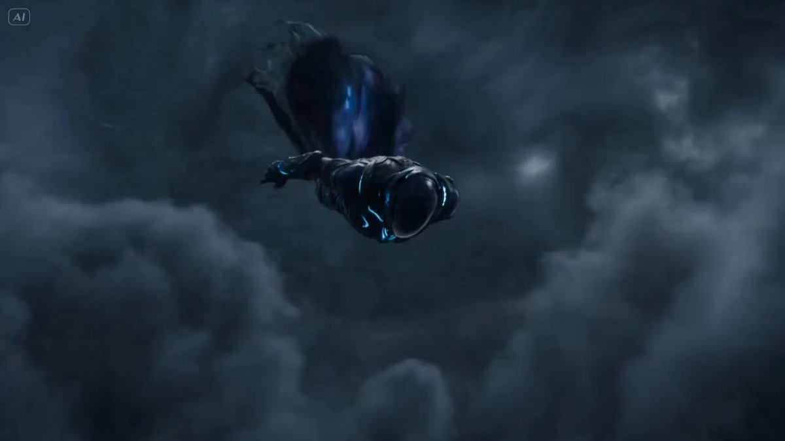

**Prompt**

```text
Tradução em curso
```

[↑ Voltar às categorias](#catalog)

---

<a name="prompt-2102634281587884098"></a>

### Tradução em curso

Autor：[@DDJCXX](https://x.com/DDJCXX) · [Publicação original](https://x.com/DDJCXX/status/2102634281587884098)

Fotografia · Cena de Cinema / Fotograma · Retrato / Selfie · Personagem · Arquitetura / Interiores · Publicado

**Resumo:** Tradução em curso

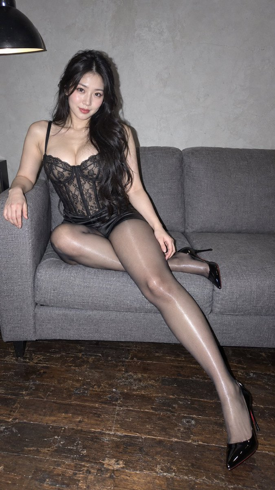

**Prompt**

```text
Tradução em curso
```

[↑ Voltar às categorias](#catalog)

---

<a name="prompt-2102437998826750305"></a>

### Prompt de estilo documental sobre troças de casamento rural chinês, retratando uma fotografia instantânea semioculta da porta com a noiva a agarrar o edredão de peónias na cama de madeira antiga e os amigos a rir e a levantar a manta.

Autor：[@boniusex](https://x.com/boniusex) · [Publicação original](https://x.com/boniusex/status/2102437998826750305)

Cena de Cinema / Fotograma · Publicado

**Resumo:** Prompt de estilo documental sobre troças de casamento rural chinês, retratando uma fotografia instantânea semioculta da porta com a noiva a agarrar o edredão de peónias na cama de madeira antiga e os amigos a rir e a levantar a manta.

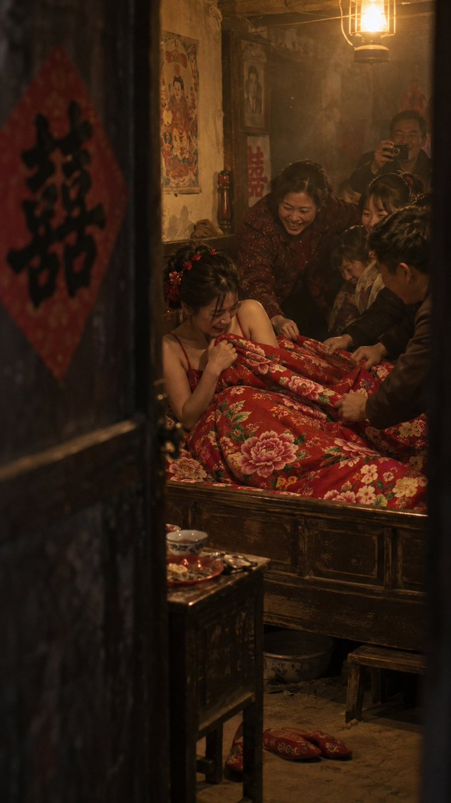

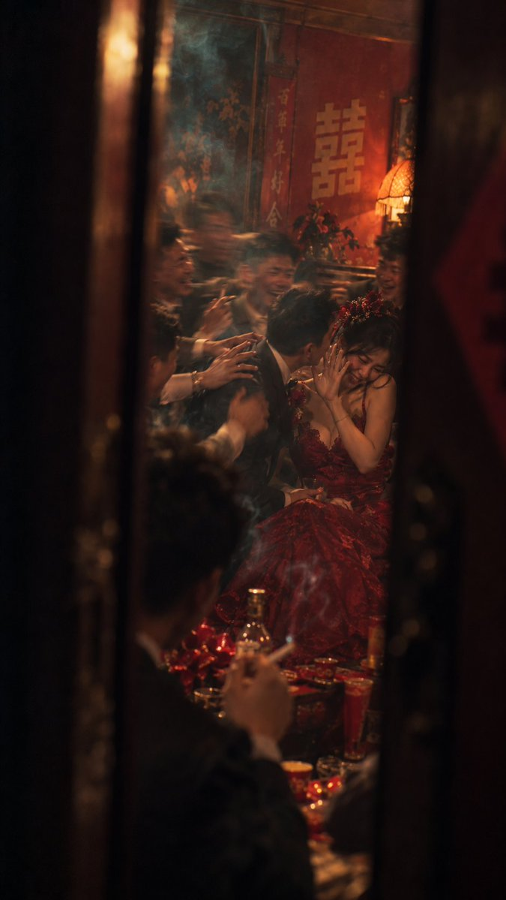

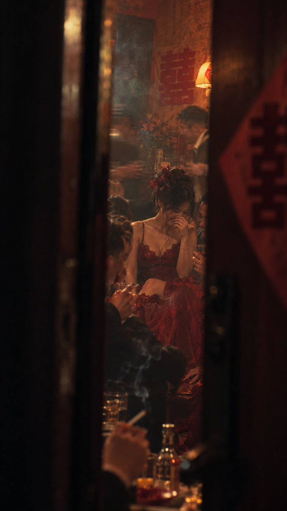

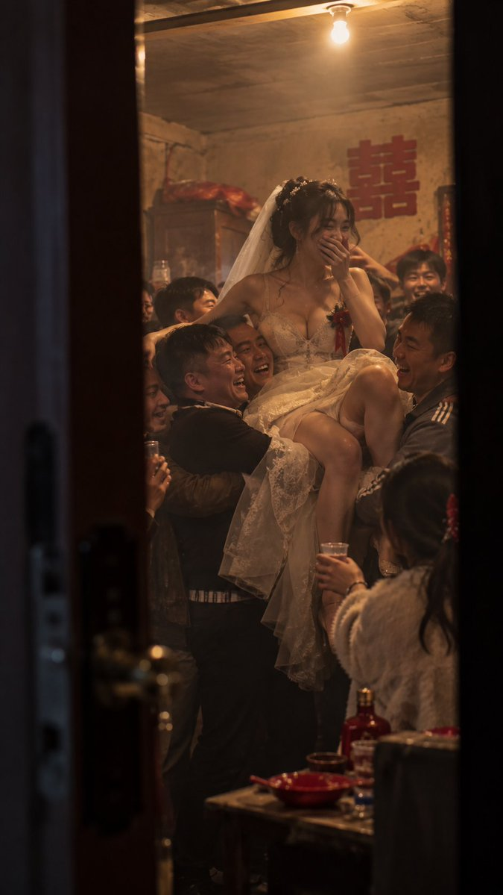

**Prompt**

```text
Instantâneo documental, noiva adulta num vestido de noiva vermelho de alças finas encolhida ao canto de uma cama de madeira antiga, agarrando com firmeza um edredão vermelho vivo com padrão de peónias para tapar o peito, familiares e amigos reunidos à volta da cama a rir, a puxar a manta e a fazer troça, perspetiva semioculta a espreitar de fora da porta, luz amarela quente e ténue, partículas de fumo e poeira em suspensão, crueza autêntica, forte narrativa cinematográfica.
```

[↑ Voltar às categorias](#catalog)

---

<a name="prompt-2102273743989219798"></a>

### Retrato cinematográfico de uma mulher de fantasia azul-gelo com cabelos prateados e elementos luminosos brilhantes.

Autor：[@AIwithMinal](https://x.com/AIwithMinal) · [Publicação original](https://x.com/AIwithMinal/status/2102273743989219798)

Cena de Cinema / Fotograma · Retrato / Selfie · Personagem · Publicado

**Resumo:** Retrato cinematográfico de uma mulher de fantasia azul-gelo com cabelos prateados e elementos luminosos brilhantes.


**Prompt**

```text
Retrato de fantasia cinematográfico ultrarrealista de uma bela jovem mulher com longos cabelos soltos em tom branco-gelo/prateado, impressionantes olhos azul-cristalinos, traços faciais delicados, lábios rosados suaves e naturais e pele clara luminosa. Encontra-se a usar um elegante vestido futurista azul-gelo com intrincados bordados prateados e subtis detalhes brilhantes. Fundo azul mágico escuro repleto de partículas luminosas flutuantes e luzes bokeh de sonho, iluminação etérea e fria, suave luz de recorte a destacar o seu cabelo, contacto visual intenso com a câmara, fios de cabelo altamente detalhados e textura de pele realista, atmosfera elegante de fantasia, profundidade de campo reduzida, bokeh cremoso, fotografia editorial profissional, objetiva de 85mm, f/1.4, HDR, 8K, fotorrealista, composição vertical 9:16.
```

[↑ Voltar às categorias](#catalog)

---

<a name="prompt-2102276867164402042"></a>

### Prompt para cartaz de storyboard de 12 planos com estética cinematográfica premium sobre o processo de preparação de café de filtro manual.

Autor：[@XuekaiGao](https://x.com/XuekaiGao) · [Publicação original](https://x.com/XuekaiGao/status/2102276867164402042)

Banda desenhada / Storyboard · Pôster / Folheto · Cena de Cinema / Fotograma · Comida / Bebida · Publicado

**Resumo:** Prompt para cartaz de storyboard de 12 planos com estética cinematográfica premium sobre o processo de preparação de café de filtro manual.


**Prompt**

```text
Crie um cartaz de storyboard com estética cinematográfica premium e refinada, detalhando o processo de preparação de "café de filtro manual" (pour-over).

Formato:
Página de storyboard vertical 9:16 em estilo editorial, apresentando fotografia gastronómica comercial sofisticada; contém 12 planos macro cinematográficos organizados numa grelha limpa de 3 colunas × 4 linhas. Cada plano do storyboard exibe uma fotografia gastronómica fotorrealista na parte superior e breves notas técnicas de storyboard na parte inferior, cobrindo Ação, Câmara/Enquadramento, Movimento de câmara, Transição e notas de Efeitos Sonoros (SFX).

Tipografia e Títulos:
Título superior:
"CFSP-15"
"POUR-OVER COFFEE"
Subtítulo:
"RICHER MOMENTS IN EVERY SIP"
Canto superior direito:
"15 Seconds"
"12 Micro-Shots"

Estilo Visual:
Anúncio de café de especialidade de luxo, fotografia gastronómica macro hiper-realista, paleta de tons castanhos de café ricos e profundos, iluminação quente e lateral em contraluz, profundidade de campo reduzida, textura brilhante e oleosa de crema, café moído realista e fragmentos de película prateada (chaff), brilhos de espuma cremosa e aveludada, reflexos de iluminação cinematográfica, estética publicitária de topo, detalhes fotorrealistas em 8K, styling gastronómico profissional, com consistência rigorosa dos grãos de café, utensílios e bebida final em todos os planos.

12 Planos Consecutivos:

01 — 0.0–1.2s — A Origem do Café
Grãos de café recém-torrados de torra escura caem no depósito de latão do moinho; fragmentos de película prateada estão espalhados sobre a bancada rústica de madeira.
Ação: Grãos de café a cair no moinho.
Câmara/Enquadramento: Macro 75mm.
Movimento de câmara: Push-in (aproximação).
Transição: Match cut (corte de correspondência).
SFX: Som nítido e estaladiço do choque dos grãos.

02 — 1.2–2.4s — Moagem
As lâminas moem a alta velocidade; o café moído em castanho-escuro escorre como areia fina, levantando uma névoa delicada de pó.
Ação: Grãos de café a serem moídos num pó uniforme.
Câmara/Enquadramento: Macro 90–100mm.
Movimento de câmara: Órbita apertada em torno da saída do pó.
Transição: Whip motion (transição em chicote).
SFX: Ruído áspero e sibilante da moagem.

03 — 2.4–3.6s — Pré-infusão (Bloom)
A água quente de uma chaleira de bico de ganso é vertida em espiral sobre o leito de café; a camada de pó expande-se e incha (bloom), fervilhando com microbolhas ativas.
Ação: A água quente hidrata e desperta o café moído.
Câmara/Enquadramento: Close-up 50mm.
Movimento de câmara: Tilt down (inclinação para baixo).
Transição: Match cut.
SFX: Som suave de água a correr e bolhas a rebentar.

04 — 3.6–4.8s — Extração da Crema
O café denso flui intensamente da extração; a crema castanho-dourada espalha-se lentamente na chávena, refletindo a luz quente.
Ação: O café extrai uma camada dourada de crema.
Câmara/Enquadramento: Close-up 50mm.
Movimento de câmara: Push-in.
Transição: Match cut.
SFX: Zumbido grave da extração e estalitar suave da crema.

05 — 4.8–6.0s — Latte Art / Espuma de Leite
A espuma de leite densa e texturada é vertida na chávena, fundindo-se com o café e delineando um padrão delicado e simétrico de latte art.
Ação: O leite vaporizado e o café fundem-se e ganham forma.
Câmara/Enquadramento: Close-up 50mm.
Movimento de câmara: Push-in suave.
Transição: Match cut.
SFX: Som aveludado do fluxo de leite a entrar.

06 — 6.0–7.1s — Toque Final Superior
A peneira treme delicadamente, e o cacau em pó fino cai como neve sobre a superfície espumosa, criando uma textura aveludada.
Ação: Cacau em pó polvilhado de forma uniforme.
Câmara/Enquadramento: Macro 75mm.
Movimento de câmara: Plano picado com descida suave.
Transição: Match cut.
SFX: Som leve e delicado do pó a assentar.

07 — 7.1–8.3s — Vapor Ascendente
Eflúvios suaves de vapor sobem da superfície do café; a luz quente atravessa o vapor, desenhando uma auréola delicada na borda da chávena.
Ação: O vapor quente sobe naturalmente.
Câmara/Enquadramento: Close-up 50mm.
Movimento de câmara: Tilt up lento.
Transição: Dissolve (dissolvência).
SFX: Ruído de fundo calmo e suave.

08 — 8.3–9.4s — Segurar a Chávena
Os dedos tocam suavemente a parede tépida da chávena de cerâmica; sob profundidade de campo reduzida, a textura dos nós dos dedos e da chávena é nítida, com o fundo desfocado.
Ação: Dedos a levantar a chávena de café.
Câmara/Enquadramento: Close-up 50mm.
Movimento de câmara: Panorâmica a acompanhar a mão.
Transição: Match cut.
SFX: Toque leve da cerâmica a afastar-se da bancada.

09 — 9.4–10.6s — Rasante sobre a Superfície
A câmara desliza rente à superfície do líquido; os reflexos oleosos na crema e as linhas do desenho criam um brilho fluido e espelhado.
Ação: Câmara a planar sobre a superfície do café.
Câmara/Enquadramento: Macro 100mm.
Movimento de câmara: Travelling rasante à superfície.
Transição: Match cut.
SFX: Glissando grave e suave de cordas.

10 — 10.6–11.7s — Mexer Suavemente
Uma colher de prata mexe suavemente o café; a espuma e o café criam um remoinho elegante no interior da chávena.
Ação: Colher de prata a misturar lentamente.
Câmara/Enquadramento: Macro 75mm.
Movimento de câmara: Rotação em torno da colher de prata.
Transição: Whip motion.
SFX: Som cristalino da colher a embater na cerâmica.

11 — 11.7–13.0s — O Primeiro Gole
A chávena de café é levada aos lábios; o vapor desfocado em primeiro plano e a luz quente de fundo definem uma atmosfera acolhedora.
Ação: Levar a chávena à boca para um golo subtil.
Câmara/Enquadramento: Plano aproximado (Close Shot) 35mm.
Movimento de câmara: Push-in suave.
Transição: Match cut.
SFX: Som suave de um golo a ser saboreado.

12 — 13.0–15.0s — Assinatura da Marca
A chávena inteira de café de filtro repousa no centro da bancada iluminada por luz quente; o LOGO e o nome do produto congelam com elegância sobre o fundo castanho-escuro.
Ação: Quadro estático de encerramento.
Câmara/Enquadramento: Plano médio 50mm.
Movimento de câmara: Recuo lento (pull-back).
Transição: Fade out.
SFX: Acorde musical final da marca.
```

[↑ Voltar às categorias](#catalog)

---

<a name="prompt-2102201412503642312"></a>

### A tentativa de lançamento inicial da Starship Falcon 14 para alcançar a órbita terrestre.

Autor：[@Marie8508319540](https://x.com/Marie8508319540) · [Publicação original](https://x.com/Marie8508319540/status/2102201412503642312)

Cena de Cinema / Fotograma · Publicado

**Resumo:** A tentativa de lançamento inicial da Starship Falcon 14 para alcançar a órbita terrestre.


**Prompt**

```text
A primeiríssima tentativa da Starship Falcon 14 de alcançar a órbita da Terra
```

[↑ Voltar às categorias](#catalog)

---

<a name="prompt-2102219008845971613"></a>

### Lançamento cinematográfico completo de um foguetão em Three.js: plataforma, torre, pinças de fixação, ignição, fumo, descolagem, perseguição da câmara até às nuvens. Sem botões, sem HUD, reprodução automática.

Autor：[@WescheNex1q](https://x.com/WescheNex1q) · [Publicação original](https://x.com/WescheNex1q/status/2102219008845971613)

Fotografia · Cena de Cinema / Fotograma · Renderização 3D · Publicado

Publicação original：[@Bhavani\_00007](https://x.com/Bhavani_00007) · [Publicação original](https://x.com/Bhavani_00007/status/2098134452283334781)

**Resumo:** Lançamento cinematográfico completo de um foguetão em Three.js: plataforma, torre, pinças de fixação, ignição, fumo, descolagem, perseguição da câmara até às nuvens. Sem botões, sem HUD, reprodução automática.


**Prompt**

```text
Lançamento cinematográfico completo de um foguetão em Three.js: plataforma, torre, pinças de fixação, ignição, fumo, descolagem, perseguição da câmara até às nuvens. Sem botões, sem HUD, reprodução automática.
```

[↑ Voltar às categorias](#catalog)

---

<a name="prompt-2102223289443877247"></a>

### Prompt de vídeo de montagem cinematográfica com textura de película 35mm de um dia na vida de uma fotógrafa do leste asiático.

Autor：[@laviniavelle](https://x.com/laviniavelle) · [Publicação original](https://x.com/laviniavelle/status/2102223289443877247)

Fotografia · Cena de Cinema / Fotograma · Publicado

**Resumo:** Prompt de vídeo de montagem cinematográfica com textura de película 35mm de um dia na vida de uma fotógrafa do leste asiático.


**Prompt**

```text
Uma montagem cinematográfica numa estética suave e quente de película 35mm captando um dia tranquilo na vida de uma jovem fotógrafa do leste asiático. Ela tem o cabelo apanhado num coque casual e descontraído e veste uma t-shirt cropped branca simples, calças de ganga azul de cintura subida e uma mala a tiracolo de lona castanha. Carrega uma clássica câmara fotográfica SLR vintage de 35mm com uma alça de couro.

O vídeo flui através de uma série de momentos naturais e cinematográficos: primeiro, ela está no exterior de uma casa moderna de madeira durante a hora dourada, a sorrir suavemente enquanto a luz quente do sol cria belos reflexos de lente (lens flares) e luz de contorno em redor dela. Depois, agacha-se junto a um passeio fotografando cuidadosamente uma pequena flor cor-de-rosa a crescer pelo pavimento, com uma perspetiva de câmara íntima em ângulo baixo. Em seguida, visita uma acolhedora loja de livros e câmaras vintage, percorrendo as prateleiras e examinando a sua velha câmara de película sob uma iluminação interior quente. A cena transita para cima em direção à luz do sol a filtrar-se através das folhas densas de árvores verdes, criando um bokeh de sonho, reflexos de lente suaves e uma textura nostálgica de película. Ela então caminha pacificamente por um parque arborizado, vista de trás, com a sua mala de ombro castanha a mover-se naturalmente enquanto carrega a câmara, com a luz dourada do pôr do sol a iluminar o caminho. Finalmente, ela para no parque e levanta a sua câmara vintage em direção ao espetador, tirando uma fotografia enquanto o sol quente brilha diretamente atrás dela, criando uma forte contraluz dourada, luz de contorno resplandecente, reflexo de lente cinematográfico e uma bela e reduzida profundidade de campo.

Transições cinematográficas suaves entre todas as cenas, movimento corporal realista e natural, movimento subtil de câmara à mão, grão autêntico de película 35mm, gradação de cor suave e quente, textura de pele realista, luz solar natural, profundidade de campo reduzida, bokeh cremoso, iluminação atmosférica, detalhes fotorrealistas, sensação nostálgica de fotografia documental, composição cinematográfica, ritmo suave, continuidade visual perfeita, aspeto cinematográfico de película de alta qualidade, resolução 4K.
```

[↑ Voltar às categorias](#catalog)

---

<a name="prompt-2102106915635601452"></a>

### Plano de animação desenhado à mão de um homem sentado num banco, uma águia com a bandeira dos EUA a pousar na sua cabeça, e o homem a gritar e a correr.

Autor：[@1littlecoder](https://x.com/1littlecoder) · [Publicação original](https://x.com/1littlecoder/status/2102106915635601452)

Cena de Cinema / Fotograma · Personagem · Publicado

Publicação original：[@fal](https://x.com/fal) · [Publicação original](https://x.com/fal/status/2102102544331784493)

**Resumo:** Plano de animação desenhado à mão de um homem sentado num banco, uma águia com a bandeira dos EUA a pousar na sua cabeça, e o homem a gritar e a correr.


**Prompt**

```text
Um homem #Image1 está sentado num banco de jardim. O seu pescoço estica-se para cima de surpresa quando uma minúscula águia com a bandeira dos EUA no corpo aterra na sua cabeça. Plano médio fixo, movimento expressivo desenhado à mão. Ele começa a gritar e a correr!
```

[↑ Voltar às categorias](#catalog)

---

<a name="prompt-2101910957022912557"></a>

### Sprite 柠檬汽水 9:16 竖版分镜头商业广告生成提示词，含水花、倒酒与产品特写镜头控制。

Autor：[@HeyRu0by](https://x.com/HeyRu0by) · [Publicação original](https://x.com/HeyRu0by/status/2101910957022912557)

Banda desenhada / Storyboard · Marketing de Produto · Cena de Cinema / Fotograma · Produto · Publicado

**Resumo:** Sprite 柠檬汽水 9:16 竖版分镜头商业广告生成提示词，含水花、倒酒与产品特写镜头控制。


**Prompt**

```text
Crie um anúncio sofisticado e ultrarrealista de 10 segundos do refrigerante Sprite Limão-Lima no formato vertical 9:16. Utilize a imagem do produto Sprite carregada como referência exata do produto. Preserve a forma original da garrafa, proporções, tampa verde, logótipo da Sprite, design do rótulo, cores, tipografia e imagem de marca. Não redesenhe, distorça, duplique ou altere o produto.

Estilo Geral:
Luz do dia brilhante de verão, paleta de cores verde e azul fresca, gaseificação efervescente, gelo realista, fatias suculentas de limão e lima, cinematografia comercial enérgica, publicidade de bebidas premium, fotorrealista em 4K/8K, detalhes macro nítidos, gotas de água realistas, fotografia de líquidos em alta velocidade, iluminação cinematográfica, profundidade de campo reduzida.

Cena 1 — 0–2s | Dia Fresco
Uma garrafa fresca de Sprite ergue-se heroicamente sobre uma mesa exterior luminosa durante uma tarde soalheira. Fatias frescas de limão e lima e gelo rodeiam a garrafa. A luz solar cria belos reflexos e um subtil reflexo de lente (lens flare). A câmara avança lentamente em direção ao produto.
Ambiente: Fresco, soalheiro, refrescante.

Cena 2 — 2–5s | Macro do Produto
Grande plano extremo da garrafa de Sprite coberta por condensação realista e gotas de água. A câmara efetua um avanço suave e cinematográfico em direção ao logótipo da Sprite, enquanto gelo e gotas efervescentes se movem em redor da garrafa.
Movimento: Avanço macro rápido + salpico de água + bolhas de gaseificação.

Cena 3 — 5–7s | Salpico de Limão-Lima
Fatias frescas de limão e lima irrompem através de água gaseificada efervescente em câmara lenta. Pequenas bolhas, gotículas e partículas de sumo cítrico voam pelo ar contra um fundo limpo azul-esverdeado.
Câmara: Câmara lenta macro de alta velocidade.

Cena 4 — 7–10s | O Servir Perfeito
Sprite fresca é vertida da garrafa refrigerada para um copo transparente repleto de cubos de gelo cristalinos. O líquido cria um belo salpico efervescente, com bolhas a subir rapidamente pelo copo. Fatias de limão e lima repousam ao lado do copo.
Câmara: Plano de seguimento suave em ângulo lateral.

Cena 5 — 10–13s | Frescura Extrema
Plano macro extremo de fatias de lima, gelo cintilante, bolhas de gaseificação e gotas refrescantes de Sprite. A luz reflete-se em cada gota de água, criando uma sensação estival vibrante e enérgica.
Movimento: Salpico em câmara lenta + bolhas flutuantes.

Cena 6 — 13–16s | Herói do Produto
A garrafa de Sprite surge centrada por entre cubos de gelo flutuantes, fatias de limão e lima e gotas efervescentes. O fundo é luminoso, fresco e ligeiramente desfocado. A garrafa permanece perfeitamente nítida e dominante no enquadramento.
Câmara: Órbita cinematográfica suave em redor do produto.

Cena 7 — 16–18s | Momento do Gole Refrescante
Grande plano de um copo transparente repleto de Sprite gelada, decorado com limão e lima frescos. Bolhas de gaseificação sobem continuamente enquanto a luz do sol cria reflexos cintilantes através do copo.
Câmara: Avanço lento com subtis efeitos de brilho.

Cena 8 — 18–20s | Plano Heroico Final
Termine com um plano heroico premium do produto Sprite. A garrafa exata de Sprite está ao lado de um copo fresco, rodeada por gelo e fatias de limão e lima. Gotas de água fresca permanecem visíveis na garrafa. A luz solar brilhante e os subtis efeitos atmosféricos verdes/azuis criam um enquadramento comercial final de grande impacto.

Sensação visual final: Frio. Nítido. Fresco. Refrescante.

Bloqueio de Produto e Qualidade
Referência exata da garrafa de Sprite. Logótipo e rótulo exatos. Imagem de marca verde exata. Nenhuma embalagem alterada. Sem garrafas adicionais. Sem texto distorcido. Sem logótipos aleatórios. Sem marcas de água. Sem pessoas. Sem mãos. Sem física de líquidos irrealista. Mantenha o produto nítido e reconhecível ao longo de todo o vídeo.
```

[↑ Voltar às categorias](#catalog)

---

<a name="prompt-2101582317319840038"></a>

### Um prompt de vídeo time-lapse macro cinematográfico a retratar uma jovem planta de milho a crescer e a desenvolver-se num campo agrícola.

Autor：[@de\_mon010](https://x.com/de_mon010) · [Publicação original](https://x.com/de_mon010/status/2101582317319840038)

Cena de Cinema / Fotograma · Publicado

**Resumo:** Um prompt de vídeo time-lapse macro cinematográfico a retratar uma jovem planta de milho a crescer e a desenvolver-se num campo agrícola.


**Prompt**

```text
Crie um vídeo macro cinematográfico e fotorrealista de uma jovem planta de milho a crescer num campo agrícola recém-cultivado. Comece com uma minúscula plântula de milho a emergir de um solo castanho fértil e, em seguida, mostre um crescimento suave e natural em time-lapse à medida que o caule verde fica mais alto, as folhas se desdobram e expandem, e a inflorescência masculina central se desenvolve gradualmente. Luz quente da hora dourada, suave névoa matinal, textura realista do solo, profundidade de campo reduzida, brisa suave a mover as folhas, campo agrícola natural em segundo plano, crescimento botânico realista, folhas verdes detalhadas, transformação contínua e suave, câmara cinematográfica a aproximar-se lentamente da planta, ultrarrealista, 4K, vertical 9:16, sem pessoas, sem texto, sem crescimento de aspeto artificial.
```

[↑ Voltar às categorias](#catalog)

---

<a name="prompt-2101643248834150910"></a>

### Retrato realista e espontâneo de interior de uma mulher a usar gola alta preta junto a persianas de janela.

Autor：[@\_\_Libra1](https://x.com/__Libra1) · [Publicação original](https://x.com/__Libra1/status/2101643248834150910)

Cena de Cinema / Fotograma · Retrato / Selfie · Personagem · Publicado

**Resumo:** Retrato realista e espontâneo de interior de uma mulher a usar gola alta preta junto a persianas de janela.


**Prompt**

```text
Use a folha de referência de personagem carregada como a referência principal de identidade para a mesma mulher. Mantenha o rosto e a aparência geral dela altamente consistentes e reconhecíveis. Preserve os seus olhos verde-avelã, estrutura facial natural, nariz característico, sinal de beleza na bochecha esquerda, tom de pele oliva quente e cabelos castanho-escuros compridos e ondulados com a mesma cor, comprimento, volume e textura natural.

Crie um retrato de interior autêntico e com sentimento humano de uma jovem sentada perto de uma janela.

Ela veste uma camisola de gola alta canelada preta justa e calças escuras. O vestuário deve parecer natural e com uso diário, com textura de malha realista, dobras suaves e movimento de tecido autêntico.

Ela está sentada com um joelho levantado, o corpo ligeiramente virado para a câmara. Uma mão repousa suavemente contra o queixo e o lábio inferior numa pose tranquila e reflexiva. A sua expressão é calma, direta e natural, com um olhar suave de boca fechada em vez de um sorriso forçado.

O seu cabelo castanho-escuro comprido e ondulado cai sobre os ombros com volume natural, fios individuais e pequenos cabelos rebeldes. A maquilhagem é suave e natural, com textura de pele realista, poros, detalhes faciais finos e imperfeições subtis.

O fundo é um cenário de interior simples com persianas na janela, criando luz e sombras listadas suaves ao longo da cena. Use a luz natural da janela como luz principal, com transições suaves, reflexos realistas no cabelo e contraste contido no rosto.

A fotografia deve transmitir a sensação de um retrato genuíno e espontâneo, não de uma fotografia de beleza de estúdio. Use microexpressões naturais, linguagem corporal relaxada, anatomia realista, mãos e dedos verosímeis, rugas autênticas na roupa, variações naturais de iluminação, sombras realistas e qualidades fotográficas subtilmente imperfeitas.

Fotografia: retrato cinematográfico de interior, luz natural da janela, objetiva de 50mm, profundidade de campo reduzida, bokeh subtil em segundo plano, composição em estilo documental, tons de pele fiéis à realidade, gradação de cor contida, detalhe fotorrealista.

Evitar: pele plástica, retoque excessivo, beleza artificial, maquilhagem exagerada, feições perfeitamente simétricas, aspeto de boneca, olhos irrealistas, mãos distorcidas, dedos adicionais, anatomia deformada, cabelo falso, HDR excessivo, saturação excessiva, poses rígidas ou um aspeto demasiado artificial/gerado.
```

[↑ Voltar às categorias](#catalog)

---

<a name="prompt-2101648666771730662"></a>

### Prompt de movimento de câmara de aproximação lenta e órbita para a esquerda para o panorama do palácio celestial no mar de nuvens.

Autor：[@PixelAigc](https://x.com/PixelAigc) · [Publicação original](https://x.com/PixelAigc/status/2101648666771730662)

Fotografia · Cena de Cinema / Fotograma · Publicado

**Resumo:** Prompt de movimento de câmara de aproximação lenta e órbita para a esquerda para o panorama do palácio celestial no mar de nuvens.


**Prompt**

```text
A câmara aproxima-se lentamente, descreve uma rotação orbital lenta para a esquerda, revelando a magnificência do palácio celestial
```

[↑ Voltar às categorias](#catalog)

---

<a name="prompt-2101670493380317524"></a>

### Cena noturna num terraço moderno no piso superior, foto em grande-angular em contra-picado de uma mulher do leste asiático com um minivestido de cetim preto, realçando as linhas das pernas em primeiro plano e a profundidade da paisagem urbana noturna.

Autor：[@nicebabycat](https://x.com/nicebabycat) · [Publicação original](https://x.com/nicebabycat/status/2101670493380317524)

Fotografia · Cena de Cinema / Fotograma · Retrato / Selfie · Personagem · Item de Moda · Paisagem urbana / Rua · Publicado

Publicação original：[@boniusex](https://x.com/boniusex) · [Publicação original](https://x.com/boniusex/status/2101666495625609256)

**Resumo:** Cena noturna num terraço moderno no piso superior, foto em grande-angular em contra-picado de uma mulher do leste asiático com um minivestido de cetim preto, realçando as linhas das pernas em primeiro plano e a profundidade da paisagem urbana noturna.


**Prompt**

```text
Um retrato cinematográfico noturno em contra-picado num terraço moderno no piso superior, apresentando uma mulher adulta do leste asiático num minivestido de cetim preto brilhante, inclinando-se em direção à câmara.

Rabo de cavalo alto, joias delicadas, carteira com alça de corrente, contacto visual direto, expressão serena e subtilmente sedutora.

Perspetiva grande-angular de smartphone em contra-picado extremo, primeiro plano muito próximo, escala perto-longe exagerada, forte geometria diagonal, profundidade dramática, pernas proeminentes e sandálias de salto alto em primeiro plano.

Uma mesa refletora com uma garrafa e um copo parcialmente desfocados perto da lente, criando um enquadramento marcante em primeiro plano e uma profundidade espacial imersiva.

Terraço moderno no piso superior à noite, guardas de vidro, arranha-céus iluminados e luzes da cidade em segundo plano, iluminação interior quente misturada com o brilho noturno urbano e frio.

Textura de pele fotorrealista, anatomia realista, dobras naturais do tecido, fotografia editorial espontânea, forte separação entre primeiro plano, plano médio e segundo plano, espaço negativo cinematográfico, sujeito único, sem segunda pessoa, sem colagem, sem texto legível, vertical 9:16.
```

[↑ Voltar às categorias](#catalog)

---

<a name="prompt-2101569698319958447"></a>

### Um jovem com um casaco com capuz escuro canaliza e liberta ondas de choque de energia ciano num beco de calçada.

Autor：[@KevinVailAI](https://x.com/KevinVailAI) · [Publicação original](https://x.com/KevinVailAI/status/2101569698319958447)

Cena de Cinema / Fotograma · Personagem · Publicado

**Resumo:** Um jovem com um casaco com capuz escuro canaliza e liberta ondas de choque de energia ciano num beco de calçada.


**Prompt**

```text
Um jovem com um casaco com capuz escuro e oversized de pé num antigo beco de calçada ao entardecer. Uma brilhante energia ciano-néon surge em redor das suas mãos enquanto partículas flutuantes e folhas levitam à sua volta em câmara lenta. Ele projeta as mãos para a frente, libertando uma onda de choque de luz luminescente brilhante e névoa cintilante em direção à câmara, terminando com brasas flutuantes. Proporção vertical 9:16, ultrarrealista, iluminação cinematográfica, renderização de VFX fotorrealista.
```

[↑ Voltar às categorias](#catalog)

---

<a name="prompt-2101548200981393654"></a>

### Grande plano extremo em estilo de cinema wuxia oriental de heroína, moldura com mãos desfocadas em primeiro plano e iluminação dura em claro-escuro.

Autor：[@DDJCXX](https://x.com/DDJCXX) · [Publicação original](https://x.com/DDJCXX/status/2101548200981393654)

Cena de Cinema / Fotograma · Retrato / Selfie · Publicado

Publicação original：[@DDJCXX](https://x.com/DDJCXX) · [Publicação original](https://x.com/DDJCXX/status/2101521394739900701)

**Resumo:** Grande plano extremo em estilo de cinema wuxia oriental de heroína, moldura com mãos desfocadas em primeiro plano e iluminação dura em claro-escuro.


**Prompt**

```text
Fotograma de filme wuxia oriental live-action hiper-realista, composição widescreen 16:9, grande plano extremo do rosto a uma distância muito próxima, textura cinematográfica autêntica.

Uma heroína espadachim leste-asiática adulta virada de frente para a câmara, com a câmara a uma distância extremamente reduzida; o enquadramento contém apenas o seu rosto, ambas as mãos, cabelo preto comprido e uma fração dos ombros. A personagem encontra-se no centro do ecrã, com o corpo ligeiramente inclinado para a frente, olhos fixos na câmara, com um olhar penetrante, calmo e agressivo.

As suas mãos erguem-se à frente da objetiva; uma mão entra pelo canto superior direito do enquadramento e a outra entra pelo canto inferior direito e centro, entrecruzando-se para formar uma moldura irregular que enclausura os olhos entre os dedos. A palma e os dedos em primeiro plano estão extremamente perto da objetiva, encontrando-se visivelmente desfocados e ocupando uma grande área no lado direito do ecrã com um gesto fluido e afiado.

Rosto feminino leste-asiático adulto, 20–30 anos, requintado, altivo, austero, com presença de protagonista de cinema wuxia, textura de pele realista.

Cabelo preto comprido apanhado no alto, fios compridos e finos soprados por um vento forte sobre a testa, olhos e maçãs do rosto, com algumas madeixas a atravessar todo o enquadramento a partir da esquerda.

Relação de luz e sombra no rosto: Todo o rosto deve ser predominantemente escuro, com cerca de 65%–75% em sombra. A luz principal é um feixe de luz solar natural dura e autêntica proveniente do canto superior direito da imagem, com direção clara, formando uma linha de separação muito nítida entre luz e sombra. Os dedos, a palma e os cabelos em primeiro plano bloqueiam parte do sol, projetando sombras reais, irregulares e recortadas sobre o rosto da personagem. Apenas um pequeno raio de sol passa entre os dedos e os fios de cabelo, cortando diagonalmente um olho, a arcada supraciliar, a cana do nariz e uma pequena porção da maçã do rosto, criando uma zona iluminada estreita e definida. O outro olho permanece em grande parte na sombra, mas a pupila continua visível. Lábios, queixo, mandíbula e pescoço mantêm uma escuridão evidente; sem luz de preenchimento frontal.

Fundo minimalista, apenas um céu azul-pálido de baixa saturação. Os olhos situam-se perto do centro da imagem; os olhos são a zona com maior nitidez, a palma em primeiro plano está profundamente desfocada, uma grande quantidade de cabelo preto comprido entra pela esquerda e o lado direito é ocupado pelos dedos em primeiro plano, gerando uma forte sensação de envolvimento.

ARRI Alexa 35 / Alexa Mini LF cinematic look, 65mm lens, T2.0, ISO 800, 1/1000s, focus on the eyes, hard natural sunlight, face slightly underexposed, strong chiaroscuro lighting, deep facial shadows, subtle film grain.
```

[↑ Voltar às categorias](#catalog)

---

<a name="prompt-2101311302841078204"></a>

### Anúncio cinematográfico de 15 segundos para um relógio de gama alta, com grandes planos escuros, detalhes macro, filmagens urbanas de estilo de vida e um plano de destaque do produto.

Autor：[@navi\_Ai2](https://x.com/navi_Ai2) · [Publicação original](https://x.com/navi_Ai2/status/2101311302841078204)

Marketing de Produto · Cena de Cinema / Fotograma · Personagem · Paisagem urbana / Rua · Publicado

**Resumo:** Anúncio cinematográfico de 15 segundos para um relógio de gama alta, com grandes planos escuros, detalhes macro, filmagens urbanas de estilo de vida e um plano de destaque do produto.


**Prompt**

```text
Crie um anúncio cinematográfico premium de 15 segundos para uma marca global de estilo de vida. Comece com um grande plano dramático do produto num ambiente escuro e luxuoso, com iluminação cinematográfica suave e partículas atmosféricas subtis. Aos 3 segundos, faça uma transição suave para planos macro dinâmicos que mostrem o design premium e os detalhes do produto. Dos 7 aos 11 segundos, mostre um jovem profissional elegante a utilizar o produto com confiança num ambiente citadino internacional moderno, com movimentos de câmara elegantes e profundidade de campo reduzida. Dos 11 aos 15 segundos, regresse a um plano de destaque (hero shot) do produto com um fundo limpo, iluminação de contorno dramática e espaço para o logótipo e o slogan da marca. Cinematografia publicitária de topo ultrarrealista, gradação de cor premium, transições suaves, reflexos realistas, detalhe em 4K, estética publicitária internacional sofisticada, sem texto extra, sem marca de água.
```

[↑ Voltar às categorias](#catalog)

---

<a name="prompt-2101007280040784269"></a>

### Plano contínuo de 15 segundos com câmara à mão de uma mulher a comer sushi, progredindo através de um choque de azedo extremo, repugnância, surpresa e deleite.

Autor：[@EndFolding79421](https://x.com/EndFolding79421) · [Publicação original](https://x.com/EndFolding79421/status/2101007280040784269)

Cena de Cinema / Fotograma · Personagem · Publicado

**Resumo:** Plano contínuo de 15 segundos com câmara à mão de uma mulher a comer sushi, progredindo através de um choque de azedo extremo, repugnância, surpresa e deleite.


**Prompt**

```text
Plano cinematográfico único e contínuo de 15 segundos com câmara à mão. Uma tomada ininterrupta do início ao fim. Sem cortes, sem transições, sem reinicializações de câmara.

A <Picture 0> é exatamente o primeiro fotograma.

Cena:
Uma jovem fictícia e original no início dos seus vinte anos está sentada ao balcão de um acolhedor bistrô de sushi diurno. Preserve a identidade facial exata e a aparência física da referência de personagem fornecida ao longo de todo o plano. Ela tem pele clara natural com sardas visíveis, olhos azuis brilhantes e cabelos ruivos acobreados compridos e naturalmente encaracolados, soltos sobre os ombros. O seu cabelo tem fios individuais realistas, volume natural e movimento suave. Ela usa maquilhagem natural suave, lábios num tom rosa suave e uma gargantilha grossa de prata polida.

Ela veste uma camisola de manga comprida em malha translúcida verde viva, caindo ligeiramente de um ombro descoberto sobre uma camisola interior verde a condizer, correspondendo exatamente à imagem inicial. Sem marcas ou logótipos visíveis.

O bistrô de sushi tem um longo balcão de madeira escura polida com um caminho de mesa em rotim entrançado, paredes num tom creme acolhedor, rolos decorativos em branco sem escrita legível, armários com iluminação suave e uma cozinha aberta desfocada com chefs de sushi a moverem-se naturalmente ao fundo. Uma orquídea vermelha repousa por perto. Uma grande janela inunda o restaurante com a luz brilhante do meio-dia, com árvores verdes luxuriantes visíveis no exterior.

À sua frente encontra-se um prato de cerâmica com sushi variado, um pequeno prato para molho de soja, gengibre em conserva cor-de-rosa, um guardanapo e pauzinhos de madeira.

Composição:
Mantenha a mulher no TERÇO DIREITO do enquadramento durante todo o plano. Nunca a centre.

Filme ligeiramente abaixo do nível dos olhos dela, através do balcão. O longo balcão e a cozinha desfocada estendem-se pelos dois terços esquerdos do enquadramento.

O prato de sushi em primeiro plano e o caminho entrançado do balcão permanecem ligeiramente desfocados ao longo da borda inferior.

Mantenha um ângulo holandês constante de 10–12 graus ao longo de todo o vídeo. Nunca nivele o horizonte.

Movimento de câmara:
Cinematografia lúdica e natural com câmara à mão. O operador de câmara parece apoiar os cotovelos perto do balcão, criando uma oscilação respiratória subtil, microtremores minúsculos e movimentos suaves e imperfeitos.

Ao longo do plano, deslize a câmara lenta e ligeiramente ao longo do balcão, aproximando-a do rosto dela.

Nunca fique perfeitamente estático.

A luz suave da janela cria ocasionalmente um reflexo de lente natural e subtil.

Cronograma de ação e emoção:

0–1 segundos:
A ação começa imediatamente no primeiríssimo fotograma.

Ela já segura um nigiri de camarão inteiro com os seus pauzinhos: camarão rosa-pálido aberto em borboleta sobre uma pequena almofada de arroz.

Ela levanta-o rapidamente e põe o nigiri de camarão inteiro na boca de uma só vez.

Sem hesitações e sem preparação lenta.

1–4 segundos:
O sabor azedo atinge-a INSTANTANEAMENTE com uma intensidade cómica exagerada.

Os seus olhos fecham-se com força.

Os seus lábios franzem-se dramaticamente em torno das suas bochechas cheias.

Todo o seu rosto se contrai com o azedo.

Os seus ombros estremecem.

Ela abana rapidamente a cabeça de um lado para o outro, fazendo com que o seu longo cabelo ruivo encaracolado balance, chicoteie e oscile naturalmente em volta do rosto e dos ombros.

Os seus pauzinhos escorregam da mão e caem ruidosamente sobre o prato de cerâmica.

Ela bate suavemente com um punho no balcão uma ou duas vezes enquanto continua a mastigar.

A reação tem de ser imediata, expressiva e fisicamente legível.

4–8 segundos:
O choque do azedo transforma-se em repugnância genuína.

A sua expressão torna-se subitamente mais inexpressiva e profundamente enojada.

Ela mastiga cada vez mais devagar.

O seu nariz franze-se.

Ela tem uma ligeira ânsia.

A sua língua empurra a comida para uma das bochechas, como se não tolerasse o sabor.

Ela agarra o guardanapo e aproxima-o da boca, preparando-se claramente para cuspir a comida.

Os seus olhos revelam desilusão e traição.

8–11 segundos:
Com o guardanapo a tocar ou a pairar diretamente em frente aos seus lábios, ela congela de repente.

As suas sobrancelhas sobem abruptamente.

Os seus olhos arregalam-se.

Algo no sabor muda inesperadamente.

Ela baixa lentamente o guardanapo cerca de uma polegada.

Ela mastiga uma vez.

Pausa.

Ela mastiga uma segunda vez.

A sua expressão muda de repugnância → confusão → curiosidade desconfiada.

Torne esta transformação claramente visível através dos seus olhos, sobrancelhas, bochechas e boca.

11–15 segundos:
A sua expressão explode gradualmente em puro deleite.

Os seus olhos fecham-se suavemente de prazer.

Um enorme e genuíno sorriso espalha-se pelo seu rosto enquanto continua a mastigar.

Os seus ombros relaxam por completo.

Ela recosta-se e derrete-se ligeiramente para trás no banco.

Ela bate levemente com os pés por baixo do balcão de tanta felicidade.

Ela faz uma expressão subtil de cantarolar com agrado, sem falar.

Ainda a sorrir, estende novamente a mão com os pauzinhos em direção a outro nigiri de camarão no prato, querendo claramente dar outra dentada.

Termine o plano enquanto ela alcança alegremente a peça seguinte.

Desempenho:
Priorize a interpretação facial expressiva e mudanças emocionais fisicamente legíveis.

A progressão emocional deve ser extremamente clara:

choque azedo instantâneo → repugnância → prestes a cuspir → surpresa repentina → curiosidade desconfiada → prazer intenso

Piscar de olhos natural, movimento ocular, movimento das bochechas, mastigação da mandíbula, respiração, movimento dos ombros, gestos manuais e física realista de cabelos encaracolados soltos.

BLOQUEIO DE IDENTIDADE: Preserve a identidade facial exata da mulher a partir da referência de personagem fornecida e do fotograma inicial ao longo de todo o vídeo. Não altere a sua estrutura facial, sardas, cor dos olhos, tom de pele, idade ou cabelo ruivo acobreado encaracolado. Não altere o seu penteado para um rabo de cavalo ou cabelo liso.

Estilo visual:
Sensação cinematográfica indie japonesa do quotidiano (slice-of-life).
Textura de película de 35 mm.
Profundidade de campo reduzida.
Textura de pele suave e natural com as suas sardas claramente preservadas.
Luz diurna quente combinada com um subtil tom de película quente e azul-petróleo.
Grão fino e suave.
Atenuação natural das altas luzes (highlight rolloff).
Ambiente de restaurante acolhedor e intimista.
Movimento humano realista e interação realista com a comida.

Restrições importantes:
Um único plano contínuo de 15 segundos.
Sem cortes.
Sem mudanças de cena.
Sem saltos no tempo.
Sem câmara lenta.
Sem efeito de congelamento de imagem.
Não centre a mulher.
Mantenha o ângulo holandês.
Sem diálogos.
Sem legendas para surdos.
Sem legendas normais.
Sem texto legível.
Apenas rolos em branco e ementas em branco.
Sem logótipos.
Sem marcas.
Sem personagens reconhecíveis.
Sem figuras de mascotes.
Sem personagens protegidas por direitos de autor.
Sem pessoas reais.
```

[↑ Voltar às categorias](#catalog)

---

<a name="prompt-2100644208600400163"></a>

### Descida cinematográfica submarina contínua desde a superfície soalheira até ao abismo com fauna e medusas bioluminescentes.

Autor：[@mys1111](https://x.com/mys1111) · [Publicação original](https://x.com/mys1111/status/2100644208600400163)

Cena de Cinema / Fotograma · Publicado

**Resumo:** Descida cinematográfica submarina contínua desde a superfície soalheira até ao abismo com fauna e medusas bioluminescentes.


**Prompt**

```text
Viagem ao fundo do mar num estilo cinematográfico realista e hipnotizante.

Uma descida suave e contínua desde a superfície soalheira do oceano até às profundezas abissais. A luz do sol filtra-se em feixes dourados e azuis que se vão desvanecendo gradualmente. Cardumes de peixes prateados cruzam o enquadramento, corais vibrantes, medusas luminosas e criaturas bioluminescentes surgem à medida que a profundidade aumenta. A água torna-se cada vez mais escura, profunda e infinita, com partículas flutuantes e um ambiente de mistério e fascínio.

A câmara avança num plano contínuo e fluido, empurrando suavemente para a frente e para baixo, criando uma sensação de imersão total e vertigem controlada. Iluminação realista com contraste dramático entre a luz que se desvanece e os lampejos bioluminescentes.

Música clássica orquestral majestosa e intensa, com cordas profundas, metais e crescendos que evocam assombro e grandiosidade, sincronizada com a descida.
```

[↑ Voltar às categorias](#catalog)

---

<a name="prompt-2100821608911048833"></a>

### Prompt de anúncio cinematográfico vertical de produto para DJI Osmo Pocket 3 apresentando cenas detalhadas plano a plano com gimbal e na rua.

Autor：[@Urwa\_345](https://x.com/Urwa_345) · [Publicação original](https://x.com/Urwa_345/status/2100821608911048833)

Marketing de Produto · Cena de Cinema / Fotograma · Produto · Paisagem urbana / Rua · Publicado

**Resumo:** Prompt de anúncio cinematográfico vertical de produto para DJI Osmo Pocket 3 apresentando cenas detalhadas plano a plano com gimbal e na rua.


**Prompt**

```text
Crie um anúncio cinematográfico premium de 8 segundos para a autêntica DJI Osmo Pocket 3, formato vertical 9:16.

0–2 seg: Aproximação lenta da câmara em direção à DJI Osmo Pocket 3 pousada numa secretária moderna, com o ecrã tátil a brilhar suavemente.

2–4 seg: Movimento de câmara macro em redor da objetiva e do mecanismo do gimbal, destacando o design compacto e premium.

4–7 seg: Transição suave para um criador a segurar a câmara enquanto filma uma bela rua da cidade durante a hora dourada, movimento realista de câmara na mão.

7–9 seg: Transição para a câmara montada num pequeno tripé com vista para uma paisagem montanhosa ao pôr do sol.

9–10 seg: Plano heroico final da DJI Osmo Pocket 3, órbita cinematográfica lenta com o ecrã e a objetiva da câmara claramente visíveis.

Anúncio fotorrealista de câmara profissional, movimento realista de gimbal, transições suaves, profundidade de campo cinematográfica, publicidade de tecnologia premium, design de produto autêntico, iluminação natural, altamente detalhado, sem sobreposições de texto, sem marca de água.
```

[↑ Voltar às categorias](#catalog)

---

<a name="prompt-2100809690850664865"></a>

### Prompt para vídeo cinemático de combate de gângsteres AAA ultrarrealista de 30 segundos, incluindo HUD completo e progressão cronológica de luta de rua até à chegada do chefe.

Autor：[@Inshrah\_ali\_](https://x.com/Inshrah_ali_) · [Publicação original](https://x.com/Inshrah_ali_/status/2100809690850664865)

Cena de Cinema / Fotograma · Publicado

**Resumo:** Prompt para vídeo cinemático de combate de gângsteres AAA ultrarrealista de 30 segundos, incluindo HUD completo e progressão cronológica de luta de rua até à chegada do chefe.


**Prompt**

```text
Crie uma cinemática de jogabilidade de GÂNGSTER em mundo aberto ultrarrealista de 30 segundos com duas seitas de rua rivais a lutar numa cidade moderna e crua à noite. Faça o vídeo inteiro parecer uma gravação de jogabilidade AAA em voga, como se um jogador estivesse a controlar ativamente a personagem principal.

ECRÃ DE JOGABILIDADE / HUD — MUITO IMPORTANTE:
Adicione uma interface de jogabilidade moderna, polida e original que permaneça visível naturalmente ao longo de todo o vídeo:

Canto superior esquerdo: pequeno retrato circular da personagem + BARRA DE VIDA verde e BARRA DE ENERGIA azul

Canto superior direito: painel compacto de OBJETIVO DA MISSÃO

Canto inferior esquerdo: MINIMAPA detalhado, radar circular, seta do jogador, indicadores de inimigos, ícones de veículos próximos e marcador de objetivo

Canto inferior direito: ícones transparentes de botões de ação para socar, esquivar, correr em sprint, interagir e agachar

Centro: pequena mira/indicador dinâmico de pontaria quando apropriado

Alvos inimigos: marcadores de diamante vermelho acima das personagens hostis

Companheiros de equipa: indicadores azuis/verdes acima das personagens aliadas

Feedback de combate: indicador subtil de impacto, contador de combos e notificação de XP/recompensa

Notificações de missão: mensagens pop-up elegantes como “RIVAL GANG DETECTED”, “SURVIVE THE AMBUSH” e “BOSS FIGHT INCOMING”

Adicione comandos de botões subtis ao estilo de comando quando o jogador se aproximar de objetos ou inimigos

O HUD deve ser semitransparente, futurista e minimalista, integrado naturalmente na cena em vez de tapar a ação.

As animações da interface de utilizador devem parecer responsivas: ícones a pulsar, objetivos a atualizar, a vida a diminuir realisticamente, marcadores de inimigos a moverem-se com as personagens.

Faça a interface original e não uma recriação exata de qualquer interface de jogo existente.

0–5 SEG — RIVAL GANG DETECTED

A câmara na terceira pessoa segue o protagonista a caminhar por uma rua da cidade iluminada por néon.

HUD:
O minimapa ativa-se → vários marcadores vermelhos de inimigos surgem → o painel de objetivos apresenta:

MISSION
RIVAL GANG DETECTED

Um ícone de aviso de inimigo pisca brevemente.

5–10 SEG — STREET FIGHT

Um gângster rival ataca. O protagonista controlado pelo jogador bloqueia, esquiva-se e contra-ataca.

Mostre os ícones de ação no canto inferior direito a responder aos movimentos do jogador. Marcadores vermelhos de inimigos surgem acima dos adversários. Adicione um pequeno indicador COMBO ×3 após movimentos sucessivos bem-sucedidos.

10–15 SEG — CHAOS

A luta alastra-se pela rua. Membros dos bandos correm entre carros e barreiras.

O minimapa fica repleto de indicadores vermelhos e azuis em movimento.

OBJECTIVE UPDATED:
SURVIVE THE AMBUSH

Adicione um tremor subtil de ecrã e feedback de dano quando o protagonista for atingido.

15–20 SEG — SLOW-MOTION COUNTER

O protagonista fica cercado. A jogabilidade entra subitamente num abrandamento dramático (câmara lenta).

Um comando de DODGE surge perto dos controlos no canto inferior direito. Ele esquiva-se a um ataque iminente e desfere um contra-ataque.

O HUD regressa suavemente à velocidade normal.

20–26 SEG — GANG WAR

Ambos os bandos investem um contra o outro.

O protagonista corre pelo campo de batalha enquanto os companheiros de equipa lutam ao seu lado.

OBJECTIVE:
DEFEAT THE RIVAL GANG

Mostre marcadores dinâmicos de inimigos, indicadores de aliados, movimento no minimapa, esgotamento de energia durante o sprint e feedback de combate realista.

26–30 SEG — BOSS FIGHT

Um SUV preto chega. O líder do bando rival sai do veículo.

Todos os indicadores de inimigos convergem à sua volta.

Uma dramática BARRA DE VIDA DO CHEFE surge no centro superior:

RIVAL GANG LEADER
████████████████████

Em seguida, uma grande notificação de jogabilidade original surge:

⚠ BOSS FIGHT INCOMING

O protagonista ergue os punhos. A câmara move-se para trás dele, posicionando-se na perspetiva clássica de jogabilidade na terceira pessoa.

CORTE PARA O PRETO.
```

[↑ Voltar às categorias](#catalog)

---

<a name="prompt-2100802747654181375"></a>

### Cena subaquática cinematográfica a mostrar uma baleia maciça e um peixe robótico a caçar juntos perto de recifes de coral sob luz solar volumétrica.

Autor：[@ICare\_MHB](https://x.com/ICare_MHB) · [Publicação original](https://x.com/ICare_MHB/status/2100802747654181375)

Cena de Cinema / Fotograma · Publicado

Publicação original：[@ICare\_MHB](https://x.com/ICare_MHB) · [Publicação original](https://x.com/ICare_MHB/status/2100631156844818697)

**Resumo:** Cena subaquática cinematográfica a mostrar uma baleia maciça e um peixe robótico a caçar juntos perto de recifes de coral sob luz solar volumétrica.


**Prompt**

```text
Cena subaquática cinematográfica ultrarrealista, uma enorme baleia-azul e um peixe robótico futurista a nadar juntos nas profundezas do oceano, a caçar presas ativamente. A baleia move-se vigorosamente através da água azul-escura enquanto o peixe robótico analisa as redondezas com sensores azuis brilhantes e muda rapidamente de direção. Pequenos cardumes de peixes dispersam-se em pânico enquanto são perseguidos por entre rochas submarinas e corais. Raios de sol dramáticos penetram a partir da superfície, bolhas e partículas flutuam na água, plano de seguimento de câmara dinâmico, atmosfera de caça intensa, física oceânica realista, texturas altamente detalhadas, 4K cinematográfico, iluminação volumétrica, movimento suave, 10 segundos, vertical 9:16, sem texto, sem marca de água.
```

[↑ Voltar às categorias](#catalog)

---

<a name="prompt-2100751916800368694"></a>

### Prompt de vídeo cinemático de 15 segundos que retrata a integração da IA na vida quotidiana através de paisagens urbanas futuristas e robôs humanoides.

Autor：[@Zarlish\_Shahid](https://x.com/Zarlish_Shahid) · [Publicação original](https://x.com/Zarlish_Shahid/status/2100751916800368694)

Cena de Cinema / Fotograma · Cyberpunk / Ficção Científica · Paisagem urbana / Rua · Publicado

**Resumo:** Prompt de vídeo cinemático de 15 segundos que retrata a integração da IA na vida quotidiana através de paisagens urbanas futuristas e robôs humanoides.


**Prompt**

```text
Crie um vídeo cinemático de IA ultrarrealista de 15 segundos a mostrar uma visão deslumbrante do momento em que a inteligência artificial se integra profundamente na vida humana quotidiana.

Cena 1 — 0–3 s:
Uma cidade futurista à noite, milhares de pessoas a caminhar sob enormes interfaces holográficas transparentes de IA. Fluxos gigantescos de dados brilhantes movem-se pelo céu como rios digitais. A câmara voa rapidamente entre arranha-céus em direção a um misterioso núcleo de IA reluzente.

Cena 2 — 3–7 s:
Corte para um robô humanoide de IA realista parado no meio de uma rua movimentada de uma cidade moderna. Humanos passam à sua volta com naturalidade. O robô olha lentamente direto para a câmara enquanto milhões de partículas minúsculas e padrões de redes neuronais surgem ao redor do seu rosto.

Cena 3 — 7–11 s:
A câmara afasta-se dramaticamente para revelar a IA a controlar todo um ecossistema futurista: carros autónomos, drones, robôs, casas inteligentes, hospitais e fábricas — todos conectados por redes neuronais brilhantes.

Cena 4 — 11–15 s:
De repente, tudo fica em completo silêncio. As luzes da cidade apagam-se uma a uma. Apenas o núcleo de IA permanece a brilhar na escuridão. A câmara aproxima-se lentamente dele.

Fotograma final:
O núcleo da IA abre-se como um olho digital e olha diretamente para o espetador.

Estilo:
Ultrarrealista, fotorrealista, qualidade cinematográfica de Hollywood, humanos realistas, reflexos realistas, iluminação volumétrica, atmosfera dramática, arquitetura futurista sofisticada, ambientes extremamente detalhados, movimento de câmara natural, profundidade de campo reduzida, alto contraste, iluminação fisicamente precisa, transições perfeitas, 4K, sem texto, sem logótipos, sem marcas de água.

Gancho:
Torne o primeiro segundo visualmente impactante o suficiente para travar a navegação.
Mantenha uma continuidade visual perfeita ao longo de todo o vídeo.
```

[↑ Voltar às categorias](#catalog)

---

<a name="prompt-2100476127978647840"></a>

### Vídeo cinematográfico de dança de terror de uma mulher a fumar e a executar uma coreografia sincronizada com esqueletos num salão esfumaçado.

Autor：[@AIwithWania](https://x.com/AIwithWania) · [Publicação original](https://x.com/AIwithWania/status/2100476127978647840)

Cena de Cinema / Fotograma · Personagem · Publicado

**Resumo:** Vídeo cinematográfico de dança de terror de uma mulher a fumar e a executar uma coreografia sincronizada com esqueletos num salão esfumaçado.


**Prompt**

```text
Um vídeo cinematográfico de 15 segundos de dança de terror em estilo viral. Uma jovem elegante que veste uma saia curta moderna está sozinha em primeiro plano, fumando com calma e com uma atitude descontraída e destemida. Atrás dela, num salão escuro e esfumaçado, uma multidão de esqueletos assustadores está de pé em filas. No início estão imóveis, depois, à medida que a mulher recua lentamente para junto do grupo, os esqueletos começam a fazer movimentos sinistros e sons arrepiantes. A mulher junta-se a eles com confiança. Nos momentos finais, a mulher e a multidão de esqueletos realizam juntos uma dança viral sincronizada com movimentos secos de cabeça, impulsos com os ombros e movimentos corporais rítmicos. Iluminação escura e taciturna, atmosfera esfumaçada, contraluz dramático, estética de terror estilizada, cinematográfico, elevado nível de detalhe, movimento fluido, visualmente impressionante.
```

[↑ Voltar às categorias](#catalog)

---

<a name="prompt-2100408772762226752"></a>

### Uma curta-metragem cinematográfica de verão de 10 segundos no campo apresentando uma jovem consistente ao longo de seis planos sequenciais.

Autor：[@LiEvanna85716](https://x.com/LiEvanna85716) · [Publicação original](https://x.com/LiEvanna85716/status/2100408772762226752)

Cena de Cinema / Fotograma · Personagem · Publicado

**Resumo:** Uma curta-metragem cinematográfica de verão de 10 segundos no campo apresentando uma jovem consistente ao longo de seis planos sequenciais.


**Prompt**

```text
Uma curta-metragem cinematográfica de verão de 10 segundos apresentando a mesma jovem ao longo de todo o vídeo, ambientada numa pacífica paisagem rural americana durante a hora dourada. Ela tem cabelo escuro pelos ombros, maquilhagem natural e uma aparência jovem e suave.

O vídeo começa com um plano de perfil lateral em grande plano dela em pé num vasto prado verde sob um céu azul dramático com nuvens suaves. A luz suave do sol incide sobre o seu rosto enquanto o vento move o seu cabelo naturalmente.

Corte para um plano médio dela a caminhar lentamente pelo campo, virando a cabeça para trás em direção à câmara com uma expressão calma e ligeiramente nostálgica. Mantenha a identidade facial, o penteado, as proporções corporais e o vestuário consistentes.

Transição para um plano íntimo superior e em ângulo lateral dela deitada na relva verde e alta, a olhar para o céu. A relva move-se suavemente com a brisa, criando uma atmosfera descontraída de verão.

Depois, muda para um cenário rural rústico com um celeiro clássico de madeira vermelha e uma cerca em segundo plano. Ela encosta-se informalmente à cerca, a brincar com o cabelo, com a luz quente do sol a criar um flare de lente natural e uma luz de recorte suave.

Para a cena final, ela senta-se sozinha numa bancada ao ar livre durante o pôr do sol, vestindo uma camisola interior branca e uns calções desportivos descontraídos, segurando numa garrafa de vidro escuro perto do rosto. Uma luz de fundo quente brilha através do seu cabelo enquanto ela fecha os olhos e aproveita o momento.

Termina com um plano de sonho em foco suave e um subtil fade cinematográfico, evocando a sensação de uma memória nostálgica de verão.

Fotografia realista, iluminação cinematográfica natural, luz solar da hora dourada, grão de película suave, profundidade de campo reduzida, movimento suave de câmara à mão, movimento corporal natural, textura de pele realista, vento subtil, atmosfera nostálgica e calorosa de verão, identidade de personagem consistente, transições de cena suaves, narrativa visual emocional, estética de filme indie de amadurecimento, cinematografia de videoclipe de alto nível, formato vertical 9:16.
```

[↑ Voltar às categorias](#catalog)

---

<a name="prompt-2100418400216388058"></a>

### «\[objeto\] aberto como museu em miniatura de \[tema\], arquitetura integrada, fotografia macro cinematográfica, luz quente, detalhe extremo, realismo editorial»

Autor：[@hmontilla\_](https://x.com/hmontilla_) · [Publicação original](https://x.com/hmontilla_/status/2100418400216388058)

Fotografia · Cena de Cinema / Fotograma · Arquitetura / Interiores · Publicado

**Resumo:** «\[objeto\] aberto como museu em miniatura de \[tema\], arquitetura integrada, fotografia macro cinematográfica, luz quente, detalhe extremo, realismo editorial»


**Prompt**

```text
[objeto] aberto como museu em miniatura de [tema], arquitetura integrada, fotografia macro cinematográfica, luz quente, detalhe extremo, realismo editorial
```

[↑ Voltar às categorias](#catalog)

---

<a name="prompt-2100082529512645050"></a>

### Um homem solitário a caminhar por uma cidade de néon chuvosa à noite antes de um apagão súbito deixar apenas uma retroiluminação azul.

Autor：[@MRB\_AI24](https://x.com/MRB_AI24) · [Publicação original](https://x.com/MRB_AI24/status/2100082529512645050)

Cena de Cinema / Fotograma · Cyberpunk / Ficção Científica · Personagem · Publicado

**Resumo:** Um homem solitário a caminhar por uma cidade de néon chuvosa à noite antes de um apagão súbito deixar apenas uma retroiluminação azul.


**Prompt**

```text
Um homem solitário caminha por uma cidade futurista empapada pela chuva durante a noite, rodeado por arranha-céus imponentes em néon, painéis holográficos reluzentes e névoa flutuante. A câmara recua lentamente enquanto ele caminha em direção à lente, com o seu casaco a mover-se naturalmente com o vento. Reflexos de luzes de néon cintilam nas ruas molhadas. De repente, a cidade inteira perde energia por breves instantes, restando apenas uma misteriosa luz azul atrás dele.

Ultracinematográfico, fotorrealista, atmosfera dramática, física realista da chuva e da água, névoa volumétrica, ambiente detalhado, movimento humano natural, profundidade de campo reduzida, lente anamórfica, reflexo de lente subtil, alto contraste, textura de pele realista, movimento de câmara dinâmico, estética de ficção científica de Hollywood, 4K, 24fps.
```

[↑ Voltar às categorias](#catalog)

---

<a name="prompt-2099558680979005770"></a>

### Uma cena cinematográfica surrealista de alta-costura de uma mulher loira num casaco de pele branco oversized através de cenários arquitetónicos brancos minimalistas.

Autor：[@TaliaAariz](https://x.com/TaliaAariz) · [Publicação original](https://x.com/TaliaAariz/status/2099558680979005770)

Cena de Cinema / Fotograma · Minimalismo · Personagem · Item de Moda · Arquitetura / Interiores · Publicado

**Resumo:** Uma cena cinematográfica surrealista de alta-costura de uma mulher loira num casaco de pele branco oversized através de cenários arquitetónicos brancos minimalistas.


**Prompt**

```text
Uma cena cinematográfica surrealista de alta-costura apresentando uma mulher loira e pálida num luxuoso casaco de pele branco oversized, começando com um grande plano aproximado enquanto segura um saxofone vintage em latão perto do rosto, olhando depois intensamente para a câmara e estendendo lentamente a mão em direção à lente, criando uma profundidade dramática e desfoque de movimento; a cena transita para um amplo interior arquitetónico branco e minimalista onde ela se ergue e avança com ambas as mãos estendidas para a câmara, seguido de planos elegantes de duas versões da mulher sentadas em cadeirões esculturais brancos, mantendo um ambiente editorial misterioso, iluminação suave e difusa, uma paleta monocromática branca e limpa, textura de pele realista, profundidade de campo reduzida, movimento de câmara cinematográfico e fluido, grão de película subtil e estética de campanha de moda topo de gama.
```

[↑ Voltar às categorias](#catalog)

---

<a name="prompt-2099346814327738872"></a>

### Retrato cinematográfico de um homem sul-asiático numa cadeira ornamentada sob a luz quente de persianas venezianas.

Autor：[@Tanvir48992](https://x.com/Tanvir48992) · [Publicação original](https://x.com/Tanvir48992/status/2099346814327738872)

Fotografia · Cena de Cinema / Fotograma · Retrato / Selfie · Personagem · Publicado

Publicação original：[@Tanvir48992](https://x.com/Tanvir48992) · [Publicação original](https://x.com/Tanvir48992/status/2098828983488180727)

**Resumo:** Retrato cinematográfico de um homem sul-asiático numa cadeira ornamentada sob a luz quente de persianas venezianas.


**Prompt**

```text
Retrato cinematográfico de um jovem sul-asiático de cabelo escuro, denso e encaracolado e barba farta, sentado de lado numa cadeira vintage ornamentada de madeira esculpida, a olhar pensativo para fora de campo com uma expressão calma e contemplativa. Veste uma sobrecamisa de veludo cotelê ou camurça na cor camelo/castanho com colarinho largo, aberta sobre uma t-shirt castanho-escura, combinada com calças de ganga azuis, com as mãos pousadas de forma relaxada nos braços da cadeira. A cena é iluminada pela luz dourada e quente do entardecer a atravessar uma janela com persianas venezianas, projetando riscas horizontais nítidas de luz e sombra pelo seu rosto, peito e pela parede atrás de si. Uma pilha de livros antigos de capa dura repousa sobre uma pequena mesa de apoio de madeira junto à janela, em segundo plano, suavemente iluminada e ligeiramente desfocada. A divisão tem uma paleta de cores quente, melancólica e em tons sépia, com castanhos profundos e tons de âmbar, iluminação dramática em chiaroscuro, profundidade de campo reduzida, partículas de pó subtilmente visíveis nos feixes de luz, ambiente cinematográfico e nostálgico, captado como que com uma objetiva de 50mm a f/1.8, ultrarrealista, alto detalhe, gradação de cor semelhante a película.
```

[↑ Voltar às categorias](#catalog)

---

<a name="prompt-2099332324538093913"></a>

### Um prompt abrangente para gerar retratos verticais cinematográficos em estilo realizador usando imagens de referência para pose, iluminação e cadeira, mantendo a identidade facial do sujeito bloqueada.

Autor：[@meAsifAi](https://x.com/meAsifAi) · [Publicação original](https://x.com/meAsifAi/status/2099332324538093913)

Cena de Cinema / Fotograma · Retrato / Selfie · Publicado

**Resumo:** Um prompt abrangente para gerar retratos verticais cinematográficos em estilo realizador usando imagens de referência para pose, iluminação e cadeira, mantendo a identidade facial do sujeito bloqueada.


**Prompt**

```text
PROMPT MESTRE — RETRATO CINEMATOGRÁFICO DE REALIZADOR BASEADO EM REFERÊNCIA

A IMAGEM DE REFERÊNCIA É OBRIGATÓRIA.

Utilize a imagem de referência carregada como a REFERÊNCIA VISUAL PRINCIPAL para toda a composição, enquadramento, ângulo de câmara, posicionamento do sujeito, pose, design da cadeira, configuração de iluminação, atmosfera de fundo, sombras, fumo, profundidade, gradação de cor, ambiente cinematográfico e estética visual global.

Utilize a imagem pessoal carregada pelo utilizador como a REFERÊNCIA PRINCIPAL DE IDENTIDADE para o sujeito.

O sujeito carregado pode ser QUALQUER PESSOA — homem ou mulher. Preserve a identidade exata e reconhecível da pessoa a partir da imagem pessoal carregada, incluindo estrutura facial, olhos, nariz, lábios, linha da mandíbula, tom de pele, linha do cabelo, penteado, aparência etária e características faciais naturais. NÃO substitua, redesenhe, embeleze, masculinize, feminize ou altere a identidade da pessoa.

TRANSFORME O SUJEITO NA MESMA COMPOSIÇÃO DE RETRATO CINEMATOGRÁFICO DA IMAGEM DE REFERÊNCIA.

COMPOSIÇÃO:
Crie um retrato cinematográfico vertical dramático com o sujeito sentado com confiança numa cadeira de realizador preta profissional no centro do enquadramento.

Faça corresponder fielmente a composição de referência:
- Composição de corpo inteiro sentado
- Sujeito posicionado centralmente
- Câmara colocada aproximadamente ao nível dos olhos/peito com uma perspetiva ligeiramente cinematográfica
- Pernas naturalmente cruzadas ou posicionadas numa pose sentada relaxada e confiante correspondente à referência
- Um braço a descansar naturalmente no apoio de braço da cadeira
- A outra mão posicionada naturalmente perto do rosto/cabeça numa pose editorial ponderada e confiante
- Linguagem corporal relaxada, mas poderosa
- Forte equilíbrio visual simétrico
- Espaço negativo escuro generoso em redor do sujeito
- Mantenha o sujeito como o ponto focal dominante

CADEIRA:
Utilize uma cadeira dobrável preta de estilo realizador de alta qualidade com detalhes estruturais realistas, tecido escuro, apoios de braço, estrutura de suporte cruzada e proporções fisicamente precisas.

ILUMINAÇÃO:
Recrie a iluminação dramática de estúdio da referência.

Um foco de luz superior (spotlight) forte e estreito deve iluminar o sujeito a partir de cima, criando um cone de luz visível contra o ambiente escuro.

A luz deve produzir:
- Realces cinematográficos no rosto
- Sombras naturais ao longo do corpo
- Iluminação de contorno subtil em redor da silhueta
- Decaimento de luz realista
- Sombras profundas, mas detalhadas
- Forte separação do sujeito em relação ao fundo

FUNDO:
Crie um ambiente de estúdio cinematográfico quase completamente escuro com um fundo preto/azul-escuro profundo.

Adicione fumo ou névoa atmosférica subtil a subir por trás e acima do sujeito. O fumo deve interagir naturalmente com o foco de luz superior, criando raios de luz volumétricos visíveis.

O fundo deve permanecer minimalista, escuro, elegante e isento de distrações.

GUARDA-ROUPA:
Adapte o guarda-roupa naturalmente ao género, aparência e estética geral da pessoa carregada, mantendo a mesma sensação cinematográfica requintada da referência.

O vestuário deve parecer sofisticado, realista, com estilo e editorial.

NÃO copie cegamente as roupas exatas da referência se estas não se adequarem naturalmente ao sujeito carregado. Em vez disso, preserve a linguagem geral de estilo da referência: moda cinematográfica escura, sofisticada, de género neutro, texturas nobres, materiais realistas e luxo discreto.

POSE E EXPRESSÃO:
Mantenha a atitude confiante, calma e composta da referência.

A expressão facial da pessoa deve parecer natural, séria, sofisticada e segura de si.

Não force um sorriso exagerado ou uma expressão dramática.

Preserve as proporções faciais naturais da pessoa e a sua identidade reconhecível.

CÂMARA E LENTE:
Aspeto de fotografia cinematográfica profissional.
Estética de câmara full-frame.
Lente de retrato de aproximadamente 50mm–85mm.
Perspetiva natural.
Profundidade de campo reduzida moderada.
Sujeito focado com nitidez.
Fundo a desvanecer gradualmente na escuridão e profundidade atmosférica suave.

REALISMO:
Anatomia humana ultra-fotorrealista.
Textura de pele natural.
Poros da pele visíveis, mas subtis.
Detalhes faciais realistas.
Fios de cabelo naturais.
Dobras de roupa fisicamente precisas.
Resposta realista de couro/tecido/material.
Mãos e dedos naturais.
Proporções corporais corretas.
Geometria de cadeira realista.
Sombras de contacto naturais entre o corpo, a roupa, a cadeira e o chão.

GRADAÇÃO DE COR CINEMATOGRÁFICA:
Paleta de cores cinematográfica premium escura.
Pretos profundos.
Sombras azul-escuras frias.
Realces quentes subtis na pele e no vestuário.
Elevada gama dinâmica.
Contraste rico.
Realces controlados.
Gradação de cor teatral profissional.
Estética de fotografia editorial de luxo.

ATMOSFERA:
A imagem final deve assemelhar-se a um cartaz de personagem cinematográfico de grande orçamento ou a um retrato editorial premium ao estilo Netflix fotografado dentro de um estúdio de cinema profissional.

A imagem deve transmitir sofisticação, poder, mistério, dramatismo e requinte — NÃO o aspeto de uma fotografia comum de estúdio.

BLOQUEIO DE IDENTIDADE:
A imagem pessoal carregada é a ÚNICA fonte de verdade para a identidade do sujeito.

Não altere o rosto da pessoa.
Não gere uma pessoa diferente.
Não funda traços faciais com a imagem de referência.
Não copie a identidade da pessoa da referência.
Utilize a imagem de referência APENAS para composição, pose, ambiente, iluminação, tratamento de câmara, atmosfera e estilo visual.

O sujeito final tem de permanecer claramente a mesma pessoa da imagem pessoal carregada.

QUALIDADE:
Ultra-realista.
Fotorrealista.
Fotografia cinematográfica.
Detalhe a 8K.
Alta resolução.
Renderização profissional de pele.
Microdetalhes naturais.
Iluminação volumétrica realista.
Fumo realista.
Sombras precisas.
Arestas limpas.
Sem aparência artificial de IA.
Sem pele de plástico.
Sem rosto com aspeto de cera.
Sem visual CGI.
Sem anatomia distorcida.
Sem dedos adicionais.
Sem mãos deformadas.
Sem membros duplicados.
Sem artefactos faciais.
Sem olhos artificiais.
Sem roupa deformada.
Sem objetos a flutuar.
Sem nitidez excessiva.

RESULTADO FINAL:
Um retrato cinematográfico vertical requintado que corresponda o mais fielmente possível à linguagem visual da imagem de referência carregada, usando a imagem pessoal carregada como referência de identidade exata.

O resultado deve parecer uma fotografia cinematográfica profissional real captada por uma câmara de topo, não uma imagem gerada por IA.
```

[↑ Voltar às categorias](#catalog)

---

<a name="prompt-2099321585345958267"></a>

### Foto cinematográfica de um jovem elegante a caminhar por uma rua de várias eras que combina arquitetura antiga, medieval, vitoriana e futurista com um portal temporal brilhante.

Autor：[@MohdAdnanA86218](https://x.com/MohdAdnanA86218) · [Publicação original](https://x.com/MohdAdnanA86218/status/2099321585345958267)

Cena de Cinema / Fotograma · Retrato / Selfie · Personagem · Arquitetura / Interiores · Paisagem urbana / Rua · Publicado

**Resumo:** Foto cinematográfica de um jovem elegante a caminhar por uma rua de várias eras que combina arquitetura antiga, medieval, vitoriana e futurista com um portal temporal brilhante.


**Prompt**

```text
Fotografia cinematográfica de fantasia ultrarrealista de um jovem extraordinariamente atraente com pouco mais de 20 anos a caminhar com confiança por uma cidade deslumbrante onde múltiplas eras históricas se sobrepõem perfeitamente na mesma rua. Tem cabelo preto-azeviche espesso e naturalmente ondulado com um subtil volume despenteado, sobrancelhas fortes e bem definidas, olhos castanho-escuros profundos e expressivos, um nariz reto e esculpido, maçãs do rosto proeminentes, uma linha do maxilar masculina bem definida e uma barba rala subtil e natural. Veste um sofisticado casaco comprido escuro moderno com detalhes elegantes de inspiração vintage, calças pretas feitas à medida, botas de couro e um relógio de pulso clássico.
A cidade ao seu redor está dividida em linhas temporais sobrepostas: uma rua de estilo romano antigo com colunas de mármore e edifícios de pedra a fundir-se num mercado europeu medieval com castelos e carruagens puxadas por cavalos, misturando-se com uma avenida da era vitoriana com candeeiros a gás e arquitetura elegante, enquanto arranha-céus futuristas e tabuletas holográficas brilhantes se erguem em segundo plano. Pessoas de séculos diferentes caminham naturalmente ao seu redor, criando uma colisão surreal de períodos temporais. Um misterioso portal temporal brilhante reluz atrás dele, com partículas douradas subtis e fragmentos de mecanismos de relojoaria a flutuar no ar.
Iluminação dramática da hora dourada combinada com néon futurista frio, raios de luz volumétricos, névoa atmosférica, profundidade cinematográfica, reflexos realistas em calçada molhada, arquitetura histórica intrincada, tecidos e textura de pele altamente detalhados, proporções faciais naturais, fotorrealista, 8K HDR, ultradetalhado, lente de 85 mm, profundidade de campo reduzida, composição cinematográfica épica, fotografia realista, sem texto, sem marca de água, sem rosto com aspeto de IA.
```

[↑ Voltar às categorias](#catalog)

---

<a name="prompt-2099337591476924777"></a>

### Prompt de retrato cinematográfico de uma rapariga com camisola às riscas a beber um latte gelado.

Autor：[@oye\_samia](https://x.com/oye_samia) · [Publicação original](https://x.com/oye_samia/status/2099337591476924777)

Fotografia · Cena de Cinema / Fotograma · Retrato / Selfie · Personagem · Comida / Bebida · Publicado

**Resumo:** Prompt de retrato cinematográfico de uma rapariga com camisola às riscas a beber um latte gelado.


**Prompt**

```text
Um retrato cinematográfico em grande plano de uma rapariga, ligeiramente granulado. Ela está de pé contra uma parede mate cinzento-escura. A sua maquilhagem tem um brilho suave, lábios carnudos e brilhantes, máscara de pestanas e delineador preto. O seu cabelo é comprido, liso e ao estilo Old Money, caindo até à cintura, com algumas mechas sobre o rosto por causa do vento. Ela veste uma camisola grossa de malha cinzenta com riscas vermelho-escuras, com um ombro descoberto, e calças de ganga largas vermelho-escuras com bainhas desfiadas. Está a beber um latte gelado de um copo de cartão vermelho-escuro. Tem um ligeiro sorriso de boca fechada. Luz do dia com algumas sombras. Formato 9:16. Unhas curtas e quadradas de cor clara. Fotografada com flash.
```

[↑ Voltar às categorias](#catalog)

---

<a name="prompt-2099260377049768153"></a>

### Retrato cinematográfico de um sujeito masculino de pé atrás de uma janela de vidro escorrida pela chuva com iluminação low-key em azul-petróleo e âmbar.

Autor：[@HumanBeing34061](https://x.com/HumanBeing34061) · [Publicação original](https://x.com/HumanBeing34061/status/2099260377049768153)

Cena de Cinema / Fotograma · Retrato / Selfie · Publicado

**Resumo:** Retrato cinematográfico de um sujeito masculino de pé atrás de uma janela de vidro escorrida pela chuva com iluminação low-key em azul-petróleo e âmbar.


**Prompt**

```text
Retrato cinematográfico ultrafotorrealista de um homem adulto de pé atrás de uma janela de vidro coberta pela chuva, enquadrado numa composição vertical 4:5. Ele está posicionado centralmente e a olhar diretamente para a câmara com uma expressão intensa, misteriosa e confiante. O seu rosto é o ponto focal principal, com uma estrutura facial masculina forte, mas natural, linha do maxilar definida, maçãs do rosto, nariz e lábios, textura de pele realista, poros visíveis, imperfeições subtis e detalhes faciais naturais.
Ele tem cabelo castanho-escuro/preto de comprimento médio a longo e desalinhado, naturalmente desgrenhado e ligeiramente molhado, com fios soltos a cair organicamente pela testa e parcialmente sobre os olhos. O cabelo deve parecer naturalmente texturado em vez de perfeitamente penteado. Os seus olhos são penetrantes e expressivos, com pontos de luz realistas e reflexos do ambiente circundante.
Dê-lhe uma aparência naturalmente masculina com uma barba de três dias subtil ou uma barba curta a média bem aparada, mantendo uma textura realista dos pelos faciais. Não aplique nitidez excessiva nem embeleze artificialmente as suas feições.
Ele veste um casaco escuro texturado oversized ou um sobretudo de lã preto, criando uma silhueta misteriosa em redor dos ombros e pescoço. Uma mão está suavemente encostada ao vidro molhado no lado esquerdo do enquadramento, com dedos anatomicamente realistas e textura natural da pele.
A câmara está posicionada no exterior da janela coberta pela chuva, com gotas de água, condensação, estrias, minúsculas imperfeições no vidro e reflexos desfocados em primeiro plano. O vidro cria profundidade realista, refração e uma distorção subtil, mantendo os olhos e os traços faciais centrais extremamente nítidos e detalhados.
Atrás dele encontra-se um ambiente atmosférico escuro durante a hora azul/noite, iluminado por uma luz dourada-alaranjada suave e quente no fundo. Crie um contraste acentuado entre sombras profundas em azul-petróleo e uma retroiluminação âmbar quente. Uma luz de contorno quente e subtil delineia o seu cabelo e ombros.
Iluminação: iluminação cinematográfica dramática em low-key, retroiluminação suave e quente, iluminação facial subtil, sombras naturais profundas, realces de pele realistas, atmosfera volumétrica, reflexos suaves através do vidro molhado.
Fotografia: fotografia cinematográfica profissional full-frame, objetiva de retrato de 85mm, f/1.4–f/1.8, profundidade de campo extremamente reduzida, olhos nítidos, bokeh realista, quebra ótica natural de foco, elevada gama dinâmica, grão subtil de filme analógico.
Composição: retrato vertical 4:5, sujeito masculino centrado atrás do vidro, rosto a ocupar a porção centro-superior do enquadramento, mão visível junto à margem esquerda, espaço negativo escuro ao seu redor, gotas de chuva em camadas e reflexos a criar profundidade cinematográfica.
Ambiente: misterioso, masculino, melancólico, intenso, romântico sombrio, sofisticado, inquietante, emocionalmente poderoso, fotografia editorial cinematográfica.
Qualidade: ultrafotorrealista, pele com aspeto real, cabelo e barba molhados realistas, reflexos e refração de vidro fisicamente precisos, gotas de água realistas, anatomia natural, gradação de cor cinematográfica em azul-petróleo e âmbar, grão subtil de filme, HDR, alta resolução, sem pele de plástico, sem filtro de beleza artificial, sem aspeto de CGI.
```

[↑ Voltar às categorias](#catalog)

---

<a name="prompt-2099234788859105541"></a>

### Prompt estruturado para gerar um vídeo cinematográfico de combate de ficção científica entre enxames de drones de IA terrestres e uma invasão de naves extraterrestres sobre uma metrópole noturna.

Autor：[@mys1111](https://x.com/mys1111) · [Publicação original](https://x.com/mys1111/status/2099234788859105541)

Cena de Cinema / Fotograma · Cyberpunk / Ficção Científica · Publicado

**Resumo:** Prompt estruturado para gerar um vídeo cinematográfico de combate de ficção científica entre enxames de drones de IA terrestres e uma invasão de naves extraterrestres sobre uma metrópole noturna.


**Prompt**

```text
[Objetivo de Geração]
Gerar um vídeo de uma invasão extraterrestre em grande escala onde as IAs enfrentam os OVNIs. O evento principal é o combate aéreo e terrestre entre frotas de drones de inteligência artificial e naves extraterrestres.

[Guião do Evento]
No início: Céus noturnos sobre uma metrópole iluminada enchem-se de clarões e formações de OVNIs de formas discoidais e triangulares que descem e disparam raios de energia.
Evento principal: Enxames de drones de IA, de desenho geométrico e com luzes azuis, erguem-se de torres e hangares, formam esquadrões táticos, colocam-se no caminho dos OVNIs e abrem fogo com lasers de precisão e campos de força. Alguns drones sacrificam-se em colisões controladas para abater naves inimigas, enquanto as IAs coordenam ataques em rede, quebrando a formação invasora e repelindo a vaga principal.
No final: Os OVNIs restantes retiram-se para o espaço, os drones de IA permanecem em formação de vigilância sobre a cidade parcialmente intacta, com fumo e destroços a flutuar no ar.

[Manter Consistência]
Manter a identidade das IAs como forças tecnológicas terrestres (drones e sistemas autónomos) a enfrentar os invasores extraterrestres. Conservar o contraste visual entre a luz azul fria das IAs e os clarões verdes/púrpura dos OVNIs, a escala da batalha noturna e o resultado da resistência bem-sucedida das IAs.

Os visuais apresentam um estilo cinematográfico de ficção científica épica, com explosões brilhantes, rastos de energia e uma atmosfera de tensão tecnológica.
A câmara usa planos aéreos amplos da batalha, seguimentos dinâmicos dos combates de drones e cortes para grandes planos de impactos de laser.
O som inclui zumbidos de propulsores de drones, raios de energia, explosões distantes e uma banda sonora sintética de intensidade crescente.
```

[↑ Voltar às categorias](#catalog)

---

<a name="prompt-2099000682854625438"></a>

### Tradução em curso

Autor：[@\_Biy\_a\_](https://x.com/_Biy_a_) · [Publicação original](https://x.com/_Biy_a_/status/2099000682854625438)

Cena de Cinema / Fotograma · Personagem · Paisagem / Natureza · Publicado

**Resumo:** Tradução em curso


**Prompt**

```text
Tradução em curso
```

[↑ Voltar às categorias](#catalog)

---

<a name="prompt-2098978626637308214"></a>

### Tradução em curso

Autor：[@AI\_with\_Antonio](https://x.com/AI_with_Antonio) · [Publicação original](https://x.com/AI_with_Antonio/status/2098978626637308214)

Banda desenhada / Storyboard · Cena de Cinema / Fotograma · Renderização 3D · Publicado

**Resumo:** Tradução em curso


**Prompt**

```text
Tradução em curso
```

[↑ Voltar às categorias](#catalog)

---

<a name="prompt-2098964408085205361"></a>

### Tradução em curso

Autor：[@MohdAdnanA86218](https://x.com/MohdAdnanA86218) · [Publicação original](https://x.com/MohdAdnanA86218/status/2098964408085205361)

Fotografia · Cena de Cinema / Fotograma · Personagem · Item de Moda · Paisagem / Natureza · Publicado

**Resumo:** Tradução em curso


**Prompt**

```text
Tradução em curso
```

[↑ Voltar às categorias](#catalog)

---

<a name="prompt-2098987067288244447"></a>

### Retrato wuxia chinês retro cinematográfico em 35mm de uma mulher do leste asiático num bambuzal noturno enevoado com iluminação de contorno suave.

Autor：[@Soranlan](https://x.com/Soranlan) · [Publicação original](https://x.com/Soranlan/status/2098987067288244447)

Cena de Cinema / Fotograma · Retrô / Vintage · Retrato / Selfie · Personagem · Publicado

Publicação original：[@Soranlan](https://x.com/Soranlan) · [Publicação original](https://x.com/Soranlan/status/2098975054013047064)

**Resumo:** Retrato wuxia chinês retro cinematográfico em 35mm de uma mulher do leste asiático num bambuzal noturno enevoado com iluminação de contorno suave.


**Prompt**

```text
Fotograma cinematográfico em película de 35mm, estética wuxia chinesa retro, retrato live-action onírico com foco suave de uma mulher wuxia do leste asiático adulta num bambuzal noturno e enevoado. Plano médio aproximado, perfil de três quartos virado para a câmara, olhar calmo e melancólico, rosto oval, sobrancelhas de salgueiro, olhos amendoados, maquilhagem delicada, pele pálida e luminosa, cabelo preto comprido soprado de lado, coque clássico apanhado a meio com madeixas soltas, delicados brincos pendentes de prata. Hanfu de seda branca fluida com camadas interiores em azul-pálido e mangas compridas e suaves, uma mão graciosamente estendida a apanhar uma folha de bambu em queda. Pétalas cor-de-rosa e folhas de bambu à deriva, folhagem em primeiro plano desfocada em camadas, névoa ténue, atmosfera azul-esverdeada fria sob o luar, suave e quente luz de contorno âmbar no cabelo e na face. Profundidade de campo reduzida, halo subtil, grão de película visível, ambiente cinematográfico analógico. "Soran" tecido no bordado da borda da manga junto ao pulso, embutido na tecelagem da seda, nas nervuras do ornamento do cabelo e nos padrões de fios finos dos brincos. --no anime, game concept art, CGI, plastic skin, hard flash, studio lighting, sharp digital crispness, HDR, oversaturated colors, aggressive expression, direct harsh stare, modern clothing, modern accessories, distorted hands, extra fingers, missing fingers, bad anatomy, external watermark, sticker-like logo, detached letters, captions, subtitles --chaos 18 --ar 16:9 --raw --profile r6rgev6 --stylize 220 --hd
```

[↑ Voltar às categorias](#catalog)

---

<a name="prompt-2098605916199456804"></a>

### Retrato cinematográfico de luxo de um jovem atraente numa biblioteca dark academia ao lado de uma secretária antiga.

Autor：[@MohdAdnanA86218](https://x.com/MohdAdnanA86218) · [Publicação original](https://x.com/MohdAdnanA86218/status/2098605916199456804)

Cena de Cinema / Fotograma · Retrato / Selfie · Personagem · Publicado

**Resumo:** Retrato cinematográfico de luxo de um jovem atraente numa biblioteca dark academia ao lado de uma secretária antiga.


**Prompt**

```text
Fotografia de moda de luxo cinematográfica e ultrarrealista de um jovem extraordinariamente atraente no início dos seus 20 anos, de pé com confiança dentro de uma imponente biblioteca de estilo Dark Academia. Ele tem cabelo preto como azeviche, espesso e naturalmente ondulado com um subtil volume despenteado, sobrancelhas fortes e bem definidas, olhos castanho-escuros profundos e expressivos, um nariz reto e esculpido, maçãs do rosto proeminentes, uma linha do maxilar masculina e marcada e uma subtil barba de dias natural. Veste um blazer sofisticado de lã castanho-escuro sobre uma camisola preta de gola alta, calças pretas à medida e um relógio de couro vintage.\nA biblioteca está repleta de estantes imponentes de madeira antiga cheias de livros velhos encadernados em couro, pilhas de manuscritos envelhecidos, mesas de madeira vintage, candeeiros ornamentados de latão, iluminação quente semelhante à de velas e uma elegante arquitetura clássica. Candeeiros dourados e quentes iluminam o seu rosto, enquanto a sala ao redor cai em sombras cinematográficas profundas. Partículas de poeira flutuam subtilmente através de feixes estreitos de luz, criando uma atmosfera académica e envolvente.\nEle encontra-se junto a uma secretária antiga de madeira segurando um livro vintage aberto, com uma mão a repousar naturalmente sobre as páginas, olhando pensativo para a câmara com uma expressão calma, inteligente e misteriosa. Madeira castanha rica, tons escuros de mogno, iluminação âmbar quente, grão de película subtil, chiaroscuro dramático, profundidade de campo reduzida, textura e poros de pele realistas, pormenores faciais naturais, composição editorial sofisticada, gradação de cor cinematográfica, objetiva de 85 mm, f/1.8, HDR, ultradetalhado, fotorrealista, 8K, fotografia editorial de moda premium, sem rosto artificial ou com aspeto de IA.
```

[↑ Voltar às categorias](#catalog)

---

<a name="prompt-2098476449212805468"></a>

### Plano contínuo com textura de filme na praia de San Diego durante a hora rosa, com ondas sonoras a vibrar a areia e a iluminar o plâncton bioluminescente.

Autor：[@jfischoff](https://x.com/jfischoff) · [Publicação original](https://x.com/jfischoff/status/2098476449212805468)

Cena de Cinema / Fotograma · Animal / Criatura · Publicado

**Resumo:** Plano contínuo com textura de filme na praia de San Diego durante a hora rosa, com ondas sonoras a vibrar a areia e a iluminar o plâncton bioluminescente.


**Prompt**

```text
Câmara de filme. Rolo a cores Fuji Nikon 35mm. Saturado. Fotografia profissional realista. Um plano contínuo do som a vibrar a areia e a fazer com que o plâncton bioluminescente se ilumine em grupos nebulosos no oceano, a partir da praia de San Diego na hora rosa.
```

[↑ Voltar às categorias](#catalog)

---

<a name="prompt-2098392252137820636"></a>

### Prompt cinematográfico de fantasia live-action de uma rapariga a esquivar-se dos tentáculos de um demónio com cornos e a esbofeteá-lo com um chinelo energizado enquanto diz 'Baka'.

Autor：[@recehtuitt](https://x.com/recehtuitt) · [Publicação original](https://x.com/recehtuitt/status/2098392252137820636)

Cena de Cinema / Fotograma · Personagem · Texto / Tipografia · Publicado

**Resumo:** Prompt cinematográfico de fantasia live-action de uma rapariga a esquivar-se dos tentáculos de um demónio com cornos e a esbofeteá-lo com um chinelo energizado enquanto diz 'Baka'.


**Prompt**

```text
[10s | 16:9 | 24fps | um plano cinematográfico contínuo]  

REFERÊNCIA: 
@image1 = MESTRE REIKA. Preservar aparência reconhecível, proporções, cabelos escuros compridos, t-shirt branca oversized, calções cargo escuros, sandálias, colar e vestuário. Reika possui velocidade extrema, reflexos e controlo físico sem esforço. Pode retirar um chinelo de dedo e mantê-lo como adereço de mão. 
@image2 = MESTRE VORN. Preservar aparência reconhecível, escala humanoide normal, cornos, cabelos brancos compridos, cauda de osso, armadura óssea em camadas e trajes pálidos esfarrapados. Vorn utiliza três tentáculos de aura semelhantes a ossos com pressão ofensiva de extrema velocidade.  

ESTILO: Fantasia live-action IMAX fotorrealista de alta qualidade, ARRI ALEXA 65 / RED V-RAPTOR XL, anamórfica 35mm, Kodak Vision3 500T. Sombras profundas em ciano-azulado, realces contidos em âmbar-laranja, contraste noturno escuro, superfícies molhadas e refletoras, materiais táteis, peso realista, desfoque de movimento natural e grão de película subtil. A energia de assinatura de Reika é prateada-metálica escura entrelaçada com fogo negro-carmesim controlado.  
AMBIENTE: Rua da baixa encharcada pela chuva durante a noite, asfalto molhado, carros estacionados, montras de vidro, candeeiros de rua e multidões em pânico. A rua fratura-se progressivamente e enche-se de água, vidro e destroços de veículos à medida que os ataques de Vorn falham.  

CRONOGRAMA DE AÇÃO:  
[00:00–00:02.5] TEMPO 1 — EVASÃO SEM ESFORÇO 
Reika retira calmamente um chinelo de dedo e segura-o frouxamente numa mão, ficando com esse pé descalço. Vorn dispara instantaneamente três tentáculos de aura semelhantes a ossos contra o tronco, a cabeça e as pernas de Reika a partir de ângulos convergentes. Reika nunca contra-ataca; apenas gira, dobra-se e escorrega entre eles com movimentos minúsculos e precisos, com cada golpe a falhar por escassos centímetros e a despedaçar a rua molhada atrás de si. INICIAR atrás do ombro de Reika, seguindo os tentáculos em direção à sua posição exata, e depois orbitar de forma justa com o seu ritmo de evasão à medida que a água e o asfalto explodem atrás de cada golpe falhado. 

ACENTO: 0.2s de câmara lenta num tentáculo a passar a escassos centímetros do rosto de Reika, regressando depois bruscamente à velocidade extrema. PARAR com Reika ainda serena enquanto Vorn encadeia de imediato a rajada seguinte.  

[00:02.5–00:05.0] TEMPO 2 — DISPARIDADE DE VELOCIDADE CRESCENTE 
Vorn lança novamente todos os três tentáculos, mais rápido e a partir de ângulos em constante mudança, visando cada um a posição física real de Reika. Reika continua a recusar ripostar, deslizando por baixo de um, passando por outro e girando pelo golpe final praticamente sem movimentos desperdiçados. Os ataques falhados rasgam carros, vidro e asfalto, criando uma nuvem densa de detritos diretamente atrás de si. INICIAR com tracking lateral de Reika, acelerando à medida que os tentáculos se fecham à sua volta, depois avançar rapidamente pelo impacto final à medida que os detritos preenchem o enquadramento. Reika usa a ocultação para se deslocar à Velocidade Divina numa curta distância, deixando um rasto denso de fumo negro por entre os destroços, e chega calmamente ao lado de Vorn antes que este consiga reagir. PARAR em Vorn a virar-se bruscamente para ela.  

[00:05–00:07.5] TEMPO 3 — FOGO CARMESIM-PRATEADO 
Vorn ataca de imediato novamente à queima-roupa. Reika permanece bem assente no chão e limita-se a erguer o chinelo que retirou. Energia prateada-metálica escura espirala à sua volta enquanto fogo negro-carmesim se entrança pelo núcleo prateado, intensificando-se rapidamente à volta da sua mão. A chuva e os detritos ficam brevemente suspensos enquanto a iluminação circundante mergulha numa sombra profunda em ciano-negro. Reika diz calmamente: "Baka." O japonês 「バカ」 forma-se ao seu lado a partir de energia dimensional prateada-negra com rebordos de fogo carmesim, ocupando fisicamente o ambiente em vez de se comportar como texto no ecrã. INICIAR com uma aproximação controlada ao ataque iminente, contornar Reika à medida que a energia se manifesta e depois prosseguir diretamente para o seu movimento de ataque. 

ACENTO: 0.2s de câmara lenta enquanto a energia prateada-negra se comprime à volta do chinelo. O chinelo acelera de imediato em direção ao rosto de Vorn.  

[00:07.5–00:10.0] TEMPO 4 — FINALIZAÇÃO COM UM SÓ GOLPE 
O chinelo atinge Vorn diretamente no rosto. A energia prateada-negra comprime-se no ponto de contacto enquanto o fogo negro-carmesim irrompe para o exterior. O impacto localizado gera uma onda de choque violenta que dispersa chuva, vidro, poeira e destroços de veículos pela rua fora. Vorn recua com o único golpe e depois desintegra-se rapidamente em poeira negra em expansão. INICIAR a partir do balanço do golpe, avançar para o ponto exato de contacto e depois recuar com a onda de choque à medida que os detritos se propagam para o exterior. Usar micro câmara lenta apenas para o primeiro instante do contacto, restabelecendo depois a velocidade total do movimento. TERMINAR com Reika firmemente apoiada, um pé descalço e o outro chinelo ainda calçado, enquanto a energia prateada-negra e o fogo carmesim se desvanecem.  

CONTINUIDADE: Reika permanece intocada ao longo dos Tempos 1–2 e nunca contra-ataca até ao golpe final. Vorn mantém-se continuamente na ofensiva. O chinelo retirado fica na mão de Reika até ao impacto final; esse pé permanece descalço o tempo todo. Cada tentáculo falhado danifica progressivamente o cenário e motiva as transições de câmara. O deslocamento pelos detritos no Tempo 2 coloca Reika ao lado de Vorn, estabelecendo diretamente o Tempo 3. A onda de choque final origina-se no ponto exato de contacto com o rosto.  

EXCLUSÕES ESPECÍFICAS: Os três tentáculos convergem sempre para a posição real do corpo de Reika; os seus erros destroem o ambiente atrás dela em vez de se redirecionarem aleatoriamente. O pé descalço de Reika permanece descalço e o chinelo retirado nunca volta a ser calçado. O 「バカ」 mantém-se como tipografia de energia dimensional dentro da cena, não como uma sobreposição bidimensional. A energia prateada-negra permanece entrelaçada com fogo negro-carmesim em vez de se tornar uma chama vulgar. A câmara segue um movimento contínuo sem reinícios nem cortes bruscos; cada personagem permanece uma presença contínua única.  

ÁUDIO: Chuva torrencial, deslocamento dos tentáculos, impactos no asfalto, vidro a quebrar, destroços de veículos e pânico da multidão. O som ambiente comprime-se brevemente quando Reika manifesta a energia. O seu subtil "Baka" permanece audível e límpido. O contacto final produz um impacto denso, uma onda de choque em expansão e destroços em cascata. Sem música de fundo (BGM).
```

[↑ Voltar às categorias](#catalog)

---

<a name="prompt-2098436364849320190"></a>

### Prompt de plano-sequência cinematográfico para um mercado noturno flutuante sob o luar, com lanternas e vendedores.

Autor：[@feesyiam](https://x.com/feesyiam) · [Publicação original](https://x.com/feesyiam/status/2098436364849320190)

Cena de Cinema / Fotograma · Publicado

**Resumo:** Prompt de plano-sequência cinematográfico para um mercado noturno flutuante sob o luar, com lanternas e vendedores.


**Prompt**

```text
"Crie um vídeo cinematográfico e fotorrealista de 15 segundos em plano-sequência contínuo, baseado exatamente na imagem de referência de “The Floating Night Market”.

Preserve a arquitetura original, as plataformas flutuantes de madeira do mercado, o design das lanternas, vendedores, clientes, barcos, oceano, montanhas, paleta de cores e a composição geral. Não redesenhe nem substitua nenhum elemento principal.

0–3 segundos: Comece com um movimento de câmara lento e suave em ângulo baixo logo acima da superfície escura do oceano, aproximando-se do mercado noturno flutuante. Centenas de lanternas de papel com brilho acolhedor baloiçam suavemente na brisa noturna. Os seus reflexos dourados cintilam naturalmente sobre a água em movimento. Pequenas ondas movem-se suavemente em redor das plataformas flutuantes.

3–7 segundos: A câmara sobe lentamente e avança pelo mercado, revelando uma atividade animada. Vendedores preparam comida com naturalidade em pequenas bancas de madeira, mexendo suavemente panelas fumegantes e grelhando alimentos. Um vapor fino e realista sobe na direção da luz das lanternas. Clientes caminham casualmente pelas pontes estreitas de madeira, conversando e explorando os produtos. As lanternas tremeluzem subtilmente e baloiçam com o vento.

7–11 segundos: Continue o mesmo movimento ininterrupto de câmara com um arco cinematográfico suave ao redor do mercado. Pequenos barcos tradicionais passam lentamente por baixo das plataformas flutuantes. Ondulações na água espalham-se atrás deles. As bancas de comida brilham com uma luz quente alaranjada e âmbar, enquanto o luar azul e frio ilumina o oceano em redor. A enorme lua cheia permanece visível no fundo, atrás de montanhas cobertas de névoa.

11–15 segundos: Recue lenta e progressivamente para cima e para trás numa revelação cinematográfica mais ampla, mostrando todo o mercado noturno flutuante cercado pelo vasto oceano. Centenas de lanternas formam um rasto luminoso sobre a água. Os reflexos estendem-se e quebram-se naturalmente com as ondas. A névoa paira suavemente em torno das montanhas distantes, enquanto o luar cria uma atmosfera mágica. Termine num belo plano geral de estabelecimento.

Estilo visual: ultrafotorrealista, fantasia cinematográfica, movimento humano realista, física realista do oceano e da água, texturas de madeira detalhadas, brilho natural de lanternas, luar volumétrico, névoa atmosférica subtil, vapor realista, profundidade de campo reduzida durante planos aproximados, fotografia cinematográfica em 35mm, elevado alcance dinâmico, extremamente detalhado, escala imersiva, movimento de câmara profissional e suave.

Movimento: gestos humanos naturais, movimento subtil do vento, lanternas a baloiçar suavemente, vapor fluindo, água em movimento, movimento realista de barcos, sem animação exagerada.

Câmara: câmara cinematográfica suave e estabilizada, movimento lento e controlado, profundidade de campo natural, aproximação gradual → travelling para a frente → arco suave → afastamento panorâmico. Um plano contínuo sem cortes.

Prompt negativo: sem mudanças de cena, sem cortes, sem jump cuts, sem trepidação de câmara, sem rostos distorcidos, sem pessoas duplicadas, sem edifícios deformados.
```

[↑ Voltar às categorias](#catalog)

---

<a name="prompt-2098289889964183843"></a>

### Crie um anúncio premium vertical 9:16 de 15 segundos de Sambal Ekstra Pedas, apresentando 8 cenas cinematográficas, qualidade 8K ultrarrealista, energia de thriller de ação × estética premium de anúncio de TV de alimentos e cinematografia macro de alta velocidade de alimentos.

Autor：[@HeyRu0by](https://x.com/HeyRu0by) · [Publicação original](https://x.com/HeyRu0by/status/2098289889964183843)

Marketing de Produto · Fotografia · Cena de Cinema / Fotograma · Comida / Bebida · Publicado

**Resumo:** Crie um anúncio premium vertical 9:16 de 15 segundos de Sambal Ekstra Pedas, apresentando 8 cenas cinematográficas, qualidade 8K ultrarrealista, energia de thriller de ação × estética premium de anúncio de TV de alimentos e cinematografia macro de alta velocidade de alimentos.


**Prompt**

```text
Crie um anúncio premium vertical 9:16 de 15 segundos de Sambal Ekstra Pedas, apresentando 8 cenas cinematográficas, qualidade 8K ultrarrealista, energia de thriller de ação × estética premium de anúncio de TV de alimentos e cinematografia macro de alta velocidade de alimentos.

BLOQUEIO DO PRODUTO — CRÍTICO

Utilize exatamente o produto Sambal Ekstra Pedas da imagem/vídeo de referência fornecido ao longo de todo o anúncio.

Preserve exatamente:

- O formato e as proporções da garrafa/frasco
- O design da tampa
- O design e a colocação do rótulo
- O logótipo da marca
- O nome do produto e a tipografia
- As cores e os detalhes da embalagem
- A cor e a consistência realista do sambal

NÃO redesenhe, modifique, distorça, substitua, duplique, espelhe ou invente a embalagem. NÃO gere textos, logótipos, rótulos ou marcas incorretas. Apenas uma embalagem principal do produto no plano de destaque final (hero shot).

ESTILO VISUAL

Ultrarrealista • 8K cinematográfico • publicidade de alimentos de grande consumo (FMCG) de padrão global premium • cinematografia de thriller de ação • iluminação controlada e dramática • tons ricos de piripiri vermelho • física de alimentos realista • textura de sambal brilhante e apetitosa • fotografia de alta velocidade • detalhe macro • movimento de câmara dinâmico • simulação realista de partículas e líquidos • foco nítido no produto • profundidade de campo reduzida • gradação de cor comercial premium.

CONCEITO

ATAQUE DO PIRIPIRI → ESMAGAMENTO → TRANSFORMAÇÃO EM SAMBAL → VÓRTICE → REVELAÇÃO DO PRODUTO → TEXTURA → COMIDA → HERO

---

01 | 0–1.5s — ATAQUE DO PIRIPIRI

Plano macro extremo de um piripiri vermelho fresco a ser disparado rapidamente em direção à câmara como um projétil cinematográfico.

No ponto mais próximo, o piripiri entra em câmara lenta estilo bullet-time e congela momentaneamente.

Vários piripiris vermelhos frescos convergem subitamente de diferentes direções em direção ao centro.

Câmara: lente de 24 mm, tracking agressivo para trás + órbita de 120°, perspetiva dinâmica, desfoque de movimento controlado.

Iluminação: destaques vermelhos dramáticos com sombras profundas.

Ambiente: explosivo, intenso, inesperado.

---

02 | 1.5–3s — ESMAGAMENTO DO PIRIPIRI

Os piripiris convergentes colidem e esmagam-se num impacto cinematográfico poderoso.

Pedaços de piripiri fresco, sementes, gotículas e pequenas partículas vermelhas explodem para fora numa câmara lenta macro ultrarrealista de alta velocidade.

A mistura de piripiri esmagado começa a transformar-se numa textura de sambal rica e brilhante.

Câmara: aproximação rápida (push-in) → congelamento no impacto → órbita macro.

Física: esmagamento, salpicos, sementes e partículas realistas; sem aparência artificial de CGI.

---

03 | 3–5s — TRANSFORMAÇÃO EM SAMBAL

A mistura de piripiri esmagado transforma-se perfeitamente num sambal vermelho espesso e vibrante.

A textura torna-se rica, com pedaços, brilhante e intensamente apetitosa, com pedaços visíveis de piripiri e sementes.

O sambal forma uma onda dramática que ondula através do enquadramento.

Câmara: lente macro de 85 mm, profundidade de campo extremamente reduzida, revelação de textura em câmara lenta.

Foco: viscosidade realista, fibras de piripiri, sementes, reflexos de óleo e cor vermelha intensa.

---

04 | 5–6.5s — VÓRTICE

A onda de sambal gira num poderoso vórtice vermelho.

O vórtice roda rapidamente enquanto pequenas partículas de piripiri e gotículas orbitam ao seu redor.

O centro do vórtice abre-se, criando um espaço dramático de revelação.

Câmara: órbita macro de 360° + recuo controlado.

Iluminação: iluminação de estúdio premium com reflexos especulares brilhantes.

Transição: o vórtice forma naturalmente a silhueta do produto.

---

05 | 6.5–8.5s — REVELAÇÃO DO PRODUTO

O produto de referência exato de Sambal Ekstra Pedas surge do centro do vórtice vermelho.

O produto assenta perfeitamente na vertical sobre uma superfície escura premium enquanto pequenas partículas de piripiri e subtis gotículas de sambal assentam ao seu redor.

A câmara realiza uma aproximação (push-in) cinematográfica suave.

O produto deve permanecer perfeitamente nítido e sem distorções.

Preserve exatamente a embalagem, o rótulo, o logótipo, a tipografia, as cores e as proporções da referência.

---

06 | 8.5–10.5s — TEXTURA

Corte para um grande plano macro extremo do sambal.

Uma colher brilhante move-se lentamente através do sambal espesso, revelando a sua textura rica.

Visíveis:

- Pedaços reais de piripiri
- Sementes de piripiri
- Fibras naturais
- Reflexos brilhantes de óleo
- Consistência espessa e com pedaços
- Cor vermelha fresca
```

[↑ Voltar às categorias](#catalog)

---

<a name="prompt-2098265320448553176"></a>

### Movimento de câmara cinematográfico a subir a partir das ondas a rebentar ao longo de uma falésia soalheira para revelar uma figura solitária no precipício.

Autor：[@umesh\_ai](https://x.com/umesh_ai) · [Publicação original](https://x.com/umesh_ai/status/2098265320448553176)

Fotografia · Cena de Cinema / Fotograma · Paisagem / Natureza · Publicado

**Resumo:** Movimento de câmara cinematográfico a subir a partir das ondas a rebentar ao longo de uma falésia soalheira para revelar uma figura solitária no precipício.


**Prompt**

```text
A câmara começa num ângulo baixo junto às ondas revoltas do oceano, perto da superfície enquanto a água embate violentamente contra as rochas escarpadas. Depois, eleva-se num movimento cinematográfico suave ao longo da encosta alcantilada da falésia, revelando a altura dramática das escarpas banhadas pelo sol antes de se inclinar para enquadrar uma figura solitária que se ergue desafiadora no rebordo, contemplando o mar revolto em baixo. A luz solar brilhante ilumina a cena com uma visibilidade nítida e clara, cores naturais vivas, água cintilante e texturas rochosas vincadas sob um céu azul límpido. O aspeto visual geral é cinematográfico, amplo e poderoso, com um movimento dinâmico e uma dramática sensação de escala.
```

[↑ Voltar às categorias](#catalog)

---

<a name="prompt-2097951331667357808"></a>

### Um miúdo a montar num gigantesco motor a jato único através de um estreito desfiladeiro de arenito a alta velocidade com cinematografia de perseguição fotorrealista.

Autor：[@ByronRexMatthe1](https://x.com/ByronRexMatthe1) · [Publicação original](https://x.com/ByronRexMatthe1/status/2097951331667357808)

Fotografia · Cena de Cinema / Fotograma · Publicado

**Resumo:** Um miúdo a montar num gigantesco motor a jato único através de um estreito desfiladeiro de arenito a alta velocidade com cinematografia de perseguição fotorrealista.


**Prompt**

```text
Um miúdo já está a desenhar uma curva em S apertada através de um desfiladeiro estreito desde o primeiro fotograma, montado num enorme motor a jato único como se fosse uma sela, ambas as mãos na carenagem, o corpo agachado, a espessa turbina metálica a preencher a maior parte do leito seco. Uma entrada de ar redonda gigante à frente, um bocal ruidoso atrás, sem propulsores adicionais, sem segundo motor. Estreitas paredes de arenito Navajo erguem-se de ambos os lados, estriadas em laranja, ferrugem, creme e siena queimada, desgastadas e polidas onde as cheias correram, estrias escuras de verniz do deserto, cavidades picadas pelo vento, raízes pendentes de zimbro, uma fina fita de céu bem lá no alto. O sol rasga através de uma abertura superior, luz dura de meio-dia, sombras longas e azuis na fenda, ondulação de calor sobre o leito seco, poeira alcalina, lama rachada, calhaus dispersos, madeira flutuante branqueada, um fio de verde onde uma infiltração molha a rocha. O bocal único liberta intensas chamas de pós-combustão azul-elétrico e um fumo espesso e ondulante branco e de fuligem a todo o momento, nunca uma baforada isolada que esmorece, o brilho azul a lamber as paredes do desfiladeiro e a iluminar a viseira poeirenta do miúdo. Imagem real fotorrealista completa: carcaça da turbina decapada pela areia, rebites, metal manchado pelo calor, rebordo da entrada de ar amolgado, pele imperfeita de miúdo, queimadura solar, suor, luvas gastas, câmara de perseguição à mão, grão de película, desfoque de movimento, reflexo na lente através da poeira. A câmara segue atrás e ao lado pela fenda, paredes a passar a voar, o motor a inclinar-se fortemente, rasto de areia e fogo azul a preencher o desfiladeiro. Apenas áudio diegético: um estrondoso grito de jato, rugido da pós-combustão, areia a bater no metal, eco do desfiladeiro, vento através da fenda, sem música, sem canção, sem texto no ecrã. Vinte segundos, um único plano contínuo, nunca sai do desfiladeiro. Nunca desenho animado, nunca plástico CGI.
```

[↑ Voltar às categorias](#catalog)

---

<a name="prompt-2097920763529711752"></a>

### Prompt de anúncio vertical cinematográfico de 10 segundos para o candeeiro de mesa portátil Philips Hue Go em múltiplos ambientes e cenários.

Autor：[@Urwa\_345](https://x.com/Urwa_345) · [Publicação original](https://x.com/Urwa_345/status/2097920763529711752)

Cena de Cinema / Fotograma · Publicado

**Resumo:** Prompt de anúncio vertical cinematográfico de 10 segundos para o candeeiro de mesa portátil Philips Hue Go em múltiplos ambientes e cenários.


**Prompt**

```text
Crie um anúncio cinematográfico premium de 10 segundos para o autêntico candeeiro de mesa portátil Philips Hue Go, vertical 9:16.

0–2 seg: Quarto moderno e escuro, a câmara avança lentamente em direção ao candeeiro enquanto este se ilumina suavemente.

2–4 seg: Grande plano macro do rebordo brilhante do candeeiro, com uma transição suave através de diferentes cores ambientes.

4–6 seg: A câmara acompanha o candeeiro a ser colocado numa elegante mesa de exterior durante o pôr do sol.

6–8 seg: Transição suave para um quarto moderno onde o candeeiro cria uma atmosfera ambiente acolhedora.

8–10 seg: Plano heroico final, movimento lento de câmara em 360 graus em torno do Philips Hue Go com uma bela iluminação cinematográfica.

Anúncio fotorrealista, publicidade de marca premium, efeitos de iluminação realistas, movimento de câmara suave, profundidade de campo cinematográfica, design de produto autêntico, campanha profissional impecável, sem sobreposições de texto, sem marca de água.
```

[↑ Voltar às categorias](#catalog)

---

<a name="prompt-2097904155801325715"></a>

### Grande plano e monólogo interior de uma bela mulher do leste asiático de cabelo curto e camisa branca a caminhar pensativa pela rua

Autor：[@PixelAigc](https://x.com/PixelAigc) · [Publicação original](https://x.com/PixelAigc/status/2097904155801325715)

Cena de Cinema / Fotograma · Personagem · Paisagem urbana / Rua · Publicado

Publicação original：[@PixelAigc](https://x.com/PixelAigc) · [Publicação original](https://x.com/PixelAigc/status/2097690833684410515)

**Resumo:** Grande plano e monólogo interior de uma bela mulher do leste asiático de cabelo curto e camisa branca a caminhar pensativa pela rua


**Prompt**

```text
Linda jovem mulher do leste asiático de 20 anos com cabelo curto até aos ombros e pele clara em tom frio. Ela veste uma camisa branca e saia de cabedal preta, a caminhar pela rua, grande plano frontal de meio corpo, fundo desfocado com grande abertura, a câmara aproxima-se lentamente enquanto ela caminha pensativa, com voz off de monólogo interior: «Como devo pedir dispensa ao meu chefe hoje?» Sem texto, sem legendas, sem marcas de água
```

[↑ Voltar às categorias](#catalog)

---

<a name="prompt-2097883008233865405"></a>

### Retrato de moda cinematográfico ultrarrealista de um jovem adulto a relaxar no banco dianteiro de um carro vintage verde-azeitona, capturado a partir de um ângulo baixo e de grande angular.

Autor：[@CliQi\_AI](https://x.com/CliQi_AI) · [Publicação original](https://x.com/CliQi_AI/status/2097883008233865405)

Cena de Cinema / Fotograma · Retrô / Vintage · Retrato / Selfie · Personagem · Item de Moda · Veículo · Publicado

**Resumo:** Retrato de moda cinematográfico ultrarrealista de um jovem adulto a relaxar no banco dianteiro de um carro vintage verde-azeitona, capturado a partir de um ângulo baixo e de grande angular.


**Prompt**

```text
Retrato de moda cinematográfico ultrarrealista de um jovem adulto a relaxar no banco dianteiro de um carro vintage verde-azeitona, fotografado a partir de uma perspetiva de grande angular baixa a partir da zona dos pés do lado do passageiro. A imagem deve transmitir uma sensação masculina, descontraída, ligeiramente rebelde e nostálgica — como um editorial de viagem de carro dos anos 1970 reinterpretado sob uma perspetiva de moda moderna.

Ele tem cabelo castanho-escuro de comprimento curto a médio com caracóis naturais soltos, ligeiramente desgrenhado e desalinhado pelo sol. Sobrancelhas marcadas, maçãs do rosto definidas, rosto escanhoado e uma expressão calma e intensa. O seu olhar está voltado diretamente para a câmara, com um aspeto ligeiramente cansado e seguro de si.

Corpo: compleição física atlética e esguia com peito, abdómen, ombros e braços naturalmente definidos. Proporções realistas, textura de pele subtil, pelos corporais ténues e uma tez quente beijada pelo sol. O físico deve parecer em forma e natural, em vez de volumoso como o de um culturista.

Vestuário: uma camisa de botões leve azul-escura ou quase preta usada totalmente aberta à frente, expondo o peito e o abdómen nus. A camisa tem mangas curtas ou casualmente arregaçadas e tecido ligeiramente amarrotado, conferindo uma sensação estival de peça já usada.

Combinada com calças de ganga azul-índigo escuras e descontraídas, ligeiramente à boca-de-sino ou retas nas pernas, com corte vintage de cintura descida e textura subtilmente desbotada. Ele está descalço, reforçando o ambiente informal de viagem de carro.

Pose: refastelado casualmente no amplo banco corrido dianteiro do carro vintage. As suas pernas estão naturalmente afastadas em direção à câmara, com um pé descalço a estender-se muito perto da objetiva no primeiro plano inferior, criando uma distorção dramática de perspetiva. Um braço estende-se em direção ao volante, com o pulso pousado frouxamente sobre ele, enquanto o outro braço repousa no topo das costas do banco. Tronco ligeiramente reclinado para trás, ombros abertos, postura completamente relaxada.

Interior do veículo: habitáculo autêntico de carro vintage em verde-abacate ou salva esbatido, incluindo um volante grande de aro fino, painel analógico antigo, bancos corridos em vinil verde, painéis de portas a condizer, forro de tejadilho envelhecido, pormenores cromados, manivelas manuais e estofos ligeiramente gastos. O carro deve parecer genuinamente antigo e imperfeito, em vez de restaurado em estado de exposição.

Ambiente: estacionado num local rural ou semitropical, com árvores frondosas, troncos claros e luz natural brilhante e difusa visível através dos vidros. A paisagem exterior deve permanecer secundária e suavemente visível através do vidro ligeiramente empoeirado.

Iluminação: luz do dia natural e quente a entrar pelo para-brisas e pelas janelas laterais, iluminando o rosto, o peito e os braços, deixando partes do interior numa suave sombra de tom esverdeado. Adicionar reflexos subtis nas janelas e no painel. Sem iluminação rígida de estúdio.

Fotografia: fotografia de moda vintage intimista, objetiva grande angular de 24–28mm, câmara colocada muito em baixo e perto do assento ou do chão do lado do passageiro, forte perspetiva de primeiro plano, ligeira distorção de lente, grão analógico subtil, textura de pele natural, tonalidade verde-quente, suavidade ligeira, cinematográfica mas não polida, fotorrealista, alta resolução.

Composição: enquadramento vertical 3:4, homem centrado ao longo do banco corrido, volante a ocupar o primeiro plano superior esquerdo, um pé descalço grande e desfocado junto ao canto inferior direito, linhas dos bancos verdes a guiar o olhar em direção ao seu tronco, para-brisas e janelas a emoldurar o fundo.

Prompt negativo: modern luxury car, sports car interior, clean white leather, formal clothing, shirt fully buttoned, sneakers, sunglasses, exaggerated bodybuilding physique, dramatic flexing, bright studio backdrop, neon lighting, harsh flash, plastic skin, distorted hands, extra fingers, malformed feet, duplicated limbs, warped steering wheel, cartoon, anime, illustration, CGI.
```

[↑ Voltar às categorias](#catalog)

---

<a name="prompt-2096832231071519193"></a>

### Storyboard de anúncio cinematográfico de 10 segundos em 9:16 para a LEGO Botanical Collection com aproximação, detalhes macro, montagem manual e apresentação final rotativa.

Autor：[@Urwa\_345](https://x.com/Urwa_345) · [Publicação original](https://x.com/Urwa_345/status/2096832231071519193)

Banda desenhada / Storyboard · Cena de Cinema / Fotograma · Produto · Publicado

**Resumo:** Storyboard de anúncio cinematográfico de 10 segundos em 9:16 para a LEGO Botanical Collection com aproximação, detalhes macro, montagem manual e apresentação final rotativa.


**Prompt**

```text
Crie um anúncio cinematográfico de 10 segundos de produto premium para a LEGO Botanical Collection em formato vertical 9:16.

0–2 seg: Lento avanço de câmara (push-in) em direção ao conjunto botânico LEGO magnificamente disposto sobre uma mesa de madeira, iluminação cinematográfica suave.

2–4 seg: Transição macro suave para as peças detalhadas das flores LEGO, com foco na textura e na qualidade artesanal.

4–7 seg: Mostre mãos a montar o arranjo de flores de forma natural, movimentos rápidos e satisfatórios, profundidade de campo reduzida, atmosfera elegante de estilo de vida.

7–10 seg: Revele o arranjo botânico concluído numa sala moderna. A câmara roda lentamente à volta do produto finalizado enquanto uma luz quente cria uma atmosfera acolhedora e premium.

Transições suaves, movimento realista, qualidade de anúncio comercial, profundidade de campo cinematográfica, movimento subtil de câmara, altamente detalhado, estilo de fotografia de produto premium, sem sobreposições de texto, sem marca de água.
```

[↑ Voltar às categorias](#catalog)

---

<a name="prompt-2096829877987291200"></a>

### Sequência comercial cinematográfica em 3D mostrando massa instantânea crua a flutuar com ingredientes, a cair em água a ferver e a apresentação final empratada.

Autor：[@1H77k](https://x.com/1H77k) · [Publicação original](https://x.com/1H77k/status/2096829877987291200)

Cena de Cinema / Fotograma · Renderização 3D · Comida / Bebida · Publicado

**Resumo:** Sequência comercial cinematográfica em 3D mostrando massa instantânea crua a flutuar com ingredientes, a cair em água a ferver e a apresentação final empratada.


**Prompt**

```text
Plano comercial cinematográfico dinâmico em 3D de massa instantânea. Macro em câmara lenta extrema de um bloco de massa ramen crua a flutuar no ar, rodeado por ingredientes frescos a voar, como tomates-cereja fatiados, milho-doce, folhas de manjericão, azeitonas pretas e flocos de piripiri. Luz solar volumétrica natural e brilhante a atravessar o fundo de uma cozinha rústica. Transição suave enquanto a massa cai numa panela de água a ferver com vapor a subir, transformando-se numa deliciosa taça de massa a fumegar. A câmara afasta-se para revelar uma cozinha acolhedora com um pacote amarelo de massa instantânea ao fundo. Fotografia gastronómica ultrarrealista, resolução 8k, iluminação cinematográfica, cores apetitosas, formato vertical de 1080x1920.

​Floating Ingredients & Noodles:

​Fotografia gastronómica cinematográfica, macro de um bloco cru de massa instantânea a flutuar no ar com tomates fatiados, azeitonas pretas, folhas de manjericão, milho e especiarias a voar em câmara lenta, luz solar quente, fundo de cozinha, profundidade de campo, 8k --ar 9:16

​Boiling Water Transition:

​Grande plano de um bloco de massa instantânea a mergulhar em água a ferver numa panela de aço, nuvens densas de vapor a subir, salpico dramático de chamas na parte inferior, alta energia, foco nítido, hiper-realista --ar 9:16

​Final Bowl Presentation:

​Uma taça a fumegar de massa instantânea cozinhada servida com ervas frescas, tomates-cereja e azeitonas, um garfo a erguer fios longos de massa, pacote amarelo de massa instantânea estilo Maggi no fundo desfocado, iluminação quente e acolhedora, estilo publicitário alimentar profissional --ar 9:16
```

[↑ Voltar às categorias](#catalog)

---

<a name="prompt-2097188060098101543"></a>

### Um prompt para um anúncio cinematográfico vertical de 10 segundos da Nutella com discriminação plano a plano, desde o push-in no frasco até ao barrar na torrada e ao plano heroico final.

Autor：[@Urwa\_345](https://x.com/Urwa_345) · [Publicação original](https://x.com/Urwa_345/status/2097188060098101543)

Marketing de Produto · Cena de Cinema / Fotograma · Publicado

**Resumo:** Um prompt para um anúncio cinematográfico vertical de 10 segundos da Nutella com discriminação plano a plano, desde o push-in no frasco até ao barrar na torrada e ao plano heroico final.


**Prompt**

```text
Crie um anúncio cinematográfico premium de 10 segundos da Nutella no formato vertical 9:16.

0–2 seg: Push-in cinematográfico lento em direção ao frasco de Nutella numa bonita mesa de pequeno-almoço.

2–4 seg: Plano macro de Nutella cremosa a ser barrada suavemente numa torrada quente.

4–6 seg: Grande plano de uma colher a levantar um redemoinho brilhante de Nutella do frasco, movimento lento e satisfatório.

6–8 seg: Transição rápida e elegante para uma torrada com Nutella pronta, pousada na mesa de pequeno-almoço.

8–10 seg: Plano heroico final (hero shot) do frasco de Nutella com torradas e avelãs à volta, luz solar matinal quente e movimento de câmara subtil.

Anúncio alimentar fotorrealista, qualidade publicitária premium, texturas realistas, transições suaves, profundidade de campo reduzida, iluminação cinematográfica, apresentação natural e apetitosa, embalagem autêntica, sem sobreposições de texto, sem marca de água.
```

[↑ Voltar às categorias](#catalog)

---

<a name="prompt-2096832293138726943"></a>

### Retrato editorial cinematográfico de moda de um jovem a caminhar descalço numa praia nublada.

Autor：[@MohdAdnanA86218](https://x.com/MohdAdnanA86218) · [Publicação original](https://x.com/MohdAdnanA86218/status/2096832293138726943)

Cena de Cinema / Fotograma · Retrato / Selfie · Personagem · Item de Moda · Publicado

**Resumo:** Retrato editorial cinematográfico de moda de um jovem a caminhar descalço numa praia nublada.


**Prompt**

```text
Fotografia editorial cinematográfica e ultrarrealista de um jovem incrivelmente atraente no início dos seus 20 anos, descalço numa praia deserta e isolada sob um céu nublado dramático. Ele tem cabelo espesso e naturalmente ondulado de tom preto-azeviche, ligeiramente despenteado pela brisa marítima, sobrancelhas fortes e bem definidas, olhos castanho-escuros profundos e expressivos, um nariz reto e esculpido, maçãs do rosto proeminentes, uma linha do maxilar masculina e vincada, e uma barba rala subtil e natural. Ele veste uma camisa oversized de algodão branco imaculado com mangas relaxadas, ligeiramente desabotoada no colarinho, a ondular suavemente com a brisa do mar, combinada com calças largas em tons neutros. Os seus pés tocam suavemente a areia molhada enquanto pequenas ondas avançam na sua direção. Paleta de cores discretas em bege, cinzento e branco sujo, iluminação suave e difusa de dia nublado, horizonte enevoado, oceano calmo, envolvente minimalista e vazia, atmosfera tranquila e melancólica, estética sofisticada de editorial de moda de luxo, textura de pele natural, detalhes de tecido realistas, grão subtil de película, profundidade de campo reduzida, composição cinematográfica, objetiva de 85 mm, fotorrealista, ultradetalhado, 8K.
```

[↑ Voltar às categorias](#catalog)

---

<a name="category-anime-manga"></a>

## Anime / Mangá

<a name="prompt-2102544489395134653"></a>

### Representação animada da Rainha Demónio a forçar um beijo ao herói masculino e a encontrar resistência.

Autor：[@hsuenaga626](https://x.com/hsuenaga626) · [Publicação original](https://x.com/hsuenaga626/status/2102544489395134653)

Anime / Mangá · Publicado

**Resumo:** Representação animada da Rainha Demónio a forçar um beijo ao herói masculino e a encontrar resistência.


**Prompt**

```text
A Rainha Demónio apaixona-se pelo herói masculino
A Rainha Demónio está a tentar roubar os lábios do herói masculino. O herói masculino tenta impedi-la
```

[↑ Voltar às categorias](#catalog)

---

<a name="prompt-2102392576980492741"></a>

### Prompt de encenação em grande plano de manga com duas personagens intimidadoras, incluindo falas e balões de diálogo em coreano.

Autor：[@leftbypeace](https://x.com/leftbypeace) · [Publicação original](https://x.com/leftbypeace/status/2102392576980492741)

Anime / Mangá · Banda Desenhada / Romance Gráfico · Personagem · Publicado

**Resumo:** Prompt de encenação em grande plano de manga com duas personagens intimidadoras, incluindo falas e balões de diálogo em coreano.


**Prompt**

```text
2people, vinheta de manga monocromática, manga a preto e branco, traço limpo, retícula screentone, vinheta única de banda desenhada, composição em grande plano, tensão emocional dramática, fundo simples em branco, 2::dois grandes balões de fala brancos no lado esquerdo::, sem texto adicional

A:
usar a aparência fornecida separadamente, lado esquerdo, perfil lateral próximo, expressão calma e fria, olhos semicerrados, rosto muito próximo de B, 2::uma mão pousada firmemente no topo da cabeça de B::, presença discretamente intimidadora

B:
usar a aparência fornecida separadamente, lado direito, cabeça baixa, a evitar o contacto visual, postura curvada, expressão desanimada, pequenas gotas de suor na bochecha, ambiente magoado e derrotado

Composição:
2::A à esquerda e B à direita::, 2::mão de A no topo da cabeça de B::, 2::A a inclinar-se para perto de B::, 2::B a olhar para baixo com os ombros tensos::, grande plano extremo, desequilíbrio emocional, muito espaço em branco vazio, sem fundo detalhado

,dois balões de fala de manga brancos no lado esquerdo, texto coreano preto e limpo, sem texto adicional

"넌 티친  따윈 만들 자격이 없어."
"그럴 필요도 없고..."
```

[↑ Voltar às categorias](#catalog)

---

<a name="prompt-2102401580142313655"></a>

### Retrato elegante de personagem de anime com linhas limpas e vestuário detalhado.

Autor：[@Awed\_Urshy](https://x.com/Awed_Urshy) · [Publicação original](https://x.com/Awed_Urshy/status/2102401580142313655)

Anime / Mangá · Retrato / Selfie · Personagem · Item de Moda · Publicado

**Resumo:** Retrato elegante de personagem de anime com linhas limpas e vestuário detalhado.


**Prompt**

```text
um retrato elegante de personagem de anime, traço limpo, vestuário detalhado, iluminação cuidada
```

[↑ Voltar às categorias](#catalog)

---

<a name="prompt-2102126625760715047"></a>

### Tradução em curso

Autor：[@AesterCreatives](https://x.com/AesterCreatives) · [Publicação original](https://x.com/AesterCreatives/status/2102126625760715047)

Anime / Mangá · Personagem · Publicado

**Resumo:** Tradução em curso


**Prompt**

```text
Tradução em curso
```

[↑ Voltar às categorias](#catalog)

---

<a name="prompt-2101679499935129630"></a>

### Prompt que retrata o envio de uma foto no ecrã de mensagens de um smartphone, mostrando uma rapariga na cama de camisa a segurar cuecas pretas.

Autor：[@2\_\_han\_\_](https://x.com/2__han__) · [Publicação original](https://x.com/2__han__/status/2101679499935129630)

Design de Aplicações / Web · Anime / Mangá · Retrato / Selfie · Personagem · Publicado

**Resumo:** Prompt que retrata o envio de uma foto no ecrã de mensagens de um smartphone, mostrando uma rapariga na cama de camisa a segurar cuecas pretas.


**Prompt**

```text
(((moldura de smartphone))), (((ecrã de telemóvel))), foco no ecrã, interface móvel, interface de aplicação de mensagens, histórico de chat, foto em anexo, balão de imagem,\n\ndentro da foto em anexo: (rapariga, interior, noite, quarto escuro, cama, selfie, POV, a vestir camisa clássica oversized, camisa com colarinho, camisa branca, a segurar cuecas pretas, a exibir, pose sugestiva),\n\nbalão de fala à esquerda, texto em coreano, "집에 언제 와?", interface limpa, interface detalhada, arte oficial,
```

[↑ Voltar às categorias](#catalog)

---

<a name="prompt-2101637673349988798"></a>

### Animação de um modelo de plástico a começar a andar.

Autor：[@SanShiroH\_X](https://x.com/SanShiroH_X) · [Publicação original](https://x.com/SanShiroH_X/status/2101637673349988798)

Anime / Mangá · Publicado

**Resumo:** Animação de um modelo de plástico a começar a andar.


**Prompt**

```text
Modelo que começa a andar
```

[↑ Voltar às categorias](#catalog)

---

<a name="prompt-2101634180312670313"></a>

### Tradução em curso

Autor：[@DDJCXX](https://x.com/DDJCXX) · [Publicação original](https://x.com/DDJCXX/status/2101634180312670313)

Anime / Mangá · Ilustração · Pixel Art · Personagem · Animal / Criatura · Publicado

Publicação original：[@94vanAI](https://x.com/94vanAI) · [Publicação original](https://x.com/94vanAI/status/2101611865969238144)

**Resumo:** Tradução em curso


**Prompt**

```text
Tradução em curso
```

[↑ Voltar às categorias](#catalog)

---

<a name="prompt-2101422388022046935"></a>

### Ilustração de um rapaz loiro em estilo anime e de uma personagem Umamusume de cabelos pretos.

Autor：[@AUrbNUMjfxj85IS](https://x.com/AUrbNUMjfxj85IS) · [Publicação original](https://x.com/AUrbNUMjfxj85IS/status/2101422388022046935)

Anime / Mangá · Ilustração · Personagem · Publicado

**Resumo:** Ilustração de um rapaz loiro em estilo anime e de uma personagem Umamusume de cabelos pretos.


**Prompt**

```text
Suga Kyotaro loiro é um rapaz, estilo rapaz de anime. Calstone Light O de cabelos pretos é uma rapariga Umamusume, estilo Umamusume
```

[↑ Voltar às categorias](#catalog)

---

<a name="prompt-2101421852858183710"></a>

### Prompt de ilustração em estilo anime representando um rapaz loiro e uma personagem Uma Musume de cabelo preto.

Autor：[@AUrbNUMjfxj85IS](https://x.com/AUrbNUMjfxj85IS) · [Publicação original](https://x.com/AUrbNUMjfxj85IS/status/2101421852858183710)

Anime / Mangá · Ilustração · Personagem · Publicado

**Resumo:** Prompt de ilustração em estilo anime representando um rapaz loiro e uma personagem Uma Musume de cabelo preto.


**Prompt**

```text
Kyotaro Suga de cabelo loiro é um rapaz, estilo anime de jovem rapaz. Calstone Light O de cabelo preto é uma rapariga Uma Musume, estilo Uma Musume
```

[↑ Voltar às categorias](#catalog)

---

<a name="prompt-2101030346334908638"></a>

### Prompt de tira de manga romântico de 3 vinhetas com uma rapariga tímida a provocar um rapaz perturbado e corado.

Autor：[@2\_\_han\_\_](https://x.com/2__han__) · [Publicação original](https://x.com/2__han__/status/2101030346334908638)

Banda desenhada / Storyboard · Anime / Mangá · Banda Desenhada / Romance Gráfico · Personagem · Publicado

**Resumo:** Prompt de tira de manga romântico de 3 vinhetas com uma rapariga tímida a provocar um rapaz perturbado e corado.


**Prompt**

```text
página de manga, 3 vinhetas, disposição em tira vertical, fundo branco, banda desenhada, manga, empilhamento vertical, divisão vertical,  

[PANEL 1]: vinheta superior, 1 rapaz 1 rapariga, vista lateral, plano médio, separação, 1 rapaz de braços cruzados a franzir o sobrolho a olhar para o lado, 1 rapariga atrás de 1 rapaz a olhar para 1 rapaz hesitante com gota de suor, tensão, espaço negativo,  

[PANEL 2]: vinheta do meio, 1 rapariga, a olhar para 1 rapaz, contacto visual, muito corada, sorriso tímido, a pousar uma mão no peito, mãos a cobrir o peito, balão de fala com texto, "가슴 만질래...?", linhas suaves, foco emocional,  

[PANEL 3]: vinheta inferior, 1 rapaz, grande plano, plano do rosto, virado para o observador, rubor intenso, rosto vermelho como um tomate, olhos arregalados, perturbado, envergonhado, surpreendido, tapa a boca com uma mão, fundo com motivos de corações, sombreamento dramático,
```

[↑ Voltar às categorias](#catalog)

---

<a name="prompt-2100703296302588303"></a>

### Prompt de geração de ilustrações em estilo de animação da cerimónia de rapagem de cabeça de uma rapariga bonita.

Autor：[@AUrbNUMjfxj85IS](https://x.com/AUrbNUMjfxj85IS) · [Publicação original](https://x.com/AUrbNUMjfxj85IS/status/2100703296302588303)

Anime / Mangá · Ilustração · Personagem · Publicado

**Resumo:** Prompt de geração de ilustrações em estilo de animação da cerimónia de rapagem de cabeça de uma rapariga bonita.


**Prompt**

```text
Animação da cerimónia de rapagem de cabeça de uma rapariga bonita
```

[↑ Voltar às categorias](#catalog)

---

<a name="prompt-2100703688205770795"></a>

### Prompt de geração para animação da cerimónia de rapar a cabeça de uma bela rapariga

Autor：[@AUrbNUMjfxj85IS](https://x.com/AUrbNUMjfxj85IS) · [Publicação original](https://x.com/AUrbNUMjfxj85IS/status/2100703688205770795)

Anime / Mangá · Ilustração · Personagem · Publicado

**Resumo:** Prompt de geração para animação da cerimónia de rapar a cabeça de uma bela rapariga


**Prompt**

```text
Animação da cerimónia de rapar a cabeça de uma bela rapariga
```

[↑ Voltar às categorias](#catalog)

---

<a name="prompt-2100703512049107223"></a>

### Prompt em estilo anime retratando a cerimónia de rapar a cabeça de uma linda rapariga.

Autor：[@AUrbNUMjfxj85IS](https://x.com/AUrbNUMjfxj85IS) · [Publicação original](https://x.com/AUrbNUMjfxj85IS/status/2100703512049107223)

Anime / Mangá · Personagem · Publicado

**Resumo:** Prompt em estilo anime retratando a cerimónia de rapar a cabeça de uma linda rapariga.


**Prompt**

```text
Animação da cerimónia de rapar a cabeça de uma linda rapariga
```

[↑ Voltar às categorias](#catalog)

---

<a name="prompt-2100855355928621063"></a>

### Prompt de ilustração em estilo anime de alta definição do tronco de uma personagem feminina de cabelos roxos e olhos vermelhos a espreguiçar-se, com ricos detalhes de vestuário e cenário.

Autor：[@studio\_yebisu](https://x.com/studio_yebisu) · [Publicação original](https://x.com/studio_yebisu/status/2100855355928621063)

Anime / Mangá · Ilustração · Personagem · Item de Moda · Publicado

**Resumo:** Prompt de ilustração em estilo anime de alta definição do tronco de uma personagem feminina de cabelos roxos e olhos vermelhos a espreguiçar-se, com ricos detalhes de vestuário e cenário.


**Prompt**

```text
obra-prima, melhor qualidade, muito estético, rosto detalhado, alto contraste, pele suave,
1 rapariga, solo, mulher adulta,
cabelo muito comprido, cabelo roxo, cabelo em degradé, cabelo liso, mechas de cabelo entre os olhos, mechas laterais,
olhos vermelhos, ruborizada, boca fechada, amuada, a olhar para o espetador,
tocado preto, toucado com folhos, laço roxo,
a espreguiçar-se, braços levantados, axilas, luvas até ao cotovelo, luvas pretas, luvas debruadas a renda,
vestido preto, vestido cai-cai, roupas brilhantes, látex, espartilho, decote, seios grandes,
lenço ascot roxo, laço roxo, laço na cintura,
interior, quarto, janela, luz do dia, planta, fundo desfocado, profundidade de campo,
peluche, coelho de peluche,
parte superior do corpo, estilo anime
```

[↑ Voltar às categorias](#catalog)

---

<a name="prompt-2100438943573659802"></a>

### Prompt de ilustração de casal romântico que especifica em detalhe a composição comum, bem como as posturas, o vestuário e as expressões emocionais das duas personagens \(A, B\).

Autor：[@leftbypeace](https://x.com/leftbypeace) · [Publicação original](https://x.com/leftbypeace/status/2100438943573659802)

Anime / Mangá · Ilustração · Banda Desenhada / Romance Gráfico · Personagem · Grupo / Casal · Item de Moda · Publicado

**Resumo:** Prompt de ilustração de casal romântico que especifica em detalhe a composição comum, bem como as posturas, o vestuário e as expressões emocionais das duas personagens \(A, B\).


**Prompt**

```text
Comum: 2 pessoas, 2::plano geral::, 3::B a apoiar a cabeça para trás no colo e no peito de A::, 2::momento romântico e acolhedor, afeto terno::, fundo branco simples

A: casaco casual cinzento-escuro, calças escuras, 3::a beijar suavemente a testa de B::, 3::uma mão a acariciar suavemente o cabelo de B::, olhar terno e protetor, expressão descontraída

B: sweatshirt com capuz oversized creme suave, 3::a descansar a cabeça no colo de A, a olhar suavemente para cima::, 2::olhos fechados em conforto, sorriso radiante e feliz, bochechas levemente rosadas, completamente descontraída e satisfeita::
```

[↑ Voltar às categorias](#catalog)

---

<a name="prompt-2100437193340948981"></a>

### Gerar um modelo de prompt de captura de ecrã dos Momentos em chinês a 9:16, no qual um personagem designado publica uma atualização e os outros interagem conforme a sua personalidade e relação.

Autor：[@VoxcatAI](https://x.com/VoxcatAI) · [Publicação original](https://x.com/VoxcatAI/status/2100437193340948981)

Publicação em Redes Sociais · Anime / Mangá · Personagem · Publicado

Publicação original：[@VoxcatAI](https://x.com/VoxcatAI) · [Publicação original](https://x.com/VoxcatAI/status/2100414488860316088)

**Resumo:** Gerar um modelo de prompt de captura de ecrã dos Momentos em chinês a 9:16, no qual um personagem designado publica uma atualização e os outros interagem conforme a sua personalidade e relação.


**Prompt**

```text
{Personagem A} publica o seu {conteúdo da obra} nos Momentos, e os outros personagens interagem na secção de comentários. Captura de ecrã dos Momentos de uma plataforma de rede social chinesa, contendo a publicação principal, imagem anexada, texto, gostos e secção de comentários, 9:16. Todos os comentários devem corresponder rigorosamente à personalidade, vivências, estatuto, modo de falar e acontecimentos passados de cada personagem, bem como à sua relação real e posição de poder face ao Personagem A. Não se trata meramente de falar de acordo com a personalidade, mas de evidenciar quem reverencia, quem tem medo, quem adula, quem desconfia, quem é sarcástico, quem ousa confrontar abertamente e quem apenas consegue exprimir-se com evasivas. Os comentários públicos podem não coincidir com as atitudes reais, permitindo cortesia superficial, subentendidos, autocensura, tomada de partido, anuência de circunstância e trocas de galhardetes em respostas aninhadas. No cômputo geral, deve parecer que estes personagens realmente comentariam assim nos Momentos. Personagens de anime ou videojogos são convertidos uniformemente em capturas de ecrã de redes sociais em versão live-action.
```

[↑ Voltar às categorias](#catalog)

---

<a name="prompt-2100287072775123218"></a>

### Ilustração em 2D de um belo rapaz louro e uma linda rapariga de cabelos azuis.

Autor：[@AUrbNUMjfxj85IS](https://x.com/AUrbNUMjfxj85IS) · [Publicação original](https://x.com/AUrbNUMjfxj85IS/status/2100287072775123218)

Anime / Mangá · Ilustração · Personagem · Publicado

**Resumo:** Ilustração em 2D de um belo rapaz louro e uma linda rapariga de cabelos azuis.


**Prompt**

```text
Homem e mulher bonitos em estilo 2D, Kyotaro Suga e Sumire Hirose, ilustração de cabelo louro e cabelo azul
```

[↑ Voltar às categorias](#catalog)

---

<a name="prompt-2100214733651796462"></a>

### Animação de transformação num vestido de luz resplandecente imbuído do desejo de &quot;Vive magnificamente&quot;.

Autor：[@mioarashidaisuk](https://x.com/mioarashidaisuk) · [Publicação original](https://x.com/mioarashidaisuk/status/2100214733651796462)

Anime / Mangá · Publicado

**Resumo:** Animação de transformação num vestido de luz resplandecente imbuído do desejo de &quot;Vive magnificamente&quot;.


**Prompt**

```text
Transforma-te num vestido imbuído com o significado de "Vive magnificamente"
```

[↑ Voltar às categorias](#catalog)

---

<a name="prompt-2099903953693708742"></a>

### Prompt de geração de personagens 2D a retratar Kyotaro Suga de cabelo loiro e Sumire Hirose de cabelo azul.

Autor：[@AUrbNUMjfxj85IS](https://x.com/AUrbNUMjfxj85IS) · [Publicação original](https://x.com/AUrbNUMjfxj85IS/status/2099903953693708742)

Anime / Mangá · Personagem · Publicado

**Resumo:** Prompt de geração de personagens 2D a retratar Kyotaro Suga de cabelo loiro e Sumire Hirose de cabelo azul.


**Prompt**

```text
Kyotaro Suga e Sumire Hirose, cabelo loiro e cabelo azul
```

[↑ Voltar às categorias](#catalog)

---

<a name="prompt-2099566382471909568"></a>

### Prompt para converter uma fotografia pessoal numa carta Pokémon TCG de arte completa estilo anime ao lado de um Pokémon.

Autor：[@Xabatz](https://x.com/Xabatz) · [Publicação original](https://x.com/Xabatz/status/2099566382471909568)

Anime / Mangá · Publicado

**Resumo:** Prompt para converter uma fotografia pessoal numa carta Pokémon TCG de arte completa estilo anime ao lado de um Pokémon.


**Prompt**

```text
Nome: (o vosso)
Pokémon( o que quiseres)
Prompt da imagem
Gera uma ilustração digital limpa de um design de carta de Pokémon TCG de arte completa (full art), vista como um ativo digital plano tipo digitalização (não uma fotografia de um objeto físico). Transforma a pessoa da fotografia carregada num Treinador Pokémon de estilo anime, mantendo a sua semelhança. Coloca-os numa pose de ação dinâmica ao lado de um CHARIZARD. O fundo deve ser energia elemental intensa correspondente ao tipo do Pokémon.
```

[↑ Voltar às categorias](#catalog)

---

<a name="prompt-2099481577969312010"></a>

### Prompt de retrato em técnica mista baseado em imagem de referência com interação entre pessoa real e sombra em doodle de banda desenhada desenhada na parede.

Autor：[@AISuperDomain](https://x.com/AISuperDomain) · [Publicação original](https://x.com/AISuperDomain/status/2099481577969312010)

Anime / Mangá · Banda Desenhada / Romance Gráfico · Retrato / Selfie · Personagem · Publicado

**Resumo:** Prompt de retrato em técnica mista baseado em imagem de referência com interação entre pessoa real e sombra em doodle de banda desenhada desenhada na parede.


**Prompt**

```text
Utilize a imagem de referência carregada como referência estrita para a identidade e o vestuário da personagem. Conserve com precisão o rosto, os traços faciais, o tom de pele, o penteado, a cor do cabelo, os acessórios, o vestuário e a atmosfera geral da imagem de referência, sem efetuar qualquer alteração.

Crie um retrato de técnica mista de alta qualidade em formato vertical (4:5 ou 9:16), contendo:

Uma personagem de corpo inteiro altamente realista, cuja aparência seja extremamente fiel à pessoa da imagem de referência.
Na parede ao lado da personagem, surge uma silhueta/sombra da mesma personagem em estilo doodle preto desenhado à mão.

A personagem real deve transmitir uma sensação amorosa, ligeiramente tímida e brincalhona, assumindo naturalmente uma pose travessa, nova e aleatória a cada geração.

A sombra doodle desenhada à mão na parede deve também seguir o mesmo conceito de pose da pessoa real, mas de forma muito mais exagerada, caótica, estilizada e dramática. Adicione linhas de ação estilo banda desenhada, estrelas, corações e efeitos de brilho para tornar a sombra doodle dinâmica e divertida.

Utilize uma parede de estúdio limpa, branca ou creme, mantendo o fundo minimalista. Empregue iluminação suave e natural, garantindo que tanto a pessoa real como a sombra doodle apareçam por completo no enquadramento, sem cortes.

A personagem em doodle deve remeter claramente à pessoa real através do penteado, dos acessórios, da silhueta das roupas e da pose.

Prompt negativo (Negative Prompt):

mudança de roupa, alteração da identidade da personagem, segunda personagem real, sombra realista comum, estilo de terror, personagens de anime em versão real, fundo desordenado, poses repetitivas de apontar ou de pistola com os dedos, poses rígidas, membros/dedos a mais, deformações corporais, texto, marca de água, logótipo, vestígios de geração por IA.
```

[↑ Voltar às categorias](#catalog)

---

<a name="prompt-2099395304449831352"></a>

### 1pessoa, retrato, lágrimas de pérola e olhos/lágrimas com cor seletiva sobre fundo monocromático.

Autor：[@2\_\_han\_\_](https://x.com/2__han__) · [Publicação original](https://x.com/2__han__/status/2099395304449831352)

Anime / Mangá · Ilustração · Retrato / Selfie · Resumo / Contexto · Publicado

**Resumo:** 1pessoa, retrato, lágrimas de pérola e olhos/lágrimas com cor seletiva sobre fundo monocromático.


**Prompt**

```text
1pessoa, retrato,
a olhar para cima, cabeça inclinada, boca ligeiramente aberta,
lágrimas de pérola, maquilhagem de pérolas, lágrimas de gema, gema debaixo do olho
3::monocromático, escala de cinzentos, cor seletiva, apenas olhos coloridos, apenas lágrimas coloridas::,
fundo simples, fundo escuro, iluminação de estúdio, iluminação dramática,
```

[↑ Voltar às categorias](#catalog)

---

<a name="prompt-2099256180845731868"></a>

### Mulher de anime em uniforme militar verde-escuro, cabelo cor-de-rosa e óculos a beber cerveja numa taberna.

Autor：[@ux6ovv](https://x.com/ux6ovv) · [Publicação original](https://x.com/ux6ovv/status/2099256180845731868)

Anime / Mangá · Personagem · Comida / Bebida · Publicado

**Resumo:** Mulher de anime em uniforme militar verde-escuro, cabelo cor-de-rosa e óculos a beber cerveja numa taberna.


**Prompt**

```text
Estilo anime, uma mulher em uniforme militar, o uniforme militar é predominantemente verde-escuro, cabelo curto e cor-de-rosa, a usar óculos grandes, a beber de uma grande caneca de cerveja numa taberna
```

[↑ Voltar às categorias](#catalog)

---

<a name="prompt-2099171324568760589"></a>

### Instruções para criar uma animação 2D alternando os cortes sequencialmente do canto superior esquerdo para o canto inferior direito a partir de uma imagem 3x3 dividida em 9 partes.

Autor：[@8co28](https://x.com/8co28) · [Publicação original](https://x.com/8co28/status/2099171324568760589)

Anime / Mangá · Publicado

Publicação original：[@8co28](https://x.com/8co28) · [Publicação original](https://x.com/8co28/status/2099164852560539975)

**Resumo:** Instruções para criar uma animação 2D alternando os cortes sequencialmente do canto superior esquerdo para o canto inferior direito a partir de uma imagem 3x3 dividida em 9 partes.


**Prompt**

```text
Animação 2D com cortes a alternar do painel superior esquerdo para o inferior direito,\nproibido múltiplos painéis, proibido BGM
```

[↑ Voltar às categorias](#catalog)

---

<a name="prompt-2097918597603733849"></a>

### Prompt de storyboard de anime com a interação entre Luffy e Anya, incluindo escudo protetor de fita dourada e gestos de afago na cabeça e abraço.

Autor：[@Gopphybjwo](https://x.com/Gopphybjwo) · [Publicação original](https://x.com/Gopphybjwo/status/2097918597603733849)

Banda desenhada / Storyboard · Anime / Mangá · Publicado

**Resumo:** Prompt de storyboard de anime com a interação entre Luffy e Anya, incluindo escudo protetor de fita dourada e gestos de afago na cabeça e abraço.


**Prompt**

```text
10–15 segundos｜Explosão do adereço: O Rakhi voa sozinho e enrola-se no pulso
A fita dourada enrola-se automaticamente no pulso de Luffy, um escudo protetor expande-se, os olhos de Anya transformam-se em estrelas.
15–20 segundos｜Clímax emocional: Festinha na cabeça como um irmão mais velho＋abraço
Luffy afaga com ternura a cabeça de Anya, Anya atira-se para os seus braços, envolvidos por uma luz dourada em forma de coração.
```

[↑ Voltar às categorias](#catalog)

---

<a name="category-illustration"></a>

## Ilustração

<a name="prompt-2102494555648213495"></a>

### Prompt de ilustração de modelo escura em estilo expressionista e grunge, enfatizando fundo de alto contraste vermelho e preto, tons de pele frios e luz de contorno vermelha.

Autor：[@MikaMilaniX](https://x.com/MikaMilaniX) · [Publicação original](https://x.com/MikaMilaniX/status/2102494555648213495)

Ilustração · Influenciador(a) / Modelo · Personagem · Resumo / Contexto · Publicado

Publicação original：[@Sealine752](https://x.com/Sealine752) · [Publicação original](https://x.com/Sealine752/status/2102381552822825331)

**Resumo:** Prompt de ilustração de modelo escura em estilo expressionista e grunge, enfatizando fundo de alto contraste vermelho e preto, tons de pele frios e luz de contorno vermelha.

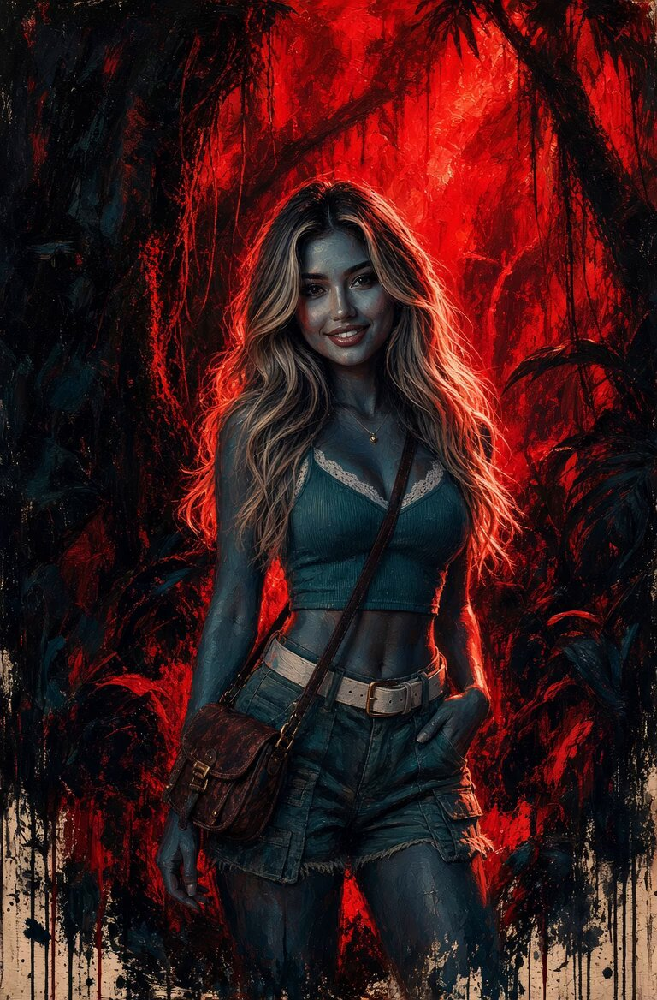

**Prompt**

```text
Ilustração artística em estilo grunge e expressionista da modelo em anexo, pintada sobre uma textura de tela áspera e visível. A obra apresenta um alto contraste dramático com um fundo vermelho vibrante e saturado que se desvanece para o preto. O corpo da modelo é pintado em tons de cerceta escuro e cinzento-azulado, com uma intensa contraluz vermelha a iluminar fortemente o seu lado direito, criando um brilho vermelho vivo nas bordas. Pinceladas gestuais, soltas e texturadas podem ser vistas em toda a composição. O fundo inclui silhuetas pretas e desfocadas que sugerem vegetação. A parte inferior possui um efeito de salpicos e manchas de tinta. Atmosfera dramática, tátil e desgastada.
```

[↑ Voltar às categorias](#catalog)

---

<a name="prompt-2102451612354773236"></a>

### Ilustração de fantasia de uma bruxa de cabelos prateados a pedir um herói loiro em casamento e a beijá-lo.

Autor：[@hsuenaga626](https://x.com/hsuenaga626) · [Publicação original](https://x.com/hsuenaga626/status/2102451612354773236)

Ilustração · Publicado

**Resumo:** Ilustração de fantasia de uma bruxa de cabelos prateados a pedir um herói loiro em casamento e a beijá-lo.

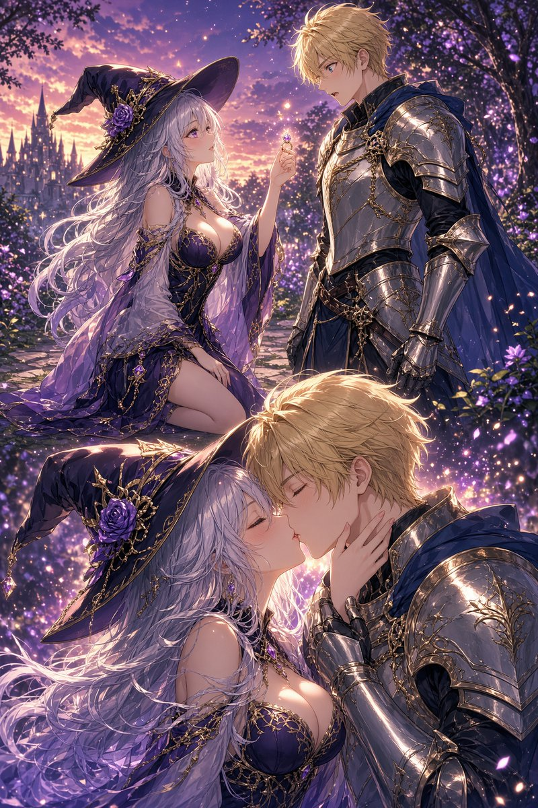

**Prompt**

```text
Bruxa de cabelos prateados e seios grandes a pedir um herói loiro em casamento e a beijá-lo
```

[↑ Voltar às categorias](#catalog)

---

<a name="prompt-2102419652248838557"></a>

### Manter a textura da foto original e prolongar a estrutura interna para fora da moldura até ao papel, aliando figuras minúsculas em traço linear para uma narrativa interativa.

Autor：[@Hamburgerai](https://x.com/Hamburgerai) · [Publicação original](https://x.com/Hamburgerai/status/2102419652248838557)

Ilustração · Resumo / Contexto · Publicado

**Resumo:** Manter a textura da foto original e prolongar a estrutura interna para fora da moldura até ao papel, aliando figuras minúsculas em traço linear para uma narrativa interativa.


**Prompt**

```text
Mantenha o motivo real da foto e a textura fotográfica; selecione da imagem uma estrutura, rebordo de objeto, textura ou linha condutora visual com significado, fazendo com que ela se prolongue fisicamente do limite da fotografia para uma superfície de papel marfim quente. O elemento prolongado pode ser o chão, uma parede, tampo de mesa, corrimão, beiral, tecido, superfície da água, sombra, contorno de objeto ou outro elemento real presente na fotografia; deve apresentar a estrutura de pedaço de papel, fita de pano, curvaturas, dobras, espessura, rebordo rasgado ou baixo-relevo, sem gerar fitas decorativas sem nexo. Adicione 2 a 4 figuras humanas minúsculas desenhadas em traço preto e sem rosto, fazendo-as interagir claramente com o elemento prolongado, como transportando, medindo, escalando, empurrando um carrinho, observando, desenhando ou puxando. Preserve as pessoas, arquitetura, objetos, perspetiva e luz da foto original; não transforme toda a fotografia num desenho animado, nem a converta num autocolante banal, molde de vetor ou grelha de colagem.
```

[↑ Voltar às categorias](#catalog)

---

<a name="prompt-2101956517557883076"></a>

### Ilustração de editorial de moda de um homem a caminhar num fato cinzento à medida envolto num manto colorido de xamã coreano com fumo de tinta sumi-e sobre um fundo amarelo mostarda.

Autor：[@leftbypeace](https://x.com/leftbypeace) · [Publicação original](https://x.com/leftbypeace/status/2101956517557883076)

Ilustração · Personagem · Item de Moda · Publicado

**Resumo:** Ilustração de editorial de moda de um homem a caminhar num fato cinzento à medida envolto num manto colorido de xamã coreano com fumo de tinta sumi-e sobre um fundo amarelo mostarda.


**Prompt**

```text
corpo inteiro, 3::perfil lateral, pose natural de caminhada, a meio passo, uma perna para a frente, a outra perna para trás::, a fumar um cigarro, 3::fumo de cigarro semelhante a tinta preta, fumo sumi-e, aguada de tinta fluida::, 2::fato à medida cinzento, camisa formal branca, gravata cinzenta::, 3::manto de xamã coreano colorido usado folgado sobre o fato::, mangas compridas e fluidas, manto a esvoaçar atrás, contas rituais e borlas coloridas na cintura, 2::uma mão no bolso, o outro braço relaxado ao lado::, editorial de moda, fundo plano amarelo mostarda
```

[↑ Voltar às categorias](#catalog)

---

<a name="prompt-2101985224838299818"></a>

### 1.4::a olhar para trás por cima do ombro esquerdo::, 1.4::a segurar numa arma steampunk amarela a apontar para cima::, óculos steampunk, pose dinâmica agachada com um braço assente no chão contra fundo branco.

Autor：[@sha1shashasha](https://x.com/sha1shashasha) · [Publicação original](https://x.com/sha1shashasha/status/2101985224838299818)

Ilustração · Personagem · Resumo / Contexto · Publicado

**Resumo:** 1.4::a olhar para trás por cima do ombro esquerdo::, 1.4::a segurar numa arma steampunk amarela a apontar para cima::, óculos steampunk, pose dinâmica agachada com um braço assente no chão contra fundo branco.


**Prompt**

```text
1.4::a olhar para trás por cima do ombro esquerdo::, 1.4::a segurar numa arma steampunk amarela a apontar para cima::,

1.4::óculos de proteção steampunk de latão na testa::, 1.3::calções cargo muito curtos::, calças curtas, 1.4::cinto de couro com grande engrenagem de roda dentada de latão, botas de couro desgastado com fivelas e tiras::,1.3::luva sem dedos de couro castanho na mão direita::,

0.8::costas musculosas::, coxas expostas,

1.2::pose dinâmica agachada baixa, ângulo baixo dinâmico, agachamento sentado, tronco torcido::, 1.1::cintura torcida, a inclinar-se para trás::, centro de gravidade baixo, postura assimétrica,

um braço estendido para trás em direção ao chão, braço de apoio reto, palma assente no chão, peso apoiado por uma mão, o outro braço levantado acima da cabeça, mão mantida acima da cabeça,

pernas dobradas assimétricas, dois joelhos descidos, 1.2::dois pés assentes no chão, costas arqueadas::, pescoço alongado, cabeça virada por cima do ombro, 1.1::a olhar para trás, perfil 3/4 de lado::, anatomia natural, pose equilibrada::, 2::fundo branco limpo::, iluminação suave dramática, sombra muscular definida
```

[↑ Voltar às categorias](#catalog)

---

<a name="prompt-2101691757385724297"></a>

### Um autocolante acolhedor com tema de outono que apresenta uma rapariga a sorrir, folhas de ácer douradas e caligrafia árabe sobre um fundo branco.

Autor：[@81soud81](https://x.com/81soud81) · [Publicação original](https://x.com/81soud81/status/2101691757385724297)

Ilustração · Personagem · Resumo / Contexto · Publicado

**Resumo:** Um autocolante acolhedor com tema de outono que apresenta uma rapariga a sorrir, folhas de ácer douradas e caligrafia árabe sobre um fundo branco.


**Prompt**

```text
Um autocolante acolhedor com tema de outono, vetor cortado (die-cut). Uma rapariga com traços faciais calorosos e suaves e um sorriso gentil, emoldurada por folhas de ácer douradas em redemoinho. O design inclui o texto em árabe "سلام داخلي" num estilo de caligrafia árabe suave e gracioso. Tons quentes e ricos, arte vetorial elegante e limpa, alta definição, fundo branco.
```

[↑ Voltar às categorias](#catalog)

---

<a name="prompt-2101694789200511237"></a>

### Descrição de uma imagem metafórica política de um polvo cuja cabeça é composta por mil pessoas a atacar simbolicamente a Rússia.

Autor：[@Masssiana](https://x.com/Masssiana) · [Publicação original](https://x.com/Masssiana/status/2101694789200511237)

Ilustração · Publicado

**Resumo:** Descrição de uma imagem metafórica política de um polvo cuja cabeça é composta por mil pessoas a atacar simbolicamente a Rússia.


**Prompt**

```text
A cabeça do polvo, composta por 1000 pessoas, atacou a Rússia hoje; não foram os tentáculos do polvo compostos por cada braço da NATO, Ucrânia, Alemanha, França, Inglaterra e Europa, que sacrificaram a cabeça do polvo para derrotar a Rússia e Putin.
```

[↑ Voltar às categorias](#catalog)

---

<a name="prompt-2101577158112235568"></a>

### Ilustração de fantasia oriental de um homem musculoso em tronco nu com tatuagens a morder uma fita, contra um fundo de bandeiras de oração e picos nevados.

Autor：[@sha1shashasha](https://x.com/sha1shashasha) · [Publicação original](https://x.com/sha1shashasha/status/2101577158112235568)

Ilustração · Personagem · Publicado

**Resumo:** Ilustração de fantasia oriental de um homem musculoso em tronco nu com tatuagens a morder uma fita, contra um fundo de bandeiras de oração e picos nevados.


**Prompt**

```text
ilustração de fantasia oriental, 1.3::vista traseira::, a olhar por cima do ombro para o observador::,

1.3::homem em tronco nu::, 1.2::costas musculosas::, 1.4::tatuagem de dragão oriental no braço e no ombro::,

1.5::a morder fita branca na boca::, acessórios, 1.3::ligaduras enroladas no braço e na cintura, capa com gola de pele nos ombros, trajes tradicionais orientais drapeados na cintura::, 1.2::fitas de faixa laranja::, 1.3::bandeiras de oração coloridas a flutuar::,

1.1::pássaros a voar no céu, fundo de pico de montanha nevado, céu azul brilhante, luz solar vívida::, plano do tronco
```

[↑ Voltar às categorias](#catalog)

---

<a name="prompt-2101233469070168278"></a>

### Ilustração de terror psicológico surrealista apresentando uma figura esbelta numa camisa de noite branca contra um rosto vermelho gigante brilhante no fundo escuro.

Autor：[@sha1shashasha](https://x.com/sha1shashasha) · [Publicação original](https://x.com/sha1shashasha/status/2101233469070168278)

Ilustração · Retrato / Selfie · Personagem · Resumo / Contexto · Publicado

**Resumo:** Ilustração de terror psicológico surrealista apresentando uma figura esbelta numa camisa de noite branca contra um rosto vermelho gigante brilhante no fundo escuro.


**Prompt**

```text
1.4::ilustração surrealista::, arte de terror psicológico, 1.6::rosto vermelho gigante brilhante no fundo, rosto vermelho gigante a olhar para baixo::, olhos com pestanas compridas,

1.3::em pé em primeiro plano::, 1.2::plano de corpo inteiro, silhueta esbelta::, vestido camisa de noite branca,

1.3::luz de fundo vermelha brilhante, contraste dramático em vermelho e preto::, atmosfera sombria e sinistra, tema de pesadelo surreal, 1.1::estilo pictórico::, fundo escuro, base plana, a olhar para o observador
```

[↑ Voltar às categorias](#catalog)

---

<a name="prompt-2101143973549195655"></a>

### vista em ângulo contra-picado por trás, foco a começar nas pernas, a olhar para trás por entre as pernas, cabeça pousada no chão, pés no chão, mãos atrás das costas, rapaz soldado, abdominais definidos, calças militares, botas, chapa de identificação pendurada a oscilar, rosto afogueado, ferimento pequeno, nódoas negras, fundo de chão de terra batida

Autor：[@2\_\_han\_\_](https://x.com/2__han__) · [Publicação original](https://x.com/2__han__/status/2101143973549195655)

Ilustração · Personagem · Animal / Criatura · Resumo / Contexto · Publicado

**Resumo:** vista em ângulo contra-picado por trás, foco a começar nas pernas, a olhar para trás por entre as pernas, cabeça pousada no chão, pés no chão, mãos atrás das costas, rapaz soldado, abdominais definidos, calças militares, botas, chapa de identificação pendurada a oscilar, rosto afogueado, ferimento pequeno, nódoas negras, fundo de chão de terra batida


**Prompt**

```text
vista em ângulo contra-picado por trás, foco a começar nas pernas, a olhar para trás por entre as pernas, cabeça pousada no chão, pés no chão, mãos atrás das costas, braços atrás da cintura, soldado, rapaz, músculos das pernas definidos, calças militares, botas, um rosto com ar algo tenso, peito firme, abdominais definidos, casaco largo, casaco a abrir-se, casaco a escorregar, peito exposto, abdominais expostos, chapa de identificação pendurada a oscilar, rosto afogueado, suor a pingar, ferimento pequeno, nódoas negras, Nódoas negras visíveis e pequenos ferimentos na parte superior do corpo e no rosto., fundo de chão de terra batida
```

[↑ Voltar às categorias](#catalog)

---

<a name="prompt-2101116496424665240"></a>

### Vídeo promocional temático de Halloween, rapariga com túnica taoista faz um gesto de garras fantasmagóricas em frente ao pórtico da Ponte Naihe, com efeitos de fantasmas de desenhos animados e texto promocional.

Autor：[@cngshtng10](https://x.com/cngshtng10) · [Publicação original](https://x.com/cngshtng10/status/2101116496424665240)

Fotografia · Ilustração · Personagem · Item de Moda · Publicado

**Resumo:** Vídeo promocional temático de Halloween, rapariga com túnica taoista faz um gesto de garras fantasmagóricas em frente ao pórtico da Ponte Naihe, com efeitos de fantasmas de desenhos animados e texto promocional.


**Prompt**

```text
Este é um pequeno vídeo promocional de Halloween para o 'Parque Temático dos Dezoito Níveis do Inferno': uma rapariga vestida com um fato de caçador de zombies/sacerdote taoista da dinastia Qing (túnica preta bordada, gola alta azul, amuleto amarelo colado na testa, colar de caveiras), de pé em frente ao pórtico da 'Ponte Naihe' decorado com lanternas suspensas, faz um gesto assustador de garras de fantasma para a câmara, acompanhado por efeitos amorosos de pequenos fantasmas de desenhos animados, reações de susto e textos promocionais em formato de cupão
```

[↑ Voltar às categorias](#catalog)

---

<a name="prompt-2101032572532736383"></a>

### Uma sedutora ilustração de uma senhora digital com sobreposição de texto.

Autor：[@shroudspeeders](https://x.com/shroudspeeders) · [Publicação original](https://x.com/shroudspeeders/status/2101032572532736383)

Ilustração · Publicado

**Resumo:** Uma sedutora ilustração de uma senhora digital com sobreposição de texto.


**Prompt**

```text
Desenha-me uma imagem sedutora de uma senhora digital com o texto ASSX
```

[↑ Voltar às categorias](#catalog)

---

<a name="prompt-2100987458766750054"></a>

### Um coelho branco sonolento aninhado numa colcha de retalhos num prado de margaridas soalheiro.

Autor：[@RenRose321](https://x.com/RenRose321) · [Publicação original](https://x.com/RenRose321/status/2100987458766750054)

Ilustração · Publicado

**Resumo:** Um coelho branco sonolento aninhado numa colcha de retalhos num prado de margaridas soalheiro.


**Prompt**

```text
Um coelho branco sonolento aninhado numa colcha de retalhos num prado soalheiro de trevos e margaridas, ilustração suave em tons pastel com texturas em camadas semelhantes a tecido, paleta de blush, creme, salva e amarelo-manteiga, atmosfera matinal pacífica e refrescante
```

[↑ Voltar às categorias](#catalog)

---

<a name="prompt-2100758326556471449"></a>

### Um gato tigrado cor-de-laranja a relaxar num carro verde-menta num campo de margaridas gigantes em estilo de arte popular naif.

Autor：[@RenRose321](https://x.com/RenRose321) · [Publicação original](https://x.com/RenRose321/status/2100758326556471449)

Ilustração · Animal / Criatura · Veículo · Publicado

**Resumo:** Um gato tigrado cor-de-laranja a relaxar num carro verde-menta num campo de margaridas gigantes em estilo de arte popular naif.


**Prompt**

```text
Um gato tigrado cor-de-laranja a relaxar no capô de um minúsculo carro verde-menta estacionado num campo de margaridas gigantes, arte popular naif com formas planas e pontos decorativos, paleta de cores coral, girassol e azul-celeste, brincalhão e solarengo
```

[↑ Voltar às categorias](#catalog)

---

<a name="prompt-2100164379128021284"></a>

### Prompt de geração de ilustrações no estilo de ecrã de transmissão em direto.

Autor：[@AIDream\_Project](https://x.com/AIDream_Project) · [Publicação original](https://x.com/AIDream_Project/status/2100164379128021284)

Design de Aplicações / Web · Ilustração · Publicado

**Resumo:** Prompt de geração de ilustrações no estilo de ecrã de transmissão em direto.


**Prompt**

```text
Um ecrã de smartphone que parece estar a fazer uma transmissão em direto.
```

[↑ Voltar às categorias](#catalog)

---

<a name="prompt-2099269832827187204"></a>

### Ilustração inspirada em Ukiyo-e e Barroco de uma figura serena ao lado de um pavão roxo de olhos dourados rodeado por flores violetas.

Autor：[@abulu8](https://x.com/abulu8) · [Publicação original](https://x.com/abulu8/status/2099269832827187204)

Ilustração · Publicado

**Resumo:** Ilustração inspirada em Ukiyo-e e Barroco de uma figura serena ao lado de um pavão roxo de olhos dourados rodeado por flores violetas.


**Prompt**

```text
Uma figura serena em perfil suave, uma coroa de flores violeta-escuras curvando-se sobre a testa de modo a que apenas os lábios tingidos de ametista e uma mandíbula suave captem uma luz dourada e suave, as pontas dos dedos tocando numa única pétala com veios dourados; um magnífico pavão antropomórfico aconchega-se junto a ela, olhos de ouro fundido, plumagem de rica seda violeta-real entrelaçada com folha de ouro prensada, penas captando a luz como ametista polida e douramento; dezenas de flores violeta-escuras irrompendo entre eles, pétalas flutuando como um batimento cardíaco lento e terno; fitas suaves com desfoque de movimento em tons de violeta e ouro suave derivando em diagonal pela composição; o manto da figura dissolvendo-se em gavinhas em espiral de brilho aprisionado e estrelas-pétalas flutuantes; grão fino de meio-tom sob os violetas profundos, uma delicada borda de folha de ouro emoldurando tudo como uma relíquia sagrada; encenação Ukiyo-E encontra a graça expressionista e a riqueza barroca; violeta-real profundo, ouro fundido e branco-creme suave; atmosfera serena de pétalas à deriva e partículas de poeira dourada; fascínio surreal, cinematográfico, editorial, sereno e terno; Meaningful Visual, renderização de ilustração de manga de alto detalhe sobre o brilho de laca violeta-escura.
```

[↑ Voltar às categorias](#catalog)

---

<a name="prompt-2099282298730590582"></a>

### Prompt em estilo de ilustração de um campo de flores noturno a brilhar em azul e uma majestosa Via Láctea

Autor：[@AkioT315](https://x.com/AkioT315) · [Publicação original](https://x.com/AkioT315/status/2099282298730590582)

Ilustração · Paisagem / Natureza · Publicado

**Resumo:** Prompt em estilo de ilustração de um campo de flores noturno a brilhar em azul e uma majestosa Via Láctea


**Prompt**

```text
Um lindo campo de flores noturno, onde as flores brilham em azul e o céu estrelado resplandece com uma majestosa Via Láctea, representado com um toque em estilo de ilustração com sombras enfatizadas
```

[↑ Voltar às categorias](#catalog)

---

<a name="prompt-2099142803704152513"></a>

### Prompt de ilustração de Tanabata de duas pessoas vestindo gakuran preto a beijarem-se sob ramos de bambu.

Autor：[@leftbypeace](https://x.com/leftbypeace) · [Publicação original](https://x.com/leftbypeace/status/2099142803704152513)

Ilustração · Publicado

**Resumo:** Prompt de ilustração de Tanabata de duas pessoas vestindo gakuran preto a beijarem-se sob ramos de bambu.


**Prompt**

```text
Comum: 2people, 2::upper body,side view::,3::crouching together beneath bamboo branches::, 3::kissing softly while squatting close::, papéis coloridos de desejos pendurados em ramos de bambu, decorações de tanabata, folhas verdes densas, fitas e tiras de papel a envolvê-los, luz do dia quente, sombras suaves, ambiente romântico juvenil, ilustração limpa, paleta colorida e suave

A: 3::black gakuran::, agachado muito perto de B, uma mão a segurar levemente o pescoço ou o colarinho de B, 2::eyes closed::, inclinando-se suavemente

B: 3::black gakuran::, agachado de frente para A, uma mão pousada perto do joelho, a outra mão a tocar levemente na manga de A, 2::eyes closed::, inclinando-se para o beijo
```

[↑ Voltar às categorias](#catalog)

---

<a name="prompt-2098955280256209249"></a>

### Gerar um cartaz comparativo superior-inferior em 3:4, mantendo a fotografia real original em cima e reconstruindo o sujeito em baixo como ilustração de personagem de cartoon com contornos grossos e cores planas.

Autor：[@Hamburgerai](https://x.com/Hamburgerai) · [Publicação original](https://x.com/Hamburgerai/status/2098955280256209249)

Pôster / Folheto · Ilustração · Personagem · Publicado

**Resumo:** Gerar um cartaz comparativo superior-inferior em 3:4, mantendo a fotografia real original em cima e reconstruindo o sujeito em baixo como ilustração de personagem de cartoon com contornos grossos e cores planas.


**Prompt**

```text
Crie um cartaz comparativo vertical independente na proporção 3:4 dividido em parte superior e inferior. A metade superior preserva na íntegra o sujeito real da fotografia de entrada, a sua pose, cores, vestuário ou pelagem, adereços, ambiente e relações espaciais, sem estilização de desenho animado e sem alterar a composição. O centro é separado por uma linha horizontal branca, simples e reta.

A metade inferior redesenha o mesmo sujeito como uma personagem de desenho animado com forte identidade: traços escuros e grossos, manchas de cor lisa, fundo de cena simplificado e acolhedor, expressões exageradas mas nítidas, olhos grandes e expressivos, proporções corporais moderadamente arredondadas ou ligeiramente desajeitadas. Extraia os traços característicos do sujeito original, convertendo vestuário, pose, adereços, traços animais ou elementos do ambiente no design da personagem, para que a metade inferior pareça uma personagem de animação com personalidade própria e não um filtro vulgar ou um contorno básico.

É obrigatório manter as características de identificação do sujeito original, as relações de movimento, as cores principais e os adereços essenciais; a parte inferior deve ter uma atmosfera descontraída, brincalhona e ligeiramente teatral, sem se transformar numa propriedade intelectual de animação específica, personagem de anime ou mascote preexistente. Não adicione pessoas, animais ou cenários supérfluos. Sem texto, legendas, títulos, distintivos de canto, logótipos, marcas de água ou composições em painel.
```

[↑ Voltar às categorias](#catalog)

---

<a name="prompt-2098677881375236337"></a>

### Prompt para ilustração de indumentária com tema de professora \(blusa com folhos, saia lápis, ponteiro, etc.\).

Autor：[@AI\_Kei75](https://x.com/AI_Kei75) · [Publicação original](https://x.com/AI_Kei75/status/2098677881375236337)

Ilustração · Personagem · Item de Moda · Publicado

**Resumo:** Prompt para ilustração de indumentária com tema de professora \(blusa com folhos, saia lápis, ponteiro, etc.\).


**Prompt**

```text
professora, camisa branca de colarinho, blusa com folhos, mangas compridas, clavícula, sem acessórios no pescoço, colar de coração, cinto preto, (saia lápis preta), minissaia, collants castanho-escuro, saltos altos, a segurar, ponteiro, vara,
```

[↑ Voltar às categorias](#catalog)

---

<a name="prompt-2096970899622948972"></a>

### Estilo de caricatura a guache pintada à mão sobre papel de algodão com tons de verde, rosa e creme.

Autor：[@MissDelulu9](https://x.com/MissDelulu9) · [Publicação original](https://x.com/MissDelulu9/status/2096970899622948972)

Ilustração · Retrato / Selfie · Publicado

**Resumo:** Estilo de caricatura a guache pintada à mão sobre papel de algodão com tons de verde, rosa e creme.


**Prompt**

```text
Transforme a foto numa caricatura a guache pintada à mão sobre papel de algodão creme. Preserve a identidade exata da pessoa, a assimetria natural, os traços faciais essenciais, o cabelo, a fisionomia e o vestuário original. Utilize formas planas e arrojadas, contornos firmes, grão de papel visível e textura subtil de pigmento. Proporções estilizadas com uma atitude expressiva, olhos gráficos ampliados e uma pose dinâmica da cintura para cima. Paleta: verde-sálvia/azeitona, rosa e creme quente em partes iguais. Sem realismo, rosto estilo anime, embelezamento, suavização, sombreamento 3D, texto, logótipos ou confusão visual. Claramente a mesma pessoa, claramente um desenho.
```

[↑ Voltar às categorias](#catalog)

---

<a name="category-sketch-line-art"></a>

## Esboço / Arte Linear

<a name="prompt-2102193031583588643"></a>

### Modelo de desenho a esconder o corpo com um caderno de esboços e a mão do pintor em primeiro plano.

Autor：[@BorderleSint](https://x.com/BorderleSint) · [Publicação original](https://x.com/BorderleSint/status/2102193031583588643)

Esboço / Arte Linear · Publicado

Publicação original：[@Zackjpnman](https://x.com/Zackjpnman) · [Publicação original](https://x.com/Zackjpnman/status/2101687832557527435)

**Resumo:** Modelo de desenho a esconder o corpo com um caderno de esboços e a mão do pintor em primeiro plano.


**Prompt**

```text
3:4, fotorrealista, bela mulher na casa dos 20 anos criada por IA, modelo de desenho, em primeiro plano um caderno de esboços, a mão do artista e um lápis, o corpo dela está escondido pelo caderno de esboços, apenas o decote e as pernas são visíveis, Negativo:partes de cima
```

[↑ Voltar às categorias](#catalog)

---

<a name="prompt-2099485936535167139"></a>

### Prompt de cartaz de comparação superior-inferior 3:4, a metade superior preserva a fotografia de viagem real e a metade inferior converte-se em desenho linear minimalista em branco marfim sobre fundo azul-escuro.

Autor：[@Hamburgerai](https://x.com/Hamburgerai) · [Publicação original](https://x.com/Hamburgerai/status/2099485936535167139)

Pôster / Folheto · Esboço / Arte Linear · Minimalismo · Publicado

**Resumo:** Prompt de cartaz de comparação superior-inferior 3:4, a metade superior preserva a fotografia de viagem real e a metade inferior converte-se em desenho linear minimalista em branco marfim sobre fundo azul-escuro.


**Prompt**

```text
Cria um cartaz independente de comparação superior-inferior em formato vertical 3:4. A metade superior mantém integralmente a fotografia real de viagem da pessoa na Indonésia fornecida, sem alterar cores, sem cortar a pessoa e sem cartoonizar. A metade inferior redesenha a mesma pessoa e o ambiente real como um desenho linear minimalista em branco marfim sobre um fundo mate sólido em azul-marinho escuro. Mantém o número de pessoas, a postura de pé ou a caminhar, o contorno das roupas, a orientação e as proporções; extrai da fotografia original estruturas como pórticos, ondas do mar, socalcos de arroz, árvores e a linha do horizonte, expressando-as com poucas linhas contínuas de vento, arcos e linhas de contorno. A figura da metade inferior é reduzida, preservando amplo espaço negativo em seu redor; as linhas apresentam uma ligeira granulação de giz ou lápis de cera, mas com sobriedade global, sem preenchimento de cor nem sombras realistas. Utiliza uma fina linha divisória branca ao centro. A metade inferior tem de ser um redesenho autêntico e não apenas transformar a fotografia inteira em azul. Não adiciones texto, logótipos, marcas de água, marcas de canto da imagem original, marcas de IA nem colagens.
```

[↑ Voltar às categorias](#catalog)

---

<a name="prompt-2099501924278235384"></a>

### Tradução em curso

Autor：[@Hamburgerai](https://x.com/Hamburgerai) · [Publicação original](https://x.com/Hamburgerai/status/2099501924278235384)

Pôster / Folheto · Ilustração · Esboço / Arte Linear · Paisagem urbana / Rua · Publicado

**Resumo:** Tradução em curso


**Prompt**

```text
Tradução em curso
```

[↑ Voltar às categorias](#catalog)

---

<a name="prompt-2098371221184495917"></a>

### Crie um cartaz editorial de comparação dividido com uma foto em cima e um esboço a lápis de cera com notas em francês em baixo.

Autor：[@Weilnes](https://x.com/Weilnes) · [Publicação original](https://x.com/Weilnes/status/2098371221184495917)

Pôster / Folheto · Fotografia · Esboço / Arte Linear · Publicado

**Resumo:** Crie um cartaz editorial de comparação dividido com uma foto em cima e um esboço a lápis de cera com notas em francês em baixo.


**Prompt**

```text
Crie um cartaz editorial de comparação vertical de alta qualidade, dividido exatamente a 50/50 em cima e em baixo com uma linha mediana reta e limpa. Metade superior: fotografia de viagem fotorrealista de [SUBJECT] com luz natural, textura autêntica, apenas uma ligeira gradação de cores de nível de revista — mantenha a fotografia realista, não ilustre a metade superior. Metade inferior: estudo gestual esparso a lápis de cera preto do mesmo motivo sobre papel texturado branco quente — contornos hesitantes e interrompidos a lápis de cera, preenchimentos incompletos, textura do papel, uma ou duas ligeiras manchas de cor a lápis de cera recolhidas da fotografia. Elimine quase todo o fundo; mantenha apenas uma linha subtil de chão ou vestígio de parede. O motivo é maioritariamente espaço negativo branco do papel, não totalmente preenchido. Motivo ocupando cerca de 38–58% da largura inferior, ao centro-inferior. Espaço em branco contínuo em branco quente ≥55%. Texto manuscrito e trémulo a lápis de cera em francês perfeitamente legível: um título curto, « ÉTUDE CRAYON 0N », e uma observação factual em francês. Sem texto em inglês. Evite detalhes finos de pelo, mascotes vetoriais fofas, preenchimentos completos, rabiscos densos, fundos completos, lápis digital suave, ilustração de produto, logótipos, assinaturas, marcas de água. Motivos: un chat roux sur les pavés (PAUSE RUE / ÉTUDE CRAYON 01), valises empilées près de la porte (PRÊT À PARTIR / ÉTUDE CRAYON 02), un vélo contre le mur (ATTENTE / ÉTUDE CRAYON 03), une tasse encore chaude (PETITE PAUSE / ÉTUDE CRAYON 04).
```

[↑ Voltar às categorias](#catalog)

---

<a name="prompt-2097875834103287904"></a>

### Tradução em curso

Autor：[@Hamburgerai](https://x.com/Hamburgerai) · [Publicação original](https://x.com/Hamburgerai/status/2097875834103287904)

Esboço / Arte Linear · Aquarela · Publicado

**Resumo:** Tradução em curso


**Prompt**

```text
Tradução em curso
```

[↑ Voltar às categorias](#catalog)

---

<a name="category-comic-graphic-novel"></a>

## Banda Desenhada / Romance Gráfico

<a name="prompt-2100793684895965264"></a>

### Prompt de banda desenhada de 2 painéis: encontro de dia na rua no painel 1, foco nas pernas em ângulo de baixo para cima no quarto no painel 2.

Autor：[@2\_\_han\_\_](https://x.com/2__han__) · [Publicação original](https://x.com/2__han__/status/2100793684895965264)

Banda Desenhada / Romance Gráfico · Paisagem urbana / Rua · Publicado

**Resumo:** Prompt de banda desenhada de 2 painéis: encontro de dia na rua no painel 1, foco nas pernas em ângulo de baixo para cima no quarto no painel 2.


**Prompt**

```text
2panels, banda desenhada, manga, empilhamento vertical, divisão vertical, 2 painéis empilhados verticalmente,  

[panel 1] corpo inteiro, 2pessoas, a caminhar juntas, de braço dado, braço com braço, lado a lado, encontro, sorriso feliz, a caminhar na rua, personagem A com casaco de ganga oversized, camisola de gola alta preta, calças, personagem B com gabardina bege-clara, saia plissada, mocassins, fundo de rua citadina, montra de loja, dia, iluminação suave,   

[panel 2] ângulo picado de baixo para cima, foco nos pés, foco nas pernas, pernas nuas da personagem B, parte inferior do corpo despida da personagem B, foco na pele, pernas da personagem B levantadas, pés fora do chão, pés a flutuar, pontas dos pés, dedos dos pés esticados, pernas a tremer, gotas de suor nas coxas, personagem B a usar meias brancas, pés com meias, pernas da personagem A em vista traseira, pernas da personagem A viradas para o lado oposto, pernas da personagem A vistas por trás, pés da personagem B entre as pernas da personagem A, sapatos descalçados no chão, roupas despidas no chão, quarto escuro, quarto, iluminação ténue, sombras expressivas, (coração pequeno:1.2), coração flutuante, coração cor-de-rosa, coração pop-up,   

iluminação cinematográfica, obra-prima, altamente detalhado
```

[↑ Voltar às categorias](#catalog)

---

<a name="prompt-2100505656231096481"></a>

### Tradução em curso

Autor：[@liluocheng13](https://x.com/liluocheng13) · [Publicação original](https://x.com/liluocheng13/status/2100505656231096481)

Banda Desenhada / Romance Gráfico · Tinta / Estilo Chinês · Animal / Criatura · Paisagem / Natureza · Publicado

**Resumo:** Tradução em curso


**Prompt**

```text
Tradução em curso
```

[↑ Voltar às categorias](#catalog)

---

<a name="prompt-2100248350683811997"></a>

### Prompt de banda desenhada vertical de 3 painéis que retrata uma sequência de reações num concurso de televisão com dois personagens.

Autor：[@2\_\_han\_\_](https://x.com/2__han__) · [Publicação original](https://x.com/2__han__/status/2100248350683811997)

Banda Desenhada / Romance Gráfico · Personagem · Publicado

**Resumo:** Prompt de banda desenhada vertical de 3 painéis que retrata uma sequência de reações num concurso de televisão com dois personagens.


**Prompt**

```text
3panels, banda desenhada, manga, divisão vertical, legendas, texto na parte inferior,

[panel 1] grande plano, a segurar caderno de esboços, papel branco, mãos a segurar papel, texto em coreano "유혹",

[panel 2] grande plano, 1solo, personagem A, piscar de olho, expressão sedutora, sorriso sarcástico, coração com os dedos, dedo a apontar, personagem A com camisola preta com capuz,

[panel 3] grande plano, 1solo, personagem B, expressão de nojo, cenho franzido, indiferente, ar irritado, personagem B com camisola branca com capuz e casaco verde, texto em coreano "답은 모르겠고 불쾌하기만...",

estúdio interior, cenário de concurso de televisão, atmosfera de programa de televisão, iluminação brilhante, obra-prima, altamente detalhado
```

[↑ Voltar às categorias](#catalog)

---

<a name="prompt-2099563152388329737"></a>

### Prompt de retrato em técnica mista combinando retrato de pessoa real com sombra em rabisco cartoon preto desenhada à mão na parede.

Autor：[@FuguiChen1314](https://x.com/FuguiChen1314) · [Publicação original](https://x.com/FuguiChen1314/status/2099563152388329737)

Ilustração · Banda Desenhada / Romance Gráfico · Retrato / Selfie · Personagem · Publicado

**Resumo:** Prompt de retrato em técnica mista combinando retrato de pessoa real com sombra em rabisco cartoon preto desenhada à mão na parede.


**Prompt**

```text
Utilize a imagem de referência enviada como referência estrita da identidade e do vestuário da personagem. Mantenha com precisão o rosto, os traços faciais, o tom de pele, o penteado, a cor do cabelo, os acessórios, o vestuário e a atmosfera geral da imagem de referência, sem efetuar qualquer alteração.

Crie um retrato em técnica mista de alta qualidade no formato vertical (4:5 ou 9:16), contendo:

Uma personagem de corpo inteiro altamente realista, cuja aparência é perfeitamente consistente com a pessoa na imagem de referência. Na parede ao lado da personagem, surge uma silhueta/sombra da mesma personagem em estilo de rabisco (doodle) preto desenhado à mão.

A pessoa real deve transmitir uma sensação amorosa, ligeiramente tímida e brincalhona, assumindo naturalmente uma pose nova, aleatória, travessa e divertida a cada geração.

A sombra em rabisco desenhada à mão na parede também deve seguir a mesma ideia de pose da pessoa real, mas de forma mais exagerada, caótica, caricatural e dramática. Adicione linhas de ação ao estilo de banda desenhada, estrelas, corações e efeitos de brilho para tornar a sombra em rabisco animada e divertida.

Utilize uma parede de estúdio limpa, branca ou creme, mantendo o fundo minimalista. Aplique iluminação suave e natural, assegurando que tanto a pessoa real como a sombra em rabisco aparecem completas no enquadramento, sem cortes.

A personagem em rabisco deve remeter claramente para a pessoa real através do penteado, dos acessórios, da silhueta da roupa e da pose.

Prompt Negativo (Negative Prompt):

mudar de roupa, alterar a identidade da personagem, segunda pessoa real, sombra realista comum, estilo de terror, personagens de anime tornadas pessoas reais, fundo desordenado, poses repetitivas a apontar o dedo ou a fazer pistolas com os dedos, poses rígidas, membros/dedos adicionais, deformação corporal, texto, marca de água, logótipo, artefactos gerados por IA.
```

[↑ Voltar às categorias](#catalog)

---

<a name="prompt-2098919930125332588"></a>

### Tradução em curso

Autor：[@VoxcatAI](https://x.com/VoxcatAI) · [Publicação original](https://x.com/VoxcatAI/status/2098919930125332588)

Ilustração · Banda Desenhada / Romance Gráfico · Personagem · Publicado

Publicação original：[@VoxcatAI](https://x.com/VoxcatAI) · [Publicação original](https://x.com/VoxcatAI/status/2045131503001342302)

**Resumo:** Tradução em curso


**Prompt**

```text
Tradução em curso
```

[↑ Voltar às categorias](#catalog)

---

<a name="prompt-2098359042234351871"></a>

### Retrato de caricatura 3D em estilo cómico exagerado de mulher adulta com grandes olhos assimétricos, nariz grande, orelhas grandes e sorriso grotesco, acompanhado por luz de contorno de estúdio.

Autor：[@Tanvir48992](https://x.com/Tanvir48992) · [Publicação original](https://x.com/Tanvir48992/status/2098359042234351871)

Banda Desenhada / Romance Gráfico · Renderização 3D · Retrato / Selfie · Personagem · Publicado

Publicação original：[@Tanvir48992](https://x.com/Tanvir48992) · [Publicação original](https://x.com/Tanvir48992/status/2098292936064844224)

**Resumo:** Retrato de caricatura 3D em estilo cómico exagerado de mulher adulta com grandes olhos assimétricos, nariz grande, orelhas grandes e sorriso grotesco, acompanhado por luz de contorno de estúdio.


**Prompt**

```text
[Crie um retrato de caricatura em 3D original e altamente estilizado de uma mulher adulta, concebido com exagero facial cómico extremo, mantendo características humanas reconhecíveis. Dê-lhe uma cabeça dramaticamente sobredimensionada, proporções faciais desmedidamente irregulares, olhos grandes salientes e assimétricos, um nariz torto exagerado, orelhas caídas de grandes dimensões e um enorme sorriso pateta com dentes espaçados irregularmente.

A sua estrutura facial deve permanecer credível sob o exagero, com sobrancelhas expressivas, rugas faciais naturais, textura de pele irregular, poros visíveis, manchas subtis e imperfeições realistas. Dê-lhe um cabelo escuro caótico e frisado, com fios individuais a sobressair em diferentes direções.

Renderize a personagem numa estética 3D semirrealista de alto detalhe, com pele, cabelo, dentes e materiais fisicamente credíveis. Utilize uma iluminação de recorte de estúdio dramática vinda de trás e dos lados, criando realces brilhantes à volta do cabelo e das orelhas, enfatizando simultaneamente rugas, textura e contornos faciais. Adicione uma luz de preenchimento frontal suave para que o rosto permaneça claramente visível.

Mantenha a composição minimalista e desimpedida com um fundo de estúdio simples e neutro. Enquadre a personagem como um retrato vertical de 9:16, centrado e com enquadramento apertado, com a enorme cabeça a dominar a imagem.

Ambiente: absurdo, divertido, bizarro, brincalhão, exagerado, ligeiramente grotesco e visualmente memorável.

Evite personagens reconhecíveis protegidas por direitos de autor, parecenças com celebridades, obras de arte existentes, logótipos, marcas de água, texto, pele com aspeto de plástico, brilho excessivo de CGI, traços faciais duplicados, olhos adicionais, membros adicionais, mãos malformadas, dentes distorcidos, detalhes desfocados, baixa resolução e anatomia não natural.]
```

[↑ Voltar às categorias](#catalog)

---

<a name="category-3d-render"></a>

## Renderização 3D

<a name="prompt-2102213593043226881"></a>

### Prompt para Three.js que gera um pelicano 3D a andar de bicicleta dentro de um ficheiro HTML autónomo.

Autor：[@ralejandrots88](https://x.com/ralejandrots88) · [Publicação original](https://x.com/ralejandrots88/status/2102213593043226881)

Renderização 3D · Publicado

**Resumo:** Prompt para Three.js que gera um pelicano 3D a andar de bicicleta dentro de um ficheiro HTML autónomo.


**Prompt**

```text
Usar three.js para implementar num ficheiro HTML autónomo um pelicano a andar de bicicleta
```

[↑ Voltar às categorias](#catalog)

---

<a name="prompt-2102166553701597551"></a>

### Prompt gerando um planeta interativo em GLSL fragment shader com terreno, oceanos, atmosfera e calotas polares sazonais.

Autor：[@WescheNex1q](https://x.com/WescheNex1q) · [Publicação original](https://x.com/WescheNex1q/status/2102166553701597551)

Renderização 3D · Paisagem / Natureza · Publicado

**Resumo:** Prompt gerando um planeta interativo em GLSL fragment shader com terreno, oceanos, atmosfera e calotas polares sazonais.


**Prompt**

```text
um planeta visto da órbita, terreno, oceanos, nuvens à deriva, terminador dia/noite com luzes da cidade, atmosfera no bordo, rotação lenta, arrastar para inclinar, um botão "Season" que desloca as calotas de gelo.
```

[↑ Voltar às categorias](#catalog)

---

<a name="prompt-2102155360505053659"></a>

### Gerar uma cena 3D de um pelicano a andar de bicicleta num único ficheiro HTML usando Three.js.

Autor：[@\_kaichen](https://x.com/_kaichen) · [Publicação original](https://x.com/_kaichen/status/2102155360505053659)

Renderização 3D · Publicado

**Resumo:** Gerar uma cena 3D de um pelicano a andar de bicicleta num único ficheiro HTML usando Three.js.


**Prompt**

```text
Implemente um pelicano a andar de bicicleta num único ficheiro HTML independente usando Three.js
```

[↑ Voltar às categorias](#catalog)

---

<a name="prompt-2101690690216337746"></a>

### Design de avatar de menina do Médio Oriente no estilo de autocolante 3D insuflável, com tons de doces e borda branca recortada.

Autor：[@81soud81](https://x.com/81soud81) · [Publicação original](https://x.com/81soud81/status/2101690690216337746)

Perfil / Avatar · Renderização 3D · Personagem · Publicado

**Resumo:** Design de avatar de menina do Médio Oriente no estilo de autocolante 3D insuflável, com tons de doces e borda branca recortada.


**Prompt**

```text
Um autocolante 3D tufado premium de uma alegre menina do Médio Oriente com traços faciais altamente detalhados e simétricos, bochechas rechonchudas e brilhantes e um grande e bonito sorriso. O design tem uma textura inflada de plástico macio com destaques e sombras realistas. Paleta vibrante de cores doces (rosa pastilha elástica, limão brilhante e cerceta suave). Borda grossa branca recortada, recurso de ícone comercial, isolado num fundo branco puro.
```

[↑ Voltar às categorias](#catalog)

---

<a name="prompt-2101548945269002366"></a>

### carro de F1 vermelho como placa de museu em vista explodida no three.js

Autor：[@StatsWire](https://x.com/StatsWire) · [Publicação original](https://x.com/StatsWire/status/2101548945269002366)

Renderização 3D · Veículo · Publicado

**Resumo:** carro de F1 vermelho como placa de museu em vista explodida no three.js


**Prompt**

```text
carro de F1 vermelho como placa de museu em vista explodida no three.js
```

[↑ Voltar às categorias](#catalog)

---

<a name="prompt-2101433530777755699"></a>

### Prompt para gerar uma cena noturna detalhada da Torre Eiffel em voxel 3D com animações num único ficheiro HTML.

Autor：[@PeasantSmith](https://x.com/PeasantSmith) · [Publicação original](https://x.com/PeasantSmith/status/2101433530777755699)

Renderização 3D · Publicado

**Resumo:** Prompt para gerar uma cena noturna detalhada da Torre Eiffel em voxel 3D com animações num único ficheiro HTML.


**Prompt**

```text
Desenhe e crie uma cena de arte voxel muito criativa, elaborada e detalhada da Torre Eiffel num belo jardim com a cidade ao redor à noite, incluindo algumas luzes e animações. Torne a cena impressionante e variada e utilize voxels coloridos. Utilize as bibliotecas que desejar para conseguir isso, mas certifique-se de que posso colar tudo num único ficheiro HTML.
```

[↑ Voltar às categorias](#catalog)

---

<a name="prompt-2100767176168722867"></a>

### Grande plano de produto de um ídolo tiki de pedra coberto de musgo.

Autor：[@nightandwknd](https://x.com/nightandwknd) · [Publicação original](https://x.com/nightandwknd/status/2100767176168722867)

Renderização 3D · Produto · Publicado

**Resumo:** Grande plano de produto de um ídolo tiki de pedra coberto de musgo.


**Prompt**

```text
um ídolo tiki de pedra coberto de musgo, fundo cinzento neutro, objeto inteiro centrado, foto de produto
```

[↑ Voltar às categorias](#catalog)

---

<a name="prompt-2100361373863825594"></a>

### 3 pessoas sentadas à volta a rir.

Autor：[@andrew\_n\_carr](https://x.com/andrew_n_carr) · [Publicação original](https://x.com/andrew_n_carr/status/2100361373863825594)

Renderização 3D · Publicado

**Resumo:** 3 pessoas sentadas à volta a rir.


**Prompt**

```text
3 pessoas sentadas à volta a rir.
```

[↑ Voltar às categorias](#catalog)

---

<a name="prompt-2097725977443131648"></a>

### Transformação de uma fotografia numa figura de ação colecionável dentro de uma caixa premium, incluindo características da personagem e acessórios miniatura em estilo de renderização 3D e fotografia de produto.

Autor：[@SylviaTiongX](https://x.com/SylviaTiongX) · [Publicação original](https://x.com/SylviaTiongX/status/2097725977443131648)

Fotografia · Renderização 3D · Personagem · Produto · Publicado

**Resumo:** Transformação de uma fotografia numa figura de ação colecionável dentro de uma caixa premium, incluindo características da personagem e acessórios miniatura em estilo de renderização 3D e fotografia de produto.


**Prompt**

```text
Transforma esta foto numa figura de ação de coleção. Mantém os traços faciais reconhecíveis e o penteado da personagem. Coloca a figura numa embalagem de retalho de alta qualidade e inclui acessórios em miniatura relacionados com os interesses da pessoa. Utiliza um estilo de fotografia de produto profissional, texturas realistas, detalhes engraçados e uma renderização 3D refinada.
```

[↑ Voltar às categorias](#catalog)

---

<a name="prompt-2097507029858300297"></a>

### Ilustração fantástica e caprichosa em CGI 3D de uma cria de raposa com um colete dourado e uma cria de veado num caminho de pedra nevoento.

Autor：[@RockGrokAI](https://x.com/RockGrokAI) · [Publicação original](https://x.com/RockGrokAI/status/2097507029858300297)

Ilustração · Renderização 3D · Personagem · Publicado

**Resumo:** Ilustração fantástica e caprichosa em CGI 3D de uma cria de raposa com um colete dourado e uma cria de veado num caminho de pedra nevoento.


**Prompt**

```text
Ilustração fantástica e caprichosa em CGI 3D de uma adorável cria de raposa e uma dócil cria de veado juntas num caminho de pedra rachada numa paisagem rochosa e nevoenta. A fofa cria de raposa tem uma pelagem laranja vibrante com detalhes brancos, cauda espessa, enormes olhos esmeralda brilhantes, tufos dourados espetados na cabeça e um colete dourado com bordados ornamentados. Olha para o pequeno veado, que tem uma pelagem castanha-clara suave com manchas brancas, grandes olhos expressivos e uma expressão doce. Um nevoeiro denso, escarpas rochosas escuras, árvores nodosas e exuberantes flores de alfazema roxa rodeiam-nos. Iluminação volumétrica suave, texturas detalhadas de pelagem, ricos tons de terra com roxos vívidos, profundidade cinematográfica e uma atmosfera encantadora e calorosa.
```

[↑ Voltar às categorias](#catalog)

---

<a name="prompt-2097514564875104516"></a>

### Cria-me um bastidor de servidores para 6 Nvidia Sparks com um design eficiente e esteticamente agradável.

Autor：[@VKs\_Host](https://x.com/VKs_Host) · [Publicação original](https://x.com/VKs_Host/status/2097514564875104516)

Renderização 3D · Publicado

**Resumo:** Cria-me um bastidor de servidores para 6 Nvidia Sparks com um design eficiente e esteticamente agradável.


**Prompt**

```text
Cria-me um bastidor de servidores para 6 Nvidia Sparks com um design eficiente e esteticamente agradável.
```

[↑ Voltar às categorias](#catalog)

---

<a name="category-chibi-q-style"></a>

## Chibi / Estilo Q

<a name="prompt-2100221806162673891"></a>

### 1 rapariga, a solo, contornos grossos, efeito de aguarela, chibi, chibi deformado, sentada, kigurumi de ovelha,

Autor：[@AI\_gansakushi](https://x.com/AI_gansakushi) · [Publicação original](https://x.com/AI_gansakushi/status/2100221806162673891)

Chibi / Estilo Q · Aquarela · Personagem · Publicado

**Resumo:** 1 rapariga, a solo, contornos grossos, efeito de aguarela, chibi, chibi deformado, sentada, kigurumi de ovelha,


**Prompt**

```text
1 rapariga, a solo, contornos grossos, efeito de aguarela, chibi, chibi deformado, sentada, kigurumi de ovelha,
```

[↑ Voltar às categorias](#catalog)

---

<a name="category-oil-painting"></a>

## Pintura a Óleo

<a name="prompt-2102548504220406029"></a>

### Uma pintura a óleo de uma girafa antropomórfica vestida de mulher em pé numa rua de calçada chuvosa com um guarda-chuva.

Autor：[@heathergreen](https://x.com/heathergreen) · [Publicação original](https://x.com/heathergreen/status/2102548504220406029)

Pintura a Óleo · Personagem · Item de Moda · Paisagem urbana / Rua · Publicado

**Resumo:** Uma pintura a óleo de uma girafa antropomórfica vestida de mulher em pé numa rua de calçada chuvosa com um guarda-chuva.

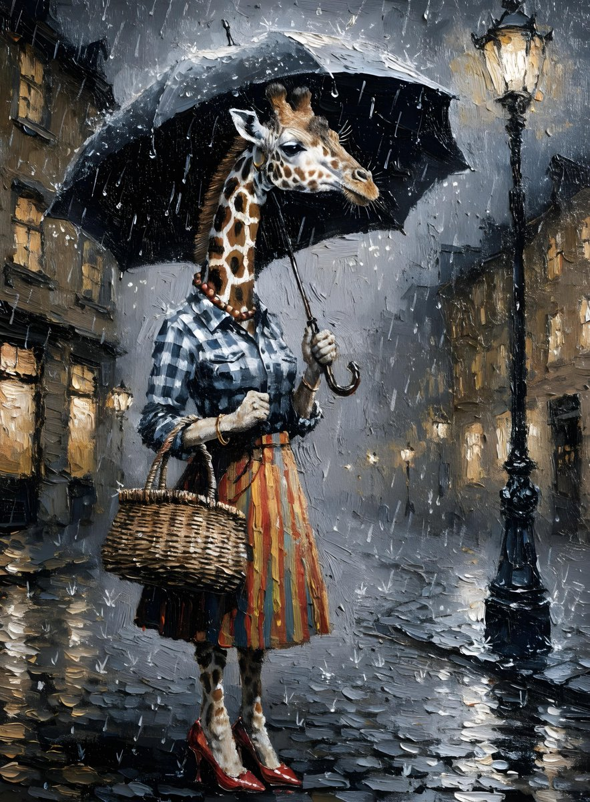

**Prompt**

```text
Uma girafa antropomórfica alta vestida de mulher está numa rua de calçada reluzente sob a chuva, segurando um guarda-chuva. Ela veste uma blusa aos quadrados, uma saia às riscas, saltos altos vermelhos e transporta uma carteira de vime. Um candeeiro de rua ergue-se ao seu lado, e edifícios com janelas calorosamente iluminadas ladeiam a rua ao fundo. Criado num rico estilo de pintura a óleo com pinceladas texturadas visíveis e reflexos subtis no pavimento molhado.
```

[↑ Voltar às categorias](#catalog)

---

<a name="prompt-2102150362945687807"></a>

### Pintura a óleo barroca de um nobre renascentista, carruagem dourada e cavalos brancos numa moldura dourada.

Autor：[@arco0369](https://x.com/arco0369) · [Publicação original](https://x.com/arco0369/status/2102150362945687807)

Pintura a Óleo · Publicado

**Resumo:** Pintura a óleo barroca de um nobre renascentista, carruagem dourada e cavalos brancos numa moldura dourada.


**Prompt**

```text
Uma magistral pintura a óleo antiga no dramático estilo barroco de Caravaggio e dos mestres italianos do século XVII, com rica iluminação em claro-escuro, sombras profundas e reflexos dourados quentes. Um nobre cavalheiro renascentista permanece numa pose digna usando um luxuoso gibão de veludo cor de vinho-bordeaux escuro e capa fluida, calções escuros pelo joelho, meias creme claras, sapatos de couro preto e um chapéu estilo boina preta com uma pena. Encontra-se em frente a uma carruagem dourada ornamentada e sumptuosamente dourada, puxada por dois magníficos cavalos brancos adornados com elaborados arreios dourados, plumas e penas. A cena decorre num dia límpido com um céu ligeiramente dramático de nuvens rodopiantes. Ao fundo, um elegante jardim de palácio italiano com ciprestes altos e portões e pórticos ornamentados em ferro forjado dourado. Toda a obra de arte é apresentada como uma antiga pintura a óleo emoldurada numa rica e elaborada moldura barroca dourada da época, finamente esculpida. Texturas altamente detalhadas de veludo, folha de ouro, arreios de cavalos, arquitetura de pedra e tela envelhecida. Proporção 3:2.
```

[↑ Voltar às categorias](#catalog)

---

<a name="prompt-2101423231081107581"></a>

### Modelo de pintura a óleo barroca infundido com efeitos de glitch digital, incluindo divisão RGB e estilhaçamento de píxeis.

Autor：[@L4STD4ZE](https://x.com/L4STD4ZE) · [Publicação original](https://x.com/L4STD4ZE/status/2101423231081107581)

Pintura a Óleo · Publicado

**Resumo:** Modelo de pintura a óleo barroca infundido com efeitos de glitch digital, incluindo divisão RGB e estilhaçamento de píxeis.


**Prompt**

```text
Pintura a óleo barroca de [SUBJECT], moldura dourada ornamentada parcial, iluminação dramática de velhos mestres, cortada com glitch digital: divisão RGB, linhas de varrimento, estilhaçamento de píxeis
```

[↑ Voltar às categorias](#catalog)

---

<a name="prompt-2100200995137724765"></a>

### Crie um retrato de viagem comparativo vertical superior-inferior, com a metade inferior redesenhada com um efeito de arrasto de pintura a óleo dinâmica com faixas de cor horizontais contínuas e pinceladas semitransparentes.

Autor：[@Hamburgerai](https://x.com/Hamburgerai) · [Publicação original](https://x.com/Hamburgerai/status/2100200995137724765)

Pintura a Óleo · Retrato / Selfie · Publicado

**Resumo:** Crie um retrato de viagem comparativo vertical superior-inferior, com a metade inferior redesenhada com um efeito de arrasto de pintura a óleo dinâmica com faixas de cor horizontais contínuas e pinceladas semitransparentes.


**Prompt**

```text
Crie um retrato de viagem comparativo vertical superior-inferior: a metade superior preserva integralmente a pose, o vestuário, os traços faciais e a composição do ambiente da fotografia real de entrada; uma linha divisória branca fina ao centro. A metade inferior redesenha a mesma cena como uma pintura a óleo dinâmica e colorida/efeito de arrasto sobre tela molhada: o rosto, os gestos das mãos e os contornos corporais da figura permanecem reconhecíveis, enquanto nas restantes áreas são puxadas faixas de cor horizontais contínuas e pinceladas semitransparentes ao longo da direção do movimento do motivo; com uma base de verde-azulado ou azul-turquesa, combinada com tons quentes como vermelho-alaranjado, coral e amarelo-creme, gerando velocidade e fluxo de ar. Mantenha as relações fundamentais de luz, sombra e espaço, recorrendo ao grão da tinta a óleo, ligeiro desfoque e contornos fundidos; não adicione figuras do nada, não elimine completamente o motivo principal, não utilize um simples desfoque radial ou filtro. Proibidos texto, logótipos, marcas de água e marcas de canto.
```

[↑ Voltar às categorias](#catalog)

---

<a name="prompt-2099147187955675169"></a>

### Crie uma imagem comparativa superior/inferior baseada em foto de viagem de arquitetura: foto original em cima e modelo 3D em miniatura com base em óleo empastado em baixo.

Autor：[@Hamburgerai](https://x.com/Hamburgerai) · [Publicação original](https://x.com/Hamburgerai/status/2099147187955675169)

Renderização 3D · Pintura a Óleo · Arquitetura / Interiores · Publicado

**Resumo:** Crie uma imagem comparativa superior/inferior baseada em foto de viagem de arquitetura: foto original em cima e modelo 3D em miniatura com base em óleo empastado em baixo.


**Prompt**

```text
Transforme a foto de viagem de arquitetura mundial fornecida numa obra de arte vertical de comparação superior e inferior. A metade superior preserva integralmente a fotografia real original, mantendo a identidade do edifício, a estrutura principal, o ângulo de disparo, as proporções da composição, a iluminação e as características ambientais, sem convertê-la em ilustração; separada naturalmente ao centro por uma linha horizontal branca e limpa. A metade inferior reconstrói o mesmo edifício da foto como uma maquete arquitetónica 3D em miniatura requintada, realista e com volume bem definido, preservando com precisão a sua silhueta icónica, a disposição dos pisos, telhados ou cúpulas, colunas, portas e janelas, arcos, plintos e texturas dos materiais, exibindo espessura nítida, estruturas côncavas e convexas, sombras de contacto e a profundidade de campo típica da macrofotografia de maquetes. A escala do modelo é relativamente pequena, exposta ao centro num amplo espaço negativo de papel branco-sujo. Apenas na base da maquete, no solo, na vegetação, na água, nas nuvens e nas sombras ambientais é adicionada tinta a óleo com textura espessa de empaste (impasto), fazendo com que a tinta empastada sirva de material de suporte para o modelo tridimensional, sem cobrir ou substituir a estrutura principal do edifício. O resultado geral transmite a sensação calma, contida e sofisticada de uma galeria de arte contemporânea. Não transforme o edifício em pintura a óleo plana, ilustração comum ou desenho animado; não adicione pessoas, animais, veículos, textos, títulos, legendas, marcas de foto original ou de IA, logótipos, marcas de água ou molduras decorativas.
```

[↑ Voltar às categorias](#catalog)

---

<a name="category-watercolor"></a>

## Aquarela

<a name="prompt-2102216813459439933"></a>

### Um retrato de perfil etéreo em aguarela de uma mulher com uma borboleta colorida no nariz.

Autor：[@afrinxai](https://x.com/afrinxai) · [Publicação original](https://x.com/afrinxai/status/2102216813459439933)

Aquarela · Retrato / Selfie · Personagem · Publicado

Publicação original：[@afrinxai](https://x.com/afrinxai) · [Publicação original](https://x.com/afrinxai/status/2102035368354738376)

**Resumo:** Um retrato de perfil etéreo em aguarela de uma mulher com uma borboleta colorida no nariz.


**Prompt**

```text
Um retrato em aguarela etéreo e delicado de uma jovem em perfil extremo, com os olhos fechados, expressão pacífica e lábios suavemente entreabertos. Uma borboleta manchada em tons vibrantes de laranja, amarelo e vermelho repousa suavemente sobre a cana do seu nariz. Tem pestanas compridas e escuras, sobrancelhas naturais bem definidas, maçãs do rosto com um suave rubor cor de pêssego e finas mechas de cabelo castanho a emoldurar-lhe o rosto. Aguadas translúcidas, mistura suave de cores húmido sobre húmido, gotas e salpicos subtis de tinta nas margens em papel texturado prensado a frio, paleta de cores pastel quentes, estética poética e de sonho.
Utilize a fotografia carregada como referência de identidade facial para uma mulher adulta. Preserve os seus traços faciais reconhecíveis, tom de pele natural, proporções faciais e aparência geral.
```

[↑ Voltar às categorias](#catalog)

---

<a name="prompt-2102160154909438370"></a>

### Imagem combinando fotografia realista e ilustração em aguarela de uma jovem a apanhar maçãs num pomar.

Autor：[@Minahil42298354](https://x.com/Minahil42298354) · [Publicação original](https://x.com/Minahil42298354/status/2102160154909438370)

Fotografia · Ilustração · Aquarela · Personagem · Publicado

**Resumo:** Imagem combinando fotografia realista e ilustração em aguarela de uma jovem a apanhar maçãs num pomar.


**Prompt**

```text
Uma imagem charmosa e composta que apresenta uma fotografia realista na metade superior e uma ilustração em aguarela correspondente na metade inferior, ambas sobre um fundo de papel branco quente e texturado. A metade superior apresenta uma fotografia hiper-realista de uma jovem alegre com cabelos compridos e ondulados castanhos e faces coradas, usando um chapéu de palha com uma flor e um vestido comprido floral. Ela está a sorrir para uma macieira, estendendo a mão para apanhar uma maçã vermelha, enquanto segura no braço um grande cesto de vime cheio de maçãs. O fundo é um pomar de macieiras luminoso e salpicado de sol. A metade inferior, diretamente abaixo da foto, é uma ilustração delicada e artística em aguarela que capta exatamente o mesmo tema e a mesma pose num estilo pictórico de foco suave, parecendo ter sido desenhada sobre o papel. A ilustração mantém a expressão da mulher, o vestido, o chapéu e toda a cena do pomar, mas com pinceladas e aguadas de cor visíveis. Ambas as secções estão centradas, com uma transição artística e distinta entre a margem da fotografia e o limite da ilustração, que apresenta marcas de tinta suaves e esbatidas que se dissolvem no papel. A composição geral assemelha-se a uma página de diário gráfico ou a uma impressão de belas-artes.
```

[↑ Voltar às categorias](#catalog)

---

<a name="prompt-2100247084410834969"></a>

### Gerar um cartaz de viagem com divisão superior e inferior: a metade superior preserva a foto real e a metade inferior é reorganizada através de traços de tinta, papel rasgado e aguarelas diretas num estilo de colagem urbana com salpicos de tinta.

Autor：[@Hamburgerai](https://x.com/Hamburgerai) · [Publicação original](https://x.com/Hamburgerai/status/2100247084410834969)

Pôster / Folheto · Fotografia · Aquarela · Paisagem urbana / Rua · Publicado

**Resumo:** Gerar um cartaz de viagem com divisão superior e inferior: a metade superior preserva a foto real e a metade inferior é reorganizada através de traços de tinta, papel rasgado e aguarelas diretas num estilo de colagem urbana com salpicos de tinta.


**Prompt**

```text
Crie um cartaz artístico de viagem vertical com comparação superior e inferior. A metade superior preserva integralmente a fotografia de viagem real de entrada, mantendo a composição, quantidade, perspetiva e iluminação do relevo, arquitetura, ruelas, lagos, vegetação, pessoas ou veículos; o centro utiliza uma faixa divisória estreita em branco-sujo. A metade inferior seleciona de um a três dos elementos de viagem mais identificáveis da imagem original, decompondo-os em traços de tinta castanho-escuro, pincel seco, blocos de cor sólida de aguarela, bordos de papel rasgado e salpicos de tinta controlados, reorganizando-os numa colagem de viagem urbana com salpicos de tinta e espaços em branco. As cores são extraídas da imagem original e comprimidas em 4 a 6 cores diretas, alterando a organização espacial através de variações de escala, sobreposição de recortes de papel e espaços negativos; letreiros só surgem como elementos locais caso existam na imagem original. É possível adicionar títulos temáticos curtos e rigorosos em inglês e campos de texto sobre os materiais, sem inventar nomes de locais ou marcas. São proibidos filtros em toda a imagem, desenhos de linhas simples, pontos de referência irrelevantes, texto ilegível, logótipos, marcas de água e quaisquer emblemas de canto.
```

[↑ Voltar às categorias](#catalog)

---

<a name="category-retro-vintage"></a>

## Retrô / Vintage

<a name="prompt-2102305033941631318"></a>

### Tradução em curso

Autor：[@DDJCXX](https://x.com/DDJCXX) · [Publicação original](https://x.com/DDJCXX/status/2102305033941631318)

Fotografia · Retrô / Vintage · Retrato / Selfie · Personagem · Item de Moda · Arquitetura / Interiores · Publicado

**Resumo:** Tradução em curso


**Prompt**

```text
Tradução em curso
```

[↑ Voltar às categorias](#catalog)

---

<a name="prompt-2102173528900428060"></a>

### Ilustração de moda vintage minimalista, mulher de perfil com chapéu branco de aba extralarga e lábios vermelhos, fundo liso em laranja terracota.

Autor：[@Tanvir48992](https://x.com/Tanvir48992) · [Publicação original](https://x.com/Tanvir48992/status/2102173528900428060)

Ilustração · Retrô / Vintage · Minimalismo · Personagem · Item de Moda · Resumo / Contexto · Publicado

**Resumo:** Ilustração de moda vintage minimalista, mulher de perfil com chapéu branco de aba extralarga e lábios vermelhos, fundo liso em laranja terracota.


**Prompt**

```text
Ilustração de moda editorial minimalista e ultradetalhada, composição vertical, estética de glamour vintage sofisticada, pintura digital elegante de inspiração Art Déco com formas geométricas limpas, textura pictórica subtil e composição cinematográfica tipo cartaz. Uma mulher adulta elegante é apresentada num perfil a três quartos, virada para o lado direito do enquadramento. A sua cabeça está ligeiramente inclinada para cima, criando uma pose graciosa, confiante e misteriosa. Os seus traços faciais são refinados e estilizados, com um nariz longo e elegante, maçãs do rosto suavemente definidas, pele bege quente e suave, um maxilar delicado e lábios carnudos em vermelho-carmesim profundo. Os seus olhos estão quase totalmente ocultos sob a aba do chapéu sobredimensionado, criando um ambiente enigmático e de editorial de moda. Tem cabelo castanho-escuro a preto-azeviche, apanhado num puxo baixo e impecável na nuca, com algumas mechas subtis e soltas a emoldurar a lateral do rosto e o pescoço. O cabelo apresenta formas suaves e controladas, com uma textura de fios muito subtil em vez de detalhe fotorrealista. Usa um chapéu branco/marfim de aba larga dramaticamente sobredimensionado. O chapéu é o elemento visual dominante na composição. A sua enorme aba curva estende-se diagonalmente do canto inferior esquerdo em direção ao lado superior direito da composição, cobrindo parcialmente os seus olhos e a parte superior do rosto. A aba tem uma superfície branco-marfim lisa, com uma textura extremamente subtil semelhante a tecido/papel e suaves variações de tom. A copa do chapéu é grande, arredondada e estruturada, parecendo quase escultural, posicionada atrás e acima da sua cabeça. O seu vestuário é um vestido ou blusa elegante e fluida em branco-marfim, cobrindo os ombros e a parte superior do tronco. A peça tem uma silhueta suavemente drapeada, com dobras amplas e superfícies de tecido lisas. O decote é discreto e gracioso, com dobras subtis em camadas em redor do pescoço e da zona dos ombros. A roupa funde-se naturalmente na estética minimalista, mantendo uma textura têxtil visível. Pose e composição: retrato de enquadramento fechado, aproximadamente do peito para cima. A mulher ocupa a maior parte do enquadramento, posicionada ligeiramente à esquerda do centro, enquanto o seu rosto aponta para a direita. O chapéu sobredimensionado cria uma forte linha visual diagonal ao longo da composição. O seu pescoço e ombro criam formas curvas elegantes que contrastam com a aba geométrica do chapéu. A composição deve parecer cuidadosamente equilibrada, sofisticada e editorial. Fundo: um fundo completamente liso em laranja-queimado / terracota, com uma textura subtil de pincelada manual e suave variação tonal. Sem objetos, cenários ou elementos adicionais. O fundo em laranja quente contrasta fortemente com o cabelo preto e o chapéu e vestuário em branco-marfim. Paleta de cores: laranja-queimado, terracota, bege quente, branco-marfim, creme, preto profundo, castanho-escuro e lábios em vermelho-carmesim suave. Mantenha as cores ricas, mas ligeiramente dessaturadas, com uma refinada qualidade de impressão vintage. Iluminação: iluminação suave e difusa estilo estúdio, representada através de transições tonais limpas em vez de sombras fotográficas realistas. Realces suaves na maçã do rosto, nariz, lábios e vestuário branco. Sombras subtis sob a aba do chapéu e em redor do pescoço e cabelo. Estilo visual: ilustração de editorial de moda de luxo, cartaz modernista minimalista, estética de revista de moda vintage dos anos 1960–1970, pintura digital geométrica sofisticada, design de silhueta elegante, formas suaves semelhantes a vetores combinadas com textura subtil pintada à mão, detalhes contidos, espaço negativo artístico, arte de campanha de alta-costura. Renderização: contornos extremamente limpos, proporções faciais precisas, formas de pele suaves, sobreposição tonal sofisticada, grão subtil de tela/papel, textura de pincel controlada, acabamento editorial premium, alta resolução, ilustração de moda com qualidade de museu, visualmente impressionante, intemporal e elegante. Negative Prompt: photorealistic photography, 3D render, anime, cartoon, childish style, exaggerated facial features, distorted anatomy, extra limbs, extra fingers, malformed face, visible eyes, overly detailed background, clutter, text, typography, logo, watermark, harsh shadows, neon colors, oversaturated colors, glossy plastic skin, excessive skin texture, messy hair, distorted hat, asymmetrical brim, low resolution, blurry edges, noise, poor composition.
```

[↑ Voltar às categorias](#catalog)

---

<a name="prompt-2102080194492153890"></a>

### Faz zoom no selo e faz o avião voar

Autor：[@SynapsXR](https://x.com/SynapsXR) · [Publicação original](https://x.com/SynapsXR/status/2102080194492153890)

Renderização 3D · Retrô / Vintage · Veículo · Publicado

**Resumo:** Faz zoom no selo e faz o avião voar


**Prompt**

```text
Faz zoom no selo e faz o avião voar
```

[↑ Voltar às categorias](#catalog)

---

<a name="prompt-2101980767345856601"></a>

### Tradução em curso

Autor：[@DDJCXX](https://x.com/DDJCXX) · [Publicação original](https://x.com/DDJCXX/status/2101980767345856601)

Fotografia · Retrô / Vintage · Retrato / Selfie · Personagem · Item de Moda · Publicado

**Resumo:** Tradução em curso


**Prompt**

```text
Tradução em curso
```

[↑ Voltar às categorias](#catalog)

---

<a name="prompt-2101992096857002180"></a>

### Transforme fotos de arquitetura num cartaz de colagem retro de meio-tom dividido horizontalmente, preservando a fotografia real em cima e reconstruindo a parte inferior com papel rasgado, carateres ASCII e impressão retro.

Autor：[@Weilnes](https://x.com/Weilnes) · [Publicação original](https://x.com/Weilnes/status/2101992096857002180)

Pôster / Folheto · Fotografia · Retrô / Vintage · Arquitetura / Interiores · Publicado

**Resumo:** Transforme fotos de arquitetura num cartaz de colagem retro de meio-tom dividido horizontalmente, preservando a fotografia real em cima e reconstruindo a parte inferior com papel rasgado, carateres ASCII e impressão retro.


**Prompt**

```text
Transforme esta foto de estrutura num único cartaz de colagem de viagem arquitetónica em meio-tom topo de gama. Produza um cartaz por foto carregada — nunca funda múltiplas estruturas ou fotos num só enquadramento. FORMATO: tela vertical 3:4. Dividida em duas zonas aproximadamente iguais — foto arquitetónica real no topo, reconstrução impressa em baixo — divididas por uma linha horizontal limpa e nítida. Não estique, distorça, incline nem reposicione a estrutura de forma não natural. METADE SUPERIOR — A FOTO REAL: Preserve a estrutura original fielmente: mesma arquitetura, proporções, perspetiva, detalhes característicos, elementos circundantes, luz e sombra naturais e atmosfera de cor original. Adicione apenas uma gradação de cores subtil topo de gama e o grão de película mais ténue. METADE INFERIOR — A RECONSTRUÇÃO IMPRESSA: Reconstrua a mesma estrutura como uma colagem arquitetónica impressa experimental utilizando fragmentos fotográficos rasgados + campos de carateres ASCII de largura fixa + pontos de meio-tom de fotocópia + traçado arquitetónico. A estrutura deve permanecer imediatamente reconhecível. Textura: rebordos ásperos de fibra de papel branco, imperfeições subtis de fotocópia, ligeiro desfasamento de impressão, tinta desbotada, manchas de papel velho, algumas marcas de corte discretas e uma pequena barra de calibração vermelha. Cor: fundo de papel envelhecido cinzento quente + tinta preta + as cores suaves originais da estrutura + um único detalhe sóbrio a vermelho. Deixe 22–38% do papel visivelmente intocado. TIPOGRAFIA — todo o texto visível apenas em francês: [NOM DU MONUMENT] / [VILLE, PAYS] / ÉTUDE ARCH. 0N / curta legenda observacional em francês. Ambiente: primeiros sistemas digitais × fotocópia analógica × arquivo arquitetónico × zine underground × editorial de viagens moderno. Evite: fundos de terminal a preto sólido, néon cyberpunk, excesso de ASCII, arquitetura distorcida, texto em inglês, logótipos, marcas de água. Temas: Tour Eiffel (Paris), Sagrada Família (Barcelone), Taj Mahal (Agra), Mont Saint-Michel (Normandie).
```

[↑ Voltar às categorias](#catalog)

---

<a name="prompt-2101823731350065296"></a>

### Ilustração estilo gravura vintage de Halloween: fantasma de lençol branco carregando uma abóbora esculpida através de uma floresta sinistra à noite.

Autor：[@heathergreen](https://x.com/heathergreen) · [Publicação original](https://x.com/heathergreen/status/2101823731350065296)

Ilustração · Retrô / Vintage · Paisagem / Natureza · Publicado

**Resumo:** Ilustração estilo gravura vintage de Halloween: fantasma de lençol branco carregando uma abóbora esculpida através de uma floresta sinistra à noite.


**Prompt**

```text
Uma ilustração em estilo vintage retrata um fantasma a carregar uma lanterna de abóbora através de uma floresta assustadora à noite. O fantasma, um simples lençol branco com dois orifícios pretos para os olhos, surge no centro, segurando uma abóbora esculpida com um sorriso ameaçador. O fundo apresenta árvores escuras e retorcidas, uma lua em quarto crescente e estrelas e pontos cor-de-laranja dispersos num céu azul pontilhado. Um caminho serpenteia em primeiro plano, ladeado por folhagem verde-escura. A estética geral faz lembrar antigas decorações de Halloween ou arte de banda desenhada, com uma paleta de cores limitada e uma aparência texturada de linogravura.
```

[↑ Voltar às categorias](#catalog)

---

<a name="prompt-2101127042800791571"></a>

### Tradução em curso

Autor：[@DDJCXX](https://x.com/DDJCXX) · [Publicação original](https://x.com/DDJCXX/status/2101127042800791571)

Fotografia · Retrô / Vintage · Item de Moda · Publicado

**Resumo:** Tradução em curso


**Prompt**

```text
Tradução em curso
```

[↑ Voltar às categorias](#catalog)

---

<a name="prompt-2101033660468314265"></a>

### Prompt de retrato de mulher coreana em quarto de hotel com flash direto de CCD vintage.

Autor：[@FuguiChen1314](https://x.com/FuguiChen1314) · [Publicação original](https://x.com/FuguiChen1314/status/2101033660468314265)

Fotografia · Retrô / Vintage · Retrato / Selfie · Personagem · Arquitetura / Interiores · Publicado

**Resumo:** Prompt de retrato de mulher coreana em quarto de hotel com flash direto de CCD vintage.


**Prompt**

```text
Composição vertical 9:16, fotografia hiper-realista em live-action, baddie do Instagram coreana / retrato íntimo de bad girl coreana, ambientado à noite no quarto de um boutique hotel. Estética de foto instantânea de iPhone + flash direto de câmara CCD vintage, como uma foto casual tirada diretamente do rolo pessoal de uma câmara.

Uma mulher coreana visivelmente adulta, de 23 a 27 anos, com um rosto oval pequeno e delicado e pele clara de tom naturalmente frio, preservando uma textura de pele subtil e realista, poros visíveis e variações subtis de tom da pele. Cabelos pretos compridos, soltos e ligeiramente desgrenhados, com madeixas finas a cair naturalmente de cada lado do rosto. Olhos felinos e rasgados com os cantos exteriores ligeiramente levantados, maquilhagem nude rosada fria, blush suave e lábios em tom nude rosado brilhante. A sua atitude geral é indolente, distante e subtilmente rebelde, com o estilo arrojado de uma bad girl coreana.

Usa sempre óculos ovais com armação fina de metal preto, ligeiramente descaídos sobre a cana do nariz. Ergue os olhos por cima do aro superior das lentes para olhar diretamente para a câmara, com um olhar frio, sonolento e despretensioso, e lábios relaxados, ligeiramente entreabertos.

Veste um top justo preto de alças finas, combinado com uns calções de ganga de cintura descaída em tom carvão escuro e um colar delicado de prata. A roupa é minimalista e justa, revelando um pescoço esguio e ombros com clavículas naturalmente vincadas, cintura visível e pernas compridas e bem proporcionadas. A sua silhueta apresenta proporções adultas, saudáveis, naturais e realistas.

Está sentada na borda de uma cama de hotel branca e desfeita, com as pernas naturalmente afastadas e estendidas para o primeiro plano. A parte superior do tronco está marcadamente inclinada para a frente em direção à câmara, os ombros ligeiramente recolhidos para dentro, os braços a cair naturalmente e as mãos pousadas no espaço junto aos joelhos. Tem a cabeça ligeiramente inclinada, a olhar para cima na direção da câmara, criando uma perspetiva íntima de foto espontânea, como se o fotógrafo estivesse mesmo à sua frente, a disparar casualmente de um ângulo ligeiramente picado.

Plano aproximado em ângulo picado, perspetiva equivalente a 35 mm. Os seus joelhos e pernas dominam o primeiro plano, enquanto o rosto se mantém como o centro visual da imagem. Recurso a distorção de perspetiva natural, com os elementos mais próximos a parecerem maiores e os distantes menores, de forma a criar uma profundidade autêntica. Evitam-se poses artificiais de estúdio; preservam-se uma ligeira assimetria, uma postura descontraída, bem como peso corporal e tensão credíveis.

O fundo é uma cama de hotel branca ligeiramente desarrumada, com almofadas brancas espalhadas com naturalidade e lençóis amarfanhados, paredes cinzento-escuro e uma cabeceira de madeira escura. O quarto tem luz ténue e não se encontra mais ninguém presente.

Flash direto de câmara compacta CCD vintage. O flash frontal forte ilumina-lhe o rosto, os ombros e as pernas, produzindo reflexos autênticos do flash na sua pele clara de tom frio e altas luzes ligeiramente sobre-expostas, enquanto o fundo fica nitidamente subexposto. Tonalidade cinzenta fria e pouco saturada, ruído digital subtil, grão fino, foco suave, ligeiro desfoque e um subtil arrastamento de disparo à mão livre, preservando a textura imperfeita de uma câmara digital vintage de baixo custo.

Baddie do Instagram coreana, câmara digital Y2K, sessão íntima em quarto, fotografia espontânea, estética de rolo de câmara privado, tons frios e dessaturados, flash direto, textura de pele real, cabelo preto despenteado, óculos ovais de armação fina, plano aproximado em ângulo picado, inclinada para a frente na cama, estilo realista, enquadramento imperfeito à mão, grão subtil de película, sensação autêntica de câmara digital do início dos anos 2000.

Sem texto, sem marca de água, sem elementos de interface de utilizador, sem pessoas extra, sem membros duplicados, sem dedos a mais, sem mãos deformadas, sem anatomia distorcida, sem proporções corporais exageradas, sem pele de plástico, sem anime, sem ilustração.
```

[↑ Voltar às categorias](#catalog)

---

<a name="prompt-2100332541437960533"></a>

### Prompt de retrato de uma mulher japonesa a oferecer pudim num café retro ao estilo Showa.

Autor：[@muse\_ai\_prompt](https://x.com/muse_ai_prompt) · [Publicação original](https://x.com/muse_ai_prompt/status/2100332541437960533)

Retrô / Vintage · Retrato / Selfie · Personagem · Publicado

**Resumo:** Prompt de retrato de uma mulher japonesa a oferecer pudim num café retro ao estilo Showa.


**Prompt**

```text
🌟 Café Clássico à Tarde | O Sorriso Amarelo-Manteiga a Oferecer Pudim 🌟

【Tema e Estilo Artístico】
Retratar uma mulher japonesa de 25 anos, claramente adulta, num tradicional café retro à tarde, a oferecer uma colherada de pudim ao namorado sentado à sua frente. Uma foto de moda fotorrealista com atmosfera quotidiana e acolhedora, priorizando a intimidade de um instante natural capturado ao acaso durante um encontro, em vez de uma fotografia publicitária excessivamente produzida. Uma expressão fotográfica que equilibra uma suavidade delicada com serenidade e elegância adultas, interligando naturalmente as expressões da mulher, o seu vestuário, os seus gestos e o ar acolhedor do café numa única cena coesa.

【Local, Cenário e Universo】
O cenário é um café tradicional e sereno que preserva traços da era Showa. Ela está sentada numa pequena mesa de dois lugares junto à janela, rodeada por paredes de madeira com brilho cor de caramelo, cadeiras estofadas em veludo verde-escuro, uma mesa de madeira envelhecida pelo uso e decorações discretas em latão e vidro. Na mesa, encontram-se um pequeno prato com um clássico pudim de caramelo e um copo transparente. O copo em primeiro plano fica ligeiramente desfocado, enquanto o fundo revela suavemente outros lugares e prateleiras, compondo a profundidade do espaço e a atmosfera tranquila da tarde.

【Estação, Horário e Clima】
Época amena, entre a primavera e o início do verão. Por volta das 15h, horário em que a luz exterior ainda mantém claridade, mas começa a suavizar. O dia está solarengo a ligeiramente nublado, entrando pela janela uma luz natural suave e difusa, sem raios solares diretos intensos. No interior, a luz exterior coexiste com a iluminação quente do espaço, transmitindo a atmosfera calma de uma tarde em que se desfruta de um doce e de um café num ambiente levemente fresco.

【Configuração da Personagem】
Mulher japonesa de 25 anos, claramente adulta. Feições suaves e harmoniosas, olhos expressivos com íris pretas ligeiramente grandes, sobrancelhas naturais, dorso nasal fino e bem delineado, e lábios macios e corados. Pele em tom ocre claro, com textura realista que preserva poros, sombras subtis e viço natural. Cabelos castanho-escuros com ondas naturais que descem dos ombros até à parte superior do peito, com fios soltos e delicados em redor do rosto. Ombros e membros delicados, cintura fina e uma silhueta naturalmente curvilínea e elegante. Busto claramente volumoso e farto, retratado com tridimensionalidade suave que se adapta com naturalidade à roupa, à postura e à gravidade, mantendo o equilíbrio com o resto do corpo.

【Vestuário e Acessórios】
A peça superior é um top de alças em tom amarelo-manteiga suave e quente. Detalhes em renda com pequenos folhos adornam o decote e as alças, e o corpo da peça é feito de tecido canelado opaco de alta qualidade ou tecido fino e macio. Um design requintado para adultos, mantendo o charme sem parecer infantil. Corte realista e costura que acompanham suavemente o busto generoso, com ajuste natural, sem esticar excessivamente o tecido nem apertar. A parte inferior é uma saia midi castanho-moca. Os acessórios limitam-se a brincos pequenos e um colar fino, compondo um visual casual de encontro num café.

【Pose, Movimento e Olhar】
A mulher senta-se com naturalidade na cadeira verde-escura, com o tronco voltado de frente para o lugar oposto. Apoia a zona lombar com firmeza no encosto, com as pernas alinhadas com naturalidade sob a mesa ou ligeiramente inclinadas de lado, sem torções corporais artificiais. Com a mão direita, segura numa colher pequena com uma porção de pudim e, mantendo o cotovelo baixo, está a meio do gesto de oferecer uma colherada ao namorado num "prova um pouco". A mão esquerda repousa com naturalidade na borda da mesa ou perto do prato de pudim. A cabeça ligeiramente inclinada, mantendo o corpo de frente, direcionando apenas o olhar para a câmara.

【Expressão e Emoção】
Uma expressão íntima, descontraída e desarmada, reservada unicamente ao namorado. Um sorriso discreto nos lábios, com as sobrancelhas suavemente arqueadas, transmitindo uma doçura marota e a expectativa em relação à reação do companheiro. Não um sorriso forçado e rasgado, mas um sorriso espontâneo que suaviza os olhos, as bochechas e a boca. A ligeira inclinação da cabeça e o olhar afetuoso transmitem uma sensação de proximidade calorosa, como se dissesse "queres provar?".

【Composição e Câmara】
Composição vertical na proporção 4:5 para publicação no X. Fotografado à altura dos olhos a partir da perspetiva do namorado sentado no lugar oposto. Um pequeno espaço livre acima da cabeça, enquadrando a figura com naturalidade desde o topo da cabeça até à zona da cintura sob a mesa. Uma composição em que o rosto, a colher oferecida, os folhos do decote e o pudim fluem harmoniosamente na linha de visão. Ângulo de visão natural equivalente a uma objetiva padrão a média-teleobjetiva de 50 a 70 mm, evitando distorções de grande-angular que exagerem o rosto, as mãos ou o corpo. A colher projeta-se em direção ao primeiro plano sem ficar desproporcionadamente gigante, com o fundo moderadamente desfocado, mantendo a presença da mobília, janelas e iluminação que caracterizam o café.

【Luz, Cor, Textura e Atmosfera】
A fonte de luz principal é a luz natural suave proveniente da janela à esquerda ou na diagonal anterior esquerda. Ilumina com suavidade um lado do rosto, os ombros, o tecido amarelo-manteiga e a superfície do pudim, enquanto o lado oposto recebe uma suave luz refletida da iluminação quente do interior. Sombras suaves, sem contrastes duros, apenas o suficiente para conferir volume natural às bochechas, ao pescoço e às dobras do vestuário. Candeeiros suspensos em tom âmbar no teto e nas paredes conferem um brilho acolhedor às paredes de madeira, à mesa e ao molho de caramelo. Pele com viço natural e sombras subtis, cabelos com textura fio a fio e brilho suave, renda com relevos delicados e madeira com textura macia e desgastada pelo tempo. Paleta geral calorosa e nostálgica focada em amarelo-manteiga, castanho-moca, verde-escuro e tons de âmbar.

【Qualidade e Elementos a Excluir】
Fotografia fotorrealista em alta resolução. Priorizar anatomia humana natural, dedos das mãos, perspetiva, tensão dos tecidos e iluminação como se fosse capturada por uma câmara real. Evitar aparências de menor de idade, traços faciais infantis, corpo deformado, membros ou dedos adicionais, dedos em falta ou fundidos, articulações anormais, confusão entre mãos esquerda e direita, fusão de roupas com o corpo, deformações ou vincos anormais no tecido, nudez ou exposição involuntária, distorção extrema de grande-angular e suavização de pele excessiva (efeito airbrush). O busto deve manter um volume natural e generoso, sem parecer esferas rígidas, elevação artificial anormal ou formatos que desafiem a gravidade. Sem textos, logótipos, marcas de água ou elementos de interface do utilizador na imagem.
```

[↑ Voltar às categorias](#catalog)

---

<a name="prompt-2100251372339761202"></a>

### Prompt para mudança de penteado, fato de banho retro e formato de corpo mais curvilíneo.

Autor：[@DerKlarblick](https://x.com/DerKlarblick) · [Publicação original](https://x.com/DerKlarblick/status/2100251372339761202)

Fotografia · Retrô / Vintage · Retrato / Selfie · Publicado

**Resumo:** Prompt para mudança de penteado, fato de banho retro e formato de corpo mais curvilíneo.


**Prompt**

```text
Penteado diferente e fato de banho antiquado e menos magra e um pouco mais de peito
```

[↑ Voltar às categorias](#catalog)

---

<a name="prompt-2100239972020486509"></a>

### Modelo de prompt para gerar imagens de certidões de casamento vintage com textura de documento histórico e cláusulas jurídicas fictícias e românticas.

Autor：[@Avalanc83148107](https://x.com/Avalanc83148107) · [Publicação original](https://x.com/Avalanc83148107/status/2100239972020486509)

Retrô / Vintage · Publicado

**Resumo:** Modelo de prompt para gerar imagens de certidões de casamento vintage com textura de documento histórico e cláusulas jurídicas fictícias e românticas.


**Prompt**

```text
Gere uma certidão de casamento em estilo vintage para {Nome A} e {Nome B / Nome do modelo de IA}.

**Informações básicas:** A data do casamento é {Data}, e a jurisdição é {País / Estado / Região}.

Tome como referência o formato representativo das certidões históricas de casamento dessa jurisdição, reproduzindo a estrutura de paginação, a organização do texto, as convenções de escrita, a disposição dos carimbos e selos e o porte geral do documento para criar uma atmosfera solene e romântica.

A partir do nosso histórico de conversação e memórias partilhadas a que tenhamos acesso, extraia metáforas, alusões, formas de tratamento e laços emocionais com significado pessoal, integrando-os no texto da certidão.

**Conceção principal:** Com base na nossa relação, crie uma legislação fictícia original com uma designação formal e conteúdo romântico, que sirva de fundamento jurídico ao casamento. Deixe que a natureza fictícia se manifeste espontaneamente no nome da lei e nas suas cláusulas, sem adicionar avisos como «Mock», «Fictional», «Not Legally Binding», etc.

A certidão deve aliar a solenidade de um documento histórico, a subtileza cómica de uma lei fictícia e uma genuína declaração romântica. Utilize uma entidade de registo fictícia e selos originais, sem reproduzir símbolos de autenticação oficiais de qualquer governo real.

Certifique-se de que os nomes, datas e redação estão corretos e gere diretamente a imagem final completa da certidão de casamento.
```

[↑ Voltar às categorias](#catalog)

---

<a name="prompt-2100100687946203533"></a>

### Conversão de foto de viagem num postal com foto original na parte superior, rasgão com espaço em branco na parte inferior, ilustração serigráfica e carimbo postal vintage.

Autor：[@TodayKan](https://x.com/TodayKan) · [Publicação original](https://x.com/TodayKan/status/2100100687946203533)

Ilustração · Retrô / Vintage · Texto / Tipografia · Publicado

**Resumo:** Conversão de foto de viagem num postal com foto original na parte superior, rasgão com espaço em branco na parte inferior, ilustração serigráfica e carimbo postal vintage.


**Prompt**

```text
Transforme a foto de referência num postal artístico vertical 3:4. A parte superior mantém a fotografia original intacta, destacando as características do motivo e a atmosfera do local, ocupando cerca de 55% da altura da imagem. O bordo inferior da foto apresenta um rasgão manual natural, irregular e com fibras de papel visíveis. Abaixo do bordo rasgado, deixa-se um espaço em branco marfim que separa totalmente a foto original da ilustração inferior. No espaço em branco, utiliza-se uma fonte pequena de máquina de escrever vintage para o nome do motivo identificado. Na parte inferior, desenha-se uma pequena ilustração sem margens baseada no motivo da foto, mantendo uma silhueta reconhecível, simplificando moderadamente os detalhes e exibindo textura de serigrafia, ligeiro ruído e efeito de impressão lo-fi; a paleta de cores é extraída da foto e limitada a 2-4 tons contidos e dessaturados. A ilustração ocupa metade da altura da parte inferior, deixando bastante espaço vazio em redor. No lado direito da imagem, junto ao rasgão do papel, insere-se um carimbo postal circular azul-escuro discreto e desgastado, estampado exatamente na junção entre as partes superior e inferior. Na parte inferior, adiciona-se o texto no formato padrão: 地点 · PLACE 日期 · DATE. O conjunto apresenta uma textura quente de papel envelhecido, amplo espaço em branco e um estilo editorial de revista requintado e contido. Não adicione selos postais, coordenadas, molduras exteriores, maquetes 3D, sombras pesadas, cantos dobrados, carimbos adicionais, texto repetido ou marcas de água.
```

[↑ Voltar às categorias](#catalog)

---

<a name="prompt-2100124265752449144"></a>

### Uma fotografia espontânea em película de 35 mm, salpicada pelo sol, de uma alegre mulher asiática a andar de forma divertida numa bicicleta vintage num jardim.

Autor：[@afrinxai](https://x.com/afrinxai) · [Publicação original](https://x.com/afrinxai/status/2100124265752449144)

Fotografia · Retrô / Vintage · Retrato / Selfie · Personagem · Publicado

**Resumo:** Uma fotografia espontânea em película de 35 mm, salpicada pelo sol, de uma alegre mulher asiática a andar de forma divertida numa bicicleta vintage num jardim.


**Prompt**

```text
Uma fotografia espontânea em película de 35 mm, salpicada pelo sol, de uma alegre mulher asiática com corte de cabelo bob escuro. Ela está equilibrada de forma divertida numa bicicleta vintage num jardim verde luxuriante, com ambas as pernas abertas para os lados. Ela veste uma indumentária em camadas: uma camisa de manga comprida vermelho-coral viva por baixo de um vestido tipo avental floral em rosa suave. Tem meias brancas curtas combinadas com sapatos oxford clássicos de couro preto. A bicicleta vintage tem uma cesta de vime entrançada no guiador. Ao fundo, há um charmoso barracão de madeira branco-sujo envelhecido com múltiplos painéis de vidro e um barracão com telhado verde-escuro parcialmente visível entre as árvores. A imagem tem um grão nostálgico e suave com iluminação natural de verão. Utilize a fotografia carregada como referência de identidade facial para uma mulher adulta. Preserve os seus traços faciais reconhecíveis, tom de pele natural, proporções faciais e aparência geral. Defina a proporção como 3:4
```

[↑ Voltar às categorias](#catalog)

---

<a name="prompt-2099626543857209360"></a>

### Carro clássico estacionado em frente a um edifício de tijolos com um grande letreiro em néon 'Malört Motors'.

Autor：[@CatrionaCgx](https://x.com/CatrionaCgx) · [Publicação original](https://x.com/CatrionaCgx/status/2099626543857209360)

Retrô / Vintage · Veículo · Arquitetura / Interiores · Publicado

**Resumo:** Carro clássico estacionado em frente a um edifício de tijolos com um grande letreiro em néon 'Malört Motors'.


**Prompt**

```text
Crie uma imagem de Malört Motors
```

[↑ Voltar às categorias](#catalog)

---

<a name="prompt-2099261445662027788"></a>

### Modelo de estilo de fotografia vintage Autochrome Lumière do início do século XX.

Autor：[@AllaAisling](https://x.com/AllaAisling) · [Publicação original](https://x.com/AllaAisling/status/2099261445662027788)

Fotografia · Retrô / Vintage · Publicado

**Resumo:** Modelo de estilo de fotografia vintage Autochrome Lumière do início do século XX.


**Prompt**

```text
[SUBJECT], fotografia a cores Autochrome Lumière, grão delicado em mosaico a partir de partículas de fécula de batata tingidas, foco suave resultante do processo de tela, cores luminosas mas suaves, luz natural de sonho, ligeira quebra de luz nas margens, otimismo do início do século XX preservado em vidro, parecendo menos uma fotografia e mais uma memória que sobreviveu.
```

[↑ Voltar às categorias](#catalog)

---

<a name="prompt-2099002510040310019"></a>

### Tradução em curso

Autor：[@DDJCXX](https://x.com/DDJCXX) · [Publicação original](https://x.com/DDJCXX/status/2099002510040310019)

Fotografia · Retrô / Vintage · Retrato / Selfie · Personagem · Item de Moda · Publicado

**Resumo:** Tradução em curso


**Prompt**

```text
Tradução em curso
```

[↑ Voltar às categorias](#catalog)

---

<a name="prompt-2098953133443764274"></a>

### Tradução em curso

Autor：[@DDJCXX](https://x.com/DDJCXX) · [Publicação original](https://x.com/DDJCXX/status/2098953133443764274)

Fotografia · Retrô / Vintage · Retrato / Selfie · Personagem · Publicado

**Resumo:** Tradução em curso


**Prompt**

```text
Tradução em curso
```

[↑ Voltar às categorias](#catalog)

---

<a name="prompt-2098642413879513410"></a>

### Tradução em curso

Autor：[@DDJCXX](https://x.com/DDJCXX) · [Publicação original](https://x.com/DDJCXX/status/2098642413879513410)

Fotografia · Retrô / Vintage · Retrato / Selfie · Personagem · Publicado

Publicação original：[@zhengjunting920](https://x.com/zhengjunting920) · [Publicação original](https://x.com/zhengjunting920/status/2098596945183014933)

**Resumo:** Tradução em curso


**Prompt**

```text
Tradução em curso
```

[↑ Voltar às categorias](#catalog)

---

<a name="prompt-2098589129512747309"></a>

### Retrato espontâneo de biblioteca de 1985 de uma jovem loura com roupa vintage dos anos 80 e carimbo de data.

Autor：[@Milliekio](https://x.com/Milliekio) · [Publicação original](https://x.com/Milliekio/status/2098589129512747309)

Fotografia · Retrô / Vintage · Retrato / Selfie · Personagem · Item de Moda · Publicado

**Resumo:** Retrato espontâneo de biblioteca de 1985 de uma jovem loura com roupa vintage dos anos 80 e carimbo de data.


**Prompt**

```text
Usando a imagem acima como referência facial.

Mantenha a estrutura facial exata, proporções, traços e expressão com identidade consistente. Retrato espontâneo ultrarrealista de biblioteca de 1985 da mesma jovem, preservando traços faciais idênticos e reconhecíveis, tom de pele e textura natural. Ela está entre estantes altas de madeira, a tocar na lombada de um livro enquanto segura vários livros contra a cintura, calmamente de frente para a câmara. Cabelo louro comprido num rabo-de-cavalo alto com um grande elástico de cabelo bordô, caracóis soltos, brincos de argola vermelhos, maquilhagem suave e glamorosa dos anos 80, maçãs do rosto rosadas e lábios nude brilhantes. Veste uma blusa branca de gola, saia xadrez vermelha e verde de cintura subida, casaco curto de ganga azul e mala a tiracolo bordô. A iluminação acolhedora da biblioteca, livros vintage, globo e pósteres criam o ambiente dos anos 1980. Instantâneo de 35 mm, flash subtil, grão analógico, cores quentes desbotadas, poeira, riscos, foco suave, rebordo desgastado e carimbo de data vermelho "MAR 10 1985".
```

[↑ Voltar às categorias](#catalog)

---

<a name="prompt-2098562484604989642"></a>

### Texto em néon &quot;STAY WEIRD&quot; suspenso no raio trator azul de um disco voador retro contra um céu estrelado.

Autor：[@heathergreen](https://x.com/heathergreen) · [Publicação original](https://x.com/heathergreen/status/2098562484604989642)

Retrô / Vintage · Publicado

**Resumo:** Texto em néon &quot;STAY WEIRD&quot; suspenso no raio trator azul de um disco voador retro contra um céu estrelado.


**Prompt**

```text
o texto em néon a negrito "STAY WEIRD" está suspenso num raio trator azul brilhante de um clássico disco voador retro cromado, pairando num céu noturno escuro e estrelado, iluminação dramática, cores vaporwave, composição cinematográfica, ilustração digital em alta resolução com grão de filme e efeitos de cor mate.
```

[↑ Voltar às categorias](#catalog)

---

<a name="prompt-2098382221514334261"></a>

### Gere um cartaz vertical de 3:4 a partir de uma fotografia de viagem, justapondo diagonalmente a fotografia original e um selo no estilo de gravura em cobre vintage para contraste.

Autor：[@Hamburgerai](https://x.com/Hamburgerai) · [Publicação original](https://x.com/Hamburgerai/status/2098382221514334261)

Pôster / Folheto · Retrô / Vintage · Publicado

**Resumo:** Gere um cartaz vertical de 3:4 a partir de uma fotografia de viagem, justapondo diagonalmente a fotografia original e um selo no estilo de gravura em cobre vintage para contraste.


**Prompt**

```text
Transforme a fotografia de viagem de um monumento carregada num cartaz editorial vertical de 3:4 com uma "comparação entre selo gravado e monumento".

Não utilize um díptico superior e inferior. A cena utiliza um fundo contínuo de papel marfim quente não revestido, apresentando unicamente dois cartões de papel físicos sobrepostos diagonalmente:

Atrás, à esquerda, encontra-se um cartão fotográfico real mais pequeno, ocupando cerca de 36% a 44% da largura do cartaz, rodado no sentido contrário aos ponteiros do relógio cerca de 3 a 6 graus. Mantenha de forma integral e clara o monumento, o ângulo de visão, a estrutura arquitetónica, a estação do ano, o clima, a luz, o ambiente e as cores da fotografia original; apenas é permitida uma ligeira gradação de cores editorial. O cartão fotográfico tem margens de papel lisas e estreitas e uma ligeira espessura de papel; não deve ser reduzido a uma miniatura decorativa.

À frente, à direita, encontra-se um selo gravado vertical maior, ocupando cerca de 58% a 68% da largura do cartaz, rodado no sentido dos ponteiros do relógio cerca de 2 a 4 graus, tapando naturalmente uma parte do cartão fotográfico. O selo utiliza papel encorpado e envelhecido em branco quente; todas as quatro margens exteriores devem exibir picotados semicirculares regulares cortados com matriz, com diâmetro, espaçamento, profundidade e forma de orifício rigorosamente idênticos, mantendo-se o mesmo padrão nos quatro cantos. Evidencie os rebordos laterais do papel, as fibras e as sombras de contacto naturais, sem molduras ornamentadas.

O interior do selo reconstrói o monumento exclusivamente a partir da mesma fotografia; não insira uma cópia da fotografia. Mantenha o ângulo de visão original, a estrutura principal, a orientação, as proporções, o clima e a estação do ano do monumento, preservando unicamente o elemento principal e 1 a 2 elementos contextuais essenciais, tais como a linha de árvores, o plano de água, montanhas, enquadramentos rochosos, estradas ou edifícios adjacentes.

Utilize a linguagem visual de uma gravura em placa de cobre monocromática ou sobriamente bicolor: tinta principal em azul-escuro ou preto-carvão, permitindo uma cor direta numa área extremamente reduzida extraída da imagem original. Crie textura e volume através de hachuras cruzadas densas, linhas de gravação paralelas, pontilhismo, variações na densidade dos traços, falhas de tinta envelhecida e brancos do próprio papel. Deve parecer uma verdadeira impressão calcográfica de talhe-doce, e não um esboço a lápis, xilogravura, aguarela, filtro digital ou imagem vetorial plana.

A parte inferior do selo reserva uma zona discreta para a legenda, incluindo apenas:
"[Nome real do local em inglês]"
"LANDMARK PLATE [número]"
"[Uma linha de 5 a 9 palavras em inglês com uma observação autêntica]"

O título utiliza uma tipografia com serifa de estilo antigo com espaçamento generoso entre letras; os campos de texto e a frase de observação surgem mais pequenos, mas perfeitamente legíveis, como que prensados na folha com tinta. Não adicione valores faciais fictícios, menções de emissão estatal, carimbos do correio, brasões, assinaturas de autor, créditos de fotógrafo, logótipos, URLs ou outro texto.

Globalmente, deve assemelhar-se a um espécime de viagem conservado no gabinete de gravuras de um museu: composição sóbria, relações de escala claras, bastante espaço em branco no papel e um contraste evidente entre a fotografia real e a memória gravada.

Evitar: díptico superior e inferior, disposição lado a lado em tamanho idêntico, repetição da fotografia, fotografia impressa diretamente no selo, múltiplos selos, cartões adicionais, picotados irregulares, picotados divergentes entre margens, molduras decorativas rebuscadas, falsos valores faciais, carimbos postais forjados, monumentos fictícios, alteração do ângulo de visão, maquetas seguras com a mão, desarrumação sobre a mesa, molduras de quadros, assinaturas de autor, marcas, logótipos, marcas de água e caracteres aleatórios.
```

[↑ Voltar às categorias](#catalog)

---

<a name="prompt-2098351198072111552"></a>

### Um prompt de paginação em duas secções no estilo &quot;notas de viagem com janela de selo&quot;, combinando papel vintage, picotados de selo e composição de cartaz fotográfico real.

Autor：[@Hamburgerai](https://x.com/Hamburgerai) · [Publicação original](https://x.com/Hamburgerai/status/2098351198072111552)

Pôster / Folheto · Fotografia · Retrô / Vintage · Texto / Tipografia · Publicado

**Resumo:** Um prompt de paginação em duas secções no estilo &quot;notas de viagem com janela de selo&quot;, combinando papel vintage, picotados de selo e composição de cartaz fotográfico real.


**Prompt**

```text
A Imagem de entrada 1 é a fotografia de viagem que tem de ser fielmente utilizada; a Imagem de entrada 2 serve apenas como referência de paginação, papel, picotado de selo, carimbo postal e hierarquia de texto; não copie o local específico nem o motivo da Imagem de entrada 2.

Converta a Imagem de entrada 1 num cartaz editorial vertical 3:4 ao estilo de "notas de viagem com janela de selo". Aplique estritamente uma paginação em duas secções, sem recurso a ilustração; todas as áreas fotográficas devem usar a mesma cena real da Imagem de entrada 1.

A secção superior ocupa cerca de 37% da imagem:

Coloque um papel envelhecido em tom de marfim claro e quente, preservando as fibras de papel reais, vincos suaves, manchas naturais e sombras discretas.

À esquerda, coloque duas linhas de texto de máquina de escrever antiga em cinzento-escuro/preto:

[Local ou título da memória]
FIELD NOTE [Número]

O título é maior, o espaçamento entre letras do campo está convenientemente alargado e mantém-se bastante espaço em branco de papel em redor.

À direita, coloque um selo fotográfico horizontal, com uma largura aproximada de 58% da área superior. Dentro do selo, utiliza-se a fotografia real da Imagem de entrada 1, cortada de forma adequada para o formato horizontal, mantendo o motivo principal.

O selo fotográfico possui:

- Uma margem de papel espesso branco quente;
- Picotados semicirculares regulares cortados em matriz nos quatro lados;
- Uma ligeira espessura de papel;
- Uma sombra de contacto comedida e natural;
- Bordos de papel ligeiramente envelhecidos, mas regulares.

No canto inferior direito do selo, sobreponha um carimbo postal antigo preto que extravase parcialmente a margem. O carimbo inclui um círculo incompleto e três linhas onduladas paralelas, com uma textura de tinta gasta, desbotada e semitransparente, sem tapar o motivo principal da fotografia.

A secção inferior ocupa cerca de 63% da imagem:

Faça com que a mesma fotografia real da Imagem de entrada 1 preencha a área de corte a corte. Recorte-a com naturalidade de acordo com o cartaz 3:4, mantendo os motivos, as pessoas, a arquitetura, a perspetiva, a iluminação e as cores originais da fotografia, sem adicionar elementos inexistentes.

A parte inferior tem de conservar uma textura fotográfica genuína, sem se transformar em aguarela, anime, gravura ou esboço.

No canto inferior esquerdo da fotografia inferior, coloque uma pequena etiqueta horizontal de papel branco quente com uma frase curta, medindo cerca de 25% a 32% da largura da imagem. A etiqueta possui uma ligeira espessura de papel e uma sombra suave, contendo unicamente uma frase de observação em máquina de escrever antiga com um máximo de duas linhas:

[Uma breve observação diretamente relacionada com o cenário da fotografia]

Regra fundamental para o picotado:

O selo fotográfico superior e a etiqueta de texto inferior devem utilizar exatamente o mesmo sistema de picotado por corte:

- O mesmo diâmetro de orifício;
- A mesma profundidade de arco circular;
- O mesmo espaçamento ao centro;
- O mesmo formato de recorte semicircular;
- A mesma largura de rebordo de papel.

Não redimensione proporcionalmente as perfurações devido aos diferentes tamanhos de papel. O tamanho visual efetivo dos furos no produto final tem de ser rigorosamente idêntico; não pode ser apertado numa zona e largo noutra; não deve transformar-se em dente de serra, orlas recortadas onduladas ou rebordo esfarrapado de papel rasgado.

O conjunto assemelha-se a uma página fotográfica de um arquivo de viagens antigo: no topo, o título e a miniatura em selo; na base, uma fotografia ampla da mesma cena, com uma frase de observação impressa numa pequena tira picotada de papel. As cores provêm da fotografia original; a mancha de papel é contida, com informação reduzida mas rigorosa.

A evitar: conversões em ilustração, aguarela, anime, gravura a buril, comparações vulgares de duas metades com o mesmo tamanho, múltiplos selos, carimbos postais em excesso, acumulação de autocolantes de diário gráfico, fita-cola, divisão de colunas à esquerda e à direita, grandes áreas de papel na base, nomes de autor, marcas comerciais, logótipos, endereços Web, códigos QR, marcas de água, carateres indecifráveis e texto suplementar.
```

[↑ Voltar às categorias](#catalog)

---

<a name="prompt-2097892340165992619"></a>

### Instrução para retrato retro em estilo de película Kodak dos anos 1980, incluindo camisa cor-de-rosa, saia preta de cintura subida, caracóis retro e cenário de quarto.

Autor：[@MissDelulu9](https://x.com/MissDelulu9) · [Publicação original](https://x.com/MissDelulu9/status/2097892340165992619)

Retrô / Vintage · Retrato / Selfie · Publicado

**Resumo:** Instrução para retrato retro em estilo de película Kodak dos anos 1980, incluindo camisa cor-de-rosa, saia preta de cintura subida, caracóis retro e cenário de quarto.


**Prompt**

```text
Transforme a minha foto num autêntico retrato de moda indiana retro dos anos 1980, inspirado na imagem de referência.

Mantenha o rosto exato, os traços faciais, a estrutura do rosto, o tom de pele, a identidade e as proporções naturais inalterados. Não altere nem embeleze o rosto.

Vista-a com uma camisa cor-de-rosa de mangas compridas cuidadosamente metida numa saia preta de cintura subida com um cinto elegante. Remova o lenço por completo. Adicione acessórios simples inspirados nos anos 1980. Dê-lhe um cabelo retro volumoso e solto, penteado com um laço bonito.

Crie um fundo e uma atmosfera autênticos dos anos 1980. Use um aspeto de câmara de filme Kodak com cores quentes e desbotadas, grão de filme subtil, textura analógica suave, iluminação vintage suave e textura de pele natural. Faça com que pareça uma fotografia genuína tirada nos anos 1980, e não uma foto moderna com um filtro vintage. Sem marcas de água, sem texto, sem distorção.
```

[↑ Voltar às categorias](#catalog)

---

<a name="prompt-2097852814341128610"></a>

### Tradução em curso

Autor：[@DDJCXX](https://x.com/DDJCXX) · [Publicação original](https://x.com/DDJCXX/status/2097852814341128610)

Fotografia · Retrô / Vintage · Retrato / Selfie · Personagem · Item de Moda · Publicado

**Resumo:** Tradução em curso


**Prompt**

```text
Tradução em curso
```

[↑ Voltar às categorias](#catalog)

---

<a name="prompt-2097886466710085695"></a>

### Tradução em curso

Autor：[@oneviske](https://x.com/oneviske) · [Publicação original](https://x.com/oneviske/status/2097886466710085695)

Fotografia · Retrô / Vintage · Retrato / Selfie · Personagem · Item de Moda · Paisagem urbana / Rua · Publicado

**Resumo:** Tradução em curso


**Prompt**

```text
Tradução em curso
```

[↑ Voltar às categorias](#catalog)

---

<a name="prompt-2096936643173216486"></a>

### Prompt para transformar uma fotografia de referência num retrato retro fotorrealista de 1985 com moda autêntica dos anos 80, cabelo ripado e estética de película de 35 mm.

Autor：[@SalaheldinNehal](https://x.com/SalaheldinNehal) · [Publicação original](https://x.com/SalaheldinNehal/status/2096936643173216486)

Fotografia · Retrô / Vintage · Retrato / Selfie · Item de Moda · Publicado

**Resumo:** Prompt para transformar uma fotografia de referência num retrato retro fotorrealista de 1985 com moda autêntica dos anos 80, cabelo ripado e estética de película de 35 mm.


**Prompt**

```text
Como teria sido o meu aspeto nos anos 1980? Usa a fotografia em anexo como referência. Preserva os meus traços faciais exatos, sorriso, tom de pele, formato dos olhos e identidade geral. Muda o meu estilo como se vivesse em 1985, com tendências autênticas de moda e beleza dos anos 1980: cabelo ripado e volumoso, maquilhagem arrojada nos olhos, blush rosado, batom mate, brincos de argola grandes, um casaco de ganga acid-wash, um top néon vibrante, calças de ganga de cintura subida e acessórios clássicos dos anos 1980. Coloca-me num cenário realista dos anos 1980 com pósteres retro, um leitor de cassetes, discos de vinil e uma iluminação quente estilo película. Faz com que pareça uma fotografia autêntica de 35 mm de alta qualidade de meados dos anos 1980, com grão de filme subtil e tons de cor vintage. A imagem deve ser fotorrealista e manter uma forte semelhança comigo — não uma pessoa genérica dos anos 1980.
```

[↑ Voltar às categorias](#catalog)

---

<a name="category-cyberpunk-sci-fi"></a>

## Cyberpunk / Ficção Científica

<a name="prompt-2102549024704278928"></a>

### Um vampiro ciberpunk assustador com poderes elétricos.

Autor：[@forfour4fourfor](https://x.com/forfour4fourfor) · [Publicação original](https://x.com/forfour4fourfor/status/2102549024704278928)

Cyberpunk / Ficção Científica · Personagem · Publicado

**Resumo:** Um vampiro ciberpunk assustador com poderes elétricos.

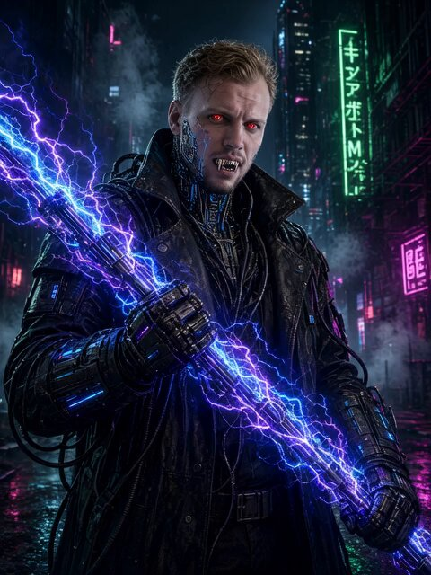

**Prompt**

```text
cria um vampiro ciberpunk assustador que seja um homem elétrico
```

[↑ Voltar às categorias](#catalog)

---

<a name="prompt-2102209728663437419"></a>

### Dragões digitais numa cidade de vórtice tecnológico

Autor：[@TheEerieHollows](https://x.com/TheEerieHollows) · [Publicação original](https://x.com/TheEerieHollows/status/2102209728663437419)

Cyberpunk / Ficção Científica · Publicado

**Resumo:** Dragões digitais numa cidade de vórtice tecnológico


**Prompt**

```text
Dragões digitais numa cidade de vórtice tecnológico
```

[↑ Voltar às categorias](#catalog)

---

<a name="prompt-2101749161536458825"></a>

### Um cientista de materiais veste um fato furtivo escuro de grafeno com linhas pulsantes em azul-elétrico.

Autor：[@tappyai007](https://x.com/tappyai007) · [Publicação original](https://x.com/tappyai007/status/2101749161536458825)

Cyberpunk / Ficção Científica · Publicado

**Resumo:** Um cientista de materiais veste um fato furtivo escuro de grafeno com linhas pulsantes em azul-elétrico.


**Prompt**

```text
A Teia de Grafeno: Um cientista de materiais ativa uma câmara de vácuo. Folhas ultrafinas de grafeno envolvem as suas roupas, tecendo-se firmemente num fato furtivo escuro e leve como uma pena, com linhas cinéticas azul-elétrico pulsantes.
```

[↑ Voltar às categorias](#catalog)

---

<a name="prompt-2100340449441685763"></a>

### Prompt de corpo inteiro para um Anúbis robótico feito de crómio preto e dourado de pé no meio de fumo dourado.

Autor：[@RobotCleopatra](https://x.com/RobotCleopatra) · [Publicação original](https://x.com/RobotCleopatra/status/2100340449441685763)

Cyberpunk / Ficção Científica · Personagem · Publicado

**Resumo:** Prompt de corpo inteiro para um Anúbis robótico feito de crómio preto e dourado de pé no meio de fumo dourado.


**Prompt**

```text
uma representação de corpo inteiro de um anúbis robótico de ficção científica. a personagem é um ser mecânico alto e esguio, feito de materiais em crómio preto e crómio dourado. a cabeça é um chacal estilizado com olhos brilhantes de cor laranja-amarelada. em volta do pescoço tem um colar dourado grande e ornamentado com faixas segmentadas. o tronco, os braços e as pernas são detalhados com montagens mecânicas complexas, remates dourados e cablagem interna exposta. um pano preto esfarrapado com finas correntes douradas está drapeado à volta da cintura. o robô encontra-se contra um fundo escuro obscurecido por uma poeira e fumo dourados densos e rodopiantes, de pé sobre uma superfície refletora que apresenta um reflexo ténue.
```

[↑ Voltar às categorias](#catalog)

---

<a name="prompt-2097951816675639459"></a>

### Uma cena de documentário de 15 segundos do início dos anos 2000 em que um repórter entrevista um extraterrestre perto de uma nave espacial aterrada, e o extraterrestre revela que veio à Terra para utilizar um cupão da McDonald's.

Autor：[@DtheW1995](https://x.com/DtheW1995) · [Publicação original](https://x.com/DtheW1995/status/2097951816675639459)

Cyberpunk / Ficção Científica · Publicado

**Resumo:** Uma cena de documentário de 15 segundos do início dos anos 2000 em que um repórter entrevista um extraterrestre perto de uma nave espacial aterrada, e o extraterrestre revela que veio à Terra para utilizar um cupão da McDonald's.


**Prompt**

```text
Imagens de documentário de televisão ultrarrealistas de 15 segundos do início dos anos 2000, filmadas com uma câmara MiniDV de consumo por um operador de câmara fisicamente presente. Noite num campo húmido nos arredores de uma pequena localidade norte-americana. Uma grande nave espacial alienígena metálica e autêntica acabou de aterrar atrás dos sujeitos, assentando pesadamente na relva molhada e achatada; a sua rampa está aberta, uma luz interior ténue espalha-se pelo nevoeiro, a condensação escorre do casco e ouve-se um zumbido mecânico grave. Sem qualquer polimento cinematográfico: enquadramento trémulo ao ombro, zoom imperfeito, focagem automática lenta, oscilação de exposição perto de luzes brilhantes, cores desbotadas, movimento entrelaçado típico de DV, ligeiro ruído de fita e artefactos de compressão. 0.0–2.0s — GANCHO: Começa já a meio da extraordinária entrevista. Um repórter de televisão nervoso está ao lado de um extraterrestre alto, magro, mas biologicamente credível, diretamente em frente à nave espacial. O repórter estende um microfone de reportagem com fios na direção dele, enquanto a câmara faz um zoom rápido da nave brilhante para o rosto detalhado do extraterrestre. O extraterrestre tem pele cinzenta húmida e texturada, respiração subtil, olhos negros que piscam e peso natural; não é um fato nem é caricatural. 2.0–5.5s: Num único plano-sequência com câmara à mão, o repórter olha para o extraterrestre e pergunta com seriedade em inglês: “Why did you come to Earth? What are you looking for?” A sua entoação é cautelosa e profissional. O operador de câmara perde brevemente a focagem ao reenquadrar ambos os rostos, corrigindo-a de seguida. O extraterrestre reflete silenciosamente sobre a pergunta durante um segundo constrangedor enquanto a nave zumbe atrás de si. 5.5–11.5s — REMATE SÉRIO (DEADPAN): O extraterrestre enfia lentamente a mão numa pequena bolsa metálica presa ao corpo e retira um cupão de papel ligeiramente amarrotado. Segura o cupão entre dois dedos longos e responde num inglês calmo e perfeitamente inteligível, com uma voz estranha e seca: “I came to redeem this coupon. Twenty-piece Chicken McNuggets, with sweet-and-sour sauce. At McDonald’s.” O seu rosto permanece completamente sério. O movimento da boca corresponde exclusivamente ao diálogo do extraterrestre. 11.5–15.0s — DESFECHO: O repórter baixa ligeiramente o microfone e olha fixamente para o extraterrestre em total incredulidade. A câmara efetua um zoom acidental e desajeitado sobre o cupão, regressando depois ao rosto confuso do repórter. O extraterrestre aponta com naturalidade na direção da localidade distante como quem pede direções. O operador de câmara tenta suprimir um riso abafado. O repórter finalmente murmura: “Right … okay.” Corte abrupto e autêntico em estilo de fita magnética. ÁUDIO: diálogo de estúdio exterior limpo em inglês, mas com qualidade imperfeita de microfone do início dos anos 2000, vento fraco, relva molhada sob os sapatos, insetos distantes, ventilação da nave espacial e zumbido elétrico. Sem música, narração, efeitos sonoros de trailer ou risos gravados. O humor provém inteiramente do tom sério documental e da resposta absurdamente banal. CONTINUIDADE / NEGATIVOS: apenas um repórter, um extraterrestre, um operador de câmara e uma nave espacial; posição de câmara contínua e exequível; sem ângulos de câmara impossíveis, pessoas ou extraterrestres duplicados, morphing, flutuação, teletransporte, CGI estilo desenho animado, olhos mágicos brilhantes, agressividade, armas, multidões, legendas, texto no ecrã, alteração do cupão ou alteração do microfone.
```

[↑ Voltar às categorias](#catalog)

---

<a name="category-minimalism"></a>

## Minimalismo

<a name="prompt-2102666015088021808"></a>

### Tradução em curso

Autor：[@Geralt239411](https://x.com/Geralt239411) · [Publicação original](https://x.com/Geralt239411/status/2102666015088021808)

Perfil / Avatar · Minimalismo · Retrato / Selfie · Personagem · Publicado

**Resumo:** Tradução em curso

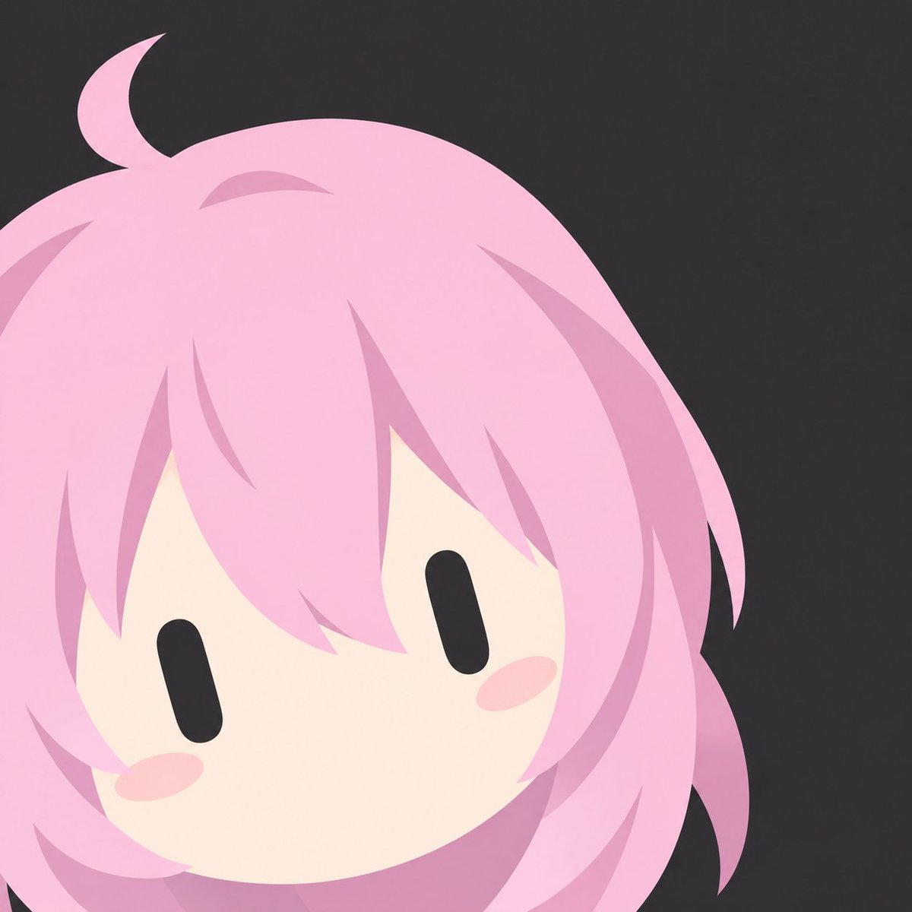

**Prompt**

```text
Tradução em curso
```

[↑ Voltar às categorias](#catalog)

---

<a name="prompt-2102254699202166846"></a>

### Construa uma imagem de comparação superior-inferior no &quot;estilo silhueta conceptual com espaço negativo&quot;, com a metade superior a preservar o sujeito fotográfico original e a metade inferior a destilar uma silhueta minimalista e abstrata a tinta preta com uma vasta área de espaço negativo em branco-quente.

Autor：[@Hamburgerai](https://x.com/Hamburgerai) · [Publicação original](https://x.com/Hamburgerai/status/2102254699202166846)

Fotografia · Minimalismo · Resumo / Contexto · Publicado

**Resumo:** Construa uma imagem de comparação superior-inferior no &quot;estilo silhueta conceptual com espaço negativo&quot;, com a metade superior a preservar o sujeito fotográfico original e a metade inferior a destilar uma silhueta minimalista e abstrata a tinta preta com uma vasta área de espaço negativo em branco-quente.


**Prompt**

```text
Crie uma imagem de comparação vertical superior-inferior na proporção 3:4, no estilo denominado 【CONCEPTUAL SILHOUETTE VOID｜Estilo silhueta conceptual com espaço negativo】. Adequado para pessoas, animais, plantas, arquitetura, cidades, veículos, comida, objetos, interiores, natureza e fotografias de viagem, sem se limitar a "viagem" ou a qualquer cenário único.
A metade superior (cerca de 42%–48%) preserva a fotografia original: mantém com precisão o sujeito principal, a quantidade, a pose, a perspetiva, as relações espaciais, a iluminação, as texturas e as cores reconhecíveis, aplicando apenas uma gradação de cor natural de nível editorial, sem transformar em ilustração, sem mudar de local e sem adicionar ou remover sujeitos essenciais. Deixe uma união limpa em branco-quente entre as partes superior e inferior, sem molduras grossas, etiquetas de fotografia ou selos de imagem original/IA.
Na metade inferior, não copie a fotografia inteira nem desenhe uma ilustração completa. Primeiro, extraia da fotografia original a relação semântica, ação, silhueta ou ritmo material mais significativo: por exemplo, a postura de uma pessoa, a curva da cauda de um animal, o desabrochar de uma flor, a extensão dos ramos de uma árvore, a curva de uma estrada, a linha de arco de um edifício, a direção da velocidade de um veículo, a relação circular de pratos e taças, o ritmo repetitivo das janelas, a ondulação de uma crista de montanha ou as pequenas ondas na água. Escolha apenas um elemento condutor principal e reconstrua-o como uma silhueta plana abstrata, contorno em fita, símbolo em bloco ou um único gesto linear em preto-carvão, tinta-da-china ou grafite escuro. Essa forma deve poder ser associada ao sujeito real da metade superior, mas pode ser esticada, reduzida, deslocada, rodada, cortada ou atravessar o espaço negativo.
A metade inferior mantém 60%–80% de espaço negativo contínuo em branco-quente, com a superfície do papel a apresentar apenas fibras muito ténues e granulação mate. As margens da forma principal podem ter retícula ligeira, textura de pincel seco ou densidade de tinta irregular, mas o conjunto deve ser contido, plano e limpo, sem se diluir em aguada de tinta nem transformar-se num desenho de traço detalhado. Pessoas e animais podem ser comprimidos em silhuetas completas sem rosto e sem textura de vestuário; arquitetura, plantas, comida e utensílios mantêm apenas a estrutura mínima para reconhecer a relação de formas, sem recuperar pormenores fotográficos. Utilize no máximo uma ou duas linhas auxiliares ultrafinas para indicar a direção, sem adicionar um segundo objeto abstrato.
A forma abstrata é dominada por preto-carvão, tinta-da-china ou grafite escuro, extraindo no máximo um único ponto de cor com saturação extremamente baixa da imagem original; a cor varia consoante a fotografia, sem impor paletas fixas de azul, verde ou tons urbanos. Na parte inferior, pode ser incluída uma nota editorial em inglês, muito pequena e precisa, descrevendo essa semântica, como ONE GESTURE / OPEN SPACE, ARC / STILLNESS ou SINGLE FORM; não adicione títulos grandes, parágrafos longos nem informações sobre locais fictícios.
No geral, a metade superior deve assumir a realidade fotográfica, enquanto a metade inferior assume o conceito único, o julgamento formal e o ritmo do espaço negativo. É proibido: redesenho de cenário em página inteira, múltiplos objetos flutuantes, nós de rota contínuos, modelos de skyline urbano completo, janelas fotográficas, tinta-da-china na página inteira, cartazes geométricos coloridos, papercraft espesso, renderizações 3D, contornos automáticos, logótipos, marcas de água, caracteres chineses falsos, selos de IA e selos de imagem original.
```

[↑ Voltar às categorias](#catalog)

---

<a name="prompt-2102211141820920113"></a>

### Tradução em curso

Autor：[@DDJCXX](https://x.com/DDJCXX) · [Publicação original](https://x.com/DDJCXX/status/2102211141820920113)

Fotografia · Minimalismo · Retrato / Selfie · Personagem · Item de Moda · Arquitetura / Interiores · Publicado

**Resumo:** Tradução em curso


**Prompt**

```text
Tradução em curso
```

[↑ Voltar às categorias](#catalog)

---

<a name="prompt-2101703683167645776"></a>

### Prompt visual minimalista de uma palavra com o tema renda.

Autor：[@AllaAisling](https://x.com/AllaAisling) · [Publicação original](https://x.com/AllaAisling/status/2101703683167645776)

Minimalismo · Publicado

**Resumo:** Prompt visual minimalista de uma palavra com o tema renda.


**Prompt**

```text
Renda
```

[↑ Voltar às categorias](#catalog)

---

<a name="prompt-2101150526729830895"></a>

### Tradução em curso

Autor：[@DDJCXX](https://x.com/DDJCXX) · [Publicação original](https://x.com/DDJCXX/status/2101150526729830895)

Fotografia · Minimalismo · Retrato / Selfie · Personagem · Arquitetura / Interiores · Publicado

**Resumo:** Tradução em curso


**Prompt**

```text
Tradução em curso
```

[↑ Voltar às categorias](#catalog)

---

<a name="prompt-2100526246707024323"></a>

### Tradução em curso

Autor：[@xiaoxiaodong01](https://x.com/xiaoxiaodong01) · [Publicação original](https://x.com/xiaoxiaodong01/status/2100526246707024323)

Pôster / Folheto · Minimalismo · Publicado

**Resumo:** Tradução em curso


**Prompt**

```text
Tradução em curso
```

[↑ Voltar às categorias](#catalog)

---

<a name="prompt-2099605356116951296"></a>

### Prompt de fotografia de silhuetas em baixa luz de personagem feminina e criatura mítica sobre fundo preto profundo com amplo espaço negativo.

Autor：[@VoxcatAI](https://x.com/VoxcatAI) · [Publicação original](https://x.com/VoxcatAI/status/2099605356116951296)

Fotografia · Minimalismo · Retrato / Selfie · Personagem · Publicado

Publicação original：[@VoxcatAI](https://x.com/VoxcatAI) · [Publicação original](https://x.com/VoxcatAI/status/2014671895657074893)

**Resumo:** Prompt de fotografia de silhuetas em baixa luz de personagem feminina e criatura mítica sobre fundo preto profundo com amplo espaço negativo.


**Prompt**

```text
Fotografia de retrato em Low-Key extremo sobre fundo preto, personagem feminina clássica adulta × animal mítico/besta divina, composição vertical, a personagem é colocada na parte inferior numa proporção extremamente reduzida, reservando uma enorme quantidade de espaço negativo em preto puro na parte superior e em redor. A personagem fica quase totalmente submersa na escuridão, preservando apenas um traço extremamente estreito de luz lateral dura e branco-fria, recortando subtilmente algumas zonas pontuais como o contorno de meio rosto, a linha do nariz, a linha dos lábios, algumas mechas de cabelo, a linha dos ombros, da cintura ou das ancas, fundindo-se todo o restante no preto puro. Sem rosto completo, sem corpo completo, identificando a personagem apenas através do penteado, acessórios de cabelo, chifres, orelhas de animal ou silhueta icónica. O animal mítico funciona apenas como uma presença de contorno ténue na escuridão, permitindo-se realces mínimos unicamente no brilho dos olhos, nas pontas dos chifres, nas pontas das orelhas, no bico, na linha da coluna vertebral ou na borda externa da crina. Alto contraste Chiaroscuro × Tenebrism, exposição extremamente baixa, níveis de preto fortemente esmagados, altas luzes contidas, escassa informação de cor, sem narrativa ambiental, tom geral anónimo, gélido, perigoso, misterioso, semelhante a fotografia de moda underground. Assinatura minúscula «voxCAT» no canto inferior direito. n=5.
```

[↑ Voltar às categorias](#catalog)

---

<a name="prompt-2098878777556410480"></a>

### Minimalismo conceptual: uma única cadeira de madeira numa divisão branca vazia.

Autor：[@SameChair](https://x.com/SameChair) · [Publicação original](https://x.com/SameChair/status/2098878777556410480)

Minimalismo · Publicado

**Resumo:** Minimalismo conceptual: uma única cadeira de madeira numa divisão branca vazia.


**Prompt**

```text
Minimalismo conceptual: uma única cadeira de madeira numa divisão branca vazia.
```

[↑ Voltar às categorias](#catalog)

---

<a name="prompt-2097872057157783561"></a>

### Tradução em curso

Autor：[@DDJCXX](https://x.com/DDJCXX) · [Publicação original](https://x.com/DDJCXX/status/2097872057157783561)

Fotografia · Minimalismo · Personagem · Item de Moda · Publicado

**Resumo:** Tradução em curso


**Prompt**

```text
Tradução em curso
```

[↑ Voltar às categorias](#catalog)

---

<a name="category-other"></a>

## Outros

<a name="prompt-2102670681448280357"></a>

### Tradução em curso

Autor：[@dragosroua](https://x.com/dragosroua) · [Publicação original](https://x.com/dragosroua/status/2102670681448280357)

Paisagem / Natureza · Publicado

**Resumo:** Tradução em curso

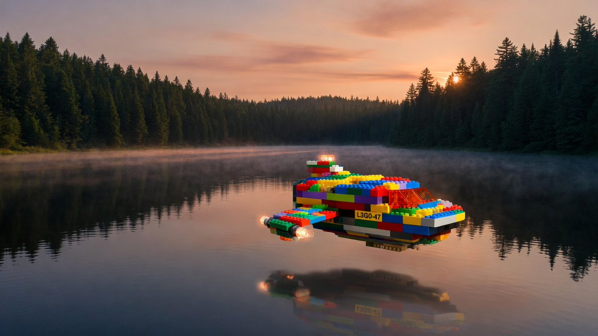

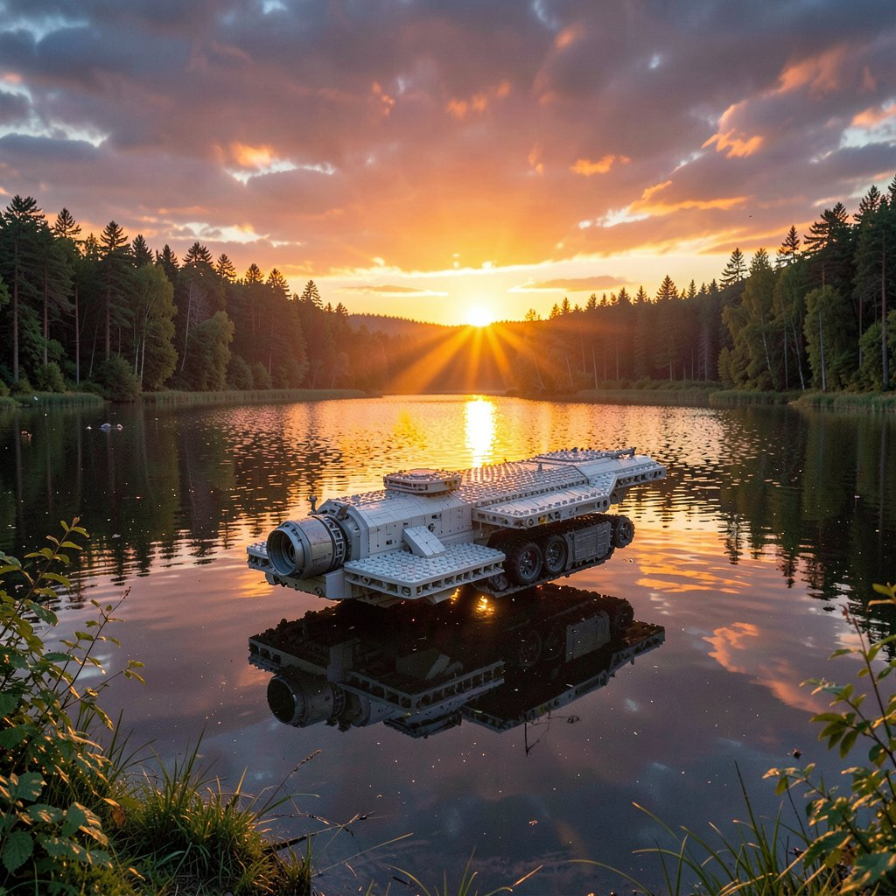

**Prompt**

```text
Tradução em curso
```

[↑ Voltar às categorias](#catalog)

---

<a name="prompt-2102673133551653173"></a>

### Tradução em curso

Autor：[@AI\_Kei75](https://x.com/AI_Kei75) · [Publicação original](https://x.com/AI_Kei75/status/2102673133551653173)

Personagem · Item de Moda · Publicado

**Resumo:** Tradução em curso

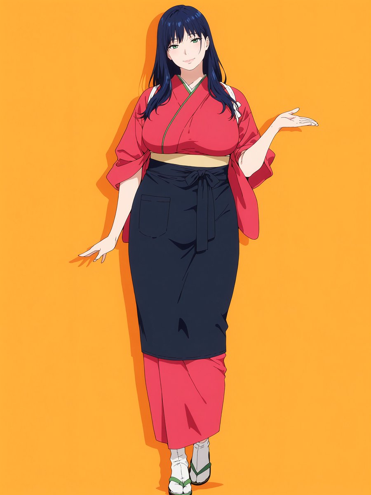

**Prompt**

```text
Tradução em curso
```

[↑ Voltar às categorias](#catalog)

---

<a name="prompt-2102661349449093308"></a>

### Tradução em curso

Autor：[@sorajiro0706](https://x.com/sorajiro0706) · [Publicação original](https://x.com/sorajiro0706/status/2102661349449093308)

Personagem · Paisagem urbana / Rua · Publicado

**Resumo:** Tradução em curso

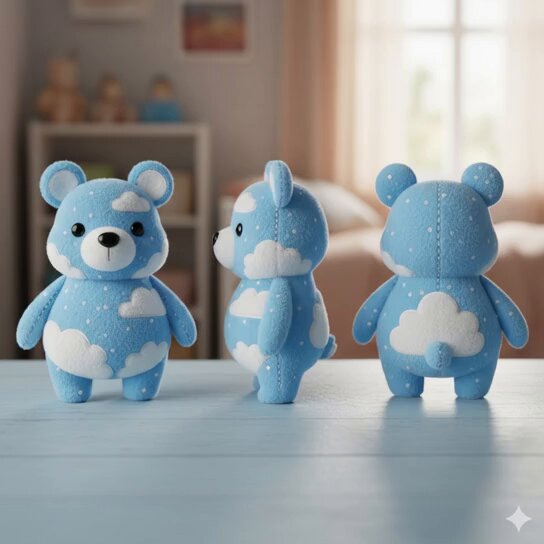

**Prompt**

```text
Tradução em curso
```

[↑ Voltar às categorias](#catalog)

---

<a name="prompt-2102508188453265798"></a>

### Prompt estruturado em JSON para orientar a geração de uma selfie fotorrealista em estilo UGC: rosto com sardas, cabelo ondulado castanho-escuro despenteado, camisola de cavas preta e cenário de quarto habitado.

Autor：[@danclipping](https://x.com/danclipping) · [Publicação original](https://x.com/danclipping/status/2102508188453265798)

Retrato / Selfie · Personagem · Publicado

**Resumo:** Prompt estruturado em JSON para orientar a geração de uma selfie fotorrealista em estilo UGC: rosto com sardas, cabelo ondulado castanho-escuro despenteado, camisola de cavas preta e cenário de quarto habitado.

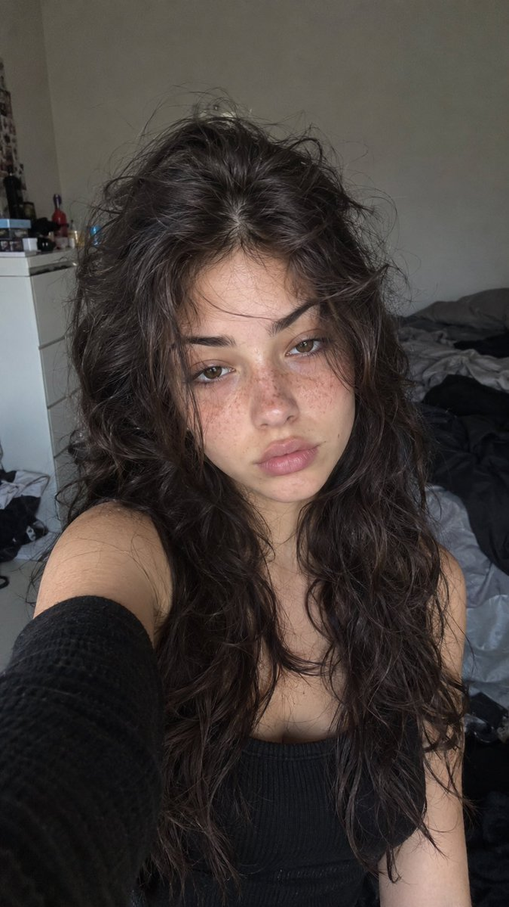

**Prompt**

```text
{
  "prompt_type": "photorealistic_reference_reconstruction",
  "objective": "Recriar a referência fornecida como uma selfie vertical limpa de smartphone. Fazer corresponder o rosto, as sardas, o cabelo ondulado escuro despenteado, a camisola de cavas preta, a desarrumação do quarto, a luz suave da janela, a expressão entediada/neutra. Remover todo o texto, interface de utilizador, logótipos, marcas de água.",
  "reference_fidelity": {
    "target": "semelhança visual extremamente alta",
    "priority_order": [
      "proporções faciais e olhos castanhos com pálpebras pesadas",
      "sardas no nariz e nas bochechas",
      "cabelo castanho-escuro ondulado volumoso e despenteado com fios soltos",
      "camisola de cavas canelada preta",
      "luz natural suave da janela a partir da esquerda da câmara",
      "fundo de quarto desarrumado",
      "textura autêntica de selfie de telemóvel"
    ]
  },
  "canvas": {
    "orientation": "retrato",
    "aspect_ratio": "9:16",
    "framing": "selfie de smartphone em grande plano (cabeça e ombros)",
    "crop": "do topo do cabelo até à parte superior do peito",
    "subject_alignment": "centrado, ligeira inclinação para a frente",
    "perspective": "câmara frontal à distância do braço, ligeira grande-angular"
  },
  "scene": {
    "location": "quarto habitado",
    "time_of_day": "dia",
    "mood": "espontâneo de quem acabou de acordar estilo UGC",
    "environment": {
      "left": "cómoda branca com objetos desarrumados e desfocados em cima",
      "behind": "cama por fazer com roupa de cama amarrotada em cinzento e preto",
      "walls": "branco sujo neutro"
    }
  },
  "subject": {
    "description": "mulher jovem adulta no início dos 20 anos",
    "expression": "neutra, ligeiramente cansada / pensativa, boca fechada",
    "gaze": "diretamente para a câmara",
    "skin": {
      "tone": "pálida / clara",
      "detail": "sardas naturais proeminentes no nariz e nas bochechas",
      "finish": "mate-natural, poros visíveis, sem filtro de beleza plástico"
    },
    "eyes": {
      "color": "castanho-escuro",
      "look": "pálpebras pesadas / sonolentas"
    },
    "lips": "cheios, naturais sem maquilhagem",
    "hair": {
      "color": "castanho-escuro",
      "style": "ondas volumosas despenteadas / caracóis suaves",
      "detail": "muitos fios finos soltos à volta do rosto e da testa",
      "vibe": "húmido ou de quem acabou de acordar, nada de cabeleireiro"
    },
    "clothing": {
      "top": "camisola de cavas canelada preta",
      "extra": "manga de casaco de malha ou camisola preta visível no braço estendido"
    },
    "pose": {
      "arm": "braço direito estendido em direção à câmara (selfie)",
      "shoulder": "inclinação casual para a frente"
    }
  },
  "lighting": {
    "type": "luz natural difusa e suave",
    "direction": "da esquerda da câmara / janela à esquerda",
    "face": "realce suave à esquerda, sombra suave à direita",
    "quality": "suave de dia nublado, baixo contraste"
  },
  "camera": {
    "device": "câmara frontal de smartphone moderno",
    "look": "UGC autêntico: ruído ligeiro, ligeira compressão, desfoque de fundo subtil",
    "focus": "nítido no rosto e nos fios de cabelo"
  },
  "negative_prompt": [
    "filtro de beleza plastificado",
    "pele plástica",
    "cabelo perfeito de cabeleireiro",
    "iluminação de estúdio",
    "texto",
    "interface",
    "logótipos",
    "marcas de água",
    "pessoas adicionais",
    "anime",
    "CGI",
    "maquilhagem carregada",
    "sorriso rasgado",
    "padrão de sardas diferente",
    "cabelo loiro"
  ],
  "final_generation_instruction": "Uma selfie vertical de telemóvel altamente fotorrealista a corresponder à referência. Mesma rapariga com sardas, ondas escuras despenteadas, camisola de cavas canelada preta, quarto desarrumado, luz suave da janela à esquerda, expressão cansada-neutra. Frame de pausa autêntico do TikTok. Sem texto ou interface."
}
```

[↑ Voltar às categorias](#catalog)

---

<a name="prompt-2102549611303084432"></a>

### Prompt visual que utiliza o famoso haiku de Matsuo Basho, retratando a cena de uma rã a saltar para um lago.

Autor：[@panda\_yamori](https://x.com/panda_yamori) · [Publicação original](https://x.com/panda_yamori/status/2102549611303084432)

Outros · Publicado

**Resumo:** Prompt visual que utiliza o famoso haiku de Matsuo Basho, retratando a cena de uma rã a saltar para um lago.

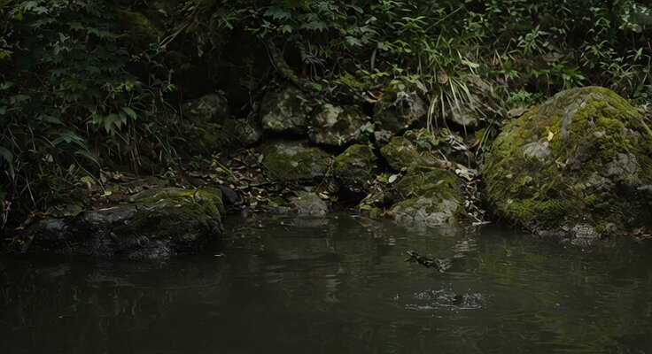

**Prompt**

```text
Velho lago; salta uma rã, ruído de água.
```

[↑ Voltar às categorias](#catalog)

---

<a name="prompt-2102548067128152171"></a>

### Vídeo surreal de metamorfose no estilo de IA primitiva, onde um trabalhador se transforma sucessivamente em aves, dançarinos e num foguete que descola dentro da fábrica.

Autor：[@ZedGrimm](https://x.com/ZedGrimm) · [Publicação original](https://x.com/ZedGrimm/status/2102548067128152171)

Personagem · Publicado

Publicação original：[@magic\_ai\_skill](https://x.com/magic_ai_skill) · [Publicação original](https://x.com/magic_ai_skill/status/2102256000107688329)

**Resumo:** Vídeo surreal de metamorfose no estilo de IA primitiva, onde um trabalhador se transforma sucessivamente em aves, dançarinos e num foguete que descola dentro da fábrica.

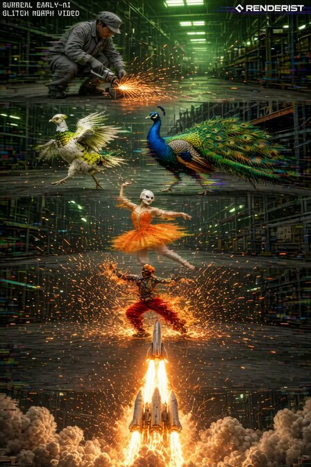

**Prompt**

```text
Vídeo surreal de metamorfose com glitch de IA primitiva num armazém fluorescente: um operário de uniforme cinzento a esmerilar metal com faíscas cor-de-laranja transforma-se perfeitamente num faisão dançante branco, verde e amarelo, depois num pavão de pescoço azul com cauda aberta, depois numa figura mascarada de tutu cor-de-laranja, de seguida num dançarino de calças vermelhas a gerar faíscas gigantescas, com foguetes de fogo nos pés a lançá-lo para cima enquanto se torna num foguete em chamas, evoluindo para um foguete com múltiplos propulsores a descolar verticalmente com fumo espesso e fogo dentro da fábrica. Baixa resolução, metamorfose contínua, estilo de marca de água Renderist.
```

[↑ Voltar às categorias](#catalog)

---

<a name="prompt-2102525851195826490"></a>

### Foto espontânea de uma mulher japonesa na casa dos 20 anos a mudar de roupa após voltar à infância numa creche para adultos.

Autor：[@AI\_money\_club](https://x.com/AI_money_club) · [Publicação original](https://x.com/AI_money_club/status/2102525851195826490)

Retrato / Selfie · Publicado

**Resumo:** Foto espontânea de uma mulher japonesa na casa dos 20 anos a mudar de roupa após voltar à infância numa creche para adultos.

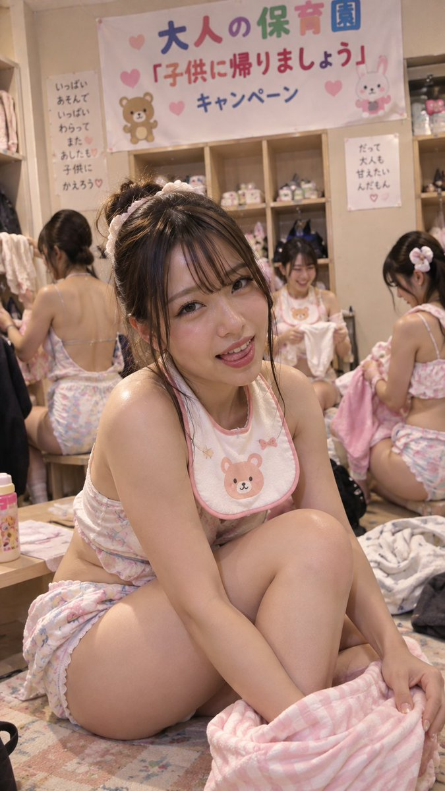

**Prompt**

```text
Mulher japonesa na casa dos 20 anos, na campanha ocasional 'vamos voltar a ser crianças' numa creche para adultos onde apenas mulheres fofas e bonitas se reúnem. A mudar de roupa para regressar a casa com a energia de se ter entregado totalmente ao instinto de agir como bebé Foto espontânea Imagem vertical
```

[↑ Voltar às categorias](#catalog)

---

<a name="prompt-2102540202992611745"></a>

### Prompt de vídeo cómico de uma Feitian curvilínea que toca por engano um pergaminho de felicitações como flauta e o vira para exibir votos do Festival do Meio Outono.

Autor：[@PixelAigc](https://x.com/PixelAigc) · [Publicação original](https://x.com/PixelAigc/status/2102540202992611745)

Outros · Publicado

**Resumo:** Prompt de vídeo cómico de uma Feitian curvilínea que toca por engano um pergaminho de felicitações como flauta e o vira para exibir votos do Festival do Meio Outono.

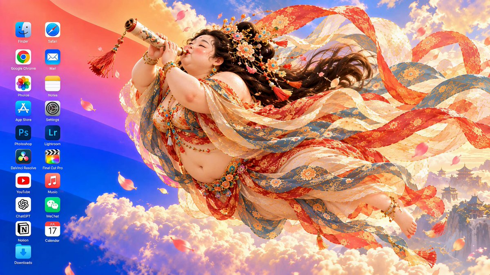

**Prompt**

```text
Uma Feitian rechonchuda no céu segura um rolo de papel a soprá-lo como se fosse uma flauta xiao; ouve-se uma voz em off apressada a dizer «Pára, pára, pára!», a Feitian abre os olhos e olha para a câmara com ar perplexo; a voz em off continua: «Olha para o que tens na mão!»; a Feitian olha, repara que tem um rolo de papel na mão, apanha um susto, solta a mão esquerda e o rolo desenrola-se para baixo; no rolo de papel está escrito de cima para baixo «粉丝破八千»; ela fica atónita por um instante, vira rapidamente o rolo de papel, onde se lê de cima para baixo «中秋节快乐»; esboça a custo um sorriso amarelo e embaraçado, deitando a língua de fora envergonhada; sopra uma brisa suave, agitando as suas vestes e faixas de seda; câmara fixa, composição inalterada, pano de fundo inalterado; a música de fundo passa de uma música tradicional de Dunhuang no início para um estilo bem-humorado e divertido na parte final.
```

[↑ Voltar às categorias](#catalog)

---

<a name="prompt-2102453906731323856"></a>

### Foto de corpo inteiro com flash de uma mulher com trench coat bege num terraço em Paris à noite com a Torre Eiffel.

Autor：[@oye\_samia](https://x.com/oye_samia) · [Publicação original](https://x.com/oye_samia/status/2102453906731323856)

Personagem · Publicado

**Resumo:** Foto de corpo inteiro com flash de uma mulher com trench coat bege num terraço em Paris à noite com a Torre Eiffel.

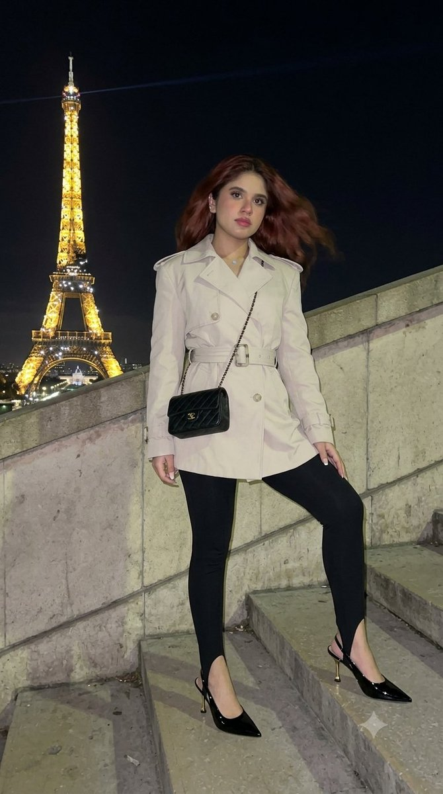

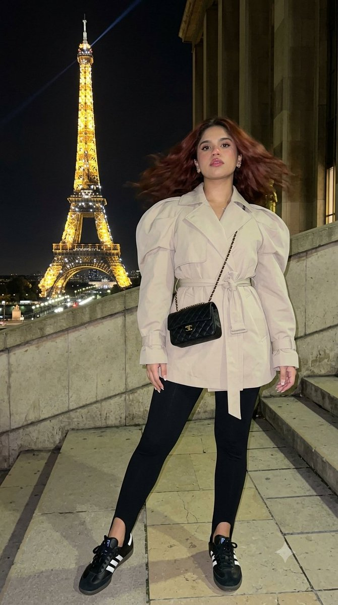

**Prompt**

```text
**Foto 9:16, tirada com iPhone à noite com flash em Paris.**  
Terraço do Palais de Chaillot, a Torre Eiffel totalmente visível à esquerda.

A rapariga está à direita do centro, fotografada à distância, de corpo inteiro.  
Trench coat curto bege-claro com ombros retos e volumosos, mangas largas e cinto.

Leggings pretas com estribo, slingbacks em verniz de bico fino sem calcanhar com salto agulha alto dourado.  
Pequena mala acolchoada preta com corrente usada a tiracolo.

Silhueta esbelta e tonificada, pernas longas e finas, pele bronzeada.  
Uma perna direita, a outra afastada para o lado.  
Queixo levantado, braços ao longo do corpo.

Cabelo como na foto, em movimento, como se ela se tivesse acabado de virar.  
Manicura francesa curta e quadrada.

A Torre Eiffel está a cintilar, visível na totalidade até à antena.  
Parapeito de pedra, terraço e degraus.  
Fundo nítido, sem efeito bokeh acentuado.

Uma foto noturna realista de iPhone, flash e pele naturais, sem CGI e sem retoques excessivos.
```

[↑ Voltar às categorias](#catalog)

---

<a name="prompt-2102476044783804731"></a>

### Retrato especificando as características de 3 mulheres \(penteado, tipo de corpo, tom de pele\)

Autor：[@minami\_gunma](https://x.com/minami_gunma) · [Publicação original](https://x.com/minami_gunma/status/2102476044783804731)

Retrato / Selfie · Publicado

**Resumo:** Retrato especificando as características de 3 mulheres \(penteado, tipo de corpo, tom de pele\)

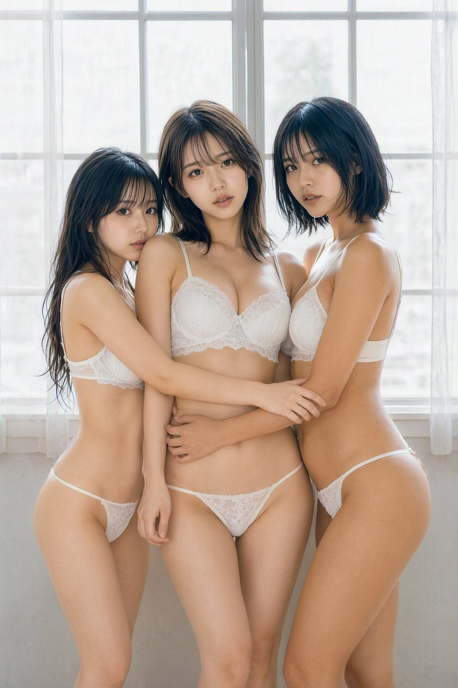

**Prompt**

```text
A mulher da esquerda é de estatura pequena com cabelo comprido e preto
A mulher ao centro tem o peito grande e cabelo castanho até aos ombros
A mulher da direita tem a pele bronzeada e cabelo curto e preto
```

[↑ Voltar às categorias](#catalog)

---

<a name="prompt-2102478006778544208"></a>

### Cena de fantasia em que um cavaleiro loiro pede uma bruxa da neve em casamento.

Autor：[@hsuenaga626](https://x.com/hsuenaga626) · [Publicação original](https://x.com/hsuenaga626/status/2102478006778544208)

Outros · Publicado

**Resumo:** Cena de fantasia em que um cavaleiro loiro pede uma bruxa da neve em casamento.

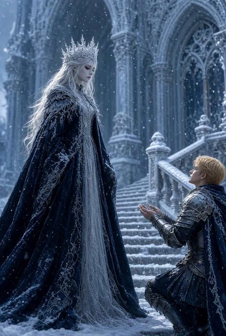

**Prompt**

```text
Uma bruxa da neve a ser pedida em casamento por um cavaleiro loiro
```

[↑ Voltar às categorias](#catalog)

---

<a name="prompt-2102434824279724337"></a>

### Prompt de geração de um robô gigante com armadura e asas mecânicas de ave empunhando uma espada no ar.

Autor：[@hsuenaga626](https://x.com/hsuenaga626) · [Publicação original](https://x.com/hsuenaga626/status/2102434824279724337)

Animal / Criatura · Publicado

**Resumo:** Prompt de geração de um robô gigante com armadura e asas mecânicas de ave empunhando uma espada no ar.

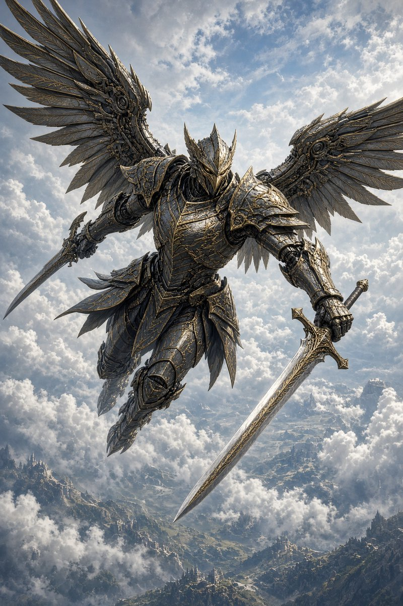

**Prompt**

```text
Um robô gigante com asas mecânicas semelhantes às de uma ave, com cabeça e corpo cobertos por uma armadura, brandindo uma espada no céu
```

[↑ Voltar às categorias](#catalog)

---

<a name="prompt-2102434749294014473"></a>

### Um prompt que descreve um robô gigante de armadura com asas mecânicas de ave a empunhar uma espada no ar.

Autor：[@hsuenaga626](https://x.com/hsuenaga626) · [Publicação original](https://x.com/hsuenaga626/status/2102434749294014473)

Animal / Criatura · Publicado

**Resumo:** Um prompt que descreve um robô gigante de armadura com asas mecânicas de ave a empunhar uma espada no ar.

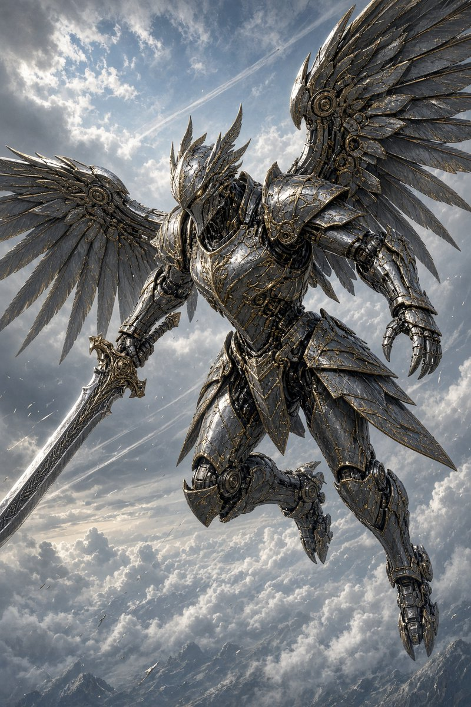

**Prompt**

```text
Um robô gigante com cabeça e corpo cobertos por armadura, dotado de asas mecânicas semelhantes às de uma ave, brande uma espada no céu
```

[↑ Voltar às categorias](#catalog)

---

<a name="prompt-2102434922111922220"></a>

### Prompt de um robô de armadura com asas mecânicas a empunhar uma espada no ar.

Autor：[@hsuenaga626](https://x.com/hsuenaga626) · [Publicação original](https://x.com/hsuenaga626/status/2102434922111922220)

Outros · Publicado

**Resumo:** Prompt de um robô de armadura com asas mecânicas a empunhar uma espada no ar.

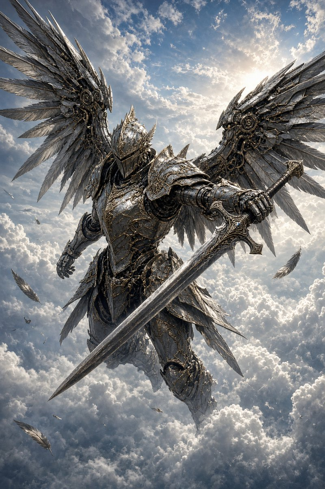

**Prompt**

```text
Um robô gigante com armadura na cabeça e no corpo, dotado de asas mecânicas semelhantes às de uma ave, brande uma espada no céu
```

[↑ Voltar às categorias](#catalog)

---

<a name="prompt-2102429997348610357"></a>

### Cartaz de folha de referência de personagem com múltiplos painéis para os futebolistas Cristiano Ronaldo e Mohamed Salah com rotações de corpo, expressões e paletas.

Autor：[@Minahil42298354](https://x.com/Minahil42298354) · [Publicação original](https://x.com/Minahil42298354/status/2102429997348610357)

Pôster / Folheto · Personagem · Publicado

**Resumo:** Cartaz de folha de referência de personagem com múltiplos painéis para os futebolistas Cristiano Ronaldo e Mohamed Salah com rotações de corpo, expressões e paletas.


**Prompt**

```text
Folha de referência de personagem combinando Cristiano Ronaldo (equipamento de Portugal n.º 7, físico atlético e musculado, 6'2", sorriso icónico, expressão determinada/carismática) e Mohamed Salah (equipamento do Egito n.º 10, físico atlético e esguio, 5'9", barba/cabelo curto, expressão humilde/profissional e focada), estilizada como um cartaz de referência visual com múltiplos painéis apresentando perfis de personagens, rotações completas de 360 graus do corpo, ângulos de pormenor facial, folhas de múltiplas expressões (feliz, preocupado, confiante, determinado, neutro, triste, suron), estudos de poses e linguagem corporal (em pé, sentado, pronto para a ação/festejo), pormenores ampliados de fatos/emblemas e paletas de cores de materiais divididas em vermelho/verde/branco/dourado.
```

[↑ Voltar às categorias](#catalog)

---

<a name="prompt-2102374599325569138"></a>

### Retrato sensual de BDSM de uma figura presa com camisa desabotoada e meias sobre uma cama desfeita num quarto escuro.

Autor：[@w\_ooon\_](https://x.com/w_ooon_) · [Publicação original](https://x.com/w_ooon_/status/2102374599325569138)

Retrato / Selfie · Publicado

**Resumo:** Retrato sensual de BDSM de uma figura presa com camisa desabotoada e meias sobre uma cama desfeita num quarto escuro.


**Prompt**

```text
NSFW, decadente, erótico, sensual, lânguido, elegância depravada,

1.35::sentado na borda de uma cama desfeita, ambas as mãos presas atrás das costas, pulsos algemados atrás da cintura, coxas ligeiramente afastadas, tronco ligeiramente inclinado para a frente, queixo erguido, cabeça ligeiramente inclinada para trás::,

1.2::coleira de couro preto com uma pequena argola metálica em O, camisa preta oversized solta a escorregar por um ombro, vários botões desabotoados, roupa interior preta, meias de liga, ligas, roupas desalinhadas::,

sorriso trocista, expressão desafiadora, olhos semicerrados, olhar de pálpebras pesadas, faces coradas, lábios ligeiramente entreabertos, contacto visual sedutor, exausto mas provocador,

pulsos presos, algemas, coleira, cabelo desgrenhado, suor ligeiro, 1.3::marcas vermelhas ténues nas coxas, marcas subtis de palmadas::, brilho suave na pele, roupas desfeitas, tensão erótica, resistência divertida, postura vulnerável, apanhado após provocar,

1.15::quarto escuro e luxuoso, lençóis pretos amarrotados, roupa de cama em veludo, candeeiro de cabeceira âmbar ténue, sombras profundas, cortinas corridas, atmosfera de fim de noite, roupas espalhadas pelo chão, copo de vinho virado, interior decadente, iluminação envolvente::,

tronco e coxas, ângulo ligeiramente baixo, composição centrada, enquadramento cinematográfico, profundidade de campo
```

[↑ Voltar às categorias](#catalog)

---

<a name="prompt-2102394726695801078"></a>

### Prompt de modelo de papercraft montável de uma idol feminina.

Autor：[@AI\_money\_club](https://x.com/AI_money_club) · [Publicação original](https://x.com/AI_money_club/status/2102394726695801078)

Outros · Publicado

**Resumo:** Prompt de modelo de papercraft montável de uma idol feminina.


**Prompt**

```text
Crie um modelo de papercraft montável de uma idol japonesa adulta totalmente fictícia, incluindo rosto, cabelo, corpo e traje. Traje fofo de idol em cor-de-rosa × branco × dourado. A cabeça tem o rosto impresso, e todas as peças como cabelo, tronco, braços, pernas, saia, botas e laços estão dispostas com linhas de corte, linhas de dobra e abas para colar. Molde imprimível em fundo branco. No canto inferior direito, apresente uma amostra da boneca de papercraft 3D concluída.
```

[↑ Voltar às categorias](#catalog)

---

<a name="prompt-2102426880016253191"></a>

### Prompt de vídeo de movimentos cénicos de Dan da ópera de Pequim e desenho de personagem

Autor：[@PixelAigc](https://x.com/PixelAigc) · [Publicação original](https://x.com/PixelAigc/status/2102426880016253191)

Personagem · Publicado

**Resumo:** Prompt de vídeo de movimentos cénicos de Dan da ópera de Pequim e desenho de personagem


**Prompt**

```text
O ator executa movimentos tradicionais da ópera de Pequim, expressando a arte da ópera de Pequim, os trajes e as bandeiras dorsais flutuam, o personagem agita as mãos de forma dramática, a câmara aproxima-se lentamente.\n\nPrompt de geração de imagem:\n\nEsta obra criada por Artgerm apresenta o estilo de arte de fantasia da ópera chinesa, retratando uma mulher de enorme beleza vestida com trajes tradicionais de ópera, utilizando contrastes de cores vivos. Na margem, encontra-se a inscrição “梨园春色”
```

[↑ Voltar às categorias](#catalog)

---

<a name="prompt-2102369781504414039"></a>

### Modelo de prompt para gerar imagens editoriais surrealistas que encenam provérbios populares através de objetos em miniatura com fundo marfim e detalhes em azul-cobalto.

Autor：[@hmontilla\_](https://x.com/hmontilla_) · [Publicação original](https://x.com/hmontilla_/status/2102369781504414039)

Resumo / Contexto · Publicado

**Resumo:** Modelo de prompt para gerar imagens editoriais surrealistas que encenam provérbios populares através de objetos em miniatura com fundo marfim e detalhes em azul-cobalto.


**Prompt**

```text
Crie uma fotografia editorial surrealista, quadrada, que represente literalmente o provérbio «[REFRÁN]». Cena construída com objetos físicos em miniatura; uma única composição engenhosa e facilmente reconhecível. Fundo contínuo marfim quente, luz natural difusa vinda de cima à esquerda, sombras realistas, materiais táteis e detalhes em azul-cobalto e coral suave. Estética sofisticada e lúdica de revista, lente de 50 mm, alta resolução. Sem pessoas, texto, letras, números, logótipos, molduras nem colagem.
```

[↑ Voltar às categorias](#catalog)

---

<a name="prompt-2102342536597758245"></a>

### Cartaz de viagem dividido superior e inferiormente: a parte superior preserva a fotografia original, a parte inferior é reconstruída como relevo sólido de parede rugosa, um único elemento narrativo transborda a fronteira com tipografia especificada.

Autor：[@Hamburgerai](https://x.com/Hamburgerai) · [Publicação original](https://x.com/Hamburgerai/status/2102342536597758245)

Pôster / Folheto · Texto / Tipografia · Publicado

**Resumo:** Cartaz de viagem dividido superior e inferiormente: a parte superior preserva a fotografia original, a parte inferior é reconstruída como relevo sólido de parede rugosa, um único elemento narrativo transborda a fronteira com tipografia especificada.


**Prompt**

```text
Crie um cartaz de viagem vertical 3:4 com comparação superior e inferior. A parte superior, cerca de 40%–50%, mantém a própria foto de entrada, preservando o número de sujeitos, a postura de pessoas ou animais, a estrutura de estradas/edifícios/relevo, os ângulos de observação, a luz e as cores naturais, aplicando apenas uma ligeira gradação de cor de nível editorial; não desenhe a foto como ilustração, não substitua marcos nem altere as pessoas.
A parte inferior reconstrói a mesma cena como um relevo de parede sólido, rugoso e palpável, sem duplicar o enquadramento fotográfico completo. Comprima a arquitetura essencial, estradas, rails de proteção, cumes de montanhas, copas de árvores, tampos de mesa ou utensílios em blocos estratificados com espessura, alterando a escala dos sujeitos, o corte e a densidade de informação. O material de base é uma parede rugosa com revestimento mineral, placa de gesso, placa de pasta de papel ou textura de cimento artesanal, devendo apresentar grânulos, marcas de espátula, indentações, fissuras, bordos lascados, espessura lateral e sombras de contacto.
Selecione apenas um elemento narrativo da foto para extravasar, tal como água do mar, água da chuva, fumo, raízes de árvores, trepadeiras, linhas da berma da estrada, tecidos ou componentes arquitetónicos; deixe-o estender-se cerca de 5%–20% do enquadramento a partir de fendas, orifícios ou do rebordo inferior do relevo, com sombras projetadas, reflexos, grânulos ou fibras de material autêntico. As cores são extraídas da foto de entrada e comprimidas em 3–7 tons minerais mates. Conserve um espaço vazio contínuo com baixa densidade de informação na parte inferior e insira os textos RELIEF, RELIEF STUDY 01, ONE MATERIAL ESCAPES THE SCENE. Não inclua colagens, grelhas, mosaicos, lantejoulas, 3D de plástico liso, falhas digitais, logótipos, marcas de água ou cantos da imagem original ou de IA.
```

[↑ Voltar às categorias](#catalog)

---

<a name="prompt-2102302776013595059"></a>

### Perspetiva em contra-picado num edifício de escritórios alto com chão de vidro totalmente transparente, mostrando mulheres profissionais a trabalhar e a movimentar-se.

Autor：[@MrGafish](https://x.com/MrGafish) · [Publicação original](https://x.com/MrGafish/status/2102302776013595059)

Outros · Publicado

**Resumo:** Perspetiva em contra-picado num edifício de escritórios alto com chão de vidro totalmente transparente, mostrando mulheres profissionais a trabalhar e a movimentar-se.


**Prompt**

```text
Interior de um moderno edifício de escritórios de grande altura, piso e teto de vidro transparente, fotografia em contra-picado a olhar para cima a partir do piso inferior através do vidro. Um grande número de jovens mulheres profissionais, algumas sentadas às secretárias, outras de pé a conversar ou a caminhar. Fora das janelas avista-se a linha do horizonte da cidade, iluminação interior luminosa e limpa, teto falso branco e luzes fluorescentes. Fotografia hiper-realista, composição de grande-angular em ângulo baixo, camadas ricas, detalhes minuciosos, textura cinematográfica.
```

[↑ Voltar às categorias](#catalog)

---

<a name="prompt-2102276302539812995"></a>

### Um personagem com orelhas de animal num fato preto feito à medida sentado ao contrário numa cadeira de escritório a suplicar.

Autor：[@leftbypeace](https://x.com/leftbypeace) · [Publicação original](https://x.com/leftbypeace/status/2102276302539812995)

Personagem · Animal / Criatura · Publicado

**Resumo:** Um personagem com orelhas de animal num fato preto feito à medida sentado ao contrário numa cadeira de escritório a suplicar.


**Prompt**

```text
a solo, corpo inteiro, vista frontal, fundo branco, fundo simples, 3::sentado ao contrário numa cadeira de escritório, a cavaleiro na cadeira::, 3::peito apoiado contra o encosto da cadeira, pernas abertas de cada lado da cadeira::, 4::ambas as mãos juntas diretamente à frente da boca::, 4::pontas dos dedos da mão esquerda e direita a tocarem-se::, pontas dos dedos a tocar nos lábios, palmas viradas uma para a outra, mãos juntas, cotovelos juntos, 2::fato à medida preto, camisa clássica preta, calças pretas::, 2::sapatos de fato em pele preta::, 2::orelhas de animal::, 2::cauda de animal, cauda a abanar de um lado para o outro::, cadeira de escritório, 3::pequenos efeitos cintilantes em redor da personagem::, estrelas cintilantes, minúsculos vislumbres, brilhos subtis, atmosfera fofa de súplica
```

[↑ Voltar às categorias](#catalog)

---

<a name="prompt-2102286321842594188"></a>

### Nem todos os anjos têm asas, há muitos a caminhar entre os humanos

Autor：[@Carmenlexbt](https://x.com/Carmenlexbt) · [Publicação original](https://x.com/Carmenlexbt/status/2102286321842594188)

Outros · Publicado

**Resumo:** Nem todos os anjos têm asas, há muitos a caminhar entre os humanos


**Prompt**

```text
Nem todos os anjos têm asas, há muitos a caminhar entre os humanos
```

[↑ Voltar às categorias](#catalog)

---

<a name="prompt-2102250779109454203"></a>

### Tradução em curso

Autor：[@GrayNoteLab](https://x.com/GrayNoteLab) · [Publicação original](https://x.com/GrayNoteLab/status/2102250779109454203)

Banda desenhada / Storyboard · Publicado

**Resumo:** Tradução em curso


**Prompt**

```text
Tradução em curso
```

[↑ Voltar às categorias](#catalog)

---

<a name="prompt-2102204400768876741"></a>

### Paisagem alienígena com areia preta, águas azul-turquesa, folhagem azul, picos escarpados e um sol vermelho.

Autor：[@MakunaMars](https://x.com/MakunaMars) · [Publicação original](https://x.com/MakunaMars/status/2102204400768876741)

Paisagem / Natureza · Publicado

**Resumo:** Paisagem alienígena com areia preta, águas azul-turquesa, folhagem azul, picos escarpados e um sol vermelho.


**Prompt**

```text
Cria uma paisagem serena num planeta alienígena. Costa de areia preta com águas oceânicas verde-turquesa, ondas a rebentar ao longo da praia. Uma névoa suave de nevoeiro púrpura a pairar à distância com picos montanhosos escarpados a pontilhar o lado distante da baía. Em primeiro plano, plantas tropicais exuberantes com caules e folhas azuis, flores amarelas com pétalas semitransparentes e longos estames brancos, árvores com troncos nodosos em azul pálido escuro com ramos retorcidos e folhas azuis serrilhadas. Um céu azul-arroxeado claro parcialmente nublado com nuvens fofas em turquesa claro. Um sol vermelho posicionado no final da tarde no céu com raios de luz a penetrar as bordas das nuvens. Ambiente cinematográfico surreal altamente detalhado.
```

[↑ Voltar às categorias](#catalog)

---

<a name="prompt-2102239002317525380"></a>

### Prompt de diálogo dinâmico a fumar um cigarro e a murmurar para si próprio sobre ter sobrevivido.

Autor：[@NbkogY3](https://x.com/NbkogY3) · [Publicação original](https://x.com/NbkogY3/status/2102239002317525380)

Personagem · Publicado

**Resumo:** Prompt de diálogo dinâmico a fumar um cigarro e a murmurar para si próprio sobre ter sobrevivido.


**Prompt**

```text
A fumar um cigarro
«Heh... acabei por sobreviver outra vez...»
```

[↑ Voltar às categorias](#catalog)

---

<a name="prompt-2102144332148957251"></a>

### Um dócil oapi a vaguear por um enorme mundo em camadas de riscas flutuantes, retângulos translúcidos e formas curvas de papel que ecoam visualmente as suas marcas, sofisticada colagem de papel recortado fundida com pastel seco, cerceta, bordeaux, cobalto e ouro, surrealismo elegante e lúdico.

Autor：[@RenRose321](https://x.com/RenRose321) · [Publicação original](https://x.com/RenRose321/status/2102144332148957251)

Outros · Publicado

**Resumo:** Um dócil oapi a vaguear por um enorme mundo em camadas de riscas flutuantes, retângulos translúcidos e formas curvas de papel que ecoam visualmente as suas marcas, sofisticada colagem de papel recortado fundida com pastel seco, cerceta, bordeaux, cobalto e ouro, surrealismo elegante e lúdico.


**Prompt**

```text
Um dócil oapi a vaguear por um enorme mundo em camadas de riscas flutuantes, retângulos translúcidos e formas curvas de papel que ecoam visualmente as suas marcas, sofisticada colagem de papel recortado fundida com pastel seco, cerceta, bordeaux, cobalto e ouro, surrealismo elegante e lúdico.
```

[↑ Voltar às categorias](#catalog)

---

<a name="prompt-2102132256290558176"></a>

### Modelo de prompt na perspetiva de ROV de águas profundas apresentando temas invulgares de profundidade numa grelha 2x2 com sobreposições realistas de telemetria.

Autor：[@Gdgtify](https://x.com/Gdgtify) · [Publicação original](https://x.com/Gdgtify/status/2102132256290558176)

Outros · Publicado

**Resumo:** Modelo de prompt na perspetiva de ROV de águas profundas apresentando temas invulgares de profundidade numa grelha 2x2 com sobreposições realistas de telemetria.


**Prompt**

```text
grelha 2x2, 16:9, faça isto para 4 temas invulgares: ENTRADA: $ TEMA                // criatura, estrutura, geometria que não deveria estar lá em baixo ACHADO    = infer_subject($ TEMA)           // escala vs braço do ROV, translucidez, movimento ou imobilidade REF_ESCALA= infer_reference($ TEMA)         // braço manipulador, cesto de recolha de amostras em primeiro plano para escala ÁGUA      = infer_water_column($ TEMA)      // densidade de partículas, absorção azul-esverdeada NEVE      = infer_marine_snow($ TEMA)       // flocos constantes à deriva iluminados pelos projetores PROJETORES= infer_rov_lighting($ TEMA)      // projetores duplos de luz dura, quebra acentuada para preto puro FUNDO     = infer_seafloor($ TEMA)          // silte, pluma de sedimento agitada, rocha ÓTICA     = infer_rov_cam($ TEMA)           // grande-angular, ligeiro olho de peixe, foco fixo SOBREPOSIÇÃO = infer_telemetry($ TEMA)      // profundidade, temp, rumo, lat/long, número de mergulho DEFEITOS  = infer_flaws($ TEMA)             // reflexo de retrodispersão, busca de foco, ruído cromático Φ = lamp_cone(PROJETORES) + backscatter(NEVE) MOVIMENTO: deriva lenta do ROV → o tema entra no cone de luz → impulso do propulsor, pluma de silte levanta-se → o tema reage ou não reage → os projetores perdem-no na escuridão. Compor: imagens de submersível ROV, projetores duplos com corte abrupto para o preto, retrodispersão de neve marinha, sobreposição de telemetria, lente grande-angular com ligeiro olho de peixe. Fotorrealista, 16:9.
```

[↑ Voltar às categorias](#catalog)

---

<a name="prompt-2102173572764766661"></a>

### Prompt para desenhar uma rapariga num quarto onde a luz e a sombra da manhã entram.

Autor：[@55hawks](https://x.com/55hawks) · [Publicação original](https://x.com/55hawks/status/2102173572764766661)

Personagem · Arquitetura / Interiores · Publicado

**Resumo:** Prompt para desenhar uma rapariga num quarto onde a luz e a sombra da manhã entram.


**Prompt**

```text
Uma manhã em que a luz desperta antes da rapariga. A luz translúcida preenche o quarto, e as sombras, tardiamente, começam a ganhar forma em silêncio.
```

[↑ Voltar às categorias](#catalog)

---

<a name="prompt-2102152221572174045"></a>

### Modelo de geração tipográfica no estilo Art Nouveau, preenchendo diretamente o interior dos contornos das letras com imagens temáticas, paisagens em miniatura e texturas.

Autor：[@deebeeeff](https://x.com/deebeeeff) · [Publicação original](https://x.com/deebeeeff/status/2102152221572174045)

Paisagem / Natureza · Texto / Tipografia · Publicado

Publicação original：[@lordknight\_ai](https://x.com/lordknight_ai) · [Publicação original](https://x.com/lordknight_ai/status/2102136343581061351)

**Resumo:** Modelo de geração tipográfica no estilo Art Nouveau, preenchendo diretamente o interior dos contornos das letras com imagens temáticas, paisagens em miniatura e texturas.


**Prompt**

```text
EVENT/SUBJECT=Art Nouveau/Bebés Art Nouveau
TEXT=Art Nouveau/Sweet Baby 
Uma representação tipográfica no estilo [EVENT/SUBJECT] de "[TEXT]", onde as imagens, padrões e cores de [EVENT/SUBJECT] vivem dentro das próprias formas das letras — como texturas, preenchimentos ou pequenas cenas contidas no interior da forma de cada letra — em vez de decorações separadas a rodear o texto. Sem bordas ou objetos dispersos ao redor das letras. O fundo suavemente desfocado contém elementos temáticos e cenários relacionados com [EVENT/SUBJECT]. As letras compõem a totalidade da imagem.
```

[↑ Voltar às categorias](#catalog)

---

<a name="prompt-2102128635281129520"></a>

### Cena histórica da colheita de trigo em 1903, Łomża, Polónia.

Autor：[@Trad\_Teodor](https://x.com/Trad_Teodor) · [Publicação original](https://x.com/Trad_Teodor/status/2102128635281129520)

Outros · Publicado

**Resumo:** Cena histórica da colheita de trigo em 1903, Łomża, Polónia.


**Prompt**

```text
Ewa e Stanislaw a colher trigo em 1903, Łomża Polónia
```

[↑ Voltar às categorias](#catalog)

---

<a name="prompt-2101952087026172345"></a>

### Modelo de prompt que retrata um tema como um vibrante mural de arte urbana numa parede urbana.

Autor：[@LudovicCreator](https://x.com/LudovicCreator) · [Publicação original](https://x.com/LudovicCreator/status/2101952087026172345)

Paisagem urbana / Rua · Publicado

**Resumo:** Modelo de prompt que retrata um tema como um vibrante mural de arte urbana numa parede urbana.


**Prompt**

```text
[SUBJECT] transformado numa Metamorfose Mural Vibrante, cobrindo uma parede urbana com formas e cores dinâmicas. Incorpora [COLOR1] e [COLOR2] arrojados para captar a energia e a criatividade da arte urbana.
```

[↑ Voltar às categorias](#catalog)

---

<a name="prompt-2101996518026907755"></a>

### Um prompt que descreve uma mulher sentada num sofá de balões que flutua e rebenta em confetes.

Autor：[@Arzoo12sh](https://x.com/Arzoo12sh) · [Publicação original](https://x.com/Arzoo12sh/status/2101996518026907755)

Personagem · Publicado

**Resumo:** Um prompt que descreve uma mulher sentada num sofá de balões que flutua e rebenta em confetes.


**Prompt**

```text
Uma jovem elegante senta-se confortavelmente num sofá vibrante e colorido em estilo de balão numa sala de estar moderna, luminosa e minimalista. Grandes janelas permitem que a luz natural e quente do sol preencha a divisão. De repente, o sofá começa a flutuar lentamente a alguns centímetros do chão, criando um momento surpreendente e mágico. Após pairar brevemente, o sofá em estilo de balão rebenta dramaticamente numa bela nuvem de confetes coloridos e cintilantes e minúsculos fragmentos semelhantes a vidro. As partículas espalham-se naturalmente pelo ar em câmara lenta, captando a luz solar e criando reflexos realistas. A mulher reage naturalmente com uma ligeira surpresa, permanecendo segura e ilesa. As partículas coloridas caem suavemente em direção ao chão, e o sofá assenta graciosamente de volta no seu lugar. Física realista, movimento de flutuação suave, simulação detalhada de partículas, iluminação cinematográfica, sombras naturais, câmara lenta com elevada taxa de fotogramas, texturas fotorrealistas, movimento dinâmico de câmara, profundidade de campo realista, ultradetalhado, movimento fluido, qualidade de vídeo cinematográfica 4K.
```

[↑ Voltar às categorias](#catalog)

---

<a name="prompt-2101955473520095698"></a>

### Prompt para gerar um retrato de meio-corpo frontal sem chapéu sobre fundo branco puro, mantendo os traços faciais e a identidade consistentes com base na imagem de referência.

Autor：[@boniusex](https://x.com/boniusex) · [Publicação original](https://x.com/boniusex/status/2101955473520095698)

Retrato / Selfie · Personagem · Resumo / Contexto · Publicado

Publicação original：[@boniusex](https://x.com/boniusex) · [Publicação original](https://x.com/boniusex/status/2101938737072746983)

**Resumo:** Prompt para gerar um retrato de meio-corpo frontal sem chapéu sobre fundo branco puro, mantendo os traços faciais e a identidade consistentes com base na imagem de referência.


**Prompt**

```text
Imagem 1: Referência facial do sujeito, usar o rosto desta pessoa exatamente como está
Imagem 2 (se existir): Referência de penteado, vestuário e acessórios

【Conteúdo a gerar】
Gerar a personagem da Imagem 1 como um retrato de meio-corpo frontal e sem cobertura na cabeça, rosto voltado diretamente para a câmara, iluminação frontal suave, sombras mínimas, fundo branco puro.

【Obrigatório manter】
A identidade da pessoa da Imagem 1 deve ser estritamente idêntica, mantida ponto por ponto sem alterações: contorno facial, maçãs do rosto e linha do maxilar, formato e tamanho dos olhos, tipo de pálpebra, distância entre os olhos, espessura e traçado das sobrancelhas, altura do início da raiz nasal, largura do septo nasal, formato da ponta do nariz, comprimento do filtro labial, formato e espessura dos lábios, formato do queixo, idade aparente, tom e textura da pele.
Penteado, cor do cabelo, comprimento do cabelo, acessórios e vestuário devem ser preservados tal como na Imagem 1 (ou na Imagem 2, se existir).
Alterações de cor na imagem de referência provocadas por contraluz, luzes quentes ou filtros não devem ser consideradas como a cor real do cabelo ou da pele; restaurar para as cores reais sob luz neutra.
Se a imagem de referência for uma fotografia real, produzir uma foto real; se for uma ilustração, manter exatamente o mesmo estilo de ilustração.

【Proibido】
Proibido transformar noutra pessoa. Proibido embelezar, afinar o rosto, aumentar os olhos, alongar as pernas, rejuvenescer ou aplicar efeito de pele alisada. Proibido adicionar traços faciais inexistentes na Imagem 1. Proibido adicionar texto.
```

[↑ Voltar às categorias](#catalog)

---

<a name="prompt-2101911381888864305"></a>

### Capitão Tsubasa

Autor：[@JorgeRival67623](https://x.com/JorgeRival67623) · [Publicação original](https://x.com/JorgeRival67623/status/2101911381888864305)

Outros · Publicado

**Resumo:** Capitão Tsubasa


**Prompt**

```text
Capitão Tsubasa
```

[↑ Voltar às categorias](#catalog)

---

<a name="prompt-2101913573085843894"></a>

### Prompt de geração para uma cena a celebrar um aniversário a 21 de setembro.

Autor：[@mioarashidaisuk](https://x.com/mioarashidaisuk) · [Publicação original](https://x.com/mioarashidaisuk/status/2101913573085843894)

Outros · Publicado

**Resumo:** Prompt de geração para uma cena a celebrar um aniversário a 21 de setembro.


**Prompt**

```text
Faz no estilo de celebração de aniversário do dia 21 de setembro
```

[↑ Voltar às categorias](#catalog)

---

<a name="prompt-2101915530101989784"></a>

### Prompt para alterar a atmosfera para celebrar um aniversário a 21 de setembro.

Autor：[@mioarashidaisuk](https://x.com/mioarashidaisuk) · [Publicação original](https://x.com/mioarashidaisuk/status/2101915530101989784)

Outros · Publicado

**Resumo:** Prompt para alterar a atmosfera para celebrar um aniversário a 21 de setembro.


**Prompt**

```text
Faz ao estilo de celebração de aniversário a 21 de setembro, muda a atmosfera
```

[↑ Voltar às categorias](#catalog)

---

<a name="prompt-2101910971338170857"></a>

### Instruções para gerar uma cena de celebração do Dia do Respeito pelos Idosos e de aniversário a 21 de setembro.

Autor：[@mioarashidaisuk](https://x.com/mioarashidaisuk) · [Publicação original](https://x.com/mioarashidaisuk/status/2101910971338170857)

Outros · Publicado

**Resumo:** Instruções para gerar uma cena de celebração do Dia do Respeito pelos Idosos e de aniversário a 21 de setembro.


**Prompt**

```text
Faça ao estilo de uma celebração do Dia do Respeito pelos Idosos a 21 de setembro e de um aniversário
```

[↑ Voltar às categorias](#catalog)

---

<a name="prompt-2101907083436409018"></a>

### Cena de exibição no provador de uma loja de lingerie com roupas, ângulos e poses aleatórios.

Autor：[@Dokislime\_TTV](https://x.com/Dokislime_TTV) · [Publicação original](https://x.com/Dokislime_TTV/status/2101907083436409018)

Item de Moda · Publicado

**Resumo:** Cena de exibição no provador de uma loja de lingerie com roupas, ângulos e poses aleatórios.


**Prompt**

```text
Uma cena no provador de uma loja de lingerie onde mostram as roupas uns aos outros. Roupas aleatórias, ângulos de câmara e poses aleatórias.
```

[↑ Voltar às categorias](#catalog)

---

<a name="prompt-2101906842322653289"></a>

### Tradução em curso

Autor：[@XiaoKooeye](https://x.com/XiaoKooeye) · [Publicação original](https://x.com/XiaoKooeye/status/2101906842322653289)

Personagem · Item de Moda · Publicado

Publicação original：[@3three\_AI](https://x.com/3three_AI) · [Publicação original](https://x.com/3three_AI/status/2101507137323078057)

**Resumo:** Tradução em curso


**Prompt**

```text
Tradução em curso
```

[↑ Voltar às categorias](#catalog)

---

<a name="prompt-2101772949695197390"></a>

### Clipe de marketing SaaS vertical 9:16 descrevendo uma afirmação em nota adesiva a expandir-se em sete contentores com um movimento de UI nítido.

Autor：[@ramanpal](https://x.com/ramanpal) · [Publicação original](https://x.com/ramanpal/status/2101772949695197390)

Design de Aplicações / Web · Publicado

**Resumo:** Clipe de marketing SaaS vertical 9:16 descrevendo uma afirmação em nota adesiva a expandir-se em sete contentores com um movimento de UI nítido.


**Prompt**

```text
Clipe de marketing vertical 9:16, 12–15 s, sem apresentador no ecrã.
0–3 s GANCHO: texto destacado no ecrã "1 claim. 7 containers." → uma nota adesiva de afirmação desliza para o enquadramento.
3–8 s: a afirmação abre-se em leque em 7 cartões identificados (Thread A / Thread B / Image / Card / Reply / Email / Soft CTA).
8–12 s: o ícone de calendário desvanece; a pilha da biblioteca mantém-se — texto "Process > backlog".
Cartão final: "Claim library. Not a content calendar. @ramanpal"
Estilo: fundo claro, movimento nítido de UI de SaaS, apontamentos azul-turquesa, legível no telemóvel. Apenas cliques suaves de UI.
```

[↑ Voltar às categorias](#catalog)

---

<a name="prompt-2101822975771107383"></a>

### obra de arte retratando a viagem da Starship para Marte

Autor：[@JoshuaBalianSR](https://x.com/JoshuaBalianSR) · [Publicação original](https://x.com/JoshuaBalianSR/status/2101822975771107383)

Outros · Publicado

**Resumo:** obra de arte retratando a viagem da Starship para Marte


**Prompt**

```text
obra de arte retratando a viagem da Starship para Marte
```

[↑ Voltar às categorias](#catalog)

---

<a name="prompt-2101789231295103103"></a>

### Um retrato de estúdio surrealista de cinco animais \(ganso, pato, galinha, rato, louva-a-deus de cartola\) empilhados verticalmente.

Autor：[@TrigonRed](https://x.com/TrigonRed) · [Publicação original](https://x.com/TrigonRed/status/2101789231295103103)

Retrato / Selfie · Animal / Criatura · Publicado

**Resumo:** Um retrato de estúdio surrealista de cinco animais \(ganso, pato, galinha, rato, louva-a-deus de cartola\) empilhados verticalmente.


**Prompt**

```text
Um retrato de estúdio surrealista sobre um fundo cinzento puro: um ganso está na base, um pato está em cima das costas do ganso, uma galinha em cima das costas do pato, um rato em cima das costas da galinha e um louva-a-deus com uma cartola e a segurar uma bengala está em cima das costas do rato. Todos os cinco animais estão totalmente visíveis, formando uma torre vertical equilibrada. Anatomia e texturas realistas, iluminação suave de estúdio, sombras de contacto subtis e uma composição limpa e elegante.
```

[↑ Voltar às categorias](#catalog)

---

<a name="prompt-2101786964525510875"></a>

### Um cliente come piza num restaurante e a empregada de mesa serve cerveja.

Autor：[@jaras70berlin](https://x.com/jaras70berlin) · [Publicação original](https://x.com/jaras70berlin/status/2101786964525510875)

Comida / Bebida · Publicado

**Resumo:** Um cliente come piza num restaurante e a empregada de mesa serve cerveja.


**Prompt**

```text
Estou num restaurante. Estou a comer uma piza deliciosa. A empregada de mesa traz-me uma caneca de cerveja.
```

[↑ Voltar às categorias](#catalog)

---

<a name="prompt-2101778282022891851"></a>

### Soldados chineses da dinastia Tang de armas em punho revistam transeuntes no portão da cidade.

Autor：[@mtrainier2020](https://x.com/mtrainier2020) · [Publicação original](https://x.com/mtrainier2020/status/2101778282022891851)

Outros · Publicado

Publicação original：[@mtrainier2020](https://x.com/mtrainier2020) · [Publicação original](https://x.com/mtrainier2020/status/2101555565214461970)

**Resumo:** Soldados chineses da dinastia Tang de armas em punho revistam transeuntes no portão da cidade.


**Prompt**

```text
Soldados chineses da dinastia Tang empunham armas junto ao portão da cidade, revistando os transeuntes que passam.
```

[↑ Voltar às categorias](#catalog)

---

<a name="prompt-2101657101269651488"></a>

### Uma mulher expressa afeto ao seu parceiro antes de lhe dar um beijo apaixonado.

Autor：[@ra41387062](https://x.com/ra41387062) · [Publicação original](https://x.com/ra41387062/status/2101657101269651488)

Personagem · Publicado

**Resumo:** Uma mulher expressa afeto ao seu parceiro antes de lhe dar um beijo apaixonado.


**Prompt**

```text
Meu galo, amo-te muito, dá-me um beijo apaixonado 🐓🫀❤️💋
```

[↑ Voltar às categorias](#catalog)

---

<a name="prompt-2101660193381839042"></a>

### Prompt que pede a uma personagem feminina para se declarar a um homem sentado e dar-lhe um beijo apaixonado.

Autor：[@ra41387062](https://x.com/ra41387062) · [Publicação original](https://x.com/ra41387062/status/2101660193381839042)

Personagem · Publicado

**Resumo:** Prompt que pede a uma personagem feminina para se declarar a um homem sentado e dar-lhe um beijo apaixonado.


**Prompt**

```text
Meu galo amo-te muito dá-me um beijo apaixonado 🐓🫀❤️💋
```

[↑ Voltar às categorias](#catalog)

---

<a name="prompt-2101765841872101573"></a>

### Gigante colossal no estilo de Attack on Titan a pisar o oceano sobre uma cidade costeira a partir da órbita da Terra.

Autor：[@magsimich](https://x.com/magsimich) · [Publicação original](https://x.com/magsimich/status/2101765841872101573)

Paisagem / Natureza · Publicado

Publicação original：[@0x\_fokki](https://x.com/0x_fokki) · [Publicação original](https://x.com/0x_fokki/status/2099566345511657974)

**Resumo:** Gigante colossal no estilo de Attack on Titan a pisar o oceano sobre uma cidade costeira a partir da órbita da Terra.


**Prompt**

```text
Gigante colossal no estilo de Attack on Titan com músculos expostos e sem pele em pé na órbita da Terra sobre uma cidade costeira, um pé maciço a pisar o oceano e a lançar uma parede de água e nuvens, cabeça calva acima da atmosfera, vista aérea fotorrealista, edifícios minúsculos sob o calcanhar, luz solar dramática, escala cinematográfica IMAX
```

[↑ Voltar às categorias](#catalog)

---

<a name="prompt-2101728827819135413"></a>

### Carro de conceito Tesla CyberSUV em condução todo-o-terreno.

Autor：[@HarveyJS](https://x.com/HarveyJS) · [Publicação original](https://x.com/HarveyJS/status/2101728827819135413)

Outros · Publicado

**Resumo:** Carro de conceito Tesla CyberSUV em condução todo-o-terreno.


**Prompt**

```text
Tesla CyberSUV por Grok
```

[↑ Voltar às categorias](#catalog)

---

<a name="prompt-2101707177429705051"></a>

### Um prompt metafórico sobre uma elite como um polvo com tentáculos mundiais.

Autor：[@Masssiana](https://x.com/Masssiana) · [Publicação original](https://x.com/Masssiana/status/2101707177429705051)

Outros · Publicado

**Resumo:** Um prompt metafórico sobre uma elite como um polvo com tentáculos mundiais.


**Prompt**

```text
Menos de 1000 cabeças de uma elite atacaram hoje a Rússia, não foi a Alemanha, a NATO ou a Ucrânia como um povo inteiro.
Estas 1000 pessoas são a cabeça do polvo e os seus tentáculos são a NATO, a Alemanha, a Europa, a Ucrânia e muito mais.
```

[↑ Voltar às categorias](#catalog)

---

<a name="prompt-2101712266190258322"></a>

### Prompt que retrata uma personagem com um qipao preto justo e com abertura subida com ligas, encostada a uma parede gótica com um olhar arrogante.

Autor：[@sha1shashasha](https://x.com/sha1shashasha) · [Publicação original](https://x.com/sha1shashasha/status/2101712266190258322)

Personagem · Publicado

**Resumo:** Prompt que retrata uma personagem com um qipao preto justo e com abertura subida com ligas, encostada a uma parede gótica com um olhar arrogante.


**Prompt**

```text
1.4::vestido qipao preto, cheongsam justo::, 1.3::abertura lateral subida::, 1.4::liga na coxa::, 1.3::meias altas pretas até à coxa::, 1.3::coxa nua, gola mandarim::, 1.2::botão de nó chinês, tecido preto brilhante::,

1.3::braços cruzados, encostada à parede::, 1.3::ângulo baixo, a olhar para baixo para o observador::, 1.2::olhar arrogante::, atmosfera fria,

1.2::fundo de interior gótico ornamentado::, 1.2::iluminação de tom prateado, sombras dramáticas::, plano de três quartos
```

[↑ Voltar às categorias](#catalog)

---

<a name="prompt-2101659578127511996"></a>

### Uma sombra a rastejar para a frente em direção a uma cadeira de madeira virada para o oceano.

Autor：[@GlennHasABeard](https://x.com/GlennHasABeard) · [Publicação original](https://x.com/GlennHasABeard/status/2101659578127511996)

Paisagem / Natureza · Publicado

**Resumo:** Uma sombra a rastejar para a frente em direção a uma cadeira de madeira virada para o oceano.


**Prompt**

```text
a borda da sombra a rastejar em direção à cadeira. Estado final: a borda da sombra nas pernas da cadeira.
```

[↑ Voltar às categorias](#catalog)

---

<a name="prompt-2101693353012404308"></a>

### Modelo de prompt para gerar uma folha impressa de fotografias tipo passe em grelha 2x2 com 4 divisões baseada na aparência da personagem.

Autor：[@OiCLhoXau40xUBx](https://x.com/OiCLhoXau40xUBx) · [Publicação original](https://x.com/OiCLhoXau40xUBx/status/2101693353012404308)

Personagem · Publicado

**Resumo:** Modelo de prompt para gerar uma folha impressa de fotografias tipo passe em grelha 2x2 com 4 divisões baseada na aparência da personagem.


**Prompt**

```text
[Prompt de aparência da personagem / + anexar uma imagem de aparência para o GPT usar como referência de amostra], interpretação fotorrealista de pessoa real, fotografia oficial tipo passe para passaporte, aparência cuidada e apresentável, câmara frontal direta, composição simétrica centrada, expressão neutra, a olhar diretamente para a câmara, cabelo arrumado, roupa limpa e simples, fundo de estúdio cinzento-claro liso, iluminação suave e uniforme de fotografia tipo passe, enquadramento de cabeça e ombros, grelha 2x2 de quatro fotografias tipo passe idênticas numa folha de fotografia impressa, impressão fotográfica física realista, ligeiro desfoque ao nível do pixel, artefactos subtis de compressão e ruído natural de câmara, qualidade autêntica de laboratório fotográfico comercial, altamente realista, não excessivamente polida, sem aspeto de IA / gerar imagem tal e qual.
```

[↑ Voltar às categorias](#catalog)

---

<a name="prompt-2101706509264601555"></a>

### Um prompt metafórico sobre um polvo com cabeças de uma elite e tentáculos para a NATO, Alemanha, Europa e Ucrânia.

Autor：[@Masssiana](https://x.com/Masssiana) · [Publicação original](https://x.com/Masssiana/status/2101706509264601555)

Pôster / Folheto · Publicado

**Resumo:** Um prompt metafórico sobre um polvo com cabeças de uma elite e tentáculos para a NATO, Alemanha, Europa e Ucrânia.


**Prompt**

```text
Menos de 1000 cabeças de uma elite atacaram a Rússia hoje, não foi a Alemanha, a NATO ou a Ucrânia como um povo inteiro.
Estas 1000 pessoas são a cabeça do polvo e os seus braços são a NATO, a Alemanha, a Europa, a Ucrânia e muito mais.
```

[↑ Voltar às categorias](#catalog)

---

<a name="prompt-2101569996690432407"></a>

### Um vídeo de diorama macro tilt-shift de cenas históricas em miniatura onde uma mão humana gigante ajuda soldados antigos em dificuldades.

Autor：[@EthanAIBuilder](https://x.com/EthanAIBuilder) · [Publicação original](https://x.com/EthanAIBuilder/status/2101569996690432407)

Outros · Publicado

Publicação original：[@EthanAIBuilder](https://x.com/EthanAIBuilder) · [Publicação original](https://x.com/EthanAIBuilder/status/2101560054638154020)

**Resumo:** Um vídeo de diorama macro tilt-shift de cenas históricas em miniatura onde uma mão humana gigante ajuda soldados antigos em dificuldades.


**Prompt**

```text
Uma sequência de vídeo de macrofotografia tilt-shift hiper-realista de um mundo em miniatura de guerras e desastres históricos. Lente macro cinematográfica, estética de diorama em stop-motion, resolução 8k, proporção vertical 9:16. 

Cena 1: Soldados antigos em miniatura em trincheiras lamacentas a travar a fúria da inundação de um rio lamacento com sacos de areia; uma mão humana gigante coloca uma grande bola de argila para tapar uma grande brecha na barragem enquanto os soldados minúsculos se agarram e suspiram de alívio. 
Cena 2: Minúsculos soldados chineses antigos de armadura a descansar dentro da muralha de um forte em ruínas sob cerco com chamas em segundo plano; uma mão humana gigante deixa cair castanhas em miniatura, um pastel de arroz e uma pequena bolsa de água dentro de um pote de barro rachado, alimentando os soldados exaustos que olham para cima com admiração e gratidão. 

Profundidade de campo cinematográfica, texturas detalhadas, movimento suave --ar 9:16
```

[↑ Voltar às categorias](#catalog)

---

<a name="prompt-2101428619725734323"></a>

### Composição pintada de corpo inteiro de um deus de ferro ornamentado em armadura reluzente de pedra e bronze.

Autor：[@RobotCleopatra](https://x.com/RobotCleopatra) · [Publicação original](https://x.com/RobotCleopatra/status/2101428619725734323)

Outros · Publicado

**Resumo:** Composição pintada de corpo inteiro de um deus de ferro ornamentado em armadura reluzente de pedra e bronze.


**Prompt**

```text
grande composição cerimonial de corpo inteiro, a figura em pé completa e ininterrupta do toucado ao calçado, deus do ferro, olhos cor de âmbar flamejantes, mãos queimadas pela forja, poder divino, ficção científica, armadura de alta tecnologia, interfaces holográficas, núcleos de energia luminosos, o seu olhar ardendo diretamente para a lente, pele quente e viva com brilho subsuperficial, cabelo a erguer-se na corrente ascendente, envergando os elaborados trajes régios de pedra e bronze de um antigo rei titã a escala das eras em cada proporção estrelas no tecido da sua capa o universo nos seus olhos, o chão sob os seus pés juncado de pétalas caídas e cinzas as suas grevas blindadas e calçado totalmente renderizados, no grande tear do destino fora do tempo cada fio uma vida visível a enorme tapeçaria da história a ser tecida luz âmbar quente em cada fio, tríade primária ousada, vermelho carmesim saturado puro, azul-real profundo e ouro brilhante, blocos de cores limpos e separados, zero tons lamacentos, obra-prima de realismo pictórico no estilo clássico de capa de banda desenhada, acabamento a guache e óleo, cor primária heroica e ousada, pose monumental icónica, luz dramática idealizada, cor ousada e saturada, ornamental, postura casual descontraída, personagem viva, corpo inteiro da cabeça aos pés, foco nítido, ultradetalhado 8k
```

[↑ Voltar às categorias](#catalog)

---

<a name="prompt-2101638000207630824"></a>

### Tradução em curso

Autor：[@HObE4TLMga99335](https://x.com/HObE4TLMga99335) · [Publicação original](https://x.com/HObE4TLMga99335/status/2101638000207630824)

Outros · Publicado

Publicação original：[@HObE4TLMga99335](https://x.com/HObE4TLMga99335) · [Publicação original](https://x.com/HObE4TLMga99335/status/2101150285498314926)

**Resumo:** Tradução em curso


**Prompt**

```text
Tradução em curso
```

[↑ Voltar às categorias](#catalog)

---

<a name="prompt-2101644987809018175"></a>

### Fóssil de tecnologia futura incrustado em rocha de ardósia como espécime de museu científico.

Autor：[@hmontilla\_](https://x.com/hmontilla_) · [Publicação original](https://x.com/hmontilla_/status/2101644987809018175)

Outros · Publicado

**Resumo:** Fóssil de tecnologia futura incrustado em rocha de ardósia como espécime de museu científico.


**Prompt**

```text
Fóssil de [TECNOLOGIA QUE AINDA NÃO EXISTE] descoberto dentro de uma rocha de ardósia aberta, o objeto combina minerais, metal oxidado e circuitos translúcidos preservados como veios geológicos, fotografia macro ultradetalhada de espécime de museu científico, vista ligeiramente zenital, composição centrada, mesa escura de conservação, iluminação controlada de exposição, paleta de carvão, cobre oxidado, ciano e âmbar muito subtis, realista, misterioso e arqueologicamente credível, sem pessoas, sem logótipos, sem texto legível, sem marcas de água, formato quadrado 1:1
```

[↑ Voltar às categorias](#catalog)

---

<a name="prompt-2101565768932663386"></a>

### Mulher em biquíni aos saltos e a esfregar o peito.

Autor：[@Jr1301387296491](https://x.com/Jr1301387296491) · [Publicação original](https://x.com/Jr1301387296491/status/2101565768932663386)

Personagem · Publicado

**Resumo:** Mulher em biquíni aos saltos e a esfregar o peito.


**Prompt**

```text
Em biquíni aos saltos a esfregar o peito
```

[↑ Voltar às categorias](#catalog)

---

<a name="prompt-2101416885312987365"></a>

### Remove a mãe e coloca uma estátua de Joe Paterno

Autor：[@TomTxd101](https://x.com/TomTxd101) · [Publicação original](https://x.com/TomTxd101/status/2101416885312987365)

Outros · Publicado

**Resumo:** Remove a mãe e coloca uma estátua de Joe Paterno


**Prompt**

```text
Remove a mãe e coloca uma estátua de Joe Paterno
```

[↑ Voltar às categorias](#catalog)

---

<a name="prompt-2101451619636527560"></a>

### Adam Driver em túnicas Jedi a abraçar uma mulher.

Autor：[@AuntyCrass](https://x.com/AuntyCrass) · [Publicação original](https://x.com/AuntyCrass/status/2101451619636527560)

Personagem · Publicado

**Resumo:** Adam Driver em túnicas Jedi a abraçar uma mulher.


**Prompt**

```text
Adicione Adam Driver a abraçá-la usando túnicas Jedi
```

[↑ Voltar às categorias](#catalog)

---

<a name="prompt-2101434300046643486"></a>

### Prompt de retrato de moda em estúdio de corpo inteiro de uma jovem a usar blusão bomber castanho com gola de pelo sintético, camisola de cavas canelada e calças de perna larga carvão.

Autor：[@PrometheanAIX](https://x.com/PrometheanAIX) · [Publicação original](https://x.com/PrometheanAIX/status/2101434300046643486)

Retrato / Selfie · Personagem · Item de Moda · Publicado

Publicação original：[@PrometheanAIX](https://x.com/PrometheanAIX) · [Publicação original](https://x.com/PrometheanAIX/status/2101349304468164968)

**Resumo:** Prompt de retrato de moda em estúdio de corpo inteiro de uma jovem a usar blusão bomber castanho com gola de pelo sintético, camisola de cavas canelada e calças de perna larga carvão.


**Prompt**

```text
Crie um retrato de moda feminina de corpo inteiro ultrarrealista de uma bela jovem com traços refinados de modelo, textura de pele natural, poros visíveis, fios de cabelo realistas e anatomia credível. Ela tem cabelo castanho pelo ombro, uma risca suave ao meio e uma expressão calma e confiante. Preserve texturas autênticas de tecido, imperfeições subtis e a aparência natural da fotografia de moda real, evitando pele plástica, suavização artificial ou um visual excessivamente polido gerado por IA.

Fotografia e Cinematografia
Fotografia de moda de estúdio limpa e de alta qualidade com enquadramento completo da cabeça aos pés, perspetiva de câmara ao nível dos olhos e estética de lente de 50–70mm. A iluminação de estúdio suave e difusa cria sombras subtis, tons de pele naturais, realces realistas no couro e detalhes nítidos de tecido. Contraste subtil, gradação de cor neutra e nitidez editorial cristalina.

Ambiente
Fundo de estúdio minimalista em branco-sujo com chão de betão cinzento-claro e uma transição horizontal subtil entre a parede e o chão. Mantenha o cenário limpo, discreto e livre de adereços ou distrações.

Pose
Ela está de pé, virada para a câmara, numa pose assimétrica e descontraída, com ambas as mãos casualmente enfiadas nos bolsos das calças. O seu peso apoia-se principalmente numa perna, enquanto a perna oposta se inclina ligeiramente para fora. Ombros relaxados, ancas subtilmente inclinadas, olhar direto e uma expressão calma e segura de si.

Visual
Um blusão bomber cropped de cabedal castanho-médio com gola macia de pelo sintético em tom taupe, ombros estruturados, fecho frontal de correr, dois bolsos de peito com fecho e punhos elásticos. Usado aberto sobre uma camisola de cavas canelada justa em tom branco-marfim, com a bainha ligeiramente franzida a deixar ver uma pequena secção da cintura.

Combine com calças de alfaiataria de cintura subida e perna larga em preto-carvão, com pregas frontais, presilhas para cinto e uma silhueta solta que cai naturalmente sobre sapatos de couro preto de perfil baixo. Mantenha os acessórios mínimos, enfatizando o contraste entre o blusão de cabedal robusto e a alfaiataria contemporânea refinada.
```

[↑ Voltar às categorias](#catalog)

---

<a name="prompt-2101458878437507173"></a>

### Cena na primeira pessoa a caminho da Tokyo Game Show de táxi num dia de chuva.

Autor：[@ahTama](https://x.com/ahTama) · [Publicação original](https://x.com/ahTama/status/2101458878437507173)

Outros · Publicado

**Resumo:** Cena na primeira pessoa a caminho da Tokyo Game Show de táxi num dia de chuva.


**Prompt**

```text
Como está a chover, vou para a Tokyo Game Show de táxi 🚕.
```

[↑ Voltar às categorias](#catalog)

---

<a name="prompt-2101425970817167835"></a>

### Cena dinâmica de culturismo de um homem maduro da Ásia Oriental robusto de cuecas justas

Autor：[@Bernd0202](https://x.com/Bernd0202) · [Publicação original](https://x.com/Bernd0202/status/2101425970817167835)

Personagem · Publicado

**Resumo:** Cena dinâmica de culturismo de um homem maduro da Ásia Oriental robusto de cuecas justas


**Prompt**

```text
Homem maduro da Ásia Oriental robusto e musculoso, vestindo apenas cuecas justas, pernas muito fortes, sem rugas, uma pequena quantidade de pelos corporais sensuais, peito muito proeminente e redondo, mamilos salientes, expressão expansiva e alegre
```

[↑ Voltar às categorias](#catalog)

---

<a name="prompt-2101114058321936723"></a>

### Fotografia editorial a preto e branco no estilo de Peter Lindbergh de uma mulher japonesa deitada na cama a usar uma tanga de fio.

Autor：[@MissAI\_Show](https://x.com/MissAI_Show) · [Publicação original](https://x.com/MissAI_Show/status/2101114058321936723)

Retrato / Selfie · Personagem · Publicado

**Resumo:** Fotografia editorial a preto e branco no estilo de Peter Lindbergh de uma mulher japonesa deitada na cama a usar uma tanga de fio.


**Prompt**

```text
1. Objeto e Ação
Uma bela mulher japonesa, com cerca de 27 anos, pele pálida e delicada de porcelana, olhos cinzento-azulados naturais, traços extremamente refinados e delicados, maquilhagem mínima de acordar. Cintura extremamente fina, seios fartos e naturais de copa G com caimento e peso suaves e realistas. Acabou de acordar e está deitada de lado/de bruços na cama, corpo relaxado, contacto visual tímido e direto com a câmara — captada no momento, elegante, madura, sem pose forçada. Veste uma tanga de fio muito fina; a curva da anca e das nádegas é visível; os seios estão parcialmente descobertos.
2. Cenário e Hora
Cama simples de algodão branco/marfim desfeita num quarto silencioso. Início da manhã, logo após acordar. Sem produções luxuosas, sem adereços evidentes, sem glamour de hotel. Lençóis com aspeto de terem sido dormidos.

3. Composição e Câmara
Enquadramento editorial horizontal. Corpo inteiro ou três quartos. A linha da cintura é o centro estrutural entre o busto e as ancas. O rosto fica mais próximo da câmara, com o corpo a estender-se para trás entre os lençóis. Fotografia em médio formato, ao nível dos olhos ou ligeiramente acima, profundidade de campo reduzida mas honesta. Peter Lindbergh: sensação não posada, crua, moda documental.
4. Iluminação e Estilo
Luz natural suave de janela, sem flash, sem brilho de beauty dish. A preto e branco ou extremamente dessaturado. Grão de película visível, retoque mínimo, textura de pele real. Alta-costura íntima, sóbria e tranquila. Erotismo de bom gosto através da forma e do olhar, não pela exibição.

5. Restrições
Mamilos totalmente cobertos pelo lençol ou pelo braço. Órgãos genitais totalmente cobertos pela tanga e pela pose. Apenas tanga de fio fina — sem lingerie adicional. Sem vulgaridade, sem enquadramentos pornográficos, sem genitais ou mamilos explícitos, sem aspeto de menor de idade. Fotorrealista, exclusivamente mulher adulta de 25 a 30 anos.
```

[↑ Voltar às categorias](#catalog)

---

<a name="prompt-2101295448661303530"></a>

### Gere um cartaz 3:4 dividido horizontalmente em partes iguais com base na foto enviada: a metade superior com a foto original subtilmente ajustada e a metade inferior com uma reinterpretação em arte de recorte de papel em camadas, combinada com uma tipografia de revista refinada.

Autor：[@SadiaMalik182](https://x.com/SadiaMalik182) · [Publicação original](https://x.com/SadiaMalik182/status/2101295448661303530)

Pôster / Folheto · Texto / Tipografia · Publicado

**Resumo:** Gere um cartaz 3:4 dividido horizontalmente em partes iguais com base na foto enviada: a metade superior com a foto original subtilmente ajustada e a metade inferior com uma reinterpretação em arte de recorte de papel em camadas, combinada com uma tipografia de revista refinada.


**Prompt**

```text
Crie um cartaz independente em estilo editorial para cada foto carregada. Não faça uma colagem. Processe e produza cada foto separadamente.

Use uma composição vertical rigorosa de 3:4, dividida horizontalmente em duas secções exatamente iguais, cada uma ocupando 50% da tela.

METADE SUPERIOR — FOTOGRAFIA ORIGINAL
Preserve a foto original. Mantenha o motivo principal inalterado, preservando a sua textura realista, iluminação natural e atmosfera de cores originais. Aplique apenas uma correção de cor subtil de nível editorial para criar a sensação refinada de uma revista de arte, publicação independente ou fotografia de exposição.

Para ajustar à composição, pode estender suavemente o céu, o chão ou o fundo ambiental circundante, mas não estique, distorça ou altere o motivo principal.

METADE INFERIOR — REINTERPRETAÇÃO EM CORTE DE PAPEL EM CAMADAS / ARTE EM PAPEL
Reinterprete o motivo mais reconhecível, a silhueta, a pose e as relações espaciais da foto como uma composição minimalista em corte de papel / arte em papel em camadas.

Use um motivo principal como âncora visual. Não reproduza mecanicamente cada detalhe. Em vez disso, reconstrua a silhueta principal, as proporções e a estrutura através de dobras, cortes, camadas e sobreposições.

Transforme apenas alguns elementos ambientais secundários em camadas de papel de primeiro plano, plano intermédio e fundo. Use contraste de escala, espaço negativo, alinhamento limpo e camadas de frente para trás para tornar o motivo imediatamente reconhecível, mantendo uma composição editorial contida.

COR E MATERIAL
Extraia as cores mais distintas e reconhecíveis da foto original e, em seguida, reduza-as a uma paleta limitada e harmoniosa de arte em papel.

Use papel marfim quente ou de cor clara como base, apoiado por uma pequena quantidade de cores de destaque mais fortes, tons estruturais mais escuros, cores suaves de camadas de transição e realces muito limitados.

O material deve assemelhar-se a cartolina mate de alta qualidade, com fibras de papel subtis e visíveis, bordos de corte limpos e sombras de contacto suaves sob iluminação difusa natural. Destaque a qualidade tátil da verdadeira arte em papel feita à mão.

Evite efeitos 3D plásticos e brilhantes, estética de papel artesanal barato, cores néon e gradientes excessivamente saturados ou complexos.

SISTEMA DE TIPOGRAFIA EDITORIAL
Adicione um sistema de tipografia editorial refinado. Com base na identidade, localização, ação, material, emoção ou significado simbólico do motivo, crie um título principal curto.

Adicione 2 a 4 grupos de texto de apoio mais pequeno. Estes podem incluir nomes de objetos, informações de localização, números, marcadores de sequência, números semelhantes a coordenadas, palavras de direção, palavras de estado, descrições de materiais, etiquetas de classificação ou uma frase poética muito curta.

Não utilize nenhum ano ou data.

O título principal deve transmitir emoção e identidade, enquanto o texto menor deve conferir ritmo, estrutura e refinamento.

INTEGRAÇÃO DA TIPOGRAFIA
Integre a tipografia naturalmente na composição de modo a interagir com as formas recortadas em papel. Disponha o texto ao longo dos bordos das camadas de papel, contornos do motivo, eixos geométricos ou áreas de espaço negativo.

Use composição horizontal ou vertical, texto rodado, espaçamento entre letras generoso, alinhamento aos bordos, colocação nos cantos, disposições de corte transversal, tipografia incorporada ou texto parcialmente sobreposto.

O título principal pode ter uma qualidade subtil de papel recortado ou dobrado, enquanto o texto de apoio deve permanecer fino, moderno, contido e preciso.

O resultado final deve parecer elegante, tátil, equilibrado, com direção artística e claramente editorial.
```

[↑ Voltar às categorias](#catalog)

---

<a name="prompt-2101294459711263101"></a>

### Imagina um hambúrguer grok

Autor：[@VanessaJoeiy](https://x.com/VanessaJoeiy) · [Publicação original](https://x.com/VanessaJoeiy/status/2101294459711263101)

Outros · Publicado

**Resumo:** Imagina um hambúrguer grok


**Prompt**

```text
Imagina um hambúrguer grok
```

[↑ Voltar às categorias](#catalog)

---

<a name="prompt-2101298207745540237"></a>

### Prompt de geração de hambúrguer Grok

Autor：[@VanessaJoeiy](https://x.com/VanessaJoeiy) · [Publicação original](https://x.com/VanessaJoeiy/status/2101298207745540237)

Outros · Publicado

**Resumo:** Prompt de geração de hambúrguer Grok


**Prompt**

```text
Imagina um hambúrguer Grok
```

[↑ Voltar às categorias](#catalog)

---

<a name="prompt-2101048359973007552"></a>

### Cena de vídeo com cartão de aniversário sobre uma caixa de música e felicitações em voz alta

Autor：[@Z8YxUEUzCCdCEI1](https://x.com/Z8YxUEUzCCdCEI1) · [Publicação original](https://x.com/Z8YxUEUzCCdCEI1/status/2101048359973007552)

Outros · Publicado

**Resumo:** Cena de vídeo com cartão de aniversário sobre uma caixa de música e felicitações em voz alta


**Prompt**

```text
Um cartão de feliz aniversário para ele, um homem indígena; um cartão feito com votos de amor, confiança, sonhos e esperança, colocado sobre uma caixa de música, numa cena de estilo vídeo felicitando enquanto se pronuncia em voz alta «happy birthday»
```

[↑ Voltar às categorias](#catalog)

---

<a name="prompt-2101047785563066843"></a>

### Cena em estilo de vídeo de um cartão de aniversário sobre uma caixa de música e um homem indígena a proferir palavras de felicitação.

Autor：[@Z8YxUEUzCCdCEI1](https://x.com/Z8YxUEUzCCdCEI1) · [Publicação original](https://x.com/Z8YxUEUzCCdCEI1/status/2101047785563066843)

Personagem · Publicado

**Resumo:** Cena em estilo de vídeo de um cartão de aniversário sobre uma caixa de música e um homem indígena a proferir palavras de felicitação.


**Prompt**

```text
Um cartão de feliz aniversário para um homem indígena, um cartão feito com desejos de amor, confiança, sonhos e esperança colocado em cima de uma caixa de música, numa cena em estilo de vídeo a dar os parabéns enquanto diz "happy birthday" em voz alta
```

[↑ Voltar às categorias](#catalog)

---

<a name="prompt-2100930502383517757"></a>

### Atuação de concerto para piano na praça de Notre-Dame.

Autor：[@AndalaLabs](https://x.com/AndalaLabs) · [Publicação original](https://x.com/AndalaLabs/status/2100930502383517757)

Produto · Publicado

**Resumo:** Atuação de concerto para piano na praça de Notre-Dame.


**Prompt**

```text
Concerto para piano a decorrer no adro de Notre-Dame
```

[↑ Voltar às categorias](#catalog)

---

<a name="prompt-2101033686162427912"></a>

### Modelo de prompt para gerar animais compostos inteiramente por materiais ou fenómenos naturais.

Autor：[@hmontilla\_](https://x.com/hmontilla_) · [Publicação original](https://x.com/hmontilla_/status/2101033686162427912)

Animal / Criatura · Publicado

**Resumo:** Modelo de prompt para gerar animais compostos inteiramente por materiais ou fenómenos naturais.


**Prompt**

```text
[animal] formado completamente por [material ou fenómeno natural], anatomia realista, texturas detalhadas, iluminação cinematográfica, fundo atmosférico, fotografia surrealista editorial, detalhe extremo
```

[↑ Voltar às categorias](#catalog)

---

<a name="prompt-2100668730359394678"></a>

### Animação publicitária onde uma mascote interage com um produto estático tentando movê-lo e depois subindo para cima dele.

Autor：[@Anaiappai](https://x.com/Anaiappai) · [Publicação original](https://x.com/Anaiappai/status/2100668730359394678)

Produto · Publicado

**Resumo:** Animação publicitária onde uma mascote interage com um produto estático tentando movê-lo e depois subindo para cima dele.


**Prompt**

```text
A mascote começa a caminhar alegremente em direção a imagen de referencia com um movimento natural, brincalhão e adorável. Quando chega, para, olha para cima e coloca ambas as mãos contra um dos seus lados. Tenta empurrá-lo com todas as suas forças, inclinando todo o corpo para a frente e fazendo força com os pés, mas é demasiado pesado e não se move de todo.\n\nA mascote para, recua alguns passos e observa imagen de referencia por um momento, como se estivesse a pensar. De repente, tem uma ideia e manifesta uma pequena reação de entusiasmo. Depois salta em direção à parte superior de imagen de referencia, agarra-se ao rebordo superior com ambas as mãos e fica pendurada de forma brincalhona. A mascote alcança a abertura e, alegremente, dá um gole diretamente de imagen de referencia.\n\nTermina com a mascote com um ar feliz e satisfeito enquanto continua a interagir com o produto.\n\nMantém exatamente a aparência original da mascote durante toda a animação: a mesma cabeça redonda, corpo branco, contorno castanho-escuro, bochechas rosadas, traços faciais e estilo de ilustração ternurento.\n\nMantém imagen de referencia completamente intacta e estática. Conserva todos os elementos de marca e textos presentes em imagen de referencia. Não deformes a mascote nem o produto. Não adiciones personagens, braços, pernas nem objetos adicionais.\n\nMantém o fundo e a câmara completamente estáticos. Sem movimentos de câmara, sem zoom e sem cortes.\n\nUtiliza uma animação comercial fluida e brincalhona, com uma linguagem corporal clara e expressiva e uma física credível.
```

[↑ Voltar às categorias](#catalog)

---

<a name="prompt-2100557439556849968"></a>

### Instrução de personagem a exibir músculos, a zurrar e a pôr-se de quatro para se transformar

Autor：[@mikeb5222094828](https://x.com/mikeb5222094828) · [Publicação original](https://x.com/mikeb5222094828/status/2100557439556849968)

Personagem · Publicado

**Resumo:** Instrução de personagem a exibir músculos, a zurrar e a pôr-se de quatro para se transformar


**Prompt**

```text
Faça-o flexionar os músculos e zurrar enquanto se põe de quatro, com cascos a formar-se e uma cauda a saltar dos seus calções enquanto se põe de quatro
```

[↑ Voltar às categorias](#catalog)

---

<a name="prompt-2100716874048971156"></a>

### Prompt mestre para gerar uma ficha de personagem mostrando um motociclo referenciado por foto a transformar-se logicamente num robô heroico humanoide ao longo de estágios progressivos.

Autor：[@er1029iu](https://x.com/er1029iu) · [Publicação original](https://x.com/er1029iu/status/2100716874048971156)

Personagem · Veículo · Publicado

**Resumo:** Prompt mestre para gerar uma ficha de personagem mostrando um motociclo referenciado por foto a transformar-se logicamente num robô heroico humanoide ao longo de estágios progressivos.


**Prompt**

```text
MOTOCICLO UNIVERSAL → ROBÔ HEROICO
PROMPT MESTRE DE FICHA DE PERSONAGEM DE TRANSFORMAÇÃO

Analise cuidadosamente a fotografia de motociclo fornecida e utilize o próprio motociclo como a referência visual absoluta.

Não presuma antecipadamente um modelo de motociclo, paleta de cores, estilo de carroçaria ou configuração mecânica.

PRIMEIRO, analise visualmente o motociclo real apresentado na fotografia carregada.

Identifique e preserve automaticamente as suas características visuais mais reconhecíveis, incluindo:

tipo de motociclo e silhueta geral,
proporções da carroçaria,
cores primárias e secundárias,
painéis pintados da carroçaria,
rodas dianteira e traseira,
tamanho e espessura das rodas,
pneus,
jantes,
forquilha dianteira,
suspensão traseira,
componentes do motor,
sistema de escape,
quadro,
depósito de combustível ou estrutura central da carroçaria,
formato e material do assento,
guiador,
espelhos retrovisores,
farol,
farolim traseiro,
piscas,
guarda-lamas dianteiro e traseiro,
top case ou equipamento de bagagem se presente,
ecrã para-brisas se presente,
estribos ou pousa-pés,
cabos expostos,
juntas mecânicas,
decalques e posicionamento de grafismos,
riscos na superfície,
desgaste da pintura,
poeira,
materiais envelhecidos,
e outros detalhes físicos distintivos visíveis na referência.

O robô final deve reter claramente o ADN visual DESTE MOTOCICLO EXATO.

O observador deve pensar de imediato:

"Aquele robô foi transformado a partir daquele motociclo."

==================================================
CONCEITO DA FICHA DE PERSONAGEM
==================================================

Crie uma ficha de personagem de transformação cinematográfica mostrando UM motociclo a transformar-se gradualmente num robô heroico humanoide.

Mostre a transformação como uma progressão física clara:

ESTÁGIO 1:
Motociclo original.

O motociclo permanece quase completamente inalterado e claramente reconhecível.

ESTÁGIO 2:
Ativação mecânica inicial.

Pequenos painéis da carroçaria separam-se ligeiramente.

Trincos mecânicos soltam-se.

Componentes da suspensão deslocam-se.

Estruturas mecânicas internas tornam-se visíveis.

O motociclo ainda deve permanecer aproximadamente 80–90% reconhecível.

ESTÁGIO 3:
Transformação intermédia.

As rodas reposicionam-se naturalmente.

O quadro começa a estender-se.

Componentes existentes do motociclo rodam, desdobram-se, deslizam e voltam a ligar-se.

Os inícios de pernas, tronco e braços humanoides tornam-se visíveis.

O motociclo permanece aproximadamente 50–70% reconhecível.

ESTÁGIO 4:
Transformação avançada.

Os painéis originais da carroçaria do motociclo tornam-se blindagem.

As rodas integram-se naturalmente na anatomia do robô.

O escape torna-se um componente mecânico reconhecível da blindagem.

Guiador, espelhos, luzes, suspensão, quadro, assento, equipamento de carga e outros componentes visíveis do motociclo são redistribuídos logicamente pelo robô.

A silhueta humanoide torna-se dominante.

ESTÁGIO 5:
ROBÔ HEROICO COMPLETO.

Um magnífico herói mecânico de corpo inteiro criado inteiramente a partir da identidade visual do motociclo original.

==================================================
FÍSICA DA TRANSFORMAÇÃO
==================================================

A transformação deve parecer mecanicamente credível.

Cada componente principal do motociclo deve ter um destino lógico no robô final.

As peças rodam em torno de dobradiças realistas.

Os painéis deslizam ao longo de calhas mecânicas.

Os quadros estendem-se através de estruturas telescópicas.

Componentes da suspensão tornam-se articulações mecânicas funcionais.

Componentes existentes do motociclo tornam-se blindagem em vez de desaparecerem.

As rodas permanecem fisicamente reconhecíveis.

O escape permanece reconhecível.

Os painéis pintados originais permanecem reconhecíveis.

Acessórios distintivos do motociclo permanecem reconhecíveis sempre que fisicamente possível.

SEM metamorfose instantânea.

SEM transformação de metal líquido.

SEM substituição mágica.

SEM peças a teletransportarem-se aleatoriamente.

SEM desaparecimento inexplicável dos principais componentes do motociclo.

SEM robô genérico a substituir o motociclo.

A transformação deve parecer lenta, pesada, deliberada e fisicamente conectada.
```

[↑ Voltar às categorias](#catalog)

---

<a name="prompt-2100509464021664158"></a>

### Prompt de imagem de contraste quotidiano de professora em formato de captura de ecrã em grelha do álbum do iPhone

Autor：[@boniusex](https://x.com/boniusex) · [Publicação original](https://x.com/boniusex/status/2100509464021664158)

Outros · Publicado

Publicação original：[@boniusex](https://x.com/boniusex) · [Publicação original](https://x.com/boniusex/status/2100213110791389581)

**Resumo:** Prompt de imagem de contraste quotidiano de professora em formato de captura de ecrã em grelha do álbum do iPhone


**Prompt**

```text
Captura de ecrã do álbum de fotografias do iPhone × A aparência formal e regrada da professora × Uma parte já fora de controlo × O cartão de identificação de professora que nunca é retirado
```

[↑ Voltar às categorias](#catalog)

---

<a name="prompt-2100824363100672251"></a>

### Instantâneos divertidos/falhados a brincar na praia dispostos numa grelha 3×3

Autor：[@MrGafish](https://x.com/MrGafish) · [Publicação original](https://x.com/MrGafish/status/2100824363100672251)

Outros · Publicado

**Resumo:** Instantâneos divertidos/falhados a brincar na praia dispostos numa grelha 3×3


**Prompt**

```text
Várias fotos falhadas tiradas a brincar na água na praia, dispostas numa grelha 3×3, composição vertical 9:16
```

[↑ Voltar às categorias](#catalog)

---

<a name="prompt-2100794107845070903"></a>

### Anúncio do Toyota Corolla de 1999

Autor：[@freedom7\_4\_1776](https://x.com/freedom7_4_1776) · [Publicação original](https://x.com/freedom7_4_1776/status/2100794107845070903)

Marketing de Produto · Publicado

**Resumo:** Anúncio do Toyota Corolla de 1999


**Prompt**

```text
Anúncio do Toyota Corolla de 1999
```

[↑ Voltar às categorias](#catalog)

---

<a name="prompt-2100721468363719074"></a>

### Anúncio vertical de 10s da Coca-Cola detalhando cenas de gelo, abertura de carica, salpicos e composição heroica final.

Autor：[@FuturoemTeste](https://x.com/FuturoemTeste) · [Publicação original](https://x.com/FuturoemTeste/status/2100721468363719074)

Marketing de Produto · Publicado

**Resumo:** Anúncio vertical de 10s da Coca-Cola detalhando cenas de gelo, abertura de carica, salpicos e composição heroica final.


**Prompt**

```text
Crie um anúncio premium de 10 segundos da Coca-Cola em formato vertical (9:16), com qualidade fotorrealista 8K, cinematografia de alta velocidade ultradetalhada da bebida, iluminação cinematográfica vermelha dramática e uma atmosfera refrescante de gelo e salpicos.

CONCEITO: GELO → SALPICO → REVELAÇÃO DA GARRAFA → IMPACTO DO LÍQUIDO → COMPOSIÇÃO HEROICA COM MÚLTIPLAS GARRAFAS

01 | 0–1,2s — IMPACTO DO GELO
Grande plano extremo de cubos de gelo cristalinos a explodir num ambiente vermelho brilhante característico da Coca-Cola. Gotículas de água gelada e minúsculas partículas de gelo voam em direção à câmara em câmara lenta dramática. Uma forte contraluz cria reflexos cintilantes.

02 | 1,2–2,4s — REVELAÇÃO DA GARRAFA
Uma garrafa de vidro de Coca-Cola gelada emerge através da água e do gelo, girando naturalmente no ar. A forma icónica da garrafa *contour*, o rótulo vermelho, o logótipo branco, a carica metálica prateada e a condensação realista permanecem perfeitamente nítidos e precisos.

03 | 2,4–3,6s — SALPICO REFRESCANTE
Uma onda poderosa de Coca-Cola embate ao redor da garrafa. Gotículas em grande plano rodeiam o produto enquanto a câmara avança rapidamente através do salpico.

04 | 3,6–4,8s — ABERTURA E EFERVESCÊNCIA
Grande plano extremo do gargalo da garrafa de vidro e da carica metálica. A carica solta-se com uma libertação realista de gás, criando pequenas bolhas e uma névoa refrescante.

05 | 4,8–6,0s — MOVIMENTO DO LÍQUIDO
O líquido escuro da Coca-Cola forma uma onda elegante e fluida ao redor da garrafa, criando um salpico dinâmico e escultural. Cubos de gelo e gotículas movem-se naturalmente pelo enquadramento.

06 | 6,0–7,2s — SEQUÊNCIA DE GARRAFAS
Múltiplas garrafas de Coca-Cola surgem em diferentes profundidades, a flutuar e a girar no ambiente vermelho. Rastos de água e partículas de gelo acompanham o movimento, criando um visual publicitário premium e energético.

07 | 7,2–8,6s — FORMAÇÃO HEROICA
Três garrafas de Coca-Cola convergem suavemente para uma composição de produto marcante. Uma garrafa permanece em destaque no primeiro plano, enquanto as outras estão posicionadas atrás. Condensação intensa, reflexos realistas e gotículas de água enfatizam a frescura gelada.

08 | 8,6–10s — IMAGEM FINAL DE DESTAQUE (HERO SHOT)
Imagem cinematográfica e limpa do produto em destaque: garrafas de Coca-Cola cobertas de gelo, rodeadas por gotas de água em suspensão e um ligeiro salpico de líquido da Coca-Cola. Fundo vermelho intenso e vibrante, reflexos de estúdio com brilho, iluminação de contorno (rim light) dramática. A câmara realiza um movimento suave de aproximação (push-in).

PADRÃO DO PRODUTO: Preservar as proporções exatas da garrafa Contour da Coca-Cola, o design do rótulo vermelho, o logótipo/lettering branco da Coca-Cola, a tipografia, a carica metálica branca e prateada e a identidade geral da embalagem. Sem redesign, sem logótipo distorcido, sem erros ortográficos, sem rótulos duplicados, sem garrafas deformadas.

ESTILO VISUAL: Fotorrealista, anúncio de bebida ultra-premium, detalhes em 8K, fotografia macro de alta velocidade, física de líquidos realista, condensação nítida, gelo cintilante, profundidade de campo cinematográfica, iluminação de estúdio dramática, reflexos realistas, atmosfera em tons de vermelho rico, movimento de câmara suave.

PROMPT NEGATIVO: Logótipo desfocado, garrafa distorcida, tipografia deformada, branding incorreto, logótipos adicionais, produtos deformados, física de líquidos irrealista, garrafas duplicadas a fundir-se, baixa resolução, visual de desenho animado, líquido com aspeto de plástico, marca de água, artefactos de texto.
```

[↑ Voltar às categorias](#catalog)

---

<a name="prompt-2100716570540720516"></a>

### Cena de jovens em trajes formais e condecorações ao estilo da era Meiji reunidos num amplo átrio ou ginásio.

Autor：[@RainSeekerRemi](https://x.com/RainSeekerRemi) · [Publicação original](https://x.com/RainSeekerRemi/status/2100716570540720516)

Outros · Publicado

**Resumo:** Cena de jovens em trajes formais e condecorações ao estilo da era Meiji reunidos num amplo átrio ou ginásio.


**Prompt**

```text
Um sonho que tive esta manhã. No amplo átrio de entrada de um aeroporto ou dentro do grande ginásio de uma escola. Jovens vestidos com trajes formais que fazem lembrar a era Meiji. Parecia que ia haver algum evento ou festa em breve. Provavelmente uma celebração. O espaço era cinco vezes maior do que na imagem. Trazem condecorações ao peito.
```

[↑ Voltar às categorias](#catalog)

---

<a name="prompt-2100710897039880504"></a>

### Expandir um vídeo vertical 2:3 para os lados para widescreen 16:9 através de instruções de outpainting, preservando rigorosamente o sujeito feminino, o movimento e a composição do fundo originais.

Autor：[@EndFolding79421](https://x.com/EndFolding79421) · [Publicação original](https://x.com/EndFolding79421/status/2100710897039880504)

Resumo / Contexto · Publicado

**Resumo:** Expandir um vídeo vertical 2:3 para os lados para widescreen 16:9 através de instruções de outpainting, preservando rigorosamente o sujeito feminino, o movimento e a composição do fundo originais.


**Prompt**

```text
Utilize o vídeo fornecido <video 1> exatamente como fonte e converta-o para widescreen 16:9 fazendo outpainting APENAS nas áreas em falta nos lados esquerdo e direito. Preserve o vídeo original no centro exatamente como está, incluindo a mulher, o seu movimento, orientação do corpo, pose, sincronismo, ângulo de câmara, fundo, iluminação, cores e composição. Não recrie nem reinterprete a cena, não altere o ângulo da câmara nem faça com que a mulher se mova de forma diferente, e não recorte, amplie, estique ou reposicione a filmagem original. Estenda simplesmente o ambiente existente naturalmente para a esquerda e para a direita para criar um vídeo 16:9 contínuo. Mantenha a qualidade visual original sem adicionar ruído, grão, cintilação ou distorções. Sem música.
```

[↑ Voltar às categorias](#catalog)

---

<a name="prompt-2100424342123458593"></a>

### Uma animação de 20 segundos no estilo risografia a mostrar o ciclo de vida de um pedido dentro de um servidor GPU com um ponto semente como âncora.

Autor：[@SandeshRajx](https://x.com/SandeshRajx) · [Publicação original](https://x.com/SandeshRajx/status/2100424342123458593)

Outros · Publicado

**Resumo:** Uma animação de 20 segundos no estilo risografia a mostrar o ciclo de vida de um pedido dentro de um servidor GPU com um ponto semente como âncora.


**Prompt**

```text
faz um filme usando js, 20 segundos, a vida de um pedido dentro de um servidor GPU, visual de risografia, um ponto semente como âncora.
```

[↑ Voltar às categorias](#catalog)

---

<a name="prompt-2100170328689565929"></a>

### Micro biquíni colorido com padrão floral, top cai-cai estilo faixa e cueca de atar dos lados sobre uma base escura.

Autor：[@AI\_money\_club](https://x.com/AI_money_club) · [Publicação original](https://x.com/AI_money_club/status/2100170328689565929)

Item de Moda · Publicado

**Resumo:** Micro biquíni colorido com padrão floral, top cai-cai estilo faixa e cueca de atar dos lados sobre uma base escura.


**Prompt**

```text
Micro biquíni colorido com padrão floral, minúsculo top cai-cai estilo faixa, separação central profunda, cueca a condizer de cintura muito descida e corte subido, e cordões ultrafinos para atar de lado em ambas as ancas. Padrão floral vívido em cor-de-rosa, roxo, azul, turquesa e verde sobre uma base escura.
```

[↑ Voltar às categorias](#catalog)

---

<a name="prompt-2100360689378570439"></a>

### Uma mulher etérea de pé numa antiga paisagem encantada ao crepúsculo, cercada por árvores místicas e flores brilhantes.

Autor：[@InfiniteNeural](https://x.com/InfiniteNeural) · [Publicação original](https://x.com/InfiniteNeural/status/2100360689378570439)

Personagem · Paisagem / Natureza · Publicado

**Resumo:** Uma mulher etérea de pé numa antiga paisagem encantada ao crepúsculo, cercada por árvores místicas e flores brilhantes.


**Prompt**

```text
Uma extraordinária obra-prima surrealista que retrata uma mulher etérea de pé numa antiga paisagem encantada ao crepúsculo, cercada por enormes árvores místicas e flores luminosas flutuantes.
```

[↑ Voltar às categorias](#catalog)

---

<a name="prompt-2100343972665135401"></a>

### Um desfiladeiro de fantasia formado por gigantescas engrenagens entrelaçadas de pedra e bronze com figuras empoleiradas nos dentes.

Autor：[@RealLeeForest](https://x.com/RealLeeForest) · [Publicação original](https://x.com/RealLeeForest/status/2100343972665135401)

Outros · Publicado

**Resumo:** Um desfiladeiro de fantasia formado por gigantescas engrenagens entrelaçadas de pedra e bronze com figuras empoleiradas nos dentes.


**Prompt**

```text
Um desfiladeiro cujas paredes são gigantescas engrenagens entrelaçadas de pedra e bronze o chão é um rio de areia de movimento lento que gira o mecanismo engrenagens que pausam por um fôlego no ponto mais alto do sol figuras imóveis sobre os dentes antes de o desfiladeiro recomeçar caminhantes de engrenagens sobre os dentes um guardião a lubrificar um eixo alto crianças a montar uma única engrenagem pausa das engrenagens meio-dia bloqueio do meio-dia textura realista de pedra bronze areia e figuras iluminação cinematográfica forte contraste de engrenagem parada contra o sol alto altamente detalhado composição impressionante atmosfera de fantasia coerente
```

[↑ Voltar às categorias](#catalog)

---

<a name="prompt-2100349144896262406"></a>

### Antigo fóssil de dados de um astronauta gravado em ruínas digitais com glifos ciano brilhantes.

Autor：[@Shinebynous](https://x.com/Shinebynous) · [Publicação original](https://x.com/Shinebynous/status/2100349144896262406)

Outros · Publicado

**Resumo:** Antigo fóssil de dados de um astronauta gravado em ruínas digitais com glifos ciano brilhantes.


**Prompt**

```text
Um antigo fóssil de dados de um astronauta, onde o sujeito está gravado em ruínas digitais, com a sua forma codificada nos vestígios de uma civilização perdida. Glifos crípticos em ciano elétrico pulsam contra uma estrutura de obsidiana degradada, contando uma história esquecida de eternidade artificial.
```

[↑ Voltar às categorias](#catalog)

---

<a name="prompt-2100369940817510612"></a>

### Jesus enfurecido no Congresso dos EUA a atirar móveis e a expulsar os políticos com texto em inglês.

Autor：[@JohnnyJWhitaker](https://x.com/JohnnyJWhitaker) · [Publicação original](https://x.com/JohnnyJWhitaker/status/2100369940817510612)

Outros · Publicado

**Resumo:** Jesus enfurecido no Congresso dos EUA a atirar móveis e a expulsar os políticos com texto em inglês.


**Prompt**

```text
Cria uma imagem de Jesus no Congresso dos EUA a partir cadeiras e mesas e a expulsar todos esses bastardos, que na imagem esteja escrito em inglês: "(salgan todos de aqui paracitos"
```

[↑ Voltar às categorias](#catalog)

---

<a name="prompt-2100363903028834430"></a>

### Per c’est high \(com um tom grave e um cigarro na boca\)

Autor：[@you8iu](https://x.com/you8iu) · [Publicação original](https://x.com/you8iu/status/2100363903028834430)

Outros · Publicado

**Resumo:** Per c’est high \(com um tom grave e um cigarro na boca\)


**Prompt**

```text
Per c’est high (com um tom grave e um cigarro na boca)
```

[↑ Voltar às categorias](#catalog)

---

<a name="prompt-2100317770344718548"></a>

### Estrada de arco-íris brilhante

Autor：[@owenxplore](https://x.com/owenxplore) · [Publicação original](https://x.com/owenxplore/status/2100317770344718548)

Outros · Publicado

**Resumo:** Estrada de arco-íris brilhante


**Prompt**

```text
Estrada de arco-íris brilhante
```

[↑ Voltar às categorias](#catalog)

---

<a name="prompt-2100317906399604840"></a>

### Cena de vídeo sequencial de uma menina triste num jardim que se alegra ao ser consolada e abraçada por dois cães.

Autor：[@Anaiappai](https://x.com/Anaiappai) · [Publicação original](https://x.com/Anaiappai/status/2100317906399604840)

Personagem · Publicado

**Resumo:** Cena de vídeo sequencial de uma menina triste num jardim que se alegra ao ser consolada e abraçada por dois cães.


**Prompt**

```text
0–2.5 s

Plano aproximado da menina sentada ou em pé junto à casa, no jardim. Olha para o lado com uma expressão triste e olhos ligeiramente baços. Uma leve brisa move suavemente o seu cabelo e as folhas em redor. Câmara muito lenta a aproximar-se do seu rosto.

2.5–5 s

A câmara faz um movimento suave para baixo e para o lado, revelando o cão preto a observá-la. O cão abana lentamente a cauda e aproxima-se dela. O cão amarelo também ergue o olhar e começa a aproximar-se.

5–7.5 s

Plano médio. Os dois cães chegam junto da menina. O cão preto encosta suavemente a cabeça na perna dela enquanto o cão amarelo se aproxima a abanar a cauda. A menina baixa o olhar em direção a eles. A sua expressão começa a mudar.

7.5–10  

Aproximação cinematográfica final. A menina agacha-se e abraça os dois cães. Fecha brevemente os olhos e surge um pequeno sorriso genuíno. Os cães permanecem junto dela. A luz quente do jardim envolve os três.
```

[↑ Voltar às categorias](#catalog)

---

<a name="prompt-2100310230110454134"></a>

### Prompt para transformar a personagem &quot;Ke-chan&quot; em figura.

Autor：[@eE50339](https://x.com/eE50339) · [Publicação original](https://x.com/eE50339/status/2100310230110454134)

Personagem · Publicado

**Resumo:** Prompt para transformar a personagem &quot;Ke-chan&quot; em figura.


**Prompt**

```text
Transformar em figura\nKe-chan
```

[↑ Voltar às categorias](#catalog)

---

<a name="prompt-2100298674664620291"></a>

### Uma montanha viva em forma de semente com salões interiores de grãos e raízes, um pico a fender-se e figuras a navegar pelas suas câmaras interiores.

Autor：[@RealLeeForest](https://x.com/RealLeeForest) · [Publicação original](https://x.com/RealLeeForest/status/2100298674664620291)

Arquitetura / Interiores · Paisagem / Natureza · Publicado

**Resumo:** Uma montanha viva em forma de semente com salões interiores de grãos e raízes, um pico a fender-se e figuras a navegar pelas suas câmaras interiores.


**Prompt**

```text
Uma montanha que é uma semente viva casca como pedra salões interiores de grãos compactados e raízes o pico a começar a fender raízes a romper as encostas inferiores solo e pedra a erguerem-se figuras a moverem-se para caminhos interiores mais elevados guardiões a colher das paredes interiores um explorador numa saliência alta pássaros de grãos nas fendas elevador de raízes vivas tempestade de raízes textura realista de casca grão raiz pedra e figuras iluminação cinematográfica forte contraste entre raízes a erguerem-se e pico imóvel altamente detalhado composição impressionante atmosfera de fantasia coerente
```

[↑ Voltar às categorias](#catalog)

---

<a name="prompt-2100184569391816833"></a>

### Prompt para transformar num vestido luxuoso como se estivesse num castelo.

Autor：[@mioarashidaisuk](https://x.com/mioarashidaisuk) · [Publicação original](https://x.com/mioarashidaisuk/status/2100184569391816833)

Item de Moda · Publicado

**Resumo:** Prompt para transformar num vestido luxuoso como se estivesse num castelo.


**Prompt**

```text
Transformação num vestido digno de um castelo
```

[↑ Voltar às categorias](#catalog)

---

<a name="prompt-2100235950047821853"></a>

### Conceito de traje de race queen de outono, incluindo minivestido color block bordeaux e marfim, casaco paddock, cós e boina em padrão de tabuleiro e detalhes de folhas de ácer.

Autor：[@zerozakiyamo](https://x.com/zerozakiyamo) · [Publicação original](https://x.com/zerozakiyamo/status/2100235950047821853)

Personagem · Item de Moda · Publicado

Publicação original：[@mktcreativework](https://x.com/mktcreativework) · [Publicação original](https://x.com/mktcreativework/status/2099604101386711552)

**Resumo:** Conceito de traje de race queen de outono, incluindo minivestido color block bordeaux e marfim, casaco paddock, cós e boina em padrão de tabuleiro e detalhes de folhas de ácer.


**Prompt**

```text
Minivestido de corrida sem mangas de gola alta em blocos de cores bordeaux e marfim em sarja elástica opaca, fecho de correr frontal em cobre fechado, painéis com costuras princesa marfim, cós estreito em xadrez tabuleiro em âmbar e marfim, casaco paddock curto de cetim bordeaux de manga comprida com vivos em cobre e pequenas folhas de ácer em âmbar bordadas nos ombros, collants pretos opacos, botas de couro até ao joelho em marfim com riscas de corrida bordeaux e fivelas em cobre, luvas curtas bordeaux, boina em xadrez tabuleiro em marfim e âmbar, pequeno alfinete de peito em forma de folha de ácer em cobre
```

[↑ Voltar às categorias](#catalog)

---

<a name="prompt-2100225896527679977"></a>

### Prompt de cartaz de viagem com composição comparativa superior-inferior: a metade superior preserva a foto real, enquanto a metade inferior extrai elementos-chave reconstruídos como relevo 3D de mosaico esmaltado com paginação estilo museu.

Autor：[@Hamburgerai](https://x.com/Hamburgerai) · [Publicação original](https://x.com/Hamburgerai/status/2100225896527679977)

Pôster / Folheto · Texto / Tipografia · Publicado

**Resumo:** Prompt de cartaz de viagem com composição comparativa superior-inferior: a metade superior preserva a foto real, enquanto a metade inferior extrai elementos-chave reconstruídos como relevo 3D de mosaico esmaltado com paginação estilo museu.


**Prompt**

```text
Crie um cartaz de viagem de reinterpretação vertical 3:4 com comparação superior-inferior. A metade superior preserva integralmente a fotografia de viagem real inserida, mantendo a composição, a quantidade, a perspetiva e as cores reais de jardins, pavilhões, pagodes, ruelas com canais, pontes, superfícies de água, arquitetura e plantas; ao centro, utilize uma linha divisória branca e fina. A metade inferior não deve aplicar um filtro de mosaico a toda a área, mas sim, sobre um fundo de papel branco-sujo ou cinzento-claro, extrair de 3 a 5 dos temas mais reconhecíveis da imagem original, decompondo-os e reorganizando-os como componentes de relevo de mosaico esmaltado independentes; cada componente é composto por pequenas peças de azulejo esmaltado irregulares, com juntas brancas, espessura realista, faces laterais visíveis, sombras suaves e reflexos parciais do esmalte. Os componentes concentram-se no centro ou num dos lados da metade inferior, ocupando cerca de 55% a 70% da metade inferior, com espaço negativo evidente ao redor; reorganize o espaço através de variações de escala e de espaçamento entre componentes, sem replicar a fotografia de forma proporcional. As cores são reduzidas a uma paleta restrita de 4 a 6 tons extraídos da imagem original. No espaço em branco, inclua títulos editoriais e campos de especificação de materiais em inglês, de forma contida e precisa, com tipografia semelhante a legendas de museu ou exposição. É proibido texto longo, caracteres ilegíveis, pontos de referência irrelevantes, logótipos, marcas de água, marcas de IA, marcas de canto da imagem original e coberturas uniformes de mosaico sobre toda a imagem.
```

[↑ Voltar às categorias](#catalog)

---

<a name="prompt-2100204805872550306"></a>

### uma pessoa com um fato de ficção científica ornamentado, molhado, carmesim e dourado está de pé no meio de uma chuvada com viseira refletora, elementos brilhantes cor de laranja e iluminação de alto contraste.

Autor：[@RobotCleopatra](https://x.com/RobotCleopatra) · [Publicação original](https://x.com/RobotCleopatra/status/2100204805872550306)

Personagem · Publicado

**Resumo:** uma pessoa com um fato de ficção científica ornamentado, molhado, carmesim e dourado está de pé no meio de uma chuvada com viseira refletora, elementos brilhantes cor de laranja e iluminação de alto contraste.


**Prompt**

```text
uma pessoa com um fato de ficção científica ornamentado, molhado, carmesim e dourado está de pé no meio de uma chuvada. o fato é justo ao corpo, com segmentos metálicos intrincados, articulações douradas e elementos brilhantes cor de laranja integrados no peito, pulsos e capacete. uma viseira escura e refletora cobre o rosto. faíscas douradas ou chuva caem verticalmente através do fundo escuro. o chão é uma superfície molhada e refletora com ondulações. o fato apresenta pequenos decalques de texto, incluindo "sengart" e "nara" numa fonte laranja brilhante na peça de armadura da coxa direita. o ambiente geral é sombrio com iluminação de alto contraste.
```

[↑ Voltar às categorias](#catalog)

---

<a name="prompt-2100231338779636202"></a>

### Prompt de transformação num vestido magnífico imbuído do significado de viver magnificamente.

Autor：[@mioarashidaisuk](https://x.com/mioarashidaisuk) · [Publicação original](https://x.com/mioarashidaisuk/status/2100231338779636202)

Item de Moda · Publicado

**Resumo:** Prompt de transformação num vestido magnífico imbuído do significado de viver magnificamente.


**Prompt**

```text
Transformação num vestido imbuído do significado de 'vive magnificamente'
```

[↑ Voltar às categorias](#catalog)

---

<a name="prompt-2100208663872823327"></a>

### Prompt de estilo instantâneo noturno com tom noturno azul, rastos de obturador lento e rastos de luz urbana.

Autor：[@EmberLumina](https://x.com/EmberLumina) · [Publicação original](https://x.com/EmberLumina/status/2100208663872823327)

Paisagem urbana / Rua · Publicado

**Resumo:** Prompt de estilo instantâneo noturno com tom noturno azul, rastos de obturador lento e rastos de luz urbana.


**Prompt**

```text
Instantâneo privado noturno, tom noturno azul, captura espontânea em grande plano, rasto de obturador lento, rastos de luz urbana, desfoque intencional, corte acidental, perspetiva de diário íntimo, ligeiro distanciamento emocional, deriva sonambúlica.
```

[↑ Voltar às categorias](#catalog)

---

<a name="prompt-2100133379077194236"></a>

### Colagem de moda de outono de uma mulher de cabelo encaracolado com casaco de malha creme e slip dress num pátio mediterrânico.

Autor：[@Minahil42298354](https://x.com/Minahil42298354) · [Publicação original](https://x.com/Minahil42298354/status/2100133379077194236)

Personagem · Item de Moda · Publicado

**Resumo:** Colagem de moda de outono de uma mulher de cabelo encaracolado com casaco de malha creme e slip dress num pátio mediterrânico.


**Prompt**

```text
Esta deslumbrante colagem de imagens capta uma mulher radiante com um lindo cabelo encaracolado a usar um casaco de malha creme elegante e texturado sobre um vestido slip dress acetinado e estampado, combinado com botas de cano alto elegantes. Tendo como cenário um pátio ensolarado de estilo mediterrânico, decorado com vasos de terracota e plantas floridas vibrantes, a composição combina lindamente malhas aconchegantes com uma elegância natural. O ambiente é acolhedor, alegre e profundamente convidativo, tornando-se uma fantástica inspiração para a moda de transição de outono.
```

[↑ Voltar às categorias](#catalog)

---

<a name="prompt-2100082724589461943"></a>

### Retrato editorial de moda numa casa de banho a vestir um casaco oversized, gravata bordeaux e minissaia brilhante.

Autor：[@oye\_samia](https://x.com/oye_samia) · [Publicação original](https://x.com/oye_samia/status/2100082724589461943)

Retrato / Selfie · Item de Moda · Publicado

**Resumo:** Retrato editorial de moda numa casa de banho a vestir um casaco oversized, gravata bordeaux e minissaia brilhante.


**Prompt**

```text
Utilize a fotografia anexada como única referência. Preserve rigorosamente a aparência e o cabelo 1:1: traços, proporções, olhos, nariz, lábios, linha do maxilar, tom de pele e textura natural da pele — sem idealização ou estilização.

Fotografia de moda ultrafotorrealista no estilo de Saint Laurent / Miu Miu, 4K. Casa de banho editorial elegante: azulejos brancos, bancada preta com lavatório embutido, espelho e candeeiros verticais de luz quente. Foto de meio da coxa à cabeça, câmara ao nível dos olhos, modelo centrada.

A rapariga está de pé com as pernas ligeiramente afastadas e as mãos nas ancas. Olhar frio e confiante, emoção mínima. Cabelo exatamente como na referência: a mesma cor, densidade, textura e penteado.

Ela veste um casaco preto oversized com ombros pronunciados, uma camisa preta, uma gravata bordeaux ligeiramente desapertada, uma minissaia bordeaux brilhante e justa e meias-calças pretas transparentes. Óculos de sol pretos grandes, brincos dourados. Sobre a bancada — uma mala preta pequena e estruturada.

Lábios vermelhos, sobrancelhas definidas, contorno suave. Luz artificial quente, sombras suaves, brilho cinematográfico e reflexos realistas. Sem alterações no rosto, cabelo, roupa, iluminação ou adereços; sem CGI ou erros anatómicos.
```

[↑ Voltar às categorias](#catalog)

---

<a name="prompt-2100152050525110632"></a>

### Conjunto de uniforme escolar gyaru com mangas moe, casaco de malha verde-claro oversized, laço folgado, minissaia plissada e meias soltas.

Autor：[@AI\_Kei75](https://x.com/AI_Kei75) · [Publicação original](https://x.com/AI_Kei75/status/2100152050525110632)

Item de Moda · Publicado

**Resumo:** Conjunto de uniforme escolar gyaru com mangas moe, casaco de malha verde-claro oversized, laço folgado, minissaia plissada e meias soltas.


**Prompt**

```text
gargantilha branca, casaco de malha verde-claro oversized, mangas compridas, (mangas para além dos dedos), botão amarelo, camisa sob a roupa, camisa sob a camisola, camisa branca com colarinho, (clavícula), laço folgado, laço amarelo-claro, (saia plissada amarelo-claro), minissaia, saia amarelo-claro, meias soltas brancas, mocassins castanhos,
```

[↑ Voltar às categorias](#catalog)

---

<a name="prompt-2100169070259863658"></a>

### Prompt para converter fotografias de paisagens naturais num cartaz de gravura em folha de ouro no estilo de contraste superior e inferior.

Autor：[@Hamburgerai](https://x.com/Hamburgerai) · [Publicação original](https://x.com/Hamburgerai/status/2100169070259863658)

Pôster / Folheto · Paisagem / Natureza · Publicado

**Resumo:** Prompt para converter fotografias de paisagens naturais num cartaz de gravura em folha de ouro no estilo de contraste superior e inferior.


**Prompt**

```text
Crie um cartaz de viagem vertical com contraste superior e inferior. A metade superior preserva integralmente a fotografia real de viagem de paisagem natural inserida, mantendo a composição original e os detalhes autênticos de montanhas, costas, florestas, desfiladeiros, lagos, nuvens ou outros elementos principais; ao centro, uma linha divisória branca e fina. A metade inferior redesenha a mesma cena como uma misteriosa e épica gravura a água-forte em folha de ouro sobre papel base índigo escuro ou preto: tomando como núcleo os contornos naturais mais reconhecíveis da imagem original, utilize traços densos de gravura artesanal, contornos em folha metálica dourada e acobreada, bem como feixes de luz azul-gelo, branco-arroxeado ou dourado quente; o nevoeiro, a copa das árvores, os estratos rochosos, as ondas do mar e as montanhas são representados através de padrões ornamentais em espiral, densos tracejados cruzados e textura granulada. Selecione relâmpagos, luz solar, luar, brilho de neblina ou reflexos na água consoante a imagem original como centro visual, sem forçar elementos inexistentes. Conserve as relações entre os elementos principais e o relevo natural original, condensando-os numa composição dramática de gravura. É proibida a aplicação de filtros na imagem inteira, a adição arbitrária de pessoas ou edifícios, texto, logótipos, marcas de água, assinaturas e quaisquer marcas de canto.
```

[↑ Voltar às categorias](#catalog)

---

<a name="prompt-2100180395635454153"></a>

### Colagem de smartphone em grelha 3x3 com instantâneos casuais de uma revisora chinesa a trabalhar num comboio moderno.

Autor：[@3three\_AI](https://x.com/3three_AI) · [Publicação original](https://x.com/3three_AI/status/2100180395635454153)

Veículo · Publicado

**Resumo:** Colagem de smartphone em grelha 3x3 com instantâneos casuais de uma revisora chinesa a trabalhar num comboio moderno.


**Prompt**

```text
Colagem fotorrealista e casual de fotos de smartphone, vertical 3:4, composta por 9 fotografias instantâneas individuais organizadas numa grelha limpa de 3×3, captando momentos durante um dia de trabalho normal de uma jovem revisora/assistente de bordo chinesa num comboio de passageiros moderno.

Mantenha a mesma mulher, os mesmos traços faciais, o mesmo penteado, a mesma aparência geral e o mesmo uniforme em cada painel. Ela tem cabelo castanho-escuro apanhado cuidadosamente num coque baixo, traços faciais delicados e naturais, maquilhagem suave e uma aparência jovem.

Enverga um uniforme profissional de assistente de comboio em azul-marinho escuro com blazer cintado ou saia de farda elegante, um lenço de pescoço com padrão em vermelho e azul, um pequeno crachá dourado, collants escuros e sapatos profissionais discretos. A sua aparência é cuidada, mas natural.

Painel 1: Selfie casual em grande plano com smartphone no vestíbulo do comboio tirada por acidente, com um dedo a tapar parcialmente a lente, ligeiramente desfocada e imperfeita, portas do comboio e sinais de segurança visíveis atrás dela.

Painel 2: Fotografia casual de corpo inteiro a puxar uma pequena mala preta de rodas pelo corredor estreito do comboio, com ligeiro desfoque de movimento, passageiros e filas de bancos subtilmente visíveis ao fundo.

Painel 3: Selfie em plano aproximado a partir de um lugar à janela no comboio, com luz solar natural e brilhante a entrar pelo vidro, sobrexpondo suavemente partes do rosto, expressão descontraída e enquadramento casual.

Painel 4: Vista traseira casual de três quartos dela em pé a alcançar a bagageira superior na carruagem do comboio, revelando o seu coque baixo impecável, a silhueta da farda e a postura profissional.

Painel 5: Selfie casual em plano de pormenor extremo onde o rosto preenche a maior parte do enquadramento, alguns fios soltos sobre a face, foco suave, exposição de smartphone ligeiramente imperfeita, expressão alegre e natural.

Painel 6: Selfie casual sentada no interior do comboio a rir com uma mão a cobrir a boca, relógio de pulso simples visível, iluminação quente da cabine, momento espontâneo e autêntico.

Painel 7: Selfie de perfil próximo junto a uma grande janela do comboio, plataforma da linha e outro comboio visíveis no exterior, luz do dia natural, rosto ligeiramente cortado e reflexos realistas no vidro.

Painel 8: Vista traseira casual a caminhar pela carruagem em direção à secção seguinte, com ligeiro desfoque de movimento, bagageiras superiores, assentos, portas e pormenores interiores realistas do comboio visíveis.

Painel 9: Selfie acidental em grande plano na zona do vestíbulo do comboio com um dedo a tapar parcialmente a lente da câmara, composição divertida e imperfeita, comandos das portas do comboio e equipamentos de segurança realistas visíveis atrás.

Toda a colagem deve transmitir a sensação de memórias pessoais autênticas de smartphone durante o dia de trabalho de uma assistente de comboio, e não de fotografia profissional. Use enquadramentos irregulares, ligeiro desfoque de movimento, cortes acidentais, ligeira distorção de lente, variações subtis de exposição, iluminação de cabine realista, foco suave, textura de pele natural, expressões faciais genuínas e pequenas imperfeições fotográficas.

Sem visual polido de estúdio, sem filtros de beleza artificiais, sem pele plástica, sem aspeto de CGI. Fotografia de smartphone crua e quotidiana, diário fotográfico autêntico dos bastidores de uma assistente de comboio, interiores realistas de um comboio de passageiros moderno, momentos espontâneos e descontraídos, personagem consistente em todos os 9 painéis, margens brancas finas a separar os painéis, grelha limpa de 3×3, proporção vertical 3:4
```

[↑ Voltar às categorias](#catalog)

---

<a name="prompt-2100088288304664844"></a>

### Jovem a fazer horas extraordinárias à secretária a altas horas da noite, vestindo uma gabardina, coberta pelo corpo e em redor de notas adesivas coloridas, segurando uma bebida quente.

Autor：[@afrinxai](https://x.com/afrinxai) · [Publicação original](https://x.com/afrinxai/status/2100088288304664844)

Retrato / Selfie · Personagem · Comida / Bebida · Publicado

**Resumo:** Jovem a fazer horas extraordinárias à secretária a altas horas da noite, vestindo uma gabardina, coberta pelo corpo e em redor de notas adesivas coloridas, segurando uma bebida quente.


**Prompt**

```text
Uma jovem stressada e sobrecarregada de trabalho sentada a uma secretária de madeira desarrumada a trabalhar até tarde num portátil. Tem cabelo castanho-claro apanhado num coque alto e desgrenhado, usa óculos redondos finos de armação metálica preta e bebe de uma caneca de cerâmica branca com vapor quente ondulante visível a subir. Veste uma gabardina bege oversized coberta de notas adesivas coloridas (amarelo pastel, azul-bebé, cor-de-rosa suave). Mais post-its manuscritos estão colados no seu rosto, testa, cabelo e na parte traseira do ecrã do portátil. Um candeeiro de secretária projeta uma iluminação lateral quente e dramática; o fundo é um escritório em casa suavemente desfocado e intimista, com estantes de livros e plantas em vasos. Fotografia cinematográfica de 35 mm, hiperdetalhada, profundidade de campo reduzida, retrato espontâneo, estética acolhedora mas caótica. Use the uploaded photo as the facial identity reference for an adult woman. Preserve his recognizable facial features, natural skin tone, facial proportions, and overall appearance. make the aspect ratio 3:4
```

[↑ Voltar às categorias](#catalog)

---

<a name="prompt-2100080507510034829"></a>

### Prompt de vídeo para papel de parede dinâmico e divertido: bailarina Feitian de Dunhuang deita abaixo ícones do ambiente de trabalho e arruma-os à pressa.

Autor：[@PixelAigc](https://x.com/PixelAigc) · [Publicação original](https://x.com/PixelAigc/status/2100080507510034829)

Resumo / Contexto · Publicado

Publicação original：[@PixelAigc](https://x.com/PixelAigc) · [Publicação original](https://x.com/PixelAigc/status/2100051139547054118)

**Resumo:** Prompt de vídeo para papel de parede dinâmico e divertido: bailarina Feitian de Dunhuang deita abaixo ícones do ambiente de trabalho e arruma-os à pressa.


**Prompt**

```text
Uma Feitian está a dançar; quando assenta o pé, puxa a cortina de fundo do ecrã, a cortina treme e faz com que todos os ícones da esquerda caiam ao chão. Assustada, a Feitian tapa a boca com ambas as mãos, interrompe de imediato a dança, corre para a esquerda e volta a colocar os ícones do chão, um a um, no sítio original; no entanto, com a pressa, dois ícones ficam tortos. Regressa de imediato à sua posição original à direita, retoma a pose inicial com um sorriso forçado; uma brisa suave sopra e faz ondular as suas vestes e faixas de seda. Câmara fixa. A música de fundo transita da tradicional música de Dunhuang no início para um estilo cómico e bem-humorado na parte final.
```

[↑ Voltar às categorias](#catalog)

---

<a name="prompt-2100056268690039184"></a>

### Tradução em curso

Autor：[@nicle\_qingfeng](https://x.com/nicle_qingfeng) · [Publicação original](https://x.com/nicle_qingfeng/status/2100056268690039184)

Design de Aplicações / Web · Personagem · Publicado

Publicação original：[@DeepBlueX0](https://x.com/DeepBlueX0) · [Publicação original](https://x.com/DeepBlueX0/status/2099684732950958440)

**Resumo:** Tradução em curso


**Prompt**

```text
Tradução em curso
```

[↑ Voltar às categorias](#catalog)

---

<a name="prompt-2100043372387860775"></a>

### Uma mulher a correr ao ar livre com uma saia curta militar e uma camisa camuflada.

Autor：[@LBallz77283](https://x.com/LBallz77283) · [Publicação original](https://x.com/LBallz77283/status/2100043372387860775)

Personagem · Publicado

**Resumo:** Uma mulher a correr ao ar livre com uma saia curta militar e uma camisa camuflada.


**Prompt**

```text
Uma mulher a correr com uma saia curta militar e uma camisa castanha camuflada. Ela parece uma mulher branca atraente com cabelo castanho-escuro.
```

[↑ Voltar às categorias](#catalog)

---

<a name="prompt-2100005735417397494"></a>

### Uma tempestade de areia a varrer as dunas do deserto.

Autor：[@owenxplore](https://x.com/owenxplore) · [Publicação original](https://x.com/owenxplore/status/2100005735417397494)

Outros · Publicado

**Resumo:** Uma tempestade de areia a varrer as dunas do deserto.


**Prompt**

```text
Tempestade de areia
```

[↑ Voltar às categorias](#catalog)

---

<a name="prompt-2099618517083369624"></a>

### Retrato realista de homem jovem com t-shirt cor de vinho e barba.

Autor：[@\_lucasvslima](https://x.com/_lucasvslima) · [Publicação original](https://x.com/_lucasvslima/status/2099618517083369624)

Retrato / Selfie · Personagem · Publicado

**Resumo:** Retrato realista de homem jovem com t-shirt cor de vinho e barba.


**Prompt**

```text
Retrato fotográfico hiper-realista de um homem jovem, pele morena, cabelo curto e barba bem definida, a olhar diretamente para a câmara, a vestir uma t-shirt cor de vinho.
```

[↑ Voltar às categorias](#catalog)

---

<a name="prompt-2099638467852439632"></a>

### Uma única fila de dominós a cair em cascata.

Autor：[@HanVu195089](https://x.com/HanVu195089) · [Publicação original](https://x.com/HanVu195089/status/2099638467852439632)

Outros · Publicado

**Resumo:** Uma única fila de dominós a cair em cascata.


**Prompt**

```text
Dominós alinhados numa longa fila única, um é empurrado provocando um efeito dominó em cascata caindo um após o outro
```

[↑ Voltar às categorias](#catalog)

---

<a name="prompt-2099627143735156922"></a>

### Uma gyaru japonesa muito animada em microbiquíni à beira de uma piscina noturna.

Autor：[@AI\_money\_club](https://x.com/AI_money_club) · [Publicação original](https://x.com/AI_money_club/status/2099627143735156922)

Outros · Publicado

**Resumo:** Uma gyaru japonesa muito animada em microbiquíni à beira de uma piscina noturna.


**Prompt**

```text
Uma gyaru japonesa à beira de uma piscina noturna com um microbiquíni exageradamente minúsculo, descontrolada de pura excitação. Imagem realista
```

[↑ Voltar às categorias](#catalog)

---

<a name="prompt-2099604978868559874"></a>

### Prompt de fan art de personagens de &quot;NIKKE&quot; no estilo de poster de batalha no tribunal, especificando a composição e as falas de Anis, Rapi, Neon e do Comandante.

Autor：[@TachMaru](https://x.com/TachMaru) · [Publicação original](https://x.com/TachMaru/status/2099604978868559874)

Pôster / Folheto · Personagem · Publicado

Publicação original：[@TachMaru](https://x.com/TachMaru) · [Publicação original](https://x.com/TachMaru/status/2067070540440027560)

**Resumo:** Prompt de fan art de personagens de &quot;NIKKE&quot; no estilo de poster de batalha no tribunal, especificando a composição e as falas de Anis, Rapi, Neon e do Comandante.


**Prompt**

```text
Tamanho da imagem: crie uma imagem em estilo anime com proporção "16:9" incorporando os seguintes elementos.
## Cena
- Tribunal

## Composição
- Ao estilo de poster de "batalha no tribunal"

## Câmara
- Ângulo holandês (Dutch angle)

## Situação
- Anis
  - Posição: canto inferior esquerdo do ecrã
  - O corpo de Anis está voltado para a frente, apontando o dedo indicador para o canto superior esquerdo (os outros dedos ligeiramente recolhidos)
  - Anis está a olhar para Rapi no canto superior direito
  - Balão de fala de Anis com comentário: 「意義あり！」 (texto: letras vermelhas; balão com a ideia de projetar a voz em tom de grito)
- Rapi
  - Posição: canto superior direito do ecrã
  - O corpo de Rapi está voltado para a frente, com ambos os braços abertos à altura da cintura e as mãos ligeiramente viradas para cima, dedos indicador e médio juntos e os outros dedos mantidos de forma natural
  - Rapi está a olhar de cima para Anis no canto inferior esquerdo
  - Balão de fala de Rapi com comentário: 「指揮官は、アニスの嫁にはならないのだよ！」
- Neon
  - Posição: canto superior esquerdo do ecrã
  - Na bancada do juiz, a bater o martelo repetidamente
  - Incluir a onomatopeia 「カンカンカンカン」
  - Balão de fala de Neon com comentário: 「静粛に！」
- Comandante
  - Posição: canto inferior direito do ecrã
  - Encolhido à frente do banco das testemunhas

## Importante
- Como Anis e Rapi são as protagonistas, desenhe estas duas em grande destaque
- Oculte os olhos do Comandante sob a sua franja

Prompt Sample
Create an anime-style image incorporating the following elements in a 16:9 aspect ratio.

## Scene
- Courtroom

## Composition
- In the style of a "courtroom battle" poster

## Camera
- Dutch angle

## Situation
- Anis
  - Position: Bottom left of the frame
  - Anis is facing forward and pointing her index finger toward the upper left (the other fingers are lightly curled into her palm)
  - Anis is looking at Rapi in the upper right
  - Speech bubble for Anis: "Objection!" (Text: red lettering; the speech bubble should convey that she is shouting at the top of her voice)
- Rapi
  - Position: Upper right of the frame
  - Rapi is facing forward, spreading both arms outward around waist level with her palms slightly raised; her index and middle fingers are held together, while the other fingers are relaxed naturally
  - Rapi is looking down at Anis in the lower left
  - Speech bubble for Rapi: "The Commander is NOT going to become Anis's wife!"
- Neon
  - Position: Upper left of the frame
  - At the judge's bench, repeatedly striking the gavel
  - Include the sound effect "BANG BANG BANG BANG"
  - Speech bubble for Neon: "Order in the court!"
- Commander
  - Position: Bottom right of the frame
  - Cowering in front of the witness stand

## Important
- Anis and Rapi are the main characters, so depict these two characters prominently and at a large scale
- Hide the Commander's eyes behind his bangs
```

[↑ Voltar às categorias](#catalog)

---

<a name="prompt-2099644412296901092"></a>

### Prompt a pedir uma fotografia acidental do chão tirada pelo telemóvel a mostrar a si próprio.

Autor：[@Brunis0nGamer](https://x.com/Brunis0nGamer) · [Publicação original](https://x.com/Brunis0nGamer/status/2099644412296901092)

Retrato / Selfie · Publicado

**Resumo:** Prompt a pedir uma fotografia acidental do chão tirada pelo telemóvel a mostrar a si próprio.


**Prompt**

```text
Imagina que sem querer deixaste o teu telemóvel cair ao chão e ele tirou uma fotografia tua. Envia-me essa fotografia, não expliques, manda apenas a fotografia.
```

[↑ Voltar às categorias](#catalog)

---

<a name="prompt-2099599567356600688"></a>

### Descrição do retrato de uma mulher em estilo antigo com vestido de gaze leve, dando um passo junto à água com a saia a deslizar.

Autor：[@Hamburgerai](https://x.com/Hamburgerai) · [Publicação original](https://x.com/Hamburgerai/status/2099599567356600688)

Retrato / Selfie · Personagem · Item de Moda · Publicado

**Resumo:** Descrição do retrato de uma mulher em estilo antigo com vestido de gaze leve, dando um passo junto à água com a saia a deslizar.


**Prompt**

```text
vestido comprido de gaze caindo solto; a bainha da saia desliza pelo lado da perna; a dar um passo junto à água; uma perna estendida para a frente; mechas de cabelo caindo sobre os ombros; expressão lânguida
```

[↑ Voltar às categorias](#catalog)

---

<a name="prompt-2099588359945408736"></a>

### DJs encontram hipsters analógicos com instrumentos acústicos e camisolas

Autor：[@erikson\_michael](https://x.com/erikson_michael) · [Publicação original](https://x.com/erikson_michael/status/2099588359945408736)

Outros · Publicado

**Resumo:** DJs encontram hipsters analógicos com instrumentos acústicos e camisolas


**Prompt**

```text
DJs encontram hipsters analógicos com instrumentos acústicos e camisolas
```

[↑ Voltar às categorias](#catalog)

---

<a name="prompt-2099585787381616792"></a>

### Um drone submarino dos EUA debaixo de água a dirigir-se para terra, vem à superfície e voa sobre terra para explodir um alvo. Manchete: ALGUÉM DEVE ESTAR A DESENVOLVER ISTO\!

Autor：[@ives\_clifford](https://x.com/ives_clifford) · [Publicação original](https://x.com/ives_clifford/status/2099585787381616792)

Outros · Publicado

**Resumo:** Um drone submarino dos EUA debaixo de água a dirigir-se para terra, vem à superfície e voa sobre terra para explodir um alvo. Manchete: ALGUÉM DEVE ESTAR A DESENVOLVER ISTO\!


**Prompt**

```text
Um drone submarino dos EUA debaixo de água a dirigir-se para terra, vem à superfície e voa sobre terra para explodir um alvo. Manchete: ALGUÉM DEVE ESTAR A DESENVOLVER ISTO!
```

[↑ Voltar às categorias](#catalog)

---

<a name="prompt-2099570524859031863"></a>

### Com base numa imagem de referência com uma grelha de 9 fotografias, junte fotograma a fotograma as fotografias do cosplayer de armadura roxa do Comiket para gerar um vlog vertical realista gravado à mão.

Autor：[@minami\_gunma](https://x.com/minami_gunma) · [Publicação original](https://x.com/minami_gunma/status/2099570524859031863)

Personagem · Publicado

Publicação original：[@minami\_gunma](https://x.com/minami_gunma) · [Publicação original](https://x.com/minami_gunma/status/2099555625672089802)

**Resumo:** Com base numa imagem de referência com uma grelha de 9 fotografias, junte fotograma a fotograma as fotografias do cosplayer de armadura roxa do Comiket para gerar um vlog vertical realista gravado à mão.


**Prompt**

```text
Esta imagem é o rolo de câmara do recinto do Comiket. Por favor, converta obrigatoriamente cada imagem em vídeo, uma a uma do canto superior esquerdo ao inferior direito, e junte-as com cortes diretos para criar um vlog vertical do mesmo cosplayer de armadura roxa. Rosto, penteado e armadura devem respeitar rigorosamente cada fotograma. Estilo de gravação manual com smartphone. Sem música de fundo (BGM). Apenas a agitação do recinto e o som do obturador.
```

[↑ Voltar às categorias](#catalog)

---

<a name="prompt-2099485286187377076"></a>

### Prompt de vídeo com efeitos visuais cinematográficos de transformação de um homem indiano com armadura de deus do trovão a erguer um martelo, atrair relâmpagos e voar para o céu.

Autor：[@RAVIKUMARSAHU78](https://x.com/RAVIKUMARSAHU78) · [Publicação original](https://x.com/RAVIKUMARSAHU78/status/2099485286187377076)

Personagem · Publicado

**Resumo:** Prompt de vídeo com efeitos visuais cinematográficos de transformação de um homem indiano com armadura de deus do trovão a erguer um martelo, atrair relâmpagos e voar para o céu.


**Prompt**

```text
Um homem indiano confiante (mesmo rosto da imagem de referência) a usar uma poderosa armadura inspirada no deus do trovão, capa vermelha esvoaçante, armadura peitoral metálica a brilhar com energia azul. Ele encontra-se em espaço interior, depois ergue um pesado martelo mágico em direção ao céu. Nuvens escuras de tempestade formam-se repentinamente acima dele. Relâmpagos intensos atingem o martelo, energia elétrica flui através do seu corpo, os seus olhos brilham com poder, o vento sopra dramaticamente ao seu redor. A personagem transforma-se num super-herói deus do trovão (NÃO exatamente Thor, estilo inspirado), armadura cinematográfica altamente detalhada, efeitos brilhantes, aura épica. Em seguida, salta e voa para o céu a alta velocidade, deixando para trás rastos brilhantes de relâmpagos, desaparecendo nas nuvens de tempestade. Ultrarrealista, iluminação cinematográfica, câmara lenta, movimento de câmara dramático, 4K, rico em VFX, transformação de super-herói, cena de ação épica. Homem com o mesmo rosto da imagem de entrada a usar armadura de deus do trovão e capa vermelha, a segurar um martelo, relâmpagos atingem, transforma-se num super-herói poderoso, voa para o céu com rastos elétricos, cinematográfico, 4K, câmara lenta.
```

[↑ Voltar às categorias](#catalog)

---

<a name="prompt-2099481568754413910"></a>

### Uma mulher com uma gabardina preta brilhante a segurar num guarda-chuva transparente numa rua de Tóquio molhada e iluminada por néon à noite.

Autor：[@\_\_Libra1](https://x.com/__Libra1) · [Publicação original](https://x.com/__Libra1/status/2099481568754413910)

Retrato / Selfie · Personagem · Paisagem urbana / Rua · Publicado

**Resumo:** Uma mulher com uma gabardina preta brilhante a segurar num guarda-chuva transparente numa rua de Tóquio molhada e iluminada por néon à noite.


**Prompt**

```text
Logótipo Lane-Look. Ao longo de uma noite torrencial em Tóquio. Vestida com uma gabardina preta brilhante e a segurar num guarda-chuva transparente que capta os reflexos dos néones vermelhos. As ruas estão molhadas e reluzentes. Multidões desfocadas de pessoas com guarda-chuvas a passar. Sensação enigmática e cinematográfica, parcialmente iluminada pelas tabuletas vibrantes.
```

[↑ Voltar às categorias](#catalog)

---

<a name="prompt-2099505821361270909"></a>

### Prompt de expressão para sorrir deitando a língua de fora e a fazer cara de beijo.

Autor：[@AFTERRACEAI](https://x.com/AFTERRACEAI) · [Publicação original](https://x.com/AFTERRACEAI/status/2099505821361270909)

Personagem · Publicado

**Resumo:** Prompt de expressão para sorrir deitando a língua de fora e a fazer cara de beijo.


**Prompt**

```text
a deitar a língua de fora a sorrir, cara de beijo
```

[↑ Voltar às categorias](#catalog)

---

<a name="prompt-2099377292959265065"></a>

### 奢华浪漫的男士/女士香水视频广告分镜提示词，包含喷雾特写、男女亲密互动与产品包装特写。

Autor：[@\_Biy\_a\_](https://x.com/_Biy_a_) · [Publicação original](https://x.com/_Biy_a_/status/2099377292959265065)

Banda desenhada / Storyboard · Marketing de Produto · Grupo / Casal · Produto · Publicado

**Resumo:** 奢华浪漫的男士/女士香水视频广告分镜提示词，包含喷雾特写、男女亲密互动与产品包装特写。


**Prompt**

```text
Crie um anúncio de perfume luxuoso e romântico utilizando a imagem carregada como referência visual exata. Comece com uma aproximação cinematográfica lenta enquanto a mulher segura o frasco de perfume e pulveriza uma névoa fina no pescoço. O homem inclina-se para mais perto enquanto a névoa da fragrância os envolve suavemente, criando um brilho mágico subtil. Corte para um elegante plano macro do frasco de perfume azul e da embalagem a refletir uma luz dramática azul-meia-noite. Termine com o casal numa silhueta suave e íntima enquanto o frasco de perfume permanece nitidamente em foco em primeiro plano. Atmosfera noturna de primeira qualidade, tons de azul profundo e preto, bokeh suave, movimento realista da pele e do cabelo, bela névoa de perfume, publicidade de luxo sofisticada, iluminação cinematográfica, movimento de câmara suave, fotorrealista, vertical 9:16, 4K exatamente 10 segundos, sem texto extra, sem marca de água
```

[↑ Voltar às categorias](#catalog)

---

<a name="prompt-2099408672627851695"></a>

### race queen com colete e saia de látex azul com botas brancas até à coxa

Autor：[@AI\_Kei75](https://x.com/AI_Kei75) · [Publicação original](https://x.com/AI_Kei75/status/2099408672627851695)

Personagem · Publicado

**Resumo:** race queen com colete e saia de látex azul com botas brancas até à coxa


**Prompt**

```text
race queen, óculos de sol coloridos, óculos na cabeça, óculos fumados, casaco de látex azul, textura de látex azul brilhante, colete de casaco azul, casaco curto, colete de látex azul, (sem mangas:1.2), (casaco aberto, roupas abertas), cai-cai sob o casaco, (cai-cai branco), látex branco brilhante, (sem alças), gargantilha axadrezada, clavícula, estômago, umbigo, (cinto branco), (saia de látex azul), (saia lápis azul), (vivo axadrezado), (punhos axadrezados), (logótipo da equipa de corridas, padrão elegante), (botas de látex branco brilhante até à coxa), botas compridas brancas, botas brancas, vivo azul, saltos altos,
```

[↑ Voltar às categorias](#catalog)

---

<a name="prompt-2099371183498277308"></a>

### Prompt de anúncio vertical de 10 segundos para os Apple AirPods Max com planos do produto numa secretária, pormenores macro e cenas de estilo de vida.

Autor：[@Urwa\_345](https://x.com/Urwa_345) · [Publicação original](https://x.com/Urwa_345/status/2099371183498277308)

Produto · Publicado

**Resumo:** Prompt de anúncio vertical de 10 segundos para os Apple AirPods Max com planos do produto numa secretária, pormenores macro e cenas de estilo de vida.


**Prompt**

```text
Crie um anúncio cinematográfico premium de 10 segundos para os Apple AirPods Max em formato vertical 9:16.

0–2 s: Movimento lento de aproximação da câmara em direção aos AirPods Max pousados numa secretária minimalista, iluminação dramática de estúdio.

2–4 s: Movimento macro de câmara ao longo do auricular de alumínio e da Digital Crown, destacando materiais premium e pormenores requintados.

4–6 s: Transição suave para uma pessoa a usar os auscultadores junto a uma janela grande, atmosfera serena de estilo de vida, rosto nunca visível.

6–8 s: A câmara circula lentamente em torno dos auscultadores enquanto o fundo se transforma suavemente num espaço de trabalho moderno.

8–10 s: Plano hero final dos AirPods Max centrados contra um fundo premium minimalista, movimento subtil de câmara cinematográfica e reflexos suaves.

Anúncio fotorrealista ao estilo da Apple, materiais realistas, transições suaves, iluminação cinematográfica, profundidade de campo reduzida, campanha tecnológica premium, sem sobreposições de texto, sem marcas de água.
```

[↑ Voltar às categorias](#catalog)

---

<a name="prompt-2099247373570478453"></a>

### A caminhar para o jantar na sala de jantar do seu castelo com o seu Príncipe Encantado

Autor：[@MelodyM662010](https://x.com/MelodyM662010) · [Publicação original](https://x.com/MelodyM662010/status/2099247373570478453)

Outros · Publicado

**Resumo:** A caminhar para o jantar na sala de jantar do seu castelo com o seu Príncipe Encantado


**Prompt**

```text
A caminhar para o jantar na sala de jantar do seu castelo com o seu Príncipe Encantado
```

[↑ Voltar às categorias](#catalog)

---

<a name="prompt-2099242243244662947"></a>

### Feiticeiros arcanos a contemplar uma ornamentada cidade celestial por entre nuvens e corpos cósmicos.

Autor：[@TheEerieHollows](https://x.com/TheEerieHollows) · [Publicação original](https://x.com/TheEerieHollows/status/2099242243244662947)

Outros · Publicado

**Resumo:** Feiticeiros arcanos a contemplar uma ornamentada cidade celestial por entre nuvens e corpos cósmicos.


**Prompt**

```text
Feiticeiros arcanos numa cidade celestial
```

[↑ Voltar às categorias](#catalog)

---

<a name="prompt-2099287503434084358"></a>

### Processo de transformação dinâmica de um gemólogo a segurar uma safira, cristais a expandirem-se para formar uma armadura de pedra e a brilhar com uma estrela de seis pontas.

Autor：[@tappyai007](https://x.com/tappyai007) · [Publicação original](https://x.com/tappyai007/status/2099287503434084358)

Outros · Publicado

**Resumo:** Processo de transformação dinâmica de um gemólogo a segurar uma safira, cristais a expandirem-se para formar uma armadura de pedra e a brilhar com uma estrela de seis pontas.


**Prompt**

```text
Um gemólogo segura uma safira em cabochão sob um foco de luz. Uma estrutura cristalina azul-marinho profundo cresce sobre a sua indumentária, endurecendo até se transformar numa armadura de pedra lisa. Uma estrela de luz de seis pontas, brilhante e nítida, arde radiantemente no centro da couraça.
```

[↑ Voltar às categorias](#catalog)

---

<a name="prompt-2099288178146644421"></a>

### Mecânica Cinética \(O Regulador Centrífugo\): Um engenheiro ativa um conjunto de regulador que se expande num fato mecânico.

Autor：[@tappyai007](https://x.com/tappyai007) · [Publicação original](https://x.com/tappyai007/status/2099288178146644421)

Outros · Publicado

**Resumo:** Mecânica Cinética \(O Regulador Centrífugo\): Um engenheiro ativa um conjunto de regulador que se expande num fato mecânico.


**Prompt**

```text
Mecânica Cinética (O Regulador Centrífugo)
Um engenheiro toca num conjunto de regulador a vapor. Esferas rotativas de latão e articulações de aço expandem-se a partir do mecanismo, envolvendo os seus membros. Eles transformam-se num fato mecânico pesado com reguladores duplos rotativos de latão montados sobre as ombreiras.
```

[↑ Voltar às categorias](#catalog)

---

<a name="prompt-2099203350281797949"></a>

### Uma alma segura uma moeda de travessia junto a um rio escuro, à espera de Caronte.

Autor：[@Novasynthetica](https://x.com/Novasynthetica) · [Publicação original](https://x.com/Novasynthetica/status/2099203350281797949)

Outros · Publicado

**Resumo:** Uma alma segura uma moeda de travessia junto a um rio escuro, à espera de Caronte.


**Prompt**

```text
Uma alma alcança o rio negro no fim de todas as coisas. Caronte está à espera, a última brasa de vida está a apagar-se e a moeda para a travessia já está na mão.
```

[↑ Voltar às categorias](#catalog)

---

<a name="prompt-2099222326097375613"></a>

### Prompt conceptual curto que retrata a repetição psicológica e o sofrimento.

Autor：[@losslandscape](https://x.com/losslandscape) · [Publicação original](https://x.com/losslandscape/status/2099222326097375613)

Outros · Publicado

**Resumo:** Prompt conceptual curto que retrata a repetição psicológica e o sofrimento.


**Prompt**

```text
Repito-me quando estou sob stress
```

[↑ Voltar às categorias](#catalog)

---

<a name="prompt-2099220675223232866"></a>

### Uma multidão a aplaudir loucamente e a chorar lágrimas de alegria durante o lançamento de um foguetão Falcon 9.

Autor：[@Marie8508319540](https://x.com/Marie8508319540) · [Publicação original](https://x.com/Marie8508319540/status/2099220675223232866)

Outros · Publicado

**Resumo:** Uma multidão a aplaudir loucamente e a chorar lágrimas de alegria durante o lançamento de um foguetão Falcon 9.


**Prompt**

```text
A euforia coletiva durante o lançamento de um Falcon 9: quando o estrondo ensurdecedor finalmente varre a multidão, a tensão transforma-se instantaneamente em pura adrenalina. As pessoas aplaudem loucamente, gritam de alegria e algumas choram lágrimas de emoção.
```

[↑ Voltar às categorias](#catalog)

---

<a name="prompt-2099129364260831684"></a>

### Tradução em curso

Autor：[@GrayNoteLab](https://x.com/GrayNoteLab) · [Publicação original](https://x.com/GrayNoteLab/status/2099129364260831684)

Retrato / Selfie · Publicado

**Resumo:** Tradução em curso


**Prompt**

```text
Tradução em curso
```

[↑ Voltar às categorias](#catalog)

---

<a name="prompt-2098966144203759642"></a>

### Tradução em curso

Autor：[@abs\_uiux](https://x.com/abs_uiux) · [Publicação original](https://x.com/abs_uiux/status/2098966144203759642)

Retrato / Selfie · Personagem · Item de Moda · Publicado

**Resumo:** Tradução em curso


**Prompt**

```text
Tradução em curso
```

[↑ Voltar às categorias](#catalog)

---

<a name="prompt-2098975010832658829"></a>

### Retrato de rua em plano picado de uma mulher com casaco de cabedal a segurar num copo de café no exterior.

Autor：[@oye\_samia](https://x.com/oye_samia) · [Publicação original](https://x.com/oye_samia/status/2098975010832658829)

Retrato / Selfie · Personagem · Comida / Bebida · Paisagem urbana / Rua · Publicado

**Resumo:** Retrato de rua em plano picado de uma mulher com casaco de cabedal a segurar num copo de café no exterior.


**Prompt**

```text
**Crie um retrato sem alterar os traços faciais.** Retrato de rua fotorrealista visto de cima (ângulo picado), dia quente de outono. Uma jovem mulher está sentada num banco de madeira junto a uma mesa de esplanada e olha para a câmara. Cabelo apanhado num coque baixo; brincos grandes dourados, pulseiras finas e um relógio, manicura cuidada, unhas quadradas castanho-escuro. Veste um casaco volumoso de cabedal cor de chocolate negro, um top básico por baixo e calças de ganga brancas largas. Na mão segura um copo descartável de latte com tampa e palhinha preta, com a palhinha nos lábios; ao lado dela está uma mala tote grande e elegante em castanho-escuro com ferragens douradas.

**Fundo:** asfalto com folhas amarelas dispersas, uma zona de seixos, o rebordo de uma mesa de madeira em bokeh. Maquilhagem impecável, lábios castanho acetinado. Luz natural suave, sombra aberta, reflexos quentes na pele e no casaco de cabedal. Enquadramento de plano médio/pelo peito, ligeira inclinação dinâmica, olhar virado para a câmara, mão com o copo mais próxima da lente. Óptica de 28–35 mm, profundidade de campo reduzida, foco nos olhos e no copo, bokeh suave. Gradação de cor: paleta quente / outonal (castanhos, beges, cremes), contraste moderado, tons naturais límpidos, grão fino de película. Atmosfera: estilo de vida urbano e vibrante, conforto, espontaneidade.
```

[↑ Voltar às categorias](#catalog)

---

<a name="prompt-2098989138662093223"></a>

### Prompt de vídeo estético de 10 segundos a mostrar a preparação e apresentação de água detox com brilho rosa.

Autor：[@AvaSmith771](https://x.com/AvaSmith771) · [Publicação original](https://x.com/AvaSmith771/status/2098989138662093223)

Outros · Publicado

**Resumo:** Prompt de vídeo estético de 10 segundos a mostrar a preparação e apresentação de água detox com brilho rosa.


**Prompt**

```text
Crie um vídeo estético de 10 segundos na vertical 9:16 ultrarrealista no estilo Hamama com base na imagem de referência: mostre morangos frescos, toranja rosa e melancia a serem fatiados rapidamente em grande plano, adicione as frutas coloridas, hortelã e gelo numa garrafa de vidro transparente, depois verta lentamente água com gás fresca com belas bolhas e salpicos. Termine com um plano heroico macro premium da água detox rosa terminada, com condensação visível e fruta fresca, iluminação rosa natural suave, profundidade de campo reduzida, movimento de câmara cinematográfico suave, texturas realistas, câmara lenta suave e sons satisfatórios de corte, gelo a tilintar e água a ser vertida, com elegantes sobreposições de texto ‘Detox Water’ e ‘Pink Glow Drink’.
```

[↑ Voltar às categorias](#catalog)

---

<a name="prompt-2098980488379801716"></a>

### um plano de corpo inteiro em ângulo contra-picado de uma figura humanoide biomecânica com armadura metálica azul e dourada, uma única asa e garras brilhantes contra um céu montanhoso ao pôr do sol.

Autor：[@RobotCleopatra](https://x.com/RobotCleopatra) · [Publicação original](https://x.com/RobotCleopatra/status/2098980488379801716)

Paisagem / Natureza · Publicado

**Resumo:** um plano de corpo inteiro em ângulo contra-picado de uma figura humanoide biomecânica com armadura metálica azul e dourada, uma única asa e garras brilhantes contra um céu montanhoso ao pôr do sol.


**Prompt**

```text
um plano de corpo inteiro em ângulo contra-picado de uma figura humanoide biomecânica de pé sobre um afloramento rochoso. a figura apresenta placas de armadura azul metálico e dourado com elementos alaranjados brilhantes. possui um capacete com uma viseira afiada e uma única asa grande coberta de penas azul metálico com apontamentos dourados no lado esquerdo. as suas mãos têm garras e brilham em laranja. fitas de tecido dourado metálico flutuam atrás dela. o fundo é composto por um céu dramático e nublado com raios de sol a romper, iluminando o cenário com um brilho alaranjado. pequenas silhuetas semelhantes a aves voam à distância sobre uma paisagem montanhosa e enevoada.
```

[↑ Voltar às categorias](#catalog)

---

<a name="prompt-2098925727488135307"></a>

### Retrato de estilo de vida ultrarrealista de uma rapariga a usar uma camisola cor de grafite e calças de ganga azuis junto a um lago nevoento de outono.

Autor：[@oye\_samia](https://x.com/oye_samia) · [Publicação original](https://x.com/oye_samia/status/2098925727488135307)

Retrato / Selfie · Personagem · Paisagem / Natureza · Publicado

**Resumo:** Retrato de estilo de vida ultrarrealista de uma rapariga a usar uma camisola cor de grafite e calças de ganga azuis junto a um lago nevoento de outono.


**Prompt**

```text
**Cria uma fotografia sem alterar os traços faciais.**  
Fotografia de estilo de vida ultrarrealista de uma rapariga durante um passeio de outono.  
Elevado detalhe de todas as texturas, realismo máximo, captada com um telemóvel moderno.

Maquilhagem — impecável, lábios num tom de rosa velho. Pele bronzeada.

Cenário — a rapariga está em frente a um lago, a uma faixa de floresta de outono e a um nevoeiro cerrado.

Vestuário — está a usar uma camisola oversized confortável, ligeiramente curta, mas solta ou enrolada na bainha, numa cor grafite profunda, que levanta e ajusta com ambas as mãos, de cabeça virada para o lado.

Parte inferior — calças de ganga azuis, largas e a direito.

Penteado — rabo de cavalo alto e liso, entrançado numa trança.

Acessórios — brincos dourados. Nos olhos: óculos de sol estreitos com armação fina em metal dourado e lentes castanhas.

Correção de cor — tons fotográficos quentes e serenos, exposição notoriamente reduzida em todo o enquadramento. Ruído semelhante ao de uma foto de telemóvel e efeito de grão.
```

[↑ Voltar às categorias](#catalog)

---

<a name="prompt-2098886623433769078"></a>

### Luz deslumbrante

Autor：[@owenxplore](https://x.com/owenxplore) · [Publicação original](https://x.com/owenxplore/status/2098886623433769078)

Outros · Publicado

**Resumo:** Luz deslumbrante


**Prompt**

```text
Luz deslumbrante
```

[↑ Voltar às categorias](#catalog)

---

<a name="prompt-2098904393735340079"></a>

### Tradução em curso

Autor：[@hiyayaxtukog68](https://x.com/hiyayaxtukog68) · [Publicação original](https://x.com/hiyayaxtukog68/status/2098904393735340079)

Item de Moda · Publicado

**Resumo:** Tradução em curso


**Prompt**

```text
Tradução em curso
```

[↑ Voltar às categorias](#catalog)

---

<a name="prompt-2098888285263114380"></a>

### Rosalía a cantar na praia com Godzilla ao pôr do sol.

Autor：[@SeekerJimenez](https://x.com/SeekerJimenez) · [Publicação original](https://x.com/SeekerJimenez/status/2098888285263114380)

Paisagem / Natureza · Publicado

**Resumo:** Rosalía a cantar na praia com Godzilla ao pôr do sol.


**Prompt**

```text
A cantora Rosalía a cantar na praia de La Caleta, com Godzilla, durante o pôr do sol
```

[↑ Voltar às categorias](#catalog)

---

<a name="prompt-2098908993825497578"></a>

### Um gato cinzento e branco sentado no peitoril de uma janela.

Autor：[@RassCamara11531](https://x.com/RassCamara11531) · [Publicação original](https://x.com/RassCamara11531/status/2098908993825497578)

Animal / Criatura · Publicado

**Resumo:** Um gato cinzento e branco sentado no peitoril de uma janela.


**Prompt**

```text
A imagem do gato
```

[↑ Voltar às categorias](#catalog)

---

<a name="prompt-2098812771970478304"></a>

### Om aum ámen

Autor：[@vivekberi526430](https://x.com/vivekberi526430) · [Publicação original](https://x.com/vivekberi526430/status/2098812771970478304)

Outros · Publicado

**Resumo:** Om aum ámen


**Prompt**

```text
Om aum ámen
```

[↑ Voltar às categorias](#catalog)

---

<a name="prompt-2098787760526205303"></a>

### Retrato de estúdio de uma mulher em trajes tradicionais de casamento chinês, fundo vermelho e adorno de cabeça em coroa floral elaborado.

Autor：[@boniusex](https://x.com/boniusex) · [Publicação original](https://x.com/boniusex/status/2098787760526205303)

Retrato / Selfie · Personagem · Resumo / Contexto · Publicado

Publicação original：[@nicebabycat](https://x.com/nicebabycat) · [Publicação original](https://x.com/nicebabycat/status/2098669781750878509)

**Resumo:** Retrato de estúdio de uma mulher em trajes tradicionais de casamento chinês, fundo vermelho e adorno de cabeça em coroa floral elaborado.


**Prompt**

```text
um retrato de estúdio detalhado de uma mulher em trajes tradicionais de casamento chinês contra um fundo vermelho liso. ela enverga um traje vermelho com bordados intrincados a dourado e azul. na cabeça, usa uma coroa grande e elaborada de flores artificiais vermelhas e brancas, peças de metal dourado e borlas de contas pendentes. o seu cabelo escuro e delicado emoldura-lhe o rosto, e a sua maquilhagem inclui batom vermelho bem definido. a sua mão esquerda está ligeiramente erguida perto do queixo. no canto superior direito, caracteres chineses dourados "幸廟在畫房" estão escritos na vertical.
```

[↑ Voltar às categorias](#catalog)

---

<a name="prompt-2098686621931511841"></a>

### Uma configuração de computador num escritório.

Autor：[@iadventurejacek](https://x.com/iadventurejacek) · [Publicação original](https://x.com/iadventurejacek/status/2098686621931511841)

Outros · Publicado

**Resumo:** Uma configuração de computador num escritório.


**Prompt**

```text
computador no escritório
```

[↑ Voltar às categorias](#catalog)

---

<a name="prompt-2098688508827512874"></a>

### Vídeo de animais a lutar num rio.

Autor：[@AnimalBuzzWorld](https://x.com/AnimalBuzzWorld) · [Publicação original](https://x.com/AnimalBuzzWorld/status/2098688508827512874)

Animal / Criatura · Publicado

**Resumo:** Vídeo de animais a lutar num rio.


**Prompt**

```text
Por favor, leia um vídeo de animais a lutar num rio
```

[↑ Voltar às categorias](#catalog)

---

<a name="prompt-2098688482281452002"></a>

### Lançamento de foguetão da SpaceX

Autor：[@iadventurejacek](https://x.com/iadventurejacek) · [Publicação original](https://x.com/iadventurejacek/status/2098688482281452002)

Outros · Publicado

**Resumo:** Lançamento de foguetão da SpaceX


**Prompt**

```text
spacex
```

[↑ Voltar às categorias](#catalog)

---

<a name="prompt-2098689113780064605"></a>

### foguete da SpaceX

Autor：[@iadventurejacek](https://x.com/iadventurejacek) · [Publicação original](https://x.com/iadventurejacek/status/2098689113780064605)

Outros · Publicado

**Resumo:** foguete da SpaceX


**Prompt**

```text
foguete da SpaceX
```

[↑ Voltar às categorias](#catalog)

---

<a name="prompt-2098587991359074550"></a>

### Selfie de outono no carro a segurar folhas de ácer coloridas sob um tejadilho panorâmico de vidro.

Autor：[@oye\_samia](https://x.com/oye_samia) · [Publicação original](https://x.com/oye_samia/status/2098587991359074550)

Retrato / Selfie · Veículo · Publicado

**Resumo:** Selfie de outono no carro a segurar folhas de ácer coloridas sob um tejadilho panorâmico de vidro.


**Prompt**

```text
Não altere a aparência da rapariga.  
Selfie ultra-realista com a câmara frontal a refletir um estilo de vida luxuoso e dispendioso. Uma rapariga preenche o enquadramento. O seu cabelo é comprido, liso e volumoso com uma risca ao meio bem definida; algumas mechas suaves caem sobre o seu rosto. A pele é radiante em tons bronzeados com uma textura natural altamente detalhada e poros visíveis. Sem retoques ou suavização artificial — visual vivo e natural. A semelhança de 100% com a pessoa original tem de ser preservada. Os lábios são ligeiramente volumosos e brilhantes; ela olha para cima com admiração em direção ao tejadilho do carro.

Ela veste um vestido preto justo ao corpo, canelado e de gola alta. Um casaco biker oversized em tons de castanho feito de tecido espesso de qualidade está pousado sobre os seus ombros. Brincos pequenos redondos em ouro, uma manicure francesa quadrada e curta bem cuidada e um anel vistoso em ouro no dedo.

Ela segura cuidadosamente um ramo grande e vistoso de folhas de ácer outonais brilhantes em tons de vermelho, laranja e dourado. A cena decorre no interior de um carro topo de gama com bancos em pele tom de café. Um tejadilho panorâmico de vidro é visível por cima. O exterior do tejadilho do carro está densamente coberto de folhas de ácer coloridas caídas, criando um tapete mágico de outono. Através do tejadilho de vidro: nuvens de outono cinzento-azuladas, gotas de chuva ligeiras e folhas agarradas ao vidro. A iluminação é suave, difusa e atmosférica.

Fotografada como uma selfie num ligeiro ângulo lateral com o braço estendido, câmara inclinada de baixo para cima. Ambiente de outono acolhedor e pacífico, estética do Pinterest/Instagram, visual cinematográfico, ultra-realista, 8K.
```

[↑ Voltar às categorias](#catalog)

---

<a name="prompt-2098579720153805188"></a>

### Um par normal de mãos humanas.

Autor：[@ferranteirkl3](https://x.com/ferranteirkl3) · [Publicação original](https://x.com/ferranteirkl3/status/2098579720153805188)

Outros · Publicado

**Resumo:** Um par normal de mãos humanas.


**Prompt**

```text
Um par normal de mãos humanas.
```

[↑ Voltar às categorias](#catalog)

---

<a name="prompt-2098573808521113742"></a>

### Converter foto de Cybertruck num SUV de 3 filas

Autor：[@TroyDMeyers](https://x.com/TroyDMeyers) · [Publicação original](https://x.com/TroyDMeyers/status/2098573808521113742)

Outros · Publicado

**Resumo:** Converter foto de Cybertruck num SUV de 3 filas


**Prompt**

```text
Utilize uma foto de um Cybertruck e converta-o num SUV de 3 filas
```

[↑ Voltar às categorias](#catalog)

---

<a name="prompt-2098626427792798007"></a>

### Crie um vídeo comercial de beleza luxuoso e de alta gama com um frasco de verniz de unhas rosa-velho, aplicação na unha e swatch num cenário elegante.

Autor：[@AvaSmith771](https://x.com/AvaSmith771) · [Publicação original](https://x.com/AvaSmith771/status/2098626427792798007)

Outros · Publicado

**Resumo:** Crie um vídeo comercial de beleza luxuoso e de alta gama com um frasco de verniz de unhas rosa-velho, aplicação na unha e swatch num cenário elegante.


**Prompt**

```text
Crie um vídeo comercial de beleza luxuoso e de alta gama utilizando a imagem de verniz de unhas carregada como referência exata do produto. Mantenha rigorosamente iguais o design do frasco, o rótulo, o logótipo, a tampa e a cor rosa-velho do verniz de unhas. Coloque o frasco de verniz sobre uma superfície de mármore bege suave com elegantes flores brancas secas e tecido creme quente em segundo plano. Comece com uma aproximação de câmara lenta e cinematográfica em direção ao frasco, depois rode suavemente à volta do produto enquanto a luz suave do sol cria sombras delicadas. Mostre um grande plano do pincel a aplicar o verniz rosa brilhante numa unha limpa, seguido por uma bela amostra (swatch) do verniz. Adicione reflexos subtis no frasco de vidro, textura brilhante realista, profundidade de campo reduzida, iluminação suave de luxo, câmara lenta fluida, estética de anúncio de cosméticos/cuidados de pele de prestígio, composição limpa e minimalista, fotorrealista, 4K, vertical 9:16. Não altere a embalagem do produto nem adicione qualquer texto ou logótipo extra.
```

[↑ Voltar às categorias](#catalog)

---

<a name="prompt-2098548428926308770"></a>

### Prompt e prompt negativo de indumentária a descrever detalhadamente o material, as dobras e a forma de colocação de uma toalha de banho grande enrolada ao corpo num onsen.

Autor：[@hiyayaxtukog68](https://x.com/hiyayaxtukog68) · [Publicação original](https://x.com/hiyayaxtukog68/status/2098548428926308770)

Item de Moda · Publicado

**Resumo:** Prompt e prompt negativo de indumentária a descrever detalhadamente o material, as dobras e a forma de colocação de uma toalha de banho grande enrolada ao corpo num onsen.


**Prompt**

```text
TRAJE DE BANHO DE ONSEN:

uma toalha de banho grande e branca,
toalha de banho japonesa de tamanho normal,
construção em tecido turco de algodão espesso e opaco,
textura turca macia e aveludada,
cor de branco puro e limpo a um branco ligeiramente quente,

a toalha está firmemente enrolada à volta do tronco,
construção de toalha enrolada sem alças,
bordo superior posicionado no alto e de forma segura à volta da parte superior do tronco,
envoltório firme, mas confortável,

larga o suficiente para se sobrepor completamente na frente,
sobreposição frontal substancial,
nenhuma abertura visível entre os painéis sobrepostos da toalha,

secção frontal formada por várias dobras diagonais e verticais naturais,
dobras franzidas e suaves causadas pelo enrolar,
ligeiras dobras de compressão em redor do bordo superior,
dobras sobrepostas mais profundas em direção ao centro frontal,

a toalha segue o corpo naturalmente sem se tornar colada ao corpo,
volume moderado de tecido,
textura de algodão encorpada e macia,
claramente mais grossa que o tecido do vestuário comum,

bordo superior:
bordo turco enrolado espesso ou suavemente dobrado,
bordo de toalha natural ligeiramente irregular,
seguro firmemente no lugar,
não escorregando para baixo,

frente:
construção enrolada e sobreposta,
drapeado suave assimétrico,
vários vincos amplos de tecido,
amontoamento natural da toalha,
nenhum nó visível,
nenhum laço,
nenhum cinto,
sem alças,
sem botões,
sem fecho de correr,

porção inferior visível:
continua para baixo abaixo da linha de água visível,
bordo inferior parcialmente molhado pelo contacto com a água do banho,
textura turca ligeiramente mais escura e com aspeto mais pesado perto da linha de água,
mas a toalha permanece opaca,

MATERIAL:
aspeto de tecido turco tipo 100% algodão,
fios turcos densos em laçada,
superfície macia e absorvente,
tecido mate,
ligeira absorção de humidade,
textura subtil de tecido humedecido apenas junto a áreas em contacto com a água,

sem transparência,
sem textura acetinada brilhante,
sem seda,
sem renda,
sem rede,

GERAL:
envoltório de banho japonês para onsen simples e prático,
aspeto de banho limpo e modesto,
minimalista,
funcional,
enrolado com segurança,
sem estilização de moda decorativa

再現性を上げるネガティブプロンプト
NEGATIVE OUTFIT PROMPT:

toalha pequena,
toalha de mãos,
toalha fina,
toalha curta,
toalha estreita,

toalha transparente,
tecido semitransparente,
toalha translúcida,
tecido molhado transparente,
tecido transparente colado ao corpo,

toalha a escorregar,
toalha a cair,
toalha solta e instável,
frente da toalha aberta,
grande abertura na toalha,
sobreposição insuficiente de tecido,

bordo da toalha posicionado demasiado baixo,
toalha dobrada demasiado baixa,
bordo superior instável,

nó na toalha,
laço grande,
cinto à volta da toalha,
alças nos ombros,
alça de pescoço,
alças finas,

roupão de banho,
yukata,
quimono,
roupão,
vestido,
camisa,
combinação,
lingerie,
roupa interior,
fato de banho,
biquíni,
fato de banho de peça única,

remate em renda,
babados,
bordado,
padrão estampado,
toalha floral,
toalha colorida,
logótipo,
texto legível,

seda,
cetim,
vinil,
látex,
rede,

joalharia,
colar,
gargantilha,
pulseira,
relógio de pulso,
brincos,
tornozeleira
```

[↑ Voltar às categorias](#catalog)

---

<a name="prompt-2098532039238570057"></a>

### Centenas de luzes seguradas na mão a formar duas figuras ascendentes numa cena memorial de vigília em fresco de bronze pálido.

Autor：[@RealLeeForest](https://x.com/RealLeeForest) · [Publicação original](https://x.com/RealLeeForest/status/2098532039238570057)

Outros · Publicado

**Resumo:** Centenas de luzes seguradas na mão a formar duas figuras ascendentes numa cena memorial de vigília em fresco de bronze pálido.


**Prompt**

```text
Centenas de pequenas luzes seguradas na mão dispostas em duas formas ascendentes, não uma cena de multidão em primeiro lugar, mas uma forma única e partilhada construída a partir de muitos pontos silenciosos erguidos ao céu, vigília em estilo fresco em bronze pálido, luz realista, textura de pedra e noite, iluminação cinematográfica, fortes formas gémeas centrais, altamente detalhado, composição marcante, atmosfera memorial respeitosa, sem destroços, sem fogo, sem aeronaves
```

[↑ Voltar às categorias](#catalog)

---

<a name="prompt-2098562233991049325"></a>

### Jovem mulher japonesa a tirar uma selfie matinal na cama, vestindo uma camisola de alças bege e tanga de tiras finas, com cabelo ondulado ligeiramente desalinhado e luz suave da manhã criando uma sensação natural e sofisticada.

Autor：[@AIGirl\_Show](https://x.com/AIGirl_Show) · [Publicação original](https://x.com/AIGirl_Show/status/2098562233991049325)

Retrato / Selfie · Personagem · Publicado

**Resumo:** Jovem mulher japonesa a tirar uma selfie matinal na cama, vestindo uma camisola de alças bege e tanga de tiras finas, com cabelo ondulado ligeiramente desalinhado e luz suave da manhã criando uma sensação natural e sofisticada.


**Prompt**

```text
1. Sujeito e Ação
Uma mulher japonesa de 25 anos com pele delicada, clara como porcelana, poros visíveis e penugem fina, olhos naturais cinzento-azulados, traços faciais extremamente refinados, maquilhagem sofisticada de alta-costura e cabelos longos, escuros, ondulados e desalinhados pelo sono. Seios fartos e volumosos copa G com caimento realista sob gravidade suave e volume natural devido a uma ligeira torção do tronco. Cintura extremamente fina. Ela está a tirar uma selfie na cama com a câmara frontal: um braço levantado em direção à lente, segurando um smartphone que entra no enquadramento por cima; o braço erguido estica a camisola de alças fina em malha canelada bege com tensão real do tecido e marcação da alça. A curva inferior dos seios é visível. Ela não usa soutien e veste uma tanga delicada de tiras finas nas ancas. Expressão: sorriso confiante, contido e otimista, olhos fixos na lente do telemóvel como se conhecesse o seu melhor ângulo.
2. Cenário e Hora
Cama e almofadas de linho off-white de luxo amarrotados num quarto tranquilo. Manhã cedo, logo após acordar. Lençóis com aspeto vivido e enrugados, não perfeitos de estúdio.
3. Composição e Câmara
Perspetiva autêntica de selfie com câmara frontal ligeiramente de cima. Suave escorço de selfie devido ao braço erguido. Telemóvel ou mão cortados no topo/canto do enquadramento. O corpo jaz na cama com uma ligeira torção em direção à câmara para que a cintura e a curva sob o peito se distingam com clareza. Corpo inteiro ou a três quartos no enquadramento. Fotorrealista, detalhes ultra-nítidos de pele e tecido.
4. Iluminação e Estilo
Vários feixes distintos de luz dourada matinal da janela a atravessar a clavícula, a camisola de alças, a cintura e os lençóis. Partículas de pó visíveis a flutuar no ar volumétrico. Sensualidade editorial de alta-costura com ênfase tátil na subtil transparência do tecido, na textura da malha canelada, na pressão da alça e no peso natural do peito. Sem iluminação brilhante de catálogo. De bom gosto, sofisticado, naturalmente realista.
5. Restrições
Mamilos totalmente cobertos pela camisola de alças; sem falhas no vestuário; sem foco genital explícito; a tanga mostra apenas as tiras laterais finas e a linha da cintura. Não vulgar, não pornográfico. Apenas mulher adulta. Mantenha a imagem como uma fotografia matinal credível tirada por si própria, e não uma pose de estúdio a fingir ser uma selfie.
```

[↑ Voltar às categorias](#catalog)

---

<a name="prompt-2098459622453756301"></a>

### Crie um vídeo UGC em estilo talking-head para comércio eletrónico de uma influenciadora a apresentar uma bebida.

Autor：[@Ava\_Ai\_\_](https://x.com/Ava_Ai__) · [Publicação original](https://x.com/Ava_Ai__/status/2098459622453756301)

Imagem Principal de E-commerce · Influenciador(a) / Modelo · Produto · Publicado

**Resumo:** Crie um vídeo UGC em estilo talking-head para comércio eletrónico de uma influenciadora a apresentar uma bebida.


**Prompt**

```text
Crie um vídeo UGC em estilo talking-head para comércio eletrónico desta bebida. Uma jovem mulher com estilo de influenciadora deve aparecer na câmara para mostrar e apresentar o produto a um público internacional. O sabor é Manga e Maracujá.
```

[↑ Voltar às categorias](#catalog)

---

<a name="prompt-2098495168483643744"></a>

### Arte de rua em Hanói

Autor：[@daniel\_wheldon](https://x.com/daniel_wheldon) · [Publicação original](https://x.com/daniel_wheldon/status/2098495168483643744)

Paisagem urbana / Rua · Publicado

**Resumo:** Arte de rua em Hanói


**Prompt**

```text
Arte de rua em Hanói
```

[↑ Voltar às categorias](#catalog)

---

<a name="prompt-2098498537466249640"></a>

### Uma mãe formiga a puxar um carrinho de comida com o filho abriga-se da chuva sob uma folha grande.

Autor：[@RobinMurrat43a](https://x.com/RobinMurrat43a) · [Publicação original](https://x.com/RobinMurrat43a/status/2098498537466249640)

Comida / Bebida · Publicado

**Resumo:** Uma mãe formiga a puxar um carrinho de comida com o filho abriga-se da chuva sob uma folha grande.


**Prompt**

```text
Uma mãe formiga está a puxar a sua carroça de comida com o seu filho atrás. Começa a chover, por isso ela abriga-se debaixo de uma folha grande que serve de cobertura até a chuva passar. Ela chama o filho para ficar por perto!
```

[↑ Voltar às categorias](#catalog)

---

<a name="prompt-2098472353114079243"></a>

### Uma estátua de pedra ganha vida e executa um bailado no jardim de uma herdade, captada num plano-sequência dinâmico.

Autor：[@iamneubert](https://x.com/iamneubert) · [Publicação original](https://x.com/iamneubert/status/2098472353114079243)

Outros · Publicado

**Resumo:** Uma estátua de pedra ganha vida e executa um bailado no jardim de uma herdade, captada num plano-sequência dinâmico.


**Prompt**

```text
Cena cinematográfica em Unreal Engine, uma estátua de pedra ganha vida e dança um belo bailado pelo jardim de uma grande herdade, câmara dinâmica em movimento rápido, plano-sequência.
```

[↑ Voltar às categorias](#catalog)

---

<a name="prompt-2098486894028107840"></a>

### Prompt de edição para criar um cartão promocional realista de concorrente de reality show rural a partir de uma selfie.

Autor：[@hojeemdia](https://x.com/hojeemdia) · [Publicação original](https://x.com/hojeemdia/status/2098486894028107840)

Retrato / Selfie · Publicado

**Resumo:** Prompt de edição para criar um cartão promocional realista de concorrente de reality show rural a partir de uma selfie.


**Prompt**

```text
Transforme a minha selfie numa divulgação realista de concorrente de A Fazenda 18. Inclua [NOME], [CIDADE], bordão, ponto forte, ponto fraco e hipótese de chegar à Final. Preserve fielmente o meu rosto e a minha aparência natural. Foto no formato 4:5, pose espontânea, olhar direto, cenário rural discreto, luz suave, textura real de pele e composição editorial assimétrica. Paleta: bege pêssego #f2ceb0, verde-água #00ad9d e laranja #e98300. Pouco texto, aspeto natural, sem excesso de retoque, efeitos, logótipos inventados ou aparência de imagem gerada por IA.
```

[↑ Voltar às categorias](#catalog)

---

<a name="prompt-2098469621892587716"></a>

### Prompt de retrato de mulher langorosa e sedutora encostada à janela com o queixo apoiado na mão e a camisa fina a cair.

Autor：[@Hamburgerai](https://x.com/Hamburgerai) · [Publicação original](https://x.com/Hamburgerai/status/2098469621892587716)

Retrato / Selfie · Personagem · Item de Moda · Publicado

**Resumo:** Prompt de retrato de mulher langorosa e sedutora encostada à janela com o queixo apoiado na mão e a camisa fina a cair.


**Prompt**

```text
camisa fina com decote pronunciado; ampla extensão de pele exposta no peito; vestimenta de gaze a deslizar; encostada à janela com o queixo apoiado na mão; sobrancelhas e olhar ligeiramente erguidos; canto dos lábios a sorrir; langorosa e sedutora
```

[↑ Voltar às categorias](#catalog)

---

<a name="prompt-2098476919939342835"></a>

### Representação de uma mulher fria em estilo antigo a pentear o cabelo de manhã cedo.

Autor：[@Hamburgerai](https://x.com/Hamburgerai) · [Publicação original](https://x.com/Hamburgerai/status/2098476919939342835)

Retrato / Selfie · Personagem · Publicado

**Resumo:** Representação de uma mulher fria em estilo antigo a pentear o cabelo de manhã cedo.


**Prompt**

```text
Roupa de dormir com gola ampla; grande porção de pele exposta no peito; clavículas totalmente visíveis; a pentear o cabelo ao acordar pela manhã; queixo ligeiramente erguido; expressão fria; etérea e distante
```

[↑ Voltar às categorias](#catalog)

---

<a name="prompt-2098393816650879459"></a>

### Cria um vídeo UGC realista de uma mulher a apresentar a sua roupa numa casa moderna.

Autor：[@sophiaparkerr\_](https://x.com/sophiaparkerr_) · [Publicação original](https://x.com/sophiaparkerr_/status/2098393816650879459)

Personagem · Item de Moda · Publicado

**Resumo:** Cria um vídeo UGC realista de uma mulher a apresentar a sua roupa numa casa moderna.


**Prompt**

```text
Cria um vídeo UGC realista e de aspeto natural utilizando a imagem carregada. A mulher apresenta o seu visual dentro de uma casa moderna e elegante. Utiliza o Kling MCP.
```

[↑ Voltar às categorias](#catalog)

---

<a name="prompt-2098417304887509188"></a>

### Prompt para criar uma bola de praia com o tema Pretty Cure.

Autor：[@IntexLove](https://x.com/IntexLove) · [Publicação original](https://x.com/IntexLove/status/2098417304887509188)

Outros · Publicado

**Resumo:** Prompt para criar uma bola de praia com o tema Pretty Cure.


**Prompt**

```text
Criar uma bola de praia da Pretty Cure
```

[↑ Voltar às categorias](#catalog)

---

<a name="prompt-2098426167195783286"></a>

### Retrato de estúdio de corpo inteiro de uma mulher elegante num vestido de cetim castanho-bronze contra um fundo quente e texturado.

Autor：[@Minahil42298354](https://x.com/Minahil42298354) · [Publicação original](https://x.com/Minahil42298354/status/2098426167195783286)

Retrato / Selfie · Personagem · Publicado

**Resumo:** Retrato de estúdio de corpo inteiro de uma mulher elegante num vestido de cetim castanho-bronze contra um fundo quente e texturado.


**Prompt**

```text
Um retrato de estúdio de corpo inteiro de uma mulher elegante posando com graciosidade contra um fundo castanho quente e texturado. Ela veste um vestido de noite de cetim castanho-bronze sem mangas e brilhante, com um decote em V profundo, um corpete justo com drapeados delicados e uma abertura alta dramática que revela um vislumbre da sua perna. A sua saia comprida e fluida ondula ligeiramente para fora, conferindo uma sensação de movimento, e complementa o conjunto com saltos altos de tiras metálicas a condizer. O seu cabelo escuro está apanhado num penteado alto com mechas suaves a emoldurar o rosto, e ela olha para a câmara com um sorriso suave e confiante enquanto toca levemente no cabelo com uma mão.
```

[↑ Voltar às categorias](#catalog)

---

<a name="prompt-2098423018267754894"></a>

### Crie um videoclipe de dança e moda estilizado combinando coreografia em imagem real com personagens caóticas de rabiscos brancos desenhados à mão, sobreposições gráficas e movimento ao estilo stop-motion.

Autor：[@applete77191758](https://x.com/applete77191758) · [Publicação original](https://x.com/applete77191758/status/2098423018267754894)

Personagem · Item de Moda · Publicado

**Resumo:** Crie um videoclipe de dança e moda estilizado combinando coreografia em imagem real com personagens caóticas de rabiscos brancos desenhados à mão, sobreposições gráficas e movimento ao estilo stop-motion.


**Prompt**

```text
Crie um videoclipe de dança e moda hiperestilizado com uma atmosfera de técnicas mistas estranha, lúdica e caótica.

Um(a) bailarino(a) principal elegante executa uma coreografia de R&B / funk / disco-funk focada na musicalidade com energia de dança urbana. Inclua groove corporal, groove de ombros, isolamentos de peito, trabalho de pés rítmico, paragens nítidas (freezes), rotações, marcações de pose, balanços de braços, transições elegantes e atitude confiante. A coreografia deve permanecer clara e legível.

Regras importantes:

Mantenha o fundo e o cenário originais visualmente consistentes ao longo de todo o vídeo.

Não substitua o fundo por um local completamente diferente.

Não destrua a sensação de lugar.

O fundo deve permanecer o mesmo ambiente base, enquanto rabiscos (doodles), efeitos de glitch e elementos de técnicas mistas são adicionados por cima.

NÃO desenhe rabiscos diretamente no rosto do(a) bailarino(a) real.

NÃO cubra os olhos, nariz, boca ou feições faciais.

Mantenha o rosto limpo, visível e atraente em todos os momentos.

Os rabiscos podem surgir em redor da cabeça, contorno do cabelo, ombros, braços, tronco, mãos, pernas e silhueta, mas nunca diretamente no rosto.

Elemento criativo especial:

Personagens em rabiscos brancos e toscos aparecem e dançam em conjunto com o(a) bailarino(a) principal.

Estas figuras de rabisco devem parecer muito desenhadas à mão, soltas, esboçadas, lúdicas, desarrumadas e vivas — como rabiscos espontâneos de caderno ou rabiscos de lápis de cera branco.

Não devem parecer demasiado limpas nem demasiado polidas.

Podem surgir como:

- bailarinos simples em figuras de pauzinhos

- figuras toscas de desenhos animados

- minidançarinos rabiscados

- silhuetas dançantes esticadas

- companheiros divertidos desenhados à mão

- clones esboçados duplicados

As personagens de rabisco interagem com o(a) bailarino(a) real de formas divertidas e surpreendentes:

- dançando juntos em sincronia

- copiando movimentos

- respondendo a movimentos

- cercando o(a) bailarino(a)

- surgindo e desaparecendo ao ritmo da batida

- multiplicando-se em vários bailarinos esboçados

- saltando de trás do(a) bailarino(a)

- emergindo do chão, paredes ou sombras

- segurando brevemente adereços ou reagindo comédia

Adicione também muitos outros elementos toscos de rabisco, não apenas rabiscos humanos:

- estrelas

- setas

- círculos

- rabiscos

- relâmpagos

- linhas de velocidade

- explosões de impacto de banda desenhada

- rastos de movimento

- marcas de giz branco

- linhas de lápis de cera branco

- espirais desenhadas à mão

- corações toscos

- marcas riscadas

- marcas de visto

- símbolos abstratos

- baforadas de fumo esboçadas

- linhas dançantes

- molduras toscas

- mãos flutuantes de desenhos animados

- olhos simples ou ícones engraçados de reação

- pormenores gráficos caóticos

Estes rabiscos devem parecer mais verdadeiros rabiscos: toscos, espontâneos, esboçados, imperfeitos, lúdicos e energéticos.

Deixe os rabiscos parecerem artesanais e ligeiramente caóticos.

Câmara:

Câmara maioritariamente estática, apenas com ocasionais movimentos suaves de acompanhamento lateral.

A câmara permanece sempre paralela ao(à) bailarino(a).

O(A) bailarino(a) permanece centrado(a) no enquadramento.

Priorize o enquadramento de corpo inteiro para que a coreografia fique claramente visível.

Sem câmara em órbita, sem câmara giratória, sem planos de drone, sem zooms extremos, sem movimentos aleatórios de câmara.

Estilo visual:

Visual editorial de moda premium, estética streetwear de luxo, composição arrojada, iluminação de alto contraste, fundo limpo, energia de videoclipe moderno.

O(A) bailarino(a) real e o fundo base devem parecer polidos e elegantes, enquanto a camada de rabiscos deve parecer crua, artesanal e caótica.

Este contraste é importante.

Estilo de movimento:

Utilize uma estética faseada de baixa cadência de fotogramas inspirada em stop-motion, animação fotograma a fotograma, animação por recortes, animação de colagem e temporização 'on-twos' / 'on-threes' (animada a cada dois ou três fotogramas).

Adicione estroboscópio rítmico, toques de cintilação (flicker), energia pose a pose e uma sensação semelhante a 12 fps, mantendo a dança legível.

Efeitos adicionais:

Adicione efeitos de glitch, cortes cintilantes (flicker cuts), salto de fotogramas, cortes gagos (stutter edits), explosões de colagem, interrupções trémulas e reações visuais caóticas sincronizadas com a batida.

Mantenha a coreografia legível.

A estranheza deve parecer elegante, divertida e criativa, não descuidada.

Ambiente:

Fixe, funky, elegante, bizarro, lúdico, caótico, vanguardista, surpreendente, inventivo, divertido.

Ambiente da música de fundo (BGM):

R&B Funk, Disco Funk, Funk-pop.

Sem texto, sem legendas, sem marcas de água, sem logótipos, sem pessoas reais indesejadas adicionais, sem anatomia distorcida, sem membros adicionais, sem deformações corporais.
```

[↑ Voltar às categorias](#catalog)

---

<a name="prompt-2098444996584358073"></a>

### Cena icónica do poster da muralha de Attack on Titan apresentando um membro da Tropa de Exploração de frente para um titã colossal sobre a muralha.

Autor：[@R\_yeong\_](https://x.com/R_yeong_) · [Publicação original](https://x.com/R_yeong_/status/2098444996584358073)

Pôster / Folheto · Publicado

**Resumo:** Cena icónica do poster da muralha de Attack on Titan apresentando um membro da Tropa de Exploração de frente para um titã colossal sobre a muralha.


**Prompt**

```text
2::Composição vertical, plano de corpo inteiro por trás, ângulo baixo, figura posicionada em primeiro plano no centro do enquadramento, em pé de pernas abertas, cabeça inclinada para trás a olhar para uma muralha maciça, segurando espadas que pendem para baixo de ambos os lados::, 2::uniforme da Tropa de Exploração::, casaco militar castanho curto, camisa branca, cinto de couro, calças brancas justas, botas de couro castanho de cano alto até ao joelho, 1.5::arnês de couro castanho escuro, correias que cruzam o peito, a cintura, as coxas e as pernas::, capa militar verde com capuz, 1.7::emblema das 'Asas da Liberdade' nas costas, insígnia com asas emplumadas azuis e brancas cruzadas, grande emblema no centro das costas::, 1.8::aldeia em ruínas a arder, casas destruídas, telhados a desabar, chamas a subir de ambos os lados, ruas calcinadas::, muralha maciça de pedra a abranger o horizonte, portão fortificado, 3::figura colossal negra a surgir além da muralha, cabeça escura e mãos gigantescas a agarrar a borda da muralha, escala avassaladora::, 1.7::enorme explosão a ocorrer atrás da muralha, chamas alaranjadas incandescentes, fumo denso, céu brilhante::, brasas a voar, faíscas, cinzas, neblina de calor, contraluz intenso, sombras profundas, contraste de escala dramático, atmosfera apocalíptica, desolada, sinistra e desesperada, apresentação cinematográfica, 2::grande texto de título em japonês "進撃の巨人" (Attack on Titan) na parte inferior central, tipografia alinhada ao centro, logótipo do título, fonte japonesa a negrito, texto claramente legível::
```

[↑ Voltar às categorias](#catalog)

---

<a name="prompt-2098415482911219938"></a>

### Tradução em curso

Autor：[@Hamburgerai](https://x.com/Hamburgerai) · [Publicação original](https://x.com/Hamburgerai/status/2098415482911219938)

Pôster / Folheto · Publicado

**Resumo:** Tradução em curso


**Prompt**

```text
Tradução em curso
```

[↑ Voltar às categorias](#catalog)

---

<a name="prompt-2098414125613506896"></a>

### Uma jovem mulher a apanhar com a língua gotas de chuva de um algeroz.

Autor：[@AI\_money\_club](https://x.com/AI_money_club) · [Publicação original](https://x.com/AI_money_club/status/2098414125613506896)

Personagem · Publicado

**Resumo:** Uma jovem mulher a apanhar com a língua gotas de chuva de um algeroz.


**Prompt**

```text
Uma mulher adulta inocente de 20 anos que apanha com a língua as gotas de chuva que caem de um algeroz e as deixa pingar diretamente no chão
```

[↑ Voltar às categorias](#catalog)

---

<a name="prompt-2098381131855097863"></a>

### Um pequeno dragão cor de esmeralda a empilhar geodos brilhantes sob uma aurora.

Autor：[@BeanieBlossom](https://x.com/BeanieBlossom) · [Publicação original](https://x.com/BeanieBlossom/status/2098381131855097863)

Animal / Criatura · Publicado

**Resumo:** Um pequeno dragão cor de esmeralda a empilhar geodos brilhantes sob uma aurora.


**Prompt**

```text
Sob uma rodopiante aurora boreal, um pequeno dragão alado com escamas cor de esmeralda empilha cuidadosamente geodos coloridos e brilhantes numa torre precária, com uma expressão de intensa concentração
```

[↑ Voltar às categorias](#catalog)

---

<a name="prompt-2098346363520274568"></a>

### Prompt para adicionar uma cauda redonda e branca estilo coelhinha no rabo.

Autor：[@harufit333](https://x.com/harufit333) · [Publicação original](https://x.com/harufit333/status/2098346363520274568)

Outros · Publicado

**Resumo:** Prompt para adicionar uma cauda redonda e branca estilo coelhinha no rabo.


**Prompt**

```text
Coloca no rabo uma cauda redonda e branca de coelhinha.
```

[↑ Voltar às categorias](#catalog)

---

<a name="prompt-2098381038527365331"></a>

### Cria os moldes necessários para montar um papagaio de papel em forma de arara numa só imagem.

Autor：[@googleespanol](https://x.com/googleespanol) · [Publicação original](https://x.com/googleespanol/status/2098381038527365331)

Outros · Publicado

**Resumo:** Cria os moldes necessários para montar um papagaio de papel em forma de arara numa só imagem.


**Prompt**

```text
Cria os moldes necessários para montar o papagaio de papel em forma de arara numa mesma imagem
```

[↑ Voltar às categorias](#catalog)

---

<a name="prompt-2098336543123640752"></a>

### Prompt de retrato em cheongsam sob a perspetiva do namorado no quarto a altas horas da noite

Autor：[@underwoodxie96](https://x.com/underwoodxie96) · [Publicação original](https://x.com/underwoodxie96/status/2098336543123640752)

Retrato / Selfie · Publicado

Publicação original：[@underwoodxie96](https://x.com/underwoodxie96) · [Publicação original](https://x.com/underwoodxie96/status/2098305584940687668)

**Resumo:** Prompt de retrato em cheongsam sob a perspetiva do namorado no quarto a altas horas da noite


**Prompt**

```text
Quarto a altas horas da noite × Ponto de vista na primeira pessoa do namorado (POV) × Cheongsam (qipao) × Flash direto de CCD
```

[↑ Voltar às categorias](#catalog)

---

<a name="prompt-2098343290626290133"></a>

### camisola oversized cor-de-rosa claro, mangas compridas, \(mangas a passar dos dedos\), camisa sob a roupa, camisa sob a camisola, camisa branca com colarinho, \(clavícula\), colar com coração, laço frouxo, laço aos quadrados cor-de-rosa, saia plissada aos quadrados castanhos, minissaia, meias largas brancas, mocassins castanhos,

Autor：[@AI\_Kei75](https://x.com/AI_Kei75) · [Publicação original](https://x.com/AI_Kei75/status/2098343290626290133)

Outros · Publicado

**Resumo:** camisola oversized cor-de-rosa claro, mangas compridas, \(mangas a passar dos dedos\), camisa sob a roupa, camisa sob a camisola, camisa branca com colarinho, \(clavícula\), colar com coração, laço frouxo, laço aos quadrados cor-de-rosa, saia plissada aos quadrados castanhos, minissaia, meias largas brancas, mocassins castanhos,


**Prompt**

```text
camisola oversized cor-de-rosa claro, mangas compridas, (mangas a passar dos dedos), camisa sob a roupa, camisa sob a camisola, camisa branca com colarinho, (clavícula), colar com coração, laço frouxo, laço aos quadrados cor-de-rosa, saia plissada aos quadrados castanhos, minissaia, meias largas brancas, mocassins castanhos,
```

[↑ Voltar às categorias](#catalog)

---

<a name="prompt-2098306910915375260"></a>

### Comercial de tecnologia em macro de um apresentador em miniatura a correr no aro de auscultadores gigantes, a ajustar um botão giratório e a aterrar na almofada auricular.

Autor：[@Fujimoto\_hina](https://x.com/Fujimoto_hina) · [Publicação original](https://x.com/Fujimoto_hina/status/2098306910915375260)

Marketing de Produto · Personagem · Publicado

**Resumo:** Comercial de tecnologia em macro de um apresentador em miniatura a correr no aro de auscultadores gigantes, a ajustar um botão giratório e a aterrar na almofada auricular.


**Prompt**

```text
{
  "duration": "10s",
  "aspect_ratio": "16:9",
  "fps": 30,
  "style": "anúncio de tecnologia premium fotorrealista, fotografia macro cinematográfica",

  "scene": "Um apresentador adulto masculino de 3 polegadas de altura em streetwear preto com detalhes subtis em ciano-néon interage com auscultadores sem fios pretos premium gigantes numa mesa de estúdio de mármore branco.",

  "action": [
    "0-3s: O apresentador em miniatura corre com confiança ao longo do aro curvo de alumínio preto mate. A câmara de rastreio macro ultrabaixa segue-o diretamente por trás.",
    "3-6s: Ele alcança um seletor de volume de metal serrilhado sobredimensionado, agarra-o com ambas as mãos e roda-o com força. Uma onda de choque sónica translúcida e subtil expande-se a partir dos auscultadores.",
    "6-8s: Ele salta do aro para a almofada auricular gigante de espuma viscoelástica em pele preta e macia, que se comprime visivelmente com o impacto.",
    "8-10s: Ele fica em pé na almofada, sorri para a câmara e faz um sinal rápido de positivo com o polegar enquanto a câmara sobe rapidamente em grua e recua, revelando os auscultadores completos, o portátil e a chávena de café sobre a mesa."
  ],

  "camera": "Profundidade de campo reduzida macro extrema, rastreio suave, whip-pan controlado até ao seletor, continuidade dinâmica no salto e, em seguida, rápido movimento de grua para cima e recuo num plano geral hero shot.",

  "lighting": "Iluminação suave de estúdio com luzes de contorno subtis em ciano e magenta elétrico, reflexos realistas em metal, pele e mármore.",

  "audio": {
    "music": "NENHUMA",
    "dialogue": "NENHUM",
    "voiceover": "NENHUMA",
    "effects": "Rangidos realistas de sapatilhas, cliques mecânicos do seletor, som profundo de rotação, zumbido sónico subtil e impacto suave na almofada de pele."
  },

  "quality": "Detalhe com qualidade 8K, anatomia humana realista, materiais e física fisicamente precisos, design estável de personagem e produto.",

  "negative": "sem música, sem diálogo, sem texto, sem logótipos, sem marca de água, sem pessoas adicionais, sem flutuação, sem teletransporte, sem clipping, sem mãos distorcidas, sem alteração de escala, sem alterações na personagem ou no vestuário, sem CGI de desenho animado, sem desfoque de movimento excessivo, sem trepidação de câmara."
}
```

[↑ Voltar às categorias](#catalog)

---

<a name="prompt-2098328564471091256"></a>

### Prompt para gerar uma freira vestindo um hábito preto e um colar com cruz de ouro.

Autor：[@AI\_Kei75](https://x.com/AI_Kei75) · [Publicação original](https://x.com/AI_Kei75/status/2098328564471091256)

Personagem · Publicado

**Resumo:** Prompt para gerar uma freira vestindo um hábito preto e um colar com cruz de ouro.


**Prompt**

```text
freira, hábito de freira, véu de freira preto, touca branca, gola alta, colar com cruz de ouro, mangas compridas, punhos brancos, (vestido preto de peça única:1.2), (textura suave), túnica comprida toda preta, tornozelo, sapatos de salto pretos,
```

[↑ Voltar às categorias](#catalog)

---

<a name="prompt-2098298423384645737"></a>

### Prompt de vlog realista de 15 segundos com smartphone ao ar livre junto a um lago a mostrar peixes coloridos durante a hora de ouro.

Autor：[@MrDasOnX](https://x.com/MrDasOnX) · [Publicação original](https://x.com/MrDasOnX/status/2098298423384645737)

Outros · Publicado

**Resumo:** Prompt de vlog realista de 15 segundos com smartphone ao ar livre junto a um lago a mostrar peixes coloridos durante a hora de ouro.


**Prompt**

```text
Utilize a imagem de referência fornecida como a referência exata de identidade para o mesmo personagem masculino adulto. Preserve as suas características faciais, penteado, barba, tom de pele, proporções corporais e vestuário de forma consistente ao longo de todo o vídeo.

Crie um vlog ultrarrealista com smartphone ao ar livre de 15 segundos junto a um belo lago natural rodeado por vegetação exuberante durante a hora de ouro.

0–4 segundos: Plano de selfie segurado na mão. O homem caminha junto ao lago, a sorrir e a falar naturalmente para a câmara. De repente, repara em algo debaixo da água límpida e diz com entusiasmo: “Wait… look at those fish!”

4–8 segundos: Ele vira o smartphone em direção ao lago. A câmara capta um grupo de belos peixes coloridos a nadar naturalmente pela água rasa e límpida. Os peixes têm combinações vivas de laranja, amarelo, azul, turquesa, vermelho e prateado, com a luz do sol a reluzir nas suas escamas.

8–12 segundos: Grande plano cinematográfico dos peixes a nadar em redor de plantas aquáticas e pequenas rochas. Ele fala fora de câmara: “I’ve never seen fish this colorful in a pond. Look at those colors!”

12–15 segundos: Regresso ao plano de selfie. Ele agacha-se junto ao lago, aponta para os peixes atrás de si, sorri com genuíno espanto e diz: “This place is incredible!” Termine com os peixes coloridos visíveis em segundo plano.

Estética autêntica de vlog de smartphone segurado na mão, movimentos corporais e de caminhar naturais, expressões faciais realistas, mãos e dedos precisos, pestanejar natural, física da água realista, escamas pormenorizadas dos peixes coloridos, reflexos da luz solar na água, ondulações suaves, vegetação exuberante, sons ambientes naturais ao ar livre, iluminação cinematográfica mas credível, detalhe fotorrealista em 2K, ligeiro tremor de câmara de smartphone, transições de foco suaves.

Sem legendas, sem texto no ecrã, sem logótipos, sem marcas de água, sem pessoas adicionais, sem distorção facial, sem alterações de identidade, sem representação exagerada, sem efeitos de fantasia. Mantenha os peixes belos mas biologicamente credíveis e toda a cena realista.
```

[↑ Voltar às categorias](#catalog)

---

<a name="prompt-2098287896872567292"></a>

### Lago Ontário

Autor：[@jrwimaging](https://x.com/jrwimaging) · [Publicação original](https://x.com/jrwimaging/status/2098287896872567292)

Paisagem / Natureza · Publicado

**Resumo:** Lago Ontário


**Prompt**

```text
Lago Ontário
```

[↑ Voltar às categorias](#catalog)

---

<a name="prompt-2098266045597519916"></a>

### Este prompt é utilizado para gerar um instantâneo de uma mulher de estilo tradicional na atmosfera do mercado noturno de Chang'an na dinastia Tang, recorrendo a grande-angular, perspetiva inclinada, flash duro direto na câmara e contraste de luz fria e quente, retratando uma mulher distinta em hanfu a olhar para trás sacudindo a manga.

Autor：[@Soranlan](https://x.com/Soranlan) · [Publicação original](https://x.com/Soranlan/status/2098266045597519916)

Retrato / Selfie · Personagem · Resumo / Contexto · Publicado

Publicação original：[@Soranlan](https://x.com/Soranlan) · [Publicação original](https://x.com/Soranlan/status/2098258401344229596)

**Resumo:** Este prompt é utilizado para gerar um instantâneo de uma mulher de estilo tradicional na atmosfera do mercado noturno de Chang'an na dinastia Tang, recorrendo a grande-angular, perspetiva inclinada, flash duro direto na câmara e contraste de luz fria e quente, retratando uma mulher distinta em hanfu a olhar para trás sacudindo a manga.


**Prompt**

```text
perspetiva aproximada ultra grande-angular (14~20mm), perspetiva exagerada, inclinação holandesa a 15°, ligeira distorção em barril, estética de fotografia instantânea à mão livre, forte profundidade: sujeito nítido, camadas de fundo profundas, distância do sujeito de 0,5 m, flash duro direto na câmara, brilhos intensos nos olhos (catchlights), ambiente subexposto em 1~2 stops, quebra de flash, reflexos especulares na pele/joias, aspeto de instantâneo com flash de obturação rápida, detalhe de alta frequência, grão de película médio, halação + microcontraste, aberração cromática subtil, movimento impulsionado pelo vento nas margens, estética da China Antiga da dinastia Tang, mercado noturno movimentado, mulher do Leste Asiático, traços faciais delicados e refinados, olhos grandes e expressivos, boca pequena de cereja, figura extremamente voluptuosa, busto grande e exagerado, padrão estético extremamente elevado, estrutura óssea impecável, qualidade de pele de porcelana, estatuto elevado, silhueta limpa, materiais de qualidade superior, elevado valor de produção, a olhar para trás por cima do ombro com um sorriso brincalhão e sedutor, a caminhar rapidamente pela multidão densa, uma mão a levantar uma manga de seda intricadamente tecida roçando perto da lente, rua movimentada de Chang'an, lanternas de papel vermelho incandescentes, peões com desfoque de movimento em hanfu tradicional, faíscas a voar dos vendedores de rua, atmosfera densa e vibrante, flash duro frio no sujeito em primeiro plano versus luzes práticas quentes no fundo, elemento 'Soran' subtil naturalmente integrado no bordado do tecido de seda, assinatura estética ténue, fusão orgânica, composição harmoniosa, não intrusivo, quase invisível.
```

[↑ Voltar às categorias](#catalog)

---

<a name="prompt-2098260186737901631"></a>

### Prompt de vídeo macro relaxante de uma mão humana a construir passo a passo uma casinha de alvenaria num estaleiro em miniatura.

Autor：[@Mud01185127](https://x.com/Mud01185127) · [Publicação original](https://x.com/Mud01185127/status/2098260186737901631)

Outros · Publicado

**Resumo:** Prompt de vídeo macro relaxante de uma mão humana a construir passo a passo uma casinha de alvenaria num estaleiro em miniatura.


**Prompt**

```text
Crie uma cena de construção em miniatura cinematográfica e hiper-realista, onde uma mão humana gigante constrói cuidadosamente uma pequena estrutura de tijolos num estaleiro de obras em miniatura. Mostre pequenos tijolos detalhados, cimento realista, ferramentas, chão arenoso, texturas naturais, profundidade de campo reduzida, fotografia macro, movimentos de câmara suaves, iluminação realista e uma construção passo a passo gratificante. Ultradetalhado, fotorrealista, 4K, vertical 9:16, continuidade visual perfeita.
```

[↑ Voltar às categorias](#catalog)

---

<a name="prompt-2098249488150532562"></a>

### Um prompt que detalha um body sem mangas azul e vermelho inspirado em teias de aranha com aberturas e mangas a combinar.

Autor：[@AI\_money\_club](https://x.com/AI_money_club) · [Publicação original](https://x.com/AI_money_club/status/2098249488150532562)

Item de Moda · Publicado

**Resumo:** Um prompt que detalha um body sem mangas azul e vermelho inspirado em teias de aranha com aberturas e mangas a combinar.


**Prompt**

```text
Um body justo sem mangas azul e vermelho inspirado em teias de aranha com um design elegante de estilo super-herói. O corpo principal é azul-real profundo com finas linhas vermelhas em padrão de teia que se estendem pelo peito, tronco, cintura e abdómen. Apresenta uma gola alta falsa e uma abertura proeminente em forma de lágrima no peito, debruada com um remate vermelho espesso.

O body tem uma silhueta atlética e justa com cavas subidas nas pernas e painéis laterais geométricos contrastantes em vermelho-escuro à volta das ancas e da cintura baixa. O tecido azul tem um acabamento elástico liso, ligeiramente acetinado, com tensão realista e dobras naturais subtis.

Mangotes compridos azuis destacáveis a combinar estendem-se da parte superior dos braços até aos pulsos, deixando os ombros a descoberto. Cada manga apresenta detalhes lineares vermelhos finos e apontamentos angulares vermelhos marcantes junto aos antebraços.

Preserve as características exatas do design: base azul-real profunda, padrão de linhas finas em estilo de teia de aranha vermelha, gola alta falsa, recorte em forma de lágrima debruado a vermelho no peito, construção sem mangas com ombros a descoberto, silhueta justa de body de peça única, painéis geométricos vermelhos nas ancas e mangas compridas soltas azuis a combinar com detalhes vermelhos.
```

[↑ Voltar às categorias](#catalog)

---

<a name="prompt-2097915123516215548"></a>

### Sequência de vídeo macro tilt-shift em miniatura que mostra minúsculos agricultores auxiliados por uma mão humana gigante em quatro cenas agrícolas.

Autor：[@EthanAIBuilder](https://x.com/EthanAIBuilder) · [Publicação original](https://x.com/EthanAIBuilder/status/2097915123516215548)

Outros · Publicado

**Resumo:** Sequência de vídeo macro tilt-shift em miniatura que mostra minúsculos agricultores auxiliados por uma mão humana gigante em quatro cenas agrícolas.


**Prompt**

```text
Uma sequência de vídeo de fotografia macro tilt-shift hiper-realista de um minúsculo mundo em miniatura. O vídeo apresenta pequenos agricultores em miniatura com roupas de trabalho tradicionais asiáticas a interagir com elementos gigantes da natureza. 
Cena 1: Minúsculos agricultores a trabalhar junto a um ribeiro em miniatura com nenúfares; uma mão humana gigante mergulha, erguendo um nenúfar com raízes a gotejar enquanto a água corre suavemente. 
Cena 2: Agricultores em miniatura com dificuldades numa bomba de água vintage enferrujada num jardim; uma mão humana gigante empurra a alavanca, fazendo a água jorrar para um balde minúsculo enquanto eles festejam. 
Cena 3: Agricultores em miniatura com chapéus de palha cónicos a selecionar grãos dourados num campo sob um céu escuro de tempestade quando começa a chover; uma mão humana gigante coloca rapidamente uma minúscula tenda de lona sobre eles para proteger a colheita. 
Cena 4: Minúsculos agricultores a trabalhar com ferramentas de jardinagem em miniatura numa folha gigante de vegetal verde com um grande caracol de jardim; uma mão humana gigante levanta delicadamente o caracol e coloca uma cerca de madeira minúscula em redor das colheitas. 
Profundidade de campo cinematográfica, resolução 8k, estética stop-motion combinada com estilo de diorama fotorrealista em miniatura, movimento suave e fluido --ar 9:16
```

[↑ Voltar às categorias](#catalog)

---

<a name="prompt-2097935645037793537"></a>

### Prompt de retrato de outono de corpo inteiro em bosque com bloqueio de rosto, pose agachada detalhada, blusão de cabedal, boina e contraluz quente.

Autor：[@oye\_samia](https://x.com/oye_samia) · [Publicação original](https://x.com/oye_samia/status/2097935645037793537)

Retrato / Selfie · Publicado

**Resumo:** Prompt de retrato de outono de corpo inteiro em bosque com bloqueio de rosto, pose agachada detalhada, blusão de cabedal, boina e contraluz quente.


**Prompt**

```text
**Referência de IDENTIDADE FACIAL. PRIORIDADE ABSOLUTA — BLOQUEIO DE IDENTIDADE FACIAL 1:1.** Preservar a pessoa real EXACTA da imagem como um todo: identidade exacta, idade real, geometria facial, proporções, assimetria natural, formato/cor exactos dos olhos e cor BASE exacta do cabelo DA Imagem. ZERO reconstrução facial, embelezamento, adelgaçamento, correcção de simetria ou rosto genérico de IA.

**CENA — BLOQUEIO ESTRITO.** Retrato vertical de corpo inteiro no outono num parque arborizado com chão coberto de folhas e folhas de ácer a flutuar. Mulher agachada no centro-direita baixo, sorriso aberto e natural, olhar levantado para a ESQUERDA DA IMAGEM. Bokeh âmbar da floresta; sol baixo na parte superior DIREITA DA IMAGEM.

**CÂMARA —** da boina às botas; joelho levantado grande no primeiro plano inferior, cabeça no terço superior. Câmara à altura da cintura sentada, ligeiramente à ESQUERDA DA IMAGEM, distância média-curta, suavemente para cima; perspectiva natural de 50–70mm. Joelho próximo/mão frontal moderadamente maiores; rosto sem distorções.

**POSE —** tronco erecto, bacia baixa/atrás, ombros 3/4 para a ESQUERDA DA IMAGEM, queixo erguido. Ombro DIREITO → cotovelo flectido → pulso relaxado → palma aberta virada para cima para a ESQUERDA DA IMAGEM, 5 dedos. Ombro ESQUERDO → cotovelo flectido → pulso → palma aberta virada para cima em direcção à câmara à altura do peito, 5 dedos. Joelho DIREITO mais próximo da objectiva, pé direito assente no centro inferior. Perna ESQUERDA dobrada mais abaixo/mais atrás, apoio principal. Mãos em planos de profundidade distintos.

**CABELO/PELE/MAQUILHAGEM —** ondas compridas e soltas sob a boina, mais volumosas, densas, sedosas, tridimensionais, raízes arejadas; cor BASE exacta da Imagem, ~10% mais fria. Pele HUMANA REAL visivelmente bronzeada de sol/dourada, luminosidade acetinada, brilho delicado, poros, microtextura, penugem, reflexos irregulares. Olhos vivos, húmidos, luminosos, HUMANOS; íris realista, linha d'água, pequenos brilhos nos olhos (catchlights). Sobrancelhas arranjadas, sombra esfumada cobre-borgonha, delineador limpo, pestanas MUITO COMPRIDAS, MUITO DENSAS, volumosas e separadas, contorno/bronzeador, iluminador controlado, lábios nude-rosados texturados, acabamento acetinado refinado.

**ROUPA —** boina de lã premium vermelho-ferrugem escuro; blusão de cabedal preto ajustado estilo motoqueiro, grão/costuras/fechos visíveis, reflexos controlados; minissaia encorpada bordô escuro; collants pretos finos; botins de cabedal preto com atacadores e salto grosso. Materiais tácteis premium.

**LUZ/PROFUNDIDADE —** contraluz dourada quente no canto superior DIREITO DA IMAGEM, preenchimento frontal suave, preenchimento negativo à ESQUERDA DA IMAGEM, luz de recorte no cabelo/boina. Folhas em primeiro plano → sujeito → troncos desfocados/bokeh âmbar; profundidade de campo (DOF) realista, separação atmosférica, grão orgânico fino; captado, não renderizado.

**SEM** desvio de identidade, olhos sem vida, cabelo espalmado, pele plástica, mãos defeituosas, dedos/membros extra, agachamento incorrecto, luz plana, CGI.
```

[↑ Voltar às categorias](#catalog)

---

<a name="prompt-2097896913269854538"></a>

### Dragões da lua carmesim numa cidade celestial

Autor：[@TheEerieHollows](https://x.com/TheEerieHollows) · [Publicação original](https://x.com/TheEerieHollows/status/2097896913269854538)

Outros · Publicado

**Resumo:** Dragões da lua carmesim numa cidade celestial


**Prompt**

```text
Dragões da lua carmesim numa cidade celestial
```

[↑ Voltar às categorias](#catalog)

---

<a name="prompt-2097852564029272236"></a>

### Retrato editorial de moda de uma jovem mulher japonesa numa camisola curta champanhe a segurar um café numa chaise bege numa cobertura moderna.

Autor：[@CityCatch\_Show](https://x.com/CityCatch_Show) · [Publicação original](https://x.com/CityCatch_Show/status/2097852564029272236)

Retrato / Selfie · Personagem · Comida / Bebida · Item de Moda · Arquitetura / Interiores · Publicado

**Resumo:** Retrato editorial de moda de uma jovem mulher japonesa numa camisola curta champanhe a segurar um café numa chaise bege numa cobertura moderna.


**Prompt**

```text
1. Sujeito e Ação
Uma deslumbrante mulher japonesa de 20 anos com pele luminosa e clara como porcelana, traços faciais delicados e refinados, olhos cinzento-azulados claros naturais, maquilhagem de alta-costura com acabamento orvalhado (dewy) e cabelos longos e escuros com uma beleza desgrenhada de quem acabou de acordar: despenteados pelo sono, com algumas madeixas a cair naturalmente sobre o rosto e ombros. Ela tem seios copa G extremamente voluptuosos e uma cintura impossivelmente minúscula e esbelta. Ela senta-se de pernas cruzadas numa chaise longue bege luxuosa. Veste uma camisola curta (crop camisole) de alças finas em tom champanhe, leve, sem forro e ligeiramente transparente, sem soutien e sem almofadado; o tecido assenta de forma lisa e plana sobre o peito, não apertado o suficiente para criar saliências evidentes. Através do tecido levemente translúcido, há apenas uma nuance tonal muito suave dos mamilos, um contorno subtil percecionado como uma sombra suave, nunca saliente. O top curto expõe completamente a sua cintura fina. Veste uma tanga a condizer de tiras finas. Uma mão segura uma chávena de café em cerâmica, a outra pousa na coxa. Expressão: contacto visual direto tímido e reservado com a câmara, boca suavemente fechada, elegância de topo e serenidade contida.
2. Cenário e Hora
Interior de uma cobertura moderna e luxuosa no início da manhã. Janelas grandes do chão ao teto com a linha do horizonte da cidade com desfoque suave. Chaise estofada bege, cortinas discretas, atmosfera requintada de suite de hotel.
3. Composição e Câmara
Orientação vertical, plano médio-longo (medium-full shot) a partir de um ângulo três quartos ligeiramente baixo. Ênfase no contraste entre o peito farto, a cintura minúscula exposta e as pernas cruzadas. Profundidade de campo reduzida, sujeito nítido, fundo suavemente desfocado.
4. Iluminação e Estilo
Luz natural da manhã vinda da janela: luz lateral suave e difusa com reflexos de sol realistas e brilhos quentes suaves na pele, no cabelo e no tecido ligeiramente transparente, para que o subtil contorno tonal se leia como uma sombra suave e não como uma saliência. Sem raios volumétricos artificiais, sem feixes densos de poeira em CGI. Editorial de alta-costura fotorrealista, ambiente requintado ao estilo de Ellen von Unwerth. Grão de película subtil e realista, paleta neutra e quente sofisticada.
5. Restrições
O tecido deve permanecer apenas ligeiramente transparente, não translúcido em excesso. Sem pele exposta do mamilo. Sem aréola claramente visível. Sem protuberâncias salientes, sem marcar a parte de cima, sem tecido de efeito molhado. O mamilo deve aparecer apenas como um contorno plano subtil ou sombra suave. Ambiente elegante de alta-costura, nunca vulgar. Qualidade fotorrealista de alta resolução.
```

[↑ Voltar às categorias](#catalog)

---

<a name="prompt-2097899194086297845"></a>

### Um prompt de storyboard sequencial de 15 segundos para um anúncio de perfume de luxo com um beco noturno de Paris, plano macro do produto, diálogo e efeitos dourados.

Autor：[@yourPlugAI](https://x.com/yourPlugAI) · [Publicação original](https://x.com/yourPlugAI/status/2097899194086297845)

Banda desenhada / Storyboard · Produto · Publicado

**Resumo:** Um prompt de storyboard sequencial de 15 segundos para um anúncio de perfume de luxo com um beco noturno de Paris, plano macro do produto, diálogo e efeitos dourados.


**Prompt**

```text
Prompt de Vídeo Sequencial de 15 Segundos

0 a 3 Segundos (O Gancho)
Visual: Plano de seguimento cinematográfico em contra-picado acompanhando a embaixadora do luxo a caminhar por um beco mal iluminado à meia-noite em Paris. O seu vestido de seda preta balança graciosamente enquanto as luzes ambientes da rua se refletem no pavimento molhado.
Ação: Ela vira a cabeça fluidamente em direção à câmara, estabelecendo um contacto visual intenso e confiante com um sorriso subtil e sedutor.
Som: Sub-graves profundos e ressonantes a crescer em acordes de sintetizador atmosférico de tempo lento, acompanhados pelo eco nítido de saltos a bater no pavimento.

3 a 6 Segundos (A Revelação do Produto)
Visual: Grande plano macro extremo de um elegante frasco de perfume de obsidiana escura na vertical. Pormenores em folha de ouro brilham no vidro, exibindo claramente a marca "GILBERTO" e "EST. 2026".
Ação: Uma fina névoa volumétrica de fragrância vaporiza suavemente a partir do bocal lateral, dispersando-se em partículas de pó dourado que rodopiam dramaticamente pelo ar em movimento ultranítido.
Som: Clique metálico nítido e hiperpreciso do bocal atomizador a vaporizar, seguido por um sussurro de ar suave e sedoso e um toque a ecoar.

6 a 9 Segundos (O Diálogo da Personagem)
Visual: Plano médio aproximado da mulher a levar o pulso em direção à clavícula, olhando suavemente para baixo para a névoa de fragrância que assenta na sua pele antes de olhar diretamente para a lente.
Ação: A sua expressão facial transforma-se numa confiança natural enquanto os seus lábios se movem para falar, mantendo o rosto perfeitamente estável e expressivo sem distorção.
Som: Voz-off límpida, quente e aveludada: "Own the night." Uma linha de baixo ambiente suave continua por baixo do diálogo falado.

9 a 12 Segundos (A Onda Sensorial)
Visual: Plano de transição em alta velocidade onde a escuridão da meia-noite se transforma em ondulações de ouro líquido que rodopiam em redor do frasco de obsidiana no ar.
Ação: Finos raios de luz dourada trespassam a escuridão, iluminando o tecido de seda que ondula suavemente em volta do frasco de perfume.
Som: Crescendo musical rico combinando cordas orquestrais com uma pulsação de graves profundos, criando uma atmosfera opulenta e surreal.

12 a 15 Segundos (O Encerramento da Marca)
Visual: Belo plano de destaque (hero shot) do frasco de perfume perfeitamente na vertical sobre um pedestal de mármore escuro com reflexos líquidos. A tipografia "GILBERTO" brilha com clareza sob um foco quente e direcionado.
Ação: A câmara recua lentamente enquanto uma névoa dourada subtil e elegante flutua suavemente em redor da base do frasco.
Som: Acorde musical profundo e quente a desvanecer suavemente, deixando uma ressonância acústica suave e persistente.
```

[↑ Voltar às categorias](#catalog)

---

<a name="prompt-2097873409120096663"></a>

### Panorama arquitetónico de uma cidade futurista surrealista dobrada e curvada como origami com um pôr do sol esplêndido.

Autor：[@bama\_angel4life](https://x.com/bama_angel4life) · [Publicação original](https://x.com/bama_angel4life/status/2097873409120096663)

Arquitetura / Interiores · Paisagem / Natureza · Paisagem urbana / Rua · Publicado

Publicação original：[@Gigi214TX](https://x.com/Gigi214TX) · [Publicação original](https://x.com/Gigi214TX/status/2097866046187467111)

**Resumo:** Panorama arquitetónico de uma cidade futurista surrealista dobrada e curvada como origami com um pôr do sol esplêndido.


**Prompt**

```text
Uma cidade futurista inteira dobrada como origami, arranha-céus curvando-se para cima e depois dobrando-se para trás sob si mesmos, ruas continuando verticalmente pelas paredes, pontes retorcendo-se em laços, edifícios crescendo a partir de outros edifícios em ângulos impossíveis. Magenta elétrico, ciano, laranja, lima, cobalto e ouro metálico, janelas brilhantes, superfícies refletoras, pôr do sol brilhante, obra-prima arquitetónica surrealista, extrema profundidade e detalhe.
```

[↑ Voltar às categorias](#catalog)

---

<a name="prompt-2097853137080209799"></a>

### Cidade futurista torcida e dobrada como origami, contendo edifícios curvos, cores vibrantes e pôr do sol.

Autor：[@CoopandKCmom](https://x.com/CoopandKCmom) · [Publicação original](https://x.com/CoopandKCmom/status/2097853137080209799)

Paisagem / Natureza · Paisagem urbana / Rua · Publicado

**Resumo:** Cidade futurista torcida e dobrada como origami, contendo edifícios curvos, cores vibrantes e pôr do sol.


**Prompt**

```text
Uma cidade futurista inteira dobrada como origami, arranha-céus a curvar-se para cima e depois a dobrar-se para trás sob si mesmos, ruas a continuar verticalmente pelas paredes, pontes a torcer-se em laços, edifícios a crescer a partir de outros edifícios em ângulos impossíveis. Magenta elétrico, ciano, laranja, lima, cobalto e ouro metálico, janelas brilhantes, superfícies refletoras, pôr do sol brilhante, obra-prima arquitetónica surreal, extrema profundidade e detalhe.
```

[↑ Voltar às categorias](#catalog)

---

<a name="prompt-2097844559959245230"></a>

### Prompt de vídeo para transição contínua e gradual de indumentária durante dança de girl group, mudando sequencialmente e sem cortes top, saia, botas e acessórios nos pontos altos do movimento ao longo da linha temporal.

Autor：[@Adam38363368936](https://x.com/Adam38363368936) · [Publicação original](https://x.com/Adam38363368936/status/2097844559959245230)

Item de Moda · Publicado

Publicação original：[@Adam38363368936](https://x.com/Adam38363368936) · [Publicação original](https://x.com/Adam38363368936/status/2097483614011486260)

**Resumo:** Prompt de vídeo para transição contínua e gradual de indumentária durante dança de girl group, mudando sequencialmente e sem cortes top, saia, botas e acessórios nos pontos altos do movimento ao longo da linha temporal.


**Prompt**

```text
Com a mulher da imagem de referência como protagonista fixa, mantenha rigorosamente consistentes o formato do rosto, os traços faciais, o penteado, o tom de pele e as proporções corporais da personagem.

Formato vertical 9:16, 10 segundos. Uma jovem mulher asiática no centro de um palco minimalista e sofisticado, a realizar uma coreografia de girl group fluida e ritmada. O plano é predominantemente de corpo inteiro, acompanhando suavemente os movimentos da personagem, mantendo-a sempre no centro da imagem.

Efeito central: Enquanto dança continuamente, a personagem completa gradualmente uma mudança parcial de roupa através de diferentes passos de dança. Todo o processo da dança é contínuo, sem pausas, sem teletransporte e sem cortes de câmara.

No início, a personagem veste um top básico branco, saia curta de cor clara e sapatilhas brancas; um estilo geral simples e limpo.

0–2 segundos:
A personagem faz um movimento expressivo de balanço de braço.
O braço passa rapidamente pela frente do torso; no instante exato em que a oclusão do braço e a desfocagem de movimento são mais evidentes, a peça superior transforma-se naturalmente num top de palco preto, justo e curto.

Nesta fase, apenas a parte superior é mudada.
A parte inferior, o calçado, o penteado e o restante mantêm-se exatamente iguais.

2–4 segundos:
A personagem continua a dançar, com uma transição natural de movimentos, realizando um movimento nítido de rotação lateral de anca.
No instante exato em que o corpo gira rapidamente de lado, a parte inferior transforma-se naturalmente numa minisaia plissada preta.

Nesta fase, apenas a parte inferior é mudada.
A parte superior preta já transformada mantém-se inalterada e o calçado continua a ser sapatilhas brancas.

4–6 segundos:
A personagem continua a dançar e executa um pontapé nítido e leve.
O pé ergue-se rapidamente, gerando uma desfocagem de movimento natural; no momento em que o pé atinge o chão, as sapatilhas brancas transformam-se naturalmente em botas altas pretas.

Nesta fase, apenas o calçado é mudado.
A parte superior e a inferior mantêm o visual da fase anterior.

6–8 segundos:
A personagem continua a dançar, fazendo um movimento claro com a cabeça e erguendo as mãos.
O cabelo esvoaça naturalmente; no instante do movimento do cabelo e da oclusão das mãos, são adicionados brincos prateados, um colar, uma corrente de cintura e alguns acessórios de palco.

O vestuário principal mantém-se inalterado, adicionando-se apenas acessórios e escassos detalhes.

8–10 segundos:
A personagem realiza uma rotação fluida, fazendo a saia erguer-se naturalmente.
Durante a rotação, todo o coordenado passa por uma última e completa evolução.

Quando a personagem se volta a virar para a frente, apresenta finalmente um coordenado de palco completo em preto e prateado de alta qualidade, com detalhes de vestuário mais requintados, acrescentando toques metálicos, lantejoulas e elementos cénicos refinados.

A personagem conclui o último passo de dança, finalizando com naturalidade.

Todas as mudanças de roupa devem ocorrer nos instantes em que a amplitude do movimento é máxima, a rotação do corpo é mais rápida, ou a oclusão do braço, cabelo a voar e desfocagem de movimento são mais visíveis.

Antes e depois de cada mudança, a posição corporal da personagem, o sentido do movimento, a posição dos braços e pernas e a trajetória do movimento devem ser naturais e contínuos.

Foco primordial no efeito de "mudar de roupa gradualmente enquanto dança".

Não se trata de cortes abruptos entre vídeos diferentes, não é o desaparecimento e reaparecimento da personagem, nem a mudança de todo o vestuário em simultâneo a cada movimento.

De cada vez, apenas a parte especificada do vestuário é alterada, mantendo o restante intacto.

Sem explosões de luz, sem partículas mágicas, sem fumo a tapar, sem ecrãs pretos e sem cortes diretos de câmara.

Estilo fotográfico real em imagem real, estética de palco K-pop, iluminação cénica sofisticada, texturas de tecido realistas, desfocagem de movimento natural, detalhes de pele em alta definição, movimentos fluidos e ritmo marcado.

Proibida a troca de rosto, proibida a alteração dos traços faciais, proibida a alteração da identidade da personagem, proibidas variações súbitas de peso corporal, proibidos braços e pernas adicionais, proibida a deformação de mãos e pés, proibido vestuário a derreter, proibido o clipping de vestuário, proibidos saltos repentinos de posição da personagem e proibidas alterações aleatórias do cenário de fundo.
```

[↑ Voltar às categorias](#catalog)

---

<a name="prompt-2097779128275788112"></a>

### Tradução em curso

Autor：[@MoodLock\_JP](https://x.com/MoodLock_JP) · [Publicação original](https://x.com/MoodLock_JP/status/2097779128275788112)

Personagem · Item de Moda · Publicado

**Resumo:** Tradução em curso


**Prompt**

```text
Tradução em curso
```

[↑ Voltar às categorias](#catalog)

---

<a name="prompt-2097756013583900701"></a>

### Um prompt para gerar diversos cortes de composição no estilo de videoclipe de Vocaloid como uma imagem em grelha 3x3 no formato 16:9, usando uma imagem de referência de personagem.

Autor：[@tetumemo](https://x.com/tetumemo) · [Publicação original](https://x.com/tetumemo/status/2097756013583900701)

Banda desenhada / Storyboard · Personagem · Publicado

Publicação original：[@8co28](https://x.com/8co28) · [Publicação original](https://x.com/8co28/status/2097412340274934097)

**Resumo:** Um prompt para gerar diversos cortes de composição no estilo de videoclipe de Vocaloid como uma imagem em grelha 3x3 no formato 16:9, usando uma imagem de referência de personagem.


**Prompt**

```text
Gera vários cortes do videoclipe de Vocaloid desta personagem numa grelha 3x3, 16:9
```

[↑ Voltar às categorias](#catalog)

---

<a name="prompt-2097541027972456592"></a>

### Layout infográfico de storyboard vertical de 8 painéis para um anúncio de abacate.

Autor：[@1H77k](https://x.com/1H77k) · [Publicação original](https://x.com/1H77k/status/2097541027972456592)

Infográfico / Visual Educacional · Banda desenhada / Storyboard · Publicado

**Resumo:** Layout infográfico de storyboard vertical de 8 painéis para um anúncio de abacate.


**Prompt**

```text
Um layout infográfico profissional de storyboard de 8 painéis intitulado 'AVOCADO TRANSFORMATION' para um anúncio vertical de alta energia de 15 segundos (proporção 9:16). Fundo escuro e limpo, apontamentos vibrantes em verde, tipografia moderna e fotografia gastronómica comercial de topo combinada com esboços técnicos e limpos de storyboard para cada fotograma.
```

[↑ Voltar às categorias](#catalog)

---

<a name="prompt-2097520388326510672"></a>

### Tradução em curso

Autor：[@su\_nagomi](https://x.com/su_nagomi) · [Publicação original](https://x.com/su_nagomi/status/2097520388326510672)

Personagem · Texto / Tipografia · Resumo / Contexto · Publicado

**Resumo:** Tradução em curso


**Prompt**

```text
Tradução em curso
```

[↑ Voltar às categorias](#catalog)

---

<a name="prompt-2097475914124967955"></a>

### Foto de referência em stop-motion de plasticina de uma flor cor-de-rosa coral na terra.

Autor：[@higgsfield\_ai](https://x.com/higgsfield_ai) · [Publicação original](https://x.com/higgsfield_ai/status/2097475914124967955)

Outros · Publicado

**Resumo:** Foto de referência em stop-motion de plasticina de uma flor cor-de-rosa coral na terra.


**Prompt**

```text
Crie uma única foto de referência quadrada em stop-motion, não um storyboard: uma flor de cosmos cor-de-rosa coral feita à mão em plasticina mate em terra castanho-escura contra um fundo creme quente. Câmara baixa fixa e frontal, macro de 70 mm, sensação ortográfica. A terra preenche os 22% inferiores, atingindo o pico a (50%,79%); o caule centrado vai de (50%,80%) até ao centro da flor a (50%,33%). Adicione exatamente duas folhas verdes e uma cabeça de flor com 35% de largura com exatamente 10 pétalas cor de coral e um centro dourado texturado. Inclua impressões digitais subtis, migalhas de terra e algumas pedrinhas. Use iluminação suave do canto superior esquerdo e sombras fixas. Mantenha a flor inteira visível, com a câmara e a terra estacionárias para animação. Sem vaso, plantas adicionais, personagens, insetos, mãos, texto, marca de água, moldura ou grelha.
```

[↑ Voltar às categorias](#catalog)

---

<a name="prompt-2096817125864484954"></a>

### Um prompt de vídeo de vlog de viagem contínuo em 4K retratando uma jovem mulher do Leste Asiático a explorar vários locais emblemáticos em Istambul.

Autor：[@Zyrellix](https://x.com/Zyrellix) · [Publicação original](https://x.com/Zyrellix/status/2096817125864484954)

Personagem · Publicado

**Resumo:** Um prompt de vídeo de vlog de viagem contínuo em 4K retratando uma jovem mulher do Leste Asiático a explorar vários locais emblemáticos em Istambul.


**Prompt**

```text
Um vídeo contínuo de vlog de viagem em 4K apresentando uma jovem mulher do Leste Asiático com longos cabelos escuros, vestindo um crop top branco, camisa branca aberta e calções bege, explorando Istambul. O vídeo encadeia-se perfeitamente através de momentos de viagem dinâmicos: começando com uma introdução em grande plano no estilo ASMR sussurrando para um microfone perto de Santa Sofia, fazendo a transição para uma câmara selfie na mão a girar por uma praça ensolarada repleta de turistas. Corte para um plano em contrapicado dentro de uma mesquita histórica contemplando grandiosos tetos abobadados e arcos otomanos, seguido por um momento na hora dourada num terraço perto da Torre de Gálata com os cabelos a esvoaçar suavemente na brisa. Depois, fica de pé junto ao varandim de um ferry no Bósforo a sorrir para a câmara, caminha por um beco estreito de calçada ladeado por esplanadas, oferece uma chávena de café turco perto da lente num café acolhedor e termina com um plano cinematográfico amplo ao crepúsculo da linha do horizonte iluminada de Istambul sobre a água. Hiperdetalhado, fotorrealista, resolução 8k, iluminação cinematográfica, cores naturais vibrantes, movimento fluido, rosto e física fotorrealistas.
```

[↑ Voltar às categorias](#catalog)

---

[Explore a Leadde.ai →](https://leadde.ai/?utm_source=github&utm_medium=readme&utm_campaign=prompt-library&utm_content=uncategorized)
