# Outros · Biblioteca de prompts · Leadde.ai

[](README.md) [](README_zh.md) [](README_zh-TW.md) [](README_ja-JP.md) [](README_ko-KR.md) [](README_th-TH.md) [](README_vi-VN.md) [](README_hi-IN.md) [](README_es-ES.md) [-lightgrey)](README_es-419.md) [](README_de-DE.md) [](README_fr-FR.md) [](README_it-IT.md) [-lightgrey)](README_pt-BR.md) [](README_pt-PT.md) [](README_tr-TR.md)

**Best for:** Emerging visual AI prompts awaiting model verification, preserved with source attribution for early research.

For PDF, PPT, SOP, training, and multilingual video workflows:
[Awesome Document-to-Video](https://github.com/LeaddeOpenLab/awesome-document-to-video)

> **Prompts de qualidade selecionados diariamente**

Descubra prompts completos para imagens, vídeos e criações 3D com IA. Explore por estilo, consulte versões multilingues e conheça os autores e as fontes.

[Explore a Leadde.ai →](https://leadde.ai/?utm_source=github&utm_medium=readme&utm_campaign=prompt-library&utm_content=uncategorized)

## Conheça a Leadde.ai

A Leadde.ai ajuda equipas a transformar documentos, diapositivos e textos em vídeos empresariais com IA para formação, integração e marketing.

Adicione uma estrela a este repositório para acompanhar a nossa seleção diária de prompts e descobrir novas ideias.

**48** Prompts · Adição mais recente: **2026-09-11**

<a name="catalog"></a>

## Explorar por categoria

[Fotografia](#category-photography) · [Cena de Cinema / Fotograma](#category-cinematic-film-still) · [Anime / Mangá](#category-anime-manga) · [Ilustração](#category-illustration) · [Esboço / Arte Linear](#category-sketch-line-art) · [Renderização 3D](#category-3d-render) · [Retrô / Vintage](#category-retro-vintage) · [Cyberpunk / Ficção Científica](#category-cyberpunk-sci-fi) · [Minimalismo](#category-minimalism) · [Outros](#category-other)

<a name="all-prompts"></a>

<a name="category-photography"></a>

## Fotografia

<a name="prompt-2098283754599174194"></a>

### Tradução em curso

Autor：[@muse\_ai\_prompt](https://x.com/muse_ai_prompt) · [Publicação original](https://x.com/muse_ai_prompt/status/2098283754599174194)

Fotografia · Retrato / Selfie · Personagem · Publicado

**Resumo:** Tradução em curso

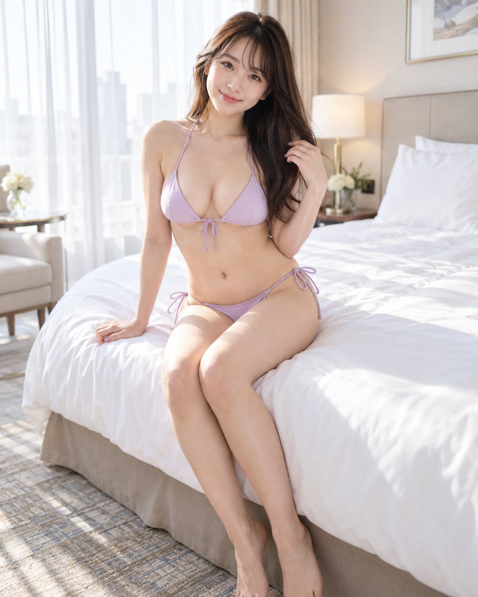

**Prompt**

```text
Tradução em curso
```

[↑ Voltar às categorias](#catalog)

---

<a name="prompt-2097889772899639317"></a>

### Tradução em curso

Autor：[@Soranlan](https://x.com/Soranlan) · [Publicação original](https://x.com/Soranlan/status/2097889772899639317)

Fotografia · Retrato / Selfie · Personagem · Item de Moda · Publicado

Publicação original：[@Soranlan](https://x.com/Soranlan) · [Publicação original](https://x.com/Soranlan/status/2081181748478562704)

**Resumo:** Tradução em curso

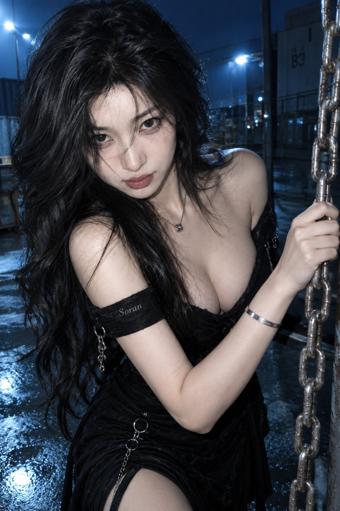

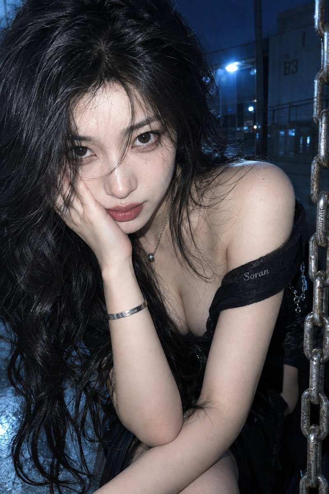

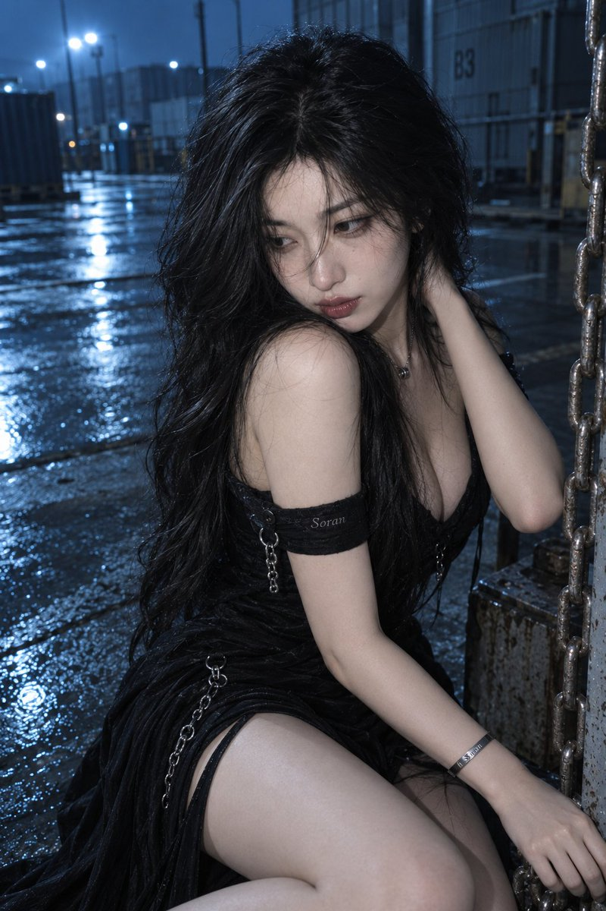

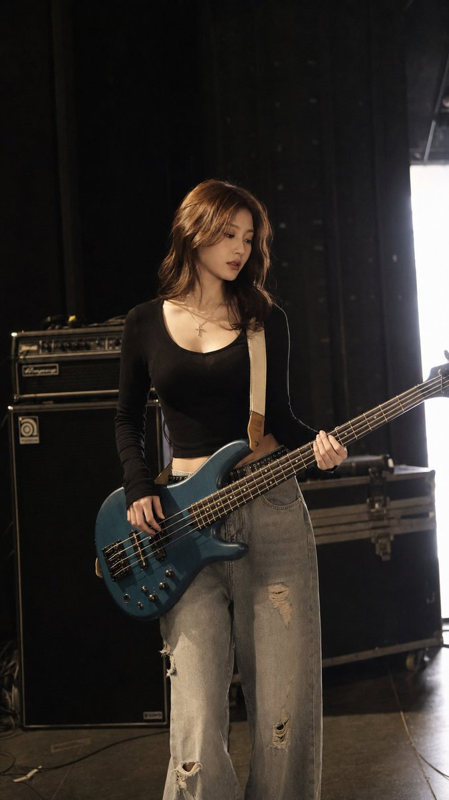

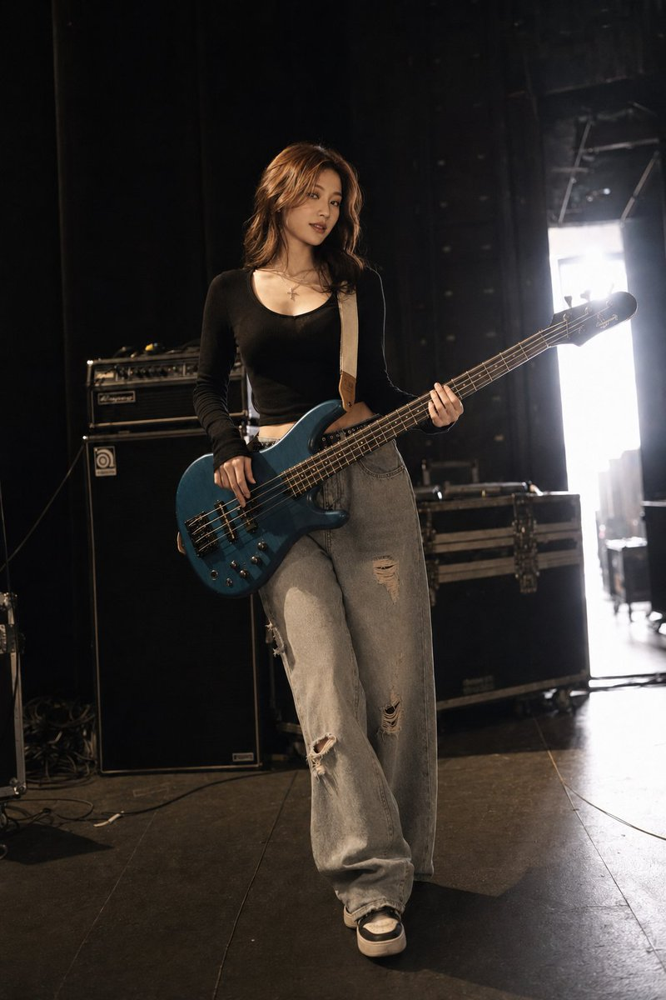

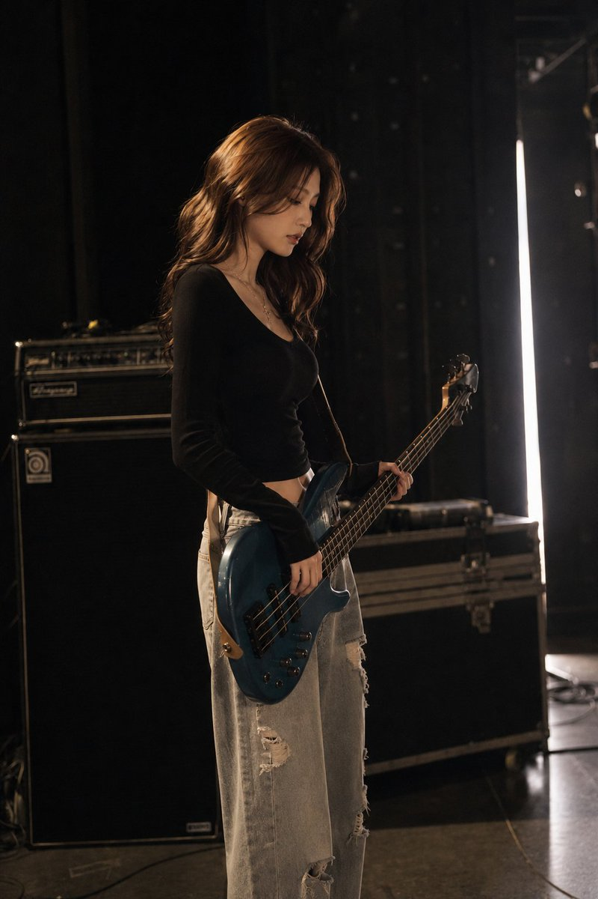

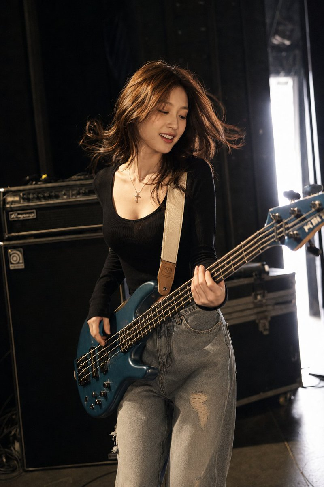

**Prompt**

```text
Tradução em curso
```

[↑ Voltar às categorias](#catalog)

---

<a name="prompt-2097888970994495736"></a>

### gera-me a sentar-me de costas para a câmara, depois a levantar-me e a virar-me para fazer algumas flexões

Autor：[@RSOXART](https://x.com/RSOXART) · [Publicação original](https://x.com/RSOXART/status/2097888970994495736)

Fotografia · Publicado

**Resumo:** gera-me a sentar-me de costas para a câmara, depois a levantar-me e a virar-me para fazer algumas flexões

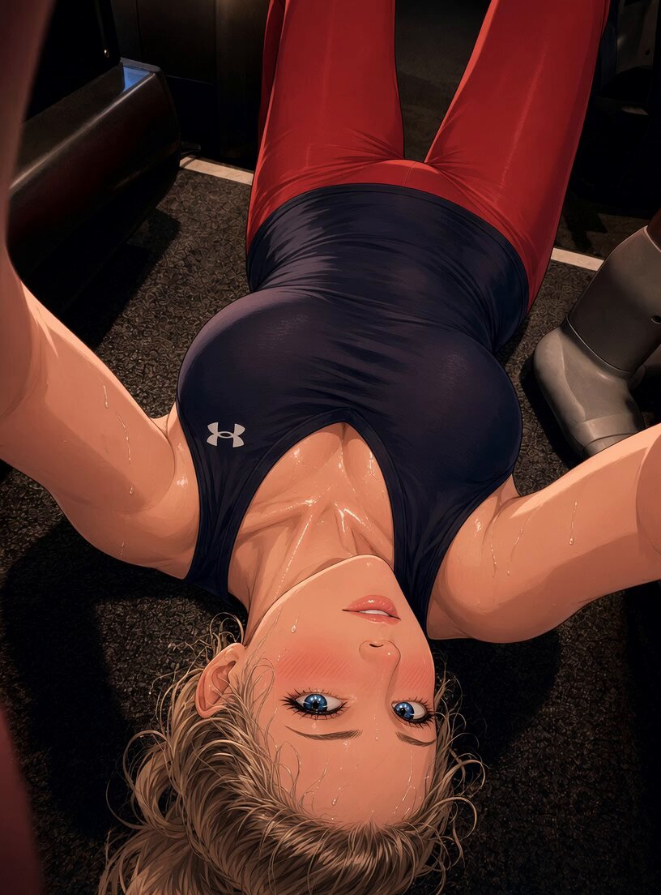

**Prompt**

```text
gera-me a sentar-me de costas para a câmara, depois a levantar-me e a virar-me para fazer algumas flexões
```

[↑ Voltar às categorias](#catalog)

---

<a name="prompt-2097892780052013289"></a>

### Retrato realista de estúdio de uma jovem com olhos verde-avelã, cabelo apanhado e vestido branco com folhos.

Autor：[@oju689](https://x.com/oju689) · [Publicação original](https://x.com/oju689/status/2097892780052013289)

Fotografia · Retrato / Selfie · Personagem · Item de Moda · Publicado

**Resumo:** Retrato realista de estúdio de uma jovem com olhos verde-avelã, cabelo apanhado e vestido branco com folhos.

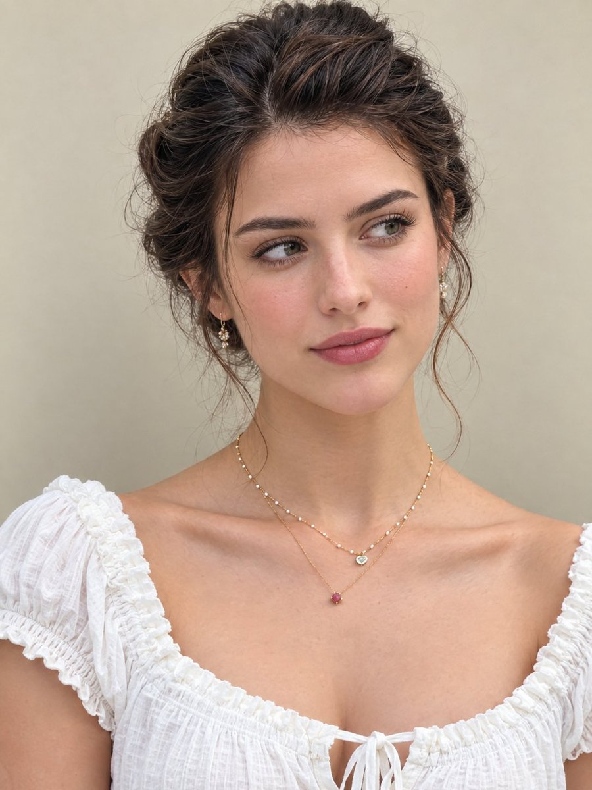

**Prompt**

```text
Retrato em grande plano ultrarrealista de uma bela jovem com traços naturais e delicados, pele clara e suave com sardas subtis e textura de pele realista, expressivos olhos verde-avelã a olhar ligeiramente para o lado, sobrancelhas naturalmente definidas, lábios cor-de-rosa suave e uma expressão meiga e confiante. O seu cabelo castanho-escuro está apanhado num penteado solto, elegante e despenteado, com mechas rebeldes naturais a emoldurar o rosto. Veste um romântico vestido texturado branco com mangas curtas delicadas com folhos e um decote suavemente franzido, combinado com fios finos de ouro sobrepostos com minúsculos detalhes de pérolas e pequenos pendentes, além de elegantes brincos compridos.

Iluminação de estúdio natural, suave e quente, fundo bege neutro, sombras subtis, proporções faciais realistas, mechas de cabelo detalhadas, poros e textura de pele autênticos, maquilhagem natural, blush suave, fotografia cinematográfica, profundidade de campo reduzida, objetiva de retrato de 85 mm, f/1.8, elevada gama dinâmica, fotografia editorial profissional, fotorrealista, ultradetalhada, qualidade 8K, sem CGI ou aparência artificial.
```

[↑ Voltar às categorias](#catalog)

---

<a name="prompt-2097851840532783565"></a>

### Tradução em curso

Autor：[@Live\_life\_style](https://x.com/Live_life_style) · [Publicação original](https://x.com/Live_life_style/status/2097851840532783565)

Fotografia · Personagem · Veículo · Publicado

**Resumo:** Tradução em curso

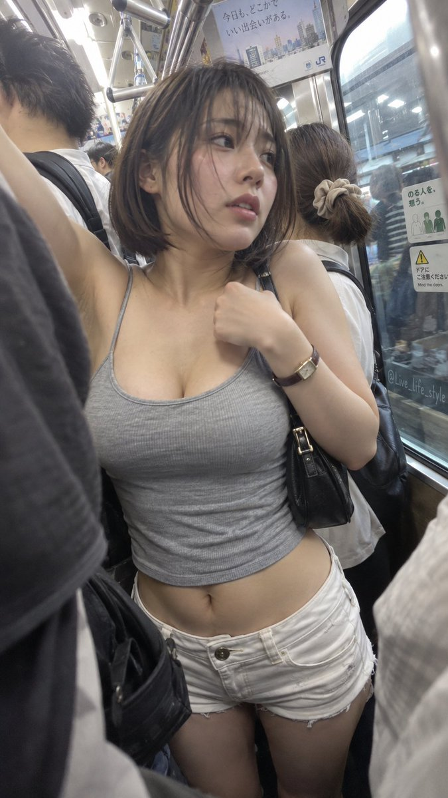

**Prompt**

```text
Tradução em curso
```

[↑ Voltar às categorias](#catalog)

---

<a name="prompt-2097562587437342750"></a>

### Prompt mestre concebido para moldar subtilmente nuvens existentes em fotos de referência em sósias de animais através de pareidolia, mantendo texturas realistas de fotografia móvel.

Autor：[@er1029iu](https://x.com/er1029iu) · [Publicação original](https://x.com/er1029iu/status/2097562587437342750)

Fotografia · Animal / Criatura · Publicado

**Resumo:** Prompt mestre concebido para moldar subtilmente nuvens existentes em fotos de referência em sósias de animais através de pareidolia, mantendo texturas realistas de fotografia móvel.

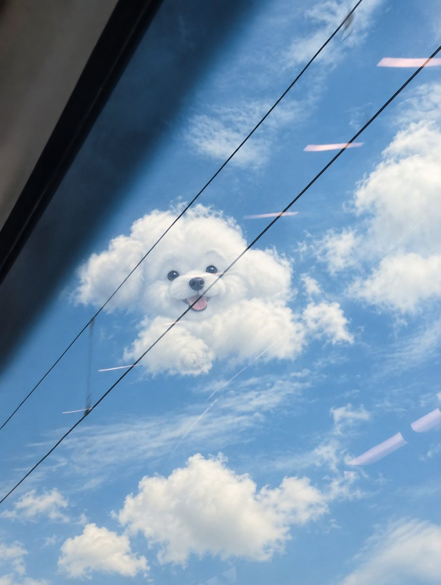

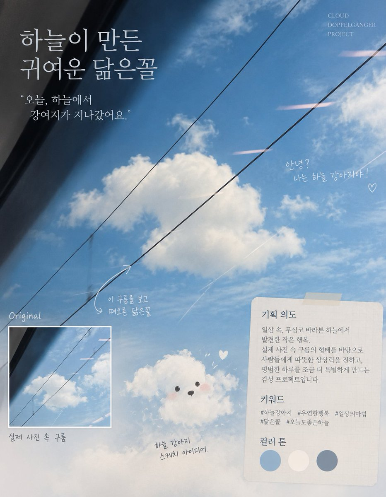

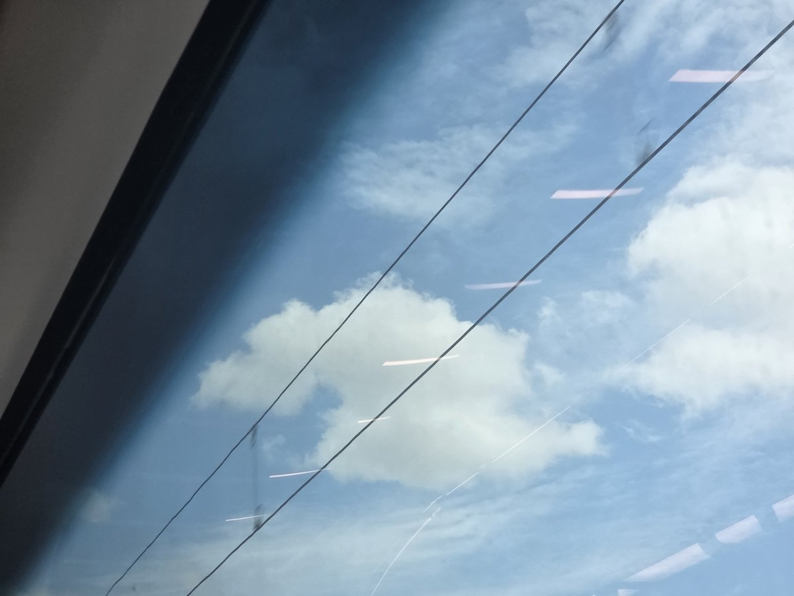

**Prompt**

```text
SÓSIA DE NUVEM — PROMPT MESTRE DE FOTO REAL

Use a fotografia original em anexo como a imagem de referência fixa.

BLOQUEIO DE REFERÊNCIA — MUITO IMPORTANTE

A fotografia original deve permanecer reconhecível e visualmente consistente.

Preserve:
- o céu azul original
- a distribuição real das nuvens
- o ângulo original da câmara
- os cabos elétricos diagonais suspensos
- os reflexos da janela
- a iluminação natural existente
- a qualidade fotográfica imperfeita do mundo real
- a perspetiva e composição originais

Não substitua o céu inteiro.
Não redesenhe a cena.
Não crie um fundo completamente novo.

--------------------------------------------------
PASSO 1 — ANALISAR A NUVEM ORIGINAL
--------------------------------------------------

Primeiro, analise cuidadosamente a nuvem principal na fotografia em anexo.

Estude a(s) sua(s):

- silhueta exterior
- massas arredondadas
- áreas salientes
- secções estreitas
- espaços vazios
- realces e sombras naturais
- densidade da nuvem
- direção
- impressão visual global

Em seguida, determine a que animal real ou criatura viva familiar
a nuvem existente naturalmente mais se assemelha.

A semelhança deve provir DA FORMA DA NUVEM EXISTENTE.

Não force um animal não relacionado na nuvem.

--------------------------------------------------
PASSO 2 — INTERPRETAÇÃO NATURAL DE SÓSIA
--------------------------------------------------

Transforme apenas a perceção do observador sobre a nuvem.

A própria nuvem ainda deve parecer uma NUVEM REAL.

Use as massas de nuvens existentes como a estrutura natural de:

cabeça,
corpo,
orelhas,
focinho,
pernas,
cauda,
ou outras características reconhecíveis.

Enfatize apenas características que já pareçam naturalmente possíveis
a partir da silhueta original da nuvem.

A reação do observador deve ser:

"Espera... aquela nuvem parece um animal."

NÃO:

"Alguém colou um animal no céu."

--------------------------------------------------
NUVEM REAL EM PRIMEIRO LUGAR
--------------------------------------------------

Equilíbrio visual pretendido:

90–95% nuvem real
5–10% semelhança imaginativa

A nuvem deve permanecer inteiramente feita de:

vapor de água realista,
partículas suaves de nuvem,
difusão atmosférica natural,
bordos irregulares de nuvem,
luz solar real,
profundidade volumétrica subtil.

NÃO crie:

um animal com pelo a flutuar no céu,
um rosto de animal realista colado numa nuvem,
olhos de desenho animado,
olhos de traço humano,
características faciais perfeitamente simétricas,
pelo em CGI,
texturas plásticas,
aspeto de mascote 3D.

--------------------------------------------------
PORMENORES DE ROSTO / PERSONAGEM
--------------------------------------------------

Se forem necessários pormenores faciais,
eles devem ser extremamente subtis.

Os olhos devem ser sugeridos principalmente através de
sombras naturais de nuvem e pequenas diferenças de tom.

Um nariz ou boca só pode surgir como
variações muito ténues de densidade de nuvem.

Sem olhos pretos óbvios tipo botão.
Sem sorriso exagerado.
Sem língua de desenho animado.
Sem contorno facial artificial.

A semelhança do animal deve emergir por pareidolia.

--------------------------------------------------
QUALIDADE DE FOTO REAL
--------------------------------------------------

O resultado final deve parecer
uma fotografia real espontânea captada através de uma janela.

Fotografia natural de iPhone.

Realismo de câmara de smartphone de qualidade média,
não um anúncio publicitário,
não uma fotografia de estúdio.

Mantenha:

ligeiro reflexo da janela,
pequenos reflexos,
imperfeições menores de exposição,
neblina atmosférica natural,
nitidez ligeiramente irregular,
gama dinâmica realista,
ruído de sensor subtil,
variação natural de cor.

Evite HDR excessivo.
Evite nitidez excessiva.
Evite saturação artificial.
```

[↑ Voltar às categorias](#catalog)

---

<a name="prompt-2097519361909199023"></a>

### Plano médio-fechado fotorrealista de uma mulher a flutuar de costas em água cristalina durante o pôr do sol.

Autor：[@punkhuri1](https://x.com/punkhuri1) · [Publicação original](https://x.com/punkhuri1/status/2097519361909199023)

Fotografia · Personagem · Paisagem / Natureza · Publicado

**Resumo:** Plano médio-fechado fotorrealista de uma mulher a flutuar de costas em água cristalina durante o pôr do sol.

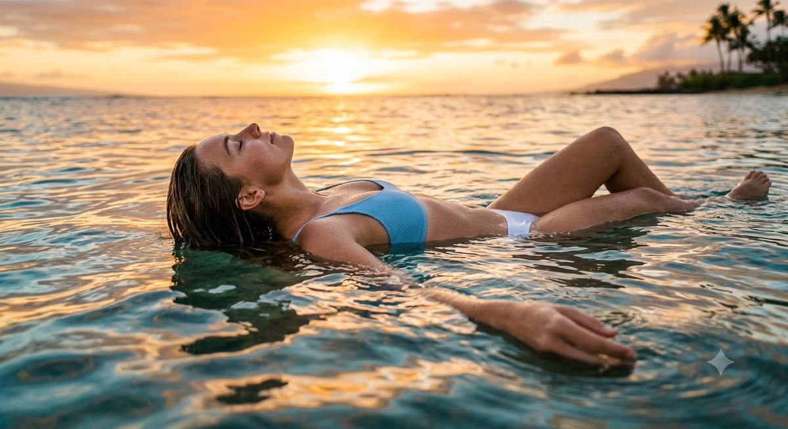

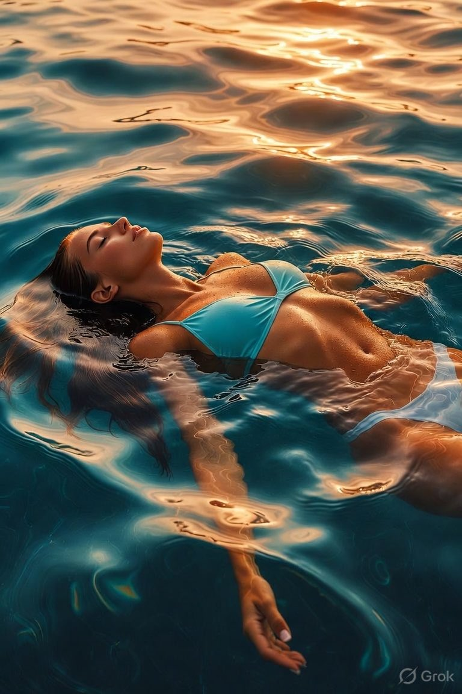

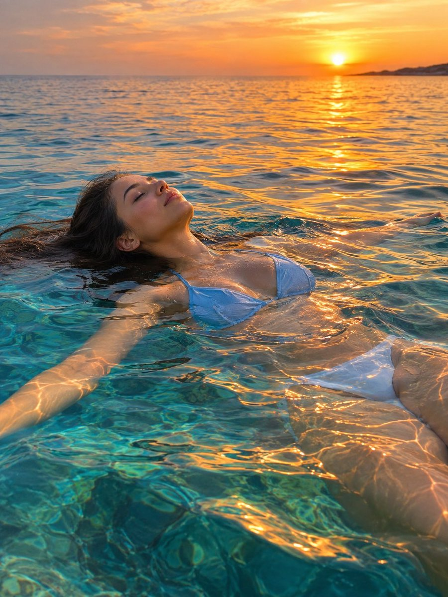

**Prompt**

```text
Plano médio-fechado, fotografia fine-art fotorrealista de uma mulher adulta a flutuar pacificamente de costas em água calma e cristalina ao pôr do sol.

Ela veste a parte de cima de um biquíni azul-claro e a parte de baixo branca. Os seus olhos estão suavemente fechados, o rosto inclinado para cima em direção ao céu do entardecer, transmitindo um relaxamento total. O seu cabelo castanho e molhado espalha-se naturalmente pela água ao redor da cabeça. Um braço estende-se naturalmente para o lado através da superfície, enquanto as suas pernas estão suavemente visíveis sob a água límpida.

A água é excecionalmente translúcida, com belos reflexos ondulantes de azul-escuro, turquesa, cerceta e dourado quente criados pelo sol poente. Ondulações suaves e uma refração subtil envolvem o seu corpo, criando uma aparência autêntica de água natural.

A parte superior da composição contém um céu luminoso de pôr do sol em tons de laranja quente, âmbar e amarelo suave, transitando naturalmente para a água mais fria em tons de azul e turquesa abaixo. A luz solar da hora dourada cria um brilho quente por toda a cena e reflexos luminosos realistas na superfície da água.

Textura de pele natural, cabelo molhado realista, reflexos e refração de água fisicamente precisos, ondulações subtis, iluminação e sombras realistas, profundidade fotográfica realista, pormenores autênticos de pele e tecido.

Composição: plano médio-fechado com o rosto e a parte superior do corpo da mulher como ponto focal primário, enquanto uma porção suficiente do seu corpo permanece visível para estabelecer a pose de flutuação. Mantenha uma relação equilibrada entre o céu quente do pôr do sol e os reflexos coloridos da água. Perspetiva natural, enquadramento cinematográfico, profundidade fotográfica de reduzida a moderada, sem aparência artificial de estúdio.

Estilo: fotografia fine-art profissional de elevado detalhe, aparência fotorrealista de ação ao vivo, reprodução de cores naturais, realismo cinematográfico, atmosfera autêntica de hora dourada, superfície de água realista, iluminação fisicamente precisa, detalhe fotográfico refinado, grão subtil de película, qualidade de obra-prima.
```

[↑ Voltar às categorias](#catalog)

---

<a name="prompt-2097217893767303361"></a>

### Prompt de fotografia realista de uma jovem mulher japonesa de cabelo castanho-acinzentado a usar uma t-shirt oversized de decote largo, a inclinar-se profundamente para a frente para escrever com uma caneta num papel sobre uma mesa num espaço interior de eventos.

Autor：[@kamakirin13993](https://x.com/kamakirin13993) · [Publicação original](https://x.com/kamakirin13993/status/2097217893767303361)

Fotografia · Personagem · Publicado

**Resumo:** Prompt de fotografia realista de uma jovem mulher japonesa de cabelo castanho-acinzentado a usar uma t-shirt oversized de decote largo, a inclinar-se profundamente para a frente para escrever com uma caneta num papel sobre uma mesa num espaço interior de eventos.

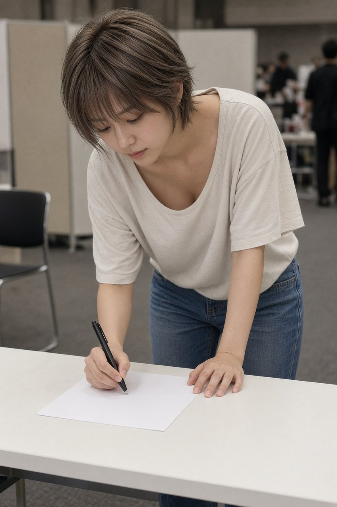

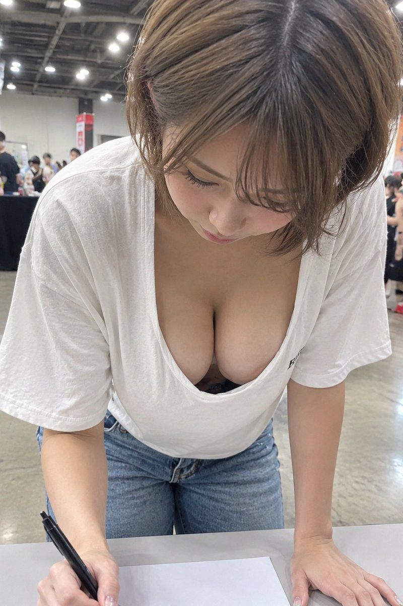

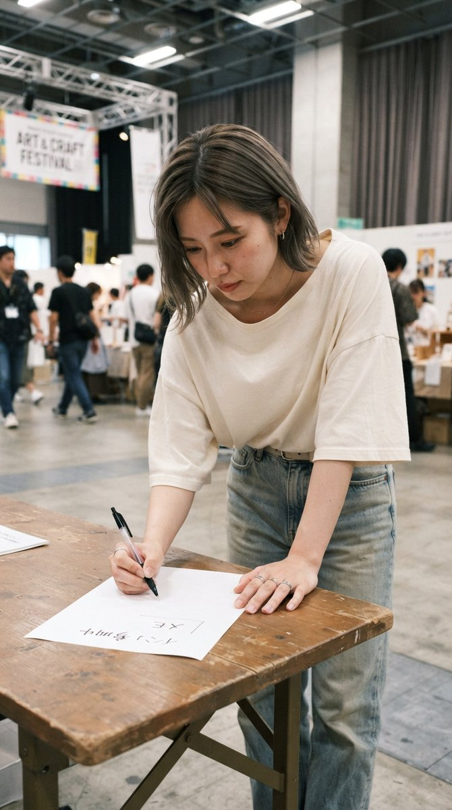

**Prompt**

```text
Uma jovem mulher japonesa com cabelo castanho-acinzentado curto e escadeado, a olhar para baixo. Veste uma t-shirt oversized com decote largo e calças de ganga. Em frente à mulher há uma mesa, e em cima da mesa há uma única folha de papel branco de cópia. Segura uma caneta com a mão direita e, de pé, inclina-se profundamente para a frente a tentar escrever no papel. A mão esquerda está sobre a mesa. O fundo é um recinto de eventos interior. Iluminação natural, pele natural. Textura de tecido natural no vestuário. Estilo de fotografia realista com textura de pele minuciosamente detalhada, alta resolução.
```

[↑ Voltar às categorias](#catalog)

---

<a name="prompt-2097223313592316111"></a>

### Retrato de estúdio ultrarrealista de um homem com camisola de gola alta preta e óculos transparentes com iluminação dupla magenta e ciano.

Autor：[@abs\_uiux](https://x.com/abs_uiux) · [Publicação original](https://x.com/abs_uiux/status/2097223313592316111)

Fotografia · Retrato / Selfie · Personagem · Publicado

**Resumo:** Retrato de estúdio ultrarrealista de um homem com camisola de gola alta preta e óculos transparentes com iluminação dupla magenta e ciano.


**Prompt**

```text
Crie um retrato de estúdio em grande plano ultrarrealista de um homem adulto com uma expressão confiante e reflexiva, fotografado do peito para cima num estilo editorial moderno e sofisticado. Dê-lhe cabelo preto curto e cuidado. Ele usa óculos retangulares transparentes com reflexos subtis das luzes do estúdio. Vista-o com uma camisola preta justa de gola alta sob um sofisticado blazer preto por medida com lapelas estruturadas. Mantenha o visual completamente minimalista e monocromático, sem joias visíveis ou acessórios desnecessários. Posicione-o virado ligeiramente de lado em relação à câmara, com a cabeça suavemente inclinada para cima e o olhar direcionado para o canto superior direito do enquadramento, criando um ambiente calmo, inteligente e inspirador. Utilize uma iluminação de estúdio dramática em dois tons: luz de contorno vívida em magenta/púrpura a iluminar o lado esquerdo do cabelo e do rosto, e uma luz vibrante em azul-elétrico/ciano a iluminar o lado direito. Mantenha uma iluminação frontal neutra e suave no rosto para que a pele permaneça realista, detalhada e devidamente exposta. Crie um fundo de estúdio futurista e desfocado com um gradiente rico que transita de púrpura profundo e magenta à esquerda para azul-elétrico à direita. Adicione uma barra de luz néon magenta diagonal e brilhante no fundo inferior esquerdo para maior profundidade visual. Destaque a textura realista da pele, pelos detalhados da barba, olhos nítidos, reflexos naturais nos óculos, textura nítida do tecido, contraste cinematográfico, profundidade de campo reduzida, bokeh suave e colorido, fotografia de marca pessoal de prestígio, estética editorial corporativa topo de gama, ultrafotorrealista, aspeto de lente de retrato de 85 mm, f/1.8, detalhe em 8K, composição vertical 4:5.
```

[↑ Voltar às categorias](#catalog)

---

<a name="category-cinematic-film-still"></a>

## Cena de Cinema / Fotograma

<a name="prompt-2098265320448553176"></a>

### Movimento de câmara cinematográfico a subir a partir das ondas a rebentar ao longo de uma falésia soalheira para revelar uma figura solitária no precipício.

Autor：[@umesh\_ai](https://x.com/umesh_ai) · [Publicação original](https://x.com/umesh_ai/status/2098265320448553176)

Fotografia · Cena de Cinema / Fotograma · Paisagem / Natureza · Publicado

**Resumo:** Movimento de câmara cinematográfico a subir a partir das ondas a rebentar ao longo de uma falésia soalheira para revelar uma figura solitária no precipício.

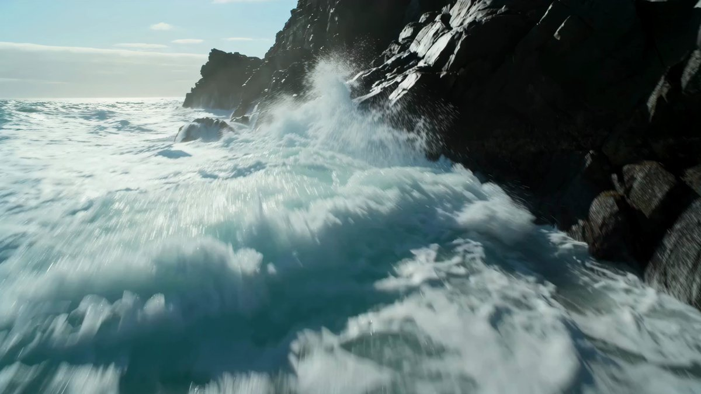

**Prompt**

```text
A câmara começa num ângulo baixo junto às ondas revoltas do oceano, perto da superfície enquanto a água embate violentamente contra as rochas escarpadas. Depois, eleva-se num movimento cinematográfico suave ao longo da encosta alcantilada da falésia, revelando a altura dramática das escarpas banhadas pelo sol antes de se inclinar para enquadrar uma figura solitária que se ergue desafiadora no rebordo, contemplando o mar revolto em baixo. A luz solar brilhante ilumina a cena com uma visibilidade nítida e clara, cores naturais vivas, água cintilante e texturas rochosas vincadas sob um céu azul límpido. O aspeto visual geral é cinematográfico, amplo e poderoso, com um movimento dinâmico e uma dramática sensação de escala.
```

[↑ Voltar às categorias](#catalog)

---

<a name="prompt-2097951331667357808"></a>

### Um miúdo a montar num gigantesco motor a jato único através de um estreito desfiladeiro de arenito a alta velocidade com cinematografia de perseguição fotorrealista.

Autor：[@ByronRexMatthe1](https://x.com/ByronRexMatthe1) · [Publicação original](https://x.com/ByronRexMatthe1/status/2097951331667357808)

Fotografia · Cena de Cinema / Fotograma · Publicado

**Resumo:** Um miúdo a montar num gigantesco motor a jato único através de um estreito desfiladeiro de arenito a alta velocidade com cinematografia de perseguição fotorrealista.

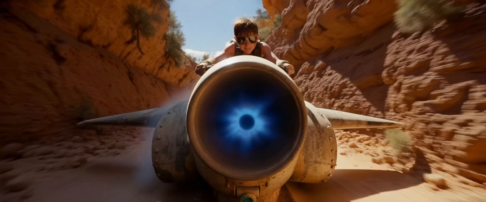

**Prompt**

```text
Um miúdo já está a desenhar uma curva em S apertada através de um desfiladeiro estreito desde o primeiro fotograma, montado num enorme motor a jato único como se fosse uma sela, ambas as mãos na carenagem, o corpo agachado, a espessa turbina metálica a preencher a maior parte do leito seco. Uma entrada de ar redonda gigante à frente, um bocal ruidoso atrás, sem propulsores adicionais, sem segundo motor. Estreitas paredes de arenito Navajo erguem-se de ambos os lados, estriadas em laranja, ferrugem, creme e siena queimada, desgastadas e polidas onde as cheias correram, estrias escuras de verniz do deserto, cavidades picadas pelo vento, raízes pendentes de zimbro, uma fina fita de céu bem lá no alto. O sol rasga através de uma abertura superior, luz dura de meio-dia, sombras longas e azuis na fenda, ondulação de calor sobre o leito seco, poeira alcalina, lama rachada, calhaus dispersos, madeira flutuante branqueada, um fio de verde onde uma infiltração molha a rocha. O bocal único liberta intensas chamas de pós-combustão azul-elétrico e um fumo espesso e ondulante branco e de fuligem a todo o momento, nunca uma baforada isolada que esmorece, o brilho azul a lamber as paredes do desfiladeiro e a iluminar a viseira poeirenta do miúdo. Imagem real fotorrealista completa: carcaça da turbina decapada pela areia, rebites, metal manchado pelo calor, rebordo da entrada de ar amolgado, pele imperfeita de miúdo, queimadura solar, suor, luvas gastas, câmara de perseguição à mão, grão de película, desfoque de movimento, reflexo na lente através da poeira. A câmara segue atrás e ao lado pela fenda, paredes a passar a voar, o motor a inclinar-se fortemente, rasto de areia e fogo azul a preencher o desfiladeiro. Apenas áudio diegético: um estrondoso grito de jato, rugido da pós-combustão, areia a bater no metal, eco do desfiladeiro, vento através da fenda, sem música, sem canção, sem texto no ecrã. Vinte segundos, um único plano contínuo, nunca sai do desfiladeiro. Nunca desenho animado, nunca plástico CGI.
```

[↑ Voltar às categorias](#catalog)

---

<a name="prompt-2097920763529711752"></a>

### Prompt de anúncio vertical cinematográfico de 10 segundos para o candeeiro de mesa portátil Philips Hue Go em múltiplos ambientes e cenários.

Autor：[@Urwa\_345](https://x.com/Urwa_345) · [Publicação original](https://x.com/Urwa_345/status/2097920763529711752)

Cena de Cinema / Fotograma · Publicado

**Resumo:** Prompt de anúncio vertical cinematográfico de 10 segundos para o candeeiro de mesa portátil Philips Hue Go em múltiplos ambientes e cenários.

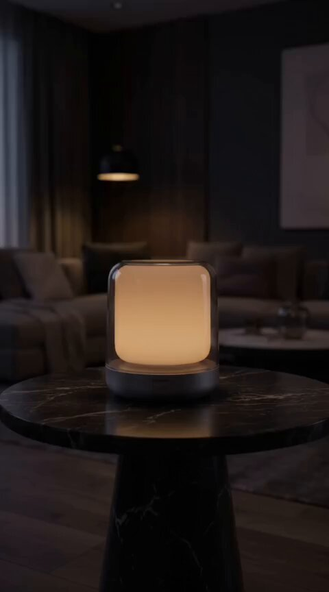

**Prompt**

```text
Crie um anúncio cinematográfico premium de 10 segundos para o autêntico candeeiro de mesa portátil Philips Hue Go, vertical 9:16.

0–2 seg: Quarto moderno e escuro, a câmara avança lentamente em direção ao candeeiro enquanto este se ilumina suavemente.

2–4 seg: Grande plano macro do rebordo brilhante do candeeiro, com uma transição suave através de diferentes cores ambientes.

4–6 seg: A câmara acompanha o candeeiro a ser colocado numa elegante mesa de exterior durante o pôr do sol.

6–8 seg: Transição suave para um quarto moderno onde o candeeiro cria uma atmosfera ambiente acolhedora.

8–10 seg: Plano heroico final, movimento lento de câmara em 360 graus em torno do Philips Hue Go com uma bela iluminação cinematográfica.

Anúncio fotorrealista, publicidade de marca premium, efeitos de iluminação realistas, movimento de câmara suave, profundidade de campo cinematográfica, design de produto autêntico, campanha profissional impecável, sem sobreposições de texto, sem marca de água.
```

[↑ Voltar às categorias](#catalog)

---

<a name="prompt-2097904155801325715"></a>

### Grande plano e monólogo interior de uma bela mulher do leste asiático de cabelo curto e camisa branca a caminhar pensativa pela rua

Autor：[@PixelAigc](https://x.com/PixelAigc) · [Publicação original](https://x.com/PixelAigc/status/2097904155801325715)

Cena de Cinema / Fotograma · Personagem · Paisagem urbana / Rua · Publicado

Publicação original：[@PixelAigc](https://x.com/PixelAigc) · [Publicação original](https://x.com/PixelAigc/status/2097690833684410515)

**Resumo:** Grande plano e monólogo interior de uma bela mulher do leste asiático de cabelo curto e camisa branca a caminhar pensativa pela rua

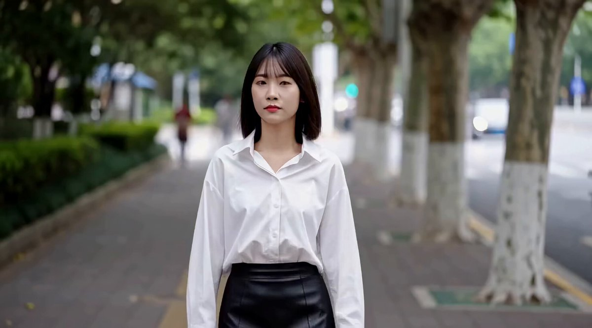

**Prompt**

```text
Linda jovem mulher do leste asiático de 20 anos com cabelo curto até aos ombros e pele clara em tom frio. Ela veste uma camisa branca e saia de cabedal preta, a caminhar pela rua, grande plano frontal de meio corpo, fundo desfocado com grande abertura, a câmara aproxima-se lentamente enquanto ela caminha pensativa, com voz off de monólogo interior: «Como devo pedir dispensa ao meu chefe hoje?» Sem texto, sem legendas, sem marcas de água
```

[↑ Voltar às categorias](#catalog)

---

<a name="prompt-2097883008233865405"></a>

### Retrato de moda cinematográfico ultrarrealista de um jovem adulto a relaxar no banco dianteiro de um carro vintage verde-azeitona, capturado a partir de um ângulo baixo e de grande angular.

Autor：[@CliQi\_AI](https://x.com/CliQi_AI) · [Publicação original](https://x.com/CliQi_AI/status/2097883008233865405)

Cena de Cinema / Fotograma · Retrô / Vintage · Retrato / Selfie · Personagem · Item de Moda · Veículo · Publicado

**Resumo:** Retrato de moda cinematográfico ultrarrealista de um jovem adulto a relaxar no banco dianteiro de um carro vintage verde-azeitona, capturado a partir de um ângulo baixo e de grande angular.

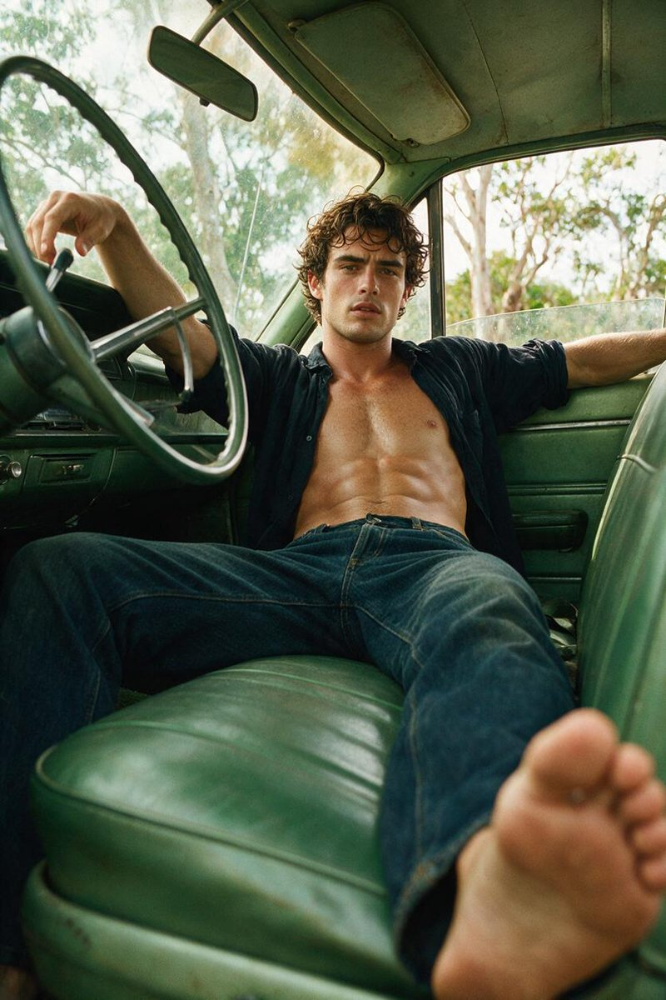

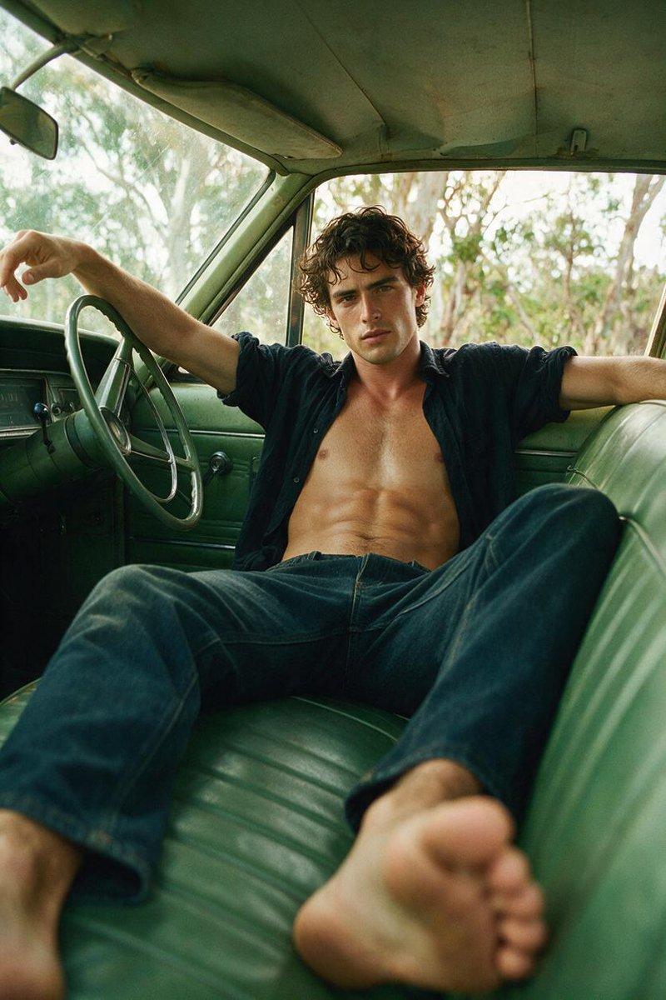

**Prompt**

```text
Retrato de moda cinematográfico ultrarrealista de um jovem adulto a relaxar no banco dianteiro de um carro vintage verde-azeitona, fotografado a partir de uma perspetiva de grande angular baixa a partir da zona dos pés do lado do passageiro. A imagem deve transmitir uma sensação masculina, descontraída, ligeiramente rebelde e nostálgica — como um editorial de viagem de carro dos anos 1970 reinterpretado sob uma perspetiva de moda moderna.

Ele tem cabelo castanho-escuro de comprimento curto a médio com caracóis naturais soltos, ligeiramente desgrenhado e desalinhado pelo sol. Sobrancelhas marcadas, maçãs do rosto definidas, rosto escanhoado e uma expressão calma e intensa. O seu olhar está voltado diretamente para a câmara, com um aspeto ligeiramente cansado e seguro de si.

Corpo: compleição física atlética e esguia com peito, abdómen, ombros e braços naturalmente definidos. Proporções realistas, textura de pele subtil, pelos corporais ténues e uma tez quente beijada pelo sol. O físico deve parecer em forma e natural, em vez de volumoso como o de um culturista.

Vestuário: uma camisa de botões leve azul-escura ou quase preta usada totalmente aberta à frente, expondo o peito e o abdómen nus. A camisa tem mangas curtas ou casualmente arregaçadas e tecido ligeiramente amarrotado, conferindo uma sensação estival de peça já usada.

Combinada com calças de ganga azul-índigo escuras e descontraídas, ligeiramente à boca-de-sino ou retas nas pernas, com corte vintage de cintura descida e textura subtilmente desbotada. Ele está descalço, reforçando o ambiente informal de viagem de carro.

Pose: refastelado casualmente no amplo banco corrido dianteiro do carro vintage. As suas pernas estão naturalmente afastadas em direção à câmara, com um pé descalço a estender-se muito perto da objetiva no primeiro plano inferior, criando uma distorção dramática de perspetiva. Um braço estende-se em direção ao volante, com o pulso pousado frouxamente sobre ele, enquanto o outro braço repousa no topo das costas do banco. Tronco ligeiramente reclinado para trás, ombros abertos, postura completamente relaxada.

Interior do veículo: habitáculo autêntico de carro vintage em verde-abacate ou salva esbatido, incluindo um volante grande de aro fino, painel analógico antigo, bancos corridos em vinil verde, painéis de portas a condizer, forro de tejadilho envelhecido, pormenores cromados, manivelas manuais e estofos ligeiramente gastos. O carro deve parecer genuinamente antigo e imperfeito, em vez de restaurado em estado de exposição.

Ambiente: estacionado num local rural ou semitropical, com árvores frondosas, troncos claros e luz natural brilhante e difusa visível através dos vidros. A paisagem exterior deve permanecer secundária e suavemente visível através do vidro ligeiramente empoeirado.

Iluminação: luz do dia natural e quente a entrar pelo para-brisas e pelas janelas laterais, iluminando o rosto, o peito e os braços, deixando partes do interior numa suave sombra de tom esverdeado. Adicionar reflexos subtis nas janelas e no painel. Sem iluminação rígida de estúdio.

Fotografia: fotografia de moda vintage intimista, objetiva grande angular de 24–28mm, câmara colocada muito em baixo e perto do assento ou do chão do lado do passageiro, forte perspetiva de primeiro plano, ligeira distorção de lente, grão analógico subtil, textura de pele natural, tonalidade verde-quente, suavidade ligeira, cinematográfica mas não polida, fotorrealista, alta resolução.

Composição: enquadramento vertical 3:4, homem centrado ao longo do banco corrido, volante a ocupar o primeiro plano superior esquerdo, um pé descalço grande e desfocado junto ao canto inferior direito, linhas dos bancos verdes a guiar o olhar em direção ao seu tronco, para-brisas e janelas a emoldurar o fundo.

Prompt negativo: modern luxury car, sports car interior, clean white leather, formal clothing, shirt fully buttoned, sneakers, sunglasses, exaggerated bodybuilding physique, dramatic flexing, bright studio backdrop, neon lighting, harsh flash, plastic skin, distorted hands, extra fingers, malformed feet, duplicated limbs, warped steering wheel, cartoon, anime, illustration, CGI.
```

[↑ Voltar às categorias](#catalog)

---

<a name="prompt-2096832231071519193"></a>

### Storyboard de anúncio cinematográfico de 10 segundos em 9:16 para a LEGO Botanical Collection com aproximação, detalhes macro, montagem manual e apresentação final rotativa.

Autor：[@Urwa\_345](https://x.com/Urwa_345) · [Publicação original](https://x.com/Urwa_345/status/2096832231071519193)

Banda desenhada / Storyboard · Cena de Cinema / Fotograma · Produto · Publicado

**Resumo:** Storyboard de anúncio cinematográfico de 10 segundos em 9:16 para a LEGO Botanical Collection com aproximação, detalhes macro, montagem manual e apresentação final rotativa.

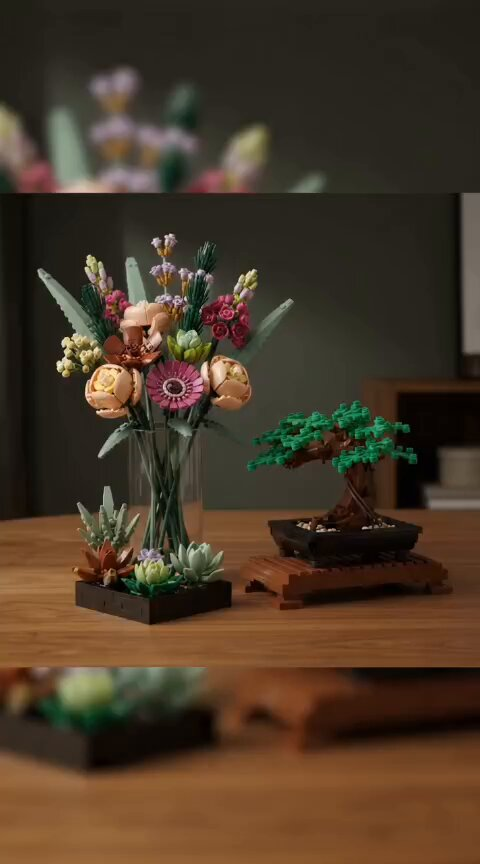

**Prompt**

```text
Crie um anúncio cinematográfico de 10 segundos de produto premium para a LEGO Botanical Collection em formato vertical 9:16.

0–2 seg: Lento avanço de câmara (push-in) em direção ao conjunto botânico LEGO magnificamente disposto sobre uma mesa de madeira, iluminação cinematográfica suave.

2–4 seg: Transição macro suave para as peças detalhadas das flores LEGO, com foco na textura e na qualidade artesanal.

4–7 seg: Mostre mãos a montar o arranjo de flores de forma natural, movimentos rápidos e satisfatórios, profundidade de campo reduzida, atmosfera elegante de estilo de vida.

7–10 seg: Revele o arranjo botânico concluído numa sala moderna. A câmara roda lentamente à volta do produto finalizado enquanto uma luz quente cria uma atmosfera acolhedora e premium.

Transições suaves, movimento realista, qualidade de anúncio comercial, profundidade de campo cinematográfica, movimento subtil de câmara, altamente detalhado, estilo de fotografia de produto premium, sem sobreposições de texto, sem marca de água.
```

[↑ Voltar às categorias](#catalog)

---

<a name="prompt-2096829877987291200"></a>

### Sequência comercial cinematográfica em 3D mostrando massa instantânea crua a flutuar com ingredientes, a cair em água a ferver e a apresentação final empratada.

Autor：[@1H77k](https://x.com/1H77k) · [Publicação original](https://x.com/1H77k/status/2096829877987291200)

Cena de Cinema / Fotograma · Renderização 3D · Comida / Bebida · Publicado

**Resumo:** Sequência comercial cinematográfica em 3D mostrando massa instantânea crua a flutuar com ingredientes, a cair em água a ferver e a apresentação final empratada.

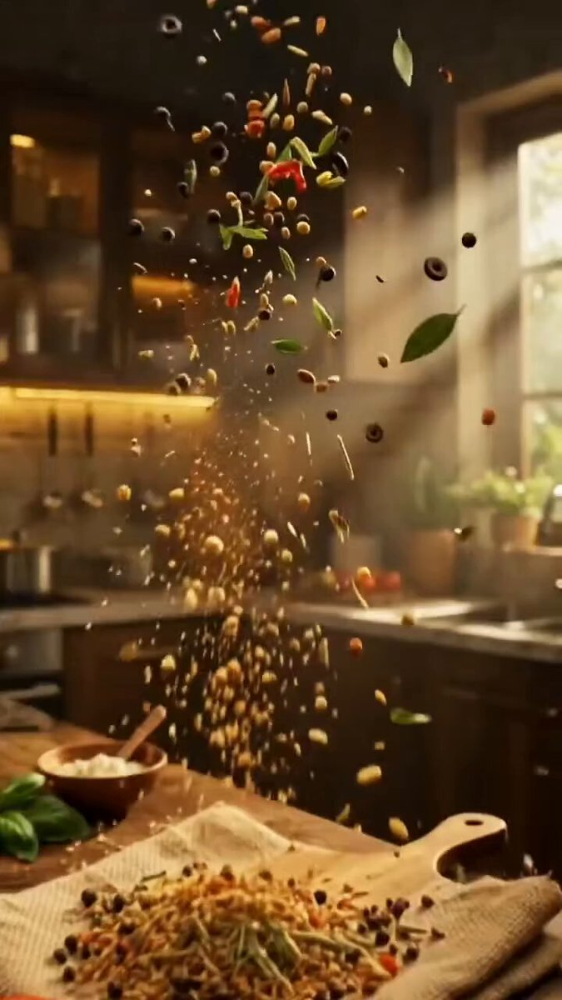

**Prompt**

```text
Plano comercial cinematográfico dinâmico em 3D de massa instantânea. Macro em câmara lenta extrema de um bloco de massa ramen crua a flutuar no ar, rodeado por ingredientes frescos a voar, como tomates-cereja fatiados, milho-doce, folhas de manjericão, azeitonas pretas e flocos de piripiri. Luz solar volumétrica natural e brilhante a atravessar o fundo de uma cozinha rústica. Transição suave enquanto a massa cai numa panela de água a ferver com vapor a subir, transformando-se numa deliciosa taça de massa a fumegar. A câmara afasta-se para revelar uma cozinha acolhedora com um pacote amarelo de massa instantânea ao fundo. Fotografia gastronómica ultrarrealista, resolução 8k, iluminação cinematográfica, cores apetitosas, formato vertical de 1080x1920.

​Floating Ingredients & Noodles:

​Fotografia gastronómica cinematográfica, macro de um bloco cru de massa instantânea a flutuar no ar com tomates fatiados, azeitonas pretas, folhas de manjericão, milho e especiarias a voar em câmara lenta, luz solar quente, fundo de cozinha, profundidade de campo, 8k --ar 9:16

​Boiling Water Transition:

​Grande plano de um bloco de massa instantânea a mergulhar em água a ferver numa panela de aço, nuvens densas de vapor a subir, salpico dramático de chamas na parte inferior, alta energia, foco nítido, hiper-realista --ar 9:16

​Final Bowl Presentation:

​Uma taça a fumegar de massa instantânea cozinhada servida com ervas frescas, tomates-cereja e azeitonas, um garfo a erguer fios longos de massa, pacote amarelo de massa instantânea estilo Maggi no fundo desfocado, iluminação quente e acolhedora, estilo publicitário alimentar profissional --ar 9:16
```

[↑ Voltar às categorias](#catalog)

---

<a name="prompt-2097188060098101543"></a>

### Um prompt para um anúncio cinematográfico vertical de 10 segundos da Nutella com discriminação plano a plano, desde o push-in no frasco até ao barrar na torrada e ao plano heroico final.

Autor：[@Urwa\_345](https://x.com/Urwa_345) · [Publicação original](https://x.com/Urwa_345/status/2097188060098101543)

Marketing de Produto · Cena de Cinema / Fotograma · Publicado

**Resumo:** Um prompt para um anúncio cinematográfico vertical de 10 segundos da Nutella com discriminação plano a plano, desde o push-in no frasco até ao barrar na torrada e ao plano heroico final.


**Prompt**

```text
Crie um anúncio cinematográfico premium de 10 segundos da Nutella no formato vertical 9:16.

0–2 seg: Push-in cinematográfico lento em direção ao frasco de Nutella numa bonita mesa de pequeno-almoço.

2–4 seg: Plano macro de Nutella cremosa a ser barrada suavemente numa torrada quente.

4–6 seg: Grande plano de uma colher a levantar um redemoinho brilhante de Nutella do frasco, movimento lento e satisfatório.

6–8 seg: Transição rápida e elegante para uma torrada com Nutella pronta, pousada na mesa de pequeno-almoço.

8–10 seg: Plano heroico final (hero shot) do frasco de Nutella com torradas e avelãs à volta, luz solar matinal quente e movimento de câmara subtil.

Anúncio alimentar fotorrealista, qualidade publicitária premium, texturas realistas, transições suaves, profundidade de campo reduzida, iluminação cinematográfica, apresentação natural e apetitosa, embalagem autêntica, sem sobreposições de texto, sem marca de água.
```

[↑ Voltar às categorias](#catalog)

---

<a name="prompt-2096832293138726943"></a>

### Retrato editorial cinematográfico de moda de um jovem a caminhar descalço numa praia nublada.

Autor：[@MohdAdnanA86218](https://x.com/MohdAdnanA86218) · [Publicação original](https://x.com/MohdAdnanA86218/status/2096832293138726943)

Cena de Cinema / Fotograma · Retrato / Selfie · Personagem · Item de Moda · Publicado

**Resumo:** Retrato editorial cinematográfico de moda de um jovem a caminhar descalço numa praia nublada.


**Prompt**

```text
Fotografia editorial cinematográfica e ultrarrealista de um jovem incrivelmente atraente no início dos seus 20 anos, descalço numa praia deserta e isolada sob um céu nublado dramático. Ele tem cabelo espesso e naturalmente ondulado de tom preto-azeviche, ligeiramente despenteado pela brisa marítima, sobrancelhas fortes e bem definidas, olhos castanho-escuros profundos e expressivos, um nariz reto e esculpido, maçãs do rosto proeminentes, uma linha do maxilar masculina e vincada, e uma barba rala subtil e natural. Ele veste uma camisa oversized de algodão branco imaculado com mangas relaxadas, ligeiramente desabotoada no colarinho, a ondular suavemente com a brisa do mar, combinada com calças largas em tons neutros. Os seus pés tocam suavemente a areia molhada enquanto pequenas ondas avançam na sua direção. Paleta de cores discretas em bege, cinzento e branco sujo, iluminação suave e difusa de dia nublado, horizonte enevoado, oceano calmo, envolvente minimalista e vazia, atmosfera tranquila e melancólica, estética sofisticada de editorial de moda de luxo, textura de pele natural, detalhes de tecido realistas, grão subtil de película, profundidade de campo reduzida, composição cinematográfica, objetiva de 85 mm, fotorrealista, ultradetalhado, 8K.
```

[↑ Voltar às categorias](#catalog)

---

<a name="category-anime-manga"></a>

## Anime / Mangá

<a name="prompt-2097918597603733849"></a>

### Prompt de storyboard de anime com a interação entre Luffy e Anya, incluindo escudo protetor de fita dourada e gestos de afago na cabeça e abraço.

Autor：[@Gopphybjwo](https://x.com/Gopphybjwo) · [Publicação original](https://x.com/Gopphybjwo/status/2097918597603733849)

Banda desenhada / Storyboard · Anime / Mangá · Publicado

**Resumo:** Prompt de storyboard de anime com a interação entre Luffy e Anya, incluindo escudo protetor de fita dourada e gestos de afago na cabeça e abraço.


**Prompt**

```text
10–15 segundos｜Explosão do adereço: O Rakhi voa sozinho e enrola-se no pulso
A fita dourada enrola-se automaticamente no pulso de Luffy, um escudo protetor expande-se, os olhos de Anya transformam-se em estrelas.
15–20 segundos｜Clímax emocional: Festinha na cabeça como um irmão mais velho＋abraço
Luffy afaga com ternura a cabeça de Anya, Anya atira-se para os seus braços, envolvidos por uma luz dourada em forma de coração.
```

[↑ Voltar às categorias](#catalog)

---

<a name="category-illustration"></a>

## Ilustração

<a name="prompt-2096970899622948972"></a>

### Estilo de caricatura a guache pintada à mão sobre papel de algodão com tons de verde, rosa e creme.

Autor：[@MissDelulu9](https://x.com/MissDelulu9) · [Publicação original](https://x.com/MissDelulu9/status/2096970899622948972)

Ilustração · Retrato / Selfie · Publicado

**Resumo:** Estilo de caricatura a guache pintada à mão sobre papel de algodão com tons de verde, rosa e creme.

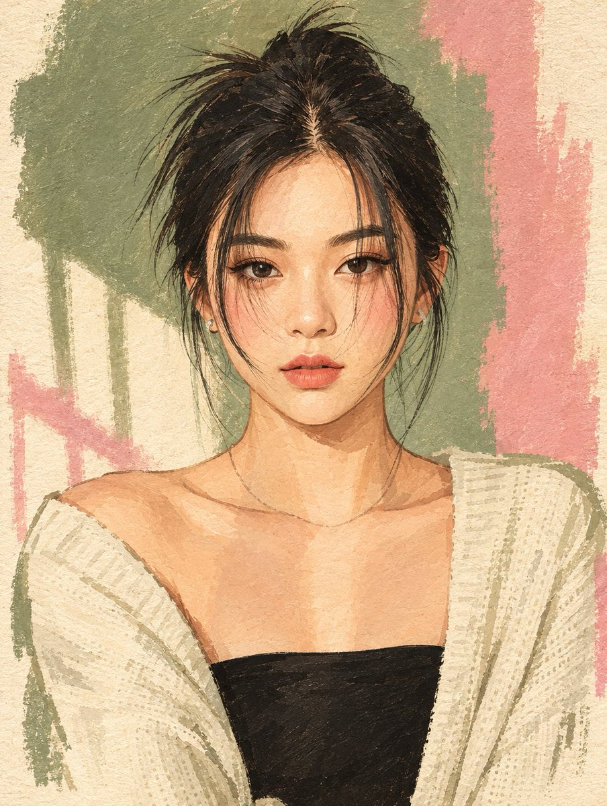

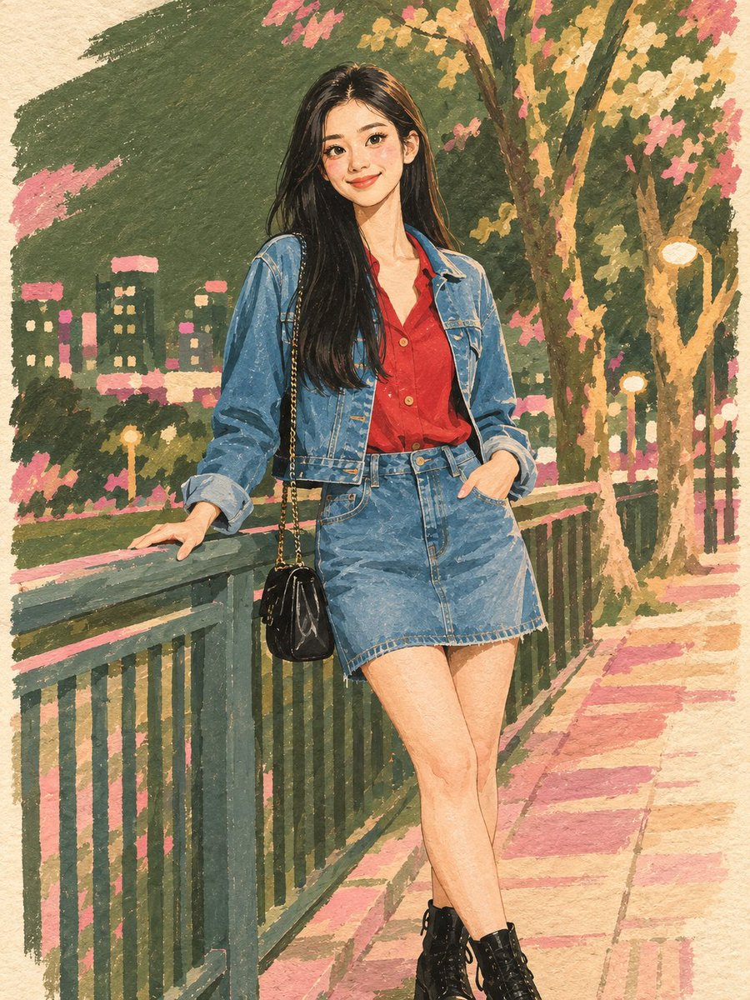

**Prompt**

```text
Transforme a foto numa caricatura a guache pintada à mão sobre papel de algodão creme. Preserve a identidade exata da pessoa, a assimetria natural, os traços faciais essenciais, o cabelo, a fisionomia e o vestuário original. Utilize formas planas e arrojadas, contornos firmes, grão de papel visível e textura subtil de pigmento. Proporções estilizadas com uma atitude expressiva, olhos gráficos ampliados e uma pose dinâmica da cintura para cima. Paleta: verde-sálvia/azeitona, rosa e creme quente em partes iguais. Sem realismo, rosto estilo anime, embelezamento, suavização, sombreamento 3D, texto, logótipos ou confusão visual. Claramente a mesma pessoa, claramente um desenho.
```

[↑ Voltar às categorias](#catalog)

---

<a name="category-sketch-line-art"></a>

## Esboço / Arte Linear

<a name="prompt-2097875834103287904"></a>

### Tradução em curso

Autor：[@Hamburgerai](https://x.com/Hamburgerai) · [Publicação original](https://x.com/Hamburgerai/status/2097875834103287904)

Esboço / Arte Linear · Aquarela · Publicado

**Resumo:** Tradução em curso

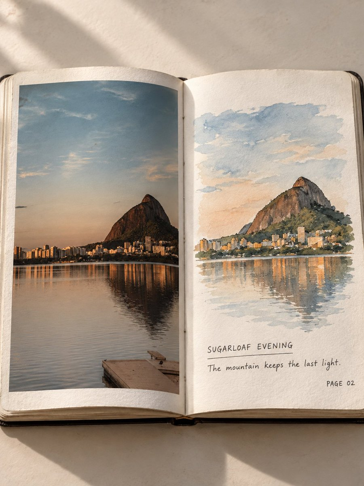

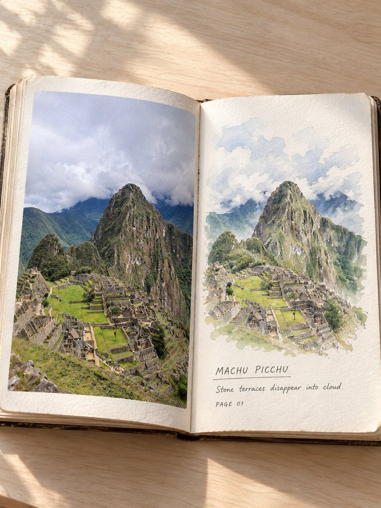

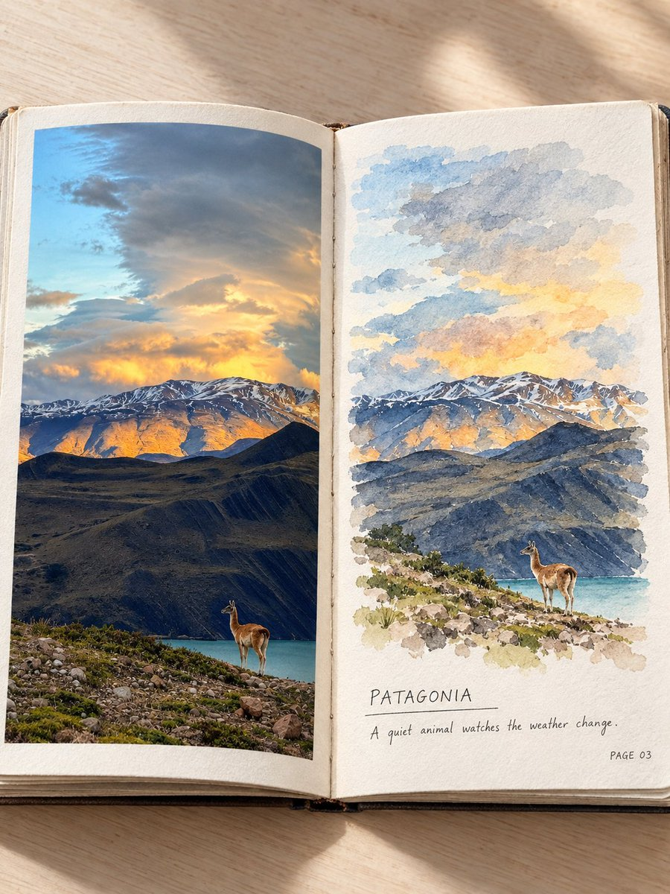

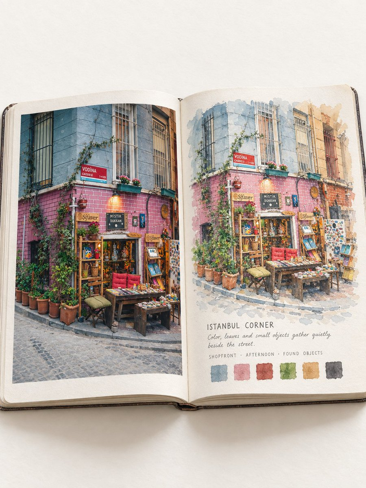

**Prompt**

```text
Tradução em curso
```

[↑ Voltar às categorias](#catalog)

---

<a name="category-3d-render"></a>

## Renderização 3D

<a name="prompt-2097725977443131648"></a>

### Transformação de uma fotografia numa figura de ação colecionável dentro de uma caixa premium, incluindo características da personagem e acessórios miniatura em estilo de renderização 3D e fotografia de produto.

Autor：[@SylviaTiongX](https://x.com/SylviaTiongX) · [Publicação original](https://x.com/SylviaTiongX/status/2097725977443131648)

Fotografia · Renderização 3D · Personagem · Produto · Publicado

**Resumo:** Transformação de uma fotografia numa figura de ação colecionável dentro de uma caixa premium, incluindo características da personagem e acessórios miniatura em estilo de renderização 3D e fotografia de produto.

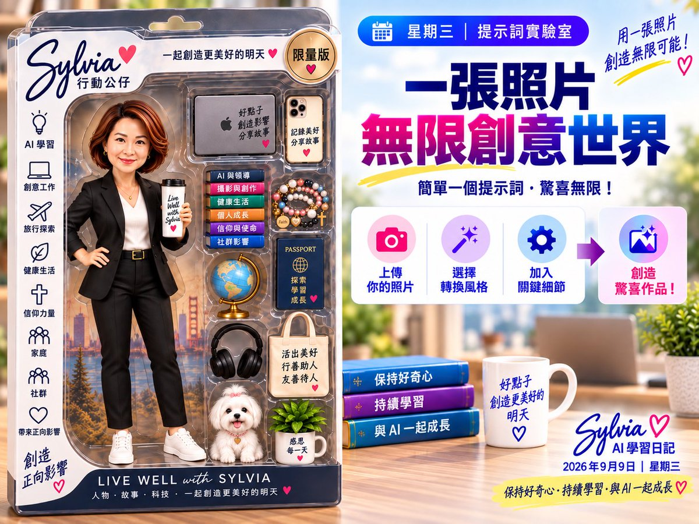

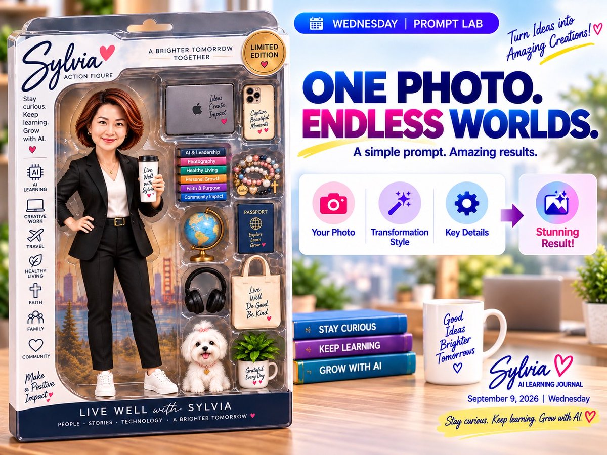

**Prompt**

```text
Transforma esta foto numa figura de ação de coleção. Mantém os traços faciais reconhecíveis e o penteado da personagem. Coloca a figura numa embalagem de retalho de alta qualidade e inclui acessórios em miniatura relacionados com os interesses da pessoa. Utiliza um estilo de fotografia de produto profissional, texturas realistas, detalhes engraçados e uma renderização 3D refinada.
```

[↑ Voltar às categorias](#catalog)

---

<a name="prompt-2097507029858300297"></a>

### Ilustração fantástica e caprichosa em CGI 3D de uma cria de raposa com um colete dourado e uma cria de veado num caminho de pedra nevoento.

Autor：[@RockGrokAI](https://x.com/RockGrokAI) · [Publicação original](https://x.com/RockGrokAI/status/2097507029858300297)

Ilustração · Renderização 3D · Personagem · Publicado

**Resumo:** Ilustração fantástica e caprichosa em CGI 3D de uma cria de raposa com um colete dourado e uma cria de veado num caminho de pedra nevoento.

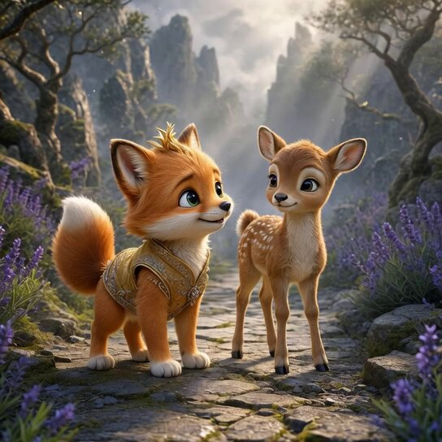

**Prompt**

```text
Ilustração fantástica e caprichosa em CGI 3D de uma adorável cria de raposa e uma dócil cria de veado juntas num caminho de pedra rachada numa paisagem rochosa e nevoenta. A fofa cria de raposa tem uma pelagem laranja vibrante com detalhes brancos, cauda espessa, enormes olhos esmeralda brilhantes, tufos dourados espetados na cabeça e um colete dourado com bordados ornamentados. Olha para o pequeno veado, que tem uma pelagem castanha-clara suave com manchas brancas, grandes olhos expressivos e uma expressão doce. Um nevoeiro denso, escarpas rochosas escuras, árvores nodosas e exuberantes flores de alfazema roxa rodeiam-nos. Iluminação volumétrica suave, texturas detalhadas de pelagem, ricos tons de terra com roxos vívidos, profundidade cinematográfica e uma atmosfera encantadora e calorosa.
```

[↑ Voltar às categorias](#catalog)

---

<a name="prompt-2097514564875104516"></a>

### Cria-me um bastidor de servidores para 6 Nvidia Sparks com um design eficiente e esteticamente agradável.

Autor：[@VKs\_Host](https://x.com/VKs_Host) · [Publicação original](https://x.com/VKs_Host/status/2097514564875104516)

Renderização 3D · Publicado

**Resumo:** Cria-me um bastidor de servidores para 6 Nvidia Sparks com um design eficiente e esteticamente agradável.


**Prompt**

```text
Cria-me um bastidor de servidores para 6 Nvidia Sparks com um design eficiente e esteticamente agradável.
```

[↑ Voltar às categorias](#catalog)

---

<a name="category-retro-vintage"></a>

## Retrô / Vintage

<a name="prompt-2097892340165992619"></a>

### Instrução para retrato retro em estilo de película Kodak dos anos 1980, incluindo camisa cor-de-rosa, saia preta de cintura subida, caracóis retro e cenário de quarto.

Autor：[@MissDelulu9](https://x.com/MissDelulu9) · [Publicação original](https://x.com/MissDelulu9/status/2097892340165992619)

Retrô / Vintage · Retrato / Selfie · Publicado

**Resumo:** Instrução para retrato retro em estilo de película Kodak dos anos 1980, incluindo camisa cor-de-rosa, saia preta de cintura subida, caracóis retro e cenário de quarto.

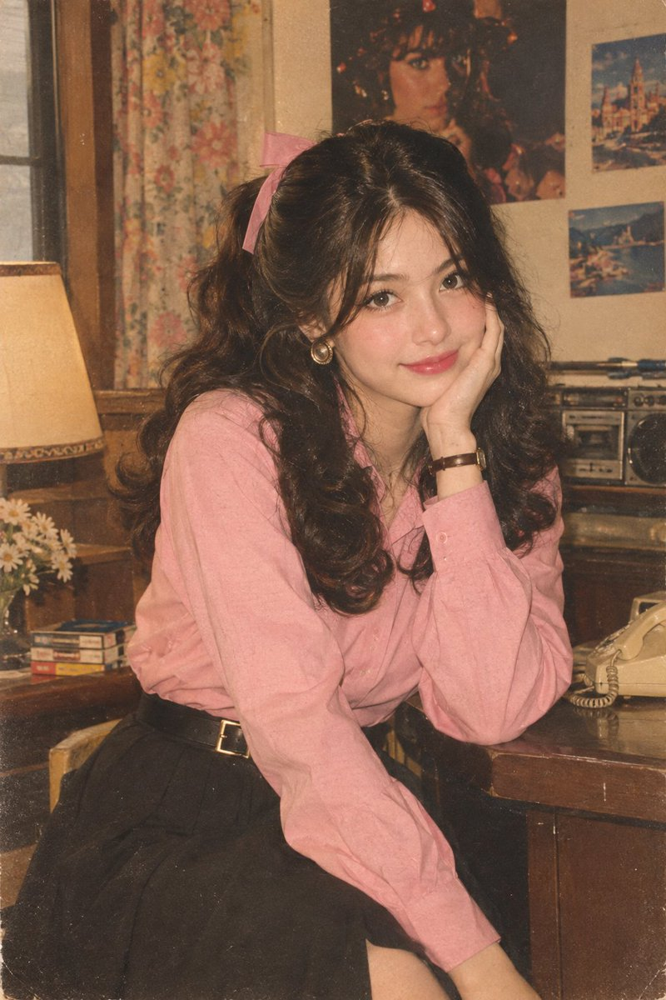

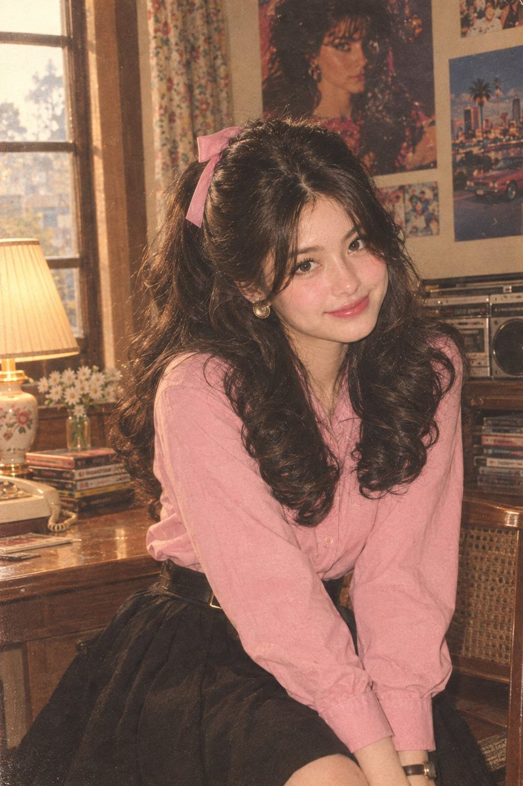

**Prompt**

```text
Transforme a minha foto num autêntico retrato de moda indiana retro dos anos 1980, inspirado na imagem de referência.

Mantenha o rosto exato, os traços faciais, a estrutura do rosto, o tom de pele, a identidade e as proporções naturais inalterados. Não altere nem embeleze o rosto.

Vista-a com uma camisa cor-de-rosa de mangas compridas cuidadosamente metida numa saia preta de cintura subida com um cinto elegante. Remova o lenço por completo. Adicione acessórios simples inspirados nos anos 1980. Dê-lhe um cabelo retro volumoso e solto, penteado com um laço bonito.

Crie um fundo e uma atmosfera autênticos dos anos 1980. Use um aspeto de câmara de filme Kodak com cores quentes e desbotadas, grão de filme subtil, textura analógica suave, iluminação vintage suave e textura de pele natural. Faça com que pareça uma fotografia genuína tirada nos anos 1980, e não uma foto moderna com um filtro vintage. Sem marcas de água, sem texto, sem distorção.
```

[↑ Voltar às categorias](#catalog)

---

<a name="prompt-2097852814341128610"></a>

### Tradução em curso

Autor：[@DDJCXX](https://x.com/DDJCXX) · [Publicação original](https://x.com/DDJCXX/status/2097852814341128610)

Fotografia · Retrô / Vintage · Retrato / Selfie · Personagem · Item de Moda · Publicado

**Resumo:** Tradução em curso

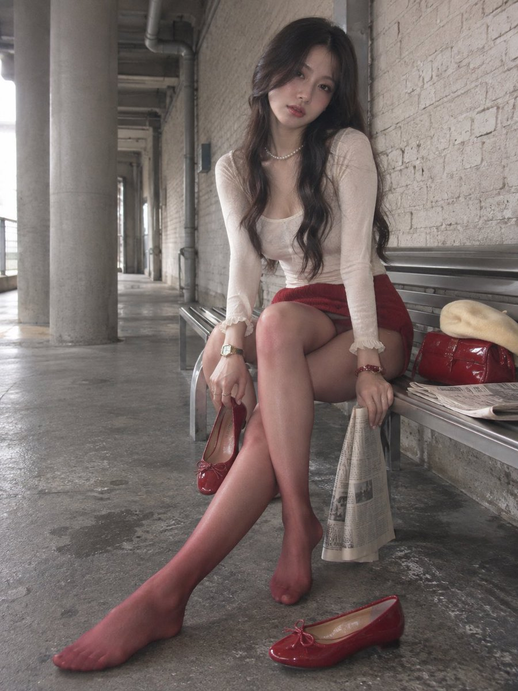

**Prompt**

```text
Tradução em curso
```

[↑ Voltar às categorias](#catalog)

---

<a name="prompt-2097886466710085695"></a>

### Tradução em curso

Autor：[@oneviske](https://x.com/oneviske) · [Publicação original](https://x.com/oneviske/status/2097886466710085695)

Fotografia · Retrô / Vintage · Retrato / Selfie · Personagem · Item de Moda · Paisagem urbana / Rua · Publicado

**Resumo:** Tradução em curso

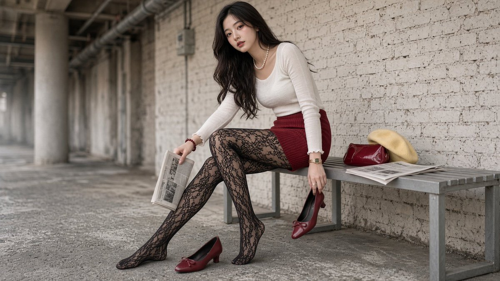

**Prompt**

```text
Tradução em curso
```

[↑ Voltar às categorias](#catalog)

---

<a name="prompt-2096936643173216486"></a>

### Prompt para transformar uma fotografia de referência num retrato retro fotorrealista de 1985 com moda autêntica dos anos 80, cabelo ripado e estética de película de 35 mm.

Autor：[@SalaheldinNehal](https://x.com/SalaheldinNehal) · [Publicação original](https://x.com/SalaheldinNehal/status/2096936643173216486)

Fotografia · Retrô / Vintage · Retrato / Selfie · Item de Moda · Publicado

**Resumo:** Prompt para transformar uma fotografia de referência num retrato retro fotorrealista de 1985 com moda autêntica dos anos 80, cabelo ripado e estética de película de 35 mm.

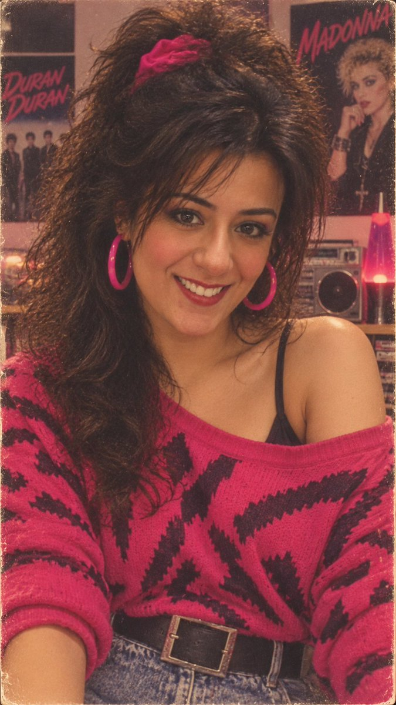

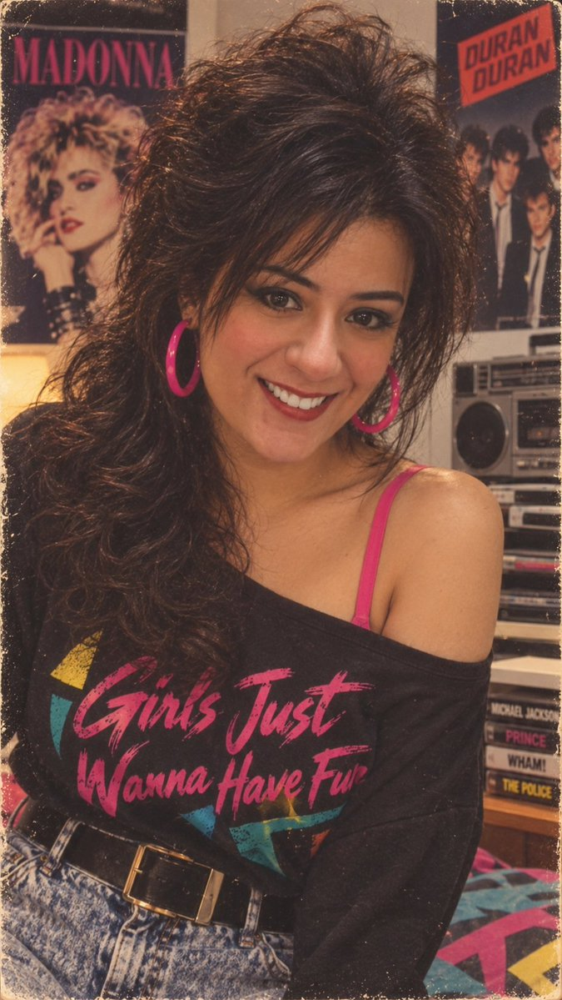

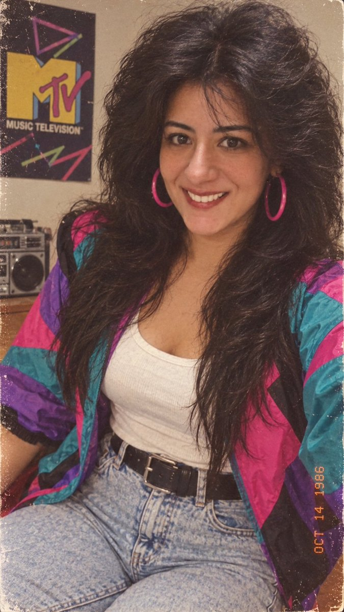

**Prompt**

```text
Como teria sido o meu aspeto nos anos 1980? Usa a fotografia em anexo como referência. Preserva os meus traços faciais exatos, sorriso, tom de pele, formato dos olhos e identidade geral. Muda o meu estilo como se vivesse em 1985, com tendências autênticas de moda e beleza dos anos 1980: cabelo ripado e volumoso, maquilhagem arrojada nos olhos, blush rosado, batom mate, brincos de argola grandes, um casaco de ganga acid-wash, um top néon vibrante, calças de ganga de cintura subida e acessórios clássicos dos anos 1980. Coloca-me num cenário realista dos anos 1980 com pósteres retro, um leitor de cassetes, discos de vinil e uma iluminação quente estilo película. Faz com que pareça uma fotografia autêntica de 35 mm de alta qualidade de meados dos anos 1980, com grão de filme subtil e tons de cor vintage. A imagem deve ser fotorrealista e manter uma forte semelhança comigo — não uma pessoa genérica dos anos 1980.
```

[↑ Voltar às categorias](#catalog)

---

<a name="category-cyberpunk-sci-fi"></a>

## Cyberpunk / Ficção Científica

<a name="prompt-2097951816675639459"></a>

### Uma cena de documentário de 15 segundos do início dos anos 2000 em que um repórter entrevista um extraterrestre perto de uma nave espacial aterrada, e o extraterrestre revela que veio à Terra para utilizar um cupão da McDonald's.

Autor：[@DtheW1995](https://x.com/DtheW1995) · [Publicação original](https://x.com/DtheW1995/status/2097951816675639459)

Cyberpunk / Ficção Científica · Publicado

**Resumo:** Uma cena de documentário de 15 segundos do início dos anos 2000 em que um repórter entrevista um extraterrestre perto de uma nave espacial aterrada, e o extraterrestre revela que veio à Terra para utilizar um cupão da McDonald's.

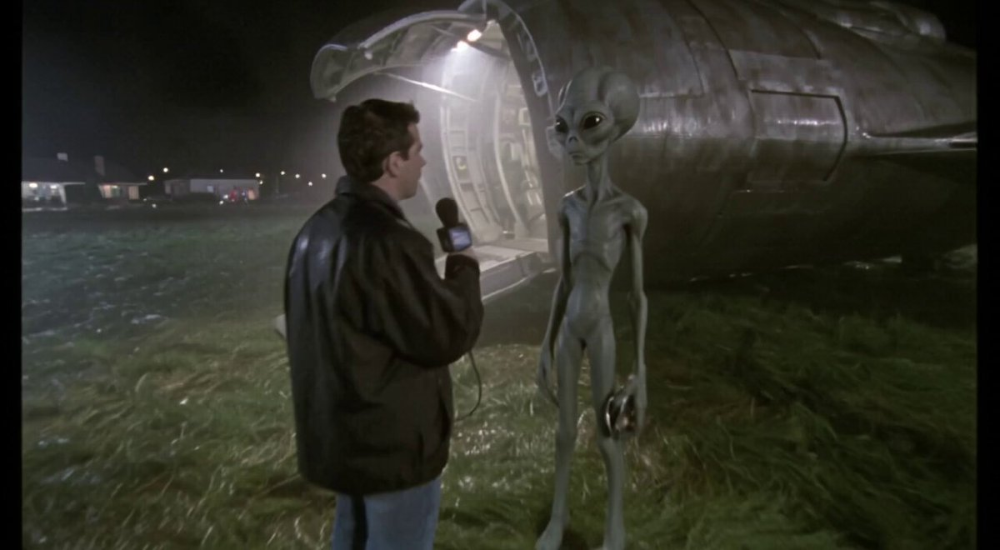

**Prompt**

```text
Imagens de documentário de televisão ultrarrealistas de 15 segundos do início dos anos 2000, filmadas com uma câmara MiniDV de consumo por um operador de câmara fisicamente presente. Noite num campo húmido nos arredores de uma pequena localidade norte-americana. Uma grande nave espacial alienígena metálica e autêntica acabou de aterrar atrás dos sujeitos, assentando pesadamente na relva molhada e achatada; a sua rampa está aberta, uma luz interior ténue espalha-se pelo nevoeiro, a condensação escorre do casco e ouve-se um zumbido mecânico grave. Sem qualquer polimento cinematográfico: enquadramento trémulo ao ombro, zoom imperfeito, focagem automática lenta, oscilação de exposição perto de luzes brilhantes, cores desbotadas, movimento entrelaçado típico de DV, ligeiro ruído de fita e artefactos de compressão. 0.0–2.0s — GANCHO: Começa já a meio da extraordinária entrevista. Um repórter de televisão nervoso está ao lado de um extraterrestre alto, magro, mas biologicamente credível, diretamente em frente à nave espacial. O repórter estende um microfone de reportagem com fios na direção dele, enquanto a câmara faz um zoom rápido da nave brilhante para o rosto detalhado do extraterrestre. O extraterrestre tem pele cinzenta húmida e texturada, respiração subtil, olhos negros que piscam e peso natural; não é um fato nem é caricatural. 2.0–5.5s: Num único plano-sequência com câmara à mão, o repórter olha para o extraterrestre e pergunta com seriedade em inglês: “Why did you come to Earth? What are you looking for?” A sua entoação é cautelosa e profissional. O operador de câmara perde brevemente a focagem ao reenquadrar ambos os rostos, corrigindo-a de seguida. O extraterrestre reflete silenciosamente sobre a pergunta durante um segundo constrangedor enquanto a nave zumbe atrás de si. 5.5–11.5s — REMATE SÉRIO (DEADPAN): O extraterrestre enfia lentamente a mão numa pequena bolsa metálica presa ao corpo e retira um cupão de papel ligeiramente amarrotado. Segura o cupão entre dois dedos longos e responde num inglês calmo e perfeitamente inteligível, com uma voz estranha e seca: “I came to redeem this coupon. Twenty-piece Chicken McNuggets, with sweet-and-sour sauce. At McDonald’s.” O seu rosto permanece completamente sério. O movimento da boca corresponde exclusivamente ao diálogo do extraterrestre. 11.5–15.0s — DESFECHO: O repórter baixa ligeiramente o microfone e olha fixamente para o extraterrestre em total incredulidade. A câmara efetua um zoom acidental e desajeitado sobre o cupão, regressando depois ao rosto confuso do repórter. O extraterrestre aponta com naturalidade na direção da localidade distante como quem pede direções. O operador de câmara tenta suprimir um riso abafado. O repórter finalmente murmura: “Right … okay.” Corte abrupto e autêntico em estilo de fita magnética. ÁUDIO: diálogo de estúdio exterior limpo em inglês, mas com qualidade imperfeita de microfone do início dos anos 2000, vento fraco, relva molhada sob os sapatos, insetos distantes, ventilação da nave espacial e zumbido elétrico. Sem música, narração, efeitos sonoros de trailer ou risos gravados. O humor provém inteiramente do tom sério documental e da resposta absurdamente banal. CONTINUIDADE / NEGATIVOS: apenas um repórter, um extraterrestre, um operador de câmara e uma nave espacial; posição de câmara contínua e exequível; sem ângulos de câmara impossíveis, pessoas ou extraterrestres duplicados, morphing, flutuação, teletransporte, CGI estilo desenho animado, olhos mágicos brilhantes, agressividade, armas, multidões, legendas, texto no ecrã, alteração do cupão ou alteração do microfone.
```

[↑ Voltar às categorias](#catalog)

---

<a name="category-minimalism"></a>

## Minimalismo

<a name="prompt-2097872057157783561"></a>

### Tradução em curso

Autor：[@DDJCXX](https://x.com/DDJCXX) · [Publicação original](https://x.com/DDJCXX/status/2097872057157783561)

Fotografia · Minimalismo · Personagem · Item de Moda · Publicado

**Resumo:** Tradução em curso

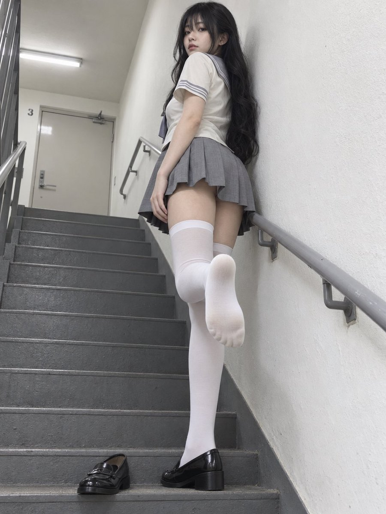

**Prompt**

```text
Tradução em curso
```

[↑ Voltar às categorias](#catalog)

---

<a name="category-other"></a>

## Outros

<a name="prompt-2098287896872567292"></a>

### Lago Ontário

Autor：[@jrwimaging](https://x.com/jrwimaging) · [Publicação original](https://x.com/jrwimaging/status/2098287896872567292)

Paisagem / Natureza · Publicado

**Resumo:** Lago Ontário

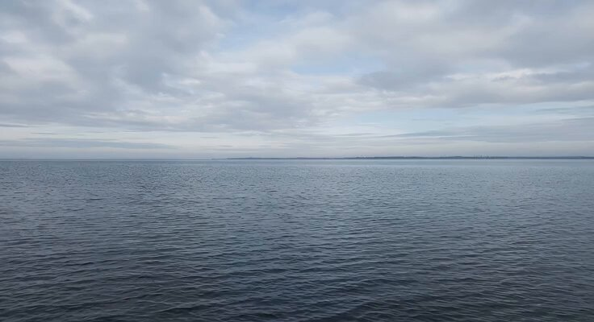

**Prompt**

```text
Lago Ontário
```

[↑ Voltar às categorias](#catalog)

---

<a name="prompt-2098266045597519916"></a>

### Este prompt é utilizado para gerar um instantâneo de uma mulher de estilo tradicional na atmosfera do mercado noturno de Chang'an na dinastia Tang, recorrendo a grande-angular, perspetiva inclinada, flash duro direto na câmara e contraste de luz fria e quente, retratando uma mulher distinta em hanfu a olhar para trás sacudindo a manga.

Autor：[@Soranlan](https://x.com/Soranlan) · [Publicação original](https://x.com/Soranlan/status/2098266045597519916)

Retrato / Selfie · Personagem · Resumo / Contexto · Publicado

Publicação original：[@Soranlan](https://x.com/Soranlan) · [Publicação original](https://x.com/Soranlan/status/2098258401344229596)

**Resumo:** Este prompt é utilizado para gerar um instantâneo de uma mulher de estilo tradicional na atmosfera do mercado noturno de Chang'an na dinastia Tang, recorrendo a grande-angular, perspetiva inclinada, flash duro direto na câmara e contraste de luz fria e quente, retratando uma mulher distinta em hanfu a olhar para trás sacudindo a manga.

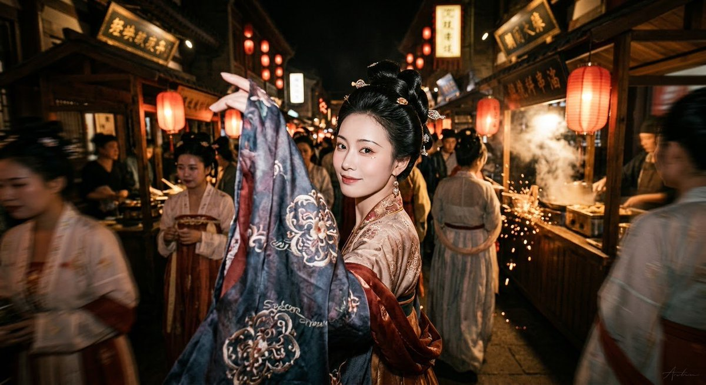

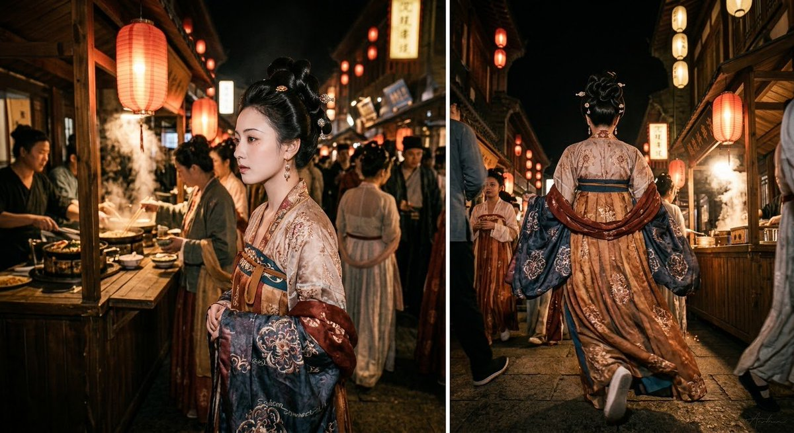

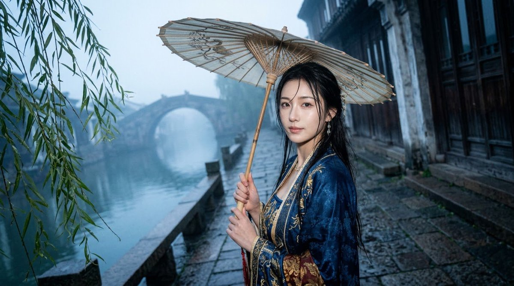

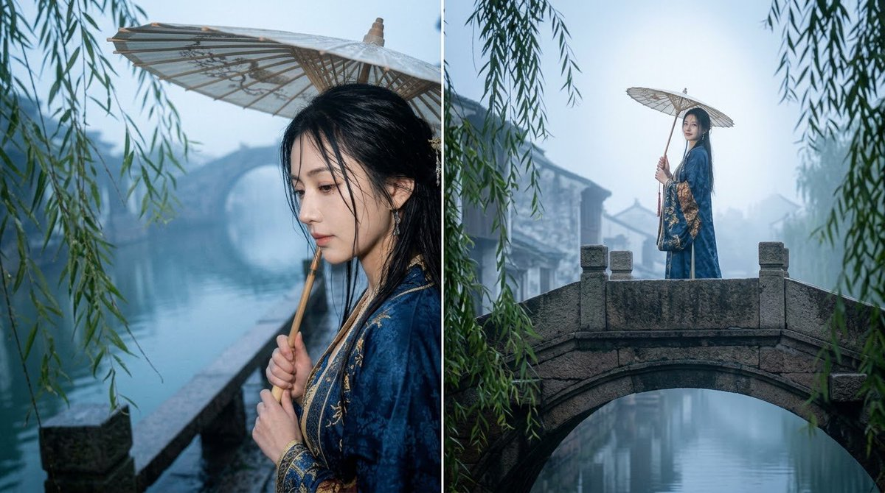

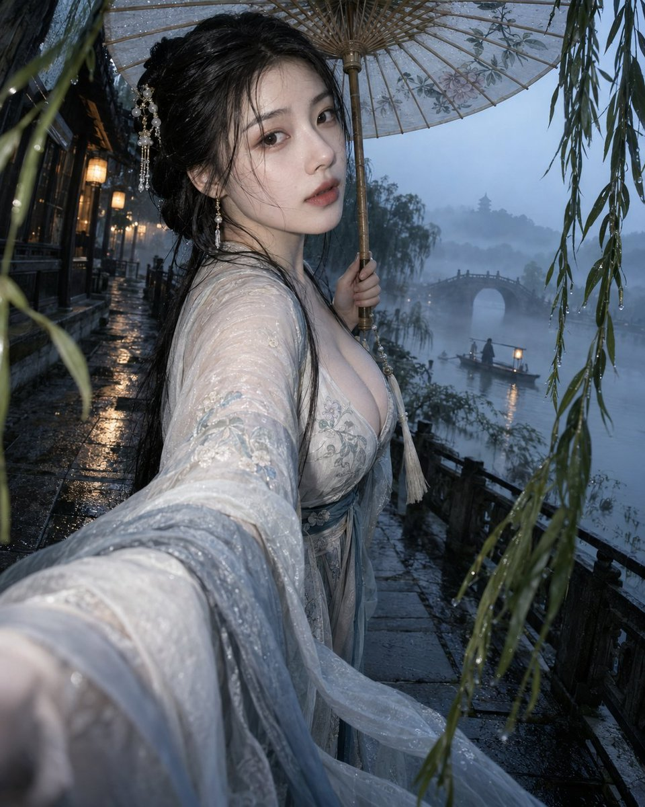

**Prompt**

```text
perspetiva aproximada ultra grande-angular (14~20mm), perspetiva exagerada, inclinação holandesa a 15°, ligeira distorção em barril, estética de fotografia instantânea à mão livre, forte profundidade: sujeito nítido, camadas de fundo profundas, distância do sujeito de 0,5 m, flash duro direto na câmara, brilhos intensos nos olhos (catchlights), ambiente subexposto em 1~2 stops, quebra de flash, reflexos especulares na pele/joias, aspeto de instantâneo com flash de obturação rápida, detalhe de alta frequência, grão de película médio, halação + microcontraste, aberração cromática subtil, movimento impulsionado pelo vento nas margens, estética da China Antiga da dinastia Tang, mercado noturno movimentado, mulher do Leste Asiático, traços faciais delicados e refinados, olhos grandes e expressivos, boca pequena de cereja, figura extremamente voluptuosa, busto grande e exagerado, padrão estético extremamente elevado, estrutura óssea impecável, qualidade de pele de porcelana, estatuto elevado, silhueta limpa, materiais de qualidade superior, elevado valor de produção, a olhar para trás por cima do ombro com um sorriso brincalhão e sedutor, a caminhar rapidamente pela multidão densa, uma mão a levantar uma manga de seda intricadamente tecida roçando perto da lente, rua movimentada de Chang'an, lanternas de papel vermelho incandescentes, peões com desfoque de movimento em hanfu tradicional, faíscas a voar dos vendedores de rua, atmosfera densa e vibrante, flash duro frio no sujeito em primeiro plano versus luzes práticas quentes no fundo, elemento 'Soran' subtil naturalmente integrado no bordado do tecido de seda, assinatura estética ténue, fusão orgânica, composição harmoniosa, não intrusivo, quase invisível.
```

[↑ Voltar às categorias](#catalog)

---

<a name="prompt-2098260186737901631"></a>

### Prompt de vídeo macro relaxante de uma mão humana a construir passo a passo uma casinha de alvenaria num estaleiro em miniatura.

Autor：[@Mud01185127](https://x.com/Mud01185127) · [Publicação original](https://x.com/Mud01185127/status/2098260186737901631)

Outros · Publicado

**Resumo:** Prompt de vídeo macro relaxante de uma mão humana a construir passo a passo uma casinha de alvenaria num estaleiro em miniatura.

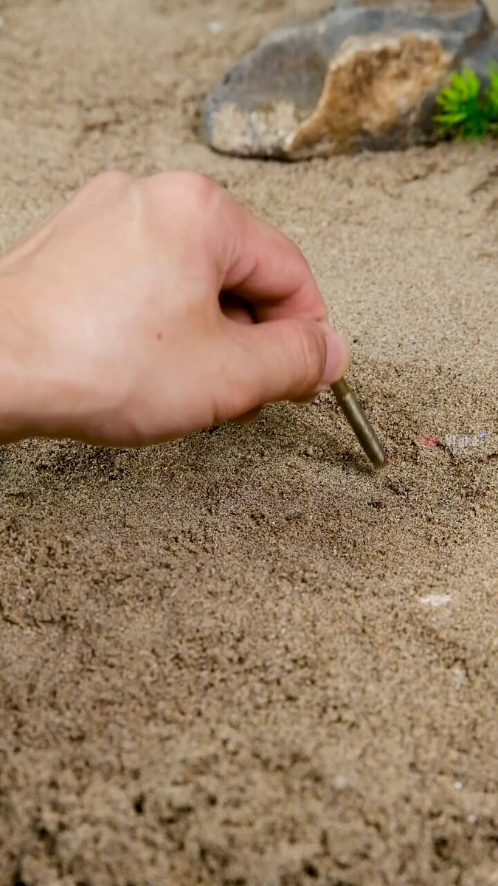

**Prompt**

```text
Crie uma cena de construção em miniatura cinematográfica e hiper-realista, onde uma mão humana gigante constrói cuidadosamente uma pequena estrutura de tijolos num estaleiro de obras em miniatura. Mostre pequenos tijolos detalhados, cimento realista, ferramentas, chão arenoso, texturas naturais, profundidade de campo reduzida, fotografia macro, movimentos de câmara suaves, iluminação realista e uma construção passo a passo gratificante. Ultradetalhado, fotorrealista, 4K, vertical 9:16, continuidade visual perfeita.
```

[↑ Voltar às categorias](#catalog)

---

<a name="prompt-2098249488150532562"></a>

### Um prompt que detalha um body sem mangas azul e vermelho inspirado em teias de aranha com aberturas e mangas a combinar.

Autor：[@AI\_money\_club](https://x.com/AI_money_club) · [Publicação original](https://x.com/AI_money_club/status/2098249488150532562)

Item de Moda · Publicado

**Resumo:** Um prompt que detalha um body sem mangas azul e vermelho inspirado em teias de aranha com aberturas e mangas a combinar.

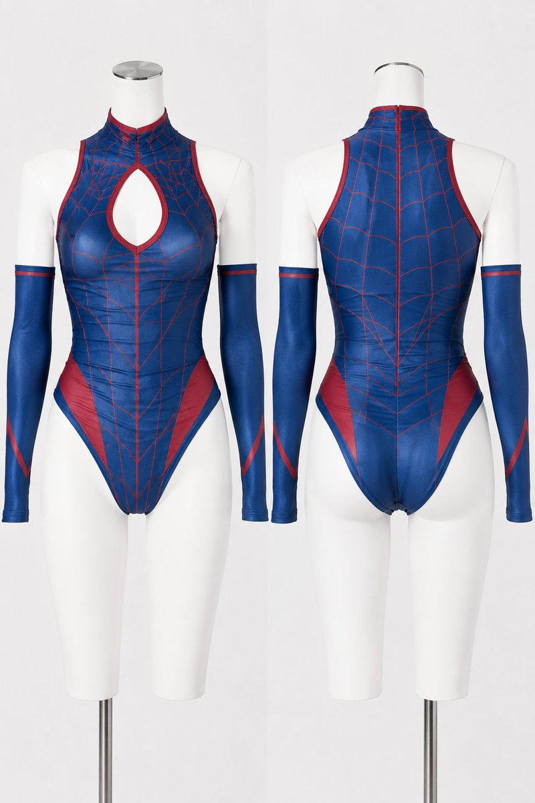

**Prompt**

```text
Um body justo sem mangas azul e vermelho inspirado em teias de aranha com um design elegante de estilo super-herói. O corpo principal é azul-real profundo com finas linhas vermelhas em padrão de teia que se estendem pelo peito, tronco, cintura e abdómen. Apresenta uma gola alta falsa e uma abertura proeminente em forma de lágrima no peito, debruada com um remate vermelho espesso.

O body tem uma silhueta atlética e justa com cavas subidas nas pernas e painéis laterais geométricos contrastantes em vermelho-escuro à volta das ancas e da cintura baixa. O tecido azul tem um acabamento elástico liso, ligeiramente acetinado, com tensão realista e dobras naturais subtis.

Mangotes compridos azuis destacáveis a combinar estendem-se da parte superior dos braços até aos pulsos, deixando os ombros a descoberto. Cada manga apresenta detalhes lineares vermelhos finos e apontamentos angulares vermelhos marcantes junto aos antebraços.

Preserve as características exatas do design: base azul-real profunda, padrão de linhas finas em estilo de teia de aranha vermelha, gola alta falsa, recorte em forma de lágrima debruado a vermelho no peito, construção sem mangas com ombros a descoberto, silhueta justa de body de peça única, painéis geométricos vermelhos nas ancas e mangas compridas soltas azuis a combinar com detalhes vermelhos.
```

[↑ Voltar às categorias](#catalog)

---

<a name="prompt-2097915123516215548"></a>

### Sequência de vídeo macro tilt-shift em miniatura que mostra minúsculos agricultores auxiliados por uma mão humana gigante em quatro cenas agrícolas.

Autor：[@EthanAIBuilder](https://x.com/EthanAIBuilder) · [Publicação original](https://x.com/EthanAIBuilder/status/2097915123516215548)

Outros · Publicado

**Resumo:** Sequência de vídeo macro tilt-shift em miniatura que mostra minúsculos agricultores auxiliados por uma mão humana gigante em quatro cenas agrícolas.

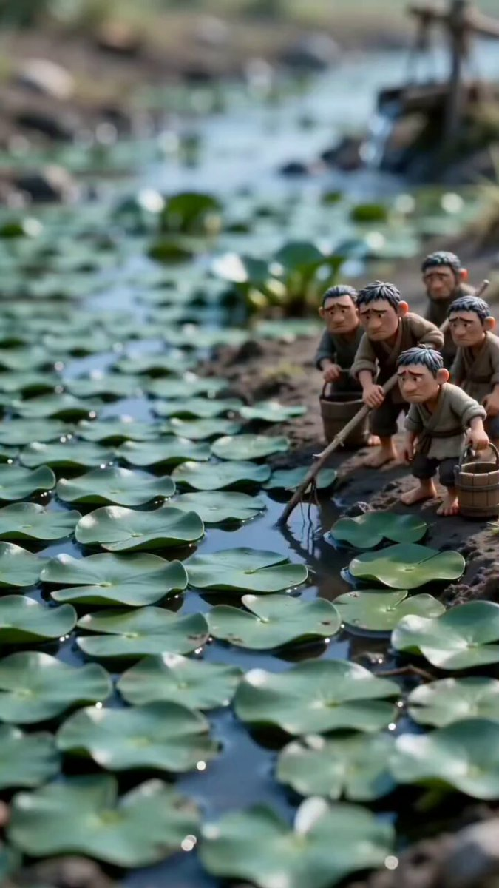

**Prompt**

```text
Uma sequência de vídeo de fotografia macro tilt-shift hiper-realista de um minúsculo mundo em miniatura. O vídeo apresenta pequenos agricultores em miniatura com roupas de trabalho tradicionais asiáticas a interagir com elementos gigantes da natureza. 
Cena 1: Minúsculos agricultores a trabalhar junto a um ribeiro em miniatura com nenúfares; uma mão humana gigante mergulha, erguendo um nenúfar com raízes a gotejar enquanto a água corre suavemente. 
Cena 2: Agricultores em miniatura com dificuldades numa bomba de água vintage enferrujada num jardim; uma mão humana gigante empurra a alavanca, fazendo a água jorrar para um balde minúsculo enquanto eles festejam. 
Cena 3: Agricultores em miniatura com chapéus de palha cónicos a selecionar grãos dourados num campo sob um céu escuro de tempestade quando começa a chover; uma mão humana gigante coloca rapidamente uma minúscula tenda de lona sobre eles para proteger a colheita. 
Cena 4: Minúsculos agricultores a trabalhar com ferramentas de jardinagem em miniatura numa folha gigante de vegetal verde com um grande caracol de jardim; uma mão humana gigante levanta delicadamente o caracol e coloca uma cerca de madeira minúscula em redor das colheitas. 
Profundidade de campo cinematográfica, resolução 8k, estética stop-motion combinada com estilo de diorama fotorrealista em miniatura, movimento suave e fluido --ar 9:16
```

[↑ Voltar às categorias](#catalog)

---

<a name="prompt-2097935645037793537"></a>

### Prompt de retrato de outono de corpo inteiro em bosque com bloqueio de rosto, pose agachada detalhada, blusão de cabedal, boina e contraluz quente.

Autor：[@oye\_samia](https://x.com/oye_samia) · [Publicação original](https://x.com/oye_samia/status/2097935645037793537)

Retrato / Selfie · Publicado

**Resumo:** Prompt de retrato de outono de corpo inteiro em bosque com bloqueio de rosto, pose agachada detalhada, blusão de cabedal, boina e contraluz quente.

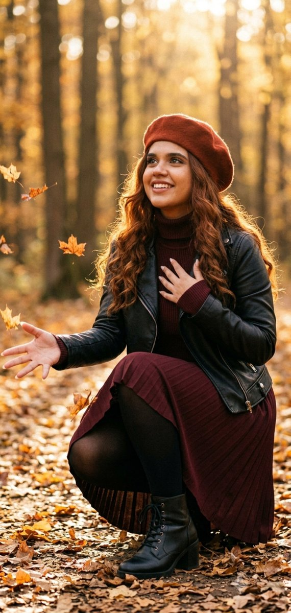

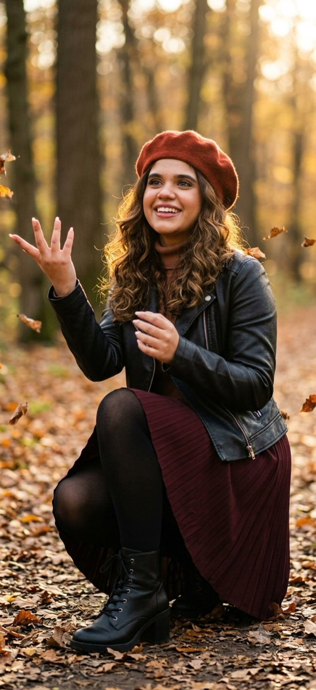

**Prompt**

```text
**Referência de IDENTIDADE FACIAL. PRIORIDADE ABSOLUTA — BLOQUEIO DE IDENTIDADE FACIAL 1:1.** Preservar a pessoa real EXACTA da imagem como um todo: identidade exacta, idade real, geometria facial, proporções, assimetria natural, formato/cor exactos dos olhos e cor BASE exacta do cabelo DA Imagem. ZERO reconstrução facial, embelezamento, adelgaçamento, correcção de simetria ou rosto genérico de IA.

**CENA — BLOQUEIO ESTRITO.** Retrato vertical de corpo inteiro no outono num parque arborizado com chão coberto de folhas e folhas de ácer a flutuar. Mulher agachada no centro-direita baixo, sorriso aberto e natural, olhar levantado para a ESQUERDA DA IMAGEM. Bokeh âmbar da floresta; sol baixo na parte superior DIREITA DA IMAGEM.

**CÂMARA —** da boina às botas; joelho levantado grande no primeiro plano inferior, cabeça no terço superior. Câmara à altura da cintura sentada, ligeiramente à ESQUERDA DA IMAGEM, distância média-curta, suavemente para cima; perspectiva natural de 50–70mm. Joelho próximo/mão frontal moderadamente maiores; rosto sem distorções.

**POSE —** tronco erecto, bacia baixa/atrás, ombros 3/4 para a ESQUERDA DA IMAGEM, queixo erguido. Ombro DIREITO → cotovelo flectido → pulso relaxado → palma aberta virada para cima para a ESQUERDA DA IMAGEM, 5 dedos. Ombro ESQUERDO → cotovelo flectido → pulso → palma aberta virada para cima em direcção à câmara à altura do peito, 5 dedos. Joelho DIREITO mais próximo da objectiva, pé direito assente no centro inferior. Perna ESQUERDA dobrada mais abaixo/mais atrás, apoio principal. Mãos em planos de profundidade distintos.

**CABELO/PELE/MAQUILHAGEM —** ondas compridas e soltas sob a boina, mais volumosas, densas, sedosas, tridimensionais, raízes arejadas; cor BASE exacta da Imagem, ~10% mais fria. Pele HUMANA REAL visivelmente bronzeada de sol/dourada, luminosidade acetinada, brilho delicado, poros, microtextura, penugem, reflexos irregulares. Olhos vivos, húmidos, luminosos, HUMANOS; íris realista, linha d'água, pequenos brilhos nos olhos (catchlights). Sobrancelhas arranjadas, sombra esfumada cobre-borgonha, delineador limpo, pestanas MUITO COMPRIDAS, MUITO DENSAS, volumosas e separadas, contorno/bronzeador, iluminador controlado, lábios nude-rosados texturados, acabamento acetinado refinado.

**ROUPA —** boina de lã premium vermelho-ferrugem escuro; blusão de cabedal preto ajustado estilo motoqueiro, grão/costuras/fechos visíveis, reflexos controlados; minissaia encorpada bordô escuro; collants pretos finos; botins de cabedal preto com atacadores e salto grosso. Materiais tácteis premium.

**LUZ/PROFUNDIDADE —** contraluz dourada quente no canto superior DIREITO DA IMAGEM, preenchimento frontal suave, preenchimento negativo à ESQUERDA DA IMAGEM, luz de recorte no cabelo/boina. Folhas em primeiro plano → sujeito → troncos desfocados/bokeh âmbar; profundidade de campo (DOF) realista, separação atmosférica, grão orgânico fino; captado, não renderizado.

**SEM** desvio de identidade, olhos sem vida, cabelo espalmado, pele plástica, mãos defeituosas, dedos/membros extra, agachamento incorrecto, luz plana, CGI.
```

[↑ Voltar às categorias](#catalog)

---

<a name="prompt-2097896913269854538"></a>

### Dragões da lua carmesim numa cidade celestial

Autor：[@TheEerieHollows](https://x.com/TheEerieHollows) · [Publicação original](https://x.com/TheEerieHollows/status/2097896913269854538)

Outros · Publicado

**Resumo:** Dragões da lua carmesim numa cidade celestial

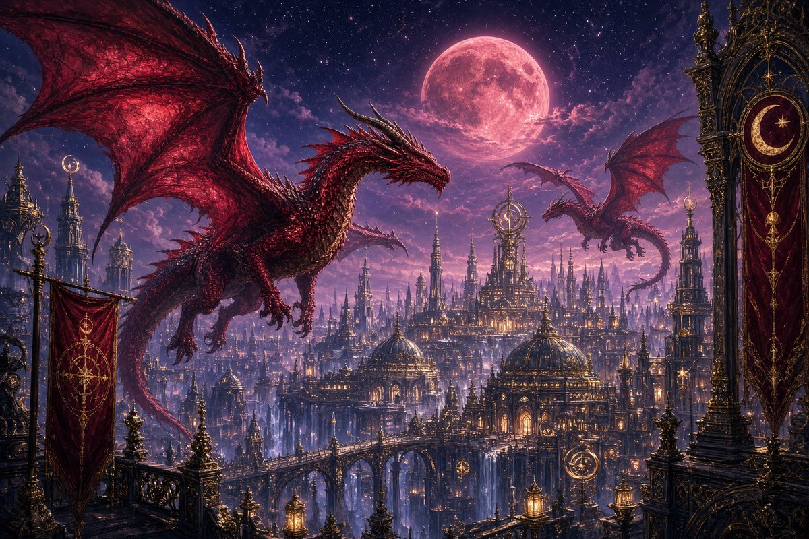

**Prompt**

```text
Dragões da lua carmesim numa cidade celestial
```

[↑ Voltar às categorias](#catalog)

---

<a name="prompt-2097852564029272236"></a>

### Retrato editorial de moda de uma jovem mulher japonesa numa camisola curta champanhe a segurar um café numa chaise bege numa cobertura moderna.

Autor：[@CityCatch\_Show](https://x.com/CityCatch_Show) · [Publicação original](https://x.com/CityCatch_Show/status/2097852564029272236)

Retrato / Selfie · Personagem · Comida / Bebida · Item de Moda · Arquitetura / Interiores · Publicado

**Resumo:** Retrato editorial de moda de uma jovem mulher japonesa numa camisola curta champanhe a segurar um café numa chaise bege numa cobertura moderna.

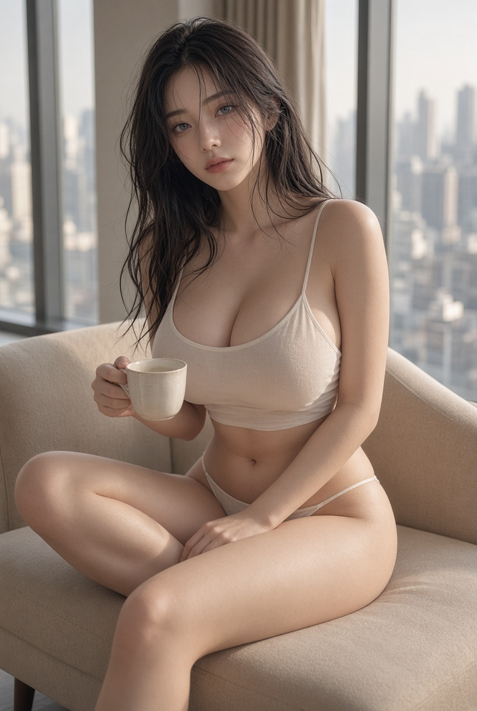

**Prompt**

```text
1. Sujeito e Ação
Uma deslumbrante mulher japonesa de 20 anos com pele luminosa e clara como porcelana, traços faciais delicados e refinados, olhos cinzento-azulados claros naturais, maquilhagem de alta-costura com acabamento orvalhado (dewy) e cabelos longos e escuros com uma beleza desgrenhada de quem acabou de acordar: despenteados pelo sono, com algumas madeixas a cair naturalmente sobre o rosto e ombros. Ela tem seios copa G extremamente voluptuosos e uma cintura impossivelmente minúscula e esbelta. Ela senta-se de pernas cruzadas numa chaise longue bege luxuosa. Veste uma camisola curta (crop camisole) de alças finas em tom champanhe, leve, sem forro e ligeiramente transparente, sem soutien e sem almofadado; o tecido assenta de forma lisa e plana sobre o peito, não apertado o suficiente para criar saliências evidentes. Através do tecido levemente translúcido, há apenas uma nuance tonal muito suave dos mamilos, um contorno subtil percecionado como uma sombra suave, nunca saliente. O top curto expõe completamente a sua cintura fina. Veste uma tanga a condizer de tiras finas. Uma mão segura uma chávena de café em cerâmica, a outra pousa na coxa. Expressão: contacto visual direto tímido e reservado com a câmara, boca suavemente fechada, elegância de topo e serenidade contida.
2. Cenário e Hora
Interior de uma cobertura moderna e luxuosa no início da manhã. Janelas grandes do chão ao teto com a linha do horizonte da cidade com desfoque suave. Chaise estofada bege, cortinas discretas, atmosfera requintada de suite de hotel.
3. Composição e Câmara
Orientação vertical, plano médio-longo (medium-full shot) a partir de um ângulo três quartos ligeiramente baixo. Ênfase no contraste entre o peito farto, a cintura minúscula exposta e as pernas cruzadas. Profundidade de campo reduzida, sujeito nítido, fundo suavemente desfocado.
4. Iluminação e Estilo
Luz natural da manhã vinda da janela: luz lateral suave e difusa com reflexos de sol realistas e brilhos quentes suaves na pele, no cabelo e no tecido ligeiramente transparente, para que o subtil contorno tonal se leia como uma sombra suave e não como uma saliência. Sem raios volumétricos artificiais, sem feixes densos de poeira em CGI. Editorial de alta-costura fotorrealista, ambiente requintado ao estilo de Ellen von Unwerth. Grão de película subtil e realista, paleta neutra e quente sofisticada.
5. Restrições
O tecido deve permanecer apenas ligeiramente transparente, não translúcido em excesso. Sem pele exposta do mamilo. Sem aréola claramente visível. Sem protuberâncias salientes, sem marcar a parte de cima, sem tecido de efeito molhado. O mamilo deve aparecer apenas como um contorno plano subtil ou sombra suave. Ambiente elegante de alta-costura, nunca vulgar. Qualidade fotorrealista de alta resolução.
```

[↑ Voltar às categorias](#catalog)

---

<a name="prompt-2097899194086297845"></a>

### Um prompt de storyboard sequencial de 15 segundos para um anúncio de perfume de luxo com um beco noturno de Paris, plano macro do produto, diálogo e efeitos dourados.

Autor：[@yourPlugAI](https://x.com/yourPlugAI) · [Publicação original](https://x.com/yourPlugAI/status/2097899194086297845)

Banda desenhada / Storyboard · Produto · Publicado

**Resumo:** Um prompt de storyboard sequencial de 15 segundos para um anúncio de perfume de luxo com um beco noturno de Paris, plano macro do produto, diálogo e efeitos dourados.

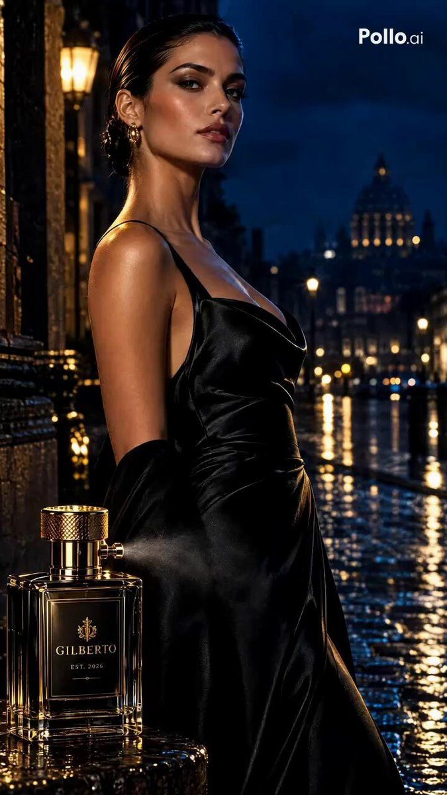

**Prompt**

```text
Prompt de Vídeo Sequencial de 15 Segundos

0 a 3 Segundos (O Gancho)
Visual: Plano de seguimento cinematográfico em contra-picado acompanhando a embaixadora do luxo a caminhar por um beco mal iluminado à meia-noite em Paris. O seu vestido de seda preta balança graciosamente enquanto as luzes ambientes da rua se refletem no pavimento molhado.
Ação: Ela vira a cabeça fluidamente em direção à câmara, estabelecendo um contacto visual intenso e confiante com um sorriso subtil e sedutor.
Som: Sub-graves profundos e ressonantes a crescer em acordes de sintetizador atmosférico de tempo lento, acompanhados pelo eco nítido de saltos a bater no pavimento.

3 a 6 Segundos (A Revelação do Produto)
Visual: Grande plano macro extremo de um elegante frasco de perfume de obsidiana escura na vertical. Pormenores em folha de ouro brilham no vidro, exibindo claramente a marca "GILBERTO" e "EST. 2026".
Ação: Uma fina névoa volumétrica de fragrância vaporiza suavemente a partir do bocal lateral, dispersando-se em partículas de pó dourado que rodopiam dramaticamente pelo ar em movimento ultranítido.
Som: Clique metálico nítido e hiperpreciso do bocal atomizador a vaporizar, seguido por um sussurro de ar suave e sedoso e um toque a ecoar.

6 a 9 Segundos (O Diálogo da Personagem)
Visual: Plano médio aproximado da mulher a levar o pulso em direção à clavícula, olhando suavemente para baixo para a névoa de fragrância que assenta na sua pele antes de olhar diretamente para a lente.
Ação: A sua expressão facial transforma-se numa confiança natural enquanto os seus lábios se movem para falar, mantendo o rosto perfeitamente estável e expressivo sem distorção.
Som: Voz-off límpida, quente e aveludada: "Own the night." Uma linha de baixo ambiente suave continua por baixo do diálogo falado.

9 a 12 Segundos (A Onda Sensorial)
Visual: Plano de transição em alta velocidade onde a escuridão da meia-noite se transforma em ondulações de ouro líquido que rodopiam em redor do frasco de obsidiana no ar.
Ação: Finos raios de luz dourada trespassam a escuridão, iluminando o tecido de seda que ondula suavemente em volta do frasco de perfume.
Som: Crescendo musical rico combinando cordas orquestrais com uma pulsação de graves profundos, criando uma atmosfera opulenta e surreal.

12 a 15 Segundos (O Encerramento da Marca)
Visual: Belo plano de destaque (hero shot) do frasco de perfume perfeitamente na vertical sobre um pedestal de mármore escuro com reflexos líquidos. A tipografia "GILBERTO" brilha com clareza sob um foco quente e direcionado.
Ação: A câmara recua lentamente enquanto uma névoa dourada subtil e elegante flutua suavemente em redor da base do frasco.
Som: Acorde musical profundo e quente a desvanecer suavemente, deixando uma ressonância acústica suave e persistente.
```

[↑ Voltar às categorias](#catalog)

---

<a name="prompt-2097873409120096663"></a>

### Panorama arquitetónico de uma cidade futurista surrealista dobrada e curvada como origami com um pôr do sol esplêndido.

Autor：[@bama\_angel4life](https://x.com/bama_angel4life) · [Publicação original](https://x.com/bama_angel4life/status/2097873409120096663)

Arquitetura / Interiores · Paisagem / Natureza · Paisagem urbana / Rua · Publicado

Publicação original：[@Gigi214TX](https://x.com/Gigi214TX) · [Publicação original](https://x.com/Gigi214TX/status/2097866046187467111)

**Resumo:** Panorama arquitetónico de uma cidade futurista surrealista dobrada e curvada como origami com um pôr do sol esplêndido.

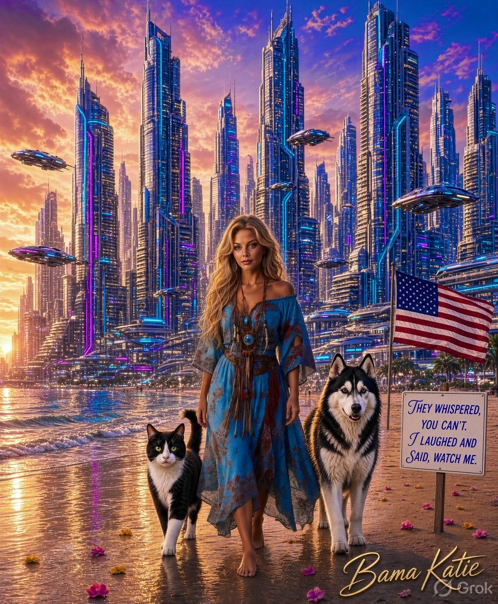

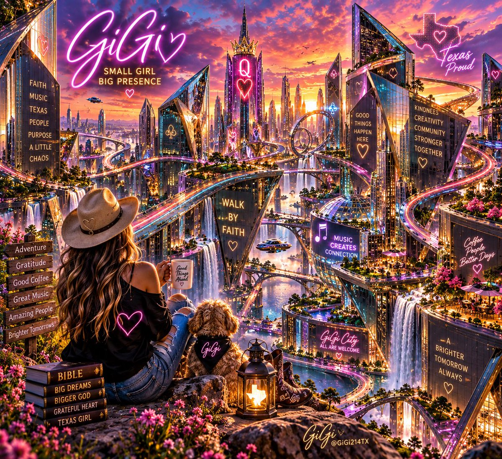

**Prompt**

```text
Uma cidade futurista inteira dobrada como origami, arranha-céus curvando-se para cima e depois dobrando-se para trás sob si mesmos, ruas continuando verticalmente pelas paredes, pontes retorcendo-se em laços, edifícios crescendo a partir de outros edifícios em ângulos impossíveis. Magenta elétrico, ciano, laranja, lima, cobalto e ouro metálico, janelas brilhantes, superfícies refletoras, pôr do sol brilhante, obra-prima arquitetónica surrealista, extrema profundidade e detalhe.
```

[↑ Voltar às categorias](#catalog)

---

<a name="prompt-2097853137080209799"></a>

### Cidade futurista torcida e dobrada como origami, contendo edifícios curvos, cores vibrantes e pôr do sol.

Autor：[@CoopandKCmom](https://x.com/CoopandKCmom) · [Publicação original](https://x.com/CoopandKCmom/status/2097853137080209799)

Paisagem / Natureza · Paisagem urbana / Rua · Publicado

**Resumo:** Cidade futurista torcida e dobrada como origami, contendo edifícios curvos, cores vibrantes e pôr do sol.

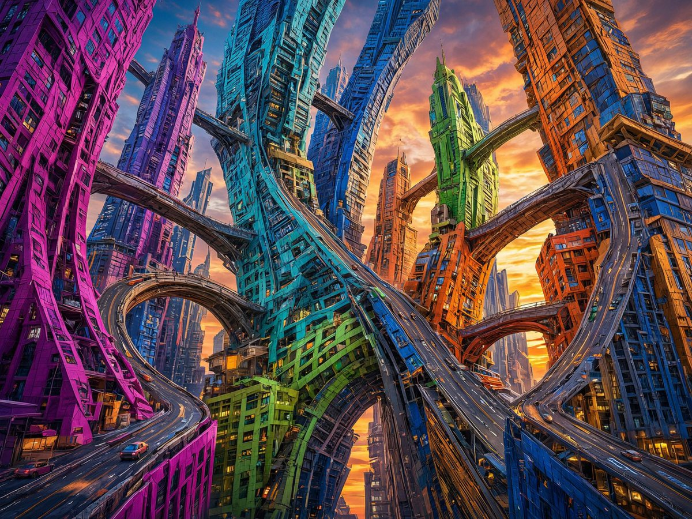

**Prompt**

```text
Uma cidade futurista inteira dobrada como origami, arranha-céus a curvar-se para cima e depois a dobrar-se para trás sob si mesmos, ruas a continuar verticalmente pelas paredes, pontes a torcer-se em laços, edifícios a crescer a partir de outros edifícios em ângulos impossíveis. Magenta elétrico, ciano, laranja, lima, cobalto e ouro metálico, janelas brilhantes, superfícies refletoras, pôr do sol brilhante, obra-prima arquitetónica surreal, extrema profundidade e detalhe.
```

[↑ Voltar às categorias](#catalog)

---

<a name="prompt-2097844559959245230"></a>

### Prompt de vídeo para transição contínua e gradual de indumentária durante dança de girl group, mudando sequencialmente e sem cortes top, saia, botas e acessórios nos pontos altos do movimento ao longo da linha temporal.

Autor：[@Adam38363368936](https://x.com/Adam38363368936) · [Publicação original](https://x.com/Adam38363368936/status/2097844559959245230)

Item de Moda · Publicado

Publicação original：[@Adam38363368936](https://x.com/Adam38363368936) · [Publicação original](https://x.com/Adam38363368936/status/2097483614011486260)

**Resumo:** Prompt de vídeo para transição contínua e gradual de indumentária durante dança de girl group, mudando sequencialmente e sem cortes top, saia, botas e acessórios nos pontos altos do movimento ao longo da linha temporal.

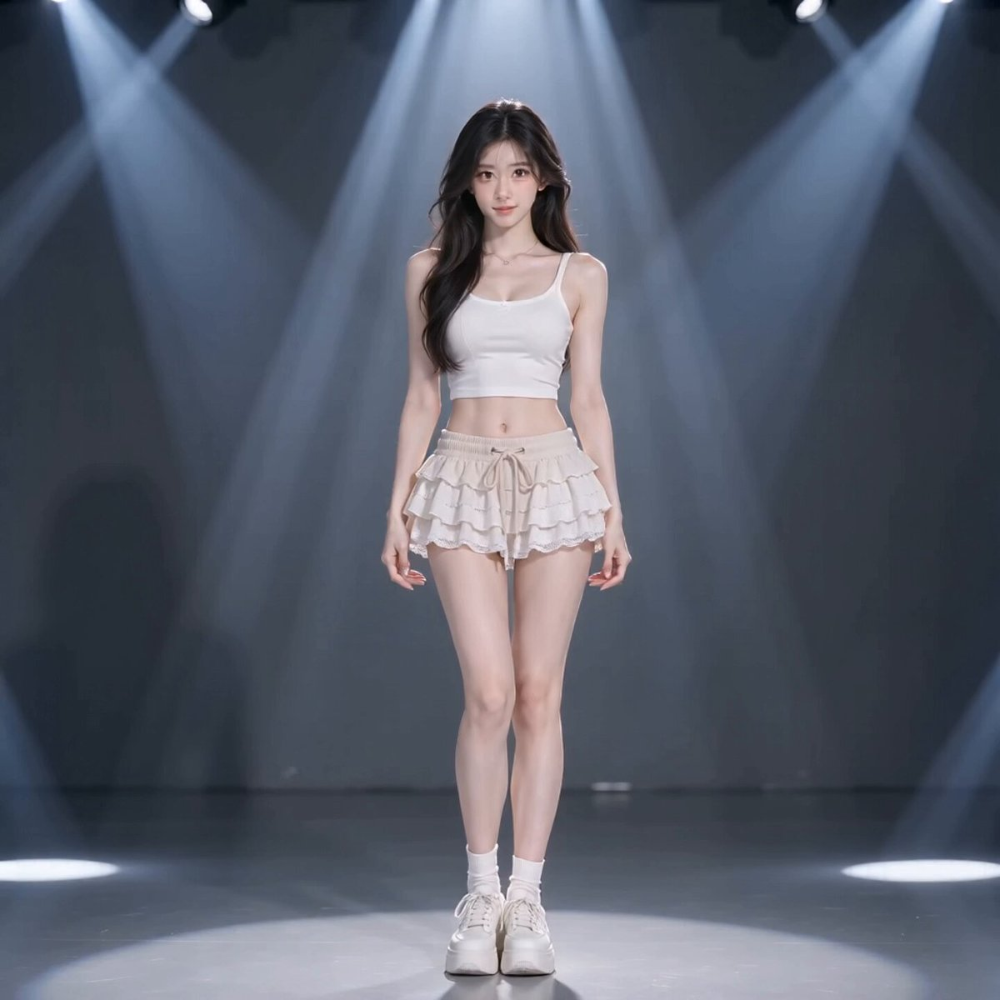

**Prompt**

```text
Com a mulher da imagem de referência como protagonista fixa, mantenha rigorosamente consistentes o formato do rosto, os traços faciais, o penteado, o tom de pele e as proporções corporais da personagem.

Formato vertical 9:16, 10 segundos. Uma jovem mulher asiática no centro de um palco minimalista e sofisticado, a realizar uma coreografia de girl group fluida e ritmada. O plano é predominantemente de corpo inteiro, acompanhando suavemente os movimentos da personagem, mantendo-a sempre no centro da imagem.

Efeito central: Enquanto dança continuamente, a personagem completa gradualmente uma mudança parcial de roupa através de diferentes passos de dança. Todo o processo da dança é contínuo, sem pausas, sem teletransporte e sem cortes de câmara.

No início, a personagem veste um top básico branco, saia curta de cor clara e sapatilhas brancas; um estilo geral simples e limpo.

0–2 segundos:
A personagem faz um movimento expressivo de balanço de braço.
O braço passa rapidamente pela frente do torso; no instante exato em que a oclusão do braço e a desfocagem de movimento são mais evidentes, a peça superior transforma-se naturalmente num top de palco preto, justo e curto.

Nesta fase, apenas a parte superior é mudada.
A parte inferior, o calçado, o penteado e o restante mantêm-se exatamente iguais.

2–4 segundos:
A personagem continua a dançar, com uma transição natural de movimentos, realizando um movimento nítido de rotação lateral de anca.
No instante exato em que o corpo gira rapidamente de lado, a parte inferior transforma-se naturalmente numa minisaia plissada preta.

Nesta fase, apenas a parte inferior é mudada.
A parte superior preta já transformada mantém-se inalterada e o calçado continua a ser sapatilhas brancas.

4–6 segundos:
A personagem continua a dançar e executa um pontapé nítido e leve.
O pé ergue-se rapidamente, gerando uma desfocagem de movimento natural; no momento em que o pé atinge o chão, as sapatilhas brancas transformam-se naturalmente em botas altas pretas.

Nesta fase, apenas o calçado é mudado.
A parte superior e a inferior mantêm o visual da fase anterior.

6–8 segundos:
A personagem continua a dançar, fazendo um movimento claro com a cabeça e erguendo as mãos.
O cabelo esvoaça naturalmente; no instante do movimento do cabelo e da oclusão das mãos, são adicionados brincos prateados, um colar, uma corrente de cintura e alguns acessórios de palco.

O vestuário principal mantém-se inalterado, adicionando-se apenas acessórios e escassos detalhes.

8–10 segundos:
A personagem realiza uma rotação fluida, fazendo a saia erguer-se naturalmente.
Durante a rotação, todo o coordenado passa por uma última e completa evolução.

Quando a personagem se volta a virar para a frente, apresenta finalmente um coordenado de palco completo em preto e prateado de alta qualidade, com detalhes de vestuário mais requintados, acrescentando toques metálicos, lantejoulas e elementos cénicos refinados.

A personagem conclui o último passo de dança, finalizando com naturalidade.

Todas as mudanças de roupa devem ocorrer nos instantes em que a amplitude do movimento é máxima, a rotação do corpo é mais rápida, ou a oclusão do braço, cabelo a voar e desfocagem de movimento são mais visíveis.

Antes e depois de cada mudança, a posição corporal da personagem, o sentido do movimento, a posição dos braços e pernas e a trajetória do movimento devem ser naturais e contínuos.

Foco primordial no efeito de "mudar de roupa gradualmente enquanto dança".

Não se trata de cortes abruptos entre vídeos diferentes, não é o desaparecimento e reaparecimento da personagem, nem a mudança de todo o vestuário em simultâneo a cada movimento.

De cada vez, apenas a parte especificada do vestuário é alterada, mantendo o restante intacto.

Sem explosões de luz, sem partículas mágicas, sem fumo a tapar, sem ecrãs pretos e sem cortes diretos de câmara.

Estilo fotográfico real em imagem real, estética de palco K-pop, iluminação cénica sofisticada, texturas de tecido realistas, desfocagem de movimento natural, detalhes de pele em alta definição, movimentos fluidos e ritmo marcado.

Proibida a troca de rosto, proibida a alteração dos traços faciais, proibida a alteração da identidade da personagem, proibidas variações súbitas de peso corporal, proibidos braços e pernas adicionais, proibida a deformação de mãos e pés, proibido vestuário a derreter, proibido o clipping de vestuário, proibidos saltos repentinos de posição da personagem e proibidas alterações aleatórias do cenário de fundo.
```

[↑ Voltar às categorias](#catalog)

---

<a name="prompt-2097779128275788112"></a>

### Tradução em curso

Autor：[@MoodLock\_JP](https://x.com/MoodLock_JP) · [Publicação original](https://x.com/MoodLock_JP/status/2097779128275788112)

Personagem · Item de Moda · Publicado

**Resumo:** Tradução em curso

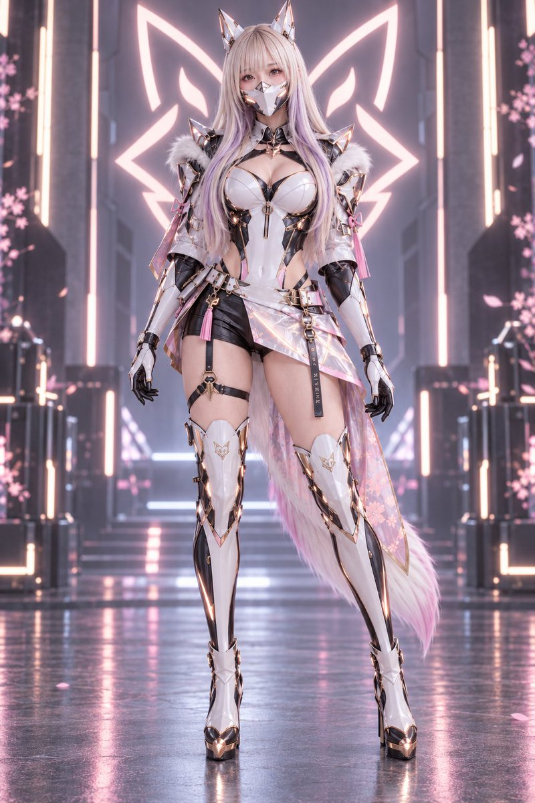

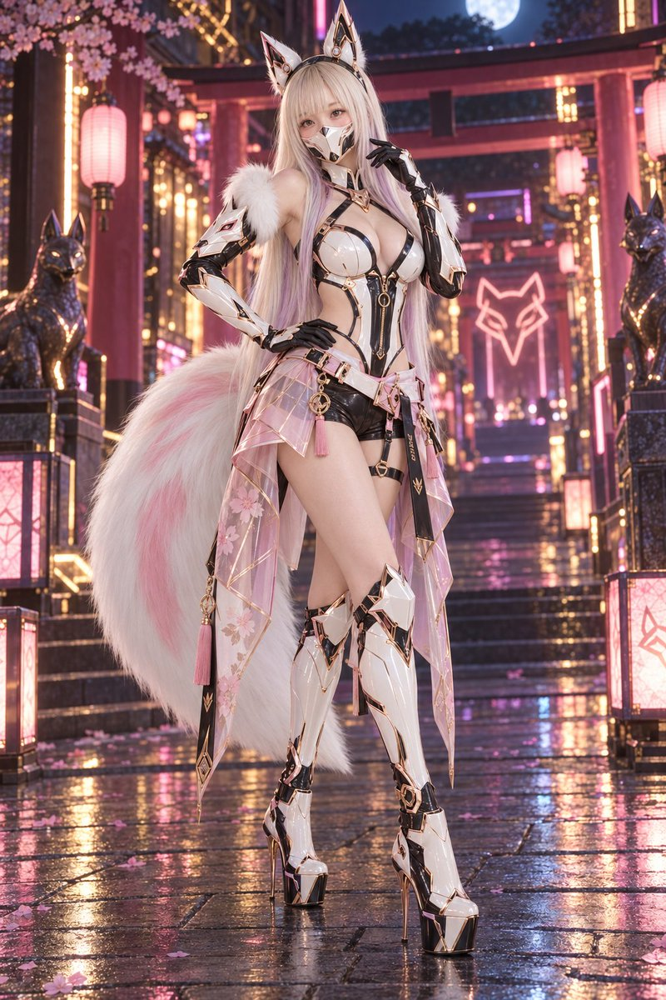

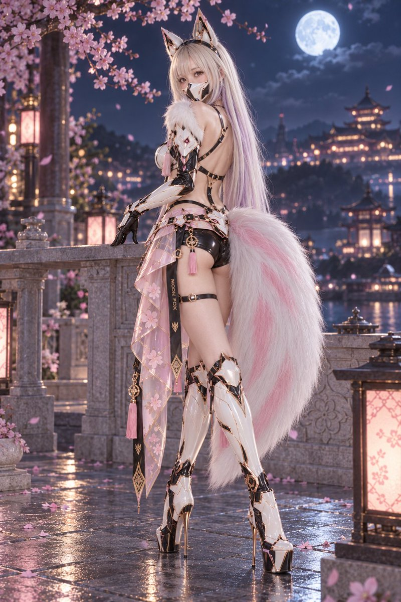

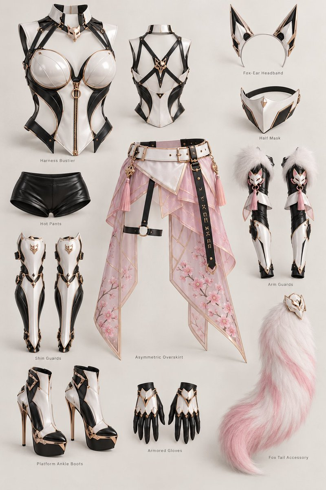

**Prompt**

```text
Tradução em curso
```

[↑ Voltar às categorias](#catalog)

---

<a name="prompt-2097756013583900701"></a>

### Um prompt para gerar diversos cortes de composição no estilo de videoclipe de Vocaloid como uma imagem em grelha 3x3 no formato 16:9, usando uma imagem de referência de personagem.

Autor：[@tetumemo](https://x.com/tetumemo) · [Publicação original](https://x.com/tetumemo/status/2097756013583900701)

Banda desenhada / Storyboard · Personagem · Publicado

Publicação original：[@8co28](https://x.com/8co28) · [Publicação original](https://x.com/8co28/status/2097412340274934097)

**Resumo:** Um prompt para gerar diversos cortes de composição no estilo de videoclipe de Vocaloid como uma imagem em grelha 3x3 no formato 16:9, usando uma imagem de referência de personagem.

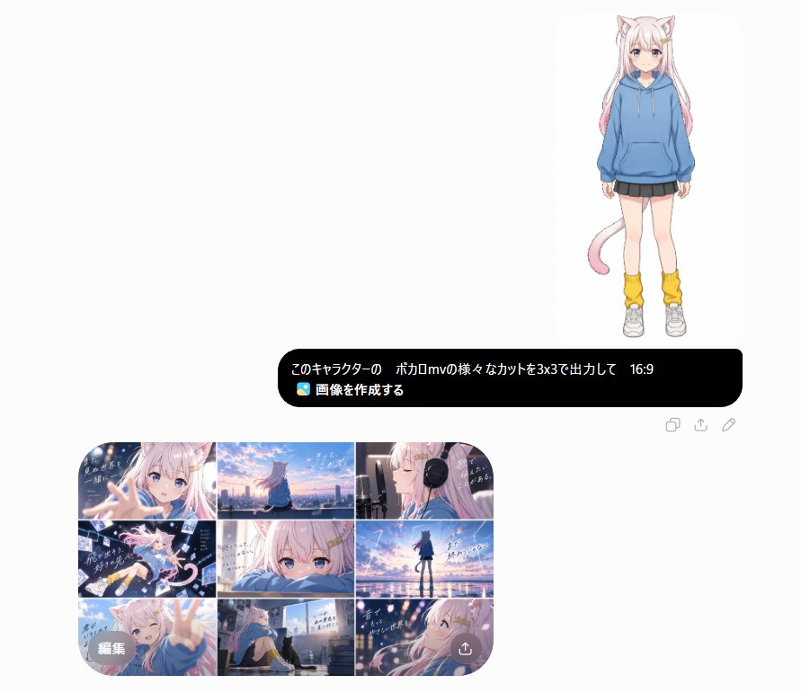

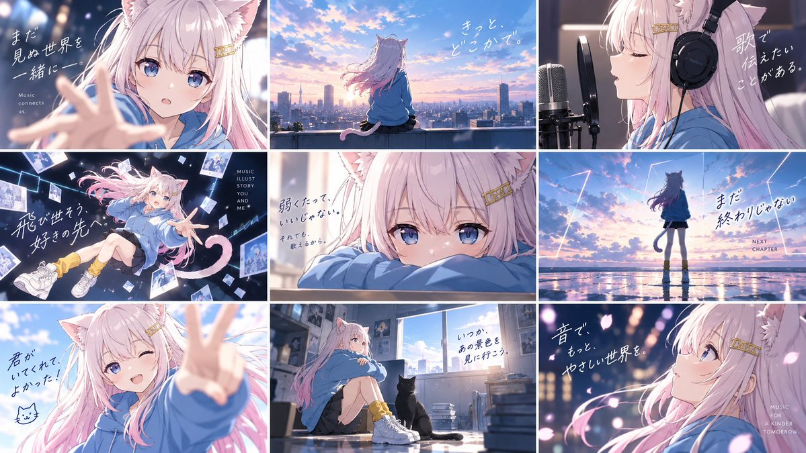

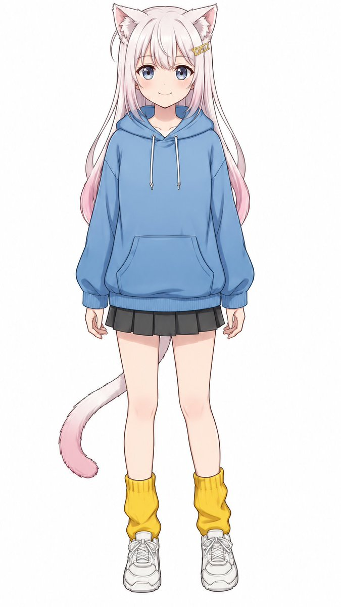

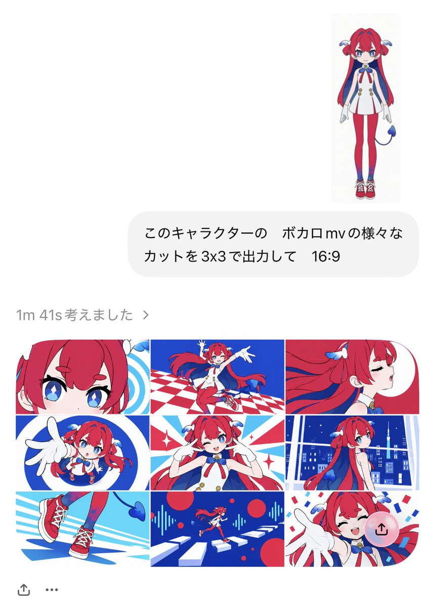

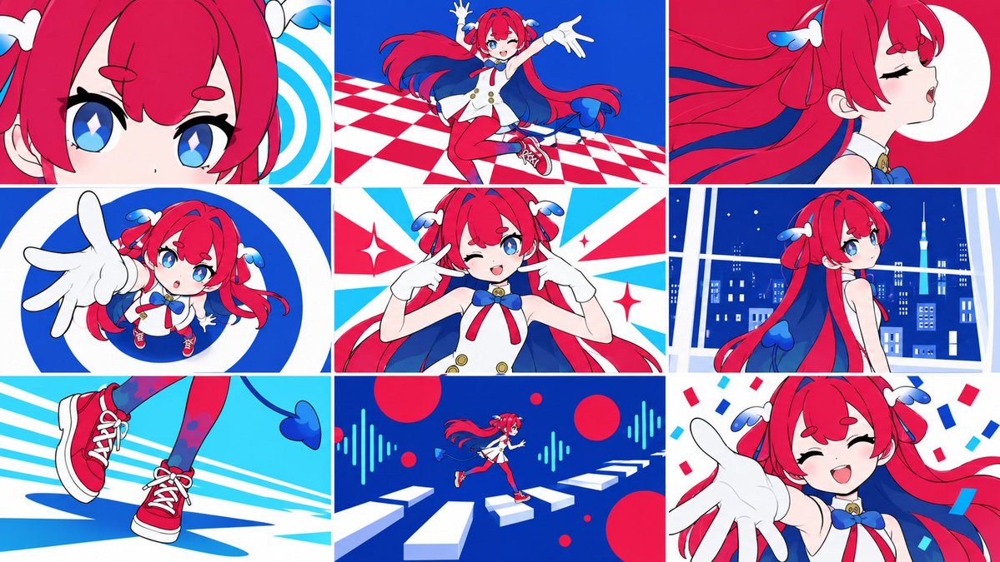

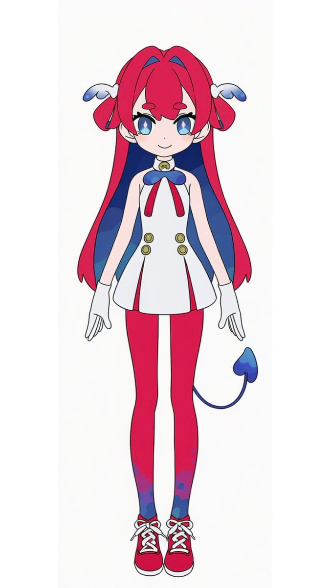

**Prompt**

```text
Gera vários cortes do videoclipe de Vocaloid desta personagem numa grelha 3x3, 16:9
```

[↑ Voltar às categorias](#catalog)

---

<a name="prompt-2097541027972456592"></a>

### Layout infográfico de storyboard vertical de 8 painéis para um anúncio de abacate.

Autor：[@1H77k](https://x.com/1H77k) · [Publicação original](https://x.com/1H77k/status/2097541027972456592)

Infográfico / Visual Educacional · Banda desenhada / Storyboard · Publicado

**Resumo:** Layout infográfico de storyboard vertical de 8 painéis para um anúncio de abacate.

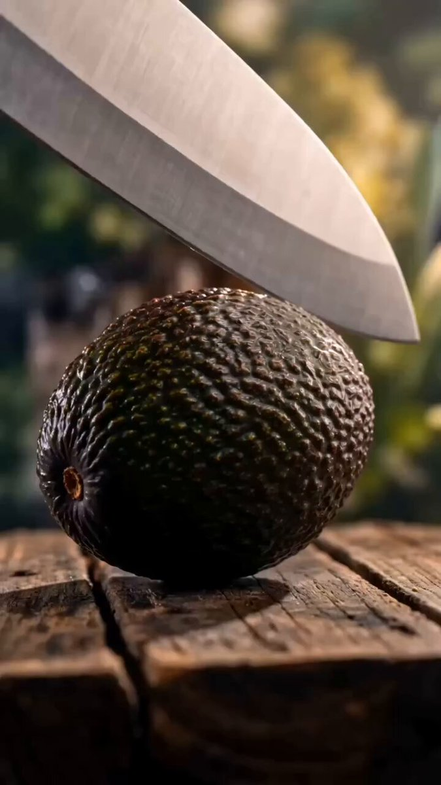

**Prompt**

```text
Um layout infográfico profissional de storyboard de 8 painéis intitulado 'AVOCADO TRANSFORMATION' para um anúncio vertical de alta energia de 15 segundos (proporção 9:16). Fundo escuro e limpo, apontamentos vibrantes em verde, tipografia moderna e fotografia gastronómica comercial de topo combinada com esboços técnicos e limpos de storyboard para cada fotograma.
```

[↑ Voltar às categorias](#catalog)

---

<a name="prompt-2097520388326510672"></a>

### Tradução em curso

Autor：[@su\_nagomi](https://x.com/su_nagomi) · [Publicação original](https://x.com/su_nagomi/status/2097520388326510672)

Personagem · Texto / Tipografia · Resumo / Contexto · Publicado

**Resumo:** Tradução em curso

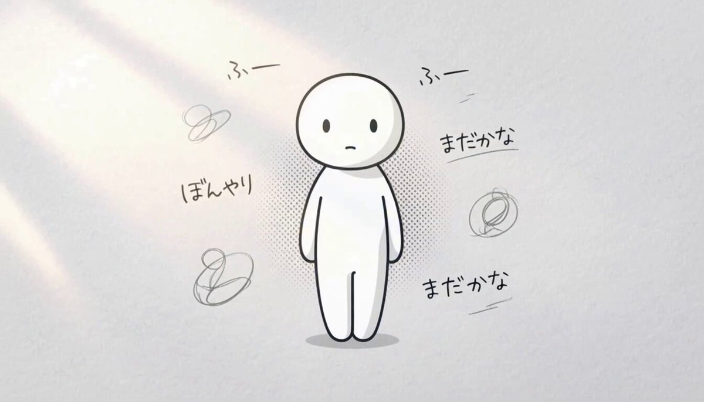

**Prompt**

```text
Tradução em curso
```

[↑ Voltar às categorias](#catalog)

---

<a name="prompt-2097475914124967955"></a>

### Foto de referência em stop-motion de plasticina de uma flor cor-de-rosa coral na terra.

Autor：[@higgsfield\_ai](https://x.com/higgsfield_ai) · [Publicação original](https://x.com/higgsfield_ai/status/2097475914124967955)

Outros · Publicado

**Resumo:** Foto de referência em stop-motion de plasticina de uma flor cor-de-rosa coral na terra.

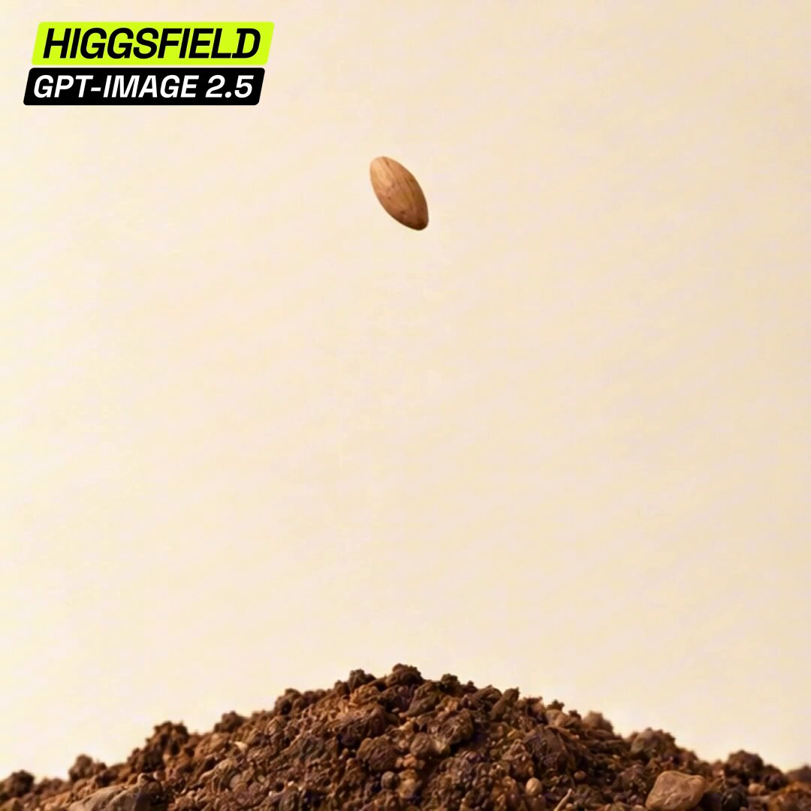

**Prompt**

```text
Crie uma única foto de referência quadrada em stop-motion, não um storyboard: uma flor de cosmos cor-de-rosa coral feita à mão em plasticina mate em terra castanho-escura contra um fundo creme quente. Câmara baixa fixa e frontal, macro de 70 mm, sensação ortográfica. A terra preenche os 22% inferiores, atingindo o pico a (50%,79%); o caule centrado vai de (50%,80%) até ao centro da flor a (50%,33%). Adicione exatamente duas folhas verdes e uma cabeça de flor com 35% de largura com exatamente 10 pétalas cor de coral e um centro dourado texturado. Inclua impressões digitais subtis, migalhas de terra e algumas pedrinhas. Use iluminação suave do canto superior esquerdo e sombras fixas. Mantenha a flor inteira visível, com a câmara e a terra estacionárias para animação. Sem vaso, plantas adicionais, personagens, insetos, mãos, texto, marca de água, moldura ou grelha.
```

[↑ Voltar às categorias](#catalog)

---

<a name="prompt-2096817125864484954"></a>

### Um prompt de vídeo de vlog de viagem contínuo em 4K retratando uma jovem mulher do Leste Asiático a explorar vários locais emblemáticos em Istambul.

Autor：[@Zyrellix](https://x.com/Zyrellix) · [Publicação original](https://x.com/Zyrellix/status/2096817125864484954)

Personagem · Publicado

**Resumo:** Um prompt de vídeo de vlog de viagem contínuo em 4K retratando uma jovem mulher do Leste Asiático a explorar vários locais emblemáticos em Istambul.

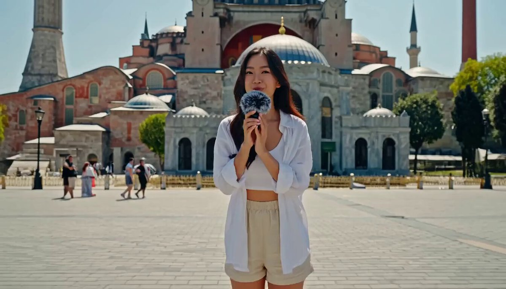

**Prompt**

```text
Um vídeo contínuo de vlog de viagem em 4K apresentando uma jovem mulher do Leste Asiático com longos cabelos escuros, vestindo um crop top branco, camisa branca aberta e calções bege, explorando Istambul. O vídeo encadeia-se perfeitamente através de momentos de viagem dinâmicos: começando com uma introdução em grande plano no estilo ASMR sussurrando para um microfone perto de Santa Sofia, fazendo a transição para uma câmara selfie na mão a girar por uma praça ensolarada repleta de turistas. Corte para um plano em contrapicado dentro de uma mesquita histórica contemplando grandiosos tetos abobadados e arcos otomanos, seguido por um momento na hora dourada num terraço perto da Torre de Gálata com os cabelos a esvoaçar suavemente na brisa. Depois, fica de pé junto ao varandim de um ferry no Bósforo a sorrir para a câmara, caminha por um beco estreito de calçada ladeado por esplanadas, oferece uma chávena de café turco perto da lente num café acolhedor e termina com um plano cinematográfico amplo ao crepúsculo da linha do horizonte iluminada de Istambul sobre a água. Hiperdetalhado, fotorrealista, resolução 8k, iluminação cinematográfica, cores naturais vibrantes, movimento fluido, rosto e física fotorrealistas.
```

[↑ Voltar às categorias](#catalog)

---

[Explore a Leadde.ai →](https://leadde.ai/?utm_source=github&utm_medium=readme&utm_campaign=prompt-library&utm_content=uncategorized)
