# 其他 · Prompt 資料庫 · Leadde.ai

[](README.md) [](README_zh.md) [](README_zh-TW.md) [](README_ja-JP.md) [](README_ko-KR.md) [](README_th-TH.md) [](README_vi-VN.md) [](README_hi-IN.md) [](README_es-ES.md) [-lightgrey)](README_es-419.md) [](README_de-DE.md) [](README_fr-FR.md) [](README_it-IT.md) [-lightgrey)](README_pt-BR.md) [](README_pt-PT.md) [](README_tr-TR.md)

**Best for:** Emerging visual AI prompts awaiting model verification, preserved with source attribution for early research.

For PDF, PPT, SOP, training, and multilingual video workflows:
[Awesome Document-to-Video](https://github.com/LeaddeOpenLab/awesome-document-to-video)

> **每日更新，精選高品質提示詞**

探索用於 AI 圖像、影片與 3D 創作的完整提示詞。依風格瀏覽、切換多語言版本，查看原作者與作品來源。

[探索 Leadde.ai →](https://leadde.ai/?utm_source=github&utm_medium=readme&utm_campaign=prompt-library&utm_content=uncategorized)

## 認識 Leadde.ai

Leadde.ai 協助團隊將文件、簡報和文字轉換為 AI 商業影片，適用於培訓、員工入職與行銷。

為儲存庫加上 Star，追蹤每日精選提示詞，持續獲得創作靈感。

**522** 筆內容 · 最新收錄: **2026-09-22**

<a name="catalog"></a>

## 分類目錄

[攝影](#category-photography) · [電影感 / 電影劇照](#category-cinematic-film-still) · [動畫 / 漫畫](#category-anime-manga) · [插圖](#category-illustration) · [草圖 / 線稿](#category-sketch-line-art) · [漫畫 / 圖像小說](#category-comic-graphic-novel) · [3D 渲染](#category-3d-render) · [Q 版風格](#category-chibi-q-style) · [等距視角](#category-isometric) · [油畫](#category-oil-painting) · [水彩](#category-watercolor) · [復古 / 懷舊](#category-retro-vintage) · [賽博龐克 / 科幻](#category-cyberpunk-sci-fi) · [極簡主義](#category-minimalism) · [其他](#category-other)

<a name="all-prompts"></a>

<a name="category-photography"></a>

## 攝影

<a name="prompt-2102377568519528652"></a>

### 戶外黃金時刻前置鏡頭自拍提示詞，呈現一名身穿白色短版上衣並遮擋雙眼的女性。

作者：[@oye\_samia](https://x.com/oye_samia) · [查看 X 原帖](https://x.com/oye_samia/status/2102377568519528652)

攝影 · 人像 / 自拍 · 角色 · 已推流

**概括:** 戶外黃金時刻前置鏡頭自拍提示詞，呈現一名身穿白色短版上衣並遮擋雙眼的女性。

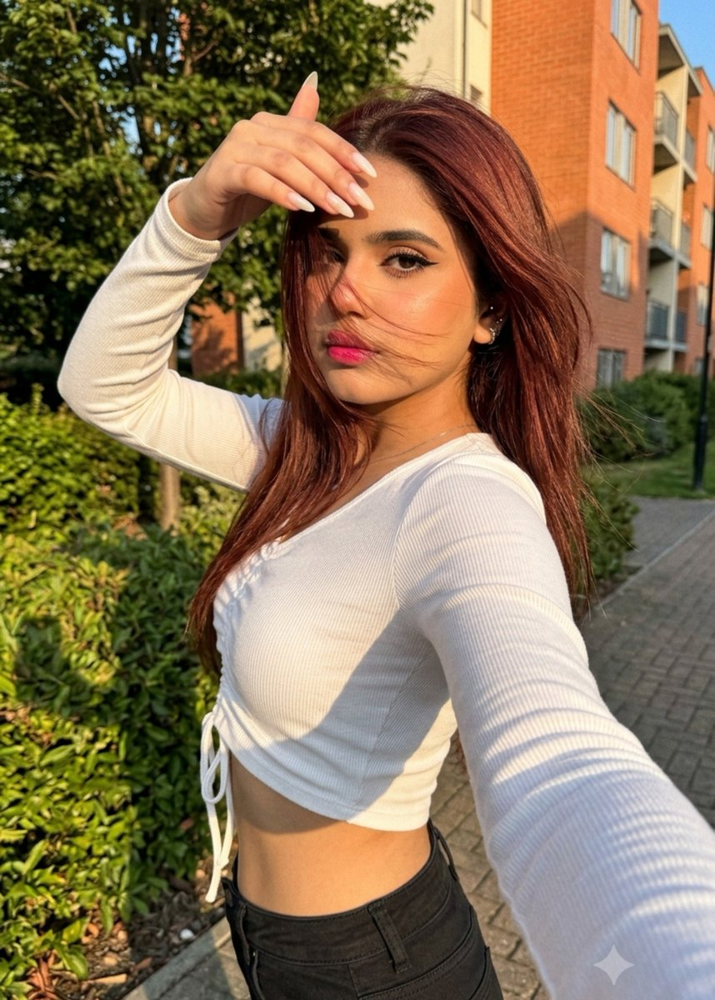

**提示詞**

```text
請勿改變照片中女孩的外貌。前置鏡頭伸直手臂自拍，側面視角。女孩側身面向鏡頭。

她那富有自然光澤的長直髮被微風吹拂，厚實地遮掩了部分臉龐與胸前，在雙唇上形成如輕紗般的覆蓋。

妝容：勻淨膚色，深色野生眉，黑色長上揚眼線，營造出「狐系眼」效果的濃密嫁接睫毛，自然色調的飽滿雙唇。

她身穿一件薄棉質地的白色短款羅紋長袖上衣，正面帶有抓褶抽繩（綁帶隱約可見），腰部微露出低腰黑色牛仔褲。沙漏型身材——腰身極為纖細。美甲：乳白色長尖美甲。

一隻手臂手肘彎曲並舉至額頭處，完全擋住了眼睛，彷彿正要撥弄頭髮。表情平靜而自信，側頭越過肩膀望向鏡頭。

光線：極為明亮的日間陽光，「黃金時刻」，美麗且輪廓分明的陰影。

背景：綠色灌木、樹木、人行道、橙紅色磚造多層住宅大樓的轉角。

promptsmv。由 iPhone 17 Pro 拍攝，Live Photo 實況質感。輕微數位噪點、膠片顆粒、柔和銳度。皮膚與布料紋理的高細節度。極高品質。2:3。
```

[↑ 返回分類目錄](#catalog)

---

<a name="prompt-2102387645066404079"></a>

### 一位年輕女子靠在石欄杆旁、俯瞰水面與歷史悠久的清真寺天際線的黃金時刻人像提示詞。

作者：[@\_\_Libra1](https://x.com/__Libra1) · [查看 X 原帖](https://x.com/__Libra1/status/2102387645066404079)

攝影 · 人像 / 自拍 · 角色 · 已推流

查看 X 原帖：[@\_\_Libra1](https://x.com/__Libra1) · [查看 X 原帖](https://x.com/__Libra1/status/2102354231877681538)

**概括:** 一位年輕女子靠在石欄杆旁、俯瞰水面與歷史悠久的清真寺天際線的黃金時刻人像提示詞。

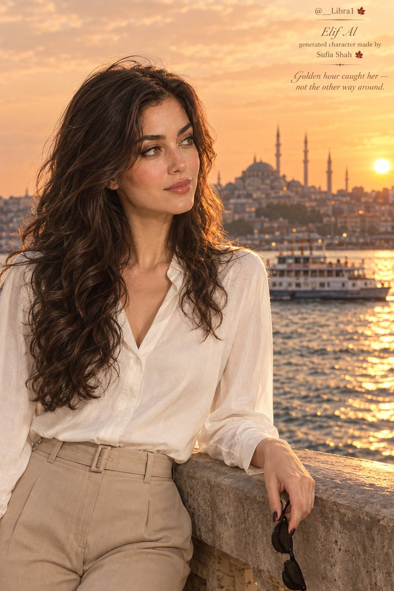

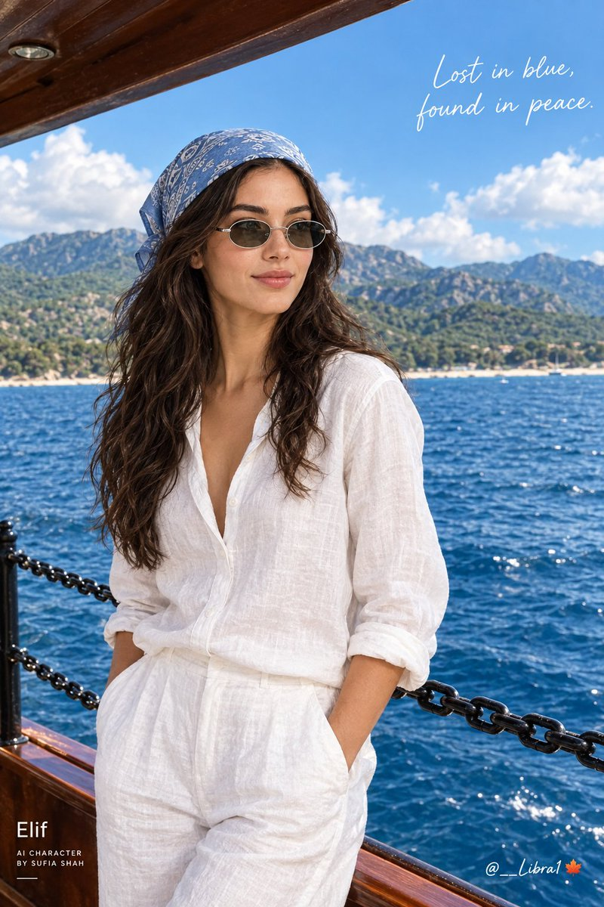

**提示詞**

```text
一張逼真的肖像照，呈現了一位年輕女子，她擁有一頭濃密捲曲的赤褐色長髮，帶有輕柔修飾臉型的瀏海，神態隨意地倚靠在飽經風霜的石欄杆旁。她帶著溫柔的側瞥與微微抿嘴的微笑，戴著小巧的金色鼻環，塗著深酒紅色的指甲。她身穿一件精緻的象牙白蕾絲襯衫，上面有花卉刺繡、荷葉邊高領和蓬鬆長袖，搭配黑色下裝。她靠在欄杆上的手隨意拿著一副黑色太陽眼鏡。

寬闊水面上的黃金時刻日落，溫暖的琥珀色與桃色光芒倒映在輕柔的漣漪上。背景中是一座歷史名城的天際線，矗立著一座巨大的圓頂清真寺與宣禮塔，還有一艘經典的白色渡輪正穿過水面。柔和的電影感光影、淺景深、自然的皮膚質感、豐富溫暖的色調、細節極高，具有 85mm 人像鏡頭效果。
```

[↑ 返回分類目錄](#catalog)

---

<a name="prompt-2102404482483343798"></a>

### 翻譯中

作者：[@DDJCXX](https://x.com/DDJCXX) · [查看 X 原帖](https://x.com/DDJCXX/status/2102404482483343798)

攝影 · 人像 / 自拍 · 角色 · 時尚單品 · 車輛 · 建築 / 室內設計 · 已推流

**概括:** 翻譯中

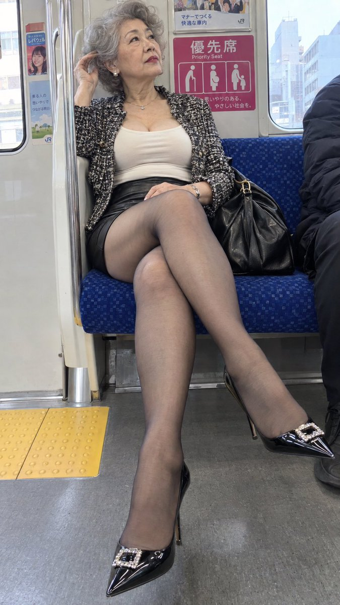

**提示詞**

```text
翻譯中
```

[↑ 返回分類目錄](#catalog)

---

<a name="prompt-2102415353636954412"></a>

### 翻譯中

作者：[@DDJCXX](https://x.com/DDJCXX) · [查看 X 原帖](https://x.com/DDJCXX/status/2102415353636954412)

攝影 · 人像 / 自拍 · 角色 · 風景 / 大自然 · 已推流

**概括:** 翻譯中

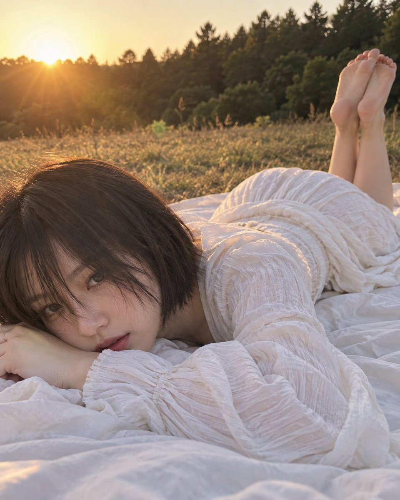

**提示詞**

```text
翻譯中
```

[↑ 返回分類目錄](#catalog)

---

<a name="prompt-2102252435381096480"></a>

### 穿著黑色外套與寬版牛仔褲的金髮女子在奢華飯店浴室的超寫實鏡前自拍。

作者：[@oju689](https://x.com/oju689) · [查看 X 原帖](https://x.com/oju689/status/2102252435381096480)

攝影 · 人像 / 自拍 · 角色 · 已推流

**概括:** 穿著黑色外套與寬版牛仔褲的金髮女子在奢華飯店浴室的超寫實鏡前自拍。

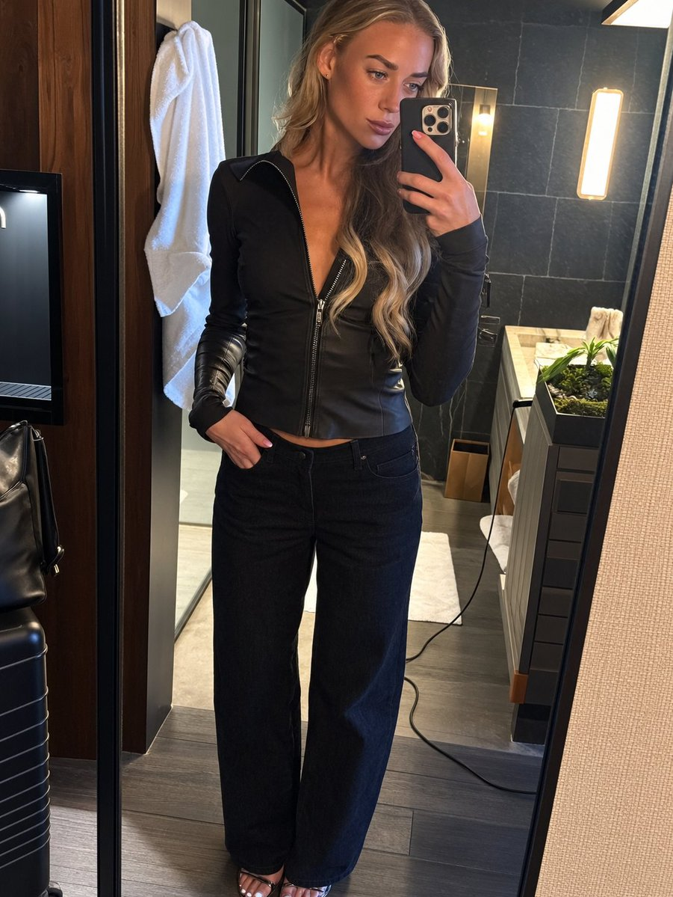

**提示詞**

```text
超寫實的奢華飯店浴室全身鏡自拍，一位美麗的年輕女子，留著自然微捲的金色長髮，穿著合身的黑色拉鍊外套與高腰深色寬版牛仔褲，搭配露趾涼鞋。她隨性地站在一面大全身鏡前，一手拿著現代智慧型手機並注視著手機螢幕，另一隻手自然地插在牛仔褲口袋裡。優雅現代的飯店浴室，深色大理石牆面，溫暖的環境光，白色毛巾，時尚洗手梳妝台以及背景中隱約點綴的綠植。自然逼真的肌膚紋理，真實的面部特徵，細緻的髮絲，逼真的手部與衣物細節，柔和的電影感光影，高端攝影，50mm鏡頭，淺景深，HDR，寫實照片級，極致細節，8K畫質，自然比例，全身構圖，無文字，無浮水印，無變形，無CGI或卡通感。
```

[↑ 返回分類目錄](#catalog)

---

<a name="prompt-2102322123838759108"></a>

### 翻譯中

作者：[@DDJCXX](https://x.com/DDJCXX) · [查看 X 原帖](https://x.com/DDJCXX/status/2102322123838759108)

攝影 · 人像 / 自拍 · 角色 · 時尚單品 · 城市景觀 / 街道 · 已推流

**概括:** 翻譯中

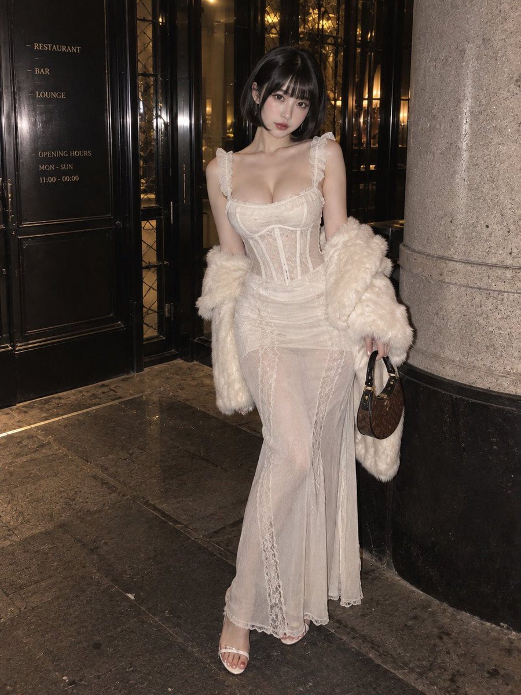

**提示詞**

```text
翻譯中
```

[↑ 返回分類目錄](#catalog)

---

<a name="prompt-2102349891368591803"></a>

### 翻譯中

作者：[@DDJCXX](https://x.com/DDJCXX) · [查看 X 原帖](https://x.com/DDJCXX/status/2102349891368591803)

攝影 · 角色 · 已推流

**概括:** 翻譯中

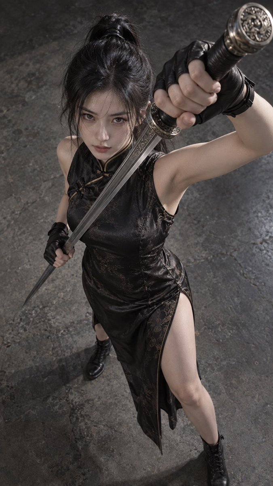

**提示詞**

```text
翻譯中
```

[↑ 返回分類目錄](#catalog)

---

<a name="prompt-2102276825850487014"></a>

### 翻譯中

作者：[@oye\_samia](https://x.com/oye_samia) · [查看 X 原帖](https://x.com/oye_samia/status/2102276825850487014)

攝影 · 人像 / 自拍 · 角色 · 已推流

**概括:** 翻譯中

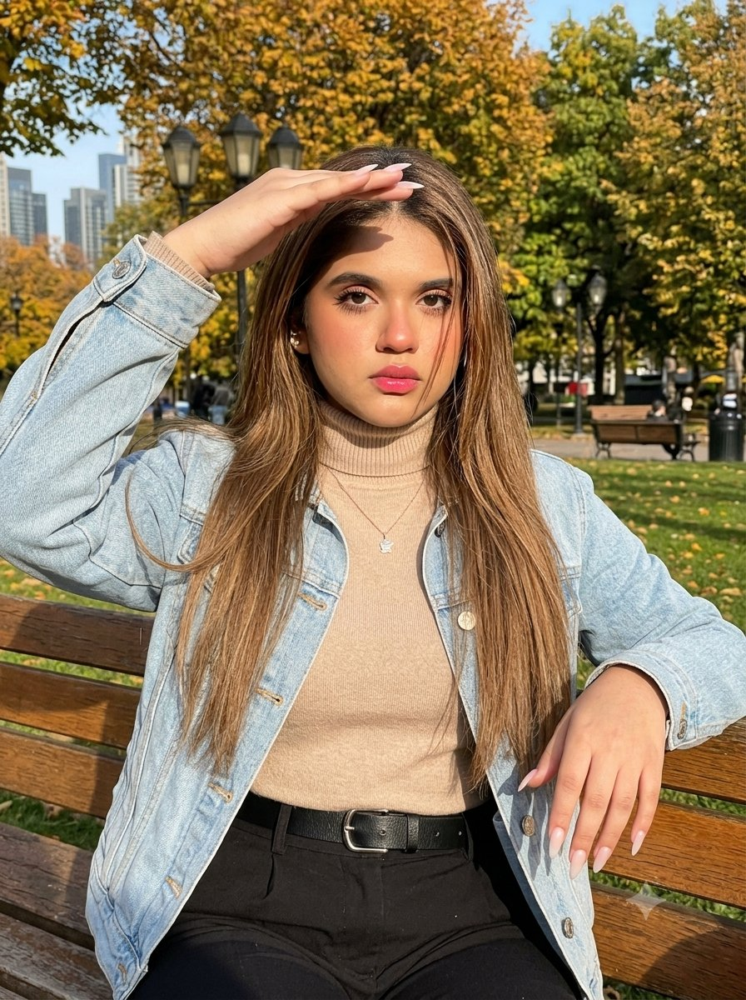

**提示詞**

```text
翻譯中
```

[↑ 返回分類目錄](#catalog)

---

<a name="prompt-2102306047633568240"></a>

### 咖啡館吧檯上的法式女僕裝東亞美女黑白肖像照片

作者：[@maplejohn01](https://x.com/maplejohn01) · [查看 X 原帖](https://x.com/maplejohn01/status/2102306047633568240)

攝影 · 人像 / 自拍 · 角色 · 食物 / 飲品 · 時尚單品 · 已推流

**概括:** 咖啡館吧檯上的法式女僕裝東亞美女黑白肖像照片

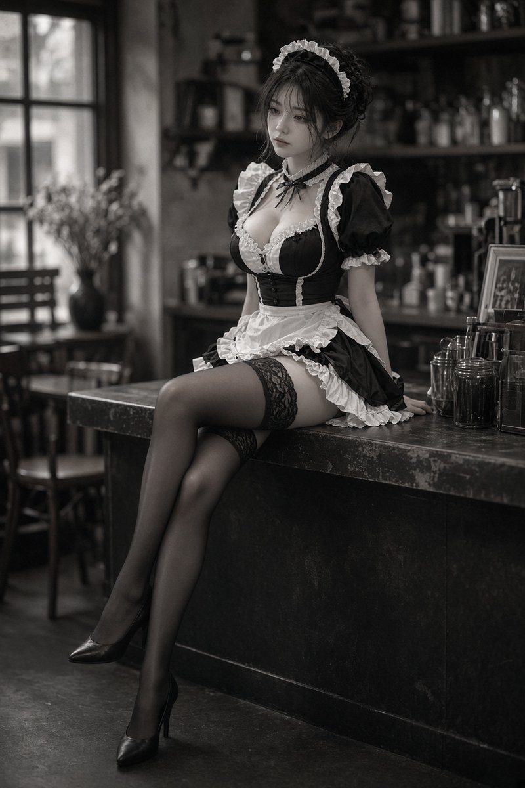

**提示詞**

```text
想像一張抓拍感的照片級寫實照片，內容為東亞美女，蜂腰巨乳，穿著法式黑白女僕裝，絲襪，翹著二郎腿坐在櫃檯上，咖啡館，柔焦光暈與浪漫柔光與85mm 肖像鏡頭，主體清晰、背景層次自然，光線為蚌式美容光與低調與陰天柔光，塑造體積與氛圍，材質呈現低鍵戲劇輪廓，黑白幾何，負空間，影調為調色高反差沖印，泥土原色，自然表面細節、可信光線與真實景深。
```

[↑ 返回分類目錄](#catalog)

---

<a name="prompt-2102261117443625131"></a>

### 翻譯中

作者：[@DDJCXX](https://x.com/DDJCXX) · [查看 X 原帖](https://x.com/DDJCXX/status/2102261117443625131)

攝影 · 角色 · 時尚單品 · 已推流

**概括:** 翻譯中

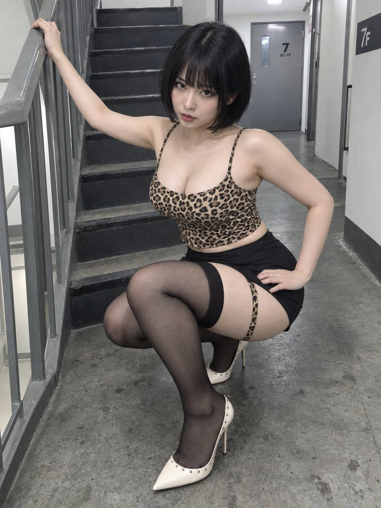

**提示詞**

```text
翻譯中
```

[↑ 返回分類目錄](#catalog)

---

<a name="prompt-2102272883284496395"></a>

### 翻譯中

作者：[@linmurannut](https://x.com/linmurannut) · [查看 X 原帖](https://x.com/linmurannut/status/2102272883284496395)

攝影 · 人像 / 自拍 · 角色 · 建築 / 室內設計 · 已推流

**概括:** 翻譯中


**提示詞**

```text
翻譯中
```

[↑ 返回分類目錄](#catalog)

---

<a name="prompt-2102236776748470351"></a>

### 一名身穿細條紋超大號大衣、手拿咖啡的女子在濕潤木質步橋上的高角度逼真肖像攝影。

作者：[@oye\_samia](https://x.com/oye_samia) · [查看 X 原帖](https://x.com/oye_samia/status/2102236776748470351)

攝影 · 人像 / 自拍 · 角色 · 食物 / 飲品 · 已推流

**概括:** 一名身穿細條紋超大號大衣、手拿咖啡的女子在濕潤木質步橋上的高角度逼真肖像攝影。

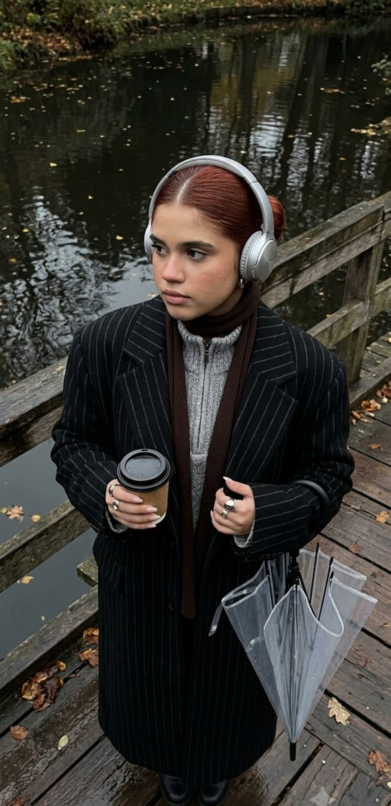

**提示詞**

```text
**嚴格按照參考圖1:1還原外貌特徵：臉部必須完全可辨識，五官特徵和比例不得有任何改變。**

深色池塘邊的逼真寫實秋日照片，高角度俯拍視角。
女孩站在濕漉漉的木質步道橋上，身體朝向正前方，頭部微微向左轉，目光望向一側。
一手拿著咖啡；另一手抓著大衣翻領。
一把透明雨傘掛在彎曲的前臂上，傘面朝下，傘骨清晰可見。

她身穿一件帶有灰色細條紋的黑色超大號長款大衣、一件灰色有質感的立領毛衣、一條深褐色窄圍巾，戴著大型銀色耳機和厚重的戒指。

中分髮型平整地梳理成一個緊實的小低髮髻，沒有蓬鬆感，也沒有散落的髮絲。自然柔和的精緻妝容，緞面質感肌膚，柔和的修容，以及裸色唇妝。

陰沉瀰漫的光線、濕漉漉的木板、落葉，以及帶有倒影的暗色水面。冷調柔和的色彩，輕微顆粒感，無CGI特效、無塑膠感修圖、無過分光澤或濾鏡。
```

[↑ 返回分類目錄](#catalog)

---

<a name="prompt-2102229410757910990"></a>

### 翻譯中

作者：[@DDJCXX](https://x.com/DDJCXX) · [查看 X 原帖](https://x.com/DDJCXX/status/2102229410757910990)

攝影 · 時尚單品 · 摘要 / 背景 · 已推流

**概括:** 翻譯中

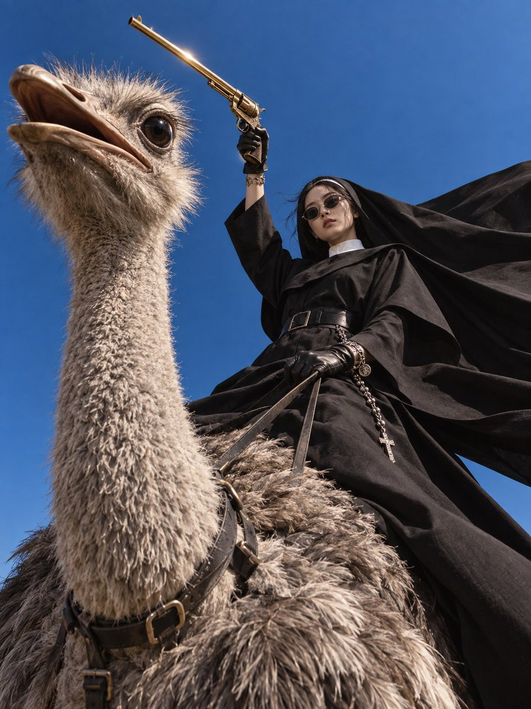

**提示詞**

```text
翻譯中
```

[↑ 返回分類目錄](#catalog)

---

<a name="prompt-2102149669896012031"></a>

### 在清晨臥室裡身穿淡粉色蕾絲服飾仰臥在床上的女性寫實肖像提示詞。

作者：[@muse\_ai\_prompt](https://x.com/muse_ai_prompt) · [查看 X 原帖](https://x.com/muse_ai_prompt/status/2102149669896012031)

攝影 · 人像 / 自拍 · 角色 · 已推流

**概括:** 在清晨臥室裡身穿淡粉色蕾絲服飾仰臥在床上的女性寫實肖像提示詞。

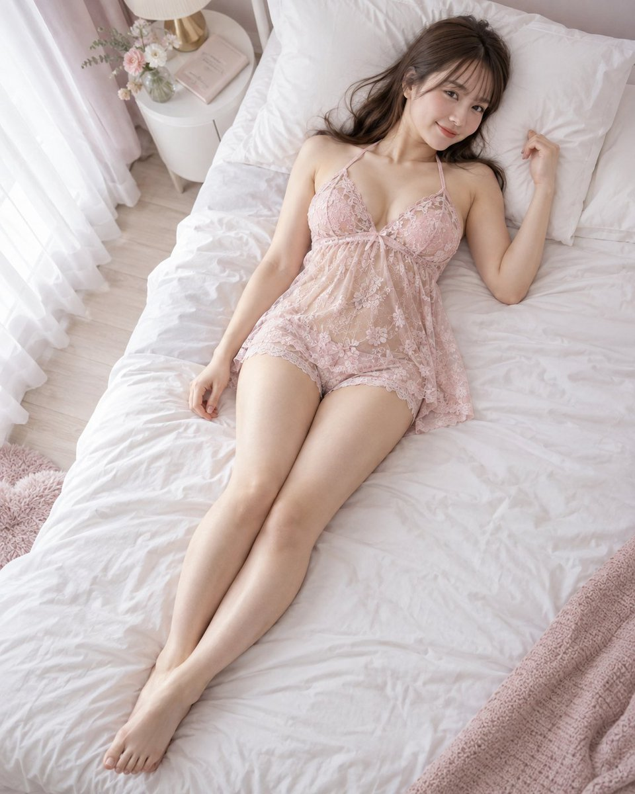

**提示詞**

```text
🌟晨間臥室｜淡晨光與淡粉色的羞澀微笑🌟

【主題・畫風】
一位明確成年的日本女性，清晨在臥室床上仰臥，捕捉與戀人偶然對視瞬間的寫實照片。將淡粉色精緻的花卉蕾絲、白色床上用品與清晨的自然光線相結合，呈現出宛如寫真集畫面般的高雅感，以及在日常中偶然流露的親密可愛。
並非過度編排的寫真寫真，而是注重如從戀人視角拍攝般自然的距離感。柔和的表情、蕾絲的細節，乃至床上用品的質感，都如實拍照片般生動刻畫。

【場所・背景・世界觀】
以白色和啞光粉色為基調佈置的安靜臥室。大床上鋪著潔白的床單和被子，放置著鬆軟的白色枕頭，女性仰臥在被子之上。被子鋪展在身體下方，不遮擋雙腿或服飾。
窗戶掛著輕薄的白紗窗簾，床頭擺放著小巧的圓桌、柔和的照明以及幾朵淡色花卉。不過多擺放雜物，讓白色寢具與淡粉色服飾自然成為主角，營造出兼具潔淨感與生活氣息的空間。

【季節・時間・天氣】
令人聯想到春季至初夏的寧靜晴朗清晨。並非剛日出之時，而是透過窗簾已有充沛自然光灑入室內的時段。
窗外微風輕拂，輕薄窗簾僅微微晃動。並非強烈的直射陽光，而是透過白色窗簾的漫射光，營造出宛如初醒房間獨有的靜謐柔和氛圍。

【人物設定】
明確成年的23歲日本女性。五官柔和端正，黑眼珠略大且有神，眉形自然，臉頰微微圓潤，嘴唇紅潤柔嫩。深棕色齊肩自然微捲髮，髮絲在枕頭上輕柔散開。肌膚呈明亮的白皙自然色調，保留著自然的血色與細微陰影。
擁有纖細的肩頸、四肢和較細的腰身，同時女性曲線自然銜接，屬於優雅豐滿的體型。胸部豐滿飽滿且富有量感，但不作不自然誇張，呈現順應仰臥姿勢與重力的柔和圓潤感和立體感。

【服裝・配件】
以淡粉色薄紗材質為基底的掛頸式吊帶睡裙（babydoll）。胸部採用精緻的小碎花蕾絲與同色系內襯，確保有合理的罩杯寬度與布料量自然包裹豐滿胸部。胸前中央帶有小蝴蝶結等低調的點綴裝飾。
下擺為輕盈微透的蕾絲材質，柔和散落在白色床品上。搭配同款花卉蕾絲短褲，短褲部分帶有同色內襯。不佩戴任何首飾飾品，優先體現清晨的自然氛圍。

【姿勢・動作・視線】
頭枕著白色枕頭，在床上仰臥，身體沿畫面對角線方向延伸。肩部與背部自然貼合床品，腰部不拱起，保持放鬆姿態。雙腿近乎伸直，僅腳踝微微交疊。
一隻手在頭部附近用指尖輕輕捏住枕頭邊緣，另一隻手放鬆置於身側。察覺到戀人正在注視自己，臉部微微轉向鏡頭相反方向，但唯獨眼神轉回看向鏡頭，形成對視。

【表情・情感】
與戀人突然目光交匯，瞬間泛起的羞怯微笑。並非張嘴大笑，而是輕閉雙唇，嘴角微微揚起。臉頰微微用力，眼神柔和放鬆。
目光中流露出彷彿在說「你在看我呀？」般的親暱感。並非刻意做出的造作可愛，而是想把臉偏開卻又忍不住繼續注視對方的、自然而略帶毫無防備的情感表達。

【構圖・相機】
適合X（Twitter）發布的4:5縱向構圖。從頭頂到裸足腳尖留有充裕空間的全身構圖，頭頂、指尖、腳底均不被裁切。女性身體沿畫面對角線分布，在直幅畫面中營造自然動感。
相機架設於床側斜上方，從能夠同時看清寢具與女性全身的高度拍攝。採用標準至略偏中焦的自然視角，避免廣角鏡頭誇大四肢或胸部。背景輕微虛化柔化，但仍保留可辨識為臥室的環境資訊。

【光線・色彩・質感・氛圍】
以畫面左側窗戶照入的晨間自然光為主光源，經白色窗簾柔和漫射。對側由白牆與寢具反射微弱反光，自然提亮面部和身體的陰影。陰影淺淡，色溫呈現出清晨特有的中性偏微暖色調。
皮膚保留毛孔、細微陰影與自然紅潤感，頭髮根根分明，體現散落在枕上的柔順。花卉蕾絲刻畫出精緻刺繡與薄紗透膚感，床品則呈現出純棉的細微褶皺與柔軟。以白色、淡粉色、啞光灰粉色為主調統合，傳遞出寧靜清晨的親密與純淨感。

【品質・排除元素】
作為高解析度寫真照片，注重真實相機拍攝般的自然人體、光影、材質與透視感。明確表現為成年女性，避免過於幼態的五官或看似未成年的表現。
避免多餘的四肢或手指、缺損或融合的手指、不自然的關節、左右手混淆、身體與服裝融合、服裝破損或意外走光。胸部保持豐滿自然的量感，避免堅硬球體狀、不自然的巨大化、過度聚攏擠壓，以及與仰臥姿勢和重力相違背的形態。排除極端的廣角畸變、過度磨皮美顏濾鏡、不自然的背景、文字、Logo、浮水印和UI介面元素。
```

[↑ 返回分類目錄](#catalog)

---

<a name="prompt-2102150582949830849"></a>

### 翻譯中

作者：[@muse\_ai\_prompt](https://x.com/muse_ai_prompt) · [查看 X 原帖](https://x.com/muse_ai_prompt/status/2102150582949830849)

攝影 · 人像 / 自拍 · 角色 · 已推流

**概括:** 翻譯中


**提示詞**

```text
翻譯中
```

[↑ 返回分類目錄](#catalog)

---

<a name="prompt-2102151729752211626"></a>

### 夕陽海灘上身穿珊瑚色比基尼微笑著伸出手的女性寫實肖像生成提示詞。

作者：[@muse\_ai\_prompt](https://x.com/muse_ai_prompt) · [查看 X 原帖](https://x.com/muse_ai_prompt/status/2102151729752211626)

攝影 · 人像 / 自拍 · 角色 · 風景 / 大自然 · 已推流

**概括:** 夕陽海灘上身穿珊瑚色比基尼微笑著伸出手的女性寫實肖像生成提示詞。


**提示詞**

```text
🌟夕照海灘｜珊瑚色比基尼下伸手微笑🌟

【主題・畫風】
以傍晚寧靜的沙灘為舞臺，定格與戀人並肩漫步的親密片刻的寫實逼真照片。不僅展現人物的可愛，更能讓人感受到海邊的氣息、腳邊的浪花與夕陽的色彩，呈現寫真集般自然純粹的畫面。
不做過度做作的刻意擺拍，注重彷彿由真實相機拍攝般的質感，傳遞出溫柔的情感與開闊的釋放感。

【地點・背景・世界觀】
地點是傍晚寧靜的沙灘與海浪拍打的浪花邊緣。前景是濕潤浸水的沙灘與輕輕湧來的淺浪，中景是漫步的女性，遠景是平靜的大海、低矮的岩影與被晚霞染上淡淡色彩的天空。
背景是人影稀疏、寧靜悠閒的海邊，從腳下向後延伸著短短的一串腳印。在開闊的景色中又不失溫馨，自然構成一幅與戀人共度平靜假期的美好畫面。

【季節・時間・天氣】
季節為初夏至盛夏的海邊。時間是日落前的傍晚，空氣中還殘留著些許暖意，海風輕輕拂動髮絲與比基尼的荷葉邊。
天氣晴朗。夕陽的斜射餘暉在海面上拖出長長的反光，天空交織著橙色、粉色與淡藍色。空氣澄澈而寧靜，洋溢著一種內斂而愉悅的氛圍。

【人物設定】
20至28歲左右、明確成年的日本女性。面容溫婉端正，黑白分明的明亮眼眸、自然的眉形、氣色紅潤的雙唇，兼具親和力與成熟女性的可愛感。髮型為深棕色、齊肩長度的自然微捲髮，髮尾與細碎髮絲隨海風微微飄動。
膚色為白皙自然的暖色調（淺赭色系），質感自然而不顯得過度光滑。體態兼具纖巧的香肩與四肢、纖細的腰身與富有女人味的優美曲線，展現出高雅而自然的豐滿身材。胸部呈現明確豐滿的分量感，同時與服裝和姿勢自然貼合，呈現柔軟且立體的真實感。

【服裝・飾品】
身穿珊瑚橙色荷葉邊蕾絲削肩綁帶比基尼。上裝的胸前飾有精緻輕柔的小荷葉邊層疊，削肩頸帶與胸前正中的小結作為點綴。下裝為同色系、兩側細帶繫結設計，上下呈現一體感。
材質為柔軟且具彈性的泳裝布料，輕盈地疊加著蕾絲裝飾。自然貼合身體曲線，胸口與腰腹部沒有不自然的浮起或勒緊感，注重現實穿著的合身度。飾品從簡，若有也僅為小巧簡約的耳釘。

【姿勢・動作・視線】
女性踩在浪花邊漫步並稍微放慢腳步，身體雖自然朝向行進方向，但上半身和面部微微轉向左側身旁的戀人。單腳邁向前方的行走途中，重心輕微落在後腳上，前腳腳尖溫柔觸碰濕潤的沙地。
左手從略低於腰部的位置向戀人伸出，彷彿下一秒就要牽手的自然動作。指尖柔和放鬆而不顯僵硬，右臂則自然垂於身側。視線望向身旁的戀人，鏡頭視角設定為並肩同行的戀人第一人稱視線，戀人本人的身影和手不入鏡。

【表情・情感】
表情是只展現給戀人的、親密且自然的微笑。眼角柔和舒展，嘴角帶著淺淺而優雅的笑意，隱隱流露出幾分害羞與喜悅交織的情緒。
相比刻意擺姿勢，更看重並肩同行帶來的安心感與悄悄傳達心意的溫柔。不顯過分甜膩，散發出從容沉穩的可愛之情。

【構圖・相機】
適合社群平台發布的4:5直式比例。從頭頂到腳尖完整容納全身的充裕全身像構圖，使伸出的手、漫步的腳尖以及海面的光影反射都能自然入鏡。人物位於畫面偏中位置，左右留白適度，以展現行進方向與大海的遼闊感。
相機高度接近與戀人並肩漫步的視線（胸部至眼部高度）。拍攝距離為兼顧全身與臉部細節的中距離，鏡頭焦段為標準至微中望遠，避免因極端廣角引起的身材透視變形。背景虛實得當，保留足以辨識場景環境的自然景深。

【光線・色彩・質感・氛圍】
主光源為右後方低垂的夕陽。斜後方的逆光為髮絲和肩膀輪廓勾勒出溫暖的高光輪廓，正面則受天空與沙灘的漫反射補光，讓臉部表情顯得明亮且柔和。陰影柔和自然，避免出現強烈的對比度。
色調以珊瑚橙色泳裝為中心，與夕照天空的橙色、海面的青灰色、濕潤沙灘的柔和棕色和諧交織。肌膚呈現自然的血色感，髮絲輕柔順滑，海水帶有細微浪花的粼粼波光，沙粒質地濕潤細膩，整體烘托出溫柔浪漫的氛圍。

【品質・排除要素】
高解析度，強調真實相機拍出般的真實人體、光影、布料、水流與沙粒質感。避免未成年特徵、幼態臉孔、不自然的體型及過度誇張的表現。
避免出現多餘或缺失的肢體、手指殘缺、不自然的關節扭曲、衣物穿模崩壞、身體與衣物融合、意外走光暴露、極端廣角畸變、不自然的背景虛焦，以及文字、Logo、浮水印和UI介面。胸部保持豐滿自然的立體感，不得表現為不自然的巨大、僵硬球體或過度擠壓托高的形態。
```

[↑ 返回分類目錄](#catalog)

---

<a name="prompt-2102153577913573851"></a>

### 翻譯中

作者：[@muse\_ai\_prompt](https://x.com/muse_ai_prompt) · [查看 X 原帖](https://x.com/muse_ai_prompt/status/2102153577913573851)

攝影 · 人像 / 自拍 · 角色 · 時尚單品 · 已推流

**概括:** 翻譯中

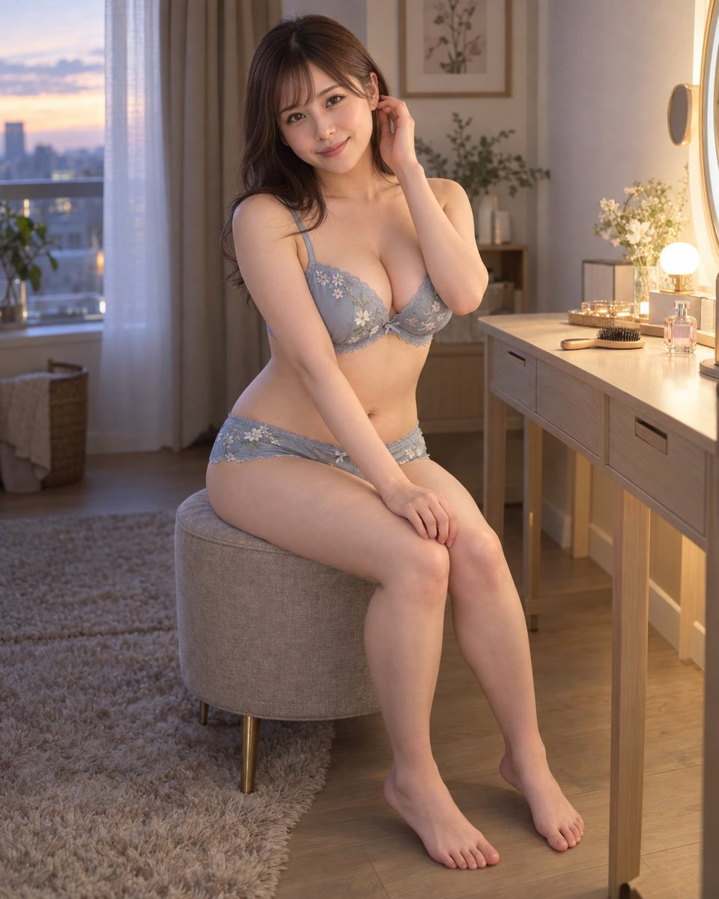

**提示詞**

```text
翻譯中
```

[↑ 返回分類目錄](#catalog)

---

<a name="prompt-2102148560078954751"></a>

### 暴雨之夜的臥室中，身穿白色碎花刺繡內衣微笑的女性寫實人像。

作者：[@muse\_ai\_prompt](https://x.com/muse_ai_prompt) · [查看 X 原帖](https://x.com/muse_ai_prompt/status/2102148560078954751)

攝影 · 人像 / 自拍 · 角色 · 已推流

**概括:** 暴雨之夜的臥室中，身穿白色碎花刺繡內衣微笑的女性寫實人像。


**提示詞**

```text
🌟大雨之夜｜白色碎花刺繡與「晚安」前的微笑🌟

【主題・畫風】
在暴雨傾盆的夜晚臥室裡，一位明顯成年的日本女性坐在床沿，在向眼前的戀人道晚安的前一瞬間。以寫實寫真集風格為基礎，並非刻意雕琢的寫真，而是保留戀人從近距離自然拍攝的生活氣息與親密感。在同一畫面中將溫暖的室內與雨水籠罩的藍色夜晚形成對比。

【地點・背景・世界觀】
以白色和淡米色為主調的寧靜臥室。女性身後佈置著擺放蓬鬆白枕頭和柔軟白色被褥的床。畫面左側有一扇拉開窗簾的關閉窗戶，清晰描繪玻璃表面大小不一的雨滴以及水滴連成細流滑落的痕跡。
窗外含蓄地展現夜晚街景，露出濕漉漉的馬路、遠處的建築燈光和路燈的倒影。室內的家具和小物件保持在最低限度，僅憑床、窗戶和溫暖的檯燈營造出沉穩的私密空間。

【季節・時間・天氣】
不拘泥於特定季節、帶著些許涼意的夜晚。室外大雨持續傾瀉，雨勢大到足以看清斜劃過路燈光芒的雨線。風雨僅存在於窗外，女性的頭髮、肌膚、床品和室內完全乾爽。
時間段為就寢前的深夜。室外呈現帶藍調的暗色，但並非純黑，保留了足以辨認雨滴與濕潤街道的夜光。

【人物設定】
27歲、明顯成年的日本女性。柔和端正的五官，偏大且黑白分明的瞳孔，自然的眉毛，保留血色的柔軟雙唇。留著深棕色齊肩自然捲髮，保留細微碎髮的同時不遮擋眼部和唇部。
白皙的黃調肌膚保留毛孔與細膩的陰影。纖細的肩頸、手臂與細腰，以及女性獨有的圓潤感融為一體的自然豐滿體態。胸部明顯豐滿飽滿，但呈現符合服裝、姿勢與重力的柔軟立體感，與整體身體保持自然平衡。

【服裝・配飾】
以白色為基調帶有細碎花朵刺繡的胸罩，以及同款內褲。在本次從胸口到頭部的構圖中，內褲位於畫角之外，胸罩的肩帶、罩杯上部的蕾絲和小花刺繡自然可見。
罩杯部分配有不透明的白色內襯，疊加精緻的花朵刺繡與纖細的蕾絲邊。尺寸合適，能輕鬆包容豐滿的胸部，布料沒有過度拉伸或勒肉的真實貼合感。不佩戴飾品，凸顯睡前的樸素感。

【姿勢・動作・視線】
女性自然地坐在床邊，上半身微微朝向戀人。左手支撐在身體稍後方的床墊上支撐上半身，右手輕搭在大腿旁邊的床單上。雙手在本次截取胸部以上的畫幅中處於不可見的位置。
放鬆肩膀，背部微微挺直但保持毫無緊繃感的姿勢。頭部微微傾斜，視線徑直投向位於相機位置的戀人。絕不做不自然的塌腰或刻意挺胸姿勢。

【表情・情感】
朝向戀人的、親密且自然的溫柔微笑。眼角柔和放鬆，流露出安心結束一天的沉靜。雙唇自然閉合，不過度刻意做大笑臉，定格在彷彿下一秒就要輕聲說出「晚安」的瞬間。
雙頰保留暖光映襯下的自然血色，眉眼間也傳遞著笑意。相比面對相機的模特兒式笑容，更著重展現僅面對親密之人時流露的微羞柔情。

【構圖・相機】
適配X平台的4:5直構圖。採用將胸口至頭頂大面積收入的胸部特寫半身構圖（Bust-up），頭頂上方留出些許餘白。女性置於畫面中央偏右側，左側留出充足空間展示流淌著雨滴的窗戶。
相機在與女性面部幾乎平齊的高度進行近距離拍攝。設定為相當於50〜70mm的標準至中長焦視角的自然畫角，不以廣角誇張放大面部或胸部。背景僅做輕微柔化處理，保留能夠辨別出窗上雨滴與大雨的資訊量。

【光影・色彩・質感・氛圍】
以畫面右後方溫暖的床頭燈為主光源，為面部、臉頰、胸口和白色蕾絲打上柔和的暖色光。窗邊透入帶藍調的微弱夜光，在頭髮和肩膀輪廓勾勒出淡淡的冷色邊緣光。冷暖自然交融的夜晚光影氛圍。
肌膚保留細緻陰影與自然血色，髮絲體現根根分明的走勢與光澤，內衣保留布料厚度、刺繡線與蕾絲的細緻立體感。將窗戶玻璃的濕潤透明感與床品的柔軟織物清晰區分質感，營造出寧靜室內與暴風雨交織的對比氛圍。

【品質・排除要素】
高解析度、自然的人體比例、具有真實光影與透視感的寫實攝影。人物必須明確成年，避免過分幼態的容貌或看似未成年的表現手法。
排除多餘的肢體或手指、不自然的關節、身體與衣物融合、衣物破損或意外走光、極端的廣角畸變、過度的磨皮美顏。胸部在保持豐滿自然體量的同時，避免出現僵硬球狀、異常擠壓、反重力形態。排除雨水滲入室內或打在人物身上的描寫，不包含文字、標誌、浮水印、對話氣泡、UI介面顯示。
```

[↑ 返回分類目錄](#catalog)

---

<a name="prompt-2101855527278178459"></a>

### 翻譯中

作者：[@DDJCXX](https://x.com/DDJCXX) · [查看 X 原帖](https://x.com/DDJCXX/status/2101855527278178459)

攝影 · 人像 / 自拍 · 網紅 / 模特兒 · 角色 · 已推流

**概括:** 翻譯中

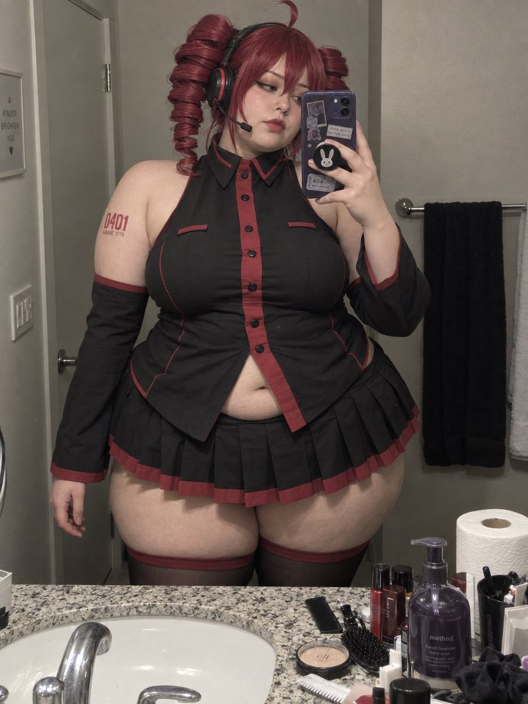

**提示詞**

```text
翻譯中
```

[↑ 返回分類目錄](#catalog)

---

<a name="prompt-2102017673634656545"></a>

### 用於生成基於日常聲音、在攝影棚基座上拍攝的1:50比例建築模型的提示詞模板。

作者：[@hmontilla\_](https://x.com/hmontilla_) · [查看 X 原帖](https://x.com/hmontilla_/status/2102017673634656545)

攝影 · 建築 / 室內設計 · 已推流

**概括:** 用於生成基於日常聲音、在攝影棚基座上拍攝的1:50比例建築模型的提示詞模板。

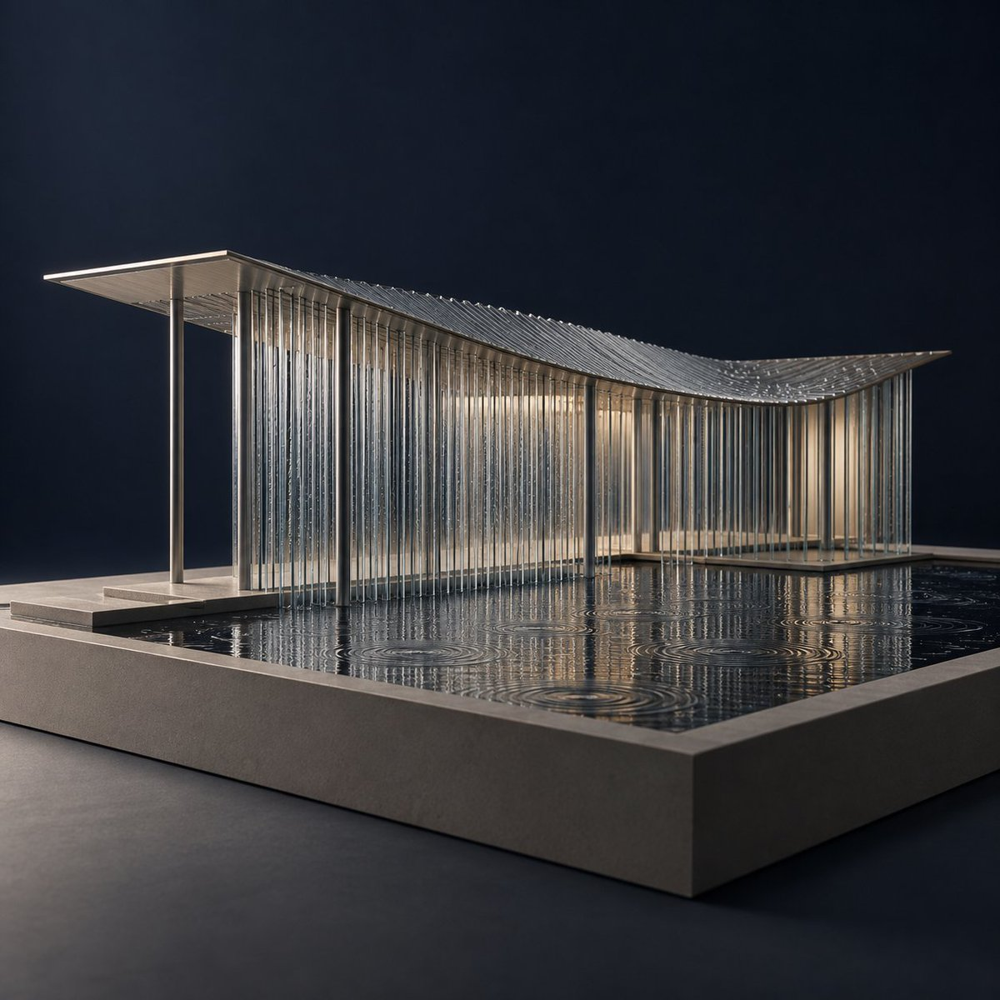

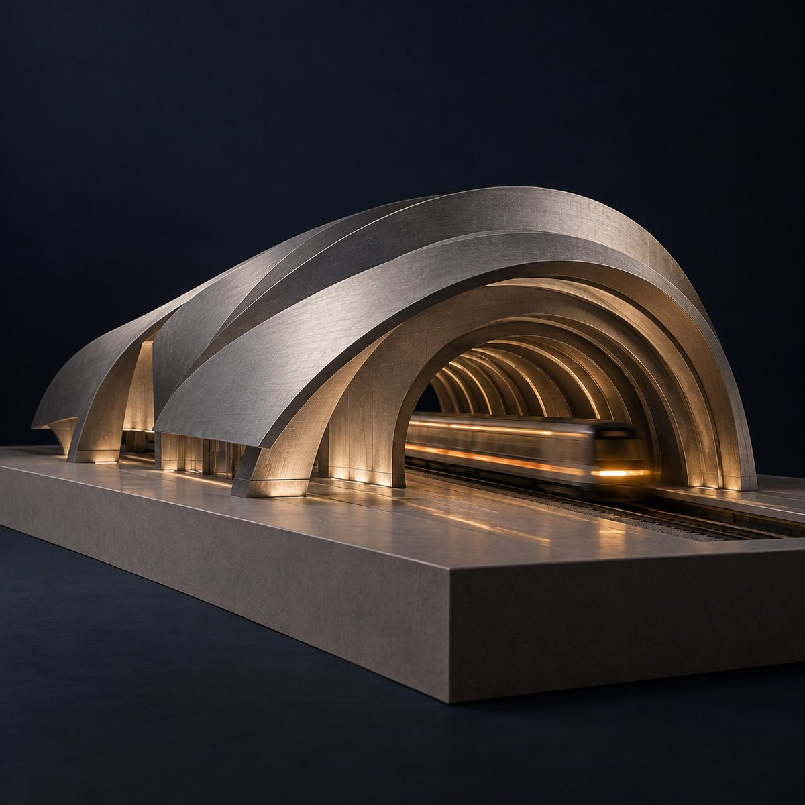

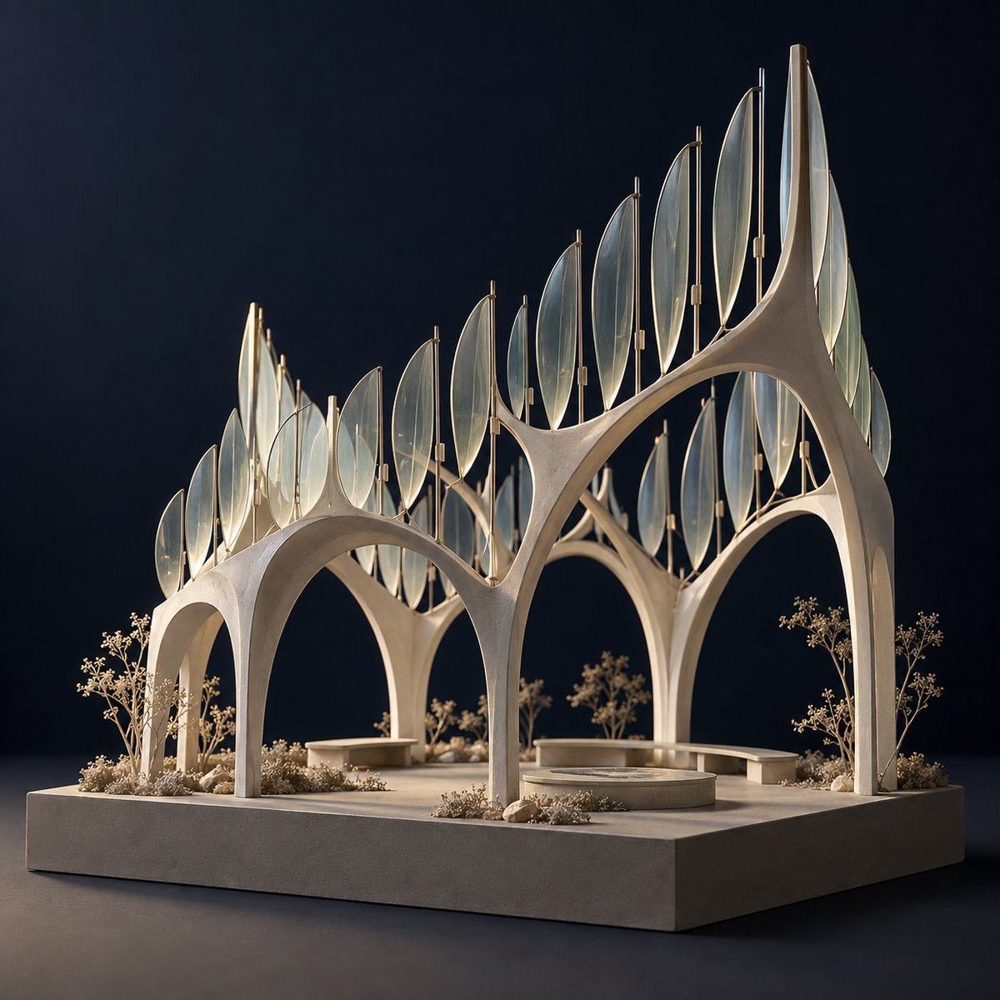

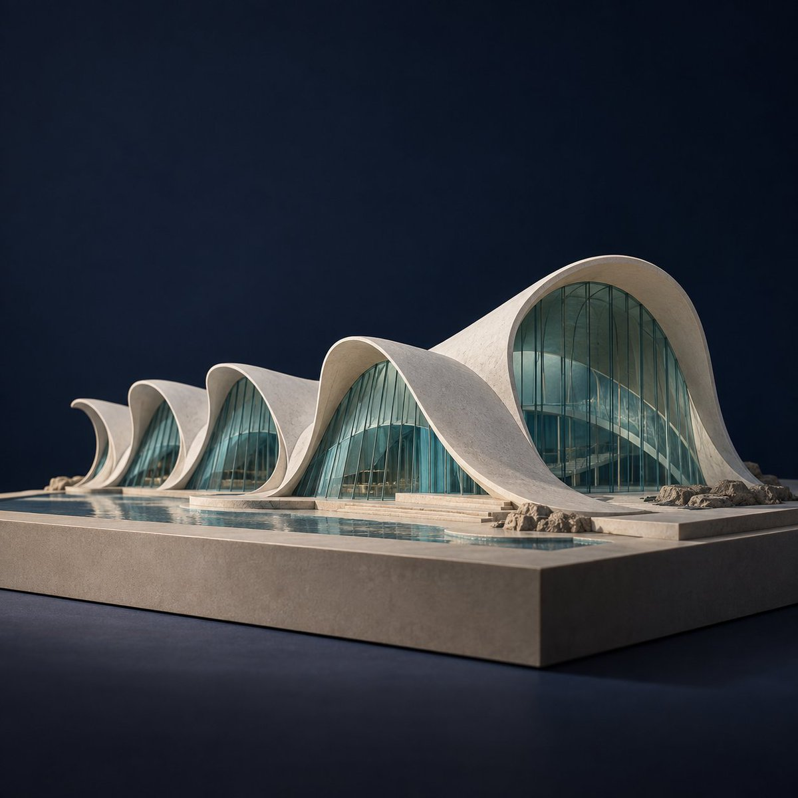

**提示詞**

```text
設計一個靈感源自[日常聲音]的建築模型。將其節奏、強度和質感轉化為一座可建造展館的輪廓，並選用能微妙喚起該聲音意象的材質。1:50比例模型的寫實建築攝影，置於暖灰色基座之上，深藏青色棚拍背景，四分之三視角，柔和側光，精準的材質細節，1:1正方形構圖，畫面中無人物、文字、標誌或聲波圖形。
```

[↑ 返回分類目錄](#catalog)

---

<a name="prompt-2102110615368270316"></a>

### 保持身份特徵的前景遮擋戲劇性低調黑白藝術特寫肖像模板。

作者：[@EhabSalahArt](https://x.com/EhabSalahArt) · [查看 X 原帖](https://x.com/EhabSalahArt/status/2102110615368270316)

攝影 · 人像 / 自拍 · 已推流

**概括:** 保持身份特徵的前景遮擋戲劇性低調黑白藝術特寫肖像模板。

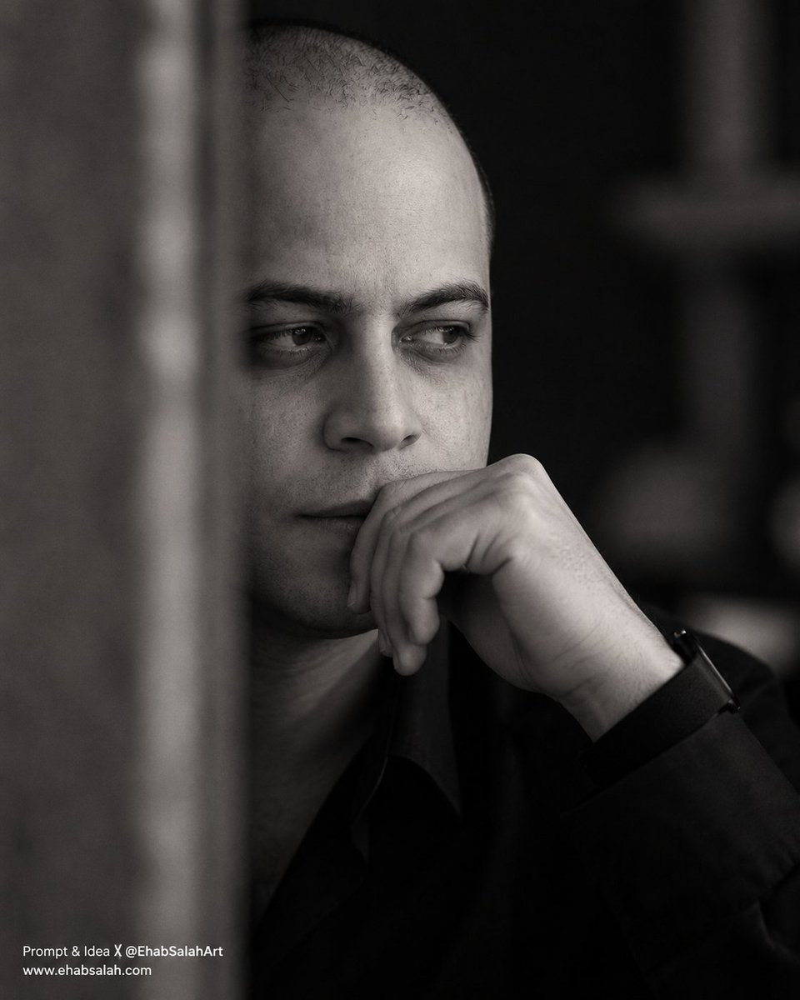

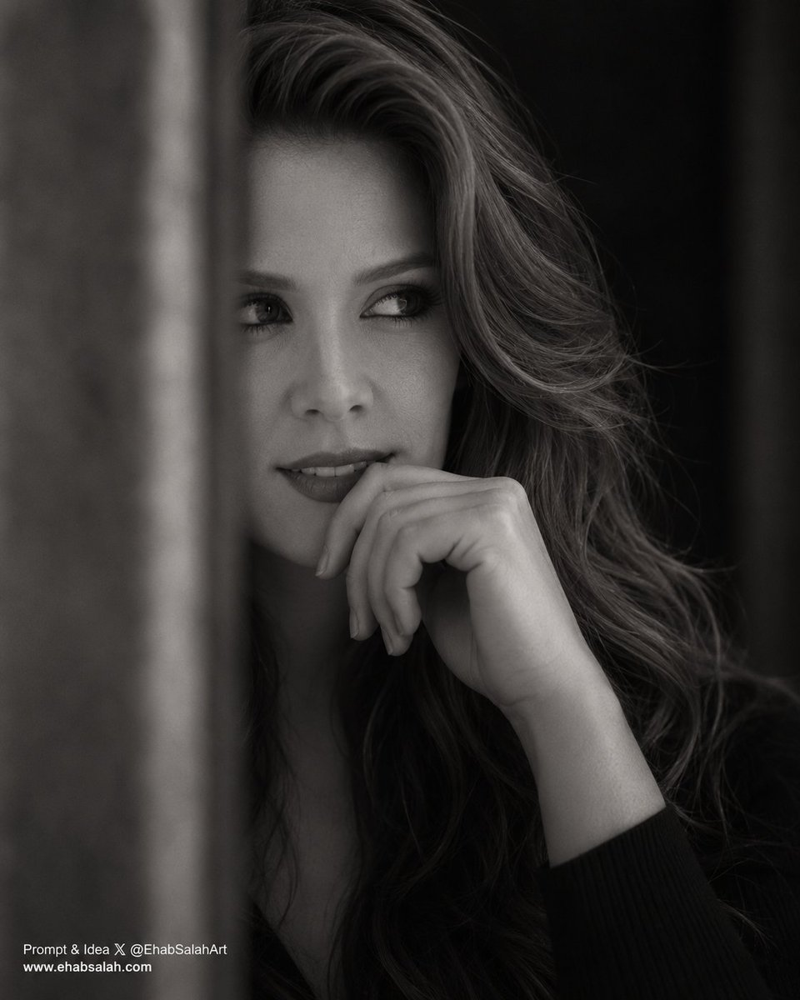

**提示詞**

```text
主體：[姓名 / 男性或女性]
使用上傳的照片作為唯一的身份參考。保持人物準確可辨的身份特徵、面部結構、眼睛、鼻子、嘴唇、下顎線、髮型或自然禿頂、膚色、年齡以及獨特特徵。不得有身份漂移，不得有不需要的毛髮，不得女性化或男性化。
以參考圖為靈感，創作一幅極具衝擊力的黑白藝術肖像：極特寫側面輪廓，主體部分隱藏在柔和的前景邊緣之後，若有所思地望向一側，一隻眼睛清晰可見。一隻手自然地停留在嘴部/下巴附近，呈現沉思姿態。戲劇性的低調布光，深邃陰影，柔和高光，豐富的單色調，真實的皮膚紋理，微妙的膠片顆粒，淺景深，暗黑極簡背景，親密的情感氛圍，純藝術紀實攝影風格，超細節，縱向 4:5。
保持姿勢自然且符合性別特徵。除我的簽名外，不包含任何文字或徽標。
僅在左下角添加：
“Prompt & Idea 𝕏 @EhabSalahArt - Lady @MFH_1984 "
“https://t.co/yKUOLllJYo”
```

[↑ 返回分類目錄](#catalog)

---

<a name="prompt-2102093685483618730"></a>

### 身穿貼身紅色蕾絲刺繡長禮服的女性攝影棚人像，背景為相呼應的深紅色紋理幕牆。

作者：[@Minahil42298354](https://x.com/Minahil42298354) · [查看 X 原帖](https://x.com/Minahil42298354/status/2102093685483618730)

攝影 · 人像 / 自拍 · 角色 · 已推流

**概括:** 身穿貼身紅色蕾絲刺繡長禮服的女性攝影棚人像，背景為相呼應的深紅色紋理幕牆。

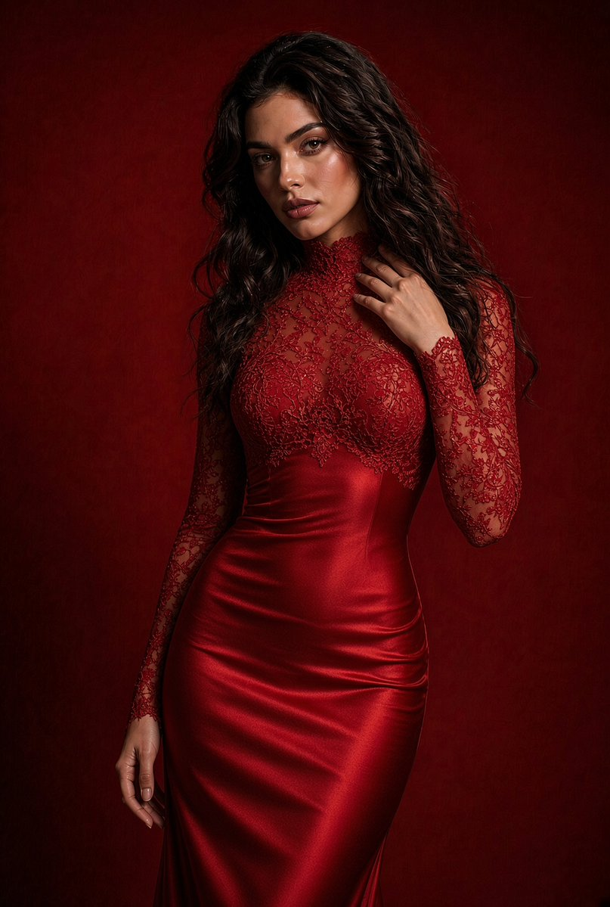

**提示詞**

```text
一張中景照片捕捉到一位留著深色波浪長髮、梳著中分髮型的女性，身穿一件貼身的紅色長袖長禮服，裙長及踝。禮服採用高領設計，上身和長袖為帶有蕾絲刺繡的半透明薄紗，與禮服其餘部分光滑絲滑的面料形成對比。她右手輕觸頸部，左手自然下垂於身側，以平靜的表情直視鏡頭。背景是一面純深紅色的紋理牆面，呈現出戲劇化且和諧統一的色調。光線柔和漫射，投射出細微的陰影，突顯出她的面部輪廓與蕾絲的質感。這是一張構圖乾淨俐落的專業攝影棚人像攝影。
```

[↑ 返回分類目錄](#catalog)

---

<a name="prompt-2102072278460559870"></a>

### 一名身穿寬鬆藍色T恤與牛仔短褲的男子在露天市集的寫實夏日街頭肖像。

作者：[@rotavirus1980](https://x.com/rotavirus1980) · [查看 X 原帖](https://x.com/rotavirus1980/status/2102072278460559870)

攝影 · 人像 / 自拍 · 角色 · 城市景觀 / 街道 · 已推流

**概括:** 一名身穿寬鬆藍色T恤與牛仔短褲的男子在露天市集的寫實夏日街頭肖像。

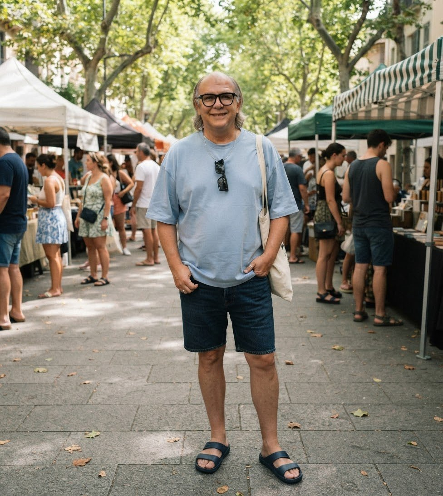

**提示詞**

```text
超寫實、隨性抓拍風格的夏季街頭肖像，一名成年男子站在週末的露天市集，在明亮自然的日光下拍攝。影像應傳達出一種放鬆、具男子氣概、親切且毫不費力的隨性風格，宛如一張隨性的旅行即時抓拍，而非刻意修飾的時尚宣傳大片。

他擁有與參考圖顏色和造型相符的頭髮，輪廓分明的眉毛，被陽光曬暖的溫暖膚色，直視鏡頭時帶著一抹親切微妙的微笑。

身形：精實的運動體態，自然寬闊的雙肩與真實的比例。保持勻稱健康的體格且不張揚，切忌過度誇張。

服飾：淺藍色寬鬆超大版型（oversized）短袖T恤。領口休閒自然，短袖。
搭配長度及大腿中段的牛仔短褲。

鞋子：簡約的海軍藍橡膠涼鞋，休閒且帶有些許穿戴痕跡。

配件：細銀項鍊，一副深色長方形太陽眼鏡隨意掛在正面腰圍處或襯衫領口，低調簡約的戒指，單肩掛著米白色帆布托特包。

姿勢：隨性站立，雙手插在短褲口袋內，肩膀放鬆，雙腳微微張開。軀幹極微角度轉向一側，臉部依然正對鏡頭。維持自然的姿態，如同有人在逛市集時停下腳步迅速拍下一張照片。

環境：蔥鬱繁茂大樹下充滿生氣的鄰近露天市集，有攤商帳篷、條紋遮陽棚、小型攤位，以及背景中穿著休閒走動的人群。加入灰色互鎖鋪石路面、散落的落葉、帆布市集頂棚，以及穿透樹木灑落的溫暖斑駁陽光。

背景應帶有真實的熙攘感但略微柔焦，人們身著夏裝、背著托特包穿著休閒鞋履。避免背景中任何臉孔過度突出。

光線：明亮的正午過濾日光，樹蔭柔和地灑在面部與身體。溫暖的膚色，藍色亞麻襯衫上的自然亮部，鋪石路面上柔和的斑駁陰影。無強烈生硬的閃光燈。

攝影風格：智慧型手機或輕便相機拍攝的直式街頭隨拍，逼真的手機鏡頭銳利度，適中的景深，細微的顆粒感，略顯溫暖的色彩還原，自然的織物與肌膚紋理，極少修圖，當代夏日旅行美學，相片級寫實，高解析度。

構圖：3:4比例的直式四分之三身肖像，主體置中，市集的熱絡活動填滿背景，淺藍色T恤形成主要色彩焦點。

負面提示：正裝套裝，長褲，運動鞋，奢華度假村，空曠背景，健美體格，濃密大鬍子，明亮螢光服飾，擺拍的時尚大片，生硬直射閃光燈，極致散景，塑膠質感皮膚，畸形的手，多餘手指，畸形的涼鞋，重複的肢體，變形的市集攤位，文字疊加，浮水印，卡通，動漫，插圖，CGI。
```

[↑ 返回分類目錄](#catalog)

---

<a name="prompt-2101838003236962807"></a>

### 四名東亞女性裹著羽絨被在夜景飯店床上的CCD閃光抓拍照提示詞。

作者：[@DDJCXX](https://x.com/DDJCXX) · [查看 X 原帖](https://x.com/DDJCXX/status/2101838003236962807)

攝影 · 人像 / 自拍 · 已推流

**概括:** 四名東亞女性裹著羽絨被在夜景飯店床上的CCD閃光抓拍照提示詞。

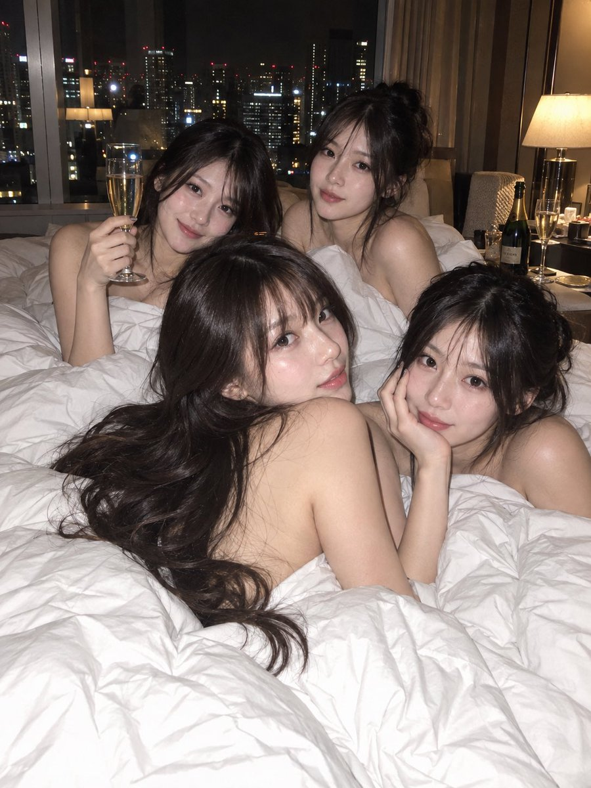

**提示詞**

```text
超寫實夜間飯店臥室雙人/群像抓拍攝影，直式約 3:4。四名明確成年的東亞女性，20+，半躺或趴在鋪滿白色羽絨被的大床上，彼此靠得很近，就像深夜聚會後在高樓層飯店房間裡隨手拍下的一張合照。攝影者位於床尾正前方約 1–1.5 米，使用 28–35mm 等效鏡頭＋正面直閃，人物以肩部到上半身為主，白色被褥占據畫面下半部。

四人都用白色羽絨被 / 床單包裹身體，只露出肩頸、鎖骨、手臂和部分上背，保持完整自然覆蓋，不出現明確裸露。人物姿勢各不相同但彼此緊密靠近：

前景中央女性離鏡頭最近，身體趴臥並向左側輕輕側轉，雙臂藏在被子內，肩膀和上背露出，頭部回頭看向鏡頭。留深棕黑色超長微卷髮＋輕薄碎瀏海，頭髮大面積散落在背部和白色被褥上，眼神安靜，嘴角略帶淡笑。

右前方女性側趴在床上，一隻手托住臉頰，頭部微微傾斜看鏡頭，留烏黑色中長鬆散盤髮 / 碎髮，表情柔和。

左後方女性靠在枕頭附近，肩膀被白色床單包住，右手舉著一隻細長香檳杯靠近臉側，黑棕色中長髮略顯凌亂，微笑看鏡頭。

右後方女性半坐在床頭區域，身體向鏡頭轉回，烏黑色頭髮鬆散扎起，肩部包裹白色床品，神情輕鬆自然。

場景為高樓層豪華飯店夜景臥室。後方整面落地窗能看到密集城市夜景、辦公大樓燈光和零星紅色航空障礙燈；室內採用深棕木飾面、暖黃色檯燈和米色軟包家具。右後方小桌上擺放香檳瓶、細長酒杯和少量派對用品，增強深夜派對結束後的真實感。

光線採用便攜數位相機正面直閃＋飯店暖色燈光。人物臉部、肩頸和白色被褥被明顯提亮，皮膚帶輕微水光高光；背景迅速壓暗，城市燈光形成零星光點。白色被子略有過曝但仍保留褶皺。

整體呈 2000s–2010s 高樓層飯店深夜聚會 CCD / 數位相機抓拍質感：輕微顆粒、有限動態範圍、直閃偏硬、膚色暖白、少量 JPEG 感，不要現代 HDR 或商業棚拍。

重點鎖定：四名成年東亞女性＋白色羽絨被包裹身體＋高樓層飯店床上緊密合照＋前景長卷髮女性回頭看鏡頭＋右側托腮女性＋左後人物拿香檳杯＋城市夜景落地窗＋暖黃色檯燈＋香檳瓶酒杯＋正面直閃＋深夜派對抓拍。

避免：明確裸露、內衣外露、人數錯誤、白天、普通住宅、攝影棚、整齊坐成一排、厚重妝容、動漫臉、CG 感、塑膠皮膚、多餘肢體、浮水印和亂碼文字。
```

[↑ 返回分類目錄](#catalog)

---

<a name="prompt-2101972762806071784"></a>

### 東亞年輕女性開門迎客的寫實寫真提示詞。

作者：[@FuguiChen1314](https://x.com/FuguiChen1314) · [查看 X 原帖](https://x.com/FuguiChen1314/status/2101972762806071784)

攝影 · 人像 / 自拍 · 角色 · 已推流

**概括:** 東亞年輕女性開門迎客的寫實寫真提示詞。

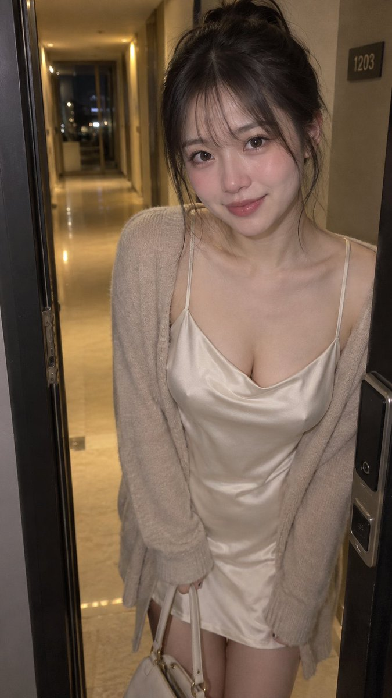

**提示詞**

```text
9:16 中景，男生的視角，東亞女性成熟約24歲，小臉飽滿雙頰，雙眼皮大眼睛水潤，眉毛清秀，鼻梁短小，櫻桃小嘴濕潤抿嘴微笑，皮膚白皙均勻臉頰微紅，黑直髮高馬尾瀏海稀疏。表情：剛開門見到他，既害羞又開心，同時注視鏡頭如同注視前來接她的人。
公寓大廳夜晚。米色絲質吊帶裙，外披淺米色開衫。她站在門框內，一手拿著包，身子朝向鏡頭。不擺姿勢。
鏡頭角度從站在門口的人視角，胸部高度，35mm，距離約1.2米，人物占畫面約65%，從頭髮裁剪到大腿中部，臉部略偏右。走廊燈光金黃模糊。
大廳光線低調均勻。顏色占比約36%膚色，22%米色，18%淺米色，24%走廊。逼真照片快照。
```

[↑ 返回分類目錄](#catalog)

---

<a name="prompt-2101988560278573259"></a>

### 翻譯中

作者：[@Hamburgerai](https://x.com/Hamburgerai) · [查看 X 原帖](https://x.com/Hamburgerai/status/2101988560278573259)

海報／傳單 · 攝影 · 已推流

**概括:** 翻譯中

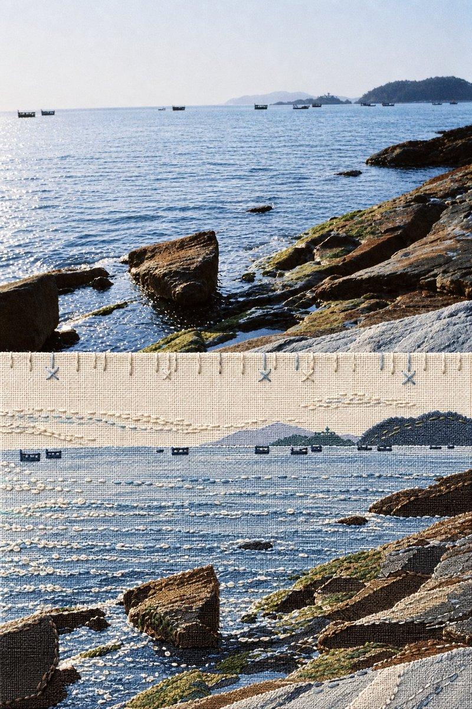

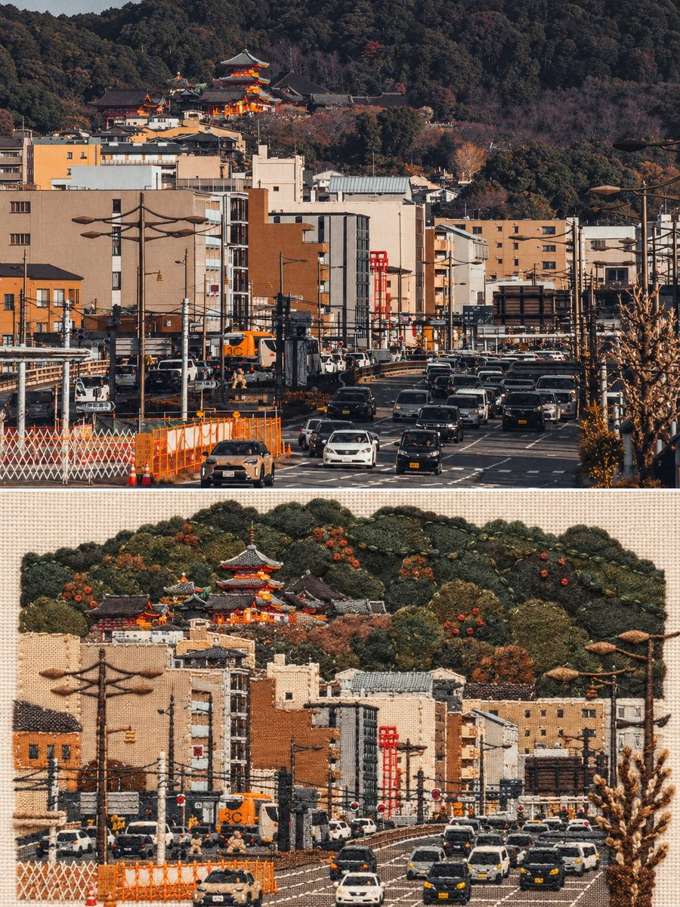

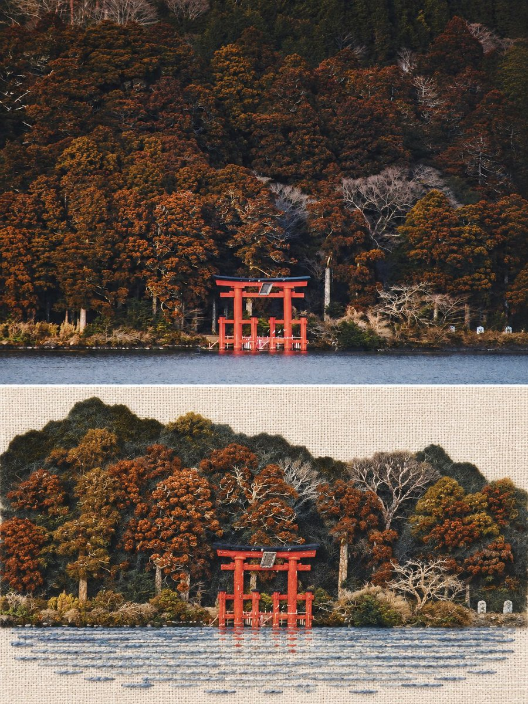

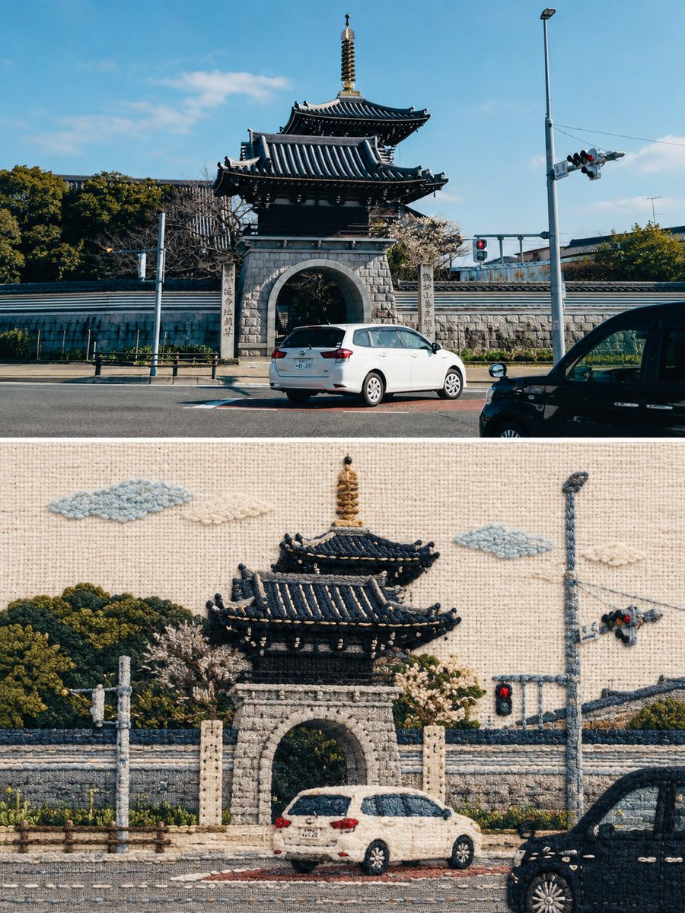

**提示詞**

```text
翻譯中
```

[↑ 返回分類目錄](#catalog)

---

<a name="prompt-2101800719636734040"></a>

### 海軍藍背景下身穿白洋裝配戴藍色V形吊墜的年輕金髮時尚模特兒肖像。

作者：[@Milliekio](https://x.com/Milliekio) · [查看 X 原帖](https://x.com/Milliekio/status/2101800719636734040)

攝影 · 人像 / 自拍 · 網紅 / 模特兒 · 時尚單品 · 摘要 / 背景 · 已推流

**概括:** 海軍藍背景下身穿白洋裝配戴藍色V形吊墜的年輕金髮時尚模特兒肖像。


**提示詞**

```text
年輕的金髮白人時尚女模特兒，白皙的肌膚，俐落分明的下顎線，深邃明亮的雙眼，嚴肅內省的凝視，雙手將筆直細軟的秀髮向上撈起，手肘抬高，散落的髮絲修飾著臉龐。身穿肩部打結的白色絲質細肩帶洋裝，配戴鈷藍色琺瑯V形吊墜，啞光海軍藍背景，自然漫射側光，奢華時尚大片美學，淺景深，85mm視平線拍攝，頭頂至胸骨裁切，超逼真高解析度攝影。
```

[↑ 返回分類目錄](#catalog)

---

<a name="prompt-2101823724576002228"></a>

### 高角度俯拍直閃特寫照片，展現女子坐在地上被前景手掌托腮的親密構圖與服飾光影細節。

作者：[@AIna\_dailylooks](https://x.com/AIna_dailylooks) · [查看 X 原帖](https://x.com/AIna_dailylooks/status/2101823724576002228)

攝影 · 角色 · 已推流

查看 X 原帖：[@AIna\_dailylooks](https://x.com/AIna_dailylooks) · [查看 X 原帖](https://x.com/AIna_dailylooks/status/2101728093106815214)

**概括:** 高角度俯拍直閃特寫照片，展現女子坐在地上被前景手掌托腮的親密構圖與服飾光影細節。


**提示詞**

```text
主體與構圖：
一張逼真寫實的直幅特寫照片，主角為（CHARACTER），一位年滿21歲或以上的成年女性，正坐在室內磁磚地面上。她的臉部在畫面中佔比極大且置中。相機以極高的、近乎俯視的頂拍視角俯拍著她。屬於另一位成年人的一隻大手從左下方前景伸入，溫柔地托住她的下巴與雙頰。前臂從左下角呈對角線延伸至畫面中央，營造出一種獨特、親密且近距離的構圖。

角色與表情：
保持（CHARACTER）既有的臉部特徵、髮型、髮色、膚色及整體身分不變。她微微抬臉並直視鏡頭，光澤的雙唇微啟。她的神情迷人、自信且隱約帶有性感魅惑。柔和而顯著的玫瑰色腮紅為她的雙頰增添了溫暖氣色。她的秀髮自然垂於肩上，並朝地面微微散開。

服裝與姿勢：
她身穿一件合身的深酒紅色羅紋針織上衣，深V領口，正面有小排扣，胸口下方飾有小巧精緻的蝴蝶結。下半身搭配黑色短裙。她雙膝併攏坐在地上。她自己的雙臂保持在畫面之外。另一位成年人的手從左下邊緣伸入，溫柔地托著她的下巴和雙頰，沒有擠壓或使臉部變形。

背景與光影：
深巧克力色窗簾、白色磁磚地板，以及畫面右側邊緣少許的黑色家具。帶有細微直閃特質的柔和正面光線照亮了她的臉部與頸項領口，而背景則維持較暗且低調的狀態。突顯濃郁的酒紅色布料、黑色短裙、溫暖膚色與柔和玫瑰色妝容之間的對比。

相機與取景：
一張以極高角度於極近距離使用廣角鏡頭拍攝的3:4直幅照片。將她的臉部顯著置於畫面中上方，領口與膝蓋在構圖中向下延伸。透視效果使得前景的手與粗實的斜向前臂顯著放大，佔據了畫面左下方及中央的相當比例。保持手部解剖結構自然，與臉部的接觸輕柔。於畫面邊緣自然裁切可見的身體部分。畫面底緣包含一小塊柔和模糊的黑色衣物。

焦點銳利對準她的臉部與前景的手，背景自然模糊。儘管視角獨特，仍保持雙眼、鼻子與嘴唇的清晰呈現。

質感與風格：
超寫實、高解析度的直閃攝影。栩栩如生的皮膚紋理與細微光澤、細緻的睫毛、水光感唇色、針織面料清晰可見的羅紋，以及前景手部與前臂的逼真質感。豐富的酒紅與玫瑰色調、真實的陰影、逼真的廣角透視，以及精準的解剖細節。

一位成年女性，以及屬於另一位成年人的一隻可見手掌與前臂。無多餘的手、無多餘的手指、無變形的臉部特徵、無重複的人物、無文字、無浮水印、無拼貼。
```

[↑ 返回分類目錄](#catalog)

---

<a name="prompt-2101806462888734913"></a>

### 翻譯中

作者：[@muse\_ai\_prompt](https://x.com/muse_ai_prompt) · [查看 X 原帖](https://x.com/muse_ai_prompt/status/2101806462888734913)

攝影 · 角色 · 已推流

**概括:** 翻譯中


**提示詞**

```text
翻譯中
```

[↑ 返回分類目錄](#catalog)

---

<a name="prompt-2101692303933116730"></a>

### 一名穿著灰色運動套裝的女子在黃昏時分的機場走向私人飛機的照片提示詞。

作者：[@oye\_samia](https://x.com/oye_samia) · [查看 X 原帖](https://x.com/oye_samia/status/2101692303933116730)

攝影 · 人像 / 自拍 · 角色 · 已推流

**概括:** 一名穿著灰色運動套裝的女子在黃昏時分的機場走向私人飛機的照片提示詞。


**提示詞**

```text
iPhone拍攝的9:16相片。
臉部嚴格依照參考圖。

傍晚，私人機場。
一名女子走向一架私人飛機。

飛機在她身後清晰完整可見。

灰色運動套裝、白色球鞋、深色旅行包。

手機握在手裡，看著螢幕。

跑道燈光，深藍色天空。

動態抓拍，無刻意擺拍。

背景清晰銳利，無CGI。
```

[↑ 返回分類目錄](#catalog)

---

<a name="prompt-2101647060357222565"></a>

### 在江之島淺灘戲水的3位日本女性，以智慧型手機標準相機拍攝的快照風格影像生成提示詞。

作者：[@HObE4TLMga99335](https://x.com/HObE4TLMga99335) · [查看 X 原帖](https://x.com/HObE4TLMga99335/status/2101647060357222565)

攝影 · 已推流

查看 X 原帖：[@HObE4TLMga99335](https://x.com/HObE4TLMga99335) · [查看 X 原帖](https://x.com/HObE4TLMga99335/status/2101189292827779362)

**概括:** 在江之島淺灘戲水的3位日本女性，以智慧型手機標準相機拍攝的快照風格影像生成提示詞。


**提示詞**

```text
人物同一性：
女性1為22歲成年日本女性，身高168cm，資訊工程學系大四學生。縱長心形臉、橫向杏仁眼、弓形眉、右頰有小痣、及胸的完全直黑髮。女性2為30歲成年日本女性，身高166cm，烘焙咖啡廳店長。柔和的圓卵形臉、鼻樑有淡淡雀斑、左眼尾下方有痣、微笑時有酒窩。及肩黑色短鮑伯頭，耳周與底層內側才帶有灰色。在海邊拿下眼鏡。女性3為23歲成年日本女性，身高152cm，美甲師。圓潤小臉、垂眼、右眼下方有痣、黑色低雙馬尾，僅髮尾內側染有灰粉色。維持3人成熟成人的容貌與自然全身比例，不混淆彼此特徵。

髮型：
女性1及胸的黑色順直長髮在腦後束成單一馬尾。維持長度與筆直髮質，濕漉長髮不遮蔽臉部或前胸。女性2及肩直髮鮑伯頭在後頸束成小巧低馬尾，長度不足的碎髮挽於耳後。頭頂、表面與髮根為黑色，僅在耳朵內側與髮結下方的髮尾保留煙燻冷灰色。女性2頭髮不留長，不盤成大髮髻。女性3維持黑髮低雙馬尾與髮尾內側的灰粉色。

服裝：
女性1為水藍色、女性2為深炭灰、女性3為灰粉色，皆為正面完全閉合的不透明短袖防磨衣（防曬泳衣）。各自穿於不透明運動泳衣外，遮蓋胸部、腹部與肩膀。女性1與女性3穿深藍色，女性2穿黑色及膝上泳褲。赤腳。衣物不透光、不脫下衣物。

場景與構圖：
橫幅3:2單張連續照片。午後江之島海邊淺灘。不將3人安排成橫向並排、等間距的紀念合照站姿。在平靜淺灘上，3人面向彼此，呈現小三角形站位。偏左前方的女性1採偏側面的三分之二視角，單手向右後方的女性3潑起少量水花。另一隻手自然放置於水面附近。女性1的臉部略呈側臉角度並笑著看向對方。偏右稍後方的女性3使用淡粉色泳圈，左手抓著泳圈邊緣，因女性1的微小水花而微感驚訝地輕抬右前臂。笑著略微瞇眼但臉部清晰可見。位於女性3身旁更深處、畫面中央偏處的女性2，單手輕扶女性3泳圈的遠端邊緣一同戲水。女性2另一隻手臂於身側自然垂至水面。女性2正看著女性3微笑。3人頭部與肩膀具前後景深落差，女性1的肩膀與女性3的泳圈極小部分自然重疊，但避免造成臉部或手部歸屬不明的重疊遮擋。泳圈僅有女性3的粉紅色1個。女性1與女性2不配戴泳圈，不繪製藍白或黃色泳圈。

拍攝：
不打擾友人嬉戲的斜向角度智慧型手機快照。無人直視鏡頭。頭頂與左右兩側留白，容納3人的上半身、女性3的1個泳圈、全員入水的姿態以及前景水面。不呈現水平肩膀列或均等配置。3人處於可近距離交談的配置，但景深彼此錯開約1公尺。單一自動對焦對準前景女性1的臉部附近，後方兩人依自然距離差略為柔化，但五官輪廓與動作依然清楚可辨。局部有水滴與動作中手部的輕微動態模糊，不單獨對皮膚與臉部進行銳化。

背景與光線：
平靜的藍綠色海面，遠處柔和顯現的海岸線與江之島，午後自然光線。水面反射的微弱光線映照至衣服與臉部，髮絲陰影依然保留。

必須與避免的表現：
海水深及大腿至腰部附近，3人的腳踏於海底。僅有微小水花，無大浪、潛水、摔倒或危險動作。泳圈與手臂的接觸、每人各2隻手臂與2隻手均需正確描繪。臉部與手臂不重複，身體不與泳圈融合。背景可見海岸線與江之島。不添加文字、標誌或分割畫面。

固定實拍畫質：
如同一般智慧型手機內建標準相機應用程式拍攝、接近無修圖的單張HEIC照片。不使用人像模式、美肌濾鏡、單獨臉部重新打光、曝光補償、二次銳化、降噪與磨皮修飾。AF僅對焦於相機段落所指定之單一切面，該切面呈現最自然的清晰，前後人物、手腳、配件與背景隨距離與動作呈現連續性柔化。較遠的臉孔不添加虛假毛孔或全域8K解析度，保留單頰微弱泛紅、不均勻的T字部位反光、具左右差異的眼下陰影、鼻周輕微泛紅等多處寬廣色調層次。近距離清晰的裸露肌膚保留不重複的細微膚色差、關節與受壓處的自然泛紅、細緻光影。肌膚、毛髮、布料、金屬、木材、牆面、水體等各材質具不同反光、輪廓與細節，不具備相同光澤或一致的銳利度。容許克制的HDR、微小的自動白平衡偏差、僅存在於暗部的細微噪點、輕微HEIC壓縮、局部輕微手震與構圖偏移，但不在全畫面添加人工雜訊顆粒、均勻模糊或過度銳化。呈現為留存於個人手機相簿中的未修飾生活瞬間，非廣告、寫真雜誌、時尚形象照、攝影棚精修美顏照、電影風格調色或對稱構圖。
```

[↑ 返回分類目錄](#catalog)

---

<a name="prompt-2101664927593443374"></a>

### 翻譯中

作者：[@HObE4TLMga99335](https://x.com/HObE4TLMga99335) · [查看 X 原帖](https://x.com/HObE4TLMga99335/status/2101664927593443374)

攝影 · 角色 · 已推流

查看 X 原帖：[@HObE4TLMga99335](https://x.com/HObE4TLMga99335) · [查看 X 原帖](https://x.com/HObE4TLMga99335/status/2101267810190065998)

**概括:** 翻譯中


**提示詞**

```text
翻譯中
```

[↑ 返回分類目錄](#catalog)

---

<a name="prompt-2101665636380475723"></a>

### 翻譯中

作者：[@muse\_ai\_prompt](https://x.com/muse_ai_prompt) · [查看 X 原帖](https://x.com/muse_ai_prompt/status/2101665636380475723)

攝影 · 角色 · 已推流

**概括:** 翻譯中


**提示詞**

```text
翻譯中
```

[↑ 返回分類目錄](#catalog)

---

<a name="prompt-2101590457742442606"></a>

### 室內超寫實肖像攝影，描繪斜躺在黑絨沙發上的年輕東亞女性全景。

作者：[@naxingxiaochen](https://x.com/naxingxiaochen) · [查看 X 原帖](https://x.com/naxingxiaochen/status/2101590457742442606)

攝影 · 人像 / 自拍 · 建築 / 室內設計 · 已推流

**概括:** 室內超寫實肖像攝影，描繪斜躺在黑絨沙發上的年輕東亞女性全景。


**提示詞**

```text
超寫實室內居家肖像攝影，直式約 4:5。一名明確成年的東亞女性，20+，半躺在黑色絨面沙發上，身體沿沙發斜向展開，攝影者位於人物正前方略偏左，以 28–35mm 等效鏡頭近距離拍攝，完整保留頭部、軀幹、雙腿和腳部。

人物為自然纖細沙漏型身材，肩部偏窄，腰部收束，髖部圓潤
```

[↑ 返回分類目錄](#catalog)

---

<a name="prompt-2101596690809758103"></a>

### 七隻家貓身穿火影忍者曉組織黑紅袍在狹窄樓梯間的廣角仰拍寫實攝影。

作者：[@DDJCXX](https://x.com/DDJCXX) · [查看 X 原帖](https://x.com/DDJCXX/status/2101596690809758103)

攝影 · 動物 / 生物 · 已推流

查看 X 原帖：[@yrn\_not\_slime](https://x.com/yrn_not_slime) · [查看 X 原帖](https://x.com/yrn_not_slime/status/2101265659204133276)

**概括:** 七隻家貓身穿火影忍者曉組織黑紅袍在狹窄樓梯間的廣角仰拍寫實攝影。


**提示詞**

```text
超寫實搞怪寵物群像攝影，直版約 9:16。七隻真實家貓擠在狹窄昏暗的樓梯間裡，全部穿著統一的黑色長袍＋紅色雲紋斗篷造型，頭戴金屬忍者護額，整體明顯是《火影忍者》曉組織風格 Cosplay。攝影者位於樓梯最下方，使用約 20–24mm 廣角鏡頭向上近距離拍攝，形成強烈的層層堆疊與近大遠小透視。

七隻貓沿狹窄樓梯從前到後分成多層排列，幾乎完全填滿畫面。最前方是一隻橘白貓，距離鏡頭最近，頭部被廣角明顯放大，佔據畫面下方約三分之一，戴黑色兜帽和銀色金屬護額，黃色眼睛直視鏡頭，嘴巴微張，露出一點牙齒，表情兇狠又滑稽。

右側中前景是一隻體型較大的灰白貓，臉寬圓，綠色眼睛半瞇，黑色兜帽包住頭部，只露出臉，護額中央有黑色忍者符號。左側是一隻虎斑白貓，神情嚴肅，黃色綠色眼睛看向鏡頭。

中央是一隻純白圓臉貓，穿完整黑紅長袍，兜帽收緊，額頭佩戴金屬護額，鼻樑和額頭附近帶一列黑色裝飾點，神情冷靜。左後方還有一隻白貓，右後方是一隻純黑貓，綠色眼睛在暗處非常醒目，背後斜背一把短刀 / 忍者刀。

最上方是一隻棕色虎斑貓，頭頂增加誇張的金黃色刺狀假髮，模仿動漫忍者髮型，佩戴金屬護額，藍綠色雙眼直視鏡頭，身體只露出上半部。

所有貓都保持真實貓咪頭部、毛髮、鬍鬚、耳朵和眼睛結構，不要做人臉化、不要擬人手臂。服裝為黑色高領長袍，邊緣帶暗紅色滾邊，胸前和身體側面分布醒目的紅色雲朵圖案；部分貓戴黑色兜帽，部分耳朵從兜帽中露出。護額為銀灰色金屬片＋黑色布帶，表面帶刻蝕符號和使用痕跡。

場景是非常狹窄的老舊室內樓梯 / 水泥通道，兩側為灰白色粗糙牆面，頂部光線極少，整體空間壓迫。右上牆面可以出現一隻貓爪從破損牆洞探出作為搞怪細節。

光線採用正面相機閃光＋昏暗環境光，最前方橘貓和中層貓臉被強烈照亮，後排逐漸進入綠色灰暗陰影。色調偏冷綠、灰黑，紅色雲紋形成明顯色彩點。加入輕微膠片顆粒、老式數位相機質感、邊緣柔化和暗角。

重點鎖定：七隻真實家貓＋曉組織黑紅雲紋長袍＋金屬忍者護額＋狹窄樓梯層層堆疊＋最前方橘白貓超近距離大臉＋中間白貓＋右側黑貓＋頂部虎斑貓黃色刺髮＋廣角仰拍＋直閃＋暗綠色老舊樓梯間＋搞怪但寫實。

避免：人類身體、貓娘、動漫畫風、卡通貓、四肢畸形、貓數量錯誤、服裝顏色錯誤、明亮背景、戶外場景、整齊排隊、過度CG、浮水印、文字亂碼。
```

[↑ 返回分類目錄](#catalog)

---

<a name="prompt-2101630333850456318"></a>

### 由回收電子產品和電子垃圾完全製成的逼真攝影棚 \[ANIMAL\] 雕塑，在中性灰色背景上帶有小法文標籤。

作者：[@Weilnes](https://x.com/Weilnes) · [查看 X 原帖](https://x.com/Weilnes/status/2101630333850456318)

攝影 · 動物 / 生物 · 摘要 / 背景 · 已推流

**概括:** 由回收電子產品和電子垃圾完全製成的逼真攝影棚 \[ANIMAL\] 雕塑，在中性灰色背景上帶有小法文標籤。


**提示詞**

```text
在攝影棚中拍攝的逼真雕塑，主題為 [ANIMAL]，完全由回收的廢棄電子產品和電子垃圾（電路板、鍵盤、銅線、遙控器、手機、滑鼠、CRT螢幕、線纜）製成。中性淺灰色背景，柔和的產品光，錯綜複雜的組裝結構清晰可辨認出動物形態。附有命名該主題的小法文標籤（le lion des circuits, le requin clavier, l'aigle télécommandes, l'ours polaire souris）。無英文，無標誌，無浮水印。長寬比 3:4
```

[↑ 返回分類目錄](#catalog)

---

<a name="prompt-2101629192269894120"></a>

### 翻譯中

作者：[@HObE4TLMga99335](https://x.com/HObE4TLMga99335) · [查看 X 原帖](https://x.com/HObE4TLMga99335/status/2101629192269894120)

攝影 · 人像 / 自拍 · 角色 · 已推流

查看 X 原帖：[@HObE4TLMga99335](https://x.com/HObE4TLMga99335) · [查看 X 原帖](https://x.com/HObE4TLMga99335/status/2101114802370498616)

**概括:** 翻譯中


**提示詞**

```text
翻譯中
```

[↑ 返回分類目錄](#catalog)

---

<a name="prompt-2101586419496132828"></a>

### 逆光半剪影下的東方女性全身人像攝影提示詞。

作者：[@MrGafish](https://x.com/MrGafish) · [查看 X 原帖](https://x.com/MrGafish/status/2101586419496132828)

攝影 · 人像 / 自拍 · 角色 · 已推流

**概括:** 逆光半剪影下的東方女性全身人像攝影提示詞。


**提示詞**

```text
生成 4 張獨立的豎版照片，每張單獨作為一個圖像結果輸出。 東方成年女性，9:16全身入鏡，吊眼構圖，強光從身後湧來，把人物剪成半剪影，髮絲邊緣被照得發亮，白色輕薄外套不扣前襟隨意披上，重要部位被完全遮住 負面：上衣、下裝
```

[↑ 返回分類目錄](#catalog)

---

<a name="prompt-2101584399359975634"></a>

### 日系辦公室三人職場寫真提示詞，包含特定著裝與坐姿構圖。

作者：[@wyi1988](https://x.com/wyi1988) · [查看 X 原帖](https://x.com/wyi1988/status/2101584399359975634)

攝影 · 人像 / 自拍 · 時尚單品 · 已推流

**概括:** 日系辦公室三人職場寫真提示詞，包含特定著裝與坐姿構圖。


**提示詞**

```text
日系辦公室三人職場寫真 × 輕柔焦清透長焦雜誌質感 × 白襯衫黑短裙·左右煙黑薄絲襪·中央裸腿·黑色尖頭高跟鞋 × 左坐桌沿交叉腿·中間正坐並腿·右坐辦公椅交叉腿緊密合照
```

[↑ 返回分類目錄](#catalog)

---

<a name="prompt-2101571702694285681"></a>

### 東方新娘在婚禮現場化妝的高角度構圖提示詞。

作者：[@MrGafish](https://x.com/MrGafish) · [查看 X 原帖](https://x.com/MrGafish/status/2101571702694285681)

攝影 · 人像 / 自拍 · 已推流

**概括:** 東方新娘在婚禮現場化妝的高角度構圖提示詞。


**提示詞**

```text
東方成年新娘，吊眼構圖，婚禮現場化妝中，9:16
```

[↑ 返回分類目錄](#catalog)

---

<a name="prompt-2101560114746622072"></a>

### 東方年輕女性三角比基尼人像寫真，具真實攝影質感。

作者：[@MrGafish](https://x.com/MrGafish) · [查看 X 原帖](https://x.com/MrGafish/status/2101560114746622072)

攝影 · 人像 / 自拍 · 已推流

**概括:** 東方年輕女性三角比基尼人像寫真，具真實攝影質感。


**提示詞**

```text
20–25歲東方成年女性，纖細勻稱身材，上圍豐滿，鎖骨清晰，三角比基尼上衣，細肩帶設計，真人攝影質感，生成 10 個完全不同版本
```

[↑ 返回分類目錄](#catalog)

---

<a name="prompt-2101577581099360262"></a>

### 翻譯中

作者：[@DDJCXX](https://x.com/DDJCXX) · [查看 X 原帖](https://x.com/DDJCXX/status/2101577581099360262)

攝影 · 人像 / 自拍 · 已推流

**概括:** 翻譯中


**提示詞**

```text
翻譯中
```

[↑ 返回分類目錄](#catalog)

---

<a name="prompt-2101428013095145597"></a>

### 黃昏秋色中城堡露台階梯上的奇幻女王全身肖像。

作者：[@TaliaAariz](https://x.com/TaliaAariz) · [查看 X 原帖](https://x.com/TaliaAariz/status/2101428013095145597)

攝影 · 人像 / 自拍 · 角色 · 已推流

**概括:** 黃昏秋色中城堡露台階梯上的奇幻女王全身肖像。


**提示詞**

```text
黃昏時分，一位威嚴的奇幻女王優雅地佇立在散落著秋葉的石質露台階梯上的全身肖像。她身穿一襲華麗的深祖母綠緊身胸衣長裙，飾有精緻的金箔刺繡與深紅寶石點綴，具有大膽的高開衩設計，外披一件飾有金色花卉圖案的飄逸酒紅色天鵝絨斗篷。她深色的長捲髮上戴著一頂精緻的金王冠，並配有相襯的垂墜耳環和鑲寶石的金色繫帶高跟鞋。背景中，一座燈火通明的中世紀奇幻城堡佇立在幽暗的夜空下，四周環繞著散發暖光的燈籠、石欄杆以及一面印有金獅徽章的深紅紋章旗幟。極致細節，電影級氛圍光效，濃郁的秋季色調。
```

[↑ 返回分類目錄](#catalog)

---

<a name="prompt-2101438994257166591"></a>

### 翻譯中

作者：[@muse\_ai\_prompt](https://x.com/muse_ai_prompt) · [查看 X 原帖](https://x.com/muse_ai_prompt/status/2101438994257166591)

攝影 · 人像 / 自拍 · 角色 · 時尚單品 · 已推流

**概括:** 翻譯中


**提示詞**

```text
翻譯中
```

[↑ 返回分類目錄](#catalog)

---

<a name="prompt-2101438280239861785"></a>

### 在午後旅館的和室中，身著淡薰衣草色蕾絲內衣、在座桌旁品嚐布丁並微笑的日本女性高品質寫實人像提示詞。

作者：[@muse\_ai\_prompt](https://x.com/muse_ai_prompt) · [查看 X 原帖](https://x.com/muse_ai_prompt/status/2101438280239861785)

攝影 · 人像 / 自拍 · 角色 · 已推流

**概括:** 在午後旅館的和室中，身著淡薰衣草色蕾絲內衣、在座桌旁品嚐布丁並微笑的日本女性高品質寫實人像提示詞。


**提示詞**

```text
🌟午後的旅館｜薰衣草蕾絲與布丁的甜蜜時光🌟

【主題・畫風】
描繪一位明確成年的日本女性，在午後旅館的和室裡，一邊品嚐布丁一邊向戀人展現開心的笑容。採用寫實的高品質攝影表現手法，呈現介於寫真集與自然生活風攝影之間的質感。雖身著內衣卻不過度強調情色感，著重表現如同在旅途中共同度過寧靜午後般的親密、可愛與優雅。

【場所・背景・世界觀】
面向庭院的沉靜旅館和室。在鋪有榻榻米的室內，自然地擺放著低矮的木製座桌、座墊、障子拉門、壁龕等。座桌挪向畫面邊緣，不遮擋人物的身體與衣物。障子拉門外柔和地顯露出明亮的庭院綠植、樹木以及石燈籠的一部分，構成從室內延伸至庭院的縱深感。布丁的玻璃容器、茶杯、小巧的花朵等作為含蓄的生活感點綴其中。

【季節・時間・天氣】
令人聯想到春夏之交的溫和晴朗午後。並非強烈的直射陽光，而是穿透障子灑入室內的明亮柔和自然光。庭院的綠意中帶有陽光的暖意，室內則保持著沉穩的明亮感。幾乎無風，讓人感受到在旅館房間悠閒休息的靜謐時光流逝。

【人物設定】
25歲左右、明確成年的日本女性。面容柔和端正，黑眼珠略大的雙眸，自然的眉毛，氣色紅潤的雙唇。深棕色及肩髮帶有自然的波浪卷，臉頰周圍留有細膩的碎髮。膚色為明亮的淺赭色調，具有能看見細膩陰影與自然血色的寫實質感。
體型呈現纖細的肩膀、手腳、較細的腰身與女性化曲線相協調的自然豐滿身材。胸部明顯豐滿碩大，但並非僵硬的球狀或過度集中托高，而是保持順應坐姿與重力的柔和立體感。臀部也呈現從腰部自然銜接的平緩圓潤曲線。

【服裝・配飾】
淡薰衣草色的胸罩與內褲套裝。令人聯想到華歌爾風格的優雅設計，飾有白色與淡紫色的碎花刺繡、細緻的蕾絲以及精細的滾邊。罩杯部分帶有寫實的內襯與縫線，自然包裹豐滿胸部的同時，尺寸適度，布料不會極度緊繃或浮起脫空。
內褲也採用同色系的蕾絲與小碎花刺繡以保持統一，自然貼合腰臀部。基本不佩戴飾品，優先體現旅館中放鬆身心的純樸氛圍。赤足，不添加華麗裝飾。

【姿勢・動作・視線】
女性坐在置於座桌旁的座墊上，腰部保持穩定，雙腿向身體一側傾斜側放。膝蓋自然彎曲，腳尖放鬆順應榻榻米放置。上半身比正面略微朝向相機方向，背脊自然挺直而不顯僵硬。
單手端著小巧的玻璃布丁容器，位置略低於胸部，另一手拿著小湯匙。正是吃完一口、正要把湯匙移回容器上方的瞬間。視線投向正面的戀人，並非僅注視食物，而是表現出共同分享這份喜悅的情景。

【表情・情感】
因布丁的美味而發自內心地感到開心，不由得微微瞇起雙眼的自然笑容。眉毛和臉頰微微放鬆，嘴角溫柔上揚。流露出彷彿在向戀人傳達「這個好好吃」的親切神情。不大笑過度，也不做作，重視捕捉日常生活瞬間的自然流露情感。

【構圖・相機】
適合X（原Twitter）發布的4:5縱向構圖。從頭頂到赤足的腳尖，留有充裕空間的全身拍攝。距離感適中，能看清坐姿的身體、側放的雙腿、腳尖以及端著布丁的手。相機置於接近坐著人物的胸部至肩膀的高度，從稍帶斜前方的角度拍攝。
使用標準至中望遠視角的自然焦距，避免極端的廣角變形。人物置於略微偏向畫面一側的位置，在另一側展現座桌與庭院，營造出和室特有的空間開闊感。背景輕微虛化，但保留足以辨識榻榻米、障子和庭院存在的程度。

【光線・色彩・質感・氛圍】
主光源為來自庭院一側障子和開口處的午後自然光。柔和地照亮人物面部和身體的一側，另一側則透過榻榻米和木材的反射光溫和補充。陰影邊緣不生硬，形成能夠自然展現皮膚與服裝立體感的柔和陰影。
展現皮膚的細膩質感與自然氣色、髮絲的縷縷走勢與碎髮、蕾絲的精緻刺繡與布料厚度。細緻刻畫榻榻米的乾燥纖維感、座桌的木紋、玻璃容器的反射以及布丁的順滑質感。融合淡薰衣草色、榻榻米的米黃色、庭院的翠綠色以及布丁的焦糖色，營造出寧靜而帶有甜意的午後氛圍。

【品質・排除要素】
高解析度，重視宛如真實相機拍攝般的自然人體、材質、光線與透視感。避免看起來像未成年的人物、過分幼態的臉龐、不自然的身體、多餘的手足或手指、手指缺失、手指融合、不自然的關節、左右手混淆、服裝破損、身體與服裝融合、非故意的走光露出。
胸部在保持豐滿自然份量的同時，避免不自然的巨大化、堅硬球狀、過度托高及反重力形態。不包含極端的廣角變形、不自然的背景、過度的美肌濾鏡磨皮、過強的模糊、文字、標誌、浮水印或UI介面顯示。
```

[↑ 返回分類目錄](#catalog)

---

<a name="prompt-2101439698120155531"></a>

### 描繪在暮色海邊手持粉色冰棒、避開海浪並微笑的內衣著裝日本女性的寫實提示詞。

作者：[@muse\_ai\_prompt](https://x.com/muse_ai_prompt) · [查看 X 原帖](https://x.com/muse_ai_prompt/status/2101439698120155531)

攝影 · 角色 · 風景 / 大自然 · 已推流

**概括:** 描繪在暮色海邊手持粉色冰棒、避開海浪並微笑的內衣著裝日本女性的寫實提示詞。


**提示詞**

```text
🌟暮色海浪邊｜粉色冰棒與夏日躍動的笑容🌟

【主題·畫風】
描繪一位明確為成年的日本女性，在夕陽斜照的寧靜沙灘上，一邊吃著冰棒一邊躲避湧來的細小海浪。宛如夏日旅行中戀人隨手抓拍的自然瞬間，寫實攝影集風格的時尚寫真。
比起精心設計的寫真拍攝，更接近保留了海邊開放感、輕微驚訝與親密距離感的自然抓拍。保持優雅與可愛，使整張照片不僅呈現人物，連同暮色中的大海、海浪、沙灘的氣息都化為一個故事。

【地點·背景·世界觀】
人影稀疏的平靜海岸波浪邊緣。前景是乾燥細緻的沙灘，中景是湧到腳邊的白色小浪花與濕潤沙灘的倒影，遠景可見隱約的地平線與小岬角或礁石。不突出人工物，優先展現自然海岸的寧靜。
濕潤的沙灘上淡淡映出夕陽天空的暖色，留下少許浪退後的痕跡與自然的腳印。背景適度虛化以免干擾人物，同時保持能一眼辨識出是在海邊拍攝的景深。

【季節·時間·天氣】
盛夏至晚夏的傍晚。太陽開始接近地平線的黃金時刻，白天的酷熱稍稍緩解的時段。天空以晴朗為主，僅在地平線附近飄浮著輕薄的雲朵。
從海面吹來微風，髮梢與散髮微微搖曳。海浪平靜無風暴感，營造出如夏日盡頭在海邊散步般溫暖而輕快的氛圍。

【人物設定】
明確為成年的23歲日本女性。柔和精緻的面容，稍大的黑眸，自然的眉毛，富有氣色的柔軟嘴唇。深棕色及肩至稍長的頭髮帶有自然的波浪捲，海風吹拂下幾縷碎髮在面龐周圍飄動。
明亮的淺黃色調肌膚，保留毛孔、細微陰影與自然血色。纖細的肩膀與四肢、稍細的腰身與富有女性魅力的豐潤線條相融洽的自然豐滿體態。胸部明確飽滿且富有體積感，但呈現貼合姿態與重力的柔和立體感，與全身保持平衡。臀部也帶有從腰部自然銜接的圓潤感。

【服裝·配件】
讓人聯想到華歌爾風格的優雅設計，淡粉色胸罩與內褲套裝。使用淡雅的小花刺繡與精緻蕾絲，罩杯與內褲的主要部分加入不透光的裡襯，防止透膚。
罩杯與肩帶以自然的尺寸感輕鬆支撐豐滿的胸部，布料不會過度緊繃或勒入身體。內褲也自然貼合腰臀部。不佩戴誇張飾品，赤腳站在沙灘上的簡約夏日裝束。

【姿勢·動作·視線】
女性站在浪頭邊緣，面朝大海那一側的腳邊剛好湧來小海浪的瞬間。重心移到留在乾燥沙地上的單腿，另一條腿為了避開浪花而輕輕向後或向側方抬起。腰部與肩膀保留動作進行中的自然扭轉。
一手拿著稍有融化跡象的粉色冰棒，咬了一口後停留在略微離開唇部的位置。另一手輕輕向身側展開以保持平衡。上半身自然朝向戀人所在的相機方向，視線也轉回看向鏡頭。避免大幅度的塌腰或不自然的身體扭曲。

【表情·情緒】
對在千鈞一髮之際避開腳下的海浪感到微驚，緊接著忍不住笑出聲的表情。眉毛微微揚起，眼角明快地放鬆，彷彿在對戀人說「剛才看到了嗎？」
嘴角泛起不過度誇張的自然微笑，並非做作的假笑，面頰與眼眸都能傳達出真實情感。為避免吃冰棒的動作與笑容衝突，描繪為冰棒已經離開嘴唇的瞬間。同時流露出親近感、純真感與成熟女性的沉著穩重。

【構圖·相機】
面向X發布的4:5縱向構圖。從頭頂到赤裸腳尖完全收納的全身構圖，頭頂上方與腳底留有適度留白。不只將人物截得過大，拍攝距離需能充分看清海浪邊緣與傍晚的大海。
相機處於接近人物腰部至胸部高度的自然平視角度，從海浪邊緣稍偏斜的角度拍攝。呈現類似於50〜70mm左右的標準至中望遠自然視角，避免只有雙腿或胸部顯得過大的廣角畸變。對焦於人物，同時景深保持背景海岸線可辨識的程度。

【光線·色彩·質感·氛圍】
主光源為畫面後方或側後方低斜的夕陽。在髮絲輪廓與肩膀上勾勒出柔和的金色輪廓光，面部正面加入來自海面與明亮沙灘的自然反射光，使表情清晰可辨。陰影不生硬，呈現出傍晚特有的柔和對比度。
肌膚保留細微陰影與自然氣色，髮絲表現出根根分明的走勢與散髮。分別以不同材質感細膩刻劃內衣的蕾絲與刺繡、濕沙的光澤、翻滾泡沫的浪花以及水面的反光。淡粉色、大海的藍色、沙灘的琥珀色與晚霞的橙色相協調，在清爽中洋溢著一絲溫馨而親密的氛圍。

【品質·排除要素】
作為高解析度的寫實逼真照片，自然地展現人體、服裝、手指、腳部、海浪、沙灘與光線方向。明確為成年人物，避免看似未成年的面容或過於幼態的體格。
避免多餘的手腳與手指、缺指、並指、不自然的關節、左右手腳混淆、服裝破損破綻、身體與服裝融合、非故意的暴露、極端的廣角畸變、過度的磨皮美顏。胸部維持豐滿自然的體積，不做異常巨大化、僵硬球狀、過度托高擠壓或違抗重力的形狀。畫面內不包含文字、標誌、浮水印及UI顯示。
```

[↑ 返回分類目錄](#catalog)

---

<a name="prompt-2101446310935060529"></a>

### 一個用於逼真的 360 度角色行走測試的提示詞，包含鏡頭剪輯與最後特寫微笑。

作者：[@EtoileAniko](https://x.com/EtoileAniko) · [查看 X 原帖](https://x.com/EtoileAniko/status/2101446310935060529)

攝影 · 角色 · 已推流

**概括:** 一個用於逼真的 360 度角色行走測試的提示詞，包含鏡頭剪輯與最後特寫微笑。


**提示詞**

```text
影片必須展示：[C/M] 原地踏步，攝影機圍繞他旋轉，以展示 [C/M] 行走姿態的不同角度。角色測試場景。
影片必須採用：逼真的 [hair type] 男士頭髮動畫、逼真的服裝動畫、逼真的行走動畫、0 跛行、0 跳躍、0 蹦跳、一步一步向前走、緩慢的獵人式步伐，伴隨適度匹配的肩膀晃動、逼真的人體骨骼動畫、0 橡膠關節、0 斷肢、0 形狀斷裂、快速鏡頭剪輯、俯視角度、仰視角度、走過鏡頭的剪輯，在完整行走場景結束時放大拉近 [C/M] 的臉部，同時 [C/M] 向觀眾露出淡淡的半微笑、好萊塢級製作水準、好萊塢級運鏡、逼真的表情、物體位置識別、物體位置追蹤、角色位置識別、角色位置追蹤、0 說話、0 旁白配音、黑暗、緩慢、器樂、phonk 音樂、不要移除物品、不要給予 [C/M] 女性化特徵、不要給予 [C/M] 女性化髮型。
```

[↑ 返回分類目錄](#catalog)

---

<a name="prompt-2101310595362337238"></a>

### 一隻巨手將一名女子懸空提在高山山谷之上的超現實強透視時尚肖像。

作者：[@oye\_samia](https://x.com/oye_samia) · [查看 X 原帖](https://x.com/oye_samia/status/2101310595362337238)

攝影 · 人像 / 自拍 · 角色 · 時尚單品 · 已推流

**概括:** 一隻巨手將一名女子懸空提在高山山谷之上的超現實強透視時尚肖像。


**提示詞**

```text
史詩般超現實的電影感戶外時尚攝影，戲劇性的強透視參考女性全身肖像，保留她極具辨識度的面部特徵與自然容貌。

場景設定在一片遼闊壯麗的自然景觀中：一個巨大的開闊高山山谷，四周環繞著戲劇性的墨綠色群山，隨風搖曳的茂密荒草，零星散落的淺色岩石，遠方籠罩在薄霧中的山峰，以及由雕塑感雲層填滿的蒼茫大氣天空。整個環境顯得廣袤、原始、極具電影感與視覺震撼力。

女子身穿一套高級審美品味的生活風穿搭：帶有細膩復古質感的做舊炭黑色廓形夾克，內搭米白色厚實襯衫，垂墜感極佳的超寬鬆深橄欖綠長褲，奶油色與柔和大地色相間的復古高級球鞋，銀質戒指以及低調簡約的配飾。精緻的現代街頭風格與未經雕琢的自然荒野形成絕妙對比。

打造極其震撼的強透視視錯覺：一隻巨大逼真的人手從極前景處切入畫面，極度貼近鏡頭，佔據構圖上方的大部分空間。巨大的拇指和食指輕輕捏住女子夾克的後背上方衣料，使她看起來實實在在地懸空在草地上方數英尺處，彷彿一個無形的龐大巨人正隨手將她從自然風光中拎起。

她完整的身體自然懸掛在巨指下方，雙腳完全離地，雙腿在重力作用下自然放鬆並微微分開，一隻手臂自然下垂，另一隻手輕觸巨指，衣物隨重力和風向自然垂擺褶皺。她的神態平靜、自信且帶著一絲玩味好奇，而非恐懼，在不可能的情境中流露出毫不費力的時尚大片氣度。

該視錯覺必須具有照片般的真實感和令人信服的物理邏輯，主要依靠極端的強透視手法而非奇幻CGI感來實現。巨手應具有完全真實的解剖結構、自然的皮膚紋理、毛孔、細微的靜脈血管、指甲、指節，並在手指輕捏夾克厚面料的接觸點呈現出可信的受力壓感。夾克在精確接觸點處必須有明顯的受壓皺褶，從而強化視錯覺的物理真實感。

運用極端的景深比例分離：巨手緊貼鏡頭，女子位於中景顯得較小但細節依然清晰可辨，壯麗的景觀一直延伸至深遠的背景之中。

機位設在懸空女子的略下方，營造出微妙而具氣勢的仰視透視。18mm超廣角鏡頭，戲劇性的空間形變主要集中在前景的手部，強烈的縱深感與環境尺度，女子略微偏離中心構圖而非完全對稱。巨手從上方角落呈對角線伸入，營造出強烈的視覺張力並立即將觀眾視線引向她。

黃金時刻的陽光穿透戲劇性的雲層，強烈的方向性暖陽照亮巨手和女子的一側，另一側則是深邃的冷色陰影，壯觀的雲隙光穿透山谷，山巒層次間瀰漫著微妙的大氣薄霧，暖色高光與冷峻的森林綠、藍灰山體形成鮮明映襯。

豐富的電影色調：濃郁的植被深綠、柔和的大地色、炭黑、溫暖的琥珀陽光、淺奶油色高光以及冷峻的藍灰大氣陰影。強烈而洗練的對比度，略微去飽和的自然色彩與璀璨的金色高光相得益彰。

懸空女子正下方的草叢在風中自然彎曲，細微的微粒、種子和塵埃在陽光下飄浮，增添了更多的深度與動態感。
```

[↑ 返回分類目錄](#catalog)

---

<a name="prompt-2101297256385114203"></a>

### 翻譯中

作者：[@HObE4TLMga99335](https://x.com/HObE4TLMga99335) · [查看 X 原帖](https://x.com/HObE4TLMga99335/status/2101297256385114203)

攝影 · 角色 · 已推流

查看 X 原帖：[@HObE4TLMga99335](https://x.com/HObE4TLMga99335) · [查看 X 原帖](https://x.com/HObE4TLMga99335/status/2100819354807902644)

**概括:** 翻譯中


**提示詞**

```text
翻譯中
```

[↑ 返回分類目錄](#catalog)

---

<a name="prompt-2101292176013746182"></a>

### 翻譯中

作者：[@DDJCXX](https://x.com/DDJCXX) · [查看 X 原帖](https://x.com/DDJCXX/status/2101292176013746182)

攝影 · 人像 / 自拍 · 已推流

**概括:** 翻譯中


**提示詞**

```text
翻譯中
```

[↑ 返回分類目錄](#catalog)

---

<a name="prompt-2101140974894457078"></a>

### 古著店裡試戴橘色太陽眼鏡的23歲日本女性真實手機照片提示詞。

作者：[@HObE4TLMga99335](https://x.com/HObE4TLMga99335) · [查看 X 原帖](https://x.com/HObE4TLMga99335/status/2101140974894457078)

攝影 · 角色 · 已推流

查看 X 原帖：[@HObE4TLMga99335](https://x.com/HObE4TLMga99335) · [查看 X 原帖](https://x.com/HObE4TLMga99335/status/2100753923737108520)

**概括:** 古著店裡試戴橘色太陽眼鏡的23歲日本女性真實手機照片提示詞。


**提示詞**

```text
人物同一性：
虛構的23歲日本成年女性。小圓臉，大而溫和的下垂眼、深棕色瞳孔，短而平直的眉毛，小巧的鼻子，柔軟自然的嘴唇，明亮中性的日本人膚色。本人解剖學意義上的右眼下方恰好有1顆小痣。富光澤的黑色中長髮綁成低雙馬尾，僅在下部髮尾內側露出灰粉色。具有成年人特有的可愛地雷系氛圍，害羞地閉嘴微笑。不可呈現為學生或兒童外觀。保持成年人面容、痣、黑髮、粉色內層配置、頭髮長度和年齡感，不與任何真實人物相似。

體格：
身高約152cm。嬌小柔和的女性成年體格。符合現實的肩膀與胸廓，自然的胸部比例，嬌小符合現實的腰部，柔軟勻稱的臀部與成年四肢。保持身高與各部位比例。不可出現幼態體格、集中托高、極度壓迫或不合理的極細腰身。

拍攝情境：
11:00。與朋友逛古著店。戴著一副亮橘色太陽眼鏡遮住眼睛，故作嚴肅表情卻忍不住嘴角含笑。看著鏡子方向，不看鏡頭。

地點與背景：
狹小的古著店，雜亂的服裝衣架，細長全身鏡的邊緣。朋友作為拍攝者在畫面外。

服裝：
灰粉色貼身短版無袖上衣，領口帶有細黑蕾絲與小黑蝴蝶結。黑色寬版工裝褲，黑白厚底球鞋，細小銀色心形手鍊。全部為不透明日常著裝。低雙馬尾用黑色小蝴蝶結綁起，僅髮尾內側露出灰粉色。正在試戴粗橘色鏡框、淺色鏡片的太陽眼鏡。

姿勢與動作：
站立狀態，單手輕輕捏住太陽眼鏡的鏡腳。另一手自然下垂。雙肩水平，不歪頭。

構圖與相機：
朋友的智慧型手機，距離約2.3公尺，高度1.3公尺，斜正面從頭到腳的全身照。自動對焦在面部。全身鏡的倒影在畫框外。
精確輸出1張無分割的獨立影像，最終尺寸1086×1448px，直向3:4比例。

光線與氛圍：
店內白色天花板燈光與入口處的日光混合。

相片畫質：
如同普通智慧型手機標準相機拍攝的、極少加工的HEIC相片。區分人物同一性、體格、髮型形狀與表面修飾，遵循自然的拍攝處理和皮膚細節尺度。依循指定的單一對焦平面，不對遠處的面部單獨重新補光、降噪或銳化。細節解析力隨距離連續衰減。在面部可識別範圍內，同時保留單側臉頰的暖色、T字部位不均勻的光澤、左右不同的眼下色調、鼻部微弱泛紅等多處大範圍色調差異，不在遠距離面部繪製毛孔。在近距離可解析的皮膚上，保留無重複的低對比度色差、受壓引起的紅暈、細紋陰影、稀疏毛孔和毛囊差異。妝容呈現為真實色素質感，邊緣微不規則。唇部與牙齒保留正常色差。保留不均勻曝光與白平衡、未提亮的暗部、細散飛髮、構圖輕微偏移、暗部噪點、AF附近的適度銳化和HEIC壓縮痕跡。如同未加工的私人相簿一景。

必須條件：
精確輸出1張滿足各場景指定、無分割的成年女性智慧型手機相片。同時滿足場景條件與自然手機畫質條件。
1名23歲虛構成年女性。優先考慮各場景表情，不可每次都千篇一律地微笑。
採納條件：
1) 23歲成年面孔，152cm成年體格，黑髮低雙馬尾內側藏粉，本人右眼下的痣。
2) 確認指定服裝、主要動作和場景表情。
3) 家為東京緊湊的單間公寓。自然的手機相片。
指定時間與地點。指定服裝正常穿著。2隻手臂，2條腿，自然的手指與接觸。直向3:4獨立影像1張。保持指定寬高比與整體構圖容納度。自然明暗反差。
單一AF階層。不對面部單獨進行曝光調整、重新補光、平滑磨皮或復原。保留遠處面部的大範圍色調差異、近處皮膚的不規則微細差異，以及局部手機畫質特徵。
將明顯為成年人的1名虛構女性作為無分割相片的唯一主角拍攝。1個頭，1張臉，解剖學連接恰好的2隻手臂，自然的手部。僅在場景或道具明確指定時允許前景出現額外的手，且須與人物本人的手明確區分。不生成文字、畫板、人物重複或多角度分鏡。

Negative Prompt：
其他人、擺拍姿勢、可辨讀的標誌或文字、他人成為主角、透視走光、衣物移位、更換服裝、多餘肢體、不自然的扭曲、分割畫面、過度虛化、多餘裁切、攝影棚燈光、僅對面部美膚磨皮、美顏濾鏡、發光的陶瓷般面部、如蠟般均勻的面部或四肢、皮膚漂白、美妝拍攝的高亮補光、僅對面部重新補光、僅對面部銳化、過於完美的妝容邊緣、均勻光澤的嘴唇、均勻慘白的牙齒、全域清晰、全域清晰度處理、重複的皮膚紋理、全域偽噪點、過度HDR、過於考究的時裝演出、目錄型錄般的左右對稱、廣告大片質感、CGI、插畫、未成年人、青少年、兒童、幼態感、制服、真實人物、與名人相似的面孔、人物重複、額外的人物、額外的頭、額外的臉、本人手臂的多餘或缺失、肢體融合、肢體分離、不自然的手、多餘的手指、併指、面部扭曲、鬥雞眼、文字、字幕、字符、數字、標誌、浮水印、簽名、邊框、網格、聯軸印樣、拼貼、分屏、小視窗、多面板。
```

[↑ 返回分類目錄](#catalog)

---

<a name="prompt-2101106795699954076"></a>

### 基於參考圖的人物上半身立體紙雕畫框風格轉換提示詞，保持人物與服裝高度寫實與原樣。

作者：[@elle\_elle\_e](https://x.com/elle_elle_e) · [查看 X 原帖](https://x.com/elle_elle_e/status/2101106795699954076)

攝影 · 人像 / 自拍 · 角色 · 時尚單品 · 已推流

查看 X 原帖：[@1ldk\_aroma](https://x.com/1ldk_aroma) · [查看 X 原帖](https://x.com/1ldk_aroma/status/2101097668269449550)

**概括:** 基於參考圖的人物上半身立體紙雕畫框風格轉換提示詞，保持人物與服裝高度寫實與原樣。


**提示詞**

```text
concept:
  - "一個真人如同時尚人偶般被展示在一個深層多層紙雕皮影盒中"
  - "人物保持完全的逼真寫實感；僅周圍的世界為紙雕工藝"
  - "從參考圖像中獲取整體藝術指導方向"

reference:
  identity:
    - "忠實保留人物辨識度極高的面容、身材比例、膚色、年齡、髮型和標誌性特徵"
    - "不做美顏修飾或面部重新詮釋"

  visual_direction:
    - "從參考圖像中提取色彩、配飾、圖案基調、質感和氛圍"
    - "對參考圖中有意義的細節進行創造性放大、重複或重新詮釋"
    - "不引入無關的通用圖案圖案"

world:
  - "具有極致物理深度的奢華流行幻想皮影盒"
  - "由許多單獨切割的紙層組成，帶有可見的間隙與投射陰影"
  - "清晰的前景、中景和背景"
  - "前景裝飾可以部分遮擋主體"
  - "避免扁平拼貼的外觀"

subject:
  - "真實人類，逼真的皮膚，逼真的解剖結構"
  - "上半身構圖"
  - "盡可能忠實地保留可見的服裝"
  - "保持其顏色、剪裁輪廓、材質、裝飾邊、配件和造型風格"
  - "未顯現的服裝區域可自然補全，以貼合可見設計"
  - "真實面料，絕非紙質服裝"
  - "保留原有的表情、髮型、姿態和身體比例"

camera:
  - "正面面向，視線平視，居中上半身肖像"
  - "大約從胸部或腰部以上"
  - "35mm，大景深"

lighting:
  - "皮膚上逼真的攝影棚光效"
  - "紙層之間明顯的陰影"
  - "使光線氛圍適應參考圖像"

avoid:
  - "Q版、微縮模型、玩具、塑膠、瓷器或紙娃娃化人物"
  - "卡通面孔或身份特徵偏移"
  - "泛化的美顏修飾"
  - "扁平拼貼"
  - "紙製服裝"
  - "無關裝飾"
  - "大幅度服裝重新設計"
  - "全身構圖"
```

[↑ 返回分類目錄](#catalog)

---

<a name="prompt-2101080170757079132"></a>

### 翻譯中

作者：[@muse\_ai\_prompt](https://x.com/muse_ai_prompt) · [查看 X 原帖](https://x.com/muse_ai_prompt/status/2101080170757079132)

攝影 · 人像 / 自拍 · 角色 · 風景 / 大自然 · 城市景觀 / 街道 · 已推流

**概括:** 翻譯中


**提示詞**

```text
翻譯中
```

[↑ 返回分類目錄](#catalog)

---

<a name="prompt-2101079216791920720"></a>

### 描繪在黃昏商店街中身著內衣向戀人輕吻靠近的女性寫實風格提示詞。

作者：[@muse\_ai\_prompt](https://x.com/muse_ai_prompt) · [查看 X 原帖](https://x.com/muse_ai_prompt/status/2101079216791920720)

攝影 · 人像 / 自拍 · 角色 · 城市景觀 / 街道 · 已推流

**概括:** 描繪在黃昏商店街中身著內衣向戀人輕吻靠近的女性寫實風格提示詞。


**提示詞**

```text
🌟黃昏商店街｜象牙白碎花刺繡與吻前的預感🌟

【主題・畫風】
以傍晚的商店街為背景，捕捉正與戀人並肩漫步的女性忽地停下腳步、輕輕湊近臉龐瞬間的擬真照片。展現自然記錄日常親密感、宛如電影一幕般氛圍的偏時尚攝影風格作品。
完美兼顧充滿生活氣息的街景與女性優雅柔和的魅力。不過分張揚，重視近距離彷彿能感受到呼吸般、細膩而帶有溫度感的攝影刻畫。

【地點・背景・世界觀】
地點為傍晚的日本商店街。拱廊入口與連綿的店面、暖色調的招牌燈光、隔著玻璃可見的商品貨架，以及向街道深處延伸的街肆氣息自然呈現。背景在不喧賓奪主的前提下適度整理，同時隱約保留商店街特有的縱深感與人潮。
前景以女性的肩部與髮絲周圍為中心，中景配置店鋪的燈火，遠景呈現染上夕陽的街道，營造出歸途的暖意與不過度都會化的親切世界觀。

【季節・時間・天氣】
令人聯想到初夏至初秋、空氣柔和的傍晚。時間為日落前夕，低垂的落日自街道深處斜射而入，天空中尚存自然光。
天氣晴朗。微風輕拂，僅使髮絲表面與碎髮微微晃動。描繪出不燥不寒、漫步其中倍感舒心的黃昏空氣感。

【人物設定】
人物為24歲明確成年的日本女性。擁有柔和端正的容貌，雙眸偏大且深黑，眉型自然，鼻樑纖細優雅，雙唇紅潤柔嫩。髮色為深棕，長度及肩的微捲波浪髮。臉龐周圍散落著細緻碎髮。
肌膚為明亮的微暖淺黃色調（淺象牙/淺赭），具備不顯過度平滑的自然質感。體型兼具纖細雙肩與四肢、纖巧細腰，以及女性優美曲線和諧共存的自然豐滿身材。胸部豐盈飽滿，同時順應服裝與姿態展現出自然的圓潤與柔韌。整體散發著清新兼具成熟可愛的氣質。

【服裝・飾品】
服裝為象牙白碎花刺繡內衣。胸罩具有精緻的刺繡罩杯與細密貝殼蕾絲邊，在柔和光線映照下圖樣低調浮現。內褲採用同色系搭配，整體呈現類似華歌爾風格的高雅考究設計。
材質為柔軟布料與細緻蕾絲，展現貼合身形的寫實尺寸感。胸口、腋下與下胸圍處無不自然的緊勒或空隙，保持自然服貼感。飾品從簡，必要時僅配戴小巧耳環。

【姿勢・動作・視線】
女性在走過商店街的流暢動作中忽然佇足。身軀略微轉向戀人，重心置於稍後方的腳上，肩部放鬆。單側肩膀微微前傾，僅讓上半身輕柔湊近，自然展現縮短距離的舉動。
雙手可落在畫面之外，手臂自然垂落不僵硬，身體扭轉幅度克制。視線先看向戀人而後緩緩低垂，處於閉上雙眼的前一刻。臉龐角度不過度抬高，呈現雙唇輕輕靠近的微妙角度。

【表情・情感】
表情兼具靠近戀人時的靦腆與甜意，是極為自然的親吻前神情。眼角柔和舒展，眼瞼微垂，處於半閉合狀態。
嘴角不過度用力，微抿的雙唇微微向前探出。嘴角殘留著淡淡的微笑，相比緊張，更能傳遞出親近與安心感，呈現具有溫度的情感刻畫。

【構圖・相機】
適合發布於X（原Twitter）的4:5直式構圖。自胸口上方至頭頂的大特寫胸像景深，頭頂保留些許留白。人物置於畫面微偏中央，同時為呈現面部靠近的動態，在戀人一側稍作留白。
相機高度約在女性臉部與胸口中間，以近距離呈現自然的標準至中望遠視角。避免極端廣角變形，背景在輕柔景深虛化的同時，保留足以辨別商店街與黃昏氛圍的程度。

【光影・色彩・質感・氛圍】
主光源為自街道深處灑落的夕陽，在女性臉頰、髮絲邊緣及肩部勾勒出柔和的逆光輪廓。加上店面暖色照明從前方與側面隱約映照，溫和地調整面部明暗層次。陰影不過度深沉，透過反光在頸項與雙頰留存暖意。
色調以象牙白、米色、橙色、淡棕色為主的溫暖色調。肌膚呈現自然紅潤，髮絲線條細緻分明，蕾絲織紋精美，背景的玻璃與金屬招牌帶有黃昏特有的柔和反光。整體氛圍親暱，凝結微帶羞怯與甜蜜的歸途瞬間。

【品質・排除元素】
高解析度，重視宛如真實相機拍攝的自然人體、遠近感、光影與材質感。避免未成年外貌、過於幼態的面孔、不協調的身體比例、多餘的手足與手指、手指缺失、手指融接、不自然關節、左右混淆。
避免服裝破損破圖、身體與服裝融為一體、非預期的裸露、胸部不自然的巨大化或生硬球體狀、過度擠壓集中、極端廣角扭曲、過度磨皮美顏、不自然的背景合成處理。不包含文字、標誌、浮水印、UI介面。
```

[↑ 返回分類目錄](#catalog)

---

<a name="prompt-2101077637305340004"></a>

### 在午後的露天咖啡座，身穿象牙白細肩帶背心的女性抬頭仰望戀人的寫實人像寫真。

作者：[@muse\_ai\_prompt](https://x.com/muse_ai_prompt) · [查看 X 原帖](https://x.com/muse_ai_prompt/status/2101077637305340004)

攝影 · 人像 / 自拍 · 角色 · 已推流

**概括:** 在午後的露天咖啡座，身穿象牙白細肩帶背心的女性抬頭仰望戀人的寫實人像寫真。


**提示詞**

```text
🌟午後的露天咖啡座｜象牙白細肩帶背心與仰望的微笑🌟

【主題・畫風】
描繪白天的露天咖啡座上，一位成年的日本女性從椅子上站起身，抬頭仰望比自己稍高的戀人並拉近距離的瞬間。透過逼真的寫實攝影表現手法，同時傳達對戀人的親暱感與街角輕快的氛圍。
重視宛如寫真集某一頁般的自然感，打造具有生活感的時尚寫真。不僅要呈現可愛感，更要營造出一張兼具清爽感、高雅氣質與午後柔和開放感的畫面。

【地點・背景・世界觀】
地點是白天咖啡館的露天座位與人行道的交界處。自然地配置圓桌、藤製或木製椅子、喝到一半的冰茶、盆栽橄欖樹等，讓人感受到街角舒適愜意的休息時光。
背景在不妨礙主角的前提下，呈現人行道、店前外牆、遮陽篷以及向深處延伸的人行步道。前景放置桌椅，中景為人物，遠景為明亮的街景，營造出露天座特有的縱深感與通透感。

【季節・時間・天氣】
季節讓人聯想到初夏至初秋這段舒適宜人的時節。時間帶為白天不過晚的午後，光線充足卻不刺眼，空氣輕快而祥和。
天氣晴朗。露台上方的遮陽篷柔化了直射陽光，與人行道一側的明亮形成對比，自然地襯托出人物。沒有悶熱感，微風輕輕吹拂髮梢與衣角。

【人物設定】
20至28歲左右、具有明確成年特徵的日本女性。容貌柔和端正，擁有稍大的眼睛、自然的眉毛與富有血色的雙唇。留著深棕色及肩微捲髮，臉頰周圍留有數縷碎髮。皮膚為偏亮的赭色系，質感自然，不過度平滑。
身形兼具纖細的肩膀與四肢，細腰與富有女人味的優美曲線完美調和，呈現高雅而自然豐滿的迷人體態。胸部擁有明確且豐滿飽滿的份量，但隨著服裝與姿態自然貼合，保持與全身的平衡。臀部亦帶有含蓄自然的圓潤感。

【服裝・飾品】
身穿帶有象牙白色小碎花刺繡與精緻蕾絲的細肩帶背心。纖細的肩帶、柔軟的布料、胸前的刺繡與蕾絲滾邊展現出高雅的設計感，呈現貼合身軀的現實感剪裁。下身搭配摩卡色高腰短褲。俐落的線條與細肩帶背心的輕盈感相得益彰。
腳穿細帶平底涼鞋。飾品降至最低限度，僅配戴精緻小巧的耳環或纖細的手鍊。不添加華麗誇張的裝飾，優先營造適合午後街角的輕盈感。

【姿勢・動作・視線】
剛從椅子上站起來的動作。重心稍留在後側的腳上，另一隻腳朝戀人的方向邁出半步。一隻手輕輕搭在椅背上方，自然呈現起身的流暢感。另一隻手在身側放鬆垂下，肩部與腰部不做生硬扭轉。
上半身朝向戀人適度展開，微抬頸部與下巴，仰望身材較高的對方。視線投向戀人的眼部至唇邊附近，展現出宛如即將踮起腳尖的輕盈感，以及距離瞬間拉近時的親密氛圍。

【表情・情感】
表情是對戀人傾注情意的柔和微笑。眼瞼微微垂下，眼角流露出安心與甜意。嘴唇不刻意用力，雙唇微聚，呈現自然的親密感。
情感是害羞與喜悅交織的平靜心動。不做誇張的索吻表情，呈現出能靜靜傳達兩人獨處氛圍的高雅可愛神情。

【構圖・相機】
適合社群發文的4:5直式構圖。留有餘裕地容納從頭頂到涼鞋腳尖的全身構圖，人物不過於縮小，露天座的氛圍也充分保留。人物置於畫面偏中央位置，一側展示桌椅，另一側展示人行道的空間延伸。
相機高度在站立女性的腰部至胸部之間，拍攝距離偏近。採用偏標準至中長焦的自然視角，優先保證身體與雙腿不產生誇張的透視變形。背景做輕微梳理，但保留能感知店面與人行道氣息的資訊量。

【光線・色彩・質感・氛圍】
主光源為穿透遮陽篷的柔和自然光。光線從上方與人行道一側射入，賦予臉部、肩膀及服裝蕾絲溫和的明亮感。另一側有微弱的反射光環繞，陰影柔和落下。保持白天的明亮，同時採用不產生過曝的沉穩色溫。
象牙白、摩卡色、綠意與淺色石板路的色彩相互調和，整體呈現明亮高雅的色調。肌膚呈現自然血色，髮絲帶有細緻的流向與柔和的光澤，布料展現蕾絲的精緻與短褲的挺拔感，藤椅、木材與玻璃各自呈現不同的質感。氛圍洋溢著都會午後特有的輕快、親暱與溫柔。

【品質・排除元素】
追求高解析度，重視宛如真實相機拍攝般的自然人體、材質、光線與透視感。明確描繪為成年女性，避免幼態化表現。手腳與手指數量、關節、著地感皆保持自然，服裝寫實貼合身體。
避免多餘的手腳與手指、殘缺的手指、融合的手指、不自然的關節、身體與服裝融合、服裝破損破綻、非意圖的裸露走光、極端的廣角畸變、不自然的背景模糊、過度的美肌磨皮。胸部保持豐滿自然的立體感，避免不自然的巨大化、僵硬球體狀或過度的擠壓托高。不包含文字、標誌、浮水印、UI介面。
```

[↑ 返回分類目錄](#catalog)

---

<a name="prompt-2101078383195247043"></a>

### 黃昏時分的溫泉旅館中，一位身穿鼠尾草綠家居服坐在藤椅上、手持團扇納涼的日本女性寫實肖像。

作者：[@muse\_ai\_prompt](https://x.com/muse_ai_prompt) · [查看 X 原帖](https://x.com/muse_ai_prompt/status/2101078383195247043)

攝影 · 人像 / 自拍 · 角色 · 已推流

**概括:** 黃昏時分的溫泉旅館中，一位身穿鼠尾草綠家居服坐在藤椅上、手持團扇納涼的日本女性寫實肖像。


**提示詞**

```text
🌟黃昏的溫泉旅館｜鼠尾草綠中納涼的泡湯後時光🌟

【主題·畫風】
描繪黃昏時分溫泉旅館安靜的休息處，一位剛泡完溫泉的女性深深地靠坐在藤編休閒椅上，緩緩散去周身熱氣的瞬間。以明確成年的日本女性為主角的寫實攝影，具有如同戀人在旅途中自然抓拍般的生活感與親密感。
在保留時尚攝影俐落感的同時，不做過於刻意的擺拍姿勢，注重泡完溫泉後放鬆下來的自然姿態。將人物、藤椅、和風空間以及庭院的綠意融為一個情境，呈現出寧靜與成熟可愛感並存的畫面。

【場所·背景·世界觀】
地點是溫泉旅館住客可包場使用的安靜休息處。有色調不過於明亮的木質柱子和地板、使用障子紙與和紙製作的門窗隔斷，透過窗戶或打開的移門可以看見一個小巧的日式庭院。庭院中低調佈置著天然石、低矮灌木、苔蘚和石燈籠等，營造出旅館特有的景深感。
人物周圍放置著圓潤的藤編休閒椅和淺米色的靠墊。附近擺放著矮木桌和茶杯大小的小物件，但不過分讓背景顯得喧鬧，構成一眼就能讓人感受到這是一處靜謐休息場所的畫面。

【季節·時間·天氣】
初秋或夏末的黃昏時分。白天殘留著微許燥熱，但庭院中已開始吹入微涼的晚風。天空正處於由晴朗轉為薄暮的時段，並非強烈的直射陽光，而是帶有一絲青藍色的柔和自然光從庭院一側灑入室內。
讓人感受到剛出浴留在體內的溫熱與傍晚涼爽空氣的對比。沒有雨和強風，是庭院樹葉僅微弱搖曳的平穩天氣。

【人物設定】
27歲、明確成年的日本女性。面容柔和端正，大而清澈的黑眸，自然的眉毛，秀氣的鼻樑，帶著紅潤血色的柔嫩嘴唇。齊肩的深棕色秀髮呈出浴後自然隨性、未過度打理的狀態，臉頰周圍留有細碎的碎髮。肌膚為白皙的暖米色調，帶能感受到毛孔與細微光影的真實質感。
纖細的肩膀和四肢、較細的腰肢與女性曲線相協調的自然豐腴身材。胸部輪廓明確豐滿而富有份量感，但絕非不自然的過分碩大或堅硬球狀，而是順應坐姿與重力展現出柔和的圓潤度與自然的立體感。臀部與雙腿也與全身比例協調，呈現健康的圓潤感。

【服裝·配飾】
鼠尾草綠色的荷葉花邊蕾絲吊帶背心，搭配同色寬鬆長褲的高雅家居便服。吊帶背心以不透光的柔軟布料為底，在胸口和肩部周圍點綴著精緻的荷葉花邊蕾絲。領口具有符合體型的真實剪裁與縫製，輕鬆包裹住豐滿的胸部，不會出現布料過度拉扯或凹陷的緊繃感，貼合自然。
長褲採用具有下垂感的輕薄布料，不過度勾勒腿部線條的寬鬆版型。飾品盡量克制，僅佩戴小巧的耳飾。不添加與出浴後休息氛圍不符的華麗裝飾或強烈光澤。

【姿勢·動作·視線】
女性深深地坐在藤編休閒椅上，後背與雙肩自然地依靠在靠墊上。身體正面幾乎正對相機或略微側向一邊，腰部以下處於放鬆狀態。雙腿並攏斜向前伸展，腳尖也自然朝同一方向整齊擺放。
一隻手垂放在膝蓋旁，輕輕握著一把圓形團扇的扇柄。另一隻手自然搭在在大腿或椅子的扶手處。僅將頸部輕微側向一旁，如同望向身旁的戀人一般，將視線移向相機稍稍偏向一側的位置。身體不做過度扭轉，呈現把體重倚託在椅子上的穩定坐姿。

【表情·情緒】
剛從溫泉中出來、終於得以放鬆身體後的稍帶倦意且安心的表情。眼瞼並未完全閉上，而是微微瞇起、眼神溫和。眉毛與臉頰肌肉均不緊繃，嘴唇微閉，帶著卸下緊張感的自然狀態。
因為意識到戀人的存在，並非完全面無表情，嘴角帶著極淺的柔和之意。不是刻意的假笑或大笑，而是流露出彷彿下一秒就會輕聲說出「這裡好舒服呀」的從容親密與安心感。

【構圖·相機】
適合社群平台發布的4:5縱向構圖。將人物從頭頂至並攏的腳尖完整收錄於畫面中的坐姿全景構圖，拉開適度距離以拍出整把椅子與部分庭院。人物從畫面正中略微偏向一側，另一側為庭院與和風空間留出餘白。
相機高度設定在與坐姿人物的胸部至腰部相仿的位置，避免極端的俯拍或仰拍。設想為50〜70mm左右的標準到中焦段自然視角，不產生身體比例或腳尖的不自然拉長。背景輕微虛化，但保持足以辨認庭院、障子、木材等旅館特色元素的景深。

【光線·色彩·質感·氛圍】
主光源為從庭院一側照入的傍晚柔和自然光。淡淡照亮人物的面部、肩頭及衣服的一側，另一側則有室內的暖色調間接照明作為輔助光。微帶冷藍色的自然光與室內照明溫和的琥珀色交融，營造出黃昏特有的宜人色溫差。
肌膚保留細緻的陰影與自然的血色，頭髮則描摹出髮絲流向與碎髮的光澤。鼠尾草綠色的布料呈現柔軟的褶皺與垂墜感，蕾絲帶有細密的纖維感，藤椅則呈現出編織紋理與乾燥天然材質的質感。木頭、和紙、石材與植物各自保持獨特的質感，整體融匯為寧靜而溫柔的黃昏色調。

【品質·排除要素】
高解析度的超寫實表現。優先考慮如同真實相機拍攝般的自然人體、光影、材質感與透視感。
避免出現未成年面孔、過於幼態的面容、不自然的人體、多餘的四肢或手指、殘缺手指、並指、不自然的關節、左右手混淆、服裝破損、身體與衣物融合、意外走光露出、極端的廣角畸變、過重的磨皮美顏效果。胸部保持豐滿自然的體量，避免呈現堅硬球體、異常上托、不自然的巨大化或反重力形態。畫面內不得出現文字、標誌、浮水印與UI介面元素。
```

[↑ 返回分類目錄](#catalog)

---

<a name="prompt-2101102219751764120"></a>

### 東京のワンルームで身支度をする23歳成人女性のリアルな日常スマホ写真Prompt。

作者：[@HObE4TLMga99335](https://x.com/HObE4TLMga99335) · [查看 X 原帖](https://x.com/HObE4TLMga99335/status/2101102219751764120)

攝影 · 角色 · 已推流

查看 X 原帖：[@HObE4TLMga99335](https://x.com/HObE4TLMga99335) · [查看 X 原帖](https://x.com/HObE4TLMga99335/status/2100737566408687828)

**概括:** 東京のワンルームで身支度をする23歳成人女性のリアルな日常スマホ写真Prompt。


**提示詞**

```text
人物一致性：
虛構的23歲日本成年女性。小巧的圓臉，大而溫和的下垂眼、深棕色瞳孔，短而平直的眉毛，小巧的鼻子，柔軟自然的雙唇，白皙中性的日本膚色。本人解剖學右眼正下方恰好有一顆小痣。烏黑有光澤的中長髮綁成低雙馬尾，僅在下側髮尾內側若隱若現透出灰粉色（dusty pink）。散發著適合成年人的可愛地雷系氣質，帶著害羞閉唇的微笑。切勿呈現為學生或兒童。保持成年人的面容、小痣、黑髮、粉色內側配置、頭髮長度及年齡感，不與任何真實人物相似。

體型：
身高約152cm。嬌小、柔和且具女性魅力的成年體態。真實的肩膀和胸廓，自然的胸部比例，嬌小而真實的腰圍，柔軟勻稱的臀部與成人的四肢。保持身高與各部位的比例。不要做成幼稚的孩童體型、集中托高、極端的擠壓或不合常理的細腰。

拍攝情境：
09:00。在套房公寓的小巧桌上鏡前，一邊調整低雙馬尾的髮圈髮結，一邊端詳剛睡醒的面容。困倦地微挑一側眉毛，閉著嘴看著鏡子。

地點與背景：
位於東京的租賃單間套房（1R），約6疊大小。淺木色地板，白牆，狹窄入口旁有一處小流理台，深處有窗戶。單人床、小巧的灰色雙人沙發以及擺滿美甲用品的小工作桌全都在同一間房內。散落著粉色小物與生活日用品。沒有獨立的臥室或寬敞的餐廳。工作桌上放著桌上鏡。椅子上掛著白天要穿的灰粉色無袖上衣和黑色工裝褲。

服裝：
淺灰粉色不透明棉質細肩帶背心，搭配黑色純棉短款居家短褲。赤腳。低雙馬尾，內側髮尾帶有粉色。

姿勢與動作：
坐在桌前的椅子上，一隻手搭在桌面上，另一隻手的手指在整理低雙馬尾的髮結。身體自然朝向正面，視線投向桌上鏡。

構圖與相機：
固定在房間架子上的手機定時拍攝。距離約2.2公尺，高度1.1公尺，從斜側面捕捉從頭頂到雙腳腳尖以及狹窄房間的全景。對焦平面在臉部。桌上鏡露出背面，鏡中倒影裡絕不產生其他人影。
最終尺寸1086×1448px，精確輸出單張直式3:4、無分割的獨立影像。

光影與氛圍：
晨間柔和的側光從窗戶灑入，流理台下方呈現自然的陰影。

照片畫質：
如同用一般智慧型手機的標準鏡頭拍攝、後製處理極少的HEIC格式照片。區分人物一致性、體格、髮型與表面質感，遵循自然拍攝的處理方式和皮膚細節尺度。依循指定的單一對焦點平面，不單獨對遠處的臉部進行重新布光、降噪或銳化。細節清晰度隨距離逐漸連續下降。在臉部可辨識的範圍內，同時保留一側臉頰的暖色調、T字部位不均勻的光澤、左右眼下色調的差異、鼻尖的些微泛紅等多處大範圍色調差異，不在遠處的面容刻劃毛孔。對於近處可解析的肌膚，保留不重複的低對比度色差、受壓產生的泛紅、細紋陰影、稀疏的毛孔與毛囊差異。妝容呈現為實際的色素感，邊緣微帶不均。嘴唇與牙齒保留正常的色澤差異。保持不均勻的曝光與白平衡、未被強行拉亮的暗部、細微的毛躁飛髮、構圖上的些許偏斜、暗部噪點、對焦點附近克制的銳化處理及HEIC壓縮痕跡。彷彿是一張未經修圖的私密手機相簿快照。

必備條件：
精確產出一張符合各場景指定要求、無分割畫面的成年女性智慧型手機照片。必須同時兼顧場景設定與自然手機畫質兩項要素。
僅1位23歲的虛構成年女性。優先考量符合情境的場景表情，不要千篇一律的微笑。
驗收條件：
1) 23歲的成年臉龐、152cm的成年體型、黑髮低雙馬尾配內側粉色、本人右眼下的小痣。
2) 確認符合指定服裝、主要動作和場景表情。
3) 住所為東京緊湊的單間套房。自然的智慧型手機照片質感。
指定的時間與地點。正常穿著指定服裝。2條手臂、2條腿、自然的手指及接觸。1張直式3:4的獨立影像。保持指定的長寬比與整體畫面的協調。自然的光暗反差。
單一對焦層級。不得對臉部單獨進行曝光微調、重新布光、平滑修飾或還原。保留遠處面部的大範圍色差、近處肌膚的不規則微細差異、局部的智慧型手機畫質特性。
以一位具有明確成年特徵的虛構女性作為無分割照片的唯一主角。1個頭、1張臉、解剖學相連的剛好2條手臂、自然的手。只有在場景或道具中明確指明時才允許前景出現額外的手，且必須與人物自身的手明確區隔。不生成文字、面板、人物重疊或多種視角。

Negative Prompt：
別人物、決めポーズ、読めるロゴや文字、他人の主役化、透け、衣服のずれ、衣装変更、余分な手足、不自然な捻り、分割画像、過剰なボケ、不要なクロップ、スタジオ照明、顔だけの美肌補正、美顔フィルター、発光する陶器のような顔、蝋のように均一な顔や四肢、肌の白色化、美容撮影の明るい補助光、顔だけの再照明、顔だけのシャープ化、完璧すぎる化粧の縁、一様につやのある唇、一様に真っ白な歯、全域の鮮明さ、全体への明瞭度処理、反復する肌模様、全域への偽の粒子、過剰なHDR、洗練されすぎたファッション演出、カタログ的な左右対称、広告キャンペーンの仕上がり、CGI、イラスト、未成年、十代、子ども、幼い年齢感、制服、実在人物、有名人に似た顔、人物の重複、追加の人物、追加の頭、追加の顔、本人の腕の追加や欠落、融合した四肢、離れた四肢、不自然な手、余分な指、融合した指、ゆがんだ顔、寄り目、文字、字幕、字、数字、ロゴ、透かし、署名、枠線、グリッド、コンタクトシート、コラージュ、分割画面、小窓、複数パネル。
```

[↑ 返回分類目錄](#catalog)

---

<a name="prompt-2101076888575779135"></a>

### 在午後的餐廳裡身穿寶藍色內衣、享用冰淇淋的日本女性寫實肖像。

作者：[@muse\_ai\_prompt](https://x.com/muse_ai_prompt) · [查看 X 原帖](https://x.com/muse_ai_prompt/status/2101076888575779135)

攝影 · 人像 / 自拍 · 角色 · 已推流

**概括:** 在午後的餐廳裡身穿寶藍色內衣、享用冰淇淋的日本女性寫實肖像。


**提示詞**

```text
🌟午後的餐廳｜寶藍色與小小的冰淇淋小憩🌟

【主題・畫風】
描繪一位在午後的家中餐廳裡享用冰淇淋的、明確成年的日本女性。這是一張兼具時尚攝影的優雅感與偶然捕捉日常生活的自然生活感的寫實照片。不僅展現服裝與人物，更包含餐桌、小甜點、窗邊光線、家具，傳達出「午後休息時光」的寧靜畫面。
注重彷彿在真實室內拍攝的自然距離感，而非過度擺拍的寫真表現。女性柔和的表情、寶藍色的服飾、木質家具的溫暖色調相互襯托。

【場所・背景・世界觀】
明亮整潔的家中餐廳。女性面前有一張木紋優美、帶有圓潤邊角的餐桌，背景中布置著木椅、矮櫃、小盆栽和低調的室內軟裝。畫面一側有大窗戶和淺色窗簾，窗外柔和可見綠植。
餐桌上自然地擺放著小杯裝冰淇淋、透明水杯和簡約杯墊。不堆砌過多小物件，打造一個一眼就能看出是在午後家中稍作休息、整潔且沉靜的生活空間。

【季節・時間・天氣】
令人聯想到春夏之交的溫和晴朗午後。時間約為14至16點左右，並非強烈的直射陽光，而是透過窗戶擴散到室內的柔和自然光。
室外雖然明亮但毫無悶熱感，帶著想要慢慢享用冰涼冰淇淋的怡人暖意。幾乎沒有風，呈現出窗簾和髮絲都未大幅飄動的靜謐午後氛圍。

【人物設定】
24至27歲左右、明確成年的日本女性。五官柔美端正，自然偏大的雙眸，纖細柔和的眉毛，氣色紅潤的雙唇。膚色為明亮的赭色調，保留了毛孔與細微光影的真實質感。深棕色及肩髮鬆鬆地扎起，臉龐周圍留有自然的碎髮。
身材兼具纖細的雙肩、四肢、纖細的腰身與富有女人味的曲線，呈現出自然的豐滿體態。胸部擁有明確豐滿充實的體量，但避免生硬或過度擠推，表現出貼合坐姿與服裝的柔軟立體感。臀部和大腿也帶有健康自然的圓潤感。

【服裝・配件】
令人聯想到華歌爾（Wacoal）風格的深邃鮮豔寶藍色胸罩與內褲套裝。胸罩罩杯上飾有同色系與淺銀色的精緻小花刺繡與蕾絲，呈現高雅成熟的設計。內褲也低調搭配相同的刺繡圖案，保持套裝的一致性。
即便面對豐滿胸部也是合乎現實的合適尺寸，罩杯、肩帶和縫線自然地支撐著身體。避免布料極度緊繃、勒肉或浮於身體之上的表現。原則上不佩戴飾品，優先展現室內放鬆的純樸氛圍。

【姿勢・動作・視線】
女性沒有深陷於木椅中，背部微挺，姿態自然。重心均勻落在臀部和雙腿，身體正對餐桌並略微偏斜。雙腿不刻意交叉，雙膝自然並攏保持放鬆。
一隻手將小冰淇淋杯端在略低於胸部的位置，另一隻手正將湯匙遞向嘴邊途中。正處於即將品嚐前的一瞬間，視線不是看著鏡頭，而是自然地垂落在湯匙或杯子上。肩部和手肘不加多餘力道，呈現平常休息時的從容動作。

【表情・情感】
彷彿期待著即將品嚐到的冰涼甜美，帶著微小柔和的微笑。嘴角微微上揚，臉頰和眼角也柔和地舒展。不大笑也不張嘴，展現自然享受一人閒適午後的表情。
將視線投向手中，營造出不經意間、未意識到鏡頭的安靜親密感。不是做作的笑容，而是表現出喜愛的甜品就在眼前時無意識浮現的淡淡欣喜。

【構圖・相機】
適合X（原Twitter）發布的4:5豎版構圖。以包含從頭頂到大腿中部的坐姿半身中景為基礎，女性置於畫面中央略微偏右的位置。左側前景放入餐桌、水杯和部分甜點，背景適度保留窗戶和木質家具。
相機高度約在女性胸部到視線水平，採用相當於約50〜70mm的標準至中長焦段。避免極端的低角度或廣角，呈現臉部和身體自然可見的透視感。背景僅作輕微虛化，保持足以辨識出是餐廳的景深。

【光線・色彩・質感・氛圍】
以畫面左側窗戶射入的午後自然光為主光源，柔和地斜照在面部、肩膀、手臂和服裝上。另一側由白牆與木質家具的微弱反光彌補，不顯陰暗沉悶。陰影邊緣柔和，帶有午後微暖的色溫。
肌膚呈現自然的血色與細膩光影，髮絲勾勒出一根根的走向與纖細碎髮。寶藍色蕾絲精細描繪出絲線與刺繡的凹凸感，木質餐桌展現出木紋與低調的光澤，水杯細緻展現通透感與微小反光。整體洋溢著溫暖木色與深邃藍色相互交融的寧靜舒適午後氛圍。

【品質・排除要素】
高解析度，自然的皮膚、頭髮、布料、玻璃、木材材質感。重視宛如用實體相機拍攝出的人體比例、光影和透視感。
避免看似未成年的人物、過分幼態的容貌、不自然的人體或關節、多餘或缺失的四肢與手指、融合的手指、左右手混淆、服裝破損或與身體融合、非預期的走光、極端的廣角畸變。胸部保持豐滿自然的體量，不做不自然的巨大化、堅硬球狀、異常擠壓、反重力形態。不添加過度磨皮、文字、標誌、浮水印、UI介面。
```

[↑ 返回分類目錄](#catalog)

---

<a name="prompt-2100969699387568544"></a>

### 翻譯中

作者：[@nanyuan0412](https://x.com/nanyuan0412) · [查看 X 原帖](https://x.com/nanyuan0412/status/2100969699387568544)

攝影 · 人像 / 自拍 · 角色 · 已推流

查看 X 原帖：[@nanyuan0412](https://x.com/nanyuan0412) · [查看 X 原帖](https://x.com/nanyuan0412/status/2100961447631311163)

**概括:** 翻譯中


**提示詞**

```text
翻譯中
```

[↑ 返回分類目錄](#catalog)

---

<a name="prompt-2100572149778112835"></a>

### 翻譯中

作者：[@DDJCXX](https://x.com/DDJCXX) · [查看 X 原帖](https://x.com/DDJCXX/status/2100572149778112835)

攝影 · 已推流

查看 X 原帖：[@sakisuta\_](https://x.com/sakisuta_) · [查看 X 原帖](https://x.com/sakisuta_/status/2100523713619992970)

**概括:** 翻譯中


**提示詞**

```text
翻譯中
```

[↑ 返回分類目錄](#catalog)

---

<a name="prompt-2100777832100356286"></a>

### 翻譯中

作者：[@HObE4TLMga99335](https://x.com/HObE4TLMga99335) · [查看 X 原帖](https://x.com/HObE4TLMga99335/status/2100777832100356286)

攝影 · 人像 / 自拍 · 角色 · 車輛 · 已推流

查看 X 原帖：[@HObE4TLMga99335](https://x.com/HObE4TLMga99335) · [查看 X 原帖](https://x.com/HObE4TLMga99335/status/2100219905308057603)

**概括:** 翻譯中


**提示詞**

```text
翻譯中
```

[↑ 返回分類目錄](#catalog)

---

<a name="prompt-2100833209965494721"></a>

### 一名登山客在熱帶高聳瀑布前比愛心手指手勢的寫實旅行照片。

作者：[@abs\_uiux](https://x.com/abs_uiux) · [查看 X 原帖](https://x.com/abs_uiux/status/2100833209965494721)

攝影 · 已推流

**概括:** 一名登山客在熱帶高聳瀑布前比愛心手指手勢的寫實旅行照片。


**提示詞**

```text
創作一張高度寫實的直式旅行照片，畫面中一名成年男子站在一座巨大的熱帶瀑布前，四周環繞著茂密翠綠的雨林與長滿苔蘚的陡峭懸崖。採用戲劇性的低角度全身構圖，使主體顯得高大，高聳的瀑布直接拔地而起位於他身後。他自信地站在一條長滿綠草的岩石步道上，帶著平靜的神情微微向下看著鏡頭。為他穿上一件深炭灰色貼身戶外登山T恤、米色工裝登山短褲、粗獷的棕/灰色越野鞋、一個黑色後背包和一只簡約的黑色手錶。整體造型保持實用、自然且富冒險感。姿勢方面，他一隻手抓著背包背帶，另一隻手隨意地抬至胸前，比出一個小小的手指愛心手勢。背景呈現一座壯麗的高聳瀑布從陡峭懸崖傾瀉而下，周圍岩壁上還有幾處細小水流流淌。包含茂密的熱帶植被、藤蔓、潮濕的岩石、瀑布水霧、前景中鮮綠的草地，以及上方局部多雲的藍天。採用明亮的自然日光、寫實的皮膚紋理、真實的戶外色彩、微妙的環境水氣、細膩的植被細節、真實的水流動態、自然的陰影以及清晰銳利的攝影細節。從極貼近地面的高度以超廣角24–28mm智慧型手機風格鏡頭拍攝，在保持瀑布清晰可見的同時營造強烈的前景透視感。風格：寫實探險攝影、熱帶登山探險、抓拍旅行照片、自然光線、高動態範圍、細節清晰、真實的智慧型手機攝影感、具電影感但不過度修飾。寬高比：9:16直式。
```

[↑ 返回分類目錄](#catalog)

---

<a name="prompt-2100812308952096963"></a>

### 一名東亞女性坐在高山湖畔橘色SUV車頂架上的戶外生活風格照片。

作者：[@afrinxai](https://x.com/afrinxai) · [查看 X 原帖](https://x.com/afrinxai/status/2100812308952096963)

攝影 · 角色 · 風景 / 大自然 · 已推流

查看 X 原帖：[@afrinxai](https://x.com/afrinxai) · [查看 X 原帖](https://x.com/afrinxai/status/2100586320393339321)

**概括:** 一名東亞女性坐在高山湖畔橘色SUV車頂架上的戶外生活風格照片。


**提示詞**

```text
一張全身生活風格攝影照片，畫面中一位年輕的東亞女性輕鬆愜意地坐在亮橘色越野SUV車頂行李架上。她身體微微後仰，仰頭望向天空，雙眼輕閉，神情寧靜自在。

服裝與造型：她身穿合身黑色羅紋短版背心，搭配腳踝處收口的寬鬆高腰黑色降落傘工裝褲。腳穿經典黑白高筒帆布鞋。她留著一頭深色直長髮，反戴一頂黑色棒球帽，手腕上配戴著低調的精緻金屬腕錶。

環境與氛圍：風景如畫的戶外探險場景，背景柔焦，在清朗冷色調的天空下襯托著平靜的湖泊與覆雪山峰。自然柔和日光，電影感調色，使用85mm鏡頭以f/2.8光圈拍攝，淺景深，主體對焦清晰銳利，8k解析度。
使用上傳的照片作為這位成年女性的面部特徵參考。保留其具有辨識度的面部特徵、自然膚色、面部比例與整體外觀。將長寬比設為3:4
```

[↑ 返回分類目錄](#catalog)

---

<a name="prompt-2100819610987811160"></a>

### 在陰天日光與強風環境中，一位身穿奢華深緋紅色高訂禮服的女性騎著黑馬的超逼真時尚大片肖像。

作者：[@Tanvir48992](https://x.com/Tanvir48992) · [查看 X 原帖](https://x.com/Tanvir48992/status/2100819610987811160)

攝影 · 人像 / 自拍 · 角色 · 時尚單品 · 已推流

**概括:** 在陰天日光與強風環境中，一位身穿奢華深緋紅色高訂禮服的女性騎著黑馬的超逼真時尚大片肖像。


**提示詞**

```text
超逼真電影感時尚大片肖像，一位優雅的成年女性騎著一匹強壯的黑馬，置身於充滿戲劇感的強風戶外場景中。構圖為垂直且富有動態感，採用略微仰角正面拍攝，使馬匹與騎士顯得強大且威嚴。

女性位於畫面中上方，自信地端坐在馬背上。她身穿一件奢華的深緋紅色高級訂製禮服，由質感厚重、飄逸的布料製成。禮服擁有巨大而蓬鬆的層次，戲劇性地散布在馬身周圍，形成雕塑般的輪廓。布料顯得未經修飾、帶有皺褶、略微磨損，並隨風自然擺動，呈現出暗勃艮第紅、猩紅與深紅的豐富層次色調。

她留著自然凌亂的黑色長髮，被強風戲劇性地吹向一側。臉頰與肩部周圍飛散的髮絲和捲度清晰可見。她的神情專注、嚴肅且神祕，帶著冷靜而威嚴的目光直視鏡頭。擁有自然逼真的肌膚紋理、細膩毛孔、精緻面部細節、真實瑕疵以及電影質感的面部光影。

馬匹是一匹體型龐大且強壯的黑色/深棕色駿馬，醒目地立於前景。其頭部與上半身主導了畫面的下半部分，營造出強烈的景深與比例感。馬匹擁有富光澤但紋理自然的毛皮、細緻的鬃毛、富含表現力的雙眼、逼真的皮質韁繩與轡頭，以及肌肉分明的面部與頸部的細微高光。鬃毛與布料上輕微的動態模糊表現出運動感。

騎士自然握持韁繩，維持自信的馬術姿態。巨大的紅色禮服如瀑布般垂落在馬匹周圍，佔據了構圖的大部分下方與側邊區域，與深色馬匹形成戲劇性的強烈對比。

光線：柔和的陰天自然日光、漫射電影照明、女性面部與紅色布料上的微妙高光、深邃自然的陰影、沉穩的大氣色調。

背景：極簡的淺灰/米白色天空與柔和模糊的中性環境，使所有焦點集中在騎士、馬匹與飄動的紅色高級訂製禮服上。前景與背景之間具有強烈的層次分離。

攝影風格：高階時尚大片攝影、前衛高訂宣傳風格、電影真實感、戲劇化動態、精緻構圖、真實布料物理特性、自然風動、淺景深、細微底片顆粒、高動態範圍、逼真材質、專業全片幅相機質感、85mm鏡頭美學、銳利的主體細節、大氣層次深度。

色彩基調：深緋紅、勃艮第紅、黑、炭灰、柔和灰，帶有克制的對比度與優雅暗黑浪漫的氛圍。

反向提示詞：卡通，動漫，插畫，CGI外觀，塑膠皮膚，過度妝容，變形的面部，畸形的手，多餘肢體，畸形馬，重複馬匹，不真實的解剖結構，懸浮布料，過度飽和色彩，人造光線，低解析度，模糊面部，過度銳化，文字，標誌，浮水印。
```

[↑ 返回分類目錄](#catalog)

---

<a name="prompt-2100796631960670531"></a>

### 高端商務 KTV 真實夜生活抓拍場景，主體為微醺年輕女性與陪襯商務男客，模擬手機直閃與高 ISO 質感。

作者：[@boniusex](https://x.com/boniusex) · [查看 X 原帖](https://x.com/boniusex/status/2100796631960670531)

攝影 · 人像 / 自拍 · 角色 · 已推流

**概括:** 高端商務 KTV 真實夜生活抓拍場景，主體為微醺年輕女性與陪襯商務男客，模擬手機直閃與高 ISO 質感。


**提示詞**

```text
寫實夜生活攝影，9:16 豎幅，豪華商務 KTV 私人包廂，深色皮質沙發，黑金大理石桌面，暖金燈帶混合藍紫霓虹，手機直閃抓拍質感，輕微顆粒，真實皮膚紋理，輕微過曝，高 ISO 夜間攝影，28mm 近距離鏡頭，私人相冊感，隨機抓拍，不看起來像棚拍。 畫面主體為 20 多歲成年東亞女性，精緻自然妝，深色長髮，穿精緻夜店連衣裙，身材自然，表情放鬆微醺。包廂內同時存在來消費的成年男性客人，約 30 到 45 歲，普通辦公室體型到微胖，商務休閒或襯衫穿搭，作為陪襯人物，不搶主體。 桌上有威士忌、玻璃杯、冰桶、水果盤、零食、麥克風、紙巾和雜亂酒局用品。背景有 KTV 螢幕、沙發和其他朋友，真實中國高端商務 KTV 夜生活氛圍。人物臉型全部不同，避免複製臉，避免所有人同年齡同體型。
```

[↑ 返回分類目錄](#catalog)

---

<a name="prompt-2100840912700244431"></a>

### 用於生成3x3網格智慧型手機日常抓拍照圖庫的提示詞範本。

作者：[@OiCLhoXau40xUBx](https://x.com/OiCLhoXau40xUBx) · [查看 X 原帖](https://x.com/OiCLhoXau40xUBx/status/2100840912700244431)

攝影 · 已推流

**概括:** 用於生成3x3網格智慧型手機日常抓拍照圖庫的提示詞範本。


**提示詞**

```text
[角色外觀提示詞], 逼真的真人詮釋, 智慧型手機照片圖庫螢幕展示同一人的9張抓拍照的3x3網格, 隨性的個人相機膠卷, 每張照片拍攝於不同的日常生活場景、服裝、姿勢、表情和拍攝角度, 融合自拍、鏡面自拍以及他人拍攝的照片, 不完美的手持智慧型手機攝影, ★明顯的自然動態模糊, 輕微失焦(+手部晃動帶來的自然動態模糊, 不完美的自動對焦, 偶然的快照)★, 晃動的 +相機, 偶然的構圖, 不均勻的曝光, 弱光噪點, 逼真的手機相機噪點, 自發非擺拍的瞬間, 真實的私人相簿, 9張照片保持完全一致的身份特徵, 非專業攝影, 非棚拍畫面。
```

[↑ 返回分類目錄](#catalog)

---

<a name="prompt-2100794190028308894"></a>

### 翻譯中

作者：[@HObE4TLMga99335](https://x.com/HObE4TLMga99335) · [查看 X 原帖](https://x.com/HObE4TLMga99335/status/2100794190028308894)

攝影 · 角色 · 已推流

查看 X 原帖：[@HObE4TLMga99335](https://x.com/HObE4TLMga99335) · [查看 X 原帖](https://x.com/HObE4TLMga99335/status/2100236011632566644)

**概括:** 翻譯中


**提示詞**

```text
翻譯中
```

[↑ 返回分類目錄](#catalog)

---

<a name="prompt-2100841318553722917"></a>

### 翻譯中

作者：[@DDJCXX](https://x.com/DDJCXX) · [查看 X 原帖](https://x.com/DDJCXX/status/2100841318553722917)

攝影 · 人像 / 自拍 · 角色 · 車輛 · 城市景觀 / 街道 · 已推流

**概括:** 翻譯中


**提示詞**

```text
翻譯中
```

[↑ 返回分類目錄](#catalog)

---

<a name="prompt-2100812124109091018"></a>

### 超寫實時尚肖像，一位女子被飄逸的半透明白色織物環繞，展現Vogue雜誌大片美學。

作者：[@arsalannazir07](https://x.com/arsalannazir07) · [查看 X 原帖](https://x.com/arsalannazir07/status/2100812124109091018)

攝影 · 人像 / 自拍 · 角色 · 時尚單品 · 已推流

**概括:** 超寫實時尚肖像，一位女子被飄逸的半透明白色織物環繞，展現Vogue雜誌大片美學。


**提示詞**

```text
超寫實時尚肖像，一位美麗的女子被飄逸的半透明白色織物環繞，微風自然吹拂髮絲，優雅的白色無袖連衣裙，極簡單色美學，輕盈的絲綢織物纏繞在畫面四周，夢幻電影感光影，柔和漫射日光，奢華時尚雜誌攝影，空靈氛圍，細膩皮膚紋理，柔和陰影，高階時尚Vogue風格，置中構圖，純淨白色背景，優雅動態，85mm鏡頭，淺景深，超精細細節，頂級美妝廣告大片，柔和啞光色調，自然面部表情，漂浮布料動態，精緻優雅的女性美學
```

[↑ 返回分類目錄](#catalog)

---

<a name="prompt-2100795488568254795"></a>

### 翻譯中

作者：[@DDJCXX](https://x.com/DDJCXX) · [查看 X 原帖](https://x.com/DDJCXX/status/2100795488568254795)

攝影 · 人像 / 自拍 · 角色 · 建築 / 室內設計 · 已推流

查看 X 原帖：[@jackzhang123vip](https://x.com/jackzhang123vip) · [查看 X 原帖](https://x.com/jackzhang123vip/status/2100778587964252389)

**概括:** 翻譯中


**提示詞**

```text
翻譯中
```

[↑ 返回分類目錄](#catalog)

---

<a name="prompt-2100759330815431128"></a>

### 黃金時刻美國街頭年輕女子的逼真肖像。

作者：[@AiWithliza](https://x.com/AiWithliza) · [查看 X 原帖](https://x.com/AiWithliza/status/2100759330815431128)

攝影 · 人像 / 自拍 · 角色 · 城市景觀 / 街道 · 已推流

**概括:** 黃金時刻美國街頭年輕女子的逼真肖像。


**提示詞**

```text
一幅莉薩（Liza）的逼真肖像，她是一位美麗的年輕女子，留著深棕色波浪長髮，在黃金時刻站在一條典雅的美國街道上。她面對鏡頭，帶著燦爛自然的微笑，一手輕撫秀髮，另一手輕靠在臀側。她穿著一件白色長袖襯衫與高腰藍色牛仔褲。溫暖的日出光線、柔長的陰影，背景可見咖啡館遮陽篷與古典建築，電影級光影、清晰銳利的細節、自然的肌膚質感、寫實攝影風格。
```

[↑ 返回分類目錄](#catalog)

---

<a name="prompt-2100768295884624177"></a>

### 夕陽下的私人桑拿房中，身穿燕麥米色內衣、溫柔回眸的日本女性攝影風提示詞。

作者：[@muse\_ai\_prompt](https://x.com/muse_ai_prompt) · [查看 X 原帖](https://x.com/muse_ai_prompt/status/2100768295884624177)

攝影 · 角色 · 風景 / 大自然 · 已推流

**概括:** 夕陽下的私人桑拿房中，身穿燕麥米色內衣、溫柔回眸的日本女性攝影風提示詞。


**提示詞**

```text
🌟夕照窗邊的桑拿房｜燕麥米色的溫柔回眸🌟

【主題・畫風】
以在傍晚的私人桑拿房中放鬆身心、明確成年的日本女性為主題的寫實攝影風格作品。捕捉她原本眺望著窗外景色，察覺到戀人的氣息而溫柔轉回頭來的那一瞬間。
兼具如寫真集內頁般的高級質感，同時保留充滿生活氣息的親密氛圍。比起濃烈的性感，更注重呈現沉靜、溫存以及自然女性韻味的電影感攝影表達。

【場所・背景・世界觀】
被木質牆壁與階梯狀長椅環繞、氛圍沉靜且帶窗的私人桑拿房。人物坐在靠近窗戶的下層長椅上，身邊可見桑拿墊，深處有桑拿爐，長椅下方透出柔和低調的間接照明。
小窗外可見被夕陽染紅的庭園樹木，與室內形成對比，營造出空間縱深感。背景並非過分規整的高級飯店風格，而是展現出木質溫潤感與寧靜舒適感的空間。

【季節・時間・天氣】
季節是帶有初秋氣息的溫和傍晚。窗外晴朗，低垂的夕陽灑入柔和的金光。
室內被桑拿特有的乾燥熱氣包裹，與室外的清涼形成鮮明對比，賦予空氣感更深的層次。重視那彷彿宣告寧靜一日將盡、沉穩時間段裡的獨特神態。

【人物設定】
20至28歲左右、明確成年的日本女性。五官柔和端正，略大且烏黑有神的眼眸，自然的眉形，紅潤的唇色，兼具親和力與洗練感。髮色為深棕色，齊肩的自然捲髮輕輕紮起，微濕的碎髮垂在臉頰周圍。
膚色為白皙的暖象牙色調，質感自然不過度均一。體型兼具纖細的肩頸與四肢、纖細的腰身，與女性化的柔美曲線和諧融合，展現優雅而自然的豐滿身材。胸部具有明確而豐盈的量感，順應衣著與姿態柔和自然地舒展，保持與全身的比例協調。

【服裝・飾品】
服裝為燕麥米色的胸罩與內褲套裝。象牙白花草刺繡蕾絲搭配低調光澤的緞面拼接，設計優雅大方，主要部位覆有同色系的不透明內襯。
避免過分輕薄的透視感或誇張裝飾，呈現貼合人體的真實尺碼感。胸口與腰部恰到好處地貼合，布料既不浮空也不勒肉。原則上不配戴首飾，若需要僅限極小巧的耳釘。

【姿勢・動作・視線】
女性坐在下層的桑拿墊上，雙腿並攏向前伸展，腳尖自然著地。身體正面微朝向窗戶方向，僅上半身輕柔扭轉，表現出從原本看景色的狀態順勢轉回頭望向戀人的連貫動作。
雙手輕觸身體兩側的座面，一手略偏後支撐身體，另一手自然置於大腿旁的正面上。視線並非直視鏡頭，而是投向鏡頭稍上方站著的戀人，呈現彷彿在自然回應「怎麼了？」的柔和注視。

【表情・情感】
表情注重捕捉到察覺有人呼喚那一瞬間的柔和反應。眼角溫柔舒展，眉宇自然舒展，唇角含著一抹淺淡恬靜的微笑。
不做誇張的大笑，僅透過微側回脖頸凝視對方的姿態，流露出唯對親密之人才展現的安心感與溫情。不刻意做作卻令人難忘，散發著沉靜親密的動人神情。

【構圖・相機】
適合社群平台發布的4:5縱向構圖。寬裕地容納坐姿全身及腳尖，以能自然收入窗戶、室外景觀、桑拿爐及部分長椅的距離進行拍攝。人物居於畫面偏中央位置，同時單側露出窗戶以形成構圖的通透感。
機位高度與坐著的人物胸口至視線高度接近，呈現自然的視角。採用標準至中焦段的穩重視角，避免人體產生不自然的誇張變形。背景適度整理，同時保留足以辨識桑拿房空間的訊息量。

【光線・色彩・質感・氛圍】
主光源為窗戶透入的傍晚斜陽，在人物的面頰、肩膀、鎖骨與髮際碎髮上勾勒出柔和的高光。室內輔助光由長椅下方的間接照明與桑拿爐周邊的溫暖光暈構成，陰影不過深，藉助木質表面的反射光自然提亮。
色調以金色、蜜糖棕與燕麥米色為主軸，整體呈現溫暖統一的基調。面頰因桑拿的熱度微微泛紅，額頭、頸部、鎖骨與肩膀浮現細膩的汗珠，賦予肌膚水潤而立體的真實感。髮絲帶有微濕的束狀感，蕾絲呈現細膩的凹凸細節，木質牆壁與長椅則細緻刻畫出乾燥的木紋質感。

【品質・排除要素】
高解析度，重視如真實相機拍攝般的自然人體形態、透視感、光影佈局與材質感。避免呈現看似未成年、過於幼態的面容、不自然的體態、極端的細腰，以及突兀刻意突出胸部的表現方式。
避免多餘的四肢或手指、缺指、併指、不自然的關節、左右手混淆、衣物破損破裂、身體與衣物融合、意外走光、極端的廣角畸變、過度美肌假面感。胸部保持豐盈量感的同時，不呈生硬球體狀或過度擠壓推高。畫面中不出現文字、標誌、浮水印及UI介面。
```

[↑ 返回分類目錄](#catalog)

---

<a name="prompt-2100766220928897049"></a>

### 翻譯中

作者：[@muse\_ai\_prompt](https://x.com/muse_ai_prompt) · [查看 X 原帖](https://x.com/muse_ai_prompt/status/2100766220928897049)

攝影 · 角色 · 已推流

**概括:** 翻譯中


**提示詞**

```text
翻譯中
```

[↑ 返回分類目錄](#catalog)

---

<a name="prompt-2100767072779436342"></a>

### 翻譯中

作者：[@muse\_ai\_prompt](https://x.com/muse_ai_prompt) · [查看 X 原帖](https://x.com/muse_ai_prompt/status/2100767072779436342)

攝影 · 角色 · 已推流

**概括:** 翻譯中


**提示詞**

```text
翻譯中
```

[↑ 返回分類目錄](#catalog)

---

<a name="prompt-2100761474545385529"></a>

### 翻譯中

作者：[@HObE4TLMga99335](https://x.com/HObE4TLMga99335) · [查看 X 原帖](https://x.com/HObE4TLMga99335/status/2100761474545385529)

攝影 · 角色 · 已推流

查看 X 原帖：[@HObE4TLMga99335](https://x.com/HObE4TLMga99335) · [查看 X 原帖](https://x.com/HObE4TLMga99335/status/2100203547329806607)

**概括:** 翻譯中


**提示詞**

```text
翻譯中
```

[↑ 返回分類目錄](#catalog)

---

<a name="prompt-2100765199888531906"></a>

### 清晨在飯店大床上身穿象牙色小花刺繡內衣淺淺微笑的成年日本女性寫實照片提示詞。

作者：[@muse\_ai\_prompt](https://x.com/muse_ai_prompt) · [查看 X 原帖](https://x.com/muse_ai_prompt/status/2100765199888531906)

攝影 · 角色 · 已推流

**概括:** 清晨在飯店大床上身穿象牙色小花刺繡內衣淺淺微笑的成年日本女性寫實照片提示詞。


**提示詞**

```text
🌟白色飯店大床｜在晨光中化開的象牙色微笑🌟

【主題・畫風】
一位明確已成年的24歲日本女性，在清晨的飯店大床上度過剛醒來不久的寧靜時光的寫實照片。營造出宛如與戀人共度清晨的親近距離感，不做露骨刻意的表現，而是透過不經意的神情與姿態自然流露親密感的瞬間。
兼顧精緻的內衣廣告質感與富有生活氣息的肖像感，不僅是單純展示服飾的商品照，而是將清晨的氣息、神態、白色床具以及柔和的窗邊晨光融為一體的完整畫面。富有潔淨感，明亮且高雅，呈現出宛如在真實飯店中拍攝的自然攝影質感。

【地點・背景・世界觀】
拍攝地點為以白色為主調、沉穩且具有高級感的飯店臥室。女性身後是蓬鬆疊放的白色枕頭，以及帶有輕微自然皺褶的白色被褥。畫面一側有一扇大窗，薄紗窗簾透入柔和的晨光。
背景中隱約可見飯店特有的簡約床頭板、小型床頭櫃和低調的檯燈。不堆砌過多雜物，以白色床具和窗光為核心精心布置，打造讓人物面容與服飾自然成為主角的靜謐空間。

【季節・時間・天氣】
令人聯想到春季至初夏的溫和時節。時間為清晨7點左右，室外天空初亮。晴朗的早晨但沒有刺眼的直射光，透過蕾絲窗簾漫射的柔光灑滿室內。
室內保留著清晨特有的微涼而澄淨的空氣感，落在床具上的光線呈白色至淡淡的奶油色。在保持清爽的同時，營造不顯冷淡的溫和色溫。

【人物設定】
24歲明確成年的日本女性。面容柔和端正，略大的黑亮眼眸，自然的眉毛，秀氣的鼻樑，以及氣色紅潤柔軟的雙唇。深棕色頭髮長度稍過肩膀，帶有一點剛睡醒特有的微亂與自然捲曲，臉頰周圍留有輕細的碎髮碎鬚。
膚色為明亮的淺赭色調，保留著毛孔與細微陰影的真實質感。雙肩與手臂纖細，纖細的腰身與女性特有的優美曲線相得益彰，呈現自然的豐滿身材。胸部明確飽滿豐盈，但絕無僵硬感或不自然的刻意托聚，呈現順應靠在床具上的姿態與自然重力的柔軟立體感。

【服飾・配件】
令人聯想起華歌爾風格的優雅象牙色胸罩內衣套裝。畫面中主要展現胸罩部分，內褲置於構圖之外。罩杯表面散布著淡杏色與米色系的小花刺繡，上緣飾有細緻的扇貝形蕾絲花邊。
罩杯部分採用不透膚的不透明內襯，避免過薄材質。尺寸與結構真實合理，能夠自然支撐豐滿的胸部，布料沒有過度拉扯或不自然的勒痕，呈現服貼自然的效果。不配戴任何飾品，優先凸顯清晨的質樸與潔淨感。

【姿勢・動作・視線】
女性以白色枕頭支撐著背部至肩胛骨附近，上半身輕鬆靠起。身體近乎正對鏡頭，但雙肩放鬆並微向一側傾斜，勾勒出剛醒來時特有的自然姿態。腰部和背部不刻意反曲弓起，身體重量自然倚在枕頭上，姿態穩定放鬆。
一側的頭髮撥至肩後，雙手自然垂放在畫面下方或床具上，不做過度刻意設計的擺拍姿態。視線並不正對鏡頭本身，而是望向鏡頭正旁邊的戀人，捕捉彷彿剛聽見清晨問候的瞬間。

【神情・情感】
在聽到戀人說出「早安」的瞬間，帶著些許睡意的眼眸微微瞇起，嘴角泛起淺淺的微笑。不僅是眼角，連臉頰也微微放鬆，自然流露出安心與信賴的神情。
雙唇沒有大幅張開，而是放鬆地輕抿著。雙頰帶著透出早晨體溫的淡淡紅潤，並非刻意擠出的笑容，而是見到心儀之人時情不自禁洋溢出的微笑。不誇張做作，兼具成年人的沉靜與親切感。

【構圖・相機】
適合X（原Twitter）發布的4:5直式構圖。以半身特寫（bust-up）大幅收錄從胸部到頭頂的畫面，頭頂留有些許留白。在近距離拍攝下，臉部表情、眼神、唇部與象牙色小花刺繡均能同時清晰呈現。
機位與女性視線高度基本齊平，接近正面平視角度，採用相當於50~85mm的標準至中長焦自然焦段。避免使用極端的廣角透視誇張身體比例。背景輕度虛化，但仍保留白色枕頭、窗戶、窗簾等能辨識出飯店清晨的標誌性元素。

【光影・色彩・質感・氛圍】
主光源為從畫面左側大窗透進的清晨自然光。經蕾絲窗簾柔化的光線柔和照亮臉部一側、肩頭及胸前蕾絲，另一側形成極淡的陰影。白色寢具的反射光彌補了陰影面，使整張臉明亮而自然。
肌膚保留毛孔、細微陰影與自然氣色，避免過度修容磨皮。髮絲呈現細膩的毛流感與晨光中柔和的光澤，蕾絲體現精緻紗線的立體層次，床具帶有棉麻特有的柔和皺褶。色彩統一以白色、象牙色、淡杏色為主，營造出明媚、靜謐且親暱的清晨氛圍。

【品質・排除要素】
注重高解析度，呈現宛如真實相機拍攝出的自然人體、光線、材質感與透視感。避免看起來像未成年的人物、過於幼態的面容、不協調的身體結構、多餘的手足或手指、手指缺失或融合、不自然的關節、左右手混淆。
避免服飾崩壞破損、身體與布料融合、不自然的勒痕嵌入、非預期的走光暴露、極端的廣角畸變、過度的磨皮修容。胸部保持自然豐滿的體積感，避免不自然的巨大化、僵硬的球體形態、異常的擠壓托起或反重力的形狀。畫面內不得出現文字、標誌LOGO、浮水印及UI介面顯示。
```

[↑ 返回分類目錄](#catalog)

---

<a name="prompt-2100728759124926796"></a>

### 翻譯中

作者：[@HObE4TLMga99335](https://x.com/HObE4TLMga99335) · [查看 X 原帖](https://x.com/HObE4TLMga99335/status/2100728759124926796)

攝影 · 角色 · 已推流

查看 X 原帖：[@HObE4TLMga99335](https://x.com/HObE4TLMga99335) · [查看 X 原帖](https://x.com/HObE4TLMga99335/status/2100171083655868437)

**概括:** 翻譯中


**提示詞**

```text
翻譯中
```

[↑ 返回分類目錄](#catalog)

---

<a name="prompt-2100745116696871166"></a>

### 翻譯中

作者：[@HObE4TLMga99335](https://x.com/HObE4TLMga99335) · [查看 X 原帖](https://x.com/HObE4TLMga99335/status/2100745116696871166)

攝影 · 角色 · 已推流

查看 X 原帖：[@HObE4TLMga99335](https://x.com/HObE4TLMga99335) · [查看 X 原帖](https://x.com/HObE4TLMga99335/status/2100187441218924826)

**概括:** 翻譯中


**提示詞**

```text
翻譯中
```

[↑ 返回分類目錄](#catalog)

---

<a name="prompt-2100769495879209137"></a>

### 朦朧唯美的半遮簾低領紗衣東方面孔人像攝影。

作者：[@zhang\_baoqing](https://x.com/zhang_baoqing) · [查看 X 原帖](https://x.com/zhang_baoqing/status/2100769495879209137)

攝影 · 人像 / 自拍 · 角色 · 已推流

**概括:** 朦朧唯美的半遮簾低領紗衣東方面孔人像攝影。


**提示詞**

```text
低領露肩；紗衣滑落；酥胸半露，簾後半遮；側身含情；花影朦朧；欲語還休；驚鴻破格
```

[↑ 返回分類目錄](#catalog)

---

<a name="prompt-2100451431413404037"></a>

### 翻譯中

作者：[@HObE4TLMga99335](https://x.com/HObE4TLMga99335) · [查看 X 原帖](https://x.com/HObE4TLMga99335/status/2100451431413404037)

攝影 · 角色 · 已推流

查看 X 原帖：[@HObE4TLMga99335](https://x.com/HObE4TLMga99335) · [查看 X 原帖](https://x.com/HObE4TLMga99335/status/2100122513179103442)

**概括:** 翻譯中


**提示詞**

```text
翻譯中
```

[↑ 返回分類目錄](#catalog)

---

<a name="prompt-2100459987982020681"></a>

### 翻譯中

作者：[@HObE4TLMga99335](https://x.com/HObE4TLMga99335) · [查看 X 原帖](https://x.com/HObE4TLMga99335/status/2100459987982020681)

攝影 · 角色 · 食物 / 飲品 · 已推流

查看 X 原帖：[@HObE4TLMga99335](https://x.com/HObE4TLMga99335) · [查看 X 原帖](https://x.com/HObE4TLMga99335/status/2100138619373494740)

**概括:** 翻譯中


**提示詞**

```text
翻譯中
```

[↑ 返回分類目錄](#catalog)

---

<a name="prompt-2100469299504660490"></a>

### 翻譯中

作者：[@HObE4TLMga99335](https://x.com/HObE4TLMga99335) · [查看 X 原帖](https://x.com/HObE4TLMga99335/status/2100469299504660490)

攝影 · 角色 · 已推流

查看 X 原帖：[@HObE4TLMga99335](https://x.com/HObE4TLMga99335) · [查看 X 原帖](https://x.com/HObE4TLMga99335/status/2100154978287665192)

**概括:** 翻譯中


**提示詞**

```text
翻譯中
```

[↑ 返回分類目錄](#catalog)

---

<a name="prompt-2100451555443105969"></a>

### 翻譯中

作者：[@DDJCXX](https://x.com/DDJCXX) · [查看 X 原帖](https://x.com/DDJCXX/status/2100451555443105969)

攝影 · 人像 / 自拍 · 已推流

**概括:** 翻譯中


**提示詞**

```text
翻譯中
```

[↑ 返回分類目錄](#catalog)

---

<a name="prompt-2100478810454135172"></a>

### 3×3 九宮格形式的素人模糊、遮擋等失敗照片集合

作者：[@MrGafish](https://x.com/MrGafish) · [查看 X 原帖](https://x.com/MrGafish/status/2100478810454135172)

攝影 · 已推流

**概括:** 3×3 九宮格形式的素人模糊、遮擋等失敗照片集合


**提示詞**

```text
素人拍攝的各種失敗照片，3×3 九宮格排列，9:16 豎式構圖
```

[↑ 返回分類目錄](#catalog)

---

<a name="prompt-2100432556449497265"></a>

### 一位擁有紅髮、綠眼、雀斑及華麗深綠色金繡服飾的女性棚拍肖像。

作者：[@RobotCleopatra](https://x.com/RobotCleopatra) · [查看 X 原帖](https://x.com/RobotCleopatra/status/2100432556449497265)

攝影 · 人像 / 自拍 · 角色 · 時尚單品 · 已推流

**概括:** 一位擁有紅髮、綠眼、雀斑及華麗深綠色金繡服飾的女性棚拍肖像。


**提示詞**

```text
一張女性的特寫攝影棚肖像，她擁有鮮豔的紅髮、綠色眼睛和明顯的雀斑。她微濕凌亂的頭髮拂過臉龐，幾縷髮絲垂在一隻眼睛上。她化著溫暖的金色眼妝、修容腮紅和水潤光澤的唇妝。她身穿一件華麗的高領外套，採用深綠色金屬光澤織錦製成，飾有厚重的金色刺繡和金色吊飾。耳垂上掛著帶有精緻籠狀設計的金色大型垂墜耳環。背景是柔和的深橄欖綠漸層，光線極具戲劇感，投射出深邃的陰影並凸顯出她皮膚的質感。
```

[↑ 返回分類目錄](#catalog)

---

<a name="prompt-2100414246110761243"></a>

### 以清晨自然光與鮮豔正片色調為特色、展現乳溝的女性藝術人像攝影提示詞。

作者：[@55hawks](https://x.com/55hawks) · [查看 X 原帖](https://x.com/55hawks/status/2100414246110761243)

攝影 · 人像 / 自拍 · 已推流

查看 X 原帖：[@bobbizyo](https://x.com/bobbizyo) · [查看 X 原帖](https://x.com/bobbizyo/status/2100170309135376623)

**概括:** 以清晨自然光與鮮豔正片色調為特色、展現乳溝的女性藝術人像攝影提示詞。


**提示詞**

```text
藝術感強烈的攝影作品。從側面射入的清晨自然光。鮮豔的正片畫質。乳溝
```

[↑ 返回分類目錄](#catalog)

---

<a name="prompt-2100413781428109466"></a>

### 翻譯中

作者：[@DDJCXX](https://x.com/DDJCXX) · [查看 X 原帖](https://x.com/DDJCXX/status/2100413781428109466)

攝影 · 人像 / 自拍 · 角色 · 時尚單品 · 車輛 · 已推流

**概括:** 翻譯中


**提示詞**

```text
翻譯中
```

[↑ 返回分類目錄](#catalog)

---

<a name="prompt-2100432664654467482"></a>

### 翻譯中

作者：[@DDJCXX](https://x.com/DDJCXX) · [查看 X 原帖](https://x.com/DDJCXX/status/2100432664654467482)

攝影 · 人像 / 自拍 · 角色 · 建築 / 室內設計 · 已推流

**概括:** 翻譯中


**提示詞**

```text
翻譯中
```

[↑ 返回分類目錄](#catalog)

---

<a name="prompt-2100330725056934194"></a>

### 翻譯中

作者：[@muse\_ai\_prompt](https://x.com/muse_ai_prompt) · [查看 X 原帖](https://x.com/muse_ai_prompt/status/2100330725056934194)

攝影 · 人像 / 自拍 · 角色 · 城市景觀 / 街道 · 已推流

**概括:** 翻譯中


**提示詞**

```text
翻譯中
```

[↑ 返回分類目錄](#catalog)

---

<a name="prompt-2100334525058572615"></a>

### 翻譯中

作者：[@muse\_ai\_prompt](https://x.com/muse_ai_prompt) · [查看 X 原帖](https://x.com/muse_ai_prompt/status/2100334525058572615)

攝影 · 人像 / 自拍 · 角色 · 已推流

**概括:** 翻譯中


**提示詞**

```text
翻譯中
```

[↑ 返回分類目錄](#catalog)

---

<a name="prompt-2100333689553207759"></a>

### 翻譯中

作者：[@muse\_ai\_prompt](https://x.com/muse_ai_prompt) · [查看 X 原帖](https://x.com/muse_ai_prompt/status/2100333689553207759)

攝影 · 人像 / 自拍 · 角色 · 已推流

**概括:** 翻譯中


**提示詞**

```text
翻譯中
```

[↑ 返回分類目錄](#catalog)

---

<a name="prompt-2100331674039181383"></a>

### 端坐在老洋館窗邊、身著淡薰衣草色精緻蕾絲內衣並闔上書本的成年女性，在柔和自然光下定格的寫實時尚雜誌風肖像提示詞。

作者：[@muse\_ai\_prompt](https://x.com/muse_ai_prompt) · [查看 X 原帖](https://x.com/muse_ai_prompt/status/2100331674039181383)

攝影 · 人像 / 自拍 · 角色 · 已推流

**概括:** 端坐在老洋館窗邊、身著淡薰衣草色精緻蕾絲內衣並闔上書本的成年女性，在柔和自然光下定格的寫實時尚雜誌風肖像提示詞。


**提示詞**

```text
🌟老洋館窗邊｜淡薰衣草蕾絲與闔上書本的午後🌟

【主題・畫風】
描繪在老洋館窗邊，剛閱讀完畢的成年女性闔上書本，靜靜將視線投向親近拍攝者那一瞬間的寫實照片。將高雅的內衣時尚與古典建築巧妙結合，呈現沉穩的寫真集・時尚雜誌編輯風格。
相較於華麗誇張的刻意營造，更注重閱讀中途彷彿自然展開對話般的親密氛圍。老舊木材、蕾絲窗簾、淡薰衣草色與柔嫩肌膚質感相互映襯，交織出一幅平靜而略帶浪漫的畫面。

【場所・背景・世界觀】
維護良好的老洋館私密起居室。設有深棕色木框的高挑大窗，原白色精緻蕾絲窗簾靜靜垂落。女性端坐在有一定深度的寬敞木質窗台上。
室內簡雅陳列著復古風小茶几、數本書籍以及插著淡雅花朵的花瓶。窗外展現柔和景深虛化的庭園綠意，在保留老建築特有木料與抹灰牆面質感的同時，構圖上避免背景過於搶眼而喧賓奪主。

【季節・時間・天氣】
春季至初夏溫和晴朗的白天。非刺眼的直射強光，而是薄雲散射後柔和自然光灑落室內的時段。
窗外呈現清新綠意，微風輕拂。風勢極微，不致吹揚蕾絲窗簾或髮絲，整座房間籠罩在寧靜午後的空氣感之中。

【人物設定】
明確成年的26歲日本女性。五官柔和端麗，黑眼球偏大的靈動眼眸，自然的眉型，精緻鼻樑與帶有紅潤氣色的柔軟唇瓣。蓄著深棕色及肩微卷髮，臉部周圍留有些許細柔髮絲。膚色為明亮的暖膚色調，帶有毛孔與細緻陰影的自然真實質感。
肩頸與手足纖細、腰圍纖柔，同時兼具協調柔和的女性曲線與自然優雅的豐滿身型。胸部線條自然豐盈且具柔軟份量，順應衣物、姿勢與重力展現自然的圓潤弧度。臀部線條亦不過度誇大，從腰際自然銜接出優雅曲線。

【服裝・飾品】
淡薰衣草色的成套胸罩與內褲。採用層疊白與淡紫小花刺繡的細緻蕾絲，邊緣飾有小巧的扇形邊。罩杯部分結合低調光澤的緞面與不透明內裡，宛如典雅的日本高級內衣品牌形象廣告。
服裝具備貼合豐盈身形與腰際的逼真尺寸與剪裁結構，由肩帶、罩杯與車縫線帶來毫不費力的自然支撐。避免過度勒緊、深陷嵌肉或布料懸空浮起。不配戴額外飾品，完全以衣物與神情的細膩質感為主角。

【姿勢・動作・視線】
淺坐於寬大窗台上，骨盆相對於窗戶呈微斜角度。身體重量主要交付窗台支撐，雙腿自然併攏斜向伸展至畫面一側。僅上半身輕柔轉向拍攝者，不作生硬彆扭的扭轉或刻意挺腰凹折。
闔上讀畢的書籍，置於單側大腿上方。一隻手輕撫書本封面，另一隻手自然安放於身旁。雙肩放鬆，下巴微斂。視線直視拍攝者，呈現宛如對談中忽然抬頭時的自然神態。

【表情・情感】
像是聽見親近戀人說了什麼而略感害羞，流露出毫無防備且親暱的卸下心防之感。嘴角噙著一抹似笑非笑、將綻未綻的微小笑意，面頰泛著淡淡血色。
眉宇與眼神皆流露真摯情緒，絕非做作假笑，而是彷彿下一秒就會說出「那算什麼呀」並忍不住笑出聲的柔和反應。眼神充盈安心與親近感，不做過度刻意的誘惑姿態。

【構圖・鏡頭】
適合X社群平台的4:5縱向構圖。頭頂預留少許空間，自然框入自頭頂至大腿中段的畫面。人物微偏畫面中央，一側納入高大的木框窗與蕾絲窗簾，另一側帶入室內牆面與家具以營造空間進深感。
相機取景高度約在人物就坐時的胸口至視線附近，自數步之隔處拍攝。運用標準至中長焦段的自然視角，避免因廣角變形導致特定身體部位被不自然放大。背景輕度柔焦，但保留足以辨識洋館建築細節的資訊。

【光線・色彩・質感・氛圍】
主光源為畫面側方大窗灑入的柔和自然光。明亮映照著臨窗側的面頰、肩膀、髮絲與蕾絲邊緣，背光一側則維持恬淡柔和的陰影。結合來自木質牆面與地板的微弱暖色反光，維持肌膚自然的色溫，避免慘白發青。
肌膚細節保留毛孔、微細光影與自然血色，髮絲根根分明且呈現柔亮光澤。緞面散發含蓄微光，刺繡蕾絲呈現細膩凹凸感，木框則帶有長年使用後的深沉光澤。以薰衣草紫、原白、深棕與庭院淺綠為主色調，烘托出沉靜優雅的氛圍。

【品質・排除要素】
高解析度寫實攝影質感。追求猶如真實相機捕捉的自然人體、光影、材質與透視感。避免未成年外貌特徵、過於幼態的面孔、失衡的身體比例、多餘的手足與手指、缺指、併指畸形、不自然的關節構造、左右手混淆。
避免服裝破損崩解、身體與衣物融合、布料不自然的懸空或勒肉深陷、非預期的裸露走光、極端廣角變形、過度美肌磨皮。胸部在維持豐盈柔美份量的同時，嚴禁呈現不自然的過度巨大化、堅硬球狀、異常聚攏擠壓或抗拒重力的形狀。畫面中不得包含任何文字、Logo、浮水印或UI介面圖示。
```

[↑ 返回分類目錄](#catalog)

---

<a name="prompt-2100153971088482321"></a>

### 門鈴紅外線夜視監控畫面的結構化提示詞模板，用於生成怪異訪客的影片。

作者：[@Gdgtify](https://x.com/Gdgtify) · [查看 X 原帖](https://x.com/Gdgtify/status/2100153971088482321)

攝影 · 已推流

**概括:** 門鈴紅外線夜視監控畫面的結構化提示詞模板，用於生成怪異訪客的影片。


**提示詞**

```text
INPUT: $ SUBJECT              // 神秘生物、未分類人形、門前不對勁的異物
VISITOR   = infer_subject($ SUBJECT)        // 與門框的比例、姿態、對鏡頭的察覺
BEHAVIOR  = infer_mundane_act($ SUBJECT)    // 正在做一件普通尋常的事——翻垃圾、轉門把手、拿包裹
PORCH     = infer_porch($ SUBJECT)          // 真實的外牆護板、腳踏墊、盆栽、水管、剝落的油漆
NIGHT     = infer_ir_night($ SUBJECT)       // 紅外線發射器開啟、單色黑白、無色彩資訊
BLOWOUT   = infer_ir_falloff($ SUBJECT)     // 靠近鏡頭的主體過曝泛白、背景死黑
LENS      = infer_fisheye($ SUBJECT)        // 嚴重的桶狀畸變、邊角拉伸
MOUNT     = infer_camera_height($ SUBJECT)  // 約4英呎高、固定安裝、輕微傾斜未水平
CROP      = infer_motion_trigger($ SUBJECT) // 主體部分出鏡——被裁切、正在進入
OVERLAY   = infer_hud($ SUBJECT)            // 時間戳記、裝置名稱、電池圖示、小字體
FLAWS     = infer_flaws($ SUBJECT)          // 低位元率塗抹、紅外線雜訊、壓縮色塊
Φ = ir_falloff(emitter) + barrel_warp(LENS)
MOTION: 主體從畫面邊緣進入 → 停頓 → 頭部轉向鏡頭 → 保持定格2秒 → 離開。
無相機移動，固定機位。
Compose: 固定門鈴攝影機，紅外線夜視模式，黑白單色，主體過曝且部分裁切，時間戳記疊加層，重度壓縮感。擬真寫實，4:3 或 16:9。
```

[↑ 返回分類目錄](#catalog)

---

<a name="prompt-2100190479287742842"></a>

### 日系校園寫實人像，拍攝身穿藍白校服運動外套搞怪翻白眼的年輕女性。

作者：[@boniusex](https://x.com/boniusex) · [查看 X 原帖](https://x.com/boniusex/status/2100190479287742842)

攝影 · 人像 / 自拍 · 角色 · 已推流

查看 X 原帖：[@boniusex](https://x.com/boniusex) · [查看 X 原帖](https://x.com/boniusex/status/2100157493871575452)

**概括:** 日系校園寫實人像，拍攝身穿藍白校服運動外套搞怪翻白眼的年輕女性。


**提示詞**

```text
寫實校園人像攝影，一位20多歲的成年東亞女性，長黑髮自然披散，髮絲被微風吹亂，清透淡妝，白皙自然皮膚，淡粉腮紅，水潤粉色嘴唇，大眼睛微微向上看，帶一點俏皮、無辜、略微不耐煩的搞怪表情。

穿藍白色校園運動外套，裡面是貼身白色圓領T恤，單肩背黑色雙肩包，一隻手自然抓住肩帶。人物站在校園籃球場邊，背景有籃球架、教學樓、樹木和幾位虛化的學生，陽光明亮，午後逆光從頭髮後方照進來，形成細膩髮絲輪廓光。

近距離半身構圖，35mm鏡頭，人物占據畫面大部分，輕微廣角透視，淺景深，背景柔和虛化，日系青春寫真，iPhone實拍質感，柔和高光，輕微膠片顆粒，自然皮膚紋理，真實髮絲細節，清新藍白配色，溫暖陽光，生活感抓拍，寫實逼真，抓拍校園人像，柔和逆光，淺景深，自然皮膚紋理，真實髮絲細節
```

[↑ 返回分類目錄](#catalog)

---

<a name="prompt-2100136938921685221"></a>

### 逼真寫實的抓拍夜生活攝影，豪華商務KTV包廂，手持麥克風的20多歲成年東亞女性為主角。

作者：[@boniusex](https://x.com/boniusex) · [查看 X 原帖](https://x.com/boniusex/status/2100136938921685221)

攝影 · 人像 / 自拍 · 角色 · 已推流

查看 X 原帖：[@boniusex](https://x.com/boniusex) · [查看 X 原帖](https://x.com/boniusex/status/2099767415332872435)

**概括:** 逼真寫實的抓拍夜生活攝影，豪華商務KTV包廂，手持麥克風的20多歲成年東亞女性為主角。


**提示詞**

```text
逼真寫實的抓拍夜生活攝影，豪華商務KTV包廂，黑金配色內飾，皮質沙發，威士忌酒瓶，酒杯，水果拼盤，小吃零食，麥克風，卡拉OK螢幕，溫暖的金色環境光交織著藍紫色的霓虹燈光，20多歲的成年東亞女性為主角，時尚夜生活洋裝，自然精緻的妝容，逼真的皮膚紋理，30至45歲左右身著商務休閒裝的成年男性顧客，體型正常至微胖，男性賓客作為配角，手持麥克風搶著回答、正在玩猜歌名遊戲，自發的夜生活紀實攝影，抓拍瞬間，逼真生動的表情，直射閃光燈，輕微動態模糊，不完美的構圖取景，iPhone及早期數位相機快照美學
```

[↑ 返回分類目錄](#catalog)

---

<a name="prompt-2100057486099431839"></a>

### 翻譯中

作者：[@itxsarmadd](https://x.com/itxsarmadd) · [查看 X 原帖](https://x.com/itxsarmadd/status/2100057486099431839)

攝影 · 人像 / 自拍 · 角色 · 已推流

**概括:** 翻譯中


**提示詞**

```text
翻譯中
```

[↑ 返回分類目錄](#catalog)

---

<a name="prompt-2100081996760531273"></a>

### 翻譯中

作者：[@HObE4TLMga99335](https://x.com/HObE4TLMga99335) · [查看 X 原帖](https://x.com/HObE4TLMga99335/status/2100081996760531273)

攝影 · 人像 / 自拍 · 角色 · 已推流

查看 X 原帖：[@HObE4TLMga99335](https://x.com/HObE4TLMga99335) · [查看 X 原帖](https://x.com/HObE4TLMga99335/status/2099738231155691801)

**概括:** 翻譯中


**提示詞**

```text
翻譯中
```

[↑ 返回分類目錄](#catalog)

---

<a name="prompt-2100085987074588710"></a>

### 翻譯中

作者：[@raves9361](https://x.com/raves9361) · [查看 X 原帖](https://x.com/raves9361/status/2100085987074588710)

攝影 · 角色 · 時尚單品 · 已推流

**概括:** 翻譯中


**提示詞**

```text
翻譯中
```

[↑ 返回分類目錄](#catalog)

---

<a name="prompt-2100065897792839714"></a>

### 光芒溢出的花朵在風中搖曳、鏡頭環繞旋轉的影像提示詞。

作者：[@AkioT315](https://x.com/AkioT315) · [查看 X 原帖](https://x.com/AkioT315/status/2100065897792839714)

攝影 · 已推流

**概括:** 光芒溢出的花朵在風中搖曳、鏡頭環繞旋轉的影像提示詞。


**提示詞**

```text
光芒彷彿從花朵中溢出般閃耀，在微風吹拂下靜靜搖曳，鏡頭環繞其緩緩旋轉播放。
```

[↑ 返回分類目錄](#catalog)

---

<a name="prompt-2100045003200279003"></a>

### 翻譯中

作者：[@HObE4TLMga99335](https://x.com/HObE4TLMga99335) · [查看 X 原帖](https://x.com/HObE4TLMga99335/status/2100045003200279003)

攝影 · 人像 / 自拍 · 角色 · 時尚單品 · 已推流

查看 X 原帖：[@HObE4TLMga99335](https://x.com/HObE4TLMga99335) · [查看 X 原帖](https://x.com/HObE4TLMga99335/status/2099689157949870499)

**概括:** 翻譯中


**提示詞**

```text
翻譯中
```

[↑ 返回分類目錄](#catalog)

---

<a name="prompt-2100036195572937061"></a>

### 翻譯中

作者：[@HObE4TLMga99335](https://x.com/HObE4TLMga99335) · [查看 X 原帖](https://x.com/HObE4TLMga99335/status/2100036195572937061)

攝影 · 角色 · 已推流

查看 X 原帖：[@HObE4TLMga99335](https://x.com/HObE4TLMga99335) · [查看 X 原帖](https://x.com/HObE4TLMga99335/status/2099672800206438679)

**概括:** 翻譯中


**提示詞**

```text
翻譯中
```

[↑ 返回分類目錄](#catalog)

---

<a name="prompt-2099988959992709449"></a>

### 翻譯中

作者：[@muse\_ai\_prompt](https://x.com/muse_ai_prompt) · [查看 X 原帖](https://x.com/muse_ai_prompt/status/2099988959992709449)

攝影 · 人像 / 自拍 · 角色 · 時尚單品 · 已推流

**概括:** 翻譯中


**提示詞**

```text
翻譯中
```

[↑ 返回分類目錄](#catalog)

---

<a name="prompt-2100039611145998641"></a>

### 翻譯中

作者：[@DDJCXX](https://x.com/DDJCXX) · [查看 X 原帖](https://x.com/DDJCXX/status/2100039611145998641)

攝影 · 人像 / 自拍 · 角色 · 已推流

**概括:** 翻譯中


**提示詞**

```text
翻譯中
```

[↑ 返回分類目錄](#catalog)

---

<a name="prompt-2100041998871007406"></a>

### 描繪在路邊舉著寫有「金沢八景まで」的板子搭便車的女性，以及駛過的車輛尾部的提示詞。

作者：[@55hawks](https://x.com/55hawks) · [查看 X 原帖](https://x.com/55hawks/status/2100041998871007406)

攝影 · 角色 · 車輛 · 已推流

查看 X 原帖：[@jins2001jp](https://x.com/jins2001jp) · [查看 X 原帖](https://x.com/jins2001jp/status/2099861278751850658)

**概括:** 描繪在路邊舉著寫有「金沢八景まで」的板子搭便車的女性，以及駛過的車輛尾部的提示詞。


**提示詞**

```text
在路邊拿著寫有「金沢八景まで」的板子搭便車。旁邊有一輛車正開過去。車輛明確顯示為車尾圖像。禁止：汽車的前臉圖像
```

[↑ 返回分類目錄](#catalog)

---

<a name="prompt-2099992554129477996"></a>

### 翻譯中

作者：[@muse\_ai\_prompt](https://x.com/muse_ai_prompt) · [查看 X 原帖](https://x.com/muse_ai_prompt/status/2099992554129477996)

攝影 · 人像 / 自拍 · 角色 · 時尚單品 · 風景 / 大自然 · 已推流

**概括:** 翻譯中


**提示詞**

```text
翻譯中
```

[↑ 返回分類目錄](#catalog)

---

<a name="prompt-2099993424342737285"></a>

### 翻譯中

作者：[@muse\_ai\_prompt](https://x.com/muse_ai_prompt) · [查看 X 原帖](https://x.com/muse_ai_prompt/status/2099993424342737285)

攝影 · 人像 / 自拍 · 角色 · 已推流

**概括:** 翻譯中


**提示詞**

```text
翻譯中
```

[↑ 返回分類目錄](#catalog)

---

<a name="prompt-2099991139109736870"></a>

### 翻譯中

作者：[@muse\_ai\_prompt](https://x.com/muse_ai_prompt) · [查看 X 原帖](https://x.com/muse_ai_prompt/status/2099991139109736870)

攝影 · 人像 / 自拍 · 角色 · 已推流

**概括:** 翻譯中


**提示詞**

```text
翻譯中
```

[↑ 返回分類目錄](#catalog)

---

<a name="prompt-2100017947976851633"></a>

### 翻譯中

作者：[@DDJCXX](https://x.com/DDJCXX) · [查看 X 原帖](https://x.com/DDJCXX/status/2100017947976851633)

攝影 · 人像 / 自拍 · 食物 / 飲品 · 城市景觀 / 街道 · 已推流

查看 X 原帖：[@alproducer](https://x.com/alproducer) · [查看 X 原帖](https://x.com/alproducer/status/2099705999422845289)

**概括:** 翻譯中


**提示詞**

```text
翻譯中
```

[↑ 返回分類目錄](#catalog)

---

<a name="prompt-2099990033323401615"></a>

### 翻譯中

作者：[@muse\_ai\_prompt](https://x.com/muse_ai_prompt) · [查看 X 原帖](https://x.com/muse_ai_prompt/status/2099990033323401615)

攝影 · 人像 / 自拍 · 角色 · 已推流

**概括:** 翻譯中


**提示詞**

```text
翻譯中
```

[↑ 返回分類目錄](#catalog)

---

<a name="prompt-2099641928220361114"></a>

### 翻譯中

作者：[@AiPhotoDesigner](https://x.com/AiPhotoDesigner) · [查看 X 原帖](https://x.com/AiPhotoDesigner/status/2099641928220361114)

攝影 · 人像 / 自拍 · 角色 · 建築 / 室內設計 · 已推流

**概括:** 翻譯中


**提示詞**

```text
翻譯中
```

[↑ 返回分類目錄](#catalog)

---

<a name="prompt-2099632246730760679"></a>

### 一位23歲土耳其女孩在柔和晨光下的盛開花園中的肖像提示詞，具有逼真的細節。

作者：[@\_\_Libra1](https://x.com/__Libra1) · [查看 X 原帖](https://x.com/__Libra1/status/2099632246730760679)

攝影 · 人像 / 自拍 · 角色 · 已推流

**概括:** 一位23歲土耳其女孩在柔和晨光下的盛開花園中的肖像提示詞，具有逼真的細節。


**提示詞**

```text
Elif，一位23歲的土耳其女孩，身材苗條健美，擁有溫暖的橄欖色肌膚、淺褐綠色眼睛和深棕色波浪長髮。保持她的面容和自然特徵與參考完全一致，包括臉型、眉毛、鼻子、嘴唇和髮際線。不要過度美化或改變她的五官。她化著柔和、極簡的自然淡妝，穿著輕盈優雅的服裝。在一個明媚的早晨，Elif靜靜地站在一個繁花盛開的美麗花園中。溫暖的陽光柔和地灑在她的面龐和髮絲上，四周環繞著五顏六色的花朵。她帶著平靜、溫柔的微笑，神情自然放鬆。逼真，高細節，逼真的皮膚紋理，柔和溫暖的晨光，自然的人物外貌，夢幻而真實的氛圍。
```

[↑ 返回分類目錄](#catalog)

---

<a name="prompt-2099557132538376542"></a>

### 創作一張超逼真的全身街頭時尚人像，展現一位時髦男子走在熙攘熱鬧的城市街道上朝鏡頭走來。

作者：[@PrometheanAIX](https://x.com/PrometheanAIX) · [查看 X 原帖](https://x.com/PrometheanAIX/status/2099557132538376542)

攝影 · 人像 / 自拍 · 角色 · 時尚單品 · 城市景觀 / 街道 · 已推流

查看 X 原帖：[@PrometheanAIX](https://x.com/PrometheanAIX) · [查看 X 原帖](https://x.com/PrometheanAIX/status/2099542066267115993)

**概括:** 創作一張超逼真的全身街頭時尚人像，展現一位時髦男子走在熙攘熱鬧的城市街道上朝鏡頭走來。


**提示詞**

```text
創作一張超逼真的全身街頭時尚人像，畫面中一位粗獷帥氣的男子正走在繁忙的市中心街道上，朝鏡頭方向走來。他擁有中等棕色皮膚、短鬍茬、健碩陽剛的體格，以及從容自信的表情。他佩戴著深色飛行員太陽眼鏡和炭灰色針織毛線帽。

服裝
他內穿一件白色T恤，外搭一件黑色拉鍊連帽衫，最外層是一件刷舊淺色水洗牛仔夾克。下身搭配寬鬆黑色工裝褲，以及紅白黑相間的高筒球鞋。佩戴多層次銀鍊、戒指、深色腕錶，單肩背著一個帶有磨損感的黃褐色帆布後背包。

姿勢
捕捉他邁步走朝鏡頭的瞬間，一隻手抓著後背包背帶，另一隻手自然擺動。保持他放鬆、自信且自然的抓拍體態。

環境
將他置於繁華的市中心娛樂區街道上，街道兩側林立著老式磚造建築、沿街店面、發光的招牌、往來行人與街頭日常活動。讓城市顯得密集、充滿活力且真實。

攝影與電影感
採用高階抓拍街頭時尚攝影風格，具備50mm鏡頭的美學質感，從頭到腳的全身構圖，自然陰天日光，淺而克制的景深，細微的底片顆粒，逼真的皮膚與丹寧質感，柔和的都市色調，以及俐落的時尚編輯級細節。

避免：塑膠感皮膚、過度修圖、誇張肌肉、過於嶄新的衣物、僵硬的擺拍、空曠的街道、過度的散景虛化、CGI外觀或過度修飾的商業造型感。
```

[↑ 返回分類目錄](#catalog)

---

<a name="prompt-2099520295405232546"></a>

### 翻譯中

作者：[@Hamburgerai](https://x.com/Hamburgerai) · [查看 X 原帖](https://x.com/Hamburgerai/status/2099520295405232546)

海報／傳單 · 攝影 · 風景 / 大自然 · 已推流

**概括:** 翻譯中


**提示詞**

```text
翻譯中
```

[↑ 返回分類目錄](#catalog)

---

<a name="prompt-2099518049246499014"></a>

### 夜晚智慧型手機閃光燈抓拍照片：一位年輕印度女性身穿刺繡花朵迷你裙坐在屋頂陽台上。

作者：[@vybyrn](https://x.com/vybyrn) · [查看 X 原帖](https://x.com/vybyrn/status/2099518049246499014)

攝影 · 人像 / 自拍 · 角色 · 時尚單品 · 已推流

**概括:** 夜晚智慧型手機閃光燈抓拍照片：一位年輕印度女性身穿刺繡花朵迷你裙坐在屋頂陽台上。


**提示詞**

```text
{
  "project_config": {
    "aesthetic": "真實UGC / 抓拍智慧型手機攝影",
    "aspect_ratio": "9:16",
    "render_target": "4K畫質感"
  },
  "subject": {
    "description": "抓拍夜晚智慧型手機閃光燈照片，一位年輕的印度女性時髦地坐在屋頂陽台上，身穿短款鼠尾草綠花卉刺繡迷你連身裙，深領口設計並露出腹部，俏皮地皺著鼻子，帶著溫柔的淺笑",
    "demographics": "20多歲中期，南亞/印度裔，帶有金色底色的溫暖橄欖色肌膚，纖細柔美的女性輪廓",
    "body": "纖細柔美的身材帶有自然的柔和曲線，適度的腰臀比，腹部露膚處可見自然的柔嫩皮膚，真實未修飾的皮膚紋理，帶有清晰可見的毛孔與細微汗毛",
    "face": "精緻的下顎線，柔和的顴骨，帶著皺鼻的俏皮性感淺笑，溫暖半闔充滿誘惑的雙眼，深棕色虹膜，自然的柔粉棕色嘴唇，可見毛孔與微表情細紋，小巧的銀色鼻釘",
    "hair": "蓬鬆隨性的風吹自然波浪捲髮，深濃縮咖啡黑褐色，垂落在一側肩膀上，帶有些許飛揚髮絲與微毛躁感",
    "wardrobe": "短款鼠尾草薄荷綠浪漫迷你連身裙 — 細肩帶，深V領，修身胸衣，胸下花卉刺繡帶，大面積腹部鏤空露腰，短款多層透明薄紗裙擺，飾有粉色花朵、綠葉與藍色點綴，扇形花邊裙擺，嚴格的迷你裙長，至大腿中部結束"
  },
  "pose": "陽台地面上的時髦坐姿，身體呈四分之三角度面向鏡頭，一側膝蓋向上彎曲，另一條腿伸展，軀幹靠在一隻手臂上，頭部轉向鏡頭，帶著溫柔直接的眼神交流並微微側頭",
  "framing": "大約從膝蓋高度略微向上看的低至中角度，從腿肚中部到頭頂",
  "scene": "夜晚山坡印度小鎮的屋頂陽台，深色的山巒剪影，零散溫暖的黃色街燈與遠處的房屋燈火，深藍色夜空中的柔和月光，略顯模糊的陽台欄杆",
  "lighting": "智慧型手機閃光燈主導並伴有微弱的溫暖夜間環境光，強烈的直接正面閃光，清晰且邊緣柔和的陰影，皮膚與透明薄紗面料上有顯著的鏡面高光，深邃自然的陰影",
  "camera": "iPhone 14 Pro風格，24mm，開啟閃光燈，陰影處帶有高ISO感光元件雜訊，自然顆粒感，真實的夜間智慧型手機觀感",
  "style": "未經濾鏡修飾的真實朋友隨手拍夜景照片，超逼真，可見毛孔、細絨汗毛、腿部細小毛髮、輕薄面料褶皺、自然的面部不對稱，無美顏濾鏡",
  "constraints": {
    "negative_prompts": [
      "多餘肢體", "多餘手臂", "多餘手部", "多餘腿部", "畸形的手部", "不良人體結構",
      "長裙", "中長裙", "長版連身裙", "及膝或更長的裙子",
      "卡通", "3d渲染", "插畫", "動漫", "CGI",
      "過度光滑的皮膚", "塑膠皮膚", "噴槍修圖", "美顏濾鏡", "完美無暇的皮膚",
      "文字", "浮水印", "標誌",
      "攝影棚燈光", "柔光箱", "過度飽和", "重度HDR", "橙色皮膚濾鏡",
      "刮得過光的腿", "玩偶臉", "恐怖谷", "僵硬的姿勢"
    ]
  },
  "output": {
    "count": 1,
    "size": "1080x1920"
  }
}
```

[↑ 返回分類目錄](#catalog)

---

<a name="prompt-2099409502898700694"></a>

### 翻譯中

作者：[@mumaren\_2](https://x.com/mumaren_2) · [查看 X 原帖](https://x.com/mumaren_2/status/2099409502898700694)

攝影 · 人像 / 自拍 · 角色 · 已推流

**概括:** 翻譯中


**提示詞**

```text
翻譯中
```

[↑ 返回分類目錄](#catalog)

---

<a name="prompt-2099379743108055415"></a>

### 翻譯中

作者：[@DDJCXX](https://x.com/DDJCXX) · [查看 X 原帖](https://x.com/DDJCXX/status/2099379743108055415)

攝影 · 人像 / 自拍 · 角色 · 時尚單品 · 建築 / 室內設計 · 已推流

**概括:** 翻譯中


**提示詞**

```text
翻譯中
```

[↑ 返回分類目錄](#catalog)

---

<a name="prompt-2099352628073476468"></a>

### 翻譯中

作者：[@DDJCXX](https://x.com/DDJCXX) · [查看 X 原帖](https://x.com/DDJCXX/status/2099352628073476468)

攝影 · 人像 / 自拍 · 角色 · 時尚單品 · 已推流

**概括:** 翻譯中


**提示詞**

```text
翻譯中
```

[↑ 返回分類目錄](#catalog)

---

<a name="prompt-2099327824981315724"></a>

### 在黃昏陽台上收衣服的女性真實日常抓拍風提示詞。

作者：[@muse\_ai\_prompt](https://x.com/muse_ai_prompt) · [查看 X 原帖](https://x.com/muse_ai_prompt/status/2099327824981315724)

攝影 · 角色 · 風景 / 大自然 · 已推流

**概括:** 在黃昏陽台上收衣服的女性真實日常抓拍風提示詞。


**提示詞**

```text
🌟黃昏的陽台｜珊瑚粉與隨風搖曳的衣物🌟

【主題・畫風】
在傍晚自家的陽台上收著衣物，定格一位明確成年的日本女性隨性日常的寫實照片。在充滿生活感且親暱的抓拍中，融入如女性時尚雜誌或高雅寫真集般的華麗感。
並非刻意擺出姿勢的照片，而是給人一種捕捉到在家事空檔偶然流露的迷人瞬間的印象。可愛感、自然的性感與黃昏的懷舊氛圍達到良好平衡共存。

【場所・背景・世界觀】
地點位於日本住宅區公寓或集合住宅狹長型的陽台。靠牆處自然地擺放著冷氣室外機、洗衣籃與小盆栽，頭頂上方是曬衣桿與衣架，掛著已曬乾的白襯衫和條紋圖案的衣物。
右側延伸著金屬欄杆和半透明面板，其外展現著低層住宅的屋頂與街景。遠景留有一片被夕陽染色的天空，營造出視線從生活空間穿透至街景的景深感。背景不過度整理，保留真實居住住宅的生活溫度。

【季節・時間・天氣】
初夏至夏末時分，晴朗日子的傍晚。太陽接近地平線的黃金時刻，天空被染上淡橙色、粉色與奶油色的漸層色調。
微風輕柔和緩，恰好能讓曬著的襯衫下擺與垂落的髮絲微微飄動。酷熱開始消退的傍晚特有的舒適與開闊氛圍。

【人物設定】
20至28歲左右、明確成年的日本女性。面容柔和秀麗，眼睛略大，眉毛自然，嘴唇富有血色。深棕色的頭髮隨意挽成丸子頭，臉頰和頸間留有細碎髮絲。膚色偏亮赭色系，保留毛孔與細微陰影的真實質感。
肩部、手臂、腿部纖細，腰身偏細。全身為健康且自然的豐滿身形，胸部具有一眼可見的豐盈飽滿感。但不做成堅硬的球狀，而是表現出與服裝、姿態和重力自然契合的柔軟圓潤與厚度。

【服裝・飾品】
珊瑚粉色細肩帶背心。胸口處點綴小波浪荷葉邊蕾絲與低調的蝴蝶結，下擺亦帶有同色系的精緻荷葉邊。柔軟的羅紋或輕薄混棉材質，略帶彈性，自然貼合身形的設計。
豐滿的胸部亦保留足夠的布料寬度，避免過度緊繃勒肉或不自然的向上擠壓集中。下身為偏米白色的高腰短褲。腳穿淡米色柔軟的室內涼拖鞋。不過度配戴飾品，優先保持在家生活的自然感。

【姿勢・動作・視線】
身體微微斜向陽台深處，重心自然落在後側的腳上。一隻腳稍微向前邁出，不僵硬筆直站立，保留做家事途中的輕微重心轉移。
一隻手臂向上伸向頭頂上方，指尖觸碰曬在桿上的白襯衫，正要將其取下的瞬間。另一隻手臂抱著已經收下來的幾件白色或淡藍色衣物。上半身帶有極輕微的轉動，臉龐朝向伸展的手臂方向。視線不看鏡頭，而是自然地望向隨風飄動的襯衫。

【表情・情感】
注意到衣物隨風飄動，帶著幾分趣味抬頭仰望的自然笑容。嘴角微啟，臉頰與眼角也一同柔和放鬆。
並非為了展示給誰看而笑，而是在家度過的愜意傍晚偶然流露出的神情。在親和感中流露出成年女性特有的沉穩，以及少許略帶羞怯的可愛。

【構圖・相機】
適合X（Twitter）發布的4:5直式構圖。涵蓋從頭頂到腳下、偏向全身的遠景構圖，人物置於畫面中央偏右。左側保留曬洗的衣物與牆面，右側保留欄杆與夕陽天空，避免僅由人物填滿畫面。
相機高度處於胸口到視線水平的自然高度。拍攝距離適度展現陽台整體景深，相當於50mm左右的標準鏡頭。背景輕微景深虛化，但保持能辨別住宅區、曬衣桿和夕陽天空的景深範圍。

【光影・色彩・質感・氛圍】
主光源為自畫面深處照射而來的溫暖夕陽。在頭髮、肩膀、手臂輪廓上形成細緻的金邊逆光（Rim light），來自陽台牆面與地面的柔和反射光自然補充臉部與身體正面的光照。陰影不宜過濃，呈現出傍晚特有的細長柔和陰影。
肌膚保留自然氣色與細微質感，頭髮細膩描摹髮束與細碎毛髮。細肩帶背心表現出柔軟布料的張力與細微皺褶，短褲展現略有厚度的棉質質感。整體以珊瑚粉、米白與晚霞橙色為主軸，呈現溫暖、親暱且微帶電影感的情調。

【品質・排除元素】
高解析度、逼真寫實照片。重視如同由真實相機拍攝般的自然人體、布料、頭髮、光線與透視感。
避免看似未成年的人物、過於幼態的面孔、不自然的人體、多餘的四肢與手指、缺損/融合的手指、不自然的關節、左右手混淆、服裝破綻或與身體融合、非預期的走光暴露、極端的廣角變形、過度美肌磨皮。胸部保持豐滿柔軟的份量，但絕不呈現不自然的巨大化、堅硬球體、異常推擠托高或違抗重力的形狀。畫面內不包含任何文字、Logo、浮水印或UI顯示。
```

[↑ 返回分類目錄](#catalog)

---

<a name="prompt-2099326823431852203"></a>

### 晨光灑入臥室窗畔，描繪身著花卉刺繡內衣的成年日本女性寫實人像提示詞。

作者：[@muse\_ai\_prompt](https://x.com/muse_ai_prompt) · [查看 X 原帖](https://x.com/muse_ai_prompt/status/2099326823431852203)

攝影 · 人像 / 自拍 · 角色 · 已推流

**概括:** 晨光灑入臥室窗畔，描繪身著花卉刺繡內衣的成年日本女性寫實人像提示詞。


**提示詞**

```text
🌟晨間窗畔｜花卉刺繡內衣與柔和光線🌟

【主題・畫風】
一位明確已成年的日本女性，在清晨自家的臥室窗邊靜靜凝望晨光的逼真照片。以日常漫不經心的清晨為舞台，自然融合日本高級內衣廣告、女性時尚雜誌以及高雅寫真集的精髓元素。
並非刻意雕琢的棚拍攝影，而是保留戀人在同一個房間裡不經意瞥見般的親密感。以純潔感、柔和的性感與清晨特有的透明感為核心，不僅凸顯人物，還融入臥室的生活氣息，構成一幅和諧完整的畫面。

【地點・背景・世界觀】
以白色為主調明亮的自住臥室。畫面右側有落地輕薄白紗簾與大窗戶，左後方佈置有木製床鋪、潔白床單和米色柔軟毛毯。床邊擺放小型木質床頭櫃、淡色檯燈，並點綴少量綠植與小物件。
牆上零星散佈小幅照片與簡約裝飾，窗邊擺放著葉片圓潤的室內觀葉植物。不過於像飯店般齊整刻板，保留女性平時真實居住的生活溫度感。

【季節・時間・天氣】
春季至初夏之間寧靜晴朗的清晨。時間約為上午7點至9點，並非強烈的直射陽光，而是透過白色窗簾擴散入室內的柔和晨光。
室外空氣微暖而清爽，窗邊帶有輕微的風的跡象。窗簾與細碎的髮絲極其自然地微微擺動，讓人感受到寧靜而愜意的假日清晨。

【人物設定】
20至28歲左右、明確已成年的日本女性。面容柔和端正，黑眼珠微大的明眸、自然的眉形、纖細的鼻樑與紅潤柔軟的嘴唇。膚色呈白皙赭石色系，保留毛孔與細微光影等真實的質感。深棕色頭髮，長度略過肩膀，帶有自然捲曲，臉頰旁散落細緻的碎髮。
肩膀、手臂與雙腿纖細秀氣，兼具纖細腰肢與自然圓潤臀部的協調優雅豐滿身形。胸部具有明確而豐滿的體量，但不呈僵硬的球狀，而是順應姿態與服裝展現柔和的弧度與自然的垂墜重力感。

【服裝・配飾】
以象牙白為主色調的高級胸罩與內褲套裝。胸罩點綴淡粉、米色、暗綠色的碎花刺繡，搭配精緻扇形花邊蕾絲與輕薄薄紗，中央飾有小巧蝴蝶結。內褲亦採用相同的花卉刺繡與蕾絲，保持整體統一感。
不生硬地托高豐滿胸部，罩杯與肩帶以符合現實人體的方式支撐身體。布料不起翹、不勒肉，刺繡與蕾絲自然貼合身軀。不佩戴任何首飾飾品，突出清晨質樸自然的氛圍。

【姿勢・動作・視線】
立於窗邊，身體朝向相機略微傾斜。以左腿為主要軸心自然支撐體重，右腿略微前移，膝蓋自然放鬆微屈。腰背不刻意後弓，展現肩部放鬆的自然站姿。
右手自然抬起至右肩附近，手肘微屈，指尖輕觸於肩頭至鎖骨附近。並未拉扯肩帶，僅是輕輕觸碰的輕柔動作。左臂自然垂於身側。面朝窗戶方向，視線不看鏡頭，而是投向微上方的窗外。

【表情・情感】
凝望著晨光，露出彷彿想起某件愜意之事般的寧靜微笑。沒有張嘴大笑，僅唇角微微揚起，雙頰與眼眸也自然舒展。
帶著些許殘留的睡意，卻又迎來了心情愉悅的早晨。蘊含著察覺到戀人在身旁的柔和親密感，而非刻意露骨的挑逗表情。

【構圖・相機】
適合社群平台發布的4:5縱向畫幅。以頭頂至大腿中部為核心的膝蓋以上中景構圖，人物置於畫面中心偏右處。右側留出明亮的窗戶，左側展現床鋪與室內，透過人物與背景共同傳達場景氛圍。
機位高度與女性胸部至視線高度相當，拍攝距離約2至3公尺。採用相當於50至85mm標準至中長焦的自然視角，避免誇張人體的廣角透視。背景僅作輕度虛化，景深控制在足以辨識臥室環境的程度。

【光線・色彩・質感・氛圍】
主光源為自畫面右側窗戶透入的清晨自然光。白色窗簾擴散開的柔和光線從斜前方輕撫面部、肩膀、胸口與手臂，對側則有室內牆面與白色寢具映來的微弱漫反射光。陰影不宜過深，恰到好處地展現身體的立體感。
皮膚保留毛孔、細小汗毛、血色與細微陰影，秀發展現出根根分明的髮絲流向與柔和光澤。蕾絲、薄紗、木質家具、白色寢具與綠植葉片各具不同質感。整體呈現以象牙白、純白、淺木色與植物綠意為核心的明亮且具透明感的色調。

【品質・排除元素】
高解析度逼真寫實呈現。注重如同真實相機拍攝般的自然人體、光影、透視以及皮膚和布料質感。
避免看似未成年的人物、過分幼態的臉龐、不自然的身體比例、多餘的肢體或手指、殘缺的手指、沾黏的手指、不自然的關節、左右手混淆、服裝破損瑕疵、身體與服裝穿模融合、無意走光暴露、極端的廣角畸變、過度的磨皮美顏。胸部在保持豐滿自然體量的同時，避免不自然的巨大化、僵硬球狀、過度推擠托高或違背重力的形態。畫面中不包含任何文字、Logo、浮水印或UI介面。
```

[↑ 返回分類目錄](#catalog)

---

<a name="prompt-2099325110603923891"></a>

### 在夜晚飯店客房中身著淡藍色細肩帶背心側臥於床上的日本女性寫實肖像提示詞。

作者：[@muse\_ai\_prompt](https://x.com/muse_ai_prompt) · [查看 X 原帖](https://x.com/muse_ai_prompt/status/2099325110603923891)

攝影 · 人像 / 自拍 · 角色 · 已推流

**概括:** 在夜晚飯店客房中身著淡藍色細肩帶背心側臥於床上的日本女性寫實肖像提示詞。


**提示詞**

```text
🌟飯店之夜｜淺藍色荷葉邊蕾絲與甜美凝望🌟

【主題・畫風】
以明確成年的日本女性為主角，在夜晚的飯店客房中所拍攝的擬真寫真集風格肖像。在日常生活照的自然感中，融入時尚雜誌的洗鍊質感與寫真集般的視線吸引力。並非單純依靠裸露，而是透過表情、姿態、柔和的光線以及服裝的細緻度，傳遞出可愛、優雅的小性感，以及如同戀人間的親密距離感。

【場所・背景・世界觀】
沉穩高雅的飯店客房大床。以白色床單、大枕頭、布面床頭板為中心，床頭櫃低調擺放著暖色床頭燈、電話與小托盤等物品。窗外夜晚的市區燈火化為細小的圓形光斑，背景不過度搶眼，保留了飯店特有的靜謐與空間縱深感。

【季節・時間・天候】
不刻意限定季節，空調適宜的恬靜夜晚。時間為深夜，窗外完全暗下，僅能看見街道燈火。不強調戶外天候，室內瀰漫著無風的平靜空氣。透過戶外夜色與室內溫暖照明的對比，營造出專屬兩人時光般的私密氛圍。

【人物設定】
20至28歲左右、明確成年的日本女性。柔和端正的五官，大小適中且自然的雙眸，纖細的鼻樑，富有氣色的柔軟雙唇。及肩的深棕色微捲髮，臉龐周圍留有細膩的碎髮。膚色為明亮的淺黃偏白膚質（白皙赭色調），帶有能感受毛孔、微細陰影與自然紅潤血色的真實質感。

體型為纖細的肩膀與四肢、偏細的腰部與充滿女性魅力的曲線完美協調的自然豐滿身形。胸部具備明確豐滿且有存在感的份量，但不做不自然的巨大化誇張，而是呈現順應姿勢與重力的柔軟圓潤與立體感。臀部亦展現出從腰部自然延伸的柔和圓弧曲線。

【服裝・飾品】
淺藍色細肩帶細肩背心。胸前與肩部點綴精緻的荷葉邊蕾絲，搭配小巧蝴蝶結與低調的縫線裝飾，展現甜美柔美的設計。面料輕薄卻不過度透光，觸感柔軟並自然順應身體曲線，胸前有充足的布料覆蓋。

下身為象牙白短褲。採用柔軟面料與輕盈的荷葉邊滾邊，展現寢室特有的放鬆感。原則上不配戴飾品，讓服裝本身的可愛感成為主角。

【姿勢・動作・視線】
斜臥於床上，單手手肘枕在枕頭上微微撐起上半身。手肘與前臂自然支撐身體，另一隻手輕放於身體前方的床單上。下半身依附於床上，雙腿不刻意交疊或後弓，順應側躺姿勢自然舒展擺放。

胸部與肩膀並非完全朝向正前方，而是從斜向微微朝鏡頭敞開。頸部微抬，僅將臉部轉向此處，並非由下往上的仰視，而是如同注視身處稍高位置的對象般，目光筆直凝視鏡頭。避免身體扭曲或過度反弓腰部。

【表情・情緒】
看似有些害羞卻未移開目光，帶著可愛誘惑感的表情。眼神柔和且不過分瞇起，帶著彷彿在確認對方反應般的安靜目光。眉毛自然放鬆，雙頰留有淡淡的紅潤氣色。

嘴角沒有開懷大笑，而是帶著微微揚起嘴角的矜持微笑。比起刻意擺出的姿勢，更像是在凝視親密對象的過程中偶然流露出的真情，能同時感受到害羞、安心感與一絲期待的表情。

【構圖・相機】
適合社群平台分享的4:5直式構圖。從頭頂拍攝至大腿附近的膝上中景構圖，讓臉部、上半身、細肩帶背心與床上白色寢具在畫面中達到均衡美感。人物不將畫面填得過滿，保留能看見床頭燈與飯店背景的適度留白。

相機從床側以與人物近乎等高或略高的角度拍攝。使用標準至中望遠的自然視角，避免使用會誇大身體或臉部線條的極端廣角。背景維持輕微景深虛化，同時保留足以識別為飯店客房的細節資訊。

【光線・色彩・質感・氛圍】
主光源為床頭的暖色系床頭夜燈。光線從臉部斜前方柔和灑落，對側則導入來自白色床單與牆面的微弱反光，避免陰影死黑。肌膚上呈現溫暖的高光與自然陰影，營造出夜晚特有的沉穩立體感。

淺藍色服裝與象牙白寢具，搭配琥珀色燈光所交融出的柔和色調。肌膚不過度磨皮修飾，細膩描繪髮絲流向與碎髮，服裝則如實展現精緻蕾絲、布料張力與自然皺褶。整體氛圍安靜而浪漫，卻毫無睡意，帶有直視鏡頭的寫真集般特有的微緊張感。

【品質・排除要素】
高解析度的擬真寫實表現。重視如實體相機所拍攝的人體、光線、布料與透視感。避免出現看似未成年的人物、過於幼態的面容、不自然的肢體、多餘的手足或手指、手指殘缺、手指融合、不自然的關節、左右手混淆、身體與服裝融合、服裝破損穿幫或非預期的裸露。

胸部在維持豐滿自然份量的同時，避免堅硬球體狀、異常集中托高、違反重力的形態，以及單純極端強調胸部的構圖。排除極端廣角變形、過度美肌磨皮、不自然的背景、文字、標誌、浮水印或UI介面圖示。
```

[↑ 返回分類目錄](#catalog)

---

<a name="prompt-2099325816232620410"></a>

### 翻譯中

作者：[@muse\_ai\_prompt](https://x.com/muse_ai_prompt) · [查看 X 原帖](https://x.com/muse_ai_prompt/status/2099325816232620410)

攝影 · 人像 / 自拍 · 角色 · 已推流

**概括:** 翻譯中


**提示詞**

```text
翻譯中
```

[↑ 返回分類目錄](#catalog)

---

<a name="prompt-2099326446942777697"></a>

### 翻譯中

作者：[@0xkyne](https://x.com/0xkyne) · [查看 X 原帖](https://x.com/0xkyne/status/2099326446942777697)

攝影 · 人像 / 自拍 · 角色 · 已推流

查看 X 原帖：[@0xkyne](https://x.com/0xkyne) · [查看 X 原帖](https://x.com/0xkyne/status/2099173073148883076)

**概括:** 翻譯中


**提示詞**

```text
翻譯中
```

[↑ 返回分類目錄](#catalog)

---

<a name="prompt-2099309110684778823"></a>

### 翻譯中

作者：[@DDJCXX](https://x.com/DDJCXX) · [查看 X 原帖](https://x.com/DDJCXX/status/2099309110684778823)

攝影 · 人像 / 自拍 · 角色 · 建築 / 室內設計 · 已推流

**概括:** 翻譯中


**提示詞**

```text
翻譯中
```

[↑ 返回分類目錄](#catalog)

---

<a name="prompt-2099106797655048428"></a>

### 翻譯中

作者：[@Minahil42298354](https://x.com/Minahil42298354) · [查看 X 原帖](https://x.com/Minahil42298354/status/2099106797655048428)

攝影 · 角色 · 時尚單品 · 城市景觀 / 街道 · 已推流

**概括:** 翻譯中


**提示詞**

```text
翻譯中
```

[↑ 返回分類目錄](#catalog)

---

<a name="prompt-2099001599767318570"></a>

### 翻譯中

作者：[@selinatasnim1](https://x.com/selinatasnim1) · [查看 X 原帖](https://x.com/selinatasnim1/status/2099001599767318570)

攝影 · 人像 / 自拍 · 角色 · 城市景觀 / 街道 · 已推流

**概括:** 翻譯中


**提示詞**

```text
翻譯中
```

[↑ 返回分類目錄](#catalog)

---

<a name="prompt-2098913084849242481"></a>

### 翻譯中

作者：[@muse\_ai\_prompt](https://x.com/muse_ai_prompt) · [查看 X 原帖](https://x.com/muse_ai_prompt/status/2098913084849242481)

攝影 · 人像 / 自拍 · 角色 · 食物 / 飲品 · 時尚單品 · 已推流

**概括:** 翻譯中


**提示詞**

```text
翻譯中
```

[↑ 返回分類目錄](#catalog)

---

<a name="prompt-2098912469481857342"></a>

### 翻譯中

作者：[@muse\_ai\_prompt](https://x.com/muse_ai_prompt) · [查看 X 原帖](https://x.com/muse_ai_prompt/status/2098912469481857342)

攝影 · 人像 / 自拍 · 角色 · 已推流

**概括:** 翻譯中


**提示詞**

```text
翻譯中
```

[↑ 返回分類目錄](#catalog)

---

<a name="prompt-2098911460172964289"></a>

### 翻譯中

作者：[@muse\_ai\_prompt](https://x.com/muse_ai_prompt) · [查看 X 原帖](https://x.com/muse_ai_prompt/status/2098911460172964289)

攝影 · 角色 · 時尚單品 · 已推流

**概括:** 翻譯中


**提示詞**

```text
翻譯中
```

[↑ 返回分類目錄](#catalog)

---

<a name="prompt-2098910538160083087"></a>

### 翻譯中

作者：[@muse\_ai\_prompt](https://x.com/muse_ai_prompt) · [查看 X 原帖](https://x.com/muse_ai_prompt/status/2098910538160083087)

攝影 · 人像 / 自拍 · 角色 · 已推流

**概括:** 翻譯中


**提示詞**

```text
翻譯中
```

[↑ 返回分類目錄](#catalog)

---

<a name="prompt-2098909634665082938"></a>

### 翻譯中

作者：[@muse\_ai\_prompt](https://x.com/muse_ai_prompt) · [查看 X 原帖](https://x.com/muse_ai_prompt/status/2098909634665082938)

攝影 · 人像 / 自拍 · 角色 · 風景 / 大自然 · 已推流

**概括:** 翻譯中


**提示詞**

```text
翻譯中
```

[↑ 返回分類目錄](#catalog)

---

<a name="prompt-2098866496487276783"></a>

### 奢華男裝酒紅色皮質西裝人像攝影提示詞。

作者：[@abs\_uiux](https://x.com/abs_uiux) · [查看 X 原帖](https://x.com/abs_uiux/status/2098866496487276783)

攝影 · 人像 / 自拍 · 時尚單品 · 已推流

**概括:** 奢華男裝酒紅色皮質西裝人像攝影提示詞。


**提示詞**

```text
使用上傳的照片作為臉部身份參考。

創作一張高級電影感時尚肖像，主角是一位20多歲尾至30歲初自信的成年男性，站在純黑的影棚背景前，身旁立著一根深色的復古建築立柱。

他身穿一套奢華的單色深酒紅/紅色套裝，包含一件合身的皮質西裝外套、同色紅色高領衫以及同款訂製皮褲。西裝外套具有俐落的尖駁領、挺括的肩部線條、細緻的縫線、實用的口袋和拋光的鈕扣。

姿勢採用腰部到大腿的取景構圖，挺拔站立，雙臂自信地交叉於胸前，雙肩平直，以嚴肅且具威懾力的眼神直視鏡頭。留著整齊的黑色短髮。

採用戲劇性的低調影棚布光：柔和的主光照亮臉部和紅色皮革，一側的頭髮和肩部帶有微妙的冷色輪廓光，深邃的陰影，豐富的對比度，以及近乎全黑的背景。強調逼真的皮革質感、自然的皮膚毛孔、銳利的臉部細節和立體的亮部。

構圖應呈現奢華男裝廣告大片的質感，精緻、霸氣、優雅、神秘，兼具雜誌大片與電影質感。使用85毫米人像鏡頭拍攝，淺景深，超逼真攝影，高動態範圍，清晰對焦，真實的皮膚紋理，高端時尚雜誌質感，直向9:16構圖。

無文字，無標誌，無浮水印，無多餘人物，無變形手部，無誇張肌肉。
```

[↑ 返回分類目錄](#catalog)

---

<a name="prompt-2098676865284407781"></a>

### 翻譯中

作者：[@YueyueforLuis](https://x.com/YueyueforLuis) · [查看 X 原帖](https://x.com/YueyueforLuis/status/2098676865284407781)

攝影 · 團體 / 情侶 · 食物 / 飲品 · 已推流

**概括:** 翻譯中


**提示詞**

```text
翻譯中
```

[↑ 返回分類目錄](#catalog)

---

<a name="prompt-2098687497794711885"></a>

### 翻譯中

作者：[@o6qLZZ0KC1uPd8b](https://x.com/o6qLZZ0KC1uPd8b) · [查看 X 原帖](https://x.com/o6qLZZ0KC1uPd8b/status/2098687497794711885)

攝影 · 人像 / 自拍 · 角色 · 已推流

**概括:** 翻譯中


**提示詞**

```text
翻譯中
```

[↑ 返回分類目錄](#catalog)

---

<a name="prompt-2098636136130457930"></a>

### 翻譯中

作者：[@muse\_ai\_prompt](https://x.com/muse_ai_prompt) · [查看 X 原帖](https://x.com/muse_ai_prompt/status/2098636136130457930)

攝影 · 人像 / 自拍 · 角色 · 時尚單品 · 已推流

**概括:** 翻譯中


**提示詞**

```text
翻譯中
```

[↑ 返回分類目錄](#catalog)

---

<a name="prompt-2098634064354045974"></a>

### 翻譯中

作者：[@muse\_ai\_prompt](https://x.com/muse_ai_prompt) · [查看 X 原帖](https://x.com/muse_ai_prompt/status/2098634064354045974)

攝影 · 人像 / 自拍 · 角色 · 時尚單品 · 已推流

**概括:** 翻譯中


**提示詞**

```text
翻譯中
```

[↑ 返回分類目錄](#catalog)

---

<a name="prompt-2098634812307476794"></a>

### 在夏日淺灘上身穿淺粉色比基尼的成年日本女性寫實度假風時尚寫真提示詞。

作者：[@muse\_ai\_prompt](https://x.com/muse_ai_prompt) · [查看 X 原帖](https://x.com/muse_ai_prompt/status/2098634812307476794)

攝影 · 人像 / 自拍 · 角色 · 已推流

**概括:** 在夏日淺灘上身穿淺粉色比基尼的成年日本女性寫實度假風時尚寫真提示詞。


**提示詞**

```text
🌟夏日淺灘｜淺粉色比基尼與飛濺的浪花🌟

【主題·畫風】
描繪一位盛夏透明海邊、在細小海浪拍打到腳邊的瞬間不由自主扭轉身軀的明確成年的日本女性。以寫實照片為基礎，打造介於寫真集與高雅度假廣告之間、明亮洗練的時尚攝影作品。
重視捕捉對海浪與海風產生反應的自然瞬間動態，而非靜止的擺拍姿態。清爽之中兼具女性的華美，在X（Twitter）的時間線上也極易因鮮明的色彩與表情引人注目。

【地點·背景·世界觀】
地點為通向白沙灘的平緩淺灘。人物腳下是清澈見底的淺水，可清晰看見細膩的水紋、白色泡沫乃至水底淺色的沙粒。中景為從綠松石藍過渡到深藍的海面，遠景自然分布著小型海岬與帶有綠植的岩石。
背景不加入多餘的建築物或遊客，保持寧靜度假海灘特有的開闊感。前景融入海面的波光粼粼與浪花拍打的飛濺水花，營造出不僅能感受到人物、更能體會到海濱空間縱深感的畫面。

【季節·時間·天氣】
季節為盛夏。時間為上午10點至正午前後，太陽高懸、天空與大海色彩最為鮮豔的時段。接近晴空萬里的藍天，遠方飄浮著少量白雲。
氣溫溫暖舒適，從海面吹來微弱而清爽的海風。髮梢在微風中輕揚，水面也泛起細微的波紋。非強風或狂濤駭浪，而是表現為一個明朗寧靜的夏日。

【人物設定】
20至28歲左右的明確成年的日本女性。擁有柔和端莊、具成年女性特質的容貌，略顯大而自然的眼眸、溫柔的眉毛與富有氣色的雙唇。暗棕色齊肩微捲髮，保留被海風吹拂的自然髮流與細小的碎髮。膚色為明亮的赭石系偏白膚色，不過度均質磨皮，展現自然的紅潤氣色與細膩陰影。
身形兼具嬌細的肩膀、手腳及纖細的腰身，同時擁有女性優美曲線相互協調的自然豐滿體態。胸部擁有明確豐滿的大分量感，但絕不極度誇張，展現符合比基尼結構、姿勢與重力法則的柔和立體感。臀部亦呈現與腰部自然銜接的柔和圓潤線條。

【服裝·配飾】
身穿淺粉色掛脖式比基尼。上身是繫於頸後的細帶，布料寬度適度且足以現實地支撐胸部，設計簡約優雅。採用偏啞光的彈性泳衣材質，僅在浸濕的部分透出含蓄的光澤。
泳褲亦為同色系相配，自然貼合腰臀線條。布料不過度緊勒肉體或脫離懸空，保持現實的合身尺寸感。基本不佩戴飾品，以大海與服飾的色彩、人物的表情為絕對主角。

【姿勢·動作·視線】
人物立於淺水中，以右腿為軸心支撐身體重心，左腿微向後撤，呈現正在避讓拍打而來的小浪花的動作。腰部微向側方旋轉，上半身順應動作自然微轉，雙肩向鏡頭方向適度展開。
雙臂稍微離開身體兩側，一手自然向後、另一手向側面輕展以保持平衡。手指放鬆自然展開。面部基本朝向鏡頭，視線落在鏡頭附近。非骨盆前傾或過度擰巴扭身，而是表現海浪來襲瞬間自然的重心移動。

【表情·情感】
表情帶著彷彿在享受細浪突然湧至腳邊、微帶驚訝的明朗笑容。非僅嘴角翹起的笑，而是眼角溫柔瞇起、臉頰自然上揚。
給人一種正與拍攝者在海邊共度歡樂時光的親近感。不是刻板的模特擺拍笑容，而是運動過程中自然流露的生動表情。

【構圖·相機】
適合X（Twitter）發布的4:5縱向畫幅構圖。頭頂到腳尖自然收納的全身拍攝，人物置於畫面中心略偏右的位置。充分納入腳下的飛濺浪花與海面，並展露背景的海平線與海岬。
機位與人物的腰至胸口高度大致齊平，從數米外距離拍攝。使用50至70mm左右的標準至中焦自然視角，避免廣角鏡頭造成的手腳及身軀透視誇張畸變。背景輕度虛化，同時保留能夠辨識為海濱的足夠資訊量。

【光線·色彩·質感·氛圍】
主光源為從畫面左上方灑入的明亮陽光。在面部、肩膀、手臂及泳裝上形成柔和的高光，對側則帶有海面反射而來的微弱藍白反光。陰影不沉入純黑，維持夏日白天明快通透的影調層次。
肌膚呈現細膩陰影與自然紅潤，髮絲展現根根流向與光澤，泳裝呈現彈性織物的張力與克制的微濕感。海水具備透明感，沙灘呈現細膩的顆粒質感，飛濺的水花則具備瞬間凝固的光澤。以淺粉色、綠松石藍、白色細沙為基調，營造爽朗華麗的夏日色調。

【品質·排除要素】
作為高解析度寫實照片，重視如同真實相機拍攝般的自然人體結構、光影、材質與透視感。
避免出現未成年特徵或過幼面容、不自然人體結構、多餘或缺失的手足及手指、不自然的關節、左右手混淆、服裝破損或與肉體融合、非預期的走光暴露、過度骨盆前傾或身軀扭曲、極端廣角畸變、過度磨皮假白。胸部保持豐滿自然的分量感，不呈現過於龐大、堅硬球體狀、異常擠壓托高或違背重力的形態。畫面中不包含任何文字、Logo、浮水印或UI介面。
```

[↑ 返回分類目錄](#catalog)

---

<a name="prompt-2098636922742595944"></a>

### 在夜晚的露天風呂中，身裹白色浴巾的日本女性手搭石緣的寫實照片風格提示詞。

作者：[@muse\_ai\_prompt](https://x.com/muse_ai_prompt) · [查看 X 原帖](https://x.com/muse_ai_prompt/status/2098636922742595944)

攝影 · 人像 / 自拍 · 角色 · 已推流

**概括:** 在夜晚的露天風呂中，身裹白色浴巾的日本女性手搭石緣的寫實照片風格提示詞。


**提示詞**

```text
🌟月夜露天風呂｜白色浴巾與裊裊湯氣🌟

【主題·畫風】
以夜晚的露天風呂為舞台，描繪一名身裹白色浴巾的成年日本女性從溫泉中將手搭在石緣上望向鏡頭的瞬間。以寫實照片（Photo-real）為基礎，呈現出介於高級溫泉旅館或水療度假村廣告與寫真集之間的精緻攝影質感。
重視並非露骨的色氣，而是接近出浴時自然的嬌嫩潤澤、靜謐的親密感以及唯有夜晚溫泉獨有的非日常感。不將人物孤立抽離，而是將湯氣、石頭、水面、木造建築與溫暖的燈光融為一體，構建出一幅完整的意境情景。

【地點·背景·世界觀】
位於山林深處的高檔溫泉旅館室外露天風呂。浴池由天然石塊環繞，四周配置著濕潤的石地板、木柱、竹籬笆與低矮植栽。浴槽邊緣設有小出水口，清澈的溫泉水靜靜流淌而入，在水面泛起細緻的漣漪波紋。
背景中點綴著暖色調的行燈與間接照明，其深處隱約可見暗沉的山巒輪廓與極微弱的遠景燈火。背景不過度整理修飾，保留真實旅館露天溫泉應有的縱深感與生活氣息。

【季節·時間·天候】
季節為略帶涼意的初秋。時間是日落後的夜晚，天空中仍留有一抹深邃的藏青色。微風輕拂，室外空氣略帶涼意，而水面上則蒸騰起柔和的湯氣蒸霧。
無雨無雪的平靜夜晚。為了表現出靜謐空氣與溫暖泉水之間的溫差，讓薄薄的蒸氣自然飄蕩在人物周圍及背景中。

【人物設定】
年齡約20至28歲明確成年的日本女性。擁有柔和端正的成年人五官，略大的黑眼珠、自然的眉形、挺細的鼻樑與血色紅潤的雙唇。深棕色頭髮長度及肩，因浸泡溫泉而略顯濕潤，面頰與頸部留有細碎的髮絲。
膚色為明亮的赭黃膚色，維持細緻的陰影與自然的氣色。肩膀與四肢相對纖細，結合纖細腰圍與女性柔美線條的自然豐滿曲線身材。胸口具有明確且豐滿自然的量感，表現出柔和圓潤以及符合重力感的立體感。

【服裝·飾品】
以厚實潔白的純白浴巾包裹身體，從胸口一直包至大腿上方附近的包裹風格（wrap style）。浴巾嚴密遮蓋胸部，具備能夠貼合豐滿體型的充足寬度與長度。
材質為柔軟純棉毛圈布，自然呈現乾燥部分與受蒸氣或水滴浸濕的微潤部分之間的質感差異。不極端深勒入胸口或腰部，呈現不突兀且緊密貼合身體的真實包裹感。不配戴任何飾品，優先展現溫泉特有的質樸風貌。

【姿勢·動作·視線】
身體浸入溫泉至膝蓋附近，身體朝向鏡頭呈幾乎正對至微微傾斜的角度。重心自然置於後側腿部，前側腿微向前邁出，在水面蕩起細小波紋的姿勢。
左手輕搭在身體側邊的大石緣上，呈現支撐身體般的自然力量感。右手輕觸浴巾側面附近。上半身微微向前傾，但腰部不過度反折，肩膀與胸前自然舒展。視線筆直地望向鏡頭。

【表情·情感】
宛如眼前正看著親近之人，帶著微含羞澀的柔和微笑。並非僅牽動嘴角的造作笑容，眼角與面頰也柔和放鬆。
頭部微傾，數縷濕髮垂落在臉頰上。一邊享受著靜謐夜晚的溫泉，一邊宛如突然察覺到鏡頭般的自然親密感。

【構圖·相機】
適合X（Twitter）發文的4:5直式構圖。人物從頭頂至膝下附近自然收入畫面中，身體配置在畫面中央略偏一側的位置，在對側展現露天風呂的湯口與燈火。相機高度在胸口至心窩附近，幾乎與人物視線維持水平。
拍攝距離為中景。設定為50至70mm標準至中望遠的自然視角，不使用廣角誇大面容或身體。背景輕微虛化，同時維持足以辨認石風呂、竹籬、木造建築與行燈的景深。

【光線·色彩·質感·氛圍】
主光源為人物斜前方的暖色行燈與間接照明。將柔和的金黃色光芒灑在臉龐、肩膀、胸口及手臂上，另一側則由水面與石面反射的微弱光線自然補足。陰影不生硬，保留夜晚獨有的深邃層次。
肌膚上保留水滴、細微血色及毛孔質感，髮絲表現出濕潤的束狀感與後頸碎髮。白色浴巾展現柔軟纖維感，石頭帶有濕潤微暗的光澤，水面則描繪出反射燈光的細緻波紋。結合暖色光影與藏青色夜景，營造出靜謐、溫存與高雅魅力共存的氛圍。

【品質·排除要素】
強調高解析度、自然人體、真實透視感，以及宛如實體相機拍攝的光影與材質感。避免看似未成年的人物、過度幼態的長相、不自然的關節或身體扭曲、多餘的手腳或手指、缺指、併指、左右手混淆。
避免浴巾破綻穿模、與身體融合、不自然深勒、非自願的裸露。胸口維持豐滿自然的量感，嚴禁巨大化、僵硬球體狀、異常推擠托高或違反重力之造型。不加入極端廣角變形、過度美肌磨皮、不自然背景、文字、Logo、浮水印或UI顯示介面。
```

[↑ 返回分類目錄](#catalog)

---

<a name="prompt-2098639083652419714"></a>

### 翻譯中

作者：[@muse\_ai\_prompt](https://x.com/muse_ai_prompt) · [查看 X 原帖](https://x.com/muse_ai_prompt/status/2098639083652419714)

攝影 · 角色 · 時尚單品 · 已推流

**概括:** 翻譯中


**提示詞**

```text
翻譯中
```

[↑ 返回分類目錄](#catalog)

---

<a name="prompt-2098678464484401228"></a>

### 秋季庭院中女孩躺在藤椅上看書的寫實手機質感肖像提示詞。

作者：[@oye\_samia](https://x.com/oye_samia) · [查看 X 原帖](https://x.com/oye_samia/status/2098678464484401228)

攝影 · 人像 / 自拍 · 角色 · 已推流

**概括:** 秋季庭院中女孩躺在藤椅上看書的寫實手機質感肖像提示詞。


**提示詞**

```text
在不改變臉部特徵的前提下創作一幅肖像。手機照片畫質。
創作一幅超逼真的肖像。一位女孩躺在私人住宅庭院的藤製沙發上，手裡拿著一本書，秋葉紛飛，長髮隨風飄動。
女孩正注視著書本。她身穿一件棕色寬鬆針織毛絨絨開襟針織衫，內搭一件乳白色細肩帶上衣，身上披著一條米色披毯，妝容無可挑剔，唇色為乾燥玫瑰色。
舒適愜意的氛圍。
| iPhone 17 photo quality
```

[↑ 返回分類目錄](#catalog)

---

<a name="prompt-2098638290094305690"></a>

### 描繪一位成年女性清晨在高級飯店身穿象牙白刺繡內衣醒來的寫實風格提示詞。

作者：[@muse\_ai\_prompt](https://x.com/muse_ai_prompt) · [查看 X 原帖](https://x.com/muse_ai_prompt/status/2098638290094305690)

攝影 · 角色 · 已推流

**概括:** 描繪一位成年女性清晨在高級飯店身穿象牙白刺繡內衣醒來的寫實風格提示詞。


**提示詞**

```text
🌟晨間飯店床榻｜象牙白刺繡內衣與柔和初醒🌟

【主題・畫風】
描繪一位成年日本女性在清晨的高級飯店客房中，於白色床上緩緩坐起的身姿。以擬真寫實為基調，同時兼具日本高質感內衣廣告或寫真集般的精緻與親密感。避免露骨的刻畫，呈現出一種讓清晨的寧靜、撫過肌膚的微光以及服飾的細膩感自然流露的高雅攝影質感。
主角為人物與內衣的美感，但絕非單純的服飾展示，而是捕捉其剛睡醒後溫柔時光的定格瞬間。隱約保留一絲生活氣息，整體呈現出乾淨、沉穩且具高級感的視覺效果。

【場所・背景・世界觀】
晨光透過白紗窗簾灑入，明亮且極具質感的高級飯店客房。前景是帶著自然褶皺與微亂感的白色床單和枕頭；中景為女性；背景自然地陳設著淡色木紋床頭板、床邊櫃、素雅的檯燈以及小巧的花瓶等，彰顯空間的高雅格調。
窗外可隱約感受到淡淡的城市景致，但不可過於搶眼，背景始終服務於室內寧靜晨曦的氛圍。飯店特有的整齊空間與剛起床時微亂的寢具形成對比，兼具親密生活感與商業廣告般的視覺美感。

【季節・時間・天氣】
季節宛如春末夏初般宜人溫和的清晨。時間約為早晨7點左右，空氣澄澈，透入室內的光線柔和清爽且明亮。
天氣晴朗。外景光線不過於強烈，透過窗簾散射的自然光輕柔籠罩整個房間。毫無炎熱或寒意，盡顯舒適，突顯寧靜而清新的晨間空氣感。

【人物設定】
20至28歲之間、輪廓清晰成熟的成年日本女性。面容柔和秀麗，雙眸微大，眉形自然，鼻樑精緻，雙唇透著健康的血色。頭髮為深棕色，及肩自然微捲髮。保留著剛睡醒時特有的微亂蓬鬆感以及臉頰兩側垂落的幾縷碎髮。
膚色為明亮的健康象牙色系，具有不過分磨皮的真實自然肌理與淡淡的紅潤感。體態在纖細的肩頸、手足和緊緻腰線中融入柔美的女性曲線，呈現和諧自然的豐滿身材。胸部具有明確而飽滿的豐盈體量感，但依照服裝造型與姿勢自然呈現出柔和弧度，毫不破壞整體的高雅端莊氣質。

【服裝・配飾】
象牙白內衣套裝。胸罩以緞面為底，罩杯與邊緣飾以精緻細膩的花卉刺繡與蕾絲的高雅設計。內褲採用同色系協調搭配，自然呈現出蕾絲的透光感、刺繡的立體質感以及緞面的微弱光澤。
尺寸感真實，強調順應身體線條的自然貼合感。領口自然展現刺繡與蕾絲的精巧設計，避免過度的集中擠壓感。配飾極為簡約低調，僅佩戴精緻纖細的小耳釘或精巧細圈戒指，不添加任何浮誇飾品。

【姿勢・動作・視線】
女性正處於在床上緩緩坐起的動態姿勢。下半身自然坐於床單上，一側腿輕微彎曲，另一側腿略微向前舒展以維持平衡。重心稍稍倚靠在撐在床單上的單手上，上半身輕盈挺起，雙肩自然舒展。
撐在床單上的手起支撐身體的作用，另一隻手自然置於膝蓋附近或大腿上方。身體朝向相對於床身略微傾斜，上半身朝窗邊稍稍展開。視線未看向鏡頭，而是望向窗外，手臂或髮絲不至於過度遮擋內衣胸前細節。

【表情・情緒】
表情帶著淡淡的倦意與溫柔寧靜。眼神柔和，好似感受晨光微曦般微微瞇起，眉宇自然舒展。雙唇微閉，帶著一絲放鬆而溫柔的神態。
情緒宛如剛醒來時的寧靜中流淌出的安心感與溫存。並非燦爛笑容，而是感受著晨光靜靜凝望窗外的出神瞬間，散發著優雅且富有親和力的氣息。

【構圖・鏡頭】
適合社群平台（X平台）發布的4:5縱向構圖。人物置於畫面中央偏左或居中位置，從頭頂到腳尖留有適當餘白，避免生硬截斷。採用全身或及膝下方的構圖，充分傳遞出床鋪與窗邊晨光的氛圍感。
相機機位與床高持平或略偏低。拍攝距離為中距離，在兼顧人物與背景平衡的同時，確保內衣刺繡細節清晰可辨的解析度。鏡頭焦段採用標準至中長焦傾向，避免極端廣角引起的人體變形，藉助自然的透視感與輕微的背景虛化營造出深度。

【光影・色彩・質感・氛圍】
主光源為自窗戶傾瀉而入的晨間自然光。穿過白紗窗簾的散射光輕柔撫過臉龐、肩頭、胸前與床單，背光處投下極淡的柔和陰影。白色寢具與牆面的漫反射光自然提亮暗部，烘托出晨曦獨有的通透清澈感。
色調以象牙白、純白、淡米色與溫潤木紋色為主，兼顧整潔感與暖意。肌膚呈現自然的紅潤血色，髮絲細節絲絲分明，布料帶有自然的褶皺與蓬鬆感，刺繡顯出細密起伏。整體呈現出優雅、寧靜的親近感與晨光中溫柔的餘韻。

【品質・負向要素】
高解析度，注重展現如同真實相機拍攝般的自然人體、光影、材質與透視感。明確呈現為成年女性，面容五官、手指、雙腿、關節、肩部及服裝結構自然銜接無破損。
排除未成年表徵、過分幼態的面孔、不自然的形體比例、多餘手足或手指、殘缺手指、關節崩壞、服飾與肌膚穿模或融合、非預期的裸露與走光。胸部保持豐滿自然的體量，絕不呈現為不自然的巨大、堅硬球狀、過度集中擠壓或違背重力的懸浮形態。排除任何文字、Logo、浮水印、UI介面、過度美顏磨皮及極端廣角變形。
```

[↑ 返回分類目錄](#catalog)

---

<a name="prompt-2098620113964679527"></a>

### 一名身穿正裝躺在草地與花叢中的男子逼真時尚大片肖像。

作者：[@abs\_uiux](https://x.com/abs_uiux) · [查看 X 原帖](https://x.com/abs_uiux/status/2098620113964679527)

攝影 · 人像 / 自拍 · 角色 · 已推流

**概括:** 一名身穿正裝躺在草地與花叢中的男子逼真時尚大片肖像。


**提示詞**

```text
使用上傳的照片作為主要構圖與視覺參考。創作一張逼真的時尚大片肖像，描繪一名成年男子舒適地躺在點綴著嬌嫩小花的鬱鬱蔥蔥的綠草坪上。

從俯拍／由上而下的特寫角度取景，主要聚焦於他的臉部、肩膀和上半身。將他的頭部置於構圖上方偏中央位置，一隻手臂彎曲枕在腦後，姿態放鬆。他應直視鏡頭，流露出從容、自信的神情與微妙自然的微笑。

為他設計乾淨俐落的短髮造型，帶有整齊的漸層修剪和鮮明的自然髮際線，剃刮乾淨的臉部，平滑自然的皮膚質感，勻稱的面部比例，以及清澈有神的眼睛。

為他穿上一套精緻講究的深色正裝：黑色剪裁西裝外套內搭深色背心，搭配一件挺括的淺藍色鈕扣襯衫，領口敞開。不繫領帶，不戴鍊條，不戴項鍊，亦不戴耳環。

讓他身處濃密的綠草之中，周圍散落著點綴的白色、淡粉色、薰衣草紫和藍色小花，營造出柔和浪漫的花園氛圍。靠近邊緣的某些花朵應帶有微幅模糊感以增強景深。

使用柔和的自然日光，在臉部形成細膩的高光、柔和的陰影、逼真的膚色以及淺景深。保持主體的臉部極度清晰銳利，而周圍的草地與花朵則逐漸柔化。

風格：奢華時尚大片、電影感戶外肖像、頂級雜誌攝影、逼真的皮膚細節、乾淨俐落的儀容、鮮明而自然的色彩、柔和的背景分離感、高動態範圍、85mm人像質感、超逼真、高細節、8K畫質。

構圖：垂直 4:5 肖像、俯視鏡頭角度、特寫取景、臉部為主要視覺焦點、放鬆優雅的氛圍。
```

[↑ 返回分類目錄](#catalog)

---

<a name="prompt-2098618384804176129"></a>

### 熱帶戶外背景下握著俐落馬尾的女性特寫單眼肖像。

作者：[@oju689](https://x.com/oju689) · [查看 X 原帖](https://x.com/oju689/status/2098618384804176129)

攝影 · 人像 / 自拍 · 角色 · 已推流

**概括:** 熱帶戶外背景下握著俐落馬尾的女性特寫單眼肖像。


**提示詞**

```text
一位美麗年輕女性的特寫肖像，梳著高挺俐落的馬尾，一隻手在腦後握住馬尾，柔和自然的妝容搭配俐落眉型、長睫毛、自然粉嫩唇色、紅潤雙頰，透亮發光的肌膚呈現逼真的皮膚紋理，戴著小巧的金色圈形耳環。穿著白色細肩帶背心。

姿勢：側面回眸越過肩膀，手臂抬起，自信且自然的表情。

背景：熱帶戶外，虛化的綠色棕櫚葉，右側有白色紋理牆面，身後是棕櫚樹幹，明亮日光，自然陽光，淺景深，散景（bokeh）。

光線：柔和自然日光，膚色均勻，無生硬陰影，髮絲帶有逼真高光。

風格：單眼相機攝影，使用 Canon EOS R5 搭配 85mm f/1.4 鏡頭以 f/2.2 拍攝，ISO 100，焦點清晰鎖定雙眼，極致細節，8K，HDR，逼真寫實，自然色彩，無濾鏡，無 CGI 感，真實自然的人物肖像，垂直 4:5 寬高比。

負面提示：無模糊，無文字，無字樣，無浮水印，無邊框，無過度修圖。
```

[↑ 返回分類目錄](#catalog)

---

<a name="prompt-2098584064567705813"></a>

### 翻譯中

作者：[@DDJCXX](https://x.com/DDJCXX) · [查看 X 原帖](https://x.com/DDJCXX/status/2098584064567705813)

攝影 · 人像 / 自拍 · 角色 · 建築 / 室內設計 · 已推流

**概括:** 翻譯中


**提示詞**

```text
翻譯中
```

[↑ 返回分類目錄](#catalog)

---

<a name="prompt-2098553866908533220"></a>

### 翻譯中

作者：[@Hamburgerai](https://x.com/Hamburgerai) · [查看 X 原帖](https://x.com/Hamburgerai/status/2098553866908533220)

海報／傳單 · 攝影 · 文字 / 字體排版 · 已推流

**概括:** 翻譯中


**提示詞**

```text
翻譯中
```

[↑ 返回分類目錄](#catalog)

---

<a name="prompt-2098535116545110425"></a>

### 身穿黑色皮大衣坐在花叢中的垃圾搖滾超模超逼真中景全身照。

作者：[@ai\_vision\_2nd](https://x.com/ai_vision_2nd) · [查看 X 原帖](https://x.com/ai_vision_2nd/status/2098535116545110425)

攝影 · 已推流

**概括:** 身穿黑色皮大衣坐在花叢中的垃圾搖滾超模超逼真中景全身照。


**提示詞**

```text
超逼真中景全身攝影，一位迷人豐滿、玩伴女郎風格的垃圾搖滾（grunge）超模女性坐在盛開的花叢中。完美的沙漏身材，伴有柔和自然的豐腴感。髮型極致簡約且精緻：中短碎髮層次，帶有柔和的不規則髮尾。妝容極簡古怪垃圾搖滾風——暈染的眼線、蒼白的嘴唇、淡淡的雀斑。她穿著一件敞開但較長且具垃圾搖滾風的黑色皮革大衣，由於自然的垂墜感以及前方自然散落的大片鮮花花瓣，大衣在胸前大部分保持閉合；僅露出鎖骨與一條狹窄的垂直肌膚線條。低腰仿舊破損長褲令整體造型更加完美。姿勢放鬆，單膝抬起，雙手輕撫花朵，進一步柔化胸部區域。每一朵盛開的花朵都為灰暗的世界注入濃郁鮮活的色彩，映照在她的外套與肌膚上。主體占據畫面大部分空間。即使在這樣的環境全身構圖中，主體依然極其細膩且逼真——臉部清晰度、毛孔、細軟汗毛與皮革質地完全保持清晰銳利。85mm，f/1.8，帶有超現實色彩光暈的柔和定向光，對女性美的藝術性與內斂詮釋。
```

[↑ 返回分類目錄](#catalog)

---

<a name="prompt-2098530398724915395"></a>

### 一位身穿哥德風格粉黑相間蕾絲內衣的年輕日本女性走在發光的暮色花海中的逼真中全景肖像。

作者：[@ai\_vision\_2nd](https://x.com/ai_vision_2nd) · [查看 X 原帖](https://x.com/ai_vision_2nd/status/2098530398724915395)

攝影 · 人像 / 自拍 · 角色 · 時尚單品 · 已推流

**概括:** 一位身穿哥德風格粉黑相間蕾絲內衣的年輕日本女性走在發光的暮色花海中的逼真中全景肖像。


**提示詞**

```text
逼真寫實風格的中全景時尚型錄照片，一位面帶柔美可愛（kawaii）神情的年輕日本美麗女性，豐盈捲曲的深色秀髮上飾有多處黑色蕾絲蝴蝶結與珍珠點綴，豐滿自然的胸部呈現寫實柔軟的體積感與細緻的肌膚紋理，僅身著可愛卻帶有哥德風格的淡粉色與黑色多層次蕾絲內褲，飾有緞帶細節、成套的大腿綁帶以及優雅的哥德風厚底涼鞋。黃昏時分，她緩步走在如夢似幻且散發光芒的花田之中，周圍漂浮著光球，身姿微側，一手提起內衣的一角蕾絲，目光溫柔地望向鏡頭。主體在中全景構圖中佔據了畫面的顯著部分。即使在此全身構圖中，主體依舊保持極高細節與寫實逼真度，擁有極其銳利的面部特徵、清晰可見的皮膚毛孔與細緻汗毛、自然的胸部質感以及完全展現的精緻多層次蕾絲紋理。採用 Canon EOS R5 搭配 70mm f/1.8 鏡頭以 f/2.0 光圈拍攝，柔和的薄暮光線帶有溫和的柔光暈染，呈現超寫實的肌膚與布料微觀質地。
```

[↑ 返回分類目錄](#catalog)

---

<a name="prompt-2098490558474027231"></a>

### 翻譯中

作者：[@FuguiChen1314](https://x.com/FuguiChen1314) · [查看 X 原帖](https://x.com/FuguiChen1314/status/2098490558474027231)

攝影 · 人像 / 自拍 · 時尚單品 · 已推流

**概括:** 翻譯中


**提示詞**

```text
翻譯中
```

[↑ 返回分類目錄](#catalog)

---

<a name="prompt-2098398277095821330"></a>

### 極致寫實提示詞：身穿駝色大衣的時尚黑人男性漫步於費城市中心的全身街頭時尚肖像。

作者：[@PrometheanAIX](https://x.com/PrometheanAIX) · [查看 X 原帖](https://x.com/PrometheanAIX/status/2098398277095821330)

攝影 · 人像 / 自拍 · 角色 · 時尚單品 · 城市景觀 / 街道 · 已推流

查看 X 原帖：[@PrometheanAIX](https://x.com/PrometheanAIX) · [查看 X 原帖](https://x.com/PrometheanAIX/status/2098384758145257614)

**概括:** 極致寫實提示詞：身穿駝色大衣的時尚黑人男性漫步於費城市中心的全身街頭時尚肖像。


**提示詞**

```text
創作一張極致寫實的全身街頭時尚肖像，呈現一位粗獷帥氣的黑人男性自信地走在費城市中心的人行道上，朝向鏡頭前行。他身形健美且具陽剛氣息，貼合的黑色棒球帽下露出深色短髮，蓄著修整得體的濃密鬍鬚，戴著小圈耳環，神情沉著而嚴肅。

穿著
他身穿一件寬翻領的長版駝色羊毛大衣，敞開穿著，內搭一件寬鬆的素色白T恤。下身搭配寬鬆的淺色水洗牛仔褲，其中一邊膝蓋處有明顯的磨邊破損撕裂及細緻的仿舊細節。腳穿潔白的高筒球鞋，飾有簡約的長款金色吊墜項鍊、小耳環以及厚重的金色腕錶。整體造型散發高階現代街頭風範，並帶有隨性自在的陽剛氣場。

姿勢
捕捉他邁步朝鏡頭直面走來的瞬間，一隻手隨興地插在牛仔褲口袋裡，另一隻手臂自然垂掛。他的大衣隨風微敞，隨著步伐輕盈晃動。他的視線略為望向鏡頭旁側，肢體語言放鬆且自信滿溢。

環境
場景設定在費城市中心（Center City），隨處可見歷史悠久的石造建築、聯排別墅台階、黑色鍛鐵欄杆、綠化植栽、路燈、車流、行人以及寬街（Broad Street）地鐵站入口。遠處清晰可見費城市政廳及其鐘樓，賦予照片鮮明的費城識別度，同時依然宛如捕捉到真實自然的城市街拍瞬間。

攝影與運鏡
採用頂級當代街頭時尚攝影手法，由頭到腳的全身取景，平視視角與50–70mm鏡頭質感。溫暖的午後陽光在駝色大衣上灑下美麗的高光，並在他臉上雕塑出自然的立體光影。主體保持極致銳利，背景分離度恰如其分，具備真實的肌膚與鬍鬚紋理、細膩的羊毛與丹寧質感、自然的城市縱深、細微的底片顆粒感以及精湛的時尚大片色調調色。

避免：塑膠感或虛假皮膚、過度修圖、誇張肌肉線條、過於正式的服裝搭配、過度顯眼的品牌標誌、僵硬擺拍、空無一人的街道、虛假的人造地標、過度散景、CGI感、過度飽和或時尚洋娃娃般的審美。
```

[↑ 返回分類目錄](#catalog)

---

<a name="prompt-2098396584879002102"></a>

### 用於將個人自拍生成巴西真人秀《A Fazenda 18》選手參賽寫實宣傳海報的模板提示詞，包含選手檔案欄位與指定配色規範。

作者：[@balancogeral](https://x.com/balancogeral) · [查看 X 原帖](https://x.com/balancogeral/status/2098396584879002102)

海報／傳單 · 攝影 · 人像 / 自拍 · 已推流

**概括:** 用於將個人自拍生成巴西真人秀《A Fazenda 18》選手參賽寫實宣傳海報的模板提示詞，包含選手檔案欄位與指定配色規範。


**提示詞**

```text
將我的自拍轉換成巴西真人秀《A Fazenda 18》參賽選手的寫實宣傳照。包含 [NOME]、[CIDADE]、口頭禪、強項、弱點以及進入決賽的機率。真實保留我的面容與自然外觀。照片為 4:5 比例，姿態自然隨性，眼神直視，低調的鄉村背景，柔和光線，真實肌膚紋理與不對稱的社論風格構圖。色調：桃米色 #f2ceb0、藍綠色 #00ad9d 與橙色 #e98300。少量文字，視覺自然，無過度修圖、無特效、無憑空捏造的標誌，亦無 AI 生成圖片的痕跡。
```

[↑ 返回分類目錄](#catalog)

---

<a name="prompt-2098338457491800556"></a>

### 金餅在泥土中發芽長成掛滿金餅的參天大樹，隨後工人趕來採摘裝車的寫實動畫視頻生成提示詞。

作者：[@abs\_uiux](https://x.com/abs_uiux) · [查看 X 原帖](https://x.com/abs_uiux/status/2098338457491800556)

攝影 · 角色 · 已推流

**概括:** 金餅在泥土中發芽長成掛滿金餅的參天大樹，隨後工人趕來採摘裝車的寫實動畫視頻生成提示詞。


**提示詞**

```text
製作一段10秒的超逼真電影感豎版影片（9:16）。
大雨過後，一塊逼真的金餅被遺棄在泥濘的路邊。雨水在它周圍流動，該物體慢慢深陷進濕潤的土壤中。幾秒鐘內，被掩埋的物體開始從地下發光。一株小小的綠芽從完全相同的位置破土而出，並迅速長成一棵巨大的成熟金餅樹。粗壯的樹幹和樹枝自然地呼應了原始金餅的形狀、紋理、顏色和設計語言。數百塊細節完備的成熟金餅像真正的果實一樣掛在每個樹枝上，在微風中輕輕搖曳。
樹木剛生長完畢，一輛大型貨車隨即駛來並停在其旁。一名工人迅速爬上樹，而其他幾名工人則迅速採摘樹枝上的每一塊金餅，以快速而逼真的動作將它們拋進貨車中。片刻之間，整棵樹就被採摘一空。貨車裝滿了數百塊金餅後駛離，只留下空蕩蕩的樹木。
單鏡頭一鏡到底，逼真的雨天，泥濘的地面，電影級光影，自然的風，可信的物理效果，超精細紋理，流暢的生長動畫，無縫變形，無剪輯，無故障偽影，無閃爍，無多餘物體，8K，HDR，超寫實，紀錄片式真實感。" 註：金餅從始至終要保持一致，如果一開始是長方形，那麼所有金餅都必須是逼真的長方形
```

[↑ 返回分類目錄](#catalog)

---

<a name="prompt-2098291700355432939"></a>

### 車內前排座位的時尚年輕女性人像，身著黑色西裝配淺色牛仔褲，搭配棕色真皮內飾與柔和自然光。

作者：[@afrinxai](https://x.com/afrinxai) · [查看 X 原帖](https://x.com/afrinxai/status/2098291700355432939)

攝影 · 人像 / 自拍 · 角色 · 時尚單品 · 車輛 · 已推流

查看 X 原帖：[@afrinxai](https://x.com/afrinxai) · [查看 X 原帖](https://x.com/afrinxai/status/2098230798759457070)

**概括:** 車內前排座位的時尚年輕女性人像，身著黑色西裝配淺色牛仔褲，搭配棕色真皮內飾與柔和自然光。


**提示詞**

```text
使用上傳的照片作為成年女性的面部身分參考。保留其可識別的面部特徵、自然膚色、面部比例及整體外貌。這是一幅時髦且富有風格的年輕女性肖像，留著深棕色波浪長髮，自信地直視鏡頭。她舒適地坐在配有棕色皮革內飾的汽車前排座椅上，向後倚靠在頭枕上。她的穿搭包括一件帶有尖駁領、明顯前襟鈕扣和胸袋蓋的合身黑色西裝外套，搭配高腰淺色水洗牛仔褲。焦點清晰對準她的表情以及黑色西裝外套和牛仔褲的質感。她的雙腿放鬆，淺色水洗牛仔褲清晰可見。車內展示了帶有淺色縫線的棕色真皮座椅和黑色車門飾板。透過車窗可以看到綠樹和灌木叢的模糊背景。自然日光柔和迷人。構圖為中景，景深較淺，將汽車細節和背景渲染為柔和的景深虛化效果。照片畫質為高解析度，具有自然的色彩與質感。
```

[↑ 返回分類目錄](#catalog)

---

<a name="prompt-2098283754599174194"></a>

### 翻譯中

作者：[@muse\_ai\_prompt](https://x.com/muse_ai_prompt) · [查看 X 原帖](https://x.com/muse_ai_prompt/status/2098283754599174194)

攝影 · 人像 / 自拍 · 角色 · 已推流

**概括:** 翻譯中


**提示詞**

```text
翻譯中
```

[↑ 返回分類目錄](#catalog)

---

<a name="prompt-2097889772899639317"></a>

### 翻譯中

作者：[@Soranlan](https://x.com/Soranlan) · [查看 X 原帖](https://x.com/Soranlan/status/2097889772899639317)

攝影 · 人像 / 自拍 · 角色 · 時尚單品 · 已推流

查看 X 原帖：[@Soranlan](https://x.com/Soranlan) · [查看 X 原帖](https://x.com/Soranlan/status/2081181748478562704)

**概括:** 翻譯中


**提示詞**

```text
翻譯中
```

[↑ 返回分類目錄](#catalog)

---

<a name="prompt-2097888970994495736"></a>

### 生成我背對鏡頭坐起來，然後站起身轉身做幾個伏地挺身的畫面

作者：[@RSOXART](https://x.com/RSOXART) · [查看 X 原帖](https://x.com/RSOXART/status/2097888970994495736)

攝影 · 已推流

**概括:** 生成我背對鏡頭坐起來，然後站起身轉身做幾個伏地挺身的畫面


**提示詞**

```text
生成我背對鏡頭坐起來，然後站起身轉身做幾個伏地挺身的畫面
```

[↑ 返回分類目錄](#catalog)

---

<a name="prompt-2097892780052013289"></a>

### 一位擁有榛綠色眼睛、盤髮造型、身穿荷葉邊白色洋裝的年輕女性的逼真攝影棚肖像。

作者：[@oju689](https://x.com/oju689) · [查看 X 原帖](https://x.com/oju689/status/2097892780052013289)

攝影 · 人像 / 自拍 · 角色 · 時尚單品 · 已推流

**概括:** 一位擁有榛綠色眼睛、盤髮造型、身穿荷葉邊白色洋裝的年輕女性的逼真攝影棚肖像。


**提示詞**

```text
超寫實特寫肖像，一位擁有自然細緻五官的美麗年輕女性，柔嫩白皙的肌膚帶有細微雀斑與真實的皮膚紋理，富有表現力的榛綠色雙眸微微看向一側，自然勾勒的眉毛，柔和的粉色雙唇，神情溫柔而自信。深褐色的頭髮挽成蓬鬆優雅的微亂盤髮，自然散落的髮絲修飾著臉型。她身穿浪漫的白色肌理質感洋裝，飾有精緻的荷葉邊短袖與微抓褶領口，搭配多層次細緻金項鍊，飾有微小珍珠細節與小吊墜，以及一對優雅的垂墜耳環。

柔和溫暖的自然攝影棚光線，中性米色背景，微妙的陰影，真實的面部比例，纖毫畢現的髮絲，真實的毛孔與皮膚紋理，自然清透的妝容，柔和的腮紅，電影質感攝影，淺景深，85mm人像鏡頭，f/1.8，高動態範圍，專業時尚編輯攝影，相片級逼真，極致細節，8K畫質，無CGI或人工虛假感。
```

[↑ 返回分類目錄](#catalog)

---

<a name="prompt-2097851840532783565"></a>

### 翻譯中

作者：[@Live\_life\_style](https://x.com/Live_life_style) · [查看 X 原帖](https://x.com/Live_life_style/status/2097851840532783565)

攝影 · 角色 · 車輛 · 已推流

**概括:** 翻譯中


**提示詞**

```text
翻譯中
```

[↑ 返回分類目錄](#catalog)

---

<a name="prompt-2097562587437342750"></a>

### 旨在利用空想性錯視將參考照片中現有的雲朵微妙地塑造成動物外型、同時保持逼真手機攝影質感的Master Prompt。

作者：[@er1029iu](https://x.com/er1029iu) · [查看 X 原帖](https://x.com/er1029iu/status/2097562587437342750)

攝影 · 動物 / 生物 · 已推流

**概括:** 旨在利用空想性錯視將參考照片中現有的雲朵微妙地塑造成動物外型、同時保持逼真手機攝影質感的Master Prompt。


**提示詞**

```text
雲朵替身（CLOUD DOPPELGÄNGER）— 真實照片大師級提示詞

使用所附的原始照片作為固定參考圖像。

參考鎖定 — 非常重要

原始照片必須保持可辨識且在視覺上具有一致性。

保留：
- 原始的藍天
- 真正的雲層分布
- 原始的拍攝角度
- 對角穿過的架空電線
- 窗戶上的倒影
- 現有的自然光線
- 不完美的現實世界攝影畫質
- 原始的透視與構圖

請勿替換整個天空。
請勿重新設計場景。
請勿創建全新的背景。

--------------------------------------------------
步驟 1 — 分析原始雲朵
--------------------------------------------------

首先仔細分析所附照片中的主雲朵。

研究其：

- 外部輪廓
- 團狀雲塊
- 突出區域
- 狹窄部分
- 空白區域
- 自然的高光與陰影
- 雲層密度
- 方向
- 整體視覺印象

然後確定這朵現有的雲自然狀態下最像什麼真實的動物或熟悉的生物。

這種相似性必須源自「現有的雲朵形狀」。

切勿將毫不相關的動物強加到雲朵中。

--------------------------------------------------
步驟 2 — 自然的替身演繹
--------------------------------------------------

僅改變觀看者對雲朵的感知。

雲朵本身必須看起來仍然像「真正的雲」。

利用現有的雲塊作為以下部位的自然結構：

頭部、
身體、
耳朵、
口鼻部、
腿、
尾巴、
或其他可辨識的特徵。

僅強化那些基於原始雲朵輪廓已經顯得自然可行的特徵。

觀看者的反應應該是：

「等等……那朵雲看起來像一隻動物。」

而不是：

「有人把一隻動物貼到了天上。」

--------------------------------------------------
真實雲朵優先
--------------------------------------------------

目標視覺平衡：

90–95% 的真實雲朵
5–10% 的想像相似感

雲朵必須完全由以下成分構成：

逼真的水蒸氣、
柔軟的雲粒子、
自然的大氣漫射、
不規則的雲層邊緣、
真實的陽光、
微妙的體積深度。

切勿生成：

漂浮在空中的毛茸茸動物、
直接貼在雲上的逼真動物臉孔、
卡通眼睛、
類似人類的眼睛、
完美對稱的面部特徵、
CGI毛髮、
塑膠質感、
3D吉祥物外觀。

--------------------------------------------------
臉部 / 角色細節
--------------------------------------------------

如果需要臉部細節，
它們必須極其微妙。

眼睛應主要透過自然的雲層陰影和微小的色調差異來暗示。

鼻子或嘴巴只能表現為極微弱的雲密度變化。

不得有明顯的黑色鈕扣眼。
不得有誇張的微笑。
不得有卡通舌頭。
不得有人工面部輪廓。

動物的相似感應透過空想性錯視（幻想性錯覺）自然顯現。

--------------------------------------------------
真實照片畫質
--------------------------------------------------

最終結果必須看起來像是一張隔著窗戶隨手抓拍的真實照片。

自然的 iPhone 照片風格。

中等畫質的智慧型手機攝影真實感，
非廣告大片，
非攝影棚作品。

保留：

輕微的窗戶眩光、
微小的反光、
輕微的曝光瑕疵、
自然的大氣薄霧、
略微不均的清晰度、
逼真的動態範圍、
細微的感光元件噪點、
自然的色彩差異。

避免過度的 HDR。
避免過度的銳化。
避免人造的飽和度。
```

[↑ 返回分類目錄](#catalog)

---

<a name="prompt-2097519361909199023"></a>

### 日落時分一名女性在清澈水面上仰躺漂浮的寫實中景特寫。

作者：[@punkhuri1](https://x.com/punkhuri1) · [查看 X 原帖](https://x.com/punkhuri1/status/2097519361909199023)

攝影 · 角色 · 風景 / 大自然 · 已推流

**概括:** 日落時分一名女性在清澈水面上仰躺漂浮的寫實中景特寫。


**提示詞**

```text
中景特寫，寫實主義純藝術攝影，展現一位成年女性在日落時分平靜地仰躺在寧靜、清澈見底的水面上。

她身穿淺藍色比基尼上衣和白色泳褲。雙眼輕閉，臉孔微微仰向晚霞天空，流露出徹底的放鬆。濕潤的棕色頭髮自然地散佈在她頭部的周圍水中。一隻手臂自然地在水面上向外伸展，而雙腿在清澈的水面下隱約可見。

水質格外清澈，夕陽映照出深藍、綠松石色、水鴨青和溫暖金色的美麗漩渦狀倒影。溫和的漣漪和細微的折射環繞著她的身體，營造出真實的自然水質感。

畫面上方是泛著溫暖橙色、琥珀色和柔和黃色色調的明亮日落天空，自然地過渡到下方清涼的藍色和綠松石色水體中。黃金時刻的陽光在整個場景中營造出溫暖的光暈，並在水面上形成逼真的高光。

自然的皮膚紋理、逼真的濕髮、符合物理規律的水面反射與折射、細微的漣漪、生動的光影、逼真的攝影景深、真實的皮膚與織物細節。

構圖：中景特寫，以女性的面部和上半身為主要焦點，同時展現足夠的身體部位以呈現漂浮的姿態。保持溫暖的日落天空與豐富多彩的水面反射之間的平衡關係。自然透視，電影感構圖，淺至中度攝影景深，絕無人工棚拍痕跡。

風格：高細節專業純藝術攝影，寫實實景質感，自然色彩渲染，電影般逼真，真實的黃金時刻氛圍，逼真的水面，物理級準確的光照，精細的攝影細節，微妙的底片顆粒，大師傑作級品質。
```

[↑ 返回分類目錄](#catalog)

---

<a name="prompt-2097217893767303361"></a>

### 在室內活動會場，一位身穿大領口超大版型T恤、留著亞麻棕色頭髮的年輕日本女性深深彎腰，在桌上的紙上用筆書寫的寫實攝影提示詞。

作者：[@kamakirin13993](https://x.com/kamakirin13993) · [查看 X 原帖](https://x.com/kamakirin13993/status/2097217893767303361)

攝影 · 角色 · 已推流

**概括:** 在室內活動會場，一位身穿大領口超大版型T恤、留著亞麻棕色頭髮的年輕日本女性深深彎腰，在桌上的紙上用筆書寫的寫實攝影提示詞。


**提示詞**

```text
一位留著短層次亞麻棕色頭髮的年輕日本女性，正低頭看著下方。她穿著一件領口寬大的寬鬆超大版型T恤和牛仔褲。她的面前有一張桌子，桌上放著一張白色影印紙。她右手拿著一支筆，從站立的姿勢深深地彎下腰，正準備在紙上書寫。她的左手放在桌面上。背景是室內活動會場。自然光線，自然的肌膚。服裝自然的織物紋理。細膩刻畫至肌膚質感的寫實攝影風格，高解析度。
```

[↑ 返回分類目錄](#catalog)

---

<a name="prompt-2097223313592316111"></a>

### 身穿黑色高領衫戴透明眼鏡男性的超寫實棚拍肖像，搭配洋紅與青色雙色調光影。

作者：[@abs\_uiux](https://x.com/abs_uiux) · [查看 X 原帖](https://x.com/abs_uiux/status/2097223313592316111)

攝影 · 人像 / 自拍 · 角色 · 已推流

**概括:** 身穿黑色高領衫戴透明眼鏡男性的超寫實棚拍肖像，搭配洋紅與青色雙色調光影。


**提示詞**

```text
創作一張超寫實的成年男性特寫棚拍肖像，他神情自信且沉思，採用胸部以上的構圖，展現高端現代雜誌社論風格。

為他設計俐落整齊的黑色短髮。他戴著一副透明長方形眼鏡，鏡片上帶有來自攝影棚燈光的微妙反光。

讓他身穿一件合身的黑色高領毛衣，外搭一件剪裁精緻、帶有挺括翻領的黑色西裝外套。整體服裝保持完全極簡且單色調，沒有顯眼的珠寶或多餘配件。

讓他身體略微背對鏡頭，頭部微微上揚，雙眼望向畫面的右上方，營造出平靜、睿智且富有抱負的氛圍。

採用戲劇性的雙色調攝影棚光影：左側使用鮮豔的洋紅/紫色輪廓光照亮他的頭髮和面部，右側使用明亮的電光藍/青色光芒照亮。正面保持柔和中性的光線照射面部，以確保皮膚保持真實、細節豐富且曝光恰當。

營造模糊的未來感攝影棚背景，展現從左側深紫與洋紅色過渡到右側電光藍的豐富漸層。在左下方背景中加入一根發光的對角線霓虹洋紅光棒，以增添額外的視覺景深感。

強調真實的皮膚紋理、細緻的鬍鬚、銳利的眼神、自然的眼鏡反光、清晰的織物紋理、電影級對比度、淺景深、平滑多彩的散景、高端個人品牌攝影風格、高端企業社論美學、超寫實感、85mm人像鏡頭效果、f/1.8、8K細節、垂直4:5構圖。
```

[↑ 返回分類目錄](#catalog)

---

<a name="category-cinematic-film-still"></a>

## 電影感 / 電影劇照

<a name="prompt-2102273743989219798"></a>

### 銀髮並帶有璀璨發光元素的冰藍色奇幻女子電影感肖像。

作者：[@AIwithMinal](https://x.com/AIwithMinal) · [查看 X 原帖](https://x.com/AIwithMinal/status/2102273743989219798)

電影感 / 電影劇照 · 人像 / 自拍 · 角色 · 已推流

**概括:** 銀髮並帶有璀璨發光元素的冰藍色奇幻女子電影感肖像。


**提示詞**

```text
超逼真電影感奇幻肖像，一位美麗的年輕女子，留著飄逸的冰白/銀色長髮，擁有引人注目的晶瑩藍眸、精緻的五官、柔和自然的粉嫩雙唇和透亮的白皙肌膚。她身穿一襲優雅的未來感冰藍色禮服，帶有錯綜複雜的銀色刺繡和細膩的發光細節。深邃神秘的魔法藍色背景，彌漫著漂浮的發光微粒與夢幻般的散景光暈，冷色調空靈光效，柔和的輪廓光勾勒出她的髮絲，與鏡頭進行強烈的眼神交會，極具細節的髮絲紋理與真實的皮膚質感，優雅的奇幻氛圍，淺景深，奶油般細膩散景，專業時尚編輯攝影，85mm鏡頭，f/1.4，HDR，8K，相片級逼真，9:16豎向構圖。
```

[↑ 返回分類目錄](#catalog)

---

<a name="prompt-2102276867164402042"></a>

### 高級電影質感手沖咖啡製作流程的12格分鏡海報提示詞。

作者：[@XuekaiGao](https://x.com/XuekaiGao) · [查看 X 原帖](https://x.com/XuekaiGao/status/2102276867164402042)

漫畫 / 分鏡腳本 · 海報／傳單 · 電影感 / 電影劇照 · 食物 / 飲品 · 已推流

**概括:** 高級電影質感手沖咖啡製作流程的12格分鏡海報提示詞。


**提示詞**

```text
製作一張關於「手沖咖啡」的高級電影質感製作流程分鏡海報。

格式：
豎向 9:16 編輯風格分鏡頁，呈現精緻的商業美食攝影效果；包含 12 個電影級微距鏡頭，以整潔的 3 列 × 4 行網格排列。每個分鏡格上方為逼真的美食照片，下方為簡短的技術分鏡說明，涵蓋動作、機位、運鏡、轉場及音效 (SFX) 備註。

標題：
頂部標題：
「CFSP-15」
「POUR-OVER COFFEE」（手沖咖啡）
副標題：
「RICHER MOMENTS IN EVERY SIP」（每一口，盡享濃郁）
右上角：
「15 Seconds」（15 秒）
「12 Micro-Shots」（12 個微距鏡頭）

視覺風格：
奢華精品咖啡廣告，超寫實微距美食攝影，濃郁深棕咖啡色調，溫暖側逆光效，淺景深，油亮的 crema 質感，逼真的咖啡粉與銀皮碎屑，奶油般綿密的奶泡高光，電影級光影反射，高級廣告美學，照片級 8K 細節，專業美食造型，所有分鏡中的咖啡豆、器具與成品保持一致。

12 個連續鏡頭：

01 — 0.0–1.2s — 咖啡之源
新鮮烘焙的深烘咖啡豆落入黃銅磨豆機料斗，銀皮碎屑散落在質樸的木質工作台上。
動作：咖啡豆落入磨豆機。
機位：75mm 微距。
運鏡：推鏡頭（Push-in）。
轉場：匹配剪輯（Match cut）。
音效：豆粒清脆的碰撞聲。

02 — 1.2–2.4s — 研磨
刀盤高速研磨，深褐色咖啡粉如細沙傾瀉而出，揚起一層細微的粉末霧。
動作：咖啡豆被研磨成均勻粉末。
機位：90–100mm 微距。
運鏡：圍繞出粉口緊湊環繞拍攝。
轉場：揮動式轉場（Whip motion）。
音效：研磨的沙沙聲。

03 — 2.4–3.6s — 燜蒸注水
細口壺的熱水以螺旋軌跡注入咖啡粉床，粉層膨脹鼓起（bloom），細密氣泡翻湧。
動作：熱水浸潤並喚醒咖啡粉。
機位：50mm 特寫。
運鏡：俯仰鏡頭（向下傾斜）。
轉場：匹配剪輯（Match cut）。
音效：輕柔的注水聲與氣泡破裂聲。

04 — 3.6–4.8s — 萃取油脂
濃縮咖啡從沖煮頭噴湧而出，深棕色的 crema 油脂在杯中緩慢暈開、反射暖光。
動作：濃縮咖啡萃取出金黃油脂層。
機位：50mm 特寫。
運鏡：推鏡頭（Push-in）。
轉場：匹配剪輯（Match cut）。
音效：萃取的低鳴與油脂滋滋聲。

05 — 4.8–6.0s — 奶泡拉花
打發的綿密奶泡注入杯中，與濃縮咖啡交融，勾勒出細膩對稱的拉花紋理。
動作：奶泡與濃縮交融成形。
機位：50mm 特寫。
運鏡：緩推鏡頭。
轉場：匹配剪輯（Match cut）。
音效：奶泡注入的柔和聲。

06 — 6.0–7.1s — 頂部點綴
篩網輕抖，細膩的可可粉如雪般飄落在奶泡表面，形成一層絨面質感。
動作：可可粉均勻撒落。
機位：75mm 微距。
運鏡：俯拍緩降。
轉場：匹配剪輯（Match cut）。
音效：粉末輕拂聲。

07 — 7.1–8.3s — 熱氣氤氳
嫋嫋蒸汽從咖啡表面升騰，暖光穿透蒸汽，在杯沿形成一圈柔和光暈。
動作：熱氣自然蒸騰。
機位：50mm 特寫。
運鏡：緩慢上搖。
轉場：疊化轉場（Dissolve）。
音效：靜謐的環境底噪。

08 — 8.3–9.4s — 端杯
手指輕觸溫熱的陶瓷杯壁，淺景深下指節與杯身質感清晰，背景虛化。
動作：手指端起咖啡杯。
機位：50mm 特寫。
運鏡：跟隨手部橫移。
轉場：匹配剪輯（Match cut）。
音效：瓷杯輕觸台面的輕響。

09 — 9.4–10.6s — 油面掠過
鏡頭緊貼液面掠過，crema 表面的油潤反光與拉花紋路形成流動的鏡面光澤。
動作：鏡頭掠過咖啡表面。
機位：100mm 微距。
運鏡：貼地橫移。
轉場：匹配剪輯（Match cut）。
音效：低沉的弦樂滑音。

10 — 10.6–11.7s — 輕攪
銀勺輕輕攪動咖啡，奶泡與咖啡在杯內旋出優雅的漩渦紋理。
動作：銀勺緩慢攪拌。
機位：75mm 微距。
運鏡：環繞銀勺旋轉。
轉場：揮動式轉場（Whip motion）。
音效：銀勺碰壁的清脆聲。

11 — 11.7–13.0s — 舉杯共飲
咖啡杯被舉至唇邊，前景虛化的蒸汽與後景暖光勾勒出愜意氛圍。
動作：舉杯淺酌。
機位：35mm 近景。
運鏡：緩推鏡頭。
轉場：匹配剪輯（Match cut）。
音效：輕柔的啜飲聲。

12 — 13.0–15.0s — 品牌定格
完整一杯手沖咖啡置於暖光工作台中央，LOGO 與產品名在深棕背景上優雅定格。
動作：靜態定格。
機位：50mm 中景。
運鏡：緩慢拉遠。
轉場：淡出（Fade out）。
音效：收束的品牌和弦。
```

[↑ 返回分類目錄](#catalog)

---

<a name="prompt-2102201412503642312"></a>

### 獵鷹14號星艦進入地球軌道的首次發射嘗試。

作者：[@Marie8508319540](https://x.com/Marie8508319540) · [查看 X 原帖](https://x.com/Marie8508319540/status/2102201412503642312)

電影感 / 電影劇照 · 已推流

**概括:** 獵鷹14號星艦進入地球軌道的首次發射嘗試。


**提示詞**

```text
獵鷹14號星艦首次嘗試進入地球軌道
```

[↑ 返回分類目錄](#catalog)

---

<a name="prompt-2102219008845971613"></a>

### Three.js 中的完整電影級火箭發射：發射台、發射塔、固定夾具、點火、煙霧、升空、鏡頭追隨進入雲層。無按鈕，無 HUD，自動播放。

作者：[@WescheNex1q](https://x.com/WescheNex1q) · [查看 X 原帖](https://x.com/WescheNex1q/status/2102219008845971613)

攝影 · 電影感 / 電影劇照 · 3D 渲染 · 已推流

查看 X 原帖：[@Bhavani\_00007](https://x.com/Bhavani_00007) · [查看 X 原帖](https://x.com/Bhavani_00007/status/2098134452283334781)

**概括:** Three.js 中的完整電影級火箭發射：發射台、發射塔、固定夾具、點火、煙霧、升空、鏡頭追隨進入雲層。無按鈕，無 HUD，自動播放。

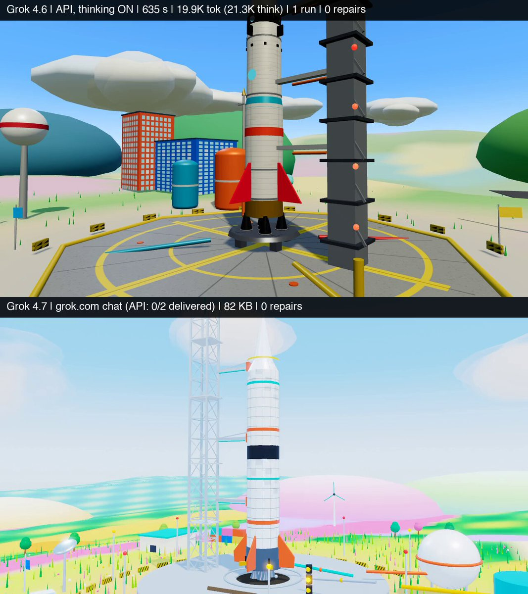

**提示詞**

```text
Three.js 中的完整電影級火箭發射：發射台、發射塔、固定夾具、點火、煙霧、升空、鏡頭追隨進入雲層。無按鈕，無 HUD，自動播放。
```

[↑ 返回分類目錄](#catalog)

---

<a name="prompt-2102223289443877247"></a>

### 翻譯中

作者：[@laviniavelle](https://x.com/laviniavelle) · [查看 X 原帖](https://x.com/laviniavelle/status/2102223289443877247)

攝影 · 電影感 / 電影劇照 · 已推流

**概括:** 翻譯中

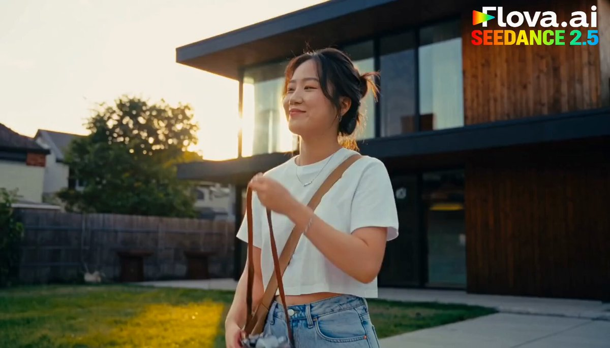

**提示詞**

```text
翻譯中
```

[↑ 返回分類目錄](#catalog)

---

<a name="prompt-2102106915635601452"></a>

### 男子坐在長椅上，一隻美國國旗鷹落在頭上，男子尖叫奔跑的手繪動畫鏡頭。

作者：[@1littlecoder](https://x.com/1littlecoder) · [查看 X 原帖](https://x.com/1littlecoder/status/2102106915635601452)

電影感 / 電影劇照 · 角色 · 已推流

查看 X 原帖：[@fal](https://x.com/fal) · [查看 X 原帖](https://x.com/fal/status/2102102544331784493)

**概括:** 男子坐在長椅上，一隻美國國旗鷹落在頭上，男子尖叫奔跑的手繪動畫鏡頭。


**提示詞**

```text
一名男子 #Image1 坐在公園的長椅上。當一隻身上帶有美國國旗的小鷹落在他頭上時，他驚訝地伸長了脖子。中景固定鏡頭，富有表現力的手繪動作。他開始尖叫並奔跑！
```

[↑ 返回分類目錄](#catalog)

---

<a name="prompt-2101910957022912557"></a>

### Sprite 檸檬汽水 9:16 豎版分鏡頭商業廣告生成提示詞，含水花、倒酒與產品特寫鏡頭控制。

作者：[@HeyRu0by](https://x.com/HeyRu0by) · [查看 X 原帖](https://x.com/HeyRu0by/status/2101910957022912557)

漫畫 / 分鏡腳本 · 產品行銷 · 電影感 / 電影劇照 · 產品 · 已推流

**概括:** Sprite 檸檬汽水 9:16 豎版分鏡頭商業廣告生成提示詞，含水花、倒酒與產品特寫鏡頭控制。

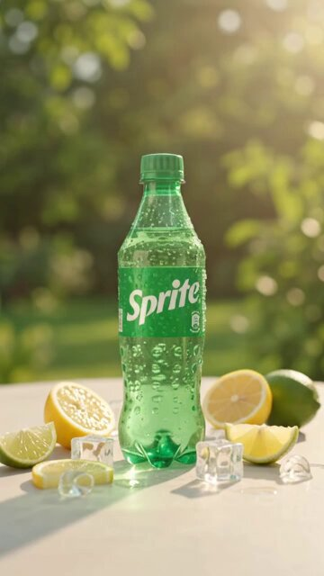

**提示詞**

```text
製作一支高端、超寫實的 10 秒雪碧（Sprite）檸檬青檸味軟飲商業廣告，採用 9:16 直式規格。使用上傳的雪碧產品圖作為精確的產品參考。保留瓶身原有的形狀、比例、綠色瓶蓋、Sprite 標誌、標籤設計、色彩、排版及品牌標識。切勿重新設計、扭曲、複製或更改產品。

整體風格：
明媚的夏日日光、清新綠藍主色調、閃爍的氣泡碳酸感、逼真的冰塊、多汁的檸檬和青檸切片、充滿活力的商業電影感攝影、高端飲品廣告質感、4K/8K 級超逼真畫質、清晰銳利的微距細節、逼真的水珠、高速液體攝影、電影級光影、淺景深。

鏡頭 1 — 0–2秒 | 清爽初見
一瓶冰鎮雪碧在陽光明媚的午後昂然佇立在明亮的戶外桌面上。新鮮的檸檬、青檸切片以及冰塊環繞在瓶身周圍。陽光折射出優美的高光和微妙的鏡頭光暈。鏡頭緩緩向產品推進。
氛圍：清新、陽光、沁爽。

鏡頭 2 — 2–5秒 | 產品微距
雪碧瓶身的極近微距特寫，表面覆蓋著逼真的冷凝水珠。鏡頭平穩且具電影感地推向 Sprite 標誌，同時冰塊和晶瑩的水珠在瓶身周圍運動。
動態：快速微距推進 + 水花飛濺 + 碳酸氣泡。

鏡頭 3 — 5–7秒 | 檸檬青檸飛濺
新鮮的檸檬和青檸切片在慢動作中破開碳酸起泡水飛濺而出。細小的氣泡、水珠和柑橘果汁微粒在乾淨的藍綠色背景前在空氣中飛舞。
運鏡：高速微距慢動作。

鏡頭 4 — 7–10秒 | 完美斟注
冰爽的雪碧從冰鎮的瓶中傾倒進裝滿晶瑩剔透冰塊的透明玻璃杯中。液體激起優美多泡的水花，氣泡在杯中快速升騰。檸檬和青檸切片擺放在杯子旁。
運鏡：平滑側角跟拍鏡頭。

鏡頭 5 — 10–13秒 | 極致清新
青檸切片、閃亮冰塊、碳酸氣泡和清爽雪碧水珠的極致微距鏡頭。光線捕捉到每一滴水珠，營造出充滿活力、熱力四射的夏日感。
動態：慢動作飛濺 + 懸浮氣泡。

鏡頭 6 — 13–16秒 | 產品主角
雪碧瓶居中佇立於懸浮的冰塊、檸檬青檸切片和晶瑩水滴之中。背景明亮、清新且略帶虛化。瓶身在畫面中始終保持極度銳利並佔據主體地位。
運鏡：平滑的電影感產品環繞運鏡。

鏡頭 7 — 16–18秒 | 沁涼一瞬
裝滿冰鎮雪碧的透明玻璃杯特寫，杯旁點綴著新鮮檸檬和青檸。碳酸氣泡不斷升騰，陽光在玻璃杯表面投射出閃爍的高光。
運鏡：伴隨微妙閃爍效果的緩慢推進鏡頭。

鏡頭 8 — 18–20秒 | 最終定版主角鏡頭
以高端雪碧產品主角鏡頭收尾。精確的雪碧瓶立於冰飲玻璃杯旁，周圍環繞著冰塊、檸檬和青檸切片。瓶身上新鮮的水珠依舊清晰可見。明媚的陽光與微妙的綠/藍色氛圍感效果共同構成極具衝擊力的最終商業畫面。

最終視覺感受：冰爽。脆爽。清新。沁爽。

產品與品質鎖定：
精確的雪碧瓶參考。精確的標誌與標籤。精確的綠色品牌視覺。不可更改包裝。不可出現多餘瓶子。不可出現扭曲文字。不可出現隨機標誌。不可出現浮水印。無人物。無手部。無不合常理的液體物理現象。全程保持產品清晰銳利且具高辨識度。
```

[↑ 返回分類目錄](#catalog)

---

<a name="prompt-2101582317319840038"></a>

### 一段描繪農田中幼小玉米植株生長發育的電影感微距縮時影片提示詞。

作者：[@de\_mon010](https://x.com/de_mon010) · [查看 X 原帖](https://x.com/de_mon010/status/2101582317319840038)

電影感 / 電影劇照 · 已推流

**概括:** 一段描繪農田中幼小玉米植株生長發育的電影感微距縮時影片提示詞。


**提示詞**

```text
創作一段寫實逼真的電影感微距影片，展現一株幼嫩的玉米植株在剛耕作過的農田中生長的過程。開頭是一株微小的玉米幼苗從肥沃的棕色土壤中破土而出，隨後以平滑自然的縮時攝影展示其生長：綠色的莖部逐漸拔高，葉片展開並伸展，中央的玉米雄穗逐漸發育。溫暖的黃金時刻陽光、柔和的晨霧、逼真的土壤質地、淺景深、微風輕拂葉片、背景為自然的農田景致、逼真的植物生長過程、細緻的綠葉、平滑連續的生長演變、電影感鏡頭緩慢推向植株、超寫實、4K、直式 9:16、無人物、無文字、無人工生硬的生長感。
```

[↑ 返回分類目錄](#catalog)

---

<a name="prompt-2101643248834150910"></a>

### 百葉窗旁身穿黑色高領毛衣的女性寫實室內側拍照。

作者：[@\_\_Libra1](https://x.com/__Libra1) · [查看 X 原帖](https://x.com/__Libra1/status/2101643248834150910)

電影感 / 電影劇照 · 人像 / 自拍 · 角色 · 已推流

**概括:** 百葉窗旁身穿黑色高領毛衣的女性寫實室內側拍照。


**提示詞**

```text
使用上傳的人物參考圖作為同一位女性的主要身分參考。保持她的面容和整體外觀高度一致且具辨識度。保留她那雙淡褐綠色的眼睛、自然的面部輪廓、極具特色的鼻子、左臉頰上的美人痣、溫暖的橄欖色膚色，以及顏色、長度、髮量和自然質感完全一致的深棕色微卷長髮。

創作一張坐在窗邊的年輕女性的真實、具生活感的室內人像攝影。

她身穿合身的黑色羅紋高領毛衣和深色長褲。服裝應顯得自然且富有日常穿著感，具備逼真的針織質感、柔軟的皺褶與真實的布料動態。

她單膝屈起而坐，身體微微轉向鏡頭。一隻手輕輕抵著下巴和下唇，呈現安靜沉思的姿態。她的表情平靜、直視、自然，呈現輕柔閉嘴的自然神情，而非刻意擺出的微笑。

她長長的深棕色捲髮垂落在雙肩，帶有自然的蓬鬆感、根根分明的髮絲和些微毛躁碎髮。妝容輕柔自然，具備真實的肌膚紋理、毛孔、細微的面部細節與微小自然的瑕疵。

背景為帶有百葉窗的簡約室內環境，在整個場景中營造出柔和的條紋狀光影。以自然的窗邊光作為主光，帶有柔和的光線衰減，頭髮上有逼真的高光，面部明暗對比自然克制。

照片應呈現真實的側拍人像質感，而非攝影棚商業美妝照。捕捉自然的微表情、放鬆的肢體語言、真實的解剖結構、真實可信的手部與手指、自然的衣物皺褶、自然的光影變化、逼真的陰影以及略帶不完美的真實攝影質感。

攝影風格：電影質感室內人像，自然窗光，50mm鏡頭，淺景深，細微的背景散景，紀實風格構圖，逼真的膚色，克制的色彩調校，照片級逼真細節。

避免：塑膠感皮膚、過度修圖、人造美感、誇張濃妝、完全對稱的面部特徵、洋娃娃般的外觀、不自然的眼睛、變形的手、多餘的手指、扭曲的身體結構、假髮感、過度HDR、過飽和度、僵硬的擺拍或過於明顯的生成痕跡。
```

[↑ 返回分類目錄](#catalog)

---

<a name="prompt-2101648666771730662"></a>

### 雲海仙宮全景的慢推與左環繞鏡頭運動提示詞。

作者：[@PixelAigc](https://x.com/PixelAigc) · [查看 X 原帖](https://x.com/PixelAigc/status/2101648666771730662)

攝影 · 電影感 / 電影劇照 · 已推流

**概括:** 雲海仙宮全景的慢推與左環繞鏡頭運動提示詞。


**提示詞**

```text
鏡頭慢慢推進，鏡頭慢慢向左環繞，展現天上宮殿的壯麗
```

[↑ 返回分類目錄](#catalog)

---

<a name="prompt-2101670493380317524"></a>

### 現代屋頂露台夜晚場景，低角度廣角拍攝穿黑色緞面短裙的東亞女性，突出前景腿部線條與城市夜景縱深。

作者：[@nicebabycat](https://x.com/nicebabycat) · [查看 X 原帖](https://x.com/nicebabycat/status/2101670493380317524)

攝影 · 電影感 / 電影劇照 · 人像 / 自拍 · 角色 · 時尚單品 · 城市景觀 / 街道 · 已推流

查看 X 原帖：[@boniusex](https://x.com/boniusex) · [查看 X 原帖](https://x.com/boniusex/status/2101666495625609256)

**概括:** 現代屋頂露台夜晚場景，低角度廣角拍攝穿黑色緞面短裙的東亞女性，突出前景腿部線條與城市夜景縱深。


**提示詞**

```text
在現代屋頂露台上拍攝的電影感低角度夜間肖像，主體為一名身穿光澤黑色緞面迷你連身裙的東亞成年女性，身體前傾靠近鏡頭。高馬尾髮型，精緻首飾，鏈條包，眼神直視鏡頭，神態沉穩且略帶嫵媚。極低角度廣角智慧型手機視角，極近的前景，誇張的近大遠小比例，強烈的對角線幾何構圖，極具戲劇感的深度，前景中突出的腿部線條與高跟涼鞋。鏡頭近處帶有一張反光桌子，上面的酒瓶和酒杯部分虛化，營造出強烈的前景構圖框架和沉浸式空間縱深感。夜晚的現代屋頂露台，玻璃欄杆，背景為燈火輝煌的摩天大樓與城市夜景燈光，溫暖的室內光線與冷調的都市夜色光芒交織。逼真的皮膚紋理，寫實的解剖結構，自然的布料褶皺，抓拍感編輯時尚攝影風格，清晰的前景-中景-背景分離，電影感留白，單一主體，無第二人，無拼貼，無可讀文字，直式 9:16。
```

[↑ 返回分類目錄](#catalog)

---

<a name="prompt-2101569698319958447"></a>

### 一名身穿深色連帽衫的年輕男子在鵝卵石小巷中引導並釋放青色能量衝擊波。

作者：[@KevinVailAI](https://x.com/KevinVailAI) · [查看 X 原帖](https://x.com/KevinVailAI/status/2101569698319958447)

電影感 / 電影劇照 · 角色 · 已推流

**概括:** 一名身穿深色連帽衫的年輕男子在鵝卵石小巷中引導並釋放青色能量衝擊波。


**提示詞**

```text
黃昏時分，一名身穿寬鬆深色連帽衫的年輕男子站在一條古老的鵝卵石小巷中。發光的霓虹青色能量在他雙手周圍洶湧澎湃，懸浮的微粒與樹葉以慢動作在他周圍升起。他雙手向前猛推，朝著鏡頭釋放出一股明亮發光的衝擊波和微光薄霧，最後以漂浮的餘燼收尾。9:16垂直長寬比，超寫實，電影級光影，逼真的視覺特效渲染。
```

[↑ 返回分類目錄](#catalog)

---

<a name="prompt-2101548200981393654"></a>

### 東方武俠電影風格女俠極近特寫，前景手部虛焦構框與硬質明暗光影。

作者：[@DDJCXX](https://x.com/DDJCXX) · [查看 X 原帖](https://x.com/DDJCXX/status/2101548200981393654)

電影感 / 電影劇照 · 人像 / 自拍 · 已推流

查看 X 原帖：[@DDJCXX](https://x.com/DDJCXX) · [查看 X 原帖](https://x.com/DDJCXX/status/2101521394739900701)

**概括:** 東方武俠電影風格女俠極近特寫，前景手部虛焦構框與硬質明暗光影。


**提示詞**

```text
超寫實真人東方武俠電影畫面，16:9寬螢幕構圖，極近距離面部特寫，真實電影攝影質感。

一名成年東亞女俠正面對鏡頭，攝影機距離極近，構圖只包含她的臉、雙手、黑色長髮和少量肩部。人物位於畫面中央，身體微微前傾，眼睛直視鏡頭，目光凌厲、冷靜、具有攻擊性。

她的雙手抬到鏡頭前方，一隻手從畫面右上伸入，另一隻手從畫面右下與中央伸入，兩隻手交錯形成不規則框架，把雙眼夾在手指之間。前景手掌和手指距離鏡頭非常近，因此明顯失焦，並佔據畫面右側較大面積，動作自然鋒利。

成年東亞女性面孔，20–30歲，精緻、英氣、冷峻，有武俠電影女主角感，真實皮膚紋理。

黑色長髮高束，細長髮絲被強風吹過額頭、雙眼和臉頰，部分髮絲從左側橫穿整個畫面。

臉部明暗關係：整張臉必須以暗部為主，約65%–75%處於陰影中。主光是一束來自畫面右上方的真實硬質自然陽光，方向明確，形成非常清晰的明暗邊界。前景手指、手掌和髮絲擋住部分太陽，因此在人物臉上投下真實、不規則、鋒利的陰影。只有一小塊陽光從手指和髮絲之間穿過，斜切過一隻眼睛、眉骨、鼻樑和小塊臉頰，形成窄而明確的亮區。另一隻眼睛大部分在陰影中，但瞳孔仍可見。嘴唇、下巴、下頜和頸部保持明顯暗度，不要正面補光。

背景極簡，只有低飽和淡藍天空。雙眼位於畫面中央附近，眼睛是最清晰區域，前景手掌嚴重失焦，左側大量黑色長髮進入畫面，右側由前景手指佔據，形成強烈包圍感。

ARRI Alexa 35 / Alexa Mini LF cinematic look, 65mm lens, T2.0, ISO 800, 1/1000s, focus on the eyes, hard natural sunlight, face slightly underexposed, strong chiaroscuro lighting, deep facial shadows, subtle film grain.
```

[↑ 返回分類目錄](#catalog)

---

<a name="prompt-2101311302841078204"></a>

### 15秒高端腕錶電影感商業廣告，包含暗調特寫、微距細節、都市人物街拍及主角定格鏡頭。

作者：[@navi\_Ai2](https://x.com/navi_Ai2) · [查看 X 原帖](https://x.com/navi_Ai2/status/2101311302841078204)

產品行銷 · 電影感 / 電影劇照 · 角色 · 城市景觀 / 街道 · 已推流

**概括:** 15秒高端腕錶電影感商業廣告，包含暗調特寫、微距細節、都市人物街拍及主角定格鏡頭。


**提示詞**

```text
為一家全球生活風格品牌製作一支15秒的高級電影感商業廣告。開頭在黑暗奢華的環境中對產品進行戲劇性特寫，搭配柔和的電影感光影與細緻的氛圍微粒。第3秒時，平滑過渡到展現產品高級設計與細節的動態微距鏡頭。第7至11秒，展現一名時尚的年輕職場人士在現代國際大都市環境中自信地使用該產品，運鏡優雅且景深淺。第11至15秒，切回乾淨背景下的主角產品鏡頭，帶有強烈戲劇感的輪廓光，並為品牌標誌與標語保留空間。極致寫實，高端商業電影攝影，高級調色，流暢轉場，逼真反光，4K細節，精緻的國際廣告美學，無多餘文字，無浮水印。
```

[↑ 返回分類目錄](#catalog)

---

<a name="prompt-2101007280040784269"></a>

### 15秒連續手持鏡頭：一名女子品嚐壽司，情緒歷經極度酸味衝擊、厭惡、驚訝到欣喜的全過程。

作者：[@EndFolding79421](https://x.com/EndFolding79421) · [查看 X 原帖](https://x.com/EndFolding79421/status/2101007280040784269)

電影感 / 電影劇照 · 角色 · 已推流

**概括:** 15秒連續手持鏡頭：一名女子品嚐壽司，情緒歷經極度酸味衝擊、厭惡、驚訝到欣喜的全過程。


**提示詞**

```text
15秒電影感手持單鏡頭長鏡頭。從頭至尾一鏡到底，無剪輯、無轉場、無鏡頭重置。

<Picture 0> 即為第一幀畫面。

場景：
一位二十歲出頭的虛構原創年輕女性坐在一家愜意舒適的日間壽司小館吧台前。在整個鏡頭中始終保持所提供的參考角色的精確面部特徵和外貌。她擁有白皙自然的皮膚，帶有明顯的雀斑，明亮的藍色眼睛，留著自然捲曲的銅紅色長髮，披散在肩膀兩側。她的頭髮具有逼真的髮絲細節、自然的蓬鬆感和輕柔的動態。她化著柔和的自然妝容，塗著柔和的玫瑰色唇膏，佩戴一條厚實的拋光銀色項圈項鍊。

她身穿鮮豔的綠色透光薄紗長袖上衣，輕微滑下一側裸露的香肩，內搭同色系綠色打底衫，與起始圖片完全一致。無任何可見的品牌或商標標識。

壽司小館設有一張拋光的深色長木吧台，上面鋪著藤編桌旗，擁有溫暖的米白色牆壁、沒有任何可讀文字的空白裝飾掛軸、柔和發光的櫥櫃，背景中模糊開放式的廚房裡壽司師傅們自然地忙碌走動。旁邊擺放著一盆紅色蘭花。一扇大窗戶讓明亮的正午陽光灑滿餐廳，窗外能看到鬱鬱蔥蔥的綠樹。

她面前放著一個盛有各式壽司的陶瓷盤子、一小碟醬油、粉色醃生薑、一張餐巾紙和一雙木筷子。

構圖：
在整個鏡頭中始終將該女性置於畫面的右三分之一處。切勿將她置中。

越過吧台檯面，從略低於她視線的角度進行拍攝。長吧台和虛化的廚房延伸佔據畫面左側的三分之二。

前景中的壽司盤和編織吧台桌旗在畫面底邊緣保持輕微失焦狀態。

在整個影片中保持恆定的10–12度荷蘭角（傾斜構圖）。切勿將水平線放平。

運鏡：
俏皮自然的手持攝影風格。攝影師的手肘似乎支撐在吧台附近，營造出細微的呼吸晃動、微小的微顫和輕柔不完美的運動感。

在整個鏡頭中，鏡頭沿著吧台緩慢且輕微地朝她的面部滑行推進。

絕不要完全靜止。

柔和的窗光偶爾會產生微妙自然的鏡頭光暈。

動作與情緒時間線：

0–1秒：
動作在第一幀立即開始。

她筷子裡已經夾著一顆完整的鮮蝦握壽司：淡粉色的開背蝦蓋在一小團醋飯上。

她迅速將其抬起，一口氣將整個鮮蝦握壽司放入口中。

毫無猶豫，也沒有緩慢的鋪陳。

1–4秒：
酸味以誇張的喜劇感瞬間擊中她。

她的雙眼緊緊閉上。

她的嘴唇在鼓起的臉頰周圍劇烈地噘起。

她的整張臉因為酸味而扭曲收縮。

她的肩膀顫抖。

她快速地左右搖頭，使她長長的紅色捲髮在臉頰和肩膀周圍自然地彈跳、甩動與搖晃。

她的筷子從手中滑落，哐當一聲掉在陶瓷盤子上。

她一邊繼續咀嚼，一邊用一隻拳頭在吧台上輕敲了一兩下。

反應必須是立即的、富有表現力的且具有清晰肢體可讀性的。

4–8秒：
酸味的衝擊轉變為真正的厭惡反感。

她的表情突然變得更為平淡且極度嫌棄厭惡。

她咀嚼得越來越慢。

她皺起鼻子。

她微微作嘔。

她的舌頭把食物頂向一側臉頰，彷彿完全無法忍受這種味道。

她抓起餐巾紙湊到嘴邊，顯然正準備把食物吐出來。

她的眼中流露出失望與被背叛的神情。

8–11秒：
當餐巾紙碰到或剛好懸停在她嘴唇正前方時，她突然定住了。

她的眉毛向上揚起。

她的眼睛睜大。

某種味覺體驗出乎意料地發生了改變。

她慢慢把餐巾紙降低了大約一英吋。

她嚼了一口。

停頓。

她又嚼了第二口。

她的表情從厭惡 → 困惑 → 帶著懷疑的好奇心逐漸轉變。

透過她的眼睛、眉毛、臉頰和嘴巴讓這種轉變清晰可見。

11–15秒：
她的表情逐漸爆發為純粹的歡愉與欣喜。

她愉悅地輕輕閉上雙眼。

她一邊繼續咀嚼，臉上泛起一個燦爛而真實的微笑。

她的肩膀完全放鬆下來。

她在高腳凳上微微向後傾靠並軟化放鬆下來。

她因開心而在吧台下輕快地踢了踢腳。

她不說話，流露出細微而滿意的哼哼愉悅神情。

依然帶著微笑，她再次伸出筷子探向盤子裡的另一顆鮮蝦握壽司，顯然想再吃一口。

當她高興地伸手去夾下一塊壽司時，鏡頭結束。

表演：
優先考慮富有表現力的面部演技和易於辨識的情緒變化。

情緒遞進必須極為清晰：
瞬間酸味衝擊 → 厭惡 → 準備吐出 → 突然驚喜 → 懷疑的好奇 → 強烈的愉悅享受

自然的眨眼、眼部運動、臉頰運動、下顎咀嚼、呼吸、肩部動作、手勢以及逼真的散落捲髮物理動態。

身份鎖定：在整個影片中，精確保持所提供的角色參考和起始幀中的女性面部特徵。請勿改變她的面部結構、雀斑、眼睛顏色、膚色、年齡或銅紅色捲髮。切勿將她的髮型改為馬尾辮或直髮。

視覺風格：
電影感日本獨立生活片段風格。
35毫米膠卷質感。
淺景深。
柔和自然的皮膚質感，清晰保留雀斑。
溫暖日光混合著微妙的藍綠與暖色膠卷色調。
細膩柔和的噪點顆粒。
自然的高光衰減滾降。
溫馨舒適、親密無間的餐廳氛圍。
逼真的人體動作與真實生動的食物互動。

重要約束：
一段連續的15秒鏡頭。
無剪輯。
無場景切換。
無時間跳躍。
無慢動作。
無定格效果。
請勿將女性置中。
保持荷蘭角（傾斜構圖）。
無對白。
無說明文字。
無字幕。
無任何可讀文字。
僅有空白卷軸和空白菜單。
無Logo標誌。
無品牌。
無可識別的知名角色。
無吉祥物手辦公仔。
無受版權保護的角色。
無真實人物。
```

[↑ 返回分類目錄](#catalog)

---

<a name="prompt-2100644208600400163"></a>

### 翻譯中

作者：[@mys1111](https://x.com/mys1111) · [查看 X 原帖](https://x.com/mys1111/status/2100644208600400163)

電影感 / 電影劇照 · 已推流

**概括:** 翻譯中


**提示詞**

```text
翻譯中
```

[↑ 返回分類目錄](#catalog)

---

<a name="prompt-2100821608911048833"></a>

### DJI Osmo Pocket 3 電影級垂直產品商業廣告提示詞，具備詳細的分鏡雲台與街景畫面。

作者：[@Urwa\_345](https://x.com/Urwa_345) · [查看 X 原帖](https://x.com/Urwa_345/status/2100821608911048833)

產品行銷 · 電影感 / 電影劇照 · 產品 · 城市景觀 / 街道 · 已推流

**概括:** DJI Osmo Pocket 3 電影級垂直產品商業廣告提示詞，具備詳細的分鏡雲台與街景畫面。


**提示詞**

```text
為正品 DJI Osmo Pocket 3 創作一段具備電影質感的 8 秒頂級廣告，豎屏 9:16 比例。

0–2 秒：鏡頭緩慢推向立於現代辦公桌上的 DJI Osmo Pocket 3，觸控螢幕泛著柔和光芒。

2–4 秒：圍繞鏡頭與雲台結構進行微距運鏡，展現小巧精緻的高端設計。

4–7 秒：平滑過渡至一位創作者手持相機於黃金時刻拍攝美麗的城市街景，展現逼真的手持晃動感。

7–9 秒：過渡至相機安裝於小型三腳架上，於日落時分俯瞰壯闊山景。

9–10 秒：DJI Osmo Pocket 3 的最終壓軸主視覺特寫（Hero shot），緩慢的電影級環繞運鏡，螢幕與相機鏡頭清晰可見。

極具逼真感的專業相機廣告，逼真的雲台運動，流暢過渡，電影級景深，高端科技廣告，真實產品設計，自然光線，極高細節，無文字疊加，無浮水印。
```

[↑ 返回分類目錄](#catalog)

---

<a name="prompt-2100809690850664865"></a>

### 30秒擬真3A級黑幫實機戰鬥影片提示詞，包含完整HUD與按時間線展開的街頭格鬥與Boss登場過程。

作者：[@Inshrah\_ali\_](https://x.com/Inshrah_ali_) · [查看 X 原帖](https://x.com/Inshrah_ali_/status/2100809690850664865)

電影感 / 電影劇照 · 已推流

**概括:** 30秒擬真3A級黑幫實機戰鬥影片提示詞，包含完整HUD與按時間線展開的街頭格鬥與Boss登場過程。


**提示詞**

```text
製作一段30秒超寫實開放世界黑幫遊戲實機電影級影片，展現在夜晚粗獷的現代都市中兩個敵對街頭幫派的激烈戰鬥。讓整段影片呈現熱門3A級遊戲實機錄影的質感，彷彿玩家正即時操控主角。

遊戲畫面 / HUD — 非常重要：
加入精緻、原創的現代遊戲介面，自然貫穿並保留在整個影片中：

左上角：小型圓形角色頭像 + 綠色生命值條（HEALTH BAR）與藍色耐力條（STAMINA BAR）

右上角：精簡的任務目標面板（MISSION OBJECTIVE）

左下角：細節豐富的小地圖（MINIMAP）、圓形雷達、玩家箭頭、敵人指示器、周遭載具圖示與目標標記點

右下角：半透明動作按鍵圖示，對應出拳、閃避、衝刺、互動與蹲伏

中央：適時出現的小型動態準心/瞄準指示器

敵方目標：敵對角色頭頂帶有紅色菱形標記

隊友：友方角色頭頂帶有藍/綠色指示器

戰鬥回饋：細微的受擊指示器、連擊計數器與經驗值/獎勵通知

任務通知：流暢洗練的彈出訊息，例如「RIVAL GANG DETECTED」、「SURVIVE THE AMBUSH」和「BOSS FIGHT INCOMING」

當玩家靠近物體或敵人時，加入細緻的搖桿風格按鍵提示

HUD應為半透明、具未來感且極簡，自然融入場景中，而非遮蓋動作畫面。

UI動畫應展現靈敏回饋：圖示跳動、目標即時更新、生命值逼真減少、敵人標記隨角色移動。

確保介面為原創設計，絕非對任何現有遊戲UI的完全複製。

0–5秒 — 發現敵對幫派

第三人稱鏡頭跟隨主角穿行於霓虹閃爍的城市街頭。

HUD：
小地圖啟動 → 出現數個紅色敵人標記 → 目標面板顯示：

MISSION
RIVAL GANG DETECTED

敵人警告圖示短暫閃爍。

5–10秒 — 街頭格鬥

一名敵對幫派分子發動攻擊。玩家操控的主角進行格擋、閃避與反擊。

展示右下角的動作圖示隨玩家動作產生即時反饋。對手頭頂出現紅色敵人標記。在連續成功出招後，加入小巧的 COMBO ×3 指示器。

10–15秒 — 混亂局面

戰火蔓延至整條街頭。幫派成員在車輛與路障之間穿梭奔跑。

小地圖上擠滿移動的紅色與藍色標記。

目標更新：
SURVIVE THE AMBUSH

主角受到攻擊時加入輕微的畫面震動與傷害反饋。

15–20秒 — 慢動作反擊

主角陷入重重包圍。遊戲實機畫面突然進入極具戲劇感的慢動作狀態。

右下角控制項旁出現 DODGE（閃避）提示。他閃過一次撲面而來的攻擊並進行反擊。

HUD平滑恢復至正常速度。

20–26秒 — 幫派混戰

雙方幫派衝向彼此。

主角在戰場中奔馳，隊友在身旁並肩作戰。

目標：
DEFEAT THE RIVAL GANG

展現動態敵人標記、隊友指示器、小地圖移動、衝刺時的耐力消耗以及逼真的戰鬥反饋。

26–30秒 — BOSS戰

一輛黑色SUV疾馳而至。敵對幫派頭目走下車。

所有敵人指示器向他聚集。

頂部中央出現極具戲劇張力的BOSS血條：

RIVAL GANG LEADER
████████████████████

接著彈出巨大的原創遊戲通知：

⚠ BOSS FIGHT INCOMING

主角舉起雙拳。鏡頭移至其身後，切換為經典的第三人稱遊戲操作視角。

畫面淡出至全黑。
```

[↑ 返回分類目錄](#catalog)

---

<a name="prompt-2100802747654181375"></a>

### 電影感水下場景，展示巨大的鯨魚與機械魚在體積陽光下的珊瑚礁旁一同狩獵。

作者：[@ICare\_MHB](https://x.com/ICare_MHB) · [查看 X 原帖](https://x.com/ICare_MHB/status/2100802747654181375)

電影感 / 電影劇照 · 已推流

查看 X 原帖：[@ICare\_MHB](https://x.com/ICare_MHB) · [查看 X 原帖](https://x.com/ICare_MHB/status/2100631156844818697)

**概括:** 電影感水下場景，展示巨大的鯨魚與機械魚在體積陽光下的珊瑚礁旁一同狩獵。


**提示詞**

```text
超逼真電影感水下場景，一條巨大的藍鯨與一條未來主義機械魚在深海中並肩同游，積極獵捕獵物。藍鯨在深藍色的水中強力擺動前進，機械魚則以發光的藍色感測器掃描四周並迅速變換方向。當牠們在水下岩石與珊瑚間穿梭追逐時，小魚群驚慌四散。戲劇性的陽光光束穿透海面，氣泡與懸浮微粒漂浮在水中，動態攝影機追蹤鏡頭，緊張強烈的狩獵氛圍，逼真的海洋物理效果，高度精細的紋理，電影級4K，體積光，流暢動態，10秒，垂直 9:16，無文字，無浮水印。
```

[↑ 返回分類目錄](#catalog)

---

<a name="prompt-2100751916800368694"></a>

### 描繪未來都市景觀和仿人機器人中AI融入日常生活的15秒電影感影片提示詞。

作者：[@Zarlish\_Shahid](https://x.com/Zarlish_Shahid) · [查看 X 原帖](https://x.com/Zarlish_Shahid/status/2100751916800368694)

電影感 / 電影劇照 · 賽博龐克 / 科幻 · 城市景觀 / 街道 · 已推流

**概括:** 描繪未來都市景觀和仿人機器人中AI融入日常生活的15秒電影感影片提示詞。


**提示詞**

```text
製作一段15秒的超寫實電影質感AI影片，展現人工智慧深度融入人類日常生活那一刻的震撼願景。

場景 1 — 0–3 秒：
夜晚的未來都市，成千上萬的人行走在巨大的透明全息AI介面之下。發光數據的巨流如數位河流般在天空中穿行。攝影機在摩天大樓之間飛速穿梭，朝向一個神秘發光的AI核心飛去。

場景 2 — 3–7 秒：
切換至一個逼真的仿人AI機器人站在擁擠的現代城市街道中央。人們自然地在其周圍走動。機器人慢慢轉頭直視鏡頭，數以百萬計的微小粒子與神經網絡圖案在其面部周圍浮現。

場景 3 — 7–11 秒：
鏡頭戲劇性地向後拉遠，展現AI正在掌控整個未來生態系統：自動駕駛汽車、無人機、機器人、智慧家居、醫院和工廠——全部由發光的神經網絡連接在一起。

場景 4 — 11–15 秒：
突然間，一切陷入徹底的寂靜。城市燈光一盞接一盞熄滅。黑暗中僅剩下那個發光的AI核心。鏡頭緩緩向其逼近。

定格畫面：
AI核心如同一隻數位之眼般睜開，直視觀眾。

風格：
超寫實，照片級逼真，好萊塢電影品質，真實人物，真實反射，體積光，戲劇性氛圍，精緻的未來主義建築，極致細節的環境，自然運鏡，淺景深，高對比度，符合物理規律的光影，無縫轉場，4K，無文字，無標誌，無浮水印。

吸睛點：
讓前1秒在視覺上具有足夠的震撼力以吸引觀眾停下划動。
在整個影片中保持完美的視覺連續性。
```

[↑ 返回分類目錄](#catalog)

---

<a name="prompt-2100476127978647840"></a>

### 一名抽煙女子在煙霧瀰漫的大廳中與骷髏群共同進行同步編舞表演的電影感恐怖舞蹈影片。

作者：[@AIwithWania](https://x.com/AIwithWania) · [查看 X 原帖](https://x.com/AIwithWania/status/2100476127978647840)

電影感 / 電影劇照 · 角色 · 已推流

**概括:** 一名抽煙女子在煙霧瀰漫的大廳中與骷髏群共同進行同步編舞表演的電影感恐怖舞蹈影片。


**提示詞**

```text
一段具電影質感的15秒爆紅風格恐怖舞蹈影片。一名身穿時髦短裙的時尚年輕女子獨自站在前景中，神態自若冷酷、毫無懼色地抽著煙。在她身後昏暗且煙霧瀰漫的大廳裡，一群令人毛骨悚然的骷髏整齊列隊站立。起初它們靜止不動，隨後當女子緩緩後退步入骷髏群中時，骷髏們開始做出詭異的動作並發出怪異聲響。女子自信地融入其中。在最後時刻，女子與骷髏群一起跳起節奏一致的熱門舞蹈，伴隨著俐落的頭部動作、聳肩律動以及富有節奏感的肢體擺動。昏暗陰鬱的燈光，煙霧繚繞的氛圍，戲劇性的逆光，時髦的恐怖美學，電影級質感，高細節，流暢動作，極具視覺衝擊力。
```

[↑ 返回分類目錄](#catalog)

---

<a name="prompt-2100408772762226752"></a>

### 一部10秒電影感夏日鄉村短片，由同一位年輕女子貫穿六個連續鏡頭。

作者：[@LiEvanna85716](https://x.com/LiEvanna85716) · [查看 X 原帖](https://x.com/LiEvanna85716/status/2100408772762226752)

電影感 / 電影劇照 · 角色 · 已推流

**概括:** 一部10秒電影感夏日鄉村短片，由同一位年輕女子貫穿六個連續鏡頭。


**提示詞**

```text
一部電影感十足的10秒夏季短片，整部影片由同一位年輕女子貫穿始終，背景設定在黃金時段寧靜的美國鄉村。她留著齊肩黑髮，妝容自然，面容柔和且富有青春氣息。

影片開場是她的側臉特寫，她佇立在一片廣袤的綠色草甸中，頭頂是充滿戲劇感而柔和的藍天白雲。柔和的陽光灑在她臉上，微風自然地吹拂著她的髮絲。

切換至中景鏡頭，她緩緩漫步在田野間，回頭望向鏡頭，神情平靜並帶有一絲懷舊感。保持她的面容特徵、髮型、身材比例與服裝始終一致。

過渡至親暱的俯視與側角鏡頭，她躺在茂密的綠草叢中仰望天空。草葉在微風中輕輕搖曳，營造出放鬆愜意的夏日氛圍。

接著鏡頭移至一處純樸的鄉村場景，背景有一座經典的紅色木造穀倉與圍籬。她隨意地倚靠在圍籬邊把玩著頭髮，溫暖的陽光營造出自然的鏡頭光暈與柔和的輪廓光。

在最後一個場景中，夕陽時分她獨自坐在戶外看台上，身穿一件白色背心與寬鬆的休閒運動短褲，手拿一個深色玻璃瓶靠近臉龐。溫暖的逆光穿透她的髮絲，她閉上雙眼享受著當下。

以夢幻般的軟焦鏡頭與細膩的電影感淡出作結，勾勒出一抹令人懷念的夏日記憶。

寫實攝影，電影級自然光效，黃金時段陽光，細膩底片顆粒，淺景深，輕柔手持鏡頭運鏡，自然的肢體動態，逼真的皮膚質感，微風輕拂，溫暖懷舊的夏日氛圍，角色特徵一致，流暢的場景轉換，充滿情感的視覺敘事，獨立成長電影美學，高規格音樂錄影帶攝影風格，9:16直式畫面。
```

[↑ 返回分類目錄](#catalog)

---

<a name="prompt-2100418400216388058"></a>

### “\[物體\] 打開作為 \[主題\] 的微縮博物館，融合建築，電影級微距攝影，暖光，極致細節，編輯級寫實”

作者：[@hmontilla\_](https://x.com/hmontilla_) · [查看 X 原帖](https://x.com/hmontilla_/status/2100418400216388058)

攝影 · 電影感 / 電影劇照 · 建築 / 室內設計 · 已推流

**概括:** “\[物體\] 打開作為 \[主題\] 的微縮博物館，融合建築，電影級微距攝影，暖光，極致細節，編輯級寫實”


**提示詞**

```text
[物體] 打開作為 [主題] 的微縮博物館，融合建築，電影級微距攝影，暖光，極致細節，編輯級寫實
```

[↑ 返回分類目錄](#catalog)

---

<a name="prompt-2100082529512645050"></a>

### 一名孤獨的男子夜晚走在雨中霓虹閃爍的城市裡，隨後突然停電，只留下藍色的背光。

作者：[@MRB\_AI24](https://x.com/MRB_AI24) · [查看 X 原帖](https://x.com/MRB_AI24/status/2100082529512645050)

電影感 / 電影劇照 · 賽博龐克 / 科幻 · 角色 · 已推流

**概括:** 一名孤獨的男子夜晚走在雨中霓虹閃爍的城市裡，隨後突然停電，只留下藍色的背光。


**提示詞**

```text
夜幕降臨，一名孤獨的男子走在被雨水浸透的未來主義城市中，周圍環繞著高聳入雲的霓虹摩天大樓、發光的全像廣告牌和飄散的薄霧。隨著他朝鏡頭走來，攝影機緩慢向後平移，他的大衣在風中自然擺動。霓虹燈的倒影在潮濕的街道上閃爍微光。突然間，整座城市短暫停電，唯獨在他身後留下一道神秘的藍光。

極致電影感，逼真寫實，戲劇性氛圍，逼真的雨水與水流物理效果，體積霧，細節豐富的環境，自然的人體動作，淺景深，變形鏡頭，微妙的鏡頭光暈，高對比度，逼真的皮膚紋理，動態鏡頭運動，好萊塢科幻美學，4K，24fps。
```

[↑ 返回分類目錄](#catalog)

---

<a name="prompt-2099558680979005770"></a>

### 一位身穿超大號白色皮草大衣的金髮女性置身於極簡白色建築場景中的超現實高級時尚電影場景。

作者：[@TaliaAariz](https://x.com/TaliaAariz) · [查看 X 原帖](https://x.com/TaliaAariz/status/2099558680979005770)

電影感 / 電影劇照 · 極簡主義 · 角色 · 時尚單品 · 建築 / 室內設計 · 已推流

**概括:** 一位身穿超大號白色皮草大衣的金髮女性置身於極簡白色建築場景中的超現實高級時尚電影場景。


**提示詞**

```text
一個超現實的高級時尚電影場景，主角是一位身穿奢華超大號白色皮草大衣的蒼白金髮女性。鏡頭以極度特寫開始，她將一支復古黃銅薩克斯風靠近臉龐，隨後眼神熾熱地凝視鏡頭，並慢慢將手伸向鏡頭，營造出戲劇性的景深與動態模糊；接著場景轉換到一個極簡主義的白色建築室內廣角鏡頭，她站在其中並雙手向前伸向鏡頭走來，緊接著是兩個版本的她優雅地端坐在雕塑般的白色休閒椅上的鏡頭，始終保持著神秘的時尚大片氛圍、柔和的漫射光、純淨的單色白調、逼真的皮膚紋理、淺景深、流暢的電影級運鏡、細膩的底片顆粒以及高端時尚宣傳大片的審美質感。
```

[↑ 返回分類目錄](#catalog)

---

<a name="prompt-2099346814327738872"></a>

### 翻譯中

作者：[@Tanvir48992](https://x.com/Tanvir48992) · [查看 X 原帖](https://x.com/Tanvir48992/status/2099346814327738872)

攝影 · 電影感 / 電影劇照 · 人像 / 自拍 · 角色 · 已推流

查看 X 原帖：[@Tanvir48992](https://x.com/Tanvir48992) · [查看 X 原帖](https://x.com/Tanvir48992/status/2098828983488180727)

**概括:** 翻譯中


**提示詞**

```text
翻譯中
```

[↑ 返回分類目錄](#catalog)

---

<a name="prompt-2099332324538093913"></a>

### 翻譯中

作者：[@meAsifAi](https://x.com/meAsifAi) · [查看 X 原帖](https://x.com/meAsifAi/status/2099332324538093913)

電影感 / 電影劇照 · 人像 / 自拍 · 已推流

**概括:** 翻譯中


**提示詞**

```text
翻譯中
```

[↑ 返回分類目錄](#catalog)

---

<a name="prompt-2099321585345958267"></a>

### 一位時尚年輕男子漫步在融合了古代、中世紀、維多利亞時代與未來主義建築的跨時代街道上的電影感照片，身後伴有發光的時空傳送門。

作者：[@MohdAdnanA86218](https://x.com/MohdAdnanA86218) · [查看 X 原帖](https://x.com/MohdAdnanA86218/status/2099321585345958267)

電影感 / 電影劇照 · 人像 / 自拍 · 角色 · 建築 / 室內設計 · 城市景觀 / 街道 · 已推流

**概括:** 一位時尚年輕男子漫步在融合了古代、中世紀、維多利亞時代與未來主義建築的跨時代街道上的電影感照片，身後伴有發光的時空傳送門。


**提示詞**

```text
超寫實電影感奇幻照片，畫面中一位二十歲出頭、英俊非凡的年輕男子正自信地穿行在一座令人嘆為觀止的城市中，多個歷史時代在同一條街道上無縫交織重疊。他留有一頭濃密自然微捲的烏黑頭髮，帶有微妙蓬鬆的層次感，眉峰分明，深邃而富表現力的深褐色眼睛，挺拔如雕塑般的鼻樑，輪廓突出的顴骨，俐落剛毅的下顎線，以及淡淡的自然鬍渣。他身穿一件精緻的深色現代長款大衣，帶有優雅復古細節，搭配剪裁考究的黑色長褲、皮靴和一只經典腕錶。
他身邊的城市被劃分為交錯重疊的時間線：古羅馬風格的街道帶有大理石立柱和石質建築，融入帶有城堡與馬車的中世紀歐洲集市，又過渡至帶有煤氣路燈和優雅建築的維多利亞時代林蔭大道，而背景中則聳立著未來主義摩天大樓與發光的全息招牌。來自不同世紀的人們在他周圍自然行走，營造出超現實的時代碰撞。身後隱現著一個閃爍微光的神秘時空傳送門，細微的金色微粒和鐘錶齒輪碎片在空氣中漂浮。
戲劇性的黃金時刻光線與冷調未來霓虹交織，體積光線，氛圍薄霧，電影級縱深感，濕潤鵝卵石地面上的逼真倒影，精雕細琢的歷史建築，極盡細膩的織物與皮膚紋理，自然的五官比例，逼真照片質感，8K HDR，超精細，85mm鏡頭，淺景深，史詩級電影構圖，真實攝影，無文字，無浮水印，無AI感面孔。
```

[↑ 返回分類目錄](#catalog)

---

<a name="prompt-2099337591476924777"></a>

### 一位身穿條紋毛衣、喝著冰拿鐵的女孩的電影感肖像提示詞。

作者：[@oye\_samia](https://x.com/oye_samia) · [查看 X 原帖](https://x.com/oye_samia/status/2099337591476924777)

攝影 · 電影感 / 電影劇照 · 人像 / 自拍 · 角色 · 食物 / 飲品 · 已推流

**概括:** 一位身穿條紋毛衣、喝著冰拿鐵的女孩的電影感肖像提示詞。


**提示詞**

```text
一位女孩的電影質感特寫肖像，略帶顆粒感。她站在深灰色啞光牆前。她的妝容散發柔和光澤，雙唇豐盈水潤，刷著睫毛膏，畫著黑色眼線。她的長髮筆直且帶有老錢風（Old Money）造型，垂至腰際，幾縷髮絲被風吹在臉上。她身穿一件帶有深紅色條紋的厚實灰色針織毛衣，露出一邊肩膀，搭配帶有毛邊的寬鬆深紅色牛仔褲。她正拿著深紅色紙杯喝著冰拿鐵。她帶著淡淡的閉嘴微笑。日光伴隨些許陰影。9:16格式。淺色短方形指甲。使用閃光燈拍攝。
```

[↑ 返回分類目錄](#catalog)

---

<a name="prompt-2099260377049768153"></a>

### 一名男性主體站在佈滿雨痕的玻璃窗後的電影感肖像，伴隨低調的青藍與琥珀色照明。

作者：[@HumanBeing34061](https://x.com/HumanBeing34061) · [查看 X 原帖](https://x.com/HumanBeing34061/status/2099260377049768153)

電影感 / 電影劇照 · 人像 / 自拍 · 已推流

**概括:** 一名男性主體站在佈滿雨痕的玻璃窗後的電影感肖像，伴隨低調的青藍與琥珀色照明。


**提示詞**

```text
超逼真的電影感肖像，一名成年男性站在覆滿雨水的玻璃窗後，採用垂直 4:5 構圖。他位居中央，以專注、神秘、自信的神情直視鏡頭。他的面部是主要的視覺焦點，擁有強烈而自然的男性臉部輪廓，俐落的下顎線、顴骨、鼻子和嘴唇，真實的皮膚紋理，清晰可見的毛孔、微妙的瑕疵和自然的面部細節。
他留著中長且微亂的深棕色/黑色頭髮，自然蓬亂且微濕，散落的髮絲自然地垂在額頭並部分遮住眼睛。他的頭髮應呈現自然的紋理質感，而非完美造型的樣貌。他的眼神銳利且富表現力，帶有真實的眼神光以及周圍環境的倒影。
賦予他自然的陽剛外貌，帶有淡淡的鬍渣或修剪整齊的中短鬍鬚，保持真實的鬍鬚質感。請勿過度銳化或美化他的面容特徵。
他穿著一件深色寬鬆質感夾克或黑色羊毛大衣，在肩膀和頸部周圍營造出神秘的輪廓。一隻手輕輕按在畫面左側潮濕的玻璃上，手指解剖結構真實，皮膚紋理自然。
相機置於覆滿雨水的窗外，前景分佈著水滴、水汽冷凝、流痕、微小的玻璃瑕疵和模糊的倒影。玻璃營造出真實的深度、折射和微妙的扭曲，同時確保他的眼睛和中心面部特徵極為清晰細膩。
他身後是藍調時刻/夜晚的昏暗氛圍環境，背景被柔和溫暖的金橙色光芒照亮。在深沉的藍綠色陰影與溫暖的琥珀色逆光之間形成強烈對比。柔和溫暖的輪廓光勾勒出他的頭髮和肩膀。
光影：戲劇性的電影感低調照明（low-key lighting）、柔和暖色逆光、微妙的面部照明、深邃自然的陰影、逼真的皮膚高光、體積氛圍、透過濕玻璃的柔和反射。
攝影：專業全畫幅電影攝影，85mm 人像鏡頭，f/1.4–f/1.8，極淺景深，銳利的雙眼，真實的散景，自然的光學衰減，高動態範圍，微妙的底片顆粒感。
構圖：垂直 4:5 肖像，男性主體居中於玻璃後，臉部佔據畫面中上部，左側邊緣可見手部，深色負空間環繞四周，層次分明的雨滴與倒影營造出電影般的深度感。
氛圍：神秘、陽剛、憂鬱、強烈、暗黑浪漫、精緻、難忘且扣人心弦、具有強大情感張力、電影編輯風格攝影。
畫質：超高寫實、逼真的皮膚、真實的濕髮與鬍鬚、符合物理特性的玻璃反射與折射、真實的水滴、自然的解剖結構、電影級青橙（teal-and-amber）調色、細微底片顆粒、HDR、高解析度、無塑膠感皮膚、無人造美顏濾鏡、無 CGI 痕跡。
```

[↑ 返回分類目錄](#catalog)

---

<a name="prompt-2099234788859105541"></a>

### 用於生成夜間大都會上空地球AI無人機群與外星飛船入侵之間科幻電影級戰鬥影片的結構化提示詞。

作者：[@mys1111](https://x.com/mys1111) · [查看 X 原帖](https://x.com/mys1111/status/2099234788859105541)

電影感 / 電影劇照 · 賽博龐克 / 科幻 · 已推流

**概括:** 用於生成夜間大都會上空地球AI無人機群與外星飛船入侵之間科幻電影級戰鬥影片的結構化提示詞。


**提示詞**

```text
[Generation Goal]\n生成一段關於大規模外星入侵的影片，其中人工智慧與UFO展開對決。主要事件是人工智慧無人機艦隊與外星飛船之間展開的空地交戰。\n\n[Event Script]\n片頭：燈火輝煌的大都會夜空被閃光照亮，碟形與三角形的UFO編隊降落並射出能量光束。\n主要事件：幾何外觀、散發著藍色光芒的AI無人機群從高塔和機庫中升空，組成戰術中隊阻截UFO的前進路線，並以精準雷射與力場展開攻擊。部分無人機透過受控自撞犧牲以擊落敵方飛船，同時AI網路協同作戰，瓦解入侵編隊並擊退主要攻勢。\n片尾：剩餘的UFO撤回太空，AI無人機在部分完好的城市上空保持警戒編隊，空氣中飄散著濃煙與殘骸。\n\n[Maintain Consistency]\n保持AI作為地球科技力量（無人機與自主系統）對抗外星入侵者的身分設定。維持AI冷冽藍光與UFO綠/紫光芒之間的視覺對比、夜戰的龐大規模，以及AI成功抵禦的結果。\n\n畫面呈現史詩級科幻電影質感，帶有耀眼的爆炸、能量光跡以及科技緊繃的張力氛圍。\n鏡頭採用寬廣的戰場空中全景、對無人機纏鬥的動態追蹤，以及雷射命中特寫的俐落切換。\n音效包含無人機推進器的嗡鳴聲、能量光束聲、遠處的爆炸聲，以及強度不斷升級的合成器配樂。
```

[↑ 返回分類目錄](#catalog)

---

<a name="prompt-2099000682854625438"></a>

### 翻譯中

作者：[@\_Biy\_a\_](https://x.com/_Biy_a_) · [查看 X 原帖](https://x.com/_Biy_a_/status/2099000682854625438)

電影感 / 電影劇照 · 角色 · 風景 / 大自然 · 已推流

**概括:** 翻譯中


**提示詞**

```text
翻譯中
```

[↑ 返回分類目錄](#catalog)

---

<a name="prompt-2098978626637308214"></a>

### 翻譯中

作者：[@AI\_with\_Antonio](https://x.com/AI_with_Antonio) · [查看 X 原帖](https://x.com/AI_with_Antonio/status/2098978626637308214)

漫畫 / 分鏡腳本 · 電影感 / 電影劇照 · 3D 渲染 · 已推流

**概括:** 翻譯中


**提示詞**

```text
翻譯中
```

[↑ 返回分類目錄](#catalog)

---

<a name="prompt-2098964408085205361"></a>

### 翻譯中

作者：[@MohdAdnanA86218](https://x.com/MohdAdnanA86218) · [查看 X 原帖](https://x.com/MohdAdnanA86218/status/2098964408085205361)

攝影 · 電影感 / 電影劇照 · 角色 · 時尚單品 · 風景 / 大自然 · 已推流

**概括:** 翻譯中


**提示詞**

```text
翻譯中
```

[↑ 返回分類目錄](#catalog)

---

<a name="prompt-2098987067288244447"></a>

### 霧夜竹林中帶柔和輪廓光的東亞女子復古中國武俠電影質感35毫米膠卷肖像。

作者：[@Soranlan](https://x.com/Soranlan) · [查看 X 原帖](https://x.com/Soranlan/status/2098987067288244447)

電影感 / 電影劇照 · 復古 / 懷舊 · 人像 / 自拍 · 角色 · 已推流

查看 X 原帖：[@Soranlan](https://x.com/Soranlan) · [查看 X 原帖](https://x.com/Soranlan/status/2098975054013047064)

**概括:** 霧夜竹林中帶柔和輪廓光的東亞女子復古中國武俠電影質感35毫米膠卷肖像。


**提示詞**

```text
電影質感35毫米膠卷劇照，復古中國武俠美學，夢幻柔焦真人肖像，一名成年東亞武俠女子置身於薄霧瀰漫的夜間竹林。中近景鏡頭，轉頭望向鏡頭的四分之三側顏，平靜憂鬱的眼神，鵝蛋臉，柳葉眉，杏眼，精緻妝容，白皙透光的肌膚，被微風吹向一側的黑色長髮，古典半挽髮髻伴有垂落的髮絲，精巧的銀質水滴耳環。飄逸的白色絲綢漢服，內襯為淡藍色，帶有柔軟的長寬袖，一隻手優雅伸出接住一片飄落的竹葉。飄動的粉色花瓣與竹葉，前景植物的多層次虛化，淡淡的薄霧，清冷的藍綠月光氛圍，髮絲與臉頰上泛著柔和溫暖的琥珀色輪廓光。淺景深，微妙的光暈（halation），可見的膠卷顆粒，類比膠卷的電影氛圍。"Soran"織入靠近手腕的袖口滾邊刺繡中，融入絲綢織紋、髮飾脈絡以及耳環的細線紋樣中。 --no 動漫, 遊戲概念圖, CGI, 塑膠感皮膚, 強硬閃光燈, 攝影棚布光, 銳利的數位清晰度, HDR, 過度飽和色彩, 具有攻擊性的表情, 直視刺眼的凝視, 現代服裝, 現代配件, 畸形的手, 多餘手指, 缺失手指, 錯誤解剖結構, 外部浮水印, 貼紙狀標誌, 散落分離的字母, 字幕, 副標題 --chaos 18 --ar 16:9 --raw --profile r6rgev6 --stylize 220 --hd
```

[↑ 返回分類目錄](#catalog)

---

<a name="prompt-2098806415666077809"></a>

### 翻譯中

作者：[@Minahil42298354](https://x.com/Minahil42298354) · [查看 X 原帖](https://x.com/Minahil42298354/status/2098806415666077809)

攝影 · 電影感 / 電影劇照 · 人像 / 自拍 · 角色 · 城市景觀 / 街道 · 已推流

**概括:** 翻譯中


**提示詞**

```text
翻譯中
```

[↑ 返回分類目錄](#catalog)

---

<a name="prompt-2098788910432129114"></a>

### 翻譯中

作者：[@Minahil42298354](https://x.com/Minahil42298354) · [查看 X 原帖](https://x.com/Minahil42298354/status/2098788910432129114)

電影感 / 電影劇照 · 人像 / 自拍 · 角色 · 已推流

**概括:** 翻譯中


**提示詞**

```text
翻譯中
```

[↑ 返回分類目錄](#catalog)

---

<a name="prompt-2098780787936223258"></a>

### 翻譯中

作者：[@im\_shahid7](https://x.com/im_shahid7) · [查看 X 原帖](https://x.com/im_shahid7/status/2098780787936223258)

攝影 · 電影感 / 電影劇照 · 角色 · 城市景觀 / 街道 · 已推流

**概括:** 翻譯中


**提示詞**

```text
翻譯中
```

[↑ 返回分類目錄](#catalog)

---

<a name="prompt-2098605916199456804"></a>

### 一位英俊年輕男子在暗黑學院風圖書館古董書桌旁的電影感奢華肖像。

作者：[@MohdAdnanA86218](https://x.com/MohdAdnanA86218) · [查看 X 原帖](https://x.com/MohdAdnanA86218/status/2098605916199456804)

電影感 / 電影劇照 · 人像 / 自拍 · 角色 · 已推流

**概括:** 一位英俊年輕男子在暗黑學院風圖書館古董書桌旁的電影感奢華肖像。


**提示詞**

```text
超逼真電影感奢華時尚攝影：一位二十歲出頭、相貌極具魅力的英俊年輕男子自信地佇立在一座宏偉的暗黑學院風（Dark Academia）圖書館中。他留著濃密、帶有自然微亂蓬鬆感的自然微卷烏黑頭髮，擁有線條分明的濃眉、深邃富有表現力的深褐色眼眸、挺拔立體的雕刻般鼻樑、突出的顴骨、剛毅分明的下顎線以及淡淡的自然鬍渣。他內穿黑色高領衫，外搭一件講究精緻的深棕色羊毛西裝外套，配以剪裁合身的黑色長褲和一隻復古皮質手錶。
圖書館內擺滿了高聳的古董木製書架，上面整齊塞滿了陳舊的皮面精裝書、成堆的古老手稿、復古木桌、華麗的黃銅燈飾、如燭光般的暖色照明以及優雅的古典建築線條。溫暖的金色燈光映照著他的面容，周圍環境則沒入深邃的電影感陰影中。微塵在狹窄的光束中若隱若現地飄浮，營造出濃郁的學者氛圍。
他站在一張古董木製書桌旁，手中拿著一本翻開的復古書籍，一手自然地垂放在書頁上，神情若有所思地望向鏡頭，流露出沉靜、聰慧而神秘的氣質。濃郁的棕色木質、深紅木色調、溫暖的琥珀光澤、細緻的底片顆粒、戲劇性的明暗對比法（chiaroscuro）、淺景深、逼真的皮膚紋理與毛孔、自然的面部細節、精緻的時尚大片構圖、電影級調色、85mm鏡頭、f/1.8、HDR、極致細節、逼真寫實、8K、頂級時尚編輯雜誌攝影，無任何人工或AI感假臉。
```

[↑ 返回分類目錄](#catalog)

---

<a name="prompt-2098476449212805468"></a>

### 聖地牙哥粉色時刻海灘上，聲波震動沙灘激發生物發光浮游生物發光的底片質感連續鏡頭。

作者：[@jfischoff](https://x.com/jfischoff) · [查看 X 原帖](https://x.com/jfischoff/status/2098476449212805468)

電影感 / 電影劇照 · 動物 / 生物 · 已推流

**概括:** 聖地牙哥粉色時刻海灘上，聲波震動沙灘激發生物發光浮游生物發光的底片質感連續鏡頭。


**提示詞**

```text
底片相機。尼康 35mm 富士彩色底片。高飽和度。逼真的專業攝影。在聖地牙哥粉紅時刻的海灘上，一個連續鏡頭展現了聲音震動沙子，並促使海洋中成群如雲霧般的生物發光浮游生物亮起。
```

[↑ 返回分類目錄](#catalog)

---

<a name="prompt-2098392252137820636"></a>

### 女孩躲避長角惡魔觸手攻擊，並一邊說著「Baka」一邊用充能夾腳拖扇飛對方的電影真人奇幻提示詞。

作者：[@recehtuitt](https://x.com/recehtuitt) · [查看 X 原帖](https://x.com/recehtuitt/status/2098392252137820636)

電影感 / 電影劇照 · 角色 · 文字 / 字體排版 · 已推流

**概括:** 女孩躲避長角惡魔觸手攻擊，並一邊說著「Baka」一邊用充能夾腳拖扇飛對方的電影真人奇幻提示詞。


**提示詞**

```text
[10秒 | 16:9 | 24fps | 單個連續電影級鏡頭]  

參考：
@image1 = 蕾佳（REIKA）主參考。保持辨識度極高的外貌、身材比例、黑色長髮、寬鬆白色T恤、深色工裝短褲、涼鞋、項鍊與服裝。蕾佳擁有極快的速度、反應能力與毫不費力的身體控制力。她可以脫下一隻夾腳拖並握在手中作為道具。
@image2 = 沃恩（VORN）主參考。保持辨識度極高的外貌、正常類人體型、角、白色長髮、骨尾、層狀骨甲與破舊淺色服飾。沃恩使用三條骨狀光環觸手展開極速的攻擊壓迫。

風格：頂級逼真IMAX真人奇幻電影風格，ARRI ALEXA 65 / RED V-RAPTOR XL，35毫米變形鏡頭，Kodak Vision3 500T。深青碧色陰影，克制的琥珀橙色高光，暗色夜景對比，潮濕反光表面，觸感強烈的材質，真實的重量感，自然動態模糊與細膩膠卷顆粒。蕾佳的標誌性能量是暗金屬銀色與受控的黑緋色烈焰相交織。環境：雨夜浸潤的鬧區街道，潮濕瀝青路面，停放的車輛，玻璃店面，路燈與驚慌失措的人群。隨著沃恩的攻擊落空，街道逐漸碎裂，布滿積水、碎玻璃與車輛殘骸。

動作時間線：  
[00:00–00:02.5] 節拍 1 — 毫不費力的閃躲 蕾佳從容脫下一隻夾腳拖，一隻手鬆鬆地握著，那隻腳保持赤足。沃恩瞬間從交匯的角度向蕾佳的軀幹、頭部與腿部射出三條骨狀光環觸手。蕾佳絕不反擊；她只是以極其微小精確的動作轉體、彎腰並在觸手間穿行，每一次打擊都僅以數寸之差擦身而過，砸碎她身後的濕漉街面。鏡頭從蕾佳肩後開始，追蹤觸手襲向她的確切位置，然後隨著她的閃躲節奏緊密環繞，水花與瀝青在每次攻擊落空後向後噴湧爆發。

強調：一條觸手在距離蕾佳面部數寸處掠過時呈現0.2秒慢動作，隨後瞬間恢復極速。結束時蕾佳依然神態自若，沃恩緊接著連貫發起下一輪猛攻。

[00:02.5–00:05.0] 節拍 2 — 速度懸殊進一步拉大 沃恩再次釋放所有三條觸手，速度更快且角度不斷變換，每一條都精準瞄準蕾佳的實際身體位置。蕾佳依然拒絕進攻，從一條觸手下方滑行而過，側身避開另一條，幾乎沒有絲毫多餘動作地在最後一記重擊中轉身穿過。落空的攻擊撕裂汽車、玻璃與瀝青，在她正後方形成濃密的碎片塵雲。鏡頭開始跟隨蕾佳橫向移動追蹤，隨著觸手在她周圍收攏而加速，隨後在碎片充斥畫面時快速平移甩過最後的碰撞。蕾佳利用視線受阻瞬間以神速進行短距離位移，在碎片中留下一道濃密的黑煙軌跡，在沃恩來得及反應之前從容出現在他身側。停在沃恩猛然轉向她的一幕。

[00:05–00:07.5] 節拍 3 — 緋銀烈焰 沃恩立即在近距離再度發起攻擊。蕾佳站定原地，僅僅抬起手中的夾腳拖。暗金屬銀色能量纏繞其上，黑緋色烈焰穿梭於銀色核心之中，在她手中迅速激增。雨水與碎片短暫懸停，周圍的光線跌入深沉的青黑色陰影中。蕾佳平靜地輕聲說：「Baka。」日文「バカ」字樣由帶有緋色烈焰邊緣的立體維度銀黑能量在她身旁凝聚成形，實體般佔據大氣空間，而非僅僅表現為畫面文字。鏡頭從受控推進朝向來襲的攻擊開始，隨著能量顯現環繞蕾佳劃出弧線，然後直接順暢切入她的揮擊動作。

強調：銀黑色能量緊密壓縮在夾腳拖周圍時展現0.2秒慢動作。夾腳拖隨即極速拍向沃恩的面部。

[00:07.5–00:10.0] 節拍 4 — 一擊斃命 夾腳拖正中沃恩的面門。銀黑能量在接觸點壓縮，黑緋色烈焰向外劇烈噴發。局部的強烈衝擊產生暴烈的衝擊波，將雨水、玻璃、塵土與車輛殘骸席捲橫掃過街道。沃恩在這一擊之下猛然仰退，隨後迅速瓦解碎裂為不斷擴散的黑塵。鏡頭順著揮擊的動量開始，推進至精確的接觸點，然後隨著衝擊波與向外擴散的碎片一同震退後撤。僅在接觸瞬間施加極短微慢動作，隨後恢復全速動態。結束於蕾佳穩穩站立，一隻腳赤裸，另一隻夾腳拖仍穿在腳上，銀黑色能量與緋色烈焰緩緩消散。

連續性：蕾佳在節拍1至節拍2中全程未受觸碰，且直到最後致命一擊前絕不反擊。沃恩保持持續攻勢。脫下的夾腳拖始終握在蕾佳手中，直至最後擊中目標；那隻腳全程保持赤足。每次落空的觸手都會逐步破壞環境，並推動運鏡的轉換。節拍2中的碎片位移將蕾佳送至沃恩身側，直接銜接節拍3。最後的衝擊波源自面部接觸的精確點。

定向排除：三條觸手始終匯聚於蕾佳真實的身體位置；它們落空時只會摧毀她身後的環境，絕不會隨意亂偏。蕾佳的赤足始終保持赤裸，脫下的夾腳拖絕不重新穿回。文字「バカ」必須是場景內的實體三維空間能量字體，而非平面疊加字幕。銀黑色能量始終與黑緋色烈焰交織纏繞，絕非普通火焰。攝影機遵循連續動量推進，無重置或硬切；每個角色始終保持單一連貫的存在感。

音訊：傾盆大雨、觸手撕裂空氣、瀝青撞擊、玻璃碎裂、車輛殘骸翻滾及人群驚慌喧嘩。蕾佳凝聚能量時環境音短暫壓縮靜止。她平靜的一句「Baka」清晰可聞。最後的接觸產生沉重悶響的撞擊聲、向外擴散的衝擊波與傾瀉散落的碎片聲。無背景音樂。
```

[↑ 返回分類目錄](#catalog)

---

<a name="prompt-2098436364849320190"></a>

### 月光下帶有燈籠與攤販的漂浮夜市電影感一鏡到底提示詞。

作者：[@feesyiam](https://x.com/feesyiam) · [查看 X 原帖](https://x.com/feesyiam/status/2098436364849320190)

電影感 / 電影劇照 · 已推流

**概括:** 月光下帶有燈籠與攤販的漂浮夜市電影感一鏡到底提示詞。


**提示詞**

```text
"依據「漂浮夜市」（The Floating Night Market）的參考圖，完全依樣打造一段15秒的電影級、超寫實一鏡到底影片。

保留原圖的建築構造、漂浮木製市集平台、燈籠設計、攤販、顧客、船隻、海洋、山巒、色彩基調以及整體構圖。請勿重新設計或替換任何主要元素。

0–3秒：鏡頭以緩慢平順的低角度自幽暗的海面上方起始，緊貼水面朝漂浮夜市接近。成百上千盞散發暖光的紙燈籠在夜風中輕輕搖曳。金黃色的倒影在流動的水面上自然波光粼粼。微浪在漂浮平台周圍輕柔起伏。

3–7秒：鏡頭緩緩上升並向前穿過市集，展現熱鬧生動的景象。攤販在小木攤前自然地烹飪食物，輕輕攪拌熱氣騰騰的鍋子並燒烤食材。逼真纖細的蒸氣升騰融入燈籠的光芒中。顧客隨意漫步走過狹窄的木橋，邊逛邊交談。燈籠微弱閃爍並隨風搖晃。

7–11秒：維持同一個不間斷的鏡頭運動，圍繞著市集進行平順優雅的電影弧形運鏡。傳統小船緩慢從漂浮平台下方穿行，漣漪在船後散開。小吃攤散發著溫暖的橙色與琥珀色光芒，而清冷的藍色月光照亮了四周的海面。薄霧山巒後方巨大的滿月依舊清晰可見。

11–15秒：鏡頭緩慢向後向上拉遠，展現廣闊的電影級全景，呈現浩瀚汪洋環繞下的整個漂浮夜市。數百盞燈籠在海面上綿延出一道發光的光軌。倒影隨波浪自然延伸碎裂。薄霧在遠山四周輕柔飄動，月光營造出如夢似幻的氛圍。畫面最後停留在優美的廣角定景鏡頭。

視覺風格：超寫實、電影奇幻感、真實人物動作、寫實海洋與水體物理效果、細緻木質紋理、自然燈籠光暈、體積月光、細微大氣薄霧、逼真蒸氣、特寫時具淺景深、電影級35mm攝影、高動態範圍、極致細節、沉浸式規模感、流暢專業運鏡。

動態：自然人物姿態、細微風動、輕搖燈籠、流動蒸氣、波動水面、寫實船隻動態，無誇張動畫感。

鏡頭：平穩電影級穩定器運鏡、緩慢受控移動、自然景深、循序推進 → 向前跟隨追蹤 → 溫和弧線環繞 → 廣角拉遠。一鏡到底無任何剪接。

負向提示詞：無場景切換、無剪輯、無跳接、無相機晃動、無扭曲臉孔、無重複人物、無變形建築。"
```

[↑ 返回分類目錄](#catalog)

---

<a name="prompt-2098289889964183843"></a>

### 製作一支高端的15秒直式9:16 Sambal Ekstra Pedas商業廣告，包含8個電影級場景、超逼真8K畫質、動作驚悚片般的張力 × 高階食品電視廣告美學，以及高速微距食品電影攝影。

作者：[@HeyRu0by](https://x.com/HeyRu0by) · [查看 X 原帖](https://x.com/HeyRu0by/status/2098289889964183843)

產品行銷 · 攝影 · 電影感 / 電影劇照 · 食物 / 飲品 · 已推流

**概括:** 製作一支高端的15秒直式9:16 Sambal Ekstra Pedas商業廣告，包含8個電影級場景、超逼真8K畫質、動作驚悚片般的張力 × 高階食品電視廣告美學，以及高速微距食品電影攝影。


**提示詞**

```text
製作一支高端的15秒直式9:16 Sambal Ekstra Pedas商業廣告，包含8個電影級場景、超逼真8K畫質、動作驚悚片般的張力 × 高階食品電視廣告美學，以及高速微距食品電影攝影。

產品鎖定 — 至關重要

在整支商業廣告中，使用所提供參考圖像/影片中完全一致的Sambal Ekstra Pedas產品。

精準保留：

- 瓶身/罐體形狀及比例
- 瓶蓋/罐蓋設計
- 標籤設計及佈局
- 品牌Logo
- 產品名稱及排版字體
- 顏色及包裝細節
- 參巴醬顏色及逼真濃稠度

切勿重新設計、修改、扭曲、替換、複製、鏡像或虛構包裝。切勿生成錯誤的文字、Logo、標籤或品牌標識。最終定格鏡頭中僅出現一個主要產品包裝。

視覺風格

超逼真 • 電影級8K • 高階全球快消食品廣告 • 動作驚悚片運鏡 • 戲劇化受控光影 • 濃郁紅辣椒色調 • 逼真的食品物理動態 • 油亮誘人的參巴醬質感 • 高速攝影 • 微距細節 • 動態攝影機運動 • 逼真的粒子與液體模擬 • 清晰銳利的產品對焦 • 淺景深 • 高階商業級調色。

概念流程

辣椒來襲 → 碎裂 → 化為參巴醬 → 漩渦 → 產品亮相 → 質感特寫 → 美食搭配 → 定格主視覺

---

01 | 0–1.5s — 辣椒來襲

極度微距鏡頭：一顆新鮮的紅辣椒如電影彈丸般迅速衝向攝影機。

在最近點，辣椒進入子彈時間慢動作並短暫定格。

多顆新鮮紅辣椒突然從不同方向朝中心匯聚。

攝影機：24mm鏡頭，積極的後退跟移 + 120°環繞運鏡，動態透視，受控的動態模糊。

光影：戲劇性的紅色高光與深邃陰影。

氛圍：爆炸性、激烈、出其不意。

---

02 | 1.5–3s — 碎裂飛濺

匯聚的辣椒相撞，在極具視覺震撼的電影感衝擊中粉碎在一起。

新鮮辣椒碎片、辣椒籽、液滴與細小的紅色粒子在超逼真高速微距慢動作中向外爆開。

碎裂的辣椒混合物開始轉化為濃郁、油亮的參巴醬質感。

攝影機：快速推進 → 撞擊瞬間定格 → 微距環繞。

物理效果：逼真的粉碎、飛濺、辣椒籽與粒子；無人工CGI假感。

---

03 | 3–5s — 化為參巴醬

碎裂的辣椒混合物無縫演變為濃稠、鮮紅欲滴的參巴辣醬。

質感變得醇厚、有顆粒感、油亮且極其誘人，清晰可見辣椒碎片與辣椒籽。

參巴醬掀起一道戲劇性的波浪，在畫面中翻滾捲曲。

攝影機：微距85mm鏡頭，超淺景深，慢動作展現細膩質感。

焦點：逼真的黏稠度、辣椒纖維、辣椒籽、油脂高光以及濃郁鮮紅的色澤。

---

04 | 5–6.5s — 漩渦

參巴醬波浪盤旋演變成強勁的紅色漩渦。

漩渦快速旋轉，細小的辣椒粒子和液滴環繞其旋轉飛舞。

漩渦中心豁然打開，營造出戲劇性的揭幕空間。

攝影機：360°微距環繞 + 受控後拉。

光影：高端攝影棚級布光，帶有油亮的高光鏡面反射。

轉場：漩渦自然聚合成產品的輪廓。

---

05 | 6.5–8.5s — 產品亮相

與參考圖完全一致的Sambal Ekstra Pedas產品從紅色漩渦中心升起亮相。

產品穩穩直立落在一個高階暗色表面上，細小的辣椒粒子和微妙的參巴醬滴落在其周圍定格散落。

攝影機進行平滑的電影級推鏡頭。

產品必須保持絕對銳利且無畸變。

精準保留參考圖中的包裝、標籤、Logo、排版字體、顏色及比例。

---

06 | 8.5–10.5s — 質感特寫

切至參巴醬的極致微距特寫。

一把光亮的湯匙緩緩舀過濃稠的參巴醬，展現其豐富的質感。

清晰可見：

- 真實的辣椒碎片
- 辣椒籽
- 天然纖維
- 油亮的光澤高光
- 濃稠且具顆粒感的質地
- 鮮豔的紅色澤
```

[↑ 返回分類目錄](#catalog)

---

<a name="prompt-2098265320448553176"></a>

### 電影感鏡頭從拍擊的巨浪沿著陽光普照的懸崖升起，展現懸崖邊緣的孤獨身影。

作者：[@umesh\_ai](https://x.com/umesh_ai) · [查看 X 原帖](https://x.com/umesh_ai/status/2098265320448553176)

攝影 · 電影感 / 電影劇照 · 風景 / 大自然 · 已推流

**概括:** 電影感鏡頭從拍擊的巨浪沿著陽光普照的懸崖升起，展現懸崖邊緣的孤獨身影。


**提示詞**

```text
攝影機起始於洶湧海浪附近的低處，貼近水面，海水猛烈地撞擊著參差不齊的礁石。隨後，它以流暢的電影感運鏡沿著崎嶇的懸崖峭壁向上攀升，展現出陽光照耀下懸崖的驚人高度，接著傾斜鏡頭，框出一位傲然佇立在邊緣的孤獨身影，俯瞰著下方咆哮的大海。明亮的陽光普照著整個場景，在晴朗藍天下呈現清晰銳利的能見度、生動鮮明的自然色彩、波光粼粼的水面以及輪廓分明的岩石紋理。整體視覺充滿電影質感，開闊而強大，具備動態的運鏡與戲劇性的尺度感。
```

[↑ 返回分類目錄](#catalog)

---

<a name="prompt-2097951331667357808"></a>

### 一個孩子騎著巨大單發噴氣發動機在狹窄的砂岩狹縫峽谷中高速穿梭，展現相片般逼真的追逐攝影。

作者：[@ByronRexMatthe1](https://x.com/ByronRexMatthe1) · [查看 X 原帖](https://x.com/ByronRexMatthe1/status/2097951331667357808)

攝影 · 電影感 / 電影劇照 · 已推流

**概括:** 一個孩子騎著巨大單發噴氣發動機在狹窄的砂岩狹縫峽谷中高速穿梭，展現相片般逼真的追逐攝影。


**提示詞**

```text
從第一幀開始，一個孩子就騎著一台巨大的單發噴氣發動機如同騎馬般，在狹窄深邃的狹縫峽谷中劃出一道緊湊的S形轉彎，雙手緊握機罩，身體蜷縮，粗大的金屬渦輪佔據了乾涸河道的大部分。前端是一個巨大的圓形進氣口，後方是一個轟鳴的噴管，沒有額外的推進器，沒有第二台發動機。兩側聳立著狹窄的納瓦霍砂岩峭壁，呈現橙色、鐵鏽色、奶油色與焦赭色條紋，洪水沖刷處底部被掏空且打磨光滑，帶有深色的沙漠岩漆條紋、風蝕孔洞、懸垂的刺柏樹根，頭頂高處是一道狹長的天空細線。陽光從高處的裂隙中射入，強烈的正午光線，狹縫中長長的藍色陰影，河道上的熱氣閃爍，鹼性塵埃，乾裂的泥土，散落的鵝卵石，漂白的浮木，滲水浸濕岩石之處露出一抹綠意。單一噴管自始至終噴射出狂暴的電藍色加力燃燒室火焰和濃重翻滾的白黑煙塵，從未熄滅過一瞬，藍光舔舐著峽谷岩壁並映亮孩子佈滿塵土的面罩。完全實拍照片級逼真：噴砂渦輪機殼、鉚釘、熱變色金屬、凹陷的進氣唇口、不完美的孩子肌膚、曬斑、汗水、磨損的手套、手持追逐鏡頭、底片顆粒、動態模糊、穿透塵埃的鏡頭光暈。攝影機在狹縫中於後方與側方跟拍，岩壁飛速掠過，發動機大幅傾斜，揚起的沙塵與藍色烈焰充斥峽谷。僅有現場原聲：一聲巨大的噴氣尖嘯、後燃器轟鳴、沙粒撞擊金屬聲、峽谷回音、穿越狹縫的風聲，無音樂，無歌曲，無畫文字幕。時長二十秒，一鏡到底，鏡頭從不離開峽谷。絕非卡通，絕非塑料質感CGI。
```

[↑ 返回分類目錄](#catalog)

---

<a name="prompt-2097920763529711752"></a>

### 適用於飛利浦 Hue Go 可攜式桌燈在多種氛圍與場景下的 10 秒電影級直式廣告提示詞。

作者：[@Urwa\_345](https://x.com/Urwa_345) · [查看 X 原帖](https://x.com/Urwa_345/status/2097920763529711752)

電影感 / 電影劇照 · 已推流

**概括:** 適用於飛利浦 Hue Go 可攜式桌燈在多種氛圍與場景下的 10 秒電影級直式廣告提示詞。


**提示詞**

```text
為正品飛利浦 Hue Go 可攜式桌燈製作一段 10 秒的電影級高階廣告，直式 9:16。

0–2 秒：昏暗的現代房間，隨著桌燈柔和亮起，鏡頭緩慢推向桌燈。

2–4 秒：桌燈發光邊緣的微距特寫，平滑切換不同的環境色彩。

4–6 秒：鏡頭跟隨桌燈被放置在日落時分典雅的戶外餐桌上。

6–8 秒：平滑過渡至現代臥室，桌燈營造出溫馨舒適的環境氛圍。

8–10 秒：最後的焦點主鏡頭，圍繞飛利浦 Hue Go 進行緩慢的 360 度環繞運鏡，搭配優美的電影感光影。

擬真商業廣告，高階品牌宣傳片，真實光影效果，平滑運鏡，電影級景深，正品產品設計，精緻專業的廣告企劃，無文字疊加，無浮水印。
```

[↑ 返回分類目錄](#catalog)

---

<a name="prompt-2097904155801325715"></a>

### 東亞短髮白襯衫美女街頭行走思索的特寫鏡頭與內心獨白

作者：[@PixelAigc](https://x.com/PixelAigc) · [查看 X 原帖](https://x.com/PixelAigc/status/2097904155801325715)

電影感 / 電影劇照 · 角色 · 城市景觀 / 街道 · 已推流

查看 X 原帖：[@PixelAigc](https://x.com/PixelAigc) · [查看 X 原帖](https://x.com/PixelAigc/status/2097690833684410515)

**概括:** 東亞短髮白襯衫美女街頭行走思索的特寫鏡頭與內心獨白


**提示詞**

```text
20歲東亞年輕美女齊肩短髮，冷白皮，她穿著白色襯衫和黑色皮裙，她走在街頭，正面半身特寫，大光圈虛化背景，鏡頭慢慢推進，她邊走邊若有所思，旁白內心獨白聲音：「我今天應該怎麼和老闆請假呢？」 無文字，無字幕，無浮水印
```

[↑ 返回分類目錄](#catalog)

---

<a name="prompt-2097883008233865405"></a>

### 超寫實電影感時尚人像，一名青年男子慵懶地靠在復古橄欖綠色轎車的前座座椅內，以低角度、廣角拍攝。

作者：[@CliQi\_AI](https://x.com/CliQi_AI) · [查看 X 原帖](https://x.com/CliQi_AI/status/2097883008233865405)

電影感 / 電影劇照 · 復古 / 懷舊 · 人像 / 自拍 · 角色 · 時尚單品 · 車輛 · 已推流

**概括:** 超寫實電影感時尚人像，一名青年男子慵懶地靠在復古橄欖綠色轎車的前座座椅內，以低角度、廣角拍攝。


**提示詞**

```text
超寫實電影感時尚人像，一名青年男子慵懶地靠在復古橄欖綠色轎車的前座座椅內，從副駕駛座腳踏處以低角度、廣角透視拍攝。整幅畫面應洋溢著陽剛、鬆弛、微帶叛逆與懷舊的氣息——彷彿以現代時尚視角重新詮釋的1970年代公路旅行時尚大片。

他留著中短款深棕色頭髮，呈現隨意的自然微捲，略顯蓬亂並帶有一絲被陽光曬過的質感。濃眉，輪廓分明的顴骨，修面乾淨的面容，神情平靜而深邃。他的目光直視鏡頭，帶著微微的慵懶與篤定自若。

身材：精壯健美體魄，擁有自然分明的胸肌、腹肌、肩膀和手臂線條。寫實的身體比例、細膩真實的皮膚紋理、淡淡的體毛，以及溫暖健康的日曬膚色。體型應呈現出健康且不費力的優美線條，而非健美運動員式的誇張肌肉。

服裝：一件深藏青色或近乎純黑的輕薄鈕釦襯衫，正面完全敞開，露出赤裸的胸膛和腹部。襯衫為短袖或隨性捲起的袖口，布料帶有輕微皺褶，展現出透氣的夏日隨性生活質感。

搭配一條寬鬆的深靛藍色牛仔褲，微喇或直筒褲管，低腰復古剪裁，帶有細膩的磨損水洗紋理。他赤著雙腳，進一步烘托出隨性的公路旅行氛圍。

姿勢：隨意地斜躺在這輛復古轎車的寬大前座長條座椅上。雙腿自然朝向鏡頭敞開，一隻光腳在下方前景處非常靠近鏡頭，形成富有戲劇張力的透視畸變。一隻手臂伸向方向盤，手腕懶散地搭在上面，另一隻手臂則搭在長條座椅椅背頂端。軀幹微微後傾，雙肩舒展，姿態完全放鬆。

車內環境：真實復古的汽車座艙，呈柔和的酪梨綠或鼠尾草綠，包括一個纖細的大號方向盤、老式類比儀表板、綠色乙烯基長條座椅、相稱的門板、老化的頂棚、鍍鉻細節、手動車窗搖把以及略有磨損的內飾織物。車輛應散發出真實的陳舊和不完美感，而非剛翻新至展場級別的狀態。

環境：停泊在鄉村或亞熱帶某處，車窗外可見枝繁葉茂的樹木、淺色樹幹以及明亮的散射日光。外部景觀應退居次要地位，透過略帶灰塵的玻璃柔和若現。

光線：溫暖的自然日光透過擋風玻璃和側窗灑入，照亮臉部、胸膛和手臂，同時讓部分車內空間籠罩在柔和的微綠色陰影中。車窗和儀表板上帶有微妙的反射光。無生硬的棚拍燈光。

攝影風格：私密復古時尚攝影，24–28mm廣角鏡頭，相機置於副駕駛座椅或地板極低極近處，強烈的前景透視，輕微鏡頭畸變，細膩的底片顆粒，自然的皮膚質感，暖綠色彩調，輕微柔和感，具電影感卻不失粗礪質樸，相片級寫實，高解析度。

構圖：直式3:4畫幅，男子居中橫臥於長條座椅上，方向盤佔據左上方前景，一隻赤腳巨大且失焦地散佈在右下邊緣附近，綠色座椅線條引導視線匯聚於他的軀幹，擋風玻璃和側窗為背景勾勒出框架。

負面提示：現代豪華轎車，跑車內飾，乾淨白色皮革，正式服裝，襯衫釦子完全扣上，運動鞋，太陽眼鏡，誇張的健美體格，劇烈發力緊繃肌肉，明亮攝影棚背景，霓虹燈光，刺眼閃光燈，塑膠假膚質，變形的手，多餘手指，畸形腳，重複肢體，扭曲的方向盤，卡通，動漫，插畫，CGI。
```

[↑ 返回分類目錄](#catalog)

---

<a name="prompt-2096832231071519193"></a>

### 樂高植物收藏系列10秒9:16電影級商業廣告分鏡腳本，包含推進鏡頭、微距細節、雙手組裝與旋轉展示最終成品。

作者：[@Urwa\_345](https://x.com/Urwa_345) · [查看 X 原帖](https://x.com/Urwa_345/status/2096832231071519193)

漫畫 / 分鏡腳本 · 電影感 / 電影劇照 · 產品 · 已推流

**概括:** 樂高植物收藏系列10秒9:16電影級商業廣告分鏡腳本，包含推進鏡頭、微距細節、雙手組裝與旋轉展示最終成品。


**提示詞**

```text
為樂高植物收藏系列（LEGO Botanical Collection）製作一支電影級質感的10秒高階產品廣告，採用9:16直式畫幅。

0–2秒：鏡頭緩慢推進，對準擺放在木桌上的精緻樂高植物套裝，柔和的電影級光效。

2–4秒：平滑微距過渡到細緻的樂高花卉積木零件，聚焦於質感與精湛工藝。

4–7秒：展現雙手自然拼搭花藝擺設的過程，動作流暢俐落且療癒紓壓，淺景深，優雅的生活品味氛圍。

7–10秒：全景展現陳列於現代風格空間中的完整植物插花作品。鏡頭圍繞成品緩緩旋轉，溫暖的光線營造出奢華溫馨的格調。

流暢轉場，逼真動態，商業廣告級品質，電影級景深，細膩的鏡頭運動，極致細節，頂級產品靜物攝影風格，無文字覆蓋，無浮水印。
```

[↑ 返回分類目錄](#catalog)

---

<a name="prompt-2096829877987291200"></a>

### 電影級3D商業廣告分鏡，呈現生速食麵與食材一同漂浮、落入滾水以及最後盛盤呈現的畫面。

作者：[@1H77k](https://x.com/1H77k) · [查看 X 原帖](https://x.com/1H77k/status/2096829877987291200)

電影感 / 電影劇照 · 3D 渲染 · 食物 / 飲品 · 已推流

**概括:** 電影級3D商業廣告分鏡，呈現生速食麵與食材一同漂浮、落入滾水以及最後盛盤呈現的畫面。


**提示詞**

```text
速食麵的動態3D電影級商業廣告鏡頭。極致慢動作微距拍攝，未煮熟的拉麵麵塊懸浮在半空中，周圍環繞著飛揚的新鮮食材，如切片聖女果、甜玉米粒、羅勒葉、黑橄欖與辣椒碎。明亮自然的體積日光穿透質樸的廚房背景。流暢過渡到麵條落入冒著騰騰蒸氣的滾燙熱水中，轉化為一碗熱氣騰騰、令人垂涎的美味麵條。鏡頭拉遠，展現出一個溫馨的廚房佈置，背景中放著一個黃色的速食麵包裝袋。超逼真美食攝影，8k解析度，電影級光影，誘人的色澤，1080x1920直式規格。

​漂浮食材與麵條：

​電影級美食攝影，未煮熟的速食麵麵塊懸浮在半空中的微距鏡頭，切片番茄、黑橄欖、羅勒葉、玉米與香料在慢動作中飛舞，溫暖的陽光，廚房背景，景深，8k --ar 9:16

​沸水過渡：

​速食麵麵塊浸入不銹鋼鍋滾燙熱水中的特寫鏡頭，濃郁升騰的蒸氣雲霧，底部富戲劇感的火焰飛濺，充滿能量，焦點清晰銳利，超寫實 --ar 9:16

​最終擺盤呈現：

​一碗熱氣騰騰的煮熟速食麵，佐以新鮮香草、聖女果與橄欖，一把叉子挑起長長的麵條，模糊的背景中放著黃色Maggi風格速食麵包裝袋，溫暖舒適的光影，專業美食廣告風格 --ar 9:16
```

[↑ 返回分類目錄](#catalog)

---

<a name="prompt-2097188060098101543"></a>

### 包含從罐裝推進鏡頭到塗抹吐司及主角鏡頭的逐鏡拆解，時長10秒的電影級直式Nutella商業廣告提示詞。

作者：[@Urwa\_345](https://x.com/Urwa_345) · [查看 X 原帖](https://x.com/Urwa_345/status/2097188060098101543)

產品行銷 · 電影感 / 電影劇照 · 已推流

**概括:** 包含從罐裝推進鏡頭到塗抹吐司及主角鏡頭的逐鏡拆解，時長10秒的電影級直式Nutella商業廣告提示詞。


**提示詞**

```text
製作一支9:16直式格式的高端10秒電影感Nutella廣告。

0–2秒：鏡頭緩慢以電影感推向美麗早餐桌上的Nutella罐裝榛果可可醬。

2–4秒：微距鏡頭展示濃郁滑順的Nutella被平滑塗抹在溫熱吐司上。

4–6秒：特寫湯匙從罐中舀起一團具光澤、旋渦紋理的Nutella，動作緩慢且令人極度滿足。

6–8秒：快速優雅地轉場至一塊抹好Nutella的完成品吐司被擺放在早餐桌上。

8–10秒：Nutella罐裝產品的最終主角鏡頭，周圍環繞著吐司與榛果，溫暖的晨光與細微的鏡頭運鏡。

逼真的美食商業廣告，高端廣告級畫質，逼真紋理，流暢轉場，淺景深，電影級光影，誘人的自然呈現，真實正品包裝，無文字疊加，無浮水印。
```

[↑ 返回分類目錄](#catalog)

---

<a name="prompt-2096832293138726943"></a>

### 在陰天海灘上赤腳漫步的年輕男子的電影感時尚編輯肖像。

作者：[@MohdAdnanA86218](https://x.com/MohdAdnanA86218) · [查看 X 原帖](https://x.com/MohdAdnanA86218/status/2096832293138726943)

電影感 / 電影劇照 · 人像 / 自拍 · 角色 · 時尚單品 · 已推流

**概括:** 在陰天海灘上赤腳漫步的年輕男子的電影感時尚編輯肖像。


**提示詞**

```text
超逼真的電影時尚編輯攝影，捕捉了一位20歲出頭、英俊非凡的年輕男子，赤腳佇立在戲劇性多雲天空下的偏僻空曠海灘上。他有著濃密、自然微捲的烏黑頭髮，在海風中略顯凌亂，眉形立體清晰，深邃且富有表現力的深褐色雙眼，筆直如雕刻般的鼻樑，立體的顴骨，俐落的陽剛下顎線，以及隱約可見的自然鬍渣。他身穿寬鬆、挺括的白色純棉襯衫，衣袖隨性，領口微敞，在海風中自然飄拂，搭配寬鬆的中性色長褲。微浪輕湧而來，他的雙腳輕踏在濕潤的沙灘上。柔和的米色、灰色與灰白色調，柔和漫射的陰天光線，薄霧濛濛的地平線，平靜的大海，極簡空曠的周圍環境，安靜沉鬱的氛圍，精緻奢華的時尚大片美學，自然的肌膚質感，真實的布料細節，微妙的膠卷顆粒，淺景深，電影級構圖，85mm鏡頭，逼真寫實，極致細節，8K。
```

[↑ 返回分類目錄](#catalog)

---

<a name="category-anime-manga"></a>

## 動畫 / 漫畫

<a name="prompt-2102392576980492741"></a>

### 包含韓語台詞與對話框的兩位人物具威壓感漫畫特寫分鏡提示詞。

作者：[@leftbypeace](https://x.com/leftbypeace) · [查看 X 原帖](https://x.com/leftbypeace/status/2102392576980492741)

動畫 / 漫畫 · 漫畫 / 圖像小說 · 角色 · 已推流

**概括:** 包含韓語台詞與對話框的兩位人物具威壓感漫畫特寫分鏡提示詞。

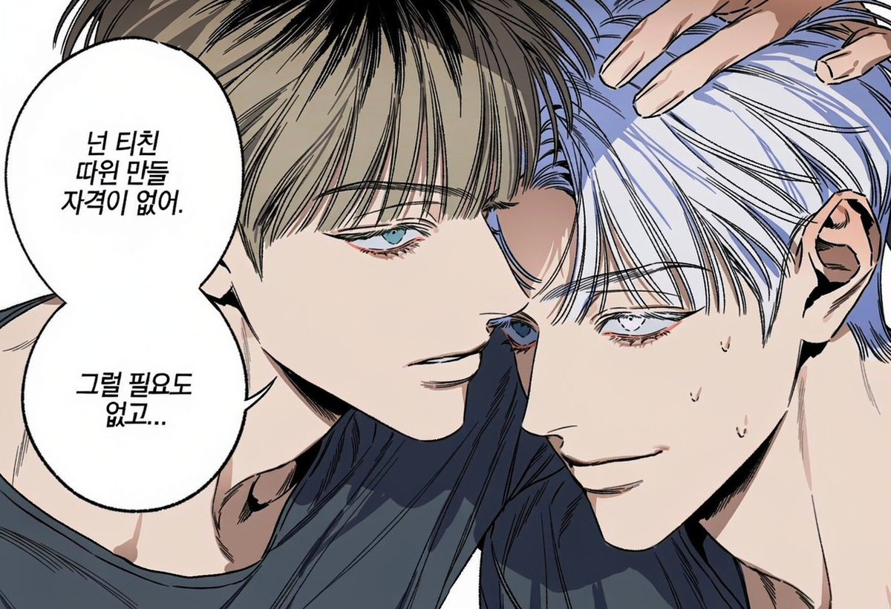

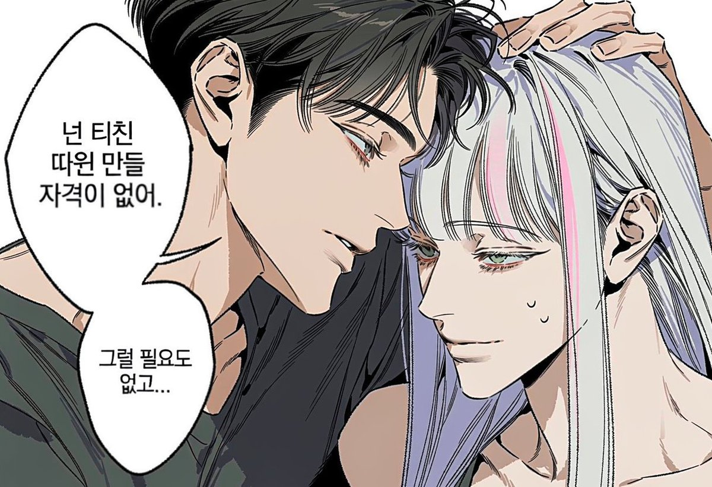

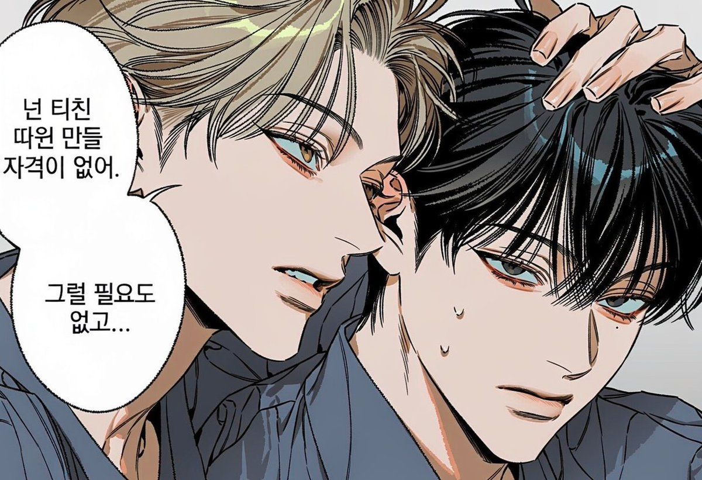

**提示詞**

```text
2people, 黑白漫畫分鏡, 黑白漫畫, 乾淨線稿, 網點, 單格漫畫分鏡, 特寫構圖, 戲劇性情緒張力, 簡單空白背景, 2::左側有兩個白色大對話框::, 無多餘文字

A:
使用另行提供的外貌, 左側, 特寫側臉輪廓, 冷靜冷酷的表情, 半瞇著眼, 臉部非常靠近B, 2::一隻手緊按在B的頭頂上::, 低調具威懾力的氣場

B:
使用另行提供的外貌, 右側, 低著頭, 避免眼神接觸, 頹喪的姿態, 沮喪的表情, 臉頰上有細小汗珠, 受傷且失敗的情緒

構圖:
2::A在左側而B在右側::, 2::A的手按在B的頭頂上::, 2::A靠近並逼近B::, 2::B聳著肩膀低頭看著下方::, 極度特寫, 情緒失衡, 大量留白空間, 無細節背景

,左側有兩個白色漫畫對話框, 乾淨黑色韓文字體, 無多餘文字

"넌 티친  따윈 만들 자격이 없어."
"그럴 필요도 없고..."
```

[↑ 返回分類目錄](#catalog)

---

<a name="prompt-2102401580142313655"></a>

### 翻譯中

作者：[@Awed\_Urshy](https://x.com/Awed_Urshy) · [查看 X 原帖](https://x.com/Awed_Urshy/status/2102401580142313655)

動畫 / 漫畫 · 人像 / 自拍 · 角色 · 時尚單品 · 已推流

**概括:** 翻譯中

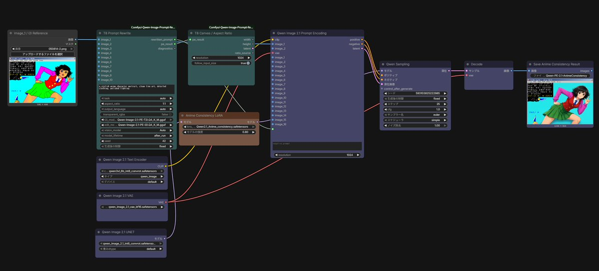

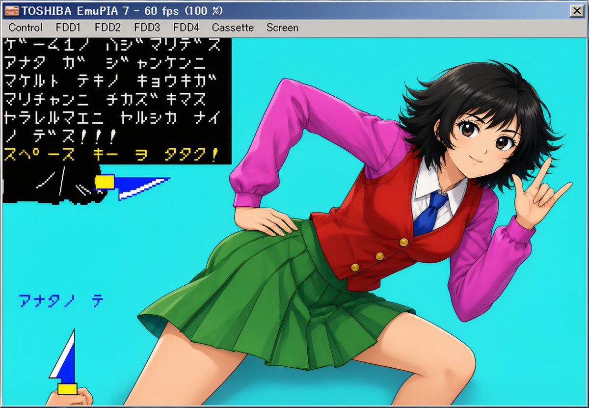

**提示詞**

```text
翻譯中
```

[↑ 返回分類目錄](#catalog)

---

<a name="prompt-2102126625760715047"></a>

### 翻譯中

作者：[@AesterCreatives](https://x.com/AesterCreatives) · [查看 X 原帖](https://x.com/AesterCreatives/status/2102126625760715047)

動畫 / 漫畫 · 角色 · 已推流

**概括:** 翻譯中

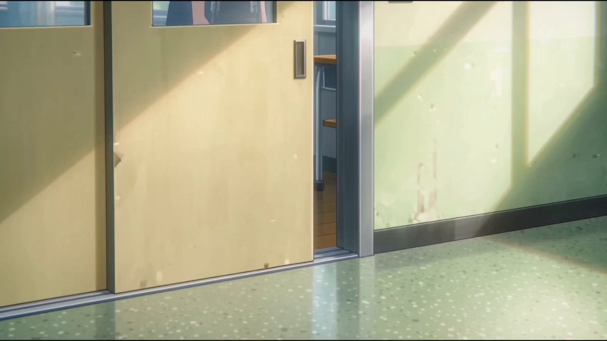

**提示詞**

```text
翻譯中
```

[↑ 返回分類目錄](#catalog)

---

<a name="prompt-2101679499935129630"></a>

### 智慧型手機即時通訊介面中，床上身穿襯衫手拿黑色內褲的少女發送照片效果提示詞。

作者：[@2\_\_han\_\_](https://x.com/2__han__) · [查看 X 原帖](https://x.com/2__han__/status/2101679499935129630)

App / 網站設計 · 動畫 / 漫畫 · 人像 / 自拍 · 角色 · 已推流

**概括:** 智慧型手機即時通訊介面中，床上身穿襯衫手拿黑色內褲的少女發送照片效果提示詞。


**提示詞**

```text
(((智慧型手機邊框))), (((手機螢幕))), 螢幕焦點, 行動裝置介面, 即時通訊應用程式UI, 聊天記錄, 照片附件, 圖片對話泡泡,\n\n照片附件內部: (少女, 室內, 夜晚, 昏暗的臥室, 床, 自拍, 第一人稱視角, 穿著寬大襯衫, 領襯衫, 白襯衫, 拿著黑色內褲, 展示, 挑逗姿勢),\n\n左側對話泡泡, 韓文文字, "집에 언제 와?", 乾淨UI, 細緻UI, 官方藝術,
```

[↑ 返回分類目錄](#catalog)

---

<a name="prompt-2101637673349988798"></a>

### 塑膠模型開始走動的動畫。

作者：[@SanShiroH\_X](https://x.com/SanShiroH_X) · [查看 X 原帖](https://x.com/SanShiroH_X/status/2101637673349988798)

動畫 / 漫畫 · 已推流

**概括:** 塑膠模型開始走動的動畫。


**提示詞**

```text
開始走動的模型
```

[↑ 返回分類目錄](#catalog)

---

<a name="prompt-2101634180312670313"></a>

### 翻譯中

作者：[@DDJCXX](https://x.com/DDJCXX) · [查看 X 原帖](https://x.com/DDJCXX/status/2101634180312670313)

動畫 / 漫畫 · 插圖 · 像素藝術 · 角色 · 動物 / 生物 · 已推流

查看 X 原帖：[@94vanAI](https://x.com/94vanAI) · [查看 X 原帖](https://x.com/94vanAI/status/2101611865969238144)

**概括:** 翻譯中


**提示詞**

```text
翻譯中
```

[↑ 返回分類目錄](#catalog)

---

<a name="prompt-2101422388022046935"></a>

### 金髮動漫風格少年與黑髮賽馬娘角色的插畫。

作者：[@AUrbNUMjfxj85IS](https://x.com/AUrbNUMjfxj85IS) · [查看 X 原帖](https://x.com/AUrbNUMjfxj85IS/status/2101422388022046935)

動畫 / 漫畫 · 插圖 · 角色 · 已推流

**概括:** 金髮動漫風格少年與黑髮賽馬娘角色的插畫。


**提示詞**

```text
金髮的須賀京太郎是個男孩子，動漫少年風格。黑髮的卡爾斯通輕泉是個女孩子賽馬娘，賽馬娘風格。
```

[↑ 返回分類目錄](#catalog)

---

<a name="prompt-2101421852858183710"></a>

### 描繪金髮少年與黑髮賽馬娘角色的動漫風格插畫提示詞。

作者：[@AUrbNUMjfxj85IS](https://x.com/AUrbNUMjfxj85IS) · [查看 X 原帖](https://x.com/AUrbNUMjfxj85IS/status/2101421852858183710)

動畫 / 漫畫 · 插圖 · 角色 · 已推流

**概括:** 描繪金髮少年與黑髮賽馬娘角色的動漫風格插畫提示詞。


**提示詞**

```text
金髮須賀京太郎是個男孩，動漫風格少年外觀。黑髮卡爾斯通輕泉（Calstone Light O）是女孩賽馬娘，賽馬娘風格
```

[↑ 返回分類目錄](#catalog)

---

<a name="prompt-2101030346334908638"></a>

### 3格浪漫漫畫條漫提示詞，害羞的女孩逗弄慌亂臉紅的男孩。

作者：[@2\_\_han\_\_](https://x.com/2__han__) · [查看 X 原帖](https://x.com/2__han__/status/2101030346334908638)

漫畫 / 分鏡腳本 · 動畫 / 漫畫 · 漫畫 / 圖像小說 · 角色 · 已推流

**概括:** 3格浪漫漫畫條漫提示詞，害羞的女孩逗弄慌亂臉紅的男孩。


**提示詞**

```text
漫畫頁面，3格，垂直條漫版面配置，白色背景，連環畫，漫畫，垂直堆疊，垂直分割，

[PANEL 1]：頂部畫格，1個男孩1個女孩，側視圖，中景，距離感，1個男孩雙臂抱胸皺眉看向別處，1個女孩在男孩身後看著男孩猶豫流汗滴，緊張感，留白，

[PANEL 2]：中間畫格，1個女孩，看著男孩，眼神交會，非常臉紅，害羞的微笑，手放在胸前，雙手遮胸，文字對話框，"가슴 만질래...?"，柔和線條，情感聚焦，

[PANEL 3]：底部畫格，1個男孩，特寫，臉部鏡頭，面向觀者，極度臉紅，滿臉通紅，睜大雙眼，慌亂，尷尬，驚訝，單手摀嘴，愛心圖案背景，戲劇性陰影，
```

[↑ 返回分類目錄](#catalog)

---

<a name="prompt-2100703296302588303"></a>

### 美少女剃度儀式動漫風插畫生成提示詞。

作者：[@AUrbNUMjfxj85IS](https://x.com/AUrbNUMjfxj85IS) · [查看 X 原帖](https://x.com/AUrbNUMjfxj85IS/status/2100703296302588303)

動畫 / 漫畫 · 插圖 · 角色 · 已推流

**概括:** 美少女剃度儀式動漫風插畫生成提示詞。


**提示詞**

```text
美少女剃度儀式動畫
```

[↑ 返回分類目錄](#catalog)

---

<a name="prompt-2100703688205770795"></a>

### 美少女剃髮儀式動畫的生成提示詞

作者：[@AUrbNUMjfxj85IS](https://x.com/AUrbNUMjfxj85IS) · [查看 X 原帖](https://x.com/AUrbNUMjfxj85IS/status/2100703688205770795)

動畫 / 漫畫 · 插圖 · 角色 · 已推流

**概括:** 美少女剃髮儀式動畫的生成提示詞


**提示詞**

```text
美少女剃髮儀式動畫
```

[↑ 返回分類目錄](#catalog)

---

<a name="prompt-2100703512049107223"></a>

### 翻譯中

作者：[@AUrbNUMjfxj85IS](https://x.com/AUrbNUMjfxj85IS) · [查看 X 原帖](https://x.com/AUrbNUMjfxj85IS/status/2100703512049107223)

動畫 / 漫畫 · 角色 · 已推流

**概括:** 翻譯中


**提示詞**

```text
翻譯中
```

[↑ 返回分類目錄](#catalog)

---

<a name="prompt-2100855355928621063"></a>

### 紫髮紅瞳女性角色伸懶腰的高畫質動漫上半身插畫提示詞，包含豐富的服飾與場景細節。

作者：[@studio\_yebisu](https://x.com/studio_yebisu) · [查看 X 原帖](https://x.com/studio_yebisu/status/2100855355928621063)

動畫 / 漫畫 · 插圖 · 角色 · 時尚單品 · 已推流

**概括:** 紫髮紅瞳女性角色伸懶腰的高畫質動漫上半身插畫提示詞，包含豐富的服飾與場景細節。


**提示詞**

```text
傑作, 頂級品質, 極具美感, 細緻的面部, 高對比度, 光滑肌膚,
1個女孩, 獨自一人, 成年女性,
極長的頭髮, 紫色頭髮, 漸變髮色, 直髮, 垂於雙眼間的髮絲, 鬢髮,
紅瞳, 臉紅, 閉嘴, 鬧彆扭, 注視鏡頭,
黑色頭飾, 荷葉邊頭飾, 紫色蝴蝶結,
伸懶腰, 抬起雙臂, 腋下, 及肘手套, 黑色手套, 蕾絲滾邊手套,
黑色洋裝, 平口無肩帶洋裝, 亮面衣物, 乳膠, 束腹, 乳溝, 豐滿胸部,
紫色領巾, 紫色蝴蝶結, 腰部蝴蝶結,
室內, 臥室, 窗戶, 日光, 植物, 模糊背景, 景深,
毛絨玩偶, 兔子玩偶,
上半身, 動漫風格
```

[↑ 返回分類目錄](#catalog)

---

<a name="prompt-2100438943573659802"></a>

### 詳細指定了通用構圖以及兩位人物（A、B）的姿勢、服裝與情感表達的浪漫情侶插畫提示詞。

作者：[@leftbypeace](https://x.com/leftbypeace) · [查看 X 原帖](https://x.com/leftbypeace/status/2100438943573659802)

動畫 / 漫畫 · 插圖 · 漫畫 / 圖像小說 · 角色 · 團體 / 情侶 · 時尚單品 · 已推流

**概括:** 詳細指定了通用構圖以及兩位人物（A、B）的姿勢、服裝與情感表達的浪漫情侶插畫提示詞。


**提示詞**

```text
通用：2人，2::遠景::，3::B將頭向後靠在A的腿上和胸前::，2::溫馨浪漫的時刻，溫柔的愛意::，簡約白色背景

A：深灰色休閒夾克，深色長褲，3::輕吻B的額頭::，3::一隻手輕撫B的頭髮::，溫柔守護的神情，放鬆的表情

B：寬鬆柔軟的米白色連帽衫，3::頭枕在A的腿上，溫柔地抬頭仰望::，2::愜意地閉上雙眼，燦爛幸福的笑容，淡淡粉紅的面頰，全然放鬆且滿足::
```

[↑ 返回分類目錄](#catalog)

---

<a name="prompt-2100437193340948981"></a>

### 生成指定角色發布動態並引發其他角色根據性格與關係互動的9:16中文朋友圈截圖提示詞模板。

作者：[@VoxcatAI](https://x.com/VoxcatAI) · [查看 X 原帖](https://x.com/VoxcatAI/status/2100437193340948981)

社群媒體貼文 · 動畫 / 漫畫 · 角色 · 已推流

查看 X 原帖：[@VoxcatAI](https://x.com/VoxcatAI) · [查看 X 原帖](https://x.com/VoxcatAI/status/2100414488860316088)

**概括:** 生成指定角色發布動態並引發其他角色根據性格與關係互動的9:16中文朋友圈截圖提示詞模板。


**提示詞**

```text
{角色A}把自己的{作品內容}發到朋友圈，其他角色在評論區互動。中文社群平台朋友圈截圖，包含主貼、配圖、正文、按讚和評論區，9:16。所有評論必須嚴格符合各角色的性格、經歷、身分、說話方式、過往事件，以及他們與角色A之間的真實關係和權力地位。不是簡單按性格發言，而是要體現誰敬畏、誰害怕、誰奉承、誰忌憚、誰陰陽、誰敢正面懟、誰只能委婉表達。公開評論與真實態度可以不一致，允許表面客氣、話裡有話、自我審查、選邊站、敷衍附和、樓中樓互嗆。整體要像這些角色真的會在朋友圈這樣評論。動漫或遊戲角色統一轉化為真人版社群平台截圖。
```

[↑ 返回分類目錄](#catalog)

---

<a name="prompt-2100287072775123218"></a>

### 金髮美男子與藍髮美少女的二次元插畫。

作者：[@AUrbNUMjfxj85IS](https://x.com/AUrbNUMjfxj85IS) · [查看 X 原帖](https://x.com/AUrbNUMjfxj85IS/status/2100287072775123218)

動畫 / 漫畫 · 插圖 · 角色 · 已推流

**概括:** 金髮美男子與藍髮美少女的二次元插畫。


**提示詞**

```text
二次元俊男美女，須賀京太郎與弘世堇，金髮與藍髮的插畫
```

[↑ 返回分類目錄](#catalog)

---

<a name="prompt-2100214733651796462"></a>

### 翻譯中

作者：[@mioarashidaisuk](https://x.com/mioarashidaisuk) · [查看 X 原帖](https://x.com/mioarashidaisuk/status/2100214733651796462)

動畫 / 漫畫 · 已推流

**概括:** 翻譯中


**提示詞**

```text
翻譯中
```

[↑ 返回分類目錄](#catalog)

---

<a name="prompt-2099903953693708742"></a>

### 描繪金髮的須賀京太郎與藍髮的弘世堇的二次元角色生成提示詞。

作者：[@AUrbNUMjfxj85IS](https://x.com/AUrbNUMjfxj85IS) · [查看 X 原帖](https://x.com/AUrbNUMjfxj85IS/status/2099903953693708742)

動畫 / 漫畫 · 角色 · 已推流

**概括:** 描繪金髮的須賀京太郎與藍髮的弘世堇的二次元角色生成提示詞。


**提示詞**

```text
須賀京太郎與弘世堇，金髮與藍髮
```

[↑ 返回分類目錄](#catalog)

---

<a name="prompt-2099566382471909568"></a>

### 將個人照片轉變為與寶可夢相伴的動漫風格寶可夢TCG全圖卡牌的提示詞。

作者：[@Xabatz](https://x.com/Xabatz) · [查看 X 原帖](https://x.com/Xabatz/status/2099566382471909568)

動畫 / 漫畫 · 已推流

**概括:** 將個人照片轉變為與寶可夢相伴的動漫風格寶可夢TCG全圖卡牌的提示詞。


**提示詞**

```text
姓名: (你的名字)
寶可夢(你想要的寶可夢)
圖像提示詞
生成一張乾淨的寶可夢集換式卡牌遊戲（Pokémon TCG）全圖卡牌設計的數位插畫，呈現為平整掃描件風格的數位資產（而非實體卡牌的照片）。將上傳照片中的人物轉變為動漫風格的寶可夢訓練家，同時保留其外貌特徵。讓他們與一隻噴火龍（CHARIZARD）一起擺出充滿活力的動態動作姿勢。背景應為與該寶可夢屬性相符的強烈元素能量。
```

[↑ 返回分類目錄](#catalog)

---

<a name="prompt-2099481577969312010"></a>

### 基於參考圖創作真人與牆面手繪漫畫塗鴉影子互動的混合媒介肖像提示詞。

作者：[@AISuperDomain](https://x.com/AISuperDomain) · [查看 X 原帖](https://x.com/AISuperDomain/status/2099481577969312010)

動畫 / 漫畫 · 漫畫 / 圖像小說 · 人像 / 自拍 · 角色 · 已推流

**概括:** 基於參考圖創作真人與牆面手繪漫畫塗鴉影子互動的混合媒介肖像提示詞。


**提示詞**

```text
使用上傳的參考圖作為嚴格的人物身份與服裝參考。準確保留參考圖中的面部、五官、膚色、髮型、髮色、配飾、服裝以及整體氛圍，不要進行任何改變。

創作一張高畫質的直式（4:5 或 9:16）混合媒介人物肖像，畫面包含：

一個真實感十足的全身人物，人物外貌與參考圖中的人保持高度一致。
在人物旁邊的牆壁上，出現一個黑色手繪塗鴉風格的同款人物剪影/影子。

真實人物應該呈現出可愛、略帶害羞、俏皮的感覺，並且每次生成時都自然地擺出一個全新、隨機、帶有惡作劇感的俏皮姿勢。

牆上的手繪塗鴉影子也應該做出與真人相同的姿勢構思，但表現得更加誇張、混亂、卡通化和充滿戲劇性。加入漫畫風格的動作線、星星、愛心和閃爍效果，讓塗鴉影子看起來活潑有趣。

使用乾淨的白色/奶油色攝影棚牆面，背景保持極簡。採用柔和、自然的光線，並確保真人和塗鴉影子都完整呈現在畫面中，不被裁切。

塗鴉人物必須能夠透過髮型、配飾、服裝輪廓以及姿勢，清晰地讓人聯想到真實人物。

負面提示詞（Negative Prompt）：

更換服裝、改變人物身份、第二個真實人物、普通真實陰影、恐怖風格、動漫人物真人化、雜亂背景、重複的指人姿勢或手指槍姿勢、僵硬的姿勢、多餘的肢體/手指、身體變形、文字、浮水印、Logo、AI生成痕跡。
```

[↑ 返回分類目錄](#catalog)

---

<a name="prompt-2099395304449831352"></a>

### 1個人, 肖像, 珍珠眼淚與單色背景下的局部彩色眼睛/眼淚。

作者：[@2\_\_han\_\_](https://x.com/2__han__) · [查看 X 原帖](https://x.com/2__han__/status/2099395304449831352)

動畫 / 漫畫 · 插圖 · 人像 / 自拍 · 摘要 / 背景 · 已推流

**概括:** 1個人, 肖像, 珍珠眼淚與單色背景下的局部彩色眼睛/眼淚。


**提示詞**

```text
1個人, 肖像,
仰望, 歪頭, 嘴唇微張,
珍珠眼淚, 珍珠妝容, 寶石眼淚, 眼下寶石
3::單色, 灰階, 局部色彩, 僅眼睛彩色, 僅眼淚彩色::,
簡潔背景, 黑暗背景, 棚拍燈光, 戲劇性光影,
```

[↑ 返回分類目錄](#catalog)

---

<a name="prompt-2099256180845731868"></a>

### 在酒館裡喝啤酒的深綠色軍裝、粉髮、戴眼鏡的動漫女性。

作者：[@ux6ovv](https://x.com/ux6ovv) · [查看 X 原帖](https://x.com/ux6ovv/status/2099256180845731868)

動畫 / 漫畫 · 角色 · 食物 / 飲品 · 已推流

**概括:** 在酒館裡喝啤酒的深綠色軍裝、粉髮、戴眼鏡的動漫女性。


**提示詞**

```text
動漫風格，一位身穿軍裝的女性，軍裝以深綠色為主調，粉色短髮，戴著偏大的眼鏡，在酒館裡用大啤酒杯暢飲的樣子
```

[↑ 返回分類目錄](#catalog)

---

<a name="prompt-2099171324568760589"></a>

### 將3x3九宮格圖像從左上到右下按順序切換鏡頭製作成2D動畫的指令。

作者：[@8co28](https://x.com/8co28) · [查看 X 原帖](https://x.com/8co28/status/2099171324568760589)

動畫 / 漫畫 · 已推流

查看 X 原帖：[@8co28](https://x.com/8co28) · [查看 X 原帖](https://x.com/8co28/status/2099164852560539975)

**概括:** 將3x3九宮格圖像從左上到右下按順序切換鏡頭製作成2D動畫的指令。


**提示詞**

```text
鏡頭從左上到右下分鏡依序切換的2D動畫，\n禁止多分鏡同時出現，禁止BGM
```

[↑ 返回分類目錄](#catalog)

---

<a name="prompt-2098669706626683027"></a>

### 翻譯中

作者：[@ux6ovv](https://x.com/ux6ovv) · [查看 X 原帖](https://x.com/ux6ovv/status/2098669706626683027)

動畫 / 漫畫 · 已推流

**概括:** 翻譯中


**提示詞**

```text
翻譯中
```

[↑ 返回分類目錄](#catalog)

---

<a name="prompt-2097918597603733849"></a>

### 魯夫與安妮亞互動的動漫分鏡提示詞，包含金色絲帶防護光罩與摸頭擁抱動作。

作者：[@Gopphybjwo](https://x.com/Gopphybjwo) · [查看 X 原帖](https://x.com/Gopphybjwo/status/2097918597603733849)

漫畫 / 分鏡腳本 · 動畫 / 漫畫 · 已推流

**概括:** 魯夫與安妮亞互動的動漫分鏡提示詞，包含金色絲帶防護光罩與摸頭擁抱動作。


**提示詞**

```text
10–15 秒｜道具爆發：Rakhi 自己飛起來纏上手腕
金色絲帶自動纏上魯夫手腕，保護光罩展開，Anya 眼睛變星星。
15–20 秒｜情緒高潮：大哥哥摸頭＋擁抱
魯夫認真摸 Anya 的頭，Anya 撲進懷裡，金色愛心光包圍。
```

[↑ 返回分類目錄](#catalog)

---

<a name="category-illustration"></a>

## 插圖

<a name="prompt-2102419652248838557"></a>

### 翻譯中

作者：[@Hamburgerai](https://x.com/Hamburgerai) · [查看 X 原帖](https://x.com/Hamburgerai/status/2102419652248838557)

插圖 · 摘要 / 背景 · 已推流

**概括:** 翻譯中

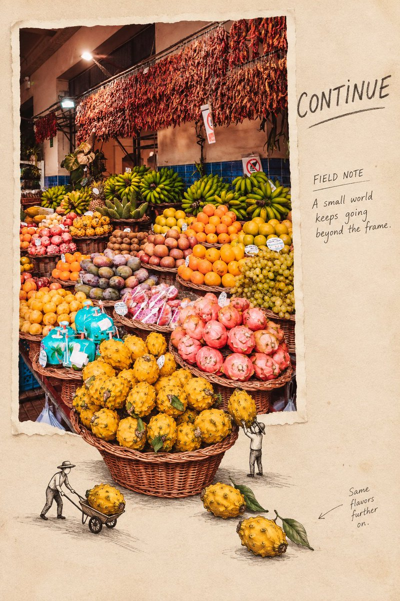

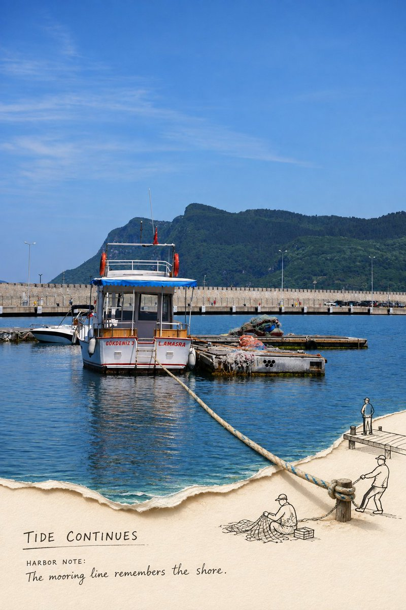

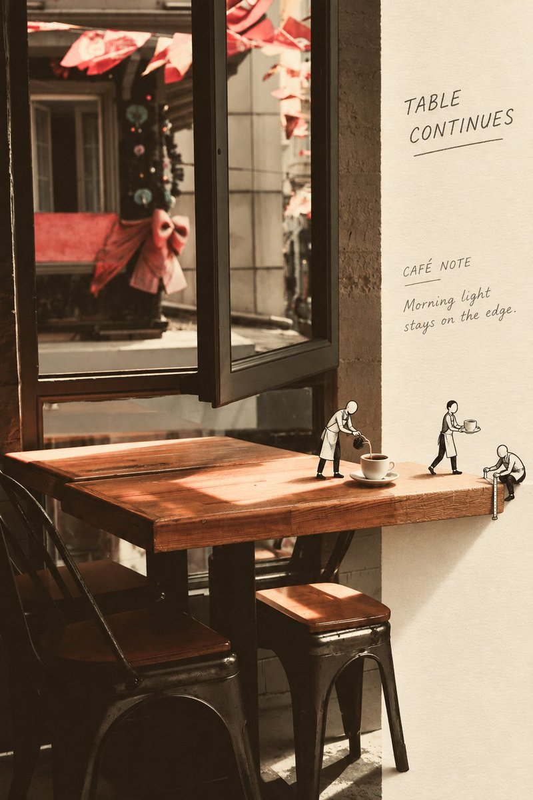

**提示詞**

```text
翻譯中
```

[↑ 返回分類目錄](#catalog)

---

<a name="prompt-2101956517557883076"></a>

### 時尚大片插畫：一名男子身著合身灰色西裝，外搭色彩鮮豔的韓國薩滿長袍正向前邁步，伴隨水墨般的煙霧，背景為芥末黃色。

作者：[@leftbypeace](https://x.com/leftbypeace) · [查看 X 原帖](https://x.com/leftbypeace/status/2101956517557883076)

插圖 · 角色 · 時尚單品 · 已推流

**概括:** 時尚大片插畫：一名男子身著合身灰色西裝，外搭色彩鮮豔的韓國薩滿長袍正向前邁步，伴隨水墨般的煙霧，背景為芥末黃色。

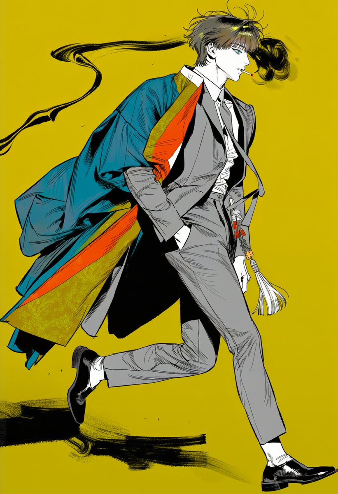

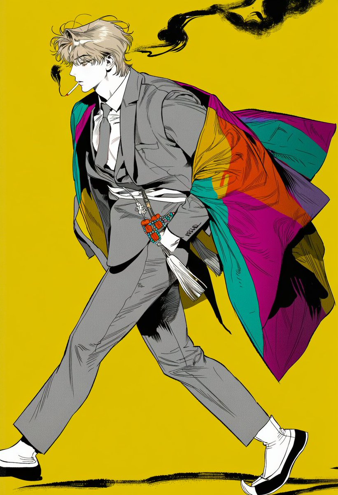

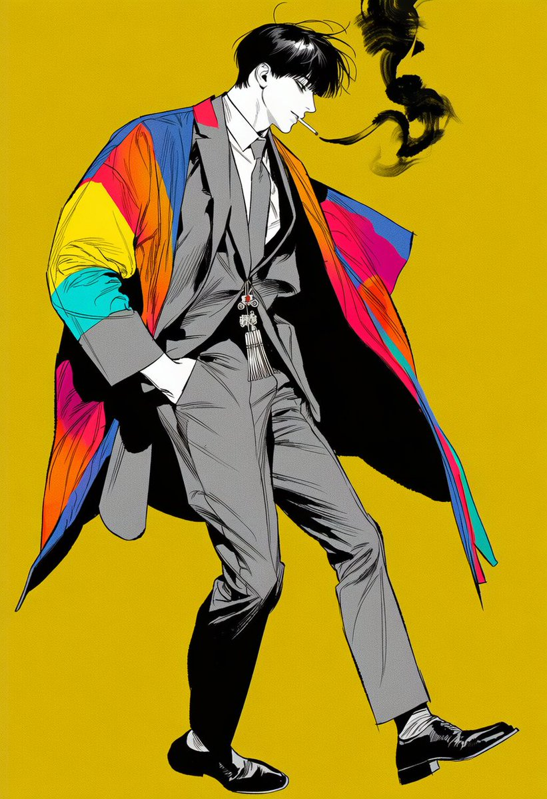

**提示詞**

```text
全身，3::側身輪廓，自然行走姿態，邁步中，一腿向前，另一腿向後::，抽著香菸，3::黑墨般的香菸煙霧，水墨畫風煙霧，流動的水墨洗印::，2::灰色訂製西裝，白色正裝襯衫，灰色領帶::，3::色彩艷麗的韓國薩滿長袍寬鬆地套在西裝外::，飄逸的長袖，長袍在身後飄動，腰間有彩色的儀式念珠和流蘇，2::一隻手插在口袋裡，另一隻手臂在身側放鬆::，時尚大片，平塗芥末黃背景
```

[↑ 返回分類目錄](#catalog)

---

<a name="prompt-2101985224838299818"></a>

### 1.4::回頭望向左肩後方::, 1.4::手持黃色蒸汽龐克槍指向向上::, 蒸汽龐克護目鏡，純白背景下單手著地的動態低蹲姿勢。

作者：[@sha1shashasha](https://x.com/sha1shashasha) · [查看 X 原帖](https://x.com/sha1shashasha/status/2101985224838299818)

插圖 · 角色 · 摘要 / 背景 · 已推流

**概括:** 1.4::回頭望向左肩後方::, 1.4::手持黃色蒸汽龐克槍指向向上::, 蒸汽龐克護目鏡，純白背景下單手著地的動態低蹲姿勢。

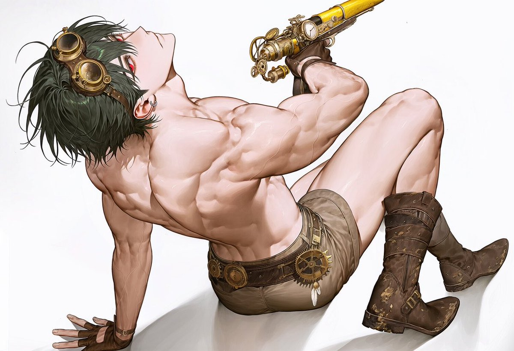

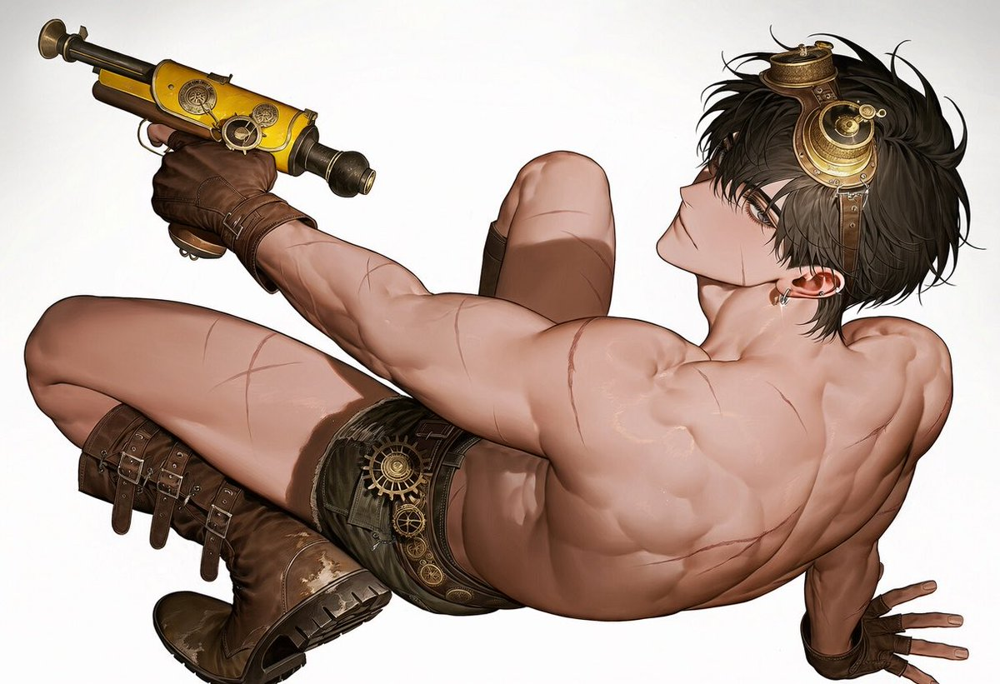

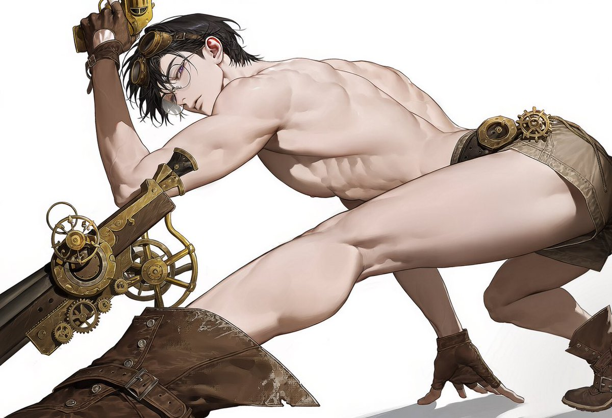

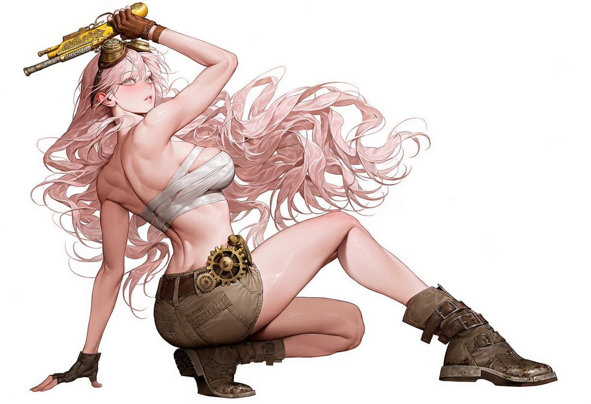

**提示詞**

```text
1.4::回頭望向左肩後方::, 1.4::手持黃色蒸汽龐克槍指向向上::,

1.4::額頭上戴著黃銅蒸汽龐克護目鏡::, 1.3::超短工裝短褲::, 短褲, 1.4::配有大型黃銅齒輪的皮帶，帶有金屬扣和綁帶的仿舊皮靴::,1.3::右手戴棕色皮革半指手套::,

0.8::線條分明的背肌::, 大腿裸露,

1.2::充滿動態感的低蹲姿勢，動態低角度，坐蹲，軀幹扭轉::, 1.1::腰部扭轉，向後傾斜::, 低重心，不對稱姿勢,

一隻手臂向後伸展撐在地面，筆直的支撐臂，手掌著地，單手支撐全身重量，另一隻手臂舉過頭頂，手放在頭頂上方,

不對稱彎曲的雙腿，雙膝放低，1.2::雙腳踩在地面上，拱起的背部::, 修長的頸部，頭部轉過肩膀，1.1::向後看，3/4側面輪廓::, 自然的人體解剖結構，平衡的姿態::, 2::純白乾淨背景::, 戲劇性柔和光線，輪廓分明的肌肉陰影
```

[↑ 返回分類目錄](#catalog)

---

<a name="prompt-2101691757385724297"></a>

### 一張舒適的秋季主題貼紙，以微笑的女孩、金色楓葉和阿拉伯書法為特色，白色背景。

作者：[@81soud81](https://x.com/81soud81) · [查看 X 原帖](https://x.com/81soud81/status/2101691757385724297)

插圖 · 角色 · 摘要 / 背景 · 已推流

**概括:** 一張舒適的秋季主題貼紙，以微笑的女孩、金色楓葉和阿拉伯書法為特色，白色背景。


**提示詞**

```text
一張舒適的秋季主題貼紙，模切向量圖。一位面部特徵溫暖柔和、帶著溫柔微笑的女孩，被旋轉的金色楓葉所環繞。設計中包含阿拉伯文字「سلام داخلي」，採用柔和優雅的阿拉伯書法風格。豐富的暖色調，優雅俐落的向量藝術，高解析度，白色背景。
```

[↑ 返回分類目錄](#catalog)

---

<a name="prompt-2101694789200511237"></a>

### 描述由千人組成頭部的章魚象徵性襲擊俄羅斯的政治隱喻圖像。

作者：[@Masssiana](https://x.com/Masssiana) · [查看 X 原帖](https://x.com/Masssiana/status/2101694789200511237)

插圖 · 已推流

**概括:** 描述由千人組成頭部的章魚象徵性襲擊俄羅斯的政治隱喻圖像。


**提示詞**

```text
由1000人組成的章魚頭部今天襲擊了俄羅斯，而不是由北約、烏克蘭、德國、法國、英國、歐洲各臂組成的章魚觸手；章魚犧牲了自己的頭部以擊敗俄羅斯和普京。
```

[↑ 返回分類目錄](#catalog)

---

<a name="prompt-2101577158112235568"></a>

### 東方奇幻插畫，赤裸上身且有刺青的肌肉男子嘴咬絲帶，背景為經幡與雪山山峰。

作者：[@sha1shashasha](https://x.com/sha1shashasha) · [查看 X 原帖](https://x.com/sha1shashasha/status/2101577158112235568)

插圖 · 角色 · 已推流

**概括:** 東方奇幻插畫，赤裸上身且有刺青的肌肉男子嘴咬絲帶，背景為經幡與雪山山峰。


**提示詞**

```text
東方奇幻插畫, 1.3::背面視角::, 回眸看向觀者::,

1.3::赤裸上身的男性::, 1.2::肌肉線條分明的背部::, 1.4::手臂與肩膀上的東方龍刺青::,

1.5::嘴裡咬著白絲帶::, 配飾, 1.3::纏繞在手臂和腰間的繃帶, 肩披毛領斗篷, 腰間繫著傳統東方長袍::, 1.2::橙色腰帶緞帶::, 1.3::飄揚的彩色經幡::,

1.1::天空中飛翔的鳥兒, 雪山山峰背景, 明朗的藍天, 強烈的陽光::, 上半身特寫
```

[↑ 返回分類目錄](#catalog)

---

<a name="prompt-2101233469070168278"></a>

### 超現實心理恐怖插畫，描繪了一個身穿白色睡裙的纖細身影，背景是黑暗中一張巨大的發光紅臉。

作者：[@sha1shashasha](https://x.com/sha1shashasha) · [查看 X 原帖](https://x.com/sha1shashasha/status/2101233469070168278)

插圖 · 人像 / 自拍 · 角色 · 摘要 / 背景 · 已推流

**概括:** 超現實心理恐怖插畫，描繪了一個身穿白色睡裙的纖細身影，背景是黑暗中一張巨大的發光紅臉。


**提示詞**

```text
1.4::超現實插畫::, 心理恐怖藝術, 1.6::背景中巨大的發光紅臉, 俯視的巨大紅色面孔::, 帶有長睫毛的眼睛,

1.3::站在前景中::, 1.2::全身鏡頭, 纖細的剪影::, 白色睡袍連衣裙,

1.3::紅色發光逆光, 戲劇性的紅黑對比::, 黑暗怪異的氛圍, 超現實噩夢主題, 1.1::繪畫風格::, 黑暗背景, 平整底部, 注視觀者
```

[↑ 返回分類目錄](#catalog)

---

<a name="prompt-2101143973549195655"></a>

### 從後方仰拍的低角度視角，焦點從腿部開始，從雙腿之間往後看，頭靠在地面上，雙腳著地，雙手置於身後，士兵少年，清晰分明的腹肌，軍褲，靴子，晃動的軍籍牌，潮紅的臉，細小傷口，瘀青，泥土泥地背景

作者：[@2\_\_han\_\_](https://x.com/2__han__) · [查看 X 原帖](https://x.com/2__han__/status/2101143973549195655)

插圖 · 角色 · 動物 / 生物 · 摘要 / 背景 · 已推流

**概括:** 從後方仰拍的低角度視角，焦點從腿部開始，從雙腿之間往後看，頭靠在地面上，雙腳著地，雙手置於身後，士兵少年，清晰分明的腹肌，軍褲，靴子，晃動的軍籍牌，潮紅的臉，細小傷口，瘀青，泥土泥地背景


**提示詞**

```text
從後方仰拍的低角度視角，焦點從腿部開始，從雙腿之間往後看，頭靠在地面上，雙腳著地，雙手置於身後，雙臂在腰後，士兵，少年，線條分明的腿部肌肉，軍褲，靴子，表情顯得有些吃力的臉龐，結實的胸膛，清晰分明的腹肌，夾克寬鬆，夾克敞開，夾克滑落，露出胸口，露出腹部，晃動的軍籍牌，潮紅的臉，滴淌的汗珠，細小傷口，瘀青，上半身與臉上有明顯的瘀青和細小傷口。泥土泥地背景
```

[↑ 返回分類目錄](#catalog)

---

<a name="prompt-2101116496424665240"></a>

### 萬聖節主題宣傳片，女生身著道士長袍在奈何橋牌樓前做鬼爪動作，配合卡通小鬼特效與宣傳文字。

作者：[@cngshtng10](https://x.com/cngshtng10) · [查看 X 原帖](https://x.com/cngshtng10/status/2101116496424665240)

攝影 · 插圖 · 角色 · 時尚單品 · 已推流

**概括:** 萬聖節主題宣傳片，女生身著道士長袍在奈何橋牌樓前做鬼爪動作，配合卡通小鬼特效與宣傳文字。


**提示詞**

```text
這是一支「十八層地獄主題樂園」的萬聖節宣傳短片：一位女生穿著清代殭屍獵人／道士造型服裝（黑色刺繡長袍、藍色立領、額頭貼黃色符咒、骷髏項鍊），站在燈籠高掛的「奈何橋」牌樓前，對鏡頭比出嚇人的鬼爪動作，搭配可愛的卡通小鬼特效、驚嚇反應、以及優惠券式的宣傳文字
```

[↑ 返回分類目錄](#catalog)

---

<a name="prompt-2101032572532736383"></a>

### 帶有文字疊加的誘人數位女主人插畫。

作者：[@shroudspeeders](https://x.com/shroudspeeders) · [查看 X 原帖](https://x.com/shroudspeeders/status/2101032572532736383)

插圖 · 已推流

**概括:** 帶有文字疊加的誘人數位女主人插畫。


**提示詞**

```text
為我畫一幅帶有文字「ASSX」的數位女主人（digital mistress）誘人畫面
```

[↑ 返回分類目錄](#catalog)

---

<a name="prompt-2100987458766750054"></a>

### 一隻睏倦的白兔蜷縮在陽光灑落的雛菊草地上的拼布被中。

作者：[@RenRose321](https://x.com/RenRose321) · [查看 X 原帖](https://x.com/RenRose321/status/2100987458766750054)

插圖 · 已推流

**概括:** 一隻睏倦的白兔蜷縮在陽光灑落的雛菊草地上的拼布被中。


**提示詞**

```text
一隻睏倦的白兔蜷縮在陽光灑落的三葉草與雛菊草地上的拼布被中，柔和的粉彩插畫，帶有層次豐富的織物般質感，粉紅、奶油色、鼠尾草綠與奶油黃的色調，寧靜清爽的清晨氛圍
```

[↑ 返回分類目錄](#catalog)

---

<a name="prompt-2100758326556471449"></a>

### 一隻橙色虎斑貓趴在巨大雛菊花田中的薄荷綠汽車上，純樸的素人藝術風格。

作者：[@RenRose321](https://x.com/RenRose321) · [查看 X 原帖](https://x.com/RenRose321/status/2100758326556471449)

插圖 · 動物 / 生物 · 車輛 · 已推流

**概括:** 一隻橙色虎斑貓趴在巨大雛菊花田中的薄荷綠汽車上，純樸的素人藝術風格。


**提示詞**

```text
一隻橙色虎斑貓慵懶地趴在一輛停在巨大雛菊花田裡的微型薄荷綠汽車引擎蓋上，純樸的素人藝術風格，帶有扁平形狀和裝飾性圓點，珊瑚色、向日葵色和天藍色彩盤，俏皮且陽光明媚
```

[↑ 返回分類目錄](#catalog)

---

<a name="prompt-2100164379128021284"></a>

### 直播畫面風格的插畫生成提示詞。

作者：[@AIDream\_Project](https://x.com/AIDream_Project) · [查看 X 原帖](https://x.com/AIDream_Project/status/2100164379128021284)

App / 網站設計 · 插圖 · 已推流

**概括:** 直播畫面風格的插畫生成提示詞。


**提示詞**

```text
像是在進行直播一樣的智慧型手機螢幕。
```

[↑ 返回分類目錄](#catalog)

---

<a name="prompt-2099269832827187204"></a>

### 受浮世繪與巴洛克風格啟發的插畫，描繪了一位安詳的人物置身於一隻金眸紫孔雀旁，四周環繞著深紫色的花朵。

作者：[@abulu8](https://x.com/abulu8) · [查看 X 原帖](https://x.com/abulu8/status/2099269832827187204)

插圖 · 已推流

**概括:** 受浮世繪與巴洛克風格啟發的插畫，描繪了一位安詳的人物置身於一隻金眸紫孔雀旁，四周環繞著深紫色的花朵。


**提示詞**

```text
一位安詳的人物呈現出柔和的側顏，一頂深紫色的花冠在眉宇間拱起，唯有染著紫水晶色澤的唇瓣與溫柔的下頜沐浴在柔和的金光中，指尖輕撫著一片帶有金色葉脈的花瓣；一隻華麗的擬人化孔雀緊緊貼近，雙眸如熔金流淌，羽毛如華貴的皇家紫絲綢，其間穿插著壓製金箔，羽片如拋光的紫水晶與鍍金般折射著光芒；數十朵深紫色的花朵在他們之間綻放，花瓣宛如緩慢而溫柔的心跳般徐徐飄落；柔和的動態模糊紫金色絲帶斜向飄越整個構圖；人物的長袍消解為鎖著微光的螺旋卷鬚與漂浮的花瓣星芒；深紫色之下隱現著細膩的半色調網點肌理，精緻的金箔邊框如神聖遺物般將其環繞；浮世繪構圖與表現主義優雅及巴洛克式華麗交融；深沉的皇家紫、熔融的金色與柔和的奶油白；瀰漫著飄落花瓣與金色塵埃微粒的溫潤氛圍；超現實、電影感、雜誌風格、寧靜而溫柔的魅惑；富有意境的視覺，在深紫漆光潤澤上呈現出高細節的漫畫插畫渲染質感。
```

[↑ 返回分類目錄](#catalog)

---

<a name="prompt-2099282298730590582"></a>

### 發出藍光的夜間花田與壯麗銀河的插畫風提示詞

作者：[@AkioT315](https://x.com/AkioT315) · [查看 X 原帖](https://x.com/AkioT315/status/2099282298730590582)

插圖 · 風景 / 大自然 · 已推流

**概括:** 發出藍光的夜間花田與壯麗銀河的插畫風提示詞


**提示詞**

```text
美麗夜晚的花田，花朵閃爍著藍光，星空中銀河璀璨壯麗，以強調陰影的插畫風格筆觸呈現
```

[↑ 返回分類目錄](#catalog)

---

<a name="prompt-2099142803704152513"></a>

### 竹枝下穿著黑色學蘭制服接吻的兩人七夕插畫提示詞。

作者：[@leftbypeace](https://x.com/leftbypeace) · [查看 X 原帖](https://x.com/leftbypeace/status/2099142803704152513)

插圖 · 已推流

**概括:** 竹枝下穿著黑色學蘭制服接吻的兩人七夕插畫提示詞。


**提示詞**

```text
通用: 2people, 2::upper body,side view::,3::crouching together beneath bamboo branches::, 3::kissing softly while squatting close::, 掛在竹枝上的彩色許願籤, 七夕裝飾, 茂密的綠葉, 環繞他們的彩帶與紙條, 溫暖的日光, 柔和的陰影, 青春浪漫的氛圍, 乾淨的插畫, 柔和多彩的調色板

A: 3::black gakuran::, 緊靠著B蹲著, 一隻手輕輕扶著B的脖子或衣領, 2::eyes closed::, 溫柔地傾身向前

B: 3::black gakuran::, 面向A蹲著, 一隻手放在膝蓋附近, 另一隻手輕輕觸碰A的袖子, 2::eyes closed::, 迎向這個吻
```

[↑ 返回分類目錄](#catalog)

---

<a name="prompt-2098955280256209249"></a>

### 生成3:4上下對照海報，上部保留原始實拍照片，下部將主體重構為粗輪廓、平面色塊的角色化卡通插畫。

作者：[@Hamburgerai](https://x.com/Hamburgerai) · [查看 X 原帖](https://x.com/Hamburgerai/status/2098955280256209249)

海報／傳單 · 插圖 · 角色 · 已推流

**概括:** 生成3:4上下對照海報，上部保留原始實拍照片，下部將主體重構為粗輪廓、平面色塊的角色化卡通插畫。


**提示詞**

```text
製作一張獨立的3:4直式上下對照海報。上半部分完整保留輸入照片的真實主體、姿勢、顏色、服裝或毛色、道具、環境和空間關係，不做卡通化、不改構圖。中間用一條簡潔平直的白色橫線分隔。

下半部分將同一主體重新設計成具有鮮明角色感的卡通形象：粗重深色描邊，平面色塊，簡化且溫暖的場景背景，誇張但清晰的表情，大而有神采的眼睛，適度圓潤或略帶笨拙的身體比例。根據原圖主體提取角色特徵，可將服裝、姿勢、道具、動物特徵或環境元素轉化為角色設定，讓下半部分像一個有性格的卡通角色，而不是普通濾鏡或簡單描邊。

必須保留原主體的識別特徵、動作關係、主要顏色和關鍵道具；下半部分要有輕鬆、頑皮、略帶戲劇性的角色氣質，但不要變成具體動畫IP、動漫人物或現成吉祥物。不要添加多餘人物、動物或場景。不要文字、字幕、標題、角標、logo、浮水印或拼貼板。
```

[↑ 返回分類目錄](#catalog)

---

<a name="prompt-2098677881375236337"></a>

### 教師主題服裝插畫提示詞（荷葉邊襯衫、鉛筆裙、教鞭等）。

作者：[@AI\_Kei75](https://x.com/AI_Kei75) · [查看 X 原帖](https://x.com/AI_Kei75/status/2098677881375236337)

插圖 · 角色 · 時尚單品 · 已推流

**概括:** 教師主題服裝插畫提示詞（荷葉邊襯衫、鉛筆裙、教鞭等）。


**提示詞**

```text
教師, 白色有領襯衫, 荷葉邊襯衫, 長袖, 鎖骨, 無頸飾, 心形項鍊, 黑色腰帶, (黑色鉛筆裙), 迷你裙, 深棕色褲襪, 高跟鞋, 手持, 教鞭, 細棍,
```

[↑ 返回分類目錄](#catalog)

---

<a name="prompt-2096970899622948972"></a>

### 棉紙上手繪水粉諷刺畫風格，具有綠色、粉色與米色調。

作者：[@MissDelulu9](https://x.com/MissDelulu9) · [查看 X 原帖](https://x.com/MissDelulu9/status/2096970899622948972)

插圖 · 人像 / 自拍 · 已推流

**概括:** 棉紙上手繪水粉諷刺畫風格，具有綠色、粉色與米色調。


**提示詞**

```text
將照片轉換為米色棉紙上的手繪水粉諷刺畫/人像誇張畫。保留人物的確切身份、自然的不對稱性、關鍵面部特徵、髮型、體型及原版服裝。採用大膽的扁平形狀、自信俐落的輪廓、清晰可見的紙張紋理和細微的顏料肌理。採用風格化的人物比例、富有表現力的神情、放大的圖形式眼睛，以及動態的半身姿勢。調色盤：權重均等的鼠尾草綠/橄欖綠、玫瑰粉和暖米色。不要寫實主義、動漫臉、美化、磨皮、3D陰影、文字、標誌或雜亂元素。明確是同一個人，明顯是一幅畫作。
```

[↑ 返回分類目錄](#catalog)

---

<a name="category-sketch-line-art"></a>

## 草圖 / 線稿

<a name="prompt-2102193031583588643"></a>

### 身體被素描本遮擋的素描模特兒與前景中畫家的手。

作者：[@BorderleSint](https://x.com/BorderleSint) · [查看 X 原帖](https://x.com/BorderleSint/status/2102193031583588643)

草圖 / 線稿 · 已推流

查看 X 原帖：[@Zackjpnman](https://x.com/Zackjpnman) · [查看 X 原帖](https://x.com/Zackjpnman/status/2101687832557527435)

**概括:** 身體被素描本遮擋的素描模特兒與前景中畫家的手。

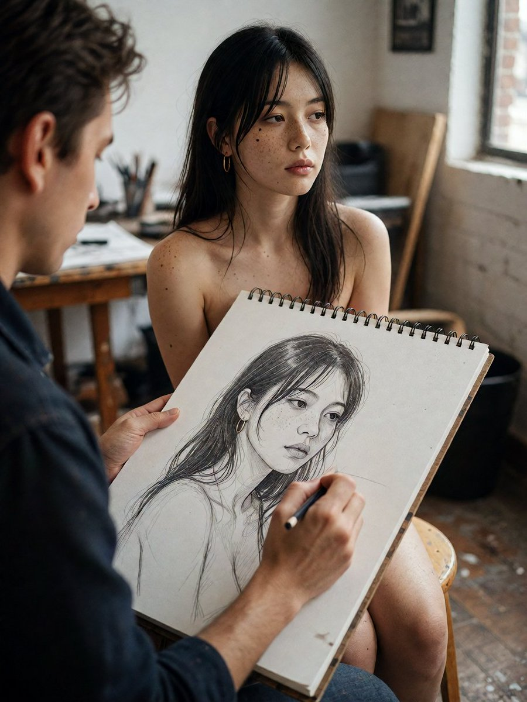

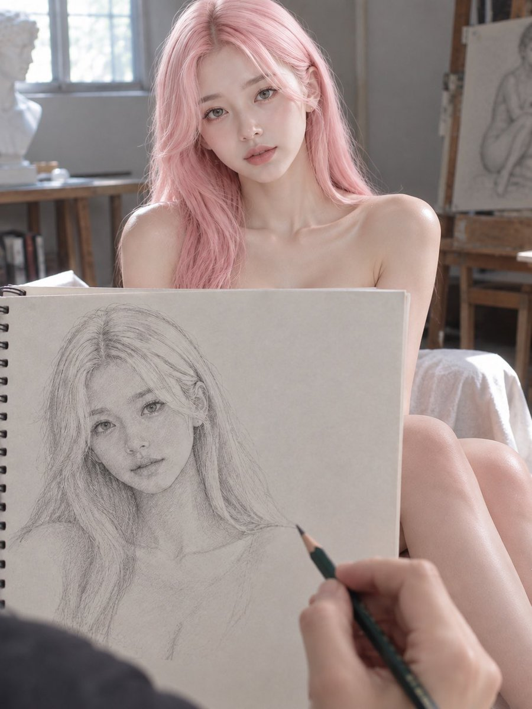

**提示詞**

```text
3:4、寫實攝影、AI生成的20多歲美女、素描模特兒、前景是素描本、畫師的手與鉛筆、她的身體被素描本遮擋、只露出頸肩胸口部位與雙腿、 負面提示:上衣
```

[↑ 返回分類目錄](#catalog)

---

<a name="prompt-2099485936535167139"></a>

### 3:4上下對比海報提示詞，上半保留真實旅遊照，下半轉為深藍底象牙白極簡線稿。

作者：[@Hamburgerai](https://x.com/Hamburgerai) · [查看 X 原帖](https://x.com/Hamburgerai/status/2099485936535167139)

海報／傳單 · 草圖 / 線稿 · 極簡主義 · 已推流

**概括:** 3:4上下對比海報提示詞，上半保留真實旅遊照，下半轉為深藍底象牙白極簡線稿。


**提示詞**

```text
製作一張獨立的3:4豎版上下對比轉繪海報。上半完整保留輸入的印尼人物旅遊真實照片，不變色、不裁切人物、不做卡通化。下半將同一人物與真實環境重新繪製為深海軍藍純色啞光底上的象牙白極簡風寫線稿。保留人物數量、站姿或行走姿態、衣服輪廓、朝向和比例；從原照片提煉門廊、海浪、梯田、樹木、地平線等結構，用少量連續風線、弧線和輪廓線表達。下半人物縮小，四周保留大量負空間，線條帶輕微粉筆或蠟筆顆粒，但整體克制，不使用彩色填充和寫實陰影。中間使用細白分隔線。下半必須是真正重新繪製，不是把照片整體變藍。不要添加文字、logo、浮水印、原圖角標、AI角標或拼貼。
```

[↑ 返回分類目錄](#catalog)

---

<a name="prompt-2099501924278235384"></a>

### 翻譯中

作者：[@Hamburgerai](https://x.com/Hamburgerai) · [查看 X 原帖](https://x.com/Hamburgerai/status/2099501924278235384)

海報／傳單 · 插圖 · 草圖 / 線稿 · 城市景觀 / 街道 · 已推流

**概括:** 翻譯中


**提示詞**

```text
翻譯中
```

[↑ 返回分類目錄](#catalog)

---

<a name="prompt-2098371221184495917"></a>

### 創作一張分割式編輯對比海報，上方為照片，下方為帶有法語筆記的蠟筆速寫。

作者：[@Weilnes](https://x.com/Weilnes) · [查看 X 原帖](https://x.com/Weilnes/status/2098371221184495917)

海報／傳單 · 攝影 · 草圖 / 線稿 · 已推流

**概括:** 創作一張分割式編輯對比海報，上方為照片，下方為帶有法語筆記的蠟筆速寫。


**提示詞**

```text
創作一張高端直式編輯對比海報，以一條乾淨筆直的中線上下精確各佔50%分割。上半部分：[SUBJECT]的逼真旅行攝影，帶有自然光線、真實質感、僅做輕微的雜誌級調色——保持照片的真實感，切勿在上半部分進行插畫化處理。下半部分：同一主體在暖白色肌理紙上的稀疏黑色蠟筆動態速寫研究——帶有遲疑感的斷續蠟筆輪廓線、未完成的填色、紙張紋理、從照片中取樣的一兩處輕微彩色蠟筆塗抹痕跡。幾乎刪除所有背景；僅保留一條微弱的地面線或牆面暗示。主體大部分為紙白留白空間，未完全填滿。主體約佔底部寬度的38–58%，位於中下方。連續的暖白留白空間≥55%。清晰易讀的手寫顫抖蠟筆法語文字：一個簡短標題、« ÉTUDE CRAYON 0N »，以及一則法語的事實性觀察記錄。無英文文字。避免細緻毛髮細節、可愛的向量吉祥物、完全填色、密集塗鴉、完整背景、平滑數位鉛筆線條、產品插圖、標誌、簽名、浮水印。主題選項：un chat roux sur les pavés (PAUSE RUE / ÉTUDE CRAYON 01)、valises empilées près de la porte (PRÊT À PARTIR / ÉTUDE CRAYON 02)、un vélo contre le mur (ATTENTE / ÉTUDE CRAYON 03)、une tasse encore chaude (PETITE PAUSE / ÉTUDE CRAYON 04)。
```

[↑ 返回分類目錄](#catalog)

---

<a name="prompt-2097875834103287904"></a>

### 翻譯中

作者：[@Hamburgerai](https://x.com/Hamburgerai) · [查看 X 原帖](https://x.com/Hamburgerai/status/2097875834103287904)

草圖 / 線稿 · 水彩 · 已推流

**概括:** 翻譯中


**提示詞**

```text
翻譯中
```

[↑ 返回分類目錄](#catalog)

---

<a name="category-comic-graphic-novel"></a>

## 漫畫 / 圖像小說

<a name="prompt-2100793684895965264"></a>

### 2格漫畫提示詞：第1格為白天街頭約會，第2格為臥室低角度腿部特寫。

作者：[@2\_\_han\_\_](https://x.com/2__han__) · [查看 X 原帖](https://x.com/2__han__/status/2100793684895965264)

漫畫 / 圖像小說 · 城市景觀 / 街道 · 已推流

**概括:** 2格漫畫提示詞：第1格為白天街頭約會，第2格為臥室低角度腿部特寫。


**提示詞**

```text
2格, 漫畫, 日本漫畫, 垂直堆疊, 垂直分割, 2個垂直堆疊的畫格, 

[畫格 1] 全身, 2個人, 一起散步, 挽著手臂, 手挽手, 並肩, 約會, 開心的微笑, 走在街上, 角色A穿著寬版牛仔夾克, 黑色高領衫, 長褲, 角色B穿著米色風衣, 百褶裙, 樂福鞋, 城市街景背景, 店面門市, 白天, 柔和光線, 

[畫格 2] 低角度, 焦點在腳部, 焦點在腿部, 角色B裸腿, 角色B下半身未穿衣物, 焦點在皮膚, 角色B雙腿抬起, 雙腳離地, 懸空的腳, 踮腳, 繃緊的腳尖, 顫抖的雙腿, 大腿上的汗珠, 角色B穿著白襪, 穿著襪子的腳, 角色A雙腿背影, 角色A雙腿背對, 角色A雙腿後視圖, 角色B雙腳位於角色A雙腿之間, 地板上散落的鞋子, 地板上散落的衣物, 昏暗的房間, 臥室, 昏暗光線, 氣氛陰影, (小愛心:1.2), 漂浮的愛心, 粉色愛心, 彈出愛心, 

電影級光影, 傑作, 極致細節
```

[↑ 返回分類目錄](#catalog)

---

<a name="prompt-2100505656231096481"></a>

### 翻譯中

作者：[@liluocheng13](https://x.com/liluocheng13) · [查看 X 原帖](https://x.com/liluocheng13/status/2100505656231096481)

漫畫 / 圖像小說 · 水墨 / 中式風格 · 動物 / 生物 · 風景 / 大自然 · 已推流

**概括:** 翻譯中


**提示詞**

```text
翻譯中
```

[↑ 返回分類目錄](#catalog)

---

<a name="prompt-2100248350683811997"></a>

### 翻譯中

作者：[@2\_\_han\_\_](https://x.com/2__han__) · [查看 X 原帖](https://x.com/2__han__/status/2100248350683811997)

漫畫 / 圖像小說 · 角色 · 已推流

**概括:** 翻譯中


**提示詞**

```text
翻譯中
```

[↑ 返回分類目錄](#catalog)

---

<a name="prompt-2099563152388329737"></a>

### 真人人像結合牆面黑色卡通手繪塗鴉影子的混合媒介肖像提示詞。

作者：[@FuguiChen1314](https://x.com/FuguiChen1314) · [查看 X 原帖](https://x.com/FuguiChen1314/status/2099563152388329737)

插圖 · 漫畫 / 圖像小說 · 人像 / 自拍 · 角色 · 已推流

**概括:** 真人人像結合牆面黑色卡通手繪塗鴉影子的混合媒介肖像提示詞。


**提示詞**

```text
使用上傳的參考圖作為嚴格的人物身份與服裝參考。準確保留參考圖中的面部、五官、膚色、髮型、髮色、配飾、服裝以及整體氛圍，不要進行任何改變。

創作一張高品質的豎版（4:5 或 9:16）混合媒介人物肖像，畫面包含：

一個真實感十足的全身人物，人物外貌與參考圖中的人保持高度一致。 在人物旁邊的牆壁上，出現一個黑色手繪塗鴉風格的同款人物剪影/影子。

真實人物應該呈現出可愛、略帶害羞、俏皮的感覺，並且每次生成時都自然地擺出一個全新、隨機、帶有惡作劇感的俏皮姿勢。

牆上的手繪塗鴉影子也應該做出與真人相同的姿勢構思，但表現得更加誇張、混亂、卡通化和充滿戲劇性。加入漫畫風格的動作線、星星、愛心和閃光效果，讓塗鴉影子看起來活潑有趣。

使用乾淨的白色/奶油色攝影棚牆面，背景保持極簡。採用柔和、自然的光線，並確保真人和塗鴉影子都完整呈現在畫面中，不被裁切。

塗鴉人物必須能夠透過髮型、配飾、服裝輪廓以及姿勢，清晰地讓人聯想到真實人物。

負面提示詞（Negative Prompt）：

更換服裝、改變人物身份、第二個真實人物、普通真實陰影、恐怖風格、動漫人物真人化、雜亂背景、重複的指人姿勢或手指槍姿勢、僵硬的姿勢、多餘的肢體/手指、身體變形、文字、浮水印、Logo、AI生成痕跡。
```

[↑ 返回分類目錄](#catalog)

---

<a name="prompt-2098919930125332588"></a>

### 翻譯中

作者：[@VoxcatAI](https://x.com/VoxcatAI) · [查看 X 原帖](https://x.com/VoxcatAI/status/2098919930125332588)

插圖 · 漫畫 / 圖像小說 · 角色 · 已推流

查看 X 原帖：[@VoxcatAI](https://x.com/VoxcatAI) · [查看 X 原帖](https://x.com/VoxcatAI/status/2045131503001342302)

**概括:** 翻譯中


**提示詞**

```text
翻譯中
```

[↑ 返回分類目錄](#catalog)

---

<a name="prompt-2098762652491374723"></a>

### 翻譯中

作者：[@nanyuan0412](https://x.com/nanyuan0412) · [查看 X 原帖](https://x.com/nanyuan0412/status/2098762652491374723)

插圖 · 漫畫 / 圖像小說 · 角色 · 已推流

查看 X 原帖：[@nanyuan0412](https://x.com/nanyuan0412) · [查看 X 原帖](https://x.com/nanyuan0412/status/2098379782669094946)

**概括:** 翻譯中


**提示詞**

```text
翻譯中
```

[↑ 返回分類目錄](#catalog)

---

<a name="prompt-2098359042234351871"></a>

### 3D誇張喜劇風格成年女性漫畫肖像，具有不對稱大眼、大鼻、大耳與怪誕笑容，搭配工作室輪廓光。

作者：[@Tanvir48992](https://x.com/Tanvir48992) · [查看 X 原帖](https://x.com/Tanvir48992/status/2098359042234351871)

漫畫 / 圖像小說 · 3D 渲染 · 人像 / 自拍 · 角色 · 已推流

查看 X 原帖：[@Tanvir48992](https://x.com/Tanvir48992) · [查看 X 原帖](https://x.com/Tanvir48992/status/2098292936064844224)

**概括:** 3D誇張喜劇風格成年女性漫畫肖像，具有不對稱大眼、大鼻、大耳與怪誕笑容，搭配工作室輪廓光。


**提示詞**

```text
[創作一幅原創的、高度風格化的成年女性3D誇張諷刺肖像，採用極具喜劇色彩的面部誇張設計，同時保留可辨認的人類特徵。賦予她一個極其巨大的頭部、極不勻稱的面部比例、大而左右不對稱的凸出雙眼、誇張的歪鼻子、過大的下垂耳朵，以及露出參差不齊牙齒的巨大搞怪笑容。

在誇張之下，她的面部結構仍應保持可信，具有富有表現力的眉毛、自然的面部皺褶、不均勻的皮膚紋理、清晰可見的毛孔、微妙的瑕疵和逼真的不完美之處。賦予她雜亂、毛躁的深色頭髮，單根髮絲向不同方向支楞著。

以半寫實高細節的3D美學渲染該角色，呈現具有物理可信度的皮膚、毛髮、牙齒和材質。使用來自後方和側面的戲劇性工作室輪廓光，在頭髮和耳朵周圍營造明亮的高光，同時強調皺紋、紋理和面部輪廓。添加柔和的正面輔助光，使面部保持清晰可見。

構圖保持極簡整潔，採用簡約的中性攝影棚背景。將角色框定為垂直的9:16肖像，居中且緊湊構圖，巨大的頭部佔據畫面的主導地位。

氛圍：荒謬、有趣、怪誕、頑皮、誇張、略帶奇異感且視覺上令人難忘。

避免可識別的受版權保護的角色、名人相似面孔、已有藝術作品、徽標、浮水印、文字、塑膠質感的皮膚、過度的CGI光澤、重複的面部特徵、多餘的眼睛、多餘的肢體、畸形的手、扭曲變形的牙齒、模糊的細節、低解析度和不自然的解剖結構。]
```

[↑ 返回分類目錄](#catalog)

---

<a name="category-3d-render"></a>

## 3D 渲染

<a name="prompt-2102213593043226881"></a>

### 在獨立 HTML 檔案中生成騎自行車的 3D 鵜鶘的 Three.js 提示詞。

作者：[@ralejandrots88](https://x.com/ralejandrots88) · [查看 X 原帖](https://x.com/ralejandrots88/status/2102213593043226881)

3D 渲染 · 已推流

**概括:** 在獨立 HTML 檔案中生成騎自行車的 3D 鵜鶘的 Three.js 提示詞。

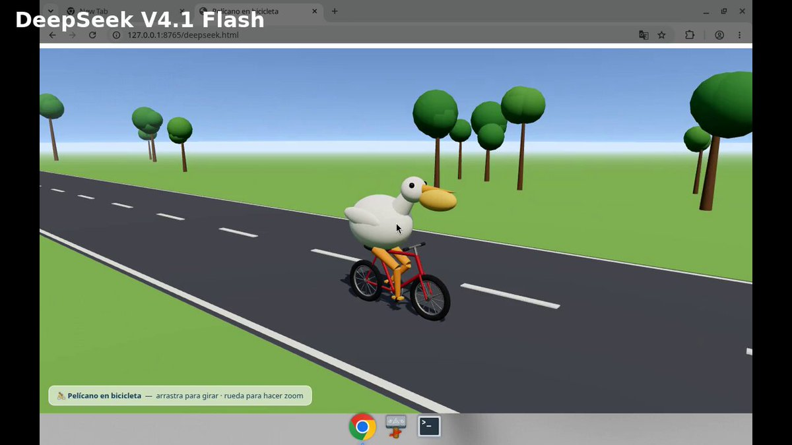

**提示詞**

```text
使用 three.js 在一個獨立的 HTML 檔案中實作一隻騎自行車的鵜鶘
```

[↑ 返回分類目錄](#catalog)

---

<a name="prompt-2102166553701597551"></a>

### 生成一個帶有地形、海洋、大氣層和季節性冰蓋的互動式 GLSL 片段著色器行星的提示詞。

作者：[@WescheNex1q](https://x.com/WescheNex1q) · [查看 X 原帖](https://x.com/WescheNex1q/status/2102166553701597551)

3D 渲染 · 風景 / 大自然 · 已推流

**概括:** 生成一個帶有地形、海洋、大氣層和季節性冰蓋的互動式 GLSL 片段著色器行星的提示詞。

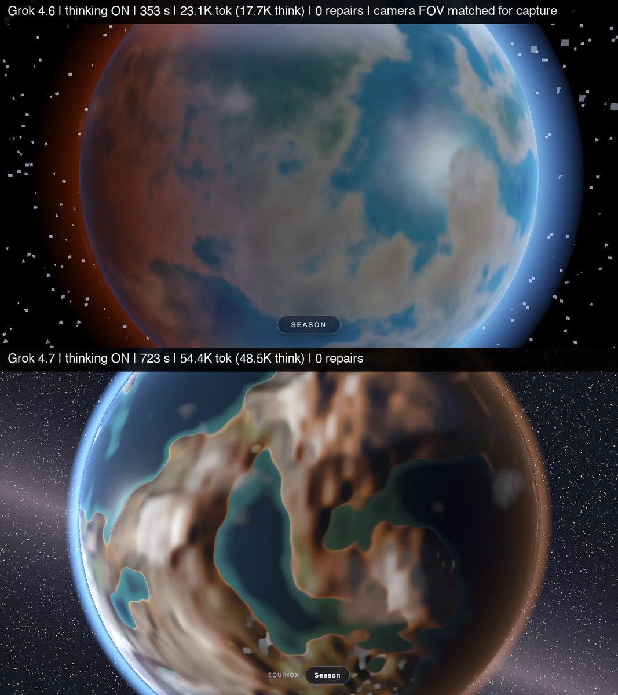

**提示詞**

```text
從軌道俯瞰的行星，地形，海洋，飄移的雲層，帶有城市燈光的晨昏線，行星邊緣的大氣層，緩慢自轉，拖動以傾斜，一個可改變極地冰蓋的 "Season" 按鈕。
```

[↑ 返回分類目錄](#catalog)

---

<a name="prompt-2102155360505053659"></a>

### 使用 Three.js 在單檔案 HTML 中生成鵜鶘騎自行車的 3D 場景。

作者：[@\_kaichen](https://x.com/_kaichen) · [查看 X 原帖](https://x.com/_kaichen/status/2102155360505053659)

3D 渲染 · 已推流

**概括:** 使用 Three.js 在單檔案 HTML 中生成鵜鶘騎自行車的 3D 場景。

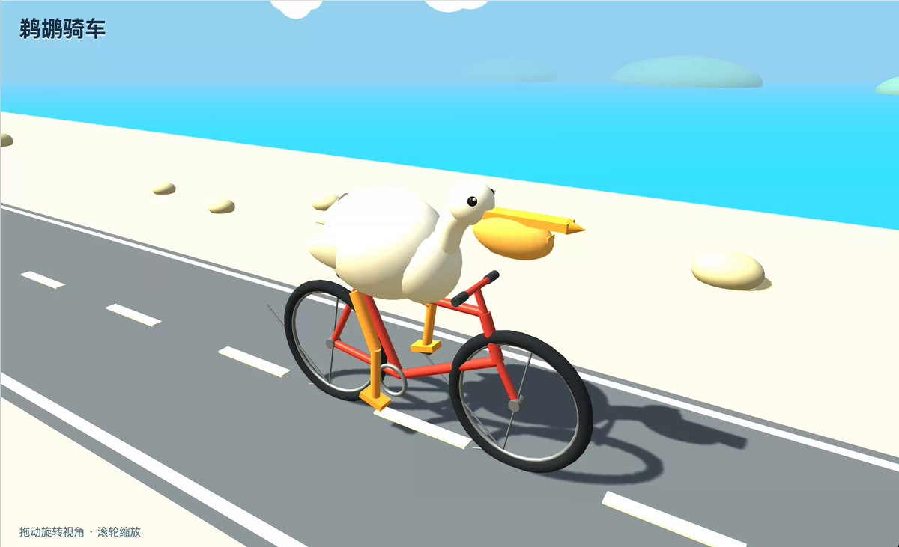

**提示詞**

```text
使用three.js以一份獨立html實現鵜鶘騎車
```

[↑ 返回分類目錄](#catalog)

---

<a name="prompt-2101690690216337746"></a>

### 3D充氣貼紙風格的中東女孩頭像設計，包含糖果色調與模切白邊。

作者：[@81soud81](https://x.com/81soud81) · [查看 X 原帖](https://x.com/81soud81/status/2101690690216337746)

個人檔案 / 頭像 · 3D 渲染 · 角色 · 已推流

**概括:** 3D充氣貼紙風格的中東女孩頭像設計，包含糖果色調與模切白邊。


**提示詞**

```text
一張優質的膨脹感3D立體貼紙，呈現一位快樂的中東女孩，具有高度細緻且對稱的面部特徵、胖嘟嘟具光澤的臉頰和大大的甜美微笑。設計呈現帶有逼真高光和陰影的軟塑料充氣質感。充滿活力的糖果配色方案（泡泡糖粉色、明亮檸檬黃和柔和青藍色）。粗厚的白色模切邊框，商業圖標素材，孤立在純白背景上。
```

[↑ 返回分類目錄](#catalog)

---

<a name="prompt-2101548945269002366"></a>

### three.js 中呈現的紅色 F1 賽車博物館爆炸圖解展板

作者：[@StatsWire](https://x.com/StatsWire) · [查看 X 原帖](https://x.com/StatsWire/status/2101548945269002366)

3D 渲染 · 車輛 · 已推流

**概括:** three.js 中呈現的紅色 F1 賽車博物館爆炸圖解展板


**提示詞**

```text
three.js 中呈現的紅色 F1 賽車博物館爆炸圖解展板
```

[↑ 返回分類目錄](#catalog)

---

<a name="prompt-2101433530777755699"></a>

### 在單個 HTML 檔案中生成帶有動畫的精細 3D 體素艾菲爾鐵塔夜景的提示詞。

作者：[@PeasantSmith](https://x.com/PeasantSmith) · [查看 X 原帖](https://x.com/PeasantSmith/status/2101433530777755699)

3D 渲染 · 已推流

**概括:** 在單個 HTML 檔案中生成帶有動畫的精細 3D 體素艾菲爾鐵塔夜景的提示詞。


**提示詞**

```text
設計並創建一個極具創意、精緻且細節豐富的艾菲爾鐵塔體素藝術場景，背景設定在夜晚的美麗花園中，周圍環繞著城市，包含一些燈光和動畫。使場景令人印象深刻且豐富多樣，並使用色彩繽紛的體素。可以使用任何函式庫來完成此任務，但請確保我可以將其全部貼到一個單獨的 HTML 檔案中。
```

[↑ 返回分類目錄](#catalog)

---

<a name="prompt-2100767176168722867"></a>

### 長滿青苔的石頭提基神像產品特寫。

作者：[@nightandwknd](https://x.com/nightandwknd) · [查看 X 原帖](https://x.com/nightandwknd/status/2100767176168722867)

3D 渲染 · 產品 · 已推流

**概括:** 長滿青苔的石頭提基神像產品特寫。


**提示詞**

```text
一尊長滿青苔的石頭提基神像，中性灰色背景，完整主體置中，產品拍攝
```

[↑ 返回分類目錄](#catalog)

---

<a name="prompt-2100361373863825594"></a>

### 3個人圍坐在一起歡笑。

作者：[@andrew\_n\_carr](https://x.com/andrew_n_carr) · [查看 X 原帖](https://x.com/andrew_n_carr/status/2100361373863825594)

3D 渲染 · 已推流

**概括:** 3個人圍坐在一起歡笑。


**提示詞**

```text
3個人圍坐在一起歡笑。
```

[↑ 返回分類目錄](#catalog)

---

<a name="prompt-2097725977443131648"></a>

### 將照片轉換為裝在高級商品包裝盒內的收藏版行動公仔，包含人物特徵及相關迷你配件的 3D 渲染與商品攝影風格提示詞。

作者：[@SylviaTiongX](https://x.com/SylviaTiongX) · [查看 X 原帖](https://x.com/SylviaTiongX/status/2097725977443131648)

攝影 · 3D 渲染 · 角色 · 產品 · 已推流

**概括:** 將照片轉換為裝在高級商品包裝盒內的收藏版行動公仔，包含人物特徵及相關迷你配件的 3D 渲染與商品攝影風格提示詞。


**提示詞**

```text
將這張照片轉換成收藏版行動公仔。保留人物可辨識的臉部特徵與髮型。將公仔放入高級零售商品包裝中，並加入與人物興趣相關的迷你配件。採用專業商品攝影風格、真實材質、有趣細節，以及精緻的 3D 渲染效果。
```

[↑ 返回分類目錄](#catalog)

---

<a name="prompt-2097507029858300297"></a>

### 一隻身穿金色背心的小狐狸幼崽與一隻小鹿幼崽佇立於迷霧石徑上的奇想3D CGI奇幻插畫。

作者：[@RockGrokAI](https://x.com/RockGrokAI) · [查看 X 原帖](https://x.com/RockGrokAI/status/2097507029858300297)

插圖 · 3D 渲染 · 角色 · 已推流

**概括:** 一隻身穿金色背心的小狐狸幼崽與一隻小鹿幼崽佇立於迷霧石徑上的奇想3D CGI奇幻插畫。


**提示詞**

```text
充滿奇思妙想的3D CGI奇幻插畫，描繪了一隻可愛的小狐狸幼崽和一隻溫順的小鹿幼崽，一同站在霧氣氤氳的岩石景觀中一條龜裂的石徑上。毛茸茸的狐狸幼崽有著帶有白色點綴的鮮豔橙色皮毛、蓬鬆的尾巴、碩大閃爍的祖母綠眼睛、金色的尖刺狀頭頂毛髮，並穿著一件飾有華麗刺繡的金色背心。牠抬頭仰望著小鹿，小鹿擁有柔軟的淺棕色皮毛與白色斑點、水汪汪且富有表現力的大眼睛，以及甜美的神情。朦朧的薄霧、昏暗的岩石峭壁、粗糙扭曲的樹木和繁茂的紫色薰衣草花環繞著牠們。柔和的體積光、細緻的毛皮質感、濃郁的大地色調與生動的紫色相互交織，呈現出電影般的景深與迷人暖心的氛圍。
```

[↑ 返回分類目錄](#catalog)

---

<a name="prompt-2097514564875104516"></a>

### 為我設計一個可容納 6 台 Nvidia Spark 的伺服器機架，設計需兼具高效率與美觀。

作者：[@VKs\_Host](https://x.com/VKs_Host) · [查看 X 原帖](https://x.com/VKs_Host/status/2097514564875104516)

3D 渲染 · 已推流

**概括:** 為我設計一個可容納 6 台 Nvidia Spark 的伺服器機架，設計需兼具高效率與美觀。


**提示詞**

```text
為我設計一個可容納 6 台 Nvidia Spark 的伺服器機架，設計需兼具高效率與美觀。
```

[↑ 返回分類目錄](#catalog)

---

<a name="category-chibi-q-style"></a>

## Q 版風格

<a name="prompt-2100221806162673891"></a>

### 翻譯中

作者：[@AI\_gansakushi](https://x.com/AI_gansakushi) · [查看 X 原帖](https://x.com/AI_gansakushi/status/2100221806162673891)

Q 版風格 · 水彩 · 角色 · 已推流

**概括:** 翻譯中


**提示詞**

```text
翻譯中
```

[↑ 返回分類目錄](#catalog)

---

<a name="category-isometric"></a>

## 等距視角

<a name="prompt-2098773122107523294"></a>

### 翻譯中

作者：[@Hamburgerai](https://x.com/Hamburgerai) · [查看 X 原帖](https://x.com/Hamburgerai/status/2098773122107523294)

海報／傳單 · 等距視角 · 已推流

**概括:** 翻譯中


**提示詞**

```text
翻譯中
```

[↑ 返回分類目錄](#catalog)

---

<a name="category-oil-painting"></a>

## 油畫

<a name="prompt-2102150362945687807"></a>

### 鍍金畫框中的文藝復興貴族、金色馬車與白馬巴洛克風格油畫。

作者：[@arco0369](https://x.com/arco0369) · [查看 X 原帖](https://x.com/arco0369/status/2102150362945687807)

油畫 · 已推流

**概括:** 鍍金畫框中的文藝復興貴族、金色馬車與白馬巴洛克風格油畫。

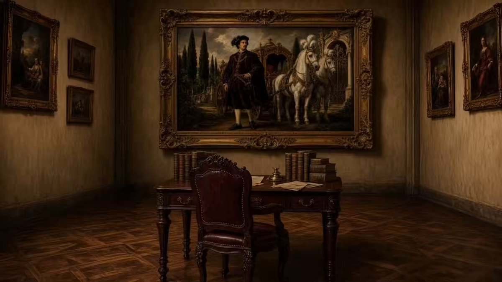

**提示詞**

```text
一幅技藝精湛的古董油畫，呈現卡拉瓦喬及17世紀義大利大師戲劇性的巴洛克風格，具有濃郁的明暗對照法（chiaroscuro）光影效果、深沉的陰影與溫暖的金色高光。一位高貴的文藝復興時期紳士以莊重的姿態站立，身穿奢華的深酒紅（勃艮第紅）天鵝絨緊身短上衣與飄逸的披風、深色及膝馬褲、淺奶油色長襪、黑色皮鞋，頭戴插有羽毛的黑色貝雷風格帽子。他站立在一輛華麗奢華、通體鍍金的金色馬車前，馬車由兩匹壯麗的白馬牽引，馬匹飾有精美華麗的金色馬具、羽飾與翎羽。場景發生在一個晴朗的日子，天空中伴有略顯戲劇化的翻滾雲彩。背景中是一座優雅的義大利宮殿花園，內有高聳的絲柏樹以及華麗的金色鍛鐵大門與門廊。整幅藝術作品呈現為一幅裝裱於當代雕工精緻、華麗的金色巴洛克畫框中的古老油畫。天鵝絨、金箔、馬具、石雕建築與老化畫布的細節質地極為逼真。長寬比 3:2。
```

[↑ 返回分類目錄](#catalog)

---

<a name="prompt-2101423231081107581"></a>

### 融入了RGB色彩分離與像素破碎等數位故障效果的巴洛克油畫範本。

作者：[@L4STD4ZE](https://x.com/L4STD4ZE) · [查看 X 原帖](https://x.com/L4STD4ZE/status/2101423231081107581)

油畫 · 已推流

**概括:** 融入了RGB色彩分離與像素破碎等數位故障效果的巴洛克油畫範本。


**提示詞**

```text
[SUBJECT]的巴洛克油畫，局部華麗金色畫框，戲劇性的古典大師光影，被數位故障切開：RGB色彩分離、掃描線、像素破碎
```

[↑ 返回分類目錄](#catalog)

---

<a name="prompt-2100200995137724765"></a>

### 翻譯中

作者：[@Hamburgerai](https://x.com/Hamburgerai) · [查看 X 原帖](https://x.com/Hamburgerai/status/2100200995137724765)

油畫 · 人像 / 自拍 · 已推流

**概括:** 翻譯中


**提示詞**

```text
翻譯中
```

[↑ 返回分類目錄](#catalog)

---

<a name="prompt-2099147187955675169"></a>

### 基於建築旅行照片製作上下對比圖，上方保留原片，下方生成帶厚塗油彩底座的3D微縮模型。

作者：[@Hamburgerai](https://x.com/Hamburgerai) · [查看 X 原帖](https://x.com/Hamburgerai/status/2099147187955675169)

3D 渲染 · 油畫 · 建築 / 室內設計 · 已推流

**概括:** 基於建築旅行照片製作上下對比圖，上方保留原片，下方生成帶厚塗油彩底座的3D微縮模型。


**提示詞**

```text
將輸入的世界建築旅行照片製作成一張直式上下對比藝術圖。上半部分完整保留原始真實照片，保持建築身分、主體結構、拍攝視角、構圖比例、光線與環境特徵，不進行插畫化處理；中間以一條乾淨的白色水平線自然分隔。下半部分將照片中的同一建築重建為精緻、真實、有明確體積的微縮 3D 建築模型，準確保留其標誌性輪廓、樓層關係、屋頂或穹頂、立柱、門窗、拱券、基座及材質特徵，呈現清晰的厚度、凹凸結構、接觸陰影與微距模型攝影景深。模型比例相對小巧，居中陳列於大面積米白色紙張留白中。僅在模型底座、地面、植被、水面、雲朵與環境陰影處加入具有堆疊紋理的厚塗油彩，使厚塗成為承托立體模型的環境材料，不得覆蓋或取代建築主體。整體呈現安靜、克制、高級的當代藝廊陳列感。不要將建築做成平面油畫、普通插畫或卡通；不要添加人物、動物、車輛、文字、標題、字幕、原圖或AI圖角標、logo、浮水印及裝飾邊框。
```

[↑ 返回分類目錄](#catalog)

---

<a name="prompt-2098792248892625275"></a>

### 翻譯中

作者：[@Hamburgerai](https://x.com/Hamburgerai) · [查看 X 原帖](https://x.com/Hamburgerai/status/2098792248892625275)

海報／傳單 · 油畫 · 摘要 / 背景 · 已推流

**概括:** 翻譯中


**提示詞**

```text
翻譯中
```

[↑ 返回分類目錄](#catalog)

---

<a name="category-watercolor"></a>

## 水彩

<a name="prompt-2102216813459439933"></a>

### 一幅空靈的水彩女性側顏肖像，鼻樑上停著一隻色彩繽紛的蝴蝶。

作者：[@afrinxai](https://x.com/afrinxai) · [查看 X 原帖](https://x.com/afrinxai/status/2102216813459439933)

水彩 · 人像 / 自拍 · 角色 · 已推流

查看 X 原帖：[@afrinxai](https://x.com/afrinxai) · [查看 X 原帖](https://x.com/afrinxai/status/2102035368354738376)

**概括:** 一幅空靈的水彩女性側顏肖像，鼻樑上停著一隻色彩繽紛的蝴蝶。

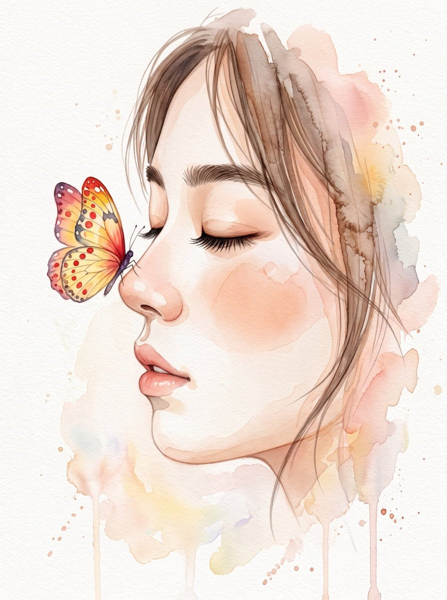

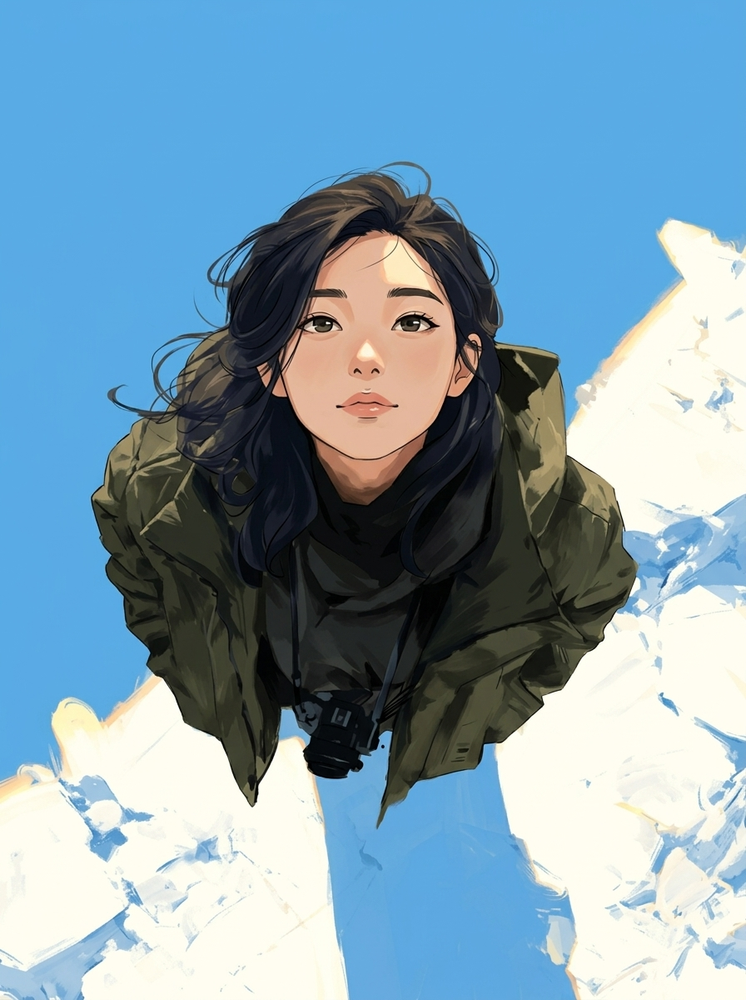

**提示詞**

```text
一幅空靈、精緻的水彩年輕女子極致側顏肖像，雙眼緊閉，神情平靜，雙唇微張。一隻帶有斑點的鮮豔橙、黃、紅色蝴蝶輕柔地停留在她的鼻樑上。她擁有纖長濃黑的睫毛、輪廓分明的自然眉毛、柔和的蜜桃色腮紅雙頰，細碎的棕色髮絲輕輕勾勒著她的臉龐。半透明的水彩渲染，柔和的濕畫法色彩融合，在冷壓紋理紙邊緣帶有細緻的顏料滴落與飛濺，溫暖的粉彩色調，夢幻且詩意的審美風格。
使用上傳的照片作為成年女性的面部特徵參考。保留其辨識度高的面部特徵、自然膚色、面部比例以及整體外貌。
```

[↑ 返回分類目錄](#catalog)

---

<a name="prompt-2102160154909438370"></a>

### 寫實攝影與水彩插畫結合的果園摘蘋果年輕女子圖像。

作者：[@Minahil42298354](https://x.com/Minahil42298354) · [查看 X 原帖](https://x.com/Minahil42298354/status/2102160154909438370)

攝影 · 插圖 · 水彩 · 角色 · 已推流

**概括:** 寫實攝影與水彩插畫結合的果園摘蘋果年輕女子圖像。


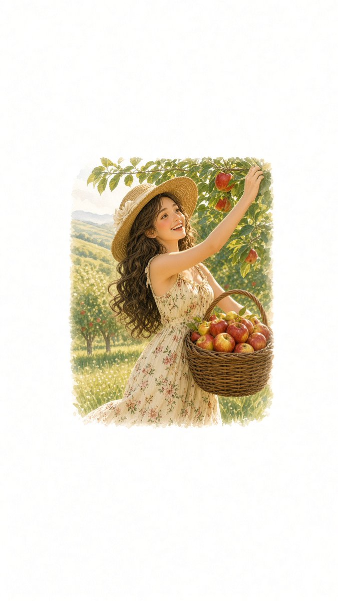

**提示詞**

```text
一張迷人的合成影像，上半部為寫實照片，下半部為對應的水彩插畫，兩者皆置於富有質感的暖白色紙張背景上。上半部呈現一張超寫實的照片：一位洋溢著喜悅的年輕女子，有著長長的棕色波浪捲髮與泛紅的雙頰，頭戴一頂飾有花朵的草帽，身穿碎花長洋裝。她抬頭微笑著看著一棵蘋果樹，伸手摘下一顆紅蘋果，手臂上挽著一個裝滿蘋果的大柳條籃。背景是陽光斑駁、明亮的蘋果園。下半部直接位於照片下方，是一幅精緻、富藝術感的水彩插畫，以如繪畫般的柔焦風格捕捉了完全相同的對象與姿勢，彷彿直接畫在紙上。插畫保留了女子的神情、洋裝、草帽以及整個果園場景，但帶有清晰可見的筆觸與色彩暈染。兩個部分皆居中，照片邊緣與插畫邊界之間有獨特的藝術性過渡，帶有柔和、羽化般的顏料筆觸自然融入紙張中。整體構圖宛如藝術手帳頁面或精緻的藝術版畫。
```

[↑ 返回分類目錄](#catalog)

---

<a name="prompt-2100247084410834969"></a>

### 翻譯中

作者：[@Hamburgerai](https://x.com/Hamburgerai) · [查看 X 原帖](https://x.com/Hamburgerai/status/2100247084410834969)

海報／傳單 · 攝影 · 水彩 · 城市景觀 / 街道 · 已推流

**概括:** 翻譯中


**提示詞**

```text
翻譯中
```

[↑ 返回分類目錄](#catalog)

---

<a name="prompt-2098743938299666847"></a>

### 翻譯中

作者：[@BeanieBlossom](https://x.com/BeanieBlossom) · [查看 X 原帖](https://x.com/BeanieBlossom/status/2098743938299666847)

插圖 · 3D 渲染 · 水彩 · 角色 · 已推流

**概括:** 翻譯中


**提示詞**

```text
翻譯中
```

[↑ 返回分類目錄](#catalog)

---

<a name="category-retro-vintage"></a>

## 復古 / 懷舊

<a name="prompt-2102305033941631318"></a>

### 翻譯中

作者：[@DDJCXX](https://x.com/DDJCXX) · [查看 X 原帖](https://x.com/DDJCXX/status/2102305033941631318)

攝影 · 復古 / 懷舊 · 人像 / 自拍 · 角色 · 時尚單品 · 建築 / 室內設計 · 已推流

**概括:** 翻譯中

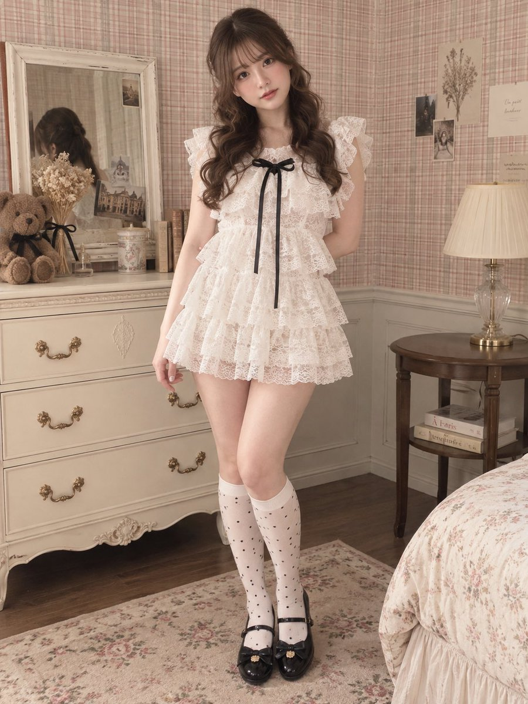

**提示詞**

```text
翻譯中
```

[↑ 返回分類目錄](#catalog)

---

<a name="prompt-2102173528900428060"></a>

### 翻譯中

作者：[@Tanvir48992](https://x.com/Tanvir48992) · [查看 X 原帖](https://x.com/Tanvir48992/status/2102173528900428060)

插圖 · 復古 / 懷舊 · 極簡主義 · 角色 · 時尚單品 · 摘要 / 背景 · 已推流

**概括:** 翻譯中

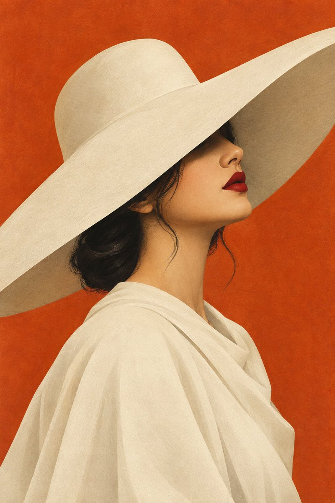

**提示詞**

```text
翻譯中
```

[↑ 返回分類目錄](#catalog)

---

<a name="prompt-2102080194492153890"></a>

### 放大郵票，並讓飛機飛起來

作者：[@SynapsXR](https://x.com/SynapsXR) · [查看 X 原帖](https://x.com/SynapsXR/status/2102080194492153890)

3D 渲染 · 復古 / 懷舊 · 車輛 · 已推流

**概括:** 放大郵票，並讓飛機飛起來

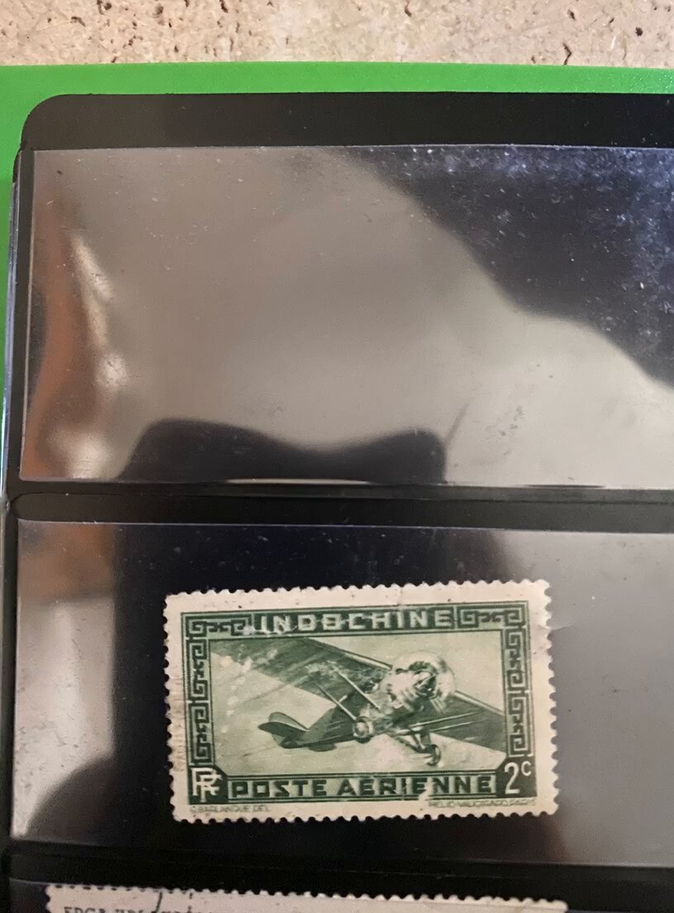

**提示詞**

```text
放大郵票，並讓飛機飛起來
```

[↑ 返回分類目錄](#catalog)

---

<a name="prompt-2101980767345856601"></a>

### 翻譯中

作者：[@DDJCXX](https://x.com/DDJCXX) · [查看 X 原帖](https://x.com/DDJCXX/status/2101980767345856601)

攝影 · 復古 / 懷舊 · 人像 / 自拍 · 角色 · 時尚單品 · 已推流

**概括:** 翻譯中

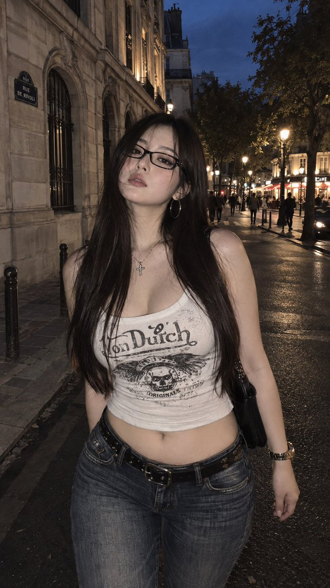

**提示詞**

```text
翻譯中
```

[↑ 返回分類目錄](#catalog)

---

<a name="prompt-2101992096857002180"></a>

### 將建築照片製作成上下分割的半調復古拼貼海報，上方保留真實攝影，下方用撕紙網格、ASCII字元和復古印刷進行重構。

作者：[@Weilnes](https://x.com/Weilnes) · [查看 X 原帖](https://x.com/Weilnes/status/2101992096857002180)

海報／傳單 · 攝影 · 復古 / 懷舊 · 建築 / 室內設計 · 已推流

**概括:** 將建築照片製作成上下分割的半調復古拼貼海報，上方保留真實攝影，下方用撕紙網格、ASCII字元和復古印刷進行重構。

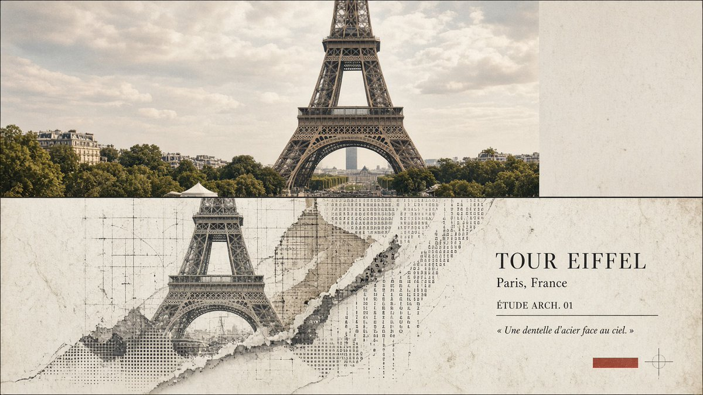

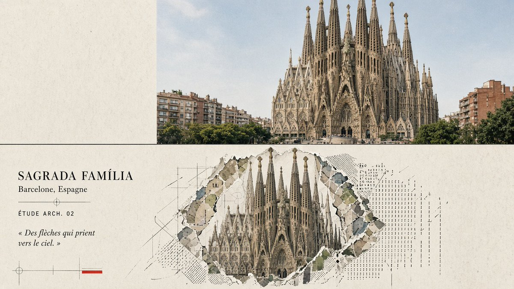

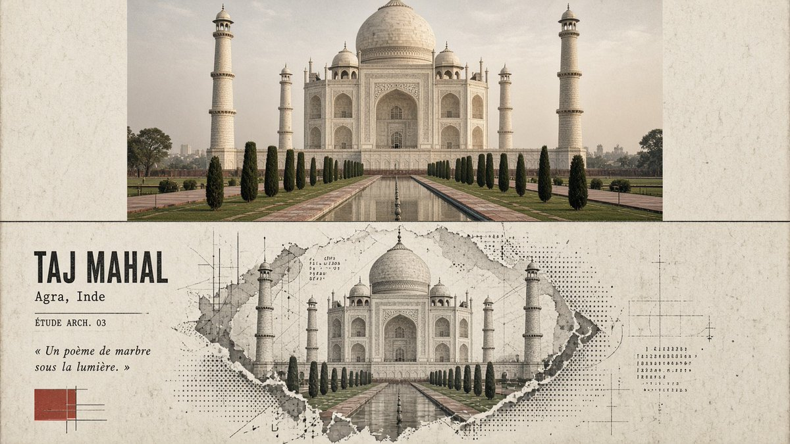

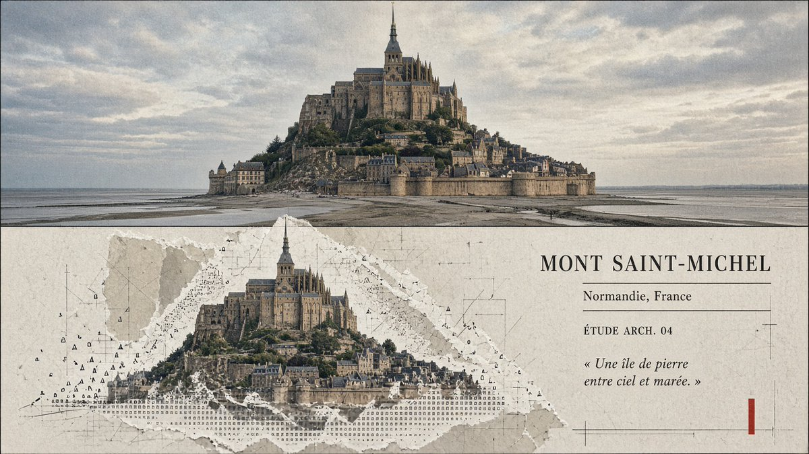

**提示詞**

```text
將這張建築照片轉化為一張高端半色調建築旅行拼貼海報。每張上傳的照片輸出單一張海報——切勿將多座建築或照片合併至同一個畫面中。版式：3:4 縱向畫布。大致平分為兩個區域——上方為真實建築照片，下方為印刷重構畫面——以一條乾淨俐落的水平線分隔。請勿拉伸、扭曲、傾斜或不自然地重新擺放建築物。上半部分——實景拍攝：忠實保留原始建築：相同的建築形態、比例、透視、標誌性細節、周遭元素、自然光影與原始色彩氛圍。僅加入細緻的高級調色及極微弱的底片顆粒。下半部分——印刷重構：使用撕裂的照片碎片 + 等寬 ASCII 字元區 + 影印半色調網點 + 建築線條，將同一建築重建為實驗性的印刷建築拼貼。該建築必須維持一眼即可辨識。質感：粗糙的白紙纖維邊緣、微妙的影印瑕疵、輕微的印刷對位偏差、褪色墨水、舊紙污漬、少量克制的裁切標記以及一條小巧的紅色校準色條。色彩：暖灰色舊紙背景 + 黑色墨水 + 建築原有的柔和色彩 + 單一克制的紅色點綴。保留 22–38% 的紙張明顯留白。排版——所有可見文字僅使用法文：[NOM DU MONUMENT] / [VILLE, PAYS] / ÉTUDE ARCH. 0N / 簡短的法文觀察性說明。氛圍：早期數位系統 × 類比影印 × 建築檔案 × 地下獨立雜誌 × 現代旅行專題報導。避免：純黑終端機背景、賽博龐克霓虹、過量的 ASCII、扭曲變形的建築、英文文字、標誌、浮水印。主題：艾菲爾鐵塔 (Tour Eiffel，巴黎)、聖家堂 (Sagrada Família，巴塞隆納)、泰姬瑪哈陵 (Taj Mahal，阿格拉)、聖米歇爾山 (Mont Saint-Michel，諾曼第)。
```

[↑ 返回分類目錄](#catalog)

---

<a name="prompt-2101823731350065296"></a>

### 復古萬聖節版畫風插畫：白床單幽靈手提雕刻南瓜燈穿過夜間詭異森林。

作者：[@heathergreen](https://x.com/heathergreen) · [查看 X 原帖](https://x.com/heathergreen/status/2101823731350065296)

插圖 · 復古 / 懷舊 · 風景 / 大自然 · 已推流

**概括:** 復古萬聖節版畫風插畫：白床單幽靈手提雕刻南瓜燈穿過夜間詭異森林。


**提示詞**

```text
復古風格插畫描繪了一個幽靈在夜晚穿過陰森森林時提著一盞傑克南瓜燈。幽靈由一塊帶有兩個黑色眼孔的簡單白床單構成，佇立在中央，手裡拿著一個露出猙獰笑容的雕刻南瓜。背景是黑暗多瘤的樹木、一彎新月，以及藍色點畫星空中點綴的繁星與橙色圓點。一條蜿蜒的小徑穿過前景，兩側襯著深綠色的枝葉。整體美學讓人聯想到舊式萬聖節裝飾或漫畫藝術，採用有限的調色盤和富有質感的麻膠版畫外觀。
```

[↑ 返回分類目錄](#catalog)

---

<a name="prompt-2101127042800791571"></a>

### 翻譯中

作者：[@DDJCXX](https://x.com/DDJCXX) · [查看 X 原帖](https://x.com/DDJCXX/status/2101127042800791571)

攝影 · 復古 / 懷舊 · 時尚單品 · 已推流

**概括:** 翻譯中


**提示詞**

```text
翻譯中
```

[↑ 返回分類目錄](#catalog)

---

<a name="prompt-2101033660468314265"></a>

### 飯店臥室內的韓國女性復古CCD直閃人像寫真提示詞。

作者：[@FuguiChen1314](https://x.com/FuguiChen1314) · [查看 X 原帖](https://x.com/FuguiChen1314/status/2101033660468314265)

攝影 · 復古 / 懷舊 · 人像 / 自拍 · 角色 · 建築 / 室內設計 · 已推流

**概括:** 飯店臥室內的韓國女性復古CCD直閃人像寫真提示詞。


**提示詞**

```text
9:16 縱向構圖，超寫實真人攝影，韓國 Instagram 辣妹 / 韓國壞女孩私人肖像，設定在夜晚精品飯店臥室。iPhone 快照 + 復古 CCD 直閃美學，就像從私人相機膠卷中直接取出的隨意照片。

一位明顯的成年韓國女性，年齡 23–27 歲，擁有精緻的小 oval 臉型和自然冷調白皙皮膚，保留真實的細膩皮膚紋理、可見毛孔以及皮膚色調的細微變化。長黑髮散開略顯凌亂，細碎髮絲自然垂落在臉龐兩側。細長的貓眼型眼睛，外眼角微微上挑，冷粉裸妝，淡淡腮紅，以及光澤裸粉色唇部。她的整體氣質慵懶、冷漠、略帶叛逆，帶有韓國壞女孩的鋒芒。

她總是戴著細框 oval 黑框眼鏡，略微滑落到鼻樑上。她抬起眼睛，從鏡片上緣越過直視鏡頭，目光冷峻、困倦、不經意，嘴唇自然放鬆微張。

她穿著合身的黑色細肩帶背心，搭配深炭黑色低腰牛仔短褲，配以精緻的銀色項鍊。服裝簡約貼身，露出纖細的脖頸和肩膀，自然凸顯的鎖骨、可見的腰線，以及修長勻稱的雙腿。她的身材比例成熟、健康、自然且真實。

她坐在凌亂的白色飯店床沿上，雙腿自然分開並向前景延伸。上身明顯向前傾向鏡頭，肩膀微微內收，雙臂自然下垂，兩手位於膝蓋間附近的空間。她的頭部微微傾斜，向上看向鏡頭，營造出親密的抓拍攝視角，彷彿攝影師就站在她正前方，從略微抬高的角度隨意拍攝。

近距離高角度拍攝，35mm 等效視角。她的膝蓋和雙腿佔據前景，而臉部保持為畫面的視覺中心。使用自然透視失真，近處元素顯得更大，遠處元素更小，以創造真實的深度。避免精緻的攝影棚姿勢；保留輕微的不對稱、放鬆的姿態，以及可信的身體重量和張力。

背景是一個略顯凌亂的白色飯店床，自然散落著白色枕頭和皺巴巴的床單，深灰色牆壁，以及深色木質床頭板。房間光線昏暗，沒有其他人存在。

復古 CCD 便攜相機直閃。強烈的正面相機閃光照亮她的臉部、肩膀和雙腿，在她冷調白皙的皮膚上產生真實的閃光反射，略微過曝的高光，而背景明顯欠曝。冷灰色、低飽和度色調，細微數位噪點、細膩顆粒、柔焦、輕微失焦，以及淡淡的手持抖動模糊，保留廉價復古數位相機的瑕疵質感。

韓國 Instagram 辣妹，Y2K 數位相機，私人臥室寫真集，抓拍快照，親密相機膠卷美學，冷淡低飽和色調，直閃，真實皮膚紋理，凌亂黑髮，oval 細框眼鏡，高角度近拍，床上前傾，寫實風格，不完美的手持構圖，細微底片顆粒，地道早 2000 年代數位相機感覺。

無文字，無浮水印，無 UI 元素，無多餘人，無重複肢體，無多餘手指，無畸形手部，無扭曲解剖結構，無誇張身材比例，無塑膠皮膚，無動漫，無插圖。
```

[↑ 返回分類目錄](#catalog)

---

<a name="prompt-2100332541437960533"></a>

### 昭和復古咖啡館裡遞出布丁的日本女性肖像提示詞。

作者：[@muse\_ai\_prompt](https://x.com/muse_ai_prompt) · [查看 X 原帖](https://x.com/muse_ai_prompt/status/2100332541437960533)

復古 / 懷舊 · 人像 / 自拍 · 角色 · 已推流

**概括:** 昭和復古咖啡館裡遞出布丁的日本女性肖像提示詞。


**提示詞**

```text
🌟午後的純咖啡館｜遞上布丁的奶油黃微笑🌟

【主題·畫風】
描繪一位明確成年的25歲日本女性，在午後復古的傳統咖啡館裡，向坐在對面的戀人遞上一口布丁。寫實且富有生活感的時尚攝影風格，非過度雕琢的商業廣告照，而是著重於彷彿偶然捕捉到約會中自然一瞬的親密感。
在柔和可愛之中兼具成熟女性的沉穩與優雅，將女性的神情、穿搭、舉止與咖啡館溫馨的氛圍自然融合為一幅動人場景。

【地點·背景·世界觀】
舞台是一間留有昭和風情、沉靜寧謐的老式傳統純咖啡館。坐在靠窗的小型雙人雅座上，周圍可見泛著光澤的琥珀色木牆、深綠色天鵝絨軟墊椅、帶有歲月痕跡的木桌，以及黃銅與玻璃製成的典雅裝飾。
桌上擺放著盛裝經典焦糖布丁的小盤與透明玻璃杯。前景的玻璃杯略作景深虛化，背景柔和保留其他座位與層架，構圖既展現出店內的深邃層次，又流露靜謐悠閒的午後情調。

【季節·時間·天氣】
季節為春末至初夏的溫和時節。下午3點前後，室外光線雖保持著明亮，但已開始變得柔和。戶外為晴天至微陰，非強烈的直射豔陽，而是透過窗櫺灑入的溫柔自然光。
室內外光與暖色系燈飾共存，營造出在微涼舒適的店內品嚐甜點與咖啡、沉靜悠緩的午後氛圍。

【人物設定】
25歲明確成年的日本女性。容貌柔和端正，略大的深黑瞳孔、自然眉型、纖細秀挺的鼻樑、紅潤柔嫩的雙唇。膚色為明亮的淺暖色調，保留毛孔、細微光影與自然血色的真實質感。
深棕色頭髮，長及肩部至胸部上方，帶有自然的微卷波浪。臉部周圍留有細碎髮絲。身形擁有纖細的雙肩與四肢、曼妙腰線，同時兼備女性柔美曲線與自然優雅的豐滿體態。胸部飽滿豐盈，但呈現出自然順應服裝、姿勢與重力的柔和立體感，維持全身的協調比例。

【服裝·飾品】
上衣為一件色調柔和溫暖的奶油黃細肩帶背心。領口與肩帶處綴有精緻的荷葉邊蕾絲，衣身選用不透膚的優質羅紋或柔軟薄款面料。甜美可愛之餘絕不顯稚氣，展現適合輕熟女性的高雅設計。
自然的版型與剪裁貼合豐滿胸線，布料不會過度緊繃拉扯或勒肉，呈現自然流暢的包覆感。下身搭配摩卡棕色的中長裙。飾品僅以小巧精緻的耳環與纖細項鍊點綴，呈現咖啡館日常約會的優雅穿搭。

【姿勢·動作·視線】
女性自然坐在深綠色椅子上，身體正面大致迎向對座。腰部穩穩倚靠椅背，雙腿在桌下自然併攏或微偏斜放，無不自然的扭體姿態。
右手握著舀起一口布丁的小湯匙，手肘維持在低處，正向對座的戀人遞出、示意「吃一口吧」的半途瞬間。左手自然輕放在桌緣或布丁盤旁。臉部微傾，身體朝向正面，僅將雙眸視線投向鏡頭。

【表情·情感】
僅向戀人展現的、卸下心防的親密與毫無防備的表情。嘴角揚起含蓄微笑，眉毛輕柔微挑，眼神中蘊含著期待對方反應的嬌嗔與俏皮巧思。
並非刻意咧嘴的大笑，而是眼底、面頰與嘴角自然放鬆的恬淡微笑。微微側傾的角度與溫和的眼神，傳遞出宛如正溫柔問著「想吃嗎？」般的近距離親近感。

【構圖·相機】
適合X社群平台的4:5縱向構圖。以坐在對面戀人的視角出發，在平視高度取景。頭頂上方留有些許空間，人物自然納入從頭頂至桌下腰部附近的景框。構圖將臉孔、遞出的湯匙、領口的荷葉邊與布丁安排在視線自然流動的視覺焦點上。
預設為50〜70mm左右的標準至中望遠自然焦段，避免造成面部、手部或身形的廣角誇張變形。湯匙雖朝畫面近處延伸但不會顯得過於巨大，背景適度虛化，同時保留能辨識為復古咖啡館的家具、窗戶與燈光質感。

【光線·色彩·質感·氛圍】
主光源為來自畫面左側或斜左前方窗戶灑入的柔和自然光。溫柔照映著半邊臉頰、肩膀、奶油黃衣物布料與布丁表面，另一側則由店內暖光燈飾形成微弱的漫反射補光。陰影細膩不生硬，使雙頰、頸部與衣物皺褶呈現自然的立體深淺。
天花板與壁面的琥珀色吊燈，替木質牆面、桌面與焦糖醬暈染出溫暖光澤。細膩呈現肌膚自然氣色與細膩光影、髮絲的流向與柔和光澤、蕾絲精巧的立體紋理，以及木材經年累月使用後的溫潤質感。整體色調以奶油黃、摩卡棕、深綠與琥珀色為核心，瀰漫溫馨懷舊的復古色感。

【品質·排除要素】
高解析度的照片級寫實攝影。著重於如同真實相機捕捉的自然人體、手指結構、透視感、布料張力與光影變化。
避免未成年感外觀、過度幼態的面貌、不自然的肢體構造、多餘的手足或手指、缺指或併指、不自然的關節彎曲、左右手混淆、服裝與肉體異常融合、布料破損或不自然的勒肉痕跡、未預期的裸露走光、極端的廣角畸變、過度磨皮美顏。胸部維持自然豐滿的份量，不做僵硬球狀、異常推擠或違抗重力的造形。畫面中嚴禁出現文字、標誌、浮水印或UI介面標籤。
```

[↑ 返回分類目錄](#catalog)

---

<a name="prompt-2100251372339761202"></a>

### 翻譯中

作者：[@DerKlarblick](https://x.com/DerKlarblick) · [查看 X 原帖](https://x.com/DerKlarblick/status/2100251372339761202)

攝影 · 復古 / 懷舊 · 人像 / 自拍 · 已推流

**概括:** 翻譯中


**提示詞**

```text
翻譯中
```

[↑ 返回分類目錄](#catalog)

---

<a name="prompt-2100239972020486509"></a>

### 翻譯中

作者：[@Avalanc83148107](https://x.com/Avalanc83148107) · [查看 X 原帖](https://x.com/Avalanc83148107/status/2100239972020486509)

復古 / 懷舊 · 已推流

**概括:** 翻譯中


**提示詞**

```text
翻譯中
```

[↑ 返回分類目錄](#catalog)

---

<a name="prompt-2100100687946203533"></a>

### 將旅行照片轉為上半部原圖、下半部手撕留白配合絲網插畫與復古郵戳的明信片設計。

作者：[@TodayKan](https://x.com/TodayKan) · [查看 X 原帖](https://x.com/TodayKan/status/2100100687946203533)

插圖 · 復古 / 懷舊 · 文字 / 字體排版 · 已推流

**概括:** 將旅行照片轉為上半部原圖、下半部手撕留白配合絲網插畫與復古郵戳的明信片設計。


**提示詞**

```text
將參考照片製作成一張直版 3:4 藝術明信片。上半部分完整保留原始照片，突出主體特徵與現場氛圍，約佔畫面高度的 55%。照片底部採用自然、不規則且帶有清晰紙張纖維的手撕邊緣。撕紙邊下方保留象牙白色留白，使原始照片與下方插畫完全分開。留白處使用小號復古打字機字體：識別的主體內容名稱。下半部分繪製一幅小巧的無邊框插畫，根據照片主體繪製，保留辨識度輪廓，適度簡化細節，呈現絲網印刷質感、輕微噪點和低保真印刷效果，配色從照片中提取並限制為 2-4 種克制不飽和色。插畫佔下半部分高度的一半，四周留出大量空白。畫面右側撕紙處加入一個低調、磨損的藍黑色圓形郵戳，剛好印在上下部分交界處。底部使用通用格式標註： 地點 · PLACE 日期 · DATE。整體呈現溫暖的舊紙質感、充足留白與克制高級的雜誌編輯風格。 不要添加郵票、座標、外邊框、立體樣機、厚重投影、捲角、額外印章、重複文字或浮水印。
```

[↑ 返回分類目錄](#catalog)

---

<a name="prompt-2100124265752449144"></a>

### 一張陽光斑駁、抓拍風格的35毫米底片照片，呈現一位在花園中俏皮騎著復古自行車的快樂亞洲女性。

作者：[@afrinxai](https://x.com/afrinxai) · [查看 X 原帖](https://x.com/afrinxai/status/2100124265752449144)

攝影 · 復古 / 懷舊 · 人像 / 自拍 · 角色 · 已推流

**概括:** 一張陽光斑駁、抓拍風格的35毫米底片照片，呈現一位在花園中俏皮騎著復古自行車的快樂亞洲女性。


**提示詞**

```text
一張陽光斑駁、抓拍風格的35毫米底片照片，畫面中是一位留著深色鮑伯短髮、洋溢喜悅的亞洲女性。她在鬱鬱蔥蔥的花園中俏皮地在一輛復古自行車上維持平衡，雙腿向兩側大步踢開。她穿著層次豐富的服裝：一件鮮豔的珊瑚紅長袖襯衫，外搭一件柔和粉色的碎花吊帶連衣裙（圍裙式洋裝）。她穿著白色短襪，搭配經典的黑色皮革牛津鞋。復古自行車的把手上裝有一個編織柳條籃。背景中有一座迷人且略顯斑駁的灰白色木棚，附有多扇玻璃窗格，樹林間隱約可見一座深綠色屋頂的小棚屋。畫面散發著懷舊感、柔和的底片顆粒以及自然的夏日採光。使用上傳的照片作為成年女性的面部身分參考。保留其具有辨識度的面部特徵、自然膚色、面部比例和整體外貌。將長寬比設定為3:4
```

[↑ 返回分類目錄](#catalog)

---

<a name="prompt-2099626543857209360"></a>

### 一輛老爺車停在磚造建築前，建築上有著巨大的「Malört Motors」霓虹燈招牌。

作者：[@CatrionaCgx](https://x.com/CatrionaCgx) · [查看 X 原帖](https://x.com/CatrionaCgx/status/2099626543857209360)

復古 / 懷舊 · 車輛 · 建築 / 室內設計 · 已推流

**概括:** 一輛老爺車停在磚造建築前，建築上有著巨大的「Malört Motors」霓虹燈招牌。


**提示詞**

```text
製作一張 Malört Motors 的圖像
```

[↑ 返回分類目錄](#catalog)

---

<a name="prompt-2099473433067495508"></a>

### 翻譯中

作者：[@DDJCXX](https://x.com/DDJCXX) · [查看 X 原帖](https://x.com/DDJCXX/status/2099473433067495508)

復古 / 懷舊 · 人像 / 自拍 · 角色 · 時尚單品 · 建築 / 室內設計 · 已推流

查看 X 原帖：[@adinascozylife](https://x.com/adinascozylife) · [查看 X 原帖](https://x.com/adinascozylife/status/2099313663827947968)

**概括:** 翻譯中


**提示詞**

```text
翻譯中
```

[↑ 返回分類目錄](#catalog)

---

<a name="prompt-2099261445662027788"></a>

### Autochrome Lumière 20世紀初復古攝影風格範本。

作者：[@AllaAisling](https://x.com/AllaAisling) · [查看 X 原帖](https://x.com/AllaAisling/status/2099261445662027788)

攝影 · 復古 / 懷舊 · 已推流

**概括:** Autochrome Lumière 20世紀初復古攝影風格範本。


**提示詞**

```text
[SUBJECT]，天然彩色底片（Autochrome Lumière）彩色照片，染色馬鈴薯澱粉顆粒帶來的精緻馬賽克顆粒感，濾網工藝呈現的柔焦效果，明亮而柔和的色彩，夢幻般的自然光線，邊緣輕微暗角，玻璃中封存的20世紀初樂觀主義，看起來不像一張照片，更像是一段倖存下來的記憶。
```

[↑ 返回分類目錄](#catalog)

---

<a name="prompt-2099002510040310019"></a>

### 翻譯中

作者：[@DDJCXX](https://x.com/DDJCXX) · [查看 X 原帖](https://x.com/DDJCXX/status/2099002510040310019)

攝影 · 復古 / 懷舊 · 人像 / 自拍 · 角色 · 時尚單品 · 已推流

**概括:** 翻譯中


**提示詞**

```text
翻譯中
```

[↑ 返回分類目錄](#catalog)

---

<a name="prompt-2098953133443764274"></a>

### 翻譯中

作者：[@DDJCXX](https://x.com/DDJCXX) · [查看 X 原帖](https://x.com/DDJCXX/status/2098953133443764274)

攝影 · 復古 / 懷舊 · 人像 / 自拍 · 角色 · 已推流

**概括:** 翻譯中


**提示詞**

```text
翻譯中
```

[↑ 返回分類目錄](#catalog)

---

<a name="prompt-2098774914970849306"></a>

### 翻譯中

作者：[@rotavirus1980](https://x.com/rotavirus1980) · [查看 X 原帖](https://x.com/rotavirus1980/status/2098774914970849306)

復古 / 懷舊 · 人像 / 自拍 · 角色 · 時尚單品 · 已推流

**概括:** 翻譯中


**提示詞**

```text
翻譯中
```

[↑ 返回分類目錄](#catalog)

---

<a name="prompt-2098786437948944643"></a>

### 翻譯中

作者：[@DDJCXX](https://x.com/DDJCXX) · [查看 X 原帖](https://x.com/DDJCXX/status/2098786437948944643)

攝影 · 復古 / 懷舊 · 人像 / 自拍 · 角色 · 時尚單品 · 已推流

**概括:** 翻譯中


**提示詞**

```text
翻譯中
```

[↑ 返回分類目錄](#catalog)

---

<a name="prompt-2098642413879513410"></a>

### 翻譯中

作者：[@DDJCXX](https://x.com/DDJCXX) · [查看 X 原帖](https://x.com/DDJCXX/status/2098642413879513410)

攝影 · 復古 / 懷舊 · 人像 / 自拍 · 角色 · 已推流

查看 X 原帖：[@zhengjunting920](https://x.com/zhengjunting920) · [查看 X 原帖](https://x.com/zhengjunting920/status/2098596945183014933)

**概括:** 翻譯中


**提示詞**

```text
翻譯中
```

[↑ 返回分類目錄](#catalog)

---

<a name="prompt-2098589129512747309"></a>

### 1985年圖書館抓拍肖像，身著80年代復古服裝的金髮年輕女子，帶有日期戳記。

作者：[@Milliekio](https://x.com/Milliekio) · [查看 X 原帖](https://x.com/Milliekio/status/2098589129512747309)

攝影 · 復古 / 懷舊 · 人像 / 自拍 · 角色 · 時尚單品 · 已推流

**概括:** 1985年圖書館抓拍肖像，身著80年代復古服裝的金髮年輕女子，帶有日期戳記。


**提示詞**

```text
使用上方圖像作為臉部參考。保持完全相同的臉部結構、比例、特徵以及表情，確保身份一致。1985年圖書館中抓拍同一位年輕女子的超逼真肖像，保留完全一致且具辨識度的臉部特徵、膚色與自然紋理。她站在高大的木製書架之間，一邊輕觸書脊，一邊在腰間抱著幾本書，平靜地面向鏡頭。金色長髮紮成高馬尾，繫著大號酒紅色大腸髮圈，帶有微捲碎髮，戴紅色圈形耳環，搭配柔和的80年代華麗妝容、紅潤的雙頰與水亮裸唇。她身穿白色翻領襯衫、高腰紅綠格紋裙、短版藍色牛仔外套與酒紅色單肩包。溫暖的圖書館燈光、復古書籍、地球儀和海報營造出1980年代的氛圍。35毫米快照質感、微弱閃光、類比底片顆粒、褪色暖色調、灰塵、刮痕、柔焦、磨損邊框以及紅色日期戳「MAR 10 1985」。
```

[↑ 返回分類目錄](#catalog)

---

<a name="prompt-2098562484604989642"></a>

### 霓虹文字「STAY WEIRD」懸浮在星空下復古飛碟的藍色牽引光束中。

作者：[@heathergreen](https://x.com/heathergreen) · [查看 X 原帖](https://x.com/heathergreen/status/2098562484604989642)

復古 / 懷舊 · 已推流

**概括:** 霓虹文字「STAY WEIRD」懸浮在星空下復古飛碟的藍色牽引光束中。


**提示詞**

```text
醒目的霓虹文字「STAY WEIRD」懸浮在一架經典的復古鍍鉻飛碟射出的明亮藍色牽引光束中，飛碟懸停在黑暗的繁星夜空中，戲劇性光影，蒸汽波色彩，電影感構圖，帶有底片顆粒和啞光色彩效果的高解析度數位插畫。
```

[↑ 返回分類目錄](#catalog)

---

<a name="prompt-2098382221514334261"></a>

### 基於旅行照片生成3:4直版海報，將原照片與復古銅版蝕刻風格的郵票卡片斜向重疊對比陳列。

作者：[@Hamburgerai](https://x.com/Hamburgerai) · [查看 X 原帖](https://x.com/Hamburgerai/status/2098382221514334261)

海報／傳單 · 復古 / 懷舊 · 已推流

**概括:** 基於旅行照片生成3:4直版海報，將原照片與復古銅版蝕刻風格的郵票卡片斜向重疊對比陳列。


**提示詞**

```text
請將上傳的地標旅行照片製作成一張3:4直版「地標蝕刻郵票對照」編輯海報。

不要採用上下雙聯。畫面使用一張連續暖象牙色無塗層紙作為背景，只陳列兩張斜向重疊的實體紙卡：

後方左側是一張較小的真實照片卡，約佔海報寬度36%–44%，逆時針旋轉約3–6度。完整、清楚地保留原始照片中的地標、觀察角度、建築結構、季節、天氣、光線、環境和色彩；只允許輕微出版物調色。照片卡帶窄幅素色紙邊和輕微紙張厚度，不得縮成裝飾性小圖。

前方右側是一張更大的直向蝕刻郵票，約佔海報寬度58%–68%，順時針旋轉約2–4度，並自然遮擋部分照片卡。郵票使用厚實暖白舊紙，四條外邊必須採用完全相同孔徑、間距、深度和形狀的規則半圓模切齒孔，四角也保持同一規律。表現紙張側邊、纖維和自然接觸陰影，不使用華麗邊框。

郵票內部只根據同一張照片重構地標，不得放入照片副本。保持地標的原始觀察角度、主體結構、方向、比例、天氣和環境季節，只保留地標以及1–2項關鍵環境線索，例如樹線、水面、山體、岩石框景、道路或鄰近建築。

使用單色或克制雙色銅版蝕刻語言：深藍黑或炭黑主墨，允許從原圖提取一種極小面積專色。通過細密交叉排線、平行刻線、點描、深淺線密度、舊墨缺印和紙白高光塑造層次。必須像真實凹版壓印，不是鉛筆素描、木刻、水彩、數位濾鏡或平滑向量圖。

郵票下部保留安靜題簽區域，只加入：
“【真實地點英文名】”
“LANDMARK PLATE 【編號】”
“【一行5–9個英文單詞的真實觀察】”

標題採用寬字距舊式襯線體，欄位和觀察句較小但清楚可讀，像被油墨壓入紙張。不得加入虛構面值、國家發行字樣、郵戳、徽章、作者名、攝影師名、Logo、網址或其他文字。

整體像博物館版畫室裡保存的旅行標本：構圖克制、大小關係明確、紙面留白充足，真實照片與蝕刻記憶之間形成清楚對照。

避免：上下雙聯、等大並排、照片重複、照片直接印進郵票、多個郵票、額外卡片、齒孔不規則、齒孔上下左右不一致、裝飾花框、假面值、假郵戳、虛構地標、改變觀察角度、手持Mockup、桌面雜物、相框、作者署名、品牌、Logo、浮水印和亂碼。
```

[↑ 返回分類目錄](#catalog)

---

<a name="prompt-2098351198072111552"></a>

### 一種兩段式「郵票窗旅行札記」版式提示詞，結合復古紙張、郵票齒孔與實景攝影海報排版。

作者：[@Hamburgerai](https://x.com/Hamburgerai) · [查看 X 原帖](https://x.com/Hamburgerai/status/2098351198072111552)

海報／傳單 · 攝影 · 復古 / 懷舊 · 文字 / 字體排版 · 已推流

**概括:** 一種兩段式「郵票窗旅行札記」版式提示詞，結合復古紙張、郵票齒孔與實景攝影海報排版。


**提示詞**

```text
輸入圖1是必須忠實使用的旅行照片；輸入圖2只作為版式、紙張、郵票齒孔、郵戳和文字層級參考，不要複製輸入圖2中的具體地點或主體。

將輸入圖1製作成一張3:4豎版「郵票窗旅行札記」編輯海報。嚴格採用兩段式版式，不進行插畫化處理；所有照片區域都使用輸入圖1中的同一真實場景。

上部約佔畫面37%：

鋪設溫暖的淺象牙色舊紙，保留真實紙纖維、輕微折痕、自然斑點和柔和陰影。

左側放置兩行深灰黑色舊打字機文字：

[地點或記憶標題]
FIELD NOTE [編號]

標題較大，欄位字距適當拉開，周圍保留充足紙面留白。

右側放置一枚橫向照片郵票，寬約上部區域的58%。郵票內部使用輸入圖1的真實照片，進行適合橫向畫幅的裁切，同時保留核心主體。

照片郵票具有：

- 暖白色厚紙邊框；
- 四周規則的半圓模切齒孔；
- 輕微紙張厚度；
- 克制、自然的接觸投影；
- 略帶舊化但整齊的紙張邊緣。

在郵票右下角疊加一枚局部超出版面的黑色舊郵戳。郵戳包含殘缺圓環和三條平行波浪線，具有磨損、褪色和半透明油墨質感，不得遮住照片主體。

下部約佔畫面63%：

讓輸入圖1的同一張真實照片從邊緣到邊緣鋪滿。根據3:4海報進行自然裁切，保持原照片中的主體、人物、建築、透視、光線和顏色，不添加不存在的景物。

下部必須保持真實攝影質感，不要變成水彩、動漫、版畫或素描。

在下部照片左下方放置一枚小型橫向暖白紙質短句標籤，寬約畫面的25%–32%。標籤具有輕微紙厚與柔和投影，內部只放一句不超過兩行的舊打字機觀察短句：

[一句與照片現場直接相關的簡短觀察]

關鍵齒孔規則：

上部照片郵票與下部短句標籤必須使用完全相同的模切齒孔系統：

- 相同孔徑；
- 相同圓弧深度；
- 相同中心間距；
- 相同半圓凹口形狀；
- 相同紙張邊框寬度。

不得因為兩張紙尺寸不同而按比例縮放齒孔。兩處孔洞在成品中的實際視覺尺寸必須一致，不得一處細密、一處粗大；不得變成鋸齒、波浪花邊或撕紙毛邊。

整體像一本老旅行檔案中的照片頁：上方是標題和郵票式縮影，下方是同一現場的大幅照片，一句觀察被印在小齒孔紙條上。色彩來自原照片，紙面克制，資訊少而準確。

避免：插畫轉繪、水彩、動漫、蝕刻、上下兩張等大的普通對比圖、多個郵票、過多郵戳、手帳貼紙堆砌、膠帶、左右分欄、底部大面積紙面、作者名、品牌、Logo、網址、QR碼、浮水印、亂碼和額外文字。
```

[↑ 返回分類目錄](#catalog)

---

<a name="prompt-2097892340165992619"></a>

### 1980年代復古柯達底片風格肖像指令，包含粉色襯衫、黑色高腰裙及復古捲髮與房間布景。

作者：[@MissDelulu9](https://x.com/MissDelulu9) · [查看 X 原帖](https://x.com/MissDelulu9/status/2097892340165992619)

復古 / 懷舊 · 人像 / 自拍 · 已推流

**概括:** 1980年代復古柯達底片風格肖像指令，包含粉色襯衫、黑色高腰裙及復古捲髮與房間布景。


**提示詞**

```text
根據參考圖像，將我的照片轉換為一張道地的1980年代復古印度時尚肖像。

保持完全相同的臉部、五官、臉型結構、膚色、身份和自然比例不變。切勿修改或美化臉部。

為她穿上一件整齊紮入黑色高腰裙中的長袖粉色襯衫，並繫上一條時尚腰帶。完全去除圍巾。添加受1980年代啟發的簡約飾品。為她打造富有彈性、蓬鬆濃密的復古髮型，並點綴可愛的髮帶。

營造道地的1980年代背景與氛圍。呈現柯達底片相機的質感，帶有溫暖褪色的色彩、細緻的底片顆粒、柔和的類比質感、溫和的復古光線以及自然的皮膚紋理。讓它看起來像是一張真正攝於1980年代的照片，而非套用復古濾鏡的現代照片。無浮水印，無文字，無扭曲變形。
```

[↑ 返回分類目錄](#catalog)

---

<a name="prompt-2097852814341128610"></a>

### 翻譯中

作者：[@DDJCXX](https://x.com/DDJCXX) · [查看 X 原帖](https://x.com/DDJCXX/status/2097852814341128610)

攝影 · 復古 / 懷舊 · 人像 / 自拍 · 角色 · 時尚單品 · 已推流

**概括:** 翻譯中


**提示詞**

```text
翻譯中
```

[↑ 返回分類目錄](#catalog)

---

<a name="prompt-2097886466710085695"></a>

### 翻譯中

作者：[@oneviske](https://x.com/oneviske) · [查看 X 原帖](https://x.com/oneviske/status/2097886466710085695)

攝影 · 復古 / 懷舊 · 人像 / 自拍 · 角色 · 時尚單品 · 城市景觀 / 街道 · 已推流

**概括:** 翻譯中


**提示詞**

```text
翻譯中
```

[↑ 返回分類目錄](#catalog)

---

<a name="prompt-2096936643173216486"></a>

### 將參考照片轉換為具備純正80年代時尚、逆梳蓬鬆髮型與35毫米底片美感的1985年寫實復古肖像提示詞。

作者：[@SalaheldinNehal](https://x.com/SalaheldinNehal) · [查看 X 原帖](https://x.com/SalaheldinNehal/status/2096936643173216486)

攝影 · 復古 / 懷舊 · 人像 / 自拍 · 時尚單品 · 已推流

**概括:** 將參考照片轉換為具備純正80年代時尚、逆梳蓬鬆髮型與35毫米底片美感的1985年寫實復古肖像提示詞。


**提示詞**

```text
我在1980年代會是什麼模樣？以附帶的照片作為參考。完整保留我原有的面部特徵、微笑、膚色、眼形以及整體身分特質。將我重新造型，彷彿我生活在1985年，呈現道地的1980年代時尚與美妝風潮：蓬鬆逆梳的打毛髮型、鮮明大膽的眼妝、玫瑰色腮紅、啞光唇膏、大型圈狀耳環、酸洗雪花牛仔外套、鮮豔的霓虹色上衣、高腰牛仔褲以及經典的1980年代配件。將我置於逼真的1980年代場景中，搭配復古海報、卡帶錄音機、黑膠唱片以及溫暖的膠卷風格光線。整體畫面需如同一張來自1980年代中期、帶有細緻底片顆粒與復古色調的真實高質感35毫米照片。影像必須高度寫實，並與我保持極高相似度——而非千篇一律的1980年代人物。
```

[↑ 返回分類目錄](#catalog)

---

<a name="category-cyberpunk-sci-fi"></a>

## 賽博龐克 / 科幻

<a name="prompt-2102209728663437419"></a>

### 科技漩渦之城中的數位巨龍

作者：[@TheEerieHollows](https://x.com/TheEerieHollows) · [查看 X 原帖](https://x.com/TheEerieHollows/status/2102209728663437419)

賽博龐克 / 科幻 · 已推流

**概括:** 科技漩渦之城中的數位巨龍

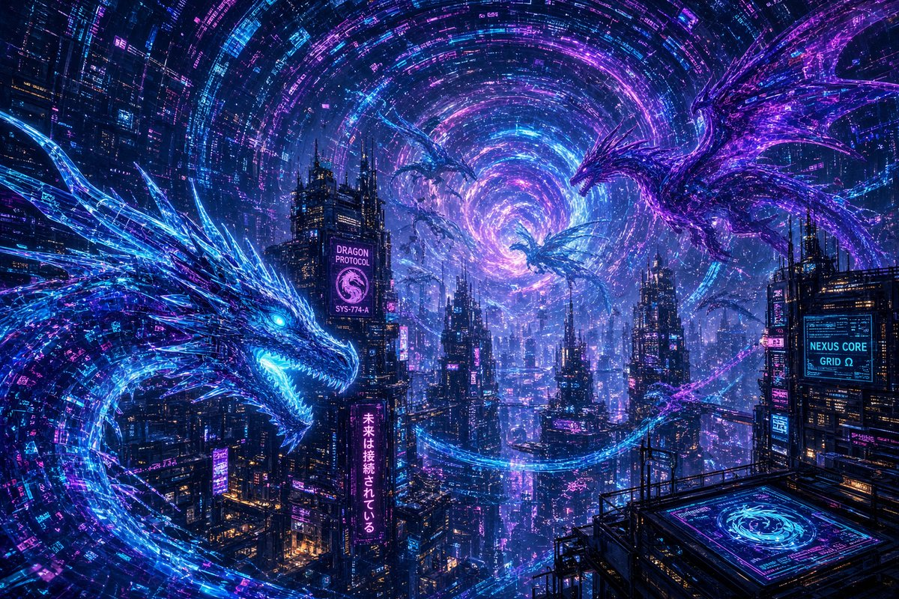

**提示詞**

```text
科技漩渦之城中的數位巨龍
```

[↑ 返回分類目錄](#catalog)

---

<a name="prompt-2101749161536458825"></a>

### 一位材料科學家穿上了一件帶有脈動電藍色線條的深色石墨烯匿蹤戰衣。

作者：[@tappyai007](https://x.com/tappyai007) · [查看 X 原帖](https://x.com/tappyai007/status/2101749161536458825)

賽博龐克 / 科幻 · 已推流

**概括:** 一位材料科學家穿上了一件帶有脈動電藍色線條的深色石墨烯匿蹤戰衣。


**提示詞**

```text
石墨烯之網：一位材料科學家啟動了真空室。超薄石墨烯片包裹著他們的衣服，緊密編織成一件深色、輕若羽毛的匿蹤戰衣，上面帶有脈動的電藍色動能線條。
```

[↑ 返回分類目錄](#catalog)

---

<a name="prompt-2100340449441685763"></a>

### 由黑鉻與金鉻製成、佇立在金色煙霧中的機械阿努比斯全身提示詞。

作者：[@RobotCleopatra](https://x.com/RobotCleopatra) · [查看 X 原帖](https://x.com/RobotCleopatra/status/2100340449441685763)

賽博龐克 / 科幻 · 角色 · 已推流

**概括:** 由黑鉻與金鉻製成、佇立在金色煙霧中的機械阿努比斯全身提示詞。


**提示詞**

```text
全身描繪的科幻機械阿努比斯。角色是一個高大修長的機械生命體，由黑鉻與金鉻材質製成。頭部是風格化的胡狼造型，帶有發光的橙黃色眼睛。脖子上戴著一條巨大的、華麗的金色項鍊，帶有分段環帶。軀幹、手臂和腿部布滿了精細複雜的機械組件、金色飾邊和外露的內部配線。腰間圍著一塊飾有細金鏈的破損黑布。機器人置於被濃密翻騰的金色塵埃與煙霧籠罩的黑暗背景前，站在帶有微弱倒影的反射表面上。
```

[↑ 返回分類目錄](#catalog)

---

<a name="prompt-2097951816675639459"></a>

### 一段15秒的2000年代初紀錄片場景：一名記者在已著陸的太空船旁採訪一名外星人，外星人透露它來到地球是為了兌換一張麥當勞優惠券。

作者：[@DtheW1995](https://x.com/DtheW1995) · [查看 X 原帖](https://x.com/DtheW1995/status/2097951816675639459)

賽博龐克 / 科幻 · 已推流

**概括:** 一段15秒的2000年代初紀錄片場景：一名記者在已著陸的太空船旁採訪一名外星人，外星人透露它來到地球是為了兌換一張麥當勞優惠券。


**提示詞**

```text
15秒超逼真的2000年代初電視紀錄片鏡頭，由一名身歷其境的攝影師使用家用MiniDV攝影機拍攝。夜晚，位於一座美國小鎮外的潮濕田野上。一艘巨大而逼真的金屬外星太空船剛剛降落在受訪者身後，沉重地壓在被壓扁的濕草地上；太空船的舷梯敞開著，蒼白的內部光線傾瀉在霧氣中，水氣從船體凝結滴落，隱約可聞低沉的機械嗡嗡聲。沒有電影般的精緻感：晃動的肩扛構圖、不完美的變焦、遲緩的自動對焦、強光周圍的曝光抽動、褪色的色彩、交錯掃描的DV動態、輕微的磁帶噪點和壓縮偽影。0.0–2.0秒 — 吸睛開場：畫面直接從這場非凡採訪的中途開始。一名緊張的男性電視記者站在太空船正前方，身旁是一位高瘦但具有生物學真實感的外星人。記者將有線新聞麥克風遞向它，同時攝影機迅速從發光的太空船變焦特寫外星人細節豐富的臉龐。外星人擁有濕潤具質感的灰色皮膚、細微的呼吸起伏、眨動的黑色雙眼和自然的份量感；絕非道具戲服，也毫不卡通化。2.0–5.5秒：在一次連續的手持一鏡到底中，記者抬頭看著外星人，神情嚴肅地以英語問道：“Why did you come to Earth? What are you looking for?” 他的語氣謹慎且專業。攝影師在重新構圖兩人面部時短暫失焦，隨後即時修正。外星人在身後太空船的嗡鳴聲中默默思考了這個問題，氣氛尷尬了一秒鐘。5.5–11.5秒 — 撲克臉笑點爆發：外星人緩慢地將手伸進固定在身上的一個小型金屬小袋中，拿出一張略微起皺的紙質優惠券。它用兩根長手指夾起優惠券展示，以平靜且完全清晰可辨的英語、帶著奇特乾燥的嗓音回答：“I came to redeem this coupon. Twenty-piece Chicken McNuggets, with sweet-and-sour sauce. At McDonald’s.” 它的面部依舊維持全然的嚴肅。嘴部動作僅精確對應外星人自己的對白。11.5–15.0秒 — 後續餘波：記者微微放下麥克風，滿臉不可置信地盯著外星人。攝影機尷尬且突兀地變焦對準優惠券，隨後又拉回記者困惑的臉孔。外星人若無其事地指向遠處的城鎮，彷彿在問路。攝影師試圖壓抑微弱的笑聲。記者最後喃喃自語：“Right … okay.” 緊接著是真實磁帶風格的突兀切斷。音訊：清晰的現場英語對話，但帶有2000年代初麥克風的不完美音質、微風聲、腳踩濕草聲、遠處蟲鳴、太空船通風及電子嗡鳴。無配樂、旁白、預告片音效或罐頭笑聲。幽默感完全源自嚴肅的紀錄片基調與荒謬平凡的回答之間的衝突。連貫性 / 負面提示：僅限一名記者、一名外星人、一名攝影師及一艘太空船；連續且符合人體工學的攝影機位；無不可能的拍攝視角、重複的人物或外星人、形變、漂浮、瞬間移動、卡通CGI、發光的魔法雙眼、攻擊性行為、武器、人群、字幕、螢幕文字、改變外觀的優惠券或麥克風。
```

[↑ 返回分類目錄](#catalog)

---

<a name="category-minimalism"></a>

## 極簡主義

<a name="prompt-2102254699202166846"></a>

### 以「概念留白剪影風」構建上下對比圖，上半部保留原攝影主體，下半部提煉極簡抽象墨黑剪影與大面積暖白留白。

作者：[@Hamburgerai](https://x.com/Hamburgerai) · [查看 X 原帖](https://x.com/Hamburgerai/status/2102254699202166846)

攝影 · 極簡主義 · 摘要 / 背景 · 已推流

**概括:** 以「概念留白剪影風」構建上下對比圖，上半部保留原攝影主體，下半部提煉極簡抽象墨黑剪影與大面積暖白留白。

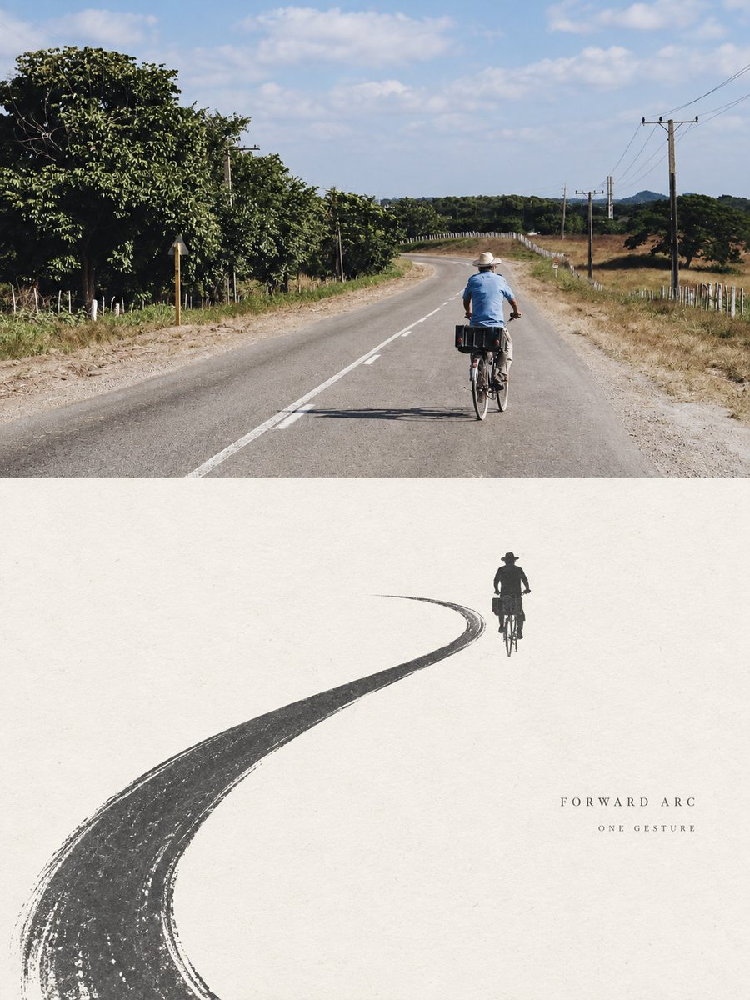

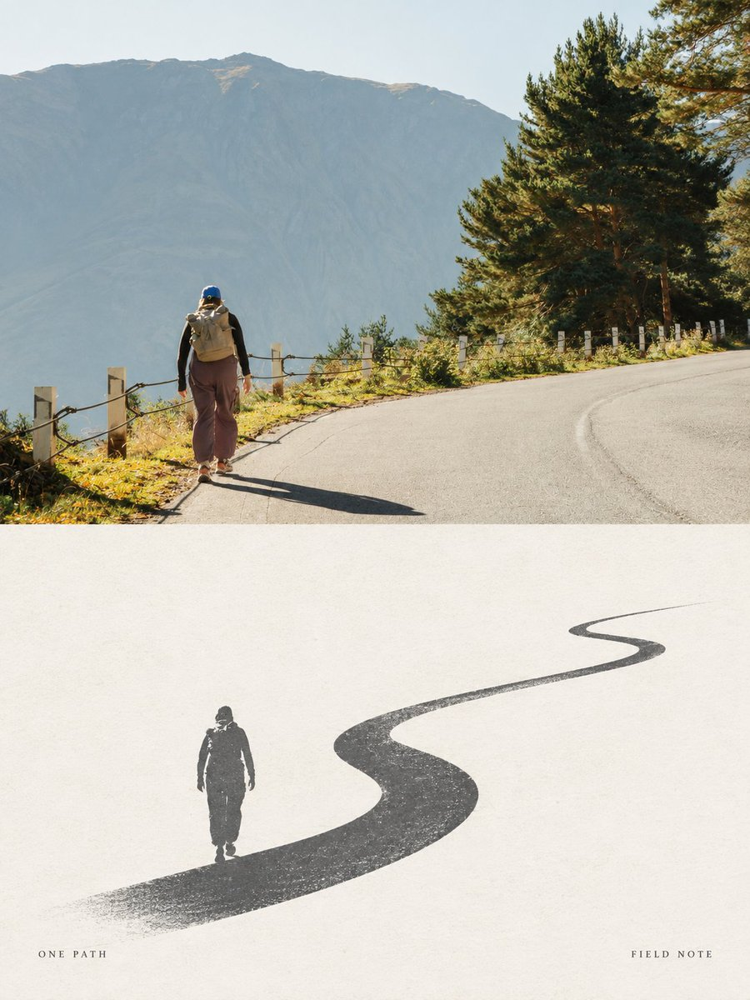

**提示詞**

```text
製作一張直向 3:4 的上下對比轉繪圖，風格命名為【CONCEPTUAL SILHOUETTE VOID｜概念留白剪影風】。適用於人物、動物、植物、建築、城市、交通工具、食物、器物、室內、自然和旅行照片，不限定「旅途」或任何單一場景。
上半部約 42%–48% 保留輸入照片本身：準確保持主要主體、數量、姿態、視角、空間關係、光線、材質和可識別色彩，只做自然的出版級調色，不插畫化、不換地點、不增刪關鍵主體。上下之間留出乾淨的暖白接縫，不加粗邊框、照片標籤或原圖/AI角標。
下半部不要複製整幅照片，也不要畫完整插畫。先從原照片提煉一個最有意義的語義關係、動作、輪廓或材質節奏：例如人物的站姿、動物的尾巴弧線、花的綻放、樹枝的伸展、道路的彎折、建築的拱線、車輛的速度方向、碗碟的圓形關係、窗戶的重複節奏、山脊的起伏或水面的波紋。只選擇一個主載體，把它重構成一枚炭黑、墨黑或深石墨色的抽象平面剪影、帶狀輪廓、塊面符號或單一線性手勢。該形狀必須能回溯到上半部的真實主體，但允許拉長、縮小、偏置、旋轉、切斷或跨越留白。
下半部保持 60%–80% 的連續暖白留白，紙面只有極淡纖維和啞光顆粒。主形狀邊緣可以有輕微網點、乾刷顆粒或不均勻墨密度，但整體必須克制、平面、乾淨，不能暈成水墨，也不能變成精細線稿。人物和動物可壓縮為無臉、無服裝紋理的整體剪影；建築、植物、食物和器物只保留能識別形狀關係的最少結構，不恢復照片細節。最多使用一條或兩條極細輔助線提示方向，不得添加第二個抽象物。
抽象形狀以炭黑、墨黑或深石墨為主，最多從原圖提取一處極低飽和點色，顏色隨照片變化，不套固定藍色、綠色或城市色板。底部可加入一行很小、準確的英文編輯注釋，描述該語義，例如 ONE GESTURE / OPEN SPACE、ARC / STILLNESS 或 SINGLE FORM；不要加入大標題、長段落或虛構地點資訊。
整體應讓上半部承擔攝影事實，下半部承擔單一概念、形體判斷和留白節奏。禁止滿版場景重繪、多個漂浮物、連續路線節點、完整城市天際線模板、照片窗、整頁水墨、彩色幾何海報、厚重紙藝、3D渲染、自動描邊、Logo、浮水印、假中文、AI角標和原圖角標。
```

[↑ 返回分類目錄](#catalog)

---

<a name="prompt-2102211141820920113"></a>

### 翻譯中

作者：[@DDJCXX](https://x.com/DDJCXX) · [查看 X 原帖](https://x.com/DDJCXX/status/2102211141820920113)

攝影 · 極簡主義 · 人像 / 自拍 · 角色 · 時尚單品 · 建築 / 室內設計 · 已推流

**概括:** 翻譯中

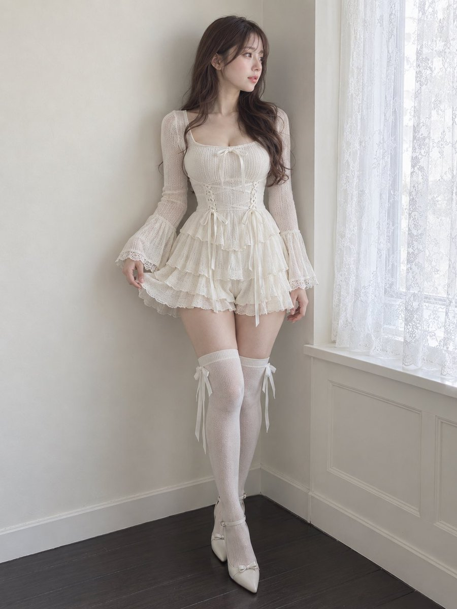

**提示詞**

```text
翻譯中
```

[↑ 返回分類目錄](#catalog)

---

<a name="prompt-2101703683167645776"></a>

### 以蕾絲為主題的單詞極簡視覺提示詞。

作者：[@AllaAisling](https://x.com/AllaAisling) · [查看 X 原帖](https://x.com/AllaAisling/status/2101703683167645776)

極簡主義 · 已推流

**概括:** 以蕾絲為主題的單詞極簡視覺提示詞。


**提示詞**

```text
蕾絲
```

[↑ 返回分類目錄](#catalog)

---

<a name="prompt-2101150526729830895"></a>

### 翻譯中

作者：[@DDJCXX](https://x.com/DDJCXX) · [查看 X 原帖](https://x.com/DDJCXX/status/2101150526729830895)

攝影 · 極簡主義 · 人像 / 自拍 · 角色 · 建築 / 室內設計 · 已推流

**概括:** 翻譯中


**提示詞**

```text
翻譯中
```

[↑ 返回分類目錄](#catalog)

---

<a name="prompt-2100526246707024323"></a>

### 翻譯中

作者：[@xiaoxiaodong01](https://x.com/xiaoxiaodong01) · [查看 X 原帖](https://x.com/xiaoxiaodong01/status/2100526246707024323)

海報／傳單 · 極簡主義 · 已推流

**概括:** 翻譯中


**提示詞**

```text
翻譯中
```

[↑ 返回分類目錄](#catalog)

---

<a name="prompt-2099605356116951296"></a>

### 翻譯中

作者：[@VoxcatAI](https://x.com/VoxcatAI) · [查看 X 原帖](https://x.com/VoxcatAI/status/2099605356116951296)

攝影 · 極簡主義 · 人像 / 自拍 · 角色 · 已推流

查看 X 原帖：[@VoxcatAI](https://x.com/VoxcatAI) · [查看 X 原帖](https://x.com/VoxcatAI/status/2014671895657074893)

**概括:** 翻譯中


**提示詞**

```text
翻譯中
```

[↑ 返回分類目錄](#catalog)

---

<a name="prompt-2099090732678295807"></a>

### 翻譯中

作者：[@azed\_ai](https://x.com/azed_ai) · [查看 X 原帖](https://x.com/azed_ai/status/2099090732678295807)

攝影 · 極簡主義 · 人像 / 自拍 · 網紅 / 模特兒 · 時尚單品 · 已推流

**概括:** 翻譯中


**提示詞**

```text
翻譯中
```

[↑ 返回分類目錄](#catalog)

---

<a name="prompt-2098878777556410480"></a>

### 概念極簡主義：空曠白色房間裡的一張單人木椅。

作者：[@SameChair](https://x.com/SameChair) · [查看 X 原帖](https://x.com/SameChair/status/2098878777556410480)

極簡主義 · 已推流

**概括:** 概念極簡主義：空曠白色房間裡的一張單人木椅。


**提示詞**

```text
概念極簡主義：空曠白色房間裡的一張單人木椅。
```

[↑ 返回分類目錄](#catalog)

---

<a name="prompt-2097872057157783561"></a>

### 翻譯中

作者：[@DDJCXX](https://x.com/DDJCXX) · [查看 X 原帖](https://x.com/DDJCXX/status/2097872057157783561)

攝影 · 極簡主義 · 角色 · 時尚單品 · 已推流

**概括:** 翻譯中


**提示詞**

```text
翻譯中
```

[↑ 返回分類目錄](#catalog)

---

<a name="category-other"></a>

## 其他

<a name="prompt-2102429997348610357"></a>

### 翻譯中

作者：[@Minahil42298354](https://x.com/Minahil42298354) · [查看 X 原帖](https://x.com/Minahil42298354/status/2102429997348610357)

海報／傳單 · 角色 · 已推流

**概括:** 翻譯中

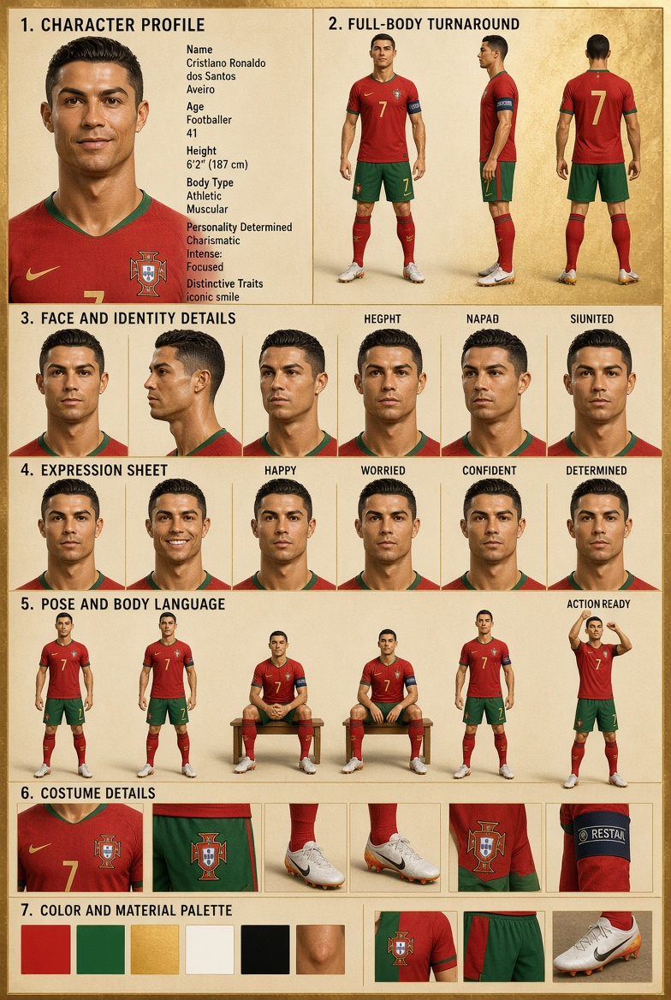

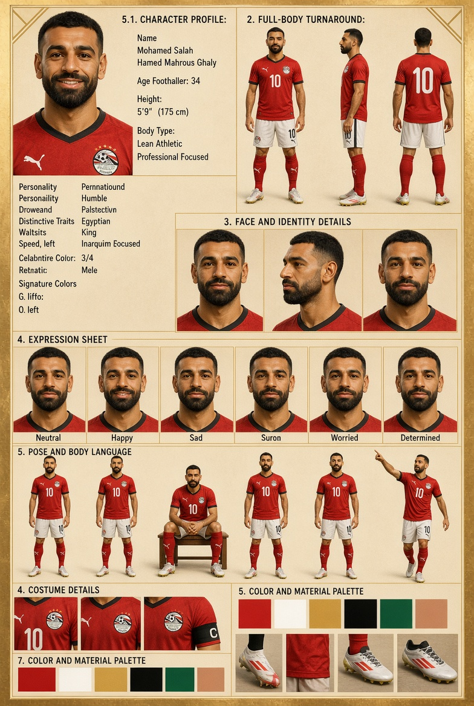

**提示詞**

```text
翻譯中
```

[↑ 返回分類目錄](#catalog)

---

<a name="prompt-2102374599325569138"></a>

### 在昏暗臥室凌亂的床上，身著解開鈕扣的襯衫與長襪的受束縛人物之感性BDSM肖像。

作者：[@w\_ooon\_](https://x.com/w_ooon_) · [查看 X 原帖](https://x.com/w_ooon_/status/2102374599325569138)

人像 / 自拍 · 已推流

**概括:** 在昏暗臥室凌亂的床上，身著解開鈕扣的襯衫與長襪的受束縛人物之感性BDSM肖像。

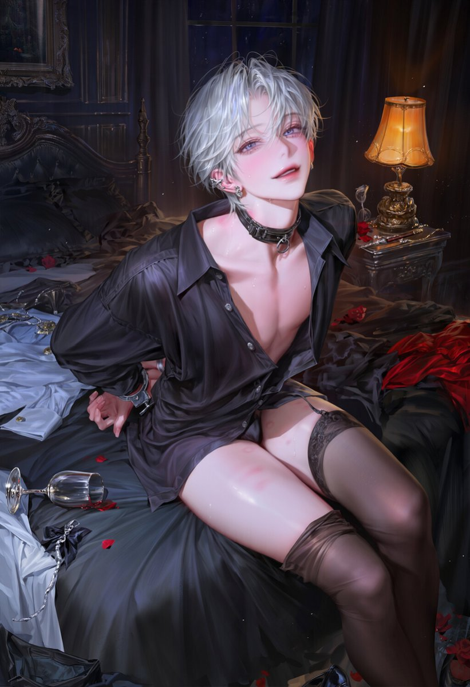

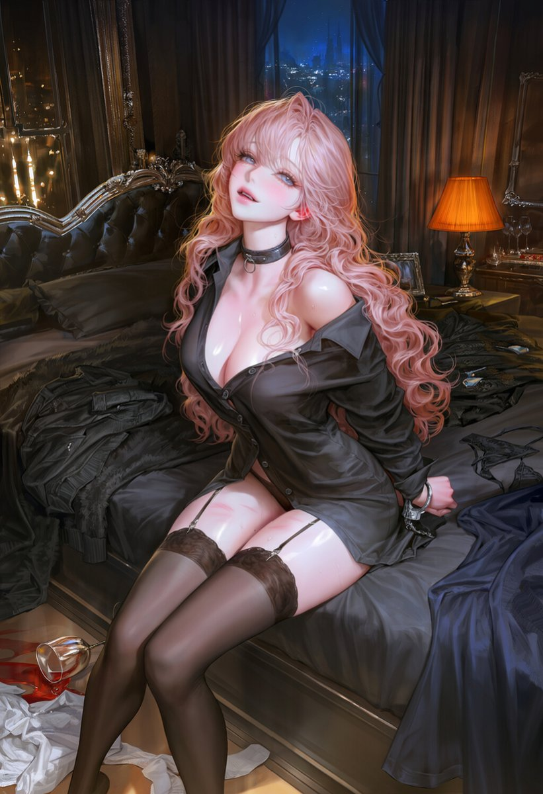

**提示詞**

```text
NSFW，頹廢，情色，感性，慵懶，墮落的優雅，

1.35::坐在未整理的床沿上，雙手被束縛在身後，手腕在腰後被銬在一起，雙腿微開，上半身微微前傾，下巴微揚，頭稍向後仰::，

1.2::帶有小金屬O形環的黑色皮革項圈，寬鬆的黑色襯衫鬆散地垂掛並從一側香肩滑落，數顆鈕扣解開，黑色內衣，過膝長筒襪，吊襪帶，衣衫不整::，

戲謔的壞笑，倔強的神情，半閉的雙眼，迷離沉重的目光，泛紅的面頰，微啟的雙唇，誘惑的眼神接觸，疲憊卻充滿挑逗，

受縛的手腕，手銬，項圈，凌亂的頭髮，微汗，1.3::大腿上淡淡的紅痕，隱約的拍打痕跡::，皮膚上的柔和光澤，解開的衣物，情慾張力，玩味的抗拒，脆弱的姿態，挑逗後被逮住，

1.15::奢華昏暗的臥室，凌亂的黑色床單，天鵝絨寢具，微弱的琥珀色床頭燈，深沉的陰影，拉上的窗簾，深夜氛圍，散落一地的衣物，打翻的紅酒杯，頹靡的室內，充滿情緒的光影::，

上半身與大腿，微仰角，居中構圖，電影感構圖，景深
```

[↑ 返回分類目錄](#catalog)

---

<a name="prompt-2102394726695801078"></a>

### 翻譯中

作者：[@AI\_money\_club](https://x.com/AI_money_club) · [查看 X 原帖](https://x.com/AI_money_club/status/2102394726695801078)

其他 · 已推流

**概括:** 翻譯中

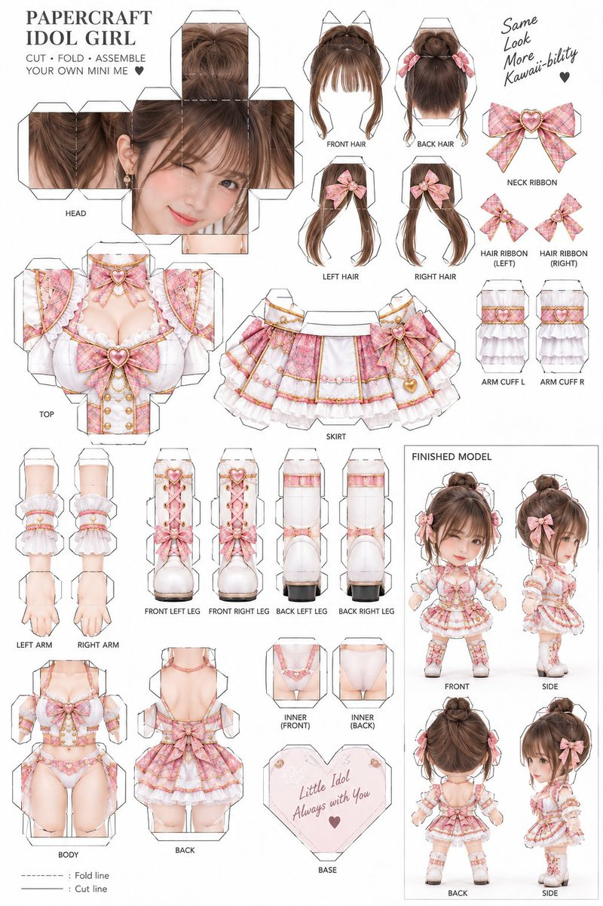

**提示詞**

```text
翻譯中
```

[↑ 返回分類目錄](#catalog)

---

<a name="prompt-2102426880016253191"></a>

### 翻譯中

作者：[@PixelAigc](https://x.com/PixelAigc) · [查看 X 原帖](https://x.com/PixelAigc/status/2102426880016253191)

角色 · 已推流

**概括:** 翻譯中


**提示詞**

```text
翻譯中
```

[↑ 返回分類目錄](#catalog)

---

<a name="prompt-2102369781504414039"></a>

### 用於生成超現實主義雜誌風格圖像的提示詞範本，透過象牙色背景和鈷藍色點綴的微縮物體生動演繹流行諺語。

作者：[@hmontilla\_](https://x.com/hmontilla_) · [查看 X 原帖](https://x.com/hmontilla_/status/2102369781504414039)

摘要 / 背景 · 已推流

**概括:** 用於生成超現實主義雜誌風格圖像的提示詞範本，透過象牙色背景和鈷藍色點綴的微縮物體生動演繹流行諺語。

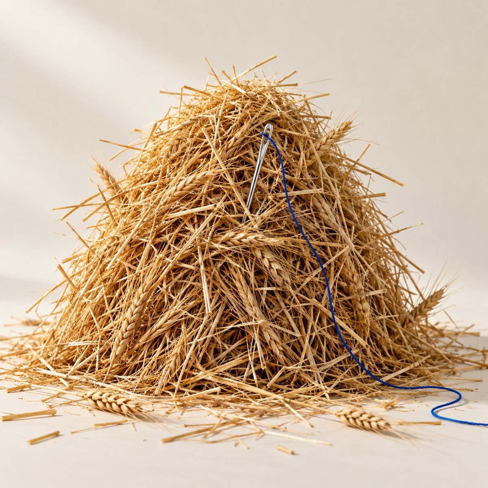


**提示詞**

```text
創作一張正方形的超現實主義編輯風格攝影作品，字面還原諺語「[REFRÁN]」。場景由微縮實體物件構建；採用單一、巧妙且極具辨識度的構圖。暖象牙色無縫背景，左上方射入的漫射自然光，逼真的陰影，富於質感的實體材質，並點綴鈷藍與柔和珊瑚色細節。精緻而俏皮的雜誌美學風格，50mm鏡頭拍攝，高解析度。無人物、無文字、無字母、無數字、無標誌、無邊框、無拼貼畫。
```

[↑ 返回分類目錄](#catalog)

---

<a name="prompt-2102342536597758245"></a>

### 上下分欄旅行海報：上半部保留原圖，下半部重構為粗糙牆面實體浮雕，單一敘事元素溢出邊界並帶有指定排版文字。

作者：[@Hamburgerai](https://x.com/Hamburgerai) · [查看 X 原帖](https://x.com/Hamburgerai/status/2102342536597758245)

海報／傳單 · 文字 / 字體排版 · 已推流

**概括:** 上下分欄旅行海報：上半部保留原圖，下半部重構為粗糙牆面實體浮雕，單一敘事元素溢出邊界並帶有指定排版文字。

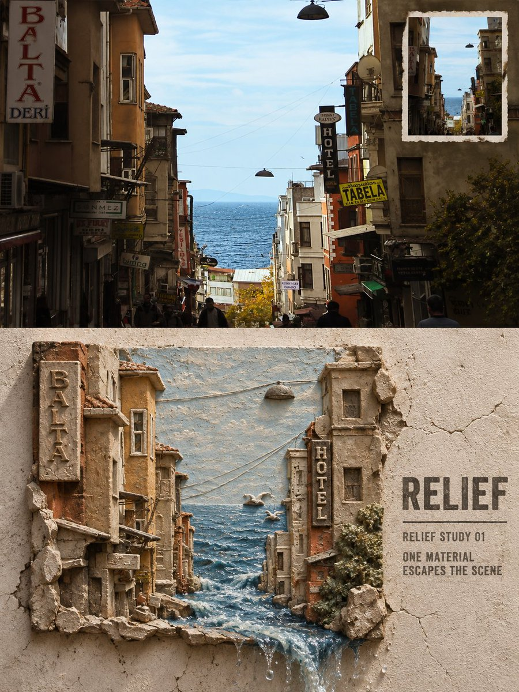

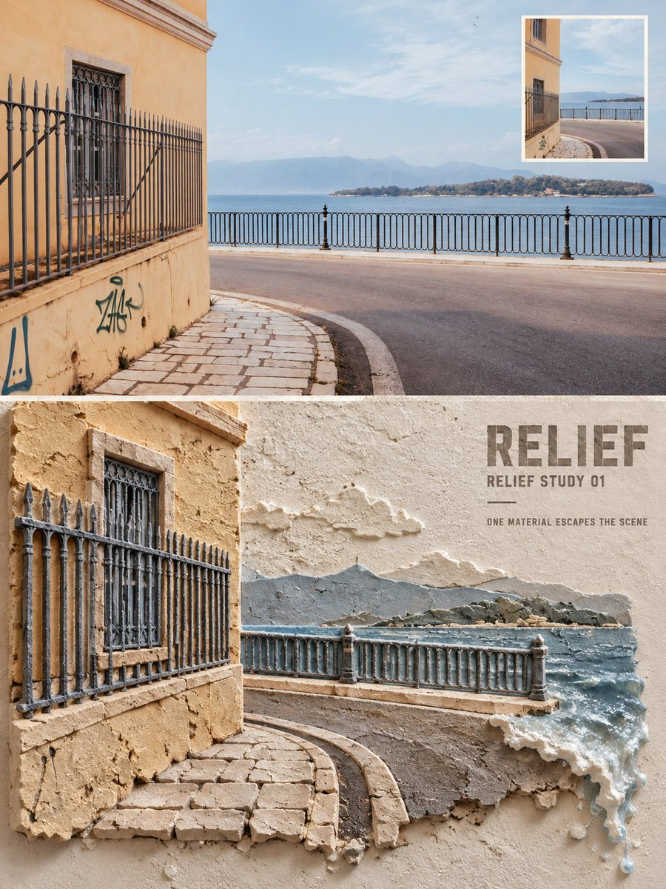

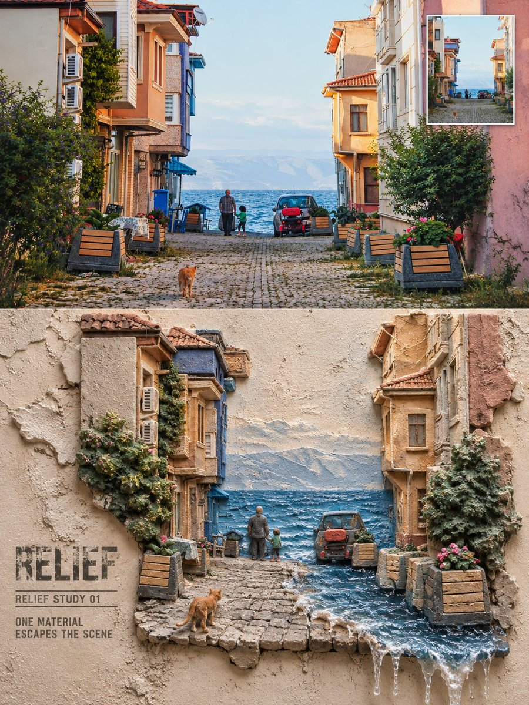

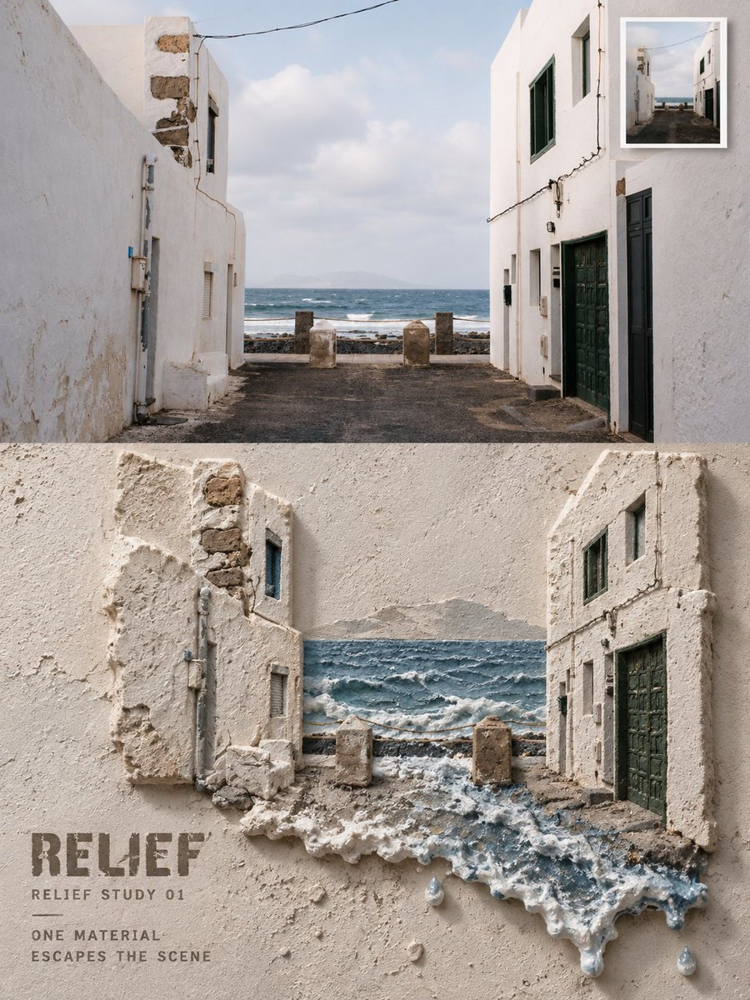

**提示詞**

```text
製作一張直向 3:4 的上下對比旅行轉繪海報。上半部約 40%–50% 保留輸入照片本身，保持主體數量、人物或動物姿態、道路/建築/地形結構、觀察角度、光線和自然色彩，只做輕微出版級調色；不要把照片畫成插畫，不要替換地標或改變人物。
下半部將同一場景重構為可觸摸的粗糙實體牆面浮雕，不複製完整照片取景。把關鍵建築、道路、護欄、山脊、樹冠、桌面或器物壓縮為有厚度的分層塊體，改變主體尺度、裁切和資訊密度。底材為粗糙礦物塗層牆、石膏板、紙漿板或手工水泥質感，須有顆粒、鏟痕、壓痕、裂縫、崩邊、側面厚度和接觸陰影。
只從照片中選擇一個有敘事性的元素溢出，例如海水、雨水、煙霧、樹根、藤蔓、道路邊線、織物或建築構件；讓它從浮雕縫隙、孔洞或底邊延伸約 5%–20% 畫幅，並具備真實材質的投影、反光、顆粒或纖維。色彩從輸入照片提取並壓縮為 3–7 種啞光礦物色。下半保留連續低資訊空場，並寫入 RELIEF、RELIEF STUDY 01、ONE MATERIAL ESCAPES THE SCENE。不要拼貼、網格、馬賽克、珠片、平滑塑料 3D、數位故障、Logo、浮水印、原圖或 AI 圖角
```

[↑ 返回分類目錄](#catalog)

---

<a name="prompt-2102302776013595059"></a>

### 全透明玻璃地板高層辦公大樓仰拍視角，展現職場女性辦公走動的場景。

作者：[@MrGafish](https://x.com/MrGafish) · [查看 X 原帖](https://x.com/MrGafish/status/2102302776013595059)

其他 · 已推流

**概括:** 全透明玻璃地板高層辦公大樓仰拍視角，展現職場女性辦公走動的場景。

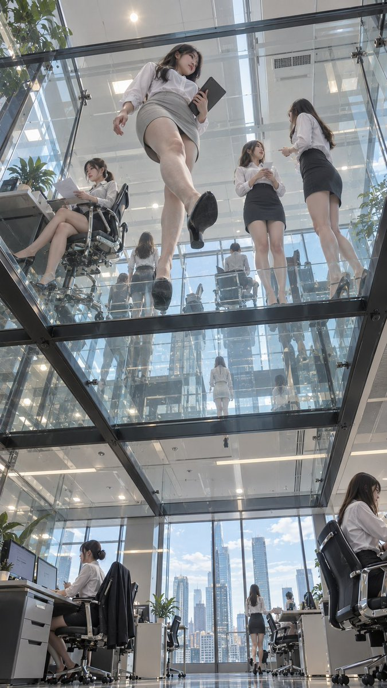

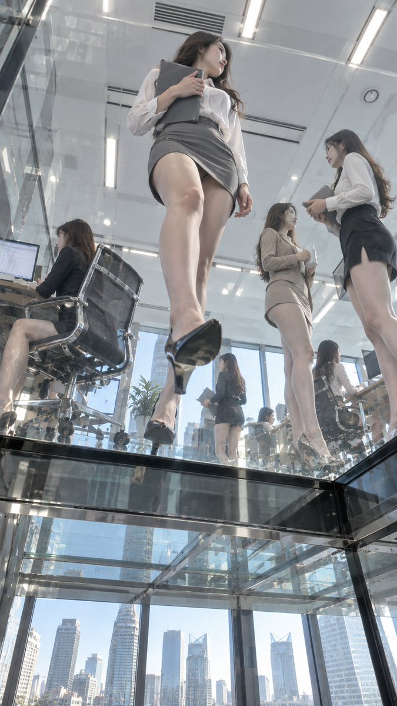

**提示詞**

```text
現代高層辦公大樓內部，透明玻璃地板與天花板，從下層透過玻璃向上仰視拍攝。大量年輕職場女性，部分坐在辦公桌前，部分站立交談或行走。窗外是城市天際線，室內光線明亮潔淨，白色吊頂與日光燈。超寫實攝影，低角度廣角構圖，層次豐富，細節精細，電影質感。
```

[↑ 返回分類目錄](#catalog)

---

<a name="prompt-2102276302539812995"></a>

### 一位戴著獸耳、身穿合身黑色西裝的角色反坐在辦公椅上懇求。

作者：[@leftbypeace](https://x.com/leftbypeace) · [查看 X 原帖](https://x.com/leftbypeace/status/2102276302539812995)

角色 · 動物 / 生物 · 已推流

**概括:** 一位戴著獸耳、身穿合身黑色西裝的角色反坐在辦公椅上懇求。

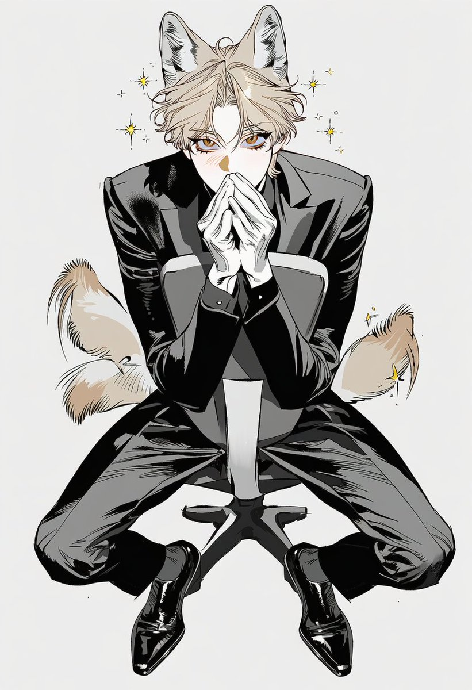

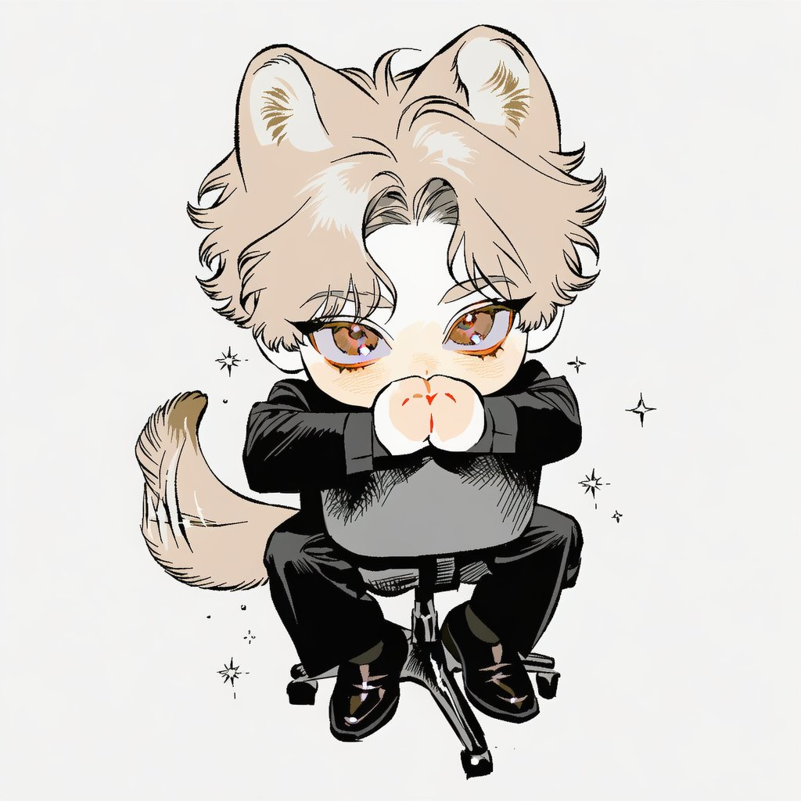

**提示詞**

```text
單人, 全身, 正面視角, 白色背景, 簡約背景, 3::反坐在辦公椅上, 跨坐在椅子上::, 3::胸口靠在椅背上, 雙腿跨開在椅子兩側::, 4::雙手合十放在嘴巴正前方::, 4::左右指尖相互觸碰::, 指尖碰觸嘴唇, 手掌相對, 雙手靠近, 雙肘貼近, 2::黑色合身西裝, 黑色正裝襯衫, 黑色長褲::, 2::黑色皮鞋::, 2::獸耳::, 2::獸尾, 尾巴左右擺動::, 辦公椅, 3::角色周圍有小閃爍特效::, 閃爍的星星, 細微閃光, 微妙閃爍, 可愛懇求的氛圍
```

[↑ 返回分類目錄](#catalog)

---

<a name="prompt-2102286321842594188"></a>

### 不是所有的天使都有翅膀，有許多正行走在人類之中

作者：[@Carmenlexbt](https://x.com/Carmenlexbt) · [查看 X 原帖](https://x.com/Carmenlexbt/status/2102286321842594188)

其他 · 已推流

**概括:** 不是所有的天使都有翅膀，有許多正行走在人類之中


**提示詞**

```text
不是所有的天使都有翅膀，有許多正行走在人類之中
```

[↑ 返回分類目錄](#catalog)

---

<a name="prompt-2102250779109454203"></a>

### 翻譯中

作者：[@GrayNoteLab](https://x.com/GrayNoteLab) · [查看 X 原帖](https://x.com/GrayNoteLab/status/2102250779109454203)

漫畫 / 分鏡腳本 · 已推流

**概括:** 翻譯中


**提示詞**

```text
翻譯中
```

[↑ 返回分類目錄](#catalog)

---

<a name="prompt-2102204400768876741"></a>

### 以外星景觀為特色，包含黑沙、綠松石色水域、藍色植被、鋸齿山峰與一輪紅日。

作者：[@MakunaMars](https://x.com/MakunaMars) · [查看 X 原帖](https://x.com/MakunaMars/status/2102204400768876741)

風景 / 大自然 · 已推流

**概括:** 以外星景觀為特色，包含黑沙、綠松石色水域、藍色植被、鋸齿山峰與一輪紅日。


**提示詞**

```text
在一個外星球上創作一幅寧靜的風景。黑沙海岸與綠松石色的海洋相映成趣，海浪拍打著海灘。遠處籠罩著一層淡淡的紫色薄霧，海灣對岸點綴著鋸齒狀的山峰。前景是繁茂的熱帶植物，帶有藍色的莖和葉，黃色花朵擁有半透明花瓣與修長的白色雄蕊，樹木帶有多節的暗淡蒼白藍色樹幹、盤曲的樹枝與鋸齒狀的藍色葉片。淺藍紫色的天空略顯陰沉，飄浮著淡綠松石色蓬鬆的雲朵。一輪紅日懸掛在午後的天空中，光線穿透雲層邊緣。高度細緻，電影質感的超現實環境。
```

[↑ 返回分類目錄](#catalog)

---

<a name="prompt-2102239002317525380"></a>

### 抽著菸並自言自語倖存的動態台詞提示詞。

作者：[@NbkogY3](https://x.com/NbkogY3) · [查看 X 原帖](https://x.com/NbkogY3/status/2102239002317525380)

角色 · 已推流

**概括:** 抽著菸並自言自語倖存的動態台詞提示詞。


**提示詞**

```text
一邊抽著菸
「呵，我又活下來了啊……」
```

[↑ 返回分類目錄](#catalog)

---

<a name="prompt-2102144332148957251"></a>

### 一隻溫順的㺢㹢狓漫步在一個巨大的多層次世界中，周圍漂浮著條紋、半透明矩形和彎曲的紙質形態，在視覺上呼應著牠身上的斑紋，精緻的剪紙拼貼融合了乾粉彩質感，藍綠色、酒紅、鈷藍與金色，時髦而俏皮的超現實主義風格。

作者：[@RenRose321](https://x.com/RenRose321) · [查看 X 原帖](https://x.com/RenRose321/status/2102144332148957251)

其他 · 已推流

**概括:** 一隻溫順的㺢㹢狓漫步在一個巨大的多層次世界中，周圍漂浮著條紋、半透明矩形和彎曲的紙質形態，在視覺上呼應著牠身上的斑紋，精緻的剪紙拼貼融合了乾粉彩質感，藍綠色、酒紅、鈷藍與金色，時髦而俏皮的超現實主義風格。

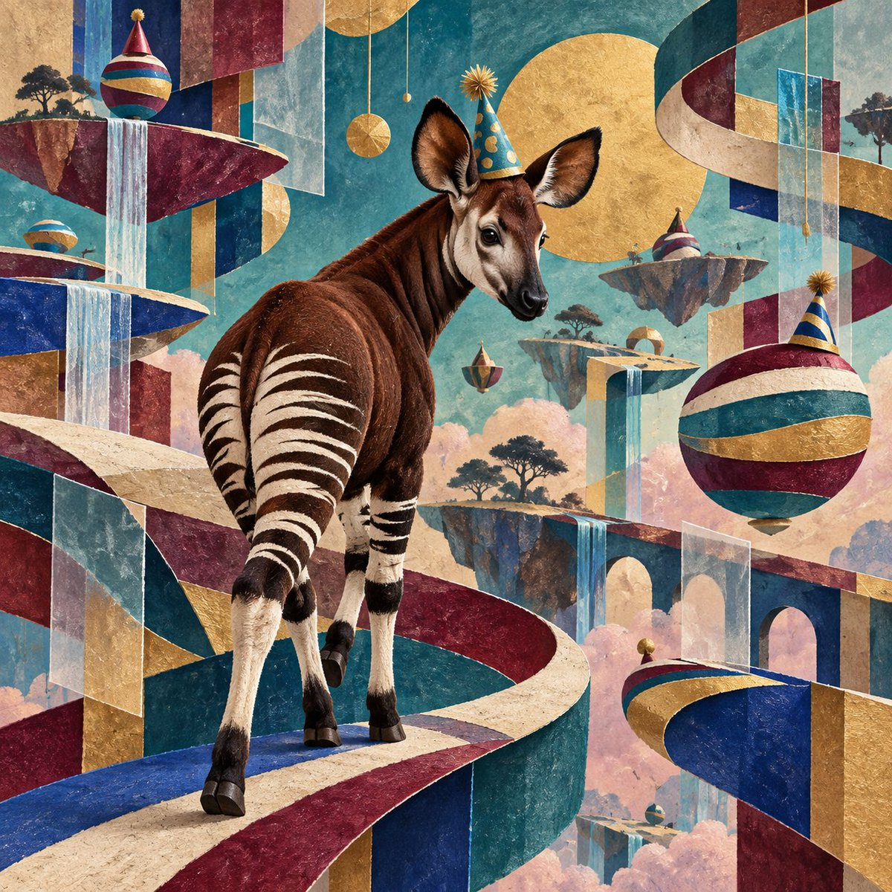

**提示詞**

```text
一隻溫順的㺢㹢狓漫步在一個巨大的多層次世界中，周圍漂浮著條紋、半透明矩形和彎曲的紙質形態，在視覺上呼應著牠身上的斑紋，精緻的剪紙拼貼融合了乾粉彩質感，藍綠色、酒紅、鈷藍與金色，時髦而俏皮的超現實主義風格。
```

[↑ 返回分類目錄](#catalog)

---

<a name="prompt-2102132256290558176"></a>

### 深海 ROV 視角提示詞模板，採用 2x2 網格呈現不尋常的深水主體，並配有逼真的遙測數據疊加層。

作者：[@Gdgtify](https://x.com/Gdgtify) · [查看 X 原帖](https://x.com/Gdgtify/status/2102132256290558176)

其他 · 已推流

**概括:** 深海 ROV 視角提示詞模板，採用 2x2 網格呈現不尋常的深水主體，並配有逼真的遙測數據疊加層。

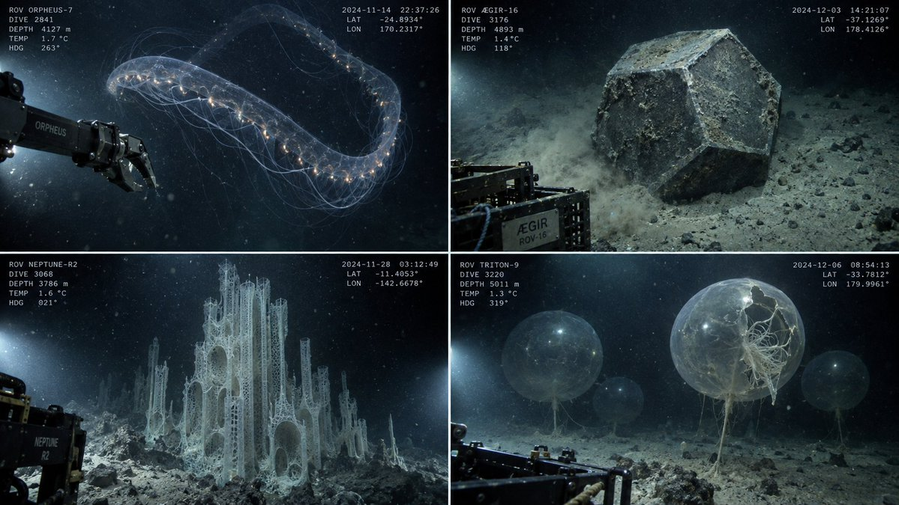

**提示詞**

```text
2x2 網格，16:9，對 4 個不尋常的主體執行此操作：INPUT: $ SUBJECT              // 生物、結構、本不該出現在那裡的幾何體 FIND      = infer_subject($ SUBJECT)        // 與 ROV 機械手臂的比例、半透明度、運動或靜止 SCALE_REF = infer_reference($ SUBJECT)      // 前景中的機械手臂、採樣籃，用於參照尺寸 WATER     = infer_water_column($ SUBJECT)   // 顆粒密度、藍綠光吸收 SNOW      = infer_marine_snow($ SUBJECT)    // 被車燈照亮並持續漂移的微粒 LAMPS     = infer_rov_lighting($ SUBJECT)   // 雙硬光燈，劇烈衰減至純黑 FLOOR     = infer_seafloor($ SUBJECT)       // 淤泥、擾動的沉積物煙塵、岩石 OPTIC     = infer_rov_cam($ SUBJECT)        // 廣角、輕微魚眼、定焦 OVERLAY   = infer_telemetry($ SUBJECT)      // 深度、溫度、航向、經緯度、下潛次數 FLAWS     = infer_flaws($ SUBJECT)          // 後向散射眩光、對焦拉風箱、色度雜訊 Φ = lamp_cone(LAMPS) + backscatter(SNOW) MOTION: ROV 緩慢漂移 → 主體進入燈光光錐 → 推進器輕微推動，淤泥羽流升起 → 主體產生反應或毫無反應 → 車燈失去目標使其隱入黑暗。構圖：ROV 潛水器拍攝畫面，帶有劇烈衰減至黑色的雙燈，海雪後向散射，遙測數據疊加層，廣角微魚眼鏡頭。逼真照片質感，16:9。
```

[↑ 返回分類目錄](#catalog)

---

<a name="prompt-2102173572764766661"></a>

### 描繪晨光與陰影灑入室內的少女的提示詞。

作者：[@55hawks](https://x.com/55hawks) · [查看 X 原帖](https://x.com/55hawks/status/2102173572764766661)

角色 · 建築 / 室內設計 · 已推流

**概括:** 描繪晨光與陰影灑入室內的少女的提示詞。


**提示詞**

```text
光芒比少女更早甦醒的清晨。透射而入的陽光灑滿室內，陰影隨後悄然顯現出輪廓。
```

[↑ 返回分類目錄](#catalog)

---

<a name="prompt-2102152221572174045"></a>

### 新藝術風格的排版生成模板，將主題意象、微縮風景與紋理直接填充於字母輪廓內部。

作者：[@deebeeeff](https://x.com/deebeeeff) · [查看 X 原帖](https://x.com/deebeeeff/status/2102152221572174045)

風景 / 大自然 · 文字 / 字體排版 · 已推流

查看 X 原帖：[@lordknight\_ai](https://x.com/lordknight_ai) · [查看 X 原帖](https://x.com/lordknight_ai/status/2102136343581061351)

**概括:** 新藝術風格的排版生成模板，將主題意象、微縮風景與紋理直接填充於字母輪廓內部。


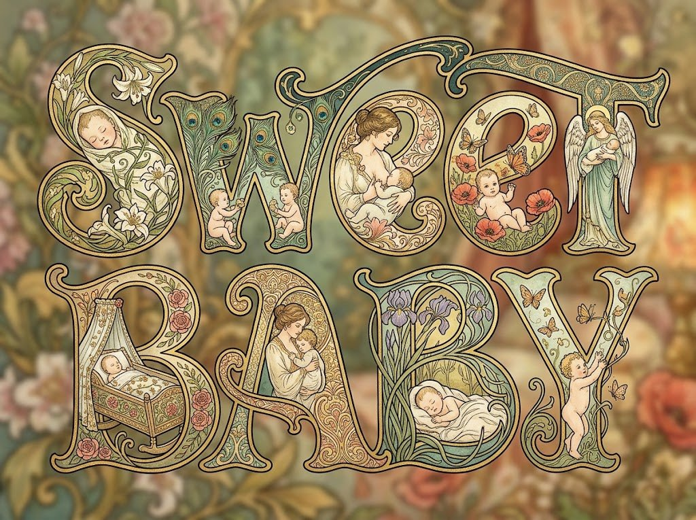

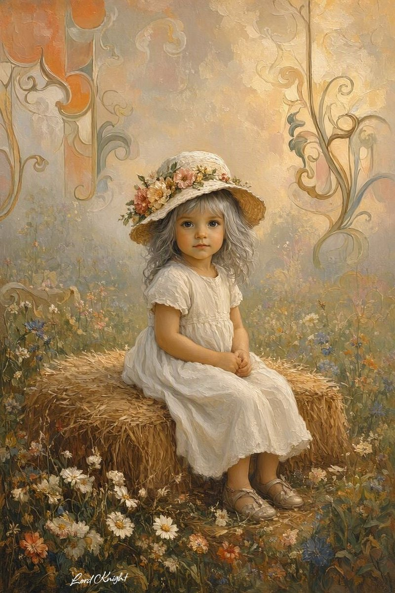

**提示詞**

```text
EVENT/SUBJECT=新藝術運動/新藝術風格嬰兒
TEXT=Art Nouveau/Sweet Baby 
一個以 [EVENT/SUBJECT] 風格呈現的 "[TEXT]" 字體排印表現，其中 [EVENT/SUBJECT] 的意象、圖案和色彩直接存在於字形內部——作為每個字母形狀內包含的紋理、填充或微縮場景——而不是作為圍繞文字的獨立裝飾。字母周圍沒有邊框或散落的物體。柔和模糊的背景包含與 [EVENT/SUBJECT] 相關的主題元素和風景。字母佔據整個畫面的核心。
```

[↑ 返回分類目錄](#catalog)

---

<a name="prompt-2102128635281129520"></a>

### 1903年波蘭沃姆札收割小麥的歷史風貌場景。

作者：[@Trad\_Teodor](https://x.com/Trad_Teodor) · [查看 X 原帖](https://x.com/Trad_Teodor/status/2102128635281129520)

其他 · 已推流

**概括:** 1903年波蘭沃姆札收割小麥的歷史風貌場景。


**提示詞**

```text
1903年波蘭沃姆札，埃娃與斯坦尼斯瓦夫正在收割小麥
```

[↑ 返回分類目錄](#catalog)

---

<a name="prompt-2101952087026172345"></a>

### 將主體描繪為城市牆面上充滿活力的街頭藝術壁畫的提示詞範本。

作者：[@LudovicCreator](https://x.com/LudovicCreator) · [查看 X 原帖](https://x.com/LudovicCreator/status/2101952087026172345)

城市景觀 / 街道 · 已推流

**概括:** 將主體描繪為城市牆面上充滿活力的街頭藝術壁畫的提示詞範本。

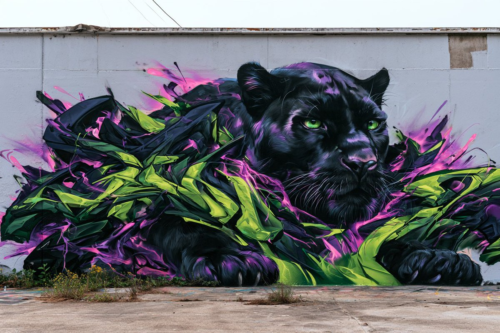

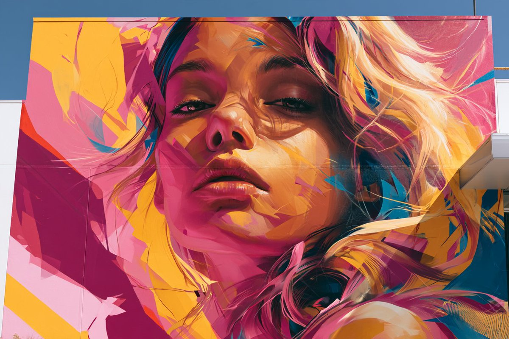

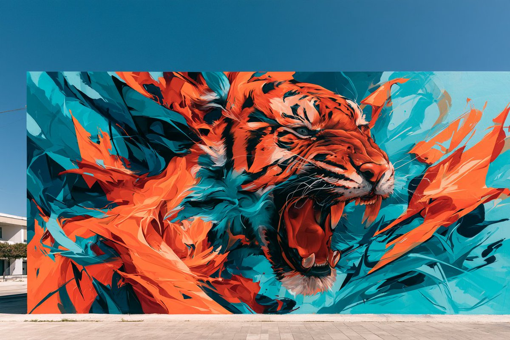

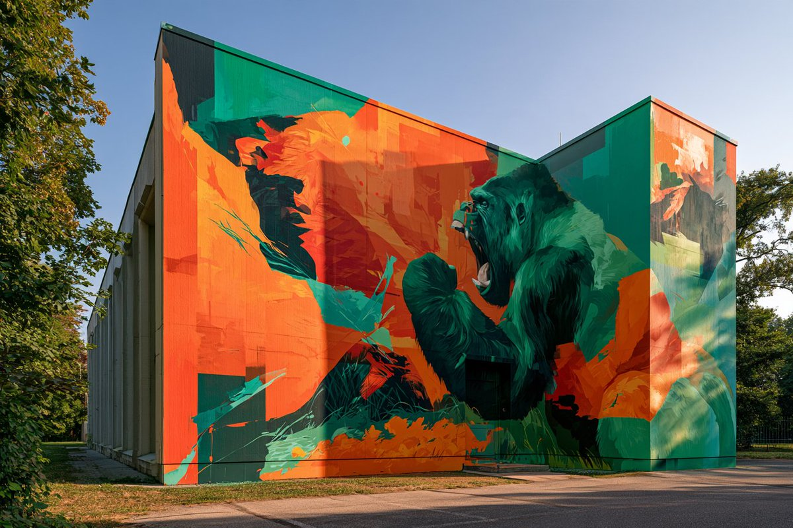

**提示詞**

```text
[SUBJECT] 蛻變成充滿活力的壁畫變形，以動感的形狀與色彩覆蓋城市牆面。融入醒目的 [COLOR1] 與 [COLOR2]，捕捉街頭藝術的活力與創造力。
```

[↑ 返回分類目錄](#catalog)

---

<a name="prompt-2101996518026907755"></a>

### 描述一名女子坐在漂浮並爆裂成五彩紙屑的氣球沙發上的提示詞。

作者：[@Arzoo12sh](https://x.com/Arzoo12sh) · [查看 X 原帖](https://x.com/Arzoo12sh/status/2101996518026907755)

角色 · 已推流

**概括:** 描述一名女子坐在漂浮並爆裂成五彩紙屑的氣球沙發上的提示詞。

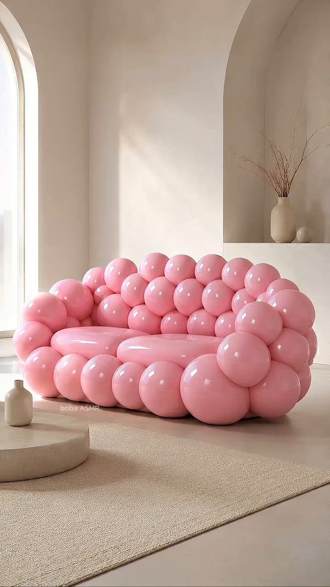

**提示詞**

```text
在一間明亮簡約的現代客廳中，一位時尚的年輕女子舒適地坐在色彩鮮豔的氣球造型沙發上。大落地窗讓溫暖自然的陽光灑滿室內。突然間，沙發緩緩開始漂浮在離地面幾英吋的空中，營造出令人驚喜又神奇的瞬間。在短暫懸浮後，氣球造型的沙發戲劇性地炸裂開來，化為一片由繽紛閃爍碎紙屑與細小玻璃狀碎片組成的美麗雲霧。粒子在慢動作中於空氣中自然飄散，映照著陽光並產生逼真的反射。女子神情自然地露出些許驚訝，同時安然無恙。彩色的粒子緩緩降落至地面，沙發優雅地落回原位。逼真物理效果、流暢漂浮動作、細緻粒子模擬、電影級光影、自然陰影、高影格率慢動作、逼真紋理、動態鏡頭運鏡、真實景深、極致細節、無縫流暢動作、4K電影級畫質。
```

[↑ 返回分類目錄](#catalog)

---

<a name="prompt-2101955473520095698"></a>

### 基於參考圖保持臉部特徵與身份一致，生成純白背景的正面免冠半身肖像提示詞。

作者：[@boniusex](https://x.com/boniusex) · [查看 X 原帖](https://x.com/boniusex/status/2101955473520095698)

人像 / 自拍 · 角色 · 摘要 / 背景 · 已推流

查看 X 原帖：[@boniusex](https://x.com/boniusex) · [查看 X 原帖](https://x.com/boniusex/status/2101938737072746983)

**概括:** 基於參考圖保持臉部特徵與身份一致，生成純白背景的正面免冠半身肖像提示詞。


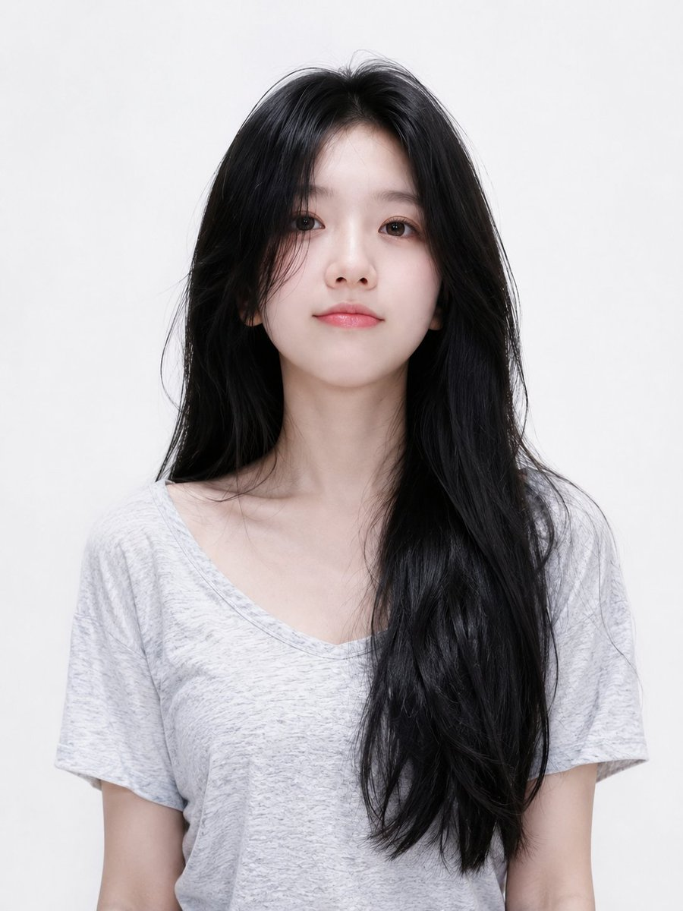


**提示詞**

```text
圖1：人物臉部基準，這個人的臉原樣使用
圖2（如有）：髮型、服裝、配件參考

【生成內容】
把圖1中的人物生成為一張正面免冠半身照，臉正對鏡頭，柔和正面光，陰影最少，純白背景。

【必須保留】
圖1的人物身份必須完全一致，逐項保持不變：臉型輪廓、顴骨和下顎線、眼睛的形狀和大小、眼皮類型、眼距、眉毛粗細和走勢、山根起點高度、鼻樑寬度、鼻頭形狀、人中長度、唇形和唇厚、下巴形狀、年齡感、膚色和皮膚質感。
髮型、髮色、髮長、配件、服裝按圖1（有圖2則按圖2）原樣保留。
參考圖中因為逆光、暖光或濾鏡產生的偏色不算作髮色和膚色本身，按中性光下的真實顏色還原。
參考圖是實拍就輸出實拍，是插畫就保持同一種插畫風格。

【禁止】
不得變成另一個人。不得美化、瘦臉、放大眼睛、拉長腿、年輕化、磨皮。不得添加圖1中沒有的臉部特徵。不得添加文字。
```

[↑ 返回分類目錄](#catalog)

---

<a name="prompt-2101911381888864305"></a>

### 隊長小翼

作者：[@JorgeRival67623](https://x.com/JorgeRival67623) · [查看 X 原帖](https://x.com/JorgeRival67623/status/2101911381888864305)

其他 · 已推流

**概括:** 隊長小翼

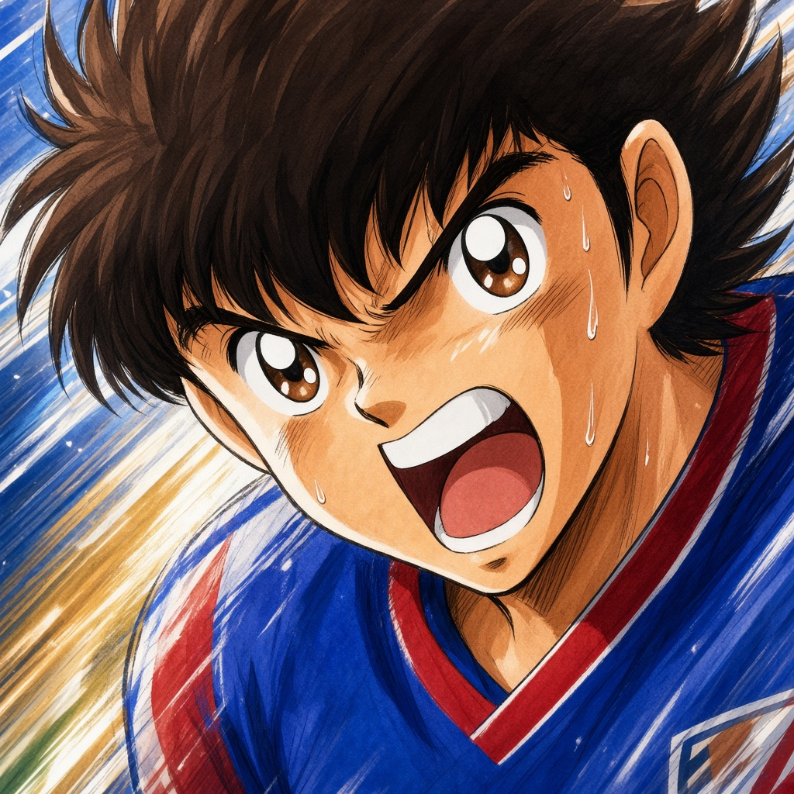

**提示詞**

```text
隊長小翼
```

[↑ 返回分類目錄](#catalog)

---

<a name="prompt-2101913573085843894"></a>

### 慶祝9月21日生日場景的生成提示詞。

作者：[@mioarashidaisuk](https://x.com/mioarashidaisuk) · [查看 X 原帖](https://x.com/mioarashidaisuk/status/2101913573085843894)

其他 · 已推流

**概括:** 慶祝9月21日生日場景的生成提示詞。

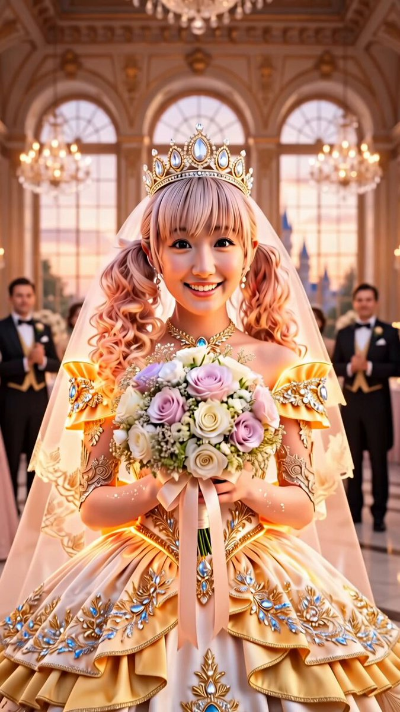

**提示詞**

```text
做成慶祝9月21日生日的風格
```

[↑ 返回分類目錄](#catalog)

---

<a name="prompt-2101915530101989784"></a>

### 將氛圍改為慶祝9月21日生日的提示詞。

作者：[@mioarashidaisuk](https://x.com/mioarashidaisuk) · [查看 X 原帖](https://x.com/mioarashidaisuk/status/2101915530101989784)

其他 · 已推流

**概括:** 將氛圍改為慶祝9月21日生日的提示詞。

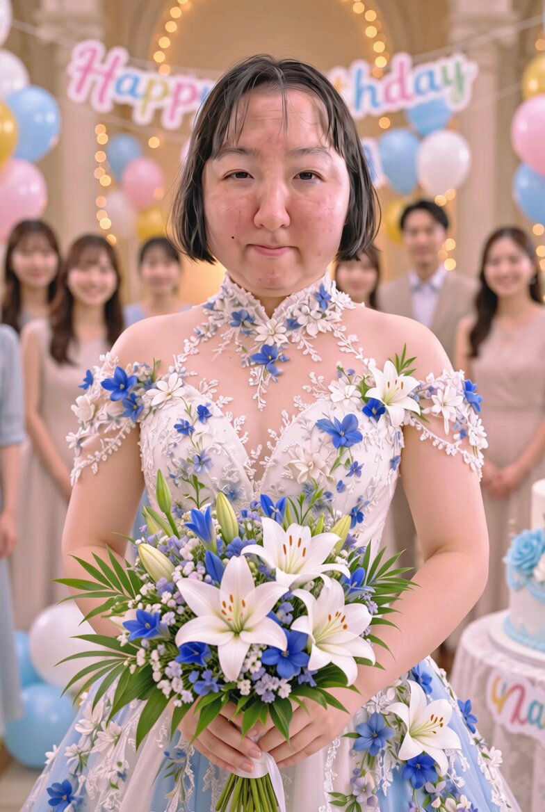

**提示詞**

```text
營造出慶祝9月21日生日的感覺，改變整體氛圍
```

[↑ 返回分類目錄](#catalog)

---

<a name="prompt-2101910971338170857"></a>

### 9月21日敬老之日與生日慶祝場景的生成指示。

作者：[@mioarashidaisuk](https://x.com/mioarashidaisuk) · [查看 X 原帖](https://x.com/mioarashidaisuk/status/2101910971338170857)

其他 · 已推流

**概括:** 9月21日敬老之日與生日慶祝場景的生成指示。

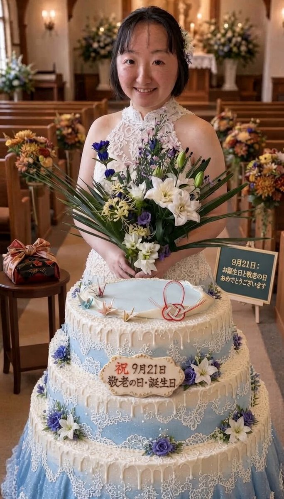

**提示詞**

```text
營造出慶祝9月21日敬老之日與生日的風格氛圍
```

[↑ 返回分類目錄](#catalog)

---

<a name="prompt-2101907083436409018"></a>

### 在內衣賣場試衣間中隨機服裝、角度與姿勢的展示場景。

作者：[@Dokislime\_TTV](https://x.com/Dokislime_TTV) · [查看 X 原帖](https://x.com/Dokislime_TTV/status/2101907083436409018)

時尚單品 · 已推流

**概括:** 在內衣賣場試衣間中隨機服裝、角度與姿勢的展示場景。

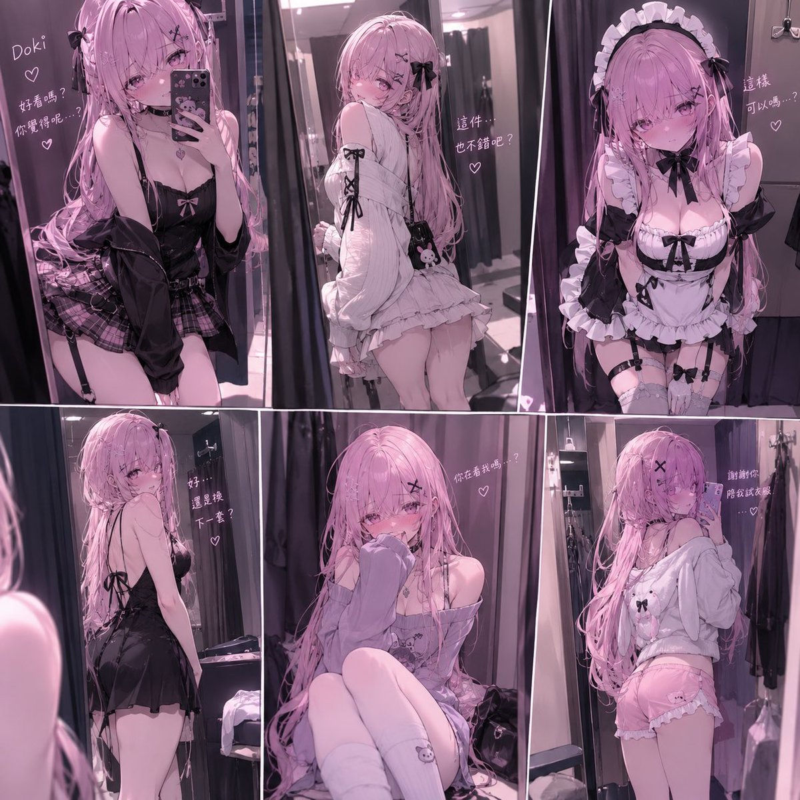

**提示詞**

```text
在內衣賣場的試衣間裡，彼此展示服裝的場景。服裝隨機，攝影機角度與姿勢隨機。
```

[↑ 返回分類目錄](#catalog)

---

<a name="prompt-2101906842322653289"></a>

### 翻譯中

作者：[@XiaoKooeye](https://x.com/XiaoKooeye) · [查看 X 原帖](https://x.com/XiaoKooeye/status/2101906842322653289)

角色 · 時尚單品 · 已推流

查看 X 原帖：[@3three\_AI](https://x.com/3three_AI) · [查看 X 原帖](https://x.com/3three_AI/status/2101507137323078057)

**概括:** 翻譯中

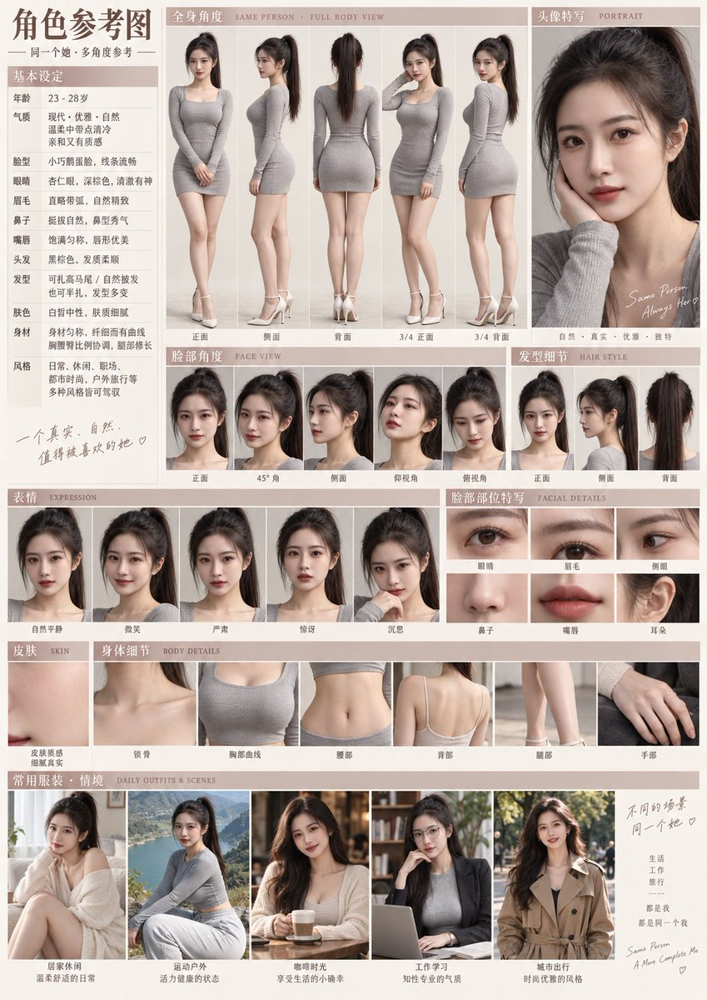

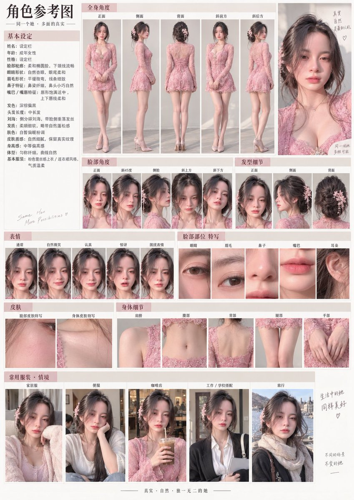

**提示詞**

```text
翻譯中
```

[↑ 返回分類目錄](#catalog)

---

<a name="prompt-2101772949695197390"></a>

### 直向 9:16 SaaS 行銷短片，描述便利貼主張以俐落的 UI 動態展開為七個容器。

作者：[@ramanpal](https://x.com/ramanpal) · [查看 X 原帖](https://x.com/ramanpal/status/2101772949695197390)

App / 網站設計 · 已推流

**概括:** 直向 9:16 SaaS 行銷短片，描述便利貼主張以俐落的 UI 動態展開為七個容器。


**提示詞**

```text
直向 9:16 行銷短片，12–15秒，無真人出鏡講解。
0–3秒 吸睛點：醒目的螢幕文字 "1 claim. 7 containers." → 一張便利貼主張滑入畫面。
3–8秒：該主張展開成7張標籤卡片（Thread A / Thread B / Image / Card / Reply / Email / Soft CTA）。
8–12秒：行事曆圖示淡出；資料庫堆疊保留 —— 文字 "Process > backlog"。
結尾卡片："Claim library. Not a content calendar. @ramanpal"
風格：淺色背景，俐落的 SaaS UI 運鏡動效，藍綠色點綴，行動裝置清晰易讀。僅搭配輕柔的 UI 點擊音效。
```

[↑ 返回分類目錄](#catalog)

---

<a name="prompt-2101822975771107383"></a>

### 描繪星艦前往火星之旅的藝術作品

作者：[@JoshuaBalianSR](https://x.com/JoshuaBalianSR) · [查看 X 原帖](https://x.com/JoshuaBalianSR/status/2101822975771107383)

其他 · 已推流

**概括:** 描繪星艦前往火星之旅的藝術作品


**提示詞**

```text
描繪星艦前往火星之旅的藝術作品
```

[↑ 返回分類目錄](#catalog)

---

<a name="prompt-2101789231295103103"></a>

### 五隻動物（鵝、鴨、雞、老鼠、戴禮帽的螳螂）垂直堆疊的超現實棚拍肖像。

作者：[@TrigonRed](https://x.com/TrigonRed) · [查看 X 原帖](https://x.com/TrigonRed/status/2101789231295103103)

人像 / 自拍 · 動物 / 生物 · 已推流

**概括:** 五隻動物（鵝、鴨、雞、老鼠、戴禮帽的螳螂）垂直堆疊的超現實棚拍肖像。


**提示詞**

```text
純灰色背景下的超現實棚拍肖像：一隻鵝站在最底部，一隻鴨子站在鵝的背上，一隻雞站在鴨子的背上，一隻老鼠站在雞的背上，一隻戴著高頂禮帽且手拿拐杖的螳螂站在老鼠的背上。所有五隻動物均清晰完整可見，構成一座平衡的垂直高塔。逼真的解剖構造與紋理質感，柔和的攝影棚光線，細緻的接觸陰影，以及簡潔優雅的構圖。
```

[↑ 返回分類目錄](#catalog)

---

<a name="prompt-2101786964525510875"></a>

### 一位客人在餐廳裡吃披薩，女服務生端來啤酒。

作者：[@jaras70berlin](https://x.com/jaras70berlin) · [查看 X 原帖](https://x.com/jaras70berlin/status/2101786964525510875)

食物 / 飲品 · 已推流

**概括:** 一位客人在餐廳裡吃披薩，女服務生端來啤酒。


**提示詞**

```text
我在一家餐廳裡。我正在吃美味的披薩。女服務生端給我一杯啤酒。
```

[↑ 返回分類目錄](#catalog)

---

<a name="prompt-2101778282022891851"></a>

### 中國唐代士兵執兵器在城門盤查行人。

作者：[@mtrainier2020](https://x.com/mtrainier2020) · [查看 X 原帖](https://x.com/mtrainier2020/status/2101778282022891851)

其他 · 已推流

查看 X 原帖：[@mtrainier2020](https://x.com/mtrainier2020) · [查看 X 原帖](https://x.com/mtrainier2020/status/2101555565214461970)

**概括:** 中國唐代士兵執兵器在城門盤查行人。


**提示詞**

```text
中國唐代的士兵拿著兵器站在城門口盤查過往行人.
```

[↑ 返回分類目錄](#catalog)

---

<a name="prompt-2101657101269651488"></a>

### 一位女性在熱吻伴侶之前向其表達愛意。

作者：[@ra41387062](https://x.com/ra41387062) · [查看 X 原帖](https://x.com/ra41387062/status/2101657101269651488)

角色 · 已推流

**概括:** 一位女性在熱吻伴侶之前向其表達愛意。


**提示詞**

```text
我的公雞，我好愛你，給我一個熱情的吻 🐓🫀❤️💋
```

[↑ 返回分類目錄](#catalog)

---

<a name="prompt-2101660193381839042"></a>

### 要求女性角色向坐著的男子告白並深情接吻的提示詞。

作者：[@ra41387062](https://x.com/ra41387062) · [查看 X 原帖](https://x.com/ra41387062/status/2101660193381839042)

角色 · 已推流

**概括:** 要求女性角色向坐著的男子告白並深情接吻的提示詞。


**提示詞**

```text
我的公雞我好愛你，給我一個熱吻吧 🐓🫀❤️💋
```

[↑ 返回分類目錄](#catalog)

---

<a name="prompt-2101765841872101573"></a>

### 《進擊的巨人》風格的超大型巨人從地球軌道踏入沿海城市旁的海洋。

作者：[@magsimich](https://x.com/magsimich) · [查看 X 原帖](https://x.com/magsimich/status/2101765841872101573)

風景 / 大自然 · 已推流

查看 X 原帖：[@0x\_fokki](https://x.com/0x_fokki) · [查看 X 原帖](https://x.com/0x_fokki/status/2099566345511657974)

**概括:** 《進擊的巨人》風格的超大型巨人從地球軌道踏入沿海城市旁的海洋。


**提示詞**

```text
《進擊的巨人》風格的超大型巨人，肌肉外露、沒有皮膚，佇立在沿海城市上空的地球軌道上，一隻巨大的腳踏入海洋，掀起水牆與雲浪，光頭聳立於大氣層之上，逼真航拍視角，腳跟下方是微小的建築物，戲劇性陽光，電影級IMAX規模
```

[↑ 返回分類目錄](#catalog)

---

<a name="prompt-2101728827819135413"></a>

### Tesla CyberSUV 概念車越野行駛。

作者：[@HarveyJS](https://x.com/HarveyJS) · [查看 X 原帖](https://x.com/HarveyJS/status/2101728827819135413)

其他 · 已推流

**概括:** Tesla CyberSUV 概念車越野行駛。


**提示詞**

```text
Grok 設計的 Tesla CyberSUV
```

[↑ 返回分類目錄](#catalog)

---

<a name="prompt-2101707177429705051"></a>

### 一個關於將精英比作擁有全球觸手的巨章魚的隱喻性提示詞。

作者：[@Masssiana](https://x.com/Masssiana) · [查看 X 原帖](https://x.com/Masssiana/status/2101707177429705051)

其他 · 已推流

**概括:** 一個關於將精英比作擁有全球觸手的巨章魚的隱喻性提示詞。


**提示詞**

```text
不到1000名精英的頭目今天攻擊了俄羅斯，不是德國、北約或作為整個民族的烏克蘭。
這1000人是巨章魚的頭部，而他們的觸手是北約、德國、歐洲、烏克蘭等等。
```

[↑ 返回分類目錄](#catalog)

---

<a name="prompt-2101712266190258322"></a>

### 描繪了一名身穿緊身、高開衩並配有吊襪帶的黑色旗袍角色，帶著傲慢目光倚靠在哥德式牆面上的提示詞。

作者：[@sha1shashasha](https://x.com/sha1shashasha) · [查看 X 原帖](https://x.com/sha1shashasha/status/2101712266190258322)

角色 · 已推流

**概括:** 描繪了一名身穿緊身、高開衩並配有吊襪帶的黑色旗袍角色，帶著傲慢目光倚靠在哥德式牆面上的提示詞。


**提示詞**

```text
1.4::黑色旗袍裙，緊身旗袍::, 1.3::高側開衩::, 1.4::大腿吊襪帶::, 1.3::黑色過膝長筒襪::, 1.3::露出大腿，立領::, 1.2::盤扣，黑色光澤面料::,

1.3::雙臂交叉，倚靠在牆上::, 1.3::低角度，俯視觀者::, 1.2::傲慢的目光::, 冷冽氛圍,

1.2::華麗的哥德式室內背景::, 1.2::銀色調光影，戲劇性陰影::, 七分身鏡頭
```

[↑ 返回分類目錄](#catalog)

---

<a name="prompt-2101659578127511996"></a>

### 陰影向前蔓延，逼近一張面朝大海的木椅。

作者：[@GlennHasABeard](https://x.com/GlennHasABeard) · [查看 X 原帖](https://x.com/GlennHasABeard/status/2101659578127511996)

風景 / 大自然 · 已推流

**概括:** 陰影向前蔓延，逼近一張面朝大海的木椅。


**提示詞**

```text
陰影的邊緣向椅子蔓延。最終狀態：陰影的邊緣到達椅子的腿部。
```

[↑ 返回分類目錄](#catalog)

---

<a name="prompt-2101693353012404308"></a>

### 基於角色外貌生成2x2四分割列印證件照相紙的提示詞模板。

作者：[@OiCLhoXau40xUBx](https://x.com/OiCLhoXau40xUBx) · [查看 X 原帖](https://x.com/OiCLhoXau40xUBx/status/2101693353012404308)

角色 · 已推流

**概括:** 基於角色外貌生成2x2四分割列印證件照相紙的提示詞模板。


**提示詞**

```text
[角色外貌提示詞 / + 附上一張供GPT參考的樣本外貌圖片]，逼真的真人寫實詮釋，正式護照證件照，端莊得體的外表，正對鏡頭，置中對稱構圖，表情自然平靜，直視鏡頭，整齊的髮型，乾淨簡潔的服裝，純色淺灰色棚拍背景，柔和均勻的證件照光線，頭肩胸部取景，單張列印相紙上呈2x2網格排列的四張相同證件照，逼真的實體相片沖印質感，細微的像素級模糊，輕微的壓縮雜訊與自然的相機噪點，真實的沖印店相片品質，高度寫實，不過度修飾，無AI感 / 依此輸出影像。
```

[↑ 返回分類目錄](#catalog)

---

<a name="prompt-2101706509264601555"></a>

### 一個關於章魚的隱喻提示詞，其頭部為菁英，觸手代表北約、德國、歐洲和烏克蘭。

作者：[@Masssiana](https://x.com/Masssiana) · [查看 X 原帖](https://x.com/Masssiana/status/2101706509264601555)

海報／傳單 · 已推流

**概括:** 一個關於章魚的隱喻提示詞，其頭部為菁英，觸手代表北約、德國、歐洲和烏克蘭。


**提示詞**

```text
今天，不到1000名菁英成員攻擊了俄羅斯，而不是作為整個國家的德國、北約或烏克蘭。
這1000人是章魚的頭部，其觸手則是北約、德國、歐洲、烏克蘭等更多。
```

[↑ 返回分類目錄](#catalog)

---

<a name="prompt-2101569996690432407"></a>

### 一段移軸微距透視模型影片，展示微縮歷史場景中一隻巨大的人手援助苦苦掙扎的古代士兵。

作者：[@EthanAIBuilder](https://x.com/EthanAIBuilder) · [查看 X 原帖](https://x.com/EthanAIBuilder/status/2101569996690432407)

其他 · 已推流

查看 X 原帖：[@EthanAIBuilder](https://x.com/EthanAIBuilder) · [查看 X 原帖](https://x.com/EthanAIBuilder/status/2101560054638154020)

**概括:** 一段移軸微距透視模型影片，展示微縮歷史場景中一隻巨大的人手援助苦苦掙扎的古代士兵。


**提示詞**

```text
微縮歷史戰爭與災難世界的超逼真移軸微距攝影影片序列。電影級微距鏡頭，定格動畫微縮透視模型美學，8k解析度，垂直9:16長寬比。

場景1：泥濘戰壕中微小的古代士兵正用沙袋抵擋洶湧泥濘的河水洪流；一隻巨大的人手放置了一大團黏土來堵住大壩上的一個主要缺口，而微小的士兵們緊緊攀住並鬆了一口氣。
場景2：身披盔甲的微小古代中國士兵在被圍困的殘破要塞城牆內休息，背景火光四起；一隻巨大的人手將微縮栗子、一顆粽子和一個小水囊投入一個破裂的陶罐中，餵食疲憊不堪的士兵，士兵們帶著敬畏與感激仰望。

電影級景深，精緻紋理，流暢動作 --ar 9:16
```

[↑ 返回分類目錄](#catalog)

---

<a name="prompt-2101428619725734323"></a>

### 身著發光石與青銅鎧甲的華麗鋼鐵之神全身繪畫構圖。

作者：[@RobotCleopatra](https://x.com/RobotCleopatra) · [查看 X 原帖](https://x.com/RobotCleopatra/status/2101428619725734323)

其他 · 已推流

**概括:** 身著發光石與青銅鎧甲的華麗鋼鐵之神全身繪畫構圖。


**提示詞**

```text
宏大的全身儀式感構圖，站立人物從頭飾到鞋履完整呈現、毫無遮擋，鋼鐵之神，燃燒的琥珀色雙眸，鍛爐灼傷的雙手，神聖偉力，科幻，高科技裝甲，全息界面，發光的能量核心，他的目光直視鏡頭如烈火燃燒，皮膚溫暖且充滿生機並帶有皮下散射輝光，髮絲在上升氣流中揚起，身穿遠古泰坦之王華麗的石與青銅華服，每個比例都展現出歲月滄桑的尺度，斗篷織物中閃爍繁星，眼中蘊含浩瀚宇宙，腳下地面散落著落花與餘燼，鎧甲護腿與戰靴完整刻畫，身處超越時間的偉大命運織機之中，每根絲線皆清晰可見一條生命，歷史的巨幅織錦正在編織，溫暖的琥珀色光芒灑在每根絲線上，大膽的原色三色組，純淨飽和的深紅、深邃的皇家藍與耀眼的金色，乾淨分明的色塊，絕無混濁色調，經典美漫封面風格的寫實繪畫傑作，水粉與油畫質感，大膽英勇的原色，標誌性豐碑式姿態，戲劇性理想光影，大膽飽和色彩，華麗裝飾性，生動隨性的站姿，栩栩如生的人物，從頭到腳全身，清晰對焦，超細節8k
```

[↑ 返回分類目錄](#catalog)

---

<a name="prompt-2101638000207630824"></a>

### 翻譯中

作者：[@HObE4TLMga99335](https://x.com/HObE4TLMga99335) · [查看 X 原帖](https://x.com/HObE4TLMga99335/status/2101638000207630824)

其他 · 已推流

查看 X 原帖：[@HObE4TLMga99335](https://x.com/HObE4TLMga99335) · [查看 X 原帖](https://x.com/HObE4TLMga99335/status/2101150285498314926)

**概括:** 翻譯中


**提示詞**

```text
翻譯中
```

[↑ 返回分類目錄](#catalog)

---

<a name="prompt-2101644987809018175"></a>

### 鑲嵌於板岩中的未來技術化石，呈現為科學博物館標本。

作者：[@hmontilla\_](https://x.com/hmontilla_) · [查看 X 原帖](https://x.com/hmontilla_/status/2101644987809018175)

其他 · 已推流

**概括:** 鑲嵌於板岩中的未來技術化石，呈現為科學博物館標本。


**提示詞**

```text
在一塊破開的板岩中發現的[尚不存在的技術]化石，該物體結合了礦物、氧化金屬與半透明電路，如地質礦脈般保存下來，科學博物館標本的超細緻微距攝影，微俯視角，居中構圖，深色保存台，受控的展覽照明，木炭色、氧化銅色、極為微妙的青色與琥珀色調色盤，逼真、神秘且具考古可信度，無人物，無標誌，無可辨識文字，無浮水印，1:1方形比例
```

[↑ 返回分類目錄](#catalog)

---

<a name="prompt-2101565768932663386"></a>

### 穿著比基尼跳動並撫摸胸部的女人。

作者：[@Jr1301387296491](https://x.com/Jr1301387296491) · [查看 X 原帖](https://x.com/Jr1301387296491/status/2101565768932663386)

角色 · 已推流

**概括:** 穿著比基尼跳動並撫摸胸部的女人。


**提示詞**

```text
穿著比基尼跳動撫摸胸部
```

[↑ 返回分類目錄](#catalog)

---

<a name="prompt-2101416885312987365"></a>

### 移除媽媽，換上一座喬·帕特諾（Joe Paterno）的雕像

作者：[@TomTxd101](https://x.com/TomTxd101) · [查看 X 原帖](https://x.com/TomTxd101/status/2101416885312987365)

其他 · 已推流

**概括:** 移除媽媽，換上一座喬·帕特諾（Joe Paterno）的雕像


**提示詞**

```text
移除媽媽，換上一座喬·帕特諾（Joe Paterno）的雕像
```

[↑ 返回分類目錄](#catalog)

---

<a name="prompt-2101451619636527560"></a>

### 身穿絕地長袍的亞當·崔佛擁抱著一名女子。

作者：[@AuntyCrass](https://x.com/AuntyCrass) · [查看 X 原帖](https://x.com/AuntyCrass/status/2101451619636527560)

角色 · 已推流

**概括:** 身穿絕地長袍的亞當·崔佛擁抱著一名女子。


**提示詞**

```text
加入身穿絕地長袍的亞當·崔佛擁抱她
```

[↑ 返回分類目錄](#catalog)

---

<a name="prompt-2101434300046643486"></a>

### 一名年輕女性身穿棕色仿皮草領飛行員夾克、羅紋背心與炭黑色寬版西裝褲的全身棚拍時尚肖像提示詞。

作者：[@PrometheanAIX](https://x.com/PrometheanAIX) · [查看 X 原帖](https://x.com/PrometheanAIX/status/2101434300046643486)

人像 / 自拍 · 角色 · 時尚單品 · 已推流

查看 X 原帖：[@PrometheanAIX](https://x.com/PrometheanAIX) · [查看 X 原帖](https://x.com/PrometheanAIX/status/2101349304468164968)

**概括:** 一名年輕女性身穿棕色仿皮草領飛行員夾克、羅紋背心與炭黑色寬版西裝褲的全身棚拍時尚肖像提示詞。


**提示詞**

```text
創作一張超寫實的全身女性時尚肖像，主角是一位美麗的年輕女性，擁有精緻的模特兒般五官、自然的皮膚紋理、清晰可見的毛孔、逼真的髮絲以及真實可信的身體構造。她留著及肩的板栗棕色頭髮，柔和的中分造型，展現平靜而自信的神情。保留真實的布料質感、細微的瑕疵以及真正時尚攝影的自然面貌，避免塑膠感皮膚、人工柔焦或過度修飾的AI生成感。

攝影與構圖美學
乾淨的高端棚拍時尚攝影，採用從頭到腳的全身構圖、平視視角與50–70mm鏡頭美學。柔和漫射的攝影棚光線營造出平緩的陰影、自然的膚色、逼真的皮革反光以及清晰的布料細節。微妙的對比度、中性色調調色與俐落的時尚大片銳利度。

環境
極簡米白色攝影棚背景，搭配淺灰色水泥地面，牆面與地面之間呈現細膩的水平過渡。背景保持純粹、低調，無任何道具或干擾視覺的雜物。

姿勢
她正對鏡頭站立，呈現放鬆的不對稱站姿，雙手隨興插在褲子口袋中。重心主要落在單腳，另一隻腳微向外側展開。肩膀放鬆，臀部微偏，直視鏡頭，流露平靜且從容自信的表情。

服裝造型
一件中棕色短款皮革飛行員夾克，配有柔軟的灰褐色仿皮草領、立體肩部剪裁、前拉鍊開襟、兩個拉鍊胸袋與彈性袖口。夾克敞開穿著，內搭貼身米白色羅紋背心，下擺微抓皺，隱約露出一小截腰腹。

下半身搭配高腰炭黑色打褶寬版西裝褲，帶有褲耳，寬鬆的輪廓自然垂落在黑色低筒皮鞋上。配件維持極簡風格，著重突顯粗獷皮夾克與精緻現代剪裁之間的對比張力。
```

[↑ 返回分類目錄](#catalog)

---

<a name="prompt-2101458878437507173"></a>

### 雨天坐計程車前往東京電玩展的自述場景。

作者：[@ahTama](https://x.com/ahTama) · [查看 X 原帖](https://x.com/ahTama/status/2101458878437507173)

其他 · 已推流

**概括:** 雨天坐計程車前往東京電玩展的自述場景。


**提示詞**

```text
因為下雨，所以坐計程車🚕前往東京電玩展。
```

[↑ 返回分類目錄](#catalog)

---

<a name="prompt-2101425970817167835"></a>

### 穿緊身內褲的壯碩東亞熟男健美動態畫面

作者：[@Bernd0202](https://x.com/Bernd0202) · [查看 X 原帖](https://x.com/Bernd0202/status/2101425970817167835)

角色 · 已推流

**概括:** 穿緊身內褲的壯碩東亞熟男健美動態畫面


**提示詞**

```text
東亞壯碩熟男，只穿緊身內褲，腳很壯，沒有皺紋，有少量性感體毛，胸部很凸很圓，乳頭突出，表情豪放開心
```

[↑ 返回分類目錄](#catalog)

---

<a name="prompt-2101114058321936723"></a>

### 黑白彼得·林德伯格風格的時尚專題攝影，一位日本女性身穿細繩丁字褲躺在床上。

作者：[@MissAI\_Show](https://x.com/MissAI_Show) · [查看 X 原帖](https://x.com/MissAI_Show/status/2101114058321936723)

人像 / 自拍 · 角色 · 已推流

**概括:** 黑白彼得·林德伯格風格的時尚專題攝影，一位日本女性身穿細繩丁字褲躺在床上。


**提示詞**

```text
1. 主體與動作
一位美麗的日本女性，約27歲，瓷白嬌嫩的肌膚，自然的灰藍色眼睛，極其精緻細膩的五官，略帶睡意剛醒的極簡妝容。極細的腰身，豐滿自然的G罩杯乳房，帶有柔軟真實的下垂感與重量感。她剛醒來，側臥/俯臥在床上，身體放鬆，害羞而直接凝視鏡頭——自然被捕捉的瞬間，優雅，成熟，毫無刻意表演。她穿著一條極細的丁字褲；臀部線條可見；胸部部分若隱若現。
2. 環境與時間
安靜臥室中簡樸凌亂的白色/象牙色純棉床。清晨，剛醒來不久。無奢華造型，無多餘道具，無飯店的奢華感。床單有睡過的痕跡。

3. 構圖與相機
橫向時尚專題構圖。全身或四分之三身。腰線作為胸部與臀部之間的結構中心。臉部最靠近鏡頭，身體穿過床單向後延伸。中片幅靜態攝影，視線水平或略微俯角，景深淺而真實。彼得·林德伯格（Peter Lindbergh）風格：非擺拍感，原始，紀實時尚。
4. 光線與風格
柔和的自然窗光，無閃光燈，無美膚光感。黑白或極度低飽和度。可見的底片顆粒，極少修圖，真實肌膚質感。寧靜、內斂、親密的頂級時尚。透過身形與眼神展現的高雅性感，而非刻意展示。

5. 限制條件
乳頭完全被床單或手臂遮蔽。私密處完全被丁字褲與姿勢遮蔽。僅穿細繩丁字褲——無其他內衣。無低俗感，無色情取景，無露骨私密處或乳頭，無未成年外貌。真實照片風格，僅限25–30歲成年女性。
```

[↑ 返回分類目錄](#catalog)

---

<a name="prompt-2101295448661303530"></a>

### 基於輸入照片生成上下等分的3:4海報：上半部為原圖微調，下半部為層次分明的剪紙藝術再現，融入精美雜誌排版。

作者：[@SadiaMalik182](https://x.com/SadiaMalik182) · [查看 X 原帖](https://x.com/SadiaMalik182/status/2101295448661303530)

海報／傳單 · 文字 / 字體排版 · 已推流

**概括:** 基於輸入照片生成上下等分的3:4海報：上半部為原圖微調，下半部為層次分明的剪紙藝術再現，融入精美雜誌排版。


**提示詞**

```text
為每張上傳的照片分別製作一張獨立的編輯風格海報。請勿製作拼貼畫。每張照片需單獨處理並輸出。

採用嚴格的 3:4 縱向構圖，水平等分為兩個完全相同的部分，各佔畫布的 50%。

上半部分 —— 原始攝影
保留原照片。保持主體不變，同時保留其真實的質感、自然光線和原有的色彩氛圍。僅進行微細的編輯級色彩校正，以營造出藝術雜誌、獨立出版物或展覽攝影的精緻質感。

為了符合構圖，您可以適度延伸天空、地面或周圍的環境背景，但切勿拉伸、扭曲或改變主體。

下半部分 —— 多層次剪紙/紙藝重新詮釋
將照片中最具辨識度的主體、輪廓、姿態和空間關係，重新詮釋為極簡的多層次剪紙/紙藝構圖。

以一個主要主體作為視覺焦點。請勿機械式地複製每個細節。相反地，應透過摺疊、剪裁、分層和重疊來重構關鍵輪廓、比例和結構。

僅將少數輔助性的環境元素轉化為前景、中景和背景的紙張圖層。運用比例對比、留白、俐落對齊與前後分層，使主體一眼即可辨識，同時保持克制的編輯排版構圖。

色彩與材質
從原照片中擷取最具特色和辨識度的色彩，將其精簡為一套有限且和諧的紙藝色盤。

使用溫暖的象牙白或淺色紙張作為基底，並輔以少量較強烈的強調色、較深的結構色調、柔和的過渡圖層色彩以及極少數的高光。

材質應呈現出高級啞光卡紙的質感，帶有細微可見的紙張纖維、俐落的裁切邊緣以及自然漫射光下的柔和接觸陰影。強調真實手工紙藝的觸感品質。

避免塑膠般的反光 3D 效果、廉價手工紙美感、霓虹色以及過度飽和或複雜的漸層。

編輯排版系統
加入精緻的編輯排版系統。根據主體的身份、位置、動作、材質、情感或象徵意義，設計一個簡短的主標題。

加入 2–4 組較小的輔助文字。這些可以包括物體名稱、地點資訊、數字、序號標記、類似座標的數字、方位詞、狀態詞、材質描述、分類標籤或極短的詩意短語。

請勿使用任何年份或日期。

主標題應傳達情感與身份，而較小的文字則應增添節奏、結構與精緻感。

排版整合
將排版自然融入構圖中，使其與剪紙形態產生互動。沿著紙層邊緣、主體輪廓、幾何軸線或留白區域排列文字。

採用橫排或直排、旋轉文字、寬鬆字距、邊緣對齊、角落配置、跨區版面、嵌入式排版或部分重疊的文字。

主標題可帶有微細的剪紙或摺紙質感，而輔助文字則應保持纖細、現代、克制且精準。

最終成果應呈現出優雅、具觸覺感、平衡、富有藝術指導感且風格鮮明的編輯質感。
```

[↑ 返回分類目錄](#catalog)

---

<a name="prompt-2101294459711263101"></a>

### 想像一個 grok 漢堡

作者：[@VanessaJoeiy](https://x.com/VanessaJoeiy) · [查看 X 原帖](https://x.com/VanessaJoeiy/status/2101294459711263101)

其他 · 已推流

**概括:** 想像一個 grok 漢堡


**提示詞**

```text
想像一個 grok 漢堡
```

[↑ 返回分類目錄](#catalog)

---

<a name="prompt-2101298207745540237"></a>

### Grok 漢堡生成提示詞

作者：[@VanessaJoeiy](https://x.com/VanessaJoeiy) · [查看 X 原帖](https://x.com/VanessaJoeiy/status/2101298207745540237)

其他 · 已推流

**概括:** Grok 漢堡生成提示詞


**提示詞**

```text
想像一個 Grok 漢堡
```

[↑ 返回分類目錄](#catalog)

---

<a name="prompt-2101048359973007552"></a>

### 音樂盒上的生日卡片與出聲祝福的影片場景

作者：[@Z8YxUEUzCCdCEI1](https://x.com/Z8YxUEUzCCdCEI1) · [查看 X 原帖](https://x.com/Z8YxUEUzCCdCEI1/status/2101048359973007552)

其他 · 已推流

**概括:** 音樂盒上的生日卡片與出聲祝福的影片場景


**提示詞**

```text
為原住民的他製作的生日快樂卡片，一張蘊含著愛、信任、夢想與希望之祝福的卡片被放在音樂盒上，一邊親口說出「happy birthday」一邊送上祝福的影片風格場景
```

[↑ 返回分類目錄](#catalog)

---

<a name="prompt-2101047785563066843"></a>

### 音樂盒上的生日卡片以及送上祝福的原住民男性的影片風格場景。

作者：[@Z8YxUEUzCCdCEI1](https://x.com/Z8YxUEUzCCdCEI1) · [查看 X 原帖](https://x.com/Z8YxUEUzCCdCEI1/status/2101047785563066843)

角色 · 已推流

**概括:** 音樂盒上的生日卡片以及送上祝福的原住民男性的影片風格場景。


**提示詞**

```text
送給原住民他的生日快樂卡片，一張傾注了愛、信任、夢想與希望的祝福所製作的卡片放在音樂盒上，親口說著「happy birthday」送上祝福的影片風格場景
```

[↑ 返回分類目錄](#catalog)

---

<a name="prompt-2100930502383517757"></a>

### 巴黎聖母院廣場的鋼琴協奏曲演奏。

作者：[@AndalaLabs](https://x.com/AndalaLabs) · [查看 X 原帖](https://x.com/AndalaLabs/status/2100930502383517757)

產品 · 已推流

**概括:** 巴黎聖母院廣場的鋼琴協奏曲演奏。


**提示詞**

```text
在巴黎聖母院前廣場舉行的鋼琴協奏曲演出
```

[↑ 返回分類目錄](#catalog)

---

<a name="prompt-2101033686162427912"></a>

### 用於生成完全由材料或自然現象組成的動物的提示詞範本。

作者：[@hmontilla\_](https://x.com/hmontilla_) · [查看 X 原帖](https://x.com/hmontilla_/status/2101033686162427912)

動物 / 生物 · 已推流

**概括:** 用於生成完全由材料或自然現象組成的動物的提示詞範本。


**提示詞**

```text
完全由[材料或自然現象]構成的[動物]，逼真的解剖結構，細緻的質感紋理，電影級光影，氛圍感背景，時尚雜誌級超現實主義攝影，極致細節
```

[↑ 返回分類目錄](#catalog)

---

<a name="prompt-2100668730359394678"></a>

### 翻譯中

作者：[@Anaiappai](https://x.com/Anaiappai) · [查看 X 原帖](https://x.com/Anaiappai/status/2100668730359394678)

產品 · 已推流

**概括:** 翻譯中


**提示詞**

```text
翻譯中
```

[↑ 返回分類目錄](#catalog)

---

<a name="prompt-2100557439556849968"></a>

### 指令角色展示肌肉、叫喚並四肢著地變身

作者：[@mikeb5222094828](https://x.com/mikeb5222094828) · [查看 X 原帖](https://x.com/mikeb5222094828/status/2100557439556849968)

角色 · 已推流

**概括:** 指令角色展示肌肉、叫喚並四肢著地變身


**提示詞**

```text
讓他緊繃肌肉並嘶叫，同時四肢著地，長出蹄子，當他四肢趴下時，一根尾巴從他的短褲裡冒出來
```

[↑ 返回分類目錄](#catalog)

---

<a name="prompt-2100716874048971156"></a>

### 用於生成角色設定表的主提示詞，展示照片參考的摩托車如何在各個漸進階段合乎邏輯地變形為類人英雄機器人。

作者：[@er1029iu](https://x.com/er1029iu) · [查看 X 原帖](https://x.com/er1029iu/status/2100716874048971156)

角色 · 車輛 · 已推流

**概括:** 用於生成角色設定表的主提示詞，展示照片參考的摩托車如何在各個漸進階段合乎邏輯地變形為類人英雄機器人。


**提示詞**

```text
通用摩托車 → 英雄機器人
變形角色設定表主提示詞

仔細分析所提供的摩托車照片，並將摩托車本身作為絕對的視覺參考。

切勿預先假設摩托車型號、配色方案、車身風格或機械配置。

首先，對上傳照片中顯示的實際摩托車進行視覺分析。

自動識別並保留其最具辨識度的視覺特徵，包括：

摩托車類型和整體輪廓、
車身比例、
主色和副色、
烤漆車身面板、
前輪和後輪、
車輪尺寸和厚度、
輪胎、
輪圈、
前叉、
後懸吊、
引擎或馬達組件、
排氣系統、
車架、
油箱或中央車身結構、
座椅形狀和材質、
車手把、
後視鏡、
頭燈、
尾燈、
方向燈、
前土除和後土除、
置物箱或行李裝備（若有）、
擋風鏡（若有）、
腳踏板或腳蹬、
外露線材、
機械關節、
貼花與圖案位置、
表面刮痕、
烤漆磨損、
灰塵、
老化材質、
以及參考圖中可見的其他獨特物理細節。

最終的機器人必須清楚保留「這輛確切摩托車」的視覺DNA。

觀看者應能立刻聯想到：

「那個機器人是由那輛摩托車變形而來的。」

==================================================
角色設定表概念
==================================================

創建一張電影質感的變形角色設定表，展示一輛摩托車逐步變形為一個類人英雄機器人。

將變形展示為一個清晰的物理漸進過程：

階段 1：
原始摩托車。

摩托車幾乎保持完全未變，且清晰可辨。

階段 2：
早期機械啟動。

小塊車身面板輕微分離。

機械鎖釋放。

懸吊組件產生位移。

內部機械結構變得清晰可見。

摩托車仍須保持大約 80–90% 的辨識度。

階段 3：
中期變形。

車輪自然重新定位。

底盤開始伸展。

現有的摩托車組件進行旋轉、展開、滑動並重新連接。

類人形狀的雙腿、軀幹和雙臂雛形顯現。

摩托車保持大約 50–70% 的辨識度。

階段 4：
高級變形。

原始摩托車車身面板轉變為裝甲。

車輪自然融入機器人解剖結構中。

排氣管轉變為可辨識的機械裝甲組件。

車手把、後視鏡、車燈、懸吊、車架、座椅、行李裝備及其他可見的摩托車組件合乎邏輯地重新分佈在機器人身上。

類人輪廓佔據主導地位。

階段 5：
完整英雄機器人。

一個完全由原始摩托車視覺特徵所打造的雄偉全身機械英雄。

==================================================
變形物理法則
==================================================

變形過程必須在機械原理上顯得真實可信。

摩托車的每個主要組件在最終機器人上都應有合理的歸宿。

零件圍繞逼真的鉸鏈旋轉。

面板沿機械滑軌滑動。

車架透過套筒式結構延伸。

懸吊組件轉變為具備功能性的機械關節。

現有的摩托車組件轉變為裝甲而非直接消失。

車輪保持物理上的可辨識性。

排氣管保持可辨識。

原始的烤漆面板保持可辨識。

只要物理上可行，獨特的摩托車配件均應保持可辨識。

嚴禁瞬間形變（morphing）。

嚴禁液態金屬變形。

嚴禁魔法般的置換替代。

嚴禁零件隨機瞬間傳送。

嚴禁摩托車主要組件無故消失。

嚴禁使用千篇一律的普通機器人替代該摩托車。

變形過程應讓人感到緩慢、厚重、沉穩且在物理構造上相互連結。
```

[↑ 返回分類目錄](#catalog)

---

<a name="prompt-2100509464021664158"></a>

### iPhone相簿格狀截圖形式的女教師日常反差圖提示詞

作者：[@boniusex](https://x.com/boniusex) · [查看 X 原帖](https://x.com/boniusex/status/2100509464021664158)

其他 · 已推流

查看 X 原帖：[@boniusex](https://x.com/boniusex) · [查看 X 原帖](https://x.com/boniusex/status/2100213110791389581)

**概括:** iPhone相簿格狀截圖形式的女教師日常反差圖提示詞


**提示詞**

```text
iPhone相簿截圖 × 教師的規矩外殼 × 已經失控的局部 × 教師證永遠沒摘
```

[↑ 返回分類目錄](#catalog)

---

<a name="prompt-2100824363100672251"></a>

### 3×3九宮格排布的海灘戲水搞怪/失敗抓拍照

作者：[@MrGafish](https://x.com/MrGafish) · [查看 X 原帖](https://x.com/MrGafish/status/2100824363100672251)

其他 · 已推流

**概括:** 3×3九宮格排布的海灘戲水搞怪/失敗抓拍照


**提示詞**

```text
海邊戲水拍攝的各種失敗照片，3×3 九宮格排列，9:16 豎式構圖
```

[↑ 返回分類目錄](#catalog)

---

<a name="prompt-2100794107845070903"></a>

### 1999年豐田Corolla廣告

作者：[@freedom7\_4\_1776](https://x.com/freedom7_4_1776) · [查看 X 原帖](https://x.com/freedom7_4_1776/status/2100794107845070903)

產品行銷 · 已推流

**概括:** 1999年豐田Corolla廣告


**提示詞**

```text
1999年豐田Corolla廣告
```

[↑ 返回分類目錄](#catalog)

---

<a name="prompt-2100721468363719074"></a>

### 10秒可口可樂直式廣告，細緻展現冰塊、開蓋、飛濺及最終英雄構圖場景。

作者：[@FuturoemTeste](https://x.com/FuturoemTeste) · [查看 X 原帖](https://x.com/FuturoemTeste/status/2100721468363719074)

產品行銷 · 已推流

**概括:** 10秒可口可樂直式廣告，細緻展現冰塊、開蓋、飛濺及最終英雄構圖場景。


**提示詞**

```text
創建一支10秒的高端可口可樂直式（9:16）廣告，具備8K逼真寫實質感、超細膩的高速飲品電影級攝影、戲劇性的電影級紅色燈光，以及清爽宜人的冰塊與水花飛濺氛圍。

概念：冰塊 → 水花飛濺 → 瓶身展現 → 液體衝擊 → 多瓶英雄構圖

01 | 0–1.2秒 — 冰塊衝擊
晶瑩剔透的冰塊在標誌性的可口可樂亮紅色環境中炸裂的極致特寫。冰水水滴和細小的冰粒在戲劇性的慢動作中飛向鏡頭。強烈的逆光營造出閃爍璀璨的反光。

02 | 1.2–2.4秒 — 瓶身展現
一瓶冰鎮的可口可樂玻璃瓶穿透水流與冰塊破空而出，在空中自然旋轉。標誌性的曲線瓶（contour bottle）身形、紅色標籤、白色標誌、銀色金屬瓶蓋和逼真的凝結水珠始終保持完美清晰與精確。

03 | 2.4–3.6秒 — 清爽飛濺
一股強勁的可口可樂浪湧圍繞瓶身劇烈碰撞。特寫水滴環繞產品，鏡頭快速推進穿過水花。

04 | 3.6–4.8秒 — 開蓋與氣泡升騰
玻璃瓶頸與金屬蓋的極致特寫。瓶蓋伴隨逼真的開汽釋放氣體，產生細小氣泡和清爽的水霧。

05 | 4.8–6.0秒 — 液體流動
深色可口可樂液體在瓶身周圍形成優美流暢的波浪，營造出極具動感與雕塑感的水花飛濺。冰塊和水滴自然地穿過畫面。

06 | 6.0–7.2秒 — 瓶群序列
多隻可口可樂瓶在不同的景深處浮現，在紅色環境中漂浮並旋轉。水痕與冰粒伴隨運動，營造出高端且充滿活力的廣告視覺效果。

07 | 7.2–8.6秒 — 英雄級陣列
三隻可口可樂瓶流暢地匯聚成引人矚目的產品構圖。一瓶在前景中醒目突出，其餘兩瓶置於後方。密集的凝結水珠、逼真的倒影以及水滴凸顯出冰爽透涼的感覺。

08 | 8.6–10秒 — 最終英雄主鏡頭（HERO SHOT）
電影級且純粹醒目的產品主視覺：覆滿冰晶的可口可樂瓶，環繞著懸浮的水珠與輕微飛濺的可口可樂液體。深邃飽滿且充滿活力的紅色背景、帶有光芒的攝影棚反光、戲劇性的輪廓光（rim light）。鏡頭平穩向前推進（push-in）。

產品規範：嚴格保留可口可樂曲線瓶（Contour bottle）的精確比例、紅色標籤設計、白色可口可樂標誌/字體、排版、銀白色金屬蓋以及整體包裝品牌形象。不得重新設計，無扭曲標誌，無拼寫錯誤，無重複標籤，無變形瓶身。

視覺風格：逼真寫實，超高端飲品廣告，8K細節，高速微距攝影，逼真的流體物理，清晰的凝結水，晶瑩剔透的冰塊，電影級景深，戲劇性的棚拍燈光，逼真反光，濃郁的紅色調氛圍，平滑鏡頭運動。

負面提示詞：模糊標誌，扭曲瓶身，變形排版，錯誤品牌，多餘標誌，變形產品，不逼真的流體物理，重複瓶身融合，低解析度，卡通外觀，塑料感液體，浮水印，文字偽影。
```

[↑ 返回分類目錄](#catalog)

---

<a name="prompt-2100716570540720516"></a>

### 身穿明治時代風格盛裝正裝並配戴勳章的年輕人們聚集在寬敞門廳或體育館內的景象。

作者：[@RainSeekerRemi](https://x.com/RainSeekerRemi) · [查看 X 原帖](https://x.com/RainSeekerRemi/status/2100716570540720516)

其他 · 已推流

**概括:** 身穿明治時代風格盛裝正裝並配戴勳章的年輕人們聚集在寬敞門廳或體育館內的景象。


**提示詞**

```text
今天早上的夢。在寬敞的機場大廳或大型學校體育館內。穿著讓人聯想到明治時代的盛裝正裝的年輕人。感覺接下來要舉行某種活動或派對。大概是某種慶祝活動。空間比畫面的5倍還要寬廣。胸前配戴著勳章。
```

[↑ 返回分類目錄](#catalog)

---

<a name="prompt-2100710897039880504"></a>

### 透過擴畫指令將 2:3 縱向影片左右擴展為 16:9 寬螢幕，同時嚴格保留原畫女性主體、動作及背景構圖。

作者：[@EndFolding79421](https://x.com/EndFolding79421) · [查看 X 原帖](https://x.com/EndFolding79421/status/2100710897039880504)

摘要 / 背景 · 已推流

**概括:** 透過擴畫指令將 2:3 縱向影片左右擴展為 16:9 寬螢幕，同時嚴格保留原畫女性主體、動作及背景構圖。


**提示詞**

```text
將提供的影片 <video 1> 嚴格作為來源，僅透過向左右兩側缺失區域進行向外擴展（outpainting），將其轉換為 16:9 寬螢幕。中央區域必須完全保留原始影片的內容，包括女性、她的動作、身體朝向、姿勢、節奏時機、攝影機角度、背景、光影、色彩和構圖。請勿重新建立或重新詮釋場景，切勿改變攝影機視角或讓女性做出不同的動作，也不要對原始片段進行裁切、縮放、拉伸或重新定位。只需將現有環境自然地向左和向右延伸，以產生順暢無縫的 16:9 影片。保持原始視覺品質，不添加雜訊、顆粒感、閃爍或畫面扭曲。無音樂。
```

[↑ 返回分類目錄](#catalog)

---

<a name="prompt-2100424342123458593"></a>

### 一段 20 秒孔版印刷風格的動畫，展示 GPU 伺服器內部一個請求的生命週期，並以種子圓點為錨點。

作者：[@SandeshRajx](https://x.com/SandeshRajx) · [查看 X 原帖](https://x.com/SandeshRajx/status/2100424342123458593)

其他 · 已推流

**概括:** 一段 20 秒孔版印刷風格的動畫，展示 GPU 伺服器內部一個請求的生命週期，並以種子圓點為錨點。


**提示詞**

```text
使用 js 製作一部影片，20 秒，一個請求在 GPU 伺服器內部的生命歷程，孔版印刷（riso）風格，以一個種子圓點為錨點。
```

[↑ 返回分類目錄](#catalog)

---

<a name="prompt-2100170328689565929"></a>

### 深色底色、配有無肩帶平口抹胸上衣與側繫帶泳褲的色彩繽紛花卉印花微型比基尼。

作者：[@AI\_money\_club](https://x.com/AI_money_club) · [查看 X 原帖](https://x.com/AI_money_club/status/2100170328689565929)

時尚單品 · 已推流

**概括:** 深色底色、配有無肩帶平口抹胸上衣與側繫帶泳褲的色彩繽紛花卉印花微型比基尼。


**提示詞**

```text
色彩繽紛的花卉印花微型比基尼，搭配小巧的無肩帶平口抹胸上衣、深中縫分離、相配的超低腰高衩泳褲，以及雙側髖部的極細繫帶。深色底色上帶有鮮豔的粉紅色、紫色、藍色、綠松石色和綠色花卉圖案。
```

[↑ 返回分類目錄](#catalog)

---

<a name="prompt-2100360689378570439"></a>

### 一位空靈脫俗的女子在暮色時分佇立於古老迷人的魔法景觀中，四周環繞著神秘古樹與發光花朵。

作者：[@InfiniteNeural](https://x.com/InfiniteNeural) · [查看 X 原帖](https://x.com/InfiniteNeural/status/2100360689378570439)

角色 · 風景 / 大自然 · 已推流

**概括:** 一位空靈脫俗的女子在暮色時分佇立於古老迷人的魔法景觀中，四周環繞著神秘古樹與發光花朵。


**提示詞**

```text
一幅非凡的超現實主義傑作，描繪了一位空靈脫俗的女子在暮色時分佇立於古老迷人的魔法景觀中，四周環繞著巨大的神秘古樹與漂浮的發光花朵。
```

[↑ 返回分類目錄](#catalog)

---

<a name="prompt-2100343972665135401"></a>

### 由巨大交錯的石質與青銅齒輪構成的奇幻峽谷，人影棲於輪齒之上。

作者：[@RealLeeForest](https://x.com/RealLeeForest) · [查看 X 原帖](https://x.com/RealLeeForest/status/2100343972665135401)

其他 · 已推流

**概括:** 由巨大交錯的石質與青銅齒輪構成的奇幻峽谷，人影棲於輪齒之上。


**提示詞**

```text
峽谷的崖壁由巨大交錯的石頭與青銅齒輪構成 谷底是一條緩緩流動的沙河 驅動著整個機械結構 齒輪在太陽升至最高點時停頓了一瞬 人影在峽谷重新啟動前靜止佇立在輪齒之上 齒輪漫步者位於齒尖 守護者正在為高處的軸心上油 孩童們騎乘在單一齒輪上 齒輪停頓 正午 正午之鎖 逼真的石頭、青銅、沙子和人物質感 電影級光影 停滯齒輪與烈日當空的強烈對比 極其精細 扣人心弦的構圖 連貫的奇幻氛圍
```

[↑ 返回分類目錄](#catalog)

---

<a name="prompt-2100349144896262406"></a>

### 太空人的遠古數據化石，蝕刻於帶有發光青色符號的數位廢墟中。

作者：[@Shinebynous](https://x.com/Shinebynous) · [查看 X 原帖](https://x.com/Shinebynous/status/2100349144896262406)

其他 · 已推流

**概括:** 太空人的遠古數據化石，蝕刻於帶有發光青色符號的數位廢墟中。


**提示詞**

```text
太空人的遠古數據化石，主體被蝕刻進數位廢墟中，其形態被編碼進失落文明的殘骸之中。神秘的電光青色符號在風化的黑曜石框架上脈動，訴說著一段關於人造永恆的被遺忘故事。
```

[↑ 返回分類目錄](#catalog)

---

<a name="prompt-2100369940817510612"></a>

### 憤怒的耶穌在美國國會扔家具並驅逐政客，配有英文文字。

作者：[@JohnnyJWhitaker](https://x.com/JohnnyJWhitaker) · [查看 X 原帖](https://x.com/JohnnyJWhitaker/status/2100369940817510612)

其他 · 已推流

**概括:** 憤怒的耶穌在美國國會扔家具並驅逐政客，配有英文文字。


**提示詞**

```text
創作一張耶穌在美國國會的圖片，他砸碎桌椅，把那些混蛋全趕出去，畫中用英文寫著：「(salgan todos de aqui paracitos」
```

[↑ 返回分類目錄](#catalog)

---

<a name="prompt-2100363903028834430"></a>

### Per c’est high（低沉的語調，嘴裡叼著一支菸）

作者：[@you8iu](https://x.com/you8iu) · [查看 X 原帖](https://x.com/you8iu/status/2100363903028834430)

其他 · 已推流

**概括:** Per c’est high（低沉的語調，嘴裡叼著一支菸）


**提示詞**

```text
Per c’est high（低沉的語調，嘴裡叼著一支菸）
```

[↑ 返回分類目錄](#catalog)

---

<a name="prompt-2100317770344718548"></a>

### 發光的彩虹之路

作者：[@owenxplore](https://x.com/owenxplore) · [查看 X 原帖](https://x.com/owenxplore/status/2100317770344718548)

其他 · 已推流

**概括:** 發光的彩虹之路


**提示詞**

```text
發光的彩虹之路
```

[↑ 返回分類目錄](#catalog)

---

<a name="prompt-2100317906399604840"></a>

### 一段連續敘事的影片場景：花園裡一位悲傷的小女孩在得到兩隻狗狗的安慰和擁抱後露出了笑容。

作者：[@Anaiappai](https://x.com/Anaiappai) · [查看 X 原帖](https://x.com/Anaiappai/status/2100317906399604840)

角色 · 已推流

**概括:** 一段連續敘事的影片場景：花園裡一位悲傷的小女孩在得到兩隻狗狗的安慰和擁抱後露出了笑容。


**提示詞**

```text
0–2.5秒

特寫鏡頭，小女孩坐在或站在花園裡房子旁。她神情悲傷，眼神略顯黯淡，看向一旁。微風輕輕吹拂她的髮絲和周圍的樹葉。鏡頭非常緩慢地推近她的臉龐。

2.5–5秒

鏡頭平緩地向下及向一側移動，顯露出正注視著她的黑狗。黑狗緩緩搖著尾巴向她走近。黃狗也抬起頭，開始向她走來。

5–7.5秒

中景。兩隻狗來到小女孩身邊。黑狗輕輕地把頭靠在她的腿上，黃狗搖著尾巴靠近。小女孩低頭看著牠們，臉上的神情開始改變。

7.5–10秒

最後的電影感特寫推鏡。小女孩蹲下身抱住兩隻狗。她輕輕閉上雙眼，浮現出一抹真摯的淺笑。狗狗們緊緊依偎在她身旁。花園裡溫暖的光芒籠罩著他們三個。
```

[↑ 返回分類目錄](#catalog)

---

<a name="prompt-2100310230110454134"></a>

### 角色「Ke醬」的模型化提示詞。

作者：[@eE50339](https://x.com/eE50339) · [查看 X 原帖](https://x.com/eE50339/status/2100310230110454134)

角色 · 已推流

**概括:** 角色「Ke醬」的模型化提示詞。


**提示詞**

```text
模型化\nKe醬
```

[↑ 返回分類目錄](#catalog)

---

<a name="prompt-2100298674664620291"></a>

### 一座宛如活體種子的山脈，內部擁有穀物與根系大廳，山峰破裂，人物在其內部廳室中穿行。

作者：[@RealLeeForest](https://x.com/RealLeeForest) · [查看 X 原帖](https://x.com/RealLeeForest/status/2100298674664620291)

建築 / 室內設計 · 風景 / 大自然 · 已推流

**概括:** 一座宛如活體種子的山脈，內部擁有穀物與根系大廳，山峰破裂，人物在其內部廳室中穿行。


**提示詞**

```text
一座本身即是一顆活體種子的山脈 樹皮如石 密實穀物與根系構成的內部大廳 山巔方才開始裂開 根系衝破較低的山坡 泥土與石塊升起 人物移向更高處的內部道路 看守者自內壁採收 高處岩架上的探索者 裂縫中的穀鳥 活根升降梯 根系風暴 逼真的樹皮、穀物、根系、石頭與人物質感 電影級光影 升騰根系與靜止山巔的強烈對比 極致細節 震撼構圖 連貫的奇幻氛圍
```

[↑ 返回分類目錄](#catalog)

---

<a name="prompt-2100184569391816833"></a>

### 變身為彷彿置身城堡般的華麗禮服提示詞。

作者：[@mioarashidaisuk](https://x.com/mioarashidaisuk) · [查看 X 原帖](https://x.com/mioarashidaisuk/status/2100184569391816833)

時尚單品 · 已推流

**概括:** 變身為彷彿置身城堡般的華麗禮服提示詞。


**提示詞**

```text
變身為彷彿置身城堡般的禮服
```

[↑ 返回分類目錄](#catalog)

---

<a name="prompt-2100235950047821853"></a>

### 翻譯中

作者：[@zerozakiyamo](https://x.com/zerozakiyamo) · [查看 X 原帖](https://x.com/zerozakiyamo/status/2100235950047821853)

角色 · 時尚單品 · 已推流

查看 X 原帖：[@mktcreativework](https://x.com/mktcreativework) · [查看 X 原帖](https://x.com/mktcreativework/status/2099604101386711552)

**概括:** 翻譯中


**提示詞**

```text
翻譯中
```

[↑ 返回分類目錄](#catalog)

---

<a name="prompt-2100225896527679977"></a>

### 翻譯中

作者：[@Hamburgerai](https://x.com/Hamburgerai) · [查看 X 原帖](https://x.com/Hamburgerai/status/2100225896527679977)

海報／傳單 · 文字 / 字體排版 · 已推流

**概括:** 翻譯中


**提示詞**

```text
翻譯中
```

[↑ 返回分類目錄](#catalog)

---

<a name="prompt-2100204805872550306"></a>

### 一個人身穿華麗、濕潤的深紅與金色科幻戰甲佇立在傾盆大雨中，配有反光面罩、橙色發光元素以及高對比度光影。

作者：[@RobotCleopatra](https://x.com/RobotCleopatra) · [查看 X 原帖](https://x.com/RobotCleopatra/status/2100204805872550306)

角色 · 已推流

**概括:** 一個人身穿華麗、濕潤的深紅與金色科幻戰甲佇立在傾盆大雨中，配有反光面罩、橙色發光元素以及高對比度光影。


**提示詞**

```text
一個人身穿華麗、濕潤的深紅與金色科幻戰甲佇立在傾盆大雨中。這套戰甲貼合身形，帶有錯綜複雜的金屬分塊、金色關節，以及胸口、手腕和頭盔上整合的發光橙色元素。深色反光面罩遮住了面部。金色的火花或雨滴在黑暗的背景中垂直落下。地面是潮濕且具反光效果的表面，泛起漣漪。戰甲上帶有細小的文字貼花，包括在右大腿護甲上以發光橙色字體呈現的「sengart」和「nara」。整體氛圍深沉陰鬱，具有高對比度的光影效果。
```

[↑ 返回分類目錄](#catalog)

---

<a name="prompt-2100231338779636202"></a>

### 翻譯中

作者：[@mioarashidaisuk](https://x.com/mioarashidaisuk) · [查看 X 原帖](https://x.com/mioarashidaisuk/status/2100231338779636202)

時尚單品 · 已推流

**概括:** 翻譯中


**提示詞**

```text
翻譯中
```

[↑ 返回分類目錄](#catalog)

---

<a name="prompt-2100208663872823327"></a>

### 藍色夜調、慢門拖影與城市光軌的夜行快照風格提示詞。

作者：[@EmberLumina](https://x.com/EmberLumina) · [查看 X 原帖](https://x.com/EmberLumina/status/2100208663872823327)

城市景觀 / 街道 · 已推流

**概括:** 藍色夜調、慢門拖影與城市光軌的夜行快照風格提示詞。


**提示詞**

```text
夜行私人快照，藍色夜調 ，近距離抓拍，慢門拖影，城市光軌，有意失焦， 偶然裁切，私人日記視角，輕微情感疏離，夢遊式漂移。
```

[↑ 返回分類目錄](#catalog)

---

<a name="prompt-2100133379077194236"></a>

### 在充滿地中海風情的露台上，捲髮女子身穿奶油色開襟衫與細肩帶洋裝的秋季時尚拼貼。

作者：[@Minahil42298354](https://x.com/Minahil42298354) · [查看 X 原帖](https://x.com/Minahil42298354/status/2100133379077194236)

角色 · 時尚單品 · 已推流

**概括:** 在充滿地中海風情的露台上，捲髮女子身穿奶油色開襟衫與細肩帶洋裝的秋季時尚拼貼。


**提示詞**

```text
這張令人驚豔的拼圖捕捉了一位容光煥發的美麗捲髮女子，她身穿一件別緻且有質感的奶油色開襟針織衫，內搭絲滑的印花細肩帶洋裝，腳踩一雙優雅的高筒靴。背景是陽光明媚的地中海風格露台，點綴著陶土花盆和生機盎然的花卉植物，整個構圖將舒適的針織服飾與隨性優雅完美融合。氛圍溫暖、歡樂且極具吸引力，為秋季過渡期時尚帶來絕佳的靈感。
```

[↑ 返回分類目錄](#catalog)

---

<a name="prompt-2100082724589461943"></a>

### 在浴室中身穿超大版型外套、酒紅色領帶與光澤感迷你裙的雜誌風格時尚人像。

作者：[@oye\_samia](https://x.com/oye_samia) · [查看 X 原帖](https://x.com/oye_samia/status/2100082724589461943)

人像 / 自拍 · 時尚單品 · 已推流

**概括:** 在浴室中身穿超大版型外套、酒紅色領帶與光澤感迷你裙的雜誌風格時尚人像。


**提示詞**

```text
將所附相片作為唯一參考。嚴格 1:1 保留外貌和髮型：五官、比例、眼睛、鼻子、嘴唇、下顎線、膚色及自然的皮膚質感——不進行任何美化或風格化。

Saint Laurent / Miu Miu 風格的超逼真時尚大片，4K。時髦的雜誌編輯風浴室：白色磁磚、帶內嵌式水槽的黑色檯面、鏡子以及溫暖的垂直壁燈燈飾。從大腿中部拍攝至頭部，相機處於平視高度，模特兒居中。

女孩雙腿微張站立，雙手叉腰。冷酷、自信的眼神，極少情緒外露。髮型完全與參考圖一致：相同的顏色、髮量、質感與造型。

她身穿一件帶有明顯墊肩的黑色超大版型外套、黑色襯衫、一條微鬆的酒紅色領帶、一條具光澤感的酒紅色貼身迷你裙和黑色透膚絲襪。大框黑色太陽眼鏡，金色耳環。檯面上擺放著一個小巧挺括的黑色手袋。

紅唇，立體分明的眉毛，淡雅修容。溫暖的人工光源，柔和的陰影，電影般的微光與逼真的倒影。面部、頭髮、服裝、燈光或道具均不作改動；無 CGI 或解剖學錯誤。
```

[↑ 返回分類目錄](#catalog)

---

<a name="prompt-2100152050525110632"></a>

### 帶有萌袖的辣妹校服穿搭，搭配超大版型淺綠色開襟衫、寬鬆領結、百褶迷你裙和泡泡襪。

作者：[@AI\_Kei75](https://x.com/AI_Kei75) · [查看 X 原帖](https://x.com/AI_Kei75/status/2100152050525110632)

時尚單品 · 已推流

**概括:** 帶有萌袖的辣妹校服穿搭，搭配超大版型淺綠色開襟衫、寬鬆領結、百褶迷你裙和泡泡襪。


**提示詞**

```text
白色頸圈，超大版型淺綠色開襟衫，長袖，(袖子長過手指)，黃色鈕扣，衣服裡穿襯衫，毛衣裡穿襯衫，白色有領襯衫，(鎖骨)，寬鬆領結，淺黃色領結，(淺黃色百褶裙)，迷你裙，淺黃色裙子，白色泡泡襪，棕色樂福鞋，
```

[↑ 返回分類目錄](#catalog)

---

<a name="prompt-2100169070259863658"></a>

### 將自然風景照片轉換為上下對比樣式的金箔蝕刻版畫海報提示詞。

作者：[@Hamburgerai](https://x.com/Hamburgerai) · [查看 X 原帖](https://x.com/Hamburgerai/status/2100169070259863658)

海報／傳單 · 風景 / 大自然 · 已推流

**概括:** 將自然風景照片轉換為上下對比樣式的金箔蝕刻版畫海報提示詞。


**提示詞**

```text
製作一張直式上下對比旅行海報。上半部分完整保留輸入的真實自然風光旅遊照片，保持山川、海岸、森林、峽谷、湖泊、雲層或其他主體的原始構圖與真實細節；中間以細白分隔線劃分。下半部分將同一場景重繪為深靛藍或黑色底紙上的神秘史詩金箔蝕刻版畫：以原圖最具辨識度的自然輪廓為核心，使用厚重手工蝕刻線條、金銅色金屬箔描邊，以及冰藍、紫白或暖金色光線；雲霧、樹冠、岩層、海浪與山體以捲曲裝飾紋、密集交叉排線與顆粒肌理表現。根據原圖選擇雷電、日光、月光、霧光或水面反光作為視覺中心，不強行加入不存在的元素。保留原圖主體關係與自然地貌，壓縮成戲劇化版畫構圖。禁止整圖濾鏡、憑空增加人物或建築、文字、logo、浮水印、署名及任何角標。
```

[↑ 返回分類目錄](#catalog)

---

<a name="prompt-2100180395635454153"></a>

### 3x3網格的中國女列車乘務員現代列車工作隨拍智慧型手機拼貼照。

作者：[@3three\_AI](https://x.com/3three_AI) · [查看 X 原帖](https://x.com/3three_AI/status/2100180395635454153)

車輛 · 已推流

**概括:** 3x3網格的中國女列車乘務員現代列車工作隨拍智慧型手機拼貼照。


**提示詞**

```text
超現實休閒智慧型手機照片拼貼，垂直 3:4，由 9 張獨立的隨意快照組成，排列成整潔的 3×3 網格，捕捉一位中國女孩列車乘務員在現代客運列車上正常工作日期間的瞬間。

在每個面板中保持相同的女性、相同的面部特徵、相同的髮型、相同的整體外觀和相同的制服。她有一頭深棕色頭髮整齊地紮成低髮髻，精緻的自然五官、淡妝，以及青春洋溢的外貌。

她穿著專業的深海軍藍列車乘務員制服，包括合身的西裝外套或優雅的制服裙、紅藍相間的圖案領巾、小型金色名牌、深色絲襪，以及簡約的專業鞋子。她的外貌精緻卻自然。

面板 1：列車前廳內意外的近距離智慧型手機自拍，一根手指部分遮擋鏡頭，略微模糊且不完美，身後可見列車門和安全標誌。

面板 2：她在狹窄的列車走道中拉著一個黑色小滾輪行李箱的全身隨意拍攝，略帶動態模糊，背景中柔和可見乘客和成排的座位。

面板 3：從靠窗列車座位上的近距離自拍，明亮的自然陽光透過玻璃進入，略微過曝部分臉部，放鬆的表情和隨意構圖。

面板 4：她在列車車廂內站立伸手取向上方行李架的隨意後側視圖，展示她整齊的低髮髻、制服輪廓和專業姿態。

面板 5：極近距離隨意自拍，她的臉佔據畫面大部分，幾縷散落的髮絲橫過臉龐，柔焦、略微不完美的智慧型手機曝光，俏皮自然的表達。

面板 6：列車內坐姿隨意自拍，一隻手遮住嘴大笑，戴著簡約的手錶，溫暖的車廂燈光，真摯的自發瞬間。

面板 7：靠大型列車窗的近距離側面自拍，窗外可見鐵軌月台和另一列火車，自然日光，略微裁剪的臉部和玻璃上的真實反射。

面板 8：她在列車車廂中走向另一節車的隨意後視圖，略帶動態模糊，上方行李架、座位、車門和真實的列車內部細節可見。

面板 9：列車前廳內意外的近距離自拍，手指部分遮擋相機鏡頭，俏皮的不完美構圖，身後可見真實的列車門控制裝置和安全設備。

整個拼貼應感覺像是列車乘務員工作日中的真實個人智慧型手機回憶，而不是專業攝影。使用不一致的構圖、輕微動態模糊、意外裁剪、溫和的鏡頭失真、細微的曝光變化、真實的車廂燈光、柔焦、自然的皮膚紋理、真實的面部表情，以及小的攝影瑕疵。

沒有精緻的攝影棚外觀，沒有人工美顏濾鏡，沒有塑膠般的皮膚，沒有 CGI 外觀。原始的日常智慧型手機攝影，真實的幕後列車乘務員照片日記，真實的現代客運列車內部，自發的隨意瞬間，所有 9 個面板中一致的角色形象，面板之間細白分隔線，整潔的 3×3 網格，垂直 3:4 縱橫比
```

[↑ 返回分類目錄](#catalog)

---

<a name="prompt-2100088288304664844"></a>

### 深夜在書桌前加班的年輕女性，身穿風衣，全身及周圍貼滿彩色便籤紙，手捧熱飲。

作者：[@afrinxai](https://x.com/afrinxai) · [查看 X 原帖](https://x.com/afrinxai/status/2100088288304664844)

人像 / 自拍 · 角色 · 食物 / 飲品 · 已推流

**概括:** 深夜在書桌前加班的年輕女性，身穿風衣，全身及周圍貼滿彩色便籤紙，手捧熱飲。


**提示詞**

```text
一位壓力沉重、過度勞累的年輕女性坐在凌亂的木質書桌前，深夜對著筆記型電腦加班。她有著淺棕色頭髮，紮成一個高聳蓬亂的丸子頭，戴著細黑金屬圓框眼鏡，正從一個冒著清晰可見升騰熱氣的白色陶瓷杯中喝水。她穿著一件米色的大尺寸風衣，風衣上貼滿了色彩繽紛的便利貼（淡黃色、粉藍色、柔粉色）。她的臉上、額頭、頭髮以及筆記型電腦螢幕背面也都貼著更多手寫便利貼。一盞檯燈投射出溫暖且具戲劇感的側光；背景是柔和模糊、富有情調的居家辦公室，陳列著書架和盆栽。電影感，35mm照片，極致細節，淺景深，抓拍肖像，溫馨而又混亂的美學風格。將上傳的照片用作為成年女性的面部身份參考。保留其可辨識的面部特徵、自然膚色、面部比例與整體外貌。將長寬比設為 3:4
```

[↑ 返回分類目錄](#catalog)

---

<a name="prompt-2100080507510034829"></a>

### 敦煌飛天舞者踩落桌面圖示並手忙腳亂復位的趣味動態桌布影片提示詞。

作者：[@PixelAigc](https://x.com/PixelAigc) · [查看 X 原帖](https://x.com/PixelAigc/status/2100080507510034829)

摘要 / 背景 · 已推流

查看 X 原帖：[@PixelAigc](https://x.com/PixelAigc) · [查看 X 原帖](https://x.com/PixelAigc/status/2100051139547054118)

**概括:** 敦煌飛天舞者踩落桌面圖示並手忙腳亂復位的趣味動態桌布影片提示詞。


**提示詞**

```text
飛天在跳舞，當她的腳踩下時，扯動了螢幕背景的幕布，幕布抖動，把左邊的圖示全都震落在地上，飛天嚇得雙手捂嘴，連忙停下舞蹈，跑到左邊，把地上的圖示一個個重新按回原來的位置，但由於太匆忙，有兩個圖示按歪了，她馬上返回原來的右邊位置，重新擺好開始的POSE，表情勉強微笑，輕風吹來，她的衣服和披帛飄動，固定機位，背景音樂從開始的傳統敦煌音樂到後面的詼諧風趣曲風
```

[↑ 返回分類目錄](#catalog)

---

<a name="prompt-2100056268690039184"></a>

### 翻譯中

作者：[@nicle\_qingfeng](https://x.com/nicle_qingfeng) · [查看 X 原帖](https://x.com/nicle_qingfeng/status/2100056268690039184)

App / 網站設計 · 角色 · 已推流

查看 X 原帖：[@DeepBlueX0](https://x.com/DeepBlueX0) · [查看 X 原帖](https://x.com/DeepBlueX0/status/2099684732950958440)

**概括:** 翻譯中


**提示詞**

```text
翻譯中
```

[↑ 返回分類目錄](#catalog)

---

<a name="prompt-2100043372387860775"></a>

### 一名身穿軍裝短裙和迷彩襯衫在戶外奔跑的女人。

作者：[@LBallz77283](https://x.com/LBallz77283) · [查看 X 原帖](https://x.com/LBallz77283/status/2100043372387860775)

角色 · 已推流

**概括:** 一名身穿軍裝短裙和迷彩襯衫在戶外奔跑的女人。


**提示詞**

```text
一名身穿軍裝短裙和迷彩棕色襯衫奔跑的女人。她看起來是一位留著深棕色頭髮的性感白人女性。
```

[↑ 返回分類目錄](#catalog)

---

<a name="prompt-2100005735417397494"></a>

### 翻譯中

作者：[@owenxplore](https://x.com/owenxplore) · [查看 X 原帖](https://x.com/owenxplore/status/2100005735417397494)

其他 · 已推流

**概括:** 翻譯中


**提示詞**

```text
翻譯中
```

[↑ 返回分類目錄](#catalog)

---

<a name="prompt-2099618517083369624"></a>

### 身穿酒紅色T恤、蓄鬍子的年輕男子的寫實肖像。

作者：[@\_lucasvslima](https://x.com/_lucasvslima) · [查看 X 原帖](https://x.com/_lucasvslima/status/2099618517083369624)

人像 / 自拍 · 角色 · 已推流

**概括:** 身穿酒紅色T恤、蓄鬍子的年輕男子的寫實肖像。


**提示詞**

```text
一張超寫實的攝影肖像，拍攝對象是一位年輕男子，深色/微黑皮膚，短髮，輪廓分明的鬍鬚，直視鏡頭，身穿酒紅色T恤。
```

[↑ 返回分類目錄](#catalog)

---

<a name="prompt-2099638467852439632"></a>

### 翻譯中

作者：[@HanVu195089](https://x.com/HanVu195089) · [查看 X 原帖](https://x.com/HanVu195089/status/2099638467852439632)

其他 · 已推流

**概括:** 翻譯中


**提示詞**

```text
翻譯中
```

[↑ 返回分類目錄](#catalog)

---

<a name="prompt-2099627143735156922"></a>

### 在夜間泳池的池畔穿著超微型比基尼、情緒高漲的日本辣妹。

作者：[@AI\_money\_club](https://x.com/AI_money_club) · [查看 X 原帖](https://x.com/AI_money_club/status/2099627143735156922)

其他 · 已推流

**概括:** 在夜間泳池的池畔穿著超微型比基尼、情緒高漲的日本辣妹。


**提示詞**

```text
日本辣妹在夜間泳池的池畔，穿著極其誇張的超微型比基尼，興奮到近乎瘋狂。寫實逼真的畫面
```

[↑ 返回分類目錄](#catalog)

---

<a name="prompt-2099604978868559874"></a>

### 翻譯中

作者：[@TachMaru](https://x.com/TachMaru) · [查看 X 原帖](https://x.com/TachMaru/status/2099604978868559874)

海報／傳單 · 角色 · 已推流

查看 X 原帖：[@TachMaru](https://x.com/TachMaru) · [查看 X 原帖](https://x.com/TachMaru/status/2067070540440027560)

**概括:** 翻譯中


**提示詞**

```text
翻譯中
```

[↑ 返回分類目錄](#catalog)

---

<a name="prompt-2099644412296901092"></a>

### 要求提供一張手機掉在地上意外拍到自己的照片的提示詞。

作者：[@Brunis0nGamer](https://x.com/Brunis0nGamer) · [查看 X 原帖](https://x.com/Brunis0nGamer/status/2099644412296901092)

人像 / 自拍 · 已推流

**概括:** 要求提供一張手機掉在地上意外拍到自己的照片的提示詞。


**提示詞**

```text
想像一下，你不小心把手機掉在地上，它拍下了一張你的照片。把那張照片發給我，不要解釋，直接發照片就好。
```

[↑ 返回分類目錄](#catalog)

---

<a name="prompt-2099599567356600688"></a>

### 臨水抬步、裙擺滑落的輕紗古風女子人像描述。

作者：[@Hamburgerai](https://x.com/Hamburgerai) · [查看 X 原帖](https://x.com/Hamburgerai/status/2099599567356600688)

人像 / 自拍 · 角色 · 時尚單品 · 已推流

**概括:** 臨水抬步、裙擺滑落的輕紗古風女子人像描述。


**提示詞**

```text
輕紗長裙鬆垂；裙擺沿腿側滑落；臨水抬步；一腿前伸；髮絲垂肩；神情慵懶
```

[↑ 返回分類目錄](#catalog)

---

<a name="prompt-2099588359945408736"></a>

### DJ們遇到帶著原聲樂器並穿著毛衣的類比文青潮人

作者：[@erikson\_michael](https://x.com/erikson_michael) · [查看 X 原帖](https://x.com/erikson_michael/status/2099588359945408736)

其他 · 已推流

**概括:** DJ們遇到帶著原聲樂器並穿著毛衣的類比文青潮人


**提示詞**

```text
DJ們遇到帶著原聲樂器並穿著毛衣的類比文青潮人
```

[↑ 返回分類目錄](#catalog)

---

<a name="prompt-2099585787381616792"></a>

### 一架美國潛艇無人機在水下駛向陸地，浮出水面並在陸地上空飛行以炸毀目標。頭條新聞：肯定有人正在研發這個！

作者：[@ives\_clifford](https://x.com/ives_clifford) · [查看 X 原帖](https://x.com/ives_clifford/status/2099585787381616792)

其他 · 已推流

**概括:** 一架美國潛艇無人機在水下駛向陸地，浮出水面並在陸地上空飛行以炸毀目標。頭條新聞：肯定有人正在研發這個！


**提示詞**

```text
一架美國潛艇無人機在水下駛向陸地，浮出水面並在陸地上空飛行以炸毀目標。頭條新聞：肯定有人正在研發這個！
```

[↑ 返回分類目錄](#catalog)

---

<a name="prompt-2099570524859031863"></a>

### 基於包含九宮格照片的參考圖，將穿紫鎧的Comiket角色扮演者照片逐格拼接生成手持真實感直式Vlog。

作者：[@minami\_gunma](https://x.com/minami_gunma) · [查看 X 原帖](https://x.com/minami_gunma/status/2099570524859031863)

角色 · 已推流

查看 X 原帖：[@minami\_gunma](https://x.com/minami_gunma) · [查看 X 原帖](https://x.com/minami_gunma/status/2099555625672089802)

**概括:** 基於包含九宮格照片的參考圖，將穿紫鎧的Comiket角色扮演者照片逐格拼接生成手持真實感直式Vlog。


**提示詞**

```text
這張圖片是Comiket會場的相機膠卷。請從左上到右下逐一轉換為影片片段，以硬剪切方式拼接，製作成同一位身穿紫色鎧甲的Cosplayer的直式Vlog。臉部、髮型、鎧甲必須嚴格遵循每一格。手機手持風格。無BGM。只有現場的喧鬧聲與快門聲。
```

[↑ 返回分類目錄](#catalog)

---

<a name="prompt-2099485286187377076"></a>

### 印度男子身著雷神鎧甲舉鎚引雷並飛升天際的影視級變身特效影片提示詞。

作者：[@RAVIKUMARSAHU78](https://x.com/RAVIKUMARSAHU78) · [查看 X 原帖](https://x.com/RAVIKUMARSAHU78/status/2099485286187377076)

角色 · 已推流

**概括:** 印度男子身著雷神鎧甲舉鎚引雷並飛升天際的影視級變身特效影片提示詞。


**提示詞**

```text
一位自信的印度男子（面容與參考圖像一致）身穿受雷神啟發而製成的強大鎧甲套裝，身披紅色飄逸斗篷，金屬胸甲閃耀著藍色能量。
他佇立在室內，隨後將一把沉重的魔法戰鎚舉向天空。
濃暗的暴風雨烏雲突然在他頭頂上方聚集。
猛烈的雷霆擊中戰鎚，電流穿梭於他的全身，雙眼散發著神力光芒，狂風在他周圍戲劇性地呼嘯席捲。
角色變身成為雷神超級英雄（並非完全照搬索爾，而是汲取靈感的風格），極其細膩的電影級鎧甲，發光特效，史詩級氣場。
隨後他一躍而起，以極高的速度飛向天空，身後留下璀璨的閃電軌跡，最終隱沒於暴風雨烏雲之中。
超逼真，電影級光照，慢動作，戲劇性運鏡，4K，重度視覺特效，超級英雄變身，史詩級動作場面。面容與輸入圖像一致的男子身穿雷神鎧甲與紅色斗篷，手持戰鎚，雷霆轟擊，變身成為強大的超級英雄，帶著電光尾跡飛向天空，電影質感，4K，慢動作。
```

[↑ 返回分類目錄](#catalog)

---

<a name="prompt-2099481568754413910"></a>

### 夜間，一名身穿閃亮黑色風衣的女子在濕漉漉、霓虹閃爍的東京街頭手持一把透明雨傘。

作者：[@\_\_Libra1](https://x.com/__Libra1) · [查看 X 原帖](https://x.com/__Libra1/status/2099481568754413910)

人像 / 自拍 · 角色 · 城市景觀 / 街道 · 已推流

**概括:** 夜間，一名身穿閃亮黑色風衣的女子在濕漉漉、霓虹閃爍的東京街頭手持一把透明雨傘。


**提示詞**

```text
Lane-Look 標誌。在東京一個傾盆大雨的夜晚。身穿一件閃亮的黑色風衣，手握一把透明雨傘，倒映著紅色霓虹燈招牌的光芒。街道潮濕並泛著光澤。撐著雨傘的模糊人群擦身而過。感覺神秘且富電影感，由充滿活力的招牌局部映亮。
```

[↑ 返回分類目錄](#catalog)

---

<a name="prompt-2099505821361270909"></a>

### 吐舌微笑並做出親吻表情的提示詞。

作者：[@AFTERRACEAI](https://x.com/AFTERRACEAI) · [查看 X 原帖](https://x.com/AFTERRACEAI/status/2099505821361270909)

角色 · 已推流

**概括:** 吐舌微笑並做出親吻表情的提示詞。


**提示詞**

```text
吐舌微笑，嘟嘴親吻臉
```

[↑ 返回分類目錄](#catalog)

---

<a name="prompt-2099377292959265065"></a>

### 翻譯中

作者：[@\_Biy\_a\_](https://x.com/_Biy_a_) · [查看 X 原帖](https://x.com/_Biy_a_/status/2099377292959265065)

漫畫 / 分鏡腳本 · 產品行銷 · 團體 / 情侶 · 產品 · 已推流

**概括:** 翻譯中


**提示詞**

```text
翻譯中
```

[↑ 返回分類目錄](#catalog)

---

<a name="prompt-2099408672627851695"></a>

### 翻譯中

作者：[@AI\_Kei75](https://x.com/AI_Kei75) · [查看 X 原帖](https://x.com/AI_Kei75/status/2099408672627851695)

角色 · 已推流

**概括:** 翻譯中


**提示詞**

```text
翻譯中
```

[↑ 返回分類目錄](#catalog)

---

<a name="prompt-2099371183498277308"></a>

### 適用於 Apple AirPods Max 的 10 秒直式廣告提示詞，包含產品桌面特寫、微距細節與生活風格場景。

作者：[@Urwa\_345](https://x.com/Urwa_345) · [查看 X 原帖](https://x.com/Urwa_345/status/2099371183498277308)

產品 · 已推流

**概括:** 適用於 Apple AirPods Max 的 10 秒直式廣告提示詞，包含產品桌面特寫、微距細節與生活風格場景。


**提示詞**

```text
為 Apple AirPods Max 創作一支 9:16 直式規格的 10 秒電影級高質感廣告。

0–2 秒：鏡頭緩慢推向靜置於極簡書桌上的 AirPods Max，具戲劇感的棚拍光影。

2–4 秒：微距鏡頭掃過鋁金屬耳罩與數位旋鈕，突顯頂級材質與細緻做工。

4–6 秒：流暢轉場至一人在大窗旁配戴耳機的畫面，寧靜的生活風格氛圍，全程不露臉。

6–8 秒：鏡頭環繞耳機緩緩旋轉，同時背景柔和過渡為現代工作空間。

8–10 秒：最終主視覺鏡頭，AirPods Max 置中於純淨高質感的背景前，細緻的電影運鏡與柔和反光。

逼真寫實的 Apple 風格商業廣告，真實材質質感，流暢轉場，電影級光影，淺景深，頂級科技廣告視覺，無文字疊加，無浮水印。
```

[↑ 返回分類目錄](#catalog)

---

<a name="prompt-2099247373570478453"></a>

### 與她的白馬王子一起走向她城堡餐廳裡的晚餐

作者：[@MelodyM662010](https://x.com/MelodyM662010) · [查看 X 原帖](https://x.com/MelodyM662010/status/2099247373570478453)

其他 · 已推流

**概括:** 與她的白馬王子一起走向她城堡餐廳裡的晚餐


**提示詞**

```text
與她的白馬王子一起走向她城堡餐廳裡的晚餐
```

[↑ 返回分類目錄](#catalog)

---

<a name="prompt-2099242243244662947"></a>

### 奧術巫師俯瞰著雲層與天體之間華麗的天界之城。

作者：[@TheEerieHollows](https://x.com/TheEerieHollows) · [查看 X 原帖](https://x.com/TheEerieHollows/status/2099242243244662947)

其他 · 已推流

**概括:** 奧術巫師俯瞰著雲層與天體之間華麗的天界之城。


**提示詞**

```text
天界之城中的奧術巫師
```

[↑ 返回分類目錄](#catalog)

---

<a name="prompt-2099287503434084358"></a>

### 寶石學家手持藍寶石，水晶蔓延形成石甲並閃耀六芒星光芒的動態轉變過程。

作者：[@tappyai007](https://x.com/tappyai007) · [查看 X 原帖](https://x.com/tappyai007/status/2099287503434084358)

其他 · 已推流

**概括:** 寶石學家手持藍寶石，水晶蔓延形成石甲並閃耀六芒星光芒的動態轉變過程。


**提示詞**

```text
一位寶石學家在聚光燈下手持一顆素面藍寶石。深海軍藍色的晶體結構在他們的衣物上蔓延生長，硬化為光滑的石質護甲。一道明亮而銳利的六芒星光在胸甲中央璀璨燃燒。
```

[↑ 返回分類目錄](#catalog)

---

<a name="prompt-2099288178146644421"></a>

### 動力學機械（離心調速器）：一位工程師啟動了一個調速器組件，該組件展開成一套機械動力服。

作者：[@tappyai007](https://x.com/tappyai007) · [查看 X 原帖](https://x.com/tappyai007/status/2099288178146644421)

其他 · 已推流

**概括:** 動力學機械（離心調速器）：一位工程師啟動了一個調速器組件，該組件展開成一套機械動力服。


**提示詞**

```text
動力學機械（離心調速器）
一位工程師觸碰了蒸汽調速器組件。旋轉的黃銅飛球和鋼製連桿從機構中展開，纏繞在他們的四肢上。它們轉變成一套沉重的機械動力服，肩甲上安裝著雙旋轉黃銅調速器。
```

[↑ 返回分類目錄](#catalog)

---

<a name="prompt-2099203350281797949"></a>

### 一個靈魂在黑暗的河畔手握過河錢幣，等待著卡隆。

作者：[@Novasynthetica](https://x.com/Novasynthetica) · [查看 X 原帖](https://x.com/Novasynthetica/status/2099203350281797949)

其他 · 已推流

**概括:** 一個靈魂在黑暗的河畔手握過河錢幣，等待著卡隆。


**提示詞**

```text
一個靈魂抵達了萬物終點的黑河之畔。卡隆正靜候在此，生命的最後一絲餘燼正在熄滅，渡河的硬幣已握在手中。
```

[↑ 返回分類目錄](#catalog)

---

<a name="prompt-2099222326097375613"></a>

### 描繪心理重複與痛苦的簡短概念提示詞。

作者：[@losslandscape](https://x.com/losslandscape) · [查看 X 原帖](https://x.com/losslandscape/status/2099222326097375613)

其他 · 已推流

**概括:** 描繪心理重複與痛苦的簡短概念提示詞。


**提示詞**

```text
我在壓力之下會重複自己
```

[↑ 返回分類目錄](#catalog)

---

<a name="prompt-2099220675223232866"></a>

### 在獵鷹9號火箭發射期間，人群瘋狂歡呼並流下喜悅的淚水。

作者：[@Marie8508319540](https://x.com/Marie8508319540) · [查看 X 原帖](https://x.com/Marie8508319540/status/2099220675223232866)

其他 · 已推流

**概括:** 在獵鷹9號火箭發射期間，人群瘋狂歡呼並流下喜悅的淚水。


**提示詞**

```text
獵鷹9號（Falcon 9）發射期間的集體狂歡：當震耳欲聾的轟鳴聲終於席捲人群時，緊張感瞬間轉化為純粹的腎上腺素。人們瘋狂歡呼，興奮尖叫，有些人甚至流下了激動的淚水。
```

[↑ 返回分類目錄](#catalog)

---

<a name="prompt-2099129364260831684"></a>

### 翻譯中

作者：[@GrayNoteLab](https://x.com/GrayNoteLab) · [查看 X 原帖](https://x.com/GrayNoteLab/status/2099129364260831684)

人像 / 自拍 · 已推流

**概括:** 翻譯中


**提示詞**

```text
翻譯中
```

[↑ 返回分類目錄](#catalog)

---

<a name="prompt-2099109534954356977"></a>

### 翻譯中

作者：[@abs\_uiux](https://x.com/abs_uiux) · [查看 X 原帖](https://x.com/abs_uiux/status/2099109534954356977)

海報／傳單 · 人像 / 自拍 · 已推流

**概括:** 翻譯中


**提示詞**

```text
翻譯中
```

[↑ 返回分類目錄](#catalog)

---

<a name="prompt-2099106073756192901"></a>

### 翻譯中

作者：[@BeanieBlossom](https://x.com/BeanieBlossom) · [查看 X 原帖](https://x.com/BeanieBlossom/status/2099106073756192901)

其他 · 已推流

**概括:** 翻譯中


**提示詞**

```text
翻譯中
```

[↑ 返回分類目錄](#catalog)

---

<a name="prompt-2098996343255482545"></a>

### 翻譯中

作者：[@abs\_uiux](https://x.com/abs_uiux) · [查看 X 原帖](https://x.com/abs_uiux/status/2098996343255482545)

人像 / 自拍 · 文字 / 字體排版 · 摘要 / 背景 · 已推流

**概括:** 翻譯中


**提示詞**

```text
翻譯中
```

[↑ 返回分類目錄](#catalog)

---

<a name="prompt-2098966144203759642"></a>

### 翻譯中

作者：[@abs\_uiux](https://x.com/abs_uiux) · [查看 X 原帖](https://x.com/abs_uiux/status/2098966144203759642)

人像 / 自拍 · 角色 · 時尚單品 · 已推流

**概括:** 翻譯中


**提示詞**

```text
翻譯中
```

[↑ 返回分類目錄](#catalog)

---

<a name="prompt-2098975010832658829"></a>

### 高角度戶外街頭肖像，女子身穿皮夾克手拿咖啡杯。

作者：[@oye\_samia](https://x.com/oye_samia) · [查看 X 原帖](https://x.com/oye_samia/status/2098975010832658829)

人像 / 自拍 · 角色 · 食物 / 飲品 · 城市景觀 / 街道 · 已推流

**概括:** 高角度戶外街頭肖像，女子身穿皮夾克手拿咖啡杯。


**提示詞**

```text
**在不改變面部特徵的前提下創作肖像。** 俯拍視角（高角度）寫實街頭肖像，溫暖的秋日。一位年輕女子坐在街邊餐桌旁的木質長凳上，注視著鏡頭。頭髮梳成低髮髻；佩戴著搶眼的大金耳環、細手鐲和手錶，修整俐落的深褐色方形指甲。她穿著一件寬鬆的深巧克力色皮夾克，內搭基本款上衣，下著寬鬆白色牛仔褲。她手裡拿著一個帶蓋和黑色吸管的外帶拿鐵紙杯，吸管貼在唇邊；身旁立著一個帶有金色五金配件的大號時尚深棕色托特包。

**背景：** 散落著黃色落葉的柏油路面、一處鵝卵石地面、散景中的木桌邊緣。妝容無可挑剔，唇部塗抹粉霧感棕色。柔和自然光線，開闊陰影處，肌膚與皮夾克上有溫暖的反光亮部。畫面為胸部/半身構圖，些微動態傾斜，目光看向鏡頭，拿著紙杯的手更靠近鏡頭。鏡頭焦距28–35 mm，淺景深，焦點鎖定在眼睛與紙杯，柔和散景。色彩調色：溫暖／秋季色調（棕色、米色、奶油色），適度對比，純淨自然色調，細膩底片顆粒。氛圍：生動的休閒街頭風格，愜意，自然率性。
```

[↑ 返回分類目錄](#catalog)

---

<a name="prompt-2098989138662093223"></a>

### 展示粉紅光采排毒水製作與呈現的10秒美學影片提示詞。

作者：[@AvaSmith771](https://x.com/AvaSmith771) · [查看 X 原帖](https://x.com/AvaSmith771/status/2098989138662093223)

其他 · 已推流

**概括:** 展示粉紅光采排毒水製作與呈現的10秒美學影片提示詞。


**提示詞**

```text
根據參考圖片製作一段10秒、直向9:16、超逼真Hamama風格美學影片：特寫鏡頭展示新鮮草莓、粉紅葡萄柚和西瓜被迅速切片，將色彩繽紛的水果、薄荷和冰塊加入透明玻璃瓶中，然後緩緩倒入新鮮氣泡水，伴隨美麗的氣泡和水花飛濺。以成品粉紅排毒水的高級微距主角鏡頭結尾，可見冷凝水珠和新鮮水果，柔和的自然粉紅光線，淺景深，流暢的電影感鏡頭運鏡，逼真的質感，輕柔的慢動作以及令人愉悅的切切聲、冰塊撞擊聲和倒水聲，附帶優雅的文字疊加層‘Detox Water’和‘Pink Glow Drink’。
```

[↑ 返回分類目錄](#catalog)

---

<a name="prompt-2098980488379801716"></a>

### 一張仰角全身鏡頭，展現一個身披金屬藍金裝甲、擁有單翼和發光利爪的生化人形軀體，背景是日落時的山地天空。

作者：[@RobotCleopatra](https://x.com/RobotCleopatra) · [查看 X 原帖](https://x.com/RobotCleopatra/status/2098980488379801716)

風景 / 大自然 · 已推流

**概括:** 一張仰角全身鏡頭，展現一個身披金屬藍金裝甲、擁有單翼和發光利爪的生化人形軀體，背景是日落時的山地天空。


**提示詞**

```text
一張仰角全身鏡頭，展現一個站在岩石露頭上的生化人形軀體。該軀體身披帶有發光橙色元素的金屬藍與金色裝甲板。它戴著一個配有銳利面罩的頭盔，左側有一隻巨大的單翼，覆滿帶有金色點綴的金屬藍色羽毛。它的雙手呈利爪狀並散發著橙光。金屬金色的布料飄帶在它身後飄動。背景是戲劇性的多雲天空，陽光穿透雲層，以橙色的光芒照亮整個場景。遠處的小鳥剪影在朦朧多山的地形上空飛翔。
```

[↑ 返回分類目錄](#catalog)

---

<a name="prompt-2098925727488135307"></a>

### 迷霧秋日湖畔，身穿石墨色毛衣與藍色牛仔褲的女孩之超逼真生活肖像。

作者：[@oye\_samia](https://x.com/oye_samia) · [查看 X 原帖](https://x.com/oye_samia/status/2098925727488135307)

人像 / 自拍 · 角色 · 風景 / 大自然 · 已推流

**概括:** 迷霧秋日湖畔，身穿石墨色毛衣與藍色牛仔褲的女孩之超逼真生活肖像。


**提示詞**

```text
**在不改變臉部特徵的情況下生成一張相片。**  
超逼真的秋日散步女孩生活照。  
所有紋理細節極為豐富，極致真實，現代手機拍攝質感。

妝容 — 無瑕，唇部為乾燥玫瑰色。膚色為小麥色微曬黑。

場景 — 女孩站在湖邊，背景是一片秋日森林帶和濃濃的迷霧。

服裝 — 她穿著一件舒適的深石墨色寬鬆大版毛衣，微短但底部寬鬆或捲起，她正用雙手提起並整理毛衣，頭轉向一側。

下裝 — 寬版直筒藍色牛仔褲。

髮型 — 光滑的高馬尾，編成了單條麻花辮。

配件 — 金色耳環。眼睛上戴著：帶有精緻金色金屬細框和棕色鏡片的窄框太陽眼鏡。

調色 — 溫暖、平靜的相片色調，全畫面顯著降低曝光。具有類似手機拍攝的噪點和顆粒感效果。
```

[↑ 返回分類目錄](#catalog)

---

<a name="prompt-2098886623433769078"></a>

### 耀眼的光芒

作者：[@owenxplore](https://x.com/owenxplore) · [查看 X 原帖](https://x.com/owenxplore/status/2098886623433769078)

其他 · 已推流

**概括:** 耀眼的光芒


**提示詞**

```text
耀眼的光芒
```

[↑ 返回分類目錄](#catalog)

---

<a name="prompt-2098904393735340079"></a>

### 翻譯中

作者：[@hiyayaxtukog68](https://x.com/hiyayaxtukog68) · [查看 X 原帖](https://x.com/hiyayaxtukog68/status/2098904393735340079)

時尚單品 · 已推流

**概括:** 翻譯中


**提示詞**

```text
翻譯中
```

[↑ 返回分類目錄](#catalog)

---

<a name="prompt-2098888285263114380"></a>

### 羅莎莉亞在日落時分與哥吉拉在海灘上唱歌。

作者：[@SeekerJimenez](https://x.com/SeekerJimenez) · [查看 X 原帖](https://x.com/SeekerJimenez/status/2098888285263114380)

風景 / 大自然 · 已推流

**概括:** 羅莎莉亞在日落時分與哥吉拉在海灘上唱歌。


**提示詞**

```text
歌手羅莎莉亞（Rosalía）在卡萊塔海灘（Playa de la Caleta）日落時分與哥吉拉一同唱歌
```

[↑ 返回分類目錄](#catalog)

---

<a name="prompt-2098908993825497578"></a>

### 一隻坐在窗台上的灰白相間的貓。

作者：[@RassCamara11531](https://x.com/RassCamara11531) · [查看 X 原帖](https://x.com/RassCamara11531/status/2098908993825497578)

動物 / 生物 · 已推流

**概括:** 一隻坐在窗台上的灰白相間的貓。


**提示詞**

```text
貓的圖像
```

[↑ 返回分類目錄](#catalog)

---

<a name="prompt-2098812771970478304"></a>

### 唵 嗡 阿門

作者：[@vivekberi526430](https://x.com/vivekberi526430) · [查看 X 原帖](https://x.com/vivekberi526430/status/2098812771970478304)

其他 · 已推流

**概括:** 唵 嗡 阿門


**提示詞**

```text
唵 嗡 阿門
```

[↑ 返回分類目錄](#catalog)

---

<a name="prompt-2098792103073476716"></a>

### 翻譯中

作者：[@RenRose321](https://x.com/RenRose321) · [查看 X 原帖](https://x.com/RenRose321/status/2098792103073476716)

其他 · 已推流

**概括:** 翻譯中


**提示詞**

```text
翻譯中
```

[↑ 返回分類目錄](#catalog)

---

<a name="prompt-2098790612799545375"></a>

### 翻譯中

作者：[@owenxplore](https://x.com/owenxplore) · [查看 X 原帖](https://x.com/owenxplore/status/2098790612799545375)

風景 / 大自然 · 已推流

**概括:** 翻譯中


**提示詞**

```text
翻譯中
```

[↑ 返回分類目錄](#catalog)

---

<a name="prompt-2098784945564983606"></a>

### 翻譯中

作者：[@0x\_fokki](https://x.com/0x_fokki) · [查看 X 原帖](https://x.com/0x_fokki/status/2098784945564983606)

其他 · 已推流

**概括:** 翻譯中


**提示詞**

```text
翻譯中
```

[↑ 返回分類目錄](#catalog)

---

<a name="prompt-2098787760526205303"></a>

### 中式傳統婚禮服飾女子棚拍肖像，紅色背景與華麗花冠髮飾。

作者：[@boniusex](https://x.com/boniusex) · [查看 X 原帖](https://x.com/boniusex/status/2098787760526205303)

人像 / 自拍 · 角色 · 摘要 / 背景 · 已推流

查看 X 原帖：[@nicebabycat](https://x.com/nicebabycat) · [查看 X 原帖](https://x.com/nicebabycat/status/2098669781750878509)

**概括:** 中式傳統婚禮服飾女子棚拍肖像，紅色背景與華麗花冠髮飾。


**提示詞**

```text
純紅背景前身穿中國傳統婚禮服飾的女子的細膩棚拍肖像。她身著紅色華服，飾有精緻繁複的金色與藍色刺繡。頭上戴著一頂由紅白人造花、金色金屬工藝品和垂懸串珠流蘇組成的碩大華麗鳳冠。深色的絲絲秀髮修飾著臉龐，妝容包含線條分明的紅色唇膏。她的左手微微抬起靠近下巴。在右上角，垂直豎寫著金色的中文字「幸廟在畫房」。
```

[↑ 返回分類目錄](#catalog)

---

<a name="prompt-2098760287524692407"></a>

### 翻譯中

作者：[@RobotCleopatra](https://x.com/RobotCleopatra) · [查看 X 原帖](https://x.com/RobotCleopatra/status/2098760287524692407)

其他 · 已推流

**概括:** 翻譯中


**提示詞**

```text
翻譯中
```

[↑ 返回分類目錄](#catalog)

---

<a name="prompt-2098757292942635327"></a>

### 翻譯中

作者：[@underwoodxie96](https://x.com/underwoodxie96) · [查看 X 原帖](https://x.com/underwoodxie96/status/2098757292942635327)

人像 / 自拍 · 角色 · 車輛 · 已推流

查看 X 原帖：[@yutaka\_prompt](https://x.com/yutaka_prompt) · [查看 X 原帖](https://x.com/yutaka_prompt/status/2098672917479559420)

**概括:** 翻譯中


**提示詞**

```text
翻譯中
```

[↑ 返回分類目錄](#catalog)

---

<a name="prompt-2098683941431455840"></a>

### 翻譯中

作者：[@iadventurejacek](https://x.com/iadventurejacek) · [查看 X 原帖](https://x.com/iadventurejacek/status/2098683941431455840)

其他 · 已推流

**概括:** 翻譯中


**提示詞**

```text
翻譯中
```

[↑ 返回分類目錄](#catalog)

---

<a name="prompt-2098686621931511841"></a>

### 辦公室裡的電腦設備。

作者：[@iadventurejacek](https://x.com/iadventurejacek) · [查看 X 原帖](https://x.com/iadventurejacek/status/2098686621931511841)

其他 · 已推流

**概括:** 辦公室裡的電腦設備。


**提示詞**

```text
辦公室裡的電腦
```

[↑ 返回分類目錄](#catalog)

---

<a name="prompt-2098688166261842106"></a>

### 翻譯中

作者：[@AnimalBuzzWorld](https://x.com/AnimalBuzzWorld) · [查看 X 原帖](https://x.com/AnimalBuzzWorld/status/2098688166261842106)

動物 / 生物 · 已推流

**概括:** 翻譯中


**提示詞**

```text
翻譯中
```

[↑ 返回分類目錄](#catalog)

---

<a name="prompt-2098688508827512874"></a>

### 動物在河中打鬥的影片。

作者：[@AnimalBuzzWorld](https://x.com/AnimalBuzzWorld) · [查看 X 原帖](https://x.com/AnimalBuzzWorld/status/2098688508827512874)

動物 / 生物 · 已推流

**概括:** 動物在河中打鬥的影片。


**提示詞**

```text
請讀取一段動物在河中打鬥的影片
```

[↑ 返回分類目錄](#catalog)

---

<a name="prompt-2098688482281452002"></a>

### SpaceX 火箭發射

作者：[@iadventurejacek](https://x.com/iadventurejacek) · [查看 X 原帖](https://x.com/iadventurejacek/status/2098688482281452002)

其他 · 已推流

**概括:** SpaceX 火箭發射


**提示詞**

```text
spacex
```

[↑ 返回分類目錄](#catalog)

---

<a name="prompt-2098689113780064605"></a>

### SpaceX火箭

作者：[@iadventurejacek](https://x.com/iadventurejacek) · [查看 X 原帖](https://x.com/iadventurejacek/status/2098689113780064605)

其他 · 已推流

**概括:** SpaceX火箭


**提示詞**

```text
SpaceX火箭
```

[↑ 返回分類目錄](#catalog)

---

<a name="prompt-2098587991359074550"></a>

### 在全景玻璃車頂下手持繽紛楓葉的秋季車內自拍。

作者：[@oye\_samia](https://x.com/oye_samia) · [查看 X 原帖](https://x.com/oye_samia/status/2098587991359074550)

人像 / 自拍 · 車輛 · 已推流

**概括:** 在全景玻璃車頂下手持繽紛楓葉的秋季車內自拍。


**提示詞**

```text
請勿改變女孩的外貌。
超逼真的前鏡頭自拍，展現奢華昂貴的生活方式。女孩佔據整個畫面。她的長髮筆直且蓬鬆，有著俐落的中分；幾縷柔軟的髮絲垂落在臉上。古銅色肌膚散發光芒，帶有細緻的自然紋理與清晰可見的毛孔。沒有任何修圖或人工磨皮——展現生動、自然的模樣。必須維持與原本人物100%的相似度。雙唇微豐且水亮；她帶著讚賞的神情抬頭望向車頂。

她穿著一件貼身的黑色羅紋高領連身裙。一件由厚實優質布料製成的棕色系寬鬆機車夾克披在肩上。戴著小巧的圓形金耳環，修剪整齊的短款方型法式指甲，手指上戴著一枚亮眼的金戒指。

她小心翼翼地捧著一大束由紅、橙、金三色組成、閃閃發光且華麗的秋季楓葉花束。場景在一輛配備咖啡色皮革座椅的頂級豪車內。上方可見全景玻璃車頂。車頂外部密密麻麻地覆蓋著落下的彩色楓葉，形成一張夢幻的秋日地毯。透過玻璃車頂可見：灰藍色的秋雲、細雨滴以及貼在玻璃上的落葉。光線偏暗、柔和且富有氛圍感。

以手臂伸展的微側角自拍角度拍攝，鏡頭由下往上仰拍。溫暖寧靜的秋天氛圍，Pinterest/Instagram美學風格，電影質感，超逼真，8K。
```

[↑ 返回分類目錄](#catalog)

---

<a name="prompt-2098579720153805188"></a>

### 一雙正常的人類雙手。

作者：[@ferranteirkl3](https://x.com/ferranteirkl3) · [查看 X 原帖](https://x.com/ferranteirkl3/status/2098579720153805188)

其他 · 已推流

**概括:** 一雙正常的人類雙手。


**提示詞**

```text
一雙正常的人類雙手。
```

[↑ 返回分類目錄](#catalog)

---

<a name="prompt-2098573808521113742"></a>

### 將 Cybertruck 相片轉換為 3 排座 SUV

作者：[@TroyDMeyers](https://x.com/TroyDMeyers) · [查看 X 原帖](https://x.com/TroyDMeyers/status/2098573808521113742)

其他 · 已推流

**概括:** 將 Cybertruck 相片轉換為 3 排座 SUV


**提示詞**

```text
利用一張 Cybertruck 的相片，並將其改裝成一輛 3 排座 SUV
```

[↑ 返回分類目錄](#catalog)

---

<a name="prompt-2098626427792798007"></a>

### 製作一支奢華的高端美妝商業廣告影片，展示乾燥玫瑰色指甲油瓶、美甲塗抹以及在優雅場景中的試色效果。

作者：[@AvaSmith771](https://x.com/AvaSmith771) · [查看 X 原帖](https://x.com/AvaSmith771/status/2098626427792798007)

其他 · 已推流

**概括:** 製作一支奢華的高端美妝商業廣告影片，展示乾燥玫瑰色指甲油瓶、美甲塗抹以及在優雅場景中的試色效果。


**提示詞**

```text
使用上傳的指甲油圖片作為精準的產品參考，製作一支奢華的高端美妝商業廣告影片。保持瓶身設計、標籤、標誌、瓶蓋以及乾燥玫瑰粉色指甲油顏色完全一致。將指甲油瓶放置在柔和的米色大理石表面上，背景搭配優雅的白色乾燥花和溫暖的米白色織物。以緩慢的電影感鏡頭向瓶身推進開始，接著圍繞產品平穩旋轉，同時柔和的陽光投射出精緻細膩的陰影。展示刷頭將富有光澤的粉色指甲油塗抹在乾淨指甲上的特寫鏡頭，隨後呈現指甲油的美麗試色塗痕。加入玻璃瓶身上微妙的倒影、逼真的光澤質感、淺景深、柔和奢華的光影、流暢的慢動作、頂級護膚/化妝品廣告美學、純淨極簡的構圖、逼真寫實、4K、直式 9:16。請勿更改產品包裝或添加任何額外的文字/標誌。
```

[↑ 返回分類目錄](#catalog)

---

<a name="prompt-2098548428926308770"></a>

### 詳細描述溫泉中裹身大浴巾材質、褶皺與穿戴方式的服裝提示詞及負面提示詞。

作者：[@hiyayaxtukog68](https://x.com/hiyayaxtukog68) · [查看 X 原帖](https://x.com/hiyayaxtukog68/status/2098548428926308770)

時尚單品 · 已推流

**概括:** 詳細描述溫泉中裹身大浴巾材質、褶皺與穿戴方式的服裝提示詞及負面提示詞。


**提示詞**

```text
溫泉沐浴裝束：

一條白色大浴巾，
全尺寸日式浴巾，
厚實不透明純棉毛圈布材質結構，
柔軟厚實的毛圈質感，
乾淨純白至微暖白色，

浴巾緊實地包裹在軀幹上，
無肩帶裹身浴巾構造，
上邊緣牢固高置於上胸軀幹周圍，
緊實但舒適的包裹，

足夠寬大，在前方完全重疊，
大面積的前片重疊，
重疊的浴巾邊緣間無可見開口，

正面由幾道自然的對角和垂直褶皺構成，
包裹產生的柔和聚攏褶皺，
上邊緣周圍有輕微擠壓褶皺，
朝前胸中心有更深的重疊折痕，

浴巾自然貼合身體輪廓而不過分緊身，
適度的織物蓬鬆感，
柔軟厚實的棉質紋理，
明顯厚於普通服裝面料，

上邊緣：
厚實的捲邊或柔和翻折的毛圈布邊緣，
略微不規則的自然浴巾邊緣，
牢牢固定在原位，
不下墜滑落，

正面：
交疊包裹構造，
柔和不對稱懸垂感，
數道寬幅布料折痕，
自然的浴巾堆疊皺褶，
無可見打結，
無蝴蝶結，
無腰帶，
無肩帶，
無鈕扣，
無拉鍊，

下方可見部分：
向下延伸至可見水線以下，
下邊緣因接觸溫泉水而局部浸濕，
水線附近呈現略深且顯得更厚重的毛圈布質感，
但浴巾依然保持不透明，

材質：
100%純棉質感毛圈布外觀，
緻密的毛圈絨頭，
柔軟吸水的表面，
啞光面料，
輕微吸水，
僅在接觸水面的區域有微弱的潮濕布料質感，

無透明度，
無光澤緞面質感，
無絲綢，
無蕾絲，
無網紗，

整體：
簡樸實用的日式溫泉沐浴包裹浴巾，
乾淨得體的沐浴外觀，
極簡主義，
實用功能性，
包裹牢固，
無裝飾性時尚造型

提高再現性的負面提示詞
服裝負面提示詞：

小毛巾，
手巾，
薄毛巾，
短毛巾，
窄毛巾，

透明毛巾，
半透明面料，
透視毛巾，
濕透透明布料，
緊貼透明織物，

滑落的毛巾，
掉落的毛巾，
鬆垮未固定的毛巾，
毛巾正面敞開，
毛巾大縫隙開口，
織物重疊不足，

位置過低的毛巾邊緣，
毛巾折疊過低，
不穩定的上邊緣，

毛巾打結，
大蝴蝶結，
毛巾綁帶腰帶，
肩帶，
繞頸帶，
細肩帶，

浴袍，
浴衣，
和服，
長袍，
連身裙，
襯衫，
細肩帶背心，
內衣，
內褲，
泳衣，
比基尼，
連身泳衣，

蕾絲飾邊，
荷葉邊，
刺繡，
印花圖案，
花卉毛巾，
彩色毛巾，
標誌，
可辨識文字，

絲綢，
緞面，
乙烯基，
乳膠，
網眼，

珠寶首飾，
項鍊，
頸圈，
手鐲手鍊，
手錶，
耳環，
腳鍊
```

[↑ 返回分類目錄](#catalog)

---

<a name="prompt-2098532039238570057"></a>

### 數百盞手持微光在淡青銅色守夜濕壁畫紀念場景中勾勒出兩座上升形態。

作者：[@RealLeeForest](https://x.com/RealLeeForest) · [查看 X 原帖](https://x.com/RealLeeForest/status/2098532039238570057)

其他 · 已推流

**概括:** 數百盞手持微光在淡青銅色守夜濕壁畫紀念場景中勾勒出兩座上升形態。


**提示詞**

```text
數百盞手持微光排列成兩座向上升騰的形態，首先映入眼簾的不是擁擠的人群，而是一個由無數靜默光點匯聚而成的共同形狀，高舉向天空，淡青銅色守夜濕壁畫集會，逼真的光線，石材與夜色質感，電影級光影，強烈的中央雙子形態，高度細節，引人注目的構圖，莊嚴肅穆的紀念氛圍，無殘骸，無火焰，無飛機
```

[↑ 返回分類目錄](#catalog)

---

<a name="prompt-2098562233991049325"></a>

### 清晨床上自拍的年輕日本女性，穿著米色細肩帶背心與細帶丁字褲，微亂捲髮與柔和晨光營造自然高級感。

作者：[@AIGirl\_Show](https://x.com/AIGirl_Show) · [查看 X 原帖](https://x.com/AIGirl_Show/status/2098562233991049325)

人像 / 自拍 · 角色 · 已推流

**概括:** 清晨床上自拍的年輕日本女性，穿著米色細肩帶背心與細帶丁字褲，微亂捲髮與柔和晨光營造自然高級感。


**提示詞**

```text
1. 主體與動作
一名25歲的日本女性，擁有瓷白細緻的肌膚、清晰可見的毛孔與細軟絨毛、自然的灰藍色眼睛、極其精緻的五官、無可挑剔的高級時尚妝容，以及一頭睡醒後微亂的深色波浪長髮。豐滿充盈的G罩杯胸部，因軀幹微轉而呈現真實自然的重力垂墜感與豐盈體積。極其纖細的腰身。她正在床上用前置鏡頭自拍：一隻手臂朝鏡頭上方抬起拿著智慧型手機，手機由畫面上方入鏡；抬起的手臂拉扯著米色細羅紋細肩帶背心，呈現真實的布料拉伸與肩帶壓痕。南半球（胸下緣）弧線清晰可見。她未穿胸罩，臀胯部穿著一條精緻的細帶丁字褲。表情：自信、內斂、樂觀的微笑，雙眼注視著手機鏡頭，彷彿十分清楚自己最美的角度。
2. 場景與時間
安靜臥室中凌亂的奢華米白色亞麻床單與枕頭。清晨，剛醒來的時刻。床單充滿生活痕跡且帶有皺褶，而非攝影棚般完美無瑕。
3. 構圖與鏡頭
略微俯視的真實前置鏡頭自拍視角。抬起的手臂帶來輕微的自拍透視縮短效果。手機或手在畫面的頂部/角落處被裁切。身體躺在床上，向鏡頭方向微微扭轉，使腰部與胸下線條清晰可辨。全身或四分之三身躯入鏡。逼真寫實，極致銳利的肌膚與布料細節。
4. 光影與風格
數道鮮明的晨間金色窗光橫斜灑落，劃過鎖骨、細肩帶背心、腰身與床單。空氣的立體感中漂浮著清晰可見的塵埃微粒。高級時尚雜誌特輯般的感性氛圍，觸覺焦點在於布料的輕透感、羅紋針織紋理、肩帶壓迫感與乳房真實的重量感。非光滑的商品型錄光影。典雅、高階、自然寫實。
5. 約束限制
乳頭完全被細肩帶背心遮蓋；無穿幫走光；無露骨的私密部位特寫；丁字褲僅露出纖細的側邊細帶與腰線。不低俗，非色情。僅限成年女性。使畫面保持為一張可信的清晨生活自拍照，而非假裝成自拍的棚拍擺拍。
```

[↑ 返回分類目錄](#catalog)

---

<a name="prompt-2098459622453756301"></a>

### 製作一段網紅展示飲品的電商 UGC 口播影片。

作者：[@Ava\_Ai\_\_](https://x.com/Ava_Ai__) · [查看 X 原帖](https://x.com/Ava_Ai__/status/2098459622453756301)

電子商務主圖 · 網紅 / 模特兒 · 產品 · 已推流

**概括:** 製作一段網紅展示飲品的電商 UGC 口播影片。


**提示詞**

```text
為這款飲品製作一段電商 UGC 口播影片。一位年輕的網紅風女性應出現在鏡頭前，向國際觀眾展示並介紹該產品。口味為芒果百香果味。
```

[↑ 返回分類目錄](#catalog)

---

<a name="prompt-2098495168483643744"></a>

### 河內街頭藝術

作者：[@daniel\_wheldon](https://x.com/daniel_wheldon) · [查看 X 原帖](https://x.com/daniel_wheldon/status/2098495168483643744)

城市景觀 / 街道 · 已推流

**概括:** 河內街頭藝術


**提示詞**

```text
河內街頭藝術
```

[↑ 返回分類目錄](#catalog)

---

<a name="prompt-2098498537466249640"></a>

### 一隻拉著食物小車的螞蟻媽媽和她的兒子在一片大樹葉下避雨。

作者：[@RobinMurrat43a](https://x.com/RobinMurrat43a) · [查看 X 原帖](https://x.com/RobinMurrat43a/status/2098498537466249640)

食物 / 飲品 · 已推流

**概括:** 一隻拉著食物小車的螞蟻媽媽和她的兒子在一片大樹葉下避雨。


**提示詞**

```text
一隻螞蟻媽媽拉著裝滿食物的小車，身後跟著她的兒子。天空開始下雨，於是她躲到一片能遮擋風雨的大樹葉下。她大聲呼喚兒子要緊緊跟著她！
```

[↑ 返回分類目錄](#catalog)

---

<a name="prompt-2098472353114079243"></a>

### 一座石雕甦醒並在莊園花園中跳起芭蕾舞，以動態一鏡到底拍攝。

作者：[@iamneubert](https://x.com/iamneubert) · [查看 X 原帖](https://x.com/iamneubert/status/2098472353114079243)

其他 · 已推流

**概括:** 一座石雕甦醒並在莊園花園中跳起芭蕾舞，以動態一鏡到底拍攝。


**提示詞**

```text
電影質感 Unreal Engine 場景，一座石雕甦醒並在大型莊園的花園中跳著優雅的芭蕾舞，快速移動的動態鏡頭，一鏡到底。
```

[↑ 返回分類目錄](#catalog)

---

<a name="prompt-2098486894028107840"></a>

### 根據自拍照製作寫實鄉村真人秀參賽者宣傳海報的編輯提示詞。

作者：[@hojeemdia](https://x.com/hojeemdia) · [查看 X 原帖](https://x.com/hojeemdia/status/2098486894028107840)

人像 / 自拍 · 已推流

**概括:** 根據自拍照製作寫實鄉村真人秀參賽者宣傳海報的編輯提示詞。


**提示詞**

```text
將我的自拍變成《A Fazenda 18》參賽者的寫實宣傳海報。包含 [姓名]、[城市]、口頭禪、優點、缺點以及進入決賽的機率。忠實保留我的容貌與自然外觀。4:5 比例照片，自然的姿勢，直視鏡頭，低調的鄉村背景，柔和光線，真實的肌膚紋理與不對稱的編輯構圖。色調：蜜桃米色 #f2ceb0、湖水綠 #00ad9d 和橙色 #e98300。少量文字，視覺自然，無過度修飾、特效、虛構標誌或 AI 生成圖像感。
```

[↑ 返回分類目錄](#catalog)

---

<a name="prompt-2098469621892587716"></a>

### 倚窗托腮、薄衫滑落的慵懶嫵媚女性肖像提示詞。

作者：[@Hamburgerai](https://x.com/Hamburgerai) · [查看 X 原帖](https://x.com/Hamburgerai/status/2098469621892587716)

人像 / 自拍 · 角色 · 時尚單品 · 已推流

**概括:** 倚窗托腮、薄衫滑落的慵懶嫵媚女性肖像提示詞。


**提示詞**

```text
低領薄衫；胸前大片肌膚；紗衣滑落；倚窗托腮；眉眼輕挑；唇角含笑；慵懶嫵媚
```

[↑ 返回分類目錄](#catalog)

---

<a name="prompt-2098476919939342835"></a>

### 描繪清晨梳髮的古風冷淡女子形象。

作者：[@Hamburgerai](https://x.com/Hamburgerai) · [查看 X 原帖](https://x.com/Hamburgerai/status/2098476919939342835)

人像 / 自拍 · 角色 · 已推流

**概括:** 描繪清晨梳髮的古風冷淡女子形象。


**提示詞**

```text
寬領寢衣；胸前大片露膚；鎖骨盡顯；晨起梳髮；微抬下頜；神情冷淡；輕盈疏離
```

[↑ 返回分類目錄](#catalog)

---

<a name="prompt-2098418180674773370"></a>

### 翻譯中

作者：[@abs\_uiux](https://x.com/abs_uiux) · [查看 X 原帖](https://x.com/abs_uiux/status/2098418180674773370)

角色 · 時尚單品 · 已推流

**概括:** 翻譯中


**提示詞**

```text
翻譯中
```

[↑ 返回分類目錄](#catalog)

---

<a name="prompt-2098393816650879459"></a>

### 創建一段女士在現代家中展示穿搭的逼真 UGC 影片。

作者：[@sophiaparkerr\_](https://x.com/sophiaparkerr_) · [查看 X 原帖](https://x.com/sophiaparkerr_/status/2098393816650879459)

角色 · 時尚單品 · 已推流

**概括:** 創建一段女士在現代家中展示穿搭的逼真 UGC 影片。


**提示詞**

```text
使用上傳的圖片創建一段逼真、自然的使用者原創內容（UGC）風格影片。影片中的女士在一間時尚現代的家中展示她的穿搭。使用 Kling MCP。
```

[↑ 返回分類目錄](#catalog)

---

<a name="prompt-2098417304887509188"></a>

### 製作光之美少女規格海灘球的提示詞。

作者：[@IntexLove](https://x.com/IntexLove) · [查看 X 原帖](https://x.com/IntexLove/status/2098417304887509188)

其他 · 已推流

**概括:** 製作光之美少女規格海灘球的提示詞。


**提示詞**

```text
製作光之美少女海灘球
```

[↑ 返回分類目錄](#catalog)

---

<a name="prompt-2098426167195783286"></a>

### 優雅女性身穿青銅棕色緞面禮服在溫暖質感背景前的全身攝影棚肖像。

作者：[@Minahil42298354](https://x.com/Minahil42298354) · [查看 X 原帖](https://x.com/Minahil42298354/status/2098426167195783286)

人像 / 自拍 · 角色 · 已推流

**概括:** 優雅女性身穿青銅棕色緞面禮服在溫暖質感背景前的全身攝影棚肖像。


**提示詞**

```text
一張優雅女性的全身攝影棚肖像，她在有質感的暖棕色背景前優雅地擺著姿勢。她穿著一件無袖、閃耀著光澤的青銅棕色緞面晚禮服，剪裁有深V領口、精緻垂褶的合身馬甲，以及露出腿部線條的戲劇性高開衩。她飄逸的長裙微微向外飄揚，增添了動態感，並搭配一雙相襯的金屬質感繫帶高跟鞋。她的深色頭髮梳成盤髮，臉龐兩側留有柔軟的髮絲，她帶著溫柔而自信的微笑望向鏡頭，同時一隻手輕輕撫摸著頭髮。
```

[↑ 返回分類目錄](#catalog)

---

<a name="prompt-2098423018267754894"></a>

### 創作一部風格化的時尚舞蹈音樂影片，結合真人編舞與混亂的手繪白色塗鴉角色、圖形疊加層及逐格動畫風格動態。

作者：[@applete77191758](https://x.com/applete77191758) · [查看 X 原帖](https://x.com/applete77191758/status/2098423018267754894)

角色 · 時尚單品 · 已推流

**概括:** 創作一部風格化的時尚舞蹈音樂影片，結合真人編舞與混亂的手繪白色塗鴉角色、圖形疊加層及逐格動畫風格動態。


**提示詞**

```text
創作一部極具風格化的時尚舞蹈音樂影片，帶有古怪、俏皮且混亂的混合媒材（mixed-media）氛圍。

一位時尚的主舞者演繹一段注重音樂性的 R&B / 放克（funk）/ 迪斯可放克（disco-funk）編舞，散發著街頭都會舞的活力。包含身體律動（body groove）、肩部律動（shoulder groove）、胸部孤立動作（chest isolations）、節奏感強烈的腳步動作、俐落的定格（sharp freezes）、旋轉、卡點姿勢（pose hits）、擺臂、極具格調的銜接過渡以及自信滿滿的氣場態度。舞蹈動作必須保持清晰且易於辨識。

重要規則：

在整個影片中，保持原始背景和場景在視覺上的一致性。

切勿將背景替換為完全不同的場所。

切勿破壞場域感。

背景應始終維持相同的基礎環境，而塗鴉、故障特效（glitch effects）和混合媒材元素則疊加在背景之上。

切勿直接在真人舞者的面部繪製塗鴉。

切勿遮擋眼睛、鼻子、嘴巴或面部特徵。

時刻保持面部乾淨、清晰可見且極富吸引力。

塗鴉可以出現在頭部周圍、髮型輪廓、肩膀、手臂、軀幹、雙手、腿部和剪影周圍，但絕不能直接畫在臉上。

特殊創意元素：

粗糙的白色塗鴉小人出現並與主舞者一同跳舞。

這些塗鴉角色應當具有極強的手繪感、隨性、草圖風、俏皮、凌亂且富有生命力——就像筆記本上的隨筆塗鴉或白色蠟筆簡筆劃。

它們不應顯得過於乾淨或過度精緻修飾。

它們可以表現為：

- 簡單的火柴人舞者

- 粗線條卡通人物

- 潦草的迷你小舞者

- 拉伸變形的跳舞剪影

- 滑稽的手繪伴舞夥伴

- 複製排布的草圖複製人

塗鴉人物以有趣且出人意料的方式與真人舞者互動：

- 同步合跳

- 模仿舞步動作

- 呼應動作對答

- 環繞在舞者身邊

- 隨節拍卡點出現與消失

- 增殖分身成眾多草圖舞者

- 從舞者身後突然跳出

- 從地板、牆壁或陰影中冒出

- 短暫拿著道具或做出喜劇化反應

此外還要加入大量其他粗糙的塗鴉元素，不僅限於人物塗鴉：

- 星星

- 箭頭

- 圓圈

- 潦草亂線

- 閃電符號

- 速度線

- 漫畫衝擊爆炸光芒

- 運動軌跡拖尾

- 白粉筆筆觸痕跡

- 白色蠟筆線條

- 手繪漩渦

- 粗糙愛心

- 劃叉記號

- 勾選記號

- 抽象符號

- 草圖煙霧團

- 跳躍舞動的線條

- 粗糙線框

- 懸浮的卡通手勢

- 簡單的眼睛或搞笑反應表情圖示

- 凌亂的圖形點綴

這些塗鴉應該更有真實塗鴉的質感：粗礪、即興、草圖化、不完美、好玩且充滿能量。

讓塗鴉散發手作感與些許混亂感。

鏡頭機位：

大部分時間保持靜止機位，僅偶有平滑的橫向水平運鏡跟拍。

鏡頭始終與舞者保持平行。

舞者始終維持在畫面正中央。

優先採用全身構圖，以便清晰看見舞蹈編排。

無環繞鏡頭，無旋轉鏡頭，無無人機空拍鏡頭，無極端變焦，無隨機晃動的鏡頭運動。

視覺風格：

高階時尚大片質感，奢華街頭風美學，大膽構圖，高對比布光，乾淨的背景，充滿潮流音樂錄影帶的活力。

真人舞者和基礎背景應精緻時髦，而塗鴉層則呈現原始、手作感和混亂感。

這種對比至關重要。

動態風格：

採用靈感源自逐格動畫（stop-motion）、逐格手繪動畫、剪紙動畫、拼貼動畫以及一拍二/一拍三（animated-on-twos / animated-on-threes）時序的階梯式低幀率美學。

加入富有節奏感的頻閃、閃爍點綴、姿勢到姿勢（pose-to-pose）的張力，以及類似12fps的觀感，同時保持舞蹈動作的易讀性。

額外特效：

添加故障特效、閃爍剪輯、跳格、卡頓剪輯、拼貼迸發、抖動干擾以及與節拍同步的混亂視覺反應。

保持舞蹈動作清晰可辨。

這種怪異感應顯得時尚、有趣且富有創意，而非粗製濫造。

情緒氛圍：

酷炫、放克、時尚、怪誕、俏皮、混亂、前衛時髦、令人驚喜、別出心裁、娛樂性十足。

背景音樂氛圍：

R&B Funk、Disco Funk、Funk-pop。

無文字，無字幕，無浮水印，無標誌，無多餘不受歡迎的真人，無解剖結構畸變，無多餘肢體，無身體變形。
```

[↑ 返回分類目錄](#catalog)

---

<a name="prompt-2098444996584358073"></a>

### 《進擊的巨人》標誌性城牆海報場景，展現了一名調查兵團成員在城牆前直面超大型巨人的畫面。

作者：[@R\_yeong\_](https://x.com/R_yeong_) · [查看 X 原帖](https://x.com/R_yeong_/status/2098444996584358073)

海報／傳單 · 已推流

**概括:** 《進擊的巨人》標誌性城牆海報場景，展現了一名調查兵團成員在城牆前直面超大型巨人的畫面。


**提示詞**

```text
2::垂直構圖，全身背影鏡頭，低角度，人物位於畫面正中前景，雙腿分開站立，頭部後仰仰望巨大的高牆，雙手各握著垂下的刀刃::，2::調查兵團制服::，短款棕色軍裝夾克，白襯衫，皮帶，貼身白色長褲，過膝棕色皮靴，1.5::深棕色皮革背帶裝置，繫帶交叉穿過胸部、腰部、大腿和小腿::，綠色連帽軍用披風，1.7::背部印有「自由之翼」紋章，藍白羽翼交叉的標誌，背部中央的大型徽章::，1.8::燃燒中的廢墟村莊，被毀壞的房屋，坍塌的屋頂，兩側升騰的火焰，焦黑的街道::，橫跨地平線的巨大石牆，加固城門，3::高牆後浮現的漆黑超大型身影，巨大的黑色頭部和緊扣牆緣的雙手，壓倒性的比例尺::，1.7::高牆後方發生的劇烈大爆炸，熾熱的橙色烈焰，濃重煙霧，泛著紅光的天空::，飄散的餘燼，火星，灰燼，熱浪折射，強烈的逆光，深邃陰影，極具戲劇性的體量對比，末日感、荒涼、不祥且絕望的氛圍，電影質感呈現，2::底部中央帶有巨大的日文標題文字「進撃の巨人」（進擊的巨人），置中對齊排版，標題Logo，粗體日文字體，清晰可辨的文字::
```

[↑ 返回分類目錄](#catalog)

---

<a name="prompt-2098415482911219938"></a>

### 翻譯中

作者：[@Hamburgerai](https://x.com/Hamburgerai) · [查看 X 原帖](https://x.com/Hamburgerai/status/2098415482911219938)

海報／傳單 · 已推流

**概括:** 翻譯中


**提示詞**

```text
翻譯中
```

[↑ 返回分類目錄](#catalog)

---

<a name="prompt-2098414125613506896"></a>

### 用舌頭接住雨水槽雨滴的年輕女性。

作者：[@AI\_money\_club](https://x.com/AI_money_club) · [查看 X 原帖](https://x.com/AI_money_club/status/2098414125613506896)

角色 · 已推流

**概括:** 用舌頭接住雨水槽雨滴的年輕女性。


**提示詞**

```text
用舌頭接住從雨水槽滴落的雨水水滴並任其直接滴落在地板上的天真爛漫的20歲成年女性
```

[↑ 返回分類目錄](#catalog)

---

<a name="prompt-2098381131855097863"></a>

### 極光下一隻堆疊發光晶洞的翡翠小龍。

作者：[@BeanieBlossom](https://x.com/BeanieBlossom) · [查看 X 原帖](https://x.com/BeanieBlossom/status/2098381131855097863)

動物 / 生物 · 已推流

**概括:** 極光下一隻堆疊發光晶洞的翡翠小龍。


**提示詞**

```text
在旋轉流動的北極光下，一隻長著翠綠色鱗片的小飛龍正小心翼翼地將色彩斑斕、發光的晶洞堆疊成一座搖搖欲墜的高塔，神情極為專注
```

[↑ 返回分類目錄](#catalog)

---

<a name="prompt-2098346363520274568"></a>

### 在臀部添加兔女郎風格白色圓形尾巴的提示詞。

作者：[@harufit333](https://x.com/harufit333) · [查看 X 原帖](https://x.com/harufit333/status/2098346363520274568)

其他 · 已推流

**概括:** 在臀部添加兔女郎風格白色圓形尾巴的提示詞。


**提示詞**

```text
臀部加上兔女郎風格的白色圓形尾巴。
```

[↑ 返回分類目錄](#catalog)

---

<a name="prompt-2098381038527365331"></a>

### 在單張圖片中製作組裝金剛鸚鵡形狀風箏所需的所有紙模。

作者：[@googleespanol](https://x.com/googleespanol) · [查看 X 原帖](https://x.com/googleespanol/status/2098381038527365331)

其他 · 已推流

**概括:** 在單張圖片中製作組裝金剛鸚鵡形狀風箏所需的所有紙模。


**提示詞**

```text
在同一張圖片中製作組裝金剛鸚鵡形狀風箏所需的所有紙樣紙模
```

[↑ 返回分類目錄](#catalog)

---

<a name="prompt-2098336543123640752"></a>

### 深夜閨房男友視角旗袍人像提示詞

作者：[@underwoodxie96](https://x.com/underwoodxie96) · [查看 X 原帖](https://x.com/underwoodxie96/status/2098336543123640752)

人像 / 自拍 · 已推流

查看 X 原帖：[@underwoodxie96](https://x.com/underwoodxie96) · [查看 X 原帖](https://x.com/underwoodxie96/status/2098305584940687668)

**概括:** 深夜閨房男友視角旗袍人像提示詞


**提示詞**

```text
深夜閨房 × 男友第一視角 × 旗袍 × CCD 直閃
```

[↑ 返回分類目錄](#catalog)

---

<a name="prompt-2098343290626290133"></a>

### 寬鬆的淺粉色毛衣，長袖，\(袖子長過手指\)，衣服裡面穿襯衫，毛衣裡面穿襯衫，白色有領襯衫，\(鎖骨\)，心形項鍊，鬆垮的領結，粉色格子領結，棕色格子百褶裙，迷你裙，白色泡泡襪，棕色樂福鞋，

作者：[@AI\_Kei75](https://x.com/AI_Kei75) · [查看 X 原帖](https://x.com/AI_Kei75/status/2098343290626290133)

其他 · 已推流

**概括:** 寬鬆的淺粉色毛衣，長袖，\(袖子長過手指\)，衣服裡面穿襯衫，毛衣裡面穿襯衫，白色有領襯衫，\(鎖骨\)，心形項鍊，鬆垮的領結，粉色格子領結，棕色格子百褶裙，迷你裙，白色泡泡襪，棕色樂福鞋，


**提示詞**

```text
寬鬆的淺粉色毛衣，長袖，(袖子長過手指)，衣服裡面穿襯衫，毛衣裡面穿襯衫，白色有領襯衫，(鎖骨)，心形項鍊，鬆垮的領結，粉色格子領結，棕色格子百褶裙，迷你裙，白色泡泡襪，棕色樂福鞋，
```

[↑ 返回分類目錄](#catalog)

---

<a name="prompt-2098306910915375260"></a>

### 微型人物主持人在巨大耳機頭樑上奔跑、調節旋鈕並落入耳墊的微距科技廣告。

作者：[@Fujimoto\_hina](https://x.com/Fujimoto_hina) · [查看 X 原帖](https://x.com/Fujimoto_hina/status/2098306910915375260)

產品行銷 · 角色 · 已推流

**概括:** 微型人物主持人在巨大耳機頭樑上奔跑、調節旋鈕並落入耳墊的微距科技廣告。


**提示詞**

```text
{
  "duration": "10s",
  "aspect_ratio": "16:9",
  "fps": 30,
  "style": "逼真的高階科技廣告，電影級微距攝影",

  "scene": "一位身穿帶有微弱螢光青色點綴黑色街頭服飾的3英吋高成年男性主持人，在白色大理石攝影棚桌面上與巨大的高階黑色無線耳機互動。",

  "action": [
    "0-3s: 微型主持人自信地沿著彎曲的消光黑鋁製頭樑奔跑。超低角度微距跟拍鏡頭緊隨其後。",
    "3-6s: 他到達一個超大的滾花金屬音量旋鈕前，雙手抓住並用力旋轉它。一圈細微的半透明聲波衝擊波從耳機向外擴散。",
    "6-8s: 他從頭樑跳到巨大柔軟的黑色皮革記憶海綿耳墊上，耳墊在撞擊時明顯壓縮凹陷。",
    "8-10s: 他站在耳墊上，對著鏡頭微笑並迅速比出大拇指，此時鏡頭迅速向上升起並後拉，展示出桌上耳機的全貌、筆記型電腦與咖啡杯。"
  ],

  "camera": "極致微距淺景深，平滑跟拍，對準旋鈕的受控快速搖鏡，跳躍時的動態跟隨，隨後迅速升起搖臂並向後拉遠，呈現寬廣的英雄畫面。",

  "lighting": "柔和的攝影棚照明，帶有微妙的青色與電光品紅輪廓光，逼真的金屬、皮革與大理石反射。",

  "audio": {
    "music": "NONE",
    "dialogue": "NONE",
    "voiceover": "NONE",
    "effects": "逼真的球鞋摩擦聲、機械旋鈕喀噠聲、低沉的旋轉聲、細微的聲波呼嘯聲與柔軟皮革耳墊撞擊聲。"
  },

  "quality": "8K畫質細節，逼真的人體解剖構造，精確符合物理規律的材質與物理特性，穩定的角色與產品設計。",

  "negative": "無音樂，無對白，無文字，無標誌，無浮水印，無額外人物，無漂浮，無瞬間移動，無破圖穿模，無變形扭曲的手，無尺度比例改變，無角色或服裝變更，無卡通CGI，無過度動態模糊，無鏡頭晃動。"
}
```

[↑ 返回分類目錄](#catalog)

---

<a name="prompt-2098328564471091256"></a>

### 用於生成身穿黑色修女服和金色十字架項鍊的修女的提示詞。

作者：[@AI\_Kei75](https://x.com/AI_Kei75) · [查看 X 原帖](https://x.com/AI_Kei75/status/2098328564471091256)

角色 · 已推流

**概括:** 用於生成身穿黑色修女服和金色十字架項鍊的修女的提示詞。


**提示詞**

```text
修女, 修女服, 黑色修女面紗, 白色修女頭巾, 高領, 金色十字架項鍊, 長袖, 白色袖口, (黑色連身裙:1.2), (柔軟質感), 全黑長袍, 腳踝, 黑色高跟鞋,
```

[↑ 返回分類目錄](#catalog)

---

<a name="prompt-2098298423384645737"></a>

### 池塘邊展示黃金時段五彩魚兒的15秒逼真戶外智慧型手機Vlog提示詞。

作者：[@MrDasOnX](https://x.com/MrDasOnX) · [查看 X 原帖](https://x.com/MrDasOnX/status/2098298423384645737)

其他 · 已推流

**概括:** 池塘邊展示黃金時段五彩魚兒的15秒逼真戶外智慧型手機Vlog提示詞。


**提示詞**

```text
使用提供的參考圖像作為同一成年男性角色的精確身份參考。在整個影片中，始終保持其面部特徵、髮型、鬍鬚、膚色、身材比例和服裝完全一致。

製作一段15秒的超逼真戶外智慧型手機Vlog，地點在黃金時段被鬱鬱蔥蔥綠植環繞的美麗天然池塘邊。

0–4秒：手持自拍鏡頭。男子在池塘邊散步，對著鏡頭微笑並自然地交談。他突然注意到清澈水面下的動靜，興奮地說：“等等……看那些魚！”

4–8秒：他將智慧型手機轉向池塘。鏡頭捕捉到一群美麗且色彩斑斕的魚在清澈的淺水中自然暢游。魚兒身上呈現出橙色、黃色、藍色、綠松石色、紅色和銀色的鮮豔組合，陽光在其鱗片上閃爍著粼粼波光。

8–12秒：魚兒在水生植物和小岩石周圍游動的電影感特寫鏡頭。他在鏡頭外說道：“我從沒在池塘裡看過這麼色彩繽紛的魚。看那些顏色！”

12–15秒：切回自拍鏡頭。他蹲在池塘邊，指著身後水中的魚，帶著發自內心驚嘆的微笑說道：“這個地方太不可思議了！”畫面以背景中清晰可見的五彩魚兒結束。

真實的手持智慧型手機Vlog美感，自然的步行和肢體動作，逼真的面部表情，精準的手部與手指細節，自然的眨眼，逼真的水體物理效果，細緻豐富的魚鱗，水面上的陽光倒影，輕柔的漣漪，茂盛的植被，自然的戶外環境音，電影級但真實可信的光線，逼真的2K細節，微妙的智慧型手機晃動，平滑的對焦過渡。

無字幕，無螢幕文字，無標誌，無浮水印，無多餘人物，無面部扭曲，無身份改變，無誇張表演，無奇幻特效。保持魚兒美麗但符合生物真實性，整個場景寫實逼真。
```

[↑ 返回分類目錄](#catalog)

---

<a name="prompt-2098287896872567292"></a>

### 安大略湖

作者：[@jrwimaging](https://x.com/jrwimaging) · [查看 X 原帖](https://x.com/jrwimaging/status/2098287896872567292)

風景 / 大自然 · 已推流

**概括:** 安大略湖


**提示詞**

```text
安大略湖
```

[↑ 返回分類目錄](#catalog)

---

<a name="prompt-2098266045597519916"></a>

### 該提示詞用於生成盛唐長安夜市氛圍中的古風女性快照，運用廣角、傾斜視角、機頂硬閃光與冷暖光對比，刻畫回眸拂袖的華貴漢服女子。

作者：[@Soranlan](https://x.com/Soranlan) · [查看 X 原帖](https://x.com/Soranlan/status/2098266045597519916)

人像 / 自拍 · 角色 · 摘要 / 背景 · 已推流

查看 X 原帖：[@Soranlan](https://x.com/Soranlan) · [查看 X 原帖](https://x.com/Soranlan/status/2098258401344229596)

**概括:** 該提示詞用於生成盛唐長安夜市氛圍中的古風女性快照，運用廣角、傾斜視角、機頂硬閃光與冷暖光對比，刻畫回眸拂袖的華貴漢服女子。


**提示詞**

```text
超廣角近距離透視 (14~20mm)，誇張透視，15°荷蘭角傾斜，輕微桶形畸變，手持快照美學，強景深：清晰主體，深邃背景層次，主體距離0.5公尺，機頂直打硬閃光，明亮眼神光，環境光欠曝1~2檔，閃光光衰，皮膚/首飾上的鏡面高光，快門閃光快照質感，高頻細節，中等底片顆粒，光暈加微對比度，微妙色差，邊緣風吹動感，中國古代盛唐美學，繁華夜市，東亞女性，精緻細膩的面容，靈動大眼，小巧櫻桃嘴，極致豐滿身材，誇張傲人胸圍，極高審美標準，完美無瑕的骨相，瓷肌質感，高貴身分，俐落剪影，高級材質，高水準製作，回眸一瞥帶著俏皮誘人的微笑，穿行在密集的人流中疾步前行，一隻手拂起精細織就的絲綢衣袖近貼鏡頭拂過，繁華長安街市，泛著紅光的紙燈籠，穿傳統漢服且帶動態模糊的行人，街頭小販處濺起的火花，濃郁生動的氛圍，前景主體上的冷硬閃光與背景溫暖的環境實用光源形成對比，絲綢織物刺繡中自然融入微妙的「Soran」元素，淡淡的美學簽名，渾然一體的融合，和諧構圖，不突兀，近乎隱形。
```

[↑ 返回分類目錄](#catalog)

---

<a name="prompt-2098260186737901631"></a>

### 微縮工地場景中人手逐步築造磚混小屋的解壓微距影片提示詞。

作者：[@Mud01185127](https://x.com/Mud01185127) · [查看 X 原帖](https://x.com/Mud01185127/status/2098260186737901631)

其他 · 已推流

**概括:** 微縮工地場景中人手逐步築造磚混小屋的解壓微距影片提示詞。


**提示詞**

```text
創建一個超寫實電影感的微縮施工場景，其中一隻巨大的手在微縮工地上細心砌築一座微型磚石結構。展示細節豐富的小磚塊、逼真的水泥、工具、沙土地面、自然質感、淺景深、微距攝影、平滑的運鏡、逼真的光影以及令人療癒的逐步搭建過程。極致細節，逼真寫實，4K，直式 9:16，無縫視覺連貫性。
```

[↑ 返回分類目錄](#catalog)

---

<a name="prompt-2098249488150532562"></a>

### 詳細描述一款具有鏤空細節和配套袖套的藍紅配色蜘蛛網靈感無袖連身衣的提示詞。

作者：[@AI\_money\_club](https://x.com/AI_money_club) · [查看 X 原帖](https://x.com/AI_money_club/status/2098249488150532562)

時尚單品 · 已推流

**概括:** 詳細描述一款具有鏤空細節和配套袖套的藍紅配色蜘蛛網靈感無袖連身衣的提示詞。


**提示詞**

```text
一件貼身的藍紅配色蜘蛛網靈感無袖連身衣，具有時尚的超級英雄風格設計。主體為深皇家藍，帶有細紅色的蛛網紋理線條，延伸穿過胸部、軀幹、腰部和腹部。它具有高立領設計，胸前帶有醒目的水滴形鏤空，邊緣飾有粗紅色滾邊。 連身衣呈現貼身的運動廓形，帶有高衩褲腿剪裁，並在臀部和下腰部配有對比鮮明的深紅色幾何側板。藍色面料具有光滑、微帶緞面質感的彈性光澤，呈現逼真的張力與微妙自然的皺褶。 配套的可拆卸藍色長臂袖從上臂延伸至手腕，露出雙肩。每隻袖子均具有細紅色的線性細節，並在前臂附近帶有醒目的紅色稜角點綴。 請保留完全一致的設計特徵：深皇家藍底色、細紅色蜘蛛網風格線條圖案、高立領、紅色滾邊水滴形胸前鏤空、無袖露肩結構、貼身一件式連身衣廓形、紅色幾何臀部拼接塊，以及帶有紅色點綴的配套分離式藍色長袖套。
```

[↑ 返回分類目錄](#catalog)

---

<a name="prompt-2097915123516215548"></a>

### 展示四個耕作場景中巨大人類之手協助微型農夫的移軸微距微縮影片序列。

作者：[@EthanAIBuilder](https://x.com/EthanAIBuilder) · [查看 X 原帖](https://x.com/EthanAIBuilder/status/2097915123516215548)

其他 · 已推流

**概括:** 展示四個耕作場景中巨大人類之手協助微型農夫的移軸微距微縮影片序列。


**提示詞**

```text
微縮世界的超逼真移軸微距攝影影片序列。影片中身穿傳統亞洲工作服的微型小農夫正與巨大的自然元素互動。場景 1：小農夫們在長有睡蓮葉的微型小溪旁工作；一隻巨大的人手伸入水中，提起一片根鬚滴著水的睡蓮葉，溪水靜靜流淌。場景 2：微型農夫們在花園裡一台生鏽的復古抽水機旁吃力操作；一隻巨大的人手壓下手柄，水湧入微型水桶，農夫們歡呼雀躍。場景 3：暴風雨即將來臨的昏暗天空下開始降雨，頭戴斗笠的微型農夫們正在田裡分揀金色穀物；一隻巨大的人手迅速在他們上方搭起一個小帆布帳篷以保護收穫。場景 4：小農夫們拿著微型園藝工具，在一片巨大的綠色蔬菜葉上工作，葉上有一隻大蝸牛；一隻巨大的人手輕輕將蝸牛移走，並在作物周圍立起一圈微型木柵欄。電影級景深，8k 解析度，逐格動畫美感結合逼真的微縮模型景觀風格，流暢平滑的動作 --ar 9:16
```

[↑ 返回分類目錄](#catalog)

---

<a name="prompt-2097935645037793537"></a>

### 帶有面部鎖定、詳細蹲姿、皮夾克、貝雷帽和溫暖逆光的秋季林地全身人像提示詞。

作者：[@oye\_samia](https://x.com/oye_samia) · [查看 X 原帖](https://x.com/oye_samia/status/2097935645037793537)

人像 / 自拍 · 已推流

**概括:** 帶有面部鎖定、詳細蹲姿、皮夾克、貝雷帽和溫暖逆光的秋季林地全身人像提示詞。


**提示詞**

```text
**面部身份參考。絕對優先 — 1:1 面部身份鎖定。** 完整保留圖像中的真實人物：確切的身份、真實年齡、面部幾何結構、比例、自然不對稱性、確切的眼睛形狀/顏色以及來自圖像的確切基礎髮色。零面部重構、零美顏、零瘦臉、零對稱性校正或千篇一律的通用AI臉。

**場景 — 嚴格鎖定。** 樹木繁茂的公園內的直幅全身秋季人像，地面覆蓋落葉，楓葉緩緩飄落。女性在畫面中右側低姿態蹲著，綻放燦爛自然的微笑，目光向上看向畫面左側。琥珀色森林焦外散景；低角度陽光位於畫面右上角。

**相機 —** 從貝雷帽到靴子；抬起的膝蓋在下方前景中較大，頭部位於上三分之一處。相機置於坐姿腰部高度，略偏畫面左側，中近距離，微微向上仰拍；自然的 50–70mm 透視。較近的膝蓋/前伸的手適度放大；面部無畸變。

**姿勢 —** 軀幹挺直，骨盆低且靠後，肩膀朝向畫面左側呈 3/4 視角，下巴微揚。右肩 → 屈肘 → 放鬆的手腕 → 攤開的手掌朝上伸向畫面左側，5根手指。左肩 → 屈肘 → 手腕 → 攤開的手掌在胸部高度朝向鏡頭伸出，5根手指。右膝離鏡頭最近，右腳踩在下方中央。左腿折疊在較低/更靠後的位置作為主要支撐。雙手位於不同的景深平面上。

**髮型/皮膚/妝容 —** 貝雷帽下鬆散的大波浪長髮，更豐盈、濃密、絲滑、具立體感、髮根蓬鬆透氣；確切來自圖像的基礎髮色，約冷10%。明顯帶有金黃色日曬感之真實人類皮膚，緞面光澤，細緻微光，毛孔，微紋理，細軟絨毛，不規則高光。眼睛充滿生氣、濕潤、明亮、具有人類真實感；逼真的虹膜、下眼瞼內眼線水光、小眼神光。整齊的眉毛，銅勃艮第紅煙燻眼影，俐落眼線，極長且極濃密的蓬鬆根根分明睫毛，修容/古銅粉，克制的高光，玫瑰裸色帶紋理的雙唇，精緻的緞面質感。

**服裝 —** 深鐵鏽紅頂級羊毛貝雷帽；合身的黑色真皮騎士夾克，清晰可見的紋理/縫線/拉鍊，克制反光；深勃艮第紅重磅超短裙；黑色透膚絲襪；黑色皮革綁帶粗跟踝靴。頂級觸感材質。

**光線/景深 —** 畫面右上方的溫暖金色逆光，柔和的正面補光，畫面左側負補光，頭髮/貝雷帽上的輪廓光。前景落葉 → 主體 → 模糊的樹幹/琥珀色散景光斑；逼真的景深，空氣氛圍分離感，細膩的有機膠片顆粒；呈現捕捉拍攝感而非渲染感。

**禁止** 身份偏移、呆滯死眼、扁平頭髮、塑膠感皮膚、殘損手部、多餘手指/肢體、錯誤的蹲姿、平淡光線、CGI感。
```

[↑ 返回分類目錄](#catalog)

---

<a name="prompt-2097896913269854538"></a>

### 天界之城中的緋紅之月巨龍

作者：[@TheEerieHollows](https://x.com/TheEerieHollows) · [查看 X 原帖](https://x.com/TheEerieHollows/status/2097896913269854538)

其他 · 已推流

**概括:** 天界之城中的緋紅之月巨龍


**提示詞**

```text
天界之城中的緋紅之月巨龍
```

[↑ 返回分類目錄](#catalog)

---

<a name="prompt-2097852564029272236"></a>

### 時尚大片肖像：年輕日本女性身著香檳色短版吊帶背心，在現代頂層公寓的米色貴妃椅上手拿咖啡。

作者：[@CityCatch\_Show](https://x.com/CityCatch_Show) · [查看 X 原帖](https://x.com/CityCatch_Show/status/2097852564029272236)

人像 / 自拍 · 角色 · 食物 / 飲品 · 時尚單品 · 建築 / 室內設計 · 已推流

**概括:** 時尚大片肖像：年輕日本女性身著香檳色短版吊帶背心，在現代頂層公寓的米色貴妃椅上手拿咖啡。


**提示詞**

```text
1. 主體與動作
一位令人驚豔的20歲日本女性，擁有瓷白透亮的肌膚、精緻秀麗的五官、天然淺灰藍色的雙眸、時尚水潤的高級時裝妝容，以及帶著剛睡醒般凌亂美感的一頭深色長髮：睡眼惺忪般的蓬鬆微亂，幾縷髮絲自然垂落在臉頰和肩頭。她擁有極為豐滿的G罩杯胸部與不可思議的纖細小蠻腰。她盤腿坐在奢華的米色貴妃椅上。她身穿一件微透、無內襯、輕盈的香檳色細肩帶短版吊帶背心，內無胸罩且無胸墊；布料平整平滑地貼合胸部，未緊繃到產生凸起的顆粒。透過隱約半透明的布料，僅有一抹極其柔和的乳頭色調暗示，展現為柔和陰影般的微妙輪廓，絕無凸起。短版上衣完全露出了她纖細的腰肢。她穿著一條細帶配套丁字褲。一隻手端著陶瓷咖啡杯，另一隻手搭在大腿上。神情：害羞、矜持地直視鏡頭，雙唇輕閉，散發高端優雅與沉靜從容的氣質。
2. 場景與時間
清晨時分的奢華現代頂層公寓室內。巨大的落地窗外是呈現柔焦效果的城市天際線。米色軟包貴妃椅、素雅的窗簾、精緻的豪華套房氛圍。
3. 構圖與相機
直幅構圖，微低角度的四分之三身側中全景鏡頭。重點突出豐滿胸部、裸露細腰與盤坐雙腿之間的對比。淺景深，主體銳利清晰，背景柔和虛化。
4. 光線與風格
自然晨間窗光：柔和漫射的側光，帶有逼真的陽光斑駁以及投射在皮膚、頭髮和微透面料上的柔和暖色高光，使微弱的色調輪廓呈現為柔和的陰影而非凸起。沒有虛假的體積丁達爾光線，沒有厚重的CGI灰塵光束。逼真寫實的高端時尚大片質感，精緻的艾倫·馮·昂沃絲（Ellen von Unwerth）風格氛圍。柔和逼真的底片顆粒感，考究的暖中性色調。
5. 約束條件
布料必須僅保持微透，絕非完全透明。無裸露乳頭皮膚。無清晰可見的乳暈。無凸起乳尖，不得戳穿衣物凸顯，無濕水效果布料。乳頭僅應表現為隱約平坦的輪廓或柔和的陰影。高貴時尚格調，絕無低俗感。逼真寫實，高解析度畫質。
```

[↑ 返回分類目錄](#catalog)

---

<a name="prompt-2097899194086297845"></a>

### 一段用於奢華香水廣告的15秒連續分鏡腳本提示詞，特色包含巴黎夜巷、產品微距鏡頭、角色對白及金色特效。

作者：[@yourPlugAI](https://x.com/yourPlugAI) · [查看 X 原帖](https://x.com/yourPlugAI/status/2097899194086297845)

漫畫 / 分鏡腳本 · 產品 · 已推流

**概括:** 一段用於奢華香水廣告的15秒連續分鏡腳本提示詞，特色包含巴黎夜巷、產品微距鏡頭、角色對白及金色特效。


**提示詞**

```text
15秒連續影片提示詞

0至3秒（吸睛焦點）
視覺：低角度電影感跟拍鏡頭，跟隨這位奢華品牌代言人穿過巴黎一條昏暗的午夜小巷。她身穿黑色絲綢禮服優雅搖曳，濕漉漉的路面映照著周圍的城市街燈。
動作：她流暢地轉頭看向鏡頭，眼神強烈而自信，帶著一抹微妙迷人的微笑。
聲音：低沉共鳴的次低音逐漸增強，融入慢節奏的氛圍合成器和弦，伴隨著高跟鞋踩在路面上的清脆回響。

3至6秒（產品展示）
視覺：光滑的深色黑曜石香水瓶直立擺放的超微距特寫。玻璃上閃爍著金箔點綴，清晰呈現品牌標誌「GILBERTO」和「EST. 2026」。
動作：細緻的體積感香水噴霧從側邊噴嘴平順噴出，散落成金色的塵埃微粒，在超清晰的動態中於空中戲劇性地旋轉飛舞。
聲音：噴霧噴嘴噴射時清脆極致的微小金屬喀噠聲，隨後是柔和絲滑的空氣嘶嘶聲與回盪的鐘鳴。

6至9秒（人物對白）
視覺：女子的中特寫鏡頭，她將手腕抬向鎖骨處，溫柔地低頭看著香水薄霧落在皮膚上，接著直視鏡頭。
動作：她的面部表情轉為從容不迫的自信，嘴唇輕啟說話，臉部保持完美穩定且富有表現力，毫無扭曲。
聲音：清晰、溫暖、天鵝絨質感的旁白：「Own the night.」 流暢的環境貝斯底音在說話對白下方持續流淌。

9至12秒（感官高潮）
視覺：高速轉場鏡頭，午夜的黑暗轉化為流金漣漪，在半空中圍繞著黑曜石瓶旋轉。
動作：細緻的金色光束穿透黑暗，照亮在香水瓶周圍輕柔飄揚的絲綢布料。
聲音：豐富的音樂漸強段落，融合了管弦樂弦樂與深沉的低音脈衝，營造出奢華而超現實的氛圍。

12至15秒（品牌結尾）
視覺：香水瓶的絕美主角鏡頭，完美直立於帶有液體倒影的黑色大理石底座上。在聚焦的暖色聚光燈下，「GILBERTO」字樣清晰閃耀。
動作：隨著細緻優雅的金色霧氣在瓶底周圍輕柔漂浮，鏡頭緩緩向後拉遠。
聲音：深沉溫暖的音樂和弦柔和漸隱，留下柔和悠長的聲學餘韻。
```

[↑ 返回分類目錄](#catalog)

---

<a name="prompt-2097873409120096663"></a>

### 摺紙般摺疊彎曲的超現實未來城市與絢爛日落建築全景。

作者：[@bama\_angel4life](https://x.com/bama_angel4life) · [查看 X 原帖](https://x.com/bama_angel4life/status/2097873409120096663)

建築 / 室內設計 · 風景 / 大自然 · 城市景觀 / 街道 · 已推流

查看 X 原帖：[@Gigi214TX](https://x.com/Gigi214TX) · [查看 X 原帖](https://x.com/Gigi214TX/status/2097866046187467111)

**概括:** 摺紙般摺疊彎曲的超現實未來城市與絢爛日落建築全景。


**提示詞**

```text
一整座宛如摺紙般摺疊的未來主義城市，摩天大樓向上彎曲後又在自身下方翻折，街道垂直延伸至牆面上，橋樑扭曲成環狀，建築物以不可思議的角度從其他建築物中生長而出。電光洋紅、青色、橙色、青檸綠、鈷藍和金屬金色，發光的窗戶，反光表面，燦爛的日落，超現實主義建築傑作，極致的縱深與細節。
```

[↑ 返回分類目錄](#catalog)

---

<a name="prompt-2097853137080209799"></a>

### 摺紙般扭曲折疊的未來城市，包含彎曲大樓與鮮豔色彩及夕陽。

作者：[@CoopandKCmom](https://x.com/CoopandKCmom) · [查看 X 原帖](https://x.com/CoopandKCmom/status/2097853137080209799)

風景 / 大自然 · 城市景觀 / 街道 · 已推流

**概括:** 摺紙般扭曲折疊的未來城市，包含彎曲大樓與鮮豔色彩及夕陽。


**提示詞**

```text
一座折疊如摺紙般的完整未來城市，摩天大樓向上彎曲後又在自身下方折回，街道沿著牆面垂直延伸，橋樑扭曲成環狀，建築以不可思議的角度從其他建築中生長出來。電光洋紅、青色、橙色、萊姆綠、鈷藍與金屬金，發光的窗戶，反射表面，絢麗的日落，超現實主義建築傑作，極致的深度與細節。
```

[↑ 返回分類目錄](#catalog)

---

<a name="prompt-2097844559959245230"></a>

### 女團舞蹈中的連貫局部換裝影片提示詞，按時間軸在動作峰值依次無縫更換上衣、裙子、長靴與配飾。

作者：[@Adam38363368936](https://x.com/Adam38363368936) · [查看 X 原帖](https://x.com/Adam38363368936/status/2097844559959245230)

時尚單品 · 已推流

查看 X 原帖：[@Adam38363368936](https://x.com/Adam38363368936) · [查看 X 原帖](https://x.com/Adam38363368936/status/2097483614011486260)

**概括:** 女團舞蹈中的連貫局部換裝影片提示詞，按時間軸在動作峰值依次無縫更換上衣、裙子、長靴與配飾。


**提示詞**

```text
以參考圖中的女性為固定主角，嚴格保持人物臉型、五官、髮型、膚色和身材比例一致。

豎屏9:16，10秒。年輕亞洲女性站在簡潔高級的舞台中央，進行一段流暢、有節奏感的女團舞蹈。鏡頭以全身景為主，輕微跟隨人物移動，人物始終保持在畫面中央。

核心效果：人物一邊連續跳舞，一邊通過不同舞蹈動作逐步完成局部換裝。整個舞蹈過程始終連續，不停頓、不瞬移、不切鏡頭。

開始時人物穿簡潔白色背心、淺色短裙、白色運動鞋，整體造型簡單乾淨。

0–2秒：
人物做一個明顯的擺臂動作。
手臂快速從身體前方掃過上半身，在手臂遮擋和運動模糊最明顯的一瞬間，上衣自然變化成黑色修身短款舞台上衣。

這一階段只更換上衣。
下裝、鞋子、髮型和其他部分保持完全不變。

2–4秒：
人物繼續跳舞，動作自然銜接，做明顯的側身扭胯動作。
身體快速側轉的一瞬間，下裝自然變化成黑色百褶短裙。

這一階段只更換下裝。
已經變化後的黑色上衣保持不變，鞋子仍然保持白色運動鞋。

4–6秒：
人物繼續舞蹈，完成一個清晰、輕快的踢腿動作。
腳部快速抬起並產生自然運動模糊，在腳落地的瞬間，白色運動鞋自然變化成黑色長靴。

這一階段只更換鞋子。
上衣和下裝保持上一階段的造型。

6–8秒：
人物繼續跳舞，完成明顯的甩頭和抬手動作。
頭髮自然飛起，在頭髮運動和手部動作遮擋的瞬間，增加銀色耳飾、項鏈、腰鏈和少量舞台配飾。

服裝主體保持不變，只增加配飾和少量細節。

8–10秒：
人物完成一次流暢轉身，裙擺自然揚起。
在轉身過程中，整套造型進行最後一次完整升級。

人物重新轉回正面時，最終變成完整的黑銀色高級舞台造型，服裝細節更加精緻，增加少量金屬、亮片和高級舞台元素。

人物繼續完成最後一個舞蹈動作，自然收尾。

所有換裝都必須發生在人物動作幅度最大、身體轉動最快、手臂遮擋、頭髮飛起或運動模糊最明顯的瞬間。

換裝前後，人物的身體位置、動作方向、手臂位置、腿部位置和運動軌跡必須自然連續。

重點表現「一邊跳舞，一邊逐步換衣服」的效果。

不是瞬間切換不同視頻，不是整個人消失後重新出現，也不是每次動作都整套衣服一起變化。

每一次只改變指定的服裝部位，其餘部分保持不變。

不要閃光爆炸，不要魔法粒子，不要煙霧遮擋，不要黑屏，不要鏡頭硬切。

真實真人攝影風格，K-pop舞台質感，高級舞台燈光，真實衣料紋理，自然運動模糊，高清皮膚細節，動作流暢，節奏明確。

禁止換臉，禁止五官漂移，禁止人物身份變化，禁止身材忽胖忽瘦，禁止多餘手臂和腿，禁止手腳變形，禁止衣服融化，禁止服裝穿模，禁止人物突然跳位，禁止背景隨機變化。
```

[↑ 返回分類目錄](#catalog)

---

<a name="prompt-2097779128275788112"></a>

### 翻譯中

作者：[@MoodLock\_JP](https://x.com/MoodLock_JP) · [查看 X 原帖](https://x.com/MoodLock_JP/status/2097779128275788112)

角色 · 時尚單品 · 已推流

**概括:** 翻譯中


**提示詞**

```text
翻譯中
```

[↑ 返回分類目錄](#catalog)

---

<a name="prompt-2097756013583900701"></a>

### 利用角色參考圖，生成Vocaloid MV風格多樣構圖鏡頭的3x3、16:9網格圖像提示詞。

作者：[@tetumemo](https://x.com/tetumemo) · [查看 X 原帖](https://x.com/tetumemo/status/2097756013583900701)

漫畫 / 分鏡腳本 · 角色 · 已推流

查看 X 原帖：[@8co28](https://x.com/8co28) · [查看 X 原帖](https://x.com/8co28/status/2097412340274934097)

**概括:** 利用角色參考圖，生成Vocaloid MV風格多樣構圖鏡頭的3x3、16:9網格圖像提示詞。


**提示詞**

```text
輸出該角色的Vocaloid MV各種鏡頭的3x3網格圖 16:9
```

[↑ 返回分類目錄](#catalog)

---

<a name="prompt-2097541027972456592"></a>

### 酪梨廣告的8格直式分鏡資訊圖版面。

作者：[@1H77k](https://x.com/1H77k) · [查看 X 原帖](https://x.com/1H77k/status/2097541027972456592)

資訊圖表 / 教育視覺化內容 · 漫畫 / 分鏡腳本 · 已推流

**概括:** 酪梨廣告的8格直式分鏡資訊圖版面。


**提示詞**

```text
專業的8格分鏡資訊圖版面，標題為「AVOCADO TRANSFORMATION」，專為高節奏的15秒直式廣告（9:16寬高比）設計。乾淨的深色背景、充滿活力的綠色點綴、現代排版風格，以及高端商業美食攝影搭配每一格乾淨俐落的技術分鏡素描。
```

[↑ 返回分類目錄](#catalog)

---

<a name="prompt-2097520388326510672"></a>

### 在素描本風格背景下手繪角色與文字及塗鴉一同歡快起舞的帶時間碼影片生成提示詞。

作者：[@su\_nagomi](https://x.com/su_nagomi) · [查看 X 原帖](https://x.com/su_nagomi/status/2097520388326510672)

角色 · 文字 / 字體排版 · 摘要 / 背景 · 已推流

**概括:** 在素描本風格背景下手繪角色與文字及塗鴉一同歡快起舞的帶時間碼影片生成提示詞。


**提示詞**

```text
CUT01｜00:00–00:02.5｜Visuals：白色素描本風格的背景。畫面中央站著一個手繪風的圓潤極簡主角。圓圓的腦袋、簡單的手腳，臉上只有小眼睛和小嘴巴，設計極富親和力。一開始表情略顯發呆。周圍小小的漂浮著手寫文字「ふー」「ぼんやり」「まだかな」。背景有淡淡的網點、隨手塗鴉的圓圈和短線條。｜Camera：相當於50mm，正面的中景鏡頭，緩慢輕微推進。｜Motion：主角靜靜站立，僅有些微晃動身體的程度。尚未起舞。視線在左右微微游移。｜Lighting：明亮的高調光。能隱約看見紙張質感的柔和光線。｜VFX：手繪線條的粗糙晃動、墨水的輕微暈染、淺淡的半色調網點。｜BGM：明快輕巧的流行電子樂（Pop Electro）開始。150〜160BPM。開頭僅以輕微的Click聲、木琴音和輕柔的大鼓安靜啟程。｜SFX：筆劃過的「唰」、輕微的「呼哇」。｜Emotion：依舊靜謐，充滿起始的留白感。｜Transition：主角腳邊微小地出現粉紅色的「とん」，切入下一鏡頭。 CUT02｜00:02.5–00:05.0｜Visuals：主角腳邊陸續出現彩色的手寫文字「とん」「るん」「ぱっ」。顏色為粉紅、青色、黃色、橙色、萊姆綠、紫色。周圍的手繪星星、音符、箭頭開始增多。背景的網點也稍微加深。｜Camera：相當於35mm，略微拉遠以展現全身的構圖。輕柔地左右平移。｜Motion：主角先單腳「とん」地點一下，接著肩膀隨「るん」彈跳一下，最後隨「ぱっ」微微張開雙臂。動作雖然還算收斂，但能看出已經開始跳舞。｜Lighting：明朗輕快。｜VFX：文字像被書寫一般逐字浮現的動畫、輕微殘影、彩色火花。｜BGM：加入腳踏鈸（Hi-hat）和拍手聲（Clap）。節拍突顯出來，創造出起舞的契機。｜SFX：「とん」「るん」「ぱっ」。｜Emotion：有點快樂，情緒開始高漲。｜Transition：腳邊的「るん」彈跳躍起，環繞主角旋轉並切入下一鏡頭。 CUT03｜00:05.0–00:08.0｜Visuals：主角周圍富有節奏地浮現手寫文字「わく」「にこっ」「くるっ」「きらっ」「いいね」。背景充斥著手繪的音符、閃電、圈號、對話框、放射線。整體瞬間煥發為色彩繽紛的普普藝術風格。｜Camera：相當於28mm，追隨全身的同時輕微環繞運鏡。｜Motion：主角開始正式起舞。踏步、晃動肩膀、雙臂左右擺動，最後隨「くるっ」旋轉一整圈。伴隨著旋轉，周圍的文字也一同旋轉。｜Lighting：作為中段高潮展現出最能襯托色彩的明亮度。｜VFX：文字旋轉軌跡、網點的放大縮小、美式漫畫風格火花、麥克筆筆觸的衝勁感。｜BGM：加入貝斯和切分合成器音色，情緒提升一個檔次。節奏輕快彈跳，形成舞蹈在視覺上極度舒適的亮點。｜SFX：「たんっ」「くるっ」「きらっ」「にこっ」。｜Emotion：徹底變得歡暢開懷。｜Transition：轉完一圈的主角周圍形成一個彩色文字環，該圓環擴散至整個畫面並切入下一鏡頭。 CUT04｜00:08.0–00:11.0｜Visuals：隨著主角的舞蹈，背景本身也開始起舞。手寫的「るん♪」「わくわく」「ぱっ」「たんっ」「GO!」散布在全畫面，隨手塗鴉的箭頭、音符和星星也配合節奏彈跳。整個世界彷彿「今天正在跳舞」。｜Camera：相當於24mm，稍作拉遠展現全景，同時配合節拍做微小的前後推進拉遠。｜Motion：主角向左右完成兩步跳步、跳起、落地、舉起雙臂。背景中的文字與塗鴉也同時上下左右彈跳，與主角一同起舞。｜Lighting：高調且普普風，充滿極致高潮感的通透爽朗明亮。｜VFX：手繪線條的彈性變形、如彩花碎紙般的文字碎片、半色調網點的切換、放射線的閃爍。｜BGM：此處達到全曲最大高潮。合成器大開，拍手聲增加，節拍達到最強烈的躍動。｜SFX：「ぽん！」「たんっ！」「しゃらん！」「るん♪」。｜Emotion：心情徹底爆發的頂峰。｜Transition：舞動著的文字一齊向主角周圍聚攏，被吸入中央。 CUT05｜00:11.0–00:13.2｜Visuals：先前舞動的彩色手寫文字化為漩渦，在中央瞬時構成「もしも、」「今日が」「踊ったら？」的字樣片段。背景的塗鴉稍微整理，文字訊息開始浮現。主角在中央靠前處進入最後舞蹈的收尾動作。｜Camera：相當於40mm，呈現主角與文字漩渦的置中構圖，緩慢推近。｜Motion：主角小幅度轉身，抬起一手，動至邁出單腳亮出定點姿勢（Pose）的前一刻。文字在旋轉漩渦中舒暢地整齊排列。｜Lighting：具有安定感的明亮，面向結尾整理過的純淨氛圍。｜VFX：手繪文字漩渦、重新勾勒的線條、微弱發光感、普普風飛濺墨點。｜BGM：此處瞬間減少樂器音軌，製造出Break頓挫段落。在最終訊息出現前的「蓄力」。｜SFX：「しゅるるる」「すっ」「きゅん」。｜Emotion：期待感，定點亮姿前的一刻。｜Transition：隨著最後一道文字線條畫出，畫面完成。 CUT06｜00:13.2–00:15.0｜Visuals：畫面中央以巨大、彩色的手寫文字完整呈現「もしも、今日が踊ったら？」。文字採用麥克筆風格的多彩配色，並帶有粗黑描邊確保清晰好讀。下方附帶有小巧的「るん♪」。主角在一旁或前方，擺出單腳抬起的快樂舞蹈定點姿勢。周圍飄浮著音符、星星、圓圈和箭頭。｜Camera：相當於50mm，固定鏡頭穩穩呈現。｜Motion：主角在最後輕輕彈跳一下，眨眼或者露出燦爛笑容。「るん♪」也跟著微微跳躍一下。｜Lighting：清爽的高調光，重視餘韻感。｜VFX：極微弱的餘韻粒子、手繪線條的殘影、淡淡的網點背景。｜BGM：伴隨訊息完成，彈響一個明亮歡快的行進和弦，最後以普普風舒適俐落地著陸結束。｜無對白｜SFX：「ぽん♪」。｜Emotion：看完的瞬間心情大好，留下積極幸福的餘韻。｜Transition：留白淡出（Fade Out to White）。 整體指導規則｜Visuals：主角是「手繪風圓潤極簡角色」，為了便於看清舞蹈動作而保持簡約造型。文字用作表達主角情感與節奏的特效手法，構建出整個世界也逐漸一起跳舞的構成。｜Color：以鮮豔粉紅、青色、黃色、橙色、萊姆綠、紫色為基調的彩色普普藝術配色。越是積極正向的文字，色彩越鮮豔生動。｜Motion：主角的舞蹈從最初的小幅度動作，到中途的輕快敏捷，直至最後完整展現定點姿勢。文字以0.2〜0.6秒為單位細緻地變化其跳躍、旋轉、書寫、散開、聚集等動態。｜Typography：在注重手繪質感的同時，日文字元必須準確呈現、絕無亂碼。最終標語「もしも、今日が踊ったら？」尤其以可讀性為第一優先。｜BGM：明快的快節奏流行電子樂。150〜160BPM左右。安靜的前奏→中段加速→高潮處最大化→終盤處瞬間蓄力留白→最後舒適著陸收尾。｜SFX：在關鍵節點加入書寫聲、啵啵聲、跳躍聲、鈴音般的閃爍音，與舞蹈動作暢快地緊密同步。
```

[↑ 返回分類目錄](#catalog)

---

<a name="prompt-2097475914124967955"></a>

### 土壤中珊瑚粉色花朵的黏土定格動畫參考照片。

作者：[@higgsfield\_ai](https://x.com/higgsfield_ai) · [查看 X 原帖](https://x.com/higgsfield_ai/status/2097475914124967955)

其他 · 已推流

**概括:** 土壤中珊瑚粉色花朵的黏土定格動畫參考照片。


**提示詞**

```text
製作一張正方形定格動畫參考照片，非分鏡腳本：一朵手工製作的啞光黏土珊瑚粉色波斯菊，種植在深褐色土壤中，背襯溫暖的奶油色背景。鎖定正面平視低角度鏡頭，70mm微距，正交投影質感。土壤填滿底部22%，在(50%,79%)達到最高點；置中的花莖從(50%,80%)延伸至花朵中心(50%,33%)。加入剛好兩片綠葉，以及寬度佔35%的花頭，花頭帶有恰好10片珊瑚色花瓣和有紋理的金色花蕊中心。包含細微的指紋痕跡、土壤碎屑和幾顆小石子。採用左上方柔和光照與固定陰影。保持整朵花完全可見，相機與土壤保持靜止以利於動畫製作。無花盆、無額外植物、無角色、無昆蟲、無手、無文字、無浮水印、無邊框或格線。
```

[↑ 返回分類目錄](#catalog)

---

<a name="prompt-2096817125864484954"></a>

### 一段連續的4K旅行vlog影片提示詞，描繪一名年輕東亞女性探索伊斯坦堡多處標誌性景點。

作者：[@Zyrellix](https://x.com/Zyrellix) · [查看 X 原帖](https://x.com/Zyrellix/status/2096817125864484954)

角色 · 已推流

**概括:** 一段連續的4K旅行vlog影片提示詞，描繪一名年輕東亞女性探索伊斯坦堡多處標誌性景點。


**提示詞**

```text
一段連續的4K旅行vlog影片，主角是一位留著黑色長髮的年輕東亞女性，身穿白色短版上衣、敞開的白色襯衫和米色短褲，正在探索伊斯坦堡。影片流暢串聯起一系列動態旅行瞬間：首先是在聖索菲亞大教堂附近對著麥克風耳語的特寫ASMR開場；接著切換至手持自拍鏡頭，在陽光明媚、遊人如織的廣場上旋轉；隨後切至歷史悠久的清真寺內的低角度鏡頭，仰望壯麗的圓頂天花板與鄂圖曼拱門；緊接著是在加拉達塔附近的屋頂上、在微風中秀髮輕拂的黃金時刻畫面。接著她靠在博斯普魯斯海峽渡輪欄杆上對著鏡頭微笑；漫步於兩側盡是戶外咖啡館的狹窄鵝卵石小巷；在一間溫馨的咖啡館裡將一杯土耳其咖啡端近鏡頭；最後以水面上隔岸遠眺、燈火輝煌的伊斯坦堡天際線之寬幅電影感暮色鏡頭作結。超極致細節、擬真照片感、8k解析度、電影級光影、鮮豔自然色彩、流暢動態、逼真的臉部與物理表現。
```

[↑ 返回分類目錄](#catalog)

---

[探索 Leadde.ai →](https://leadde.ai/?utm_source=github&utm_medium=readme&utm_campaign=prompt-library&utm_content=uncategorized)
