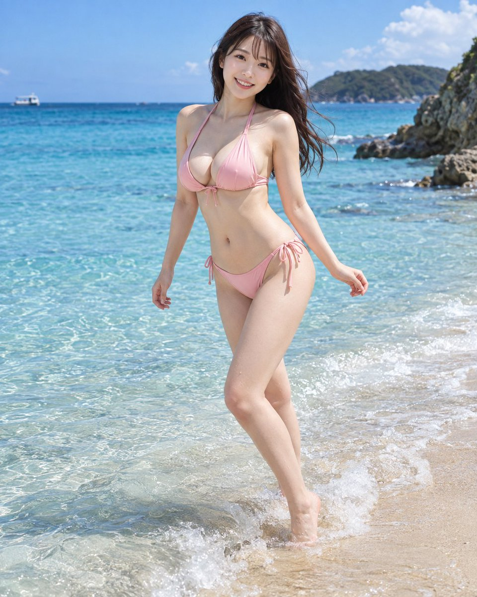

<a name="prompt-2098634812307476794"></a>

### 在夏日浅滩上身穿浅粉色比基尼的成年日本女性写实度假风时尚写真提示词。

作者：[@muse\_ai\_prompt](https://x.com/muse_ai_prompt) · [查看 X 原帖](https://x.com/muse_ai_prompt/status/2098634812307476794)

摄影 · 人像 / 自拍 · 角色 · 已推流

**概括:** 在夏日浅滩上身穿浅粉色比基尼的成年日本女性写实度假风时尚写真提示词。



**提示词**

```text
🌟夏日浅滩｜浅粉色比基尼与飞溅的浪花🌟

【主题·画风】
描绘一位盛夏透明海边、在细小海浪拍打到脚边的瞬间不由自主扭转身躯的明确成年的日本女性。以写实照片为基础，打造介于写真集与高雅度假广告之间、明亮洗练的时尚摄影作品。
重视捕捉对海浪与海风产生反应的自然瞬间动态，而非静止的摆拍姿态。清爽之中兼具女性的华美，在X（Twitter）的时间线上也极易因鲜明的色彩与表情引人注目。

【地点·背景·世界观】
地点为通向白沙滩的平缓浅滩。人物脚下是清澈见底的浅水，可清晰看见细腻的水纹、白色泡沫乃至水底浅色的沙粒。中景为从绿松石蓝过渡到深蓝的海面，远景自然分布着小型海岬与带有绿植的岩石。
背景不加入多余的建筑物或游客，保持宁静度假海滩特有的开阔感。前景融入海面的波光粼粼与浪花拍打的飞溅水花，营造出不仅能感受到人物、更能体会到海滨空间纵深感的画面。

【季节·时间·天气】
季节为盛夏。时间为上午10点至正午前后，太阳高悬、天空与大海色彩最为鲜艳的时段。接近晴空万里的蓝天，远方飘浮着少量白云。
气温温暖舒适，从海面吹来微弱而清爽的海风。发梢在微风中轻扬，水面也泛起细微的波纹。非强风或狂涛骇浪，而是表现为一个明朗宁静的夏日。

【人物设定】
20至28岁左右的明确成年的日本女性。拥有柔和端庄、具成年女性特质的容貌，略显大而自然的眼眸、温柔的眉毛与富有气色的双唇。暗棕色齐肩微卷发，保留被海风吹拂的自然发流与细小的碎发。肤色为明亮的赭石系偏白肤色，不过度均质磨皮，展现自然的红润气色与细腻阴影。
身形兼具娇细的肩膀、手脚及纤细的腰身，同时拥有女性优美曲线相互协调的自然丰满体态。胸部拥有明确丰满的大分量感，但绝不极度夸张，展现符合比基尼结构、姿势与重力法则的柔和立体感。臀部亦呈现与腰部自然衔接的柔和圆润线条。

【服装·配饰】
身穿浅粉色挂脖式比基尼。上身是系于颈后的细带，布料宽度适度且足以现实地支撑胸部，设计简约优雅。采用偏哑光的弹性泳衣材质，仅在浸湿的部分透出含蓄的光泽。
泳裤亦为同色系相配，自然贴合腰臀线条。布料不过度紧勒肉体或脱离悬空，保持现实的合身尺寸感。基本不佩戴饰品，以大海与服饰的色彩、人物的表情为绝对主角。

【姿势·动作·视线】
人物立于浅水中，以右腿为轴心支撑身体重心，左腿微向后撤，呈现正在避让拍打而来的小浪花的动作。腰部微向侧方旋转，上半身顺应动作自然微转，双肩向镜头方向适度展开。
双臂稍微离开身体两侧，一手自然向后、另一手向侧面轻展以保持平衡。手指放松自然展开。面部基本朝向镜头，视线落在镜头附近。非骨盆前倾或过度拧巴扭身，而是表现海浪来袭瞬间自然的重心移动。

【表情·情感】
表情带着仿佛在享受细浪突然涌至脚边、微带惊讶的明朗笑容。非仅嘴角翘起的笑，而是眼角温柔眯起、脸颊自然上扬。
给人一种正与拍摄者在海边共度欢乐时光的亲近感。不是刻板的模特摆拍笑容，而是运动过程中自然流露的生动表情。

【构图·相机】
适合X（Twitter）发布的4:5纵向画幅构图。头顶到脚尖自然收纳的全身拍摄，人物置于画面中心略偏右的位置。充分纳入脚下的飞溅浪花与海面，并展露背景的海平线与海岬。
机位与人物的腰至胸口高度大致齐平，从数米外距离拍摄。使用50至70mm左右的标准至中焦自然视角，避免广角镜头造成的手脚及身躯透视夸张畸变。背景轻度虚化，同时保留能够辨识为海滨的足够信息量。

【光线·色彩·质感·氛围】
主光源为从画面左上方洒入的明亮阳光。在面部、肩膀、手臂及泳装上形成柔和的高光，对侧则带有海面反射而来的微弱蓝白反光。阴影不沉入纯黑，维持夏日白天明快通透的影调层次。
肌肤呈现细腻阴影与自然红润，发丝展现根根流向与光泽，泳装呈现弹性织物的张力与克制的微湿感。海水具备透明感，沙滩呈现细腻的颗粒质感，飞溅的水花则具备瞬间凝固的光泽。以浅粉色、绿松石蓝、白色细沙为基调，营造爽朗华丽的夏日色调。

【品质·排除要素】
作为高分辨率写实照片，重视如同真实相机拍摄般的自然人体结构、光影、材质与透视感。
避免出现未成年特征或过幼面容、不自然人体结构、多余或缺失的手足及手指、不自然的关节、左右手混淆、服装破损或与肉体融合、非预期的走光暴露、过度骨盆前倾或身躯扭曲、极端广角畸变、过度磨皮假白。胸部保持丰满自然的分量感，不呈现过于庞大、坚硬球体状、异常挤压托高或违背重力的形态。画面中不包含任何文字、Logo、水印或UI界面。
```
