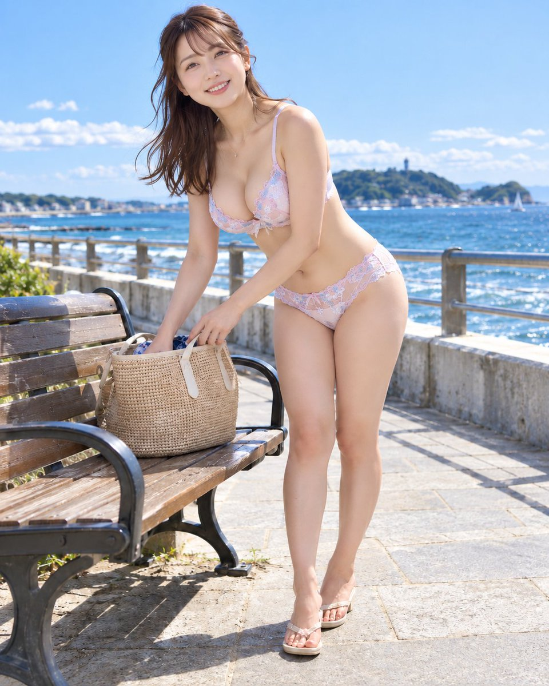

<a name="prompt-2104333251720667547"></a>

### 海滨步道长椅旁一边翻找草编包一边猛然绽开笑颜抬起头，身穿牛奶粉小花刺绣蕾丝内衣的日本女性高品质逼真写实人像摄影提示词。

作者：[@muse\_ai\_prompt](https://x.com/muse_ai_prompt) · [查看 X 原帖](https://x.com/muse_ai_prompt/status/2104333251720667547)

摄影 · 人像 / 自拍 · 角色 · 已推流

**概括:** 海滨步道长椅旁一边翻找草编包一边猛然绽开笑颜抬起头，身穿牛奶粉小花刺绣蕾丝内衣的日本女性高品质逼真写实人像摄影提示词。



**提示词**

```text
🌟在海边长椅旁猛然抬头，海风与牛奶粉的午后🌟

【主题・画风】  
描绘在海滨步道的长椅旁，正在翻找包包时察觉到恋人的气息而猛然抬起头的一瞬间。采用逼真写实风格，呈现出比手机或日常快照更为精致考究的写真集风格表现。  
打造兼具充满生活气息的自然举止、海滨特有的清爽感，以及高雅亲切的女性魅力的画面。

【地点・背景・世界观】  
午后海滨长椅旁。配置木质长椅、放在椅面上的草编包、石砌步道、低矮的栏杆，以及对面展开的蔚蓝大海与天空。  
背景在展现开阔的海滨风光的同时进行合理布局，确保主角人物不会被淹没。远景中克制地融入白色浪花、水平线与海边街景，增添明媚的度假氛围。

【季节・时间・天气】  
季节为初夏至盛夏的正午。空气明朗澄澈，海风惬意吹拂的晴朗天气。  
阳光不会过分刺眼，干爽的午间光线照亮整个场景。发丝与蕾丝边缘随风微微摆动，营造出柔和的动态感。

【人物设定】  
20至28岁左右明显已成年的日本女性。面容柔和端正，黑眼珠分明，眉形自然，唇色红润健康。齐肩的深棕色微卷发，几缕碎发在风中摇曳。  
肤色为明亮的健康小麦色调，不加过度修饰的自然质感。身材纤细中带着优美女性曲线的高雅自然微丰满体型。在保持纤细腰身与全身协调感的同时，胸部具有丰满而自然的体量感，与姿势和服装自然贴合，呈现出柔和的立体感。

【服装・配饰】  
以牛奶粉为底色，点缀有白色与浅水蓝色小花刺绣的华歌尔风格蕾丝文胸与内裤。精致的蕾丝包边与刺绣尽显高雅，甜而不腻且充满洁净感。  
布料剪裁合理，自然贴合身躯，胸部与腰臀部位皆舒适贴身，蕾丝与刺绣不会被拉扯拉伸或扭曲变形。配饰仅限精致小巧的项链，包包为天然材质的草编包。

【姿势・动作・视线】  
站在长椅旁，身体呈斜向前方向。重心略微放在右脚，左腿稍向前伸出并自然放松。上半身轻微前倾，保持正在找东西时的自然动作姿态。  
右手仍留在包内，左手轻扶包包边缘。犹如察觉到恋人呼唤的瞬间，手上动作停下，仅将脸猛然抬起看向镜头方向。避免不自然的骨盆前倾过屈或极端的身体扭曲。

【表情・情感】  
露出见到想见之人时如释重负般温和亲切的笑容。嘴角自然放松，呈露出少量牙齿的轻微微笑。  
眼底泛着安心感与一丝喜悦，神情既不过度惊讶也不刻意造作。作为发现恋人的日常一瞬，格外注重不造作的生活温度。

【构图・镜头】  
面向X发帖的4:5竖版构图。从头顶到脚尖留有适当余量的全身构图，呈现出能够清晰展现长椅、包包与手部位置关系的距离感。  
机位高度接近胸口至肩膀附近的自然高度，自略微斜前方拍摄。采用标准至中长焦段的自然视角，优先呈现不夸张身体比例的透视感。背景适当精简整理的同时，保留足以辨识海滨环境的信息。

【光线・色彩・质感・氛围】  
主光源为正午的阳光，从微斜上方照向人物。栏杆与路面的反射光柔和地提亮面部与手臂的阴影，并在肩部和脚下投下自然的影子。  
色调上，大海与天空的清爽蔚蓝、步道与长椅的天然质感，以及牛奶粉的服饰温和协调地融为一体。细致描摹肌肤的自然血色、发丝的柔韧流动、蕾丝的精致，以及木材、金属与水面各不相同的质感，烘托出明亮高雅且通透通爽的氛围。

【质量・负面排除要素】  
高分辨率，重视如同真实相机拍摄般的自然人体、透视感、光影与材质感。  
避免看似未成年人的表现、过于幼态的面容、不自然的身体、多余的肢体或手指、不自然的关节、服装破损破绽、身体与服装融合穿模、非预期的走光裸露、极端的广角畸变、过度磨皮美颜滤镜，以及文字、Logo、水印、UI界面等。胸部保持丰满自然的体量感，同时避免不自然的巨大化、坚硬球体状或过度的挤压托高。
```
