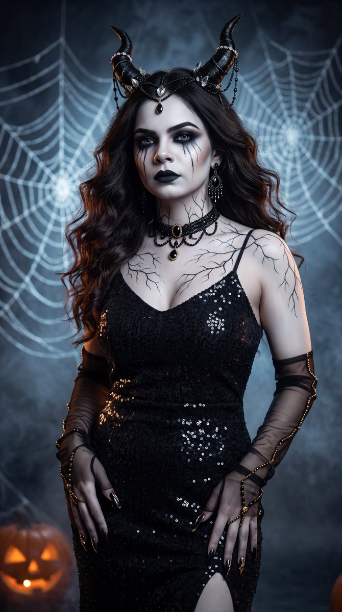
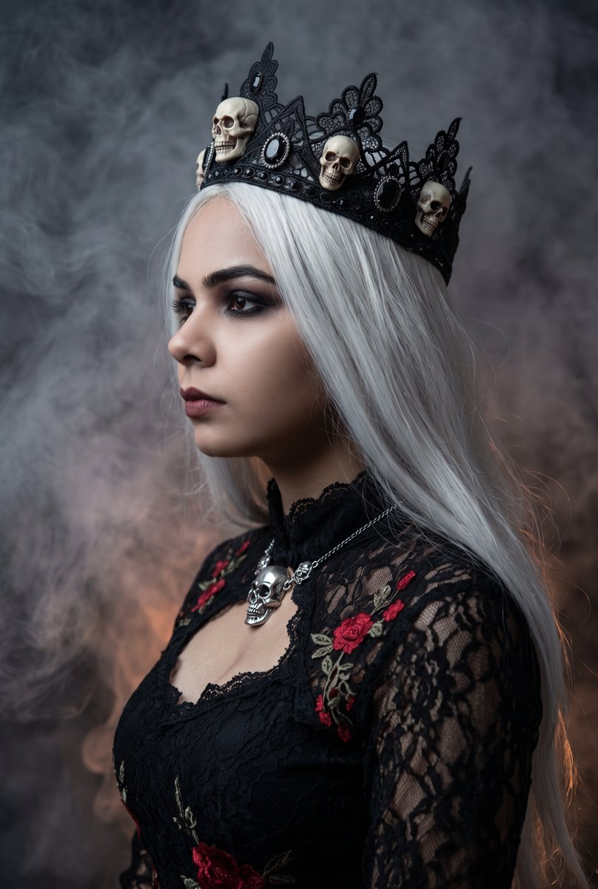

<a name="prompt-2104375790141850010"></a>

### 暗黑哥特肖像提示词，描绘了一位带有小角、发光蛛网和万圣节元素的蛛后巫女。

作者：[@runaroseee](https://x.com/runaroseee) · [查看 X 原帖](https://x.com/runaroseee/status/2104375790141850010)

人像 / 自拍 · 已推流

查看 X 原帖：[@runaroseee](https://x.com/runaroseee) · [查看 X 原帖](https://x.com/runaroseee/status/2100872958935789824)

**概括:** 暗黑哥特肖像提示词，描绘了一位带有小角、发光蛛网和万圣节元素的蛛后巫女。





**提示词**

```text
超精细的暗黑哥特风万圣节肖像，一位苍白的蛛后巫女，四分之三正面视角，站立姿态，双手自然下垂靠近臀部，手指微屈，浓密丰盈的长波浪黑褐色头发，头两侧饰有以闪亮水晶和珠子点缀的黑色小角状头饰，瓷白色肌肤，苍白如冰的双眼带着冷酷深邃的凝视，戏剧性的烟熏黑眼影搭配锋利的翼状眼线，细细的黑色泪痕从眼眶向下流淌，哑光黑色唇妆，黑色与水晶吊灯流苏耳环，带有大颗黑色宝石吊坠的闪烁黑珠颈圈，精致如静脉般的分支纹身蔓延在颈部、胸前和肩头，修长锋利的黑色细高跟甲，细肩带、心形领口及高开衩的黑色亮片礼服长裙，带有金色串珠细节的黑色薄纱露指长手套，暗黑背景覆盖着巨大发光的蜘蛛网，阴暗朦胧的夜雾氛围，角落里有一个散发微弱微光的橙色雕刻南瓜，冷冽的蓝灰月光色调伴随小面积温暖的橙色点缀，充满情绪张力的电影级光影，高对比度，浅景深，面部精准对焦，暗黑诡谲的童话美学，高级时尚大片摄影，8k，超写实 --ar 9:16
```
